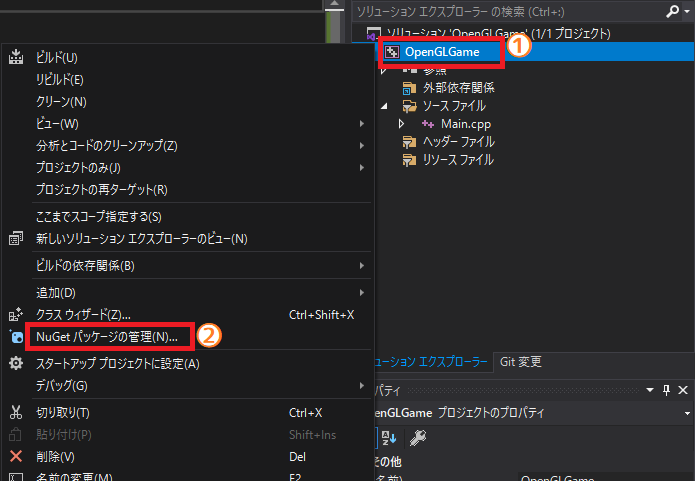

[OpenGL 3D 2020 第01回]

# プレリュードOpenGL

## 習得目標

* OpenGLとは何か
* ゼロからアプリケーションを作る方法
* OpenGLの初期化方法

## 1. OpenGLについて

### 1.1 習得する技術と作成するゲームについて

このテキストでは、3D空間でプレイヤーが射撃して敵を全滅させる、アクションシューティングゲームを作っていきます。全13回の授業を通じて、以下の技術の獲得を目指します。

* OpenGLの管理方法
* OpenGLを使った3Dモデルの管理と表示
* 障害物との衝突判定
* カメラの制御

<p align="center">
<br>
[作成するゲームのイメージ]
</p>

### 1.2 OpenGLとは

<p align="center">

</p>

OpenGL(オープン・ジーエル)は、クロノス・グループ(Khronos Group)というアメリカの非営利団体が策定しているコンピューターグラフィックスAPIです。<br>グラフィックスを扱うAPIとしては、他にDirectXというものもあります。しかし、DirectXは基本的にWindows専用です。対して、OpenGLはWindows以外にもmacOS、UNIX、Linux、FreeBSDなどさまざまな環境で使用できます。このようにさまざまな環境で動作することを「クロスプラットフォーム」と呼びます。

現在、OpenGLの最新バージョンは4.6(2020.3.20現在)です。OpenGLバージョン3.1において、それまで使われていた固定機能のグラフィックスAPIを全て捨て去り、「シェーダ」という機能を中心とした、より柔軟なグラフィックスAPIに一本化されました。それ以来、徐々に機能を改善・追加しつつ現在に至ります。

>**【参考】**<br>
>OpenGLの歴史 `https://www.khronos.org/opengl/wiki/History_of_OpenGL`

ただし、すべてのパソコンで最新バージョンが動作するわけではありません。すこし古いパソコンなどは3.3(2010年に策定)や4.3(2012年に策定)までしか対応していません。また、Macは2019年発売の機種でも4.1(2010年に策定)までしか対応していません。

本テキストでは、できるだけ最新の機能を使えるように、バージョン4.5(2014年に策定)を使用します。

### 1.3 表記について

本テキストでは、みなさんが実際に書き写す必要のあるプログラムは、次のように細い枠付きで示します。

```diff
 サンプルプログラム.
```

以前のサンプルプログラムに追加したり削除した部分がある場合、行頭にプラスまたはマイナスの記号を付けます。

```diff
-先頭にマイナス記号が付いているのは、削除する行です.
+プラス記号が付いているのは追加する行です.
 どちらも付いていない場合は変更しない行です.
```

また、書き写す必要のないサンプルプログラムや特記事項は、以下のように薄い水色の背景で示すことにします。

>これは書き写さない。

<div style="page-break-after: always"></div>

## 2. コンソールアプリケーションの作成

### 2.1 プロジェクトの作成

まず、OpenGLを動かすアプリケーションの雛形を作ります。OpenGLのプログラムは、この雛形の上に増築していくことになります。

Visual Studio 2019を起動してください。そして、右側のリストから「新しいプロジェクトの作成」をクリックしましょう。すると「新しいプロジェクトの作成」ウィンドウが開きます。

<p align="center">

</p>

プロジェクトテンプレートのリストから「空のプロジェクト」を選択します。「空のプロジェクト」では、Visual Studioは必要最小限のファイルとフォルダだけを作成します。ソースファイルやヘッダファイルは自分でプロジェクトに追加することになります。選択したら「次へ」をクリックしてください。

<p align="center">

</p>

すると、「新しいプロジェクトを構成します」というウィンドウに切り替わります。

<p align="center">

</p>

まず、これから作成するプロジェクトに名前をつけます(①)。プロジェクト名は、プロジェクトを格納するフォルダや、作成される実行ファイルの名前にも使われます。本テキストでは「OpenGL3DActionGame」としますが、好きな名前を付けてもらっても構いません。

次に、プロジェクトを保存する場所を決めます(②)。場所について気にしないのであれば、そのままで構いません。

その下に「ソリューションとプロジェクトを同じディレクトリに配置する」というチェックボックスがあると思います(③)。もしチェックがなかったら、クリックしてチェックを付けてください。

名前、場所、チェックボックスをもう一度確認してください。問題がなければ「作成」ボタンをクリックしてプロジェクトを作成しましょう(④)。

>**【What's ソリューション？】**<br>
>「ソリューション」は複数のプロジェクトをまとめて扱うための機能です。ソリューション用のフォルダを作ると、その中に複数のプロジェクト用フォルダを配置することができ、管理しやすくなります。しかし、ひとつのプロジェクトしか使わない場合、階層が増えて分かりにくくなるだけです。だから、今回はソリューション用フォルダを作成しません。

### 2.2 Main.cppを追加する

それでは、最初のソースファイルを追加していきましょう。Visual Studioの右側に「ソリューション エクスプローラー」パネルが開いていると思います。もし見つからないときは、メニューから「表示→ソリューション エクスプローラー」を選択して「ソリューション エクスプローラー」パネルを開いてください。

「ソースファイル」フィルターを右クリックして右クリックメニューを開き、「追加→新しい項目」を選択して「新しい項目の追加」ウィンドウを開きます。

<p align="center">

</p>

右側パネルは「Visual C++」、中央パネルは「C++ファイル(.cpp)」が選択された状態になっていると思います(①)。別の項目が選択されていた場合は、「Visual C++」「C++ファイル(.cpp)」をクリックして選択状態にして下さい。
次に、ウィンドウ下部の「名前」テキストボックスの内容を「Source.cpp」から「Main.cpp」に変更します(②)。さらに、「場所」テキストボックスの内容はプロジェクトのルートフォルダになっていると思います。これを「`プロジェクトのルートフォルダ\Src`」となるように変更しましょう(③)。

>D:\\Your\\Project\\Folder\\OpenGLTutorial\\<br>
>&emsp;&emsp;&emsp;&emsp;↓<br>
>D:\\Your\\Project\\Folder\\OpenGLTutorial`\Src\`

変更したら「追加」ボタンをクリックします。「ソリューション エクスプローラー」パネルに「Main.cpp」が追加されていることを確認して下さい。わざわざフォルダを作るのは、Visual Studioが勝手に追加したファイルと、自分の意思で追加したファイルを、簡単に区別できるようにするためです。

それでは、最初のプログラムを書いていきます。「Main.cpp」をダブルクリックして開き、次のプログラムを入力して下さい。

```diff
+/**
+* @file Main.cpp
+*/
+
+/**
+* エントリーポイント.
+*/
+int main()
+{
+  return 0;
+}
```

入力が終わったら、ツールバーの「ローカルWindowsデバッガー」をクリック(あるいはメニューから「デバッグ→デバッグの開始」をクリック)してビルド・起動してみましょう。正しく入力できていれば、出力ウィンドウに

`プログラム '[5956] OpenGL3DActionGame.exe' はコード 0 (0x0) で終了しました。`

のような文章が表示されると思います。成功したでしょうか？<br>おめでとうございます！<br>コンソールアプリケーションが作成できました！

エラーが表示された場合は、プログラムを確認・修正してもういちどビルド・起動して下さい。

### 2.3 リンカーの設定

続いて、OpenGLの基本的な関数を使えるようにします。Windowsでは、「リンカー」への入力に`opengl32.lib`(オープンジーエル・さんじゅうに・リブ)というファイルを追加することで、基本的な関数が使えるようになります。

>**【リンカーってなんだ？】**<br>
>プログラムのビルドは「コンパイル」と「リンク」の２つの工程に分かれています。まずソースプログラムがコンパイルされ、「オブジェクトファイル」というものが生成されます。次に、複数のオブジェクトファイルがリンクされて、ひとつの実行ファイルが作られます。コンパイルを担当する部分を「コンパイラ」、リンクを担当する部分を「リンカー」(または「リンカ」)といいます。

リンカーへの入力を設定するには`#pragma`(プラグマ)を使う方法と、「プロジェクトのプロパティ」を使う方法があります。前者のほうが簡単なので、今回はプラグマを使おうと思います。`Main.cpp`に次のプログラムを追加してください。

```diff
 /**
 * @file Main.cpp
 */
+#pragma comment(lib, "opengl32.lib")

 /**
 * エントリーポイント.
 */
```

>**【注意】** プラグマ行の末尾にセミコロンを書いてはいけません。

プラグマは環境固有のパラメーターをコンパイラに渡すための機能です。Windowsでは`comment`(コメント)と`lib`(リブ)を使って、

`comment(lib, ライブラリファイル名)`

のように指定することで、リンカー入力にファイルを追加することができます。

これでリンカーの設定は完了です。

### 2.4 使用するC++バージョンの設定

C++言語はその歴史の中で、何回かのバージョンアップが行われています。それぞれのバージョンは、それが成立した西暦の下位2桁を取って`C++17`(シー・プラス・プラス・セブンティーン、シープラプラ・じゅうなな)のように呼ばれます。

バージョンが上がるごとに便利な機能が追加されているので、できるだけ新しいバージョンを使うべきです。そこで、本テキストでは`C++17`を使うことにしました。

プログラムで使うバージョンの指定は「プロジェクトのプロパティ」から設定します。ソリューションエクスプローラーのプロジェクト名の上で右クリック(①)し、表示されたメニューの一番下にある「プロパティ」をクリックしてください(②)。

<p align="center">

</p>

すると「プロパティウィンドウ」が開きます。

<p align="center">

</p>

まず、ウィンドウ上部にある「構成」を「すべての構成」に変更します(①)。次にその右側にある「プラットフォーム」を「すべてのプラットフォーム」に変更します(②)。

左側のリストから「C/C++」を探し、項目名の左についている小さな`▷`をクリックして、サブ項目を表示しま(③)。そして、サブ項目の「言語」をクリックします(④)。すると右側の表示が変化するので、「C++言語標準」をクリックします(⑤)。

すると右端に「∨」アイコンが表示されるので、これをクリックしてバージョンリストを表示します(⑥)。バージョンリストにある「ISO C++17標準(/std:c++17)」をクリックします(⑦)。これでバージョンが選択されます。

最後にウィンドウ下部の「OK」ボタンをクリックします(⑧)。これで設定が反映されます。

<div style="page-break-after: always"></div>

## 3. <ruby>GLFW<rt>ジーエルエフダブリュー</rt></ruby>のインストール

### 3.1 OpenGLを初期化するには

OpenGLの初期化は次の2段階からなります

1. OpenGLコンテキストの作成
2. 関数アドレスの取得

この章では、1の「OpenGLコンテキストの作成」を行います。

### 3.2 OpenGLコンテキスト

「OpenGLコンテキスト」は、OpenGL実行におけるあらゆる状態を保持します。また、実行環境による差異を吸収する役割も持っています。とりあえず「非常に複雑で巨大な構造体」だと考えてください。

OpenGLコンテキストが保持する主な状態には、以下のようなデータがあります(この図に挙げた以外にも、描画に必要なありとあらゆる状態が含まれます)。

<p align="center">

</p>

さて、WindowsでOpenGLコンテキストを作成するにはwglCreateContext(ダブリュージーエル・クリエイト・コンテキスト)関数など、WGL関数群を使う方法があります。

先に「OpenGLはクロスプラットフォームなライブラリである」と説明しました。しかし、その初期化方法はプラットフォームごとに違っています。その理由は、ウィンドウの作成方法や画面に描画する方法がプラットフォームによって異なっているからです。OpenGLは共通のグラフィックス機能を提供するのが主な目的なので、初期化に関しては各プラットフォーム上で動作するOpenGL実装の提供者に一任されています。

せっかくのクロスプラットフォームライブラリなのに、環境によって違うプログラムを書かなければならない、というのはとても不便です。そう思った人は世の中に何人もいて、この問題をなんとかしてくれるとても便利なライブラリを作ってくれています。本テキストでも、そういったライブラリを使っていくことにします。

### 3.3 GLFWのインストール

OpenGLコンテキストを作成するライブラリには様々なものがありますが、今回は「GLFW(ジーエルエフダブリュー)」というものを選びました。理由は、Visual Studioの組み込まれている「NuGet(ニューゲット)」というツールを使えば、簡単にインストールできるからです。

また、GLFWにはOpenGLコンテキストの作成だけでなく、ウィンドウを制御したり、キーボード、マウス、ジョイスティックを扱う機能も用意されています。OpenGLの世界では広く使われているライブラリなので、Webで情報を検索する場合も、それほど苦労はしないと思います。

>**【参考】** GLFW公式サイト `https://www.glfw.org`

「NuGet(ニューゲット)」は、さまざまなライブラリを簡単にインストールできるツールです。Visual Studioに最初から組み込まれているので、すぐに使うことができます。GLFWのWebサイトからダウンロードして、手動でインストールすることもできますが、NuGetを使うほうが簡単ですし手間もかかりません。

まずは「NuGetパッケージ管理ウィンドウ」を開きましょう。まずは、ソリューションエクスプローラーのプロジェクト名の上にマウスカーソルを持っていってください。そこで右クリックしてメニューを表示します(①)。

<p align="center">

</p>

次に「NuGetパッケージの管理」という項目をクリックします(②)。すると、以下のようなパッケージ管理ウィンドウが開きます。

<p align="center">

</p>

NuGetでは、ライブラリやツールと、それをVisual Studioで使えるようにする手順をまとめたものを「パッケージ」と呼びます。

新しいパッケージをインストールするには、まず左上にある「参照」をクリックします(①)。すると、左ペインにずらっとパッケージのリストが並びます。どんどんスクロールさせていけば、glfwのパッケージを見つけられるはずなのですが、時間がかかりすぎます。

そこで、「参照」のすぐ下にある検索テキストボックスに`glfw`と入力してみてください(②)。すると、すぐ下にglfwに関連するパッケージがリストアップされます(表示されなかったら、入力した文字が`glfw`になっているか確認してくださいね)。「glfw」に関連するパッケージは結構ありますが、本テキストでは、パッケージ名に「glfw」とだけ書かれたパッケージを使います。

リストの最初にある`glfw`をクリックしてください(③)。すると、右側にパッケージの詳細が表示されます。詳細にある「インストール」ボタンをクリックしてください。そして、インストールが完了するまでしばらく待ちます。 「インストール」ボタンが「アンインストール」ボタンに変化し、パッケージアイコンの下に緑色のマークが表示されていたらインストール完了です。NuGetタブの「×」ボタンを押して、パッケージ管理ウィンドウを閉じてください。

>**【バージョン番号について】**<br>
>パッケージのバージョン番号はテキスト執筆時点のものです。画像と番号が違っていても、気にせずインストールしてください。

### 3.4 GLFWを初期化する

それでは、GLFWを使ってOpenGLコンテキストを作成していきましょう。しかし、そのまえに一度Visual Studioを終了し、プロジェクトを開き直してください。これによって、インストールしたライブラリの情報がVisual Studio(正確にはVisual StudioのIntelliSence)に読み込まれます。

まずは、`glfw3.h`というヘッダファイルをインクルードします。これをしないとGLFWライブラリの関数は使えません。ということで、`Main.cpp`に次のプログラムを追加してください。

```diff
 * @file Main.cpp
 */
+#include <GLFW/glfw3.h>
 #pragma comment(lib, "opengl32.lib")

 /**
 * エントリーポイント.
```

glfw3.hの`3`というのはGLFWのメジャーバージョンを示しています。<br>続いてGLFWを初期化しましょう。これには`glfwInit`関数を使います。main関数に次のプログラムを追加してください。

```diff
 int main()
 {
+  // GLFWの初期化.
+  if (glfwInit() != GLFW_TRUE) {
+    return 1;
+  }
+
   return 0;
 }
```

初期化に成功した場合は`GLFW_TRUE`(ジーエルエフダブリュー・トゥルー)が返されます。失敗した場合は`GLFW_FALSE`(ジーエルエフダブリュー・フォルス)が返されます。ですので、「戻り値が`GLFW_TRUE`でなければエラーとみなし、1を返して終了」というプログラムにしてみました。

>**【bool型について】**<br>
>`GLFW_TRUE`, `GLFW_FALSE`はC++でいうところの`true`, `false`です。ただ、旧来のC言語には`bool`型がないので、多くのライブラリは、ライブラリ固有の真偽値を定義しています。

ほとんどのGLFWの関数は、GLFWライブラリを初期化してからでないと使えません。そのため、`glfwInit`の呼び出しは事実上必須です。

### 3.5 描画ウィンドウを作成する

次は、描画用のウィンドウ(描画ウィンドウ)を作成します。OpenGLコンテキストを作成するには、OpenGL描画用の設定をしたウィンドウが必要だからです。既存のコンソールウィンドウには、エラーメッセージなどの文字情報を表示していきます。

描画ウィンドウを作成するには`glfwCreateWindow`(ジーエルエフダブリュー・クリエイト・ウィンドウ)関数を使います。また、作りたいウィンドウの詳細は`glfwWindowHint`(ジーエルエフダブリュー・ウィンドウ・ヒント)という関数で指定します。

GLFWを初期化するプログラムの下に、次のプログラムを追加してください。

```diff
   if (glfwInit() != GLFW_TRUE) {
     return 1;
   }
+
+  // 描画ウィンドウの作成.
+  glfwWindowHint(GLFW_OPENGL_PROFILE, GLFW_OPENGL_CORE_PROFILE);
+  glfwWindowHint(GLFW_OPENGL_FORWARD_COMPAT, GLFW_TRUE);
+  glfwWindowHint(GLFW_CONTEXT_VERSION_MAJOR, 4);
+  glfwWindowHint(GLFW_CONTEXT_VERSION_MINOR, 5);
+  glfwWindowHint(GLFW_OPENGL_DEBUG_CONTEXT, GLFW_TRUE);
+  GLFWwindow* window =
+    glfwCreateWindow(1280, 720, "OpenGL3DActionGame", nullptr, nullptr);
+  if (!window) {
+    glfwTerminate();
+    return 1;
+  }

   return 0;
 }
```

今回はOpenGLの基本設定、バージョンの指定、デバッグ機能の有効化をするために、以下の5つのヒントを使っています。

* <ruby>GLFW_OPENGL_PROFILE<rt>ジーエルエフダブリュー・オープンジーエル・プロファイル</rt></ruby><br>
  OpenGLには、現代的な機能のみをサポートする「コアプロファイル」と、古い(主にバージョン2以前の)機能も使える「互換プロファイル」の2つの基本設定があります。このヒントは、どのプロファイルを使用するかを指定します。<br>今回は古い機能は使わないので、コアプロファイルを指定しています。
* <ruby>GLFW_OPENGL_FORWARD_COMPAT<rt>ジーエルエフダブリュー・オープンジーエル・フォワード・コンパット</rt></ruby><br>
  前方互換性の有無を指定します。「前方互換性」というのは「近い未来のバージョンでも動作する保証がある」という意味です。前方互換性を「あり」にすると、現在非推奨とされた機能が使えなくなります。非推奨とされるのにはそれなりの理由があるので、使わないほうが無難です。そこで、今回は「前方互換性あり」、つまり`GLFW_TRUE`を指定しています。
* <ruby>GLFW_CONTEXT_VERSION_MAJOR<rt>ジーエルエフダブリュー・コンテキスト・バージョン・メジャー</rt></ruby><br>
  利用するOpenGLのメジャーバージョン(バージョン番号のドットの前側)を指定します。今回は4.5を使うので`4`を指定しています。
* <ruby>GLFW_CONTEXT_VERSION_MINOR<rt>ジーエルエフダブリュー・コンテキスト・バージョン・マイナー</rt></ruby><br>
  利用するOpenGLのマイナーバージョン(バージョン番号のドットの後ろ側)を指定します。今回は4.5を使うので`5`を指定しています。
* <ruby>GLFW_OPENGL_DEBUG_CONTEXT<rt>ジーエルエフダブリュー・オープンジーエル・デバッグ・コンテキスト</rt></ruby><br>
  `GLFW_TRUE`を指定すると、OpenGLのデバッグ支援機能が有効になります。この機能はバージョン4.3で追加されました。

>**【ウィンドウ作成時のヒントについて】**<br>
>くわしくは`https://www.glfw.org/docs/3.3/window_guide.html#window_hints`を参照してください。

`glfwCreateWindow`(ジーエルエフダブリュー・クリエイト・ウィンドウ)関数は、グラフィックス描画用のウィンドウを作成します。引数は、描画範囲の縦横のピクセル数、ウィンドウのタイトルバーに表示される文字列、そして、フルスクリーンモード用の2つのパラメータです。今回はウィンドウモードで実装を進めるため、フルスクリーンモード用のパラメータにはどちらも`nullptr`を渡しています。

この関数は、成功するとGLFWwindowオブジェクトへのポインタを返します。失敗すると`nullptr`を返します。そこで、`window`変数をチェックして、失敗した場合は`glfwTerminate`(ジーエルエフダブリュー・ターミネート)関数を呼び出して終了するようにしました。

`glfwTerminate`関数はGLFWを終了させます。`glfwInit`関数の呼び出しに成功した場合、アプリケーションを終了するまえに、必ずこの関数を呼び出さなければなりません。

### 3.6 OpenGLコンテキストを作成する

描画ウィンドウを作成したら、いよいよOpenGLコンテキストを作成します。といっても、やることは`glfwMakeContextCurrent`(ジーエルエフダブリュー・メイク・コンテキスト・カレント)関数を呼び出すだけです。この関数は、指定したウィンドウに対応するOpenGLコンテキストを作成します。

描画ウィンドウを作成するプログラムの下に、次のプログラムを追加してください。

```diff
   if (!window) {
     glfwTerminate();
     return 1;
   }
+  glfwMakeContextCurrent(window);

   return 0;
 }
```

これで、「OpenGLコンテキストの作成」は完了です。

### 3.7 メインループを作成する

Windowsのようなシステムでは、必要に迫られるまでは画面を一切書き換えない、というのが一般的です。一方、多くのゲームは、一定時間ごとに次々と画面を書き換えます。そのおかげで、ユーザー操作の結果が、即座に画面に反映されるのです。

これは、ユーザー操作、ゲーム状態の更新、ゲーム状態の描画、という処理を定期的に繰り返すことで実現されています。大抵のゲームのプログラムには、ゲームの基本的な処理を繰り返す部分が存在します。この部分のことを「メインループ」(あるいは「ゲームループ」)といいます。

C++の場合、メインループは`for`や`while`を使って作ることが多いです。

>**【メインループは無限ループ？】**<br>
>スーパーファミコンやゲームボーイアドバンスなどの古いゲーム機では、ゲームはリセットボタンを押すか電源を切るまで動き続けます。そのため、メインループは無限ループとして作られていました。しかし、現代のゲーム機では「終了する」が選ばれたときなどに、システム画面に戻れなくてはなりません。そのためには何らかの条件でループを終了させなければならないので、無限ループにはなりません。

GLFWライブラリを使う場合、メインループには`glfwPollEvents`(ジーエルエフダブリュー・ポール・イベンツ)と`glfwSwapBuffers`(ジーエルエフダブリュー・スワップ・バッファーズ)という2つの関数が含まれます。また、ループの終了条件として`glfwWindowShouldClose`(ジーエルエフダブリュー・ウィンドウ・シュッド・クローズ)の戻り値を使います。

それでは、OpenGLコンテキストを作成するプログラムの下に、次のプログラムを追加してください。

```diff
     glfwTerminate();
     return 1;
   }
   glfwMakeContextCurrent(window);
+
+  // メインループ.
+  while (!glfwWindowShouldClose(window)) {
+    glfwPollEvents();
+    glfwSwapBuffers(window);
+  }

  return 0;
}
```

`glfwWindowShouldClose`関数は、ウィンドウを閉じるべきかどうかを調べる関数です。名前のまんまですね。終了要求が来ていなければ0を、ユーザー操作などの結果、終了要求が来ていれば0以外を返します。GLFWで作成したウィンドウが1つだけなら、終了判定はこの関数を見るだけで十分です。

>**【複数のウィンドウを扱う場合】**<br>
>本テキストでは扱いませんが、もし複数のウィンドウを作成した場合は、最後のウィンドウ、あるいはメインウィンドウが閉じられたかどうかを判定する必要があるでしょう。

`glfwPollEvents`関数は、GLFWがOSから送られたイベントを処理するための関数です。GLFWでは、この関数を定期的に呼び出すか、あるいは`glfwWaitEvents`(ジーエルエフダブリュー・ウェイト・イベンツ)関数でイベントの発生を待機するか、いずれかの方法でOSからのイベントを処理する必要があります。<br>要するに、「ループ中に必ず呼び出さなければならない」ということです。

`glfwSwapBuffers`関数は、フレームバッファの表示側と描画側を入れ替えます。<br>「フレームバッファ」というのは絵を描画するためのメモリです。GLFWでは、2つのフレームバッファAとBを用意して、まずAを表示側、Bを描画側に設定します。Bの描画が終わったら、AとBの役割を交換して、Bを表示側、Aを描画側にします。コンピューターは今度はAに描画を行い、それが終わったら再びAとBの役割を交換し、Aを表示側、Bを描画側に戻します。これを繰り返すことで、描画中の画面をユーザーから隠しているわけです。

表示側のフレームバッファのことを「フロントバッファ」、描画側のフレームバッファのことを「バックバッファ」といいます。

### 3.8 GLFWを終了する

次に、GLFWの終了処理を追加します。メインループの下に、次のプログラムを追加してください。

```diff
     glfwPollEvents();
     glfwSwapBuffers(window);
   }
+
+  // GLFWの終了.
+  glfwTerminate();

   return 0;
 }
```

GLFWの終了処理は、先に使った`glfwTerminate`関数を呼び出すだけです。これでGLFWを使った最小限のOpenGLアプリケーションが完成しました。

プログラムが書けたらビルドして実行してください。コンソールウィンドウの他に、もうひとつ真っ黒なウィンドウが表示されたら成功です。「×」ボタンをクリックしてウィンドウを閉じてください。

<div style="page-break-after: always"></div>

## 4. 関数アドレスの取得(その1)

>**※この章の内容は少し難しいです。理解できなくても問題はないので、気にせず先に進んでください。**

### 4.1 OpenGLの関数について調べる

OpenGLコンテキストを作成した時点では、使えるOpenGLの機能はごくわずかです。使える機能を増やすには、使いたいOpenGL関数へのポインタをグラフィックス・ドライバなどから取得しなければなりません。

今回は、画面を消去する`glClear`(ジーエル・クリア)と、消去する色を指定する`glClearColor`(ジーエル・クリア・カラー)の2つを使えるようにします。

関数ポインタを取得するには`glfwGetProcAddress`(ジーエルエフダブリュー・ゲット・プロック・アドレス)関数を使用します。この関数にOpenGL関数名を渡すと、その名前に対応する関数ポインタを返してくれます。名前を間違えたり、指定したプロファイルでは使えないなど、対応する関数が見つからない場合はnullptrが返ってきます。

関数の名前と、関数へのポインタを定義するために必要となる引数や戻り値についての情報は、以下のURLで公開されています。webブラウザでこのページを開いてください。

`https://www.khronos.org/registry/OpenGL-Refpages/gl4/`

英語ばかりで気後れしそうですが、今のところは英語の文章に用はないので安心してください。ページを開いたら、左側の機能リストから`glClear`(ジーエル・クリア)を探してクリックしてください。

<p align="center">

</p>

`Name`に書かれているのは、関数の名前と、機能の簡単な説明です。そして、`C Specification`(シー・スペシフィケーション)の下、灰色の枠内に書かれているのが関数の戻り値や引数の情報です。

### 4.2 関数ポインタを格納する変数を定義する

それでは、これらの情報をもとに関数ポインタを作成しましょう。まず関数ポインタ型を定義し、次にその型の変数を定義します。OpenGLコンテキストの作成と、メインループのあいだに、次のプログラムを追加してください。

```diff
     glfwTerminate();
     return 1;
   }
   glfwMakeContextCurrent(window);
+
+  // OpenGL関数のアドレスを取得する.
+  using pfnglClear = void(GLAPIENTRY*)(GLbitfield);
+  pfnglClear glClear;

  // メインループ.
  while (!glfwWindowShouldClose(window)) {
    glfwPollEvents();
    glfwSwapBuffers(window);
```

`using`(ユージング)は、C++の機能の一つで、型や名前空間の別名を定義することができます。<br>C++では、関数ポインタ型は

`戻り値の型 (呼び出し方式 * 変数名)(引数型のリスト)`

の形式になります。ただ、この形式は書きづらいので、`using`で別名を定義して使うことが多いです。今回も、そのようにして`pfnglClear`という別名を定義しています。なお、`using`で別名を定義するときは「変数名」を書いてはいけません(書く意味がないのでルールで禁止されています)。

戻り値の型と引数の型は、さきほど開いたwebページの「関数の使い方」と全く同じにします。

関数の「呼び出し方式」に当たるのが`GLAPIENTRY`(ジーエル・エーピーアイ・エントリー)です。この部分はC++の機能ではなく、環境に依存するパラメーターになります。OpenGLの関数へのポインタを定義するときは、必ず呼び出し形式に`GLAPIENTRY`を指定しなければなりません。

関数ポインタ型の名前は`pfnglClear`(ピーエフエヌ・ジーエル・クリア)としました。この名前は、関数名`glClear`に、「関数へのポインタ」という意味の`Pointer to FuNction`を省略した`pfn`をくっつけたものです(この名前は適当に決めました。「これは関数ポインタ型だよ」ということがなんとなく伝われば十分なので)。そして、`pfnglClear`型の変数`glClear`を作っています。

### 4.3 関数ポインタを取得する

それでは、関数アドレスを取得し、変数に代入しましょう。`glClear`変数を定義する行を、次のように書き換えてください。

```diff
   // OpenGL関数のアドレスを取得する.
   using pfnglClear = void(GLAPIENTRY*)(GLbitfield);
-  pfnglClear glClear;
+  pfnglClear glClear =
+    reinterpret_cast<pfnglClear>(glfwGetProcAddress("glClear"));

  // メインループ.
  while (!glfwWindowShouldClose(window)) {
    glfwPollEvents();
    glfwSwapBuffers(window);
```

`glfwGetProcAddress`の戻り値の型は`void(GLAPIENTRY*)()`なので、`pfnglClear`とは型が合いません。そのため、キャストが必要になります。これで`glClear`関数が使えるようになりました。

>**【補足】**<br>
>関数名と関数ポインタ型が一致しない場合でも、ここで即座にエラーになることはありません。そのかわり、関数ポインタを使った瞬間に予測不可能なエラーが発生します。

### 4.4 glClearColorを使えるようにする

同様にして、`glClearColor`関数を使えるようにしていきます。webブラウザで`glClearColor`を検索して「使い方」確認しておいてください。

それでは関数ポインタを取得しましょう。`glClear`の関数ポインタを取得するプログラムの下に、次のプログラムを追加してください。

```diff
   using pfnglClear = void(GLAPIENTRY*)(GLbitfield);
   pfnglClear glClear =
     reinterpret_cast<pfnglClear>(glfwGetProcAddress("glClear"));
+  using pfnglClearColor =
+    void(GLAPIENTRY*)(GLfloat, GLfloat, GLfloat, GLfloat, GLfloat);
+  pfnglClearColor glClearColor =
+    reinterpret_cast<pfnglClearColor>(glfwGetProcAddress("glClearColor"));

  // メインループ.
  while (!glfwWindowShouldClose(window)) {
```

### 4.5 画面を消去する

それでは、2つの関数を使って、好きな色で画面を塗りつぶしてみましょう。メインループに次のプログラムを追加してください。

```diff
   // メインループ.
   while (!glfwWindowShouldClose(window)) {
+    glClearColor(0.1f, 0.3f, 0.5f, 1.0f);
+    glClear(GL_COLOR_BUFFER_BIT | GL_DEPTH_BUFFER_BIT);
     glfwPollEvents();
     glfwSwapBuffers(window);
   }
```

`glClearColor`関数は、`glClear`関数でバックバッファを消去するときに使われる色を指定します。引数はRGBAの各要素を0.0～1.0で表した値です。上記のプログラムでは暗い青色を指定しています。

`glClear`関数は、実際にバックバッファを消去する関数です。引数には、消去するバッファの種類を指定します。フレームバッファは色を表す「カラーバッファ」と奥行き情報を表す「深度バッファ」の2つがセットになっているので、消去するバッファを選べるようになっているのです。

カラーバッファを表すのが`GL_COLOR_BUFFER_BIT`(ジーエル・カラー・バッファ・ビット)で、深度バッファを表すのが`GL_DEPTH_BUFFER_BIT`(ジーエル・デプス・バッファ・ビット)です。

プログラムが書けたらビルドして実行してください。黒かった描画ウィンドウが青色になっていたら成功です。

<p align="center">

</p>

<pre class="tnmai_assignment">
<strong>【課題01】</strong>
描画ウィンドウを黄色(または好きな色)で塗りつぶしてください。
</pre>

<div style="page-break-after: always"></div>

## 5. <ruby>GLAD<rt>グラッド</rt></ruby>のダウンロード

### 5.1 GLADについて

4章では`glfwGetProcAdress`を使って関数アドレスを取得し、関数ポインタに代入して使用しました。

OpenGLのプログラムを書くには、この作業をアプリケーションで利用する全ての関数に対して行うのですが…、OpenGLで定義された関数は100個以上あるんです。実際に使う関数だけだとしても50近くになるでしょう。

そんなにたくさんの関数アドレスを取得するプログラムを書くのは非常に面倒です。しかもそれは、単なる作業でしかありません。そこで、この作業にも便利なライブラリを使っていくことにします。

OpenGLコンテキストを作成するライブラリにさまざまなものがあるように、OpenGLの関数アドレスを取得するライブラリも何種類も存在します。その中で、今回は`GLAD`(グラッド)というライブラリを使うことにしました。

`GLAD`の利点は、プロジェクトにソースファイルとヘッダファイルを追加するだけで使えることと、それらのファイルを簡単にwebから取得できることです。

>ダウンロードページ: `https://glad.dav1d.de/`<br>
>webサイト: `https://github.com/Dav1dde/glad`

webブラウザでダウンロードページを開いてください。以下のような画面が表示されると思います。

<p align="center">

</p>

### 5.2 GLADのダウンロード

`GLAD`のダウンロードページが表示されたら、まず`Specification`(スペシフィケーション)を「OpenGL」に設定します(①)(すでに設定されている場合はそのまま)。次に`API`(エーピーアイ)の`gl`(ジーエル)を「Version 4.5」に設定します(②)。最後に、`Profile`(プロファイル)を「Core」に設定します(③)。

3つの設定が済んだら、ページを下にスクロールさせます。以下のような項目が見えてくると思います。

<p align="center">

</p>

項目が見えたら`Generate a loader`(ジェネレート・ア・ローダー)にチェックが入っていることを確認します(①)(入っていなかったらチェックを入れてください)。そして、右下の`Generate`(ジェネレート)ボタンをクリックすると、以下のダウンロードページに切り替わります。

<p align="center">

</p>

`glad.zip`をクリックしてファイルをダウンロードしてください。ダウンロードしたら、みなさんのOpenGL3DActionGameプロジェクトの`Src`フォルダを開きます。そこに新しいフォルダを作成して`glad`という名前をつけてください。そして、glad.zipの中身をそのまま`glad`フォルダにコピーしてください。

### 5.3 GLADをプロジェクトに追加する

Visual Studioを開き、ソリューションエクスプローラーの「ソース ファイル」項目を右クリックして「コンテキストメニュー」を開いてください(①)。そして「追加→新しいフィルター」の順にクリックして新しいフィルターを追加してください(②、③)。

<p align="center">

</p>

フィルターを追加したら、そのフィルターの名前を`glad`に変更してください。

次に、Visual Studioの上にエクスプローラーを表示します。そして、エクスプローラーでプロジェクトの`Src`フォルダを開いてください。`glad`フォルダが見えていると思います。

その`glad`フォルダを、Visual Studioの`glad`フィルターへ「ドラッグ&ドロップ」してください。

<p align="center">

</p>

この操作によって、`glad`フォルダに含まれるすべてのファイルがプロジェクトに追加されます。コンテキストメニューの「追加」では、特定のフォルダの中にあるファイルしか選択できません。しかし、ドラッグ&ドロップなら、フォルダ単位でファイルを追加することができるわけです。

### 5.4 Visual Studioにヘッダファイルの場所を教える

現在、`GLAD`のヘッダファイルをインクルードしようとすると、

`#include "glad/include/glad/glad.h"`

のように書かなければなりません。さらに、`Src`フォルダ以外の場所にあるファイルの場合、その場所に応じてパスを調整する必要があります。このことは、「ファイルを移動するたびに、パスを修正しなければならない」ことを意味します。

これは実に不便です。さいわい、Visual Studioにはヘッダファイルの場所を指定できる機能があります。この機能を使えば、常に同じパスでヘッダファイルを指定できるようになります。

ソリューションエクスプローラーで、プロジェクト名を右クリックしてコンテキストメニューを開きます。そして、下の方にある「プロパティ」を選択して「プロパティウィンドウ」を開いてください。

<p align="center">

</p>

プロパティウィンドウを開いたら、以下の手順でインクルードディレクトリを追加してください。

1. 「構成」を「すべての構成」にする。
2. 「プラットフォーム」を「すべてのプラットフォーム」にする。
3. 左側のリストから「C/C++」をクリック。
4. 「C/C++」配下の「全般」をクリック。
5. 右側の「追加のインクルードディレクトリ」をクリック。
6. 右端に表示された「ｖ」アイコンをクリック。
7. 表示されたウィンドウの「<選択…>」をクリック。

上記の操作を行うと「追加のインクルードディレクトリ」というウィンドウが開きます。

<p align="center">

</p>

ウィンドウ上部のテキストボックスをクリックして、次のテキストを入力してください(①)。

`$(ProjectDir)Src\glad\include`

入力したら、「OK」ボタンをクリックしてウィンドウを閉じてください(②)。プロパティウィンドウに戻るので、プロパティウィンドウの「OK」ボタンをクリックして、このウィンドウも閉じてください。

この操作によって、ファイルの場所に関わらず、以下の書き方をすればGLADのヘッダファイルをインクルードできるようになります。

`#include <glad/glad.h>`

>**【補足】**<br>
>NuGetを使ったインストールでは、このインクルードディレクトリの追加も自動的にやってくれています。だから、`#include <GLFW/glfw3.h>`でインクルードできるわけです。

### 5.5 glad.hをインクルードする

それでは、GLADライブラリを使ってOpenGL関数を使えるようにしていきましょう。まずはGLADのヘッダファイルをインクルードします。`Main.cpp`の先頭に、次のプログラムを追加してください。

```diff
 /**
 * @file Main.cpp
 **/
+#include <glad/glad.h>
 #include <GLFW/glfw3.h>
 #pragma comment(lib, "opengl32.lib")
```

`glad.h`はGLADの機能を使うためのヘッダファイルです。なお、`glad.h`を最初にインクルードしているのには理由があります。OpenGLには`gl.h`という標準のヘッダファイルがあり、OpenGLを使うときはこれをインクルードしなければなりません。

しかし、このプログラムではそれをインクルードしていません。それでもプログラムが動いたのは、`glfw3.h`から間接的に`gl.h`がインクルードされているからです。

ところが、`gl.h`にはバージョン1.1までの定義しか書かれていません。だから`glad.h`で置き換える必要があるのですが、GLFWライブラリは間接的に`gl.h`をインクルードしてしまっています。

そこで、`glfw3.h`より先に`glad.h`をインクルードします。これによって、先に読み込まれる`glad.h`の定義が優先されて、`gl.h`の定義は無視されるようになります。

>**【インクルード順は自由であるべき】**<br>
>インクルード順を強制するのは、見つけにくいバグのもとになりやすいため、基本的には悪い習慣です。ヘッダファイルの設計する際は、インクルード順に依存することがないように心がけてください。一つの指針は、まず自分で書いたヘッダをインクルードし、次にライブラリのヘッダをインクルードすることです。<br>
>`gl.h`については、対応すべき環境が増えすぎたからなのか、バージョン1.2以降のヘッダファイルが提供されていません。これはどうしようもないので、必ず最初に`glad.h`をインクルードするように気をつけるほかありません。

### 5.6 関数アドレスを取得する

それでは、`GLAD`ライブラリを使って関数アドレスを取得しましょう。関数アドレスを取得するプログラムを、次のように書き換えてください。

```diff
   glfwMakeContextCurrent(window);

   // OpenGL関数のアドレスを取得する.
-  using pfnglClear = void(GLAPIENTRY*)(GLbitfield);
-  pfnglClear glClear =
-    reinterpret_cast<pfnglClear>(glfwGetProcAddress("glClear"));
-  using pfnglClearColor =
-    void(GLAPIENTRY*)(GLfloat, GLfloat, GLfloat, GLfloat, GLfloat);
-  pfnglClearColor glClearColor =
-    reinterpret_cast<pfnglClearColor>(glfwGetProcAddress("glClearColor"));
+  if (!gladLoadGLLoader(reinterpret_cast<GLADloadproc>(glfwGetProcAddress))) {
+    glfwTerminate();
+    return 1;
+  }

  // メインループ.
  while (!glfwWindowShouldClose(window)) {
```

関数アドレスを取得するには`gladLoadGLLoader`(グラッド・ロード・ジーエル・ローダー)関数を使います。引数には取得に使う関数を指定します。ライブラリが異なると関数の型も微妙に違ってくるため、`reinterpret_cast`を使って`GLAD`ライブラリが理解できる型にキャストして渡しているのがポイントです。

プログラムが書けたらビルドして実行してください。エラーが起こらず、アプリケーションが実行できれば成功です。関数アドレスの取得方法を変えただけなので、見た目の違いはありません。

<div style="page-break-after: always"></div>

## 6. エラー処理

### 6.1 コールバックという仕組み

古いOpenGLでは、エラーを調べるには明示的に`glGetError`(ジーエル・ゲット・エラー)関数を呼び出す必要がありました。しかし、OpenGLのバージョン4.3から、「コールバック」という仕組みでエラーを通知する機能が追加されました。

「コールバック」は、事前に関数を登録しておくと、何らかの条件によって、登録した関数が呼び出される、という仕組みです。

### 6.2 コールバック関数を作る

コールバックによって呼び出される関数のことを「コールバック関数」といいます。コールバックの仕組みを利用するには、まずコールバック関数を定義しなくてはなりません。`Main.cpp`に次のプログラムを追加してください。

```diff
 #include <glad/glad.h>
 #include <GLFW/glfw3.h>
+#include <string>
+#include <iostream>
 #pragma comment(lib, "opengl32.lib")
+
+/**
+* OpenGLからのメッセージを処理する.
+*
+* @param source    メッセージの発信者(OpenGL、Windows、シェーダーなど).
+* @param type      メッセージの種類(エラー、警告など).
+* @param id        メッセージを一位に識別する値.
+* @param severity  メッセージの重要度(高、中、低、最低).
+* @param length    メッセージの文字数. 負数ならメッセージは0終端されている.
+* @param message   メッセージ本体.
+* @param userParam コールバック設定時に指定したポインタ.
+*/
+void GLAPIENTRY DebugCallback(GLenum source, GLenum type, GLuint id, GLenum severity, GLsizei length, const GLchar* message, const void* userParam)
+{
+  if (length < 0) {
+    std::cerr << message << "\n";
+  } else {
+    const std::string s(message, message + length);
+    std::cerr << s << "\n";
+  }
+}

 /**
 * エントリーポイント.
```

この関数は、OpenGLから渡されたメッセージを標準エラー出力に表示します。とりあえず、message以外の引数は使いません。メッセージの扱いに慣れてきたら、「重要度の高いメッセージだけ表示する」などの改造をしてみるとよいでしょう。

`GLenum`(ジーエル・イーナム)や`GLuint`(ジーエル・ユー・イント)、`GLsizei`(ジーエル・サイズ・アイ)といった、頭に`GL`のつく型は、OpenGLで定義されている型です。C/C++の標準の型は、環境によって定義が異なります。そこで、OpenGLは独自の型を用意して、どの環境でも同じプログラムが動くようにしているのです。マウスカーソルを型名の上に持ってくると、実際の型が表示されます。参考にしてください。

>**【OpenGLのデバッグコールバックについて】**<br>
>詳しくは`https://www.khronos.org/opengl/wiki/Debug_Output`を参照してください.

### 6.4 コールバック関数を登録する

次に、`DebugCallback`関数をOpenGLのコールバック関数として登録します。コールバック関数の登録には`glDebugMessageCallback`(ジーエル・デバッグ・メッセージ・コールバック)関数を使います。OpenGL関数のアドレスを取得するプログラムの下に、次のプログラムを追加してください。

```diff
   if (!gladLoadGLLoader(reinterpret_cast<GLADloadproc>(glfwGetProcAddress))) {
     glfwTerminate();
     return 1;
   }
+
+  glDebugMessageCallback(DebugCallback, nullptr);

  // メインループ.
  while (!glfwWindowShouldClose(window)) {
```

`glDebugMessageCallback`の最初の引数は「呼び出す関数のアドレス」です。そして2番目の引数は「関数のuserParam引数に渡される値」です。今回は特に渡すものがないので`nullptr`を指定しています。

なお、この関数はバージョン4.3で追加されたものです。そのため、関数アドレスを取得してからでないと使えません。

これで、エラーや不具合があったときは、その原因がすぐにコンソールウィンドウに表示されるようになりました。

### 6.5 わざとエラーを起こしてみる

コールバックが正しく働いていることを確かめてみましょう。簡単な方法は、削除または非推奨とされた関数を実行することです。ということで、コールバック関数を登録するプログラムの下に、次のプログラムを追加してください。

```diff
   glDebugMessageCallback(DebugCallback, nullptr);
+
+  glDrawElements(GL_LINES, 0, 0, nullptr);

   // メインループ.
  while (!glfwWindowShouldClose(window)) {
```

`glDrawElements`(ジーエル・ドロー・エレメンツ)はポリゴンを描画する関数です。しかし、ちゃんと準備してからでなければ使えません。

プログラムが書けたらビルドして実行してください。コンソールウィンドウにメッセージが表示されていたら成功です。コールバックが動作していることを確認したら、`glDrawElements`は削除してください。

```diff
   glDebugMessageCallback(DebugCallback, nullptr);
-
-  glDrawElements(GL_LINES, 0, 0, nullptr);

   // メインループ.
  while (!glfwWindowShouldClose(window)) {
```

これで本テキストは終了です。
