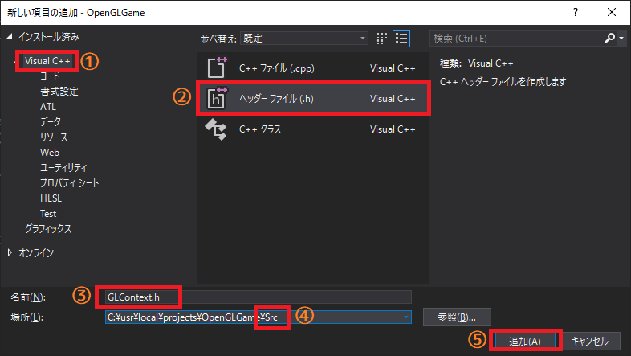
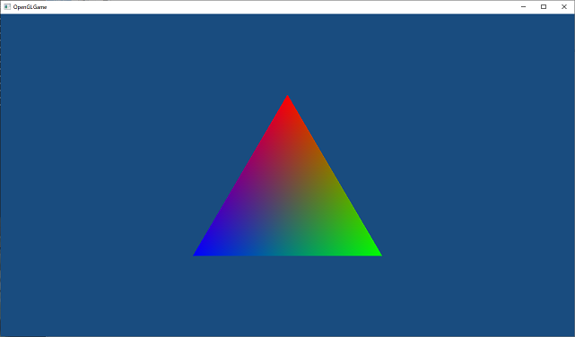

[OpenGL 3D 2020 第02回]

# グラフィックス・パイプラインとシェーダー

## 習得目標

* バッファ・オブジェクト、バーテックス・アレイ・オブジェクトの作成方法
* GLSLの基本的な知識
* プログラム・オブジェクト、パイプライン・オブジェクトの作成方法
* 上記を使用して図形を描画する方法

## 1. グラフィックスを生み出す図形たち

### 1.1 プリミティブ(Primitive)

前回はOpenGLの初期化を行い、背景色を設定しました。今回は、OpenGLによる図形の描画について説明していきます。まずは、OpenGLがどんなものを描画できるのかを見てみましょう。現在、OpenGLが描画できるのは、次に示す7つの図形です。

<div style="text-align: center;width: 100%;">

</div>

* `GL_POINTS`(ジーエル・ポインツ)：　点の集まりです。
* `GL_LINES`(ジーエル・ラインズ)：　直線の集まりです。
* `GL_LINE_STRIP`(ジーエル・ライン・ストリップ)：　連続した直線です。
* `GL_LINE_LOOP`(ジーエル・ライン・ループ)：　`GL_LINE_STRIP`の最初と最後の点の間にも直線が引かれます。
* `GL_TRIANGLES`(ジーエル・トライアングルズ)：　三角形の集まりです。
* `GL_TRIANGLE_STRIP`(ジーエル・トライアングル・ストリップ)<br>`GL_TRIANGLE_FAN`(ジーエル・トライアングル・ファン)：　どちらも連続した三角形の集まりですが、それぞれ描き方が異なります。

これらの図形のことを「プリミティブ(Primitive)」と呼びます。プリミティブというのは「原型、原始的」という意味の英単語です。この7種類で表現できない形状は、プリミティブ組み合わせて作ります。あらゆる図形の原型となる形状だから「プリミティブ」という名前が付けられているのです。

>**【消えた四角形・多角形プリミティブ】**<br>OpenGL 3.0以前は、四角形を表す`GL_QUADS`(ジーエル・クアッズ)や、多角形を表す`GL_POLYGON`(ジーエル・ポリゴン)といったプリミティブがありました。しかし、それらはより基本的な形状で再現が可能なため、バージョン3.1において削除されました。<br>他に「隣接頂点付きプリミティブ」というプリミティブもあるのですが、「ジオメトリシェーダー」専用なので、本テキストでは扱いません。

このうち、現在もっともよく使われている図形は`GL_TRIANGLES`です。というのも、このプリミティブだけであらゆる図形を表現できるからです。現代の多くのGPUは、`GL_TRIANGLES`を特に効率的に処理できるように作られています。

>**【昔のGL_TRIANGLESは日陰者だった！？】**<br>世界がPS2、ゲームキューブ、XBOXで覆われていた古代、プリミティブの王者は`GL_TRIANGLE_STRIP`でした。その頃の`GL_TRIANGLES`はマイナーで非効率なプリミティブに過ぎませんでした。しかし、GPUの進化スピードは圧倒的で、わずか1世代で彼らの立場は逆転してしまいました。今ではあえて `GL_TRIANGLE_STRIP` や `GL_TRIANGLE_FAN`を使おうとする者はいません。

### 1.2 <ruby>頂点<rt>ちょうてん</rt></ruby>(Vertex)

プリミティブを構成する点のことを「頂点(Vertex(バーテックス))」といいます。そして、頂点の座標や色などのパラメータの集合を「頂点データ」といいます。ゲームのキャラクターや背景のほとんどは、どんなに複雑な形状であっても、これらのプリミティブを組み合わせることで描画されています。

また、同じ頂点データであっても、プリミティブを変えることで異なる図形を描画することができます。

<div style="page-break-after: always"></div>

## 2. グラフィックス・パイプライン

### 2.1 グラフィックス・パイプラインの概要

OpenGLはプリミティブを描画することできる、ということが分かりました。早速描画しよう！となるところですが、その前に、OpenGLがどのような手順でプリミティブを描画するのかを説明しましょう。

OpenGLの描画は、それぞれが異なる処理を行う「ステージ」という単位に分けられています。ステージが順番に実行されることで、最終的にレンダー・バッファ(Render Buffer。描画した画像を格納するメモリ上の領域)にプリミティブが描画されます。

この、「ステージが順番に実行される仕組み」のことを「グラフィックス・パイプライン」と呼びます。グラフィックス・パイプラインは次のような構造になっています。

<div style="text-align: center;width: 100%;">

</div>

「石油パイプライン」という言葉を聞いたことがあるでしょうか。金属製の筒(つつ)を、線のように長くつないだもので、石油はこの中を通って、ある地点から別の地点へと運ばれていきます。グラフィックス・パイプラインは名前の通り、石油ではなく画像を運びます。

石油パイプラインと違うところは、画像がパイプラインの中を進んでいくごとに、少しずつ加工されていく点です。自動車工場なんかで製品がベルトコンベアの上を流れていって、それをちょっとずつ組み立てていく「ライン生産方式」のほうが、イメージとしては近いでしょう。

### 2.2 <ruby>Vertex Puller<rt>バーテックス・プラー</rt></ruby>(VP)

ここからは、パイプラインの動作を順番に説明します。VP(バーテックス・プラー)はグラフィックス・パイプラインの最初のステージです。VPはGPUメモリからひとつずつ頂点データを取り出し、Vertex  Shaderステージへ渡します。取り出されるのは頂点データのうちVertex Shaderが実際に必要とする情報だけです。どの情報を取り出せばいいかは、「頂点アトリビュート」というパラメーターで設定します。

>**【補足】**<br>Vertex(ばーてっくす)は「頂点」という意味で、Pull(ぷる)は「引っ張る」という意味です。つまり、Vertex Pull-erは「頂点データを引っ張り出す装置」といった意味合いになります。

### 2.3 <ruby>Vertex Shader<rt>バーテックス・シェーダー</rt></ruby>(VS)

VS(バーテックス・シェーダー)は最初のプログラム可能なステージです。VPで読み取られた全ての頂点データは、最初にこのステージで処理されます。VSでは、プリミティブの回転、拡大縮小、移動のほか、座標系の変換、頂点単位のライティングなど、様々な操作を行うことができます。VSは省略できません。

>**【補足】**<br>Shade(しぇーど)は「光を遮る、陰影を付ける」という意味です。ですから、Shade-rは「陰影を付ける装置」といった意味になります。

### 2.4 <ruby>Tessellation Control Shader<rt>テッセレーション・コントロール・シェーダー</rt></ruby>(TCS)

TCS(テッセレーション・コントロール・シェーダー)は「テッセレーション」ステージの最初のステージです。テッセレーション・ステージは3つのステージで構成され、共同で「テッセレーション」と呼ばれる処理を行います。テッセレーションは「同じ模様を隙間なく敷き詰める」という意味の単語です。コンピューター・グラフィックスの世界では「描画する画像に細かなディテールを加えるために、プリミティブをより多くの小さなプリミティブに分割する」操作のことを指します。

基本的な使い方は、頂点データを低ポリゴンモデルにしておき、テッセレーション・ステージで高ポリゴンモデルを生成する、というものです。頂点データは低ポリゴンモデルのみ用意すればいいので、GPUメモリを節約できます。

TCSは、新たに作成する小さなプリミティブの頂点データを、どこに、どのように作成するかを指定する作業を担当します。TCSはVSと同様にプログラム可能なステージです。テッセレーション・ステージは省略可能ですが、3つのステージはセットで扱われるため、3つ全てを使用するか、全て省略するかのいずれかになります。

本テキストではテッセレーションについては扱いません。そのため、TCSについてもこれ以上詳細な説明はしませんが、このようなステージがあるということは覚えておいてください。

### 2.5 <ruby>Tessellation Primitive Generation<rt>テッセレーション・プリミティブ・ジェネレーター</rt></ruby>(TPG)

TPG(テッセレーション・プリミティブ・ジェネレーション)は「テッセレーション」ステージの2番目のステージです。これはVPと同じく固定機能のステージです。TPGはTCSからの情報を受け取り、実際に小さなプリミティブへと分割し、最後のテッセレーション：ステージであるTESへと送ります。

### 2.6 <ruby>Tessellation Evaluation Shader<rt>テッセレーション・エバリュエーション・シェーダー</rt></ruby>(TES)

TES(テッセレーション・エバリュエーション・シェーダー)は最後の「テッセレーション」ステージです。TESはTCS同様にプログラム可能なステージで、TPGから受け取ったプリミティブの座標や色を変形し、実際に複雑なディテールを加える役割を持ちます。

### 2.7 <ruby>Geometry Shader<rt>ジオメトリ・シェーダー</rt>(GS)

GS(ジオメトリ・シェーダー)は、ひとつのプリミティブの全頂点データを受け取り、0個以上のプリミティブの頂点データを生成して後段のステージへ送ります。プリミティブを増やすという点は「テッセレーション」ステージと似ていますが、このステージの特徴は、頂点を増やすだけでなく、削除もできることです。

テッセレーションは「元のプリミティブを分割する」という処理に最適化され、大量のプリミティブを生成するのに向いているのに対して、GSは「プリミティブの頂点データから別のプリミティブを生成する、あるいは削除する」という、比較的小規模かつ汎用的な処理を得意とします。

GSはプログラム可能なステージです。また、テッセレーション・ステージと同様に省略することができます。GSはパーティクルの描画や輪郭線の生成など、様々な用途で使われています。本テキストではGSは扱いません。

### 2.8 <ruby>Primitive Assembly<rt>プリミティブ・アセンブリ</rt></ruby>(PA)

PA(プリミティブ・アセンブリ)は、前段のステージで変換された1つ以上の頂点データを蓄積し、プリミティブを構成できる数になった段階で、まとめて次のステージへ渡します。例えば`GL_TRIANGLES`の場合は3つです。PAは固定機能のステージです。

### 2.9 <ruby>Rasterization<rt>ラスタライゼーション</rt></ruby>(RS)

RS(ラスタライゼーション)は、PAから送られたプリミティブをもとにフラグメントと呼ばれるピクセル片を生成し、後段のFragment Shaderへと送ります。RSは固定機能ステージです。各フラグメントは2～3つの頂点データを補間した値を持ちます。

RSはまた、裏向きのプリミティブを除去したり(カリングといいます)、プリミティブの画面に表示されない部分を切り捨てたり (クリッピングといいます) します。また、RSは「ビューポート」というパラメータを使って、「クリッピング空間」から「スクリーン空間」への変換を行います。これらについては今後のテキストで説明します。

### 2.10 <ruby>Fargment Shader<rt>フラグメント・シェーダー</rt></ruby>(FS)

FS(フラグメント・シェーダー)は最後のプログラム可能なステージで、RSより送られてきたフラグメントから、実際の色を計算します。VSがひとつの頂点データを受けとり、ひとつの頂点を送り出すように、FSもひとつのフラグメントを受け取り、ひとつの色を送り出します。FSは主に、フラグメント単位のライティングを行うために使用されます。

>**【補足】**<br>Fragment(ふらぐめんと)は「破片、断片」という意味です。OpenGLにおける「Fragment」とは、RSがプリミティブを分解したあとの、ピクセル単位の個々の領域を指す単語です。

### 2.11 <ruby>Per-Fragment Operations<rt>パー・フラグメント・オペレーション</rt></ruby>(PFO)

PFO(パー・フラグメント・オペレーションズ)はグラフィックス・パイプラインの最後のステージです。PFOは固定機能のステージで、FSから送られてきた色情報と深度情報を「レンダー・バッファ」や「デプス・バッファ」、「ステンシル・バッファ」と呼ばれるメモリ上の領域に書き込んでくれます。

PFOはまた、FSからの色情報とレンダー・バッファの色を、さまざまな方法で合成する機能も備えています。このステージの結果が、レンダー・バッファに書き込まれることになります。

### 2.12 この章のまとめ

OpenGLでは、グラフィックス・パイプラインに頂点データや座標変換行列などのパラメータを送り込むことで、プリミティブを描画します。また、グラフィックス・パイプラインのパラメータを変えることで、同じ頂点データでも異なる表現を行うことが可能です。本テキストでは、実際に頂点シェーダーとフラグメントシェーダーのプログラムを作成してもらいます。

<div style="page-break-after: always"></div>

## 3. 頂点バッファ

### 3.1 <ruby>GLContext<rt>ジーエル・コンテキスト</rt></ruby>名前空間を定義する

プリミティブの描画は以下の手順で行います。

1. 「バッファ・オブジェクト」を作成し、頂点データを格納する。
2. 「バーテックス・アレイ・オブジェクト」を作成し、頂点データをグラフィックス・パイプラインに接続する。
3. シェーダー・コードから「プログラム・オブジェクト」を作成する。
4. 「パイプライン・オブジェクト」を作成し、シェーダーをグラフィックス・パイプラインに接続する。
5. 「バーテックス・アレイ・オブジェクト」と「パイプライン・オブジェクト」を使って図形を描画する。

基本的にOpenGLのすべての機能は、直接または間接にOpenGLコンテキストと関わっています。そこで、本テキストでは`GLContext`(ジーエル・コンテキスト)という名前空間を作成し、上記の手順に必要な関数やクラスはすべてこの名前空間内に定義することにします。

なんでも`Main.cpp`に書いてしまうと、必要な関数やクラスが見つけにくくなってしまいます。ですから、`GLContext`名前空間用のファイルを追加しましょう。「ソリューションエクスプローラー」の「ソースファイル」を右クリックし、「追加→新しい項目」と選択して「新しい項目の追加」ウィンドウを開いてください。

<div style="text-align: center;width: 100%;">

</div>

左側のリストの`Visual C++`をクリックし(①)、次に中央のリストの`ヘッダーファイル(.h)`をクリックします(②)。そして、「名前」テキストボックスに`GLContext.h`と入力してください(③)。次に、「場所」テキストボックスの内容が`プロジェクトのパス\Src`となるように、末尾に`\Src`を加えてください。既に付いている場合は何もしなくて結構です(④)。

①～④が正しく指定できていることを確認したら、「追加」ボタンをクリックします(⑤)。これでヘッダファイルが追加されました。

ソリューションエクスプローラーから`GLContext.h`を選択して開いてください。そして、そこに以下のプログラムを追加してください(`#pragma once`は消してください)。

```diff
+/**
+* @file GLContext.h
+**/
+#ifndef GLCONTEXT_H_INCLUDED
+#define GLCONTEXT_H_INCLUDED
+#include <glad/glad.h>
+
+namespace GLContext {
+
+} // namespace GLContext
+
+#endif // GLCONTEXT_H_INCLUDED
+
```

さらに、`GLContext.cpp`を追加しましょう。`GLContext.h`のときと同じ手順で「新しい項目の追加」ウィンドウを開きます。今度は中央のリストから`C++ファイル(.cpp)`を選択し、名前欄に`GLContext.cpp`と入力してください。場所が`プロジェクトのパス\Src`となっていることを確認したら、「追加」ボタンをクリックしてください。

「ソリューションエクスプローラー」から`GLContext.cpp`を開き、次のプログラムを追加してください。

```diff
+/**
+* @file GLContext.cpp
+*/
+#include "GLContext.h"
+
+/**
+* OpenGLコンテキストに関する機能を格納する名前空間.
+*/
+namespace GLContext {
+
+} // namespace GLContext
+
```

### 3.2 <ruby>Vertex Buffer Object<rt>バーテックス・バッファ・オブジェクト</rt></ruby>(VBO)を作成する

全てのプリミティブは頂点の集まりです。1章の図で、番号の振られた点のひとつひとつが頂点です。プリミティブを描画するためには、まず頂点のデータ構造を設計し、その構造に従って頂点データを用意しなければなりません。

前述のとおり、OpenGLのプリミティブの種類は限定されています。そのかわり、頂点を定義するためのデータ構造は、ある程度自由に設計できるようになっています。各頂点には少なくとも16個のパラメータを割り当てることができます。それぞれのデータは8bitから64bitまでの様々な型を使えます。

頂点データはこの情報に従ってグラフィックス・パイプラインへと送られます。そしてバーテックス・プラーが必要なデータだけを取り出して、次のステージへと送り出します。

頂点データを格納するオブジェクトのことを`Vertex Buffer Object`(VBO, バーテックス・バッファ・オブジェクト)といいます。`VBO`はGPUメモリに作られる「バッファ・オブジェクト(データを格納するメモリ上の領域)」の一種です。

VBOを作成するには、`glCreateBuffers`(ジーエル・クリエイト・バッファーズ)と`glNamedBufferData`(ジーエル・ネームド・バッファ・データ)を使います。これらをVBOを作成する関数としてまとめましょう。名前は`CreateBuffer`(クリエイト・バッファ)とします。`GLContext.h`を開き、次のプログラムを追加してください。

```diff
 #define GLCONTEXT_H_INCLUDED
 #include <glad/glad.h>

 namespace GLContext {
+
+GLuint CreateBuffer(GLsizeiptr size, const GLvoid* data);

 } // namespace GLContext

 #endif // GLCONTEXT_H_INCLUDED
```

`GLsizeiptr`(ジーエル・サイズ・アイ・ポインタ)や`GLvoid`(ジーエル・ボイド)、`GLuint`(ジーエル・ユー・イント)は、`glad.h`においてtypedef宣言されている型です。x86環境では、それぞれC++の`int`、`void`、`unsigined int`と同じ意味を持ちます。しかし、他の環境では異なる宣言になっている可能性があります。

というのも、OpenGLではパラメータごとに必要なビット数が厳密に決められているのに対して、C++言語では型のビット数にある程度の自由を認めているからです。そのため、ある環境では32ビットだったのに別の環境では64ビットになる、ということがありえます。

OpenGLは専用の型を使うことで、どんな環境でもビット数が変わらないようにしているわけです。

続いて`GLContext.cpp`を開き、次のプログラムを追加してください。

```diff
 /**
 * OpenGLコンテキストに関する機能を格納する名前空間.
 */
 namespace GLContext {
+
+/**
+* バッファオブジェクトを作成する.
+*
+* @param size データのサイズ.
+* @param data データへのポインタ.
+*
+* @return 作成したバッファオブジェクト.
+*/
+GLuint CreateBuffer(GLsizeiptr size, const GLvoid* data)
+{
+  GLuint id = 0;
+  glCreateBuffers(1, &id);
+  glNamedBufferData(id, size, data, GL_STATIC_DRAW);
+  return id;
+}

 } // namespace GLContext
```

`glCreateBuffers`(ジーエル・クリエイト・バッファーズ)は、OpenGLの管理下にあるメモリ領域を扱うためのオブジェクト(バッファ・オブジェクトと言います)を作成します。この関数の書式は次のとおりです。

```c++
glCreateBuffers(作成する個数, 作成したバッファ・オブジェクトのID格納先アドレス);
```

この関数は同時に複数のバッファ・オブジェクトを作成できますが、通常はひとつずつ作ります。というのは、同時に複数作る機会はほとんどないからです。

`glNamedBufferData`(ジーエル・ネームド・バッファ・データ)は、バッファ・オブジェクトにデータを転送する関数です。書式は次のとおりです。

```c++
glNamedBufferData(バッファ・オブジェクトのID, データのバイト数, 転送するデータのアドレス, ヒント);
```

最後にある「ヒント」という引数は、バッファのアクセス方法に関するヒントを指定します。OpenGLはこのパラメーターに応じて、バッファ・オブジェクトが最もパフォーマンスを発揮できるような設定をします。ヒントは、バッファへのアクセス頻度と種類の違いに応じて、9種類の定数から選びます。

アクセス頻度は以下の3つから選択します。

|頻度|説明|
|:-:|:--|
|STREAM(ストリーム) | バッファは一度だけ転送され、数回だけ利用されます。|
|STATIC(スタティック) | バッファは一度だけ転送され、何度も利用されます。|
|DYNAMIC(ダイナミック) | バッファは何度も転送され、何度も利用されます。|

アクセスの種類は以下の3つから選択します。

|種類|説明|
|:--:|:--|
|DRAW(ドロー) | バッファは`glNamedBufferData`等によってアプリケーションから<br>更新され、OpenGLの描画処理のソースとして使われます。|
|READ(リード)| バッファはOpenGLによって更新され、アプリケーションから読み出<br>されます。|
|COPY(コピー)| バッファはOpenGLによって更新され、OpenGLの描画処理のソースと<br>して使われます。|

どの頻度と種類を選ぶべきなのか、頂点データを例にして考えてみましょう。一般に、頂点データは初期化時に一度だけGPUメモリへと転送されます。転送された頂点データは、描画のたびに何度も利用されます。ということは、アクセス頻度は`STATIC`が妥当に思えますね。

また、アプリケーションが転送し、OpenGLの描画処理で利用されることから、種類は`DRAW`がよさそうです。ということで、頂点データのヒントは`GL_STATIC_DRAW`になります。

しかし、例えばスプライトのようなオブジェクトでは、頂点データは毎フレーム更新されます。データを更新するたびに転送が必要なので、アクセス頻度は`DYNAMIC`になります。描画用のデータなので、種類は`DRAW`となります。ということで、スプライトの場合は`GL_DYNAMIC_DRAW`が適当である、と考えられるわけです。

>**【補足】**<br>OpenGL バージョン4.4以前は、`glGenBuffers`、`glBindBuffer`、`glBufferData`という関数を使ってVBOを作成していました。バージョン4.5で作り方が変わった理由は、これらの関数が現代的なGPUの特性に合っておらず、また扱いが難しかったからです。

### 3.3 <ruby>Vertex Array Object<rt>バーテックス・アレイ・オブジェクト</rt></ruby>(VAO)について

頂点データには座標や色といったさまざまな情報を、16種類まで指定することができます。どのような情報を指定するかはプログラマが自由に決められます。頂点データの構造を示すパラメーターのことを「頂点アトリビュート(vertex attribute)」といいます(attributeは「属性、特質」という意味です)。

<div style="text-align: center;width: 100%;">

</div>

OpenGLのグラフィックス・パイプラインにおいて、最初に頂点データを受け付けるのは`Vertex Puller(VP)`です。`VP`には少なくとも16個の「データの入り口」があります(環境によってはもっと多いこともあります)。つまり、少なくとも16個の頂点アトリビュートを設定できるということです。

さらに、頂点データを保持するバッファ・オブジェクトを、頂点アトリビュートを割り当てる必要があります。バッファ・オブジェクトと頂点アトリビュートを結びつけるパラメーターを「バインディング・ポイント」といいます。

OpenGLには、この2つの設定を行うための`Vertex Array Object`(VAO, バーテックス・アレイ・オブジェクト)というデータ構造が用意されています。上の図にあるように、頂点アトリビュートとバインディング・ポイントはそれぞれ配列(のようなもの)として、VAOによって管理されます。

VAOの作成と頂点アトリビュートの設定は、以下の手順で行います。

1. `glCreateVertexyArrays`(ジーエル・クリエイト・バーテックス・アレイズ)関数でVAOを作成。
2. `glEnableVertexArrayAttrib`(ジーエル・イネーブル・バーテックス・アレイ・アトリブ)、`glVertexArrayAttribFormat`(ジーエル・バーテックス・アレイ・アトリブ・フォーマット)、`glVertexArrayAttribBinding`(ジーエル・バーテックス・アレイ・アトリブ・バインディング)という3つの関数で頂点アトリビュートを設定。
3. `glVertexArrayVertexBuffer`(ジーエル・バーテックス・アレイ・バーテックス・バッファ)関数で頂点データをバインディング・ポイントに割り当てる。

### 3.4 VAOを作成する

それでは`VAO`を作成していきましょう。今回は、説明をしながら少しずつ作っていきます。`VAO`を作成するには`glCreateVertexArrays`(ジーエル・クリエイト・バーテックス・アレイズ)関数を使います。

まずは関数宣言を追加します。名前は`CreateVertexArray`(クリエイト・バーテックス・アレイ)としましょう。`GLContext.h`を開き、`CreateBuffer`関数の宣言の下に、次のプログラムを追加してください。

```diff
 namespace GLContext {

 GLuint CreateBuffer(GLsizeiptr size, const GLvoid* data);
+GLuint CreateVertexArray(GLuint positionBuffer, GLuint colorBuffer);

 } // namespace GLContext

 #endif // GLCONTEXT_H_INCLUDED
```

続いて`GLContext.cpp`を開き、`CreateBuffer`関数の定義の下に次のプログラムを追加してください。

```diff
   glNamedBufferData(id, size, data, GL_STATIC_DRAW);
   return id;
 }
+
+/**
+* Vertex Array Objectを作成する.
+*
+* @param positionBuffer VAOに関連付けられる座標データ.
+* @param colorBuffer    VAOに関連付けられるカラーデータ.
+*
+* @return 作成したVAO.
+*/
+GLuint CreateVertexArray(GLuint positionBuffer, GLuint colorBuffer)
+{
+  GLuint id = 0;
+  glCreateVertexArrays(1, &id);
+
+  return id;
+}

 /**
 * OpenGLからのメッセージを処理する.
```

`glCreateVertexArrays`関数は、作成するのがVAOである、ということを除いては`glCreateBuffers`関数と似ています。書式は次のとおりです。

```c++
glCreateVertexArrays(作成する個数, 作成したVAOのID格納先アドレス);
```

この関数はまだ完成していません。このあと数節にわたって機能を追加し、段階的に完成させていきます。

### 3.5 頂点アトリビュートの有効化

次は頂点アトリビュートを有効化します。これには `glEnableVertexArrayAttrib`関数を使います。VAOを作成するプログラムの下に、次のプログラムを追加してください。

```diff
 GLuint CreateVertexArray(GLuint positionBuffer, GLuint colorBuffer)
 {
   GLuint id = 0;
   glCreateVertexArrays(1, &id);
+
+  const GLuint positionIndex = 0;
+  glEnableVertexArrayAttrib(id, positionIndex);

   return id;
 }
```

定数`positionIndex`(ポジション・インデックス)は「有効にする頂点アトリビュートの番号」です。定数として定義しているのは、同じ番号をこのあとでも使うからです。こうして定数にしておくと、番号を変えたくなったときはこの定数を変えるだけで済みます。

`glEnableVertexArrayAttrib`関数の書式は次のようになっています。

```c++
glEnableVertexArrayAttrib(VAOのID, 頂点アトリビュートの番号);
```

この関数の機能は、「VAOのID」で指定されたVAOに対して、「頂点アトリビュートの番号」で指定した頂点アトリビュートを有効化する、というものです。

初期状態ではすべての番号が無効化されています。無効な頂点アトリビュートは、たとえ頂点データが指定されていても、それをグラフィックス・パイプラインには送りません。有効にすることで、頂点データがグラフィックス・パイプラインに送られるようになります。

「頂点アトリビュート」は、割り当てられたバッファ・オブジェクトから頂点データを取り出し、自分と同じ番号の「データの入り口」に送ります。データの入り口は16個あるので、頂点アトリビュートの番号は0～15のいずれかになります。

### 3.6 頂点アトリビュートを設定する

続いて、頂点アトリビュートを設定しましょう。これには`glVertexArrayAttribFormat`と`glVertexArrayAttribBinding`を使います。頂点アトリビュートを有効にするプログラムに、次のプログラムを追加してください。

```diff
   glCreateVertexArrays(1, &id);

   const GLuint positionIndex = 0;
+  const GLuint positionBindingIndex = 0;
   glEnableVertexArrayAttrib(id, positionIndex);
+  glVertexArrayAttribFormat(id, positionIndex, 3, GL_FLOAT, GL_FALSE, 0);
+  glVertexArrayAttribBinding(id, positionIndex, positionBindingIndex);

   return id;
 }
```

定数`positionBindingIndex`(ポジション・バインディング・インデックス)は、「割り当てるバインディング・ポイントの番号」です。これも1回限りではないので定数としています。

`glVertexArrayAttribFormat`関数は、VPに送り込むデータの種類や数などを設定します。書式は次のとおりです。

```c++
glVertexArrayAttribFormat(
  VAOのID, 頂点アトリビュートの番号, 要素に含まれるデータ数, データの型,
  正規化の有無, 相対オフセット値);
```

「VAOのID」、「頂点アトリビュートの番号」はすぐに理解できると思います。「要素に含まれるデータ数」は、例えば上記のプログラムでは`3`になっています。ここで設定する要素はX, Y, Zの3つのデータで構成される三次元座標だからです。もし二次元座標を設定するなら`2`になるでしょう。

「データの型」は、要素を構成する個々のデータの型を指定します。三次元座標型のデータ型は`float`なので、対応するOpenGLの型である<ruby>`GL_FLOAT`<rt>ジーエル・フロート</rt></ruby>を指定しています。

「正規化の有無」と「相対オフセット値」の2つは、より効率的なデータ構造を作るためのパラメーターですi。当面は、これらについて気にする必要はありません。常に`GL_FALSE`と`0`を指定してください。

>正規化の有無と総体オフセット値について、詳しくは`https://www.khronos.org/registry/OpenGL-Refpages/gl4/html/glVertexAttribFormat.xhtml`を参照してください。

`glVertexArrayAttribBinding`関数は、頂点アトリビュートが参照する「バインディング・ポイント」を設定します。書式は次のとおりです。

```c++
glVertexArrayAttribBinding(VAOのID, 頂点アトリビュートの番号, バインディング・ポイントの番号);
```

上記のプログラムでは「頂点アトリビュートの番号」は`positionIndex`、つまり`0`で、「バインディング・ポイントの番号」は`positionBindingIndex`、これも`0`です。ですから、「0番目の頂点アトリビュートに、0番目のバインディング・ポイントを割り当てる」という意味になります。

### 3.7 バッファ・オブジェクトをバインディング・ポイントに設定する

最後に、バッファ・オブジェクトをバインディング・ポイントに割り当てます。これには`glVertexArrayVertexBuffer`(ジーエル・バーテックス・アレイ・バーテックス・バッファ)関数を使います。頂点アトリビュートを設定するプログラムの下に、次のプログラムを追加してください。

```diff
   glEnableVertexArrayAttrib(id, positionIndex);
   glVertexArrayAttribFormat(id, positionIndex, 3, GL_FLOAT, GL_FALSE, 0);
   glVertexArrayAttribBinding(id, positionIndex, positionBindingIndex);
+  glVertexArrayVertexBuffer(
+    id, positionBindingIndex, positionBuffer, 0, sizeof(Position));

   return id;
 }
```

`glVertexArrayVertexBuffer`関数は、バッファ・オブジェクトをバインディング・ポイントに割り当てます。同時にデータの取り出し方も指定します。書式は次のとおりです。

```c++
glVertexArrayVertexBuffer(VAOのID, バインディング・ポイントの番号, バッファ・オブジェクトのID,
  最初の要素の位置, 要素間の距離);
```

最初の3つの引数については難しくないでしょう。残る2つが「データの取り出し方」を指定する引数です。

「最初の要素の位置」には、VPに送る要素がバッファ・オブジェクトのどの位置にあるかをバイト数で指定します。実は、バッファ・オブジェクトには**目的の異なる要素をまとめて入れられる**のです。そのような場合、この引数を使って要素の位置を指定します。今回は、ひとつのバッファ・オブジェクトには一種類の要素しか入れないつもりなので、この引数には`0`を指定しています。

「要素間の距離」は、ある要素の先頭から次の要素の先頭までのバイト数です。一般的には要素自身のバイト数を指定します(上記のプログラムでは`sizeof(Position)`になります)。

<div style="text-align: center;width: 100%;">

<div style="white-space: pre;">[赤=最初の要素の位置　青=要素間の距離]</div>
</div>

>**【補足】**<br>上の図で要素間の距離が`12`なのは、三次元座標が3つの`float`で表されているからです。ほとんどの環境では`float`の大きさは4バイトなので、`4 * 3 = 12`バイトになるわけです。

### 3.8 カラー要素の頂点アトリビュートを設定する

三次元座標に続いて、カラー要素を頂点アトリビュートに設定しましょう。三次元座標の頂点アトリビュートを設定するプログラムの下に、次のプログラムを追加してください。

```diff
   glVertexArrayAttribBinding(id, positionIndex, positionBindingIndex);
   glVertexArrayVertexBuffer(
     id, positionBindingIndex, positionBuffer, 0, sizeof(Position));
+
+  const GLuint colorIndex = 1;
+  const GLuint colorBindingIndex = 1;
+  glEnableVertexArrayAttrib(id, colorIndex);
+  glVertexArrayAttribFormat(id, colorIndex, 4, GL_FLOAT, GL_FALSE, 0);
+  glVertexArrayAttribBinding(id, colorIndex, colorBindingIndex);
+  glVertexArrayVertexBuffer(id, colorBindingIndex, colorBuffer, 0, sizeof(Color));

   return id;
 }
```

番号が`1`になっていたり、「要素に含まれるデータ数」が`4`になっていたりと、三次元座標のときとは細部が異なる点に注意してください。

### 3.9 早期にエラーを補足する

ところで、もしバッファ・オブジェクトの作成に失敗すると、IDは0になります。そのことに気づかずに`CreateVertexArray`の引数にしてしまったら、一体どうなるのでしょう？

答えは「何も起こらない」です。`glVertexArrayVertexBuffer`関数のバッファ・オブジェクトIDが0だった場合、単に割り当てを解除するだけです。もともと割り当てられていなければ何もしません。

さて、ここからが問題です。バッファ・オブジェクトが割り当てられていないので、頂点データが`VP`に送られることもありません。結果として「エラーはないのに画面には何も表示されない、あるいは変な表示になる」ということが起こります。こういう状態を直さずに後回しにすると、そのうちどこを直せばいいのか分からなくなってしまいます。

こういうことを防ぐには、早い段階でエラーを補足することが大切です。今回の場合は「バッファ・オブジェクトが0の場合は0を返す」とするのがよいでしょう。`CreateVertexArray`関数の先頭に、次のプログラムを追加してください。

```diff
 GLuint CreateVertexArray(GLuint positionBuffer, GLuint colorBuffer)
 {
+  if (!positionBuffer || !colorBuffer) {
+    std::cerr << "[エラー]" << __func__ << ":バッファオブジェクトが0です。\n";
+    return 0;
+  }
+
   GLuint id = 0;
   glCreateVertexArrays(1, &id);
```

これでVAOを作成する関数は完成です。

### 3.10 頂点データ型を定義する

`VAO`を作成するために、そこに割り当てる頂点データを用意します。まずは、頂点データの構造を設計していきましょう。頂点データには、座標、頂点色、テクスチャ座標など、さまざまな要素が含まれます。これは例えば`float`型の配列などで定義することもできますが、ある値がどの要素に当たるのかが分かりにくいです。また、すべての要素で同じ型を使わなければなりません。

そこで、通常は要素ごとに構造を定義します。今回は、座標と色という2つの要素を、C++の構造体として定義していきす。`GLContext.h`を開き、インクルード指令の下に次のプログラムを追加してください。

```diff
 #ifndef GLCONTEXT_H_INCLUDED
 #define GLCONTEXT_H_INCLUDED
 #include <glad/glad.h>
+
+/// 三次元座標型.
+struct Position
+{
+  float x, y, z;
+};
+
+/// RGBAカラー型.
+struct Color
+{
+  float r, g, b, a;
+};

 namespace GLContext {

 GLuint CreateBuffer(GLsizeiptr size, const GLvoid* data);
```

### 3.11 頂点データを定義する

定義した型を使って「頂点データ」を作ります。最初なので、三角形をひとつだけ作ることにします。まずはヘッダファイルをインクルードします。`Main.cpp`の先頭に次のプログラムを追加してください。

```diff
 * @file Main.cpp
 */
 #include <glad/glad.h>
+#include "GLContext.h"
 #include <GLFW/glfw3.h>
 #include <string>
 #include <iostream>
```

続いて、プラグマ指令の下に次のプログラムを追加してください。

```diff
 #include <iostream>

 #pragma comment(lib, "opengl32.lib")
+
+/// 座標データ.
+const Position positions[] = {
+  {-0.33f, -0.5f, 0.5f },
+  { 0.33f, -0.5f, 0.5f },
+  { 0.0f,  0.5f, 0.5f },
+};
+
+/// 色データ.
+const Color colors[] = {
+  { 0.0f, 0.0f, 1.0f, 1.0f }, // 青
+  { 0.0f, 1.0f, 0.0f, 1.0f }, // 緑
+  { 1.0f, 0.0f, 0.0f, 1.0f }, // 赤
+};

 /**
 * OpenGLからのメッセージを処理する.
```

`positions`(ポジションズ, positionの複数形)の3つの値は、頂点のX,Y,Z座標です。`colors`(カラーズ, colorの複数形)は赤(R)、緑(G)、青(B)、不透明度(A)です。頂点座標は「ワールド座標系」という空間内の位置を示しています。今回のプログラムでは、ワールド座標系は、次に示すような中心を原点(0,0,0)とする空間となります。

<div style="text-align: center;width: 100%;">

</div>

図ではZ軸が斜めに描かれていますが、実際には原点からまっすぐ奥へ向かっています。また、ここでは空間の大きさを±1としています。空間について何も設定しない場合、OpenGLはこの大きさの空間に含まれるものを画面に表示します。空間や座標系については、次回以降の講義で説明します。

カラーは各色成分の量で、0.0～1.0の値をとります。例えば{1, 0, 0, 1}は「不透明な赤色」です。また、コンピュータグラフィックスのRGB成分は、色成分を重ねていくと明るさが上がる「加色混合法」が使われます。そのため、{1,1,1,1}は「不透明な白」、{0,0,0,1}は「不透明な黒」となります。

### 3.12 VAOを作成する

作成した頂点データから`VAO`を作成しましょう。メインループの手前に、次のプログラムを追加してください。

```diff
     glfwTerminate();
     return 1;
   }

   glDebugMessageCallback(DebugCallback, nullptr);
+
+  // VAOを作成する.
+  const GLuint positionBuffer = GLContext::CreateBuffer(sizeof(positions), positions);
+  const GLuint colorBuffer = GLContext::CreateBuffer(sizeof(colors), colors);
+  const GLuint vao = GLContext::CreateVertexArray(positionBuffer, colorBuffer);
+  if (!vao) {
+    return 1;
+  }

   // メインループ.
   while (!glfwWindowShouldClose(window)) {
     glClearColor(0.1f, 0.3f, 0.5f, 1.0f);
```

`CreateBuffer`関数で座標バッファとカラーバッファを作成し、それを`CreateVertexArray`関数に渡して`VAO`を作成します。作成に成功すれば、`vao`変数には0以外の値が代入されます。そこで、`vao`が`0`ならば`1`を返して終了するようにしています。

これで`VAO`を作ることができました。

<div style="page-break-after: always"></div>

## 4. シェーダー

### 4.1 頂点シェーダー

この章ではシェーダーを作成していきます。

OpenGLのシェーダーは`GLSL`(OpenGL Shading Language, オープン・ジーエル・シェーディング・ランゲージ)という言語で記述します。GLSLはC言語をベースにして、シェーダーにとって必要な機能や型を追加し、不要な機能を削除した言語です。このため、普通のCコンパイラではGLSLをビルドできません。代わりに、OpenGLの機能を使ってビルドします。

とりあえずシェーダー・プログラムを用意しましょう。一般的にはファイルから読み込むのですが、ひとまず`Main.cpp`に直接書いていくことにします。次のように、`RGBAカラー型`の定義の下に、`VS`ステージで実行される頂点シェーダー・プログラムを追加してください。

```diff
   {1.0f, 0.0f, 0.0f, 1.0f},
 };
+
+/// 頂点シェーダー.
+static const char* vsCode =
+  "#version 450 \n"
+  "layout(location=0) in vec3 vPosition; \n"
+  "layout(location=1) in vec4 vColor; \n"
+  "layout(location=0) out vec4 outColor; \n"
+  "out gl_PerVertex { \n"
+  "  vec4 gl_Position; \n"
+  "}; \n"
+  "void main() { \n"
+  "  outColor = vColor; \n"
+  "  gl_Position = vec4(vPosition, 1.0); \n"
+  "} \n";

 /**
 * バッファオブジェクトを作成する.
```

### 4.2 バージョン番号

シェーダー・プログラムの先頭にある`#version 450`はシェーダーの「バージョン指定」です。OpenGL 3.3以前は、OpenGLのバージョンが上がる毎にGLSLの小数点以下が1ずつ増えていました。3.3以降は、OpenGLとGLSLは同じバージョン番号を使うようになっています。`#version`に指定する値は、GLSLのバージョン番号を100倍した値を指定します。例えばバージョン4.5の場合は`4.5*100=450`を指定します。

>**【補足】**<br>シェーダーをプログラム中の文字列として書く場合、`#version`のようなプリプロセッサ指令の末尾には`\n`が必要です。C++のプリプロセッサと同じく、GLSLのプリプロセッサも改行だけを行の終わりとみなすからです。

### 4.3 <ruby>layout<rt>レイアウト</rt></ruby>修飾子

バージョン番号の下にあるのは、各シェーダー・ステージへの入力、および出力に使われる変数です。これらの変数定義の先頭にある`layout`(レイアウト)は「レイアウト修飾子」と呼ばれるもので、次の構文を持ちます。

```c++
layout(qualifier1 = value1, qualifier2 = value2, …)
```

レイアウト修飾子は、変数の入出力先を指定したり、属性を設定することができます。例えば、入出力先を指定するには、シェーダー・プログラムのように`location`(ロケーション)修飾子を使います。`value`(バリュー)の部分に「ロケーション番号(何番目の入出力に割り当てるか)」を指定します。

### 4.4 <ruby>in<rt>イン</rt></ruby>, <ruby>out<rt>アウト</rt></ruby>修飾子

シェーダーへの入力は`in`(イン)修飾子のついた変数に格納されます。`in`修飾子のついた変数のことを「`in`変数」または「入力変数」といいます。GPUは`in`変数に値を設定してからシェーダーを実行します。

頂点シェーダーの場合、`in`変数には、先に`glVertexArrayAttribFormat`関数によって指定した頂点データが格納されます。`in`変数の値をシェーダーで書き換えることはできません。上記の頂点シェーダーでは`vPosition`(ブイ・ポジション)と`vColor`(ブイ・カラー)が`in`変数です。

シェーダーからの出力は`out`(アウト)修飾子のついた変数に格納します。`out`修飾子のついた変数のことを「`out`変数」または「出力変数」といいます。基本的に、シェーダーはすべての`out`変数に値を設定しなければなりません。上記の頂点シェーダーでは`gl_Position`(ジーエル・ポジション)と`outColor`(アウト・カラー)が`out`変数になります。

`out`変数に値を格納すると、その値は次のシェーダー・ステージの`in`変数にコピーされます。

### 4.5 in変数とout変数のロケーション番号

あるシェーダーにおいて、`in`変数と`out`変数に割り当てたロケーション番号が同じ値になることがあります。しかし、これらは実際には別々の場所を指します(電車の1番ドアと駅の1番出口が違うようなものです)。

例えば、上記の頂点シェーダーでは`vPosition`と`outColor`には同じ番号が指定されています。しかし、`vPosition`は`VP`からの入力、`outColor`は次のステージへの出力というように、違う場所を指しています。

<div style="text-align: center;width: 100%;">

</div>

前段のシェーダーの`out`変数に書き込んだ値が、同じロケーション番号を持つ後段のシェーダーの`in`変数にコピーされます。ですから、ロケーション番号は、一緒に働くシェーダーのことを考慮して決めなければなりません。先に実行されるシェーダーの`out`変数と、後から実行されるシェーダーの`in`変数のロケーション番号が違っていると、シェーダーのビルドに失敗します。

### 4.6 <ruby>vec3<rt>ベク・スリー</rt></ruby>, <ruby>vec4<rt>ベク・フォー</rt></ruby>型

`vec3`(ベク・スリー)と`vec4`(ベク・フォー)は`GLSL`で定義されている型です(OpenGLではない点に注意！)。それぞれ、3つまたは4つの`float`型をまとめたものです。

ベクター型はコンストラクタを持っていて、`vec4(vPosition,　1.0)`のように書くと値を作成できます。

### 4.7 頂点シェーダーのmain関数

頂点シェーダーの`main`関数の内容はわずか2行です。`vColor`を`outColor`に代入する行と、`vPosition`を`gl_Position`に代入する行です。

`gl_Position`(ジーエル・ポジション)は`GLSL`において特別な意味を持つグローバル変数のひとつです。`GLSL`では、頂点座標は必ず`gl_Position`に格納しなければならないと決められています。

`GLSL`には、ほかにも特別なグローバル変数が存在します。いくつかのグローバル変数は、`gl_Position`のように明示的に定義しなければ使えません。しかし、他のいくつかのグローバル変数は`GLSL`が自動的に定義してくれるため、プログラムで定義しなくても使えます。

`gl_Position`は`vec4`型として定義されています。上記のシェーダーでは、`vec3`型の`vPosition`を代入するために、`vec4`コンストラクタを使って型を変換してから代入しています。

>**【組み込みのグローバル変数について】**<br>詳細は`https://www.khronos.org/opengl/wiki/Built-in_Variable_(GLSL)`を参照してください。

### 4.8 フラグメント・シェーダー

続いて、「フラグメント・シェーダー」を書きましょう。頂点シェーダー・プログラムの下に、次のプログラムを追加してください。

```diff
   "  outColor = vColor;"
   "  gl_Position = vec4(vPosition, 1.0);"
   "}";
+
+/// フラグメントシェーダー.
+static const GLchar* fsCode =
+  "#version 450 \n"
+  "layout(location=0) in vec4 inColor; \n"
+  "out vec4 fragColor; \n"
+  "void main() { \n"
+  "  fragColor = inColor; \n"
+  "} \n";

 /**
 * バッファオブジェクトを作成する.
```

バージョン番号やレイアウト修飾子、`in`、`out`修飾子については頂点シェーダーと同じです。

### 4.9 フラグメントシェーダーのmain関数

フラグメントシェーダーの`main`関数の内容はたった1行、`inColor`(イン・カラー)を`fragColor`(フラグ・カラー)に代入するだけです。

このシェーダー・プログラムが起動したとき、`inColor`には頂点シェーダーの`outColor`に書き込んだ値がコピーされています。そして、フラグメント・シェーダーの`fragColor`に書き込んだ値が画面に表示される色です。

>**【補足】**<br>実際には、フラグメント・シェーダーのあとには「パー・フラグメント・オペレーション」ステージが控えています。初期設定では何もしませんが、設定を変えると画面に表示される色も変化します。

<div style="page-break-after: always"></div>

## 5. シェーダーのビルド

### 5.1 関数宣言を追加する

シェーダー・プログラムは文字列のままでは使えません。OpenGLの関数を使ってビルドし、パイプラインに組み込む必要があります。この章ではビルドを行う関数を定義していきます。

まずは関数宣言を追加しましょう。ビルドを行う関数名は`CreateProgram`(クリエイト・プログラム)、パイプラインを作成する関数名は`CreatePipeline`(クリエイト・パイプライン)とします。`GLContext.h`を開き、次のプログラムを追加してください。

```diff
 namespace GLContext {

 GLuint CreateBuffer(GLsizeiptr size, const GLvoid* data);
 GLuint CreateVertexArray(GLuint positionBuffer, GLuint colorBuffer);
+GLuint CreateProgram(GLenum type, const GLchar* code);
+GLuint CreatePipeline(GLuint vp, GLuint fp);

 } // GLContext namespace

 #endif // GLCONTEXT_H_INCLUDED
```

### 5.2 <ruby>BuildProgram<rt>ビルド・プログラム</rt></ruby>関数

それでは、シェーダーをビルドするプログラムを追加していきましょう。`vector`と`cerr`をを使いたいので、まずはヘッダファイルをインクルードします。`GLContext.cpp`を開き、次のプログラムを追加してください。

```diff
 * @file GLContext.cpp
 */
 #include "GLContext.h"
+#include <vector>
+#include <iostream>

 /**
 * OpenGLコンテキストに関する機能を格納する名前空間.
```

続いて、`CreateVertexArray`関数の定義の下に、次のプログラムを追加してください。

```diff
   glVertexArrayVertexBuffer(id, colorBindingIndex, colorBuffer, 0, sizeof(Color));

   return id;
 }

+/**
+* シェーダー・プログラムをビルドする.
+*
+* @param type シェーダーの種類.
+* @param code シェーダー・プログラムへのポインタ.
+*
+* @retval 0より大きい 作成したプログラム・オブジェクト.
+* @retval 0          プログラム・オブジェクトの作成に失敗.
+*/
+GLuint CreateProgram(GLenum type, const GLchar* code)
+{
+  GLuint program = glCreateShaderProgramv(type, 1, &code);
+  return program;
+}

 } // GLContext namespace
```

`glCreateShaderProgramv`(ジーエル・クリエイト・シェーダー・プログラム・ブイ)は、名前のとおりシェーダー・プログラムをビルドする関数です。書式は次のとおりです。

```c++
glCreateShaderProgramv(シェーダーの種類, コードの配列の要素数, シェーダー・コードの配列);
```

「シェーダーの種類」には`GL_VERTEX_SHADER`(ジーエル・バーテックス・シェーダー)や`GL_FRAGMENT_SHADER`(ジーエル・フラグメント・シェーダー)などの定数を使って、ビルドするシェーダーの種類を設定します。

「コードの配列の要素数」は、次の「シェーダー・コードの配列」で指定する配列の要素数です。複雑なビルドをしない限りは`1`つで十分です。「シェーダー・コードの配列」には、シェーダーを記述した文字列の配列を指定します。複雑なアプリケーションでは、シェーダーを複数のブロックに分けておいて、用途に応じて最適な組み合わせでビルドする、というように利用されます。当面はひとつの文字列を指定できれば十分です。

### 5.3 エラー処理を追加する

`glCreateShaderProgramv`だけでビルドは完了です。しかし、開発を勧めていくと、書き方を書き間違えるなどで、ビルドに失敗することがあります。`Visual Studio`でビルドするわけではないため、そのままではどこでどのようにエラーが起きたのかが分かりません。

そこで、エラーが起きたときはOpenGLのビルドシステムからのメッセージを取得して表示するようにしていきます。`CreateProgram`関数に、次のプログラムを追加してください。

```diff
 GLuint CreateProgram(GLenum type, const GLchar* code)
 {
   GLuint program = glCreateShaderProgramv(type, 1, &code);
+
+  GLint status = 0;
+  glGetProgramiv(program, GL_LINK_STATUS, &status);
+  if (status == GL_FALSE) {
+    GLint infoLen = 0;
+    glGetProgramiv(program, GL_INFO_LOG_LENGTH, &infoLen);
+    if (infoLen) {
+      std::vector<char> buf;
+      buf.resize(infoLen);
+      if ((int)buf.size() >= infoLen) {
+        glGetProgramInfoLog(program, infoLen, nullptr, buf.data());
+        std::cerr << "[エラー]" << __func__ <<
+          ":シェーダーのビルドに失敗.\n" << buf.data() << "\n";
+      }
+    }
+    glDeleteProgram(program);
+    return 0;
+  }
   return program;
 }
```

`glGetProgramiv`(ジーエル・ゲット・プログラム・アイ・ブイ)関数は、プログラム・オブジェクトの状態を取得する関数です。書式は次のとおりです。

```c++
glGetProgramiv(プログラム・オブジェクトID, 取得する状態の種類, 状態を格納する変数のアドレス);
```

今回はビルドの結果を知りたいので「取得する状態の種類」に`GL_LINK_STATUS`(ジーエル・リンク・ステータス)を指定しています。`status`(ステータス)変数には、ビルドに成功していたら`GL_TRUE`が、失敗していたら`GL_FALSE`が代入されます。

ビルドに失敗していたらエラーの内容を取得します。`glGetProgramiv`関数の引数に`GL_INFO_LENGTH`(ジーエル・インフォ・レングス)を指定すると、エラーメッセージのバイト数を取得できます。エラーメッセージの長さは状況にyよって違うので、このようにして取得しなければなりません。バイト数が`1`以上の場合は何らかのエラーメッセージが存在します。めったに無いことですが、`0`の場合はエラーメッセージはありません。

エラーメッセージのバイト数を取得したら、メッセージ本体を取得するためのバッファを用意します。今回は`std::vector`を使っています。`std::vector::resize`は、配列の長さを変更する関数です。この関数が成功した場合、配列の長さは引数以上、つまり`infoLen`(インフォ・レン)以上になっているはずです。これもめったに無いことですが、長さが`infoLen`未満の場合はメッセージを格納できないので処理を終了します。

配列に十分な大きさがあれば、`glGetProgramInfoLog`(ジーエル・ゲット・プログラム・インフォ・ログ)関数でエラーメッセージを取得し、その内容を出力します。

```c++
glGetProgramInfoLog(プログラム・オブジェクトID, 取得できる最大バイト数, メッセージのバイト数を格納する変数のアドレス, メッセージを格納する配列);
```

今回は、「メッセージのバイト数を格納する変数のアドレス」(長い…)は使いません。長さは`GL_INFO_LENGTH`で取得済みだからです。メッセージのバイト数を取得しない場合はこの引数に`nullptr`を指定します。

最後に、エラーがあった場合は`glDeleteProgram`(ジーエル・デリート・プログラム)でプログラム・オブジェクトを削除して0を返します。そして、ビルドに成功していれば、作成したプログラム・オブジェクトを返します。

これで、エラーが起きたときは、コンソール・ウィンドウにエラーメッセージが表示されるようになります。

>**【関数名の末尾にあるiやvの意味】**<br>これらは「<ruby>接尾辞<rt>せつびじ</rt></ruby>」といって「機能は同じで引数のみが異なる」関数を識別するために使われます。`v`は`vector`の頭文字で「配列を受け取る関数」という意味になります。`i`は「`GLint`型の引数を受け取る関数」という意味になります。末尾に`iv`があれば「`GLint`型の配列を受け取る関数」という意味になります。詳しくは`https://www.khronos.org/opengl/wiki/Nomenclature`を参照してください。

### 5.4 <ruby>CreatePipeline<rt>クリエイト・パイプライン</rt></ruby>関数

続いて`CreatePipeline`(クリエイト・パイプライン)関数を定義しましょう。この関数はパイプライン・オブジェクトを作成し、プログラム・オブジェクトをパイプライン・オブジェクトに割り当てます。`CreateProgram`関数の定義の下に、次のプログラムを追加してください。

```diff
     glDeleteProgram(program);
     return 0;
   }
   return program;
 }
+
+/**
+* パイプライン・オブジェクトを作成する.
+*
+* @param vp  頂点シェーダー・プログラム.
+* @param fp  フラグメントシェーダー・プログラム.
+*
+* @retval 0より大きい 作成したパイプライン・オブジェクト.
+* @retval 0         パイプライン・オブジェクトの作成に失敗.
+*/
+GLuint CreatePipeline(GLuint vp, GLuint fp)
+{
+  GLuint pipeline;
+  glGenProgramPipelines(1, &pipeline);
+  glUseProgramStages(pipeline, GL_VERTEX_SHADER_BIT, vp);
+  glUseProgramStages(pipeline, GL_FRAGMENT_SHADER_BIT, fp);
+  return pipeline;
+}

 } // GLContext namespace
```

「パイプライン・オブジェクト」は、グラフィックス・パイプラインにシェーダーを設定するためのオブジェクトです。パイプライン・オブジェクトを作成するには`glGenProgramPipelines`(ジーエル・ジェン・プログラム・パイプラインズ)関数を使います。書式は次のとおりです。

```c++
glGenProgramPipelines(作成するパイプラインの数, パイプラインIDを格納する変数のアドレス);
```

続いて、パイプライン・オブジェクトにプログラム・オブジェクトを割り当てます。これには`glUseProgramStages`(ジーエル・ユーズ・プログラム・ステージズ)関数を使います。書式は次のとおりです。

```c++
glUseProgramStages(パイプラインID, シェーダーステージの種類, 割り当てるプログラム・オブジェクト);
```

「シェーダーステージの種類」には、`GL_VERTEX_SHADER_BIT`(ジーエル・バーテックス・シェーダー・ビット)や`GL_FRAGMENT_SHADER_BIT`(ジーエル・フラグメント・シェーダー・ビット)などの、末尾に'BIT'の付いた定数を指定します。`glCreateShaderProgramv`関数で使ったのは`BIT`の付かない定数でした。よく似ているので間違えないようにしてください。

>**【よく似た定数名のワナ】**<br>OpenGLには`GL_VERTEX_SHADER`と`GL_VERTEX_SHADER_BIT`のように、非常に紛らわしい名前の定数が数多く存在し、プログラムを書く上で巨大な落とし穴になっています。特に注意してもらいたいのが`Visual Studio`の入力補完機能を使っているときです。よく似た名前がずらりと並ぶので、うっかりそれらしい(しかし間違った)定数名を選びがちです。入力候補欄によく似た名前が並でいるときは、注意深く選ぶようにしてください。

### 5.5 OpenGLのエラーをチェックする

これでパイプライン・オブジェクトは完成ですが、念の為にエラーチェックをしておきます。OpenGLのエラー状態を調べるには`glGetError`(ジーエル・ゲット・エラー)関数を使います。プログラム・オブジェクト割り当てるプログラムの下に、次のプログラムを追加してください。

```diff
 GLuint CreatePipeline(GLuint vp, GLuint fp)
 {
+  glGetError(); // エラー状態をリセット.
   GLuint pipeline;
   glGenProgramPipelines(1, &pipeline);
   glUseProgramStages(pipeline, GL_VERTEX_SHADER_BIT, vp);
   glUseProgramStages(pipeline, GL_FRAGMENT_SHADER_BIT, fp);
+  if (glGetError() != GL_NO_ERROR) {
+    glDeleteProgramPipelines(1, &pipeline);
+    return 0;
+  }
   return pipeline;
 }
```

`glGetError`の書式は次のとおりです。

```c++
glGetError();
```

OpenGLの関数は、何らかのエラーが起きると、OpenGLコンテキストに「エラー・コード」を設定します。`glGetError`関数は、このエラー・コードを返します。それと同時に、エラー・コードをリセットします。引数はありません。戻り値が`GL_NO_ERROR`(ジーエル・ノー・エラー)だった場合はエラーはありません。それ以外の場合はなんらかのエラーが発生しています。

>**【補足】**<br>エラー・コードについて、詳しくは`https://www.khronos.org/opengl/wiki/OpenGL_Error`を参照してください。

エラー・コードからは、エラーのおおまかな種類しか分かりません。詳しい情報を得るにはデバッグコールバックのほうが適切です。しかし、エラーコールバックでは、プログラムの途中で処理を分岐させることができません。そのような用途では、明示的に`glGetError`を呼び出して状態をチェックする必要があります。

>**【エラー状態は継続する】**<br>OpenGLコンテキストのエラー・コードは、`glGetError`関数を呼び出さない限りリセットされません。そのため、`glGetError`がエラーを返したとしても、実際にエラーが起きた場所は全く別の場所だった、ということがありえます。そこで、上記のプログラムでは、関数の先頭で単に`glGetError`を呼び出して、エラー・コードをリセットしています。

`glGetError`によってエラーが起きたこと分かった場合、それはパイプライン・オブジェクトが正常に作成されなかった、またはプログラム・オブジェクトの設定に失敗したということです。その場合、パイプライン・オブジェクトは使用不能なので破棄しなければなりません。

パイプライン・オブジェクトを破棄するには`glDeleteProgramPipelines`関数を使います。書式は次のとおりです。

```c++
glDeleteProgramPipelines(削除するパイプラインの数, パイプラインIDを格納する変数のアドレス);
```

この関数の引数の数と意味は`glGenProgramPipelines`関数と同じです。

これで、シェーダーを作成する準備は整いました。

<div style="page-break-after: always"></div>

## 6. 三角形を描く

### 6.1 オブジェクトの作成

頂点データを定義し、シェーダーを使う準備も整いました。いよいよ、それらを使って図形を描画していきます。`VAO`を作成するプログラムの下に、次のプログラムを追加してください。

```diff
   if (!vao) {
     return 1;
   }
+
+  // パイプライン・オブジェクトを作成する.
+  const GLuint vp = GLContext::CreateProgram(GL_VERTEX_SHADER, vsCode);
+  const GLuint fp = GLContext::CreateProgram(GL_FRAGMENT_SHADER, fsCode);
+  const GLuint pipeline = GLContext::CreatePipeline(vp, fp);
+  if (!pipeline) {
+    return 1;
+  }

  // メインループ.
  while (!glfwWindowShouldClose(window)) {
```

`GLContext::CreateProgram`関数で頂点シェーダーとフラグメントシェーダーを作成し、それらを`GLContext::CreatePipeline`関数の引数にして、パイプライン・オブジェクトを作成します。作成に成功したら`pipeline`(パイプライン)変数には`0`以外の値が代入されます。そこで、`pipeline`が`0`だったら`1`を返して終了させています。

### 6.2 頂点データの描画

図形を描画するには、OpenGLコンテキストに対して、描画に使用する`VAO`とパイプライン・オブジェクトを指定しなければなりません。これらが指定されていないと、OpenGLは何をどうやって描画したらいいのかが分からないからです。それでは、メインループに、次のプログラムを追加してください。

```diff
   while (!glfwWindowShouldClose(window)) {
     glClearColor(0.1f, 0.3f, 0.5f, 1.0f);
     glClear(GL_COLOR_BUFFER_BIT | GL_DEPTH_BUFFER_BIT);
+
+    glBindVertexArray(vao);
+    glBindProgramPipeline(pipeline);
+    glDrawArrays(GL_TRIANGLES, 0, sizeof(positions)/sizeof(positions[0]));

     glfwPollEvents();
     glfwSwapBuffers(window);
   }
```

まず、描画に使う`VAO`をOpenGLコンテキストに割り当てます。これには`glBindVertexArray`(ジーエル・バインド・バーテックス・アレイ)関数を使います。書式は次のとおりです。

```c++
glBindVertexArray(割り当てるVAOのID);
```

続いて、`glBindProgramPipeline`(ジーエル・バインド・プログラム・パイプライン)関数を使って、描画に使うパイプライン・オブジェクトをOpenGLコンテキストに割り当てます。書式は次のとおりです。

```c++
glBindProgramPipeline(割り当てるパイプライン・オブジェクトのID);
```

`VAO`とパイプライン・オブジェクトを指定したら、`glDrawArrays`(ジーエル・ドロー・アレイズ)関数を使って図形を描画します。書式は次のとおりです。

```c++
glDrawArrays(プリミティブの種類, 最初の頂点の位置, 描画する頂点の数);
```

「プリミティブの種類」には、プリミティブの種類を指定します。1章で説明したように、OpenGLは頂点データを様々なプリミティブとして描画できます。ここでは`GL_TRIANGLES`(ジーエル・トライアングルズ)を指定して、三角形プリミティブを描画させています。

「最初の頂点の位置」というのは、描画を開始する頂点データのインデックスです。最初の頂点データから描画するには`0`を指定します

「描画する頂点の数」はそのままの意味です。ここでは`sizeof`演算子を利用して`positions`変数の要素数を計算しています。

>**【補足】**<br>`sizeof(配列名)/sizeof(配列名[0])`というのは、C++で配列の大きさを取得する慣用的な書き方です。ここでは直接書いていますが、一般的には<br>`#define ARRAY_SIZE(a) (sizeof(a)/sizeof((a)[0]))`<br>のようなマクロを定義して、そのマクロを使います。

「最初の頂点の位置」と「描画する頂点の数」は、ひとつの頂点バッファに複数の形状を格納している場合に使います。

### 6.3 オブジェクトの削除

作成したオブジェクトは、プログラムを終了する前に削除しなければなりません。メインループの直後に、次のプログラムを追加してください。

```diff
     glfwPollEvents();
     glfwSwapBuffers(window);
   }
+
+  // 後始末.
+  glDeleteProgramPipelines(1, &pipeline);
+  glDeleteProgram(fp);
+  glDeleteProgram(vp);
+  glDeleteVertexArrays(1, &vao);
+  glDeleteBuffers(1, &colorBuffer);
+  glDeleteBuffers(1, &positionBuffer);

   // GLFWの終了.
   glfwTerminate();
```

一般的には、作成したときとは逆の順番でオブジェクトを削除するのがよい作法だとされています。なぜなら、後から作られたオブジェクトは、先に作られたオブジェクトを利用している可能性があるからです。

そのような場合、先に作られたオブジェクトが存在していないと、適切に終了処理を行えない場合があります。もっとも、OpenGLの場合はあまり順番を気にしなくても大丈夫です。OpenGLのほうでうまく処理してくれます。

プログラムが書けたらビルドして実行してください。次のような画面が表示されたら成功です。

<div style="text-align: center;width: 100%;">

</div>

<div style="page-break-after: always"></div>

<div style="border:solid 1px; background:#f0e4cd; margin: 1rem; padding: 1rem; border-radius: 10px">
<strong>【課題01】</strong><br>
1章の図を参考に、glDrawArrays関数の「プリミティブの種類」を変更し、ビルドして実行しなさい。7種類のプリミティブがどのように表示されるかを確認できたら、GL_TRIANGLESに戻しなさい。
</div>

<div style="border:solid 1px; background:#f0e4cd; margin: 1rem; padding: 1rem; border-radius: 10px">
<strong>【課題02】</strong><br>
カラーデータを変更して、三角形の各頂点が黄色、紫色、水色で描かれるようにしなさい(ヒント:コンピューターが表示する色は光の三原色からできています)。
</div>

<div style="border:solid 1px; background:#f0e4cd; margin: 1rem; padding: 1rem; border-radius: 10px">
<strong>【課題03】</strong><br>
頂点データを変更して、三角形を上下逆さまにしなさい。
</div>

<div style="border:solid 1px; background:#f0e4cd; margin: 1rem; padding: 1rem; border-radius: 10px">
<strong>【課題04】</strong><br>
頂点データとカラーデータを追加して三角形を2つ追加し、合計3つの三角形を表示しなさい。位置や大きさは自由に決めてください。
</div>
