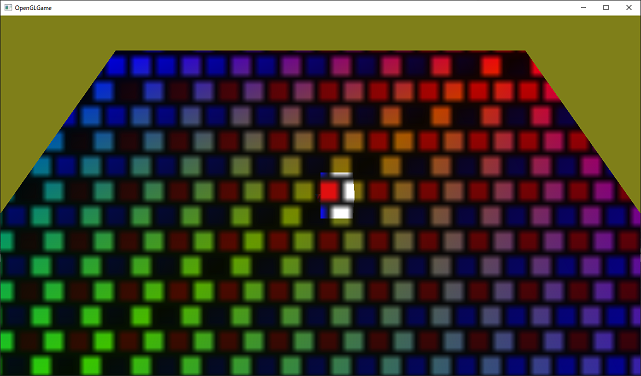
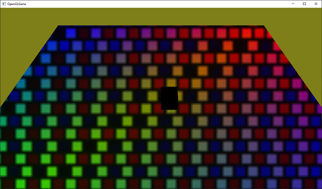
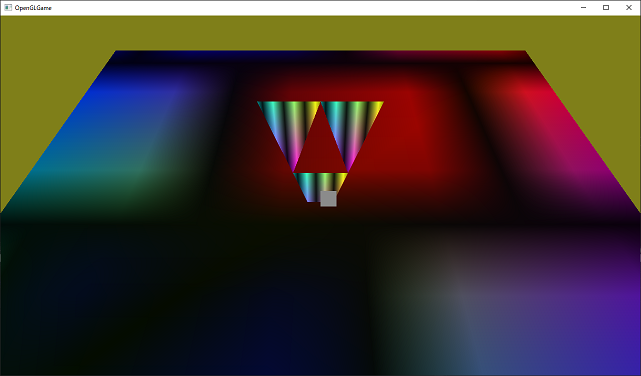
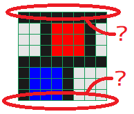
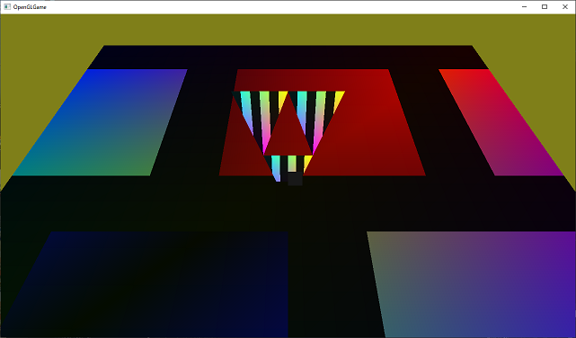
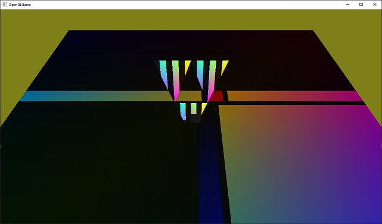

[OpenGL 3D 2020 第04回]

# テクスチャー・パワー！メイク・アップ！

## 習得目標

* テクスチャ・オブジェクトの使い方
* サンプラ・オブジェクトの使い方

## 1. テクスチャを使う

### 1.1 テクスチャをプリミティブに貼るということ

物体の表面の細かな模様や凹凸まで全てをプリミティブにして、色や属性を付けていけば、理論上はあらゆる物体を表現できます。しかし、それには信じられない数のプリミティブが必要になってしまいます。

そこで考案されたのが、プリミティブに画像を貼り付ける「テクスチャ・マッピング」という技法です。「テクスチャ(texture)」は「織物の出来栄え、手触り、物の質感」という意味です。それは物体の表面の色だけでなく凹凸も表すことがあります。

例えば、次の画像の床や壁などは、わずかな数のプリミティブで作られた単なる平面です。しかし、そこに石模様のテクスチャを貼り付けることで、あたかも本当に石のモデルで作られているかのように見せています。もちろん、近くに寄って見ると、実際には平面に書かれた絵だとばれてしまうわけですが。

<div style="text-align: center;width: 100%;">

</div>

なお、「マッピング(mapping)」の意味は「地図を書く」より「貼り付ける、割り当てる」と考えるほうがイメージしやすいかもしれません。

### 1.2 画像データを定義する

テクスチャは画像データから作られます。画像データには目的に応じてさまざまな形式が存在します。今回は比較的一般的な形式である「1ピクセルが赤、緑、青、不透明度の4要素からなっていて、各要素のビット数が8」で作成します。
8ビットの要素が4つなので、32bit型の<ruby>`GLuint`<rt>ジーエル・ユー・イント</rt></rubh>を使います。描画データリストの定義の下に、次のプログラムを追加してください。

```diff
 const Primitive primGround(GL_TRIANGLES, 6, 0, 0); // 地面
 const Primitive primTree(GL_TRIANGLES, 21, 6 * sizeof(GLushort), 4); // 木
+
+// 画像データ.
+const int imageWidth = 8; // 画像の幅.
+const int imageHeight = 8; // 画像の高さ.
+const GLuint B = 0xff'10'10'10; // 黒.
+const GLuint W = 0xff'ff'ff'ff; // 白.
+const GLuint imageGround[imageWidth * imageHeight] = {
+  W, W, B, W, W, W, W, W,
+  W, B, W, W, W, W, W, W,
+  W, W, B, W, W, W, W, W,
+  B, B, B, B, B, B, B, B,
+  W, W, W, W, W, W, B, W,
+  W, W, W, W, W, B, W, W,
+  W, W, W, W, W, W, B, W,
+  B, B, B, B, B, B, B, B,
+};

 /// 頂点シェーダー.
 static const GLchar* const vsCode =
```

画像データの幅と高さは`imageWidth`(イメージ・ウィス)、`imageHeight`(イメージ・ハイト)で定義します。この定数は、あとでテクスチャを作るときにも使います。

1ピクセルは32ビットなので、データを定義するには`0x12345678`のような数値を64個も書かなければなりません。それでは手間がかるうえに見づらいです。そこで、黒色を`B`(Blackの頭文字)、白色を`W`(Whiteの頭文字)という変数で定義して、これらを並べて画像を作ることにしました。

また、C++14から数値の区切り記号として`'`(シングル・クォーテーション)が使えますので、これを使って桁を把握しやすくしています。

こうして定義した`imageGround`(イメージ・グラウンド)配列は次のような模様になります(なぜグラウンドという名前なのかというと、この画像を地面に貼る予定だからです)。

<div style="text-align: center;width: 100%;">

</div>

プログラムの画像データに対して、上下が逆さまになっていることに気づいたでしょうか？　OpenGLの画像データは下から上に向かって定義します。しかし、プログラムは上から下に向かって書かなければならないため、逆さまになるのです。

<div style="page-break-after: always"></div>

## 2. テクスチャ作成関数を定義する

### 2.1 Texture.hの作成

それでは、画像データをテクスチャとして使えるようにしていきましょう。テクスチャを作成したり操作したりする関数は、専用のファイルに書いていきましょう。ソリューションエクスプローラーの「ソースファイル」フィルターを右クリックして、`Src`フォルダに`Texture.h`(テクスチャ・エイチ)というヘッダファイルを作成してください。作成した`Texture.h`を開き、次のプログラムを追加してください。

```diff
+/**
+* @file Texture.h
+*/
+#ifndef TEXTURE_H_INCLUDED
+#define TEXTURE_H_INCLUDED
+#include <glad/glad.h>
+
+namespace GLContext {
+
+GLuint CreateImage2D(GLsizei width, GLsizei height, const void* data);
+
+} // namespace GLContext
+
+#endif // TEXTURE_H_INCLUDED
+
```

最初に`glad/glad.h`をインクルードします。そして、`GLContext`名前空間にテクスチャ作成関数`CreateImage2D`(クリエイト・イメージ・ツーディ)を宣言します。

テクスチャの作成にはさまざまな情報が必要で、そのすべてを引数で指定するのは現実的ではありません。そこで今回は、テクスチャの幅、高さ、画像データの3つだけを引数として、残りの情報は関数の中で設定することにしました。

### 2.2 Texture.cppの作成

ソースファイルを追加して`CreateImage2D`関数を定義しましょう。ソリューションエクスプローラーの「ソースファイル」フィルターを右クリックし、`Src`フォルダに`Texture.cpp`(テクスチャ・シーピーピー)というCPPファイルを作成してください。そして作成した`Texture.cpp`を開き、次のプログラムを追加してください。

```diff
+/**
+* @file Texture.cpp
+*/
+#include "Texture.h"
+#include <iostream>
+
+namespace GLContext {
+
+} // namespace GLContext
```

まずは先ほど作成した`Texture.h`と、エラーメッセージを表示するための`iostream`をインクルードします。

### 2.3 テクスチャ・オブジェクトの作成

テクスチャ作成関数は少し長いので、ちょっとずつ実装していきます。最初はコメントと雛形から書いていきましょう。`GLContext`名前空間の中に、次のプログラムを追加してください。

```diff
 #include <iostream>

 namespace GLContext {
+
+/**
+* 2Dテクスチャを作成する.
+*
+* @param width   テクスチャの幅(ピクセル数).
+* @param height  テクスチャの高さ(ピクセル数).
+* @param data    テクスチャデータのアドレス.
+*
+* @retval 0以外  作成したテクスチャ・オブジェクトのID.
+* @retval 0      テクスチャの作成に失敗.
+*/
+GLuint CreateImage2D(GLsizei width, GLsizei height, const void* data)
+{
+  GLuint id;
+
+  return id;
+}

 } // namespace GLContext
```

それではテクスチャ作成プログラムを書いていきましょう。テクスチャの作成は以下の4つの手順で行います。

1. テクスチャ・オブジェクトを作成する。
2. テクスチャ用のGPUメモリを確保する。
3. テクスチャデータをGPUメモリにコピーする。
4. テクスチャのパラメータを設定する。

`1.`の「テクスチャ・オブジェクトの作成」は、`glCreateTextures`(ジーエル・クリエイト・テクスチャーズ)関数で行います。`2.`の「GPUメモリの確保」は、`glTextureStorage2D`(ジーエル・テクスチャ・ストレージ・ツーディ)関数で行います。`CreateImage2D`関数の定義に次のプログラムを追加してください。

```diff
 GLuint CreateImage2D(GLsizei width, GLsizei height, const void* data)
 {
   GLuint id;
+
+  // テクスチャ・オブジェクトを作成し、GPUメモリを確保する.
+  glCreateTextures(GL_TEXTURE_2D, 1, &id);
+  glTextureStorage2D(id, 1, GL_RGBA8, width, height);

   return id;
 }
```

<p><code class="tnmai_code"><strong>【書式】</strong><br>
glCreateTextures(テクスチャの種類, 作成する数,<br>
&emsp;テクスチャ・オブジェクトIDを格納する変数のアドレス);
</code></p>

`glCreateTextures`は指定した種類のテクスチャ・オブジェクトを作成します。`glCreateBuffers`や`glCreateVertexArrays`などと同じく、一度に複数のオブジェクトを作成できます。

テクスチャの種類には様々なものが指定できますが、本テキストで使うテクスチャの種類は`GL_TEXTURE_2D`だけです。よく使われるテクスチャの種類を以下に示します。

定数名|内容
---|---
<ruby>GL_TEXTURE_1D<rt>ジーエル・テクスチャ・ワンディ</rt></rubh>|一次元画像
<ruby>GL_TEXTURE_2D<rt>ジーエル・テクスチャ・ツーディ</rt></rubh>|二次元画像
<ruby>GL_TEXTURE_3D<rt>ジーエル・テクスチャ・スリーディ</rt></rubh>|三次元画像
<ruby>GL_TEXTURE_CUBE_MAP<rt>ジーエル・テクスチャ・キューブ・マップ</rt></rubh>|キューブマップ画像
<ruby>GL_TEXTURE_2D_ARRAY<rt>ジーエル・テクスチャ・ツーディ・アレイ</rt></rubh>|二次元画像の配列
<ruby>GL_TEXTURE_BUFFER<rt>ジーエル・テクスチャ・バッファ</rt></rubh>|数値を格納するテクスチャ

テクスチャにはここに挙げた以外にも様々な種類があります。詳しくは`https://www.khronos.org/opengl/wiki/Texture#Theory`を参照してください。

<p><code class="tnmai_code"><strong>【書式】</strong><br>
glTextureStorage2D(テクスチャ・オブジェクトID, 作成するレベル数,<br>
&emsp;イメージ形式, テクスチャの幅, テクスチャの高さ);
</code></p>

`glTextureStorage2D`はGPUメモリを確保し、テクスチャ・オブジェクトに割り当てます。必要なメモリ量は引数から自動的に計算されます。

「作成するレベル数」は、テクスチャが持つ「ミップマップ・レベルの枚数」です。ミップマップ(MIP map)というのは「オブジェクトとカメラの距離に応じて大きさの違うテクスチャを使い分ける機能」のことです。

プリミティブが遠くに表示される場合、そこに貼り付けた画像も縮小されます。しかし、画像の縮小はとても時間のかかる処理なので、ゲームなどでは使い物になりません。

しかし、実際のGPUは確かに非常に素早く縮小をやってのけています。実は、GPUは1/2の縮小までなら高速かつ正しく縮小できるように作られているのです。そのかわり、1/2より小さくなる場合は縮小っぽく見える処理でごまかします。そのため、あまり綺麗な見た目にはなりません。

MIPMAPは、事前に1/2, 1/4, 1/8,...のサイズに縮小した画像を用意しておくことで、どんなサイズでも正確に縮小できるようにします。また、遠距離の物体に対して巨大なテクスチャを読み込む必要がなくなるため、GPUが処理に使う時間も短くなります。

MIPMAPはレベル0が最も距離が近い場合で、数字が大きくなるほどより遠い場合に使われるテクスチャとなります。レベルの最大値はハードウェアやドライバによって違いますが、8か16が多いです。

>**【MIPってどういう意味？】**<br>
>MIPはラテン語の「*multum in parvo*」の略称です。これは「小さな入れ物に、たくさんの物が入っている」というような意味だそうです。

「イメージ形式」は、画像がどのようにGPUメモリに格納されるかを指定します。よく使われる形式を以下に示します。

定数名|意味
:-:|---
<ruby>GL_R8<rt>ジーエル・アール・はち</rt></ruby>|8bitの赤成分のみ
<ruby>GL_RGBA8<rt>ジーエル・アールジービーエー・はち</rt></ruby>|それぞれ8bitの赤緑青および透明度の4成分
<ruby>GL_RGBA16F<rt>ジーエル・アールジービーエー・じゅうろく・エフ</rt></ruby>|それぞれ16bit浮動小数点数の赤緑青および透明度の4成分
<ruby>GL_RGB565<rt>ジーエル・アールジービー・ごーろくご</rt></ruby>|5bitの赤、6bitの緑、5bitの青の3成分

なお、一部の色成分だけを格納する形式を指定した場合、格納されない色成分を読み出した結果は0になります。例えば`GL_R8`を指定すると、赤成分だけを持つテクスチャが作られます。このテクスチャから緑や青成分を読み出すと、常に`0.0`になるということです。

`GL_R8`は、白黒画像を扱うために使われます。赤い画像を扱えないわけではありませんが、`GL_G8`や`GL_B8`がなく、`GL_RG8`があることからも、`GL_R8`が単に1成分の画像を表していることが分かるでしょう。また、現実の世界では真っ赤に見えるものでも、わずかに他の色成分が混じっています。そのため、赤い物体であっても`GL_RGBA8`などのほうが適しています。

その他のさまざまなイメージ形式について、詳しくは`https://www.khronos.org/opengl/wiki/Image_Format`を参照してください。

「テクスチャの幅」と「テクスチャの高さ」は、画像の縦と横のピクセル数です。最小値は1です。最大値は実行環境によって違います。ただし、OpenGL 4.0までは少なくとも1024、OpenGL 4.1に対応していれば少なくとも16384であることが保証されています。

>**【数字の英語読みと日本語読み】**<br>
>英語のほうが発音が長くなる傾向があるため、数字部分に限っては日本語で読まれることが多いです。しかし、1D,2D,3Dについては、慣習的にワンディ、ツーディ、スリーディと発音されることが多いようです。とはいえ、いちディ、にーディ、さんディでも全く問題はありません。要は相手に通じればいいのです。

### 2.4 GPUメモリに画像データを転送する

テクスチャ・オブジェクトを作成しGPUメモリを確保したら、そこに画像データを転送します。これには`glTextureSubImage2D`(ジーエル・テクスチャ・サブ・イメージ・ツーディ)関数を使います。

```diff
   // テクスチャ・オブジェクトを作成し、GPUメモリを確保する.
   glCreateTextures(GL_TEXTURE_2D, 1, &id);
   glTextureStorage2D(id, 1, GL_RGBA8, width, height);
+
+  // GPUメモリにデータを転送する.
+  glTextureSubImage2D(id, 0, 0, 0, width, height, GL_RGBA, GL_UNSIGNED_BYTE, data);
+  const GLenum result = glGetError();
+  if (result != GL_NO_ERROR) {
+    std::cerr << "[エラー]" << __func__ << "テクスチャの作成に失敗\n";
+    glDeleteTextures(1, &id);
+    return 0;
+  }

   return id;
 }
```

<p><code class="tnmai_code"><strong>【書式】</strong><br>
glTextureSubImage2D(テクスチャ・オブジェクトID, 転送先レベル, 転送先X座標, 転送先Y座標,<br>
&emsp;転送データの幅, 転送データの高さ, ピクセル形式, データの型, データのアドレス);
</code></p>

やたらとたくさんの引数を持つ関数ですが、言っていることは「「幅、高さ、画像形式、データの型」で定義されたデータを、テクスチャの「レベル、転送先X, Y座標」の位置にコピーせよ」という意味です。

例えば`glTextureStorage2D(id, 4, GL_RGBA8, 800, 600);`という引数でGPUメモリを確保したとします(緑の四角)。そこに`glTextureSubImage2D(id, 0, 200, 50, 500, 400, GL_RGBA, GL_UNSIGNED_BYTE, data);`という引数でデータを転送した場合、そのデータは下図のように転送されます(赤の四角)。

<div style="text-align: center;width: 100%;">

<div>[800x600のテクスチャの(200, 50)の位置に、500x400の画像を転送]</div>
</div>

「ピクセル形式」はどの色成分が格納されているかを指定します。例えば、赤緑青の順で成分が格納されている場合は`GL_RGB`(ジーエル・アールジービー)を指定します。赤成分のみのデータの場合は`GL_RED`(ジーエル・レッド)を指定します。詳しくは`https://www.khronos.org/opengl/wiki/Pixel_Transfer#Pixel_format`を参照してください。

>**【イメージ形式とピクセル形式、似て非なるもの】**<br>
>「ピクセル形式」は、GPUメモリを確保するときに出てきた「イメージ形式」とよく似ています。しかし、両者はまったく異なる意味で使われます。間違えやすいので注意してください。とはいえ、多くの場合はほぼ同じ形式を指定することになります。<br>
>また、歴史的な理由でイメージ形式には、ピクセル形式と同じ定数を指定することが出来てしまいます。イメージ形式には常に`GL_RGBA8`の用に末尾にサイズの付いた定数を使うようにすれば、少しはこの混乱を避けられるでしょう。

「データの型」という引数は、転送元の(CPUメモリにある)画像が、どのように色を格納しているかを指定します。基本的には「各色成分の大きさ」を指定しますが、特殊な格納形式の場合は対応する定数を指定します。

例えば画像データの色成分が各色8ビット(=1バイト)で格納されている(一般的な画像の)場合、`GL_UNSIGNED_BYTE`を指定します。色成分が各色5ビットで、それを16ビット(=2バイト)に結合した値が格納されている場合は、`GL_UNSIGNED_SHORT_5_5_5_1`を指定します。詳しくは`https://www.khronos.org/opengl/wiki/Pixel_Transfer#Pixel_type`を参照してください。

データを転送したあとは、`glGetError`関数でエラーチェックを行います。エラー自体はデバッグ出力機能で検出できますが、エラーの有無で処理を分けたいときは自分で調べる必要があります。

`glGetError`は、エラーがなければ`GL_NO_ERROR`を返します。ということは、エラーが起きたときは「それ以外」が返されるわけです。だから、`result != GL_NO_ERROR`の場合にエラー処理を行うようにしています。

エラーが起きたときは、作成したテクスチャ・オブジェクトを削除しなくてはなりません。これには`glDeleteTextures`(ジーエル・デリート・テクスチャーズ)関数を使います。

<p><code class="tnmai_code"><strong>【書式】</strong><br>
glDeleteTextures(削除する数,<br>
&emsp;テクスチャ・オブジェクトIDを格納する変数のアドレス);
</code></p>

テクスチャを削除したら`0`を返して終了します。バッファ・オブジェクトと同様に、`0`は「テクスチャ・オブジェクトがない」ことを示すからです。

>**【デフォルト・テクスチャに手を出すな！】**<br>
>実は、テクスチャ・オブジェクトID`0`には、OpenGLを初期化したときに自動的にテクスチャ・オブジェクトが割り当てられます(このテクスチャのことを「デフォルト・テクスチャ」といいます)。ですから厳密には「オブジェクトがない」という状態はありえません。デフォルト・テクスチャは、プリミティブごとにひとつのテクスチャしか使えなかったOpenGL 1.0時代の名残です。<br>
>デフォルト・テクスチャは特別なので、`glDeleteTextures`でも削除できません。また、他の`glCreate`系関数と同様に、`glCreateTextures`関数も絶対に`0`を返しません。しかし、それ以外はあらゆる操作を受け付けます。`0`を「テクスチャが設定されていないことを示す数値」として適切に使うために、デフォルト・テクスチャに何かを設定するべきではありません。

### 2.5 テクスチャのパラメータを設定する

テクスチャが作成できたら、続いてテクスチャのパラメータを設定します。テクスチャのパラメータを設定するには`glTextureParameteri`(ジーエル・テクスチャ・パラメータ・アイ)を使います。エラー処理プログラムの下に、次のプログラムを追加してください。

```diff
     glDeleteTextures(1, &id);
     return 0;
   }
+
+  // テクスチャのパラメータを設定する.
+  glTextureParameteri(id, GL_TEXTURE_MAX_LEVEL, 0);

   return id;
 }
```

<p><code class="tnmai_code"><strong>【書式】</strong><br>
glTextureParameteri(テクスチャ・オブジェクトId, パラメータの種類, 設定する値);
</code></p>

`glTextureParametei`には、末尾の`i`を、`f`、`iv`、`fv`に変えたバリエーションが存在します。これらはパラメータの種類によって使い分けなくてはなりません。これらの接尾辞の詳細は`https://www.khronos.org/opengl/wiki/Nomenclature#Function_suffixes`を参照してください。

テクスチャには多くのパラメータがありますが、今回設定するのは`GL_TEXTURE_MAX_LEVEL`(ジーエル・テクスチャ・マックス・レベル)だけです。

* <ruby>**GL_TEXTURE_MAX_LEVEL**<rt>ジーエル・テクスチャ・マックス・レベル</rt></ruby><br>
  使用するミップマップの最大レベルです。初期値は`1000`です。ミップマップを使用しない場合は`0`を指定する必要があります。

とりあえず、`CreateImage2D`関数は完成です。

<div style="page-break-after: always"></div>

## 3. テクスチャの表示

### 3.1 テクスチャオブジェクトを作成する

`CreateImage2D`を使ってテクスチャオブジェクトを作成していきます。まずは`Texture.h`をインクルードしましょう。`Main.cpp`を開き、`Mesh.h`のインクルード文の下に、次のプログラムを追加してください。

```diff
 #include <glad/glad.h>
 #include "GLContext.h"
 #include "Mesh.h"
+#include "Texture.h"
 #include <glm/gtc/matrix_transform.hpp>
 #include <GLFW/glfw3.h>
 #include <string>
 #include <iostream>
```

それではテクスチャオブジェクトを作成しましょう。`uniform`変数`matMVP`の位置を定義するプログラムの下に、次のプログラムを追加してください。

```diff
   // uniform変数の位置.
   const GLint locMatMVP = 0;
+
+  const GLuint texGround =
+    GLContext::CreateImage2D(imageWidth, imageHeight, imageGround);
+  if (!texGround) {
+    return 1;
+  }

   // メインループ.
   while (!glfwWindowShouldClose(window)) {
```

地面用のテクスチャにする予定なので、変数名は`texGround`(テックス・グラウンド)としました。これでテクスチャオブジェクトの作成は完了です。

### 3.2 テクスチャオブジェクトを削除する

作成したテクスチャオブジェクトは、不要になったら削除しなければなりません。後始末をするプログラムに、次のプログラムを追加してください。

```diff
     glfwSwapBuffers(window);
   }

   // 後始末.
+  glDeleteTextures(1, &texGround);
   glDeleteProgramPipelines(1, &pipeline);
   glDeleteProgram(fp);
   glDeleteProgram(vp);
```

テクスチャオブジェクトを削除するには、`CreateImage2D`関数でも使った`glDeleteTextures`を使います。

### 3.4 サンプラとテクスチャ・イメージ・ユニット

OpenGLは作成したテクスチャオブジェクトを自動的に使ってくれたりはしません。テクスチャを使うようにシェーダを書き換える必要があります。`GLSL`でテクスチャを扱うには、テクスチャを選択する`sampler`(サンプラ)型と、テクスチャから色を取得する`texture`(テクスチャ)関数を使います。

テクスチャの種類に応じてさまざまなサンプラが存在します。今回扱うのは2Dテクスチャなので、`sampler2D`(サンプラ・ツーディ)を使います。1Dテクスチャなら`sampler1D`、3Dテクスチャなら`sampler3D`というように、テクスチャの種類によって使えるサンプラ型が決められています。間違ったサンプラ型を指定するとテクスチャを読み込めません。

サンプラ変数の名前は`texColor`(テックス・カラー)とします(`tex`は`texture`の短縮形)。それでは、フラグメント・シェーダに次のプログラムを追加してください。

```diff
 static const GLchar* const fsCode =
   "#version 450 \n"
   "layout(location=0) in vec4 inColor; \n"
   "out vec4 fragColor; \n"
+  "layout(binding=0) uniform sampler2D texColor; \n"
   "void main() { \n"
-  "  fragColor = inColor; \n"
+  "  fragColor = inColor * texture(texColor, gl_FragCoord.xy * 0.01); \n"
   "}";
```

サンプラは`uniform`変数でなければなりません。また、レイアウト修飾子には、`location`ではなく`binding`(バインディング)修飾子を書きます。`binding`修飾子は「テクスチャ・イメージ・ユニット」のユニット番号を指定します。

「テクスチャ・イメージ・ユニット」はOpenGLコンテキストの一部で、テクスチャとサンプラの割り当てを管理しています。サンプラ、テクスチャ、そしてテクスチャ・イメージ・ユニットは次の図のように接続されます。

<div style="text-align: center;width: 100%;">

</div>

この図では、テクスチャAはユニット0を通じてサンプラXに割り当てられ、テクスチャBはユニット4を通じてサンプラYに割り当てられます。同様に、テクスチャCとサンプラZはユニット1を通じてつながっています。

同じテクスチャを複数のユニットに割り当てることができます。また、同じユニットに複数のサンプラを割り当てることもできます。例えば、テクスチャAをユニット0とユニット1に割り当て、ユニット0にはサンプラXとZを、ユニット1にはサンプラYを割り当てる、ということも可能です。

### 3.5 テクスチャから色を読み取る

<p><code class="tnmai_code"><strong>【書式】</strong><br>
vec4 texture(サンプラ, テクスチャ座標);
</code></p>

`texture`関数は、「サンプラ」に割り当てられたテクスチャから、「テクスチャ座標」の位置にある色を読み取ります。テクスチャ座標には`gl_FragCoord`(ジーエル・フラグ・コード)変数を使います。

`gl_FragCoord`は`vec4`型の`in`変数で、`gl_Position`と同じく`GLSL`で用途が決められています。この変数は`GLSL`が自動的に定義してくれるので、`gl_Position`のように自分で定義する必要はありません。

`gl_FragCoord`には、スクリーン座標系においてピクセルが描かれる位置が格納されます。スクリーン座標系なので原点(0, 0)は左下、画面サイズは1280x720なので右上が(1279, 719)になります。

#### スウィズリング

`vec4`など`GLSL`のベクトル型には「スウィズリング」という機能があります。`.`(ピリオド)に続いて`x`, `y`, `z`, `w`を書くことで、一部の要素だけを取り出したり、順序を入れ替えて取り出すことができます。上記のプログラムでは`gl_FragCoord`変数をテクスチャ座標として使うために、xy要素を2要素ベクトル(つまり`vec2`型)として取り出しています。

#### ベクトルの乗算

ベクトル型の乗算は、以下に示すように、お互いの要素を個別に乗算した結果になります。

>  ```c++
>  vec4 a = vec4(1, 2, 3, 4);
>  vec4 b = vec4(8, 7, 6, 5);
>  vec4 c = a * b;
>  vec4 d;
>  d.x = a.x * b.x;
>  d.y = a.y * b.y;
>  d.z = a.z * b.z;
>  d.w = a.w * b.w;
>  //この時点で変数cとdの値は等しい
>  ```

乗算だけでなく四則演算は全てこのルールで動作します。上記のプログラムでは、頂点カラーとテクスチャカラーを合成するために乗算を使っています。

### 3.7 テクスチャをテクスチャ・イメージ・ユニットに割り当てる

テクスチャを表示するための最後の仕事は、テクスチャをテクスチャ・イメージ・ユニットに割り当てる作業です。地面を表示するプログラムに、次のプログラムを追加してください。

```diff
     // 地面を描画.
     {
       const glm::mat4 matModel = glm::mat4(1);
       const glm::mat4 matMVP = matProj * matView * matModel;
       glProgramUniformMatrix4fv(vp, locMatMVP, 1, GL_FALSE, &matMVP[0][0]);
+      glBindTextureUnit(0, texGround);
       primGround.Draw();
     }
```

<p><code class="tnmai_code"><strong>【書式】</strong><br>
glBindTextureUnit(ユニット番号, テクスチャオブジェクトID);
</code></p>

`glBindTextureUnit`関数を使うと、指定したテクスチャを「ユニット番号」に対応するテクスチャ・イメージ・ユニットに割り当てます。

プログラムが書けたらビルドして実行してください。以下ような画像が表示されたら成功です。

<div style="text-align: center;width: 100%;">

</div>

>**【同時に使えるテクスチャの数】**<br>
>テクスチャ・イメージ・ユニットの数には限りがあります。さらに、シェーダステージごとに使える数の制限があります。OpenGL 4.1以上のバージョンでは、フラグメント・シェーダでは少なくとも16個のユニットが使えることになっています(しかし、世の中には4.1対応を謳っているにもかかわらず、ユニット数が15個以下のGPUが存在します。もちろん、もっとたくさん使えるGPUもあります)。この制限を超える数のテクスチャを使うときは、プログラムで適宜テクスチャを割り当て直さなくてはなりません。

### 3.8 テクスチャの割り当てを解除する

テクスチャを使い終わったら、すみやかに割り当てを解除しなければなりません。プリミティブを描画するたびに、割り当てられている全てのテクスチャに対して読み込み準備作業が発生するからです。これは、シェーダがそのテクスチャを使わなくても発生します。

問題は、読み込み準備作業にわずかとはいえ時間が必要なことです。その時間分は描画性能が低下します。そのため、使わないテクスチャ・イメージ・ユニットからは割り当てを解除しておきます。

テクスチャの割り当てを解除するには`glBindTextureUnit`関数のテクスチャオブジェクトIDに`0`を指定します。地面を描画するプログラムの下に、次のプログラムを追加してください。

```diff
       glProgramUniformMatrix4fv(vp, locMatMVP, 1, GL_FALSE, &matMVP[0][0]);
       glBindTextureUnit(0, texGround);
       primGround.Draw();
     }
+
+    // テクスチャの割り当てを解除.
+    glBindTextureUnit(0, 0);

     glfwPollEvents();
     glfwSwapBuffers(window);
```

プログラムが書けたらビルドして実行してください。次のような画像が表示されたら解除成功です。

<div style="text-align: center;width: 100%;">

</div>

木が真っ黒になったのは、テクスチャの割り当てが解除されたからです。これまでは、地面に貼ったテクスチャが意図せず木にも使われていただけだったのです。

<div style="border:solid 1px; background:#f0e4cd; margin: 1rem; padding: 1rem; border-radius: 10px">
<strong>【課題01】</strong><br>
木のための画像データを定義しなさい。配列変数の名前は<code>imageTree</code>としてください。
</div>

<div style="border:solid 1px; background:#f0e4cd; margin: 1rem; padding: 1rem; border-radius: 10px">
<strong>【課題02】</strong><br>
課題01で作成した<code>imageTree</code>からテクスチャオブジェクトを作成しなさい。テクスチャオブジェクトの変数名は<code>texTree</code>にしてください。
</div>

<div style="border:solid 1px; background:#f0e4cd; margin: 1rem; padding: 1rem; border-radius: 10px">
<strong>【課題03】</strong><br>
課題02で作成した<cod>texTree</code>を木のテクスチャとして設定しなさい。割り当ての解除は不要です。
</div>

<div style="page-break-after: always"></div>

## 4. テクスチャ座標

### 4.1 テクスチャ座標を定義する

とりあえずは画像を表示できましたね。しかし、思っていたのとは違った見え方だったのではないでしょうか？　普通はこう、画像が地面と一緒になって回るような…。その理由は、プリミティブに「テクスチャ座標」を用意していなかったからです。

プリミティブにテクスチャを貼り付けるには、頂点にテクスチャ内の位置を割り当てなければなりません。これを「テクスチャ座標」といいます。現在の頂点データにはテクスチャ座標がありませんので、追加していきましょう。

二次元画像の場合、当然ですがテクスチャ座標も二次元になります。テクスチャ座標は「テクスチャ座標系」で指定します。OpenGLのテクスチャ座標系は、画像の左下が原点(0,0)で画像の右上が(1,1)になっています。

テクスチャ座標系の各軸は、`U, V`または`S, T`と呼ばれます(`X, Y`ではありません)。そのためテクスチャ座標は「UV座標」とか「ST座標」と呼ばれます。呼び方が違うだけで`UV`も`ST`も、`XY`と同じ2D座標です。そのため、実際のプログラムでは全て2Dベクトルとして扱います。

それでは、色データの定義の下に、次のプログラムを追加してください。

```diff
   {1.0f, 1.0f, 1.0f, 1.0f},
 };
+
+/// テクスチャ座標データ.
+const glm::vec2 texcoords[] = {
+  // 地面
+  { 0.0f, 0.0f },
+  { 1.0f, 0.0f },
+  { 1.0f, 1.0f },
+  { 0.0f, 1.0f },
+
+  // 木
+  { 0.0f, 1.0f },
+  { 0.0f, 0.0f },
+  { 0.5f, 0.0f },
+  { 1.0f, 0.0f },
+  { 0.0f, 1.0f },
+  { 0.0f, 0.0f },
+  { 0.5f, 0.0f },
+  { 1.0f, 0.0f },
+};

 /// インデックスデータ.
 const GLushort indices[] = {
```

テクスチャ座標は二次元ベクトルなので`glm::vec2`(ジーエルエム・ベク・ツー)型の配列になります。変数名は`texcoords`(テックス・コーズ)とします。これは`texture coordinates`(テクスチャ・コーディネーツ、「テクスチャ座標」という意味)という単語を短縮したものです。

なお、本来は他のモデルの頂点データにもテクスチャ座標を追加しなければなりませんが、手間がかかるのでとりあえず地面と木だけ設定しています。設定していない頂点のテクスチャ座標は(0, 0)になります。

>**【OpenGLのテクスチャ座標系はなぜSTなのか】**<br>
>OpenGLが`ST`を選んだ本当の理由は分かりません。そもそもテクスチャ座標系の軸の名前が`UV`や`ST`なのは、頂点座標との混同を避けるためです。`UV`については、頂点座標が`W`,`X`,`Y`,`Z`の4つを使っているので、その直前の文字が選ばれたと言われています。DirectXなど多くのシステムでは`UV`が使われています。<br>
>`ST`の由来は不明です。数学では平面上の座標を`r=r0+S*w+T*v`で表すから、という話があります。初期のOpenGLは学術的な利用が多かったので、その分野に関わる人間ならひと目で意味が分かる文字を選んだ、というのが根拠です。<br>
>また、OpenGLでは「エバリュエータ」と呼ばれる機能(現在は廃止)の座標に`U`と`V`を割り当てていました。これとの重複を避けるため、という理由もあったようです。<br>
>文献によっては「`ST`は`UV`を正規化した値(`S=U/テクスチャの幅`, `T=V/テクスチャの高さ`)」と説明されることもあります。実際、確かにOpenGLの`ST`は正規化されています。しかし、`UV`が正規化されていない値だという仕様は見当たりませんし、DirectXの`UV`は正規化されています。

### 4.2 テクスチャ座標をVAOに追加できるようにする

続いて、テクスチャ座標データを`VAO`に設定できるようにします。`GLContext.h`を開き、`CreateVertexArray`関数の宣言を次のように書き換えてください。

```diff
 namespace GLContext {

 GLuint CreateBuffer(GLsizeiptr size, const GLvoid* data);
-GLuint CreateVertexArray(GLuint vboPosition, GLuint vboColor, GLuint ibo);
+GLuint CreateVertexArray(GLuint vboPosition, GLuint vboColor,
+  GLuint vboTexcoord, GLuint ibo);
 GLuint CreateProgram(GLenum type, const GLchar* code);
 GLuint CreatePipeline(GLuint vp, GLuint fp);

 } // namespace GLContext
```

定義のほうにも引数を追加しましょう。`GLContext.cpp`を開き、`CreateVertexArray`関数の定義を次のように書き換えてください。

```diff
 * @param vboPosition VAOに関連付けられる座標データ.
 * @param vboColor    VAOに関連付けられるカラーデータ.
+* @param vboTexcoord VAOに関連付けられるテクスチャ座標データ.
 * @param ibo         VAOに関連付けられるインデックスデータ.
 *
 * @return 作成したVAO.
 */
-GLuint CreateVertexArray(GLuint vboPosition, GLuint vboColor, GLuint ibo)
+GLuint CreateVertexArray(GLuint vboPosition, GLuint vboColor,
+  GLuint vboTexcoord, GLuint ibo)
 {
-  if (!vboPosition || !vboColor || !ibo) {
+  if (!vboPosition || !vboColor || !vboTexcoord || !ibo) {
     return 0;
   }
```

続いて、空いている頂点アトリビュートにテクスチャ座標データを設定します。`0`と`1`は使用済みなので`2`番のアトリビュートを使うことにします。それから、空いているバインディング・ポイントを使ってテクスチャ座標データを頂点アトリビュートに割り当てます。アトリビュートと同じく2番のバインディング・ポイントを使うことにします。

それでは、`vboColor`をバインディング・ポイントに割り当てるプログラムの下に、次のプログラムを追加してください。

```diff
   glVertexArrayAttribBinding(id, colorIndex, colorBindingIndex);
   glVertexArrayVertexBuffer(id, colorBindingIndex, vboColor, 0, sizeof(Color));
+
+  const GLuint texcoordIndex = 2;
+  const GLuint texcoordBindingIndex = 2;
+  glEnableVertexArrayAttrib(id, texcoordIndex);
+  glVertexArrayAttribFormat(id, texcoordIndex, 2, GL_FLOAT, GL_FALSE, 0);
+  glVertexArrayAttribBinding(id,texcoordIndex, texcoordBindingIndex);
+  glVertexArrayVertexBuffer(
+    id, texcoordBindingIndex, vboTexcoord, 0, sizeof(glm::vec2));

   glVertexArrayElementBuffer(id, ibo);

   return id;
```

各関数については第02回のテキストを参照してください。

### 4.3 バッファオブジェクトをVAOに設定する

`Main.cpp`に戻り、テクスチャ座標データからバッファオブジェクトを作成します。`VAO`を作成するプログラムを、次のように変更してください。

```diff
   // VAOを作成する.
   const GLuint positionBuffer = GLContext::CreateBuffer(sizeof(positions), positions);
   const GLuint colorBuffer = GLContext::CreateBuffer(sizeof(colors), colors);
+  const GLuint texcoordBuffer = GLContext::CreateBuffer(sizeof(texcoords), texcoords);
   const GLuint ibo = GLContext::CreateBuffer(sizeof(indices), indices);
-  const GLuint vao = GLContext::CreateVertexArray(positionBuffer, colorBuffer, ibo);
+  const GLuint vao = GLContext::CreateVertexArray(positionBuffer, colorBuffer,
+    texcoordBuffer, ibo);
   if (!vao) {
     return 1;
   }
```

作成したバッファオブジェクトは、不要になったら削除しなくてはならないのでした。後始末をしている部分に、次のプログラムを追加してください。

```diff
   glDeleteBuffers(1, &ibo);
   glDeleteBuffers(1, &vboColor);
   glDeleteBuffers(1, &vboPosition);
+  glDeleteBuffers(1, &vboTexcoord);

   // GLFWの終了.
   glfwTerminate();
```

### 4.4 頂点シェーダにテクスチャ座標を送る

テクスチャ座標データを用意して`VAO`に設定したので、そのデータを使うようにシェーダを書きかえましょう。頂点データは頂点シェーダに送られますので、まずはこちらから対応していきます。`Main.cpp`を開き、頂点シェーダに次のプログラムを追加してください。

```diff
 static const GLchar* const vsCode =
   "#version 450 \n"
   "layout(location=0) in vec3 vPosition; \n"
   "layout(location=1) in vec4 vColor; \n"
+  "layout(location=2) in vec2 vTexcoord; \n"
   "layout(location=0) out vec4 outColor; \n"
+  "layout(location=1) out vec2 outTexcoord; \n"
   "out gl_PerVertex { \n"
   "  vec4 gl_Position; \n"
   "}; \n"
   "layout(location=0) uniform mat4 matMVP; \n"
   "void main() { \n"
   "  outColor = vColor; \n"
+  "  outTexcoord = vTexcoord; \n"
   "  gl_Position = matMVP * vec4(vPosition, 1.0); \n"
   "}";
```

バーテックス・プラーによって読み取られたテクスチャ座標は、`in`変数である`vTexcoord`(ブイ・テックスコード)に格納されます。なぜなら、テクスチャ座標のバインディング・ポイントに`2`を指定したからです。

そして、シェーダプログラムでは、これを`outTexcoord`(アウト・テックスコード)変数に代入します。`outTexcoord`は`out`変数で、ロケーション番号は`1`です。そのため、この変数に代入した値はフラグメント・シェーダの1番目の入力変数に送られます。

### 4.5 フラグメントシェーダでテクスチャ座標を使う

フラグメントシェーダのほうにもテクスチャ座標を追加しましょう。フラグメントシェーダに次のプログラムを追加してください。

```diff
 static const GLchar* const fsCode =
   "#version 450 \n"
   "layout(location=0) in vec4 inColor; \n"
+  "layout(location=1) in vec2 inTexcoord; \n"
   "layout(binding=0) uniform sampler2D texColor; \n"
   "out vec4 fragColor; \n"
   "void main() { \n"
-  "  fragColor = inColor * texture(texColor, gl_FragCoord.xy * 0.01); \n"
+  "  fragColor = inColor * texture(texColor, inTexcoord); \n"
   "}";
```

上記のプログラムでは、1番の入力変数にテクスチャ座標を受け取り、それを`texture`関数の引数として使っています。これで、頂点のテクスチャ座標を元にしてテクスチャが貼られるようになります。プログラムが書けたらビルドして実行してください。テクスチャが地面と一緒になって回転していたら成功です。

<div style="text-align: center;width: 100%;">

</div>

<div style="page-break-after: always"></div>

## 5. サンプラ・オブジェクト

### 5.1 ラップ・モード

下の画像の赤で囲んだ部分に注目してください。奥側は少し暗く、手前側は少し明るくなっていますね。

<div style="text-align: center;width: 100%;">

</div>

しかし、画像データは下の形だったはずです。赤で囲んだ部分は白と黒で、上の画像のように色がついたりはしていません。

<div style="text-align: center;width: 100%;">

</div>

画像の端の色が変わるのは、画像データ外の部分をGPUが作り出しているからです。画像に対応するテクスチャ座標は0.0～1.0の範囲だけです。その外側がどうなっているかはGPUが決めています。

GPUによって作り出される部分は、「ラップ・パラメータ」で指定することができます。ラップ・パラメータには以下の5種類が指定できます。各画像の赤い枠の中が画像データ、外がGPUの作り出すデータです。

<div style="text-align: center;width: 100%;">

</div>

最初、ラップ・パラメータには一番左の`GL_REPEAT`(ジーエル・リピート)が設定されています。赤枠のすぐ上は白、すぐ下は黒なのが分かるでしょう。

後述しますが、GPUは画像を拡大・縮小するとき、色がなめらかに変わっていくように周囲の色を混ぜ合わせます。だから、白と黒が混ざって薄くなったり濃くなったりしたわけです。

### 5.2 サンプラ・オブジェクト作成関数を定義する

ラップ・パラメータの指定には「サンプラ・オブジェクト」というものを使います。まずはサンプラオブジェクトを作成する関数を作りましょう。関数名は`CreateSampler`(クリエイト・サンプラ)とします。`GLContext.h`を開き、次のプログラムを追加してください。

```diff
 GLuint CreateProgram(GLenum type, const GLchar* code);
 GLuint CreatePipeline(GLuint vp, GLuint fp);
+GLuint CreateSampler();

 } // namespace GLContext

 #endif // GLCONTEXT_H_INCLUDED
```

続いて`GLContext.cpp`を開き、`CreatePipeline`関数の定義の下に、次のプログラムを追加してください。

```diff
     glDeleteProgramPipelines(1, &id);
     return 0;
   }
   return id;
 }
+
+/**
+* サンプラ・オブジェクトを作成する.
+*
+* @retval 0より大きい 作成したサンプラ・オブジェクト.
+* @retval 0          サンプラ・オブジェクトの作成に失敗.
+*/
+GLuint CreateSampler()
+{
+  GLuint id;
+  return id;
+}

 } // namespace GLContext
 ```

 サンプラオブジェクトの作成には`glCreateSamplers`(ジーエル・クリエイト・サンプラーズ)関数を使います。`CreateSampler`関数に次のプログラムを追加してください。

```diff
 GLuint CreateSampler()
 {
   GLuint id;
+  glCreateSamplers(1, &id);
+  if (glGetError() != GL_NO_ERROR) {
+    glDeleteSamplers(1, &id);
+    return 0;
+  }
   return id;
 }
```

<p><code class="tnmai_code"><strong>【書式】</strong><br>
glCreateSamplers(作成するサンプラの数, サンプラIDを格納する変数のアドレス);
</code></p>

`glCreateSamplers`関数を実行したらエラーチェックを行います。`glGetError`が`GL_NO_ERROR`以外を返した場合、サンプラの作成は失敗です。そのときは`glDeleteSamplers`(ジーエル・デリート・サンプラーズ)関数でサンプラを削除して`0`を返します。

<p><code class="tnmai_code"><strong>【書式】</strong><br>
glDeleteSamplers(削除するサンプラの数, サンプラIDを格納する変数のアドレス);
</code></p>

これでサンプラを作成する関数は完成です。

### 5.3 サンプラオブジェクトを作る

それではサンプラオブジェクトを使ってみましょう。`Main.cpp`を開き、`uniform`変数の位置を定義するプログラムの下に、次のプログラムを追加してください。

```diff
   // uniform変数の位置.
   const GLint locMatMVP = 0;
+
+  // サンプラ・オブジェクトを作成する.
+  const GLuint sampler = GLContext::CreateSampler();
+  if (!sampler) {
+    return 1;
+  }
+  glSamplerParameteri(sampler, GL_TEXTURE_WRAP_S, GL_CLAMP_TO_EDGE);
+  glSamplerParameteri(sampler, GL_TEXTURE_WRAP_T, GL_CLAMP_TO_EDGE);

   const GLuint texGround =
     GLContext::CreateImage2D(imageWidth, imageHeight, imageGround);
```

ラップ・パラメータを設定するには`glSamplerParameteri`(ジーエル・サンプラ・パラメータ・アイ)関数を使います。

<p><code class="tnmai_code"><strong>【書式】</strong><br>
glSmaplerParameteri(サンプラオブジェクトID, パラメータの種類, 設定する値);
</code></p>

* <ruby>**GL_TEXTURE_WRAP_S**<rt>ジーエル・テクスチャ・ラップ・エス</rt></ruby><br>
  <ruby>**GL_TEXTURE_WRAP_T**<rt>ジーエル・テクスチャ・ラップ・ティ</rt></ruby><br>
  0.0未満または1.0以上のテクスチャ座標が指定された場合の、横及び縦方向の座標の扱い方です(OpenGLではテクスチャ座標系の軸を表すのに`X`と`Y`ではなく`S`と`T`を使います)。それぞれ、次の4種類のうちから指定できます。

  ラップモード名|効果
  ---|---
  <ruby>GL_CLAMP_TO_EDGE<rt>ジーエル・クランプ・トゥ・エッジ</rt></ruby> | 0.0未満は0.0、1.0以上は1.0に切り捨てられます。
  <ruby>GL_CLAMP_TO_BORDER<rt>ジーエル・クランプ・トゥ・ボーダー</rt></ruby> | 0.0未満、1.0以上の座標は、全て<ruby>`GL_TEXTURE_BORDER_COLOR`<rt>ジーエル・テクスチャ・ボーダー・カラー</rt></ruby>というパラメータで設定した色になります。
  <ruby>GL_REPEAT<rt>ジーエル・リピート</rt></ruby> | 整数部を無視します。例えば3.5は0.5、-1.3は0.7と同じ扱いになります。
  <ruby>GL_MIRRORED_REPEAT<rt>ジーエル・ミラード・リピート</rt></ruby> | `GL_REPEAT`と同様に整数部を無視しますが、整数部が奇数の場合は`1-小数部`を使います。例えば`2.6`は`0.6`になりますが、`1.6`の場合は`0.4`になります。負数も同様に`-0.3`は`0.3`になり、`-1.3`は`0.7`になります。
  <ruby>GL_MIRROR_CLAMP_TO_EDGE<rt>ジーエル・ミラー・クランプ・トゥ・エッジ</rt></ruby> | **このモードはOpenGL 4.4で追加されました。** -1.0～1.0の範囲は`GL_MIRRORED_REPEAT`と同様に動作し、その外側は`GL_CLAMP_TO_EDGE`のように動作します。

### 5.4 サンプラオブジェクトを削除する

他のオブジェクトと同じく、サンプラオブジェクトも不要になったら削除しなくてはなりません。後始末をするプログラムに、次のプログラムを追加してください。

```diff
   // 後始末.
   glDeleteTextures(1, &texGround);
+  glDeleteSamplers(1, &sampler);
   glDeleteProgramPipelines(1, &pipeline);
   glDeleteProgram(fp);
   glDeleteProgram(vp);
```

### 5.4 サンプラオブジェクトを使う

サンプラオブジェクトを有効にするには`glBindSampler`(ジーエル・バインド・サンプラ)関数を使って「テクスチャ・イメージ・ユニット」に割り当てます。地面を描画するプログラムに、次のプログラムを追加してください。

```diff
     // 地面を描画.
     {
       const glm::mat4 matModel = glm::mat4(1);
       const glm::mat4 matMVP = matProj * matView * matModel;
       glProgramUniformMatrix4fv(vp, locMatMVP, 1, GL_FALSE, &matMVP[0][0]);
+      glBindSampler(0, sampler);
       glBindTextureUnit(0, texGround);
       primGround.Draw();
     }

     glBindTextureUnit(0, 0);
+    glBindSampler(0, 0);

     glfwPollEvents();
     glfwSwapBuffers(window);
```

<p><code class="tnmai_code"><strong>【書式】</strong><br>
glBindSampler(ユニット番号, サンプラオブジェクトID);
</code></p>

この関数は`glBindTextureUnit`関数のサンプラオブジェクト版です。

プログラムが書けたらビルドして実行してください。下の画像のように、さきほどは暗かったり明るかったりした部分がなくなっていれば成功です。

<div style="text-align: center;width: 100%;">

</div>

### 5.5 拡大・縮小フィルタ

5.1節で述べたように、画像を拡大・縮小するとき、GPUは色がなめらかに変わっていくように近くの色を混ぜ合わせます。この「拡大・縮小フィルタ」によって、地面の画像がピンボケになっています。

次の図は、フィルタの種類によって色がどう混ぜ合わされるかを示したものです。

<div style="text-align: center;width: 100%;">

</div>

中央の画像を見てください。太い線はテクスチャのピクセルを示しています。細い線は実際に描画されるピクセル(フラグメントといいます)を示しています。

`GL_LINEAR`(ジーエル・リニア)は、フラグメントに近い4つのピクセルを選び、フラグメントの中心から各ピクセルの中心までの距離の比率で色を混ぜ合わせます。見て分かるように、これが何も設定していないときの動作です。

一方、`GL_NEAREST`は各フラグメントの中心が指している色だけが使われます。そのため、どれだけ拡大しても色が混ざることはありません。

混ぜ方はこの2通りだけですが、縮小フィルタについてはミップマップに関連してさらにいくつかの設定が存在します。実際にフィルタを設定してみましょう。サンプラオブジェクトを作成するプログラムに、次のプログラムを追加してください。

```diff
   glSamplerParameteri(sampler, GL_TEXTURE_WRAP_S, GL_CLAMP_TO_EDGE);
   glSamplerParameteri(sampler, GL_TEXTURE_WRAP_T, GL_CLAMP_TO_EDGE);
+  glSamplerParameteri(sampler, GL_TEXTURE_MIN_FILTER, GL_NEAREST_MIPMAP_NEAREST);
+  glSamplerParameteri(sampler, GL_TEXTURE_MAG_FILTER, GL_NEAREST);

   const GLuint texGround =
     GLContext::CreateImage2D(imageWidth, imageHeight, imageGround);
```

縮小フィルタ、拡大フィルタの名前と設定する値を以下に示します。

* <ruby>**GL_TEXTURE_MIN_FILTER**<rt>ジーエル・テクスチャ・ミン・フィルタ</rt></ruby><br>
  テクスチャを縮小表示する場合の読み取り方法です(`MIN`は`minify`(ミニファイ、縮小する)の略です)。これには以下の6種類があります。

  縮小フィルタ名|効果
  ---|---
  <ruby>GL_NEAREST<rt>ジーエル・ニアレスト</rt></ruby> | 読み取るテクスチャ座標に最も近い1ピクセルを読み取ります。ミップマップがある場合、最小レベルが使われます。
  <ruby>GL_LINEAR<rt>ジーエル・リニア</rt></ruby> | 読み取るテクスチャ座標に最も近い4ピクセルを読み取り、距離による加重平均を取ります。ミップマップがある場合、最小レベルが使われます。
  <ruby>GL_NEAREST_MIPMAP_NEAREST<rt>ジーエル・ニアレスト・ミップマップ・ニアレスト</rt></ruby> | カメラからの距離に最も合うミップレベルのテクスチャを選び、`GL_NEAREST`方式で読み取ります。
  <ruby>GL_LINEAR_MIPMAP_NEAREST<rt>ジーエル・リニア・ミップマップ・ニアレスト</rt></ruby> | カメラからの距離に最も合うミップレベルのテクスチャを選び、`GL_LINEAR`方式で読み取ります。
  <ruby>GL_NEAREST_MIPMAP_LINEAR<rt>ジーエル・ニアレスト・ミップマップ・リニア</rt></ruby> | カメラからの距離が最も近いミップレベルのテクスチャを2つ選び、それぞれ`GL_NEAREST`方式で読み取ったあと、カメラからの距離による加重平均を取ります。
  <ruby>GL_LINEAR_MIPMAP_LINEAR<rt>ジーエル・リニア・ミップマップ・リニア</rt></ruby> | カメラからの距離が最も近いミップレベルのテクスチャを2つ選び、それぞれ`GL_LINEAR`方式で読み取ったあと、カメラからの距離による加重平均を取ります。

  初期値は`GL_NEAREST_MIPMAP_LINEAR`です。名前に`MIPMAP`が含まれる値はミップマップを設定したテクスチャ用です。ミップマップを使わない場合は`GL_NEAREST`か`GL_LINEAR`に変更しなければなりません。
* <ruby>**GL_TEXTURE_MAG_FILTER**<rt>ジーエル・テクスチャ・マグ・フィルタ</rt></ruby><br>
  テクスチャを拡大表示する場合の読み取り方法です(`MAG`は`magnify`(マグニファイ、拡大する)の略です)。指定できるのは以下の2種類だけです。拡大では常に最大レベル(通常はレベル0)のテクスチャを使うため、MIPMAPを扱うフィルタは存在しないからです。

  拡大フィルタ名|効果
  ---|---
  <ruby>GL_NEAREST<rt>ジーエル・ニアレスト</rt></ruby> | 読み取るテクスチャ座標に最も近い1ピクセルを読み取ります。
  <ruby>GL_LINEAR<rt>ジーエル・リニア</rt></ruby> | 読み取るテクスチャ座標に最も近い4ピクセルを読み取り、距離による加重平均を取ります。
  
  このパラメータの初期値は`GL_LINEAR`です。なので、今回の場合は設定しなくても問題はなかったりします。それでも設定しているのは、`GL_TEXTURE_MIN_FILTER`だけ変更して`GL_TEXTURE_MAG_FILTER`の設定を忘れる、というミスを防ぐためです。

2種類のフィルタの使い分けですが、基本的には`GL_LINEAR`を使ってください。そして、`GL_LINEAR`ではあまり綺麗な表示にならなかったときだけ`GL_NEAREST`を試してみるのがいいでしょう。

プログラムが書けたらビルドして実行してください。以下のように境界がはっきりとした画像が表示されたら成功です。

<div style="text-align: center;width: 100%;">

</div>

>**【その他のサンプラ・パラメータについて】**<br>
>詳細は`https://www.khronos.org/opengl/wiki/Sampler_Object`を参照してください。

### 5.5 0.0～1.0の範囲を超えるテクスチャ座標

テクスチャ座標系について「画像の左下が(0,0)、右上が(1,1)」と説明しました。そして、それを超える範囲がどうなるのかは、ラップ・パラメータによって変わるのでした。

地面のテクスチャ座標を変更したらどうなるかを見てみましょう。地面のテクスチャ座標データを、次のように変更してください。

```diff
 /// テクスチャ座標データ.
 const glm::vec2 texcoords[] = {
   // 地面
-  { 0.0f, 0.0f },
-  { 1.0f, 0.0f },
-  { 1.0f, 1.0f },
-  { 0.0f, 1.0f },
+  {-4.0f,-4.0f },
+  { 4.0f,-4.0f },
+  { 4.0f, 4.0f },
+  {-4.0f, 4.0f },

   // 木
   { 0.0f, 1.0f },
   { 0.0f, 0.0f },
```

プログラムが書けたらビルドして実行してください。以下の画像のようになれば成功です。

<div style="text-align: center;width: 100%;">

</div>

<div style="border:solid 1px; background:#f0e4cd; margin: 1rem; padding: 1rem; border-radius: 10px">
<strong>【課題03】</strong><br>
ラップ・パラメータを変更して、5.1節の図のとおりになることを確認しなさい。確認したあとは<code>GL_REPEAT</code>に設定しなさい。
</div>
