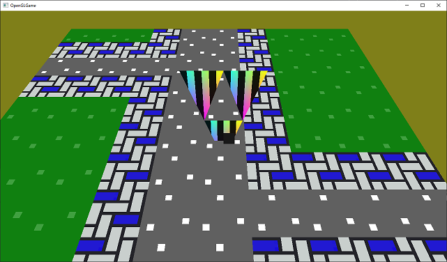
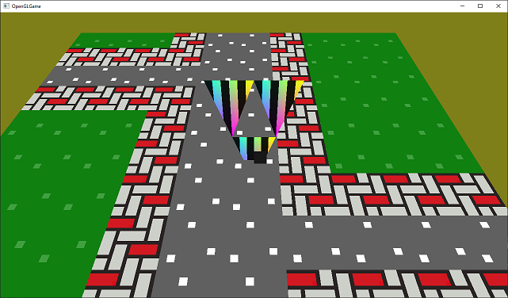
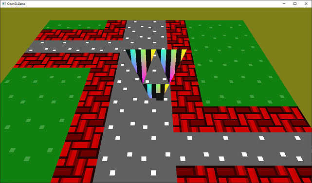
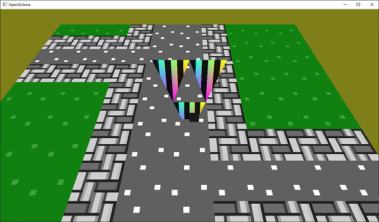
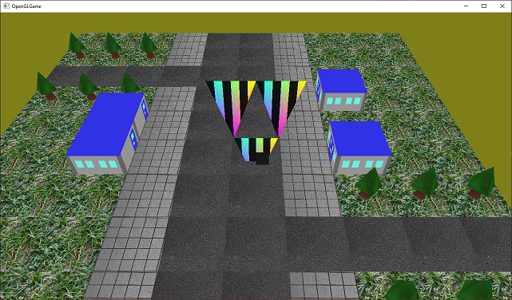

[OpenGL 3D 2020 第05回]

# チェースト画像ファイル

## 習得目標

* バイナリファイルの扱い方
* TGAファイルからテクスチャを作成する方法
* 基本的なTGAファイルの理解

## 1. テクスチャ読み込み関数を作る

### 1.1 画像ファイルの形式を選ぶ

第04回では、プログラムに埋め込んだデータからテクスチャを作成していました。しかし、一般的には「画像ファイル」から作成します。本テキストでも、画像ファイルを読み込んでテクスチャを作成する関数を作ることにしましょう。

画像ファイルにはいろいろな種類があります。よく使われるのは`JPG`や`PNG`という形式です。しかし、これらの形式はデータが「圧縮」されていて、ただ読み込むだけではテクスチャにできません。そこで、比較的簡単にテクスチャにでき、さらに半透明も扱える`TGA`(ティージーエー)という形式のファイルを使うことにしました。

`TGA`ファイル自体にも数種類のデータ形式が存在しますが、最初は一番簡単な「圧縮なし32ビット形式」を扱います。その後、残りの形式にも対応していくことにしましょう。

>**【TGAは何の短縮形？】**<br>
>「**T**ruevision **G**raphics **A**dapter(トゥルービジョン・グラフィックス・アダプタ)」の短縮形です。

### 1.2 TGAフォーマットの構造

TGAファイルの先頭には、画像の情報が格納されている部分があります。これをTGAファイルヘッダといい、次のような構造になっています。

|**名前**|**オフ<br>セット**|**バイト<br>数**|**格納されている情報**|
|---|:-:|:-:|---|
|<ruby>ID Length<rt>アイ・ディ・レングス</rt></ruby>                      | 0| 1| イメージIDデータのバイト数.|
|<ruby>Colormap Type<rt>カラーマップ・タイプ</rt></ruby>                  | 1| 1| カラーマップの有無.<br>0 = 無<br>1 = 有|
|<ruby>Image Type<rt>イメージ・タイプ</rt></ruby>                         | 2| 1| 画像記録形式.<br>0 = 画像データ無し<br>1 = 圧縮なし、インデックス・カラー画像<br>2 = 圧縮なし、カラー画像<br>3 = 圧縮なし、白黒画像<br>9 = 圧縮あり、インデックス・カラー画像<br>10 = 圧縮あり、カラー画像<br>11 = 圧縮あり、白黒画像|
|<ruby>First Entry Index<rt>ファースト・エントリ・インデックス</rt></ruby>| 3| 2| 画像データのインデックス0に対応するカラー<br>マップのインデックス.<br>カラーマップ無しの場合は未使用(常に0).|
|<ruby>Colormap Length<rt>カラーマップ・レングス</rt></ruby>              | 5| 2| カラーマップに登録されている色の数.<br>カラーマップ無しの場合は未使用(常に0).|
|<ruby>Colormap Entry Size<rt>カラーマップ・エントリ・サイズ</rt></ruby>  | 7| 1| カラーマップに登録されている色ひとつのビッ<br>ト数. カラーマップ無しの場合は未使用(常に0).|
|<ruby>X-origin<rt>エックス・オリジン</rt></ruby>                         | 8| 2| X座標をずらすピクセル数.|
|<ruby>Y-origin<rt>ワイ・オリジン</rt></ruby>                             |10| 2| Y座標をずらすピクセル数.|
|<ruby>Image Width<rt>イメージ・ウィス</rt></ruby>                        |12| 2| 画像の横のピクセル数.|
|<ruby>Image Height<rt>イメージ・ハイト</rt></ruby>                       |14| 2| 画像の縦のピクセル数.|
|<ruby>Pixel Depth<rt>ピクセル・デプス</rt></ruby>                        |16| 1| 画像の1ピクセルのビット数.|
|<ruby>Image Descriptor<rt>イメージ・デスクリプタ</rt></ruby>             |17| 1| 画像の格納方向および1ピクセルのアルファ<br>要素のビット数.|

TGAファイルでは、この18バイトのヘッダの直後に、イメージID(画像の種類などを示す文字列)、カラーマップ(インデックス・カラー形式の画像で使われるパレット)が続き、さらにその直後に画像データが格納されています。ファイルによってはイメージIDやカラーマップが存在せず、いきなり画像データが格納されていることもあります。

>**【インデックス・カラーって何？】**<br>
>インデックス・カラーは、色に番号をつけておき、ピクセルの色を直接記録するかわりに、その番号を記録する形式です。普通の画像では1ピクセルに16～32ビットのデータが必要となりますが、番号をつける色の数を256種類だけに限定した場合、1ピクセルに8ビットあれば画像を記録できるので、データ量を小さくすることができるのです。もちろん、画像に必要な色数が256種類で足りる場合に限りますが。

### 1.3 関数宣言を追加する

なんとなくTGAファイルの構造が分かったところで、テクスチャ読み込み関数を作り始めましょう。まずは関数の宣言を追加します。関数名は以前作成したのと同じ`CreateImage2D`(クリエイト・イメージ・ツーディ)とします。`GLContext.h`を開き、`CreateImage2D`関数の宣言の下に、次のプログラムを追加してください。

```diff
 GLuint CreateProgram(GLenum type, const GLchar* code);
 GLuint CreatePipeline(GLuint vp, GLuint fp);
 GLuint CreateImage2D(GLsizei width, GLsizei height, const GLvoid* data);
+GLuint CreateImage2D(const char* path);

 } // namespace GLContext
```

C++では、名前が同じでも引数の型や数が違っていれば別の関数として扱われます。これを「オーバーロード(overload、過負荷)」といいます。

>**【C言語にはオーバーロードがない】**<br>
>OpenGLはC言語でも使えるように作られています。OpenGLが関数の末尾に`f`や`i`や`v`を付けて区別しているのは、C言語にはオーバーロードがないためです。もしC++で使うことだけを考えていたら、それらは全て同じ名前になっていたでしょう。

>**【君主のつづりはoverlord】**<br>
>`overload`が「過負荷」で、`overlord`が「君主」です、`a`と`r`を間違えると全く違う意味になってしまうので注意しましょう。

### 1.4 ヘッダファイルのインクルード

それでは`LoadImage2D`関数を定義していきます。しかし、その前にファイル操作で使う`cstdint`(シー・エスティーディ・イント)、`fstream`(エフ・ストリーム)、という2つのヘッダファイルをインクルードしておきます。`GLContext.cpp`を開き、次のプログラムを追加してください。

```diff
 #include "GLContext.h"
 #include <glm/vec2.hpp>
+#include <cstdint>
+#include <fstream>
 #include <vector>
 #include <iostream>
```

`cstdint`は、`int32_t`(イント・さんじゅうに・ティ)などの決められたビット数を持つ整数型を定義するヘッダファイルです。画像データのように厳密にビット数が一致することが要求される処理で使います。

`fstream`はファイル操作用クラスを定義しているヘッダファイルです。ファイル名の先頭にある`f`は`file`(ファイル)の頭文字です。`stream`(ストリーム)というのは「流れ」という意味で、コンピュータ関係の文脈では「データを順番に読み込む、あるいは書き込むこと」を意味します。

>**【昔のC++言語ではcstdintが使えなかった】**<br>
>C++言語に`cstdint`が追加されたのは`C++11`からです。C言語では`C99`から同等を機能を持つ`stdint.h`が追加されています。それ以前のバージョンでは、開発環境ごとにマニュアルを見て目的のビット数を持つ型を探していました。

### 1.5 TGAヘッダを読み込む

C++でファイルを読み込むには`std::ifstream`(エスティーディ・アイ・エフ・ストリーム)というクラスを使います。`CreateImage2D`関数の定義の下に、次のプログラムを追加してください。

```diff
   glTextureParameteri(id, GL_TEXTURE_MAX_LEVEL, 0);

   return id;
 }
+
+/**
+* ファイルから2Dテクスチャを読み込む.
+*
+* @param filename 2Dテクスチャとして読み込むファイル名.
+*
+* @retval 0以外 作成したテクスチャ・オブジェクトのID.
+*         0     テクスチャの作成に失敗.
+*/
+GLuint LoadImage2D(const char* filename)
+{
+  // ファイルを開く.
+  std::ifstream ifs;
+  ifs.open(filename, std::ios_base::binary);
+  if (!ifs) {
+    std::cerr << "[エラー]" << __func__ << ":`" << filename << "`を開けません.\n";
+    return 0;
+  }
+}

 } // namespace GLContext
```

`std::ifstream`の`f`は`fstream`ヘッダの`f`と同じく<ruby>`file`<rt>ファイル</rt></ruby>の頭文字です。`i`は<ruby>`input`<rt>インプット</rt></ruby>の頭文字で、ファイルからの入力、つまり読み込みに使うことを意味しています。

><ruby>std::<rt>標準ライブラリに含まれる&emsp;</rt><ruby>i<rt>読み込み用の&emsp;</rt>f<rt>ファイルの&emsp;</rt>stream<rt>データ操作クラス</rt></ruby>

ファイルを開くには`open`(オープン)メンバ関数を使います。

<p><code class="tnmai_code"><strong>【書式】</strong><br>
void std::ifstream::open(開くファイルの名前, ファイルの扱い方フラグ);
</code></p>

最初の引数は「開くファイルの名前」です。上記のプログラムでは、読み込むファイル名は`filename`(ファイルネーム)引数に格納されているので、これを設定しています。

2つめの引数は「開いたファイルの扱い方」を指定します。この引数に設定できるのは`std::ios_base::openmode`(エスティーディ・アイオーエス・ベース・オープンモード)列挙型の値の組み合わせです(`ios`は`input output stream`の省略形で某アップル社の`iOS`とは関係ありません)。この列挙型には以下のメンバがあります。

| **定数**                             | **説明**                                                         |
|---------------------------------------|-------------------------------------------------------------------|
|<ruby>in<rt>イン</rt></ruby>           | ファイルを読み込み用に開きます。ifstreamでは自動的に付与されます。|
|<ruby>out<rt>アウト</rt></ruby>        | ファイルを書き込み用に開きます。ofstreamでは自動的に付与されます。|
|<ruby>ate<rt>アット・エンド</rt></ruby>| 読み書き位置をファイルの末尾に移動します。(`at end`の短縮形)      |
|<ruby>app<rt>アペンド</rt></ruby>      | 書き込みが常にファイルの末尾に対して行われるようにします。(`append`の短縮形)|
|<ruby>trunc<rt>トランク</rt></ruby>    | ファイルを開いた直後に、内容を全て削除します。(`truncate`の短縮形)|
|<ruby>binary<rt>バイナリ</rt></ruby>   | ファイルをバイナリ・ファイルとして操作します。                    |

いろいろな値が定義されていますが、今回使うのは`binary`だけです。というのも、入力系のストリームには自動的に`in`(出力系のストリームの場合は`out`)が付与されるので、自分で指定する必要がないからです。

さて、C++でファイルを操作するときは、そのファイルが「テキスト・ファイル」なのか「バイナリ・ファイル」なのかを指定しなければなりません。何もしなければ全てのファイルは「テキスト・ファイル」として扱われますので、バイナリ・ファイルとして扱いたいときは`std::ios_base::binary`を指定する必要があります。

「テキスト・ファイル」は人間が直接読み書きするためのものです。ファイルの内容は行単位で扱われ、各行は改行記号によって区切られます。そのため、「行単位で読み込む」といった操作が可能になります。基本的には、人間が読める文字(および改行記号などの制御記号)だけが記録されます。このため、数値も文字列で表され、例えば数値の「10000」を表すために5バイトのデータが必要になります。

「バイナリ・ファイル」は人間ではなくコンピューターが直接扱うためのものです。ですから、データとして表せるあらゆるものを含むことができます。改行記号も他の文字と同じく単なるビット列として扱われます。ですから、例えば数値の「10000」を表すのに必要なデータ量は2バイトだけです。

ただし、「テキスト・ファイルに、文字として認識されないデータを含めてはならない」というルールはありません。この分類は人間がテキスト・データを扱いやすくするためのもので、コンピューターにとって二種類のファイルに違いはありません。実際、プログラムにおいてファイルの種類が影響するのは「改行の扱い」だけです。

`open`関数を実行した後は、ファイルを開けたかどうかを確認します。これは`std::ifstream`型の変数を評価するだけです。評価結果が`true`なら「エラーなし」なので成功、`false`なら「エラーあり」なので失敗です。失敗していたらエラーメッセージを出力して`0`を返します。

成功していたらファイルからデータを読み込みます。ファイルを読み込むには`read`(リード)メンバ関数を使います。エラー処理の下に、次のプログラムを追加してください。

```diff
     std::cerr << "[エラー]" << __func__ << ":`" << filename << "`を開けません.\n";
     return 0;
   }
+
+  // TGAヘッダを読み込む.
+  uint8_t tgaHeader[18];
+  ifs.read(reinterpret_cast<char*>(tgaHeader), 18);
 }

 } // namespace GLContext
```

まず読み込み先となる配列を作ります。この配列は`uint8_t`(ユー・イント・はち・ティ)型で`tgaHeader`(ティジーエー・ヘッダ)という名前にしました。`unit8_t`は「8ビットの符号なし(**u**nsigned)整数(**int**eger)型(**t**ype)」を意味します。

そして`read`関数で`tgaHeader`にデータを読み込みます。

<p><code class="tnmai_code"><strong>【書式】</strong><br>
std::istream& std::ifstream::read(読み込みバッファのアドレス, 読み込むデータの数);
</code></p>

最初の引数が読み込み先のバッファのアドレス、次の引数が読み込むデータの数となっています。今回は`uint8_t`型を使っているので「データの数 = バイト数」になります。TGAヘッダは18バイトなので、この引数には`18`を指定しています。

`reinterpret_cast`(リ・インタープリト・キャスト)は、ある型を別の型に変換します。`std::ifstream`がデータを`char`型として扱うのに対して、`tgaHeader`は`uint8_t*`型です。そのため、型を合わせるためにキャストが必要なのです。

### 1.6 今回は使わないデータをスキップする

TGAヘッダと画像データの間には、「イメージID」と「カラーマップ」という2つのデータが存在する可能性があります。当面はどちらも使わないので読み飛ばしてしまいましょう。ファイルの一部を読み飛ばすには`ignore`(イグノア)メンバ関数を使います。引数として「読み飛ばすデータ数」を設定すると、その数だけデータを読み飛ばしてくれます。それでは、TGAヘッダを読み込むプログラムの下に、次のプログラムを追加してください。

```diff
   // TGAヘッダを読み込む.
   uint8_t tgaHeader[18];
   ifs.read(repnterpret_caset<char*>(tgaHeader), 18);
+
+  // イメージIDを飛ばす.
+  ifs.ignore(tgaHeader[0]);
+
+  // カラーマップを飛ばす.
+  if (tgaHeader[1]) {
+    const int colorMapLength = tgaHeader[5] + tgaHeader[6] * 0x100;
+    const int colorMapEntrySize = tgaHeader[7];
+    const int colorMapSize = colorMapLength * colorMapEntrySize / 8;
+    ifs.ignore(colorMapSize);
+  }
 }

 } // namespace GLContext
```

<p><code class="tnmai_code"><strong>【書式】</strong><br>
std::istream& std::ifstream::ignore(読み飛ばすデータの数, 読み飛ばしを中断する文字(省略可));
</code></p>

2番目の引数を省略すると、文字の種類の確認を行わず単に指定された数を読み飛ばします。ですから、例えば「イメージID」の場合、TGAヘッダの0バイト目に格納されている値を最初の引数に設定するだけです。

カラーマップは少し判定が必要です。カラーマップの有無は、TGAヘッダの1バイト目を見れば分かります。ここに格納されている数値が`0`なら、カラーマップはありませんので、何もする必要はありません。しかし`1`なら、カラーマップのバイト数を計算して読み飛ばす必要があります。カラーマップのバイト数は、TGAヘッダにある「カラーマップ・レングス」と「カラーマップ・エントリー・サイズ」という2つのデータから計算することができます。

ところで、TGAファイルヘッダにはバイト単位で情報が詰め込まれています。ですから、データの読み出しもバイト単位で行わなければなりません。カラーマップ・エントリー・サイズは1バイトのデータなのでそのまま使うことができますが、カラーマップ・レングスは2バイトです。2バイトのデータってどう扱ったらいいんでしょう？

これは、「データがどうやって格納されているか」が分かれば大丈夫です。TGAファイルの場合、数値の格納方法には「リトル・エンディアン」という方法を使っています。リトル・エンディアンは、数値データをバイト単位に分けて、桁の小さい方から1バイトずつ順番にファイルに格納する方法です。これを数値に戻すには、1バイトずつ取り出して元の順番に戻します。

例として`10000`という数値を考えてみましょう。`10000`を16進数にすると`0x2710`となります(`0x`は16進数であることを示すために付けています)。まず、これを`0x2700`と`0x10`の2つの部分に分けます。そして`0x2700`を`0x100`で割ると`0x27`になります。これで`10000`を2つの1バイトデータに分けることができました。リトル・エンディアンは小さい桁側から格納していく方法なので、ファイルには`0x10`, `0x27`の順番で格納されます。

次に、このファイルを`uint8_t`型の配列に読み込んだとします。配列名を`array`とすると、`array[0]`には`0x10`、`array[1]`には`0x27`が格納されることになります。この2つから元の`0x2710`を作り出すには、2番めの`0x27`を`0x100`倍して足し合わせるだけです。

<div style="text-align: center;width: 100%;">

</div>

これで、カラーマップに登録されている色数と、ひとつの色のビット数が分かりました。あとはこのふたつを掛け合わせるだけです。ただし、カラーマップ・エントリー・サイズに格納されているのは色のビット数なので、8で割ってバイト数に変換する必要があります。

バイト数が計算できればあとは簡単です。イメージIDのときと同様に`ignore`メンバ関数を使ってカラーマップを読み飛ばすだけです。

>**【補足】**<br>
>基本的には「圧縮なし32ビット」形式にカラーマップは存在しません。

### 1.7 画像データを読み込む

カラーマップの後ろには「本命」の画像データがあります。このデータを読み込みましょう。カラーマップをスキップするプログラムの下に、次のプログラムを追加してください。

```diff
     const int colorMapSize = colorMapLength * colorMapEntrySize / 8;
     ifs.ignore(colorMapSize);
   }
+
+  // 画像データを読み込む.
+  const int width = tgaHeader[12] + tgaHeader[13] * 0x100;
+  const int height = tgaHeader[14] + tgaHeader[15] * 0x100;
+  const int pixelDepth = tgaHeader[16];
+  const int imageSize = width * height * pixelDepth / 8;
+  std::vector<uint8_t> buf(imageSize);
+  ifs.read(reinterpret_cast<char*>(buf.data()), imageSize);
 }

 } // namespace GLContext
```

画像データのバイト数は、TGAヘッダの「イメージ・ウィス」と「イメージ・ハイト」、それに「ピクセル・デプス」の3つの数値から計算できます。イメージ・ウィスとイメージ・ハイトは2バイトのデータなので、カラーマップ・レングスと同じ方法で数値に戻します。ピクセル・デプスもカラーマップ・エントリー・サイズと同様にビット数なので、`8`で割ってバイト数にします。あとは3つを掛け合わせるだけです。

画像データは`std::vector<uint8_t>`型の変数に読み込みます。変数名は`buf`(バフ)としました(`buffer`(バッファ)の短縮形)。さて、画像データを読み込むには、読み込み先となる`buf`の大きさを、画像データのバイト数以上にしておかなければなりません。いくつか方法があるのですが、今回はコンストラクタに大きさを指定する方法を使いました。このコンストラクタは引数に指定された大きさを持つ`std::vector`型の変数を作成します。

十分な大きさの`buf`変数を作ったら、`read`メンバ関数を使って画像データを読み込みます。

>**【配列よりvectorを使おう】**<br>
>`std::vector`型は、`new`や`delete`を書かなくても自由な大きさの配列を扱えるので、とても便利です。積極的に使っていきましょう。ただし、サイズが決まっていて、さらにそのサイズが小さいなど、配列のほうがよい場合があります。

### 1.8 画像データからテクスチャを作成する

最後に、読み込んだデータからテクスチャを作成します。画像データを読み込むプログラムの下に、次のプログラムを追加してください。

```diff
   const int imageSize = width * height * pixelDepth / 8;
   std::vector<uint8_t> buf(imageSize);
   ifs.read(reinterpret_cast<char*>(buf.data()), imageSize);
+
+  // 読み込んだ画像データからテクスチャを作成する.
+  return CreateImage2D(width, height, buf.data());
 }

 } // namespace GLContext
```

テクスチャの作成は`CreateImage2D`関数を呼び出すだけです。必要なデータは全部揃っているので、あとはそれらを引数に設定するだけです。とっても簡単ですね。

これでひとまず、画像ファイルからテクスチャを作成する関数は完成です。

<div style="page-break-after: always"></div>

## 2. テクスチャ読み込み関数の改良

### 2.1 Visual StudioでTGAファイルを作る

前章ではTGAファイルを読み込めるようにしました。あとは関数を呼び出すだけですが、肝心のTGAファイルがないと意味がありません。そこで、簡単なTGAファイルを作ってみましょう。

画像をTGAファイルとして保存する機能は、ほとんどの2D画像作成アプリケーションに備わっています。例えばGIMPの場合、画像にアルファ・チャンネルがある状態にして「エクスポート」を選択し、拡張子を「tga」に変えて「Export」ボタンを押します。エクスポート・オプションが開くので、「RLE complession」のチェックを外し、もう一度「Export」ボタンを押せば、「圧縮なし32ビット形式」のTGAファイルとして保存されます。

GIMP以外で手っ取り早いのは、VIsual Studioの画像編集機能を使うことです。基本的な機能しか備えていないため、高度な画像編集をすることはできませんが、動作確認用のテクスチャを作成する程度ならば十分です。とにかくこの機能でテクスチャを作成してみましょう。ソリューション・エクスプローラーの「リソースファイル」フィルタの上で右クリックし、「追加→新しい項目」を選択して「新しい項目の追加」ウィンドウを開いてください。

<div style="text-align: center;width: 100%;">

</div>

そうしたら、左側のリストから「グラフィックス」を選択し(①)、次に中央のリストの「TGAイメージ(.tga)」を選びます(②)。名前テキストボックスでファイル名を`Ground.tga`にします(③)。「場所」のテキストボックスはプロジェクトフォルダかプロジェクトの`Src`フォルダになっていると思いますが、これを`[プロジェクト・フォルダ]\Res`となるように変更してください。

上の画像のプロジェクトフォルダ名は`C:￥usr￥local￥projects￥OpenGL3DActionGame`となっていますが、皆さんは`C:\usr\local\projects\OpenGL3DActionGame`の部分を自分のプロジェクトフォルダ名で置き換えてください。

最後に、「追加」ボタンを押すと(⑤)、TGAファイルが追加されます。

### 2.2 TGAファイルを編集する

作成したばかりのTGAファイルは、手作業で編集するには少し大きすぎます。思い切って小さくしましょう。`Ground.tga`を開いて「表示」メニューをクリックし、下のほうに表示される「プロパティウィンドウ」を選択してください。すると、下図のようなウィンドウが開きます(既に開いている場合はこの操作は不要です)。

<div style="text-align: center;width: 100%;">

</div>

最初に、幅と高さのあいだにある「鎖アイコン」をクリックして、鎖が外れた状態にしてください。こうすることで、幅と高さの連携が解除され、個別に変更できるようになります。

次に、幅の数値をクリックして`16`に変更してください。同様に高さも`16`にしてください。変更を確定するには、テキストボックスとは別の場所をクリックするか、Enterキーを押します。

大きさを編集したら画像編集を始めましょう。編集のためのツールは画像ウィンドウの左上にあります。横一列に並んだアイコンの中央付近に、四方を壁で囲まれた虫眼鏡アイコンがあります。まずはこれをクリックしてください。すると、画像がウィンドウいっぱいに拡大表示されます。

<div style="text-align: center;width: 100%;">

</div>

画像を編集するには左側の縦一列に並んだアイコンを使います。色やペンの太さは先ほど開いたプロパティ・ウィンドウで変えることができます。

それでは、ツールを使って以下のような画像を作成してください。色を変えるには、まずペンなどの描画ツールを選択します。するとプロパティウィンドウに色選択用の領域が表示されますので、そこで選択してください。虹色の画像をクリックすると色相が、グラデーション画像をクリックすると明度と彩度が変えられます。

<div style="text-align: center;width: 100%;">

</div>

「消しゴム」ツールは画像を透明にしてしまいます。「白に戻したい」というときは、ペンツールなどで白色を上書きしてください。

「四角形」ツールや「楕円」ツールで図形の輪郭だけを描きたいときは「背景色」の`A`要素を`0`にします。

カーソルの位置はVisual Studioの一番下にある「ステータス・バー」に表示されます。編集の際は参考にしてください。カーソル位置の右には選択範囲の大きさが表示されています。この値は範囲選択ツールの使用時に変化します。

<div style="text-align: center;width: 100%;">

</div>

画像の編集が終わったら`Ctrl+S`を押して保存しましょう。`Ground.tga`のタブを選択していないと変更が保存されないので注意してください。

### 2.3 画像ファイルを使う

それではTGAファイルからテクスチャを作成しましょう。`Main.cpp`を開き、`texGround`変数を定義するプログラムを次のように変更してください。

```diff
   glSamplerParameteri(sampler, GL_TEXTURE_MIN_FILTER, GL_NEAREST_MIPMAP_NEAREST);
   glSamplerParameteri(sampler, GL_TEXTURE_MAG_FILTER, GL_NEAREST);

-  const GLuint texGround = GLContext::CreateImage2D(imageWidth, imageHeight, imageGround);
+  const GLuint texGround = GLContext::CreateImage2D("Res/Ground.tga");
   if (!texGround) {
     return 1;
   }
```

プログラムが書けたらビルドして実行してください。次のように「青色」のタイルが表示されていたら成功です。

<div style="text-align: center;width: 100%;">

</div>

>**【補足】**<br>
>GIMPやPhotoShopなどを使ってテクスチャ用の画像を作成する場合は、大きさも内容も自由に作ってもらって構いません。ただし、あまり大きすぎると読み込みに時間がかかります。最大でも1024x1024までにしてください。

### 2.4 テクスチャのフォーマットを指定する

前節では、赤色のタイルを作成したはずなのに、実際には青色で表示されました。色がおかしいのは、テクスチャを作成するときに正しいピクセル形式を設定していないからです。

実はTGAファイルは画像データを「青、緑、赤、不透明」の順番で記録しているのです。ところが、今のテクスチャ作成関数はピクセル形式に`GL_RGBA`を設定しています。`GL_RGBA`は「赤、緑、青、不透明」の順番です。つまり、画像データに対して赤と青が逆になってしまっているわけです。

この問題を解決する方法は簡単で、フォーマットを`GL_BGRA`という定数に置き換えるだけです。とはいえ、単純に置き換えてしまうと、今度は「赤、緑、青、不透明」のデータを使いたいときに困ってしまいます。そこで、`CreateImage2D`関数に引数を追加して、関数を呼び出すときに形式を選択できるようにしましょう。

最初に行うのは、関数宣言の引数に「ピクセル形式」を追加することです。`GLContext.h`を開き、次のプログラムを追加してください。

```diff
 GLuint CreateVertexArray(GLuint vboPosition, GLuint vboColor, GLuint vboTexcoord, GLuint ibo);
 GLuint CreateProgram(GLenum type, const GLchar* code);
 GLuint CreatePipeline(GLuint vp, GLuint fp);
-GLuint CreateImage2D(GLsizei width, GLsizei height, const void* data);
+GLuint CreateImage2D(GLsizei width, GLsizei height, const void* data, GLenum pixelFormat);
 GLuint CreateImage2D(const char* filename);
 GLuint CreateSampler();
```

同様にして、関数定義にもピクセル形式引数を追加します。`GLContext.cpp`を開き、`CreateImage2D`関数の定義を次のように変更してください。

```diff
 * @param width   画像の幅(ピクセル数).
 * @param height  画像の高さ(ピクセル数).
 * @param data    画像データへのポインタ.
+* @param pixelFormat  画像データ形式(GL_BGRAなど).
 *
 * @retval 0以外  作成したテクスチャ・オブジェクトのID.
 * @retval 0      テクスチャの作成に失敗.
 */
-GLuint CreateImage2D(GLsizei width, GLsizei height, const void* data)
+GLuint CreateImage2D(GLsizei width, GLsizei height, const void* data, GLenum pixelFormat)
 {
   GLuint id;

   // テクスチャ・オブジェクトを作成し、GPUメモリを確保する.
   glCreateTextures(GL_TEXTURE_2D, 1, &id);
   glTextureStorage2D(id, 1, GL_RGBA8, width, height);

   // GPUメモリにデータを転送する.
-  glTextureSubImage2D(id, 0, 0, 0, width, height, GL_RGBA, GL_UNSIGNED_BYTE, data);
+  glTextureSubImage2D(id, 0, 0, 0, width, height, pixelFormat, GL_UNSIGNED_BYTE, data);
   const GLenum result = glGetError();
   if (result != GL_NO_ERROR) {
```

「内部イメージ形式」はGPUメモリ側の格納形式なので変更しません。内部イメージ形式では色の順序は指定できません。なぜなら、GPUが一番効率よく処理できるような順番が自動的に選ばれるからです。

続いて、画像ファイル名を引数に取るほうの`CreateImage2D`関数の末尾を、次のように変更してください。

```diff
   std::vector<uint8_t> buf(imageSize);
   ifs.read(reinterpret_cast<char*>(buf.data()), imageSize);

   // 読み込んだ画像データからテクスチャを作成する.
-  return CreateImage2D(width, height, buf.data());
+  return CreateImage2D(width, height, buf.data(), GL_BGRA);
 }

 } // namespace GLContext
 ```

これは引数に`GL_BGRA`を付け加えただけです。

最後に、`main`関数の`CreateImage2D`呼び出しを修正します。`Main.cpp`を開き、木のテクスチャを作成しているプログラムを次のように変更してください。

```diff
   if (!texGround) {
     return 1;
   }
-  const GLuint texTree = GLContext::CreateImage2D(imageWidth, imageHeight, imageTree);
+  const GLuint texTree = GLContext::CreateImage2D(imageWidth, imageHeight, imageTree, GL_RGBA);

   // メインループ.
   while (!glfwWindowShouldClose(window)) {
```

こちらも引数に`GL_RGBA`を追加しただけです。

プログラムが書けたらビルドして実行してください。タイルが赤色で表示されていたら成功です。

<div style="text-align: center;width: 100%;">

</div>

<div style="page-break-after: always"></div>

## 3. 対応するテクスチャの形式を増やす

### 3.1 圧縮なし16ビット形式

Visual Studioで作成できるTGAファイルには3種類の形式があります。ひとつは既に作成した「圧縮なし32ビット形式」で、Visual Studioのプロパティウィンドウには`32bpp RGBA`(さんじゅうに・ビーピーピー・アールジービーエー)と表示されます。残る2つは「圧縮なし16ビット形式」と「圧縮なし8ビット白黒形式」で、それぞれ`16bpp BGRA5551`(じゅうろく・ビーピーピー・ビージーアールエー・ごーごーごーいち)と`8bpp Gray`(はち・ビーピーピー・グレイ)と表示されます。この章では残りの2つを読み込めるようにしていきます。

まずは「圧縮なし16ビット形式」からやっていきましょう。Visual Studioで`Ground.tga`を開き、プロパティウィンドウで形式を`16bpp BGRA 5551`に変更して保存してください。一度「Ground.tga」タブをクリックしないと保存できないので注意してください。

ファイル形式を変更したらプログラムを実行してください。<br>
おそらく、色も形もおかしくなった表示されると思います。プログラムを変更していないため、間違った情報をもとにテクスチャが作られてしまうからです。

>**【補足】**<br>
>GIMPやPhotoShopには16ビット形式で保存する機能はありません。そのかわり、24ビット形式やインデックス・カラー形式が選べます。また圧縮の有無も選択できます。Visual Studioにはこれらの機能はありません。

### 3.2 データの種類を指定する

正しい情報を設定するには、「ピクセル形式」に加えて「データの型」も指定しなければなりません。そこで、「ピクセル形式」と同様に、`CreateImage2D`関数に引数を追加しましょう。`GLContext.h`を開き、`CreateImage2D`関数の宣言を次のように変更してください。

```diff
 GLuint CreateVertexArray(GLuint vboPosition, GLuint vboColor, GLuint vboTexcoord, GLuint ibo);
 GLuint CreateProgram(GLenum type, const GLchar* code);
 GLuint CreatePipeline(GLuint vp, GLuint fp);
-GLuint CreateImage2D(GLsizei width, GLsizei height, const void* data, GLenum format);
+GLuint CreateImage2D(GLsizei width, GLsizei height, const void* data, GLenum format, GLenum type);
 GLuint CreateImage2D(const char* filename);
 GLuint CreateSampler();
```

続いて、関数定義にも引数を追加しましょう。`GLContext.cpp`を開き、`CreateImage2D`関数を次のように変更してください。

```diff
 * @param data    画像データへのポインタ.
 * @param pixelFormat  画像のピクセル形式(GL_BGRAなど).
+* @param type    画像データの型.
 *
 * @retval 0以外  作成したテクスチャ・オブジェクトのID.
 * @retval 0      テクスチャの作成に失敗.
 */
-GLuint CreateImage2D(GLsizei width, GLsizei height, const void* data, GLenum pixelFormat)
+GLuint CreateImage2D(GLsizei width, GLsizei height, const void* data, GLenum pixelFormat, GLenum type)
 {
   GLuint id;

   // テクスチャ・オブジェクトを作成し、GPUメモリを確保する.
   glCreateTextures(GL_TEXTURE_2D, 1, &id);
   glTextureStorage2D(id, 1, GL_RGBA8, width, height);

   // GPUメモリにデータを転送する.
-  glTextureSubImage2D(id, 0, 0, 0, width, height, pixelFormat, GL_UNSIGNED_BYTE, data);
+  glTextureSubImage2D(id, 0, 0, 0, width, height, pixelFormat, type, data);
   const GLenum result = glGetError();
   if (result != GL_NO_ERROR) {
```

もうひとつの`CreateImage2D`関数のほうには、TGAヘッダの内容に応じてデータの型を切り替える処理を追加します。画像のデータ形式はTGAヘッダの複数の場所に記録されています。ビット数は「ピクセル・デプス」を調べると分かります。画像データを読み込むプログラムの下を、次のように変更してください。

```diff
   std::vector<uint8_t> buf(imageSize);
   ifs.read(reinterpret_cast<char*>(buf.data()), imageSize);
+
+  // データの型を選ぶ.
+  GLenum type = GL_UNSIGNED_BYTE;
+  if (tgaHeader[16] == 16) {
+    type = GL_UNSIGNED_SHORT_1_5_5_5_REV;
+  }

   // 読み込んだ画像データからテクスチャを作成する.
-  return CreateImage2D(width, height, buf.data(), GL_BGRA);
+  return CreateImage2D(width, height, buf.data(), GL_BGRA, type);
 }

 } // namespace GLContext
 ```

ここには1ピクセルのビット数が記録されているので、記録されている値が16だったら16ビット形式です。TGAファイルの16ビット形式は次のようなビット配置になっています。

<div style="text-align: center;width: 100%;">

</div>

この図の上段は、ビット単位の位置、下段はそのビットに割り当てられている色の種類です。このビット配置に対応するOpenGLの定数は`GL_UNSIGNED_SHORT_1_5_5_5_REV`(ジーエル・アンサインド・ショート・いちごーごーごー：レヴ)です(`REV`は`reverse`(リバース)の短縮形)。

そこで、ピクセル・デプスが`16`の場合は`type`に`GL_UNSIGNED_SHORT_1_5_5_5_REV`を設定し、それ以外の場合は`GL_UNSIGNED_BYTE`を設定するようにしています。

最後に、`main`関数の`CreateImage2D`呼び出しを修正します。`Main.cpp`を開き、木のテクスチャを作成しているプログラムを次のように変更してください。

```diff
   if (!texGround) {
     return 1;
   }
-  const GLuint texTree = GLContext::CreateImage2D(imageWidth, imageHeight, imageTree, GL_RGBA);
+  const GLuint texTree = GLContext::CreateImage2D(imageWidth, imageHeight, imageTree, GL_RGBA,
+    GL_UNSIGNED_BYTE);

   // メインループ.
   while (!glfwWindowShouldClose(window)) {
```

プログラムが書けたらビルドして実行してください。地面のテクスチャが意図したとおりの色と形で表示されていたら成功です。

### 3.3 アラインメント(Alignment)

これで16ビット形式も読み込めるようになった、と言いたいところですが、実はまだ完璧ではありません。再びVisual Studioで`Ground.tga`ファイルを開き、幅の数値を`17`にして保存してください。保存したらプログラムを実行してください。テクスチャが「ななめ」にずれていませんか？

こうなってしまう原因は、OpenGLが画像データを読み取るときに「あるルール」を使っているためです。そのルールとは「データを4バイト単位で読み取る」というものです。この読み取り単位のことを「アラインメント(Alignment, 整列)」といいます。

このルールが存在するのは、OpenGLに限らずコンピュータというものが、

>**一度に読み書きするバイト数が大きいほど速く読み書きができる**

ように作られているからです。

一般的な画像データは、横一列のピクセルを記録したら次の列のピクセルを記録する、というようになっています。横幅が`4`で割り切れるバイト数ならなんの問題もありません。例えば32ビット形式の場合、1ピクセルは4バイトなので必ず`4`で割り切れます。ところが16ビット形式では、横幅が奇数のときに余りができてしまいます。

さきほど幅を17ピクセルに変更してもらったので、横のデータ数は`17*2=34`バイトです。4バイトずつ読み込むと、32バイトまでは問題なく読み込めます。しかし残りは2バイトしかないため、次の行の先頭2バイトも一緒に読み込まれます。そして、OpenGLは行ごとに処理を行うため、次の行の2バイトは無視されます。こうして、1列ごとに1ピクセルずれていってしまうのです。

この問題の対策方法は2つあります。ひとつは、`4`で割り切れないバイト数の画像を読み込まないことです。もうひとつは、アラインメントを変更することです。実際の開発では、前者の方法を取ることが多いです。読み書きが遅くなることは、ユーザーに悪い印象を与える可能性があるからです。画像の横幅の制限は、グラフィックス・デザイナーに気をつけてもらえば済みます(実際、経験を積んだデザイナーは何も言わなくても4で割り切れるサイズの画像を作ってくれます)。

しかし、今回は練習も兼ねてアラインメントを変更する方法を使います。画像を読み込むときのアラインメントを変更するには`glPixelStorei`(ジーエル・ピクセル・ストア・アイ)関数を使います。`CreateImage2D`関数に次のプログラムを追加してください。

```diff
   glTextureStorage2D(id, 1, GL_RGBA8, width, height);

   // GPUメモリにデータを転送する.
+  GLint alignment;
+  glGetIntegerv(GL_UNPACK_ALIGNMENT, &alignment);
+  glPixelStorei(GL_UNPACK_ALIGNMENT, 1);
   glTextureSubImage2D(id, 0, 0, 0, width, height, pixelFormat, type, data);
+  glPixelStorei(GL_UNPACK_ALIGNMENT, alignment);
   const GLenum result = glGetError();
   if (result != GL_NO_ERROR) {
```

他の処理の速度に影響しないように、画像データをGPUメモリに転送するときだけアラインメントを変更します。変更を元に戻すためには、変更前のアラインメントを知っておく必要があります。アラインメントを取得するには`glGetIntegerv`(ジーエル・ゲット・インテジャー・ブイ)を使います。

<p><code class="tnmai_code"><strong>【書式】</strong><br>
glGetIntegerv(パラメータ名, 値を格納する変数のアドレス);
</code></p>

OpenGLには用途別のアラインメントがあります。`GL_UNPACK_ALIGNMENT`(ジーエル・アンパック・アラインメント)は画像データをGPUに転送するときに使われるパラメータです。

変更前のアラインメントを`alignment`(アラインメント)変数に格納したら、`glPixelStorei`を使って新しいアラインメントを設定します。

<p><code class="tnmai_code"><strong>【書式】</strong><br>
glPixelStorei(パラメータ名, パラメータに設定する値);
</code></p>

アラインメントとして設定できるのは1, 2, 4, 8のいずれかだけです。それ以外の数値を設定しようとしても無視されます。上記のプログラムでは、GPUメモリへ画像データを転送する前にアラインメントを1にし、どんな横幅の画像でも正しく転送されるようにしています。そして、データの転送を終えた後で変更前の値に戻しています。

変更したままにしておくと、あとで別の関数でGPUメモリにデータを転送しようとしたとき、速度が遅くなってしまう可能性があります。そういうときに「なんか転送が遅い気がするなあ」と感じたとしても、実はその原因が「全然関係ない`CreateImage2D`関数にある」なんて気づきませんよね。元に戻すのは、そういうことが起きないようにするためなんです。

プログラムが書けたらビルドして実行してください。もうテクスチャがななめに傾くことはないはずです。

### 3.4 圧縮なし8ビット白黒形式

続いて、Visual Studioで作成できる3つめの形式を読み込めるようにしていきます。Visual Studioで`Ground.tga`を開き、プロパティウィンドウで形式を`8bpp Gray`に変更して保存してください。

圧縮なし8ビット白黒形式では、画像データには白黒の濃度を示す8ビットの数値だけが格納されます。1ピクセルに含まれるのはひとつの色要素(どの程度白いか、黒いかという情報)だけです。

TGAファイルが白黒画像かどうかは、TGAヘッダの「イメージ・タイプ」を見れば分かります。これが`3`ならば白黒画像です。それでは、`CreateImage2D`関数に次のプログラムを追加してください。

```diff
     type = GL_UNSIGNED_SHORT_1_5_5_5_REV;
   }
+
+  // ピクセル形式を選ぶ.
+  GLenum pixelFormat = GL_BGRA;
+  if (tgaHeader[2] == 3) {
+    pixelFormat = GL_RED;
+  }

   // 読み込んだ画像データからテクスチャを作成する.
-  return CreateImage2D(width, height, buf.data(), GL_BGRA, type);
+  return CreateImage2D(width, height, buf.data(), pixelFormat, type);
 }

 } // namespace GLContext
```

OpenGLにおいて、色要素がひとつしかないことを示すピクセル形式は`GL_RED`です。また、各要素は8ビットなので、データの型は`GL_UNSIGNED_BYTE`になります。

プログラムが書けたらビルドして実行してください。以下のように真っ赤な地面が表示されると思います。

<div style="text-align: center;width: 100%;">

</div>

### 3.5 スウィズル(Swizzle)

真っ赤になる理由は、データには赤の要素しかないからです。それでは、内部イメージ形式を`GL_R8`にすればいいのかというと、これも赤くなるのを止められません。シェーダが赤要素しかないテクスチャを読み取ると、緑要素と青要素は`0`、アルファ要素は`1`になる仕様になっているからです。

こんなときに便利なのが「スウィズル(Swizzle、かきまぜる)」という機能です。この機能を使うと、シェーダでテクスチャを読み取る時の、データの順序を入れ替えることができます。RGBAの順序で読み取られるところを、RRRRのようにできるということです。

スウィズルを設定するには`glTextureParameteri`(ジーエル・テクスチャ・パラメータ・アイ)関数を使います。`CreateImage2D`関数のエラー処理プログラムの下に、次のプログラムを追加してください。

```diff
     glDeleteTextures(1, &id);
     return 0;
   }
+
+  // 1要素の画像データの場合、(R,R,R,1)として読み取られるように設定する.
+  if (pixelFormat == GL_RED) {
+    glTextureParameteri(id, GL_TEXTURE_SWIZZLE_G, GL_RED);
+    glTextureParameteri(id, GL_TEXTURE_SWIZZLE_B, GL_RED);
+  }

   return id;
 }
```

<p><code class="tnmai_code"><strong>【書式】</strong><br>
glTextureParameteri(テクスチャ・オブジェクトId, パラメータの種類, 設定する値);
</code></p>

`glTextureParameteri`は、テクスチャに関するさまざまなパラメータを設定する関数です。設定できるパラメータは多岐にわたりますが、今回は`GL_TEXTURE_SWIZZLE_G`(ジーエル・テクスチャ・スウィズル・ジー)と`GL_TEXTURE_SWIZZLE_B`(ジーエル・テクスチャ・スウィズル・ビー)を設定します。

* `GL_TEXTURE_SWIZZLE_G`<br>
  シェーダに送られる前にG要素に適用されるスウィズル。`GL_RED`、`GL_GREEN`、`GL_BLUE`、`GL_ALPHA`のいずれかを設定した場合、それぞれテクセルの1～4番目の色データがG要素に渡されます。`GL_ZERO`を指定した場合、R要素には`0`が渡されます。そして、`GL_ONE`の場合は`1`が渡されます。
* `GL_TEXTURE_SWIZZLE_B`<br>
  シェーダに送られる前にB要素に適用されるスウィズル。色データがB要素に渡されることを除いて、設定できる値とその効果は`GL_TEXTURE_SWIZZLE_G`と同じです。

シェーダーで`texture`関数を使うとテクスチャを読み出されますが、このとき、スウィズル・パラメータに設定した値に従ってデータが並び替えられます。

プログラムが書けたらビルドして実行してください。頂点データに色が設定してあるので白黒にはなりませんが、濃淡だけが変化しているように見えていれば成功です。

<div style="text-align: center;width: 100%;">

</div>

>**【スウィズル vs ピクセル形式】**<br>
>以前、ピクセル形式を変更することで`R`と`B`の順序を逆にしましたね。同じことはスウィズルを使っても実現できます。しかし、ピクセル形式で指定するほうが多少効率が良いようなので、`R`と`G`を入れ替える場合はピクセル形式を使ってください。

>**【glTextureParameteriのバリエーション】**<br>
>`glTextureParametei`には、末尾の`i`を、`f`、`iv`、`fv`に変えたバリエーションが存在します。これらはパラメータの種類によって使い分けなくてはなりません。これらの接尾辞の詳細は`https://www.khronos.org/opengl/wiki/Nomenclature#Function_suffixes`を参照してください。

### 3.6 圧縮なし24ビット形式

Visual Studioでは「圧縮なし24ビット形式」を作成することができません。しかし、PhotoShopやGIMPなどでは作成できるので、この形式にも対応したほうが便利でしょう。`CreateImage2D`関数に次のプログラムを追加してください。

```diff
   if (tgaHeader[2] == 3) {
     pixelFormat = GL_RED;
   }
+  if (tgaHeader[16] == 24) {
+    pixelFormat = GL_BGR;
+  }

   // 読み込んだ画像データからテクスチャを作成する.
   return CreateImage2D(width, height, buf.data(), pixelFormat, type);
```

圧縮なし24ビット形式は、32ビット形式からアルファ要素をなくしたものです。これは、ピクセル形式を`GL_BGR`にするだけで対応できます。

>**【内部イメージ形式とピクセル形式を揃えなくてもいいの？】**<br>
>あんまりよくはありません。ピクセル形式に合わせて内部イメージ形式も変更したほうが、消費するメモリが少なくて済みますし、描画性能も向上します。とはいえ、実用上は多少性能が下がる以外に問題はありません。圧縮なし32bit形式以外を多用しない限り、揃えなくても問題はないでしょう。<br>
>また、性能を優先するなら`DDS`や`ETC`といった圧縮形式のファイルを使うべきですが、`TGA`と比べて構造が複雑なので今回は扱いません。

<div style="page-break-after: always"></div>

## 4. 家を建てる

### 4.1 家の頂点データを定義する

地面と木だけではさびしいので、以下のような一軒家を建てることにします。

<div style="text-align: center;width: 100%;">

</div>

テクスチャを貼った3Dデータを作るとき、各頂点にはテクスチャ座標が割り当てられます。簡単そうに聞こえますが、ここにはひとつ落とし穴があるんです。それは「テクスチャ座標系は二次元」だという点です。

「サイコロ」を考えてみましょう。サイコロは立方体なので頂点数は`8`です。ところで、紙でサイコロを作るときは以下のような展開図を使いますね。

<div style="text-align: center;width: 100%;">

</div>

問題になるのは展開図の頂点数です。サイコロの頂点は`8`個なのに、展開図にすると`14`個に増えています。

展開図にすると頂点数が増える理由は、三次元の物体を二次元で表現するには図形を切り開かなければならないからです。上の展開図において、同じアルファベットの頂点は三次元では同じ位置になります。これらが切り開かれて複数に分かれたので、頂点数が増えたのですね。

しかし、ここに問題があります。というのは、基本的には「ひとつの頂点データにはひとつのテクスチャ座標しか割り当てられない」からです。そのため、なにか工夫をしない限り、A～Dのような頂点を表現することができません。

この問題の最も一般的な解決策は「テクスチャ座標の数だけ頂点を作る」というものです。ひとつの頂点に複数のテクスチャ座標を割り当てられないのなら、テクスチャ座標に頂点を割り当てればいいじゃない、という逆転の発想です。

本テキストでもこの方針に沿って家の頂点データを作りましょう。まずは家の展開図を考えます。これは次の画像のようになるでしょう。

<div style="text-align: center;width: 100%;">

<div>[家の展開図]</div>
</div>

展開図の頂点数は16個で、各頂点には対応するインデックスを振っています。これを元にして、まずは画像データを作りましょう。プロジェクトの`Res`フォルダに`House.tga`というファイルを追加してください(追加方法は2章を参照)。そして幅を`64`、高さを`16`に変更し、上図のように赤色で屋根と扉を、灰色で窓を描いて保存してください(青線は展開図なので描きません)。

画像データを作成したら、次は頂点データを作成しましょう。家は2階建てで、大きさはおよそ`6m`四方、高さは屋根のてっぺんまで`6m`、2階の天井まで`4m`とします。まずは座標データから作っていきましょう。`Main.cpp`を開き、木の座標データの下に次のプログラムを追加してください。

```diff
   { 0.00f, 0.0f,-0.36f},
   {-0.31f, 0.0f, 0.18f},
   { 0.31f, 0.0f, 0.18f},
+
+  // 家
+  { 2.8f, 0.0f, 3.0f},
+  { 3.0f, 4.0f, 3.0f},
+  { 0.0f, 6.0f, 3.0f},
+  {-3.0f, 4.0f, 3.0f},
+  {-2.8f, 0.0f, 3.0f},
+  {-2.8f, 0.0f,-3.0f},
+  {-3.0f, 4.0f,-3.0f},
+  { 0.0f, 6.0f,-3.0f},
+  { 3.0f, 4.0f,-3.0f},
+  { 2.8f, 0.0f,-3.0f},
+  { 2.8f, 0.0f, 3.0f},
+  { 3.0f, 4.0f, 3.0f},
+  { 0.0f, 6.0f, 3.0f},
+  { 0.0f, 6.0f,-3.0f},
+  { 0.0f, 6.0f,-3.0f},
+  { 0.0f, 6.0f, 3.0f},

  {-0.3f, -0.3f, 0.5f},
  { 0.2f, -0.3f, 0.5f},
```

続いて、色データを追加します。家の色はテクスチャで表現するので全て白にします。木の色データの下に、次のプログラムを追加してください。

```diff
   {0.5f, 0.3f, 0.2f, 1.0f},
   {0.5f, 0.3f, 0.2f, 1.0f},
   {0.5f, 0.3f, 0.2f, 1.0f},
+
+  // 家
+  {1.0f, 1.0f, 1.0f, 1.0f},
+  {1.0f, 1.0f, 1.0f, 1.0f},
+  {1.0f, 1.0f, 1.0f, 1.0f},
+  {1.0f, 1.0f, 1.0f, 1.0f},
+  {1.0f, 1.0f, 1.0f, 1.0f},
+  {1.0f, 1.0f, 1.0f, 1.0f},
+  {1.0f, 1.0f, 1.0f, 1.0f},
+  {1.0f, 1.0f, 1.0f, 1.0f},
+  {1.0f, 1.0f, 1.0f, 1.0f},
+  {1.0f, 1.0f, 1.0f, 1.0f},
+  {1.0f, 1.0f, 1.0f, 1.0f},
+  {1.0f, 1.0f, 1.0f, 1.0f},
+  {1.0f, 1.0f, 1.0f, 1.0f},
+  {1.0f, 1.0f, 1.0f, 1.0f},
+  {1.0f, 1.0f, 1.0f, 1.0f},
+  {1.0f, 1.0f, 1.0f, 1.0f},

   {0.0f, 1.0f, 0.0f, 1.0f},
   {0.0f, 0.0f, 1.0f, 1.0f},
```

さらにテクスチャ座標を追加します。木のテクスチャ座標データの下に、次のプログラムを追加してください。

```diff
   { 0.5f, 0.0f},
   { 1.0f, 0.0f},
+
+  // 家
+  { 1.000f, 0.00f},
+  { 1.000f, 0.69f},
+  { 0.875f, 1.00f},
+  { 0.750f, 0.69f},
+  { 0.750f, 0.00f},
+  { 0.500f, 0.00f},
+  { 0.500f, 0.69f},
+  { 0.375f, 1.00f},
+  { 0.250f, 0.69f},
+  { 0.250f, 0.00f},
+  { 0.000f, 0.00f},
+  { 0.000f, 0.69f},
+  { 0.750f, 1.00f},
+  { 0.500f, 1.00f},
+  { 0.250f, 1.00f},
+  { 0.000f, 1.00f},
 };

 /// インデックスデータ.
```

最後に描画データを追加します。描画データリストに次のプログラムを追加してください。

```diffgg
 /// 描画データリスト.
 const Primitive primGround(GL_TRIANGLES, 6, 0, 0); // 地面
 const Primitive primTree(GL_TRIANGLES, 21, 6 * sizeof(GLushort), 4); // 木
+const Primitive primHouse(GL_TRIANGLES, 42, 27 * sizeof(GLushort), 12); // 家

 // 画像データ.
 const int imageWidth = 8; // 画像の幅.
 const int imageHeight = 8; // 画像の高さ.
```

これで家のデータの作成は完了です。

### 4.2 家を表示する

作成したデータを使って家を表示しましょう。まずはテクスチャを読み込みます。`Main.cpp`のテクスチャを読み込むプログラムを次のように変更してください。

```diff
   const GLuint texGround = GLContext::CreateImage2D("Res/Ground.tga");
+  const GLuint texHouse = GLContext::CreateImage2D("Res/House.tga");
-  if (!texGround) {
+  if (!texGround || !texHouse) {
     return 1;
   }
```

作成したテクスチャは後始末しなくてはなりません。後始末をするプログラムに、次のプログラムを追加してください。

```diff
   // 後始末.
   glDeleteTextures(1, &texTree);
+  glDeleteTextures(1, &texHouse);
   glDeleteTextures(1, &texGround);
   glDeleteSamplers(1, &sampler);
   glDeleteProgramPipelines(1, &pipeline);
```

次に、地面を描画するプログラムの下に、次のプログラムを追加してください。

```diff
       glBindTextureUnit(0, texGround);
       primGround.Draw();
     }
+
+    // 家を描画.
+    {
+      const glm::mat4 matModel = glm::mat4(1);
+      const glm::mat4 matMVP = matProj * matView * matModel;
+      glProgramUniformMatrix4fv(vp, locMatMVP, 1, GL_FALSE, &matMVP[0][0]);
+      glBindTextureUnit(0, texHouse);
+      primHouse.Draw();
+    }

     glBindTextureUnit(0, 0);
     glBindSampler(0, 0);
```

プログラムが書けたらビルドして実行してください。これで家が表示されるはずで…んんん？？？

<div style="text-align: center;width: 100%;">

</div>

### 4.3 画像の上下を反転する

もちろん、こんなことになるのは理由あってのこと。実はですね、Visual Studioで作ったTGAファイルは「上下が逆さま」になっているんですよ！　おどろきの新事実ですね！　…え？　そうでもない？

ええとですね、TGAヘッダの「イメージ・デスクリプタ」には「画像データの格納方向」を示すパラメータがあるんです。その値によって、画像データが「上から下」に格納されているのか「下から上」なのかが決まります。「上から下」の場合は左上が原点、「下から上」の場合は左下が原点になります。

そして、Visual Studioで作ったTGAファイルは必ず「上から下」に画像を格納します。つまり「左上が原点」です。ところが、です。第4回で説明したように、OpenGLのテクスチャ座標系は「左下が原点」なわけです。両者の原点の位置が違うので、画像が逆さまになってしまうのですね。

「でも、地面のテクスチャは普通に表示されてたよ？」

確かにそう思うのは当然です。しかし、それは地面が「どちらが上か分からない図形」だったからです。本当は逆さまになっているのに気づかなかっただけなんです。

この問題を解決するために、画像の向きが「上から下」だった場合は画像の上下を入れ替える処理を追加します。処理内容は「画像データを上から1ラインずつ取り出して下から順番に詰め直す」というものになります。


画像データがどの方向で格納されているかは「イメージ・デスクリプタ」を見れば分かります。イメージ・デスクリプタをビット単位で見ると、次のような構造になっています。

<div style="text-align: center;width: 100%;">

</div>

今回注目するのは第5ビットです。この部分に画像の上下の向きが記録されているからです。上下の入れ替えには`std::vector`クラスと`std::copy`関数を使います。それでは、`GOContext.cpp`を開き、`CreateImage2D`関数の画像データ読み込みプログラムの下に、次のプログラムを追加してください。

```diff
   std::vector<uint8_t> buf(imageSize);
   ifs.read(reinterpret_cast<char*>(buf.data()), imageSize);
+
+  // 「上から下」に格納されていたら画像を上下反転する.
+  if (tgaHeader[17] & 0x20) {
+    const size_t lineSize = width * pixelDepth / 8;
+    std::vector<uint8_t> tmp(imageSize);
+    std::vector<uint8_t>::iterator source = buf.begin();
+    std::vector<uint8_t>::iterator destination = tmp.end();
+    for (size_t i = 0; i < height; ++i) {
+      destination -= lineSize;
+      std::copy(source, source + lineSize, destination);
+      source += lineSize;
+    }
+    buf.swap(tmp);
+  }

   // データの型を選ぶ.
   GLenum type = GL_UNSIGNED_BYTE;
   if (tgaHeader[16] == 16) {
```

あるビットが`1`かどうかを調べる最も簡単な方法は、`&`(アンパサンド)記号で「ビット積(AND演算)」を行うことです。ビット積は、2つの値の両方のビットが`1`ならば`1`、それ以外は`0`になる計算です。第5ビットだけ`1`になっている数値`0x20`とイメージ・デスクリプタとのビット積を計算すれば、イメージ・デスクリプタの第5ビットが`1`のときは`0x20`になり、そうでなければ`0x00`になる、という仕組みです。

「上から下」だということが分かったら、画像の上下を反転させます。これは、`vector`型の変数`tmp`(テンプ、`temporary`(テンポラリ、一時的な)の短縮形)に上下反転させたデータを作り、最後に`swap`メンバ関数で`buf`と`tmp`を入れ替えるという方法で実現しています。

反転させる方法はとても単純です、`buf`の先頭から1ラインずつ、`tmp`の末尾のほうへとコピーしていくだけです。まず、1列のバイト数を計算して`lineSize`(ライン・サイズ)という変数に格納します。次に、逆順にデータを詰め直すための変数`tmp`を作成します。そして、`buf`の先頭と`tmp`の終端を指す`iterator`(イテレータ)という型の変数を作っています。

C++言語では、メモリや配列の中の位置を示すオブジェクトのことを「イテレータ」と呼びます。「イテレータ」という名前は`iterate`(イテレート、反復する)という単語に`er`を付与したものです。「ポインタ」もイテレータの一種です。

`vector`型のイテレータを取得するには、`begin`(ビギン)メンバ関数か`end`(エンド)メンバ関数を使います。

<p><code class="tnmai_code"><strong>【書式】</strong><br>
std::vector::iterator std::vector::begin();
</code></p>

<p><code class="tnmai_code"><strong>【書式】</strong><br>
std::vector::iterator std::vector::end();
</code></p>

`begin`は「先頭の位置」を指すイテレータを返します。`end`は「終端の位置」を指すイテレータを返します。イテレータ変数の名前は`source`(ソース)と`destination`(デスティネーション)としました。

>**【ソースとデスティネーション】**<br>
>`source`は「源泉、原因、出どころ」、`destination`は「目的地、あて先」という意味です。プログラミングではデータの転送元と転送先を指す用語としてよく使われます。短縮形の`src`や`dest`、`dst`もよく見かけますね。

イテレータ変数を作ったら、`for`文を使って画像データを1列ずつコピーしていきます。列の数は画像の高さと等しいので、ループ変数`i`は`0`からスタートして`height`以上になるまで`1`ずつ増えていく、というようにしています。

`for`文の中を見ていきましょう。最初に`destination`から1列のバイト数を引いています。この時点では`destination`はコピー先の列の終端を指しているからです。コピーは列の先頭から行うので、先頭を指すように`lineSize`バイト手前に移動させるわけです。

`destination`の位置を更新したらデータをコピーします。データのコピーには`std::copy`(エスティーディ・コピー)関数を使います。

<p><code class="tnmai_code"><strong>【書式】</strong><br>
iterator std::copy(コピー範囲の先頭, コピー範囲の終端, コピー先の先頭);
</code></p>

この関数の最初の2つの引数は、コピーしたい範囲の先頭と終端の位置で、これがコピー元になります。そして3つめがコピー先の先頭の位置です。一度にコピーするのは1列分なので、コピー元の先頭は`source`、終端は`source + lineSize`になります。コピー先は`destination`です。

1列分のコピーが終わったら、`source`が次の列の先頭を指すように`lineSize`を足します。これを`height`回繰り返すと、`tmp`には逆さまになったデータが作られるわけです。

逆さまデータが完成したら、それを`buf`に設定します(逆さまデータは`tmp`に作っていたのでしたね)。これには`swap`(スワップ)メンバ関数を使います。

<p><code class="tnmai_code"><strong>【書式】</strong><br>
void std::vector::swap(中身を入れ替えるオブジェクト);
</code></p>

`swap`は、引数で指定したオブジェクトと中身を入れ替える関数です。この関数を実行した後は、`buf`に逆さまデータ、`tmp`には元のデータが入った状態になります。これで画像の上下は正しくなりました。

プログラムが書けたらビルドして実行してください。4章の最初にある画像のように表示されていたら成功です。

>**【左右方向の違いにも対応するべき？】**<br>
>イメージ・デスクリプタには左右方向を指定するビットもあります。TGAが開発された当時は、ハードウェアによってデータを扱うのに得意な向きがバラバラだったためです。しかし、現在では「右から左」以外が得意なハードウェアを見かけることはまずありません。そのため、そのようなTGAファイルを作成するツールも見かけなくなりました。ですから、対応する必要はないと思います(興味があれば挑戦してみてください)。
