[OpenGL 3D 2020 第07回]

# 神は「光あれ。」と言われた

すると光があった。神はそれを見て「ないよりはマシ」とつぶやかれた。第一の日である。

## 習得目標

* 変数と関数をクラスで置き換える方法
* シェーダをファイルから作成する方法
* 光の角度と明るさの関係

## 1. プログラム・パイプライン・オブジェクトをクラスにする

### 1.1 <ruby>Pipeline<rt>パイプライン</rt></ruby>クラスを定義する

前回のテキストに引き続き、各機能をクラスで置き換えていきます。今回はまずシェーダに関する機能をクラスにします。OpenGLでシェーダを管理するオブジェクトは、「プログラム・オブジェクト」と「プログラム・パイプライン・オブジェクト」の2つです。

グラフィックス・パイプラインには複数のシェーダが存在し、それらは個別に組み合わせることが可能です。個々のシェーダを表すのが「プログラム・オブジェクト」で、それらを組み合わせたグラフィックス・パイプランを表すのが「プログラム・パイプライン・オブジェクト」というわけです。

ただ、ごく基本的なシェーダしか扱わない場合、これらを分けて管理するのは面倒なだけです。そこで今回は、ひとつのクラスで両方を管理することにします。全体を表すのはプログラムパイプラインオブジェクトのほうなので、クラス名は`Pipeline`(パイプライン)とします。

ソリューションエクスプローラーを使って、プロジェクトの`Src`フォルダに`Shader.h`(シェーダ・エイチ)というファイルを追加してください。追加したら`Shader.h`を開き、次のプログラムを追加してください。

```diff
+/**
+* @file Shader.h
+*/
+#ifndef SHADER_H_INCLUDED
+#define SHADER_H_INCLUDED
+#include <glad/glad.h>
+#include <glm/glm.hpp>
+
+namespace Shader {
+
+/**
+* プログラム・パイプライン.
+*/
+class Pipeline
+{
+public:
+  Pipeline() = default;
+  Pipeline(const char* vsCode, const char* fsCode);
+  ~Pipeline();
+  Pipeline(const Pipeline&) = delete;
+  Pipeline& operator=(const Pipeline&) = delete;
+
+  explicit operator bool() const { return id; }
+
+  void Bind() const;
+  void Unbind() const;
+  bool SetMVP(const glm::mat4&) const;
+
+private:
+  GLuint id = 0;
+  GLuint vp = 0;
+  GLuint fp = 0;
+};
+
+void UnbindPipeline();
+
+} // namespace Shader
+
+#endif // SHADER_H_INCLUDED
```

基本的な構成は、`PrimitiveBuffer`クラスや`Image2D`クラスと同じです。例によって、コピーコンストラクタとコピー代入演算子を`delete`指定することでコピーを禁じています。

### 1.2 コンストラクタを定義する

それでは、まずはメンバ関数を定義するためのファイルを追加しましょう。ソリューションエクスプローラーを使い、プロジェクトの`Src`フォルダに`Shader.cpp`(シェーダ・シーピーピー)というファイルを追加してください。追加した`Shader.cpp`を開き、次のプログラムを追加してください。

```diff
+/**
+* @file Shader.cpp
+*/
+#include "Shader.h"
+#include "GLContext.h"
+
+/**
+* シェーダに関する機能を格納する名前空間.
+*/
+namespace Shader {
+
+} // namespace Shader
```

続いてコンストラクタを書きます。`Shader`名前空間の中に、次のプログラムを追加してください。

```diff
 * シェーダに関する機能を格納する名前空間.
 */
 namespace Shader {
+
+/**
+* コンストラクタ.
+*
+* @param vsCode  頂点シェーダプログラムのアドレス.
+* @param fsCode  フラグメントシェーダプログラムのアドレス.
+*/
+Pipeline::Pipeline(const GLchar* vsCode, const GLchar* fsCode)
+{
+  vp = GLContext::CreateProgram(GL_VERTEX_SHADER, vsCode);
+  fp = GLContext::CreateProgram(GL_FRAGMENT_SHADER, fsCode);
+  id = GLContext::CreatePipeline(vp, fp);
+}

 } // namespace Shader
```

プログラムパイプラインオブジェクトを作成する機能は、既に`GLContext`名前空間に定義してあります。コンストラクタではそれらを呼び出すだけです。

### 1.3 デストラクタを定義する

次はデストラクタを定義しましょう。コンストラクタの定義の下に、次のプログラムを追加してください。

```diff
   fp = GLContext::CreateProgram(GL_FRAGMENT_SHADER, fsCode);
   id = GLContext::CreatePipeline(vp, fp);
 }
+
+/**
+* デストラクタ.
+*/
+Pipeline::~Pipeline()
+{
+  glDeleteProgramPipelines(1, &id);
+  glDeleteProgram(fp);
+  glDeleteProgram(vp);
+}

 } // namespace Shader
```

デストラクタでは、`glDeleteProgramPipelines`でプログラムパイプラインオブジェクトを削除し、`glDeleteProgram`でプログラムオブジェクトを削除します。

### 1.4 <ruby>Bind<rt>バインド</rt></ruby>関数を定義する

お次はプログラムパイプラインオブジェクトを、OpenGLコンテキストにバインドするメンバ関数を定義します。バインドには`glBindProgramPipeline`関数を使うのでした。デストラクタの定義の下に、次のプログラムを追加してください。

```diff
   glDeleteProgram(fp);
   glDeleteProgram(vp);
 }
+
+/**
+* プログラムパイプラインをバインドする.
+*/
+void Pipeline::Bind() const
+{
+  glBindProgramPipeline(id);
+}

 } // namespace Shader
```

### 1.5 <ruby>Unbind<rt>アンバインド</rt></ruby>関数を定義する

バインドするメンバ関数の次は、バインドを解除するメンバ関数を定義します。バインドを解除するには`glBindProgramPipeline`関数に`0`を指定するのでしたね。`Bind`メンバ関数の定義の下に、次のプログラムを追加してください。

```diff
 {
   glBindProgramPipeline(id);
 }
+
+/**
+* プログラムパイプラインのバインドを解除する.
+*/
+void Pipeline::Unbind() const
+{
+  glBindProgramPipeline(0);
+}

 } // namespace Shader
```

### 1.6 <rubySetMVPrt>セット・エム・ブイ・ピー</rt></ruby>関数を定義する

ここまでは、他のオブジェクトをクラスにしたときと同じようなメンバ関数でした。しかし、`SetMVP`(セット・エム・ブイ・ピー)メンバ関数は`Pipeline`クラスに固有のものです。「データをユニフォーム変数に設定する」というシェーダだけが持つ機能を表しているからです。

それでは、`Unbind`メンバ関数の定義の下に、次のプログラムを追加してください。

```diff
 {
   glBindProgramPipeline(0);
 }
+
+/**
+* シェーダにMVP行列を設定する.
+*
+* @retval true  設定成功.
+* @retval false 設定失敗.
+*/
+bool Pipeline::SetMVP(const glm::mat4& matMVP) const
+{
+  glGetError(); // エラー状態をリセット.
+
+  const GLint locMatMVP = 0;
+  glProgramUniformMatrix4fv(vp, locMatMVP, 1, GL_FALSE, &matMVP[0][0]);
+  if (glGetError() != GL_NO_ERROR) {
+    std::cerr << "[エラー]" << __func__ << ":MVP行列の設定に失敗.\n";
+    return false;
+  }
+  return true;
+}

 } // namespace Shader
```

ユニフォーム変数にデータを転送するには`glProgramUniform`(ジーエル・プログラム・ユニフォーム)系の関数を使います。関数名は転送先の変数の型によって異なります。今回は4x4行列の変数なので、`Matrix4fv`(マトリクス・フォー・エフ・ブイ)を付け加えた<ruby>`glProgramUniformMatrix4fv`<rt>ジーエル・プログラム・ユニフォーム・マトリクス・フォー・エフ・ブイ</rt></ruby>関数を使います。

なお、今後作成する全てのシェーダに`MVP`行列変数が存在するとは限りません。存在しない場合は転送に失敗してしまいます。`glProgramUniform`系関数による転送の失敗を検知するには`glGetError`関数を使います。`glGetError`の戻り値が`GL_NO_ERROR`の場合は転送成功。それ以外なら転送失敗です。今回は、転送に失敗した場合にエラーメッセージを表示するようにしました。

### 1.7 <ruby>UnbindPipeline<rt>アンバインド・パイプライン</rt></ruby>関数を定義する

最後に`UnbindPipeline`(アンバインド・パイプライン)関数を定義します。これは普通の関数で、メンバ関数ではありません。`SetMVP`メンバ関数の定義の下に、次のプログラムを追加してください。

```diff
     return false;
   }
   return true;
 }
+
+/**
+* プログラムパイプラインのバインドを解除する.
+*/
+void UnbindPipeline()
+{
+  glBindProgramPipeline(0);
+}

 } // namespace Shader
```

この関数の内容は`Unbind`メンバ関数と同じです。しかし、`Unbind`メンバ関数は`Pipeline`型の変数がないと使えません。そこで、いつでも使える普通の関数も用意することにしました。

これで`Pipeline`クラスの定義は完成です。

<div style="page-break-after: always"></div>

## 2. <ruby>Pipeline<rt>パイプライン</rt></ruby>クラスを使う

### 2.1 pipeline変数をPipelineクラスで置き換える

作成した`Pipeline`クラスで、`Main.cpp`のプログラム・パイプライン・オブジェクトを置き換えましょう。まずは`Shader.h`をインクルードします。`Main.cpp`を開いて、`Texture.h`のインクルード文の下に、次のプログラムを追加してください。

```diff
 #include "GLContext.h"
 #include "Mesh.h"
 #include "Texture.h"
+#include "Shader.h"
 #include <glm/gtc/matrix_transform.hpp>
 #include <GLFW/glfw3.h>
 #include <string>
```

次に、パイプラインオブジェクトを作成するプログラムを、次のように書き換えてください。

```diff
   primitiveBuffer.Add(std::size(posHouse), posHouse, colHouse, tcHouse, std::size(indexHouse), indexHouse);
   primitiveBuffer.Add(std::size(posCube), posCube, colCube, tcCube, std::size(indexCube), indexCube);

   // パイプライン・オブジェクトを作成する.
-  const GLuint vp = GLContext::CreateProgram(GL_VERTEX_SHADER, vsCode);
-  const GLuint fp = GLContext::CreateProgram(GL_FRAGMENT_SHADER, fsCode);
-  const GLuint pipeline = GLContext::CreatePipeline(vp, fp);
+  Shader::Pipeline pipeline(vsCode, fsCode);
  if (!pipeline) {
    return 1;
  }
```

### 2.2 パイプラインオブジェクトの後始末を消す

`Pipeline`クラスは、デストラクタが自動的にオブジェクトを削除するようにしてあります。ですから後始末は必要ありません。後始末プログラムを次のように書き換えてください。

```diff
   // 後始末.
   glDeleteSamplers(1, &sampler);
-  glDeleteProgramPipelines(1, &pipeline);
-  glDeleteProgram(fp);
-  glDeleteProgram(vp);

   // GLFWの終了.
   glfwTerminate();
```

### 2.3 バインド方法を変更する

次に、パイプラインオブジェクトをバインドするプログラムを、以下のように書き換えてください。

```diff
   const glm::mat4 matView =
     glm::lookAt(viewPosition, glm::vec3(0), glm::vec3(0, 1, 0));

   primitiveBuffer.BindVertexArray();
-  glBindProgramPipeline(pipeline);
+  pipeline.Bind();
   glBindSampler(0, sampler);
```

それから、パイプラインオブジェクトのバインド解除プログラムを、`Shader::UnbindPipeline`関数で置き換えておきます。バインド解除処理を次のように書き換えてください。

```diff
    Texture::UnbindAllTextures();
    glBindSampler(0, 0);
-   glBindProgramPipeline(0);
+   Shader::UnbindPipeline();
    primitiveBuffer.UnbindVertexArray();

    glfwPollEvents();
```

置き換える前と後でやっていることに違いはありません。しかし、OpenGLの関数を直接使わず常に`Shader`名前空間の関数を使うことで、パイプラインオブジェクトに何かあったら`Shader.cpp`を調べればよい、という状態を作っています。これによって、デバッグがしやすくなるだけでなく、パイプラインを操作するときに追加の処理が必要になった場合にも役に立ちます。

### 2.4 MVP行列の転送方法を変更する

最後に、`MVP行列`をGPUメモリに転送する処理を書き換えます。地面を描画するプログラムを次のように書き換えてください。

```diff
   // 地面を描画.
   {
     const glm::mat4 matModel = glm::mat4(1);
     const glm::mat4 matMVP = matProj * matView * matModel;
-    glProgramUniformMatrix4fv(vp, locMatMVP, 1, GL_FALSE, &matMVP[0][0]);
+    pipeline.SetMVP(matMVP);
     texGround.Bind(0);
     primitiveBuffer.Get(0).Draw();
   }
```

<pre class="tnmai_assignment">
<strong>【課題01】</strong>
家、木、立方体の<code>MVP行列</code>をGPUメモリに転送するプログラムを<code>SetMVP</code>関数を使うように書き換えなさい。
</pre>

課題01が完了したら、ビルドして実行してください。下の画像ように、これまでと変わらない映像が表示されたら成功です。相変わらず見た目は変わりませんが、今は変わらないことが成功の<ruby>証<rt>あかし</rt></ruby>です。

<p align="center">
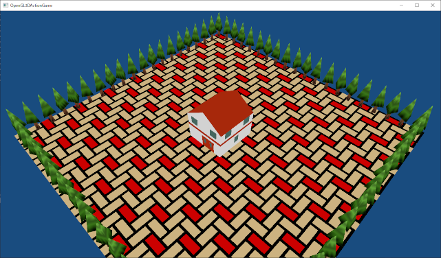
</p>

<div style="page-break-after: always"></div>

## 3. シェーダをファイルから読み込む

### 3.1 

これまでシェーダプログラムは、文字列として直接`Main.cpp`に書いていました。しかし、この方法ではシェーダの内容を書き換えるたびにビルドが必要になってしまいます。そこで、シェーダプログラムをファイルから読み込むように変更しましょう。

まずファイルからシェーダプログラムを作成する関数を宣言します。関数名は`CreateProgramFromFile`(クリエイト・プログラム・フロム・ファイル)とします。`GLContext.h`を開き、次のプログラムを追加してください。

```diff
 GLuint CreateBuffer(GLsizeiptr size, const GLvoid* data);
 GLuint CreateVertexArray(GLuint vboPosition, GLuint vboColor, GLuint vboTexcoord, GLuint ibo);
 GLuint CreateProgram(GLenum type, const GLchar* code);
+GLuint CreateProgramFromFile(GLenum type, const char* filename);
 GLuint CreatePipeline(GLuint vp, GLuint fp);
 GLuint CreateImage2D(GLsizei width, GLsizei height, const void* data, GLenum format, GLenum type);
 GLuint CreateImage2D(const char* filename);
```

関数を定義する前に、ファイルの読み込みに必要な機能を含むヘッダファイルをインクルードします。`GLContext.cpp`を開き、次のプログラムを追加してください。

```diff
 #include "GLContext.h"
 #include <glm/vec2.hpp>
 #include <cstdint>
 #include <fstream>
+#include <sstream>
 #include <vector>
 #include <iostream>
```

`sstream`(エス・ストリーム)ヘッダには、文字列の入出力をサポートする「ストリング・ストリーム」という機能が定義されています。

それでは`CreateProgramFromFile`関数を定義しましょう。`CreateProgram`関数の定義の下に、次のプログラムを追加してください。

```diff
     return 0;
   }
   return program;
 }
+
+/**
+* ファイルからシェーダ・プログラムを作成する.
+*
+* @param type     シェーダの種類.
+* @param filename シェーダファイル名.
+*
+* @retval 0より大きい 作成したプログラム・オブジェクト.
+* @retval 0           プログラム・オブジェクトの作成に失敗.
+*/
+GLuint CreateProgramFromFile(GLenum type, const char* filename)
+{
+  std::ifstream ifs(filename);
+  if (!ifs) {
+    std::cerr << "[エラー]" << __func__ << ":`" << filename << "`を開けません.\n";
+    return 0;
+  }
+  std::stringstream ss;
+  ss << ifs.rdbuf();
+  return GLContext::CreateProgram(type, ss.str().c_str());
+}

 /**
 * パイプライン・オブジェクトを作成する.
```

ファイルを開くのは、画像の読み込みでも使った`std::ifstream`で行います。ファイルを開くことに成功したら、`std::stringstream`(エスティーディ・ストリング・ストリーム)クラスの変数`ss`(エスエス)を定義し、`<<`演算子でファイルストリームからストリングストリームへとデータを読み込みます。

<pre class="tnmai_code"><strong>【書式】</strong><code>
std::ostream& std::ostream::operator<<(ストリームバッファへのポインタ);
</code></pre>

`stringstream`の左シフト演算子(`<<`)は「出力演算子」と呼ばれ、「演算子のオーバーロード」によって「右辺のデータを読み込んで左辺に出力する」機能を持ちます。

>**【演算子の意味は変えないようにしよう】**<br>
>現在の視点では、演算子のオーバーロードを行うときは「演算子の意味を変えない」ことが重要だとされています。しかし、ストリーム型の入力演算子(`>>`)と出力演算子(`<<`)は、まだそういった経験が蓄積されるずっと前に作られたため、演算子の意味を変えてしまっています。これには「オーバーロードにできることの例を示したい」という側面もあったようです。しかし、現在では悪い作法だと言えるでしょう。
>同じオーバーロードでも、例えば`glm::vec4`の`+`演算子や`*`演算子などは四則演算の意味を維持しているため、自然な拡張だと言えます。<br>
>なおC++20では、`std::format`というより便利かつ演算子オーバーロードを使わない出力機能が追加されています。

ストリングストリームに読み込まれたデータは`str`(エスティーアール)メンバ関数で取得できます。ただ、`str`メンバ関数の戻り値は`std::string`型です。`CreateProgram`関数は`const GLchar*`型を要求するため、そのままでは渡せません。こんなときは、`c_str`(シー・エスティーアール)メンバ関数を使って`str::string`から`const char*`に変換します。

<pre class="tnmai_code"><strong>【書式】</strong><code>
const char* std::string::c_str();
</code></pre>

`c_str`メンバ関数は「C言語形式の文字列」を返します。この関数名は`C-style STRing`を短縮したものです。

### 3.2 Pipelineコンストラクタをファイル名に対応させる

続いて`CreateProgramFromFile`関数を使うように`Pipeline`コンストラクタを書き換えます。`Shader.cpp`を開き、`Pipeline`コンストラクタを次のように変更してください。

```diff
 /**
 * コンストラクタ.
 *
-* @param vsCode  頂点シェーダプログラムのアドレス.
-* @param fsCode  フラグメントシェーダプログラムのアドレス.
+* @param vsCode  頂点シェーダファイル名.
+* @param fsCode  フラグメントシェーダファイル名.
 */
 Pipeline::Pipeline(const GLchar* vsCode, const GLchar* fsCode)
 {
-  vp = GLContext::CreateProgram(GL_VERTEX_SHADER, vsCode);
-  fp = GLContext::CreateProgram(GL_FRAGMENT_SHADER, fsCode);
+  vp = GLContext::CreateProgramFromFile(GL_VERTEX_SHADER, vsCode);
+  fp = GLContext::CreateProgramFromFile(GL_FRAGMENT_SHADER, fsCode);
   id = GLContext::CreatePipeline(vp, fp);
 }
```

### 3.3 シェーダプログラムをファイルに移す

これでファイルからシェーダプログラムを作る準備が整ったので、頂点シェーダとフラグメントシェーダをファイルに移していきましょう。頂点シェーダファイルの名前は`Simple.vert`(シンプル・バート)、フラグメントシェーダファイルの名前は`Simple.frag`(シンプル・フラグ)とします。

それでは、ソリューションエクスプローラーの「リソースファイル」を右クリックし、「追加→新しい項目」を選択してください。

<p align="center">
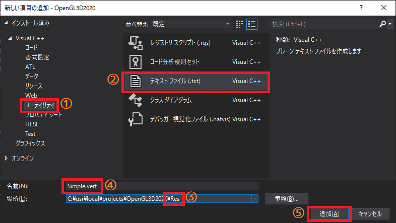
</p>

「新しい項目の追加」ウィンドウが開いたら、まず左側のリストから「ユーティリティ」を探してクリックします(①)。次に中央のリストにある「テキストファイル」をクリックします(②)。

そうしたら、「場所」欄が、プロジェクトの`Res`フォルダを指すように変更してください(③)。フォルダを変更したら、「名前」欄に`Simple.vert`と入力してください(④)。種類、場所、名前がこのテキストの説明とおなじになっていることを確認したら、「追加」ボタンをクリックしてファイルを追加します(⑤)。

続いて`Main.cpp`にある頂点シェーダプログラムを`Simple.vert`に移動します。次のように`Main.cpp`にある頂点シェーダプログラムを範囲選択し、`Ctrl+X`キーを押して切り取ってください。

```diff
  G, G, G, G, G, G, G, G,
  W, G, W, G, W, G, W, G,
};

-/// 頂点シェーダ.
-static const GLchar* const vsCode =
-  "#version 450 \n"
-  "layout(location=0) in vec3 vPosition; \n"
-  "layout(location=1) in vec4 vColor; \n"
-  "layout(location=2) in vec2 vTexcoord; \n"
-  "layout(location=0) out vec4 outColor; \n"
-  "layout(location=1) out vec2 outTexcoord; \n"
-  "out gl_PerVertex { \n"
-  "  vec4 gl_Position; \n"
-  "}; \n"
-  "layout(location=0) uniform mat4 matMVP; \n"
-  "void main() { \n"
-  "  outColor = vColor; \n"
-  "  outTexcoord = vTexcoord; \n"
-  "  gl_Position = matMVP * vec4(vPosition, 1.0); \n"
-  "}";
-
/// フラグメントシェーダ.
static const GLchar* const fsCode =
 ```

`Simple.vert`を開き、`Ctrl+V`キーを押して、切り取ったプログラムを貼り付けてください。

```diff
+/// 頂点シェーダ.
+static const GLchar* const vsCode =
+  "#version 450 \n"
+  "layout(location=0) in vec3 vPosition; \n"
+  "layout(location=1) in vec4 vColor; \n"
+  "layout(location=2) in vec2 vTexcoord; \n"
+  "layout(location=0) out vec4 outColor; \n"
+  "layout(location=1) out vec2 outTexcoord; \n"
+  "out gl_PerVertex { \n"
+  "  vec4 gl_Position; \n"
+  "}; \n"
+  "layout(location=0) uniform mat4 matMVP; \n"
+  "void main() { \n"
+  "  outColor = vColor; \n"
+  "  outTexcoord = vTexcoord; \n"
+  "  gl_Position = matMVP * vec4(vPosition, 1.0); \n"
+  "}";
+
```

次に不要な行を削除します。次のように`Simple.vert`の最初の2行を削除してください。

```diff
-/// 頂点シェーダ.
-static const GLchar* const vsCode =
   "#version 450 \n"
   "layout(location=0) in vec3 vPosition; \n"
   "layout(location=1) in vec4 vColor; \n"
```

続いて、行の先頭の`"`と末尾の`\n"`、それと最後の行の`";`を削除します。頂点シェーダプログラムを次のように書き換えてください。

```diff
-  "#version 450 \n"
-  "layout(location=0) in vec3 vPosition; \n"
-  "layout(location=1) in vec4 vColor; \n"
-  "layout(location=2) in vec2 vTexcoord; \n"
-  "layout(location=0) out vec4 outColor; \n"
-  "layout(location=1) out vec2 outTexcoord; \n"
-  "out gl_PerVertex { \n"
-  "  vec4 gl_Position; \n"
-  "}; \n"
-  "layout(location=0) uniform mat4 matMVP; \n"
-  "void main() { \n"
-  "  outColor = vColor; \n"
-  "  outTexcoord = vTexcoord; \n"
-  "  gl_Position = matMVP * vec4(vPosition, 1.0); \n"
-  "}";
+#version 450
+layout(location=0) in vec3 vPosition;
+layout(location=1) in vec4 vColor;
+layout(location=2) in vec2 vTexcoord;
+layout(location=0) out vec4 outColor;
+layout(location=1) out vec2 outTexcoord;
+out gl_PerVertex {
+  vec4 gl_Position;
+};
+layout(location=0) uniform mat4 matMVP;
+void main() {
+  outColor = vColor;
+  outTexcoord = vTexcoord;
+  gl_Position = matMVP * vec4(vPosition, 1.0);
+}
```

全部の行がつながっていると見づらいので、適宜空白とコメントを追加しましょう。頂点シェーダプログラムを次のように書き換えてください。

```diff
 #version 450
+
+// 入力変数
 layout(location=0) in vec3 vPosition;
 layout(location=1) in vec4 vColor;
 layout(location=2) in vec2 vTexcoord;
+
+// 出力変数
 layout(location=0) out vec4 outColor;
 layout(location=1) out vec2 outTexcoord;
 out gl_PerVertex {
   vec4 gl_Position;
 };
+
+// ユニフォーム変数
 layout(location=0) uniform mat4 matMVP;
+
+// 頂点シェーダプログラム
 void main() {
   outColor = vColor;
   outTexcoord = vTexcoord;
   gl_Position = matMVP * vec4(vPosition, 1.0);
 }
```

<pre class="tnmai_assignment">
<strong>【課題02】</strong>
<code>Simple.vert</code>を参考にして、フラグメントシェーダプログラムを<code>Simple.frag</code>に移動しなさい。
</pre>

### 3.4 シェーダファイルを読み込む

ファイルに移動させたシェーダプログラムを読み込みましょう。`Main.cpp`を開き、パイプラインオブジェクトを作成するプログラムを、次のように書き換えてください。

```diff
   // パイプライン・オブジェクトを作成する.
-  Shader::Pipeline pipeline(vsCode, fsCode);
+  Shader::Pipeline pipeline("Res/Simple.vert", "Res/Simple.frag");
   if (!pipeline) {
     return 1;
   }
```

変更を終えたら、ビルドして実行してください。イカの画像のように、これまでと同じ画面が表示されたら成功です。

* 何も表示されなかった場合は頂点シェーダプログラムを見直しましょう。
* 図形が全部真っ黒になってしまう場合はフラグメントシェーダプログラムを見直しましょう。

<p align="center">

</p>

### 3.5 シェーダプログラムを読みやすくする

Visual Studioにはプログラム開発を支援する機能があって、単語に色を付けてくれたり、単語の候補を表示したり、間違った部分に赤い波線を表示したりしてくれます。しかしこれらの支援機能は`C++`や`C#`などのVisual Studioが知っている言語でしか働きません。

そして、Visual Studioは`GLSL`についてなにも知りません。そのため、シェーダプログラムの開発ではこれらの支援を受けられません。これはとても不便です。

ですが安心してください。Visual Studioには、本来持っていない機能を追加できる「拡張機能」というものがあるんです(ゲームのMODのようなものです)。「`GLSL`でも支援機能が働くようにする」という拡張機能を追加すれば、シェーダプログラムでもさまざまな支援を受けられるようになります。

では早速、機能を追加しましょう。ウィンドウ上部のメニューから「拡張機能→拡張機能の管理」を選択してください。すると、次のような「拡張機能の管理」ウィンドウが開きます。

<p align="center">
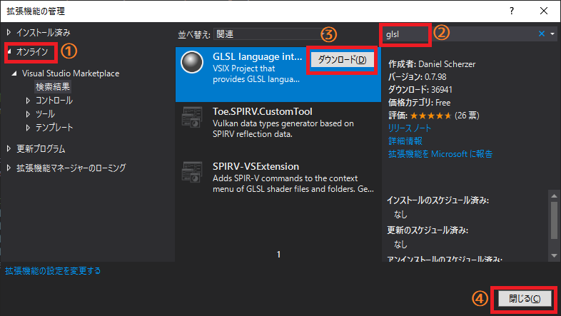
</p>

まず左のリストにある「オンライン」をクリックします(①)。次に、右上のテキストボックスに「glsl」と入力してください(②)。すると、中央のリストの内容が変化します。

中央のリストから「GLSL language Integration」(ジーエルエスエル・ランゲージ・インテグレーション、GLSL言語の統合)という項目を探してクリックします。すると「ダウンロード」ボタンが表示されるので、これをクリックしてください(③)。

ダウンロードが完了するとウィンドウ下部の色が変化し、「Visual Studoを終了したらインストールしてやる」みたいなメッセージが表示されます。そうしたら右下の「閉じる」ボタンをクリックしてウィンドウを閉じます(④)。

ウィンドウを閉じたら、先程のメッセージに従ってVisual Studioを終了させてください。しばらくすると、下のようなウィンドウが表示されますので、「はい」を選択してください。

<p align="center">
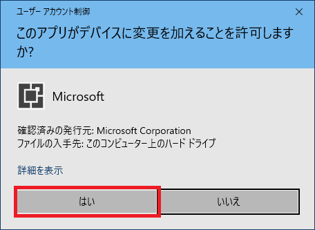
</p>

今度は次のような「GLSL language integration」のインストーラが表示されます。

<p align="center">
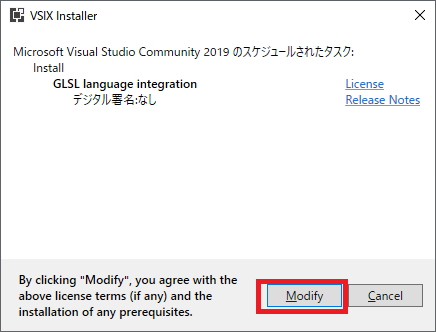
</p>

「Modify」(モディファイ)ボタンをクリックするとインストールが始まります。インストール完了までしばらくお待ち下さい。

正常にインストールが行われたら、インストーラの表示が次のように変わります。「Close」(クローズ)ボタンをクリックしてインストーラを終了させてください。

<p align="center">
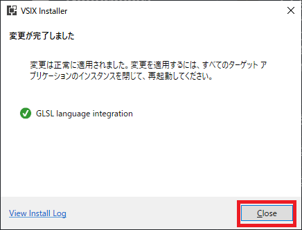
</p>

インストーラを終了したら、Visual Studioを起動してください。シェーダファイルを開いたとき、次の画像のように単語に色が付いていたらインストール成功です。

<p align="center">
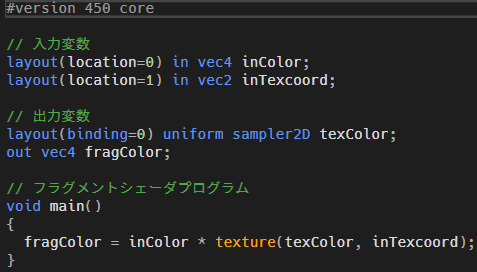
</p>

<div style="page-break-after: always"></div>

## 2. 明かりを灯す

### 2.1 ライティング

現実世界はさまざまな色であふれています。真っ白な壁でも、よく見ると微妙な陰影がついています。なぜなら、さまざまな角度から来た光に照らされているからです。現実世界では、光があるからこそ物体を見ることができるのです。
実は、みなさんが作った世界にも光はあります。詳しいことは後で説明しますが、みなさんが書いたシェーダは「世界全体が均一な光で包まれている」状態を表現しているのです。だから木や家に色が付いて表示されるんですね。

しかし、「均一な光で包まれている」状態では陰影を表現することができません。頂点の色を調整すればそれらしい陰影を付けることはできますが、物体が回転した途端に御破算です。また、現実世界の太陽などは、時刻によって異なる方向から光を投げかけてくれますよね。だからこそ、朝や昼、夕方や夜という一日の移り変わりがあるわけです。しかし、均一な光ではこれを再現できません。そこで、もう少しだけ複雑な光の表現を追加していきます。

OpenGLの世界では「光」もまたデータの一種です。そして、「光のデータをもとに物体表面の明るさを計算する」ことによって、画面に表示する色が決まります。この工程を「ライティング」といいます。OpenGLの世界では、ライティングはシェーダーのお仕事です。ですから、光のデータをシェーダに送る必要があります。

### 2.2 <ruby>法線<rt>ほうせん</rt></ruby>

光が物体を照らす明るさは、光の位置と物体の表面の角度によって決まります。これを決めるために「物体の表面の向き」、という情報もシェーダに送らなければなりません。

「物体の表面の角度」をより詳しく説明すると、「物体表面のある点に接する平面(接平面)において、物体の外側へ向かう垂直な直線」ということになります。このような直線を「法線」(ほうせん)と呼びます。

<p align="center">

<br>
[立方体と球の法線(赤い矢印)]
</p>
コンピュータグラフィックスでは、法線を「長さ1のベクトル」として表します。「長さ1のベクトル」のことを「単位ベクトル」といいます。「単位ベクトル」は次式を満たすようなベクトルのことです。

`1= √(x^2+y^2+z^2 )`

>**【なぜ垂線ではなく法線と言うの？】**<br>
> 「法線」という名前は、英語の`normal`(ノーマル)を翻訳したものです。ただ、「normal」の翻訳が何故「法線」になったのか、正確なところは伝わっていません。<br>
>`normal`には「標準、規則、垂直」などの意味があるのですが、日本語ではこれらを一語で表せる単語がありません。そのため、この単語が最初に舶来したときに「規則→法」という翻訳がなされ、数学書に書かれている`normal`にも同じ訳があてられたという説があります。<br>
>また、先に中国で訳されたものが入ってきたという説もあります。しかし、いずれも噂に過ぎず、真相は不明です。

### 2.3 頂点データに法線(normal)を追加する

「物体の表面の向き」のことを「法線」(ほうせん)といいます。物体の法線をデータ化するにはいくつかの方法がありますが、最も一般的なのは「頂点座標における法線」を追加することです。

ということで、まず地面の法線データを追加しましょう。下図のように地面はまっすぐ上を向いています。そのため、地面の法線(物体の表面の向き)を表すベクトルは全て`(0, 1, 0)`となります。

<p align="center">
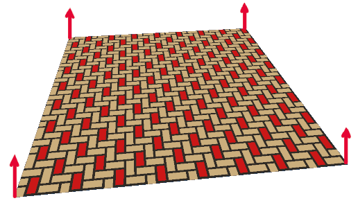
</p>

法線データの変数名は`normGround`(ノルム・グラウンド)とします。`Main.cpp`を開き、立方体のテクスチャ座標データの下に、次のプログラムを追加してください。

```diff
   { 1.0f / 4.0f, 2.0f / 3.0f},
   { 0.0f / 4.0f, 2.0f / 3.0f},
 };
+
+// 法線データ: 地面
+const glm::vec3 normGround[] = {
+  { 0, 1, 0 },
+  { 0, 1, 0 },
+  { 0, 1, 0 },
+  { 0, 1, 0 },
+};

 // インデックスデータ: 地面
 const GLushort indexGround[] = {
   0, 1, 2, 2, 3, 0,
```

続いて木の法線データを追加します。地面と比べると木は複雑な形状をしています。そのため、下図のように法線も多少ややこしいものになります。


一般的に、頂点の法線は「頂点に接する全ての面の法線の平均したもの」になります。実際に木の法線データは、頂点に接する面法線を平均して、長さがおおよそ1になるような値に設定してあります。

<p align="center">
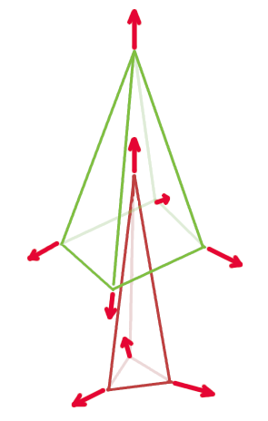
</p>

地面の法線データの下に、次のプログラムを追加してください。

```diff
   { 0, 1, 0 },
   { 0, 1, 0 },
 };
+
+// 法線データ: 木
+const glm::vec3 normTree[] = {
+  { 0.00f, 1.00f, 0.00f},
+  { 0.00f,-0.44f,-0.90f},
+  {-0.90f,-0.44f, 0.00f},
+  { 0.00f,-0.44f, 0.90f},
+  { 0.90f,-0.44f, 0.00f},
+  { 0.00f, 1.00f, 0.00f},
+  { 0.00f, 0.00f,-1.00f},
+  {-0.87f, 0.00f, 0.49f},
+  { 0.87f, 0.00f, 0.49f},
+};

 // インデックスデータ: 地面
 const GLushort indexGround[] = {
   0, 1, 2, 2, 3, 0,
```

<pre class="tnmai_assignment">
<strong>【課題03】</strong>
家と立方体の法線データを作成しなさい。法線はすべて<code>(0, 1, 0)</code>で構いません。変数名は<code>normHouse</code>、<code>normCube</code>としてください。
</pre>

### 2.4 CreateVertexArray関数を法線データに対応させる

法線データをシェーダに送るには、`VAO`に法線データを追加する必要があります。`GLContext.h`を開き、`CreateVvertexArray`関数の宣言を次のように書き換えてください。

```diff
 namespace GLContext {

 GLuint CreateBuffer(GLsizeiptr size, const GLvoid* data);
 GLuint CreateVertexArray(GLuint vboPosition, GLuint vboColor,
-  GLuint vboTexcoord, GLuint ibo);
+  GLuint vboTexcoord, GLuint vboNormal, GLuint ibo);
 GLuint CreateProgram(GLenum type, const GLchar* code);
 GLuint CreateProgramFromFile(GLenum type, const char* filename);
```

次に`GLContext.cpp`を開き、`CreateVertexArray`関数の定義を次のように書き換えてください。

```diff
 * @param vboColor    VAOに関連付けられるカラーデータ.
 * @param vboTexcoord VAOに関連付けられるテクスチャ座標データ.
+* @param vboNormal   VAOに関連付けられる法線データ.
 * @param ibo         VAOに関連付けられるインデックスデータ.
 *
 * @return 作成したVAO.
 */
 GLuint CreateVertexArray(GLuint vboPosition, GLuint vboColor,
+  GLuint vboTexcoord, GLuint ibo)
+  GLuint vboTexcoord, GLuint vboNormal, GLuint ibo)
 {
-  if (!vboPosition || !vboColor || !vboTexcoord || !ibo) {
+  if (!vboPosition || !vboColor || !vboTexcoord || !vboNormal || !ibo) {
     return 0;
   }
```

続いて頂点アトリビュートを設定します。0～2番は使用済みなので3番に割り当てましょう。それでは、`vboTexcoord`をバインディング・ポイントに割り当てるプログラムの下に、次のプログラムを追加してください。

```diff
   glVertexArrayVertexBuffer(
     id, texcoordBindingIndex, vboTexcoord, 0, sizeof(glm::vec2));
+
+  const GLuint normalIndex = 3;
+  const GLuint normalBindingIndex = 3;
+  glEnableVertexArrayAttrib(id, normalIndex);
+  glVertexArrayAttribFormat(id, normalIndex, 3, GL_FLOAT, GL_FALSE, 0);
+  glVertexArrayAttribBinding(id,normalIndex, normalBindingIndex);
+  glVertexArrayVertexBuffer(
+    id, normalBindingIndex, vboNormal, 0, sizeof(glm::vec3));

   glVertexArrayElementBuffer(id, ibo);

   return id;
```

`glVertexArrayAttribFormat`関数に指定する「要素数」が`3`になること、`glVertexArrayVertexBuffer`関数に指定する「要素間の距離」が`sizeof(glm::vec3)`になることに注意してください。

### 2.5 PrimitiveBufferクラスを法線データに対応させる

`CreateVertexArray`関数は`PrimitiveBuffer`クラスで使われているので、そちらも変更しなければなりません。そのためには、法線データを格納するための`VBO`変数が必要となります。`Mesh.h`を開き、`PrimitiveBuffer`クラスに次のメンバ変数を追加してください。

```diff
   GLuint vboPosition = 0;
   GLuint vboColor = 0;
   GLuint vboTexcoord = 0;
+  GLuint vboNormal = 0;
   GLuint ibo = 0;
   GLuint vao = 0;
```

続いて、追加した`vboNormal`変数にGPUメモリを割り当てましょう。`Mesh.cpp`を開き、`PrimitiveBuffer::Allocate`関数を次のように書き換えてください。

```diff
   vboColor = GLContext::CreateBuffer(sizeof(glm::vec4) * maxVertexCount, nullptr);
   vboTexcoord = GLContext::CreateBuffer(sizeof(glm::vec2) * maxVertexCount, nullptr);
+  vboNormal = GLContext::CreateBuffer(sizeof(glm::vec3) * maxVertexCount, nullptr);
   ibo = GLContext::CreateBuffer(sizeof(GLushort) * maxIndexCount, nullptr);
-  vao = GLContext::CreateVertexArray(vboPosition, vboColor, vboTexcoord, ibo);
-  if (!vboPosition || !vboColor || !vboTexcoord || !ibo || !vao) {
+  vao = GLContext::CreateVertexArray(vboPosition, vboColor, vboTexcoord, vboNormal, ibo);
+  if (!vboPosition || !vboColor || !vboTexcoord || !vboNormal || !ibo || !vao) {
     std::cerr << "[エラー]" << __func__ << ": VAOの作成に失敗.\n";
     Free();
     return false;
   }
```

### 2.6 Addメンバ関数を法線データに対応させる

さらに、`Add`メンバ関数が法線データを追加できるようにします。`Mesh.h`を開き、`Add`メンバ関数の宣言を次のように書き換えてください。

```diff
   // プリミティブの追加と参照.
   bool Add(size_t vertexCount, const glm::vec3* pPosition, const glm::vec4* pColor,
-    const glm::vec2* pTexcoord, size_t indexCount, const GLushort* pIndex);
+    const glm::vec2* pTexcoord, const glm::vec3* pNormal,
+    size_t indexCount, const GLushort* pIndex);
   const Primitive& Get(size_t n) const;

   // VAOバインド管理.
```

続いて定義も変更していきましょう。`Mesh.cpp`を開き、`Add`メンバ関数の定義を次のように書き換えてください。

```diff
 * @param pColor      色データへのポインタ.
 * @param pTexcoord   テクスチャ座標データへのポインタ.
+* @param pNormal     法線データへのポインタ.
 * @param indexCount  追加するインデックスデータの数.
 * @param pIndex      インデックスデータへのポインタ.
 *
 * @retval true  追加成功.
 * @retval false 追加失敗.
 */
 bool PrimitiveBuffer::Add(size_t vertexCount, const glm::vec3* pPosition,
-  const glm::vec4* pColor, const glm::vec2* pTexcoord,
+  const glm::vec4* pColor, const glm::vec2* pTexcoord, const glm::vec3* pNormal,
   size_t indexCount, const GLushort* pIndex)
 {
   if (!vao) {
```

```diff
   if (!CopyData(vboTexcoord, sizeof(glm::vec2), curVertexCount, vertexCount, pTexcoord)) {
     return false;
   }
+  if (!CopyData(vboNormal, sizeof(glm::vec3), curVertexCount, vertexCount, pNormal)) {
+    return false;
+  }
   if (!CopyData(ibo, sizeof(GLushort), curIndexCount, indexCount, pIndex)) {
     return false;
   }
```

これで`PrimitiveBuffer`クラスに法線データを設定できるようになりました。

### 2.7 Addメンバ関数に法線データを渡す

それでは、法線データを設定しましょう。`Main.cpp`を開き、プリミティブを追加するプログラムを次のように書き換えてください。

```diff
   if (!primitiveBuffer.Allocate(20'000, 80'000)) {
     return 1;
   }
-  primitiveBuffer.Add(std::size(posGround), posGround, colGround, tcGround,
+  primitiveBuffer.Add(std::size(posGround), posGround, colGround, tcGround, normGround,
     std::size(indexGround), indexGround);
-  primitiveBuffer.Add(std::size(posTree), posTree, colTree, tcTree,
+  primitiveBuffer.Add(std::size(posTree), posTree, colTree, tcTree, normTree,
     std::size(indexTree), indexTree);
-  primitiveBuffer.Add(std::size(posHouse), posHouse, colHouse, tcHouse,
+  primitiveBuffer.Add(std::size(posHouse), posHouse, colHouse, tcHouse, normHouse,
     std::size(indexHouse), indexHouse);
-  primitiveBuffer.Add(std::size(posCube), posCube, colCube, tcCube,
+  primitiveBuffer.Add(std::size(posCube), posCube, colCube, tcCube, normCube,
     std::size(indexCube), indexCube);

  // パイプライン・オブジェクトを作成する.
```

### 2.8 ライティング・シェーダを作成する

ここからは、法線データを使って光の処理を行うシェーダを書いていきます。`Simple.vert`を追加したときのことを参考にして、`Res`フォルダに`VertexLighting.vert`(バーテックス・ライティング・バート)というファイルを追加してください。そして、`Simple.vert`の内容をコピーし、`VertexLighting.vert`に貼り付けてください。

```diff
+#version 450 core
+
+// 入力変数
+layout(location=0) in vec3 vPosition;
+layout(location=1) in vec4 vColor;
+layout(location=2) in vec2 vTexcoord;
+
+// 出力変数
+layout(location=0) out vec4 outColor;
+layout(location=1) out vec2 outTexcoord;
+out gl_PerVertex {
+  vec4 gl_Position;
+};
+
+// ユニフォーム変数
+layout(location=0) uniform mat4 matMVP;
+
+// 頂点シェーダプログラム
+void main()
+{
+  outColor = vColor;
+  outTexcoord = vTexcoord;
+  gl_Position = matMVP * vec4(vPosition, 1.0);
+}
```

次に、法線を受け取る入力変数を追加します。テクスチャ座標の入力変数定義の下に、次のプログラムを追加してください。

```diff
 layout(location=0) in vec3 vPosition;
 layout(location=1) in vec4 vColor;
 layout(location=2) in vec2 vTexcoord;
+layout(location=3) in vec3 vNormal;

 // 出力変数
 layout(location=0) out vec4 outColor;
```

次に、法線を変換する行列`matNormal`(マット・ノーマル)と、光のデータ`directionalLight`(ディレクショナル・ライト)を、ユニフォーム変数として定義します。`matMVP`変数の定義の下に、次のプログラムを追加してください。

```diff
 // ユニフォーム変数
 layout(location=0) uniform mat4 matMVP;
+layout(location=1) uniform mat3 matNormal;
+
+// 並行光源
+struct DirectionalLight {
+  vec4 direction;
+  vec4 color;
+};
+layout(location=2) uniform DirectionalLight directionalLight;

 // 頂点シェーダプログラム
 void main()
```

光を放つ物体を「ライト」あるいは「光源(こうげん)」と呼びます。ライトにも様々な種類がありますが、今回は「並行光源(へいこうこうげん)」と呼ばれるものを追加します。

「並行光源」は、太陽や月のように「非常に遠くにあって、強力な光を放つ物体」を表現するためのライトです。単一の方向に平行な光線を放つので「平行光源」というわけです。

<p align="center">
<br>
[平行光源]
</p>

平行光源はふたつのパラメーターによって定義されます。ひとつは光の方向、もうひとつは光の色です。上記のプログラムでは、それぞれ`direction`(ディレクション、「方向」という意味)と`color`(カラー)という2つのメンバ変数を定義しています。

>**【GLSLの構造体】**<br.
>GLSLの構造体はおおむねC++言語のものと同じですが、以下のような違いがあります。
>
>* 無名構造体を定義することはできません。
>* 構造体の中に構造体を定義することはできません。
>  もちろん、グローバルに定義した構造体を、別の構造体のメンバにすることは可能です。
>* シェーダの入出力(in/out修飾子のついた変数)としては使えません。
>* C++のコンストラクタのように「構造体名()」の形で初期化することができます。

### 2.9 ランバート反射

コンピューター・グラフィックスでは、物体の表面の明るさも計算で算出します。しかし、現実世界を再現しようとすると膨大な計算が必要で、ゲームのように1/60秒で画面を描き出すことは不可能です(Q: CG映画の1画面分の計算にどれだけの時間がかかるでしょう？　A: 数万個のCPUを使って、短くて数時間、長ければ数日)。

そんなわけで、簡単な計算でそれっぽい見た目になるさまざまな方法が考え出されました。今回は、そんな方法のひとつである「ランバート反射」を使うことにします。

ランバート反射は、「物体のある点で反射した光(反射光)の強さは、その点の法線と光源方向のなす角θの余弦(コサイン)と正比例する」という法則(「ランベルトの余弦則」といいます)を利用した計算方法です。ランバート反射は次の図で表されます。

<p align="center">
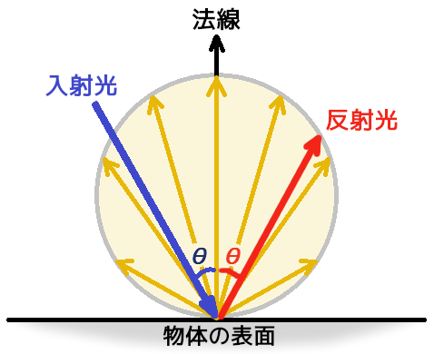
</p>

壁を懐中電灯で照らしているとします。懐中電灯の向きを徐々に斜めに傾けていくと、壁に当たる光は徐々に横に伸びていきます。そして、壁と水平になるまで傾けると、光は壁に沿ってまっすぐ向こう側に飛んでいき、壁にはまったく当たりません。

<p align="center">

</p>

上図の赤い線は、角度によって光が照らす面積がどう変わるかを表しています。正面から照らしたときの面積を1とすると、45°で照らしたときの面積は1.4倍になります。60°で照らしたときの面積は2倍、75°だと3.8倍にもなります。つまり、角度によって光が照らす面積が変化するわけです。

しかし、懐中電灯から出る光の量は決まっています。そのため、照らす面積が増えると、面積あたりの光の量は減っていきます。角度が増えると見かけの明るさが弱くなるのはこのためです。

そして、この面積の変化は`cos`で表すことができます。これが、`cos`が現実の多くの物体が持つ「光が垂直に入射してきたときが最も明るく、表面に対して入射角度がきつくなるほど暗くなる」という性質を表すことができる理由です。

それではランバート反射を実装しましょう。`VertexLighting.vert`の`main`関数に、次のプログラムを追加してください。

```diff
 void main()
 {
+  vec3 normal = matNormal * vNormal;
+  float costheta = max(dot(normal, -directionalLight.direction.xyz), 0);
-  outColor = vColor;
+  outColor = vColor * directionalLight.color * costheta;
   outTexcoord = vTexcoord;
   gl_Position = matMVP * vec4(vPosition, 1.0);
 }
```

まずは法線の向きを計算します。一般的に、光の向きはワールド座標系で定義します。しかし、法線はモデル座標系で定義されています。座標系が異なると正しい計算ができないので、まずは法線と光の座標系を合わせなくてはなりません。この変換を行う行列を「法線行列(<ruby>normal matrix<rt>ノーマル・マトリクス</rt></ruby>>)」といいます。

そのために、`matNormal`には、モデル座標系の法線をワールド座標系の法線に変換する行列を設定しておきます。

ワールド座標系の法線を計算したら、いよいよランバート反射の計算です。上記のプログラムにおいて、ランバート反射は`dot`(ドット)関数で表されています。`dot`は内積を計算するGLSLの関数です。2つのベクトルの内積は以下の式で表されます。

`ベクトルAの長さ×ベクトルBの長さ×cosθ`

ここで「向きは長さ1のベクトルで表す」という取り決めが生きてきます。AとBの長さが1のとき、ベクトルの内積は`cosθ`と等しくなるからです。なお、物体から見た光源方向は、光の向きの真逆になるため、マイナスをつけて符号を反転していることに注意してください。

ランバート反射の式の外側にある`max`(マックス)もGLSLの関数です。この関数は、2つの数値のうち大きい方を返します。上記のプログラムでは、内積の結果がマイナスにならないようにする役割があります。というのは、光が物体表面の反対側から入射している場合、`cosθ`は負の値になりますが、マイナスの明るさはありえないからです。

ランバート反射の強さが得られたら、あとはその強さとライトの色、そして物体の色の3つを掛け合わせることで最終的な色が決まります。

乗算なので、色成分が`0`の場合はどんなに強い光を当てても`0`のままです。現実の物体は、たとえ純粋な赤色に見えるものでも、実際にはわずかに緑や青の色成分が含まれます。現在最も黒い物質と呼ばれる「ベンタブラック」ですら光の`0.04%`は反射します。色成分が`0`になるのはブラックホールくらいでしょう。

>**【表示する色の計算式】**<br>
>表示する色 = 物体の色 × ライトの色 × cos(ライトの向きと法線がなす角)<br>
>
>例)<br>
>表示する色 = (0.5, 0.9, 0.2) × (1.0, 1.0, 0.7) × cos(60°)<br>
>&emsp;= (0.5, 0.9, 0.2) × (1.0, 1.0, 0.7) × 0.5<br>
>&emsp;= (0.5, 0.9, 0.2) × (0.5, 0.5, 0.35)<br>
>&emsp;= (0.25, 0.45, 0.07)

<pre class="tnmai_assignment">
<strong>【課題04】</strong>
<code>(1.0, 1.0, 0.7)</code>という色の光が<code>(0.5, 0.2, 0.1)</code>という色の物体に対して垂直方向に入射したときの、最終的な色を求めなさい。計算にはWindows 10の電卓アプリ(左上の「三」をクリックして「関数電卓」を選ぶとよい)や、スマホの電卓アプリなどを使うとよいでしょう。
</pre>

<pre class="tnmai_assignment">
<strong>【課題05】</strong>
課題04の光と物体について、光が30°、45°、60°の角度で入射したときの最終的な色を、小数点以下第2位まで求めなさい。ただし、<code>cos30°=0.87</code>, <code>cos45°=0.7</code>, <code>cos60°=0.5</code>とします。
</pre>

>**【ランバート？　ランベルト？】**<br>
>「ランベルトの余弦則」と「ランバート反射」は、これを発見したドイツの数学者「ヨハン・ハインリヒ・ランベルト(Johann Heinrich Lambert)」の名前にちなんでなづけられました。微妙な名前の違いは、分野による読み方の慣習によります。数学徒はドイツ語読みで「ランベルト」、物理学徒は英語読みで「ランバート」と呼んだ、ということです。

### 2.10 ライトデータを転送するメンバ関数を定義する

`VertexLighting.vert`には、2つのユニフォーム変数を追加しました。ということは、そこにデータを転送するプログラムが必要になります。まずはシェーダと同じ構造体を定義します。`Shader.h`を開き、`Shader`名前空間の先頭に次のプログラムを追加してください。

```diff
 #include <glm/glm.hpp>

 namespace Shader {
+
+/**
+* 平行光源.
+*/
+struct DirectionalLight
+{
+  glm::vec4 direction; // 向き.
+  glm::vec4 color;     // 色.
+};

 /**
 * プログラム・パイプライン.
```

次に、データを転送するためのメンバ関数を追加します。法線行列を転送するメンバ関数は`SetNormalMatrix`(セット・ノーマル・マトリクス)、ライトデータを転送するメンバ関数は`SetLight`(セット・ライト)という名前にします。`Pipeline`クラスの定義に次のプログラムを追加してください。

```diff
   void Bind() const;
   void Unbind() const;
   bool SetMVP(const glm::mat4&) const;
+  bool SetNormalMatrix(const glm::mat3&) const;
+  bool SetLight(const DirectionalLight& light) const;

 private:
   GLuint id = 0;
```

続いて`SetLight`メンバ関数を定義します。`SetNormalMatrix`メンバ関数の定義の下に、次のプログラムを追加してください。

```diff

     std::cerr << "[エラー]" << __func__ << ":MVP行列の設定に失敗.\n";
     return false;
   }
   return true;
 }
+
+/**
+* シェーダにライトデータを設定する.
+*
+* @param light 設定するライトデータ.
+*
+* @retval true  設定成功.
+* @retval false 設定失敗.
+*/
+bool Pipeline::SetLight(const DirectionalLight& light) const
+{
+  glGetError(); // エラー状態をリセット.
+
+  const GLint locDirLight = 2;
+  glProgramUniform4fv(vp, locDirLight, 1, &light.direction.x);
+  glProgramUniform4fv(vp, locDirLight + 1, 1, &light.color.x);
+  if (glGetError() != GL_NO_ERROR) {
+    std::cerr << "[エラー]" << __func__ << ":並行光源の設定に失敗.\n";
+    return false;
+  }
+  return true;
+}

 /**
 * プログラムパイプラインのバインドを解除する.
```

この関数の内容は`SetMVP`メンバ関数とほぼ同じですが、転送するデータの型と数違います。型が`glm::vec4`なので、転送には`glProgramUniform4fv`(ジーエル・プログラム・ユニフォーム・フォー・エフ・ブイ)を使います。また、構造体のメンバ変数は個別に転送しなければならないため、この関数を2回呼んでいます。

### 2.11 法線行列を設定するメンバ関数を追加する

続いて`SetNormalMatrix`メンバ関数を定義します。`Shader.cpp`を開き、`SetMVP`メンバ関数の定義の下に、次のプログラムを追加してください(定義順が前後しますので注意してください)。

```diff
     std::cerr << "[エラー]" << __func__ << ":MVP行列の設定に失敗.\n";
     return false;
   }
   return true;
 }
+
+/**
+* シェーダに法線行列を設定する.
+*
+* @param matNormal 設定する法線行列.
+*
+* @retval true  設定成功.
+* @retval false 設定失敗.
+*/
+bool Pipeline::SetNormalMatrix(const glm::mat3& matNormal) const
+{
+  glGetError(); // エラー状態をリセット.
+
+  const GLint locMatNormal = 1;
+  glProgramUniformMatrix3fv(vp, locMatNormal, 1, GL_FALSE, &matNormal[0][0]);
+  if (glGetError() != GL_NO_ERROR) {
+    std::cerr << "[エラー]" << __func__ << ":法線行列の設定に失敗.\n";
+    return false;
+  }
+  return true;
+}

 /**
 * シェーダにライトデータを設定する.
```

基本的なプログラムは`SetMVP`や`SetLight`メンバ関数と同じです。しかし、転送先のロケーション番号が`1`になっていること、転送に使う関数が`glProgramUniformMatrix4fv`でなく`glProgramUniformMatrix3fv`(ジーエル・プログラム・ユニフォーム・マトリクス・スリー・エフ・ブイ)になっていることには特に注意してください。

これでデータ転送関数は完成です。

### 2.12 ライティングシェーダを読み込む

それでは、作成した`VertexLighting.vert`からプログラム・オブジェクトを作成しましょう。`Main.cpp`を開き、プログラムパイプラインオブジェクトを作成するプログラムを、次のように書き換えてください。

```diff
   primitiveBuffer.Add(std::size(posCube), posCube, colCube, tcCube, normCube,
     std::size(indexCube), indexCube);

   // パイプライン・オブジェクトを作成する.
+  Shader::Pipeline pipeline("Res/VertexLighting.vert", "Res/Simple.frag");
   if (!pipeline) {
     return 1;
   }
```

フラグメントシェーダは`Simple.frag`を使い回します。

### 2.13 ライトデータを転送する

続いてライトデータを転送します。バックバッファを消去するプログラムの下に、次のプログラムを追加してください。

```diff
     glClearColor(0.1f, 0.3f, 0.5f, 1.0f);
     glClear(GL_COLOR_BUFFER_BIT | GL_DEPTH_BUFFER_BIT);
+
+    // 平行光源を設定する
+    const Shader::DirectionalLight directionalLight{
+      glm::normalize(glm::vec4(3, 2, 2, 0)),
+      glm::vec4(2, 1.9f, 1.8f, 1)
+    };
+    pipeline.SetLight(directionalLight);

     // 視点を回転させる.
     const float degree = static_cast<float>(std::fmod(glfwGetTime() * 10.0, 360.0));
```

平行光源の向きは、原点から「右に3m、下に2m、前に2m」に移動した位置を指すようなベクトルです。ただし、向きのベクトルは「単位ベクトル(長さが1のベクトル)」になっている必要があります。長さが異なるベクトル同士で比較や計算をすると、思うような結果が得られないからです。

単位ベクトルの作成には`glm::normalize`(ジーエルエム・ノーマライズ)関数を使います。この関数は、引数に設定したベクトルと同じ向きで、長さが1のベクトルを返します。

<pre class="tnmai_code"><strong>【書式】</strong>
単位向きベクトル glm::normalize(向きベクトル);
</pre>

>**【単位ベクトルを使うわけ】**<br>
>向きベクトル同士の計算は長さが揃ってさえいれば、その長さが0.3や20であっても計算自体は可能です。しかしその場合はもとの長さに戻すための計算が必要となります。例えば長さ0.3同士の乗算は長さが0.09になってしまうので、元の0.3に戻すために追加の乗算をしなければなりません。単位ベクトルはこの処理を省くことができるので都合がいいのです。

光の色は頂点の色と同じく「赤、緑、青」の成分で設定します(アルファは設定しますが使いません)。今回は太陽光に似せて白に近い黄色としました。また、色は通常0～1の範囲で指定しますが、光が斜めから当たると明るさが低下することを考慮して、通常より大きい値を指定することにしました。

### 2.14 法線行列を転送する

続いて法線行列を転送します。地面を描画するプログラムに、次のプログラムを追加してください。

```diff
     const glm::mat4 matModel = glm::mat4(1);
     const glm::mat4 matMVP = matProj * matView * matModel;
     pipeline.SetMVP(matMVP);
+    pipeline.SetNormalMatrix(glm::transpose(glm::inverse(matModel)));
     texGround.Bind(0);
     primitiveBuffer.Get(0).Draw();
```

法線行列は、モデル行列の回転成分のみを抜き出したものです。なぜモデル行列をそのまま使えないかと言うと、向きを変える操作に大きさや位置を影響させると、正しい結果が得られないからです。

モデル行列から回転成分だけを取り出すには`glm::inverse`(ジーエルエム・インバース)関数と`glm::transpose`(ジーエルエム・トランスポーズ)関数の2つを組み合わせます。

<pre class="tnmai_code"><strong>【書式】</strong>
逆行列 glm::inverse(行列);
</pre>

<pre class="tnmai_code"><strong>【書式】</strong>
転置行列 glm::transpose(行列);
</pre>

`glm::inverse`関数は「逆行列」を計算します。`glm::transpose`関数は「転置行列」を計算します。詳しい証明は省きますが、この2つの関数を組み合わせると、モデル行列から法線行列を作成することができるのです。

同じように、家の法線行列を設定します。家を描画するプログラムに、次のプログラムを追加してください。

```diff
     const glm::mat4 matModel = glm::mat4(1);
     const glm::mat4 matMVP = matProj * matView * matModel;
     pipeline.SetMVP(matMVP);
+    pipeline.SetNormalMatrix(glm::transpose(glm::inverse(matModel)));
     texHouse.Bind(0);
     primitiveBuffer.Get(2).Draw();
```

<pre class="tnmai_assignment">
<strong>【課題06】</strong>
木と立方体の法線行列を設定しなさい。
</pre>

課題06が完了したら、プログラムをビルドして実行してください。木や家に陰影が付いていたら成功です(木の陰影は分かりづらいかもしれません)。

<p align="center">
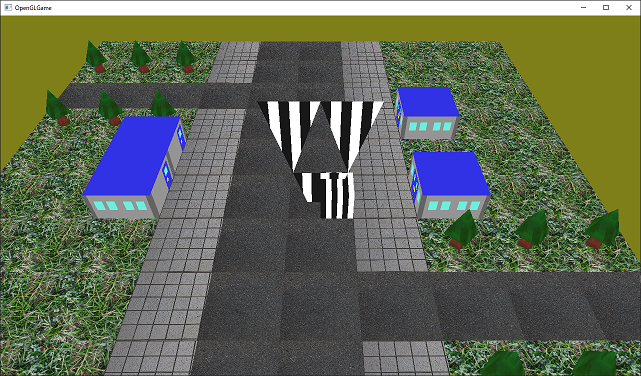
</p>
