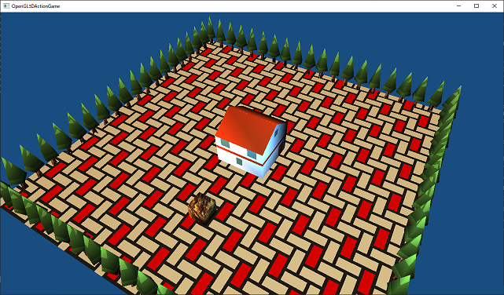
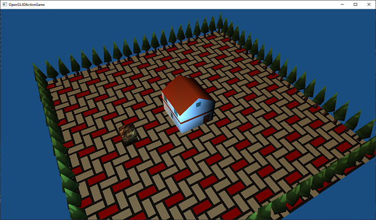
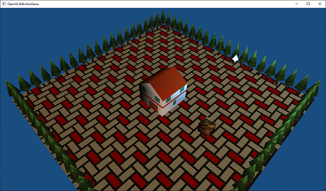
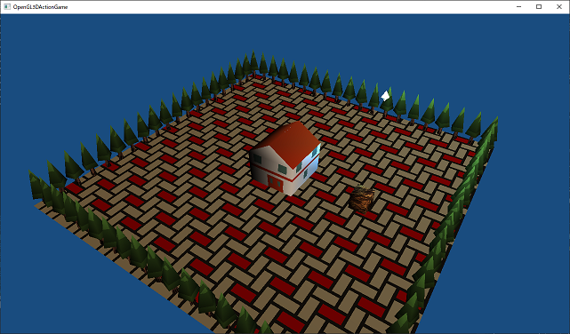
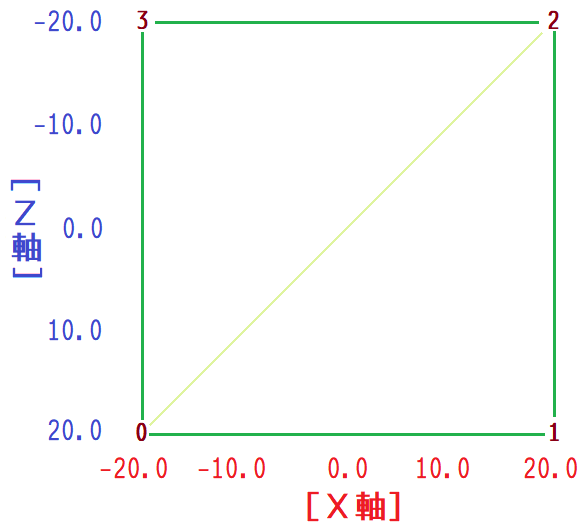
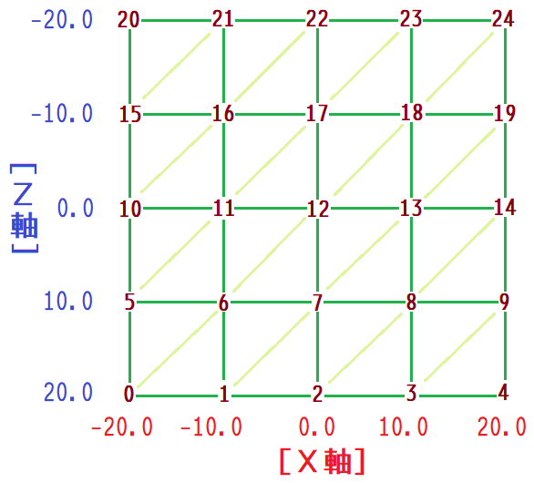
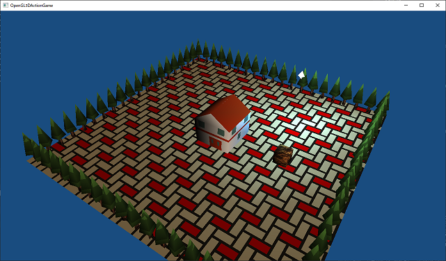

[OpenGL 3D 2020 第08回]

# フラグメントはポイントライトの夢を見るか

## 習得目標

* 点光源の作り方
* フラグメント単位のライティング

## 1. <ruby>点光源<rt>てんこうげん</rt></ruby>

### 1.1 点光源の追加

平行光源は、太陽や月のように、非常に遠方にある光源を表現することには長けています。しかし現実世界には、たき火やろうそくや電灯など、ある地点から全方位に光を発するものも多くあります。平行光源では、このような光源を表現することは困難です。

そこで、新しく「点光源(てんこうげん)」というものを導入しようと思います。点光源は、英語では「ポイント・ライト」と呼ばれ、名前のとおり「空間の1点から全方位に光を放つライト」のことです。

まずは頂点シェーダに点光源データを定義します。`VertexLighting.vert`を開き、次のプログラムを追加してください。

```diff
 // 並行光源
 struct DirectionalLight {
   vec4 direction;
   vec4 color;
 };
 layout(location=2) uniform DirectionalLight directionalLight;
+
+// 点光源
+struct PointLight {
+  vec4 position;
+  vec4 color;
+};
+layout(location=4) uniform PointLight pointLight;

 // 頂点シェーダプログラム
 void main()
 ```

 点光源も光源の一種なので、平行光源と同じく「光の色」を持ちます。これは`color`メンバ変数で表します。しかし、平行光源とは異なり光の向きは持ちません。そのかわりに光源の「位置」を持っています。点光源の光の向きは、照らされる物体との位置関係によって決まるからです。位置は`position`(ポジション)メンバ変数で表します。「位置」は、平行光源の「光の向き」と同様に、ワールド座標系で定義します。

 また、点光源のロケーション番号は、`DirectionalLight`の次ということで`4`にしています。番号が`3`でない理由は、構造体の場合、メンバごとにロケーション番号が割り当てられるからです。`DirectionalLight`の場合は`direction`メンバに`2`、`color`メンバに`3`が割り当てられます。ですから、その次の番号である`4`を指定しているわけです。

ロケーション番号|ユニフォーム変数
:-:|---
 0 | matMVP
 1 | matModel
 2 | DirectionalLight::direction
 3 | DirectionalLight::color
 4 | PointLight::position
 5 | PointLight::color

### 1.2 明るさを計算するプログラムの追加

データを定義したら、点光源の明るさを計算します。点光源の明るさは、平行光源と同じく、光の向きと法線のなす角によって変化します。さらに、光源からの距離によっても変わります。ろうそくや電球の明かりが遠くまでは届かないのと同様に、点光源ではライトと頂点の距離が離れるほど暗くなります。このときの明るさは「距離の2乗に反比例する」ことが知られています(「逆2乗の法則)といいます)。

点光源の計算を入れるために、シェーダプログラムを少し変更します。`VertexLighting.vert`の`main`関数を、次のように変更してください。

```diff
 void main()
 {
   mat3 matNormal = transpose(inverse(mat3(matModel)));
   vec3 worldNormal = matNormal * vNormal;
+
+  vec3 totalLightColor = vec3(0); // 明るさの合計値.
+
+  // 平行光源の明るさを計算.
+  {
     float cosTheta = max(dot(worldNormal, -directionalLight.direction.xyz), 0);
-    outColor = vColor;
-    outColor.rgb *= directionalLight.color.rgb * cosTheta;
+    totalLightColor += directionalLight.color.rgb * cosTheta;
+  }
+
+  outColor = vec4(vColor.rgb * totalLightColor, vColor.a);
   outTexcoord = vTexcoord;
   gl_Position = matMVP * vec4(vPosition, 1.0);
 }
```

複数のライトを扱えるようにするため、全てのライトの明るさを合計する`totalLightColor`(トータル・ライト・カラー)という変数を用意しました。今後は、あるライトの明るさを計算するたびに、この変数に加算していくことにします。全てのライトから受ける光の量を合計したら、頂点カラーと掛け合わせます。

それでは、点光源の計算を追加しましょう。まず「頂点からライトへ向かうベクトル」を計算します。これを「ライトベクトル」と呼びます。平行光源の明るさを計算するプログラムの下に、次のプログラムを追加してください。

```diff
     float cosTheta = max(dot(worldNormal, -directionalLight.direction.xyz), 0);
     totalLightColor += directionalLight.color.rgb * cosTheta;
   }
+
+  // 点光源の明るさを計算.
+  {
+    // フラグメントからライトへ向かうベクトルを計算.
+    vec3 worldPosition = vec3(matModel * vec4(vPosition, 1));
+    vec3 lightVector = pointLight.position.xyz - worldPosition;
+  }

   outColor = vec4(vColor.rgb * totalLightColor, vColor.a);
   outTexcoord = vTexcoord;
```

上記プログラムにおいてライトベクトルは`lightVector`変数で表されています。ライトの位置はワールド座標系で定義されるので、頂点座標もワールド座標系に変換して、座標系を合わせてから計算しています。

次に、ライトベクトルから「距離による明るさの変化量」を求めます。ここで「逆2乗の法則」を使います。ライトベクトルを計算するプログラムの下に、次のプログラムを追加してください。

```diff
     // フラグメントからライトへ向かうベクトルを計算.
     vec3 worldPosition = vec3(matModel * vec4(vPosition, 1));
     vec3 lightVector = pointLight.position.xyz - worldPosition;
+
+    // 距離による明るさの変化量を計算.
+    float lengthSq = dot(lightVector, lightVector);
+    float intensity = 1.0 / (1.0 + lengthSq);
   }

   outColor = vec4(vColor.rgb * totalLightColor, vColor.a);
   outTexcoord = vTexcoord;
```

距離の2乗を求めるには`dot`(ドット)関数を使います。本来、`dot`は内積を計算する関数です。内積の計算は「2つのベクトルA,Bの各要素を掛けて合計する」ことで行われます。つまり、AとBに同じベクトルを指定することで、ベクトルの長さの2乗を計算できるのです。距離の2乗は`lengthSq`(レングス・スクエア)という変数に格納しています。

距離の2乗が得られたら、`1`を距離の2乗で割って反比例の値を計算し、`intensity`(インテンシティ、「強度」という意味)変数に代入します。なお、このとき除数に`1.0`を足しています。これは、距離`0`のときに最大の明るさ(変化量が`1`)となるようにするためです。

次に、光の向きと法線のなす角を求め、それによる明るさの変化量を計算します。距離による明るさの変化量を計算するプログラムの下に、次のプログラムを追加してください。

```diff
     // 距離による明るさの変化量を計算.
     float lengthSq = dot(lightVector, lightVector);
     float intensity = 1.0 / (1.0 + lengthSq);
+
+    // 面の傾きによる明るさの変化量を計算.
+    float cosTheta = 1;
+    if (lengthSq > 0) {
+      vec3 direction = normalize(lightVector);
+      cosTheta = max(dot(worldNormal, direction), 0);
+    }
```

距離(の2乗)が`0`のときは、光の向きを決めることができません。そこで、`lengthSq`が`0`の場合は、明るさの変化量を`1`とします。

距離が`0`より大きい場合、光の向きを求めます。点光源はすべての方向に光を放射するので、光の向きは光を受ける頂点の位置によって異なります。この光の向きはすでにライトベクトルとして計算済みです。ただし、まだ正規化(ベクトルの長さを1にすること)をしていないので、`normalize`(ノーマライズ)関数を使って正規化します。正規化した向きは`direction`(ディレクション)変数に格納します。

あとは平行光源と同じ方法で明るさを計算し、`cosTheta`(コス・シータ)変数に格納します。

距離よる明るさ`intensity`と角度による明るさ`cosTheta`が計算できたら、その2つを掛け合わせた値が点光源の明るさです。これを`totalLightColor`変数に加算します。面の角度による明るさの変化量を計算するプログラムの下に、次のプログラムを追加してください。

```diff
       vec3 direction = normalize(lightVector);
       cosTheta = max(dot(worldNormal, direction), 0);
     }
+
+    // 2つの変化量をかけ合わせて明るさを求め、ライトの明るさ変数に加算.
+    totalLightColor += pointLight.color.rgb * cosTheta * intensity;
   }

   outColor = vec4(vColor.rgb * totalLightColor, vColor.a);
   outTexcoord = vTexcoord;
```

これで点光源の計算は完了です。

### 1.3 ライトデータを作成する

次に、CPU側の点光源データを準備します。シェーダを書き換えるときにも説明しましたが、点光源は「位置」と「色」の2つのパラメータで定義できます。`Shader.h`を開き、平行光源の定義の下に、次のプログラムを追加してください。

```diff
   glm::vec4 color;     // 色.
 };
+
+/**
+* 点光源
+*/
+struct PointLight {
+  glm::vec4 position; // 位置.
+  glm::vec4 color;    // 色.
+};

 /**
 * プログラム・パイプライン.
```

### 1.4 点光源データを転送する関数を定義する

次に、点光源データを転送するためのメンバ関数を宣言します。`Pipeline`クラスに次のプログラムを追加してください。

```diff
   bool SetModelMatrix(const glm::mat4&) const;
   bool SetLight(const DirectionalLight& light) const;
+  bool SetLight(const PointLight& light) const;

 private:
   GLuint id = 0;
   GLuint vp = 0;
```

続いて`Shader.cpp`を開き、平行光源用の`SetLight`関数の定義の下に、次のプログラムを追加してください。

```diff
   }
   return true;
 }
+
+/**
+* シェーダにライトデータを設定する.
+*
+* @param light 設定するライトデータ.
+*
+* @retval true  設定成功.
+* @retval false 設定失敗.
+*/
+bool Pipeline::SetLight(const PointLight& light) const
+{
+  glGetError(); // エラー状態をリセット.
+
+  const GLint locPointLight = 4;
+  glProgramUniform4fv(vp, locPointLight, 1, &light.position.x);
+  glProgramUniform4fv(vp, locPointLight + 1, 1, &light.color.x);
+  if (glGetError() != GL_NO_ERROR) {
+    std::cerr << "[エラー]" << __func__ << ":点光源の設定に失敗.\n";
+    return false;
+  }
+  return true;
+}

/**
* プログラムパイプラインのバインドを解除する.
```

プログラムの内容は、ディレクショナルライト用の`SetLight`関数とほとんど同じです。

### 1.5 ポイント・ライトの座標をモデル座標系に変換する

それでは、点光源データをGPUメモリに転送していきましょう。
平行光源データを設定するプログラムの下に、次のプログラムを追加してください。

```diff
       glm::normalize(glm::vec4(3, 2, 2, 0)),
       glm::vec4(2, 1.9f, 1.8f, 1)
     };
     pipeline.SetLight(directionalLight);
+
+    // 点光源を設定する
+    const Shader::PointLight pointLight{
+      glm::vec4(8, 10,-8, 0),
+      glm::vec4(0.4f, 0.7f, 1.0f, 0) * 200.0f
+    };
+    pipeline.SetLight(pointLight);

     // 視点を回転させる.
     const float degree = static_cast<float>(std::fmod(glfwGetTime() * 10.0, 360.0));
```

点光源の色は`{0.4, 0.7, 1.0}`としています。これは水色っぽい色です。ただし、このままでは地面にはほとんど光が届きません。点光源は距離が離れるほど暗くなるため、地面から`10`mの位置にある光源の明るさは`1/100`になってしまうからです。より遠くの地面はもっと暗くなります。そこで数値を`200`倍して、ある程度離れた地面にも光が届くようにしています。

これで点光源を追加することができました。ビルドして実行してください。

<p align="center">

</p>

…平行光源が明るすぎて、あまり効果が分からないようですね。では、平行光源を暗くしてみましょう。平行光源の色を次のように変更してください。

```diff
     // 平行光源を設定する
     const Shader::DirectionalLight directionalLight{
       glm::normalize(glm::vec4(3, 2, 2, 0)),
-      glm::vec4(2, 1.9f, 1.8f, 1)
+      glm::vec4(1, 0.9f, 0.8f, 1)
     };
     pipeline.SetLight(directionalLight);
```

プログラムを変更したら、ビルドして実行してください。次の画像のように、家が青い光で照らされていたら成功です。

<p align="center">

</p>

<div style="page-break-after: always"></div>

### 2. キー入力

### 2.1 ライトの位置を表示する

現在、地面は1章で追加した点光源によって照らされているはずです。しかし、ほとんど、あるいはまったくそうは見えないと思います。その理由は、頂点ライティングが照らすのはあくまで「頂点」であって、「面」ではないからです。

このことを調べるには、点光源を移動させてみるのが簡単です。ただ、コンピューター・グラフィックスにおける光源は、空間から直接放射されています。現実世界のように物体が発光しているわけではないため、点光源の中心を直接目にすることはできません。そのため、光源の位置が変わったことが分かりにくいですよね。

そこで、光源の位置に適当な物体を表示してみましょう。実際のゲーム制作でも、光源の位置が見えていると便利です。といっても、あまり適当なモデルがないので、とりあえず木のモデルを拡大縮小して表示することにします。また、なんの動きもないと見失ってしまいますから、常時回転させるようにしましょう。`Main.cpp`を開き、立方体を描画するプログラムの下に、次のプログラムを追加してください。

```diff
       texCube.Bind(0);
       primitiveBuffer.Get(3).Draw();
     }
+
+    // 点光源の位置を描画.
+    {
+      // Y軸回転.
+      const float degree = static_cast<float>(std::fmod(glfwGetTime() * 180.0, 360.0));
+      const glm::mat4 matModelR = glm::rotate(glm::mat4(1),
+        glm::radians(degree), glm::vec3(0, 1, 0));
+      // 拡大縮小.
+      const glm::mat4 matModelS = glm::scale(glm::mat4(1),
+        glm::vec3(0.5f, 0.25f, 0.5f));
+      // 平行移動.
+      const glm::mat4 matModelT = glm::translate(glm::mat4(1),
+        glm::vec3(pointLight.position) + glm::vec3(0,-1.25f, 0));
+      // 拡大縮小・回転・平行移動を合成.
+      const glm::mat4 matModel = matModelT * matModelR * matModelS;
+      pipeline.SetMVP(matProj * matView * matModel);
+      pipeline.SetModelMatrix(matModel);
+      texTree.Bind(0);
+      primitiveBuffer.Get(1).Draw();
+    }

     Texture::UnbindAllTextures();
     Texture::UnbindAllSamplers();
     Shader::UnbindPipeline();
```

`glm::rotate`(ジーエルエム・ローテート)は、回転行列を作成する関数です。

<pre class="tnmai_code"><strong>【書式】</strong><code>
glm::mat4 glm::rotate(元になる行列, 回転させる角度, 回転の基準となる軸);
</code></pre>

回転行列を作るときは「回転させる角度」に加えて「回転の基準となる軸」も指定する必要があります。2次元空間とは異なり、3次元空間では「回転の基準となる軸」を決めなければ、回転を定義することができないからです。上記のプログラムでは、回転角度を時間経過によって変化させ、Y軸回転させています。

`glm::scale`(ジーエルエム・スケール)は、拡大縮小行列を作成する関数です。

<pre class="tnmai_code"><strong>【書式】</strong><code>
glm::mat4 glm::scale(元になる行列, 軸ごとの拡大縮小率);
</code></pre>

`glm::scale`関数は、X,Y,Zの方向ごとに拡大率を指定することが出来ます。上記のプログラムでは、縦長の木のモデルが小さな矢印に見えるように、縦と横を`0.5`倍、高さだけ`0.25`倍としています。

`glm::translate`(ジーエルエム・トランスレート)は、平行移動行列を作成する関数です。

<pre class="tnmai_code"><strong>【書式】</strong><code>
glm::mat4 glm::translate(元になる行列, 平行移動ベクトル);
</code></pre>

`glm::translate`関数は、X,Y,Zの方向ごとに移動量を指定することが出来ます。上記のプログラムでは点光源の座標を設定することで、木のモデルを点光源の位置まで移動させています。

ただ、木のモデルの原点は根本です。ですから、ただ単に点光源と同じ座標を設定するだけだｔ、光源の位置も根本になります。しかし、木の先端が光源の位置を指すほうが分かりやすいでしょう。そこで、`glm::vec3(0,-1.25f,0)`というベクトルを加算することで、位置を`1.25m`だけ下に移動させています(`1.25m`は、木の高さ`5m`とY方向の拡大率`0.25`から計算した値)。

これら3つの行列作成関数を組み合わせることで、物体を表示する角度や大きさ、位置を自由自在にあやつることができます。プログラムが書けたらビルドして実行してください。画面のどこかに白くて回転する 下向き矢印のような物体が表示されていたら成功です。矢印の先端に点光源が存在します。

<p align="center">

</p>

### 2.2 点光源の座標を変更できるようにする

次に、点光源の座標を変更できるようにします。そのために、点光源を設定するプログラムを移動します。`Main.cpp`を開き、`Ctrl+X`で`pointLight`変数の定義を以下のように切り取ってください。

```diff
       glm::vec4(1, 0.9f, 0.8f, 1)
     };
     pipeline.SetLight(directionalLight);

-    // 点光源を設定する
-    const Shader::PointLight pointLight{
-      glm::vec4(8, 10,-8, 0),
-      glm::vec4(0.4f, 0.7f, 1.0f, 0) * 200.0f
-    };
     pipeline.SetLight(pointLight);

    // 視点を回転させる.
```

続いてメインループの手前に移動し、次のように`Ctrl+V`で、切り取ったプログラムを貼り付けてください。

```diff
   if (!texGround ||!texTree || !texHouse || !texCube) {
     return 1;
   }
+
+  // 点光源を設定する
+  const Shader::PointLight pointLight{
+    glm::vec4(8, 10,-8, 0),
+    glm::vec4(0.4f, 0.7f, 1.0f, 0) * 200.0f
+  };

   // メインループ.
   while (!glfwWindowShouldClose(window)) {
```

定義位置をメインループの手前に持っていくことで、メインループの末尾に到達しても、`pointLight`変数は残ったままになります。

そして、値を変更できるように`const`を削除します。点光源を設定するプログラムを、次のように変更してください。

```diff
   // 点光源を設定する
-  const Shader::PointLight pointLight{
+  Shader::PointLight pointLight{
     glm::vec4(8, 10,-8, 0),
     glm::vec4(0.4f, 0.7f, 1.0f, 0) * 200.0f
```

これで点光源の位置を変更できるようになりました。プログラムが書けたらビルドして実行してください。`pointLight`を移動させる前とまったく同じ画面が表示されていたら成功です。

### 2.3 点光源の位置を移動する

それでは点光源を移動させましょう。キー入力を調べるには、`glfwGetKey`(ジーエルエフタブリュー・ゲット・キー)関数を使います。`glClear`で画面を消去するプログラムの下に、次のプログラムを追加してください。

```diff
     glClearColor(0.1f, 0.3f, 0.5f, 1.0f);
     glClear(GL_COLOR_BUFFER_BIT | GL_DEPTH_BUFFER_BIT);
+
+    // 点光源を移動させる.
+    const float speed = 0.05f;
+    if (glfwGetKey(window, GLFW_KEY_A) == GLFW_PRESS) {
+      pointLight.position.x -= speed;
+    } else if (glfwGetKey(window, GLFW_KEY_D) == GLFW_PRESS) {
+      pointLight.position.x += speed;
+    }

     // 平行光源を設定する
     const Shader::DirectionalLight directionalLight{
```

<pre class="tnmai_code"><strong>【書式】</strong><code>
int glfwGetKey(GLFWウィンドウのアドレス, キー番号);
</code></pre>

`glfwGetKey`は、キー番号で指定したキーの状態を取得する関数です。キーが押されていれば`GLFW_PRESS`(ジーエルエフタブリュー・プレス)、押されていなければ`GLFW_RELEASE`(ジーエルエフタブリュー・リリース)を返します。

キー番号は`GLFW_KEY_`で始まる名前で、`glad.h`の中でディファインされています。今回は`A`キーで左、`D`キーで右に移動するようにしています。プログラムが書けたらビルドして実行してください。`A`、`D`キーを押したとき、白い矢印が左右に移動したら成功です。

同様に、前後の移動も追加しましょう。使うキーは`W`と`S`です。点光源を左右に動かすプログラムの下に、次のプログラムを追加してください。

```diff
     } else if (glfwGetKey(window, GLFW_KEY_D) == GLFW_PRESS) {
       pointLight.position.x += speed;
     }
+    if (glfwGetKey(window, GLFW_KEY_W) == GLFW_PRESS) {
+      pointLight.position.z -= speed;
+    } else if (glfwGetKey(window, GLFW_KEY_S) == GLFW_PRESS) {
+      pointLight.position.z += speed;
+    }

     // 平行光源を設定する
     const Shader::DirectionalLight directionalLight{
```

プログラムが書けたらビルドして実行してください。`W`、`S`キーを押したとき、白い矢印が前後に移動したら成功です。

<pre class="tnmai_assignment">
<strong>【課題01】</strong>
点光源を前後に動かすプログラムの下に、<code>E</code>キーで<code>-Y</code>方向、<code>Q</code>キーで<code>+Y</code>方向に光源を移動させるプログラムを追加してください。
</pre>

### 2.4 カメラの回転を止める

ところで…、カメラが回転しているせいで、本当に左右に移動できているのか分かりにくいと思いませんか？　そもそもカメラを回転させた理由は、本当に3D表示になっているか確かめるためでした。これまでプログラムを書いてきて、3Dモデルを描画できることは分かっているはずですから、もう回転を止めても構わないでしょう。

というわけで、カメラを固定しましょう。カメラを回転させるプログラムを、次のように変更してください。

```diff
     pipeline.SetLight(directionalLight);

     pipeline.SetLight(pointLight);

-    // 視点を回転させる.
-    const float degree = static_cast<float>(std::fmod(glfwGetTime() * 10.0, 360.0));
-    const glm::mat4 matViewRot = glm::rotate(glm::mat4(1), glm::radians(degree), glm::vec3(0, 1, 0));
-    const glm::vec3 viewPosition = matViewRot * glm::vec4(20, 30, 20, 1);
+    // 視点の位置.
+    const glm::vec3 viewPosition(20, 30, 30);

    // 座標変換行列を作成してシェーダーに転送する.
    int w, h;
```

プログラムを変更したら、ビルドして実行してください。カメラが動かなければ成功です。

<p align="center">

</p>

<pre class="tnmai_assignment">
<strong>【課題02】</strong>
点光源を移動させて、地面の明るさが変化する位置を見つけてください。
</pre>

### 2.5 頂点の数を増やす

光源を地面の端のほうに移動させると、ようやく地面に光があたるようになります。2.1節で説明したように、頂点ライティングでは、文字どおり頂点だけがライティングの対象になっているからです。

これは、例えば、一日の気温の変化を知りたいとき、0時と8時と16時の気温だけを測って、その間を直線で結ぶようなものです。気温の大まかな変化は分かりますが、気温が最も下がる早朝や、最も上がる14時～15時の情報は得られません。より正確な変化を知りたければ、3時間ごとや1時間ごとといったもっと短い時間で気温を調べなければなりません。

同じことが頂点ライティングにも言えます。つまり、面積あたりの頂点の数を増やせば増やすほど、正しいライティングに近づいていくわけです。

<pre class="tnmai_assignment">
<strong>【課題03】</strong>
現在、地面のモデルは以下の左図のように<code>4</code>個の頂点で作られています。これを、右図のように<code>25</code>個の頂点となるように作り変えてください。
変更したらライトを動かして、変更した地面がどのように照らされるかを確認してください。
<p align="center"> → </p>
座標データの定義順は、左下の<code>0</code>番からスタートして右に進み、<code>4</code>番まで定義したら上段の<code>5</code>番に移動します。そして<code>5</code>番から右へ順番に定義していき、<code>9</code>番まで来たら上段の<code>10</code>番に移動する、というようにしてください。
色データと法線データについては、既存の数値(色なら{0.8f, 0.7f, 0.5f, 1.0f}、法線なら{0, 1, 0})を25個並べるだけでO.K.です。
</pre>

【課題03】を完了すると、以前の地面と違って光源の真下に光が当たっていることが分かるようになっていると思います。もっとたくさんの頂点を追加していけば、より正確なライティングが行えるようになるでしょう。

<p align="center">

</p>

しかし、コンピューターの計算能力は有限です。頂点シェーダでライティングをするだけのために、本来4個で済むはずの面の頂点を増やし続けるわけにはいきません。かといって頂点を減らすと、ライティングは不正確で不自然なものになってしまいます。

残念なことですが、頂点シェーダでライティングを行う限り、正確で自然なライティングを実現することは困難です。 そのため、PlayStation2の頃は「ライティングを行わない」という選択をするゲームも多かったのです。

<div style="page-break-after: always"></div>

### 2.6 経過時間を計測する

ところで、光源を移動させるときの移動速度`speed`の値は、`0.05`としています。この数字は、メインループがひとまわりするたびに加算、あるいは減算される距離を表しています。`0.05メートル毎メインループ`ということです。

実はこのやり方には問題があります。というのは、メインループ一回にかかる時間は、プログラムを実行するPCによって異なるからです。つまり、1回のメインループにかかる時間が、処理の早いPCでは0.001秒で済むけれど、遅いPCでは0.01秒かかる、ということがありうるわけです。

これではPCによってゲーム体験が大きく異なってしまいます。この問題を解決するには、通常は1回のメインループにかかった時間を計測し、その時間に応じて実際の移動量を決めます。

メインループにかかる時間を計測するには、GLFWライブラリの`glfwGetTime`(ジーエルエフタブリュー・ゲット・タイム)関数を使うのが簡単です。

<pre class="tnmai_code"><strong>【書式】</strong><code>
double glfwGetTime();
</code></pre>

`glfwGetTime`関数は、GLFWライブラリが初期化されてから経過した秒数を返します。

この関数を利用して、経過時間を調べようと思います。メインループ内の適当なタイミングで経過時間を記録し、前回記録した経過時間と比較します。すると、2つの記録の差が経過時間になりますよね。

それでは、プログラムを書いていきましょう。まず最初の経過時間を取得します。点光源を設定するプログラムの下に、次のプログラムを追加してください。

```diff
     glm::vec4(0.4f, 0.7f, 1.0f, 0) * 200.0f
   };
+
+  // 経過時間計測開始.
+  double elapsedTime = glfwGetTime();

   // メインループ.
   while (!glfwWindowShouldClose(window)) {
```

経過時間は`elapsedTime`(イラプスド・タイム)変数に格納します。`elapse`(イラプス)は「経過する」という意味です。

次に、経過時間を取得して、前回との差を計算するプログラムを追加します。メインループの先頭に、次のプログラムを追加してください。

```diff
   // メインループ.
   while (!glfwWindowShouldClose(window)) {
+    // 経過時間を計測.
+    double newElapsedTime = glfwGetTime();
+    float deltaTime = static_cast<float>(newElapsedTime - elapsedTime);
+    elapsedTime = newElapsedTime;
+
     glEnable(GL_DEPTH_TEST);
     glClearColor(0.1f, 0.3f, 0.5f, 1.0f);
```

このプログラムでは、まず`glfwGetTime`関数を使って新しい経過時間を取得し、`newElapsedTime`(ニュー・イラプスド・タイム)変数に格納します。

次に`newElapsedTime`から`elapsedTime`を引くことで前回の経過時間との差を計算し、`deltaTime`(デルタ・タイム)変数に格納しています。この`deltaTime`が「メインループ1回にかかった時間」にあたります。このとき`float`にキャストしておきます。これは、以後の計算のほとんどが`float`で行われるので、それに合わせるためです。

最後に、経過時間`elapsedTime`に新しい経過時間`newElapsedTime`を代入し、次回の計測に備えます。

それでは`deltaTime`を使って、光源の移動速度を`10メートル毎秒`に設定してみましょう。点光源を移動させるプログラムを次のように変更してください。

```diff
     // 点光源を移動させる.
-    const float speed = 0.05f;
+    const float speed = 10.0f * deltaTime;
     if (glfwGetKey(window, GLFW_KEY_A) == GLFW_PRESS) {
       pointLight.position.x -= speed;
```

プログラが書けたらビルドして実行してください。`W``A``S``D`キーを押して光源を地面の端に置き、反対の端まで一気に移動させます。端から端までおよそ4秒で移動できたら成功です。

### 2.7 デルタタイムを制限する

メインループにかかる時間は常に同じとは限らず、PCの動作状態によって変化します。また、デバッグのためにプログラムを一時停止して再開すると、デバッグで停止していた時間も計測されてしまいます。というのは、`glfwGetTime`はプログラムの実行時間ではなく、現実世界の経過時間を表しているからです。

このため、プログラムの再開と同時にキーを入力すると、点光源は彼方へと飛んでいってしまいます。そこで、ある程度以上の時間が経過していた場合、デルタタイムを`1/60`秒に設定します。デルタタイムを計測するプログラムに、次のプログラムを追加してください。

```diff
     const double newElapsedTime = glfwGetTime();
     float deltaTime = static_cast<float>(newElapsedTime - elapsedTime);
+    if (deltaTime >= 0.1f) {
+      deltaTime = 1.0f / 60.0f;
+    }
     elapsedTime = newElapsedTime;
```

これで経過時間の処理は完成です。点光源をさまざまな位置に移動して、プリミティブがどのようにライティングされるか確認してください。ライトの明るさ

>**【なぜ1/60秒にするの？】**<br>
>1/60秒というのは、現在市販されているほとんどのモニターの画面更新速度にあたります。プログラムがこの時間より高速に画像を更新できたとしても、モニターの表示が追いつかないため正しく表示されません。そのため、多くのゲームではこの時間を基準にゲームの世界を動かしています。

<div style="page-break-after: always"></div>

## 4. フラグメント・ライティング

### 4.1 フォン・シェーディング

ここまでは、頂点シェーダをつかってライトを実装してきました。しかし、頂点シェーダによるライティングには「頂点単位でしかライティングできない」という重大な問題がありました。例えば、平らな板の中央付近にライトを置いたとします。現実世界では、中央付近が明るく、外側に向かって暗くなるはずです。しかし、頂点シェーダでは、プリミティブの端にある頂点でしかライトを感じることができません。そのため、板は一様に暗い色に見えてしまいます。ライトはすぐそばにあるのに！

この問題は「頂点を増やす」ことで多少は軽減できるのでした。しかし、頂点シェーダでライティングを行う限り、この問題を本当に解決することはできません。真の解決策は、ライティングの舞台をフラグメントシェーダに移すことです。フラグメント単位でライティングを施せば、プリミティブのどの部分であっても、より正確な明るさを計算できるようになります。

「頂点間の法線を補間し、フラグメント単位でライティングを行う」技法のことを、考案者の名前を取って「Phong shading(フォン・シェーディング)」と呼びます。また、前回作成した「頂点単位でライティングを行い、その結果を補間してフラグメントの色を決める」技法のことを、これも考案者の名前から「Gouraud shading(グーロー・シェーディング)」と呼びます。

### 4.3 頂点シェーダの追加

フォン・シェーディングには、頂点シェーダとフラグメントシェーダの両方が必要です。フォンシェーディングのための新しいシェーダを作成しましょう。まずは、`Res`フォルダに`FragmentLighting.vert`(フラグメント・ライティング・バート)という名前のファイルを追加してください。

追加した`FragmentLighting.vert`を開き、次のプログラムを追加してください。

```diff
+#version 450
+
+// 入力変数
+layout(location=0) in vec3 vPosition;
+layout(location=1) in vec4 vColor;
+layout(location=2) in vec2 vTexcoord;
+layout(location=3) in vec3 vNormal;
+
+// 出力変数
+layout(location=0) out vec4 outColor;
+layout(location=1) out vec2 outTexcoord;
+out gl_PerVertex {
+  vec4 gl_Position;
+};
+
+// ユニフォーム変数
+layout(location=0) uniform mat4 matMVP;
+layout(location=1) uniform mat4 matModel;
+
+// 頂点シェーダプログラム
+void main()
+{
+  vec3 worldPosition = vec3(matModel * vec4(vPosition, 1));
+  mat3 matNormal = transpose(inverse(mat3(matModel)));
+  vec3 worldNormal = matNormal * vNormal;
+
```

手始めに、先頭のファイル名を修正しましょう。
最初のコメントを次のように変更してください。

```diff
 /**
-* @file Simple.vert
+* @file FragmentLighting.vert
 */
 #version 410
```

次に、入力変数と出力変数を追加します。入力および出力変数を定義している部分を、次のように変更してください。

```diff
 /**
 * @file FragmentLighting.vert
 */
 #version 410

　layout(location=0) in vec3 vPosition;
　layout(location=1) in vec4 vColor;
　layout(location=2) in vec2 vTexCoord;
+layout(location=3) in vec3 vNormal;

+layout(location=0) out vec3 outPosition;
-layout(location=0) out vec4 outColor;
-layout(location=1) out vec2 outTexCoord;
+layout(location=1) out vec4 outColor;
+layout(location=2) out vec2 outTexCoord;
+layout(location=3) out vec3 outNormal;

 uniform mat4x4 matMVP;
```

最後に、入力変数を出力変数に代入します。main関数に次のプログラムを追加してください。

```diff
 /**
 * 頂点シェーダー.
 */
 void main()
 {
+  outPosition = vPosition;
   outColor = vColor;
   outTexCoord = vTexCoord;
+  outNormal = vNormal;
   gl_Position = matMVP * vec4(vPosition, 1.0);
 }
```

今回作成するフラグメント・ライティングでは、頂点シェーダーでするべきことはあまり多くありません。頂点座標をクリップ座標系へと変換するほかは、VPから入力された頂点データをフラグメントシェーダーへと送り出すだけです。しかし、追加されたプログラムはフォン・シェーディングを行う上で

頂点シェーダーの変更は以上です。

### 4.4 フラグメントシェーダの追加

続いてフラグメントシェーダを追加します。Resフォルダに「FragmentLighting.frag(ふらぐめんと・らいてぃんぐ・ふらぐ)」という名前のファイルを追加してください。
FragmentLighting.fragを開き、Simple.fragの内容をコピーして貼り付けてください。

```diff
+/**
+* @file Simple.frag
+*/
+#version 410
+
+layout(location=0) in vec4 inColor;
+layout(location=1) in vec2 inTexCoord;
+
+out vec4 fragColor;
+
+uniform sampler2D texColor;
+
+/**
+* フラグメントシェーダー.
+*/
+void main()
+{
+  fragColor = inColor * texture(texColor, inTexCoord);
+}
```

まず先頭のファイル名を修正しましょう。
最初のコメントを次のように変更してください。

```diff
 /**
-* @file Simple.frag
+* @file FragmentLighting.frag
 */
 #version 410
```

次に入力変数を追加します。入力変数を定義している部分を、次のように変更してください。

```diff
 /**
 * @file FragmentLighting.frag
 */
 #version 410

+layout(location=0) in vec3 inPosition;
-layout(location=0) in vec4 inColor;
-layout(location=1) in vec2 inTexCoord;
+layout(location=1) in vec4 inColor;
+layout(location=2) in vec2 inTexCoord;
+layout(location=3) in vec3 inNormal;

 out vec4 fragColor;
```

続いて、VertexLighting.vertからライトの構造体とuniform変数をコピーして貼り付けてください。

```diff
 layout(location=0) in vec3 inPosition;
 layout(location=1) in vec4 inColor;
 layout(location=2) in vec2 inTexCoord;
 layout(location=3) in vec3 inNormal;

 out vec4 fragColor;

+// 環境光.
+struct AmbientLight
+{
+  vec3 color;
+};
+
+// 指向性ライト.
+struct DirectionalLight
+{
+  vec3 direction;
+  vec3 color;
+};
+
+// ポイント・ライト.
+struct PointLight
+{
+  vec3 position[8];
+  vec3 color[8];
+};
+
+uniform AmbientLight ambientLight;
+uniform DirectionalLight directionalLight;
+uniform PointLight pointLight;
+
 uniform sampler2D texColor;

 /**
 * フラグメントシェーダー.
```

変数をコピーしたら、次は計算プログラムもコピーします。VertexLighting.vertにあるライトの明るさを計算するプログラムをコピーして、次のようにFragmentLighting.fragのmain関数に貼り付けてください。

```diff
 /**
 * フラグメントシェーダー.
 */
 void main()
 {
+  // 指向性ライトの明るさを計算する.
+  float cosTheta = clamp(dot(vNormal, -directionalLight.direction), 0.0, 1.0);
+  vec3 lightColor = directionalLight.color * cosTheta;
+
+  // ポイントライトの明るさを計算する.
+  for (int i = 0; i < 8; ++i) {
+    if (dot(pointLight.color[i], pointLight.color[i]) != 0) {
+      // フラグメントからライトへ向かうベクトルを計算.
+      vec3 lightVector = pointLight.position[i] - inPosition;
+      vec3 lightDir = normalize(lightVector);
+      // 面の傾きによる明るさの変化量を計算.
+      float cosTheta = clamp(dot(vNormal, lightDir), 0.0, 1.0);
+      // 距離による明るさの変化量を計算.
+      float intensity = 1.0 / (1.0 + dot(lightVector, lightVector));
+      // 変化量をかけ合わせて明るさを求め、合計に加算.
+      lightColor += pointLight.color[i] * cosTheta * intensity;
+    }
+  }
+
   fragColor = inColor * texture(texColor, inTexCoord);
 }
```

これを、フラグメント・シェーダー用に修正していきます。

### 4.5 ラスタライザは法線の長さを変えてしまう

ライティングには法線が必要です。そのために頂点シェーダーの出力に法線を追加したわけですが、それだけでは正しい法線にはなりません。その原因は、グラフィックス・パイプラインのラスタライザにあります。

ラスタライザがフラグメント・シェーダーの入力変数に入れる値を計算するとき、頂点間の距離に応じて頂点シェーダーの出力変数を補間します。実は、ここに問題があるんです。ラスタライザは「線形補間」と呼ばれる方法で計算を行うのですが、この計算はベクトルの要素ごとに行われます。そのため、線形補間を行うとベクトルの長さが変わってしまうのです。

頂点Aの法線Anが(0.0, 1.0, 0.0)で、頂点Bの法線Bnが(0.71, 0.0, 0.71)だった場合を考えてみましょう。
フラグメントFがAとBのちょうど中間にある場合、ラスタライザはFの法線Fnを次のように計算します。

>```txt
>Fn = An * 0.5 + Bn * 0.5
>   = (0.0, 1.0, 0.0) * 0.5 + (0.71, 0.0, 0.71) * 0.5
>   = (0.0, 0.5, 0.0) + (0.355, 0.0, 0.355)
>   = (0.355, 0.5, 0.355)
>```

さて、Fnの長さはどうなったでしょう。3Dベクトルの長さは「√(x^2 + y^2 + z^2)」で求まります。

>```txt
>|Fn| = √(x^2 + y^2 + z^2)
>     = √(0.355^2 + 0.5^2 + 0.355^2)
>     = √(0.126 + 0.25 + 0.126)
>     = √(0.502)
>     = 0.7085...
>```

長さは約0.7です。ずいぶん短くなってしまいましたね…。
このように、線形補間はベクトルの長さを変えてしまいます。

ここで、(0.0, 1.0, 0.0)と(0.71, 0.0, 0.71)が法線ではなく、色の情報だった場合を考えてみましょう。

(0.0, 1.0, 0.0)=緑色、(0.71, 0.0, 0.71)=濃い紫色、(0.355, 0.5, 0.355) = 濃い灰緑色となり、光の三原色の混ざり方として何の問題もありません。

ラスタライザによる線形補間は、「色」のように要素ごとに独立した情報の場合は望ましい挙動ですが、「法線」のように単位ベクトルであることが重要な情報にとっては悪夢なのです。

### 4.6 法線を単位ベクトルに戻す

法線が単位ベクトルでなければ、正しいライティングはできません。そこで、フラグメント・シェーダーに法線を単位ベクトルに戻す処理を加えて、この問題を修正します。
フラグメント・シェーダーのmain関数に、次のプログラムを追加してください。

```diff
 /**
 * フラグメントシェーダー.
 */
 void main()
 {
+  vec3 normal = normalize(inNormal);
+
   // 指向性ライトの明るさを計算する.
   float cosTheta = clamp(dot(vNormal, -directionalLight.direction), 0.0, 1.0);
   vec3 lightColor = directionalLight.color * cosTheta;
```

normalize(のーまらいず)関数は、引数に設定されたベクトルの単位ベクトルを返す関数でしたね。この関数を使えば、あっという間に単位ベクトルの出来上がりです。簡単ですね。

[補足] 法線を表すnormalと正規化を行うnormalize関数は、どちらもnormalという単語が元になっています。しかし、全く違うものを表しているので、混同しないように気をつけてください。

### 4.7 vNormalをnormalに書き換える

頂点シェーダーからコピーしてきたプログラムは、法線にvNormal変数を使っています。この変数はフラグメントシェーダーには存在しないので、さきほど計算したnormal変数で置き換えましょう。
フラグメントシェーダーのmain関数を、次のように変更してください。

```diff
 /**
 * フラグメントシェーダー.
 */
 void main()
 {
   vec3 normal = normalize(inNormal);

    // 指向性ライトの明るさを計算.
-  float cosTheta = clamp(dot(vNormal, -directionalLight.direction), 0.0, 1.0);
+  float cosTheta = clamp(dot(normal, -directionalLight.direction), 0.0, 1.0);
   vec3 lightColor = directionalLight.color * cosTheta;

   // ポイントライトの明るさを計算.
   for (int i = 0; i < 8; ++i) {
     if (dot(pointLight.color[i], pointLight.color[i]) != 0) {
       // フラグメントからライトへ向かうベクトルを計算.
       vec3 lightVector = pointLight.position[i] - inPosition;
       vec3 lightDir = normalize(lightVector);
       // 面の傾きによる明るさの変化量を計算.
-      float cosTheta = clamp(dot(vNormal, lightDir), 0.0, 1.0);
+      float cosTheta = clamp(dot(normal, lightDir), 0.0, 1.0);
       // 距離による明るさの変化量を計算.
       float intensity = 1.0 / (1.0 + dot(lightVector, lightVector));
       // 変化量をかけ合わせて明るさを求め、合計に加算.
       lightColor += pointLight.color[i] * cosTheta * intensity;
     }
   }

   fragColor = inColor * texture(texColor, inTexCoord);
 }
```

### 4.8 明るさを反映する

最後に、計算したライトの明るさを反映します。
フラグメントシェーダーのmain関数の末尾に、次のプログラムを追加してください。

```diff
       // 変化量をかけ合わせて明るさを求め、合計に加算.
       lightColor += pointLight.color[i] * cosTheta * intensity;
     }
　  }

+　　// アンビエントライトの明るさを計算.
+  lightColor += ambientLight.color;
+
　  fragColor = inColor * texture(texColor, inTexCoord);
+  fragColor.rgb *= lightColor;
 }
```

これでフラグメントシェーダーの修正は完了です。
グーロー・シェーディングとフォン・シェーディングは、プリミティブのどの部分に注目して計算を行うかが違うだけで、明るさの計算式は同じです。だから、コピーしたプログラムを少し変更するだけで完成するんですね。

### 4.9 フォン・シェーディング・シェーダーを読み込む

それでは、作成したフォン・シェーディング用のファイルを使ってみましょう。
頂点ライティング・シェーダーの代わりに、フォン・シェーディング・シェーダーを読み込みます。
頂点ライティング・シェーダーを読み込むプログラムを、次のように変更してください。

```diff
 const GLuint shaderProgram =
   Shader::BuildFromFile("Res/Simple.vert", "Res/Simple.frag");
 const GLuint progLighting =
-  Shader::BuildFromFile("Res/VertexLighting.vert", "Res/Simple.frag");
+  Shader::BuildFromFile("Res/FragmentLighting.vert", "Res/FragmentLighting.frag");
 if (!vbo || !ibo || !vao || !shaderProgram || !progLighting) {
   return 1;
 }
```

プログラムが書けたら、ビルドして実行してください。
ポイント・ライトの光が、プリミティブの境界に影響されずに円形の範囲を照らしていたら成功です。
WASDキーでライトを動かして、グーロー・シェーディングとの違いを確認してください。
地面だけでなく木の照らされ方の違いにも注目してください。
 

