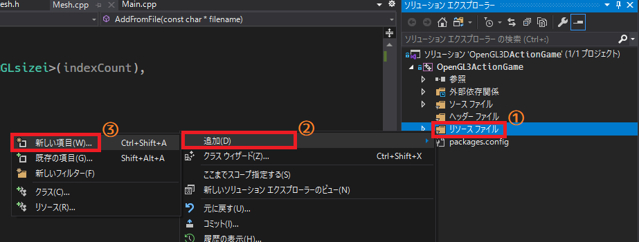
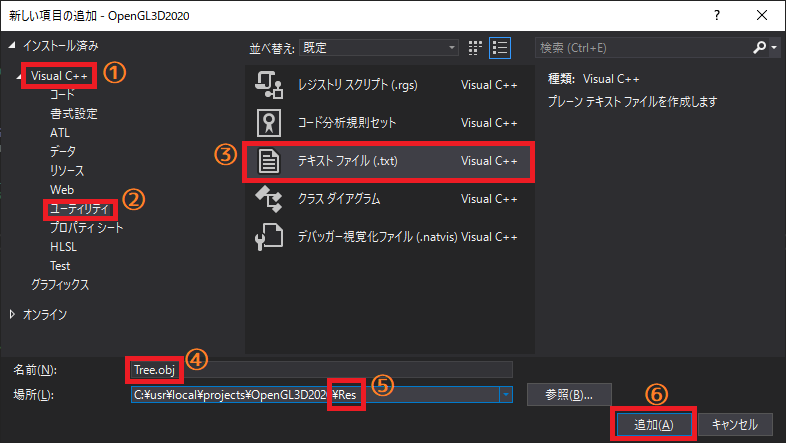
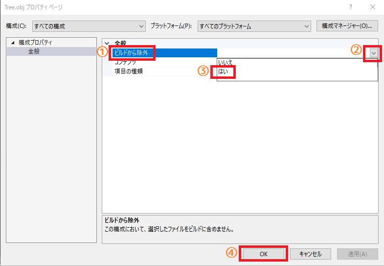

[OpenGL 3D 2020 第09回]

# May the OBJ File<br>&emsp;be with you

「OBJファイルが共にあらんことを。」

## 習得目標

* OBJファイルの基本的な文法
* テキストファイルの解析方法
* ハッシュ値と連想配列

## 1. ファイル・フォーマットを選ぶ

## 1.1 モデリングツール

メッシュリストをクラスにしたことで、モデルを追加しやすくなりました。そうはいっても、手作業で頂点データやインデックスデータを作るのは大変です。簡単な多角形を組み合わせた程度のモデルであれば、手作業で作ることも難しくはないでしょう。

しかし、数千、数万の頂点データを定義しなければならないとしたら？　そのような大量のデータを手作業で書くのは、不可能とは言いませんがとても現実的とは思えません。そこで、通常はモデル作成用のアプリケーションを使ってモデルを作りします。このようなアプリケーションを「モデリング・ツール」などと呼びます。

ここで問題となるのは、モデリング・ツールによって、作成されるデータの形式が異なることです。しかも、それらの形式はモデリング・ツール自身が使うために定義されているので、ほかのプログラムから使うことができません。そのため、モデリング・ツールで出力したデータをプログラムで使用できる形式に変換する必要があります。

## 1.2 ファイル・フォーマット

データの形式にはどのようなものがあるのでしょうか。一般的に、モデリング・ツールがモデル・データを扱う際は、はそれぞれ専用の形式を使います。この形式のことを「ファイル・フォーマット」といいます。

|ファイル・フォーマット名|アプリケーション|
|------------------------|----------------|
|MA/MB                   |Maya            |
|3DS                     |3DS Max         |
|POV                     |POV-Ray         |
|LWO                     |LightWave 3D    |
|XSI                     |Softimage       |

これらはそれぞれのツールで使えれば十分なので、仕様は公開されていません。ですから、ファイルに何がどのように記録されているか、ということは分かりません。これらのファイルを自作のアプリに読み込むには、ファイル内容を解析する必要があります。

また、それぞれのモデリング・ツールには得手不得手があります。となれば、得意分野ごとにツールを切替えられると便利ですよね。そのために、ツール専用のファイルフォーマットではなく、ツール間でデータをやりとりできる汎用のファイル・フォーマットが存在します。

汎用フォーマットは仕様が公開されていたり、比較的単純な形式であったりと、利用しやすくなっているのが特徴です。多くのモデリング・ツールは、ツール専用フォーマットだけでなく、いくつかの汎用フォーマットにも対応しています。そのため、データを汎用のファイル・フォーマットで保存して他のツールで開くことができるわけです。

代表的な汎用ファイル・フォーマットには次のようなものがあります。

**OBJ(オブジェ):**<br>
Advanced Visualizerというツールのために開発されたフォーマットです。非常に単純なファイル・フォーマットで、頂点カラーが定義できないなどの制約があります。しかし、定義された時期が古いため長く使われていること、仕様が公開されていること、単純であることの3点から、ほとんどのモデリング・ツールが読み書きに対応しています。最も普及した汎用ファイル・フォーマットといえるでしょう。

**STL(エスティーエル):**<br>
3D Systems社の3D CAD用フォーマットです。これも古くからある比較的単純なファイル・フォーマットで、OBJ形式と同様に多くのモデリング・ツールが対応しています。

**PLY(ピーエルワイ):**<br>
スタンフォード大学が3Dスキャナー(現実の物体からモデル・データを作成する装置)用に開発したファイル・フォーマットです。OBJ形式と比較するとやや複雑なためか、直接対応しているモデリングツールはあまり多くありません。とはいえ、これも古くからあるファイル・フォーマットなので、検索すれば大抵のツール用のプラグイン(=拡張機能)を見つけることができるでしょう。

**COLLADA(コラダ):**<br>
SCE(現SIE)がPS3/PSP用に開発したフォーマットです。比較的最近に開発されたこともあり、複雑なデータも扱えます。そのぶんフォーマットも複雑ですが、仕様が公開されていることから多くのモデリング・ツールが対応しています。また、公式GitHubに読み書き用ソースコードが公開されています。

**glTF(ジーエルティーエフ):**<br>
webGL(ウェブ・ジーエル)という、ブラウザで動作する3Dライブラリ用に開発されたファイル・フォーマットです。ネットワーク上で3Dデータをやりとりすることを考慮して、ファイルサイズが小さく、処理が簡単になるように設計されています。webGLはOpenGLの派生品なので、OpenGLでも比較的簡単に扱うことができます。

**X3D(エックススリーディ):**<br>
ネットワーク上で3Dデータをやりとりするために開発されたファイル・フォーマットです。こちらも比較的最近に開発されたもので、複雑なデータを扱えます。仕様が公開されているものの、まだ直接対応しているモデリングツールは多くありません。いくつかのツールではプラグインが開発されているようです。

**FBX(エフビーエックス):**<br>
Filmboxというツールのために開発されたファイル・フォーマットです。3Dシーン全体を記録できるように作られているため、非常に複雑です。詳細な仕様は公開されていませんが、FBXを読み書きするためのライブラリが提供されていて、それを使えば比較的簡単にデータを読み書きできます。そのため、多くのモデリングツールが対応しています。

## 1.3 フォーマットの選択

ひととおりファイル・フォーマットを挙げましたので、今回使うファイル・フォーマットとしてどれを選ぶか考えてみましょう。まず、モデリング・ツール専用のファイル・フォーマットは除外しましょう。それらは他のアプリケーションから使われることなど全く考えておらず、仕様も公開されていないため、まず仕様を詳しく調べることから始めなくてはならないからです。そうなると、あとは汎用ファイルフォーマットからどれを選ぶかです。まずは簡単なファイル・フォーマットと複雑なファイル・フォーマットを比較してみましょう。

簡単なファイル・フォーマットの利点は、当然ながらプログラムを書くのが簡単だということです。欠点は、頂点カラーのように対応していない機能があることです。複雑なフォーマットの利点は、考えられるほとんど全ての機能に対応していることです。また、モデル・データ以外にもアニメーションやモデルの配置情報などを含むことができます。そのかわり、それらを適切に判別して読み込まなければなりません。ライブラリやソースコードが提供されているなら、この工程は多少簡単になるかもしれません。

さてさて、これらの利点と欠点を考慮したうえで、選ばれたのは(ここでドラムロール)…

「**OBJ**」ファイル・フォーマット！君に決めた！

OBJを選んた理由は、内容が単純なのでプログラミングが簡単だからです。また、対応しているモデリング・ツールが多いこともポイントです。単純ゆえにあまり凝ったことはできませんが、今は「基本的なモデル・データを読み込む機能」が作成できれば十分です。

<div style="page-break-after: always"></div>

## 2. OBJファイルを作成する

### 2.1 OBJファイルを追加する

OBJファイルはテキスト・ファイルです。文法も難しくありませんので、テキスト・エディタで簡単に編集することができます。仕様では、点・線・三角形だけでなく、多角形や曲線、曲面を定義することもできます。しかし、とりあえず必要なのは三角形の読み込み機能ですから、まずはこれを作成しましょう。

まずは実際にOBJファイルを作ってみましょう。ソリューションエクスプローラーの「リソースファイル」フィルターの上で右クリックして(①)、「追加→新しい項目」を選択してください(②、③)。

<p align="center">

</p>

プロパティウィンドウが開いたら、右側のリストから「Visual C++→ユーティリティ」を(①、②)、中央のリストから「テキストファイル」を選択します(③)。

<p align="center">

</p>

そして、名前を「Tree.obj」に変更にします(④)。それから、その下の場所テキストを「プロジェクトのResフォルダ」を指すように変更してください(⑤)。最後に「追加」ボタンを押すと、OBJファイルが作成されます(⑥)。ソリューションエクスプローラーに「Tree.obj」が追加されていることを確認してください。

次に、`Tree.obj`を「ビルドから除外」します。Visual Studioは`obj`という拡張子を、コンパイルによって作成される「オブジェクトファイル」だと認識してしまうためです。しかし、今回追加した`Tree.obj`はオブジェクトファイルではないため、ビルドに失敗してしまいます。

そこで、「このファイルはビルド対象にならない」ことをVisual Studioに伝えなくてはなりません。追加された`Tree.obj`を右クリックして「右クリックメニュー」を表示し、下の方にある「プロパティ」を選んでください。すると、以下のようにプロパティウィンドウが表示されます。

<p align="center">

</p>

中央に「ビルドから除外」という項目があると思います。この「ビルドから除外」という文字をクリックしてください(①)。すると、右側に下向き矢印のボタンが表示されるので、これをクリックします(②)。「はい」と「いいえ」が表示されるので、「はい」をクリックしてください(③)。最後にOKボタンを押すと変更が反映されます(④)。

>**【ビルドから除外する理由】**<br>
>`obj`はオブジェクトファイルと同じ拡張子だからです。オブジェクトファイルは「ビルドの過程で作られる作業用ファイル」で、通常は`.c`や`.cpp`ファイルをコンパイルしたときに作られます。オブジェクトファイルは「リンカ」というプログラムによって、ひとつの実行ファイルにまとめられます。<br>
>拡張子がかぶっているため、何もしなければ`Tree.obj`もオブジェクトファイルとして扱われてしまいます。しかし、実際には`Tree.obj`はオブジェクトファイルではありませんから、コンピューターは混乱してビルドに失敗してしまいます。<br>
>そこで、プロパティを設定して「このファイルをビルドに含めてはいけないよ」と教えてあげなければならないのです。

### 2.2 OBJファイルの文法

モデル・データをOBJファイルに書き込むためには、4つの文法を覚えなくてはなりません。すなわち、頂点座標を定義する`v`と、テクスチャ座標を定義する`vt`、法線を定義する`vn`、そして面を定義する`f`です。

**v** *x y z*<br>
&emsp;頂点の座標を定義します。`v`はvertexの頭文字です。`x`,`y`,`z`は頂点のX,Y,Z座標を<br>
&emsp;表す浮動小数点数です。各要素はスペースで区切られます。

**vt** *u v*<br>
&emsp;テクスチャ座標を定義します。`vt`はvertex textureの頭文字です。`u`,`v`は頂点のテク<br>
&emsp;スチャ座標を表す浮動小数点数です。各要素はスペースで区切られます。

**vn** *i j k*<br>
&emsp;法線を定義します。`vn`はvertex normalの頭文字です。`i`,`j`,`k`は頂点の法線のX,Y,Z<br>
&emsp;座標を表す浮動小数点数です。各要素はスペースで区切られます。

**f** *v1/vt1/vn1 v2/vt2/vn2 v3/vt3/vn3*<br>
&emsp;多角形による面を定義します。`f`はfaceの頭文字です。`v1`,`vt1`,`vn1`は面を構成する<br>
&emsp;頂点座標、テクスチャ座標、法線の番号です。各番号はスラッシュ(`/`)で分離されます。<br>
&emsp;番号とスラッシュの間にスペースを入れてはいけません。番号は1番から始まります。多角<br>
&emsp;形の頂点の数だけこの組を記述します。各頂点はスペースで区切られます。

これらに加えて、コメント記号として`#`(シャープ)を使うことができます。`#`で始まる行はコメントとして扱われます。

なお、OpenGLのインデックスデータと異なり、OBJファイル・フォーマットでは頂点を構成する座標、テクスチャ座標、法線のインデックスを、個別に定義するようになっています。

### 2.3 OBJファイルに頂点座標を定義する

それでは、木のモデルデータをOBJファイルに定義しましょう。まずはコメントで、このファイルがどんなモデルを格納しているのかを記しておきます。`Tree.obj`に次のテキストを追加してください。

```diff
+#
+# Tree.obj
+#

```

続いて頂点座標を定義します。`Main.cpp`を開き、次のように頂点座標の部分を切り取ってください(範囲選択をして`Ctrl+X`キーで切り取れます)。

```diff
   {-20, 0,-20}, {-10, 0,-20}, {  0, 0,-20}, { 10, 0,-20}, { 20, 0,-20},
 };
-
-/// 座標データ: 木
-const glm::vec3 posTree[] = {
-  { 0.00f, 5.0f, 0.00f},
-  { 0.00f, 1.5f,-1.00f},
-  {-1.00f, 1.5f, 0.00f},
-  { 0.00f, 1.5f, 1.00f},
-  { 1.00f, 1.5f, 0.00f},
-  { 0.00f, 4.0f, 0.00f},
-  { 0.00f, 0.0f,-0.36f},
-  {-0.31f, 0.0f, 0.18f},
-  { 0.31f, 0.0f, 0.18f},
-};

 /// 座標データ: 家
```

そして、切り取ったデータを`Tree.obj`に貼り付けてください(`Ctrl+V`キーで貼り付けられます)。

```diff
 #
 # Tree.obj
 #
+
+/// 座標データ: 木
+const glm::vec3 posTree[] = {
+  { 0.00f, 5.0f, 0.00f},
+  { 0.00f, 1.5f,-1.00f},
+  {-1.00f, 1.5f, 0.00f},
+  { 0.00f, 1.5f, 1.00f},
+  { 1.00f, 1.5f, 0.00f},
+  { 0.00f, 4.0f, 0.00f},
+  { 0.00f, 0.0f,-0.36f},
+  {-0.31f, 0.0f, 0.18f},
+  { 0.31f, 0.0f, 0.18f},
+};
```

OBJファイルフォーマットでは、`{`や`,`、それに`float`型を表す`f`は使えません。まずはこれらを削除しましょう。また、データの区切りには`,`ではなく「空白」を使います。貼り付けた座標データを次のように書きかえてください。

`f`の削除を忘れないこと、マイナス記号の前に空白があるようにすること、の2点に注意しましょう。

>**【Shift+Altによる矩形選択を使おう】**<br>
>`Shift`キーと`Alt`の両方を押しながら矢印キーを動かすと<ruby>矩形<rt>くけい</rt></ruby>選択が可能です。選択状態で`Delete`キーを押すと選択範囲を削除できます。英数字キーを押すとすべての行を押したキーの英数字で上書きします。`Ctrl+C`や`Ctrl+X`も使えます。

```diff
 #
 # Tree.obj
 #

-/// 座標データ: 木
-const glm::vec3 posTree[] = {
-  { 0.00f, 5.0f, 0.00f},
-  { 0.00f, 1.5f,-1.00f},
-  {-1.00f, 1.5f, 0.00f},
-  { 0.00f, 1.5f, 1.00f},
-  { 1.00f, 1.5f, 0.00f},
-  { 0.00f, 4.0f, 0.00f},
-  { 0.00f, 0.0f,-0.36f},
-  {-0.31f, 0.0f, 0.18f},
-  { 0.31f, 0.0f, 0.18f},
-};
+   0.00 5.0  0.00
+   0.00 1.5 -1.00
+  -1.00 1.5  0.00
+   0.00 1.5  1.00
+   1.00 1.5  0.00
+   0.00 4.0  0.00
+   0.00 0.0 -0.36
+  -0.31 0.0  0.18
+   0.31 0.0  0.18
```

空白を入れる場所は厳密に決まっていますが、数はひとつ以上ならいくつ書いても構いません。見やすくなるように数を調節するといいでしょう。

OBJファイルでは、座標データの先頭には`v`を付けます。先程と同様に、ShiftキーとAltキーを組み合わせて先頭の縦一列を選択し、`v`キーを押してすべての列の先頭に`v`を置いてください。このとき、うっかりマイナス記号を消してしまわないように気をつけましょう。

```diff
 #
 # Tree.obj
 #

-   0.00 5.0  0.00
-   0.00 1.5 -1.00
-  -1.00 1.5  0.00
-   0.00 1.5  1.00
-   1.00 1.5  0.00
-   0.00 4.0  0.00
-   0.00 0.0 -0.36
-  -0.31 0.0  0.18
-   0.31 0.0  0.18
+v  0.00 5.0  0.00
+v  0.00 1.5 -1.00
+v -1.00 1.5  0.00
+v  0.00 1.5  1.00
+v  1.00 1.5  0.00
+v  0.00 4.0  0.00
+v  0.00 0.0 -0.36
+v -0.31 0.0  0.18
+v  0.31 0.0  0.18
```

これで座標データの追加は完了です。

### 2.4 OBJファイルにテクスチャ座標を定義する

続いてテクスチャ座標を定義します。`Main.cpp`を開き、頂点座標のときと同様にShiftキーとAltキーを使って、テクスチャ座標の部分を切り取ってください。

```diff
   {-4.0f, 4.0f }, {-2.0f, 4.0f }, { 0.0f, 4.0f }, { 2.0f, 4.0f }, { 4.0f, 4.0f },
 };
-
-/// テクスチャ座標データ: 木
-const glm::vec2 tcTree[] = {
-  { 0.0f, 1.0f },
-  { 0.0f, 0.7f },
-  { 0.3f, 0.7f },
-  { 0.6f, 0.7f },
-  { 1.0f, 0.7f },
-  { 0.0f, 1.0f },
-  { 0.0f, 0.0f },
-  { 0.5f, 0.0f },
-  { 1.0f, 0.0f },
-};

 /// テクスチャ座標データ: 家
```

`Tree.obj`を開き、切り取ったテクスチャ座標を頂点座標の下に貼り付けてください。

```diff
 v  0.00 0.0 -0.36
 v -0.31 0.0  0.18
 v  0.31 0.0  0.18
+
+/// テクスチャ座標データ: 木
+const glm::vec2 tcTree[] = {
+  { 0.0f, 1.0f },
+  { 0.0f, 0.7f },
+  { 0.3f, 0.7f },
+  { 0.6f, 0.7f },
+  { 1.0f, 0.7f },
+  { 0.0f, 1.0f },
+  { 0.0f, 0.0f },
+  { 0.5f, 0.0f },
+  { 1.0f, 0.0f },
+};
```

頂点座標のときと同様に`{`や`}`、`,`、`f`などのOBJファイルフォーマットでは使えない部分を削除しましょう。また、テクスチャ座標は先頭に`vt`が必要なので、これも追加します。ということで、テクスチャ座標の部分を次のように変更してください。例によって`Shift+Alt`を活用しましょう。

```diff
 v  0.00 0.0 -0.36
 v -0.31 0.0  0.18
 v  0.31 0.0  0.18

-/// テクスチャ座標データ: 木
-const glm::vec2 tcTree[] = {
-  { 0.0f, 1.0f },
-  { 0.0f, 0.7f },
-  { 0.3f, 0.7f },
-  { 0.6f, 0.7f },
-  { 1.0f, 0.7f },
-  { 0.0f, 1.0f },
-  { 0.0f, 0.0f },
-  { 0.5f, 0.0f },
-  { 1.0f, 0.0f },
-};
+vt 0.0 1.0
+vt 0.0 0.7
+vt 0.3 0.7
+vt 0.6 0.7
+vt 1.0 0.7
+vt 0.0 1.0
+vt 0.0 0.0
+vt 0.5 0.0
+vt 1.0 0.0
```

これで、テクスチャ座標を定義することができました。

### 2.5 OBJファイルに法線を定義する

続いて法線を定義しましょう。`Main.cpp`を開き、頂点座標やテクスチャ座標と同様に、法線データを切り取ってください。

```diff
   glm::vec3(0, 1, 0), glm::vec3(0, 1, 0), glm::vec3(0, 1, 0), glm::vec3(0, 1, 0), glm::vec3(0, 1, 0),
 };
-
-/// 法線データ: 木
-const glm::vec3 normTree[] = {
-  { 0.00f, 1.00f, 0.00f},
-  { 0.00f,-0.44f,-0.90f},
-  {-0.90f,-0.44f, 0.00f},
-  { 0.00f,-0.44f, 0.90f},
-  { 0.90f,-0.44f, 0.00f},
-  { 0.00f, 1.00f, 0.00f},
-  { 0.00f, 0.00f,-1.00f},
-  {-0.87f, 0.00f, 0.49f},
-  { 0.87f, 0.00f, 0.49f},
-};

/// 法線データ: 家
```

`Tree.obj`を開き、切り取ったデータを次のように貼り付けてください。

```diff
 vt 0.0 0.0
 vt 0.5 0.0
 vt 1.0 0.0
+
+/// 法線データ: 木
+const glm::vec3 normTree[] = {
+  { 0.00f, 1.00f, 0.00f},
+  { 0.00f,-0.44f,-0.90f},
+  {-0.90f,-0.44f, 0.00f},
+  { 0.00f,-0.44f, 0.90f},
+  { 0.90f,-0.44f, 0.00f},
+  { 0.00f, 1.00f, 0.00f},
+  { 0.00f, 0.00f,-1.00f},
+  {-0.87f, 0.00f, 0.49f},
+  { 0.87f, 0.00f, 0.49f},
+};
```

頂点座標やテクスチャ座標と同様に`{`や`,`、`f`などは削除しなければなりません。そして、法線の定義の先頭には`vn`が必要です。貼り付けた法線データを次のように変更してください。

```diff
 vt 0.0 0.0
 vt 0.5 0.0
 vt 1.0 0.0

-/// 法線データ: 木
-const glm::vec3 normTree[] = {
-  { 0.00f, 1.00f, 0.00f},
-  { 0.00f,-0.44f,-0.90f},
-  {-0.90f,-0.44f, 0.00f},
-  { 0.00f,-0.44f, 0.90f},
-  { 0.90f,-0.44f, 0.00f},
-  { 0.00f, 1.00f, 0.00f},
-  { 0.00f, 0.00f,-1.00f},
-  {-0.87f, 0.00f, 0.49f},
-  { 0.87f, 0.00f, 0.49f},
-};
+vn  0.00  1.00  0.00
+vn  0.00 -0.44 -0.90
+vn -0.90 -0.44  0.00
+vn  0.00 -0.44  0.90
+vn  0.90 -0.44  0.00
+vn  0.00  1.00  0.00
+vn  0.00  0.00 -1.00
+vn -0.87  0.00  0.49
+vn  0.87  0.00  0.49
```

これで法線の定義は完了です。

### 2.6 OBJファイルに三角形を定義する

モデルを定義するためには、頂点データだけでは不完全です。モデルがどのような面で構成されているのかを定義しなければなりません。これは、OpenGLのインデックスデータにあたるものです。OBJファイルフォーマットも頂点データのインデックスによって多角形を定義するのですが、違い2点あります。

ひとつは、頂点座標、テクスチャ座標、法線に個別のインデックスを指定するところです。例えば、頂点座標と法線は同じでテクスチャ座標だけが異なる2つの頂点があるとします。OpenGLでは完全な頂点データが必要なので、頂点座標と法線は重複して定義しなければなりません。対してOBJファイルでは、テクスチャ座標だけを2つ定義すれば済みます。

もうひとつは、インデックスが1番から始まる点です。C/C++言語やOpenGLでは0番から始まるので、OBJファイルでもうっかり0番を使ってしまいがちです。注意してください。

これらを踏まえて、面のデータを定義しましょう。まずは`Main.cpp`にある`indexTree`配列を切り取ります。

```diff
  15,16,21,21,20,15, 16,17,22,22,21,16, 17,18,23,23,22,17, 18,19,24,24,23,18,
 };
-
-/// インデックスデータ: 木
-const GLushort indexTree[] = {
-  0, 1, 2, 0, 2, 3, 0, 3, 4, 0, 4, 1, 1, 4, 3, 3, 2, 1,
-  5, 6, 7, 5, 7, 8, 5, 8, 6,
-};

 /// インデックスデータ: 家
```

`Tree.obj`を開き、切り取ったインデックスデータを次のように貼り付けてください。

```diff
 vn  0.00  0.00 -1.00
 vn -0.87  0.00  0.49
 vn  0.87  0.00  0.49
+
+/// インデックスデータ: 木
+const GLushort indexTree[] = {
+  0, 1, 2, 0, 2, 3, 0, 3, 4, 0, 4, 1, 1, 4, 3, 3, 2, 1,
+  5, 6, 7, 5, 7, 8, 5, 8, 6,
+};
```

まず頂点のインデックス番号をずらします。インデックスはOpenGLでは`0`から、OBJファイルでは`1`から数えるのでした。そのため、インデックスの数字を1増やさなければなりません。面の定義を次のように変更してください。

>**【数字を変える順番を考える】**<br>
>数字を増やす場合は、大きい方の数字から増やしていくと間違えにくいです。例えば`1,2,3`という数列があるとします。小さい方の`1`から変えていくと`2,2,3`→`2,3,3`→`2,3,4`の順番で変えることになるでしょう。このとき、変更した数字と変更していない数字が同じになってしまうことがあります。<br>
>大きい方から変えていけば、`1,2,4`→`1,3,4`→`2,3,4`となり、数字が重複することはありません。そのため、変更した部分が分かりやすくなります。

```diff
 vn  0.00  0.00 -1.00
 vn -0.87  0.00  0.49
 vn  0.87  0.00  0.49

-/// インデックスデータ: 木
-const GLushort indexTree[] = {
-  0, 1, 2, 0, 2, 3, 0, 3, 4, 0, 4, 1, 1, 4, 3, 3, 2, 1,
-  5, 6, 7, 5, 7, 8, 5, 8, 6,
-};
+  1, 2, 3, 1, 3, 4, 1, 4, 5, 1, 5, 2, 2, 5, 4, 4, 3, 1,
+  6, 7, 8, 6, 8, 9, 6, 9, 7,
```

OBJファイル・フォーマットでは、1行にひとつの三角形しか定義できません。そこで、次のようにインデックスを3つずつの組に分けてください。

```diff
 vn  0.00  0.00 -1.00
 vn -0.87  0.00  0.49
 vn  0.87  0.00  0.49

-  1, 2, 3, 1, 3, 4, 1, 4, 5, 1, 5, 2, 2, 5, 4, 4, 3, 1,
-  6, 7, 8, 6, 8, 9, 6, 9, 7,
+  1, 2, 3,
+  1, 3, 4,
+  1, 4, 5,
+  1, 5, 2,
+  2, 5, 4,
+  4, 3, 1,
+  6, 7, 8,
+  6, 8, 9,
+  6, 9, 7,
```

面の定義の先頭には`f`が必要です。また、他の定義と同様に区切りはカンマではなくスペースです。インデックスデータを次のように変更してください。

```diff
 vn  0.00  0.00 -1.00
 vn -0.87  0.00  0.49
 vn  0.87  0.00  0.49

-  1, 2, 3,
-  1, 3, 4,
-  1, 4, 5,
-  1, 5, 2,
-  2, 5, 4,
-  4, 3, 1,
-  6, 7, 8,
-  6, 8, 9,
-  6, 9, 7,
+f 1 2 3
+f 1 3 4
+f 1 4 5
+f 1 5 2
+f 2 5 4
+f 4 3 1
+f 6 7 8
+f 6 8 9
+f 6 9 7
```

最後に、頂点座標、テクスチャ座標、法線の3つに個別のインデックスを割り当てます。といっても、今回の場合はOpenGLのデータを元にしているため、全て同じインデックスになります。ですから`1`と書いてあるなら`1/1/1`に、`7`と書いてあれば`7/7/7`のようにしていきます。

それでは、面の定義を次のように変更してください。なお、この場面でも`Shift+Alt`による矩形選択が便利です。縦1列をコピーして貼り付けると簡単に変更できます。

```diff
 vn  0.00  0.00 -1.00
 vn -0.87  0.00  0.49
 vn  0.87  0.00  0.49

-f 1 2 3
-f 1 3 4
-f 1 4 5
-f 1 5 2
-f 2 5 4
-f 4 3 1
-f 6 7 8
-f 6 8 9
-f 6 9 7
+f 1/1/1 2/2/2 3/3/3
+f 1/1/1 3/3/3 4/4/4
+f 1/1/1 4/4/4 5/5/5
+f 1/1/1 5/5/5 2/2/2
+f 2/2/2 5/5/5 4/4/4
+f 4/4/4 3/3/3 2/2/2
+f 6/6/6 7/7/7 8/8/8
+f 6/6/6 8/8/8 9/9/9
+f 6/6/6 9/9/9 7/7/7
```

### 2.7 OBJファイルの色データの扱い

色データはOBJファイルに移動しません。なぜなら、OBJファイルは「頂点単位の色データ」を定義する方法を持っていないからです。OBJファイルでは、3Dモデルごとにひとつの色だけを指定できます。

色の指定には「マテリアル」というデータをを使いますが、処理を簡単にするため、今回は色データを扱わないことにします。

これで木のモデルをOBJファイルにすることができました。OBJファイル・フォーマットの構造を、なんとなく理解してもらえているといいのですが。

### 2.8 ファイルを開くプログラムの変更

作成した`Tree.obj`を一度閉じて、ソリューションエクスプローラーから再び開いて見てください。すると、テキストエディタではなく、以下のようなグラフィックエディタが起動します。

<p align="center">

</p>

モデルの見た目はこのエディタで確認できますが、グラフィックエディタではOBJファイルは編集できません。そこで、ファイルを開くプログラムを変更しましょう。

ソリューションエクスプローラーで`Tree.obj`を右クリックし(①)、「ファイルを開くアプリケーションの選択」を選んでください(②)。

<p align="center">

</p>

すると次のようなプログラム選択ウィンドウが表示されます。リストから「ソースコード(テキスト)エディター」を選択し、右側にある「既定値として設定」ボタンを押してください(②)。これでプログラムが変更されます。最後に「OK」を押してウィンドウを閉じます(③)。

これで、`Tree.obj`はテキストエディタで開くようになります。もしグラフィックエディタで開きたいときは、上記の手順でプログラム選択ウィンドウを引いて「グラフィックスデザイナー」を選択して「OK」を押します。

他のOBJファイルを追加したときも、同じ手順でプログラムを変更するか、必要に応じてプログラム選択ウィンドウで開くプログラムを選択してください。

<div style="page-break-after: always"></div>

## 3. OBJファイルを読み込む

### 3.1 OBJファイルを読み込む関数を宣言する

この章では、前の章で作成したOBJファイルを読み込んで、メッシュデータにする機能を作成します。OBJファイルを読み込む関数の宣言を追加することから始めましょう。「OBJファイルを読み込んでプリミティブバッファに追加する関数」なので、名前は`AddFromObjFile`(アド・フロム・オブジェ・ファイル)としましょう。

それでは、`Mesh.h`を開き、次のプログラムを追加してください。

```diff
   // プリミティブの追加と参照.
   bool Add(size_t vertexCount, const glm::vec3* pPosition, const glm::vec4* pColor,
     const glm::vec2* pTexcoord, const glm::vec3* pNormal,
     size_t indexCount, const GLushort* pIndex);
+  bool AddFromObjFile(const char* filename);
   const Primitive& Get(size_t n) const;

   // VAOバインド管理.
```

この関数の引数は「読み込むOBJファイル名」です。戻り値は`Add`関数と同じく「メッシュの追加に成功したかどうか」を返すことにします。

### 3.2 ヘッダファイルのインクルード

次にファイルを読み込むために必要なヘッダファイルをインクルードします。ファイルを読み込むためには`fstream`(エフ・ストリーム)ヘッダが必要です。それから、OBJファイルには行単位でデータが記録されているので、ファイルを行単位で読み込んで処理するために`std::string`を使おうと思います。そのために、`string`(ストリング)ヘッダもインクルードします。

さらに、データの<ruby>解析<rt>かいせき</rt></ruby>に`sscanf`(エス・スキャン・エフ)関数を使いたいので、`stdio.h`も必要です。また、Visual Studioで`sscanf`を使うには、ヘッダファイルをインクルードする前に`_CRT_SECURE_NO_WARNINGS`(シーアールティー・セキュア・ノー・ワーニングス)というマクロ定数を定義しておく必要があります。

それでは、`Mesh.cpp`を開き、次のプログラムを追加してください。

```diff
 /**
 * @file Mesh.cpp
 */
+#define _CRT_SECURE_NO_WARNINGS
 #include "Mesh.h"
 #include "GLContext.h"
 #include <glm/glm.hpp>
+#include <fstream>
+#include <string>
+#include <stdio.h>
 #include <iostream>
```

### 3.3 AddFromObjFile関数を定義する

ここからは`AddFromObjFile`関数の定義を書いていきます。この関数は少し長くなるので、雛形から始めて少しずつ完成させましょう。`PrimitiveBuffer::Add`メンバ関の数定義の下に、次のプログラムを追加してください。

```diff
   curIndexCount += static_cast<GLsizei>(indexCount);

   return true;
 }
+
+/**
+* プリミティブを追加する.
+*
+* @param filename ロードするOBJファイル名.
+*
+* @retval true  追加成功.
+* @retval false 追加失敗.
+*/
+bool PrimitiveBuffer::AddFromObjFile(const char* filename)
+{
+  // 頂点データとインデックスデータ用の変数を準備.
+  std::vector<glm::vec3> positions;
+  std::vector<glm::vec4> colors;
+  std::vector<glm::vec2> texcoords;
+  std::vector<glm::vec3> normals;
+  std::vector<GLushort> indices;
+
+  // プリミティブを追加する.
+  const bool result = Add(positions.size(), positions.data(), colors.data(),
+    texcoords.data(), normals.data(), indices.size(), indices.data());
+  return result;
+}

 /**
 * プリミティブを取得する.
```

この雛形では、頂点データおよびインデックスデータの入れ物を用意し、それを`Add`関数に渡しています。関数の戻り値には`Add`関数の戻り値をそのまま使うことにします。

ここから、OBJファイルを読み込み、その内容から頂点データとインデックスデータを作成するプログラムを追加していきます。

### 3.4 ファイルを開く

まずはファイルの読み込み処理を追加しましょう。`AddFromObjFile`関数に次のプログラムを追加してください。

```diff
 bool PrimitiveBuffer::AddFromObjFile(const char* filename)
 {
+  std::ifstream ifs(filename);
+  if (!ifs) {
+    std::cerr << "[エラー]" << __func__ << ":`" << filename << "`を開けません.\n";
+    return false;
+  }
+
   // 頂点データとインデックスデータ用の変数を準備.
   std::vector<glm::vec3> positions;
   std::vector<glm::vec4> colors;
```

ファイルの読み込みには`std::ifstream`(エスティーディー・アイ・エフ・ストリーム)クラスを使います。このクラスのコンストラクタにファイル名を指定すると、そのファイルを開くことができます。

<pre class="tnmai_code"><strong>【書式】</strong>
std::ifstream(ファイル名, フラグ);
</pre>

「フラグ」にはファイルの操作方法などを指定します。今回は特別なことはしないので、フラグ引数は使いません。

ファイルを開くことに成功したかどうかを調べるには、`if`文の条件式に`std::ifstream`型の変数を指定します。成功していれば`true`、失敗していれば`false`になります。

今回は「失敗したときはエラーを表示して終了」という処理をしたかったので、`!`演算子で評価結果を逆転させています。

>**【std::ifstreamの正体】**<br>
>`std::ifstream`は`std::basic_ifstream<char>`の別名(`typedef`宣言したもの)です。

### 3.5 データ格納用の変数を準備する

ファイルを開くことに成功したら、読み取ったデータを格納するための変数を準備します。2章で作成したOBJファイルには、「頂点座標」、「テクスチャ座標」、「法線」、「インデックス」の4つのデータがありました。つまり、データ格納用の変数も4種類必要になるわけです。

ファイルが開けたかどうか確認するプログラムの下に、次のプログラムを追加してください。

```diff
     std::cerr << "[エラー]" << __func__ << ":`" << filename << "`を開けません.\n";
     return false;
   }
+
+  // データ読み取り用の変数を準備.
+  std::vector<glm::vec3> positionList; // 頂点座標用.
+  std::vector<glm::vec2> texcoordList; // テクスチャ座標用.
+  std::vector<glm::vec3> normalList; // 法線用.
+  struct Face {
+    int v, vt, vn;
+  };
+  std::vector<Face> faceList; // インデックス用.
+
+  // 容量を予約.
+  positionList.reserve(1000);
+  texcoordList.reserve(1000);
+  normalList.reserve(1000);
+  faceList.reserve(1000);

   // 頂点データとインデックスデータ用の変数を準備.
   std::vector<glm::vec3> positions;
   std::vector<glm::vec4> colors;
```

`Face`(フェイス)構造体は`f`書式の3種類のインデックスを記録するためのものです。

4つの変数を用意したら、`reserve`(リザーブ)メンバ関数を使って、ある程度の大きさメモリを確保しておきます。どれだけ確保するかはアプリケーションによりますが、今回は1000頂点分のメモリを確保しておきます。

>**【1000個というサイズの根拠】**<br>
>`reserve`で確保するメモリの量はアプリケーションに依存します。市販ゲームで使われるようなモデルを読み込むなら、1万から10万は必要でしょう。しかし、今回はそこまで大きなモデルは扱わないので、1000程度で十分だと考えました。

### 3.6 ファイルを行単位で読み込む

ここから、いよいよOBJファイルを読み込んでいきます。OBJファイルは行単位でデータが書き込まれていますので、まずは1行ずつ、すべての行を読み込むプログラムを書きましょう。

`C++`でファイルを読み込むにはいくつかの方法がありますが、行単位で読み込むには`std::getline`(エスティーディー・ゲット・ライン)関数を使うのが定番です。また、ファイルを最後まで読み込んだかどうかを調べるには`eof`(イー・オー・エフ)メンバ関数を使います。

では、データ格納用変数を準備しているプログラムの下に、次のプログラムを追加してください。

```diff
   normalList.reserve(1000);
   faceList.reserve(1000);
+
+  // ファイルからモデルのデータを読み込む.
+  size_t lineNo = 0; // 読み込んだ行数.
+  while (!ifs.eof()) {
+    std::string line;
+    std::getline(ifs, line);
+    ++lineNo;
+  }

   // 頂点データとインデックスデータ用の変数を準備.
   std::vector<glm::vec3> positions;
   std::vector<glm::vec2> texcoords;
```

<pre class="tnmai_code"><strong>【書式】</strong>
bool std::ifstream::eof();
</pre>

`eof`(イー・オー・エフ)メンバ関数は、読み込み位置がファイルの終端(end of file)に到達していたら`true`、到達していなければ`false`を返します。

`eof`メンバ関数と`while`を組み合わせた、

>```c++
>while (!ifs.eof()) {
>    読み込み処理
>}
>```

という書き方は、テキストファイルを読み込む処理の基本形です。

<pre class="tnmai_code"><strong>【書式】</strong>
std::istream& std::getline(入力ストリーム, データを格納する変数);
</pre>

`std::getline`は、1つめの引数で指定された「入力ストリーム」から1行読み取って、2つめの引数に格納する関数です。「入力ストリーム」とは`std::istream`(エスティーディー・アイ・ストリーム)の派生クラスのことです。`std::ifstream`も`std::istream`の派生クラスです。

`lineNo`(ライン・ナンバー)変数は「読み込んだ行数」を記録するために使います。これはエラー処理のための変数で、データの読み込み処理自体には関わりません。もし正しく読み込めない行を見つけたら、エラーメッセージと一緒にこの行数を報告します。そうすることで、どこがおかしいかがすぐに分かるわけです。

### 3.7 データの種類の取得とコメント行のチェック

次に、読み込んだ行の文法を調べ、文法に対応する処理を追加していきます。最初に「<ruby>空行<rt>くうぎょう</rt></ruby>」と「コメント<ruby>行<rt>ぎょう</rt></ruby>」の処理を作成します。1行読み込む処理の下に、次のプログラムを追加してください。

```diff
   while (!ifs.eof()) {
     std::string line;
     std::getline(ifs, line);
     ++lineNo;
+
+    // 空行は無視.
+    if (line.empty()) {
+      continue;
+    }
+
+    // データの種類を取得.
+    const std::string type = line.substr(0, line.find(' '));
+
+    // コメント行は無視.
+    if (type == "#") {
+      continue;
+    }
   }

   // 頂点データとインデックスデータ用の変数を準備.
```

空行(何もない行)を判定するには`empty`(エンプティ)メンバ関数を使います。

<pre class="tnmai_code"><strong>【書式】</strong>
bool std::string::empty() const;
</pre>

`empty`関数は、文字列の長さが`0`の場合は`true`、`1`以上の場合は`false`を返します。上記のプログラムでは、空行だった場合は何もせず、次の行の読み込みに進みます。

空行判定の次は、データの種類を取り出す処理です。これには`substr`(サブストリング)メンバ関数と`find`(ファインド)メンバ関数を使います。

<pre class="tnmai_code"><strong>【書式】</strong>
std::string std::string::substr(取り出す範囲の先頭, 取り出す文字数) const;
</pre>

`substr`は`substring`(サブストリング)の短縮形で、「部分列」という意味です。名前のとおり、元の文字列の一部分を取り出すために使います。今回の場合、行の「先頭」から「最初の空白の手前」までを部分列として取り出しています。

<pre class="tnmai_code"><strong>【書式】</strong>
size_type std::string::find(検索する文字, 検索開始位置) const;
</pre>

`find`は「見つける」という意味の英単語です。名前のとおり、指定された文字が最初に見つかった位置を`size_type`(サイズ・タイプ)型で返します。`size_type`は`std::string`クラスが定義している「大きさを表す型」で、多くの実装では`size_t`の別名として定義されます。

`substr`と`find`によってデータの種類を取得したら、まずはコメント行かどうかを調べます。これは文字列同士を比較するだけです。コメント行の場合は何もせず、次の行の読み込みに進みます。

### 3.8 頂点座標を読み取る

続いて「頂点座標」を読み取ります。コメント行を判定するプログラムの下に、次のプログラムを追加してください。

```diff
     if (type == "#") {
       continue;
     }
+
+    // タイプ別のデータ読み込み処理.
+    const char* p = line.c_str() + type.size(); // データ部分を指すポインタ.
+    if (type == "v") { // 頂点座標.
+      glm::vec3 v(0);
+      if (sscanf(p, "%f %f %f", &v.x, &v.y, &v.z) != 3) {
+        std::cerr << "[警告]" << __func__ << ":頂点座標の読み取りに失敗.\n" <<
+          "  " << filename << "(" << lineNo << "行目): " << line << "\n";
+      }
+      positionList.push_back(v);
+    }
   }

   // 頂点データとインデックスデータ用の変数を準備.
```

最初に、行のデータ部分のポインタを変数`p`に格納します。この変数は数値部分を調べるために使います。

次に、`==`演算子で書式が`v`かどうかを調べます。`v`ならば、読み込んだ行には頂点座標が記録されています。

`glm::vec3`型の変数`v`は、頂点座標を一時的に格納するための変数です。データの読み取りには`sscanf`(エス・スキャン・エフ)関数を使います。

<pre class="tnmai_code"><strong>【書式】</strong>
int sscanf(読み取る文字列, 書式指定文字列, データ格納先変数のリスト, ...);
</pre>

`sscanf`関数は、`scanf`関数と同じように書式指定文字列に従ってデータを変数に格納します。`scanf`関数との違いは、標準入力の代わりに読み取る文字列を指定できる点です。戻り値は「データの格納に成功した変数の数」です。

`sscanf`の戻り値によって、正しくデータが読み取れたかどうかを判定することができます。上記のプログラムの場合、データ格納先として3つの変数を指定しています。ですから、すべての変数にデータが格納されたら、戻り値は`3`になるはずです。

戻り値が`3`ではない場合は読み取りに失敗しています。失敗した場合は「エラーの概要」、「エラーが発生したファイル名と行数」、「エラーが発生した行データ」を出力します。

読み取りに成功しても失敗しても、読み取った結果は`positionList`(ポジション・リスト)変数に追加します。エラーが起きた場合でもデータを追加する理由は、エラーによってデータ数が不足することがないようにして、可能な限り正常なモデルとして表示されるようにするためです。

エラーメッセージの文言を「警告」としたのは、このエラーが「プログラムの実行に与える影響が少ない」と考えられるからです(モデルが多少おかしくてもゲームの実行はできますよね)。

>**【エラーの深刻度】**<br>
>エラーの深刻度の評価は、アプリケーションや評価する人によって違うのが普通です。しかし、プロジェクトごとに基準を定めておくべきでしょう。そうしないと、重大なエラーを見落とすことになりかねません。<br>
>なお、本テキストの基本的な方針は、「アプリケーションの継続が困難」なものを「エラー」、それ以外のエラーを「警告」とします。また、「エラーではないが、出力しておくとデバッグに役立ちそうなデータ」は「情報」という文言にしています。

### 3.9 テクスチャ座標を読み取る

頂点座標の次は、テクスチャ座標を読み取りましょう。頂点座標を読み取るプログラムの下に、次のプログラムを追加してください。

```diff
           "  " << filename << "(" << lineNo << "行目): " << line << "\n";
       }
       positionList.push_back(v);
+    } else if (type == "vt") { // テクスチャ座標.
+      glm::vec2 vt(0);
+      if (sscanf(p, "%f %f", &vt.x, &vt.y) != 2) {
+        std::cerr << "[警告]" << __func__ << ":テクスチャ座標の読み取りに失敗.\n" <<
+          "  " << filename << "(" << lineNo << "行目): " << line << "\n";
+      }
+      texcoordList.push_back(vt);
     }
   }

   // 頂点データとインデックスデータ用の変数を準備.
```

テクスチャ座標の読み取りは、基本的には頂点座標の読み取りと同じです。ただし、読み取るデータが`glm::vec2`型であること、データの追加先が`texcoordList`(テックスコード・リスト)になっていることに注意してください。

テクスチャ座標は2要素のパラメータなので、読み取ったデータ数が`2`以外の場合はエラーメッセージを表示します。

### 3.10 法線を読み取る

続いて法線を読み取ります。テクスチャ座標を読み取るプログラムの下に、次のプログラムを追加してください。

```diff
           "  " << filename << "(" << lineNo << "行目): " << line << "\n";
       }
       texcoordList.push_back(vt);
+    } else if (type == "vn") { // 法線.
+      glm::vec3 vn(0);
+      if (sscanf(p, "%f %f %f", &vn.x, &vn.y, &vn.z) != 3) {
+        std::cerr << "[警告]" << __func__ << " :法線の読み取りに失敗.\n" <<
+          "  " << filename << "(" << lineNo << "行目): " << line << "\n";
+      }
+      // 法線を正規化.
+      if (glm::dot(vn, vn) > 0) {
+        vn = glm::normalize(vn);
+      } else {
+        vn = glm::vec3(0, 1, 0);
+      }
+      normalList.push_back(vn);
     }
   }

   // 頂点データとインデックスデータ用の変数を準備.
```

法線の読み取りも、基本的な部分は頂点座標やテクスチャ座標と同じです。しかし、ひとつ大きな違いがあります。それは「正規化」を行うことです。

OBJファイルの仕様では、法線の長さは決められていません。つまり、`1`以外の長さもありうるということです。しかし、3Dグラフィックスで使われる多くの計算では、法線の長さが`1`だと仮定しています。ですから、読み込んだデータを正規化しておく必要があるのです。

また、読み込みに失敗したり、データがおかしかったりすると、法線の長さが`0`になる可能性があります。長さが`0`のベクトルを正規化することはできません。そこで、`glm::dot`関数によって長さの2乗を計算し、`0`の場合は仮データとして`(0, 1, 0)`を設定することにしました。

これで頂点データの読み取り部分は完成です。

### 3.11 面データを読み取る

最後に読み取るのは「面」のデータです。面データの書式は頂点データよりも複雑な書式を持っていますが、適切な書式指定文字列を設定すれば`sscanf`で読み取れます。法線を読み取るプログラムの下に、次のプログラムを追加してください。書式指定文字列を書くとき、スラッシュ(`/`)と空白(` `)の位置には特に注意してください。

```diff
           "  " << filename << "(" << lineNo << "行目): " << line << "\n";
       }
       normalList.push_back(vn);
+    } else if (type == "f") { // 面.
+      Face f[3];
+      const int n = sscanf(p, "%d/%d/%d %d/%d/%d %d/%d/%d",
+        &f[0].v, &f[0].vt, &f[0].vn,
+        &f[1].v, &f[1].vt, &f[1].vn,
+        &f[2].v, &f[2].vt, &f[2].vn);
+      if (n == 9) {
+        for (int i = 0; i < 3; ++i) {
+          faceList.push_back(f[i]);
+        }
+      } else {
+        std::cerr << "[警告]" << __func__ << ":面データの読み取りに失敗.\n"
+          "  " << filename << "(" << lineNo << "行目): " << line << "\n";
+      }
     }
   }

   // 頂点データとインデックスデータ用の変数を準備.
```

面データの読み取りでエラーが起きた場合は、面データを追加しません。ポリゴンがひとつ表示されなくなるだけだからです。

### 3.12 未対応のデータタイプに対処する

OBJファイルが破損していたり、OBJ形式ではないファイルを読み込もうとした場合、`type`変数が頂点データでも面でもない、ということは十分に考えられます。そこで、見知らぬタイプだった場合はエラーメッセージを表示しましょう。面データを読み取るプログラムの下に、次のプログラムを追加してください。

```diff
         std::cerr << "[警告]" << __func__ << ":面データの読み取りに失敗.\n"
           "  " << filename << "(" << lineNo << "行目): " << line << "\n";
       }
+    } else {
+      std::cerr << "[警告]" << __func__ << ":未対応の形式です.\n" <<
+        "  " << filename << "(" << lineNo << "行目): " << line << "\n";
     }
   }

   // 頂点データとインデックスデータ用の変数を準備.
```

これでデータの読み取り処理は完成です。

### 3.13 データ変換用のメモリを確保する

すべての行を走査し終えると、`eof`関数が`true`を返すようになって`while`が終了します。続いて、読み取ったデータをOpenGLとGLSLが扱える形式に変換します。まずは変換用のメモリを確保しましょう。頂点データとインデックスデータ用の変数を定義するプログラムの下に、次のプログラムを追加してください。

```diff
   std::vector<glm::vec2> texcoords;
   std::vector<glm::vec3> normals;
   std::vector<GLushort> indices;
+
+  // データ変換用のメモリを確保.
+  const size_t indexCount = faceList.size();
+  positions.reserve(indexCount / 3);
+  texcoords.reserve(indexCount / 3);
+  normals.reserve(indexCount / 3);
+  indices.reserve(indexCount);

   // プリミティブを追加.
   const bool result = Add(positions.size(), positions.data(), colors.data(),
     texcoords.data(), normals.data(), indices.size(), indices.data());
```

まず、インデックスデータの数を`indexCount`(インデックス・カウント)変数に保存しておきます。インデックスデータの数はこのあと何回も使うので、変数に代入しておくほうが便利です。

`indexCount`変数は、確保するメモリの量を決めるために使います。変換した頂点データを格納するための変数について、`reserve`(リザーブ)メンバ関数を使ってメモリを確保し、面データと同じ数だけ要素を格納できるようにしておきます。

確保するメモリの量は、インデックスデータはインデックスの数と同じです。これは当然ですね。しかし、頂点データについては`1/3`にしています。頂点はいくつかの面で共有されることが多く、インデックス数より少なくなる傾向があるからです。

`1/3`の根拠は、頂点が共有される回数です。一般的なメッシュでは、多くの頂点は6つの面に接しています。平均して6回以上共有されるなら`1/6`で十分なはずです。しかし、実際には共有回数がもっと少ない場合もありえます。そこで、平均3回共有されるメッシュでも大丈夫なように`1/3`にしたのです。

### 3.14 インデックスデータを追加する

続いて、データ変換処理を作成します。これは、`for`によってすべての面データを調べ、頂点データとインデックスデータを追加するプログラムになります。

今回は、面の頂点ごとに頂点データとインデックスデータを作ります。この方法は、頂点とインデックスが1対1で対応しているため、インデックスデータを作る意味がありません(`glDrawArrays`のほうが効率的なデータ)。そのぶん、プログラムを書くのは簡単です。

まずはインデックスデータを追加します。インデックスデータは`0`から順番に追加していくだけです。OBJファイル・フォーマットの表裏の定義は、OpenGLと同じく頂点の順序が反時計回りのときに表になるようになっています。ですから、特に変換の必要はありません。

変換用のメモリを確保するプログラムの下に、次のプログラムを追加してください。

```diff
   texcoords.reserve(dataSize / 3);
   normals.reserve(dataSize / 3);
   indices.reserve(dataSize);
+
+  // 読み込んだデータを頂点データとインデックスデータに変換.
+  for (size_t i = 0; i < indexCount; ++i) {
+    // インデックスデータを追加.
+    indices.push_back(static_cast<GLushort>(i));
+  }

   // プリミティブを追加する.
   const bool result = Add(positions.size(), positions.data(), colors.data(),
     texcoords.data(), normals.data(), indices.size(), indices.data());
```

インデックスデータの追加は、`indices`変数にループカウンタ`i`を追加するだけです。

### 3.15 頂点座標を変換する

インデックスデータに比べると、頂点データはすこし複雑です。まず`faceList`から頂点座標のインデックスを取り出して、変数`v`に代入します。OBJファイルのインデックスは`1`から始まりますが、OpenGLのインデックスは`0`から始まるため、差の`1`を引いておきます。

こうしてOpenGLで使えるインデックスを取得したら、それを使って`positionList`配列からデータを取り出し、`positions`変数に追加します。インデックスが`positionList`の範囲内にあるときはこれで完了です。

ただし、ファイルが壊れていたりデータを書き間違えたりすると、インデックスが範囲外になることがあります。その場合はエラーメッセージを出力し、仮データとして`(0, 0, 0)`を追加しておきます。

それでは、頂点座標を変換しましょう。インデックスデータを追加するプログラムの下に、次のプログラムを追加してください。

```diff
   // 読み込んだデータを頂点データとインデックスデータに変換.
   for (size_t i = 0; i < indexCount; ++i) {
     // インデックスデータを追加.
     indices.push_back(static_cast<GLushort>(i));
+
+    // 頂点座標を変換.
+    const int v = faceList[i].v - 1;
+    if (v < static_cast<int>(positionList.size())) {
+      positions.push_back(positionList[v]);
+    } else {
+      std::cerr << "[警告]" << __func__ << ":頂点座標インデックス" << v <<
+        "は範囲[0, " << positionList.size() - 1 << "]の外を指しています.\n" <<
+        "  " << filename << "\n";
+      positions.push_back(glm::vec3(0));
+    }
   }

   // プリミティブを追加する.
```

### 3.16 テクスチャ座標を変換する

続いてテクスチャ座標を変換します。基本的な部分は頂点座標の変換と同じですが、データが`glm::vec2`型なところに注意してください。頂点座標を変換するプログラムの下に、次のプログラムを追加してください。

```diff
         "は範囲[0, " << positionList.size() - 1 << "]の外を指しています.\n";
       positions.push_back(glm::vec3(0));
     }
+
+    // テクスチャ座標を変換.
+    const int vt = faceList[i].vt - 1;
+    if (vt < static_cast<int>(texcoordList.size())) {
+      texcoords.push_back(texcoordList[vt]);
+    } else {
+      std::cerr << "[警告]" << __func__ << ":テクスチャ座標インデックス" << vt <<
+        "は範囲[0, " << texcoordList.size() - 1 << "]の外を指しています.\n" <<
+        "  " << filename << "\n";
+      texcoords.push_back(glm::vec2(0));
+    }
   }

   // プリミティブを追加する.
```

### 3.17 法線を変換する

最後に法線を変換します。これも、基本的な部分は頂点座標やテクスチャ座標の変換と同じです。ただし、法線の長さは`1`でなくてはならないため、仮データは`(0, 1, 0)`とします。テクスチャ座標を変換するプログラムの下に、次のプログラムを追加してください。

```diff
         "が範囲[0, " << texcoordList.size() - 1 << "]の外を指しています.\n";
       texcoords.push_back(glm::vec2(0));
     }
+
+    // 法線を変換.
+    const int vn = faceList[i].vn - 1;
+    if (vn < static_cast<int>(normalList.size())) {
+      normals.push_back(normalList[vn]);
+    } else {
+      std::cerr << "[警告]" << __func__ << ":法線インデックス" << vn <<
+        "は範囲[0, " <<normalList.size() - 1 << "]の外を指しています.\n" <<
+        "  " << filename << "\n";
+      normals.push_back(glm::vec3(0, 1, 0));
+    }
   }

   // プリミティブを追加する.
```

### 3.18 色データを設定する

OBJファイルには色データがありません。しかし、現在作っているプログラムでは色データが必須です。そこで、白だけの色データを作成することにします。座標データを変換義するプログラムの下に、次のプログラムを追加してください。

```diff
       normals.push_back(glm::vec3(0, 1, 0));
     }
   }
+
+  // 色データを設定.
+  colors.resize(positions.size(), glm::vec4(1));

   // プリミティブを追加する.
   const bool result = Add(positions.size(), positions.data(), colors.data(),
     texcoords.data(), normals.data(), indices.size(), indices.data());
```

色データは頂点データの一部なので、頂点数と同じ数が必要となります。そこで、`resize`(リサイズ)関数を使って`positions`変数と同じ数のデータを作成します。

<pre class="tnmai_code"><strong>【書式】</strong>
void std::vector::resize(新しいサイズ, 初期値);
</pre>

`resize`(リサイズ)関数は、配列の大きさを「新しいサイズ」で指定した大きさに変更します。この関数には「初期値」を指定することができます。「新しいサイズ」が現在の配列サイズより大きい場合、拡張した領域は「初期値」で埋められます。

なお、`resize`(リサイズ)関数と`reserve`(リザーブ)関数は名前も引数も似ているため、慣れないうちは非常に間違えやすいので注意してください。`resize`は実際に大きさを変更しますが、`reserve`は大きさを予約するだけで、現在の大きさは変更しません。

### 3.19 OBJファイルの情報を出力する

最後に、OBJファイルの読み込みに成功したことを、コンソールウィンドウに出力しましょう。プリミティブを追加するプログラムの下に、次のプログラムを追加してください。

```diff
   // プリミティブを追加する.
   const bool result = Add(positions.size(), positions.data(), colors.data(),
     texcoords.data(), normals.data(), indices.size(), indices.data());
+  if (result) {
+    std::cout << "[情報]" << __func__ << ":" << filename << "(頂点数=" <<
+      positions.size() << " インデックス数=" << indices.size() << ")\n";
+  } else {
+    std::cerr << "[エラー]" << __func__ << ":" << filename << "の読み込みに失敗.\n";
+  }
   return result;
 }
```

これで`AddFromObjFile`関数は完成です。

### 3.20 AddFromObjFile関数を使う

それでは、作成したOBJファイル読み込み関数を使ってみましょう。`Main.cpp`を開き、プリミティブバッファにメッシュを追加するプログラムを、次のように変更してください。

```diff
   if (!primitiveBuffer.Allocate(20'000, 80'000)) {
     return 1;
   }
   primitiveBuffer.Add(std::size(posGround), posGround, colGround, tcGround,
     std::size(indexGround), indexGround);
-  primitiveBuffer.Add(std::size(posTree), posTree, colTree, tcTree,
-    std::size(indexTree), indexTree);
+  primitiveBuffer.AddFromObjFile("Res/Tree.obj");
   primitiveBuffer.Add(std::size(posHouse), posHouse, colHouse, tcHouse,
     std::size(indexHouse), indexHouse);
```

プログラムが書けたら、**ビルドして実行してください。**色だけが白く変化した木のモデルが表示されていれば成功です。

<p align="center">

</p>

<pre class="tnmai_assignment">
<strong>【課題01】</strong>
家のモデルをOBJファイルにしなさい。ファイル名は<code>House.obj</code>とします。<code>House.obj</code>は<code>Res</code>フォルダに置きなさい。
</pre>

<pre class="tnmai_assignment">
<strong>【課題02】</strong>
家のモデルの追加処理を<code>AddFromObjFile</code>関数を使うように置き換えなさい。
</pre>

<div style="page-break-after: always"></div>

## 4. 頂点データの重複をなくす

### 4.1 作成した頂点データの数はいくつ？

木の頂点は8個だけだったはずです。しかし、OBJファイルを読み込むと21個の頂点データが作られます。「え、本当？」「いやいや、9個しかデータ用意してないんだから9個でしょ。」。

まあ、疑うのも無理もありません。では、実際にいくつの頂点データが作られているのかを見てみてください。プログラムを実行したとき、コンソールウィンドウに頂点数とインデックス数が表示されているはずです。

表示された数値を見ると、頂点数とインデックス数はどちらも`27`になっていると思います。OBJファイルには9個の頂点しか書き込んでいないはずなのに、一体どういうことなんでしょう。

### 4.2 同じ頂点かどうかを調べるには

原因は、`Tree.obj`には三角形が9個定義されていて、`AddFromObjFile`関数ではその全てについて新しい頂点データを作っているからです。それでもモデルは表示できるので、当面は問題になることはないでしょう。しかし、これではインデックスデータを作る意味がありません。

そこで、既に同じ頂点データが作られている場合は、新しく頂点データを作らずに既存の頂点データを使う、つまり「頂点を共有」するようにプログラムを修正しましょう。

ところで、2つの頂点データが「等しい」とはどういう状態なのでしょう？　答えは、「頂点座標が等しく、テクスチャ座標が等しく、法線が等しい」状態です。

ここで「頂点座標が等しい」というのは、もちろん頂点のX,Y,Z座標が全て等しいことを指しています。これは「頂点座標のインデックスが等しい」状態だと言うこともできるでしょう。インデックスが等しければ、同じ頂点座標データを参照するはずだからです。

ということは、「頂点座標のインデックス、テクスチャ座標のインデックス、法線のインデックスの3つが全て等しい」ならば、同じ頂点データだと言ってよさそうです。

### 4.2 <ruby>unordered_map<rt>アンオーダード・マップ</rt></rubh>と演算子オーバーロード

作成中のOpenGL用の頂点データを調べれば、共有できるデータを見つけることは可能です。しかし、頂点が増えてくると検索にかなりの時間がかかってしまいます。そこで、検索用の新しいデータ構造を追加します。`Mesh.cpp`を開き、`unordered_map`(アンオーダード・マップ)というヘッダファイルをインクルードしてください。

```diff
 #include <glm/glm.hpp>
 #include <fstream>
 #include <string>
+#include <unordered_map>
 #include <stdio.h>
 #include <iostream>
```

`unorderd_map`は「連想配列」と呼ばれる特殊な配列です。連想配列は、データに対応するキーによって、目的のデータを素早く検索できるように作られています。

ただし、キーとして自作の型を使うには少々工夫が必要です。まず、自作の型同士を比較できるようにしなければなりません。これは、その型に`operator==`メンバ関数を定義することで実現できます。`AddFromObjFile`関数の`Face`型の定義に、次のプログラムを追加してください。

```diff
   struct Face {
     int v;
     int vt;
     int vn;
+
+    // 比較演算子.
+    bool operator==(const Face& o) const {
+      return v == o.v && vt == o.vt && vn == o.vn;
+    }
   };
   std::vector<Face> faceList;
```

比較演算子の内容は、3つのメンバ変数を比較するだけです。`C++`では、このように演算子の機能を追加したり、上書きすることが可能です。独自の演算子を定義することを「演算子オーバーロード」といいます。

### 4.3 ハッシュ値とハッシュ関数

さらに、「ハッシュ値」という値を計算する機能が必要となります。データに手を加えて何らかの値を取り出すことを「ハッシュ化する(hashing)」、ハッシュ化によって作成された値のことを「ハッシュ値」といいます。また、ハッシュ化を行う関数を「ハッシュ関数」といいます。

>**【ハッシュってどういう意味？】**<br>
>「ハッシュ」は「ハッシュドポテト」や「ハッシュドビーフ」の「ハッシュ」と同じです。「細かく切り刻む」という意味があります。

`unordered_map`クラスは、ハッシュ値と1対1で対応するように値を格納してくれます。そのため、ハッシュ値さえ計算できれば即座に目的の値を見つけることができるのです。

`C++`の標準ライブラリでは、ハッシュ値の型は`size_t`であると決められています。ただし、ハッシュ化の手段は特に決められていません。とはいえ、`unordered_map`の検索性能は、ハッシュ化の方法に大きく依存します。ですから、あまり適当な計算をするわけにはいきません。

そこで、標準ライブラリのハッシュ関数である`std::hash`クラスをベースに、独自の計算を追加した`FaceHash`(フェイス・ハッシュ)クラスを作成します。データ変換用のメモリを確保するプログラムの下に、次のプログラムを追加してください。

```diff
   normals.reserve(indexCount / 3);
   indices.reserve(indexCount);
+
+  // Face型のためのハッシュ関数.
+  struct FaceHash {
+    size_t operator()(const Face& f) const {
+      const std::hash<int> hash;
+      return hash(f.v) ^ hash(f.vt << 10) ^ hash(f.vn << 20);
+    }
+  };
+  // 共有頂点を検索するための連想配列.
+  std::unordered_map<Face, GLushort, FaceHash> shareableVertexMap;

   // モデルのデータを頂点データとインデックスデータに変換する.
   for (size_t i = 0; i < indexCount; ++i) {
```

`unordered_map`用のハッシュ関数は、`operator()`というメンバ関数として定義しなければなりません。このメンバ関数は「関数呼び出し演算子」と呼ばれています。

ハッシュ値の計算は、`std::hash`クラスと右シフト`<<`、排他的論理和`^`を組み合わせて計算します。排他的論理和は、ハッシュ値の合成でよく使われる演算子です。排他的論理和を使うと`0`のビットと`1`のビットを均等に分散させることができます。

右シフト`<<`は、入力値が偏っている場合でも、ある程度分散した数値を作るためのものです。これによって、わずかに数値が違うだけで、大きく異なるハッシュ値が計算されます。

>**【これはいいハッシュ関数なの？】**<br>
>実はそれほど良くはありません。というのは、`std::hash`自体がハッシュ値の優劣より速度を優先して作られているからです。しかし悪くもないので、よほど速度を追求しない限りは問題になることはないでしょう。

ハッシュ関数を作成したら、キーとなる`Face`型、値となる`GLushort`型とともに、`unordered_map`のテンプレートパラメータに設定して、連想配列を作成します。変数名は`shareableVertexMap`(シェアラブル・バーテックス・マップ)としました(「共有可能な頂点の連想配列」という意味です)。

<br>

### 4.4 頂点データの共有を見つける

それでは、共有可能な頂点を検索しましょう。キーに対応する値を検索するには`unordered_map`の`find`(ファインド)メンバ関数を使います。データを変換する`for`ループの先頭に、次のプログラムを追加してください。

```diff
   // モデルのデータを頂点データとインデックスデータに変換する.
   for (size_t i = 0; i < indexCount; ++i) {
+    // 共有可能なデータを検索.
+    const auto itr = shareableVertexMap.find(faceList[i]);
+    if (itr != shareableVertexMap.end()) {
+      // 共有可能な面データが見つかったら、その面データのインデックスを使う.
+      indices.push_back(itr->second);
+      continue;
+    }
+
     // インデックスデータを追加.
     indices.push_back(static_cast<GLushort>(i));
```

<pre class="tnmai_code"><strong>【書式】</strong>
iterator std::unordered_map::find(キー);
</pre>

`find`は「キー」に対応する`iterator`(イテレータ)を返します。イテレータはポインタのように、配列の特定のデータを指すための型です。

連想配列に「キー」に対応する要素が存在する場合、イテレータはその要素を指します。存在しない場合は`std::unordered_map::end()`関数が返すのと同じイテレータを返します。

つまり、`find`メンバ関数で得たイテレータと`end`メンバ関数を比較すれば、対応する要素の有無が分かるわけです。

上記のプログラムでは、`end`メンバ関数と一致しなかった場合は「共有可能な頂点が見つかった」ということです。`unordered_map`の要素は`first`と`second`という変数に分かれていて、`first`にはキー、`second`には値(今回の場合はインデックス)が格納されています。

そういうことなので、イテレータの指す`second`を参照し、その値をインデックスデータに追加します。そして、頂点データの追加は不要なので、`continue`で次の面データの処理へ進みます。

頂点を共有するようになると、変数`i`と頂点データの数が一致しなくなります。そのため、`i`をインデックスとして使うことはできません。そこで、共有頂点が見つからなかった場合のほうも、正しいインデックスを追加するようにしましょう。

インデックスを追加するプログラムを次のように変更してください。

```diff
       indices.push_back(itr->second);
       continue;
     }

-    // インデックスデータを追加.
-    indices.push_back(static_cast<GLushort>(i));
+    // 共有可能な頂点データが見つからなければ、新しいインデックスと頂点データを作成する.
+    indices.push_back(static_cast<GLushort>(positions.size()));

     // 頂点座標を変換.
     const int v = faceList[i].v - 1;
```

頂点データの数は`positions`変数に対して`size`メンバ関数を呼び出すことで取得できます。これが正しいインデックスになります。

### 4.5 共有可能なインデックスを追加する

新しく追加する頂点データは、新しい共有可能な頂点データでもあります。ですから、この頂点データを`shareableVertexMap`に追加しなくてはなりません。

連想配列に要素を追加するには`emplace`(エンプレイス)メンバ関数を使います。インデックスを追加するプログラムの下に、次のプログラムを追加してください。

```diff
     // 共有可能な頂点データが見つからなければ、新しいインデックスと頂点データを作成する.
     indices.push_back(static_cast<GLushort>(positions.size()));
+
+    // 新しい面データとインデックスを共有可能な頂点データとして追加.
+    shareableVertexMap.emplace(faceList[i], static_cast<GLushort>(positions.size()));

     // 頂点座標を変換.
     const int v = faceList[i].v - 1;
```

<pre class="tnmai_code"><strong>【書式】</strong>
std::pair<iterator, bool> std::unordered_map::emplace(キー, 値);
</pre>

これで新しい頂点データが検索対象に追加されました。

プログラムが書けたらビルドして実行してください。コンソールウィンドウに表示される頂点数が、インデックス数より少なくなっていれば成功です。なお、見た目の違いはまったくないはずです。

<div style="page-break-after: always"></div>

<pre class="tnmai_assignment">
<strong>【課題03】</strong>
地面と立方体のモデルをOBJファイルにして<code>Res</code>フォルダに格納し、<code>AddFromObjFile</code>関数を使って追加するように書き換えなさい。地面のファイル名は<code>Ground.obj</code>、立方体のファイル名は<code>Cube.obj</code>とします。
</pre>
