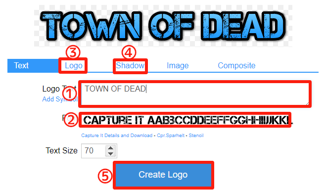
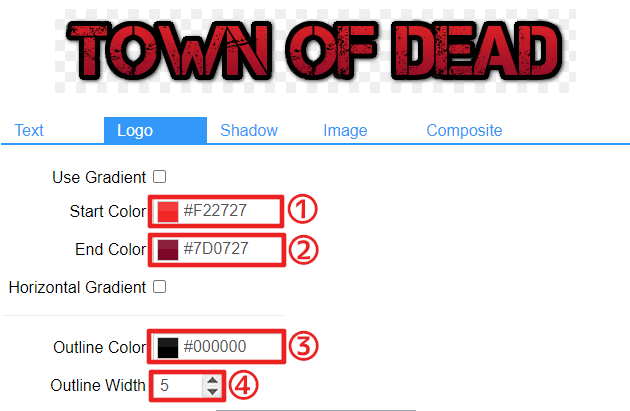
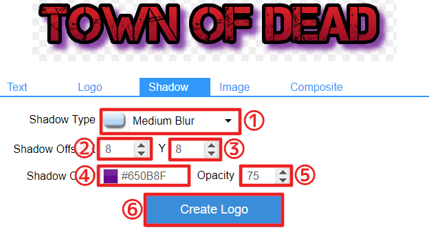
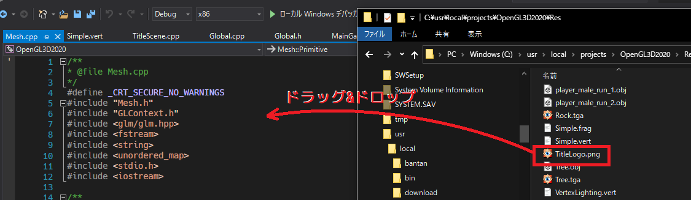
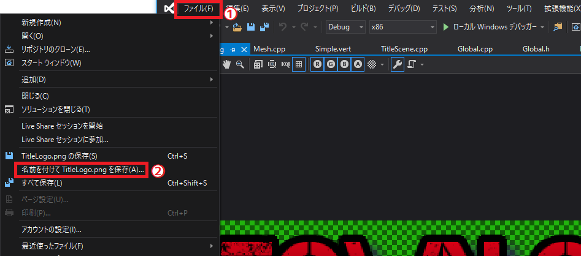
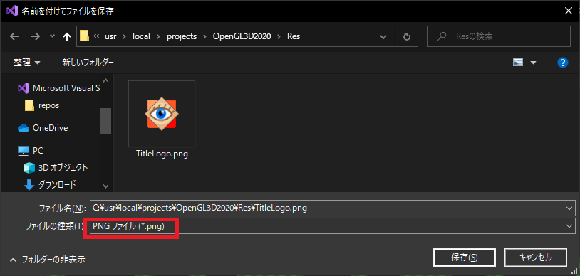
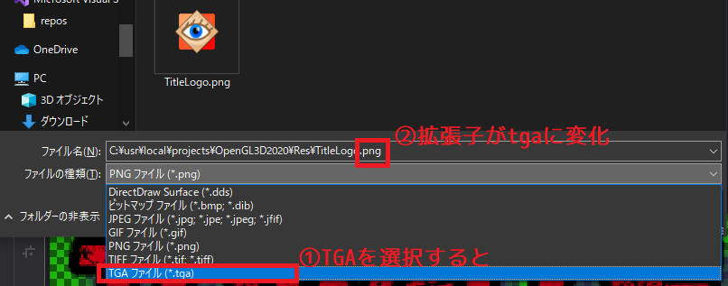
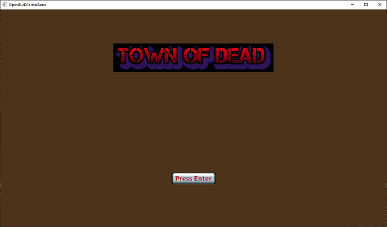
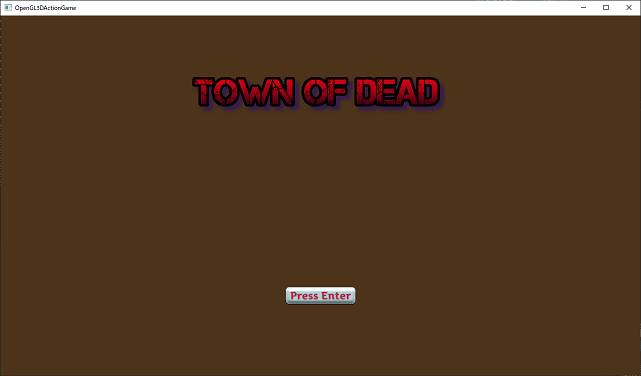

[OpenGL 3D 2020 第10回]

# SCENE IN THE CLASS

## 習得目標

* 既存のプログラムをクラスで置き換える方法
* タイトルロゴの作り方
* PNGファイルをTGAファイルに変換する方法
* 半透明合成を有効にする方法

## 1. メインゲームシーンを作る

## 1.1 シーンクラスを定義する

前回までのテキストで、ファイルからテクスチャとモデルを読み込み、それを表示できるようになりました。これで、3Dゲームを作成するために必要な、最低限の機能ができたことになります。今回からは、作成した機能を使って簡単なゲームを作っていきます。

大抵のゲームでは、ゲーム本編を始める前にタイトル画面があり、ゲームを終わるときにはゲームオーバー画面があります。これらの場面のことを「シーン」や「レベル」と呼びます。

プログラムも、シーンごとにファイルを分けておくと管理しやすいです。そこで、現在`Main.cpp`にあるプログラムを、シーンを扱うファイルに分けていこうと思います。

今回は`MainGameScene`(メイン・ゲーム・シーン)、`TitleScene`(タイトル・シーン)、`GameOverScene`(ゲームオーバー・シーン)の3つを作っていきます。

まずはゲーム本編を表す「メインゲームシーン」を作ります。`C++`の場合、シーンは「クラス」として定義するのが良いでしょう。ということで、その名もずばり`MainGameScene`というクラスを作ることにします。

シーンの処理は、「初期化」「入力処理」「更新」「描画」「破棄」の5つに分けられます。それぞれの処理は、以下の名前のメンバ関数として作ることにします。

|メンバ関数名|処理内容|
|:-:|:--|
|<ruby>Initialize<rt>イニシャライズ</rt></ruby>        |画面の描画に必要なデータを準備する。
|<ruby>ProcessInput<rt>プロセス インプット</rt></ruby> |入力を受けてシーンのパラメータを変更する。
|<ruby>Update<rt>アップデート</rt></ruby>              |パラメータに従ってシーンの状態を更新する。
|<ruby>Render<rt>レンダー</rt></ruby>                  |モデルの描画などを行う。
|<ruby>Finalize<rt>ファイナライズ</rt></ruby>          |`Initialize`で準備したデータを破棄する。

ソリューションエクスプローラーの`ソースファイル`を右クリックして「追加→新しい項目」を選択してください。そして、プロジェクトの`Src`フォルダに`MainGameScene.h`というヘッダファイルを追加します。追加した`MainGameScene.h`を開き、次のプログラムを追加してください。

```diff
+/**
+* @file MainGameScene.h
+*/
+#ifndef MAINGAMESCENE_H_INCLUDED
+#define MAINGAMESCENE_H_INCLUDED
+
+/**
+* メインゲーム画面.
+*/
+class MainGameScene
+{
+public:
+  MainGameScene() = default;
+  ~MainGameScene() { Finalize(); }
+  MainGameScene(const MainGameScene&) = delete;
+  MainGameScene& operator=(const MainGameScene&) = delete;
+
+  bool Initialize();
+  void ProcessInput();
+  void Update();
+  void Render();
+  void Finalize();
+};
+
+#endif // MAINGAMESCENE_H_INCLUDED
```

普通は、同じシーンをコピーして2つも3つも作ることはありません。また、データ管理の側面からも、シーンをコピーするのはあまりよくありません。

例えばデータをポインタで持っていて、`Finalize`で`delete`することを考えてみましょう。シーンをコピーしたあと、コピーしたシーンの`Finalize`を呼び出すとデータが`delete`されます。すると、コピー元のシーンは同じデータを使うことができません。

こうなってしまうのは、データを削除する責任が適切に決められていないからです。この問題を避ける最も簡単な方法は、コピーできなくすることです。`C++`の場合、「コピーコンストラクタ」と「コピー代入演算子」に`= delete`を指定すると、コピーできなくなります。

続いてメンバ関数を定義します。ソリューションエクスプローラーを使い、プロジェクトの`Src`フォルダに`MainGameScene.cpp`という`CPPファイル`を追加してください。そして追加したファイルを開き、次のプログラムを追加してください。

```diff
+/**
+* @file MainGameScene.cpp
+*/
+#include "MainGameScene.h"
+#include <iostream>
+
+/**
+* メインゲーム画面を初期化する.
+*
+* @retval true  初期化成功.
+* @retval false 初期化失敗.
+*/
+bool MainGameScene::Initialize()
+{
+  std::cout << "[情報] MainGameSceneを開始.\n";
+  return true;
+}
+
+/**
+* メインゲーム画面のキー入力を処理する.
+*/
+void MainGameScene::ProcessInput()
+{
+}
+
+/**
+* メインゲーム画面を更新する.
+*/
+void MainGameScene::Update()
+{
+}
+
+/**
+* メインゲーム画面を描画する.
+*/
+void MainGameScene::Render()
+{
+}
+
+/**
+* メインゲーム画面を終了する.
+*/
+void MainGameScene::Finalize()
+{
+  std::cout << "[情報] MainGameSceneを終了.\n";
+}
```

今は空っぽのメンバ関数ばかりです。ここに`Main.cpp`のプログラムを移動して、ちゃんと動くシーンクラスにしていくのが当面の目的となります。

### 1.2 初期化処理を移動する

最初にシーンの初期化処理を移動します。`Main.cpp`において、初期化に相当するのは以下の5つです。

  1. GLFWEWの初期化
  2. メッシュリストの作成
  3. シェーダーの作成
  4. テクスチャの作成
  5. ライトの初期化

このうち、1の「GLFWEWの初期化」は最初に一度だけ行えばいいので`main`関数に残します。残りの2,3,4,5は、シーンごとに違うデータを使う可能性があります。そこで、この4つを移動させることにしましょう。

現在の`Main.cpp`では、`PrimitiveBuffer`の初期化から`PointLight`の設定までがそれに当たります。それでは、`Main.cpp`を開き、`Ctrl+X`で次の範囲を切り取ってください。

```diff
     glfwTerminate();
     return 1;
   }

   glDebugMessageCallback(DebugCallback, nullptr);

-  Mesh::PrimitiveBuffer primitiveBuffer;
-  if (!primitiveBuffer.Allocate(20'000, 80'000)) {
-    return 1;
-  }
-  primitiveBuffer.AddFromObjFile("Res/Ground.obj");
-  primitiveBuffer.AddFromObjFile("Res/Tree.obj");
-  primitiveBuffer.AddFromObjFile("Res/House.obj");
-  primitiveBuffer.AddFromObjFile("Res/Cube.obj");
-
-  // パイプライン・オブジェクトを作成する.
-  Shader::Pipeline pipeline("Res/FragmentLighting.vert", "Res/FragmentLighting.frag");
-  if (!pipeline) {
-    return 1;
-  }
-
-  // uniform変数の位置.
-  const GLint locMatMVP = 0;
-
-  // サンプラ・オブジェクトを作成する.
-  Texture::Sampler sampler;
-  if (!sampler) {
-    return 1;
-  }
-  sampler.SetWrapMode(GL_REPEAT);
-  sampler.SetFilter(GL_NEAREST);
-
-  const Texture::Image2D texGround("Res/Ground.tga");
-  const Texture::Image2D texTree("Res/Tree.tga");
-  const Texture::Image2D texHouse("Res/House.tga");
-  const Texture::Image2D texCube("Res/Cube.tga");
-  if (!texGround ||!texTree || !texHouse || !texCube) {
-    return 1;
-  }
-
-  // 点光源を設定する
-  Shader::PointLight pointLight{
-    glm::vec4(8, 10,-8, 0),
-    glm::vec4(0.4f, 0.7f, 1.0f, 0) * 200.0f
-  };
-
   // 経過時間計測開始.
   double elapsedTime = glfwGetTime();

   // メインループ.
   while (!glfwWindowShouldClose(window)) {
```

切り取ったことで多くのエラーが出ると思いますが、今は無視してください。プログラムの一部を関数にするときや、別のファイルに移動するときは、一時的に多くのエラーが発生しますが、それは当然のことです。そうしたエラーをひとつひとつなくすことで移動を完成させていきます。

切り取ったプログラムを`Initialize`メンバ関数に貼り付けましょう。`MainGameScene.cpp`を開き、`Ctrl+V`を使って、次のように`Initialize`メンバ関数に貼り付けてください。

```diff
 bool MainGameScene::Initialize()
 {
+  Mesh::PrimitiveBuffer primitiveBuffer;
+  if (!primitiveBuffer.Allocate(20'000, 80'000)) {
+    return 1;
+  }
+  primitiveBuffer.AddFromObjFile("Res/Ground.obj");
+  primitiveBuffer.AddFromObjFile("Res/Tree.obj");
+  primitiveBuffer.AddFromObjFile("Res/House.obj");
+  primitiveBuffer.AddFromObjFile("Res/Cube.obj");
+
+  // パイプライン・オブジェクトを作成する.
+  Shader::Pipeline pipeline("Res/FragmentLighting.vert", "Res/FragmentLighting.frag");
+  if (!pipeline) {
+    return 1;
+  }
+
+  // uniform変数の位置.
+  const GLint locMatMVP = 0;
+
+  // サンプラ・オブジェクトを作成する.
+  Texture::Sampler sampler;
+  if (!sampler) {
+    return 1;
+  }
+  sampler.SetWrapMode(GL_REPEAT);
+  sampler.SetFilter(GL_NEAREST);
+
+  const Texture::Image2D texGround("Res/Ground.tga");
+  const Texture::Image2D texTree("Res/Tree.tga");
+  const Texture::Image2D texHouse("Res/House.tga");
+  const Texture::Image2D texCube("Res/Cube.tga");
+  if (!texGround ||!texTree || !texHouse || !texCube) {
+    return 1;
+  }
+
+  // 点光源を設定する
+  Shader::PointLight pointLight{
+    glm::vec4(8, 10,-8, 0),
+    glm::vec4(0.4f, 0.7f, 1.0f, 0) * 200.0f
+  };
+
   std::cout << "[情報] MainGameSceneを開始.\n";
   return true;
 }
```

### 1.3 更新処理を移動する

続いて物体を移動させるプログラムを`Update`メンバ関数に移動します。現在の移動処理は、`Main.cpp`の「点光源を移動させる」部分です。`Main.cpp`を開き、`Ctrl+X`で「点光源を移動させる」プログラムを切り取ってください。

```diff
     glClearColor(0.1f, 0.3f, 0.5f, 1.0f);
     glClear(GL_COLOR_BUFFER_BIT | GL_DEPTH_BUFFER_BIT);

-    // 点光源を移動させる.
-    const float speed = 10.0f * deltaTime;
-    if (glfwGetKey(window, GLFW_KEY_A) == GLFW_PRESS) {
-      pointLight.position.x -= speed;
-    } else if (glfwGetKey(window, GLFW_KEY_D) == GLFW_PRESS) {
-      pointLight.position.x += speed;
-    }
-    if (glfwGetKey(window, GLFW_KEY_W) == GLFW_PRESS) {
-      pointLight.position.z -= speed;
-    } else if (glfwGetKey(window, GLFW_KEY_S) == GLFW_PRESS) {
-      pointLight.position.z += speed;
-    }
-    if (glfwGetKey(window, GLFW_KEY_E) == GLFW_PRESS) {
-      pointLight.position.y -= speed;
-    } else if (glfwGetKey(window, GLFW_KEY_Q) == GLFW_PRESS) {
-      pointLight.position.y += speed;
-    }

     // 平行光源を設定する
     const Shader::DirectionalLight directionalLight{
```

`MainGameScene.cpp`を開き、`Ctrl+V`を使って、次のように`Update`メンバ関数に貼り付けてください。

```diff
 void MainGameScene::Update()
 {
+  // 点光源を移動させる.
+  const float speed = 10.0f * deltaTime;
+  if (glfwGetKey(window, GLFW_KEY_A) == GLFW_PRESS) {
+    pointLight.position.x -= speed;
+  } else if (glfwGetKey(window, GLFW_KEY_D) == GLFW_PRESS) {
+    pointLight.position.x += speed;
+  }
+  if (glfwGetKey(window, GLFW_KEY_W) == GLFW_PRESS) {
+    pointLight.position.z -= speed;
+  } else if (glfwGetKey(window, GLFW_KEY_S) == GLFW_PRESS) {
+    pointLight.position.z += speed;
+  }
+  if (glfwGetKey(window, GLFW_KEY_E) == GLFW_PRESS) {
+    pointLight.position.y -= speed;
+  } else if (glfwGetKey(window, GLFW_KEY_Q) == GLFW_PRESS) {
+    pointLight.position.y += speed;
+  }
 }

 /**
 * メインゲーム画面を更新する.
```

### 1.4 描画処理を移動する

次に描画プログラムを移動します。描画プログラムは、メインループの最初の方にある`glEnable`関数呼び出しから、最後の方の`glfwPollEvents`関数呼び出しまでです。`Main.cpp`を開き、`Ctrl+X`で以下の範囲を切り取ってください。

切り取る範囲が広いので、以下のプログラムは一部省略して書いてあります。省略されている範囲も全て切り取ってください。マウスよりも`Shift`キーと矢印キーを使うほうがやりやすいかもしれません。

```diff
       deltaTime = 1.0f / 60.0f;
     }
     elapsedTime = newElapsedTime;

-    glEnable(GL_DEPTH_TEST);
-    glEnable(GL_CULL_FACE);
-    glClearColor(0.1f, 0.3f, 0.5f, 1.0f);
-    glClear(GL_COLOR_BUFFER_BIT | GL_DEPTH_BUFFER_BIT);
-
-    // 平行光源を設定する
-    const Shader::DirectionalLight directionalLight{
-      glm::normalize(glm::vec4(3, 2, 2, 0)),
-      glm::vec4(1, 0.9f, 0.8f, 1)
-    };
-
-        ・
-        ・
-        ・
-
-      primitiveBuffer.Get(1).Draw();
-    }
-
-    Texture::UnbindAllTextures();
-    Texture::UnbindAllSamplers();
-    Shader::UnbindPipeline();
-    primitiveBuffer.UnbindVertexArray();

     glfwPollEvents();
     glfwSwapBuffers(window);
   }
```

それでは、切り取ったプログラムを貼り付けましょう。`MainGameScene.cpp`を開き、`Ctrl+X`を使って、次のように`Render`メンバ関数に貼り付けてください。

```diff
 void MainGameScene::Render()
 {
+    glEnable(GL_DEPTH_TEST);
+    glEnable(GL_CULL_FACE);
+    glClearColor(0.1f, 0.3f, 0.5f, 1.0f);
+    glClear(GL_COLOR_BUFFER_BIT | GL_DEPTH_BUFFER_BIT);
+
+    // 平行光源を設定する
+    const Shader::DirectionalLight directionalLight{
+      glm::normalize(glm::vec4(3, 2, 2, 0)),
+      glm::vec4(1, 0.9f, 0.8f, 1)
+    };
+
+        ・
+        ・
+        ・
+
+      primitiveBuffer.Get(1).Draw();
+    }
+
+    Texture::UnbindAllTextures();
+    Texture::UnbindAllSamplers();
+    Shader::UnbindPipeline();
+    primitiveBuffer.UnbindVertexArray();
 }

 /**
 * メインゲーム画面を終了する.
```

ここまでで、`Main.cpp`のほとんどのプログラムが`MainGameScene.cpp`に移動できたと思います。

以前の課題で木の描画を関数にしている場合、その関数も移動しなければなりません。木を描画する関数全体を切り取って、`MainGameScene.cpp`の以下の場所に貼り付けてください。

```diff
 #include "MainGameScene.h"
 #include <iostream>

+// ここに木を描画する関数を貼り付ける.

 /**
 * メインゲーム画面を初期化する.
```

### 1.5 ローカル変数をメンバ変数にする(その1)

現在`MainGameScene.cpp`で出ているエラーの大半は、変数が見つからないことから生じています。というのは、ほぼすべての変数が`Initialize`メンバ関数の中に定義された「ローカル変数」になっているからです。

「ローカル変数」は関数の中でしか使えません。これはクラスのメンバ関数であっても同じことです。プログラムを移動させる前は、すべての変数とそれを使うプログラムが`main`関数の中にあったので問題はありませんでした。

しかし、プログラムをいくつかのメンバ関数に分けた結果、変数の定義は`Initialize`関数、変数を使うのは`Pudate`と`Render`関数に存在するようになりました。そのため、`Update`や`Render`からは、`Initialize`メンバ関数の中にある変数が見えなくなっているのです。

この問題の解決策は「ローカル変数をメンバ変数にする」ことです。変数をクラスのメンバ変数にすると、同じクラスのすべてのメンバ関数から見えるようになります。

ただし、いくつかのローカル変数は、そのままメンバ変数にすることができません。これには、例えば`Texture::Image2D`型の変数のように、定義と同時に初期化しているものが該当します。

なぜできないのかというと「クラスのメンバ変数はコンストラクタで初期化しなくてはならない」というルールがあるからです。つまり、`Initialize`関数で初期化することができないのです。

しかし、この制約は、変数をポインタにすることで回避できます。

>**【ローカル変数をメンバ変数にするときのルール(その1)】**<br>
>定義と同時に初期化しているローカル変数は、そのままメンバ変数できないことがある。その場合はポインタ型で置き換える。
>
>```c++
>void func()
>{
>   A  a(100); // 定義と同時に初期化している. → このままではメンバ変数にできない.
>   B  b;      // 定義だけしている.           → このままメンバ変数にできる.
>}
>
>class X {
>  //A  a;         // 初期化しているので、メンバ変数にはできない.
>  A* pa = nullptr; // 初期化している場合、ポインタ型にすればO.K.
>  B  b;           // 初期化していないので、そのままでO.K.
>
>  void init() {
>    pa = new A(100); // newを使って初期化.
>  }
>};

ここまでのことを踏まえて、ローカル変数をメンバ変数にしていきましょう。まず`primitiveBuffer`を変更します。`Mesh::PrimitiveBuffer`型はポインタにする必要はなく、そのままメンバ変数にすることができます。

`MainGameScene.cpp`を開き、`primitiveBuffer`を定義している行を切り取ってください。

```diff
 bool MainGameScene::Initialize()
 {
-  Mesh::PrimitiveBuffer primitiveBuffer;
   if (!primitiveBuffer.Allocate(20'000, 80'000)) {
     return 1;
   }
```

次に`MainGameScene.h`を開き、次のように切り取ったプログラムを貼り付けます。

```diff
   void Render();
   void Finalize();
+  Mesh::PrimitiveBuffer primitiveBuffer;
 };

 #endif // MAINGAMESCENE_H_INCLUDED
```

メンバ変数は、他のクラスから見えないようにしておくほうがいいです。そこで、次のように`private`(プライベート)を追加してください。

```diff
   void Render();
   void Finalize();
+
+private:
   Mesh::PrimitiveBuffer primitiveBuffer;
 };
```

移動させただけでは、まだ変数を使えるようにはなりません。なぜなら、ヘッダファイルをインクルードしていないので、`Mesh::PrimitiveBuffer`とは何なのかが分からないからです。

そこで、`Mesh::PrimitiveBuffer`を使えるようにヘッダファイルをインクルードします。必要なヘッダファイルを見つけるには、マウスカーソルを`Mesh::PrimitiveBuffer`の上に持っていって右クリックします。

次に右クリックメニューの中の「宣言へ移動」という項目をクリックすると、宣言の書かれているヘッダファイルが開きます。こうして必要なヘッダファイルは`Mesh.h`だということが分かります。

>**【型、変数、関数の宣言や定義を見つけるには】**<br>
>見つけたい名前を右クリックして「宣言へ移動」、「定義へ移動」を選択します。

それでは、`MainGameScene.h`の先頭に次のプログラムを追加してください。

```diff
 #ifndef MAINGAMESCENE_H_INCLUDED
 #define MAINGAMESCENE_H_INCLUDED
+#include "Mesh.h"

 /**
 * メインゲーム画面.
```

これで`primitiveBuffer`変数に関するエラーはなくなるはずです。

### 1.6 ローカル変数をメンバ変数にする(その2)

続いて`sampler`変数をメンバ変数にします。`Texture::Sampler`型の変数も、そのままメンバ変数にするこができます。

`MainGameScene.cpp`を開き、`Initialize`メンバ関数から、`sampler`変数を定義している行を切り取ってください。

```diff
   // uniform変数の位置.
   const GLint locMatMVP = 0;

   // サンプラ・オブジェクトを作成する.
-  Texture::Sampler sampler;
   if (!sampler) {
     return 1;
   }
```

切り取ったら`MainGameScene.h`を開き、`primitiveBuffer`メンバ変数の下に貼り付けてください。

```diff
   void Finalize();

 private:
   Mesh::PrimitiveBuffer primitiveBuffer;
+  Texture::Sampler sampler;
 };

 #endif // MAINGAMESCENE_H_INCLUDED
```

<pre class="tnmai_assignment">
<strong>【課題01】</strong>
「宣言へ移動」を使って<code>Texture::Sampler</code>型に必要なヘッダファイルを見つけなさい。見つけたヘッダファイルを<code>MainGameScene.h</code>にインクルードしなさい。インクルードする場所は<code>Mesh.h</code>の下とします。
</pre>

### 1.7 ローカル変数をメンバ変数にする(その3)

次に、`pipeline`変数をメンバ変数にします。`Shader::Pipeline`型は定義と同時に初期化するタイプの型なので、ポインタ型にしなくてはなりません。また初期化プログラムを残したいので、切り取りは行わずに直接メンバ変数を書きます。

`MainGameScene.h`を開き、`sampler`メンバ変数の定義の下に、次のプログラムを追加してください。

```diff
 private:
   Mesh::PrimitiveBuffer primitiveBuffer;
   Texture::Sampler sampler;
+  Shader::Pipeline* pipeline = nullptr;
 };

 #endif // MAINGAMESCENE_H_INCLUDED
```

<pre class="tnmai_assignment">
<strong>【課題02】</strong>
「宣言へ移動」を使って<code>Shader::Pipeline</code>型に必要なヘッダファイルを見つけなさい。見つけたヘッダファイルを<code>MainGameScene.h</code>にインクルードしなさい。インクルードする場所は<code>Texture.h</code>の下とします。
</pre>

ヘッダファイルをインクルードしたら、次はパイプラインオブジェクトの初期化を`new`を使ったものに変更します。`MainGameScene.cpp`を開き、`pipeline`変数の初期化を次のように変更してください。

```diff
   primitiveBuffer.AddFromObjFile("Res/House.obj");
   primitiveBuffer.AddFromObjFile("Res/Cube.obj");

   // パイプライン・オブジェクトを作成する.
-  Shader::Pipeline pipeline("Res/FragmentLighting.vert", "Res/FragmentLighting.frag");
+  pipeline = new Shader::Pipeline("Res/FragmentLighting.vert", "Res/FragmentLighting.frag");
   if (!pipeline) {
     return 1;
   }
```

`new`による初期化は次のような書式になっています。

<pre class="tnmai_code"><strong>【書式】</strong>
ポインタ変数 = new 型名(初期化パラメータ, ...);
</pre>

C++言語の`new`とC言語の`malloc`との最大の違いは、型を認識するところです。`malloc`では、プログラマがキャストによって型を合わせなくてはなりませんでした。しかし`new`では、型名を指定するためキャストは不要です。

また、`new`は初期化パラメータを指定できるようになっています。これはC++の機能なので、C言語由来の関数である`malloc`には不可能です。

`new`で確保した変数は、`delete`で削除しなくてはなりません。削除は`Finalize`メンバ関数で行います。`Finalize`メンバ関数に次のプログラムを追加してください。

```diff
 * メインゲーム画面を終了する.
 */
 void MainGameScene::Finalize()
 {
+#define SAFE_DELETE(p) if (p) { delete p; p = nullptr; } (void)0
+  SAFE_DELETE(pipeline);
+#undef SAFE_DELETE
   std::cout << "[情報] MainGameSceneを終了.\n";
 }
```

これで削除処理は完成です。残る問題は`pipeline`変数を使っている部分の`.`子を全て`->`演算子で置き換えることです。手始めに平行光源を設定するプログラムを、次のように変更してください。

```diff
   // 平行光源を設定する
   const Shader::DirectionalLight directionalLight{
     glm::normalize(glm::vec4(3,-2, 2, 0)),
     glm::vec4(1, 0.9f, 0.8f, 1)
   };
-  pipeline.SetLight(directionalLight);
+  pipeline->SetLight(directionalLight);
-
-  pipeline.SetLight(pointLight);
+  pipeline->SetLight(pointLight);

   const glm::vec3 viewPosition(20, 30, 30);

   // 座標変換行列を作成.
```

<pre class="tnmai_assignment">
<strong>【課題03】</strong>
上記のプログラムを参考にして、全ての<code>pipeline</code>変数を使っている部分の<code>.</code>演算子を、<code>-></code>演算子に置き換えなさい。
</pre>

これで`pipeline`変数をメンバ変数にすることができました。

### 1.8 ローカル変数をメンバ変数にする(その4)

`pipeline`変数と同様にして、テクスチャオブジェクトの変数をメンバ変数に変えていきましょう。まずは、変数をポインタ化してクラス定義に追加します。`MainGameScene.h`を開き、次のプログラムを追加してください。

```diff
 private:
   Mesh::PrimitiveBuffer primitiveBuffer;
   Texture::Sampler sampler;
   Shader::Pipeline* pipeline = nullptr;
+  Texture::Image2D* texGround = nullptr;
+  Texture::Image2D* texTree = nullptr;
+  Texture::Image2D* texHouse = nullptr;
+  Texture::Image2D* texCube = nullptr;
 };

 #endif // MAINGAMESCENE_H_INCLUDED
```

`Texture::Image2D`は、`Texture::Sampler`と同じヘッダファイルで定義されています。ですから、新たにヘッダファイルをインクルードする必要はありません。

定義が済んだら、初期化を`new`を使うように書き換えます。`MainGameScene.cpp`を開き、テクスチャを読み込むプログラムを次のように変更してください。

```diff
   sampler.SetWrapMode(GL_REPEAT);
   sampler.SetFilter(GL_NEAREST);

-  const Texture::Image2D texGround("Res/Ground.tga");
-  const Texture::Image2D texTree("Res/Tree.tga");
-  const Texture::Image2D texHouse("Res/House.tga");
-  const Texture::Image2D texCube("Res/Cube.tga");
+  texGround = new Texture::Image2D("Res/Ground.tga");
+  texTree = new Texture::Image2D("Res/Tree.tga");
+  texHouse = new Texture::Image2D("Res/House.tga");
+  texCube = new Texture::Image2D("Res/Cube.tga");
   if (!texGround ||!texTree || !texHouse || !texCube) {
     return 1;
   }
```

それから、テクスチャオブジェクトを`delete`する処理を追加しなくてはなりません。`Finalize`メンバ関数に次のプログラムを追加してください。

```diff
 void MainGameScene::Finalize()
 {
 #define SAFE_DELETE(p) if (p) { delete p; p = nullptr; } (void)0
   SAFE_DELETE(pipeline);
+  SAFE_DELETE(texGround);
+  SAFE_DELETE(texTree);
+  SAFE_DELETE(texHouse);
+  SAFE_DELETE(texCube);
 #undef SAFE_DELETE
   std::cout << "[情報] MainGameSceneを終了.\n";
 }
```

テクスチャ変数をポインタ型に変更したので、それらを使っている部分の`.`演算子を`->`演算子に変更しなくてはなりません。まずは`texGround`を変更しましょう。`Render`メンバ関数の地面を描画するプログラムを、次のように変更してください。

```diff
  // 地面を描画.
  {
    const glm::mat4 matModel = glm::mat4(1);
    const glm::mat4 matMVP = matProj * matView * matModel;
    pipeline->SetMVP(matMVP);
    pipeline->SetModelMatrix(matModel);
-   texGround.Bind(0);
+   texGround->Bind(0);
    primitiveBuffer.Get(0).Draw();
  }
```

<pre class="tnmai_assignment">
<strong>【課題04】</strong>
上記のプログラムを参考にして、全てのテクスチャ変数を使っている部分の<code>.</code>演算子を、<code>-></code>演算子に置き換えなさい。
</pre>

### 1.9 ローカル変数をメンバ変数にする(その5)

最後に、`pointLight`変数をメンバ変数にします。`Shaer::PointLight`型は普通の構造体です。構造体はポインタ型にしなくても大丈夫です。

>**【ローカル変数をメンバ変数にするときのルール(その2)】**<br>
>構造体は初期化パラメータがあってもそのままメンバ変数にできる。

ただ、初期化を伴う部分は`Initialize`メンバ関数で行いたいので、切り取りは行わず普通にメンバ変数を定義します。`MainGameScene.h`を開き、`texCube`変数の定義の下に、次のプログラムを追加してください。

```diff
   Texture::Image2D* texTree = nullptr;
   Texture::Image2D* texHouse = nullptr;
   Texture::Image2D* texCube = nullptr;
+  Shader::PointLight pointLight;
 };

 #endif // MAINGAMESCENE_H_INCLUDED
```

`MainGameScene.cpp`に戻り、`pointLight`変数の初期化を次のように変更してください。

```diff
   if (!texGround ||!texTree || !texHouse || !texCube) {
     return 1;
   }

   // 点光源を設定する
-  Shader::PointLight pointLight{
+  pointLight = {
     glm::vec4(8, 10,-8, 0),
     glm::vec4(0.4f, 0.7f, 1.0f, 0) * 200.0f
   };
```

これで、移動してきた全てのローカル変数をメンバ変数で置き換えることができました。

### 1.10 window変数の扱い

ローカル変数をメンバ変数で置き換えることによって、多くのエラーが解消されたと思います。しかしまだエラーは残っています。残ったエラーのうちいくつかは、移動させなかった変数に関するものです。

今回の場合「移動させなかった変数」とは、`window`変数と`deltaTime`変数の2つです。これらは元の`Main.cpp`に定義されたままです。通常、このような変数は、引数として受け取ることになります。

`MainGameScene.h`を開き、`Update`と`Render`関数を次のように変更してください。

```diff
   bool Initialize();
   void ProcessInput();
-  void Update();
-  void Render();
+  void Update(GLFWwindow* window, float deltaTime);
+  void Render(GLFWwindow* window);
   void Finalize();
```

追加した引数のうち`GLFWwindow`型は、`MainGameScene.h`がまだ知らない型です。そのため、ヘッダファイルをインクルードして型の素性を教える必要があります。例によって「宣言へ移動」をすると、必要なのは`glfw3.h`だということが分かります。

ただし、`glfw3.h`は`GLFW`フォルダにあります。また、GLFWライブラリのヘッダファイルなので、`"`ではなく`<`と`>`で囲います。結果として、インクルード文は以下のようになります。

```diff
 #include "Mesh.h"
 #include "Shader.h"
 #include "Texture.h"
+#include <GLFW/glfw3.h>

 /**
 * メインゲーム画面.
```

ヘッダファイルをインクルードしたら、メンバ関数の定義を修正します。`MainGameScene.cpp`を開き、`Update`と`Rnder`メンバ関数を次のように変更してください。

```diff
 /**
 * メインゲーム画面を更新する.
+*
+* @param window    GLFWウィンドウへのポインタ.
+* @param deltaTime 前回の更新からの経過時間.
 */
-void MainGameScene::Update()
+void MainGameScene::Update(GLFWwindow* window, float deltaTime)
 {
   // 点光源を移動させる.
   const float speed = 10.0f * deltaTime;
```

<br>

```diff
 /**
 * メインゲーム画面を描画する.
+*
+* @param window GLFWウィンドウへのポインタ.
 */
-void MainGameScene::Render()
+void MainGameScene::Render(GLFWwindow* window)
 {
   glEnable(GL_DEPTH_TEST);
   glEnable(GL_CULL_FACE);
```

これで、さらにいくつかのエラーが解消されるでしょう。

### 1.11 足りないヘッダファイルをインクルードする

ここまでやっても、まだしぶとくいくつかのエラーが残っているはずです。それはおそらく、`glm::translate`や`glm::perspective`などの、座標変換行列を作成する関数で起きていることでしょう。

これらの関数でエラーが報告されるのは、対応するヘッダファイルをインクルードしていないからです。GLMライブラリの座標変換行列を作成する関数は、`glm/gtc/matrix_transform.hpp`というヘッダファイルで定義されています。

ということで、このファイルをインクルードしましょう。`MainGameScene.cpp`の先頭付近、`MainGameScene.h`のインクルード文の下に、次のプログラムを追加してください。

```diff
 * @file MainGameScene.cpp
 */
 #include "MainGameScene.h"
+#include <glm/gtc/matrix_transform.hpp>
 #include <iostream>
```

これで、`MainGameScene`については全てのエラーが解消されたと思います。

### 1.12 Initializeメンバ関数の戻り値を修正する

エラーはなくなりましたが、まだ修正すべき点が残っています。それは`Initialize`メンバ関数の戻り値についてです。

移動してきたプログラムでは、初期化に失敗したときに`1`を返すようにしていました。しかし、`Initialize`メンバ関数の戻り地は`bool`型で、説明文を読むと「失敗したときは`false`を返す」ようになっています。

そこで、初期化に失敗したときは、説明文に書いてあるとおりに`false`を返すように修正しなくてはなりません。`Initialize`メンバ関数を次のように変更してください。

```diff
 bool MainGameScene::Initialize()
 {
   if (!primitiveBuffer.Allocate(20'000, 80'000)) {
-    return 1;
+    return false;
   }
   primitiveBuffer.AddFromObjFile("Res/Ground.obj");
   primitiveBuffer.AddFromObjFile("Res/Tree.obj");
```

```diff
   // パイプライン・オブジェクトを作成する.
   pipeline = new Shader::Pipeline("Res/FragmentLighting.vert", "Res/FragmentLighting.frag");
   if (!pipeline) {
-    return 1;
+    return false;
   }
```

```diff
   // サンプラ・オブジェクトを作成する.
   if (!sampler) {
-    return 1;
+    return false;
   }
```

```diff
   texHouse = new Texture::Image2D("Res/House.tga");
   texCube = new Texture::Image2D("Res/Cube.tga");
   if (!texGround ||!texTree || !texHouse || !texCube) {
-    return 1;
+    return false;
   }
```

これで`Initialize`メンバ関数が正しい戻り値を返すようにできました。

ひとまず`MainGameScene`クラスは完成です。

### 1.13 MainGameSceneクラスを使う

それでは、完成した`MainGameScene`クラスを`Main.cpp`に組み込みましょう。まずは`MainGameScene.h`をインクルードしなくてはなりません。`Main.cpp`を開き、次のプログラムを追加してください。

```diff
 #include "Mesh.h"
 #include "Texture.h"
 #include "Shader.h"
+#include "MainGameScene.h"
 #include <glm/gtc/matrix_transform.hpp>
 #include <GLFW/glfw3.h>
 #include <string>
```

次に、`MainGameScene`型の変数を定義し、`Initialize`メンバ関数を使って初期化します。変数名は`mainGameScene`とします(先頭が小文字)。`glDebugMessageCallback`関数呼び出しの下に、次のプログラムを追加してください。

```diff
     glfwTerminate();
     return 1;
   }

   glDebugMessageCallback(DebugCallback, nullptr);
+
+  MainGameScene mainGameScene;
+  if (!mainGameScene.Initialize()) {
+    return 1;
+  }

   // 経過時間計測開始.
   double elapsedTime = glfwGetTime();

   // メインループ.
   while (!glfwWindowShouldClose(window)) {
```

続いて、`ProcessInput`、`Update`、`Render`メンバ関数の呼び出しを追加します。メインループの内側に次のプログラムを追加してください。

```diff
       deltaTime = 1.0f / 60.0f;
     }
     elapsedTime = newElapsedTime;
+
+    mainGameScene.ProcessInput();
+    mainGameScene.Update(window, deltaTime);
+    mainGameScene.Render(window);

     glfwPollEvents();
     glfwSwapBuffers(window);
   }
```

最後に終了処理を呼び出します。メインループの直後に、次のプログラムを追加してください。

```diff
     glfwPollEvents();
     glfwSwapBuffers(window);
   }
+
+  mainGameScene.Finalize();

   // GLFWの終了.
   glfwTerminate();
```

これで、`Main.cpp`の描画処理を`MainGameScene`クラスに移動する作業は完了です。プログラムが書けたらビルドして実行してください。以前と同じ画面が表示されていたら成功です。

### 1.14 ポインタをスマートポインタクラスで置き換える

実は、現在の`Initialize`関数には欠陥があります。それは「初期化に失敗したとき、メモリが解放されない場合がある」ことです。

例えば`pipeline`変数を`new`したあと、`sampler`の初期化に失敗すると`pipeline`が`delete`されません。

この問題は、適切な位置に`delete`を追加することで解決できます。しかし、プログラムを変更していくにつれて、「適切な位置」というのは変化しうるものです。そのため、不要な`delete`を消し忘れたり、必要な`delete`を書き忘れたりする可能性があります。

>```c++
>  int* a = new int;
>  if (!a) {
>    return;
>  }
>  int* b = new int;
>  if (!b) {
>    delete a; // aは確保済みなのでdeleteを書く必要がある.
>    return;
>  }
>  int* c = new int;
>  if (!c) {
>    delete a;
>    return;   // !!! bのdeleteを書き忘れている !!!
>  }
>```

より良い解決策は、「スマートポインタ」と呼ばれるクラスでポインタを置き換えることです(「スマート」は「賢い」という意味)。

スマートポインタ型の変数は、自分自身が削除されるときに自動的に`delete`を呼び出します。この仕組みによって、自前で`delete`を書く必要はなくなります。

C++で主に使われるのは`std::shared_ptr`(エスティーディー・シェアード・ポインタ)というクラスです。シェアードポインタを使うと、上記のプログラムは以下のように書き換えることができます。

>```c++
>  std::shared_ptr<int> a = new int;
>  if (!a) {
>    return;
>  }
>  std::shared_ptr<int> b = new int;
>  if (!b) {
>    return; // aは自動的にdeleteされる.
>  }
>  std::shared_ptr<int> c = new int;
>  if (!c) {
>    return; // aもbも自動的にdeleteされる.
>  }
>```

`delete`がなくなっていることに注目してください。しかし、プログラマが書いていないだけで、実際にはシェアードポインタクラスが自動的に`delete`を実行してくれています。

それではポインタをシェアードポインタで置き換えましょう。シェアードポインタは`memory`ヘッダで定義されています。`MainGameScene.h`を開き、`memory`をインクルードしてください。

```diff
 #include "Shader.h"
 #include "Texture.h"
 #include <GLFW/glfw3.h>
+#include <memory>

 /**
 * メインゲーム画面.
```

続いて、メンバ変数の定義を次のように変更してください。

```diff
   Mesh::PrimitiveBuffer primitiveBuffer;
   Texture::Sampler sampler;
-  Shader::Pipeline* pipeline = nullptr;
-  Texture::Image2D* texGround = nullptr;
-  Texture::Image2D* texTree = nullptr;
-  Texture::Image2D* texHouse = nullptr;
-  Texture::Image2D* texCube = nullptr;
+  std::shared_ptr<Shader::Pipeline> pipeline;
+  std::shared_ptr<Texture::Image2D> texGround;
+  std::shared_ptr<Texture::Image2D> texTree;
+  std::shared_ptr<Texture::Image2D> texHouse;
+  std::shared_ptr<Texture::Image2D> texCube;
   Shader::PointLight pointLight;
 };

 #endif // MAINGAMESCENE_H_INCLUDED
```

<pre class="tnmai_code"><strong>【書式】</strong>
std::shared_ptr<元になる型> 変数名;
</pre>

シェアードポインタ型の変数は自動的に`nullptr`で初期化されるため、初期値を設定する必要はありません。

シェアードポインタの作成は`new`の代わりに`std::make_shared`(エスティーディー・メイク・シェアード)という関数で行います。`MainGameScene.cpp`を開き、パイプライン変数とテクスチャ変数の初期化を次のように変更してください。

```diff
   // パイプライン・オブジェクトを作成する.
-  pipeline = new Shader::Pipeline("Res/FragmentLighting.vert", "Res/FragmentLighting.frag");
+  pipeline = std::make_shared<Shader::Pipeline>(
+    "Res/FragmentLighting.vert", "Res/FragmentLighting.frag");
   if (!pipeline) {
     return false;
   }
```

<br>

```diff
   sampler.SetWrapMode(GL_REPEAT);
   sampler.SetFilter(GL_NEAREST);

-  texGround = new Texture::Image2D("Res/Ground.tga");
-  texTree = new Texture::Image2D("Res/Tree.tga");
-  texHouse = new Texture::Image2D("Res/House.tga");
-  texCube = new Texture::Image2D("Res/Cube.tga");
+  texGround = std::make_shared<Texture::Image2D>("Res/Ground.tga");
+  texTree = std::make_shared<Texture::Image2D>("Res/Tree.tga");
+  texHouse = std::make_shared<Texture::Image2D>("Res/House.tga");
+  texCube = std::make_shared<Texture::Image2D>("Res/Cube.tga");
   if (!texGround ||!texTree || !texHouse || !texCube) {
     return 1;
   }
```

<pre class="tnmai_code"><strong>【書式】</strong>
std::shared_ptr<元になる型> std::make_shared<元になる型>(引数1, 引数2, ...);
</pre>

シェアードポインタに変更したことで、`SAFE_DELETE`も不要になります。`Finalize`メンバ関数を次のように変更してください。

```diff
 void MainGameScene::Finalize()
 {
-#define SAFE_DELETE(p) if (p) { delete p; p = nullptr; } (void)0
-  SAFE_DELETE(pipeline);
-  SAFE_DELETE(texGround);
-  SAFE_DELETE(texTree);
-  SAFE_DELETE(texHouse);
-  SAFE_DELETE(texCube);
-#undef SAFE_DELETE
   std::cout << "[情報] MainGameSceneを終了.\n";
 }
```

これでポインタをスマートポインタで置き換えることができました。プログラムが書けたらビルドして実行してください。問題なくプログラムが実行されていたら成功です。

<div style="page-break-after: always"></div>

## 2. タイトル画面を作る

### 2.1 タイトル画面で使うモデルを用意する

ゲームにはタイトル画面があったほうがいいと思います。だから、タイトルシーンを追加しましょう。

タイトル画面にはタイトルロゴを表示することにします。ロゴを表示するために正方形の板モデルを追加しましょう。`Res`フォルダに`Plane.obj`(プレーン・オブジェ)というファイルを追加して、以下のモデルデータを書き込んでください。

```diff
+#
+# Plane.obj
+#
+v -0.5 -0.5 0.0
+v  0.5 -0.5 0.0
+v  0.5  0.5 0.0
+v -0.5  0.5 0.0
+
+vt 0.0 0.0
+vt 1.0 0.0
+vt 1.0 1.0
+vt 0.0 1.0
+
+vn 0.0 0.0 1.0
+
+f 1/1/1 2/2/1 3/3/1
+f 3/3/1 4/4/1 1/1/1
```

ファイルのプロパティを開いて「ビルドから除外する」を設定することを忘れないようにしてください。

### 2.2 タイトル画面で使う画像を用意する

タイトルロゴ画像と「PRESS ENTER」と書かれた画像を用意します。こういった画像の作成には、無料でロゴを作成できるサイトを利用するのが簡単です。今回は`cooltext.com`を使ってロゴを作ってもらいます。

Webブラウザを開き、上部のアドレスバーに`cooltext.com`と入力して`Enter`キーを押してください。すると、以下のサイトが表示されます。

<p align="center">
<br>
</p>

`Choose a Text Style`というテキストの下に、作成できるスタイルがリストされています。ここで好きなスタイルを選択できます。しかし、操作説明をしたいので、ひとまず左上の`SKATE`というスタイルをクリックしてください。

すると以下のような、タイトル名とフォントを選択する画面に変わります。

<p align="center">
<br>
</p>

>**【画面の説明】**<br>
>①: タイトルの入力欄<br>
>②: フォントの種類<br>
>③: ロゴの色などの設定タブ<br>
>④: 影の設定タブ<br>
>⑤: ロゴ作成ボタン<br>

本テキストで作成するのは「ゾンビを撃って倒す」ゲームになります。各自それらしいタイトルを考えて、①のタイトル入力欄に入力してください。どうしてもタイトルが思いつかない場合は`TOWN OF DEAD`を使ってください。

現在のフォントで問題なければ③の`Logo`をクリックして色を調整します。もしフォントが気に入らず、見た目を変更したい場合は②をクリックしてください。

するとフォントカテゴリーの一覧と、現在使用しているフォントに類似したフォントの一覧が表示されます。好きなものを選択してください。

>**【日本語が使いたい！】**<br>
>日本語フォントは`Asian`カテゴリーに含まれています。

③の`Logo`タブをクリックすると、以下のような画面に変わります。ここではフォントの色や枠線の太さを設定できます。

<p align="center">
<br>
</p>

`Logo`タブの設定項目は、最初に選択したテキストスタイルによって違います。`SKATE`スタイルの場合は以下の項目が設定できます。

>**【SKATEスタイルの設定項目】**<br>
>①: グラデーションの開始色<br>
>②: グラデーションの終了色<br>
>③: 輪郭線の色<br>
>④: 輪郭線の太さ<br>

これらは好きなように設定してもらって構いません。上記の画像ではグラデーションを赤色に変更しています。

色を設定したら上部の`Shadow`タブをクリックしてください。すると、以下のような影の設定画面が表示されます。

<p align="center">
<br>
</p>

>**【SKATEスタイルの影の設定項目】**<br>
>①: 影のぼやけ方<br>
>②: 横方向にずらす量<br>
>③: 縦方向にずらす量<br>
>④: 影の色<br>
>⑤: 影の透明度<br>
>⑥: ロゴ作成ボタン<br>

①の`Shadow Type`では、影のぼやけ方を設定できます。好きなぼやけ方を選択してください(影をなくすこともできます)。

`SKATE`スタイルの影は、文字のほぼ真下に表示されています。③と④で位置をずらすと影がよく見えるようになります。

ここまでの画像は設定例です。これらの設定はみなさんの好きなように調整してください。

設定が終わったら、⑥の`Create Logo`ボタンを押すと以下の画面に移動します。

<p align="center">
<br>
</p>

①の`Download`という部分をクリックすると、作成したファイルをダウンロードできます。デフォルトのファイル名は数字の羅列になっているので、`TitleLogo.png`に変更してください。

ダウンロードしたファイルは、プロジェクトの`Res`フォルダに保存してください。

### 2.3 画像ファイルをTGA形式に変換する

ダウンロードしたタイトルロゴは`PNG`形式です。しかし、本テキストのプログラムが読み込めるのは`TGA`形式だけです。そのため、画像形式を変換しなくてはなりません。

ソリューションエクスプローラーを開き、プロジェクト名を右クリックして「右クリックメニュー」を開きます。メニューの下のほうに、「エクスプローラーでフォルダーを開く」という項目があるのでクリックしてください。

するとプロジェクトフォルダが表示されますので、`Res`フォルダをダブルクリックして`Res`フォルダを開きます。

`Res`フォルダには先程保存した`TitleLogo.png`があるはずです。このファイルを探し、`Visual Studio`にドラッグ&ドロップしてください。

<p align="center">
<br>
</p>

`TitleLogo.png`はインターネットからダウンロードしたファイルなので、以下のような警告が表示されます。

<p align="center">
<br>
</p>

「はい」をクリックすると、タイトルロゴ画像が開きます。

画像を開いたら、`Visual Studio`左上の「ファイル」ボタンをクリックしてファイルメニューを開きます(下画像①)。メニューから「名前を指定してTitleLogo.pngを保存」を選択します(②)。

<p align="center">
<br>
</p>

すると「名前をつけてファイルを保存」ウィンドウが開きます。

<p align="center">
<br>
</p>

「ファイルの種類」の横の「PNGファイル(.png)」をクリックすると、次のような種類のリストが表示されます。

<p align="center">
<br>
</p>

リストから「TGAファイル(.tga)」を選択してください(①)。選択すると、ファイル名の拡張子が自動的に`.tga`に変化します(②)。

`.tga`に変化したのを確認したら、「保存」ボタンをクリックしてファイルを保存してください。これでTGA形式へ変換することができました。

>**【他の画像形式も変換できるの？】**<br>
>はい。`JPG`など他の画像形式も、同じ手順で`TGA`に変換できます。

<pre class="tnmai_assignment">
<strong>【課題05】</strong>
cooltext.comを使って、Enterキーの入力をうながす画像を作成しなさい。テキストは「PRESS ENTER」としなさい。画像ファイル名は<code>PressEnter.tga</code>としなさい。
</pre>

### 2.4 TitleSceneクラスを定義する

画像が用意できたので、タイトル画面を作っていきましょう。

タイトルシーンにも初期化や終了プログラムが必要ですし、入力を処理したり、表示状態を更新したり、画面を描画したりしなければなりません。ですから、基本的な構成はメインゲームシーンとほぼ同じです。

タイトル画面のクラス名は`TitleScene`(タイトル・シーン))としましょう。そのまんまですが、分かりやすい名前は重要です。

それでは、プロジェクトの`Src`フォルダに`TitleScene.h`というファイルを追加してください。追加した`TitleScene.h`ファイルを開き、次のプログラムを追加してください。

```diff
+/**
+* @file TitleScene.h
+*/
+#ifndef TITLESCENE_H_INCLUDED
+#define TITLESCENE_H_INCLUDED
+#include "Mesh.h"
+#include "Shader.h"
+#include "Texture.h"
+#include <GLFW/glfw3.h>
+#include <memory>
+
+/**
+* タイトル画面.
+*/
+class TitleScene
+{
+public:
+  TitleScene() = default;
+  ~TitleScene() { Finalize(); }
+  TitleScene(const TitleScene&) = delete;
+  TitleScene& operator=(const TitleScene&) = delete;
+
+  bool Initialize();
+  void ProcessInput(GLFWwindow* window);
+  void Update(GLFWwindow* window, float deltaTime);
+  void Render(GLFWwindow* window);
+  void Finalize();
+
+private:
+  Mesh::PrimitiveBuffer primitiveBuffer;
+  Texture::Sampler sampler;
+  std::shared_ptr<Shader::Pipeline> pipeline;
+
+  std::shared_ptr<Texture::Image2D> texLogo;
+  std::shared_ptr<Texture::Image2D> texPressEnter;
+};
+
+#endif // TITLESCENE_H_INCLUDED
```

基本的な構成は`MainGameScene`クラスと同じです。必要なテクスチャは2枚だけなので、メンバ変数は少なくなっています。

### 2.5 Initializeメンバ関数を定義する

それではメンバ関数を定義していきましょう。プロジェクトの`Src`フォルダに`TitleScene.cpp`というファイルを追加してください。追加したファイルを開き、次のプログラムを追加してください。

```diff
+/**
+* @file TitleScene.cpp
+*/
+#include "TitleScene.h"
+#include <glm/gtc/matrix_transform.hpp>
+#include <iostream>
+
+/**
+* タイトル画面を初期化する.
+*
+* @retval true  初期化成功.
+* @retval false 初期化失敗.
+*/
+bool TitleScene::Initialize()
+{
+  // プリミティブバッファにモデルデータを読み込む.
+  if (!primitiveBuffer.Allocate(20'000, 80'000)) {
+    return false;
+  }
+  primitiveBuffer.AddFromObjFile("Res/Plane.obj");
+
+  // パイプライン・オブジェクトを作成する.
+  pipeline = std::make_shared<Shader::Pipeline>("Res/Simple.vert", "Res/Simple.frag");
+  if (!pipeline) {
+    return false;
+  }
+
+  // サンプラ・オブジェクトを作成する.
+  sampler.SetWrapMode(GL_CLAMP_TO_EDGE);
+  sampler.SetFilter(GL_LINEAR);
+
+  // テクスチャを読み込む.
+  texLogo = std::make_shared<Texture::Image2D>("Res/TitleLogo.tga");
+  texPressEnter = std::make_shared<Texture::Image2D>("Res/PressEnter.tga");
+  if (!texLogo || !texPressEnter) {
+    return false;
+  }
+
+  std::cout << "[情報] titlesceneを開始.\n";
+  return true;
+}
```

画像を表示するだけなので、`Simple`シェーダを使います。

### 2.6 ProcessInputメンバ関数を定義する

次は`ProcessInput`メンバ関数を定義します。`Initialize`メンバ関数の定義の下に、次のプログラムを追加してください。

```diff
   std::cout << "[情報] titlesceneを開始.\n";
   return true;
 }
+
+/**
+* タイトル画面のキー入力を処理する.
+*
+* @param window GLFWウィンドウへのポインタ.
+*/
+void TitleScene::ProcessInput(GLFWwindow* window)
+{
+}
```

今はまだ何もしないので、関数はからっっぽです。

### 2.7 Updateメンバ関数を定義する

続いて`Update`メンバ関数を定義します。`ProcessInput`メンバ関数の定義の下に、次のプログラムを追加してください。

```diff
 void TitleScene::ProcessInput(GLFWwindow* window)
 {
 }
+
+/**
+* タイトル画面を更新する.
+*
+* @param window    GLFWウィンドウへのポインタ.
+* @param deltaTime 前回の更新からの経過時間.
+*/
+void TitleScene::Update(GLFWwindow*, float deltaTime)
+{
+}
```

更新処理も、今のところは何もしません。

### 2.8 Renderメンバ関数を定義する

描画を行う`Render`メンバ関数を定義しましょう。`Render`関数では、まずバックバッファをクリアします。`Update`メンバ関数の定義の下に、次のプログラムを追加してください。

```diff
+
+/**
+* タイトル画面を描画する.
+*
+* @param window GLFWウィンドウへのポインタ.
+*/
+void TitleScene::Render(GLFWwindow* window)
+{
+  // 基本描画設定とバックバッファのクリア.
+  glEnable(GL_DEPTH_TEST); // 奥行きが正しく表示されるようにする.
+  glEnable(GL_CULL_FACE); // 裏向きポリゴンを非表示.
+  glClearColor(0.3f, 0.2f, 0.1f, 1.0f); // 背景色を指定.
+  glClear(GL_COLOR_BUFFER_BIT | GL_DEPTH_BUFFER_BIT); // 指定した背景色でバックバッファを塗りつぶす.
+}
```

続いて座標変換行列を計算します。`glClear`の下に、次のプログラムを追加してください。

```diff
   glClearColor(0.3f, 0.2f, 0.1f, 1.0f); // 背景色を指定.
   glClear(GL_COLOR_BUFFER_BIT | GL_DEPTH_BUFFER_BIT); // 指定した背景色でバックバッファを塗りつぶす.
+
+  // 平行投影行列を作成するためにウィンドウサイズを取得.
+  int w, h;
+  glfwGetWindowSize(window, &w, &h);
+
+  // 平行投影行列を計算.
+  const glm::mat4 matProj =
+    glm::ortho<float>(-w / 2.0f, w / 2.0f, -h / 2.0f, h / 2.0f, 1.0f, 200.0f);
+
+  // ビュー行列を計算.
+  const glm::mat4 matView =
+    glm::lookAt(glm::vec3(0, 0, 100), glm::vec3(0), glm::vec3(0, 1, 0));
 }
```

タイトルロゴなどの画像を表示する場合、透視投影ではなく平行投影を使うほうが表示位置の調整が簡単です。平行投影のための行列を作成するには`glm::ortho`(ジーエルエム・オルソ)関数を使います。

<pre class="tnmai_code"><strong>【書式】</strong><code>
glm::mat4 glm::ortho(表示範囲の左端, 表示範囲の右端, 表示範囲の下端, 表示範囲の上端, 手前の端, 奥の端);
</code></pre>

奥行方向の画面にうつる範囲は`1`～`200`としました。視点の位置は`100`で、まっすぐ-Z軸を向いているので、ワールド座標における表示範囲は`99`～`-100`となります。

画像表示が目的の場合、奥行方向の範囲はあまり意味を持たないので、適当に決めて構いません。

次は`VAO`、パイプライン、サンプラをバインドします。ビュー行列を計算するプログラムの下に、次のプログラムを追加してください。

```diff
   const glm::mat4 matView =
     glm::lookAt(glm::vec3(0, 0, 100), glm::vec3(0), glm::vec3(0, 1, 0));
+
+  primitiveBuffer.BindVertexArray(); // VAOをバインド.
+  pipeline->Bind(); // パイプラインをバインド.
+  sampler.Bind(0); // サンプラをバインド.
 }
```

これで描画の準備ができました。それではロゴとPressEnterを表示しましょう。サンプラをバインドするプログラムの下に、次のプログラムを追加してください。

```diff
   pipeline->Bind(); // パイプラインをバインド.
   sampler.Bind(0); // サンプラをバインド.
+
+  // タイトルロゴを描画.
+  {
+    const glm::mat4 matModelT = glm::translate(glm::mat4(1), glm::vec3(0, 200, 0));
+    const glm::mat4 matModelS =
+      glm::scale(glm::mat4(1), glm::vec3(texLogo->Width(), texLogo->Height(), 1));
+    const glm::mat4 matMVP = matProj * matView * matModelT * matModelS;
+    pipeline->SetMVP(matMVP);
+    texLogo->Bind(0);
+    primitiveBuffer.Get(0).Draw();
+  }
+
+  // PressEnterを描画.
+  {
+    const glm::mat4 matModelT = glm::translate(glm::mat4(1), glm::vec3(0, -200, 0));
+    const glm::mat4 matModelS =
+      glm::scale(glm::mat4(1), glm::vec3(texPressEnter->Width(), texPressEnter->Height(), 1));
+    const glm::mat4 matMVP = matProj * matView * matModelT * matModelS;
+    pipeline->SetMVP(matMVP);
+    texPressEnter->Bind(0);
+    primitiveBuffer.Get(0).Draw();
+  }
 }
```

`glm::translate`関数で平行移動行列を作成し、タイトルロゴは画面上側、PressEnterは画面下側に表示させています。

また、`Plane.obj`は`1x1`の大きさの正方形なので、拡大率に画像の幅と高さを指定すると、ちょうど画像のピクセル数で表示することができます。表示が小さいと感じたら適当な倍数を掛けるとよいでしょう。例えば`texLogo->Width() * 2.0f`とすれば、横に2倍拡大されます。

これで`Render`メンバ関数は完成です。

### 2.9 Finalizeメンバ関数を定義する

最後に`Finalize`メンバ関数を定義します。`Render`メンバ関数の定義の下に、次のプログラムを追加してください。

```diff
     primitiveBuffer.Get(0).Draw();
   }
 }
+
+/**
+* タイトル画面を終了する.
+*/
+void TitleScene::Finalize()
+{
+  std::cout << "[情報] TitleSceneを終了.\n";
+}
```

これで`TitleScene`クラスは完成です。

### 2.10 タイトル画面を表示する

作成したタイトル画面を表示しましょう。まずヘッダファイルをインクルードします。`Main.cpp`を開き、次のプログラムを追加してください。

```diff
 #include <glad/glad.h>
 #include "GLContext.h"
+#include "TitleScene.h"
 #include "MainGameScene.h"
 #include <GLFW/glfw3.h>
 #include <string>
```

次にタイトル画面オブジェクトを作成します。`glDebugMessageCallback`関数呼び出しの下に、次のプログラムを追加してください。

```diff
   glDebugMessageCallback(DebugCallback, nullptr);

+  TitleScene titleScene;
+  if (!titleScene.Initialize()) {
+    return 1;
+  }
   MainGameScene mainGameScene;
   if (!mainGameScene.Initialize()) {
     return 1;
   }
```

まだシーン分岐処理を書いていないので、とりあえず常にタイトル画面が動作するようにします。メインループに次のプログラムを追加してください。

```diff
       deltaTime = 1.0f / 60.0f;
     }
     elapsedTime = newElapsedTime;

+    if (1) {
+      titleScene.ProcessInput(window);
+      titleScene.Update(window, deltaTime);
+      titleScene.Render(window);
+    } else {
       mainGameScene.ProcessInput();
       mainGameScene.Update(window, deltaTime);
       mainGameScene.Render(window);
+    }

     glfwPollEvents();
     glfwSwapBuffers(window);
```

それから終了処理を追加します。メインゲームシーンを終了するプログラムの下に、次のプログラムを追加してください。

```diff
     glfwSwapBuffers(window);
   }

   mainGameScene.Finalize();
+  titleScene.Finalize();

   Global::Finalize();
```

プログラムが書けたらビルドして実行してください。次のようにタイトル画面が表示されたら成功です。

<p align="center">
<br>
</p>

### 2.11 半透明を有効にする

タイトルロゴの縁が黒くなってしまっているのは、OpenGLの初期状態では半透明合成が無効になっているからです。半透明合成を有効にするには、`glEnable`(ジーエル・イネーブル)と`glBlendFunc`(ジーエル・ブレンド・ファンク)関数を組み合わせます。

深度テストを有効にするプログラムの下に、次のプログラムを追加してください。

```diff
   glEnable(GL_DEPTH_TEST);
   glEnable(GL_CULL_FACE);
+  glEnable(GL_BLEND);
+  glBlendFunc(GL_SRC_ALPHA, GL_ONE_MINUS_SRC_ALPHA);
+
   glClearColor(0.3f, 0.2f, 0.1f, 1.0f);
   glClear(GL_COLOR_BUFFER_BIT | GL_DEPTH_BUFFER_BIT);
```

`glEnable`関数に`GL_BLEND`(ジーエル・ブレンド)を指定すると、OpenGLの半透明機能を有効になります。そして、`glBlendFunc`関数で、どのように合成するのかを設定します。

<pre class="tnmai_code"><strong>【書式】</strong><code>
void glBlendFunc(フラグメントに掛ける値, バックバッファに掛ける値);
</code></pre>

`glBlendFunc`関数の最初の引数は「フラグメントの色に掛ける値」で、2つめの引数は「バックバッファの色に掛ける値」です。

合成方法はさまざまな設定が可能ですが、上記のプログラムにあるように`GL_SRC_ALPHA`(ジーエル・ソース・アルファ、フラグメントのアルファ値)と`GL_ONE_MINUS_SRC_ALPHA`(ジーエル・ワン・マイナス・ソース・アルファ、1.0からフラグメントのアルファ値を引いた値)の組み合わせが一般的です。

この設定で、例えばアルファ値が`0.7`(つまり不透明度が70%)のフラグメントを描画した場合、フラグメントの色とバックバッファの色を7:3の割合で混ぜ合わせた色が描かれることになります。

>**【glBlendFuncの引数について】**<br>
>詳しくは`https://www.khronos.org/registry/OpenGL-Refpages/gl4/html/glBlendFunc.xhtml`を参照してください。

プログラムが書けたらビルドして実行してください。次のようにロゴの黒枠が消えていたら成功です。

<p align="center">
<br>
</p>
