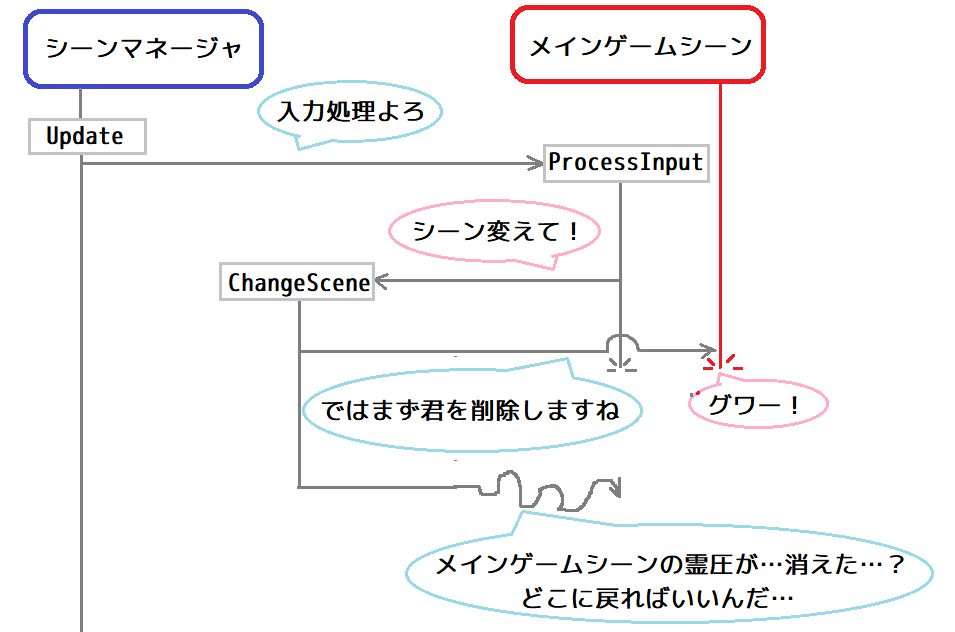
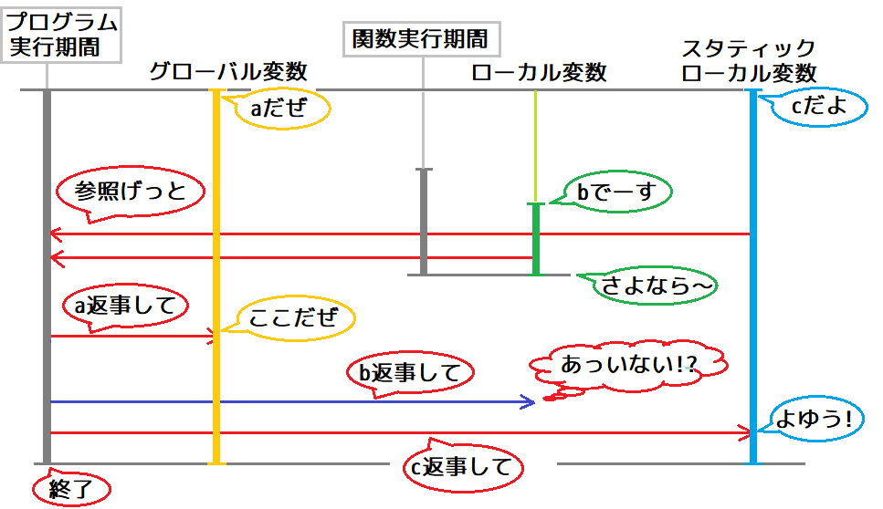
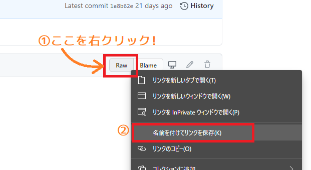
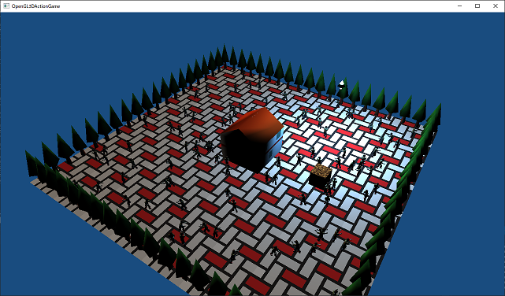
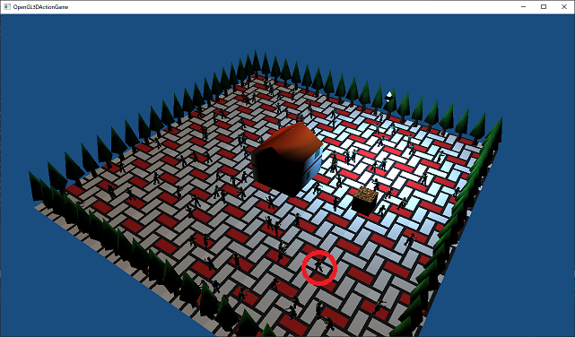
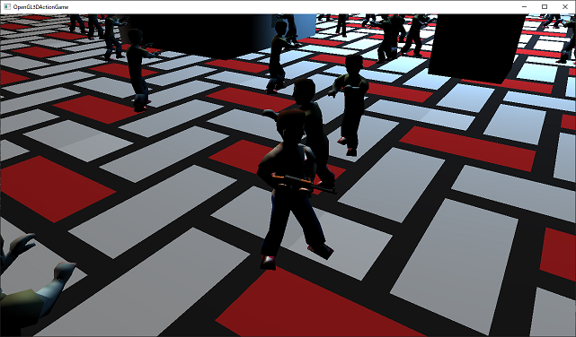

[OpenGL 3D 2020 第11回]

# アクターは群れるのがお好き

## 習得目標

* 機能をクラスとしてまとめる方法
* C++の乱数
* 弧度法とglm::radians(ジーエルエム・ラジアンズ)の使い方
* 環境光について
* パラパラアニメーション

## 1. シーン管理

### 1.1 シーン管理に必要な機能を考える

C++言語のプログラミングでは、どのようなクラスを作成するか、ということが重要になります。クラスに関連するデータは「メンバ変数」としてクラスに統合されます。それらのデータを扱う関数も「メンバ関数」としてクラスに統合されます。

前回、タイトル画面とメインゲーム画面を作りました。しかし、2つの画面を行き来することはできませんでした。というのは、各シーンは自分に必要な変数しか見ることができないからです。

そこで、シーンを連携させる仕組みを追加することで、シーンを切り替えられるようにしていきます。

まずシーンを連携させるためのクラスを作りましょう。シーンを連携させるためには、連携させるシーンを管理する必要があります。そこで、クラス名は`SceneManager`(シーン・マネージャ)とします。日本語にすると「シーン管理者」ですかね。

さて、`SceneManager`は以下の機能を持つ必要があるでしょう。

1. 実行するシーンの初期化
2. 実行中のシーンの更新
3. 実行中のシーンの描画
4. シーンの切り替え

`SceneManager`は複数のシーンを管理するので、何らか方法で各シーンを識別できなくてはなりません。そこで、シーンごとに固有の名前を付けることにします。とりあえず「シーン名＝クラス名」としましょう。そして、シーンを切り替えるときは、シーン名を指定することにします。

また、現在実行中のシーンのデータさえ有効ならば、他のシーンが同時に存在する必要はありません。そこで、必要なシーンだけを作成し、別のシーンに切り替えるときに、不要になったシーンを削除するようにします。シーンの作成と削除を行うために、シーンはポインタで管理することになるでしょう。

シーンの初期化・更新・描画は、`TitleScene`や`MainGameScene`の対応するメンバ関数を呼び出すことで行います。シーンの初期化は、「シーンの切り替え」で行えばいいように思えます。

ところで、「シーンの切り替え」指示は「誰が」「いつ」出すのでしょうか？

通常、これは「実行中のシーン」が「ユーザー入力などによって、シーン切り替えの指示が行われたとき」となります。

<p align="center">
<br>
[関数呼び出しの途中で呼び出し元を削除すると…？]
</p>

上図によると、シーン切り替え指示が来た段階では、まだ「現在のシーンが実行中」になっています。そのため、シーン切り替え指示を受けたタイミングで現在のシーンを削除すると、既に存在しなくなったデータを読み書きする恐れがあります。

存在しないデータを読み書きするのは、プログラミングにおける最高レベルの危険のひとつです。そこで、「シーン切り替え」を指示する段階では「切り替えの予約」だけを行うことにします。実際の切り替えは「シーンを切り替えても安全な場所」、例えば「「実行中のシーンの更新」の手前」などで行います。

これにより「4. シーンの切り替え」は以下の2段階に分けられます。

&emsp;4a. シーン切り替えの予約<br>
&emsp;4b. 予約内容に従ってシーンを切り替える

それから、切り替え指示を出す各シーンは、`SceneManager`のメンバ関数を呼び出せるようになっていなくてはなりません。どのシーンからでも`SceneManager`を参照できるように、`SceneManager`を取得する`スタティックメンバ関数`を作ることにします。

### 1.2 シーンマネージャを定義する

ここからは1.1節の設計に従って`SceneManager`クラスを作っていきます。

ソリューションエクスプローラーを使って、プロジェクトの`Src`フォルダに`SceneManager.h`(シーンマネージャ・ドット・エイチ)というファイルを追加してください。追加した`SceneManager.h`を開き、次のプログラムを追加してください。

```diff
+/**
+* @file SceneManager.h
+*/
+#ifndef SCENEMANAGER_H_INCLUDED
+#define SCENEMANAGER_H_INCLUDED
+#include "glad/glad.h"
+#include "TitleScene.h"
+#include "MainGameScene.h"
+#include <GLFW/glfw3.h>
+#include <memory>
+#include <string>
+
+// シーンを切り替えるときに指定するシーン名.
+#define SCENENAME_TITLE    "TitleScene"
+#define SCENENAME_MAINGAME "MainGameScene"
+
+/**
+* シーン管理クラス.
+*/
+class SceneManager
+{
+public:
+  static SceneManager& Get();
+
+  void Update(GLFWwindow* window, float deltaTime);
+  void Render(GLFWwindow* window) const;
+  void ChangeScene(const std::string&);
+
+private:
+  // クラスの変数を作れなくするため、コンストラクタやデストラクタをprivateにする.
+  SceneManager() = default;
+  ~SceneManager() = default;
+  SceneManager(const SceneManager&) = delete;
+  SceneManager& operator=(const SceneManager&) = delete;
+
+  std::string currentSceneName; // 実行中のシーン名.
+  std::string nextSceneName;    // 次に実行するシーン名.
+
+  std::shared_ptr<TitleScene> titleScene;
+  std::shared_ptr<MainGameScene> mainGameScene;
+};
+
+#endif // SCENEMANAGER_H_INCLUDED
```

シーンの名前は`#define`で定義しておきます。これは`Visual Studio`の入力支援機能を使うためです。

メンバ関数宣言の先頭に`static`(スタティック)を付けると、その関数は「スタティックメンバ関数」となります。「スタティックメンバ関数」は「メンバでない関数」に「クラスメンバにアクセスする権利」を付け加えたものです。

スタティックメンバ関数は「クラスをサポートする関数だが、メンバ関数にするほどでもない、またはメンバ関数にできない場合」に使います。

### 1.3 シングルトン

コンストラクタとデストラクタを`private`にすると、そのクラスの変数を勝手に作ったり削除することができなくなります。加えて、コピーコンストラクタとコピー代入演算子を`delete`指定しているので、代入も禁止されます。

作成とコピーを禁止している理由は、シーンを管理する変数をいくつも作れてしまうと、プログラムが混乱するだけだからです。

`SceneManager`のように「必要な変数はひとつだけ」という場合、`private`や`delete`によって変数を勝手に作れないようにしておき、唯一の変数はスタティックメンバ関数で管理するという方法が使われます。

このような、作成される変数をひとつだけに制限する仕組みのことを「シングルトン」といいます。

「シングルトン」とは「一人っ子」という意味です。プログラミングにおいては「その型の変数をひとつしか作れない設計」を表します。

### 1.4 SceneManager::Get関数を定義する

`SceneManager`クラスのメンバ関数を定義していきます。ソリューションエクスプローラーを使い、プロジェクトの`Src`フォルダに`SceneManager.cpp`(シーンマネージャ・シーピーピー)というファイルを追加してください。

最初は`Get`(ゲット)メンバ関数を定義します。追加した`SceneManager.cpp`を開き、次のプログラムを追加してください。

```diff
+/**
+* @file SceneManager.cpp
+*/
+#include "SceneManager.h"
+#include "TitleScene.h"
+#include "MainGameScene.h"
+
+/**
+* シーンマネージャのシングルトン変数を取得する.
+*
+* @return シーンマネージャの参照を返す.
+*/
+SceneManager& SceneManager::Get()
+{
+  static SceneManager singleton;
+  return singleton;
+}
```

`SceneManager`クラスのようにコンストラクタを`private`にしていると、そのクラスの変数を勝手に作ることはできません。しかし、クラスのメンバ関数ならば`private`なコンストラクタも実行できるので、変数を作成できます。ところが、メンバ関数はクラスの変数がなければ呼び出すことができません。

メンバ関数でなければクラスの変数を作ることができず、クラスの変数がなければメンバ関数を呼び出すことができない。これこそジレンマ(板挟み状態)です。

そこで「スタティックメンバ関数」の出番です。スタティックメンバ関数はクラスの変数を必要としません。また、メンバ関数には違いないので、`private`なコンストラクタを呼び出すことができます。

スタティックメンバ関数を定義するときは「`static`を書くのは宣言だけ。定義には書かない。」という点に注意してください。

>**【要点】**
>
>* コンストラクタとデストラクタを`private`にすると、そのクラスの変数を定義できなくなる。
>* メンバ関数の宣言に`static`を付けると「スタティックメンバ関数」になる。
>* スタティックメンバ関数はクラスの変数なしで呼び出せる。

### 1.5 スタティックローカル変数

`static`というキーワードには様々な使い方があります。`Get`メンバ関数でやっているように、ローカル変数に`static`を付けると「スタティックローカル変数」が作れます。

通常のローカル変数の寿命は「変数が定義されてからスコープが終わるまで」です。しかし「スタティックローカル変数」の寿命は「プログラムの実行が開始されてから終了するまで」となります。これはグローバル変数の寿命と全く同じです。

つまり「スタティックローカル変数」は、グローバル変数の寿命とローカル変数の有効範囲をあわせ持つ変数なのです。この特性により、スタティックローカル変数へのポインタや参照は、スコープの外に出すことができます。

<p align="center">
<br>
[スタティックローカル変数の寿命はグローバル変数と同じ]
</p>

`SceneManager`は「スタティックメンバ関数」と「スタティックローカル変数」を組み合わせることで、`Get`メンバ関数を`SceneManager`への唯一の接点としているわけです。

>**【要点】**
>
>* ローカル変数に`static`を付けると「スタティックローカル変数」になる。
>* スタティックローカル変数の寿命はグローバル変数と同じ。
>* スタティックローカル変数の参照やポインタは、スコープの外に持ち出すことができる。

### 1.6 SceneManager::Update関数を定義する

次は`Update`(アップデート)メンバ関数を定義します。`Update`メンバ関数は1.1節の「1.実行中のシーンの更新」に対応します。`Get`メンバ関数の定義の下に、次のプログラムを追加してください。

```diff
   static SceneManager singleton;
   return singleton;
 }
+
+/**
+* 現在起動しているシーンを更新する.
+*
+* @param window    GLコンテキストを管理するGLFWウィンドウ.
+* @param deltaTime 前回の更新からの経過時間(秒).
+*/
+void SceneManager::Update(GLFWwindow* window, float deltaTime)
+{
+  // 実行中のシーンを更新する.
+  if (titleScene) {
+    titleScene->ProcessInput(window);
+    titleScene->Update(window, deltaTime);
+  }
+  else if (mainGameScene) {
+    mainGameScene->ProcessInput(window);
+    mainGameScene->Update(window, deltaTime);
+  }
+}
```

シーンのポインタが有効なアドレスを指している場合、そのシーンの`ProcessInput`と`Update`を呼び出すようにしました。

### 1.7 SceneManager::Renderメンバ関数を定義する

次に「2.実行中のシーンの描画」を行う`Render`(レンダー)メンバ関数を定義します。`SceneManager::Update`メンバ関数の定義の下に、次のプログラムを追加してください。

```diff
     mainGameScene->Update(window, deltaTime);
   }
 }
+
+/**
+* 実行中のシーンを描画する.
+*
+* @param window    GLコンテキストを管理するGLFWウィンドウ.
+*/
+void SceneManager::Render(GLFWwindow* window) const
+{
+  if (titleScene) {
+    titleScene->Render(window);
+  }
+  else if (mainGameScene) {
+    mainGameScene->Render(window);
+  }
+}
```

`Update`メンバ関数と同様に、ポインタ変数に有効なアドレスが設定されているシーンがあれば、そのシーンの`Render`メンバ関数を呼び出す、という仕組みにしています。

### 1.8 SceneManager::ChangeSceneメンバ関数を定義する

続いては「4.シーンの切り替え」の処理のうち、「4a. シーン切り替えの予約」を行う`ChangeScene`(チェンジ・シーン)メンバ関数を定義します。`Render`メンバ関数の定義の下に、次のプログラムを追加してください。

```diff
     mainGameScene->Render(window);
   }
 }
+
+/**
+* シーンを切り替える.
+*
+* @param scenaName 次に起動するシーンの名前.
+*/
+void SceneManager::ChangeScene(const std::string& sceneName)
+{
+  // 実行中のシーンと同じ名前が指定されていたら何もしないで終了.
+  if (sceneName == currentSceneName) {
+    return;
+  }
+  nextSceneName = sceneName;
+}
```

`ChangeScene`メンバ関数は、指定されたシーン名を`nextSceneName`(ネクスト・シーン・ネーム)メンバ変数に記録します。

「4b. 予約内容に従ってシーンを切り替える」は`Update`メンバ関数に追加します。

次のシーンが指定されている場合、シーンを更新する前に「シーンの切り替え」を行う必要があります。`Update`関数の先頭に、次のプログラムを追加してください。

```diff
 void SceneManager::Update(GLFWwindow* window, float deltaTime)
 {
+  // 次のシーンが指定されていたら、シーンを切り替える.
+  if (!nextSceneName.empty()) {
+    // 実行中のシーンを終了する.
+    titleScene = nullptr;
+    mainGameScene = nullptr;
+
+    // 指定された名前に対応するシーンを作成して初期化する.
+    if (nextSceneName == SCENENAME_TITLE) {
+      titleScene = std::make_shared<TitleScene>();
+      titleScene->Initialize();
+    }
+    else if (nextSceneName == SCENENAME_MAINGAME) {
+      mainGameScene = std::make_shared<MainGameScene>();
+      mainGameScene->Initialize();
+    }
+
+    // 実行中のシーン名を変更する.
+    currentSceneName = nextSceneName;
+    nextSceneName.clear();
+  }
+
   // 実行中のシーンを更新する.
   if (titleScene) {
```

`nextSceneName`が<ruby>空<rt>から</rt></ruby>でない場合は次のシーンが予約されています。その場合、実行中のシーンを終了し、予約名に対応するシーンを作成・初期化します。

これで`SceneManager`は完成です。

### 1.9 シーンの処理をSceneManagerで置き換える

作成した`SceneManager`クラスを使って、シーンの切り替えをできるようにします。まずヘッダファイルをインクルードします。`Main.cpp`を開き、インクルード文を次のように変更してください。

```diff
 #include <glad/glad.h>
 #include "GLContext.h"
-#include "TitleScene.h"
-#include "MainGameScene.h"
+#include "SceneManager.h"
 #include <GLFW/glfw3.h>
 #include <string>
```

次に`SceneManager`のシングルトン変数への参照を取得し、最初のシーンを指定します。シーンを初期化するプログラムを、次のように変更してください。

```diff
   glDebugMessageCallback(DebugCallback, nullptr);

-  TitleScene titleScene;
-  if (!titleScene.Initialize()) {
-    return 1;
-  }
-  MainGameScene mainGameScene;
-  if (!mainGameScene.Initialize()) {
-    return 1;
-  }
+  // 最初に実行するシーンを指定する.
+  SceneManager& sceneManager = SceneManager::Get();
+  sceneManager.ChangeScene(SCENENAME_TITLE);

   // 経過時間計測開始.
   double elapsedTime = glfwGetTime();
```

シーンの初期化は`SceneManager`クラスが自動的に行うようにしたので、ここで明示的に初期化する必要はなくなりました。

続いてシーンの更新と描画を`SceneManager`クラスで置き換えます。メインループに次のプログラムを追加してください。

```diff
       deltaTime = 1.0f / 60.0f;
     }
     elapsedTime = newElapsedTime;

-    if (1) {
-      titleScene.ProcessInput(window);
-      titleScene.Update(window, deltaTime);
-      titleScene.Render(window);
-    } else {
-      mainGameScene.ProcessInput(window);
-      mainGameScene.Update(window, deltaTime);
-      mainGameScene.Render(window);
-    }
+    sceneManager.Update(window, deltaTime);
+    sceneManager.Render(window);

     glfwPollEvents();
     glfwSwapBuffers(window);
```

それから、シーンの終了処理を削除します。これも`SceneManager`の仕事になったからです。シーンを終了するプログラムを、次のように変更してください。

```diff
     glfwSwapBuffers(window);
   }
-
-  mainGameScene.Finalize();
-  titleScene.Finalize();

   // GLFWの終了.
   glfwTerminate();
```

### 1.10 シーンを切り替える

それでは、シーンの切り替えを作りましょう。まず`TitleScene.cpp`を開き、次のように`SceneManager.h`をインクルードしてください。

```diff
 #include "TitleScene.h"
+#include "SceneManager.h"
 #include <glm/gtc/matrix_transform.hpp>
 #include <iostream>
```

タイトル画面からメインゲーム画面に切り替える処理を追加します。`ProcessInput`メンバ関数にて、Enterキーが押されていたらメインゲーム画面に切り替えるようにします。`ProcessInput`メンバ関数に次のプログラムを追加してください。

```diff
 void TitleScene::ProcessInput(GLFWwindow* window)
 {
+  // Enterキーが押されたらタイトル画面に切り替える.
+  if (glfwGetKey(window, GLFW_KEY_ENTER)) {
+    SceneManager::Get().ChangeScene(SCENENAME_MAINGAME);
+  }
 }
```

プログラムが書けたらビルドして実行してください。そして、タイトル画面が表示されたらEnterキーを押してください。メインゲーム画面に切り替われば成功です。

<div style="page-break-after: always"></div>

## 2. アクタークラス

### 2.1 表示に関するデータをまとめて管理する

3Dゲームでは、シーン内にさまざまな物体が配置されます。それは地面や木、建物のように動かないものであったり、プレイヤーが操作するキャラクターや敵キャラクターのように、移動するものであったりするでしょう。

この章では、こうした「シーン内に配置する物体を表すクラス」を作成していきます。

このようなクラスは、「オブジェクト」や「アクター」、または「エンティティ」などと呼ばれています。

本テキストでは「アクター」という名前を採用することにします。アクターは「<ruby>俳優<rt>はいゆう</rt></ruby>」や「<ruby>役者<rt>やくしゃ</rt></ruby>」という意味です。

アクターという名前を付けることで、3Dゲームのプログラムは「役者をどこに配置し、どのように動かすかを指示するもの」というように<ruby>捉<rt>とら</rt></ruby>えられるようになります。

とりあえずアクタークラスの入れ物を定義しましょう。ソリューションエクスプローラーを使い、プロジェクトの`Src`フォルダに`Actor.h`というファイルを追加してください。追加した`Actor.h`を開き、次のプログラムを追加してください。

```diff
+/**
+* @file Actor.h
+*/
+#ifndef ACTOR_H_INCLUDED
+#define ACTOR_H_INCLUDED
+#include "glad/glad.h"
+
+/**
+* アクター.
+*/
+class Actor
+{
+public:
+  Actor() = default;
+  ~Actor() = default;
+  Actor(const Actor&) = default;
+  Actor& operator=(const Actor&) = default;
+
+};
+
+#endif // ACTOR_H_INCLUDED
```

### 2.2 アクタークラスのメンバ変数を考える

アクタークラスにはどんなメンバ変数があればよいでしょう？

まず思いつくのは、アクターの外見となる3Dモデルを表示するためのテクスチャとプリミティブでしょう。ということで、この2つの変数を追加します。が、その前に必要なヘッダファイルをインクルードします。`Actor.h`の先頭に次のプログラムを追加してください。

```diff
 #ifndef ACTOR_H_INCLUDED
 #define ACTOR_H_INCLUDED
 #include "glad/glad.h"
+#include "Texture.h"
+#include "Mesh.h"
+#include <memory>

 /**
 * アクター.
```

それではメンバ変数を追加しましょう。`Actor`クラスの定義に次のプログラムを追加してください。

```diff
   Actor(const Actor&) = default;
   Actor& operator=(const Actor&) = default;
+
+  const Mesh::Primitive* primitive = nullptr;
+  std::shared_ptr<Texture::Image2D> texture;
 };

 #endif // ACTOR_H_INCLUDED
```

他にどんなメンバ変数が必要でしょうか。3Dモデルを表示するときにはモデル行列が必要です。モデル行列をメンバ変数にするのは悪くない考えです。

ところで、モデル行列は、表示する位置や向き、大きさを処理する行列を掛け合わせて作ります。位置・向き・大きさを個別に操作する場合、モデル行列にまとめる前のデータのほうが扱いやすいです。

そこで、モデル行列の元になる「位置・向き・大きさ」の3つをメンバ変数にしましょう。これらは`glm::vec3`型で表すのが適当でしょう。そのために`glm.hpp`をインクルードします。`Mesh.h`のインクルード文の下に、次のプログラムを追加してください。

```diff
 #include "glad/glad.h"
 #include "Texture.h"
 #include "Mesh.h"
+#include <glm/glm.hpp>

 /**
 * アクター.
```

`Actor`クラスの定義に、次のプログラムを追加してください。

```diff
   Mesh::Primitive* primitive = nullptr;
   std::shared_ptr<Texture::Image2D> texture;
+
+  glm::vec3 position = glm::vec3(0); // アクターの表示位置.
+  glm::vec3 rotation = glm::vec3(0); // アクターの向き.
+  glm::vec3 scale = glm::vec3(1);    // アクターの大きさ.
 };

 #endif // ACTOR_H_INCLUDED
```

### 2.3 Drawメンバ関数を追加する

ここまでで「モデル行列を作成し、テクスチャを貼ったプリミティブを描画する」という処理に必要な変数は用意できました。つまり、描画を行うメンバ関数を追加できる、ということです。描画には`Pipeline`クラスが必要なので、次のようにヘッダファイルをインクルードしてください。

```diff
 #include "glad/glad.h"
 #include "Texture.h"
 #include "Mesh.h"
+#include "Shader.h"
 #include <glm/glm.hpp>

 /**
 * アクター.
```

そして、`Actor`クラスの定義に次のプログラムを追加してください。

```diff
   Mesh::Primitive* primitive = nullptr;
   std::shared_ptr<Texture::Image2D> texture;
+
+  void Draw(const Shader::Pipeline& pipeline, const glm::mat4& matVP) const;

   glm::vec3 position = glm::vec3(0); // アクターの表示位置.
   glm::vec3 rotation = glm::vec3(0); // アクターの向き.
   glm::vec3 scale = glm::vec3(1);    // アクターの大きさ.
```

メンバ関数を定義するために、プロジェクトの`Src`フォルダに`Actor.cpp`(アクター・シーピーピー)というファイルを追加してください。追加したファイルを開き、次のプログラムを追加してください。

```diff
+/**
+* @file Actor.cpp
+*/
+#include "Actor.h"
+#include <glm/gtc/matrix_transform.hpp>
+
+/**
+* アクターを描画する.
+*
+* @param pipeline 行列の設定先となるパイプラインオブジェクト.
+* @param matVP    描画に使用するビュープロジェクション行列.
+*/
+void Actor::Draw(const Shader::Pipeline& pipeline, const glm::mat4& matVP) const
+{
+  // プリミティブが設定されていないときは何もせず終了.
+  if (!primitive) {
+    return;
+  }
+}
```

プリミティブが設定されていない場合は何もせずに`return`します。描画するものがないのですから仕方ないですね。

続いて、モデル行列を作成するプログラムを追加します。モデル行列は「平行移動行列」「X・Y・Z軸回転行列」「拡大縮小行列」という5つの行列を掛け合わせて作ります。それぞれの行列は以下に示す関数で作成します。

行列名       | 作成関数
:-----------:|:--
平行移動行列 | glm::translate
X軸回転行列  | glm::rotate
Y軸回転行列  | glm::rotate
Z軸回転行列  | glm::rotate
拡大縮小行列 | glm::scale

それでは、`Draw`メンバ関数に次のプログラムを追加してください。

```diff
   if (!primitive) {
     return;
   }
+
+  // 平行移動させる行列を作る.
+  const glm::mat4 matTranslate = glm::translate(glm::mat4(1), position);
+  // X軸回転させる行列を作る.
+  const glm::mat4 matRotateX = glm::rotate(
+    glm::mat4(1), rotation.x, glm::vec3(1, 0, 0));
+  // Y軸回転させる行列を作る.
+  const glm::mat4 matRotateY = glm::rotate(
+    glm::mat4(1), rotation.y, glm::vec3(0, 1, 0));
+  // Z軸回転させる行列を作る.
+  const glm::mat4 matRotateZ = glm::rotate(
+    glm::mat4(1), rotation.z, glm::vec3(0, 0, 1));
+  // 大きさを変える行列を作る.
+  const glm::mat4 matScale = glm::scale(glm::mat4(1), scale);
+
+  // 平行移動・回転・大きさ変更の行列を掛け算して、ひとつのモデル行列にまとめる.
+  const glm::mat4 matModel =
+    matTranslate * matRotateY * matRotateZ * matRotateX * matScale;
+
+  // GPUメモリに行列を転送.
+  pipeline.SetModelMatrix(matModel);
+  pipeline.SetMVP(matVP * matModel);
 }
```

行列を掛ける順番には特に注意してください。一般的には、「平行移動行列」が最後に適用されるようにします。回転行列と拡大縮小行列はどちらが先でも構いません。

さらに、回転行列はX軸回転、Y軸回転、Z軸回転の3つの回転を掛け合わせたものになります。この3つを掛ける順番も重要ですが、どの順番に掛ければいいかはゲームの内容によりますが、重要な軸ほどあとから適用されるようにすると扱いやすいです。

例えば人間のキャラクターが主役となるゲームでは、基本となるのはY軸回転です。ですからY軸回転が最後に実行されるように設計します。しかし、航空機が主役のゲームでは、基本となるのはZ軸回転ですから、Z軸回転が最後になるように設計します。

今回は人間が主役のゲームなので、Y軸回転を最後に持っていき「X軸回転→Z軸回転→Y軸回転」となるようにしました。

>**【軸の向きはライブラリやエンジンによって異なる】**<br>
>OpenGLの軸は、右が`+X`、前が`-Z`、上が`+Y`です(右手座標系)。しかし、`Unreal Engine`では右が`+X`、前が`+Y`、上が`+Z`となっています。`DirectX`と`Unity`は右が`+X`、前が`+Z`、上が`+Y`となっています(左手座標系)。
>回転順を考えるときは、使用しているライブラリやエンジンの軸の向きにも注意してください。

GPUメモリに行列を転送したあとは、OpenGLコンテキストにテクスチャを割り当て、プリミティブを描画します。行列を転送するプログラムの下に、次のプログラムを追加してください。

```diff
   // GPUメモリに行列を転送.
   pipeline.SetModelMatrix(matModel);
   pipeline.SetMVP(matVP * matModel);
+
+  // テクスチャイメージスロット0番にテクスチャを割り当てる.
+  texture->Bind(0);
+
+  // プリミティブを描画.
+  primitive->Draw();
 }
```

これで`Draw`メンバ関数は完成です。

### 2.4 コンストラクタを追加する

クラスの変数を作るとき、メンバ変数にひとつずつ値を設定していくのは面倒なものです。そんなときは、値を設定するコンストラクタがあると便利です。

かといって、コンストラクタの引数にすべてのメンバ変数の値を渡すのは効率的とは思えません。多くの場合、大きさや回転は初期値のままでしょう。そこで、「プリミティブ」と「テクスチャ」、それと「表示位置」だけを設定するコンストラクタを追加します。

`Actor.h`を開き、`Actor`クラスの定義に次のプログラムを追加してください。

```diff
 class Actor
 {
 public:
   Actor() = default;
+  Actor(const Mesh::Primitive* prim,
+    std::shared_ptr<Texture::Image2D> tex, const glm::vec3& pos);
   ~Actor() = default;
   Actor(const Actor&) = default;
   Actor& operator=(const Actor&) = default;
```

次に`Actor.cpp`を開き、`matrix_transform.hpp`のインクルード文の下に次のプログラムを追加してください。

```diff
 #include "Actor.h"
 #include <glm/gtc/matrix_transform.hpp>
+
+/**
+* コンストラクタ.
+*
+* @param pid       アクターの外見を表すプリミティブのID.
+* @param tex       プリミティブに貼り付けるテクスチャ.
+* @param pos       アクターの座標.
+*/
+Actor::Actor(const Mesh::Primitive* prim,
+  std::shared_ptr<Texture::Image2D> tex, const glm::vec3& pos) :
+  primitive(prim), texture(tex), position(pos)
+{
+}

 /**
 * アクターを描画する.
```

### 2.5 アクターの配列を扱う

たいていのシーンには複数のアクターが存在します。それらを配列にしておくと、まとめて処理できるので便利です。

C++で配列を作る方法として以下の3種類が挙げられます。

1. `vector`クラス
2. `array`クラス
3. C言語の配列

このリストは使いやすさの順番になっています。これらの違いが分からないうちは、常に`1`の`vector`クラスを使ってください。というわけで、アクターの配列にも`vector`クラスを使っていきます。

`Actor.h`を開き、次のように`vector`ヘッダをインクルードしてください。

```diff
 #include "Texture.h"
 #include "Mesh.h"
 #include <glm/glm.hpp>
+#include <vector>

 /**
 * アクター.
```

続いてアクターの配列に名前を付けます。`Actor`クラスの定義の下に、次のプログラムを追加してください。

```diff
   glm::vec3 scale = glm::vec3(1); // アクターの大きさ.
   glm::vec3 velocity = glm::vec3(0); // アクターの移動速度.
 };
+
+using ActorPtr = std::shared_ptr<Actor>; // アクターポインタ型.
+using ActorList = std::vector<ActorPtr>; // アクター配列型.

 #endif // ACTOR_H_INCLUDED
```

`using`(ユージング)は`=`の右辺の型に左辺の名前を付けます。これはC言語の`typedef`と同じ機能です。追加したプログラムの1行目は「`ActorPtr`(アクターポインタ)と書いてあったら`std::shared_ptr<Actor>`と書いてあるものとみなす」という指示になります。

同様に2行目は「`ActorList`(アクターリスト)と書いてあったら`std::vector<ActorPtr>`と書いてあるものとみなす」という指示になります。また、`ActorPtr`は`std::shared_ptr<Actor>`と解釈されますので、最終的には`std::vector<std::shared_ptr<Actor>>`とみなされます。

>**【typedefではだめなんですか？】**<br>
>`typdef`でも問題はありません。それなのになぜ`using`構文が追加されたのかと言うと、`typedef`は型が複雑になると理解しにくくなりがちなので、バグの原因となりうると考えられたからです。
>特にC++では「テンプレート」という機能によって非常に複雑な型を定義できるようになったため、定義が理解しやすいことは重要だったのです。

### 2.5 アクター用のファイルをダウンロードする

せっかくなので、アクター用の3Dモデルとテクスチャを用意しておきました。

ウェブブラウザで`https://github.com/tn-mai/OpenGL3D2020/tree/master/Res`にアクセスし、以下のファイルをダウンロードしてプロジェクトの`Res`フォルダに保存してください。

* zombie_male.tga
* zombie_male_walk_0.obj

TGAファイルの場合、右下の`Download`(ダウンロード)ボタンをクリックするとダウンロードが始まります。

しかし、OBJファイルの場合はダウンロードボタンが表示されません。以下の画像を参考に、`Raw`(ロー)ボタンを右クリックし(①)、表示されたメニューから「名前をつけてリンク先を保存」をクリックしてダウンロードしてください(②)。

<p align="center">

</p>

3Dモデルのテクスチャ用のメンバ変数を追加します。`MainGameScene.h`を開き、`MainGameScene`クラスの定義に次のプログラムを追加してください。

```diff
   std::shared_ptr<Texture::Image2D> texHouse;
   std::shared_ptr<Texture::Image2D> texCube;
+  std::shared_ptr<Texture::Image2D> texZombieMale;
   Shader::PointLight pointLight;
 };
```

そして、ダウンロードしたテクスチャを読み込みます。`MainGameScene.cpp`を開き、`Initialize`メンバ関数に次のプログラムを追加してください。

```diff
   if (!texGround ||!texTree || !texHouse || !texCube) {
     return false;
   }
+  texZombieMale = std::make_shared<Texture::Image2D>("Res/zombie_male.tga");
+  if (!texZombieMale) {
+    return false;
+  }

   // 点光源を設定する
   Shader::PointLight pointLight{
```

最後に3Dモデルデータを読み込みます。`MainGameScene.cpp`を開き、`Initialize`メンバ関数に次のプログラムを追加してください。

```diff
   primitiveBuffer.AddFromObjFile("Res/Tree.obj");
   primitiveBuffer.AddFromObjFile("Res/House.obj");
   primitiveBuffer.AddFromObjFile("Res/Cube.obj");
+  primitiveBuffer.AddFromObjFile("Res/zombie_male_walk_0.obj");

   // パイプライン・オブジェクトを作成する.
   pipeline = std::make_shared<Shader::Pipeline>(
```

### 2.6 アクターリストを使う

`Actor`クラスを使って、ダウンロードした3Dモデルを表示しましょう。下準備としてヘッダファイルをインクルードします。`MainGameScene.h`を開き、`Actor.h`をインクルードしてください。

```diff
 #include "Shader.h"
 #include "Texture.h"
+#include "Actor.h"
 #include <GLFW/glfw3.h>
 #include <memory>

 /**
 * メインゲーム画面.
```

次に`Actor`型のメンバ変数を追加します。`MainGameScene`クラスの定義に次のプログラムを追加してください。

```diff
   std::shared_ptr<Texture::Image2D> texCube;
   std::shared_ptr<Texture::Image2D> texZombieMale;
   Shader::PointLight pointLight;

+  ActorList actors; // アクター配列.
 };

 #endif // MAINGAMESCENE_H_INCLUDED
```

ここで追加した`actors`(アクターズ)メンバ変数にアクターを追加していきます。

### 2.7 アクターの配置とC++の乱数

アクターの配置はとりあえずランダムにしようと思います。C++言語にはさまざまな乱数を生成するクラスが用意されていますが、今回は`mt19937`(エム・ティー・いち・きゅう・きゅう・さん・なな)を使うことにします。

`mt19937`は「メルセンヌ・ツイスター」という方法で乱数を作り出すクラスです。とても優秀な乱数生成クラスで、C++の乱数といったら最初にこの`mt19937`が挙げられます。`mt19937`は`random`(ランダム)ヘッダに定義されています。

「一定範囲の乱数」を生成するには`std::uniform_real_distribution`(エスティーディー・ユニフォーム・リアル・ディストリビューション)や`std::uniform_int_distribution`(エスティーディー・ユニフォーム・イント・ディストリビューション)を併用します。

`MainGameScene.cpp`を開き、次のように`random`ヘッダをインクルードしてください。

```diff
 * @file MainGameScene.cpp
 */
 #include "MainGameScene.h"
 #include <glm/gtc/matrix_transform.hpp>
 #include <iostream>
+#include <random>
```

```diff
   if (!texZombieMale) {
     return false;
   }
+
+  // 乱数を初期化.
+  std::random_device rd; // 真の乱数(処理が遅い).
+  std::mt19937 random(rd()); // 疑似乱数(処理が早い).
+
+  // ゾンビアクターを作成.
+  const Mesh::Primitive* pPrimitive = &primitiveBuffer.Get(4);
+  for (size_t i = 0; i < 100; ++i) {
+    // XZ平面上のランダムな座標を作る.
+    glm::vec3 pos(0);
+    pos.x = std::uniform_real_distribution<float>(-18, 18)(random);
+    pos.z = std::uniform_real_distribution<float>(-18, 18)(random);
+    // アクターを作成.
+    std::shared_ptr<Actor> actor =
+      std::make_shared<Actor>(pPrimitive, texZombieMale, pos);
+    // 作成したアクターを、アクターリストに追加.
+    actors.push_back(actor);
+  }

   // 点光源を設定する
   pointLight = Shader::PointLight{
```

`std::random_device`は予測不可能な「真の乱数」を生成します。この関数はCPUの温度変化などを利用しているためとても遅いです。そのため、ゲームのように、1/60秒で何もかも処理しなくてはならないアプリケーションには向いていません。

`std::mt19937`は予測可能な「擬似乱数」を生成します。疑似乱数は、過去に出力した乱数に何らかの計算を行うことで、あたかもバラバラな数値が得られるように工夫されたものです。計算で値を求めるだけなので、とても高速です。

「擬似乱数」は本当の乱数ではありませんが、出力を100個見たくらいではまったく予測不能な程度の不規則さは持っています。ゲームに使うには十分すぎるほどです。

<pre class="tnmai_code"><strong>【書式】</strong>
float std::uniform_real_distribution<float>(最小値, 最大値);
</pre>

`std::uniform_real_distribution`は、乱数の範囲を指定する関数です。関数テンプレートになっているので、`float`型の値が欲しいときは関数名の末尾に`<float>`を、`double`型が欲しいときは`<double>`を付けます。

この関数は浮動小数点数用です。整数の範囲を指定したい場合は`std::uniform_int_distribution`を使います。

<pre class="tnmai_code"><strong>【書式】</strong>
int std::uniform_real_distribution<int>(最小値, 最大値);
</pre>

>**【メルセンヌ・ツイスターは強力すぎる】**<br>
>`mt19937`は疑似乱数ではありますが、そのバラバラさは真の乱数に非常に近いものです。これは良いことなのですが、しかし、ゲームで使うにはちょっと困ったこともあるのです。
>なぜなら「真の乱数は<ruby>偏<rt>かたよ</rt></ruby>りがち」だからです。<br>
>値が偏るとどうなるかというと「命中率90%の攻撃が全く当たらない」とか「命中率3%の攻撃が当たりまくる」といった現象が起きます。その結果、プレイヤーに「数値が操作されているんじゃないか」と疑われてしまうのです。<br>
>疑われるのを避けるため、「プレイヤーの命中率が90%以上なら常に当たる」とか「敵の命中率が5%以下なら常にはずれる」みたいなことをしているゲームもあったりします。

### 2.8 アクターリスト表示する

アクターリストに登録したアクターを表示しましょう。`Render`メンバ関数の立方体を描画するプログラムの下に、次のプログラムを追加してください。

```diff
     texCube->Bind(0);
     primitiveBuffer.Get(3).Draw();
   }
+
+  // アクターリストを描画.
+  const glm::mat4 matVP = matProj * matView;
+  for (size_t i = 0; i < actorList.size(); ++i) {
+    actors[i]->Draw(*pipeline, matVP);
+  }

   // 点光源の位置を描画.
   {
     // Y軸回転.
     const float degree = static_cast<float>(std::fmod(glfwGetTime() * 180.0, 360.0));
```

プログラムが書けたらビルドして実行してください。次の画像のようにたくさんの3Dモデルが表示されていたら成功です。

<p align="center">

</p>

### 2.9 <ruby>弧度法<rt>こどほう</rt></ruby>とglm::radians関数

現在は全てのゾンビが右を向いています。これはちょっと不自然ですよね(まあゾンビなのでそういうこともあるかもしれませんが)。そこで、アクターの向きをランダムにしてみましょう。

`Initialize`関数のゾンビを作成するプログラムに、次のプログラムを追加してください。

```diff
     // アクターを作成.
     std::shared_ptr<Actor> actor =
       std::make_shared<Actor>(pPrimitive, texZombieMale, pos);
+    // アクターのY軸回転を設定.
+    actor->rotation.y =
+      std::uniform_real_distribution<float>(0, glm::radians(360.0f))(random);
     // 作成したアクターを、アクターリストに追加.
     actors.push_back(actor);
```

アクターの向きを変えるに、`rotation`メンバ変数の値を変更します。上記のプログラムでは`std::uniform_real_distribution`関数を使って`0～360`度の範囲のランダムな数値を作成し、それを`rotation.y`に設定しています。

このプログラムでは見慣れない関数`glm::radians`(ジーエルエム・ラジアンズ)が使われています。

<pre class="tnmai_code"><strong>【書式】</strong>
float glm::radians(度数法の角度);
</pre>

`glm::radians`は「度数法の角度を弧度法の角度に変換する」関数です。引数に度数法の角度を指定すると、弧度法で表記した場合の値を返してくれます。

コンピューターは角度を弧度法で表します。しかし、人間にとって弧度法は直感的ではありません。そこで、`glm::radians`関数を使うことで、人間に読みやすい度数法の数値を、コンピューターに理解できる弧度法の数値に変換します。

>**【重要】**<br>
>プログラムで角度を表す場合、常に`glm::radians`関数を使ってください。例外的に、0度は度数法で表しても弧度法で表しても`0`なので、変換しなくても問題ありません。実際に、上記のプログラムでも`0`には`glm::radians`を使っていません。

<br>

>**【度数法と弧度法の違い】**<br>
>この2つの違いは「半円の角度を`180`とするか(度数法)、`π`(パイ)とするか(弧度法)」というだけです。
>
>度数法の角度 | 弧度法の角度
>:--:|:-:
>0   | 0
>30  | 0.523599...
>45  | 0.785398...
>60  | 1.047198...
>90  | 1.570796...
>120 | 2.094395...
>180 | 3.141593...
>360 | 6.283185...
>
>円の数学的な性質から、半円を`π`で表すほうが、さまざまな計算が効率的に行えます。それが、弧度法が使われている理由です。

プログラムが書けたらビルドして実行してください。以下の画像のように、ゾンビたちが思い思いの方向を向いていたら成功です。

<p align="center">

</p>

<div style="page-break-after: always"></div>

## 3. アクターを動かす

### 3.1 プレイヤーアクターを追加する

ゾンビを撃退するプレイヤーのアクターを追加しましょう。

ゾンビと同様に、ウェブブラウザで`https://github.com/tn-mai/OpenGL3D2020/tree/master/Res`にアクセスし、以下のファイルをダウンロードしてプロジェクトの`Res`フォルダに保存してください。

* player_male.tga
* player_male_idle_0.obj

`MainGameScene.h`を開き、プレイヤー用のアクター変数を追加します。`MainGameScene`クラスの定義に、次のプログラムを追加してください。

```diff
   std::shared_ptr<Texture::Image2D> texHouse;
   std::shared_ptr<Texture::Image2D> texCube;
   std::shared_ptr<Texture::Image2D> texZombieMale;
+  std::shared_ptr<Texture::Image2D> texPlayer;
   Shader::PointLight pointLight;

   ActorList actors; // アクター配列.
+  ActorPtr playerActor; // プレイヤーアクター.
 };
```

そして、ダウンロードしたテクスチャを読み込みます。`MainGameScene.cpp`を開き、`Initialize`メンバ関数に次のプログラムを追加してください。

```diff
   if (!texGround ||!texTree || !texHouse || !texCube) {
     return false;
   }
   texZombieMale = std::make_shared<Texture::Image2D>("Res/zombie_male.tga");
+  texPlayer= std::make_shared<Texture::Image2D>("Res/player_male.tga");
-  if (!texZombieMale) {
+  if (!texPlayer || !texZombieMale) {
     return false;
   }
```

最後に3Dモデルデータを読み込みます。`MainGameScene.cpp`を開き、`Initialize`メンバ関数に次のプログラムを追加してください。

```diff
   primitiveBuffer.AddFromObjFile("Res/House.obj");
   primitiveBuffer.AddFromObjFile("Res/Cube.obj");
   primitiveBuffer.AddFromObjFile("Res/zombie_male_walk_0.obj");
+  primitiveBuffer.AddFromObjFile("Res/player_male_idle_0.obj");

   // パイプライン・オブジェクトを作成する.
   pipeline = std::make_shared<Shader::Pipeline>(
```

これで準備ができたのでプレイヤーアクターを作成しましょう。`Initialzie`メンバ関数に次のプログラムを追加してください。

```diff
   // 乱数を初期化.
   std::random_device rd; // 真の乱数(処理が遅い).
   std::mt19937 random(rd()); // 疑似乱数(処理が早い).
+
+  // プレイヤーアクターを作成.
+  playerActor = std::make_shared<Actor>(
+    &primitiveBuffer.Get(5), texPlayer, glm::vec3(10, 0, 10));
+  // 作成したプレイヤーアクターを、アクターリストに追加.
+  actors.push_back(playerActor);

   // ゾンビアクターを作成.
   const Mesh::Primitive* pPrimitive = &primitiveBuffer.Get(4);
   for (size_t i = 0; i < 100; ++i) {
```

プログラムが書けたらビルドして実行してください。座標(10, 0, 10)にプレイヤーアクターが表示されていたら成功です。

<p align="center">

</p>

### 3.2 視点を変更する

うーん、この距離だと、同じ人型をしているゾンビと見分けが付きませんね。ちょっと視点を近づけましょう。

`Render`メンバ関数の座標変換行列を作成するプログラムを、次のように変更してください。

```diff
   pipeline->SetLight(directionalLight);
   pipeline->SetLight(pointLight);

-  const glm::vec3 viewPosition(20, 30, 30);
+  // カメラをプレイヤーアクターのななめ右上に配置.
+  const glm::vec3 viewPosition = playerActor->position + glm::vec3(2, 3, 3);
+  // カメラがプレイヤーアクターの胸のあたりを見るようにする.
+  const glm::vec3 viewTarget = playerActor->position + glm::vec3(0, 1, 0);

   // 座標変換行列を作成.
   int w, h;
   glfwGetWindowSize(window, &w, &h);
   const float aspectRatio = static_cast<float>(w) / static_cast<float>(h);
   const glm::mat4 matProj =
     glm::perspective(glm::radians(45.0f), aspectRatio, 0.1f, 500.0f);
   const glm::mat4 matView =
-    glm::lookAt(viewPosition, glm::vec3(0), glm::vec3(0, 1, 0));
+    glm::lookAt(viewPosition, viewTarget, glm::vec3(0, 1, 0));

   primitiveBuffer.BindVertexArray();
```

プログラムが書けたらビルドして実行してください。次の画像のように、視点が近くなって、プレイヤーが大きく表示されたら成功です。

<p align="center">

</p>

### 3.3 環境光を追加する

平行光源の向きが悪いこともあるのですが、光が当たらない部分が真っ黒になっていて何も見えません。しかし、現実の世界では、太陽の反対側の壁だからといって真っ黒になることはありません。

なぜなら、光はさまざまな物体で反射するので、影になる側であっても全く光が当たらないということはないからです。同じことを再現できれば、真っ黒で何も見えない、ということは無くなるはずです。

空間内のさまざまな物体に反射してくる光のことを、コンピューター・グラフィックスでは「グローバル・イルミネーション(<ruby>大域照明</rt>たいいきしょうめい</rt></ruby>)」といいます。コンピューター・グラフィックスでは、大域照明を再現するためにさまざまな工夫を凝らしてきました。

しかし、工夫しすぎたために、コンピューター・グラフィックス初学者にはまったく理解できないものになっています。そこで今回は、最も簡単な大域照明である「環境光」(かんきょうこう)を組み込むことにしましょう。

環境光は「空間全体を満たす代表的な光の色」をひとつだけ決めて、すべての物体をその色で照らす方法です。例えば晴れた昼間は空の色が影響するので、環境光は水色になります。夕方ならば赤色になるでしょう。また、森の中にいるときは木々の緑が反射してくるはずです。

まずはシェーダに環境光のユニフォーム変数を追加します。変数名は`ambientLight`(アンビエント・ライト)としましょう。`FragmentLighting.frag`を開き、点光源のユニフォーム変数の定義の下に、次のプログラムを追加してください。

```diff
   vec4 color;
 };
 layout(location=4) uniform PointLight pointLight;
+
+// 環境光
+layout(location=6) uniform vec3 ambientLight;

 // フラグメントシェーダプログラム
 void main()
```

環境光は光の色だけなので、構造体にはしません。

次に環境光をライトの明るさ計算に加えます。`FragmentLightting.frag`の`main`関数の、`totalLightColor`変数の定義を、次のように変更してください。

```diff
 void main()
 {
   vec3 worldNormal = normalize(inNormal);
-  vec3 totalLightColor = vec3(0);
+  vec3 totalLightColor = ambientLight; // 環境光

   // 平行光源
   {
     float theta = max(dot(worldNormal, directionalLight.direction.xyz), 0);
```

続いて、環境光をGPUメモリに転送する機能を`Pipeline`クラスに追加します。関数名は`SetAmbientLight`(セット・アンビエント・ライト)とします。`Shader.h`を開き、`Pipeline`クラスの定義に次のプログラムを追加してください。

```diff
   bool SetModelMatrix(const glm::mat4&) const;
   bool SetLight(const DirectionalLight& light) const;
   bool SetLight(const PointLight& light) const;
+  bool SetAmbientLight(const glm::vec3& color) const;

 private:
   GLuint id = 0;
   GLuint vp = 0;
```

`SetAmbientLight`メンバ関数を定義します。`Shader.cpp`を開き、`SetLight(const PointLight&) const`メンバ関数の定義の下に、次のプログラムを追加してください。

```diff
     std::cerr << "[エラー]" << __func__ << ":点光源の設定に失敗.\n";
     return false;
   }
   return true;
 }
+
+/**
+* シェーダに環境光を設定する.
+*
+* @param color 設定する環境光.
+*
+* @retval true  設定成功.
+* @retval false 設定失敗.
+*/
+bool Pipeline::SetAmbientLight(const glm::vec3& color) const
+{
+  glGetError(); // エラー状態をリセット.
+
+  const GLint locAmbientLight= 6;
+
+  glProgramUniform3fv(lightingProgram, locAmbientLight, 1, &color.x);
+  if (glGetError() != GL_NO_ERROR) {
+    std::cerr << "[エラー]" << __func__ << ":環境光の設定に失敗.\n";
+    return false;
+  }
+  return true;
+}

 /**
 * プログラムパイプラインのバインドを解除する.
```

これで環境光を指定できるようになりました。さっそく指定してみましょう。`MainGameScene.cpp`を開き、`glClear`で背景を消去しているプログラムの下に、次のプログラムを追加してください。

```diff
   glClearColor(0.1f, 0.3f, 0.5f, 1.0f);
   glClear(GL_COLOR_BUFFER_BIT | GL_DEPTH_BUFFER_BIT);
+
+  // 環境光を設定する.
+  pipeline->SetAmbientLight(glm::vec3(0.1f, 0.125f, 0.15f));

   // 平行光源を設定する
   const Shader::DirectionalLight directionalLight{
```

プログラムが書けたらビルドして実行してください。以下の画像のように、影になる部分の絵が見えるようになっていたら成功です。

<p align="center">

</p>

### 3.4 アクタークラスに移動速度を追加する

現在はキー操作で点光源を動かしています。これは点光源の効果を確認するためですが、他に動かせそうなものがなかったのも事実です。しかし今はプレイヤーアクターがいます。点光源は放置して、プレイヤーアクターを動かすように変更しましょう。

直接アクターの位置を変更するのではなく、アクターに「移動速度」を追加して、キー操作では移動速度を変更するようにしてみます。移動速度を表すメンバ変数は`velocity`(ベロシティ)という名前にします。`velocity`は「速度」という意味です。

`Actor.h`を開き、`Actor`クラスに次のプログラムを追加してください。

```diff
   Mesh::Primitive* primitive = nullptr;
   std::shared_ptr<Texture::Image2D> texture;

+  void Update(float deltaTime);
   void Draw(const Shader::Pipeline& pipeline, const glm::mat4& matVP) const;

   glm::vec3 position = glm::vec3(0); // アクターの表示位置.
   glm::vec3 rotation = glm::vec3(0); // アクターの向き.
   glm::vec3 scale = glm::vec3(1);    // アクターの大きさ.
+  glm::vec3 velocity = glm::vec3(0); // アクターの移動速度.
 };
```

追加した`Update`メンバ関数は、アクターの状態を更新する関数です。今回は、移動速度を表示位置に加算する機能を持たせます。`Actor.cpp`を開き、コンストラクタの定義の下に、次のプログラムを追加してください。

```diff
   primitive(prim), texture(tex), position(pos)
 {
 }
+
+/**
+* アクターの状態を更新する.
+*
+* @param deltaTime 前回の更新からの経過時間(秒).
+*/
+void Actor::Update(float deltaTime)
+{
+  const float vl = glm::length(velocity);
+  if (vl > 0) {
+    // 速度×経過時間を座標に足す.
+    position += velocity * deltaTime;
+}

 /**
 * アクターを描画する.
```

それから、`Update`メンバ関数をアクターリストの全てのアクターに対して実行するプログラムを追加します。`MainGameScene.cpp`を開き、`Update`メンバ関数に次のプログラムを追加してください。

```diff
 * @param deltaTime 前回の更新からの経過時間.
 */
 void MainGameScene::Update(GLFWwindow* window, float deltaTime)
 {
+  // アクターリストに含まれるアクターの状態を更新する.
+  for (size_t i = 0; i < actors.size(); ++i) {
+    actors[i]->Update(deltaTime);
+  }
   // 点光源を移動させる.
   const float speed = 10.0f * deltaTime;
```

### 3.5 プレイヤーアクターを動かす

それではプレイヤーアクターを動かしましょう。`MainGameScene.cpp`を開き、`ProcessInput`メンバ関数の定義に次のプログラムを追加してください。

```diff
 void MainGameScene::ProcessInput(GLFWwindow* window)
 {
+  // プレイヤーアクターを移動させる.
+  glm::vec3 direction = glm::vec3(0);
+  if (glfwGetKey(window, GLFW_KEY_A) == GLFW_PRESS) {
+    direction.x -= 1;
+  } else if (glfwGetKey(window, GLFW_KEY_D) == GLFW_PRESS) {
+    direction.x += 1;
+  }
+  if (glfwGetKey(window, GLFW_KEY_W) == GLFW_PRESS) {
+    direction.z -= 1;
+  } else if (glfwGetKey(window, GLFW_KEY_S) == GLFW_PRESS) {
+    direction.z += 1;
+  }
+  if (glm::length(direction) > 0) {
+    // 正規化することで、ななめ移動でも同じ速度で移動させる.
+    const float speed = 4.0f; // プレイヤーアクターの速度(メートル毎秒).
+    playerActor->velocity = glm::normalize(direction) * speed;
+  } else {
+    playerActor->velocity = glm::vec3(0);
+  }
 }

 /**
 * メインゲーム画面を更新する.
```

<pre class="tnmai_code"><strong>【書式】</strong>
float glm::length(ベクトル);
</pre>

`glm::length`(ジーエルエム・レングス)関数を使うと、ベクトルの長さを取得できます。上記のプログラムでは、キー入力があったかどうかを調べるために使っています。キー入力があれば`velocity`変数の`x`か`z`が0以外の値になるからです。

キー入力があった場合、ベクトルの長さを「正規化」してから`speed`を掛けます。正規化というのは「ベクトルの長さを1にすること」です。

<pre class="tnmai_code"><strong>【書式】</strong>
glm::vec3 glm::normalize(ベクトル);
</pre>

`glm::normalize`(ジーエルエム・ノーマライズ)関数は、引数ベクトルと同じ向きで、長さが1のベクトル、つまり正規化されたベクトルを返します。

ここで正規化を行っている理由は、ななめ移動のときも同じ速度で移動させるためです。

>**【スピードとベロシティの違い】**<br>
>簡単に言うと`スピード＝ベロシティの長さ`です。逆に言うと`ベロシティ＝方向×スピード`です。

次に、点光源を移動させるプログラムを削除します。`Update`メンバ関数を次のように変更してください。

```diff
   // アクターリストに含まれるアクターの状態を更新する.
   for (size_t i = 0; i < actros.size(); ++i) {
     actors[i]->Update(deltaTime);
   }
-  // 点光源を移動させる.
-  const float speed = 10.0f * deltaTime;
-  if (glfwGetKey(window, GLFW_KEY_A) == GLFW_PRESS) {
-    pointLight.position.x -= speed;
-  } else if (glfwGetKey(window, GLFW_KEY_D) == GLFW_PRESS) {
-    pointLight.position.x += speed;
-  }
-  if (glfwGetKey(window, GLFW_KEY_W) == GLFW_PRESS) {
-    pointLight.position.z -= speed;
-  } else if (glfwGetKey(window, GLFW_KEY_S) == GLFW_PRESS) {
-    pointLight.position.z += speed;
-  }
-  if (glfwGetKey(window, GLFW_KEY_E) == GLFW_PRESS) {
-    pointLight.position.y -= speed;
-  } else if (glfwGetKey(window, GLFW_KEY_Q) == GLFW_PRESS) {
-    pointLight.position.y += speed;
-  }
 }

 /**
 * メインゲーム画面を描画する.
```

これでキー入力でプレイヤーアクターを動かせるようになったはずです。プログラムが書けたらビルドして実行してください。`WASD`キーでプレイヤーが移動したら成功です。

プレイヤーアクターの移動にカメラが付いてくるのは、3.2節でカメラが近くに来るよう変更したとき、プレイヤーアクターからの相対座標でカメラ位置が決まるようにしたからです。

### 3.6 プレイヤーアクターの向きを変える

移動方向に応じてプレイヤーアクターの向きが変わると、ゲームらしさがアップします。プレイヤーの向きは移動速度と`atan2`関数を使って計算できます。`ProcessInput`メンバ関数に次のプログラムを追加してください。

```diff
     velocity.z += 1;
   }
   if (glm::length(direction) > 0) {
+    // 移動方向からプレイヤーアクターの向きを計算.
+    playerActor->rotation.y = std::atan2(-direction.z, direction.x);
+
     // 正規化することで、ななめ移動でも同じ速度で移動させる.
     const float speed = 4.0f; // プレイヤーアクターの速度(メートル毎秒).
     playerActor->velocity = glm::normalize(direction) * speed;
```

<pre class="tnmai_code"><strong>【書式】</strong>
float std::atan2(Y軸方向の座標, X軸方向の座標);
</pre>

`std::atan2`(エスティーディー・エー・タン・ツー)関数は、原点からXY平面上の座標に向かうベクトルの角度を計算します(返される角度は弧度法の値です)。

プレイヤーアクターはXZ平面上を移動するので、第1引数には`Z`座標を指定している点に注意してください。また、OpenGLの座標系では奥側が`-Z`になっています。そのため、`Z`座標の符号を反転している点にも注意してください。

>**【重要】**<br>
>`atan2`関数を使うときは、角度を計算する平面と軸の向き(符号)に注意すること。

プログラムが書けたらビルドして実行してください。プレイヤーアクターが移動する方向が正面になるように、向きが変化していたら成功です。

### 3.7 アクターにアニメーション機能を追加する

よくある3Dゲームのようなアニメーションを行うには、ベクトルや行列の知識が必須です。現在の皆さんの知識では相当手強い相手です。そこで、もっと簡単なアニメーションをさせようと思います。

今回作るのは、2Dゲームでやったパラパラアニメと同じものです。アニメーションパータン数のプリミティブを用意して、それを連続で切り替えることで動いているように見せかけます。

ウェブブラウザで`https://github.com/tn-mai/OpenGL3D2020/tree/master/Res`にアクセスし、以下のファイルをダウンロードしてプロジェクトの`Res`フォルダに保存してください。

* zombie_male_walk_1.obj
* zombie_male_walk_2.obj
* zombie_male_walk_3.obj
* zombie_male_walk_4.obj
* zombie_male_walk_5.obj

アクタークラスにアニメーション用のメンバ変数を追加しましょう。`Actor.h`を開き、次のプログラムを追加してください。

```diff
   glm::vec3 scale = glm::vec3(1); // アクターの大きさ.
   glm::vec3 velocity = glm::vec3(0); // アクターの移動速度.
+
+  // アニメーション用データ.
+  std::vector<const Mesh::Primitive*> animationList; // アニメデータ.
+  size_t animationNo = 0; // 表示するプリミティブの番号.
+  float animationTimer = 0; // プリミティブ切り替えタイマー(秒).
+  float animationInterval = 0.3f; // プリミティブを切り替える間隔(秒).
 };
```

アニメーション処理は`Update`メンバ関数に追加するのがよいでしょう。`Actor.cpp`を開き、`Update`メンバ関数に次のプログラムを追加してください。

```diff
 void Actor::Update(float deltaTime)
 {
   position += velocity * deltaTime;
+
+  // アニメーションデータがあればアニメーションする.
+  if (!animationList.empty()) {
+    animationTimer += deltaTime; // タイマーを進める.
+    // タイマーがインターバル以上になったらアニメーション番号を進める.
+    if (animationTimer >= animationInterval) {
+      animationTimer -= animationInterval; // タイマーを戻す.
+      ++animationNo;
+      // アニメーション番号がデータの最後を超えたら0に戻す.
+      if (animationNo >= animationList.size()) {
+        animationNo = 0;
+      }
+      // 表示するプリミティブを更新.
+      primitive = animationList[animationNo];
+    }
+  }
 }

 /**
 * アクターを描画する.
```

`Update`メンバ関数が実行されるたびに「アニメーションタイマー」が増えていき、タイマーが「アニメーションインターバル」を越えるとアニメーションが進む仕組みになっています。

>**【ループしないアニメーションについて】**<br>
>とりあえず、アニメーションはループ再生されるようにしています。死亡アニメーションのように、ループしないアニメーションを再生するには、ループフラグを追加する必要があります。

### 3.8 アクターにアニメーションを設定する

アニメーション用の3Dモデルを読み込みます。`MainGameScene.cpp`を開き、`Initialize`メンバ関数に次のプログラムを追加してください。

```diff
   primitiveBuffer.AddFromObjFile("Res/Cube.obj");
   primitiveBuffer.AddFromObjFile("Res/Plane.obj");
   primitiveBuffer.AddFromObjFile("Res/zombie_male_walk_0.obj");
+  primitiveBuffer.AddFromObjFile("Res/zombie_male_walk_1.obj");
+  primitiveBuffer.AddFromObjFile("Res/zombie_male_walk_2.obj");
+  primitiveBuffer.AddFromObjFile("Res/zombie_male_walk_3.obj");
+  primitiveBuffer.AddFromObjFile("Res/zombie_male_walk_4.obj");
+  primitiveBuffer.AddFromObjFile("Res/zombie_male_walk_5.obj");
   primitiveBuffer.AddFromObjFile("Res/player_male_idle_0.obj");

   // パイプライン・オブジェクトを作成する.
   pipeline = std::make_shared<Shader::Pipeline>(
```

ゾンビの3Dモデルデータをプレイヤーの3Dモデルデータの前に読み込んでいるので、プレイヤーのプリミティブ番号がずれてしまいました。このように、読み込むデータを増減するたびにプリミティブ番号を変更するのは大変面倒です。

そこで、プリミティブ番号を「列挙型」で表すことにします。`MainGameScene.h`を開き、`MainGameScene`クラスの定義に次のプログラムを追加してください。

```diff
   ActorList actors; // アクター配列.
   ActorPtr playerActor; // プレイヤーアクター.
+
+  // プリミティブ番号.
+  // プリミティブの読み込み順と一致させること.
+  enum PrimNo {
+    ground,
+    tree,
+    house,
+    cube,
+    zombie_male_walk_0,
+    zombie_male_walk_1,
+    zombie_male_walk_2,
+    zombie_male_walk_3,
+    zombie_male_walk_4,
+    zombie_male_walk_5,
+    player_idle_0,
+  };
 };
```

`PrimNo`(プリム・ナンバー)列挙型の並びがプリミティブの読み込み順と一致するようにしておけば、プリミティブ番号には`PrimNo`列挙型の値が使えます。

もちろん、読み込むプリミティブが増減したら`PrimNo`列挙型の順序も調整しなくてはなりませんが、列挙型の値を使っているプログラムは変更の必要はありません。

とりあえず、プレイヤーアクターのプリミティブ番号を`PrimNo`列挙型の値に変更しましょう。`MainGameScene.cpp`を開き、`Initialize`メンバ関数のプレイヤーアクターを作成しているプログラムを、次のように変更してください。

```diff
   // プレイヤーアクターを作成.
   playerActor = std::make_shared<Actor>(
-    &primitiveBuffer.Get(5), texPlayer, glm::vec3(10, 0, 10));
+    &primitiveBuffer.Get(PrimNo::player_idle_0),
+    texPlayer, glm::vec3(10, 0, 10));
   // 作成したプレイヤーアクターを、アクターリストに追加.
   actors.push_back(player);
```

それではアニメーションを設定しましょう。まずアニメーションに使うプリミティブを配列に格納します。`Initialize`メンバ関数の、ゾンビアクターを作成するプログラムに、次のプログラムを追加してください。

```diff
   actors.push_back(player);

   // ゾンビアクターを作成.
+  std::vector<const Mesh::Primitive*> animeList;
+  animeList.push_back(&primitiveBuffer.Get(PrimNo::zombie_male_walk_0));
+  animeList.push_back(&primitiveBuffer.Get(PrimNo::zombie_male_walk_1));
+  animeList.push_back(&primitiveBuffer.Get(PrimNo::zombie_male_walk_2));
+  animeList.push_back(&primitiveBuffer.Get(PrimNo::zombie_male_walk_3));
+  animeList.push_back(&primitiveBuffer.Get(PrimNo::zombie_male_walk_4));
+  animeList.push_back(&primitiveBuffer.Get(PrimNo::zombie_male_walk_5));
   const Mesh::Primitive* pPrimitive = &primitiveBuffer.Get(4);
   for (size_t i = 0; i < 100; ++i) {
```

アニメーションデータは`std::vector<const Mesh::Primitive*>`型の配列変数に格納します。ここでも、さきほど定義した`PrimNo`列挙型の値を使っています。プリミティブは追加した順番で再生されます。

次に、作成したアニメーションデータをアクターのメンバ変数に代入します。ゾンビアクターを作成するプログラムに、次のプログラムを追加してください。

```diff
     // アクターのY軸回転を設定.
     actor->rotation.y =
       std::uniform_real_distribution<float>(0, glm::radians(360.0f))(random);
+    // アクターのアニメーションを設定.
+    actor->animationList = animeList;
+    actor->animationInterval = 0.2f;
     // 作成したアクターを、アクターリストに追加.
     actors.push_back(actor);
   }
```

プログラムが書けたらビルドして実行してください。ゾンビがアニメーションしていたら成功です。

<p align="center">

</p>
