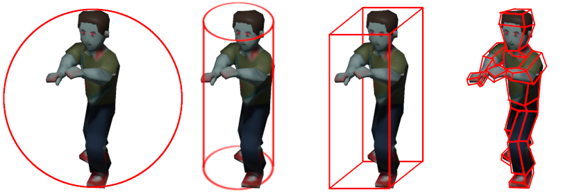
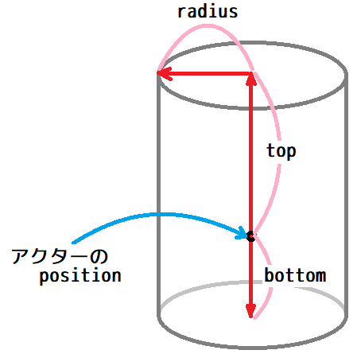
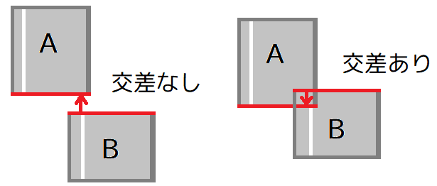
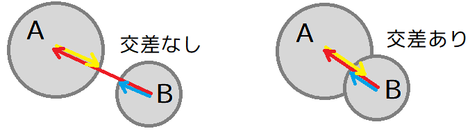
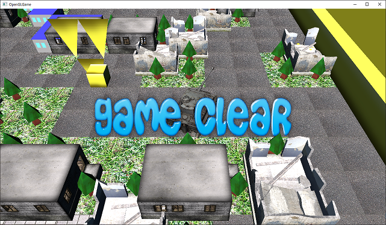
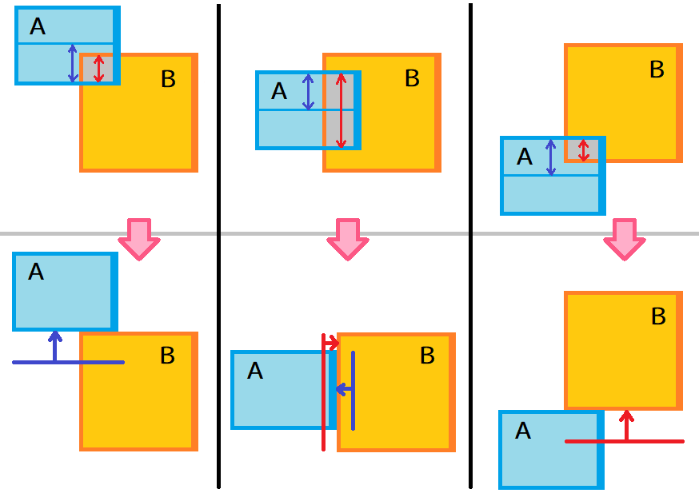
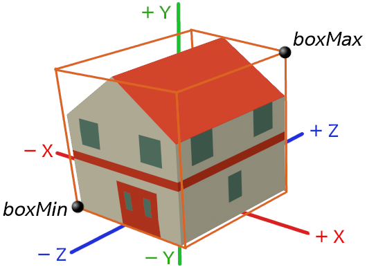
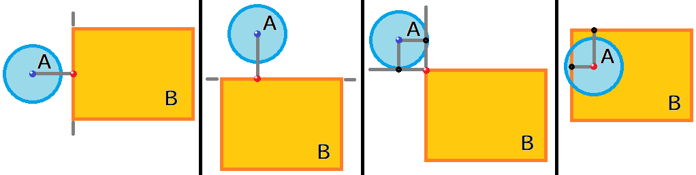
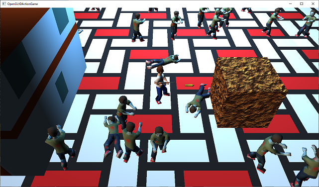

[OpenGL 3D 2020 第12回]

# アクターちゃんは衝突したい！

## 習得目標

* 垂直な円柱同士の衝突判定
* 垂直な円柱と直方体の衝突判定
* 関数ポインタの書き方と使い方

## 1. 垂直な円柱の衝突判定

### 1.1  <ruby>境界<rt>きょうかい</rt></ruby>ボリューム

コンピューター内の3D空間において、2つの物体が衝突したことを調べるにはどうしたらよいでしょう。すぐに思いつくのは、全てのポリゴン同士が交差しているかを調べることです。仮にこれを「ポリゴン<ruby>総当<rt>そうあた</rt></ruby>り法」と呼びましょう。

「ポリゴン総当り法」は現実と同くらい厳密な判定を行うことができます。そのかわり、ポリゴン数が増えるほど交差判定を行う回数が増えていきます。1000ポリゴン同士の場合で`1000*1000=100万`も交差判定を行わなくてはなりません。

いくらコンピューターが高性能になったといっても、わずか2個の物体が衝突しているかを調べるだけで100万回も交差判定をしているようでは、とうてい数十、数百の物体の衝突をリアルタイムに調べることはできません。そこで、物体をより単純な図形で置き換えることを考えます。

この図形のことを「<ruby>境界<rt>きょうかい</rt></ruby>ボリューム」と言います。

境界ボリュームには、元になる物体全体をうまく包み込むような図形を選択します(球や円柱、直方体など)。単純な図形の交差判定は、それらが覆っている複雑なオブジェクトの交差判定と比べて時間がかかりません。

もしより正確な重なり判定が必要な場合は、境界ボリュームが交差していると判定されてから、改めて詳細な交差判定を行うことができます。

### 1.2 よい境界ボリュームの特徴

よい境界ボリュームは以下の特徴を備えています。

* 交差判定が簡単
* 元の物体に密着している
* メモリ使用量が少ない
* 回転や移動が簡単

<p align="center">
より速い判定、より少ないメモリ　←－－－－→　より密着した図形　　<br>
<br>
[球、垂直円柱、直方体、複雑なポリゴン]
</p>

境界ボリュームの鍵となる考え方は

>時間のかかる複雑な形状の交差判定をする前に、より時間が短くて済む交差判定を行って、判定を早く終わらせる

というものです。

短い時間で交差判定を行うために、境界ボリュームは単純な形状でなくてはなりません。同時に「実際には交差していないのに交差していると判定される」という、いわゆる<ruby>偽陽性<rt>ぎようせい</rt></ruby>を避けるため、元の形状に密着したものであるべきです。

しかし、元の形状に密着させようとするほど、より複雑な図形を選択することになります。結果として、交差判定にかかる時間と密着度合いとの間でトレードオフが発生します。

また、見かけ上は単純な図形であっても、境界ボリュームとして使いやすいとは限りません。例えば「<ruby>楕円形<rt>だえんけい</rt></ruby>」は単純な図形ですが、交差判定に必要な計算量が多いため、境界ボリュームには向いていません。

それから、境界ボリュームは元の形状に対する追加データになりますので、わずかに余分なメモリを必要とします。単純な図形ほど必要なメモリの量は少なく、複雑な図形ほど多くなります。

ここまで見てきたように、境界ボリュームに望ましい性質には互いに両立しないものがあります。そのため、単一の図形が全ての状況において最適となることはほとんどありません。ですから、状況に応じていくつかの図形を使い分けることが重要です。

### 1.3 垂直な円柱

「垂直円柱」は比較的単純な境界ボリュームのひとつです。名前に「垂直」とあるように、この図形を傾けることはできません。その代わり、とても簡単な計算によって交差を判定することができます。この境界ボリュームは、人間のような縦に長い物体を表すのに適しています。

垂直円柱を定義する方法はいくつか考えられます。今回はアクターの座標を流用することを前提に、円柱の上端までの距離、下端までの距離、円柱の半径、という3つのパラメータで表現することにします。

<p align="center">

</p>

それでは、衝突形状を表す型を定義しましょう。この型の目的は、衝突判定に必要な図形のパラメータをまとめることです。あまり特別な機能を持たせるつもりはないので、クラスではなく構造体として定義していきます。名前は`Collision`(コリジョン、「衝突」という意味)としましょう。

`Actor.h`を開き、次のプログラムを追加してください。

```diff
 #include <glm/glm.hpp>
 #include <memory>
 #include <vector>
+
+/**
+* 衝突判定で使うパラメータ.
+*/
+struct Collision
+{
+  // 図形の種類.
+  enum Shape {
+    none,     // 衝突判定なし.
+    cylinder, // 垂直円柱.
+  };
+  Shape shape = Shape::none;
+
+  // 円柱のパラメータ.
+  float top;    // 円柱の上端.
+  float bottom; // 円柱の下端.
+  float radius; // 円柱の半径.
+};

 /**
 * アクター.
```

`top`(トップ)が円柱の上端、`bottom`(ボトム)が円柱の下端、`radius`(レイディアス)が円柱の半径です。

また、衝突形状を設定しないアクターを作れるように、設定されている図形を表す`shape`(シェイプ、「図形、形状」という意味)メンバ変数を追加し、`none`(ノン、「無し」という意味)か`cylinder`(シリンダー、「円柱」という意味)を設定できるようにしました。

次に、作成した`Collision`構造体を、アクタークラスに追加します。`Actor`クラスの定義に次のプログラムを追加してください。

```diff
   size_t animationNo = 0; // 表示するプリミティブの番号.
   float animationTimer = 0; // プリミティブ切り替えタイマー(秒).
   float animationInterval = 0.3f; // プリミティブを切り替える間隔(秒).
+
+  // 衝突判定用の変数.
+  Collision collision;
 };

 using ActorPtr = std::shared_ptr<Actor>; // アクターポインタ型.
```

### 1.4 衝突検出関数を定義する

定義した`Collision`構造体を使って、衝突判定を行う関数を作成します。関数名は<br>`DetectCollision`(ディテクト・コリジョン、「衝突を検出する」という意味)とします。`Actor.h`を開き、`ActorList`の定義の下に、次のプログラムを追加してください。

```diff
 using ActorPtr = std::shared_ptr<Actor>; // アクターポインタ型.
 using ActorList = std::vector<ActorPtr>; // アクター配列型.
+
+bool DetectCollision(Actor&, Actor&);

 #endif // ACTOR_H_INCLUDED
```

それでは関数を定義しましょう。`Actor.cpp`を開き、`Actor::Draw`メンバ関数の定義の下に、次のプログラムを追加してください。

```diff
   // プリミティブを描画.
   primitive->Draw();
 }
+
+/**
+* アクターの衝突を処理する.
+*
+* @param a 衝突を処理するアクターA.
+* @param b 衝突を処理するアクターB.
+*
+* @retval true  衝突している.
+* @retval false 衝突していない.
+*/
+bool DetectCollision(Actor& a, Actor& b)
+{
+  // 図形が設定されていなければ衝突しない.
+  if (a.collision.shape == Collision::Shape::none) {
+    return false;
+  }
+  if (b.collision.shape == Collision::Shape::none) {
+    return false;
+  }
+  return true;
+}
```

見てのとおりこれは雛形です。ここに円柱同士の交差判定を書いていきます。

### 1.5 Y軸方向の交差判定

まずY軸方向の交差判定を行います。垂直円柱AとBがあるとき、Aの下端がBの上端より上にある場合は交差していません。

<p align="center">

</p>

これをプログラムで表すと次のようになります。`DetectCollision`関数に次のプログラムを追加してください。

```diff
   if (b.collision.shape == Collision::Shape::none) {
     return false;
   }
+
+  // 円柱Aの下端が、円柱Bの上端より上にあるなら交差なし.
+  const float bottomA = a.position.y + a.collision.bottom;
+  const float topB = b.position.y + b.collision.top;
+  if (bottomA > topB) {
+    return false;
+  }
   return true;
 }
```

同様に、Aの上端がBの下端より下にある場合も交差していません。Aの下端とBの上端の交差判定プログラムの下に、次のプログラムを追加してください。

```diff
   if (bottomA >= topB) {
     return false;
   }
+
+  // 円柱Aの上端が、円柱Bの下端より下にあるなら衝突していない.
+  const float topA = a.position.y + a.collision.top;
+  const float bottomB = b.position.y + b.collision.bottom;
+  if (topA < bottomB) {
+    return false;
+  }
   return true;
 }
```

### 1.6 XZ平面の交差判定

Y軸で交差していると判定されたら、今度はX軸とZ軸の交差判定を行います。これは円と円の交差判定そのものです。

<p align="center">
<br>
[赤=中心間の距離 黄=Aの半径 青=Bの半径]
</p>

つまり、AとBの中心間の距離が、AとBの半径を合計した値以下ならば交差していることになります。Y軸の交差判定プログラムの下に、次のプログラムを追加してください。

```diff
   if (topA < bottomB) {
     return false;
   }
+
+  // アクターAとBの図形(垂直円柱)の中心間の距離の2乗を計算.
+  const float dx = a.position.x - b.position.x;
+  const float dz = a.position.z - b.position.z;
+  const float d2 = dx * dx + dz * dz;
+
+  // 交差する距離を計算.
+  const float r = a.collision.radius + b.collision.radius;
+
+  // 中心間の距離が、交差する距離より離れていたら衝突していない.
+  if (d2 > r * r) {
+    return false;
+  }
   return true;
 }
```

2点間の距離を求めるには「三平方の定理」を使います。つまりX軸差分の2乗とZ軸差分の2乗を足した値の平方根が距離になります。

ただし、上記の交差判定では、「距離」ではなく「距離の2乗」を使って判定しています。これは、時間がかかる平方根の計算を省略するためです。値を比較する場合、式の両辺を2乗しても結果は変わりません。これで垂直円柱の衝突を判定できるようになりました。

>**【座標が等しい場合の判定】**<br>
>座標が等しい場合に「交差あり」とみなすか「交差なし」とみなすかは好みの問題です。ただし、全ての交差判定で同じルールを使うべきです。そうしないと、ある交差判定では交差しているのに、別の交差判定では交差していない、といったことが起こりえます。

### 1.7 衝突判定を設定する関数を追加する

図形のパラメータをひとつずつメンバ変数に代入していくのは面倒なので、設定するためのメンバ関数を作成します。関数名は`SetCylinderCollision`(セット・シリンダー・コリジョン)としましょう。`Actor.h`を開き、次のプログラムを追加してください。

```diff
   void Update(float deltaTime);
   void Draw(const Shader::Pipeline& pipeline, const glm::mat4& matVP) const;
+
+  // 衝突形状の設定.
+  void SetCylinderCollision(float top, float bottom, float radius);

   Mesh::Primitive* primitive = nullptr;
   std::shared_ptr<Texture::Image2D> texture;
```

続いて定義を行います。`Actor.cpp`を開き、`Actor::Draw`メンバ関数の定義の下に、次のプログラムを追加してください。

```diff
   // プリミティブを描画.
   primitive->Draw();
 }
+
+/**
+* 垂直円柱の衝突形状を設定する.
+*
+* @param top    円柱の上端の座標.
+* @param bottom 円柱の下端の座標.
+* @param radius 円柱の半径.
+*/
+void Actor::SetCylinderCollision(float top, float bottom, float radius)
+{
+  collision.shape = Collision::Shape::cylinder;
+  collision.top = top;
+  collision.bottom = bottom;
+  collision.radius = radius;
+}

 /**
 * アクターの衝突を処理する.
```

### 1.8 アクターに衝突判定をつける

それではアクターに衝突形状を追加しましょう。`MainGameScene.cpp`を開き、プレイヤーアクターを作成するプログラムに次のプログラムを追加してください。

```diff
   playerActor = std::make_shared<Actor>(
     &primitiveBuffer.Get(PrimNo::player_idle_0),
     texPlayer, glm::vec3(10, 0, 10));
+  // 垂直円柱型の衝突判定を設定.
+  playerActor->SetCylinderCollision(1.7f, 0.0f, 0.25f);
   // 作成したプレイヤーアクターを、アクターリストに追加.
   actors.push_back(player);
```

同様に、ゾンビアクターにも衝突形状を付けます。ゾンビアクターを作成するプログラムに次のプログラムを追加してください。

```diff
     // アクターを作成.
     std::shared_ptr<Actor> actor =
       std::make_shared<Actor>(pPrimitive, texZombieMale, pos);
+    // 垂直円柱型の衝突判定を設定.
+    actor->SetCylinderCollision(1.6f, 0.0f, 0.3f);
     // アクターのY軸回転を設定.
     actor->rotation.y =
       std::uniform_real_distribution<float>(0, glm::radians(360.0f))(random);
```

プレイヤーとゾンビはほぼ同じ大きさですが、ゾンビの3Dモデルはプレイヤーより少し姿勢が低くなっています。そこで、`top`を少し下げて、かわりに`radius`をわずかに大きくしてみました。

### 1.9 アクタークラスに名前メンバを追加する

アクター同士の衝突が分かったとしても、何が衝突したのかが分からなければ対応のしようがありません。そこで、アクターに識別用の名前を与えましょう。名前は`string`型で表すことにします。`Actor.h`を開き、次のプログラムを追加してください。

```diff
 #include <glm/glm.hpp>
 #include <memory>
 #include <vector>
+#include <string>

 /**
 * 衝突判定で使うパラメータ.
```

続いて`Actor`クラスに次の変数を追加してください。

```diff
   void Update(float deltaTime);
   void Draw(const Shader::Pipeline& pipeline, const glm::mat4& matVP) const;

+  std::string name; // アクターの名前.
   Mesh::Primitive* primitive = nullptr;
   std::shared_ptr<Texture::Image2D> texture;
```

名前はコンストラクタで指定しましょう。`Actor`コンストラクタの宣言を次のように変更してください。

```diff
 public:
   Actor() = default;
-  Actor(const Mesh::Primitive* prim,
+  Actor(const std::string& name, const Mesh::Primitive* prim,
     std::shared_ptr<Texture::Image2D> tex, const glm::vec3& pos);
   ~Actor() = default;
   Actor(const Actor&) = default;
```

コンストラクタの定義も変更します。`Actor.cpp`を開き、`Actor`コンストラクタの定義を次のように変更してください。

```diff
 * コンストラクタ.
 *
+* @param name アクターの名前.
 * @param prim アクターの外見を表すプリミティブ.
 * @param tex  プリミティブに貼り付けるテクスチャ.
 * @param pos  アクターの座標.
 */
-Actor::Actor(const Mesh::Primitive* prim,
+Actor::Actor(const std::string& name, const Mesh::Primitive* prim,
   std::shared_ptr<Texture::Image2D> tex, const glm::vec3& pos) :
-  primitive(prim), texture(tex), position(pos)
+  name(name), primitive(prim), texture(tex), position(pos)
 {
 }
```

これで`name`メンバ変数を見ればそのアクターが誰なのかが分かるようになります。

>**【初期化リストにおけるメンバ変数名と引数名】**<br>
>初期化リストでは、初期化対象の名前は常にメンバ変数名として解釈されるため、同名の引数があっても問題ありません。

### 1.10 アクターに名前をつける

それでは、アクターに名前を付けましょう。`MainGameScene.cpp`を開き、プレイヤーアクターを作成するプログラムを次のように変更してください。

```diff
   // プレイヤーアクターを作成.
   playerActor = std::make_shared<Actor>(
+    "player",
     &primitiveBuffer.Get(PrimNo::player_idle_0),
     texPlayer, glm::vec3(10, 0, 10));
```

同様にゾンビアクターにも名前を付けましょう。それぞれのゾンビに特別な思い入れがあるわけではないので、名前は全部`zombie`でいいでしょう。ゾンビアクターを作成するプログラムを次のように変更してください。

```diff
     pos.z = std::uniform_real_distribution<float>(-18, 18)(random);
     // アクターを作成.
     std::shared_ptr<Actor> actor =
-      std::make_shared<Actor>(pPrimitive, texZombieMale, pos);
+      std::make_shared<Actor>("zombie", pPrimitive, texZombieMale, pos);
     // アクターのY軸回転を設定.
     actor->rotation.y =
       std::uniform_real_distribution<float>(0, glm::radians(360.0f))(random);
```

これでプレイヤーとゾンビを識別できるようになりました。

### 1.9 弾丸を発射する

衝突判定を使って、銃で打たれたゾンビが倒れるようにしようと思います。そのために、まずゾンビの死亡アニメーションと弾丸モデルを読み込みます。

ウェブブラウザで`https://github.com/tn-mai/OpenGL3D2020/tree/master/Res`にアクセスし、以下のファイルをダウンロードしてプロジェクトの`Res`フォルダに保存してください。

* zombie_male_down_0.obj
* zombie_male_down_1.obj
* zombie_male_down_2.obj
* zombie_male_down_3.obj
* Bullet.obj
* Bullet.tga

`MainGameScene.h`を開き、テクスチャ用のメンバ変数を追加します。

```diff
   std::shared_ptr<Texture::Image2D> texZombieMale;
   std::shared_ptr<Texture::Image2D> texPlayer;
+  std::shared_ptr<Texture::Image2D> texBullet;
   Shader::PointLight pointLight;

   ActorList actors; // アクター配列.
```

それから、弾丸用のプリミティブ番号を追加しておきましょう。プリミティブ番号のリストに弾丸を追加してください。

```diff
     zombie_male_walk_4,
     zombie_male_walk_5,
+    zombie_male_down_0,
+    zombie_male_down_1,
+    zombie_male_down_2,
+    zombie_male_down_3,
     player_idle_0,
+    bullet,
   };
 };
```

それではOBJファイルを読み込みましょう。`MainGameScene.h`を開き、プレイヤーのOBJファイル読み込みの下に、弾丸を読み込むプログラムを追加してください。

>**【補足】**<br>
>テキストに書いていないOBJを読み込んでいたり、読み込み順がテキストと異なる場合、プリミティブ番号と読み込み順が一致するように、どちらかの順番を調整してください。

```diff
   primitiveBuffer.AddFromObjFile("Res/zombie_male_walk_4.obj");
   primitiveBuffer.AddFromObjFile("Res/zombie_male_walk_5.obj");
+  primitiveBuffer.AddFromObjFile("Res/zombie_male_down_0.obj");
+  primitiveBuffer.AddFromObjFile("Res/zombie_male_down_1.obj");
+  primitiveBuffer.AddFromObjFile("Res/zombie_male_down_2.obj");
+  primitiveBuffer.AddFromObjFile("Res/zombie_male_down_3.obj");
   primitiveBuffer.AddFromObjFile("Res/player_male_idle_0.obj");
+  primitiveBuffer.AddFromObjFile("Res/Bullet.obj");

   // パイプライン・オブジェクトを作成する.
   pipeline = std::make_shared<Shader::Pipeline>(
     "Res/FragmentLighting.vert", "Res/FragmentLighting.frag");
   if (!pipeline) {
     return 1;
   }
```

さらに、テクスチャを読み込むプログラムを次のように変更します。

```diff
   texZombieMale = std::make_shared<Texture::Image2D>("Res/zombie_male.tga");
   texPlayer= std::make_shared<Texture::Image2D>("Res/player_male.tga");
+  texBullet = std::make_shared<Texture::Image2D>("Res/Bullet.tga");
-  if (!texZombieMale || !texPlayer) {
+  if (!texZombieMale || !texPlayer || !texBullet) {
     return false;
   }
```

これで死亡アニメーションと弾丸アクターが作れます。

弾丸の発射は`ProcessInput`メンバ関数で行います。発射キーはとりあえず`J`キーにします。プレイヤーアクターを移動させるプログラムの下に、次のプログラムを追加してください。

```diff
   } else {
     playerActor->velocity = glm::vec3(0);
   }
+
+  // Jキーで弾丸を発射する.
+  if (glfwGetKey(window, GLFW_KEY_J) == GLFW_PRESS) {
+    // プレイヤーのY軸回転から正面方向を計算.
+    const float fx = std::cos(playerActor->rotation.y);
+    const float fz = -std::sin(playerActor->rotation.y); // Z軸の向きは数学と逆.
+    const glm::vec3 front = glm::vec3(fx, 0, fz);
+
+    // プレイヤーのY軸回転から右方向を計算.
+    const float rx = std::cos(playerActor->rotation.y - glm::radians(90.0f));
+    const float rz = -std::sin(playerActor->rotation.y - glm::radians(90.0f)); // 同上
+    const glm::vec3 right = glm::vec3(rx, 0, rz);
+
+    // 弾丸の発射位置(銃口)を計算. 3Dモデルを調べたところ、銃口は
+    // プレイヤーの座標(足元)から前に0.6m、右に0.2m、上に0.9mの位置にある.
+    const glm::vec3 position =
+      playerActor->position + front * 0.6f + right * 0.2f + glm::vec3(0, 0.9f, 0);
+
+    // 弾丸アクターを銃口の位置に作成.
+    std::shared_ptr<Actor> bullet = std::make_shared<Actor>("bullet",
+      &primitiveBuffer.Get(PrimNo::bullet), texBullet, position);
+
+    // 向き(回転)はプレイヤーアクターを継承.
+    bullet->rotation = playerActor->rotation;
+
+    // front方向へ「毎秒20m」の速度で移動するように設定.
+    bullet->velocity = front * 20.0f;
+
+    // 衝突形状を設定.
+    bullet->SetCylinderCollision(0.1f, -0.1f, 0.125f);
+
+    // アクターをリストに追加.
+    actors.push_back(bullet);
+  }
 }

 /**
 * メインゲーム画面を更新する.
```

プログラムが書けたらビルドして実行してください。メインゲーム画面で`J`キーを押したとき、弾丸が発射されたら成功です。

<p align="center">

</p>

### 1.10 視点を変更する

現在のカメラはキャラクターに注目しすぎていて、周辺の状況を確認すすことが難しくなっています。これはゲームとしてはあまりよくありません。そこで視点を調整します。

`MainGameScene::Draw`メンバ関数の`viewPosition`と`viewTarget`を計算するプログラムを、次のように変更してください。

```diff
   pipeline->SetLight(directionalLight);
   pipeline->SetLight(pointLight);

-  // カメラをプレイヤーアクターのななめ右上に配置.
-  const glm::vec3 viewPosition = playerActor->position + glm::vec3(2, 3, 3);
+  // カメラをプレイヤーアクターのななめ上に配置.
+  const glm::vec3 viewPosition = playerActor->position + glm::vec3(0, 7, 7);
-  // カメラがプレイヤーアクターの胸のあたりを見るようにする.
-  const glm::vec3 viewTarget = playerActor->position + glm::vec3(0, 1, 0);
+  // プレイヤーアクターの足元が画面の中央に映るようにする.
+  const glm::vec3 viewTarget = playerActor->position;

   // 座標変換行列を作成.
   int w, h;
```

プログラムが書けたらビルドして実行してください。視点の位置がが高くなり、周囲の状況が確認できるようになっていたら成功です。

### 1.11 弾丸をゾンビに衝突させる

それではゾンビと弾丸の衝突判定を行います。`MainGameScene::Update`メンバ関数に、次のプログラムを追加してください。

```diff
   for (size_t i = 0; i < actors.size(); ++i) {
     actors[i]->Update(deltaTime);
   }
+
+  // 衝突判定.
+  for (size_t ia = 0; ia < actors.size(); ++ia) {
+    Actor& a = *actors[ia]; // アクターA
+    // 計算済み及び自分自身を除く、残りのアクターとの間で衝突判定を実行.
+    for (size_t ib = ia + 1; ib < actors.size(); ++ib) {
+      Actor& b = *actors[ib]; // アクターB
+
+      // 衝突判定.
+      if (DetectCollision(a, b)) {
+        // ゾンビと弾丸の衝突だった場合
+        if (a.name == "zombie" && b.name == "bullet") {
+          // 死亡アニメーションデータを作成.
+          std::vector<const Mesh::Primitive*> animeList;
+          animeList.push_back(&primitiveBuffer.Get(PrimNo::zombie_male_down_0));
+          animeList.push_back(&primitiveBuffer.Get(PrimNo::zombie_male_down_1));
+          animeList.push_back(&primitiveBuffer.Get(PrimNo::zombie_male_down_2));
+          animeList.push_back(&primitiveBuffer.Get(PrimNo::zombie_male_down_3));
+
+          // 死亡アニメーションを設定.
+          a.animationList = animeList;
+          a.animationNo = 0;
+          a.animationTimer = 0;
+          a.animationInterval = 0.125f;
+
+          // 衝突判定を無くす.
+          a.collision.shape = Collision::Shape::none;
+          b.collision.shape = Collision::Shape::none;
+        }
+      }
+    } // 閉じ括弧の数に注意.
+  }
 }

 /**
 * メインゲーム画面を描画する.
```

プログラムが書けたらビルドして実行してください。弾丸がゾンビに当たったとき、ゾンビのアニメーションが死亡アニメーションに変化したら成功です。

### 1.12 ループしないアニメーションを設定する

死亡アニメーションがループ再生されるのは困るので、最後までアニメーションを再生したら停止できるようにしましょう。

`Actor.h`を開き、`Actor`クラスにループ再生を制御するフラグ変数を追加してください。

```diff
   size_t animationNo = 0; // 表示するプリミティブの番号.
   float animationTimer = 0; // プリミティブ切り替えタイマー(秒).
   float animationInterval = 0.3f; // プリミティブを切り替える間隔(秒).
+  bool animationLoop = true; // ループフラグ.

   // 衝突判定用の変数.
   Collision collision;
```

`Actor.cpp`を開き、`Actor::Update`メンバ関数のアニメーション処理に、次のプログラムを追加してください。

```diff
   // アニメーションデータがあればアニメーションする.
   if (!animationList.empty()) {
+    // ループ再生が有効、またはアニメーション番号がデータの最後より小さい場合、
+    // アニメーションを更新する.
+    if (animationLoop || animationNo < animationList.size() - 1) {
       animationTimer += deltaTime; // タイマーを進める.
       // タイマーがインターバル以上になったらアニメーション番号を進める.
       if (animationTimer >= animationInterval) {
         animationTimer -= animationInterval; // タイマーを戻す.
         ++animationNo;
         // アニメーション番号がデータの最後を超えたら0に戻す.
         if (animationNo >= animationList.size()) {
           animationNo = 0;
         }
         // 表示するプリミティブを更新.
         primitive = animationList[animationNo];
       }
+    }
   }
```

これで、`animationLoop`メンバ変数を`false`にすれば、ループしなくなるはずです。

`MainGameScene.cpp`に戻り、ゾンビの死亡アニメーションを設定するプログラムに、次のプログラムを追加してください。

```diff
           a.animationNo = 0;
           a.animationTimer = 0;
           a.animationInterval = 0.125f;
+          a.animationLoop = false;

           // 衝突判定を無くす.
           a.collision.shape = Collision::Shape::none;
```

プログラムが書けたらビルドして実行してください。ゾンビの死亡アニメーションがループしなくなっていたら成功です。

### 1.13 アニメーション設定関数を作る

アニメーションの設定項目が増えてきたので、それらを一度に設定してくれる関数があると便利です。そこで、`Actor`クラスにアニメーションを設定するメンバ関数を追加します。

関数名は`SetAnimation`(セット・アニメーション)がいいでしょう。`Actor.h`を開き、`Actor`クラスの定義に次のプログラムを追加してください。

```diff
   // 衝突形状の設定
   void SetCylinderCollision(float top, float bottom, float radius);
+
+  // アニメーションの設定
+  void SetAnimation(
+    const std::vector<const Mesh::Primitive*>& animeList,
+    float interval, bool loop);

   std::string name; // アクターの名前.

   const Mesh::Primitive* primitive = nullptr;
```

続いて`SetAnimation`メンバ関数の定義を行います。`Actor.cpp`を開き、<br>`SetCylinderCollision`メンバ関数の定義の下に、次のプログラムを追加してください。

```diff
   collision.bottom = bottom;
   collision.radius = radius;
 }
+
+/**
+* アニメーションを設定する.
+*
+* @param animeList アニメーションデータの配列.
+* @param interval  アニメーション間隔.
+* @param loop      ループ再生の有無(ループする=true ループしない=false).
+*/
+void Actor::SetAnimation(
+  const std::vector<const Mesh::Primitive*>& animeList,
+  float interval, bool loop)
+{
+  animationList = animeList;
+  animationNo = 0;
+  animationTimer = 0;
+  animationInterval = interval;
+  animationLoop = loop;
+  primitive = animationList[0];
+}

 /**
 * アクターリストを更新する.
```

それでは、ゾンビの死亡アニメーション設定を`SetAnimation`メンバ関数で置き換えましょう。`MainGameScene.cpp`を開き、ゾンビの死亡アニメーション設定プログラムを、次のように変更してください。

```diff
           // 死亡アニメーションを設定.
-          a.animationList = animeList;
-          a.animationNo = 0;
-          a.animationTimer = 0;
-          a.animationInterval = 0.125f;
-          a.animationLoop = false;
+          a.SetAnimation(animeList, 0.125f, false);

           // 衝突判定を無くす.
           a.collision.shape = Collision::Shape::none;
```

プログラムが書けたらビルドして実行してください。ゾンビを撃ったときに死亡アニメーションが表示され、ループしなければ成功です。

<pre class="tnmai_assignment">
<strong>【課題01】</strong>
ゾンビの歩行アニメーションを設定するプログラムを、<code>SetAnimation</code>メンバ関数を使って置き換えなさい。
</pre>

### 1.14 アクターを削除する

ゾンビに衝突した弾丸は、貫通せずに消えるべきでしょう。そのために、アクターを削除する機能を追加します。ただし、アクターリストをループ処理している最中に削除してしまうと、ループの順番がおかしくなってしまいます。

そこで、死亡フラグを追加し、特定のタイミングで死亡フラグの立っているアクターを全て削除する、という方法をとります。

まずはアクターに死亡フラグを追加しましょう。変数名は`isDead`(イズ・デッド)とします。`Actor.h`を開き、`Actor`クラスの定義に次のプログラムを追加してください。

```diff
   // 衝突判定用の変数.
   Collision collision;

+  bool isDead = false; // 死亡フラグ.
 };

 using ActorPtr = std::shared_ptr<Actor>; // アクターポインタ型.
```

次に、死亡したアクターを削除する機能を作…ろうと思ったのですが、いい機会なのでアクターの更新もまとめて行う関数にしましょう。関数名は`UpdateActorList`(アップデート・アクターリスト)とします。`ActorList`型の定義の下に、次のプログラムを追加してください。

```diff
 using ActorPtr = std::shared_ptr<Actor>; // アクターポインタ型.
 using ActorList = std::vector<ActorPtr>; // アクター配列型.

+void UpdateActorList(ActorList&, float);
 bool DetectCollision(Actor&, Actor&);

 #endif // ACTOR_H_INCLUDED
```

続いて`Actor.cpp`を開き、`SetAnimation`メンバ関数の定義の下に、次のプログラムを追加してください。

```diff
   animationLoop = loop;
   primitive = animationList[0];
 }
+
+/**
+* アクターリストを更新する.
+*
+* @param actorList  更新するアクターリスト.
+* @param deltaTime  前回の更新からの経過時間(秒).
+*/
+void UpdateActorList(ActorList& actorList, float deltaTime)
+{
+  // アクターの状態を更新.
+  for (size_t i = 0; i < actorList.size(); ++i) {
+    actorList[i]->Update(deltaTime);
+  }
+}

 /**
 * アクターの衝突を処理する.
```

それでは、上記のプログラムに「死んでいるアクターを削除する」処理を追加しましょう。

C++において、`std::vector`から特定の条件を満たした要素を削除する場合、`erase`(イレース)メンバ関数と`std::remove_if`(エスティーディー・リムーブ・イフ)関数を組み合わせて使います。

<pre class="tnmai_code"><strong>【書式】</strong><code>
iterator std::remove_if(範囲の先頭, 範囲の終端, 削除判定関数);
</code></pre>

<ruby>`std::remove_if`<rt>エスティーディー・リムーブ・イフ</rt></ruby>は指定された範囲の要素について、範囲に残す要素を前に詰めて、削除すべき要素を後ろに追いやります。そして「最初の削除すべき要素の位置」を返します。名前に反して実際には要素を削除しないので注意してください。

「削除判定関数」には「ラムダ式」というC++の機能を使います。ラムダ式は「関数の中で関数を定義する機能」です。ラムダ式の書式は次のとおりです。

<pre class="tnmai_code"><strong>【書式】</strong><code>
[](引数の型1 引数名1, 引数の型2 引数名2, ...){ 関数の内容 };
</code></pre>

ラムダ式は、関数名の代わりに`[]`(開き角カッコ、閉じ角カッコ)のペアを使うこと以外は普通の関数定義と同じです。

忘れないようにもう一度書きますが、`std::remove_if`関数は削除する要素を分類するだけで、要素の削除は行いません。実際の削除は次の`erase`(イレース)メンバ関数で行います。

<pre class="tnmai_code"><strong>【書式】</strong><code>
iterator std::vector::erase(削除する範囲の先頭, 削除する範囲の終端);
</code></pre>

<ruby>`erase`<rt>イレース</rt></ruby>メンバ関数は、指定した範囲の要素を削除します。`std::remove_if`が返した「最初の削除すべき要素の位置」を「削除する範囲の先頭」に指定し、「配列の終端」を「削除する範囲の終端」に指定することで、目的の要素を削除することができます。

さて、`std::remove_if`は`algorithm`(アルゴリズム)というヘッダファイルに定義されています。ですから、まずこのファイルをインクルードします。`Actor.cpp`を開き、`matrix_transform.hpp`のインクルード文の下に、次のプログラムを追加してください。

```diff
 #include "Actor.h"
 #include <glm/gtc/matrix_transform.hpp>
+#include <algorithm>

 /**
 * コンストラクタ.
```

それでは死亡フラグの立っているアクターを削除しましょう。`UpdateActorList`関数内にあるアクターの状態を更新するプログラムの下に、次のプログラムを追加してください。

```diff
   for (size_t i = 0; i < actorList.size(); ++i) {
     actorList[i]->Update(deltaTime);
   }
+
+  // 死んでいるアクターの削除.
+  // 1. 生きてるアクターと死んでるアクターを分離し、
+  //    最初の死んでるアクターの位置iを取得.
+  const ActorList::iterator i = std::remove_if(
+    actorList.begin(), actorList.end(),
+    [](const ActorPtr& p){ return p->isDead; }); // ラムダ式
+  // 2. 最初の死んでるアクターの位置iから配列終端までの要素を削除.
+  actorList.erase(i, actorList.end());
 }

 /**
 * アクターの衝突を処理する.
```

これでアクター更新関数は完成です。

それでは、作成した`UpdateActorList`関数でアクターの更新処理を置き換えましょう。 `MainGameScene.cpp`を開き、`MainGameScene::Update`メンバ関数のアクター更新プログラムを次のように変更してください。

```diff
 void MainGameScene::Update(GLFWwindow* window, float deltaTime)
 {
   // アクターリストに含まれるアクターの状態を更新する.
-  for (size_t i = 0; i < actors.size(); ++i) {
-    actors[i]->Update(deltaTime);
-  }
+  UpdateActorList(actors, deltaTime);

   // 衝突判定.
   for (size_t ia = 0; ia < actors.size(); ++ia) {
```

最後に、衝突した弾丸アクターの死亡フラグを立てます。ゾンビの死亡アニメーションを設定するプログラムの下に、次のプログラムを追加してください。

```diff
           // 衝突判定を無くす.
           a.collision.shape = Collision::Shape::none;
           b.collision.shape = Collision::Shape::none;
+          // 弾丸アクターを消す.
+          b.isDead = true;
         }
       }
     } // 閉じ括弧の数に注意.
```

プログラムが書けたらビルドして実行してください。弾丸がゾンビに衝突したとき、貫通せずに消えていたら成功です。

<div style="page-break-after: always"></div>

## 2. アクターのめり込みを防ぐ

### 2.1 図形が重ならないようにする

弾丸がゾンビに衝突した時はただ弾丸を消すだけで済みました。しかし、ゾンビとゾンビ、あるいはプレイヤーとゾンビが衝突した場合、どちらかを消すというわけにはいきません。かといって、重なった状態になるのも困ります。

そこで、衝突が重ならないように押し返す機能を追加しましょう。

物体の押し合いを正確に扱おうとすると、物体の重量や物体が固定されているかどうかといった様々なパラメータを追加しなくてはなりません。それは手間がかかるので、今回は次のような簡易な方法を採用します。

1. 縦方向の重複が垂直円柱の高さの半分以上なら、中心点を結んだ水平方向に、双方同じだけ動かす.
2. 重複が高さの半分未満なら、上側のアクターを上に動かす。下側のアクターは動かさない。

`2`のケースで上側だけを動かすのは、物体が地面にめり込まないようにするためです。

<p align="center">
<br>
[左=重複が半分未満(Aが上) 中=重複が半分以上 右=重複が半分未満(Bが上)]
</p>

この方針に従ってプログラムを書いていきます。最初に重なっている部分の長さを計算します。これはAとBの低い方の`top`と高い方の`bottom`との差になります(上の図で確認してください)。

`DetectCollision`関数に次のプログラムを追加してください。

```diff
   // 中心間の距離が、交差する距離より離れていたら衝突していない.
   if (d2 > r * r) {
     return false;
   }
+
+  /* 重複しない位置に移動させる */
+
+  // Y軸方向の重なっている部分の長さを計算.
+  const float overlapY =
+    std::min(topA, topB) - std::max(bottomA, bottomB);
   return true;
 }
```

<pre class="tnmai_code"><strong>【書式】</strong><code>
float std::min(引数1, 引数2);
</code></pre>

<pre class="tnmai_code"><strong>【書式】</strong><code>
float std::max(引数1, 引数2);
</code></pre>

`std::min`(エスティーディー・ミン)は、2つの引数のうち小さい方を返す関数です。`std::max`(エスティーディー・マックス)関数はその逆で、2つの引数のうち大きい方を返します。

同じことは`if`や三項演算子を使っても実現可能です。しかし、関数を使うことでプログラムが短くなり、意図も明確になります。

次に比較対象となる円柱の高さを取得します。高さはAとBのうち小さいほうを選びます。重なっている部分の長さを計算するプログラムの下に、次のプログラムを追加してください。

```diff
   const float overlapY =
     std::min(topA, topB) - std::max(bottomA, bottomB);
+
+  // 短いほうの円柱の高さを取得.
+  const float shortY = std::min(topA - bottomA, topB - bottomB);
   return true;
 }
```

`overlapY`(オーバーラップ・ワイ)と`shortY`(ショート・ワイ)を使って重なり度合いを比較します。そして、重なりが半分未満の場合は上側のアクターを押し上げます。円柱の高さを取得するプログラムの下に、次のプログラムを追加してください。

```diff
   // 短いほうの円柱の高さを取得.
   const float shortY = std::min(topA - bottomA, topB - bottomB);
+
+  // 重なっている長さが短い方の円柱の高さの半分未満なら上に押し返す.
+  // 半分以上なら横に押し返す.
+  if (overlapY < shortY * 0.5f) {
+    // 下端が高い位置にあるアクターを上に移動.
+    if (bottomA > bottomB) {
+      a.position.y += topB - bottomA; // Aを上に移動.
+    } else {
+      b.position.y += topA - bottomB; // Bを上に移動.
+    }
+  }
   return true;
 }
```

重なりが半分以上の場合は横に押し出します。重なり度合いを判定する`if`文に、次のプログラムを追加してください。

```diff
     } else {
       b.position.y += topA - bottomB; // Bを上に移動.
     }
+  } else {
+    // 中心間の距離dを計算.
+    const float d = std::sqrt(d2);
+    // 押し返す距離sを計算.
+    const float s = r - d;
+    // 円柱の中心軸間の方向ベクトルnを計算.
+    const glm::vec3 n(dx / d, 0, dz / d);
+    // アクターAとBを均等に押し返す.
+    a.position += n * s * 0.5f;
+    b.position -= n * s * 0.5f;
   }
   return true;
 }
```

これでほとんどの場合は垂直円柱同士の重なりを解決できるようになりました。「ほとんど」の場合、と但し書きをしたのは、`d2`が`0`の場合を考慮していないからです。

`d2`が`0`になるのは、2つの垂直円柱のX及びZ座標がぴったり一致する場合です。このとき両者の距離は`0`になります。距離が`0`だと方向ベクトル`n`を計算することができません。

そこで、`d2`が`0.0001`以下の場合は上下方向に押し返すことにします。「`0`と等しい」としないのは、`float`型の計算誤差を考慮するためです。重なっている長さを比較するプログラムを次のように変更してください。

```diff
   // 重なっている長さが短い方の円柱の高さの半分未満なら上に押し返す.
   // 半分以上なら横に押し返す.
+  // 押し返す方向を計算できない場合(d2が0の場合)も上に押し返す.
-  if (overlapY < shortY * 0.5f) {
+  if (overlapY < shortY * 0.5f || d2 < 0.0001f) {
     // 下端が高い位置にあるアクターを上に移動.
     if (bottomA > bottomB) {
```

今度こそ、重複を解決するプログラムの完成です。プログラムが書けたらビルドして実行してください。プレイヤーとゾンビが衝突したとき、お互いに重ならないよう押し合っていれば成功です。

>**【0.0001という値の根拠は？】**<br>
>`0.0001`というのは`1cm`の2乗です。これは、このゲームに登場する物体の大きさから、半径1cm以内ならば重なっているとみなして問題ないだろうと考えたからです。<br>
>実際のところ、計算誤差をどれくらい考慮するかは計算内容に依存します。上記の座標計算程度なら`1mm`の2乗でも十分すぎるでしょう。逆に`10cm`の2乗となると、このゲームの物体にはちょっと大きすぎるように思います。

### 2.2 直方体の衝突図形を追加する

円柱は多くの物体の衝突判定として使えます。しかし、家やビル、壁のような直線で構成される物体には全く向いていません。直角で構成された物体を表せるように、衝突判定に直方体の図形を追加しましょう。

<p align="center">
<br>
</p>

直方体を表現するパラメータは様々なパターンが考えられますが、今回は扱いやすい表現である対角線上の2点を指定する方法を使うことにします。`Actor.h`を開き、`Collision`構造体に次のプログラムを追加してください。

```diff
   enum Shape {
     none,     // 衝突判定なし.
     cylinder, // 円柱.
+    box,      // 直方体.
   };
   Shape shape = Shape::none;

   // 円柱のパラメータ.
   float top;    // 円柱の上端.
   float bottom; // 円柱の下端.
   float radius; // 円柱の半径.
+
+  // 直方体のパラメータ.
+  glm::vec3 boxMin;
+  glm::vec3 boxMax;
 };
```

次に、`Actor`クラスに衝突形状を設定するメンバ関数を追加します。関数名は`SetBoxyCollision`(セット・ボックス・コリジョン)としましょう。`Actor`クラスの定義に次のプログラムを追加してください。

```diff
   // 衝突形状の設定
   void SetCylinderCollision(float top, float bottom, float radius);
+  void SetBoxCollision(const glm::vec3& min, const glm::vec3& max);

   // アニメーションの設定
   void SetAnimation(
     const std::vector<const Mesh::Primitive*>& animeList,
```

そしてメンバ関数本体を定義します。`Actor.cpp`を開き、`Actor::SetCylinderCollision`メンバ関数の定義の下に、次のプログラムを追加してください。

```diff
   collision.bottom = bottom;
   collision.radius = radius;
 }
+
+/**
+* 直方体の衝突形状を設定する.
+*
+* @param min 直方体の最小座標.
+* @param max 直方体の最大座標.
+*/
+void Actor::SetBoxCollision(const glm::vec3& min, const glm::vec3& max)
+{
+  collision.shape = Collision::Shape::box;
+  collision.boxMin = min;
+  collision.boxMax = max;
+}

 /**
 * アニメーションを設定する.
```

これで衝突形状に直方体を指定できるようになりました。

### 2.3 垂直円柱の衝突判定を関数に分離する

つづいて直方体の衝突判定プログラムを作成するわけですが、その前に垂直円柱の衝突判定プログラムを関数として独立させておきます。いろいろな図形の衝突判定をひとつの関数にまとめてしまうと、プログラムが読みづらくなるからです。

円柱と円柱の衝突を判定するので、関数名は`CollideCylinders`(コライド・シリンダーズ)とします。`UpdateActorList`関数の定義の下に、次のプログラムを追加してください。

```diff
   // 2. 最初の死んでるアクターの位置iから配列終端までの要素を削除.
   actorList.erase(i, actorList.end());
 }
+
+/**
+* 円柱と円柱の衝突を処理する.
+*
+* @param a       衝突形状が円柱のアクターA.
+* @param b       衝突形状が円柱のアクターB.
+*
+* @retval true  衝突している.
+* @retval false 衝突していない.
+*/
+bool CollideCylinders(Actor& a, Actor& b)
+{
+  // [やるべきこと] ここにDetectCollision関数の中身を移動する.
+}

 /**
 * アクターの衝突を処理する.
```

>**【コリジョン？　コライド？】**<br>
>`Collide`(コライド)は`Collision`(コリジョン)の動詞バージョンで、「衝突する、ぶつかる」という意味です。

コメント部分にも書いてありますが、とりあえず`DetectCollision`関数のうち、衝突図形が`none`かどうかを判定する`if`より下を全て選択して切り取ってください。

```diff
   if (b.collision.shape == Collision::Shape::none) {
     return false;
   }
-  // 円柱Aの下端が、円柱Bの上端より上にあるなら交差なし.
-  const float bottomA = a.position.y + a.collision.bottom;
-          ・
-          ・
-          ・
-    b.position -= n * s * 0.5f;
-  }
-  return true;
 }
```

そして、上記の`CollideCylinders`関数に貼り付けてください。

```diff
 bool CollideCylinders(Actor& a, Actor& b)
 {
-  // [やるべきこと] ここにDetectCollision関数の中身を移動する.
+  // 円柱Aの下端が、円柱Bの上端より上にあるなら交差なし.
+  const float bottomA = a.position.y + a.collision.bottom;
+          ・
+          ・
+          ・
+    b.position -= n * s * 0.5f;
+  }
+  return true;
 }

 /**
 * アクターの衝突を処理する.
```

これで垂直円柱の衝突判定プログラムの移動は完了です。

### 2.4 円柱と直方体のY軸方向の交差判定

それでは、円柱と直方体の衝突判定プログラムを書いていきましょう。関数名は<br>`CollideCylinderAndBox`(コライド・シリンダー・アンド・ボックス)とします。`CollideCylinders`関数の定義の下に、次のプログラムを追加してください。

```diff
     b.position -= n * s * 0.5f;
   }
   return true;
 }
+
+/**
+* 円柱と直方体の衝突を処理する.
+*
+* @param a 衝突形状が円柱のアクター.
+* @param b 衝突形状が直方体のアクター.
+*
+* @retval true  衝突している.
+* @retval false 衝突していない.
+*/
+bool CollideCylinderAndBox(Actor& a, Actor& b)
+{
+  return true;
+}

 /**
 * アクターの衝突を処理する.
```

円柱と直方体であっても、基本的な考え方は円柱同士の衝突判定と同じです。最初にY軸方向の交差判定を行います。`CollideCylinderAndBox`関数に次のプログラムを追加してください。

```diff
 bool CollideCylinderAndBox(Actor& a, Actor& b)
 {
+  // 円柱の下端が直方体の上端の上にあるなら衝突していない.
+  const float bottomA = a.position.y + a.collision.bottom;
+  const float topB = b.position.y + b.collision.boxMax.y;
+  if (bottomA >= topB) {
+    return false;
+  }
+  // 円柱の上端が直方体の下端の下にあるなら衝突していない.
+  const float topA = a.position.y + a.collision.top;
+  const float bottomB = b.position.y + b.collision.boxMin.y;
+  if (topA <= bottomB) {
+    return false;
+  }
   return true;
 }
```

### 2.5 <ruby>最近接点<rt>さいきんせつてん</rt></ruby>を求める

Y軸方向で交差することが分かったら、次はXZ平面における交差判定を行います。これは円と四角形の間の最短距離を求めることで判定できます。まず、円柱の中心軸に対して、直方体のX軸方向の最も近い点(<ruby>最近接点<rt>さいきんせつてん</rt></ruby>)を計算します。

<p align="center">
<br>
[青点=円柱の中心 赤点=最近接点]
</p>

中心軸のX座標がが直方体の+X方向にある面のX座標より大きければ、最近接点はその面のX座標になります。反対に-X方向の面より小さければ、-X方向の面のX座標が最近接点になります。中心軸が直方体の内側にあるなら、最近接点は中心点そのものです。

同じことをZ軸方向にも行うことで、円の中心点に対する四角形上の最近接点が求まります。それでは、Y軸方向の交差判定プログラムの下に、次のプログラムを追加してください。

```diff
   if (topA <= bottomB) {
     return false;
   }
+
+  // 円柱の中心軸と直方体の最も近いX軸上の位置pxを計算.
+  float px = a.position.x;
+  if (px < b.position.x + b.collision.boxMin.x) {
+    px = b.position.x + b.collision.boxMin.x;
+  } else if (px > b.position.x + b.collision.boxMax.x) {
+    px = b.position.x + b.collision.boxMax.x;
+  }
+
+  // 円柱の中心軸と直方体の最も近いZ軸上の位置pzを計算.
+  float pz = a.position.z;
+  if (pz < b.position.z + b.collision.boxMin.z) {
+    pz = b.position.z + b.collision.boxMin.z;
+  } else if (pz > b.position.z + b.collision.boxMax.z) {
+    pz = b.position.z + b.collision.boxMax.z;
+  }
   return true;
 }
```

### 2.6 XZ平面の交差判定

最近接点(px, pz)が求まったら、次は円柱の中心軸までも距離を計算します。計算された距離が、円柱の半径より離れている場合は衝突していません。最近接点を求めるプログラムの下に、次のプログラムを追加してください。

```diff
   } else if (pz > b.position.z + b.collision.boxMax.z) {
     pz = b.position.z + b.collision.boxMax.z;
   }
+
+  // 円柱の中心軸から最も近い点までの距離の2乗(d2)を計算.
+  const float dx = a.position.x - px;
+  const float dz = a.position.z - pz;
+  const float d2 = dx * dx + dz * dz;
+
+  // d2が円柱の半径の2乗より大きいなら衝突していない.
+  if (d2 > a.collision.radius * a.collision.radius) {
+    return false;
+  }
   return true;
 }
```

ここまでで`false`にならなかったら、円柱と直方体は衝突しています。

### 2.7 垂直円柱と直方体が重ならないようにする(Y軸方向)

垂直円柱同士の衝突判定で行ったように、垂直円柱と直方体の衝突判定にも、重なっていたら押し返す機能を付けましょう。

基本的な考え方は垂直円柱同士の場合と同じです。ただし、直方体は「動かない物体」として扱うことにします。理由は、直方体がよくフィットする3Dモデルは「家やビルなどの動かない物体である場合が多い」ためです。

垂直円柱同士の場合と同様に、まず上下方向の重なり度合いを求め、重なっている部分の長さが「垂直円柱の高さの半分以下」なら円柱を上または下に動かします。XY平面の交差判定プログラムの下に、次のプログラムを追加してください。

```diff
   if (d2 > a.collision.radius * a.collision.radius) {
     return false;
   }
+
+  /* 重複しない位置に移動させる */
+
+  // Y軸方向の重なっている部分の長さを計算.
+  const float overlapY = std::min(topA, topB) - std::max(bottomA, bottomB);
+
+  // 円柱と直方体のうち、短いほうの高さの半分を計算.
+  const float halfY = std::min(topA - bottomA, topB - bottomB) * 0.5f;
+
+  // 重なっている長さが円柱の半分未満ならY軸方向に押し返す.
+  // 半分以上ならXZ平面方向に押し返す.
+  if (overlapY < halfY) {
+    // 円柱の下端が直方体の下端より高い位置にあるなら円柱を上に移動.
+    // そうでなければ円柱を下に移動.
+    if (bottomA > bottomB) {
+      a.position.y += topB - bottomA; // Aを上に移動.
+    } else {
+      a.position.y -= topA - bottomB; // Aを下に移動.
+    }
+  }
   return true;
 }
```

### 2.8 垂直円柱と直方体が重ならないようにする

続いて重なっている部分の長さが半分以上の場合を書きます。ここでも基本的な考え方は垂直円柱同士の場合と同じです。最近接点から中心軸へと向かうベクトルを計算し、その方向に垂直円柱を押し出します。

重なりが半分以下の場合のプログラムの下に、次のプログラムを追加してください。

```diff
       a.position.y += topB - bottomA; // Aを上に移動.
     } else {
       a.position.y -= topA - bottomB; // Aを下に移動.
     }
+  } else if (d2 > 0) {
+    // 中心軸と最近接点の距離dを計算.
+    const float d = std::sqrt(d2);
+    // 押し返す距離sを計算.
+    const float s = a.collision.radius - d;
+    // 最近接点から中心軸への方向ベクトルnを計算.
+    const glm::vec3 n(dx / d, 0, dz / d);
+    // アクターAを押し返す.
+    a.position += n * s;
   }
   return true;
 }
```

垂直円柱同士の場合と同様に、`d2`が`0`の場合は方向ベクトルを計算できないため、別の方法を考えなくてはなりません。直方体で`d2`が`0`になるのは、「中心軸と最近接点の座標が等しい」場合です。これは中心軸が直方体に少しめり込んだだけで発生します。

少しめり込んだ程度で垂直円柱を上下に押し出すのはちょっと不自然です。そこで、X軸とZ軸のうち、押し出し距離が少ない方向に押し出すようにします。そのために、まずは直方体の中心座標と中心からの長さを求めます。`d2`が`0`より大きい場合のプログラムの下に、次のプログラムを追加してください。

```diff
     const glm::vec3 n(dx / d, 0, dz / d);
     // アクターAを押し返す.
     a.position += n * s;
+  } else {
+    // 直方体の中心座標(cx, cz)を計算.
+    const float cx = b.position.x +
+      (b.collision.boxMin.x + b.collision.boxMax.x) * 0.5f;
+    const float cz = b.position.z +
+      (b.collision.boxMin.z + b.collision.boxMax.z) * 0.5f;
+
+    // 直方体のX及びZ軸方向の中心座標からの長さ(hx, hz)を計算.
+    const float hx = b.collision.boxMax.x - cx;
+    const float hz = b.collision.boxMax.z - cz;
   }
   return true;
 }
```

次に、直方体の中心座標から垂直円柱の中心軸までの距離(`ox`, `oz`)を求めます。そして、その距離(`ox`, `oz`)と中心座標からの長さ(`hx`, `hz`)の差に、垂直円柱の半径を加算すると押し出す距離が求まります。中心座標からの長さを計算するプログラムの下に、次のプログラムを追加してください。

```diff
     // 直方体のX及びZ軸方向の中心座標からの長さ(hx, hz)を計算.
     const float hx = b.collision.boxMax.x - cx;
     const float hz = b.collision.boxMax.z - cz;
+
+    // 直方体の中心座標から円柱の中心軸までの距離(ox, oz)を計算.
+    const float ox = a.position.x - cx;
+    const float oz = a.position.z - cz;
+
+    // 押し出す距離を計算.
+    const float px = a.collision.radius + hx - std::abs(ox);
+    const float pz = a.collision.radius + hz - std::abs(oz);
   }
   return true;
 }
```

押し出す距離が計算できたので、あとはどちらか短いほうに向かって押し出すだけです。押し出す距離を計算するプログラムの下に、次のプログラムを追加してください。

```diff
     // 押し出す距離を計算.
     const float px = a.collision.radius + hx - std::abs(ox);
     const float pz = a.collision.radius + hz - std::abs(oz);
+
+    // 押し出す距離が短いほうに押し出す.
+    if (px < pz) {
+      // 円柱の中心軸が-X側にあるなら-X方向の移動距離のほうが近い.
+      if (ox < 0) {
+        a.position.x -= px;
+      } else {
+        a.position.x += px;
+      }
+    } else {
+      // 円柱の中心軸が-Z側にあるなら-Z方向の移動距離のほうが近い.
+      if (oz < 0) {
+        a.position.z -= pz;
+      } else {
+        a.position.z += pz;
+      }
+    }
   }
   return true;
 }
```

これで垂直円柱と直方体の衝突判定プログラムは完成です。

### 2.9 DetectCollision関数を修正する

残る作業は、`DetectCollision`関数から2つの衝突判定を呼び出すことです。その方法ですが、`switch`を使って衝突形状ごとに異なる関数を呼び出します。`DetectCollision`関数に次のプログラムを追加してください。

```diff
 bool DetectCollision(Actor& a, Actor& b)
 {
-  // 図形が設定されていなければ衝突しない.
-  if (a.collision.shape == Collision::Shape::none) {
-    return false;
-  }
-  if (b.collision.shape == Collision::Shape::none) {
-    return false;
-  }
+  // 衝突形状ごとに処理を分ける.
+  switch (a.collision.shape) {
+  // アクターAが円柱の場合.
+  case Collision::Shape::cylinder:
+    switch (b.collision.shape) {
+    case Collision::Shape::cylinder: return CollideCylinders(a, b);
+    case Collision::Shape::box:      return CollideCylinderAndBox(a, b);
+    default:                         return false;
+    }
+
+  // アクターAが直方体の場合.
+  case Collision::Shape::box:
+    switch (b.collision.shape) {
+    case Collision::Shape::cylinder: return CollideCylinderAndBox(b, a);
+    case Collision::Shape::box:      return false;
+    default:                         return false;
+    }
+
+  // アクターAがそれ以外の場合.
+  default:
+    return false;
+  }
   return true;
 }
```

これで円柱と直方体の衝突判定ができるようになりました。

### 2.10 家に衝突判定を付ける

さっそく、家に直方体の衝突形状を付けましょう。衝突判定はアクター間でしか発生しないので、家もアクターにしていきます。`MainGameScene.cpp`を開き、`MainGameScene::Initialize`メンバ関数に次のプログラムを追加してください。

```diff
   // 乱数を初期化.
   std::random_device rd; // 真の乱数(処理が遅い).
   std::mt19937 random(rd()); // 疑似乱数(処理が早い).
+
+  // 家を作成.
+  {
+    std::shared_ptr<Actor> actor = std::make_shared<Actor>(
+      "house", &primitiveBuffer.Get(PrimNo::house), texHouse, glm::vec3(0));
+    actor->SetBoxCollision(glm::vec3(-3, 0, -3), glm::vec3(3, 5, 3));
+    actors.push_back(actor);
+  }

   // プレイヤーアクターを作成.
   playerActor = std::make_shared<Actor>(
```

そして、`MainGameScene::Render`メンバ関数から次のように家を描画するプログラムを削除してください。

```diff
     texGround.Bind(0);
     primitiveBuffer.Get(0).Draw();
   }
-
-  // 家を描画.
-  {
-    const glm::mat4 matModel = glm::mat4(1);
-    const glm::mat4 matMVP = matProj * matView * matModel;
-    pipeline.SetMVP(matMVP);
-    pipeline.SetModelMatrix(matModel);
-    texHouse.Bind(0);
-    primitiveBuffer.Get(PrimNo::house).Draw();
-  }

   // 立方体を描画.
   {
```

プログラムが書けたらビルドして実行してください。家を通り抜けることができなくなっていれば成功です。

<pre class="tnmai_assignment">
<strong>【課題02】</strong>
立方体をアクターで置き換えて衝突判定を付けなさい。
</pre>

<pre class="tnmai_assignment">
<strong>【課題03】</strong>
木をアクターで置き換えて衝突判定を付け、地面のない部分に行けないようにしなさい。木の作成関数を作っている場合は、その関数を<code>MainGameScene</code>のメンバ関数にするとよいでしょう。
</pre>

### 2.11 衝突処理を関数ポインタで扱う

現在、衝突が発生したときの処理は一箇所に書いています。このままにしておくと、処理が増えてくると見づらくなってくることが予想されます。また、名前の比較がアクターAとアクターBのそれぞれについて必要です。これも不要な煩雑さを生むことになります。

これらの問題を解決するために、「関数ポインタ」を使って、アクターごとに衝突処理関数を指定できるようにしようと思います。関数ポインタの構文を以下に示します。

<pre class="tnmai_code"><strong>【書式】</strong>
戻り値の型 (*関数ポインタ変数の名前)(引数の型1, 引数の型2, ...);
</pre>

この構文をよく見ると、通常の関数宣言では関数名を書く部分を`(*関数ポインタ変数の名前)`に置き換えたものだと分かるでしょう。ここで`*`が出てくるのは、変数定義における`*`はポインタ変数を表す記号だからです。

変数名は`OnHit`(オン・ヒット)とします。`Actor.h`を開き、`Actor`クラスの定義に次のプログラムを追加してください。

```diff
   // 衝突判定用の変数.
   Collision collision;
+
+  // 衝突解決関数へのポインタ.
+  void (*OnHit)(Actor&, Actor&, void*) = [](Actor&, Actor&, void*) {};

   bool isDead = false; // 死亡フラグ.
 };
```

`OnHit`変数には「戻り型が`void`で、2つの`Actor&`型の引数とひとつの`void*`型の引数を受け取る関数」を指定できます。`=`から後ろは、`OnHit`変数の初期値になります。前にも使った「ラムダ式」を利用して「何もせずに終了する関数」を指定しています。

この関数ポインタを衝突判定ループの中で呼び出します。`MainGameScene.cpp`を開き、`MainGameScene::Update`メンバ関数の衝突判定プログラムに、次のプログラムを追加してください。

```diff
       Actor& b = *actors[ib]; // アクターB
       // 衝突判定.
       if (DetectCollision(a, b)) {
+        a.OnHit(a, b, this);
+        b.OnHit(b, a, this);
         // ゾンビと弾丸の衝突だった場合
         if (a.name == "zombie" && b.name == "bullet") {
           // 死亡アニメーションデータを作成.
```

上記のプログラムで分かるように、関数ポインタは通常の関数のように呼び出すことができます。このように書くことで、`OnHit`変数に指定した関数が呼び出されます。

続いて、ゾンビと弾丸の衝突処理を、ゾンビの`OnHit`変数から呼び出す形にしていきます。次のようにゾンビと弾丸の衝突処理を切り取ってください。

```diff
       // 衝突判定.
       if (DetectCollision(a, b)) {
         a.OnHit(a, b, this);
         b.OnHit(b, a, this);
-        // ゾンビと弾丸の衝突だった場合
-        if (a.name == "zombie" && b.name == "bullet") {
-          // 死亡アニメーションデータを作成.
-          std::vector<const Mesh::Primitive*> animeList;
-          animeList.push_back(&primitiveBuffer.Get(PrimNo::zombie_male_down_0));
-              ・
-              ・
-              ・
-          b.collision.shape = Collision::Shape::none;
-          // 弾丸アクターを消す.
-          b.isDead = true;
-        }
       }
     } // 閉じ括弧の数に注意.
```

`MainGameScene::Initialize`メンバ関数に移動し、ゾンビの衝突判定を設定するプログラムの下に、切り取ったプログラムを貼り付けてください(この段階でエラーが出るのは気にしないで)。

```diff
       std::make_shared<Actor>(pPrimitive, texZombieMale, pos);
     // 垂直円柱型の衝突判定を設定.
     actor->SetCylinderCollision(1.6f, 0.0f, 0.3f);
+        // ゾンビと弾丸の衝突だった場合
+        if (a.name == "zombie" && b.name == "bullet") {
+          // 死亡アニメーションデータを作成.
+          std::vector<const Mesh::Primitive*> animeList;
+          animeList.push_back(&primitiveBuffer.Get(PrimNo::zombie_male_down_0));
+              ・
+              ・
+              ・
+          b.collision.shape = Collision::Shape::none;
+          // 弾丸アクターを消す.
+          b.isDead = true;
+        }
     // アクターのY軸回転を設定.
     actor->rotation.y =
       std::uniform_real_distribution<float>(0, glm::radians(360.0f))(random);
```

貼り付けたプログラムを「ラムダ式」にして、`OnHit`メンバ変数に指定します。貼り付けたプログラムを次のように変更してください。

```diff
       std::make_shared<Actor>(pPrimitive, texZombieMale, pos);
     // 垂直円柱型の衝突判定を設定.
     actor->SetCylinderCollision(1.6f, 0.0f, 0.3f);
+    // 衝突処理を設定.
+    actor->OnHit = [](Actor& a, Actor& b, void* option) {
+      // option変数からプリミティブバッファ変数を取得.
+      MainGameScene* scene = static_cast<MainGameScene*>(option);
+      Mesh::PrimitiveBuffer& primitiveBuffer = scene->primitiveBuffer;
+
       // ゾンビと弾丸の衝突だった場合
       if (a.name == "zombie" && b.name == "bullet") {
         // 死亡アニメーションデータを作成.
         std::vector<const Mesh::Primitive*> animeList;
         animeList.push_back(&primitiveBuffer.Get(PrimNo::zombie_male_down_0));
               ・
               ・
               ・
         a.collision.shape = Collision::Shape::none;
-        b.collision.shape = Collision::Shape::none;
-        // 弾丸アクターを消す.
-        b.isDead = true;
       }
+    };
     // アクターのY軸回転を設定.
     actor->rotation.y =
```

上記の変更では弾丸アクター関係のプログラムを消しています。弾丸の処理は弾丸にまかせる予定だからです。つまり、弾丸アクターにも衝突処理を書かなければならない、ということです。`MainGameScene::ProcessInput`メンバ関数に移動し、弾丸を発射するプログラムに次のプログラムを追加してください。

```diff
     // 衝突形状を設定.
     bullet->SetCylinderCollision(0.1f, -0.1f, 0.125f);
+
+    // 衝突処理を設定.
+    bullet->OnHit = [](Actor& a, Actor& b, void* option) {
+      // 衝突先が弾丸またはプレイヤーの場合は何もしない.
+      if (b.name == "bullet" || b.name == "player") {
+        return;
+      }
+      // 弾丸アクターを消す.
+      a.isDead = true;
+    };

     // アクターをリストに追加.
     actors.push_back(bullet);
   }
```

これで建物や木を貫通しなくなるはずです。このように、「関数ポインタ」を使うことで、アクターごとに衝突処理を設定することができるわけです。プログラムが書けたらビルドして実行してください。弾丸がゾンビを打ち倒し、さらに家や木を貫通しなくなっていたら成功です。

<p align="center">

</p>
