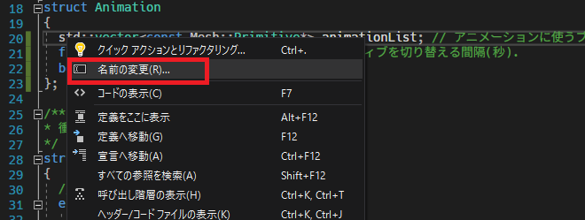
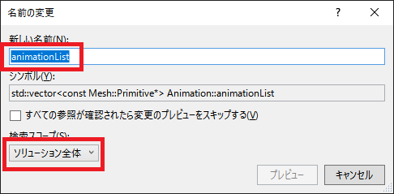
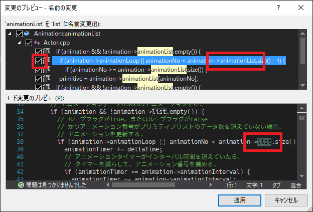
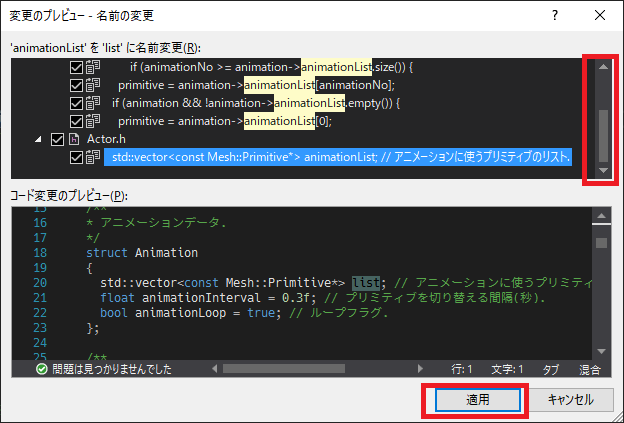
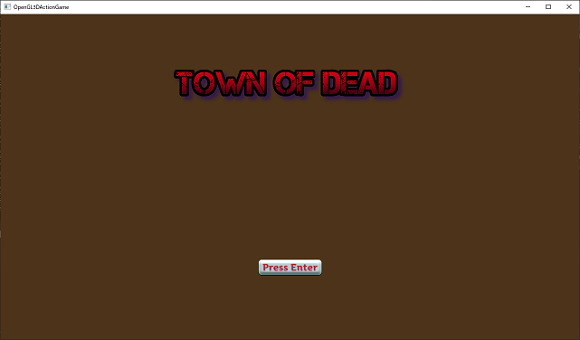

[OpenGL 3D 2020 第13回]

# ゲームクリアへの道

## 習得目標

* 共通のデータを別のクラスにまとめる方法。
* シングルトンの使い方。
* 同じことを何度も行うのを止めて1回で済ませる。
* キーが押された瞬間をとらえる方法。

第13回では今後の下準備として、描画に関する変数をまとめたり、アニメーションをもっと簡単に扱えるようにしていきます。

## 1. 共通のデータを別のクラスにまとめるには

### 1.1 データをまとめるためのクラスを作る

現在、プリミティブやシェーダ、サンプラといった**グラフィックスパイプラインに関わるデータ**は、シーンごとに新しく作成しています。

しかし、これらは全てのシーンで流用できるものがほとんどです。そこで、流用できるデータを独立したクラスに分離します。そして、全てのシーンがそのクラスのデータを使うようにしていきます。

ゲーム全体で使うデータなので、クラス名は`GameData`(ゲームデータ)としましょう。ソリューションエクスプローラーの`ソースファイル`を右クリックして「追加→新しい項目」を選択してください。そして、プロジェクトの`Src`フォルダに`GameData.h`というヘッダファイルを追加します。

追加した`GameData.h`を開き、まずはヘッダファイルをインクルードします。`GameData.h` に次のプログラムを追加してください。

```diff
+/**
+* @file GameData.h
+*/
+#ifndef GAMEDATA_H_INCLUDED
+#define GAMEDATA_H_INCLUDED
+#include "glad/glad.h"
+#include "Shader.h"
+#include "Mesh.h"
+#include "Texture.h"
+#include <GLFW/glfw3.h>
+#include <memory>
+#include <random>
+
+#endif // GAMEDATA_H_INCLUDED
```

これから作る`GameData`クラスには描画用のデータはだいたい全部関係するので、多くのヘッダファイルをインクルードする必要があります。

続いて、`GameData`クラスを定義します。`random`ヘッダのインクルード文の下に、次のプログラムを追加してください。

```diff
 #include <memory>
 #include <random>
+
+/**
+* ゲーム全体で使うデータ.
+*/
+class GameData
+{
+public:
+  // メンバ関数.
+  static GameData& Get();
+  bool Initialize(GLFWwindow*);
+
+  // 描画用のメンバ変数.
+  std::shared_ptr<Shader::Pipeline> pipeline3D;
+  std::shared_ptr<Shader::Pipeline> pipeline2D;
+  Mesh::PrimitiveBuffer primitiveBuffer;
+  Texture::Sampler sampler;
+
+  // 乱数生成用のメンバ変数.
+  std::mt19937 random;
+
+  // GLFWの機能を使うときに使う変数のコピー.
+  GLFWwindow* window = nullptr;
+
+private:
+  // 勝手にクラスの変数を作れないように、コンストラクタとデストラクタをprivateメンバにする.
+  GameData() = default;
+  ~GameData();
+
+  // クラスの変数をコピーできないように
+  // コピーコンストラクタとコピー代入演算子をdelete指定する.
+  GameData(const GameData&) = delete;
+  GameData& operator=(const GameData&) = delete;
+};

 #endif // GAMEDATA_H_INCLUDED
```

作成した`GameData`クラスにはこれまで作ってきたクラスと違う部分があります。それは、

>コンストラクタとデストラクタがプライベート指定されている

ことです。

コンストラクタをプライベートに指定すると、クラスの外側ではそのクラスの変数を作ることができなくなります。デストラクタをプライベートに指定すると、クラスの外側ではそのクラスの変数を破棄することができなくなります。

その結果、クラスのメンバ変数の中ではクラスの変数を作ったり破棄できますが、通常の関数では作ったり破棄できなくなります。もちろん、メンバ関数を実行するためには、そのクラスの変数が必要です。

「メンバ関数でなくてはクラスの変数を作れない」のに「クラスの変数がなくてはメンバ関数を実行できない」…。これでは堂々巡りで、クラスの変数を作ることはできないように思えます。

この問題は「スタティックメンバ関数」を使えば解決できます。

### 1.2 スタティックメンバ関数

メンバ関数の先頭に`static`キーワードを付けると、そのメンバ関数は「スタティックメンバ関数」になります。

スタティックメンバ関数の特徴は「クラスの変数がなくても実行できる」ことです。つまり、スタティックメンバ関数ならば「クラスの変数がなくてはメンバ関数を実行できない」という問題を回避できるわけです。

`GameData`クラスの場合、`Get`メンバ関数をスタティックメンバ関数にしています。`Get`メンバ関数がどうやってクラスの変数を作り、利用するのか？　それを解明するために、プロジェクトの`Src`フォルダに`GameData.cpp`というファイルを追加してください。

追加した`GameData.cpp`を開き、次のプログラムを追加してください。

```diff
+/**
+* @file GameData.cpp
+*/
+#include "GameData.h"
+#include <iostream>
+
+/**
+* GameDataクラスのシングルトン変数を取得する.
+*
+* @return GameDataクラスのシングルトン変数.
+*/
+GameData& GameData::Get()
+{
+  static GameData singleton;
+  return singleton;
+}
```

`Get`メンバ関数は、関数の中で`GameData`クラスのスタティック変数を定義しています。 `Get`はメンバ関数なので、プライベートなメンバ関数を使うことができるのです。

そして、定義したスタティックローカル変数の参照を返します。ここでも`static`が登場しています。ローカル変数に`static`を付けると、そのローカル変数はプログラム全体でひとつだけ定義され、関数が終了しても消えることはありません。

スタティックメンバ関数は「クラスの変数がなくても使える」という効果、スタティックローカル変数は「関数が終了しても使える」という効果があるわけです。

なお`static`を付けるのは「宣言」だけで、「定義」には付けられないので注意してください。

>**【キーワードには複数の意味がある】**<br>
>C++言語には`static`キーワードのように、使う場所によって異なる意味を持つキーワードがいくつか存在します。<br>
>代表的なのは`const`、`default`、`using`といったキーワードです。他には、`public`、`protected`、`private`も、「メンバの可視性」と「継承の関係性」という2つの用途で使われます。

### 1.3 シングルトン

`GameData`クラスが勝手にクラスの変数を作れないようにしているのは、`GameData`クラスの変数がいくつも作れてしまうとバグの元になるからです。

今後イベントのクリア状態などを`GameData`クラスに追加していく予定ですが、間違えて `GameData`クラスの変数を複数作ってしまうと、変数ごとにイベントのクリア状態が異なってしまいます。

この問題を避けるには、クラスの変数を複数作れないようにするのが確実です。そのため、 `GameData`クラスはコンストラクタとデストラクタをプライベート指定して、`Get`スタティックメンバ関数を通じて唯一の変数を参照するようにしているわけです。

このように、書き方の工夫によって、変数がプログラム全体でひとつだけしか存在しないことを保証することを「シングルトン」と言います。また、この仕組みを備えたクラスを「シングルトンクラス」と言います。

>**【シングルトンの意味】**<br>
>「シングルトン(`singleton`)」は、「単一の人や物」を表す英単語で、「ひとつ」を意味する「シングル(`single`)」に「ひとかたまりのもの」を表す接尾辞「トン(`-ton`)」を付けたものです。

### 1.4 Initializeメンバ関数を定義する

続いて`Initialize`(イニシャライズ)メンバ関数を定義します。グラフィックスパイプラインに関わる変数を作成することから始めます。`Get`メンバ関数の定義の下に、次のプログラムを追加してください。

```diff
   static GameData singleton;
   return singleton;
 }
+
+/**
+* ゲームデータを初期化する.
+*
+* @param window GLFWウィンドウへのポインタ.
+*
+* @retval true  初期化成功.
+* @retval false 初期化失敗.
+*/
+bool GameData::Initialize(GLFWwindow* window)
+{
+  std::cout << "[情報] ゲームデータの初期化を開始.\n";
+
+  // プリミティブバッファを作成.
+  if (!primitiveBuffer.Allocate(100'000, 400'000)) {
+    return false;
+  }
+  // パイプライン・オブジェクトを作成する.
+  pipeline3D = std::make_shared<Shader::Pipeline>(
+    "Res/FragmentLighting.vert", "Res/FragmentLighting.frag");
+  pipeline2D = std::make_shared<Shader::Pipeline>(
+    "Res/Simple.vert", "Res/Simple.frag");
+  if (!pipeline3D || !*pipeline3D || !pipeline2D || !*pipeline2D) {
+    return false;
+  }
+  // サンプラ・オブジェクトの初期設定をする.
+  sampler.SetWrapMode(GL_REPEAT);
+  sampler.SetFilter(GL_LINEAR);
+
+  std::cout << "[情報] ゲームデータの初期化を完了.\n";
+  return true;
+}
```

次にゲーム全体で使う変数を初期化します。サンプラオブジェクトを設定するプログラムの下に、次のプログラムを追加してください。

```diff
   sampler.SetWrapMode(GL_REPEAT);
   sampler.SetFilter(GL_LINEAR);
+
+  // ゲームデータ経由で使えるようにウィンドウ変数を保存.
+  this->window = window;
+  // 乱数を初期化.
+  random.seed(std::random_device{}());

   std::cout << "[情報] ゲームデータの初期化を完了.\n";
   return true;
```

最後にモデルデータを読み込みます。乱数を初期化するプログラムの下に、次のプログラムを追加してください。

```diff
   // 乱数を初期化.
   random.seed(std::random_device{}());
+
+  // モデルデータを読み込む.
+  primitiveBuffer.AddFromObjFile("Res/Ground.obj");
+  primitiveBuffer.AddFromObjFile("Res/Tree.obj");
+  primitiveBuffer.AddFromObjFile("Res/House.obj");
+  primitiveBuffer.AddFromObjFile("Res/Cube.obj");
+  primitiveBuffer.AddFromObjFile("Res/Plane.obj");
+  primitiveBuffer.AddFromObjFile("Res/Bullet.obj");
+  primitiveBuffer.AddFromObjFile("Res/zombie_male_walk_0.obj");
+  primitiveBuffer.AddFromObjFile("Res/zombie_male_walk_1.obj");
+  primitiveBuffer.AddFromObjFile("Res/zombie_male_walk_2.obj");
+  primitiveBuffer.AddFromObjFile("Res/zombie_male_walk_3.obj");
+  primitiveBuffer.AddFromObjFile("Res/zombie_male_walk_4.obj");
+  primitiveBuffer.AddFromObjFile("Res/zombie_male_walk_5.obj");
+  primitiveBuffer.AddFromObjFile("Res/zombie_male_down_0.obj");
+  primitiveBuffer.AddFromObjFile("Res/zombie_male_down_1.obj");
+  primitiveBuffer.AddFromObjFile("Res/zombie_male_down_2.obj");
+  primitiveBuffer.AddFromObjFile("Res/zombie_male_down_3.obj");
+  primitiveBuffer.AddFromObjFile("Res/player_male_idle_0.obj");

   std::cout << "[情報] ゲームデータの初期化を完了.\n";
   return true;
```

### 1.5 プリミティブ番号を移植する

プリミティブの管理には列挙型を使います。`MainGameScene`クラスの`PrimNo`をコピーして、`GameData.h`の`GameData`クラス定義に貼り付けてください。

```diff
   // メンバ関数.
   static GameData& Get();
   bool Initialize(GLFWwindow*);
+
+  // プリミティブ番号.
+  // プリミティブの読み込み順と一致させること.
+  enum PrimNo {
+    ground,
+    tree,
+    house,
+    cube,
+    plane,
+    zombie_male_walk_0,
+    zombie_male_walk_1,
+    zombie_male_walk_2,
+    zombie_male_walk_3,
+    zombie_male_walk_4,
+    zombie_male_walk_5,
+    zombie_male_down_0,
+    zombie_male_down_1,
+    zombie_male_down_2,
+    zombie_male_down_3,
+    player_idle_0,
+    bullet,
+  };

   // 描画用のメンバ変数.
   std::shared_ptr<Shader::Pipeline> pipeline3D;
   std::shared_ptr<Shader::Pipeline> pipeline2D;
```

### 1.6 デストラクタを定義する

最後にテストラクタを定義します。`Initialize`メンバ関数の定義の下に、次のプログラムを追加してください。

```diff
   std::cout << "[情報] ゲームデータの初期化を完了.\n";
   return true;
 }
+
+/**
+* デストラクタ.
+*/
+GameData::~GameData()
+{
+  std::cout << "[情報] ゲームデータを破棄.\n";
+}
```

デストラクタでは、デバッグ用にゲームデータが破棄されたことを出力します。

これで`GameData`クラスは完成です。

>**【基本は参照を使い、ポインタ操作が必要な場合だけポインタを使う】**<br>
>C言語では、GameDataクラスのように関数を通じて変数を取得する場合、戻り値は「ポインタ」を使います。しかしC++言語では、多くの場合に「参照」を使います。なぜなら、「ポインタより参照のほうが、できる操作が少ない」からです。<br>
>できる操作が少なければ、プログラムを書くときに考えなければならないことも少なくなります。その結果、読みやすく、書きやすく、さらにエラーの起きにくいプログラムが作れるのです。

<div style="page-break-after: always"></div>

## 2. GameDataクラスを使う

### 2.1 GameDataを初期化する

以下の手順で、`GameData`を使って既存の描画用変数を置き換えていきます。

>1. `GameData`を初期化する.
>2. タイトル画面のヘッダファイルから、描画用の変数を削除する。
>3. タイトル画面のCPPファイルに`GameData.h`をインクルードする。
>4. タイトル画面のエラーになっている箇所を、`GameData`クラスの変数で置き換える。
>5. メインゲーム画面のヘッダファイルから、描画用の変数を削除する。
>6. メインゲーム画面のCPPファイルに`GameData.h`をインクルードする。
>7. メインゲーム画面のエラーになっている箇所を、`GameData`クラスの変数で置き換える。

とにかく、`GameData`クラスの変数を初期化しないことには話が進みません。全てのシーンで使うので、最初のシーンの起動より前に初期化しておく必要があります。まず`Main.cpp`を開き、ヘッダファイルをインクルードします。

```diff
 #include <glad/glad.h>
 #include "GLContext.h"
 #include "SceneManager.h"
+#include "GameData.h"
 #include <GLFW/glfw3.h>
 #include <string>
```

そして、`main`関数に次のプログラムを追加してください。

```diff
   glDebugMessageCallback(DebugCallback, nullptr);
+
+  // ゲーム全体で使うデータを初期化する.
+  GameData& gamedata = GameData::Get();
+  if (!gamedata.Initialize(window)) {
+    return 1;
+  }

   // 最初に実行するシーンを指定する.
   SceneManager& sceneManager = SceneManager::Get();
   sceneManager.ChangeScene(SCENENAME_TITLE);
```

### 2.2 タイトル画面の描画用変数を削除する

それでは、タイトル画面から変更しましょう。削除するのは`GameData`クラスに定義した `PrimitiveBuffer`、`Sampler`、`Pipeline`の3つです。`TitleScene.h`を開き、 `TitleScene`クラスの定義から描画用のメンバ変数を削除してください。

```diff
   void Finalize();

 private:
-  Mesh::PrimitiveBuffer primitiveBuffer;
-  Texture::Sampler sampler;
-  std::shared_ptr<Shader::Pipeline> pipeline;
-
   std::shared_ptr<Texture::Image2D> texLogo;
   std::shared_ptr<Texture::Image2D> texPressEnter;
```

削除したメンバ変数の役割は、`GameData`クラスの変数が引きつぐことになります。

### 2.3 タイトル画面のCPPファイルにGameData.hをインクルードする

次に`GameData.h`をインクルードします。`TitleScene.cpp`を開き、次のプログラムを追加してください。

```diff
 * @file TitleScene.cpp
 */
 #include "TitleScene.h"
+#include "GameData.h"
 #include <glm/gtc/matrix_transform.hpp>
 #include <iostream>
```

これで`TitleScene.cpp`の中で`GameData`クラスの変数が使えるようになりました。

### 2.4 タイトル画面のエラーになっている箇所をGameDataクラスの変数で置き換える

続いて、`Initialize`メンバ関数から、削除した変数を初期化するプログラムを消去します。`Initialize`メンバ関数を次のように変更してください。

```diff
 bool TitleScene::Initialize()
 {
-  // プリミティブバッファにモデルデータを読み込む.
-  if (!primitiveBuffer.Allocate(20'000, 80'000)) {
-    return false;
-  }
-  primitiveBuffer.AddFromObjFile("Res/Plane.obj");
-
-  // パイプライン・オブジェクトを作成する.
-  pipeline = std::make_shared<Shader::Pipeline>(
-    "Res/Simple.vert", "Res/Simple.frag");
-  if (!pipeline) {
-    return false;
-  }
-
-  // サンプラ・オブジェクトを作成する.
-  sampler.SetWrapMode(GL_CLAMP_TO_EDGE);
-  sampler.SetFilter(GL_LINEAR);
-
   // テクスチャを読み込む.
   texLogo = std::make_shared<Texture::Image2D>("Res/TitleLogo.tga");
```

そして、`Render`メンバ関数を`GameData`クラスを使うように変更します。`Render`メンバ関数に次のプログラムを追加してください。

```diff
   const glm::mat4 matView =
     glm::lookAt(glm::vec3(0, 0, 100), glm::vec3(0), glm::vec3(0, 1, 0));
+
+  // ゲームデータ変数を取得.
+  GameData& gamedata = GameData::Get();
+  Mesh::PrimitiveBuffer& primitiveBuffer = gamedata.primitiveBuffer;
+  std::shared_ptr<Shader::Pipeline> pipeline = gamedata.pipeline2D;
+  Texture::Sampler& sampler = gamedata.sampler;

   primitiveBuffer.BindVertexArray(); // VAOをバインド.
   pipeline->Bind(); // パイプラインをバインド.
   sampler.Bind(0); // サンプラをバインド.
```

ただ、元々タイトル画面で最初に読み込んでいた`Plane.obj`は、`GameData`クラスでは4番目のプリミティブに当たりますから、このままでは2D画像の表示がおかしくなってしまいます。

そこで、プリミティブ番号を適切な値に変更しましょう。`Render`メンバ関数の画像描画プログラムを、次のように修正してください。

```diff
     const glm::mat4 matMVP = matProj * matView * matModelT * matModelS;
     pipeline->SetMVP(matMVP);
     texLogo->Bind(0);
-    primitiveBuffer.Get(0).Draw();
+    primitiveBuffer.Get(GameData::PrimNo::plane).Draw();
   }

   // PressEnterを描画.
   {
     const glm::mat4 matModelT = glm::translate(glm::mat4(1), glm::vec3(0, -200, 0));
     const glm::mat4 matModelS = glm::scale(glm::mat4(1),
       glm::vec3(texPressEnter->Width(), texPressEnter->Height(), 1));
     const glm::mat4 matMVP = matProj * matView * matModelT * matModelS;
     pipeline->SetMVP(matMVP);
     texPressEnter->Bind(0);
-    primitiveBuffer.Get(0).Draw();
+    primitiveBuffer.Get(GameData::PrimNo::plane).Draw();
   }
```

これでタイトル画面は`GameData`クラスを使って表示されるようになります。プログラムが書けたらビルドして実行してください。問題なくタイトル画面が表示されたら成功です。

### 2.5 メインゲーム画面の描画用の変数を削除する

タイトル画面と同じ要領で、メインゲーム画面の描画用メンバ変数も`GameData`クラスの変数に置き換えましょう。タイトル画面と同様に、 `PrimitiveBuffer` 、 `Sampler` 、 `Pipeline` の3つを削除します。

`MainGameScene.h`を開き、`MainGameScene`クラスを次のように変更してください。

```diff
   void Finalize();

 private:
-  Mesh::PrimitiveBuffer primitiveBuffer;
-  Texture::Sampler sampler;
-  std::shared_ptr<Shader::Pipeline> pipeline;
   std::shared_ptr<Texture::Image2D> texGround;
   std::shared_ptr<Texture::Image2D> texTree;
```

### 2.6 メインゲーム画面のCPPファイルにGameData.hをインクルードする

`MainGameScene.cpp`を開き、次のように`GameData.h`をインクルードしてください。

```diff
 * @file MainGameScene.cpp
 */
 #include "MainGameScene.h"
+#include "GameData.h"
 #include <glm/gtc/matrix_transform.hpp>
 #include <iostream>
 #include <random>
```

### 2.7 メインゲーム画面のエラーになっている箇所を<br>GameDataクラスの変数で置き換える(Initializeメンバ関数編)

`Initialize`メンバ関数から、削除したメンバ変数に関する行を消していきます。

```diff
 bool MainGameScene::Initialize()
 {
-  if (!primitiveBuffer.Allocate(20'000, 80'000)) {
-    return 1;
-  }
-  primitiveBuffer.Add(std::size(posGround), posGround, colGround, tcGround,
-    std::size(indexGround), indexGround);
-  primitiveBuffer.AddFromObjFile("Res/Ground.obj");
-  primitiveBuffer.AddFromObjFile("Res/Tree.obj");
-  primitiveBuffer.AddFromObjFile("Res/House.obj");
-        ・
-        ・
-    (長いので省略。省略されている範囲も削除すること)
-        ・
-        ・
-  if (!sampler) {
-    return 1;
-  }
-  sampler.SetWrapMode(GL_REPEAT);
-  sampler.SetFilter(GL_NEAREST);

   const GLuint texGround =
     GLContext::CreateImage2D(imageWidth, imageHeight, imageGround);
```

それから、削除した`primitiveBuffer`メンバ変数を使っているプログラムを修正します。 `Initialize`メンバ関数のプレイヤーアクターを作成するプログラムを、次のように変更してください。

```diff
   // プレイヤーアクターを作成.
   playerActor = std::make_shared<Actor>(
     "player",
-    &primitiveBuffer.Get(PrimNo::player_idle_0),
+    &GameData::Get().primitiveBuffer.Get(PrimNo::player_idle_0),
     texPlayer, glm::vec3(10, 0, 10));
   // 垂直円柱型の衝突判定を設定.
   playerActor->SetCylinderCollision(1.7f, 0.0f, 0.25f);
```

<pre class="tnmai_assignment">
<strong>【課題01】</strong>
ゾンビアクターを作成するプログラムでも<code>primitiveBuffer</code>メンバ変数を使っています。プレイヤーアクターの変更を参考にして、<code>GameData</code>のメンバ変数を使うように修正しなさい。
</pre>

`Initialize`メンバ関数ではもう一箇所、ゾンビアクターの衝突解決関数の中で `primitiveBuffer`メンバ関数を使っています。この部分を、次のように`GameData`クラスのメンバ変数を使うように修正してください。

```diff
     actor->SetCylinderCollision(1.6f, 0.0f, 0.3f);
     // 衝突処理を設定.
     actor->OnHit = [](Actor& a, Actor& b, void* option) {
-      // option変数からプリミティブバッファ変数を取得.
-      MainGameScene* scene = static_cast<MainGameScene*>(option);
-      Mesh::PrimitiveBuffer& primitiveBuffer = scene->primitiveBuffer;
+      // GameDataクラスのプリミティブバッファ変数を取得.
+      Mesh::PrimitiveBuffer& primitiveBuffer = GameData::Get().primitiveBuffer;
       // ゾンビと弾丸の衝突だった場合
       if (a.name == "zombie" && b.name == "bullet") {
         // 死亡アニメーションデータを作成.
```

### 2.8 メインゲーム画面のエラーになっている箇所を<br>GameDataクラスの変数で置き換える(ProcessInputメンバ関数編)

次は`ProcessInput`メンバ関数のエラーに対処します。弾丸アクターを作成するプログラムを次のように変更してください。

```diff
     const glm::vec3 position =
       playerActor->position + front * 0.6f + right * 0.2f + glm::vec3(0, 0.9f, 0);

     // 弾丸アクターを銃口の位置に作成.
+    Mesh::PrimitiveBuffer& primitiveBuffer = GameData::Get().primitiveBuffer;
     std::shared_ptr<Actor> bullet = std::make_shared<Actor>("bullet",
       &primitiveBuffer.Get(PrimNo::bullet), texBullet, position);

     // 向き(回転)はプレイヤーアクターを継承.
```

もう分かってきたと思いますが、「`GameData`クラスの変数を使うように変更する」という作業は「削除したメンバ変数を、同等の機能を持つ`GameData`クラスの変数への**参照**で置き換える」ことを意味します。

>**【変数と参照は相互に置き換えられる】**<br>
>このように「ある機能を担当していた変数を、外部にある別の変数で置き換える」場合、「参照」を使うと簡単に置き換えることができます。参照は「変数と同じ構文が使える」ように設計されているからです。そのため、あまり使う機会はないと思いますが、「参照を変数で置き換える」ことも可能です。

### 2.9 メインゲーム画面のエラーになっている箇所を<br>GameDataクラスの変数で置き換える(Renderメンバ関数編)

最後に、`Render`メンバ関数を`GameData`クラスの変数を使うように変更します。 `Render` メンバ関数の先頭に、次のプログラムを追加してください。

```diff
 void MainGameScene::Render()
 {
+
+  // ゲームデータ変数を取得.
+  GameData& gamedata = GameData::Get();
+  Mesh::PrimitiveBuffer& primitiveBuffer = gamedata.primitiveBuffer;
+  std::shared_ptr<Shader::Pipeline> pipeline = gamedata.pipeline3D;
+  Texture::Sampler& sampler = gamedata.sampler;

   glEnable(GL_DEPTH_TEST);
   glEnable(GL_CULL_FACE);
   glClearColor(0.1f, 0.3f, 0.5f, 1.0f);
```

上記のプログラムにおいて、`pipeline`変数だけは**参照**ではなく**通常の変数**を使っています。ポインタは参照と同じく、元となる変数を指し示すための型だからです。

>**【ポインタ変数・参照変数はそのまま置き換えられる】**<br>
>ポインタ型や参照型は、それらは指している(元になる)変数のアドレスを格納しているだけです。そのため、ローカル変数などに置き換え先の変数のアドレスを代入するだけで置き換えられます。

### 2.10 PrimNoをGameData::PrimNoで置き換える

`MainGameScene`クラスにもプリミティブ番号は定義していますが、`GameData`のプリミティブ番号とは一致しません。

そこで、まず`MainGameScene`クラスから`PrimNo`を削除し、エラーが起きている部分を `GameData::PrimNo`で置き換えます。`MainGameScene.h`を開き、`MainGameScene` クラスの `PrimNo`列挙型を削除してください。

```diff
   ActorList actors; // アクター配列.
   ActorPtr playerActor; // プレイヤーアクター.
-
-  // プリミティブ番号.
-  // プリミティブの読み込み順と一致させること.
-  enum PrimNo {
-    ground,
-    tree,
-    house,
-    cube,
-    zombie_male_walk_0,
-    zombie_male_walk_1,
-    zombie_male_walk_2,
-    zombie_male_walk_3,
-    zombie_male_walk_4,
-    zombie_male_walk_5,
-    zombie_male_down_0,
-    zombie_male_down_1,
-    zombie_male_down_2,
-    zombie_male_down_3,
-    player_idle_0,
-    bullet,
-  };
 };
```

`PrimNo`列挙型を削除したら、次はCPPファイルの`PrimNo`を`GameData::PrimNo`で置き換えていきます。`MainGameScene.cpp`を開き、`Intialize`メンバ関数のプレイヤーのプリミティブ番号を、次のように変更してください。

```diff
   // プレイヤーアクターを作成.
   playerActor = std::make_shared<Actor>(
-    &GameData::Get().primitiveBuffer.Get(PrimNo::player_idle_0),
+    &GameData::Get().primitiveBuffer.Get(GameData::PrimNo::player_idle_0),
     texPlayer, glm::vec3(10, 0, 10));
   // 作成したプレイヤーアクターを、アクターリストに追加.
   actors.push_back(player);
```

<pre class="tnmai_assignment">
<strong>【課題02】</strong>
他にも削除した<code>PrimNo</code>を使っているプログラムがたくさんあるはずです。それら全てを<code>GameData::PrimNo</code>で置き換えなさい。
</pre>

課題02が完了したら、ビルドして実行してください。問題なくメインゲーム画面が動作したら成功です。

<div style="page-break-after: always"></div>

## 3. アニメーションデータ

### 3.1 アニメーションデータ型を定義する

アニメーションを設定するたびに配列を定義するのは面倒ですし、作成やコピーには時間がかかります。また、アニメーションデータは一度作成したら、そのあと変更することはありません。さらに、同じデータを頻繁に利用します。

このようなデータの場合、事前にデータを作成しておくことで、作成やコピーにかかる時間を減らすことができます。

今回はアニメーションに関するデータをまとめる構造体を定義し、アクターにはその構造体へのポインタを持たせるようにします。ポインタを使うことでデータのコピーはなくなります。

アニメーションデータの作成は`GameData`を初期化するときに行えばいいでしょう。

それでは、アニメーションデータ用の構造体を定義するところからはじめましょう。この構造体は主にアクタークラスが利用するものなので、`Actor.h`に定義するのが妥当でしょう。<br>`Actor.h`を開き、アニメーションデータ構造体を追加してください。

```diff
 #include <memory>
 #include <vector>
 #include <string>
+
+/**
+* アニメーションデータ.
+*/
+struct Animation
+{
+};

 /**
 * 衝突判定.
```

まだメンバがひとつもありませんが、とりあえずアクタークラスにこの構造体を扱うためのポインタを追加します。`Actor`クラスの定義に次のプログラムを追加してください。

```diff
   glm::vec3 scale = glm::vec3(1); // アクターの大きさ.
   glm::vec3 velocity = glm::vec3(0); // アクターの移動速度.

   // アニメーション用データ.
+  std::shared_ptr<Animation> animation; // アニメデータ.
   std::vector<const Mesh::Primitive*> animationList; // アニメデータ.
   size_t animationNo = 0; // 表示するプリミティブの番号.
   float animationTimer = 0; // プリミティブ切り替えタイマー(秒).
```

`Animation`構造体にはどんなメンバ変数があればよいでしょう。既にアニメーションを扱っているアクタークラスには、以下のアニメーション用メンバ変数が定義されています。

| メンバ変数名                                                       | 内容                                 | Update関数で変更するか |
|:-------------------------------------------------------------------|:-------------------------------------|:----------------------:|
| <ruby>animationList<rt>アニメーション リスト</rt></ruby>           | 表示順に並べられたプリミティブの配列 | ✕                     |
| <ruby>animationNo<rt>アニメーション ナンバー</rt></ruby>           | 表示するプリミティブの番号           | ○                     |
| <ruby>animationTimer<rt>アニメーション タイマー</rt></ruby>        | プリミティブ切り替えタイマー         | ○                     |
| <ruby>animationInterval<rt>アニメーション インターバル</rt></ruby> | プリミティブを切り替える間隔         | ✕                     |
| <ruby>animationLoop<rt>アニメーション ループ</rt></ruby>           | ループフラグ                         | ✕                     |

これらのデータのいくつかは、最初に設定したらそれ以降は変更しません。アクタークラスのメンバ変数の更新は、主に`Update`メンバ関数で行われます。

<pre class="tnmai_assignment">
<strong>【課題03】</strong>
<code>Update</code>メンバ関数を調べて、上記の表の「Updateメンバ関数で変更する？」の空欄を埋めなさい。値が変更されているメンバ変数には○、変更されないメンバ変数には✕を書きなさい。
</pre>

`Update`メンバ関数で変更しないデータ(✕を付けたメンバ変数)は、アクタークラスで管理する必要性が薄いと考えられます。そのため、変更しないデータは`Animation`構造体に移すことができます。

<pre class="tnmai_assignment">
<strong>【課題04】</strong>
<code>Actor</code>クラスから、<code>Update</code>メンバ関数で変更しないアニメーション用のメンバ変数を切り取って、<code>Animation</code>構造体に貼り付けなさい。これを、全ての変更しないアニメーション用のメンバ変数に対して行いなさい。
</pre>

課題04を終えた段階で、`Animation`クラスと`Actor`クラスは以下のような状態になっていると思います。

【Animationクラス】

```c++
struct Animation
{
  std::vector<const Mesh::Primitive*> animationList; // アニメデータ.
  float animationInterval = 0.3f; // プリミティブを切り替える間隔(秒).
  bool animationLoop = true;    // ループフラグ.
};

/**
* 衝突判定.
```

【Actorクラス】

```c++
   glm::vec3 scale = glm::vec3(1); // アクターの大きさ.
   glm::vec3 velocity = glm::vec3(0); // アクターの移動速度.

   // アニメーション用データ.
   std::shared_ptr<Animation> animation; // アニメデータ.
   size_t animationNo = 0; // 表示するプリミティブの番号.
   float animationTimer = 0; // プリミティブ切り替えタイマー(秒).

  // 衝突判定用の変数.
  Collision collision;
```

`Actor`クラスに`animationNo`と`animationTimer`の2つのメンバ変数が残っていて、 `animationList`、`animationInterval`、`animationLoop`の3つが`Animation`構造体へ移動していれば、「新しい値が代入される変数」と「元の値が維持される変数」を見分けることができているといえるでしょう。

### 3.2 アニメーション更新処理をAnimation構造体に対応させる

アクターのアニメーション用変数を`Animation`構造体へのポインタで置き換えたことで、 `Actor.cpp`にエラーが発生しているはずです。これを修正しましょう。`Actor.cpp`を開き、`Update`メンバ関数を次のように変更してください。

```diff
 void Actor::Update(float deltaTime)
 {
   // 座標を更新.
   position += velocity * deltaTime;

   // アニメーションデータがあればアニメーションする.
-  if (!animationList.empty()) {
+  if (animation && !animation->animationList.empty()) {
     // ループ再生が有効、またはアニメーション番号がデータの最後より小さい場合、
     // アニメーションを更新する.
-    if (animationLoop || animationNo < animationList.size() - 1) {
+    if (animation->animationLoop ||
+      animationNo < animation->animationList.size() - 1) {
       animationTimer += deltaTime; // タイマーを進める.
       // タイマーがインターバル以上になったらアニメーション番号を進める.
-      if (animationTimer >= animationInterval) {
-        animationTimer -= animationInterval; // タイマーを戻す.
+      if (animationTimer >= animation->animationInterval) {
+        animationTimer -= animation->animationInterval; // タイマーを戻す.
         ++animationNo;
         // アニメーション番号がデータの最後を超えたら0に戻す.
-        if (animationNo >= animationList.size()) {
+        if (animationNo >= animation->animationList.size()) {
           animationNo = 0;
         }
         // 表示するプリミティブを更新.
-        primitive = animationList[animationNo];
+        primitive = animation->animationList[animationNo];
       }
     }
   }
 }
```

### 3.3 アニメーション設定関数をAnimation構造体に対応させる

さらに、アニメーションを設定する`SetAnimation`メンバ関数も`Animation`構造体に対応させる必要があります。まず引数として`Animation`構造体のポインタを受け取るように変更します。`Actor.h`を開き、`SetAnimation`メンバ関数の宣言を次のように変更してください。

```diff
   void SetCylinderCollision(float top, float bottom, float radius);

   // アニメーションの設定
   void SetAnimation(
-    const std::vector<const Mesh::Primitive*>& animeList,
-    float interval, bool loop);
+    std::shared_ptr<Animation> animation);

   std::string name; // アクターの名前.

   const Mesh::Primitive* primitive = nullptr;
```

続いて`Actor.cpp`を開き、`SetAnimation`メンバ関数を次のように変更してください。

```diff
 * アニメーションを設定する.
 *
-* @param animeList アニメーションデータの配列.
-* @param interval  アニメーション間隔.
-* @param loop      ループ再生の有無(ループする=true ループしない=false).
+* @param animation アニメーションデータへのポインタ.
 */
 void Actor::SetAnimation(
-  const std::vector<const Mesh::Primitive*>& animeList,
-  float interval, bool loop)
+  std::shared_ptr<Animation> animation
 {
-  animationList = animeList;
+  this->animation = animation;
   animationNo = 0;
   animationTimer = 0;
-  animationInterval = interval;
-  animationLoop = loop;
-  primitive = animationList[0];
+  if (animation && !animation->animationList.empty()) {
+    primitive = animation->animationList[0];
+  }
 }

 /**
 * アクターリストを更新する.
```

これでアクタークラスは`Animation`構造体を使うようになりました。

### 3.4 「名前の変更」機能を使う

`Animation`構造体のメンバ変数は全て`animation`という単語が入っています。これは、 `Actor` クラスにメンバ変数を定義したとき、その変数がアニメーションに関するものであることを示すためのものでした。

しかし、すでに構造体に`Animation`という名前がついてるのですから、もうメンバ変数の名前に `animation`が付いている必要はありませんよね。

そこで、これらの変数名から`animation`という単語を削除します。つまり`animationList` を `list` に、`animationInterval`を`interval`にするわけです。

ただ、こういった名前の変更を手作業でやるのは大変面倒です。幸い、Visual Studioには変数名を簡単に変更できるツールがあります。

`Actor.h`を開き、`animationList`メンバ変数を右クリックしてください。すると以下のようなメニューが表示されます。この中の「名前の変更」を使うと、プログラムで使っている名前を簡単に変えられます。

<p align="center">
<br>
</p>

それでは「名前の変更」をクリックしてください。今度は次のようなウィンドウが開きます。

<p align="center">
<br>
</p>

まず、左下のボタンが「ソリューション全体」になっていることを確認します。よく似た「ソリューション全体(外部アイテム含む)」は選ばないでください。「外部アイテム」はプロジェクトに追加していないファイルのことだからです。

次に、「新しい名前」の部分には現在のメンバ変数名が表示されています。ここに新しい名前を入れます。`animationList`を`list`(Lは小文字)に変更してください。すると右下の「プレビュー」ボタンが押せるようになります。

<p align="center">
<br>
</p>

名前を変更したら「プレビュー」をクリックしてください。すると次の「プレビューウィンドウ」に切り替わります。

<p align="center">
<br>
</p>

上段の「'animationList'を'list'に名前変更」ウィンドウには、変更候補となる行がリストアップされます。それぞれの行の左端にはチェックボックスがあり、チェックが入っている行の名前だけが変更されます。行をクリックすると、下段でその行の変更後の状態を確認できます。

矢印キーの上下か、水際のスクロールバーを使って、全ての変更を確認してください。変更すべき行にチェックがなかったら、チェックボックスをクリックしてチェックを入れてください。変更すべきでない行にチェックが入っていたらチェックを外してください。

間違えて変更した場合、`Ctrl+Z`で元の戻すことができます。しかし、名前変更のあとで書いたプログラムももとに戻さなくてはなりません。それはとても面倒なので、最初にしっかり確認しておくことです。

<p align="center">
<br>
</p>

すべての変更を確認し、問題がなければ「適用」(てきよう)ボタンをクリックしてください。そうすると、実際に名前が変更されます。

<pre class="tnmai_assignment">
<strong>【課題05】</strong>
「名前の変更」機能を使って<code>animationInterval</code>を<code>interval</code>に変更しなさい。
</pre>

<pre class="tnmai_assignment">
<strong>【課題06】</strong>
「名前の変更」機能を使って<code>animationLoop</code>を<code>isLoop</code>に変更しなさい。
</pre>

>**【名前を変更する時はファイル名に注意！】**<br>
>Visual Studioは完璧ではないので、プレビューウィンドウに「確かに名前は一致しているけれど全く無関係な行」が混ざっていることがあります。そうした全く関係ない行は、全く関係ないファイルに書かれていることが多いです。<br>
>上段をよく見ると、変更候補が含まれているファイルが表示されています。もし無関係と思われるファイルが表示されていたら、誤って変更しないようにチェックを外しましょう。

### 3.5 アニメーションデータを作成する

`Animation`構造体を使ったアニメーションデータは、好きなときに参照できるように`GameData`クラスに管理させるのがよいでしょう。`GameData.h`を開き、`Actor.h`をインクルードしてください。

```diff
 #include "Shader.h"
 #include "Mesh.h"
 #include "Texture.h"
+#include "Actor.h"
 #include <GLFW/glfw3.h>
 #include <memory>
```

次に、アニメーションデータ用変数を`GameData`クラスに追加します。とりあえずゾンビの歩行アニメと死亡アニメを追加しましょう。

変数名は、「歩行」は`anmZombieMaleWalk`(エーエヌエム・ゾンビ・メール・ウォーク)、「死亡」は`anmZombieMaleDown`(エーエヌエム・ゾンビ・メール・ダウン)とします。 `GameData`クラスの定義に次のプログラムを追加してください。

```diff
     player_idle_0,
     bullet,
   };
+
+  // アニメーションデータ.
+  std::shared_ptr<Animation> anmZombieMaleWalk; // ゾンビ男(歩行)
+  std::shared_ptr<Animation> anmZombieMaleDown; // ゾンビ男(死亡)

   // 描画用のメンバ変数.
   std::shared_ptr<Shader::Pipeline> pipeline3D;
   std::shared_ptr<Shader::Pipeline> pipeline2D;
```

>**【amnはanimationの短縮形】**<br>
>`anm`(エーエヌエム)は`animation`(アニメーション)を短縮したもので、その変数がアニメーションデータであることを表すために付けています。

それではアニメーションデータを作成しましょう。`GameData.cpp`を開き、`Initialize`メンバ関数に次のプログラムを追加してください。

```diff
   primitiveBuffer.AddFromObjFile("Res/zombie_male_down_2.obj");
   primitiveBuffer.AddFromObjFile("Res/zombie_male_down_3.obj");
   primitiveBuffer.AddFromObjFile("Res/player_male_idle_0.obj");
+
+  // アニメーションデータを作成.
+
+  // ゾンビ男(歩行)
+  anmZombieMaleWalk = std::make_shared<Animation>();
+  anmZombieMaleWalk->list.push_back(&primitiveBuffer.Get(PrimNo::zombie_male_walk_0));
+  anmZombieMaleWalk->list.push_back(&primitiveBuffer.Get(PrimNo::zombie_male_walk_1));
+  anmZombieMaleWalk->list.push_back(&primitiveBuffer.Get(PrimNo::zombie_male_walk_2));
+  anmZombieMaleWalk->list.push_back(&primitiveBuffer.Get(PrimNo::zombie_male_walk_3));
+  anmZombieMaleWalk->list.push_back(&primitiveBuffer.Get(PrimNo::zombie_male_walk_4));
+  anmZombieMaleWalk->list.push_back(&primitiveBuffer.Get(PrimNo::zombie_male_walk_5));
+  anmZombieMaleWalk->interval = 0.2f;

   std::cout << "[情報] ゲームデータの初期化を完了.\n";
   return true;
 }
```

同様にして「ゾンビ男(死亡)」アニメーションデータを作ります。ゾンビ男(歩行)アニメーションデータを作成するプログラムの下に、次のプログラムを追加してください。

```diff
   anmZombieMaleWalk->list.push_back(&primitiveBuffer.Get(PrimNo::zombie_male_walk_4));
   anmZombieMaleWalk->list.push_back(&primitiveBuffer.Get(PrimNo::zombie_male_walk_5));
   anmZombieMaleWalk->interval = 0.2f;
+
+  // ゾンビ男(死亡)
+  anmZombieMaleDown = std::make_shared<Animation>();
+  anmZombieMaleDown->list.push_back(&primitiveBuffer.Get(PrimNo::zombie_male_down_0));
+  anmZombieMaleDown->list.push_back(&primitiveBuffer.Get(PrimNo::zombie_male_down_1));
+  anmZombieMaleDown->list.push_back(&primitiveBuffer.Get(PrimNo::zombie_male_down_2));
+  anmZombieMaleDown->list.push_back(&primitiveBuffer.Get(PrimNo::zombie_male_down_3));
+  anmZombieMaleDown->interval = 0.125f;
+  anmZombieMaleDown->isLoop = false;

   std::cout << "[情報] ゲームデータの初期化を完了.\n";
   return true;
```

<pre class="tnmai_assignment">
<strong>【課題07】</strong>
ゾンビのアニメーションデータの作成を参考に、プレイヤーの待機アニメーションと走りアニメーションを作成しなさい。待機アニメーションの変数名は<code>anmPlayerIdle</code>、走りアニメーションの変数名は<code>anmPlayerRun</code>とすること。アニメーションに必要なOBJファイル名とダウンロードURLは以下のとおりです。

待機アニメ: player_male_idle_0.obj ～ player_male_idle_2.obj
走りアニメ: player_male_run_0.obj ～ player_male_run_5.obj

URL: <code>https://github.com/tn-mai/OpenGL3D2020/tree/master/Res</code>

待機アニメは0,1,2,1の順にアニメーションさせてください。インターバルには自分の目で見たとき、それらしく見えるような値を設定してください。
</pre>

### 3.6 アクターにアニメーションを設定する

作成したアニメーションデータをゾンビアクターに設定します。まずメインゲーム画面のアニメーション作成プログラムを削除します。`MainGameScene.cpp`を開き、ゾンビアクターを作成するプログラムから、次の部分を削除してください。

```diff
   actors.push_back(player);

   // ゾンビアクターを作成.
-  std::vector<const Mesh::Primitive*> animeList;
-  animeList.push_back(&GameData::Get().primitiveBuffer.Get(PrimNo::zombie_male_walk_0));
-  animeList.push_back(&GameData::Get().primitiveBuffer.Get(PrimNo::zombie_male_walk_1));
-  animeList.push_back(&GameData::Get().primitiveBuffer.Get(PrimNo::zombie_male_walk_2));
-  animeList.push_back(&GameData::Get().primitiveBuffer.Get(PrimNo::zombie_male_walk_3));
-  animeList.push_back(&GameData::Get().primitiveBuffer.Get(PrimNo::zombie_male_walk_4));
-  animeList.push_back(&GameData::Get().primitiveBuffer.Get(PrimNo::zombie_male_walk_5));
   const Mesh::Primitive* pPrimitive = &GameData::Get().primitiveBuffer.Get(4);
   for (size_t i = 0; i < 100; ++i) {
```

次に、`GameData`クラスの歩行アニメーションデータをゾンビアクターに設定します。歩行アニメーションを設定するプログラムを、次のように変更してください。

```diff
     actor->rotation.y =
       std::uniform_real_distribution<float>(0, glm::radians(360.0f))(random);
     // アクターのアニメーションを設定.
-    actor->SetAnimation(animeList, 0.2f, true);
+    actor->SetAnimation(GameData::Get().anmZombieMaleWalk);
     // 作成したアクターを、アクターリストに追加.
     actors.push_back(actor);
   }
```

同じようにして、ゾンビの死亡アニメーションも`GameData`クラスのアニメーションデータを使うように変更しましょう。ゾンビの衝突処理関数を次のように変更してください。

```diff
     // 衝突処理を設定.
     actor->OnHit = [](Actor& a, Actor& b, void* option) {
-      // GameDataクラスのプリミティブバッファ変数を取得.
-      Mesh::PrimitiveBuffer& primitiveBuffer = GameData::Get().primitiveBuffer;
       // ゾンビと弾丸の衝突だった場合
       if (a.name == "zombie" && b.name == "bullet") {
-        // 死亡アニメーションデータを作成.
-        std::vector<const Mesh::Primitive*> animeList;
-        animeList.push_back(&primitiveBuffer.Get(PrimNo::zombie_male_down_0));
-        animeList.push_back(&primitiveBuffer.Get(PrimNo::zombie_male_down_1));
-        animeList.push_back(&primitiveBuffer.Get(PrimNo::zombie_male_down_2));
-        animeList.push_back(&primitiveBuffer.Get(PrimNo::zombie_male_down_3));

         // 死亡アニメーションを設定.
-        a.SetAnimation(animeList, 0.125f, false);
+        a.SetAnimation(GameData::Get().anmZombieMaleDown);

         // 衝突判定を無くす.
         a.collision.shape = Collision::Shape::none;
```

プログラムが書けたらビルドして実行してください。ゾンビが歩行アニメーションしていて、倒すと死亡アニメーションが再生されたら成功です。

### 3.7 プレイヤーの待機アニメーションを設定する

ゾンビが元気に足踏みしているのに、生きているはずのプレイヤーが棒立ちというのはかわいそうですよね。そこで、プレイヤーにもアニメーションを設定していきましょう。

プレイヤーアクターを作成するプログラムに、次のプログラムを追加してください。

```diff
   playerActor = std::make_shared<Actor>(
     "player",
     &GameData::Get().primitiveBuffer.Get(PrimNo::player_idle_0),
     texPlayer, glm::vec3(10, 0, 10));
+  playerActor->SetAnimation(GameData::Get().anmPlayerIdle);
   // 垂直円柱型の衝突判定を設定.
   playerActor->SetCylinderCollision(1.7f, 0.0f, 0.25f);
```

プログラムが書けたらビルドして実行してください。プレイヤーが待機アニメーションしていれば成功です。

### 3.8 待機アニメと走りアニメを切り替える

プレイヤーが移動しても待機アニメが再生されているのは不自然です。そこで、プレイヤーの移動中は走りアニメを再生するようにしましょう。

プレイヤーの移動が発生したら`SetAnimation`メンバ関数で走りアニメを再生し、移動しなくなったら待機アニメを再生します。メインゲーム画面の`ProcessInput`メンバ関数に、次のプログラムを追加してください。

```diff
     // 正規化することで、ななめ移動でも同じ速度で移動させる.
     const float speed = 4.0f; // プレイヤーアクターの速度(メートル毎秒).
     playerActor->velocity = glm::normalize(direction) * speed;
+    // 走りアニメを設定.
+    playerActor->SetAnimation(GameData::Get().anmPlayerRun);
   } else {
     playerActor->velocity = glm::vec3(0);
+    // 待機アニメを設定.
+    playerActor->SetAnimation(GameData::Get().anmPlayerIdle);
   }
 }

 /**
 * メインゲーム画面を更新する.
```

プログラムが書けたらビルドして実行してください。矢印キーを押してない時と押したときで、プレイヤーの表示が変化していたら成功です。アニメーションしてないように見えても気にせす薦めてください。

### 3.9 再生のやり直しを防ぐ

確かに表示は変化しましたが、アニメーションしているようには見えませんね。これは `SetAnimation` の設計が「アニメーションを設定し、表示するプリミティブとタイマーをリセットする」となっているためです。

即座に見た目を切り替えるにはプリミティブを再設定しなければなりません。また、正しい表示間隔を計算するにはタイマーをリセットする必要があります。つまり「`SetAnimation`を実行するたびに最初から再生しなおす」ようになっているのですね。

ここで改めて、なぜアニメーションを切り替えたかったのかを考えてみます。それは「プレイヤーの状態が変化したら、状態に応じて適切なアニメを再生したい」というものでした。

現在のプログラムは「状態に応じて適切なアニメを再生」できています。しかし、「プレイヤーの状態が変化したら」ではなく「プレイヤーの状態に関わらず常に」アニメを再生しています。

つまり「プレイヤーの状態が変化したら」という処理が作られていないのが問題なわけです。そこで、`SetAnimation`メンバ関数に「現在設定されているのとは違うアニメーションが指定されたときだけ、アニメーションを設定する」という機能を追加します。

`Actor.cpp`を開き、`SetAnimation`メンバ関数に次のプログラムを追加してください。

```diff
 void Actor::SetAnimation(
   std::shared_ptr<Animation> animation
 {
+  // 既に同じアニメーションが設定されている場合は何もしない.
+  if (this->animation == animation) {
+    return;
+  }
+
   this->animation = animation;
   animationNo = 0;
   animationTimer = 0;
```

プログラムが書けたらビルドして実行してください。プレイヤーの待機アニメと走りアニメが確認できれば成功です。

<div style="page-break-after: always"></div>

## 4. とりあえずゲームとして完成させる

### 4.1 ゲームクリア条件を決める

ゲームとして最低限の体裁を整えるために、クリア条件を設定しましょう。ゾンビが出てくるゲームでよく見かけるのは以下のようなクリア条件です。

>* ゾンビをすべて倒す。
>* 一定期間生き残る。
>* 特定地点に到達する。
>* ボスを倒す。
>* パズルを解く。

そのほかにクリア条件がなく、プレイヤーが操作するキャラクターどれだけ生き残れるかを競うゲームもあります。

市販されている多くのゲームでは上記の条件が組み合わされていることが多いです。しかし、それは大人数で開発するからできることです。

みなさんは基本的に一人で開発しているでしょうから、最初はどれかひとつ簡単な条件から作り始めるのがよいでしょう。そこで今回は「ゾンビをすべて倒す」というクリア条件を作ることにします。

方法として「倒したゾンビの数」をかぞえるか「生きている(?)ゾンビの数」を数えるかの2つが考えられますが、今回はなんとなく「倒したゾンビの数」を数える方法にします。さらに数え方も次の2種類が考えられます。

>1. 毎回すべてのアクターを検査して死んでいるゾンビをかぞえる。
>2. 最初にメンバ変数などに0を代入しておいて、ゾンビが死ぬたびに変数の値を1増やす。

`1`の方法は、計算時間はかかりますが、変数を追加する必要がないのが利点です。`2`の方法はその逆で、変数を追加しなくてはなりませんが、計算時間はほとんどかかりません。

ゲームのプログラムにおいて「計算時間が短い」というのは、ほぼ常に正義です。ですから2の方法を選ぶことにします。

### 4.2 倒したゾンビの数を表す変数を追加する

それでは「倒したゾンビの数」を`GameData`クラスに追加しましょう。変数名は`killCount` (キル・カウント)とします。`GameData.h`を開き、次のプログラムを追加してください。

```diff
   // GLFWの機能を使うときに使う変数のコピー.
   GLFWwindow* window = nullptr;

+  // ゲームルールに関係する変数.
+  size_t killCount = 0; // 倒したゾンビの数.

 private:
   // 勝手にクラスの変数を作れないように、コンストラクタとデストラクタをprivateメンバにする.
   GameData() = default;
   ~GameData();
```

>**【intでなくsize_tを選んだ理由】**<br>
>「倒したゾンビの数」がマイナスになることはありえないからです。マイナスになることがありえない変数は`int`より`size_t`などの符号なし型を選ぶべきです。そうすれば、プログラムのミスなとで変数がマイナスになってしまう、というバグは起こりません。

次に、メインゲーム画面が開始するときに`killCount`を`0`にするプログラムを書きます。これがないと、ゲームを何度もプレイできるようにしたとき、2度目以降のプレイではクリア条件を満たした状態で始まってしまうからです。

`killCount`は`GameData`クラスのメンバ変数ではありますが、メインゲーム画面で使うつもりで作っています。このような変数は、その変数を主に使うシーンの初期化時に一緒に初期化しておくと、あとでバグを起こしにくくなります。

`MainGameScene.cpp`を開き、`Initialize`関数に次のプログラムを追加してください。

```diff
     glm::vec4(8, 10,-8, 0),
     glm::vec4(0.4f, 0.7f, 1.0f, 0) * 200.0f
   };
+
+  // ゲームデータの初期設定.
+  GameData& gamedata = GameData::Get();
+  gamedata.killCount = 0;

   std::cout << "[情報] MainGameSceneを開始.\n";
   return true;
 }
```

それと、ゾンビが死んだときに`killCount`を増やしましょう。ゾンビの衝突処理関数を次のように変更してください。

```diff
         // 死亡アニメーションを設定.
         a.SetAnimation(GameData::Get().anmZombieMaleDown);
         // 衝突判定を無くす.
         a.collision.shape = Collision::Shape::none;
+        // 倒したゾンビの数を1体増やす.
+        ++GameData::Get().killCount;
       }
     };
     actors.push_back(actor);
```

>**【ゲーム状態に関する変数、どこに定義する？】**<br>
>これは変数でやりたいことによって違います。基本的には、例えばAというシーンクラスでしか使わないとはっきりしている変数は、Aに定義します。他のシーンクラス、あるいはシーンではない他のクラスでも使う可能性がある変数なら、ゲームデータクラスに定義するほうが扱いやすいでしょう。

### 4.3 クリア条件を設定する

クリア条件は「すべてのゾンビを倒す」ことです。この条件が満たされているかを調べるには「出現させたゾンビの数」が分かっていなくてはなりません。現在は100体としていますが、クリア条件が機能しているかをテストするために毎回100体倒すのは大変です。

そこでテスト中は出現数を減らすのですが、このときクリア条件の判定も、出現数と同じになるように変更しなくてはなりません。このような、2箇所以上の離れた場所を書き換えるのはバグのもとです。

こういう場合、出現数を変数にしておきます。そして、ゾンビを出現させるときもクリア条件を判定するときも、この変数を参照するようにします。このようにしておけば、出現数を変えるときも変数の定義を1箇所いじるだけで済みます。

さて、出現数はメインゲーム画面でしか使わないと思われるので、メインゲーム画面のメンバにします。名前は`appearanceEnemyCount`(アピアランス・エネミー・カウント)とします(アピアランス=出現する、エネミー=敵、カウント=数)。

また、ゲームクリアという状態を表すメンバ変数`isGameClear`(イズ・ゲーム・クリア)も追加します。

それでは`appearanceEnemyCount`メンバ変数を定義しましょう。`MainGameScene.h`を開き、次のプログラムを追加してください。

```diff
   ActorList actors; // アクター配列.
   ActorPtr playerActor; // プレイヤーアクター.
+
+  // 出現させる敵の数.
+  size_t appearanceEnemyCount = 10;
+
+  // クリア条件を満たしたかどうか.
+  bool isGameClear = false;
 };

 #endif // MAINGAMESCENE_H_INCLUDED
```

次に出現する敵の数を`appearanceEnemyCount`メンバ変数で置き換えます。<br>
`MainGameScene.cpp`を開き、`Initialize`メンバ関数にある、ゾンビを出現させるプログラムのループ回数を次のように変更してください。

```diff
   // ゾンビアクターを作成.
   const Mesh::Primitive* pPrimitive = &GameData::Get().primitiveBuffer.Get(4);
-  for (size_t i = 0; i < 100; ++i) {
+  for (size_t i = 0; i < appearanceEnemyCount; ++i) {
     // XZ平面上のランダムな座標を作る.
     glm::vec3 pos(0);
```

最後にクリア条件の判定を追加します。`Update`メンバ関数の最後に次のプログラムを追加してください。

```diff
         b.OnHit(b, a, this);
       }
     } // 閉じ括弧の数に注意.
   }
+
+  // まだクリアしていない?
+  if (!isGameClear) {
+    // クリア条件(「倒した敵の数」が「出現する敵の数」以上)を満たしている?
+    if (GameData::Get().killCount >= appearanceEnemyCount) {
+      // ゲームクリアフラグをtrueにする.
+      isGameClear = true;
+
+      // プレイヤーアクターを待機状態にする.
+      playerActor->velocity = glm::vec3(0);
+      playerActor->SetAnimation(GameData::Get().anmPlayerIdle);
+
+      std::cout << "[情報] ゲームクリア条件を達成\n";
+    }
+  }
 }

 /**
 * メインゲーム画面を描画する.
```

これでゲームクリア条件を設定することができました。プログラムが書けたらビルドして実行してください。ゾンビを全滅させたとき、コンソールウィンドウに`ゲームクリア条件を達成`と表示されたら成功です。

### 4.4 クリア条件を満たしたことを表示する

コンソールウィンドウはデバッグ用の画面です。そこにゲームクリアと表示されても実際にゲームを遊ぶ人には伝わりません。そこで、ゲームをクリアしたら画面に何か表示しましょう。

まず表示する画像を用意します。

<pre class="tnmai_assignment">
<strong>【課題08】</strong>
<code>cooltext.com</code>などを利用して、ゲームクリア時に表示する画像を作成しなさい。「ゲームクリア！」、「Congratulations!」のようなテキストが書かれていると分かりやすいでしょう。
作成した画像はプロジェクトの<code>Res</code>フォルダに保存し、Visual Studioなどを使ってTGAファイルに変換すること。ファイル名は<code>GameClear.tga</code>とします。
</pre>

次に用意した画像をテクスチャとして読み込みます。

<pre class="tnmai_assignment">
<strong>【課題09】</strong>
<code>MainGameScene</code>クラスに<code>texGameClear</code>という名前で<code>std::shared_ptr&lt;Texture::Image2D&gt;</code>型のテクスチャ変数を追加しなさい。
<code>MainGameScene::Initialize</code>メンバ関数の中で、<code>texGameClear</code>に<code>GameClear.tga</code>を読み込みなさい。
</pre>

最後にテクスチャを表示します。`Render`メンバ関数に次のプログラムを追加してください。

```diff
     texTree->Bind(0);
     primitiveBuffer.Get(GameData::PrimNo::tree).Draw();
   }
+
+  // 2D表示.
+  {
+    glDisable(GL_CULL_FACE);
+    glDisable(GL_DEPTH_TEST);
+
+    // 座標変換行列を作成.
+    int w, h;
+    glfwGetWindowSize(window, &w, &h);
+    const float halfW = w / 2.0f;
+    const float halfH = h / 2.0f;
+    const glm::mat4 matProj =
+      glm::ortho<float>(-halfW, halfW, -halfH, halfH, 1.0f, 500.0f);
+    const glm::mat4 matView =
+      glm::lookAt(glm::vec3(0, 0, 100), glm::vec3(0), glm::vec3(0, 1, 0));
+    const glm::mat4 matVP = matProj * matView;
+
+    std::shared_ptr<Shader::Pipeline> pipeline2D = GameData::Get().pipeline2D;
+
+    pipeline2D->Bind();
+
+    // ゲームクリア画像を描画.
+    if (isGameClear) {
+      const glm::mat4 matModelS = glm::scale(glm::mat4(1),
+        glm::vec3(texGameClear->Width(), texGameClear->Height(), 1));
+      const glm::mat4 matModelT = glm::translate(glm::mat4(1), glm::vec3(0, 100, 0));
+      const glm::mat4 matModel = matModelT * matModelS;
+      pipeline2D->SetMVP(matVP * matModel);
+      texGameClear->Bind(0);
+      primitiveBuffer.Get(GameData::PrimNo::plane).Draw();
+    }
+  }

   Texture::UnbindAllTextures();
   Texture::UnbindAllSamplers();
   Shader::UnbindPipeline();
```

プログラムが書けたらビルドして実行してください。ゾンビを全滅させたとき、画面にゲームクリア画像が表示されたら成功です。

<p align="center">
<br>
</p>

### 4.5 クリアしたときにプレイヤーの移動を止める

ゲームクリアしたらプレイヤーアクターがそれ以上動かないようにします。「動かない」というのは2パターンあります。

>1. キー操作を無効化する。
>2. アクターの状態を更新しない。

どちらを選ぶかは完全に演出上の問題です。1のほうが演出の自由度は優れていますが、プレイヤー以外のアクターを止める必要が出たときに追加のプログラムが必要です。2は見た目は簡素になりますが、他のアクターもまとめて停止させられるので便利です。

本テキストでは1を作成します。その方法ですが、キー操作を処理しているのは`ProcessInput`メンバ関数です。その中にある「プレイヤーの移動」と「弾の発射」の処理を、クリアしているときは動かさないようにします。

それでは、`ProcessInput`メンバ関数に次のプログラムを追加してください。

```diff
 void MainGameScene::ProcessInput(GLFWwindow* window)
 {
+  // クリアしている?
+  if (isGameClear) {
+    return;
+  }
+
   // プレイヤーアクターを移動させる.
   glm::vec3 direction = glm::vec3(0);
```

プログラムが書けたらビルドして実行してください。ゲームクリアしたとき、キャラクターが操作できなくなっていたら成功です。

### 4.6 タイトル画面に戻る

クリアしたら全く操作を受け付けない、というのだとバグっているように思われます。そこで、クリアしている時は`Enter`キーでタイトル画面に戻れるようにしましょう。

シーンを切り替えるにはシーンマネージャを使います。シーンマネージャを使えるようにするため、ヘッダファイルをインクルードしましょう。`MainGameScene.cpp`を開き、次のプログラムを追加してください。

```diff
 * @file MainGameScene.cpp
 */
 #include "MainGameScene.h"
+#include "SceneManager.h"
 #include "GameData.h"
 #include <glm/gtc/matrix_transform.hpp>
 #include <iostream>
 #include <random>
```

それでは、シーンマネージャを使ってシーンを切り替えましょう。`ProcessInput`メンバ関数に、次のプログラムを追加してください。

```diff
 void MainGameScene::ProcessInput(GLFWwindow* window)
 {
   // クリアしている?
   if (isGameClear) {
+    // Enterキーが押されたらタイトル画面に移動.
+    if (glfwGetKey(window, GLFW_KEY_ENTER) == GLFW_PRESS) {
+      SceneManager::Get().ChangeScene(SCENENAME_TITLE);
+    }
     return;
   }
```

プログラムが書けたらビルドして実行してください。クリアしたあと`Enter`キーを押し、タイトル画面に移動すれば成功…のはずですが、またメインゲーム画面が始まってしまいますね。

### 4.7 独自のキー番号を定義する

実は内部的には一瞬だけタイトル画面にはなっています。しかし、タイトル画面にも「`Enter`キーが押されていたらメインゲーム画面に移動」というプログラムがあります。そのため、タイトル画面に入った瞬間に、メインゲーム画面へ移動してしまうのです。

これを防ぐには以下の方法が考えられます。

>1. タイトル画面でキーが離されるのを待つ。
>2. タイトル画面が表示されてから一定時間キー入力を無効にする。
>3. キーが押された瞬間を検出する仕組みを作り、押された瞬間だけプログラムを反応させる。

1と2は、キー操作が重複する可能性のある全てのシーンにプログラムを追加しなくてはなりません。ただ、いま現在は重複するキーがないとしても、将来重複する可能性があることを考えると、結局は重複の有無に関係なくすべてのシーンにプログラムを追加することになります。

3は、どこかにキーが押された瞬間を検出する仕組みを追加しなくてはなりません。ただし、検出プログラムを共通化しておけば、何もしなくてもすべてのシーンがその恩恵を受けられます。また、必要に応じて1や2と同時に使うことも可能です。

今回は最も汎用的な3の方法を採用し、キーが押された瞬間を検出するプログラムを作ることにします。この機能をどこでも使えるようにするには`GameData`クラスに追加するのが良いでしょう。

それでは`GameData.h`を開き、次のプログラムを追加してください。

```diff
 public:
   static GameData& Get();
   bool Initialize(GLFWwindow*);
+  void Update();
+
+  /**
+   キーの種類.
+
+   ビットが重複しないように設定すること.
+   押されているキーの判定はビット演算子を使って、
+     const uint32_t keyPressed = GameData::Get().keyPressed;
+     if (keyPressed & GameData::Key::enter) {
+       // Enterキーが押されている場合の処理.
+     }
+   のようにする.
+   押された瞬間を知りたい場合はkeyPressedInLastFrameを使う。
+  */
+  enum Key {
+    enter = 0b0000'0000'0000'0001, // Enterキー
+    left  = 0b0000'0000'0000'0010, // 矢印キー(左)
+    right = 0b0000'0000'0000'0100, // 矢印キー(右)
+    up    = 0b0000'0000'0000'1000, // 矢印キー(上)
+    down  = 0b0000'0000'0001'0000, // 矢印キー(下)
+    shot  = 0b0000'0000'0010'0000, // 弾発射キー
+  };
+  uint32_t keyPressed = 0;            // 押しているキー.
+  uint32_t keyPressedInLastFrame = 0; // 最後のフレームで押されたキー.

   // プリミティブ番号.
   // プリミティブの読み込み順と一致させること.
   enum PrimNo {
```

追加したプログラムでは、`Update`(アップデート)メンバ関数の中で`keyPressed`(キー・プレスド)と`keyPressedInLastFrame`(キー・プレスド・イン・ラスト・フレーム)の2つのメンバ変数を更新することを予定しています。

また、`enum`を使って利用するキー番号を設定しています。キー状態は「押されていない」「押されている」の2種類だけなので、`0`と`1`で表すことができます。つまり、キーごとに1ビットの情報があれば十分なわけです。

そこで、キー番号には1ビットずつ重複しないようにずらした数値を設定します。なお、数字の先頭に`0b`を付けると2進数を書くことができます。ビットを扱う処理ではとても便利です。

`Key`のコメント書かれているように、押されたキーの判定は`&`演算子で行います。

>**【コメントに使用例を書くとあとで助かる】**<br>
>ある程度プログラマとして経験を積んでいれば「1ビットずつずらした数値」を見ただけで、それが「ビット演算で値をチェックするためのもの」だと気づきます。しかし、プログラムを始めたばかりの頃はまだ何が常識かも分からないはずです。そこで、コメントに使用例を書いておくことをおすすめします。あとでプログラムを見返したとき、使い方に悩むことはなくなるはずです。

### 4.8 キーが押された瞬間を検出する

次に、キーの状態を調べて`keyPressed`と`keyPressedInLastFrame`を更新する処理を書きます。`GameData.cpp`を開き、`Initialize`メンバ関数の定義の下に、次のプログラムを追加してください。

```diff
   std::cout << "[情報] ゲームデータの初期化を完了.\n";
   return true;
 }
+
+/**
+* ゲームデータの更新.
+*/
+void GameData::Update()
+{
+  // キー情報の更新
+  {
+  }
+}
```

`Update`メンバ関数には今後キーの更新以外の処理を追加するかもしれません。そこで、キーの更新プログラムを`{`と`}`で囲っておくことにします。

さて、まずキーとビットの対応を考えねばなりません。2つの値を1対1で対応させるデータ構造は「マップ」とか「テーブル」と呼ばれます。いずれの単語も「表」というような意味です。

というわけで、`Key`列挙型とGLFWライブラリのキー番号の対応表、つまりキーマップを作ります。キーマップは2次元配列でも作れますが、今回は構造体を使うことにします。添字より名前のほうが分かりやすいからです。

`Update`メンバ関数の中に次のプログラムを追加してください。

```diff
   // キー情報の更新
   {
+    // ゲームデータのキー番号とGLFWのキー番号の対応表を作る.
+    // 操作キーを増やしたり変えたいときはこの対応表を変更する.
+    const struct {
+      Key keyGamedata;  // ゲームデータのキー.
+      uint32_t keyGlfw; // GLFWのキー.
+    } keyMap[] = {
+      { Key::enter, GLFW_KEY_ENTER },
+      { Key::left,  GLFW_KEY_A },
+      { Key::right, GLFW_KEY_D },
+      { Key::up,    GLFW_KEY_W },
+      { Key::down,  GLFW_KEY_S },
+      { Key::shot,  GLFW_KEY_J },
+    };
   }
 }
```

`keyMap`配列の定義はちょっと見慣れない書き方に見えるかもしれません。しかし、配列変数の定義方法が以下のようになっていることを思い出してください。

>【配列変数を定義する書式】<br>
> 型名  変数名[] = { 初期値を並べたもの };

上記のプログラムをよく見ると、「型名」の部分にじかに構造体の定義を書いているだけ、ということが分かると思います。

キーマップは「GLFW_KEY_????が押されたら、対応するKey列挙型のビットを`1`にする」という処理のために使います。キーマップを使って、現在押されているキーを取得するプログラムは次のようになります。

```diff
       { Key::down,  GLFW_KEY_S },
       { Key::shot,  GLFW_KEY_J },
     };
+
+    // 現在押されているキーを取得.
+    uint32_t newKey = 0; // 現在押されているキー.
+    for (size_t i = 0; i < std::size(keyMap); ++i) {
+      if (glfwGetKey(window, keyMap[i].keyGlfw) == GLFW_PRESS) {
+        newKey |= keyMap[i].keyGamedata;
+      }
+    }
   }
 }
```

`for`が終了したとき`newKey`(ニュー・キー)の現在押されているキーのビットは`1`に、押されていないキーのビットは`0`になっています。

現在押されているキーが分かったので、ようやく「押された瞬間を検出」することができます。

押された瞬間というのは、つまり「前回の`Update`では押されておらず、今回は押されている」状態です。

ここで、前回の`Update`のときのキー状態は`keyPressed`メンバ変数に格納されているとします。すると「前回押されていない」というのはビット反転演算子`~`(チルダ)を使って

`~keyPressed`

と書けます。また今回押されているキーのビットは`newKey`変数に入っています。

つまり`~keyPressed`と`newKey`のどちらのビットも`1`のとき、そのビットは「押された瞬間」のキーをあらわしていることになります。

理屈が分かったところでプログラムにしていきましょう。現在押されているキーを取得するプログラムの下に、次のプログラムを追加してください。

```diff
         newKey |= keyMap[i].keyGamedata;
       }
     }
+
+    // 前回のUpdateで押されておらず(~keyPressed)、
+    // かつ現在押されている(newKey)キーを、最後のフレームで押されたキーに設定.
+    keyPressedInLastFrame = ~keyPressed & newKey;
+
+    // 押されているキーを更新.
+    keyPressed = newKey;
   }
 }
```

これで押された瞬間を検出できるようになるはずです。

### 4.9 GameData::Updateメンバ関数を呼び出す

あとは`GameData::Update`メンバ関数を毎フレーム呼び出すだけです。これはメインループで行うのが確実です。

```diff
       deltaTime = 1.0f / 60.0f;
     }
     elapsedTime = newElapsedTime;
+
+    // ゲームデータの状態を更新する.
+    gamedata.Update();

     sceneManager.Update(window, deltaTime);
     sceneManager.Render(window);
```

これでキーの状態が`GameData`クラスのメンバ変数に代入されるはずです。

### 4.10 ゲームデータのキー変数を使う

それでは`GameData`クラスのキー変数を使うようにプログラムを変更しましょう。`TitleScene.cpp`を開き、`ProcessInput`メンバ関数を次のように変更してください。

```diff
 void TitleScene::ProcessInput(GLFWwindow* window)
 {
   // Enterキーが押されたらタイトル画面に切り替える.
-  if (glfwGetKey(window, GLFW_KEY_ENTER)) {
+  GameData& gamedata = GameData::Get();
+  if (gamedata.keyPressedInLastFrame & GameData::Key::enter) {
     SceneManager::Get().ChangeScene(SCENENAME_MAINGAME);
   }
 }
```

次に、`MainGameScene.cpp`を開き、`ProcessInput`メンバ関数を次のように変更してください。

```diff
   // クリアしている?
+  GameData& gamedata = GameData::Get();
   if (isGameClear) {
     // Enterキーが押されたらタイトル画面に移動.
-    if (glfwGetKey(window, GLFW_KEY_ENTER) == GLFW_PRESS) {
+    if (gamedata.keyPressedInLastFrame & GameData::Key::enter) {
       SceneManager::Get().ChangeScene(SCENENAME_TITLE);
     }
     return;
   }
```

プログラムが書けたらビルドして実行してください。ゲームクリアして`Enter`キーを押したとき、タイトル画面に移動したら成功です。

<p align="center">
<br>
</p>

<pre class="tnmai_assignment">
<strong>【課題10】</strong>
<code>keyPressedInLastFrame</code>変数を使って、プレイヤーの弾が<code>Gamedata::Key::shot</code>を押した瞬間だけ発射されるようにしなさい。
</pre>
