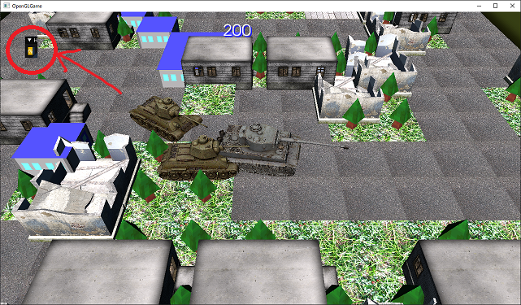
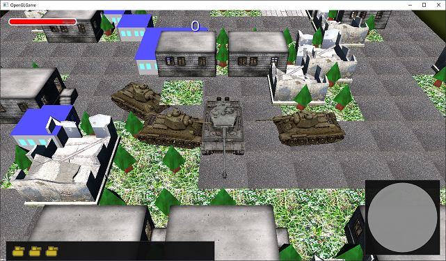
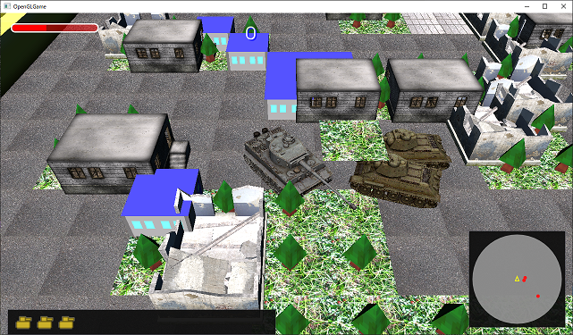

[OpenGL 3D 2020 第14回]

# ナイト・オブ・ザ・リビングデッド

## 習得目標

* ステンシルバッファの使い方。
* 影を描画する方法。
* アクターのベロシティ(速度)を制御して対象に向かって移動させる方法。

第14回ではまずアクターの影を描画します。そして、ゾンビがプレイヤーを追いかけて攻撃してくるようにします。

## 1. ステンシル・バッファ

### 1.1 3Dゲームにおける影の重要性

古い時代のゲームを除けば、すべてのゲームのキャラクターの足元には影が表示されています。影が重要な理由は、わたしたち人間は無意識のうちに、影によって物体の相対的な位置関係を認識しているからです。

<p align="center">


<br>
[影のない2Dゲーム(左=ゼビウス 中=ロックマン6 右=ゴールデンアックス)]
</p>

特に3Dゲームは2Dゲームより高さが分かりにくい内容のものが多いため、影は位置関係を知るための重要な手がかりになります。

<p align="center">

<br>
[影のある3Dゲーム(左=ジャンピングフラッシュ 右=コールオブデューティ)]
</p>

しかし、現実のようにリアルな影を描画するのはかなり複雑な問題です。さらに、リアルにしようとすればするほど描画に必要な計算時間も増えます。

そこで多くのゲームでは、ゲームに求められるリアルさの程度と影の描画にかけられる時間のバランスを考えて、影の描画技法を選択することになります。

### 1.2 さまざまな影の描画技法

影を描画することは、コンピューターグラフィックスの重要な研究領域のひとつです。そのため、これまでにさまざまな描画技法が考案されてきました。代表的な技法を以下に示します。

* 書き割りの影
* テクスチャマッピング
* デカール
* ポリゴン投影
* シャドウボリューム
* デプスシャドウ

#### 書き割りの影

>利点: プログラム不要。半影を表現できる。<br>
>欠点: 動く物体には使えない。光源が動く場合は使えない。

光源も物体も動かない場合、影がどこにどのように落ちるかは決まっています。ですから、モデルのテクスチャに影を書き込んでおくことができます。<br>
影の色や濃淡も自由自在で「半影(はんえい)」と呼ばれる徐々に影が濃くなっていく部分も簡単に表現できます。

動く物体には使えないので、他の技法と組み合わせて使われることが多いです。

この技法は3D特有のものではなく、2Dゲームでも普通に使われています。

#### テクスチャマッピング

>利点: プログラムが簡単。処理が高速。半影を表現できる。<br>
>欠点: 影の形がモデルと合わない。凹凸のある地形が苦手。自分に自分の影が落ちない。

「テクスチャマッピング」技法は、影の描画の中でも最も単純なものです。これは影の形をしたテクスチャを三角形や四角形のモデルに貼り付けて、キャラクターの足元に描画する技法です。

あまりに簡単な技法なので、処理は非常に高速です。

要するに「足元に影の絵を敷いて目をごまかす」ということです。子供だましのようですが、実際に人間は「影の有無」には敏感でも「影の形状」にはそこまで注意を払いませんから、よほど元の形状と違っていない限り、その不自然さはあまり気にならないようです。

多くの場合、ぼんやりした円形の画像が使われます。あまり元の形状に合わせた影を描いてしまうと、キャラクターをアニメーションさせたときに不自然さが増してしまうからです。

アニメーションに対応する数の影画像を用意すればよりリアルな影を描画することができますが、影画像を描く手間がかかること、そして影画像を読み込むメモリが増えることからあまり行われることはありません。

一枚板のモデルなので、地形に凹凸があると影の一部が消えたり浮いてしまったりします。

この技法も3D特有のものではなく、2Dゲームでも同様の技法が使われています。

#### デカール

>利点: 凹凸のある地形に対応できる。処理が高速。半影を表現できる。<br>
>欠点: プログラムが少し大変。影の形がモデルと合わない。自分に自分の影が落ちない。

影が落ちる範囲にある地形ポリゴンを取得し、そのポリゴンに対して影テクスチャを描画する技法です。凹凸のある地形でも自然な影が表示できます。

影が落ちる範囲にある地形ポリゴンを探す必要があるため、テクスチャマッピングに比べると時間がかかります。

#### ポリゴン投影

>利点: プログラムが簡単。影の形がモデルと一致。<br>
>欠点: 凹凸のある地形が苦手。自分に自分の影が落ちない。半影の表現が難しい。

車に轢かれたカエルのようにぺしゃんこに潰したモデルを、キャラクターの足元に描画する技法です。特別なことをしなくてもキャラクターの形状やアニメーションに対応できる点で、テクスチャマッピング技法より優れています。

ただし、モデルを2回描画しなければならないため、描画にはそれなりに時間がかかります。また、ポリゴン形状がそのまま影になるため、半影を表現するには工夫が必要です。

描画時間の増加を軽減するため、影専用の低ポリゴンモデルを用意することが多いです。低ポリゴンモデルはなので細かい部分は実際のモデルとは違ってしまいますが、先に述べたとおり人間は影の細かい部分までは見ないので、問題になることはまずありません。

モデルを平面につぶして描画するため、地形に凹凸があると影の一部が消えたり浮いてしまったりします。

地形の凹凸に対応するにはポリゴン投影した影をテクスチャに描画し、デカール技法と組み合わせて描画します。

#### シャドウボリューム

>利点: 凹凸のある地形に対応できる。影の形がモデルと一致。自分に自分の影が落ちる。<br>
>欠点: プログラムが大変。処理が低速。半影の表現が難しい。

「影になる空間」を表すモデルを作り、そのモデルの内側に入ったピクセルを暗くすることで影を描画する技法です。この「影になる空間」のことを「シャドウボリューム」と呼びます。

この技法では、キャラクターの腕や頭の影が身体に投影されるような表現(「セルフシャドウ」といいます)が可能です。シャドウボリュームはキャラクターの向きやアニメーションに応じて作り直さなくてはならないため、描画にはかなりの時間がかかります。

シャドウボリュームはポリゴンで作るため、ポリゴン投影技法と同様に半影は不得手です。

この技法でも、描画時間を短縮するために低ポリゴンモデルを使うことが多いです。

#### デプスシャドウ

>利点: 凹凸のある地形に対応できる。影の形がモデルと一致。自分に自分の影が落ちる。半影を表現できる。<br>
>欠点: プログラムが大変。処理が低速。シェーダが必須。

「光源から見た3D空間」を描画し、カメラから見た3D空間を描画するときは「光源から見た3D空間」の描画結果と比較することで、影になるかならないかを判定する技法です。

シャドウボリュームと同じく、セルフシャドウが可能です。3D空間の描画を2回行わなくてはならないため、描画にはかなりの時間がかかります。

デプスシャドウはこれまで挙げたなかで唯一の「シェーダプログラムでなくては実現できない」技法です。そのかわりシェーダを工夫すれば較的簡単に半影を表現できます。

この技法でも、低ポリゴンモデルを使うことで描画時間を減らすことができます。

>**【デプスシャドウはシェーダでなくてはできないと言ったな。あれは嘘だ。】**<br>
>この世には、シェーダを搭載していないにも関わらずデプスシャドウを表現できるゲーム機というやつが存在しています。それは「ゲームキューブ」、「Wii」そして「ニンテンドー3DS」です。ゲームキューブとWiiがデプスシャドウを実行できるのは、初期のシェーダに近い機能を持つ「TEV(ティーイーブイ)ステージ」という機能があるからです。3DSにはデプスシャドウを自動的に処理してくれるハードウェアが搭載されていて、「デプスシャドウを使う」設定にするだけでデプスシャドウを処理してくれます。

### 1.3 どの技法を選ぶべきか

実際の3Dゲームでは、いずれかひとつの技法だけで影を表現することは少なく、大抵は上記の技法を組み合わせて使っています。

しかしながら、これから複数の技法をマスターして組み合わせるには時間がかかりすぎますので、どれかひとつだけを選んで作成することにします。

最も簡単なのは「テクスチャマッピング」技法ですが、キャラクター以外の物体には使いづらいため「書き割りの影」などを併用する必要があり、「どれかひとつだけ」というルールから外れてしまいます。

「デカール」技法は凹凸に対応できるのは魅力的なのですが、プログラムするには一定の3Dグラフィックスの知識が要求されます。たとえ写したプログラムが動いたとしても、十分な知識がなくては何が行われているかを理解することは難しいでしょう。

「シャドウボリューム」や「デプスシャドウ」はかなりリアルな影を描画できますが、デカール技法以上に高度な技術と知識が必要です。

残るのは「ポリゴン投影」です。最も単純なポリゴン投影は「Y座標を0にして描画」するだけなのでとても簡単ですし、それでいて、あらゆる図形に対応することができます。それに、それほど高度な知識も必要ありません。

このようなわけで、本テキストでは「ポリゴン投影」による影描画を作成していきます。

<div style="page-break-after: always"></div>

## 2. ポリゴン投影による影の描画

### 2.1 アクターをぺちゃんこにする行列

1.3節でも書きましたが、最も単純なポリゴン投影は「Y座標を`0`にして描画する」ことです。これはモデルを「Y座標`0`の平面に投影する」ことを意味しています。

Y座標を`0`にする最も簡単な方法は「Y座標に`0`を掛ける」ことで、これは行列によって実行できます。

<p align="center">
<br>
</p>

>**【ベクトルと行列の乗算】**<br>
>X'&ensp;= X \* `00` + Y \* `10` + Z \* `20` + W \* `30`<br>
>Y'&ensp;= X \* `01` + Y \* `11` + Z \* `21` + W \* `31`<br>
>Z'&ensp;= X \* `02` + Y \* `12` + Z \* `22` + W \* `32`<br>
>W' = X \* `03` + Y \* `13` + Z \* `23` + W \* `33`<br>

単位行列の場合、この式は以下のようになります。

>**【ベクトルと単位行列の乗算】**<br>
>X'&ensp;= X \* 1 + Y \* 0 + Z \* 0 + W \* 0<br>
>Y'&ensp;= X \* 0 + Y \* 1 + Z \* 0 + W \* 0<br>
>Z'&ensp;= X \* 0 + Y \* 0 + Z \* 1 + W \* 0<br>
>W' = X \* 0 + Y \* 0 + Z \* 0 + W \* 1<br>
>&emsp;&emsp;&emsp;&emsp;&emsp;&emsp;↓<br>
>X'&ensp;= X \* 1 +&emsp;0&emsp;+&emsp;0&emsp;+&emsp;0<br>
>Y'&ensp;=&emsp;0&emsp;+ Y \* 1 +&emsp;0&emsp;+&emsp;0<br>
>Z'&ensp;=&emsp;0&emsp;+&emsp;0&emsp;+ Z \* 1 +&emsp;0<br>
>W' =&emsp;0&emsp;+&emsp;0&emsp;+&emsp;0&emsp;+ W \* 1<br>

上記の計算式を見ると、単位行列の`11`の部分に`0`を指定すれば、Y座標に`0`を掛けることができそうです。これは、

<p align="center">
<br>
[Yに0を掛ける行列]
</p>

という行列になります。そして、この行列をモデル行列とビュー行列の間に掛け合わせます。

とりあえず影を描画するプログラムを書き始めましょう。`MainGameScene.cpp`を開き、`Render`メンバ関数の中にある「点光源の位置を描画するプログラム」の下に、次のプログラムを追加してください。

```diff
     texTree->Bind(0);
     primitiveBuffer.Get(GameData::PrimNo::tree).Draw();
   }
+
+  // アクターの影を描画.
+  {
+    // ぺちゃんこ行列(Y座標を0にする行列)を作成.
+    const glm::mat4 matShadow(
+      1.00f, 0.00f, 0.00f, 0.00f,
+      0.00f, 0.00f, 0.00f, 0.00f,
+      0.00f, 0.00f, 1.00f, 0.00f,
+      0.00f, 0.00f, 0.00f, 1.00f);
+
+    // ぺちゃんこ行列→ビュー行列→プロジェクション行列の順番に掛ける行列を作る.
+    const glm::mat4 matShadowVP = matVP * matShadow;
+
+    // ぺちゃんこビュープロジェクション行列を使って全てのアクターを描画する.
+    for (const auto& actor : actors) {
+      actor->Draw(*pipeline, matShadowVP);
+    }
+  }

   // 2D表示.
   {
     glDisable(GL_CULL_FACE);
     glDisable(GL_DEPTH_TEST);
```

プログラムが書けたらビルドして実行してください。アクターの足元に何かがチラチラと表示されていたら成功です。

<p align="center">
<br>
</p>

### 2.2 ぺちゃんこアクターを少し浮かせる

あのチラチラと見えている不気味なモノは何なのでしょう…驚くなかれ、実はあれこそがぺちゃんこにされたモデルなのです。

ぺちゃんこになったモデルと地面はどちらもY座標が`0`なので、どちらが手前に表示されるかは微妙な計算の誤差によって決まります。その結果があの目ざわりなチラツキです。もし地面が表示されなかったらキレイなぺちゃんこモデルが表示されているはずなのです。

試しに地面を描画しないようにしてみましょう。`Render`メンバ関数にある、地面を描画するプログラムをコメントアウトしてください。

```diff
   // 地面を描画.
   {
     const glm::mat4 matModel = glm::mat4(1);
     const glm::mat4 matMVP = matProj * matView * matModel;
     pipeline->SetMVP(matMVP);
     pipeline->SetModelMatrix(matModel);
     texGround->Bind(0);
-   primitiveBuffer.Get(GameData::PrimNo::ground).Draw();
+   //primitiveBuffer.Get(GameData::PrimNo::ground).Draw();
   }
```

コメントアウトしたら、ビルドして実行してください。アクターの足元に、ぺちゃんこになったモデルが表示されていたら成功です。

<p align="center">
<br>
</p>

確かにぺちゃんこモデルが表示されていることが分かったので、地面の描画をもとに戻しましょう。

```diff
     pipeline->SetMVP(matMVP);
     pipeline->SetModelMatrix(matModel);
     texGround->Bind(0);
-   //primitiveBuffer.Get(GameData::PrimNo::ground).Draw();
+   primitiveBuffer.Get(GameData::PrimNo::ground).Draw();
   }
```

さて、問題はぺちゃんこモデルがちらつかないようにすることです。しかしこれは簡単で、ぺちゃんこモデルを地面より少しだけ高い位置に表示すればいいのです。

座標変換行列の`30 31 32`の部分が平行移動成分で、`30`がX軸の平行移動量、`31`がY軸の平行移動量、`32`がZ軸の平行移動量となっています。ですから、`31`の部分にほんの小さな数値、例えば`0.01`を入れてやります。

ぺちゃんこ行列を作成するプログラムを、次のように変更してください。

```diff
     const glm::mat4 matShadow(
       1.00f, 0.00f, 0.00f, 0.00f,
       0.00f, 0.00f, 0.00f, 0.00f,
       0.00f, 0.00f, 1.00f, 0.00f,
-      0.00f, 0.00f, 0.00f, 1.00f);
+      0.00f, 0.01f, 0.00f, 1.00f);

     // ぺちゃんこ行列→ビュー行列→プロジェクション行列の順番に掛ける行列を作る.
     const glm::mat4 matShadowVP = matShadow * matVP;
```

プログラムが書けたらビルドして実行してください。地面の上に、ぺちゃんこモデルがちらつかずに表示されていたら成功です。

<p align="center">
<br>
</p>

### 2.3 ぺちゃんこモデルを黒くする

現在の影は、見た目はぺちゃんこになっていますが、影というには色の主張が激しすぎます。影は影らしく黒くなっているべきでしょう。

モデルを黒くするには以下の3つの方法が考えられます。

1. ライトを真っ暗にする。
2. モデル全体の色を表すユニフォーム変数を追加する。
3. 影用のシェーダを追加する。

1は既存のシェーダを使えるのですぐにプログラムできます。2は多少プログラムを追加しなくてはなりませんが、モデル全体の色を操作する機能は影以外にも応用できます。

しかし、今回は3の「影用のシェーダを追加する」方法を使うことにします。というのは、1と2は汎用すぎて影の描画に使うと処理時間が無駄になるからです。

### 2.4 影用シェーダを追加する

まずは影用の頂点シェーダを作りましょう。ソリューションエクスプローラーを使って、プロジェクトの`Res`フォルダに`Shadow.vert`(シャドウ・バート)というファイルを追加してください。追加したファイルを開き、次のプログラムを追加してください。

```diff
+/**
+* 影用頂点シェーダ.
+*/
+#version 450 core
+
+// 入力変数
+layout(location=0) in vec3 vPosition;
+layout(location=2) in vec2 vTexcoord;
+
+// 出力変数
+layout(location=1) out vec2 outTexcoord;
+out gl_PerVertex {
+  vec4 gl_Position;
+};
+
+// ユニフォーム変数
+layout(location=0) uniform mat4 matMVP;
+
+// 頂点シェーダプログラム.
+void main()
+{
+  outTexcoord = vTexcoord;
+  gl_Position = matMVP * vec4(vPosition, 1.0);
+}
```

`VAO`を使い回せるように、ロケーション番号は他のシェーダと合わせています。そのため番号が飛び飛びになっている点に注意してください。

影の描画には、物体に色を付けるために使われる法線や色情報は不要なので、それらは読み込まないようにしています。

続いてフラグメントとシェーダを作成します。プロジェクトの`Res`フォルダに`Shadow.frag`(シャドウ・フラグ)というファイルを追加してください。追加したファイルを開き、次のプログラムを追加してください。

```diff
+/**
+* 影用フラグメントシェーダ.
+*/
+#version 450 core
+
+// 入力変数
+layout(location=1) in vec2 inTexcoord;
+
+// 出力変数
+out vec4 fragColor;
+
+// ユニフォーム変数
+layout(binding=0) uniform sampler2D texColor;
+
+// フラグメントシェーダプログラム.
+void main()
+{
+  fragColor.rgb = vec3(0);
+  fragColor.a = texture(texColor, inTexcoord).a;
+}
```

影用のフラグメントシェーダは`fragColor`に黒を指定するだけでも十分ですが、テクスチャに透明な部分がある場合に備えて、アルファ値だけはテクスチャの値を使うようになっています。

### 2.5 影用シェーダを読み込む

それでは作成した影用シェーダを読み込みますが、まず読み込み先となるシェーダ変数を追加します。`GameData.h`を開き、次のプログラムを追加してください。

```diff
   // 描画用のメンバ変数.
   std::shared_ptr<Shader::Pipeline> pipeline3D;
   std::shared_ptr<Shader::Pipeline> pipeline2D;
+  std::shared_ptr<Shader::Pipeline> pipelineShadow;
   Mesh::PrimitiveBuffer primitiveBuffer;
   Texture::Sampler sampler;
```

次に`GameData.cpp`を開き、`Initialize`メンバ関数に次のプログラムを追加してください。

```diff
   pipeline2D = std::make_shared<Shader::Pipeline>("Res/Simple.vert", "Res/Simple.frag");
   if (!pipeline2D || !*pipeline2D) {
     return false;
   }
+  pipelineShadow = std::make_shared<Shader::Pipeline>("Res/Shadow.vert", "Res/Shadow.frag");
+  if (!pipelineShadow || !*pipelineShadow) {
+    return false;
+  }

   // サンプラ・オブジェクトを作成する.
   sampler.SetWrapMode(GL_REPEAT);
```

### 2.6 影用シェーダを使った描画

それでは影用シェーダを使ってみましょう。`MainGameScene.cpp`を開き、影を描画するプログラムを次のように変更してください。

```diff
     // ぺちゃんこ行列→ビュー行列→プロジェクション行列の順番に掛ける行列を作る.
     const glm::mat4 matShadowVP = matShadow * matVP;
+
+    // 影用パイプランをバインド.
+    std::shared_ptr<Shader::Pipeline> pipelineShadow = GameData::Get().pipelineShadow;
+    pipelineShadow->Bind();

     // ぺちゃんこビュープロジェクション行列を使って全てのアクターを描画する.
     for (const auto& actor : actors) {
-      actor->Draw(*pipeline, matShadowVP);
+      actor->Draw(*pipelineShadow, matShadowVP);
     }
```

プログラムが書けたらビルドして実行してください。影が黒くなっていたら成功です。成功なのですが…コンソールウィンドウに大量のエラーメッセージが出力されていますね。

<p align="center">
<br>
</p>

### 2.7 通常の描画と影の描画を切り替える

エラーメッセージをよく見ると`SetModelMatrix`という関数でエラーが起きているらしいことが分かります。どうやらモデル行列の設定に失敗しているようです。

これは実は、影用シェーダは単独のモデル行列を使わないので、モデル行列用のユニフォーム変数が定義されていないことが原因です。

対策として、アクタークラスの`Draw`メンバ関数の引数に「何を描画するか」を指定できるようにします。

`Actor.h`を開き、次のプログラムを追加してください。

```diff
   Actor(std::string actorName, const Mesh::Primitive* prim,
     std::shared_ptr<Texture::Image2D> tex, const glm::vec3& pos);

   void Update(float deltTIme);
+
+  // 描画の種類.
+  enum DrawType {
+    color,  // 通常描画.
+    shadow, // 影描画.
+  };
-  void Draw(const Shader::Pipeline& pipeline, const glm::mat4& matVP) const;
+  void Draw(const Shader::Pipeline& pipeline, const glm::mat4& matVP,
+    DrawType drawType) const;

  void SetCylinderCollision(float top, float bottom, float radius);
  void SetBoxCollision(const glm::vec3& min, const glm::vec3& max);
```

次に`Actor.cpp`を開き、`Draw`メンバ関数の引数を次のように変更してください。

```diff
 * @param pipeline 行列の設定先となるパイプラインオブジェクト.
 * @param matVP    描画に使用するビュープロジェクション行列.
+* @param drawType 描画の種類.
 */
-void Actor::Draw(const Shader::Pipeline& pipeline, const glm::mat4& matVP) const
+void Actor::Draw(const Shader::Pipeline& pipeline, const glm::mat4& matVP,
+  DrawType drawType) const
 {
   // プリミティブが設定されていないときは何もせず終了.
   if (!primitive) {
```

続いて、`Draw`メンバ関数の中で`SetModelMatrix`関数を呼び出している部分を、次のように変更してください。

```diff
   const glm::mat4 matModel =
     matTranslate * matRotateY * matRotateZ * matRotateX * matScale;

   // GPUメモリに行列を転送.
+  if (drawType != DrawType::shadow) {
+    pipeline.SetModelMatrix(matModel);
+  }
   pipeline.SetMVP(matVP * matModel);

   // テクスチャイメージスロット0番にテクスチャを割り当てる.
   texture->Bind(0);
```

これで描画の種類が「影」の場合は`SetModelMatrix`関数を呼び出さなくなります。

それでは`MainGameScene.cpp`に戻り、`Draw`メンバ関数の中でアクターを描画している部分に、描画の種類をしていしましょう。

まず通常のアクターの描画を次のように変更してください。

```diff
   // アクターリストを描画.
   const glm::mat4 matVP = matProj * matView;
   for (size_t i = 0; i < actors.size(); ++i) {
-    actors[i]->Draw(*pipeline, matVP);
+    actors[i]->Draw(*pipeline, matVP, Actor::DrawType::color);
   }

   // 点光源の位置を描画.
```

次に影の描画を次のように変更してください。

```diff
     // ぺちゃんこビュープロジェクション行列を使って全てのアクターを描画する.
     for (const auto& actor : actors) {
-      actor->Draw(*pipelineShadow, matShadowVP);
+      actor->Draw(*pipelineShadow, matShadowVP, Actor::DrawType::shadow);
     }
   }

   // 2D表示.
```

プログラムが書けたらビルドして実行してください。影が黒色で表示あれ、コンソールウィンドウにエラーが出力されていなければ成功です。

### 2.8 影の長さを求める

いまのところ、影はアクターの真下に落ちています。しかし、多くのゲームにおいて影は平行光源を基準に作り出されます。現実世界で影を生み出す代表的な光源は太陽や月で、平行光源はそれらの代用品として使われることが多いためです。

先達にならって、本テキストでも影が平行光源の反対側に落ちるようにしていきましょう。

地面に高さ`1m`の棒が立っているとします。この棒の影は、棒の先端から平行光源の方向ベクトルの方向にまっすぐ進んで地面に当たった位置に落ちるでしょう。

<p align="center">

</p>

問題は

>棒の長さと方向ベクトルから影の長さを求める

ことですが、これは図形の<ruby>相似<rt>そうじ</rt></ruby>から解決できます。

棒の両端を`A`、`B`、影の先端を`C`、方向ベクトルの先端を`D`とします。そして`D`から`AB`に垂線を引き、その交点を`E`とします。

<p align="center">

</p>

このとき、三角形`ABC`と`ADE`は「<ruby>相似<rt>そうじ</rt></ruby>」しています。

`△ABC ∽ △ADE`

そして、相似により`AB`と`AD`の比率は`BC`と`DE`の比率と等しくなります。

`AB:AD = BC:DE`

`AB`の長さは棒の長さなので`1m`だと分かっています。あとは`AD`と`DE`の長さが分かれば、影の長さ`BC`を求められます。

方向ベクトルは軸ごとの長さに分解することができるので、`AD`は「方向ベクトルのY軸方向の長さ」、`DE`は「方向ベクトルのX方向の長さ(上図の横方向が`X軸`の場合)」または「方向ベクトルのZ方向の長さ(上図の横方向が`Z軸`の場合)」となります。

実際の影の長さは以下の式で求められます。

>実際の影の長さ = 影を落とす物体の高さ × 1mの棒が落とす影の長さ

これで影の長さの計算に必要な値は全て揃いました。

### 2.9 影を光源の向きに合わせて投影する

それでは、影が平行光源の方向に落ちるようにしていきましょう。まず1mの棒が落とす影の長さを計算します。

`MainGameScene.cpp`を開き、`Render`メンバ関数の影を描画するプログラムに、次のプログラムを追加してください。

```diff
   // アクターの影を描画.
   {
+    // 高さ1mの物体が落とす影の長さを計算.
+    const float scale = 1.0f / -directionalLight.direction.y;
+    const float sx = directionalLight.direction.x * scale;
+    const float sz = directionalLight.direction.z * scale;
+
     // ぺちゃんこ行列(Y座標を0にする行列)を作成.
     const glm::mat4 matShadow(
```

変数`sx`がX軸方向の長さ、`sz`がZ軸方向の長さです。これらの長さを物体の実際の高さに掛けるには、ぺちゃんこ行列の`10`の場所に`sx`を代入し、同様に`12`の場所に`sz`を代入します。

なぜ`10`と`12`なのか？<br>
それは、ベクトルと行列の乗算が以下の式で行われるからです。

>**【ベクトルと行列の乗算】**<br>
>X'&ensp;= X \* `00` + y \* `10` + Z \* `20` + W \* `30`<br>
>Y'&ensp;= X \* `01` + y \* `11` + Z \* `21` + W \* `31`<br>
>Z'&ensp;= X \* `02` + y \* `12` + Z \* `22` + W \* `32`<br>
>W' = X \* `03` + y \* `13` + Z \* `23` + W \* `33`<br>

この式によると`10`と`12`はどちらもY座標に掛けられ、X座標またはZ座標に加えられることが分かります。

<pre class="tnmai_assignment">
<strong>【課題01】</strong>
ぺちゃんこ行列の<code>10</code>と<code>12</code>の位置を<code>sx</code>と<code>sz</code>で置き換えて、影が平行光源の方向ベクトルの向きに伸びるようにしなさい。
</pre>

課題01が完了したら次の画像のように影が伸びていると思います。

<p align="center">

</p>

### 2.10 影を半透明にする

現実の影は完全な黒にはなりません。周囲に反射した光は、影になっている部分にも届くからです。

ポリゴン投影技法で間接光の影響を計算するのは難易度が高いので、代わりに影を半透明にして、地面の色が見えるようにしましょう。

`Shadow.frag`を開き、影の色を次のように変更してください。

```diff
 void main()
 {
   fragColor.rgb = vec3(0);
-  fragColor.a = texture(texColor, inTexcoord).a;
+  fragColor.a = texture(texColor, inTexcoord).a * 0.5;
 }
```

プログラムが書けたらビルドして実行してください。影が半透明になり、地面の色が見えるようになっていたら成功です。影がちらついている問題は次の章で解決します。

<p align="center">

</p>

>**【まとめ】**
>
>* 座標変換行列を工夫することで、モデルを変形させてぺちゃんこにしたり引き伸ばしたりすることができる。
>* 影の長さは光源の方向ベクトルから計算できる。

<div style="page-break-after: always"></div>

## 3. ステンシルバッファ

### 3.1 第三のバックバッファ

影がちらつくのは、影の高さを`0`としていたときにちらついて見えたのと同じで、複数のポリゴンが同じ高さで重なっているからです。

実は影が真っ黒のときもちらついていたのですが、全て同じ色なので分からなかっただけなのです。ですから、半透明を止めればちらつきは分からなくなります。

そうはいっても、半透明の影のほうが見栄えがするので捨てたくはありません。そこで「ステンシルバッファ」という機能を使ってちらつきをなくしていこうと思います。

「ステンシルバッファ」はカラーバッファや深度バッファと同じくバックバッファの一種で、カラーバッファのように任意の値を書き込むことができ、深度バッファのように値に応じてカラーバッファに描くか描かないかを選択することができます。

ただし、ステンシルバッファに書き込める値は`0`～`255`の範囲に限られます。

「ステンシル」は「文字や図形を描くための型」あるいは「型を使って文字や図形を書くこと」を表す英単語です。

図形を描きたい壁や家具に図形の形を切り抜いた型紙を貼り、そのうえから色を塗ると、切り抜いた部分にだけ色が付きます。ステンシルバッファはこの「型紙」と同じ役目をします。

### 3.2 ステンシルバッファを使った描画の流れ

ステンシルバッファを使った描画は次の手順で行います。

1. ステンシルバッファ全体を`0`で塗りつぶす。
2. 色を塗りたい部分に`1`を書き込むように設定する。
3. ステンシルバッファに色を塗りたい部分を描画。
4. ステンシルバッファが`1`の部分にだけ色がつくように設定する。
5. 画面全体を覆うポリゴンを使って色を塗る。

これまでは影をカラーバッファに直接書き込んでいましたが、ステンシルバッファを使った描画ではステンシルバッファに書き込みます(上記の2番)。このときカラーバッファには描き込みません。

全ての影を描き終わると、ステンシルバッファは影になる部分が`1`、影にならない部分は`0`になっています。そうしたら、「ステンシル値が`1`だったら描画を許可する」という設定にして、画面全体に影色を描き込みます。

すると、影になる部分だけに影色が描き込まれるというわけです。色を重ね書きしないので、もうちらつくことはありません。

### 3.3 ステンシルバッファを0で塗りつぶす

まずはステンシルバッファを`0`で塗りつぶします。ステンシルバッファもバックバッファのひとつなので`glClear`で塗りつぶすことができます。`Render`メンバ関数の先頭付近にある`glClear`関数呼び出しを、次のように変更してください。

```diff
   glEnable(GL_DEPTH_TEST);
   glEnable(GL_CULL_FACE);
   glClearColor(0.1f, 0.3f, 0.5f, 1.0f);
-  glClear(GL_COLOR_BUFFER_BIT | GL_DEPTH_BUFFER_BIT);
+  glClear(GL_COLOR_BUFFER_BIT | GL_DEPTH_BUFFER_BIT | GL_STENCIL_BUFFER_BIT);

   // 環境光を設定する.
   pipeline->SetAmbientLight(glm::vec3(0.1f, 0.125f, 0.15f));
```

続いてステンシルバッファを有効にしましょう。OpenGLで特定の機能を有効にするには`glEnable`関数を使うのでした。この関数に`GL_STENCIL_TEST`(ジーエル・ステンシル・テスト)を指定することでステンシルバッファが使えるようになります。<br>
アクターの影を描画するプログラムの先頭に、次のプログラムを追加してください。

```diff
   // アクターの影を描画.
   {
+    // ステンシルバッファを有効にする.
+    glEnable(GL_STENCIL_TEST);
+
     // 高さ1mの物体が落とす影の長さを計算.
     const float scale = 1.0f / -directionalLight.direction.y;
     const float sx = directionalLight.direction.x * scale;
```

### 3.4 ステンシルバッファに1を書き込む

ステンシルバッファを操作するには以下の3つの関数を使います。ステンシルバッファに値を書き込むには、これらの関数に適切な値を設定しなくてはなりません。

<pre class="tnmai_code"><strong>【書式】</strong>
void glStencilFunc(テスト方法, 比較に使う値, 比較対象ビット);
</pre>

`glStencilFunc`(ジーエル・ステンシル・ファンク)はステンシルバッファに書き込まれている値(ステンシル値)の比較方法を設定する関数です。

あるピクセルに書き込みが発生したとき、そのピクセルのステンシル値は「比較に使う値」と「テスト方法」に従って比較されます。テスト方法は以下の8種類から選択します。

| 名前        | 処理                         |
|:------------|:-----------------------------|
| GL_NEVER    | 常に`false`                  |
| GL_LESS     | 比較に使う値 < ステンシル値  |
| GL_LEQUAL   | 比較に使う値 <= ステンシル値 |
| GL_GREATER  | 比較に使う値 > ステンシル値  |
| GL_GEQUAL   | 比較に使う値 >= ステンシル値 |
| GL_EQUAL    | 比較に使う値 == ステンシル値 |
| GL_NOTEQUAL | 比較に使う値 != ステンシル値 |
| GL_ALWAYS   | 常に`true`                   |

「比較対象ビット」は、ステンシル値と比較に使う値の両方について、実際に比較されるビットを指定します。例えば8ビットのステンシルバッファを上位4ビットと下位4ビットに分けて、それぞれ別の用途に使いたいとします。<br>
上位4ビットを使う時は「比較対象ビット」に`0xf0`を、下位4ビットを使う時は`0x0f`を指定すると、`1`になっているビットだけを比較することができます。

例えばテスト方法が`GL_LESS`、比較に使う値が`7`、比較対象ビットが`0x0f`の場合、

`(7 & 0x0f) < (ピクセルのステンシル値 & 0x0f)`

という比較が行われます。結果が`true`の場合と`false`の場合のそれぞれについて異なる処理を指定できます。この指定は次に説明する`glStencilOp`関数で行います。

<pre class="tnmai_code"><strong>【書式】</strong>
void glStencilOp(ステンシルテスト失敗時の処理, 深度テスト失敗時の処理, 両テスト成功時の処理);
</pre>

`glStencilOp`(ジーエル・ステンシル・オーピー)関数を使うと、ステンシル値の比較結果と深度値の比較結果の成否に応じて行う処理を設定できます。指定できる処理には以下の8つがあります。

| 名前         | 処理 |
|:-------------|:-----|
| GL_KEEP      | ステンシル値を変更しない。 |
| GL_ZERO      | ステンシルバッファに`0`を書き込む。 |
| GL_REPLACE   | `glStencilFunc`で指定した「比較に使う値」を書き込む。 |
| GL_INCR      | ステンシル値をインクリメントする。最大値より増えることはない。 |
| GL_INCR_WRAP | ステンシル値をインクリメントする。最大値を超えたら`0`に戻る。 |
| GL_DECR      | ステンシル値をデクリメントする。`0`より小さくなることはない。 |
| GL_DECR_WRAP | ステンシル値をデクリメントする。`0`より小さくなったら最大値に変化する。 |
| GL_INVERT    | ステンシル値をビット反転する。 |

一般的にはテスト失敗の場合は`GL_KEEP`を指定してステンシル値の変更を防ぎ、両テスト成功の場合のみ`GL_REPLACE`や`GL_INCR`などを指定してステンシル値を更新します。

<pre class="tnmai_code"><strong>【書式】</strong>
void glStencilMask(書き込みを許可するビット);
</pre>

`glStencilMask`(ジーエル・ステンシル・マスク)関数は、ステンシルバッファの書込み可能なビットを指定します。例えば「操作するビット」を`0x07`にすると、ステンシルバッファの下位3ビットだけが書き込み可能になります。

>**【許可ビットとインクリメント・デクリメントについて】**<br>
>最下位ビットの書き込みを許可しない場合、`glStencilOp`関数に`GL_INCR`や`GL_DECR`などの最下位ビットを操作する処理を設定しても、値が変化しないことがある点に注意してください。

それでは、ステンシルバッファの影にしたい部分に`1`を書き込むように設定しましょう。ステンシルバッファを有効にするプログラムの下に、次のプログラムを追加してください。

```diff
     // ステンシルバッファを有効にする.
     glEnable(GL_STENCIL_TEST);
+    // 「比較に使う値」を1にして、常に比較が成功するように設定.
+    glStencilFunc(GL_ALWAYS, 1, 0xff);
+    // ステンシル深度の両方のテストに成功した場合に「比較する値」を書き込むように設定.
+    glStencilOp(GL_KEEP, GL_KEEP, GL_REPLACE);
+    // ステンシルバッファの全ビットの書き込みを許可.
+    glStencilMask(0xff);

     // 高さ1mの物体が落とす影の長さを計算.
     const float scale = 1.0f / -directionalLight.direction.y;
     const float sx = directionalLight.direction.x * scale;
```

### 3.5 ステンシルバッファ以外への書き込みを禁止する

ステンシルバッファにだけ書き込みをしたい場合、カラーバッファと深度バッファへの書き込みを禁止する必要があります。これは以下の2つの関数によって実現できます。

<pre class="tnmai_code"><strong>【書式】</strong>
void glColorMask(赤の書き込み許可フラグ, 緑の書き込み許可フラグ, 青の書き込み許可フラグ, アルファの書き込み許可フラグ);
</pre>

`glColorMask`(ジーエル・カラー・マスク)関数は、カラーバッファへの書き込み許可を設定します。`GL_TRUE`なら書き込みが許可され、`GL_FALSE`なら書き込みが禁止されます。書き込み許可は色要素ごとに設定できます。

<pre class="tnmai_code"><strong>【書式】</strong>
void glDepthMask(書き込み許可フラグ);
</pre>

`glDepthMask`(ジーエル・デプス・マスク)関数は、深度バッファへの書き込み許可を設定します。`GL_TRUE`なら書き込みが許可され、`GL_FALSE`なら書き込みが禁止されます。

>**【ステンシルマスクとカラー・深度マスクは設定できる値が違う】**<br>
>`glStencilMask`関数には整数値を指定し、`glColorMask`関数と`glDepthMask`関数には`GL_TRUE`か`GL_FALSE`のいずれかを指定する、というように設定できる値が違っています。<br>
>しかしOpenGLの型の都合で、ステンシルマスクに`GL_TRUE`、`GL_FALSE`を指定したり、カラーマスクや深度マスクに整数値を指定しても、エラーにはなりませんので注意してください。

それではカラーバッファと深度バッファの書き込みを禁止しましょう。ステンシルバッファへの書き込みを許可するプログラムの下に、次のプログラムを追加してください。

```diff
     glStencilOp(GL_KEEP, GL_KEEP, GL_REPLACE);
     // ステンシルバッファの全ビットの書き込みを許可.
     glStencilMask(0xff);
+    // カラーバッファへの書き込みを禁止.
+    glColorMask(GL_FALSE, GL_FALSE, GL_FALSE, GL_FALSE);
+    // 深度バッファへの書き込みを禁止.
+    glDepthMask(GL_FALSE);

     // 高さ1mの物体が落とす影の長さを計算.
     const float scale = 1.0f / -directionalLight.direction.y;
     const float sx = directionalLight.direction.x * scale;
```

これでステンシルバッファだけに書き込みが行われるようになりました。プログラムが書けたらビルドして実行してください。影が見えなくなっていれば成功です。

### 3.6 影色を描画する

仕上げとして画面全体に影色を描き込みます。このとき、ステンシル値が`1`の部分にだけ色がつくようにします。そうすると半透明の影が描画されるという仕組みです。

まずはステンシル値が`1`の場合のみステンシルテストが成功するように設定します。ぺちゃんこ行列を使ってアクターを描画するプログラムの下に、次のプログラムを追加してください。

```diff
     for (const auto& actor : actors) {
       actor->Draw(*pipelineShadow, matShadowVP, Actor::DrawType::shadow);
     }
+
+    // ステンシル値が1の場合のみテストに成功するように設定.
+    glStencilFunc(GL_EQUAL, 1, 0xff);
   }

   // 2D表示.
```

次に、ステンシル値を変更しないように設定します。

<pre class="tnmai_assignment">
<strong>【課題02】</strong>
ステンシル値が1の場合のみ成功するように設定するプログラムの下に、<code>glStencilOp</code>関数を使って「すべての条件でステンシル値を変更しない」ように設定するプログラムを追加しなさい。
</pre>

さらにカラーバッファへの書き込みを許可します。

<pre class="tnmai_assignment">
<strong>【課題03】</strong>
課題02のプログラムの下に、<code>glColorMask</code>関数を使って「カラーバッファへのすべての要素の書き込みを許可」するプログラムを追加しなさい。
</pre>

ステンシルバッファの設定に加えて、深度バッファを無効化しておきます。ステンシルバッファが`1`の部分に色を付けたいだけで、3D空間に対して何かを配置するわけではないからです。

機能を無効にするには`glDisable`(ジーエル・ディセーブル)関数を使います。深度バッファの機能名は`GL_DEPTH_TEST`です。

<pre class="tnmai_assignment">
<strong>【課題04】</strong>
カラーバッファへの書き込みを許可するプログラムの下に、<code>glDisable</code>関数を使って深度バッファを無効化するプログラムを追加しなさい。
</pre>

課題02～04が完了すれば、影色を塗る準備はできています。満を持して影色を塗りましょう。画面全体に色を塗るには2Dパイプラインで画面全体を覆う四角モデルを描画するのが簡単です。四角モデルは`plane`という名前で作成済みですね。

画面全体に描画する場合、ビュー行列とプロジェクション行列には単位行列を使うことができます。ただし、`plane`モデルの大きさは`1x1`なので、`-1～+1`の画面サイズに合わせるにはモデル行列で大きさを2倍にする必要があります。

深度バッファを無効にするプログラムの下に、次のプログラムを追加してください。

```diff
     // 深度バッファを無効化.
     glDisable(GL_DEPTH_TEST);
+
+    // 画面全体に影色を塗る.
+    pipelineShadow->SetMVP(glm::scale(glm::mat4(1), glm::vec3(2)));
+    primitiveBuffer.Get(GameData::PrimNo::plane).Draw();
   }

   // 2D表示.
```

最後に、通常の描画が行えるようにステンシルバッファを無効化し、深度バッファを有効化します。画面全体に影色を塗るプログラムの下に、次のプログラムを追加してください。

```diff
     // 画面全体に影色を塗る.
     pipelineShadow->SetMVP(glm::scale(glm::mat4(1), glm::vec3(2)));
     primitiveBuffer.Get(GameData::PrimNo::plane).Draw();
+
+    // ステンシルバッファを無効化.
+    glDisable(GL_STENCIL_TEST);
+    // 深度バッファを有効化.
+    glEnable(GL_DEPTH_TEST);
+    // 深度バッファへの描き込みを許可.
+    glDepthMask(GL_TRUE);
   }

   // 2D表示.
```

プログラムが書けたらビルドして実行してください。ちらつきのない影が描画されていたら成功です。

<p align="center">

</p>

>**【まとめ】**
>
>* 「ステンシルバッファ」はバックバッファの一種。
>* ステンシルバッファの操作には`glStencilFunc`、`glStencilOp`、`glStencilMask`を使う。
>* 「ステンシルバッファ」を使うと色がつく部分とつかない部分を指定することができる。

<div style="page-break-after: always"></div>

## 4. 死者は生者を追い求める

### 4.1 ゾンビに速度を与える

ここまではプレイヤーが一方的にゾンビを打ち倒してきました。しかし、そろそろゾンビたちが動き出してもいい頃です。

まずはアクターリストからゾンビを見分けましょう。アクターの`name`メンバ変数が`zombie`ならゾンビアクターです。`MainGameScene.cpp`を開き、`Update`メンバ関数に次のプログラムを追加してください。

```diff
 void MainGameScene::Update(GLFWwindow* window, float deltaTime)
 {
+  // アクターの行動を処理.
+  for (auto& e : actors) {
+    // ゾンビアクターの場合.
+    if (e->name == "zombie") {
+    }
+  }
+
   // アクターリストに含まれるアクターの状態を更新する.
   UpdateActorList(actors, deltaTime);
```

配列の全ての要素をループ処理するために「範囲for(フォー)」を使っています。これは以下の構文になっています。

<pre class="tnmai_code"><strong>【書式】</strong>
for (変数の型 変数名 : 配列) {
  // 変数に対する処理.
}
</pre>

上のプログラムでは最初`e`には`actors[0]`が代入されます。ループすると`actor[1]`が代入され、その後もループするたびに`actor[2]`、`actor[3]`というように代入されていき、代入する要素がなくなるとループが終了します。

これは以下のように書くのとほぼ同じです。

```c++
  for (int i = 0; i < actors.size(); ++i) {
     auto& e = actors[i];
    if (e->name == "zombie") {
    }
  }
```

違いはループ変数`i`がなくなっていることです。ループ処理では配列のすべての要素に対して処理を行うことが多いため、いちいちループ変数を作ったり条件を書いたりするのは面倒だということで、`C++11`から「範囲for」が使えるようになりました。

さて、アクターを動かすにはアクターの速度を変更します。アクターの速度は<ruby>`velocity`<rt>ベロシティ</rt></ruby>メンバ関数で表されているので、このメンバ変数を変更すれば速度を変えられます。

とりあえず右に秒速1mの速度を与えてみましょう。アクターの行動を処理するプログラムに、次のプログラムを追加してください。

```diff
   // アクターの行動を処理.
   for (auto& e : actors) {
     // ゾンビアクターの場合.
     if (e->name == "zombie") {
+      e->velocity.x = 1.0f;
     }
   }

   // アクターリストに含まれるアクターの状態を更新する.
```

プログラムが書けたらビルドして実行してください。ゾンビが右に移動していたら成功です。

<pre class="tnmai_assignment">
<strong>【課題05】</strong>
ゾンビの速度を変更して、<code>-Z</code>方向に秒速2mで移動するようにしなさい。
</pre>

### 4.2 死んだゾンビの速度を0にする

ゾンビを撃つとゾンビは死にます。しかし、速度を変更していないのでゾンビは動き続けます。死んだら動きを止めるべきなので、死んだゾンビの速度を`0`にしましょう。

とりあえずゾンビに弾が当たったときに速度を`0`にしてみます。ゾンビに弾が当たったときにはゾンビの`OnHit`が実行されるので、この関数の中で速度を`0`にしてみましょう。`MainGameScene.cpp`を開き、`Initialize`メンバ関数に次のプログラムを追加してください。

```diff
         a.SetAnimation(GameData::Get().anmZombieMaleDown);
         // 衝突判定を無くす.
         a.collision.shape = Collision::Shape::none;
+        // 速度を0にする.
+        a.velocity = glm::vec3(0);
         // 倒したゾンビの数を1体増やす.
         ++GameData::Get().killCount;
       }
```

プログラムが書けたらビルドして実行してください。撃たれたゾンビは動きを止めるはずです、が…。おかしいですね、止まりません。

### 4.3 アクターの状態を表現する

ゾンビが動きを止めないのは、「アクターの行動を処理する」プログラムの中で、無条件にゾンビの速度を設定しているからです。ゾンビの生死に関係なく速度を設定しているため、一瞬足を止めたゾンビもすぐに移動を始めてしまうのです。

しかし、現在はゾンビの生死を判定するよい方法がありません。再生中のアニメーションの種類によって判定できなくはないですが、もしアニメーションを流用して「倒れ込み攻撃」を作りたい、と考えたりした場合に都合が悪いです。

他にアクタークラスで使えそう変数もなさそうなので、新しく「アクターの状態」を表すメンバ変数を追加することにしましょう。

アクターは「死んている」、「倒れているだけで生きている」、「生きて移動している」といった様々な「状態」を取り得ますが、このような「複数の状態」を表す場合は「列挙型」を使います。そもそも列挙型は複数の状態を表すために作られた型だからです。

列挙型の名前は「状態」を意味する`State`(ステート)がいいでしょう。`State`としてどんな「状態」を定義するかはゲーム次第ですが、とりあえず「何もしていない」「歩いている」「死んでいる」の3種類を作成することにします。

「何もしていない」はいわゆる待機状態です。名前は「働いていない、暇な」を表す`idle`(アイドル)とします。<br>
「歩いている」はそのままの意味です。名前は`walk`(ウォーク)でいいでしょう。<br>
「死んでいる」もそのままですね。名前は`dead`(デッド)とします。

それでは`Actor.h`を開き、`Actor`クラスの定義に`State`列挙型を追加してください。

```diff
   void SetAnimation(
     std::shared_ptr<Animation> animation);

   std::string name; // アクターの名前.
+
+  // アクターの状態.
+  enum State {
+    idle,  // 何もしていない.
+    walk,  // 歩いている.
+    dead,  // 死んでいる.
+  };
+  State state = State::idle; // 現在の動作状態.

   const Mesh::Primitive* primitive = nullptr;
   std::shared_ptr<Texture::Image2D> texture;
```

>**【idleとidol】**<br>
>日本語だと違いが分かりませんが、歌手などに使われる「アイドル」に対応する英単語は`idol`です。

### 4.4 死んだゾンビには速度を設定しないようにする

ゾンビが死んだときにアクターの状態を`dead`に変えましょう。ゾンビの`OnHit`を設定するプログラムに、次のプログラムを追加してください。

```diff
         a.collision.shape = Collision::Shape::none;
         // 速度を0にする.
         a.velocity = glm::vec3(0);
+        // 死亡状態にする.
+        a.state = Actor::State::dead;
         // 倒したゾンビの数を1体増やす.
         ++GameData::Get().killCount;
       }
```

次に、ゾンビの速度を設定するプログラムを次のように変更してください。

```diff
   for (auto& e : actors) {
     // ゾンビアクターの場合.
     if (e->name == "zombie") {
+      // 死んでいなければ歩く.
+      if (e->state != Actor::State::dead) {
         e->velocity.z = -2.0f;
+        e->state = Actor::State::walk;
+      }
     }
   }

   // アクターリストに含まれるアクターの状態を更新する.
```

プログラムが書けたらビルドして実行してください。ゾンビを打ち倒したとき、倒れたゾンビが移動しなくなっていたら成功です。

### 4.5 ゾンビの向いている方向に進むように速度を設定する

今は全てのゾンビが同じ方向に向かって歩いていますが、ゾンビ向きと歩く方向が一致していません。しかし、多くのゾンビは自分の向いている方向に歩きたいと考えていることでしょう。その願いを叶えてあげることにしましょう。

ゾンビの向きはY軸の回転によって表現されています。しかしゾンビが向いている方向に歩かせるには、回転ではなく「向きベクトル」が必要です。つまり「Y軸回転」から「向きベクトル」を計算する必要があります。

角度θのときのX方向の長さとY方向の長さを求めるには「三角関数」を使います。「三角関数の定義」は以下の2つからなっています。

1. 原点から+X方向に伸びる直線を、原点を中心に反時計回りにθだけ回転させた直線と、単位円の交点の座標を(cosθ, sinθ)とする。
2. tanθ = sinθ / cosθとする。

単位円とは「原点を中心とする半径1の円」のことです。

ここでは定義1に注目します。直線と単位円の交点(cosθ, sinθ)は、「原点から(cosθ, sinθ)への方向ベクトル」とみなせます。つまり`cos`と`sin`を使えば角度`θ`を方向ベクトルに変換することができるわけです。

<p align="center">

</p>

ただし、数学の座標系では「上が+Y」ですが、OpenGLの座標系でXZ平面を扱う場合は「上が-Z」に当たるため、方向ベクトルは`(cosθ, 0, -sinθ)`となります。`Y`が`0`なこと、`Z`がマイナスになっていることがポイントです。

それでは「速度」を(ここでいう速度は「スピード」ではなく「ベロシティ」です)をゾンビの向いている方向に設定しましょう。`MainGameScene.cpp`を開き、`Update`メンバ関数のゾンビの移動速度を設定するプログラムを、次のように変更してください。

```diff
     // ゾンビアクターの場合.
     if (e->name == "zombie") {
       // 死んでいなければ歩く.
       if (e->state != Actor::State::dead) {
-        e->velocity.z = -2.0f;
+        // 正面方向のベクトルを計算.
+        glm::vec3 front;
+        front.x = std::cos(e->rotation.y);
+        front.y = 0;
+        front.z = -std::sin(e->rotation.y);
+        // 正面方向に1m/sの速度で移動するように設定.
+        e->velocity = front;
         e->state = Actor::State::walk;
       }
     }
   }  

   // アクターリストに含まれるアクターの状態を更新する.
```

プログラムが書けたらビルドして実行してください。ゾンビが向いている方向に歩いていたら成功です。

### 4.6 ゾンビの向きを変える

まっすぐ歩くだけでは、ゾンビたちはすぐにマップの端にたどり着いてしまいます。そこで、少しずつ向きを変えるようにしましょう。アクターの向きは`rotation`メンバ変数で設定できます。

とりあえず1秒間に60度の速さで反時計回りに向きを変えてみます。これは`rotation.y`に数値を足していくだけです。ただし、足し続けると360度を超えてしまいます。360度以上の角度は、角度の比較を行うときなどに不便なことがあるので、360度未満になるように補正する必要があります。

ゾンビアクターの動作プログラムに、次のプログラムを追加してください。

```diff
     if (e->name == "zombie") {
       // 死んでいなければ歩く.
       if (e->state != Actor::State::dead) {
+        // 秒間60度の速さで反時計回りに向きを変える.
+        e->rotation.y += glm::radians(60.0f) * deltaTime;
+        // 360度を超えたら0度に戻す.
+        e->rotation.y = std::fmod(e->rotation.y, glm::radians(360.0f));
         // 正面方向のベクトルを計算.
         glm::vec3 front;
         front.x = std::cos(e->rotation.y);
```

一定の速さで向きを変えるには「回転速度×経過時間」という式を立てなくてはなりません。回転速度だけを足すと経過時間の変化に対応できないからです。

360度を超えたら0度に戻す処理では`std::fmod`(エスティーディー・エフ・モッド)関数を使っています。

<pre class="tnmai_code"><strong>【書式】</strong>
float fmod(割られる数, 割る数);
</pre>

`std::fmod`関数は「ある数で割った余り」を計算します。つまり`%`演算子と同じです。しかし`%`演算子は整数専用で、浮動小数点数には使えないため、代わりに`std::fmod`などの関数を使わなくてはなりません。

プログラムが書けたらビルドして実行してください。ゾンビが円を描いて移動していたら成功です。

### 4.7 プレイヤーの方向を向かせる

回転しているだけのゾンビでは、プレイヤーの脅威にはなり得ません。そこで、プレイヤーのいる方向へと向きを変えるようにしましょう。

基本的には簡単で、プレイヤーのいる方向を調べてゾンビをその方向に向けるだけです。プレイヤーのいる方向を指す方向ベクトルは

`プレイヤーのいる方向 = プレイヤーの座標 - ゾンビの座標`

という式で計算できます。方向がわかったら`atan2`関数にZ座標とX座標を渡せば角度が得られるというわけです。

実際にやってみましょう。ゾンビの向きを変えるプログラムを、次のように変更してください。

```diff
       // 死んでいなければ歩く.
       if (e->state != Actor::State::dead) {
-        // 秒間60度の速さで反時計回りに向きを変える.
-        e->rotation.y += glm::radians(60.0f) * deltaTime;
+        // プレイヤーのいる方向を計算.
+        const glm::vec3 dirPlayer = playerActor->position - e->position;
+        e->rotation.y = std::atan2(-dirPlayer.z, dirPlayer.x);
+        // 0度未満の時は360度を足して正の数にする.
+        if (e->rotation.y < 0) {
+          e->rotation.y += glm::radians(360.0f);
+        }
         // 360度を超えたら0度に戻す.
         e->rotation.y = std::fmod(e->rotation.y, glm::radians(360.0f);
         // 正面方向のベクトルを計算.
```

`atan2`の戻り値は`-π`～`+π`、つまり`-180`度から`+180`度です。マイナスの数は計算やデバッグが面倒なので、プラスに戻すプログラムを入れています。

プログラムが書けたらビルドして実行してください。ゾンビがプレイヤーを追いかけてきたら成功です。

### 4.8 少しずつプレイヤーの方向を向かせる

ゾンビの周囲を回ってみると分かりますが、4.7節で作成したプレイヤー追跡処理は一瞬でプレイヤーのいる方向に向きを変えます。しかし、はっきりいってこれは速すぎます。実際に自分で左右90度に方向を変えたり後ろを向いたりしてみてください。

そこで、プレイヤーのいる方向へ徐々に向きを変えるようにしましょう。`atan2`関数を使えばプレイヤーのいる方向が得られることは分かっているので、あとは現在の向きからいきなりプレイヤーのいる方向を向くのではなく、プレイヤーのいる方向に少しずつ近づけていけばいいはずです。

具体的には、ゾンビの向きがプレイヤーのいる方向以上なら現在の向きを少し減らして、現在の向きがプレイヤーのいる方向より小さければ現在の向きを少し増やします。

<p align="center">
<br>
[ゾンビの向きが90度、赤がプレイヤーのいる方向]
</p>

`if`を使って現在の向きより多きいか小さいかを判定すればよさそうですね。ゾンビの向きを変えるプログラムを次のように変更してください。

```diff
       if (e->state != Actor::State::dead) {
         // プレイヤーのいる方向を計算.
         const glm::vec3 dirPlayer = playerActor->position - e->position;
-        e->rotation.y = std::atan2(-dirPlayer.z, dirPlayer.x);
+        float target = std::atan2(-dirPlayer.z, dirPlayer.x);
         // 0度未満の時は360度を足して正の数にする.
         if (e->rotation.y < 0) {
-          e->rotation.y += glm::radians(360.0f);
+          target += glm::radians(360.0f);
         }
+        // ゾンビの向きがプレイヤーのいる方向以上ならゾンビの向きの値を少し減らす.
+        // プレイヤーのいる方向より小さいなら少し増やす.
+        if (e->rotation.y >= target) {
+          e->rotation.y -= glm::radians(60.0f) * deltaTime;
+        } else {
+          e->rotation.y += glm::radians(60.0f) * deltaTime;
+        }
         // 360度を超えたら0度に戻す.
         e->rotation.y = std::fmod(e->rotation.y, glm::radians(360.0f);
         // 正面方向のベクトルを計算.
```

プログラムが書けたらビルドして実行してください。プレイヤーがゾンビのすぐ横をとおって後ろに回り込んだとき、ゾンビの振り向きが追いつかなくなっていれば成功です。

### 4.9 適切な旋回方向を選択する

4.8節のプログラムを実行したとき、ゾンビがプレイヤーのいる方向とは反対の向きに回転する場合があることに気づいたでしょうか。これは0度と360度がつながっているために起こります。

例えばゾンビが30度の方向を向いていて、プレイヤーは330度の方向にいるとします。4.8節のプログラムでは「ゾンビの向きがプレイヤーのいる方向より小さければ、向きの値を増やす」となっていますね。

<p align="center">

</p>

30度が330度より小さいのは誰が見ても明らかなので、ゾンビの向きの値は増えます。つまり反時計回りに回転します。ところが上図からも明らかなように、実際にはこれは遠回りで、値を減らすほうがより早くプレイヤーのいる方向を向くことができます。

このような誤った方向に進むことを防ぐには、角度の大小で処理を分けるのではなく、目標が正面より右側にあるか左側にあるかによって処理を分けなくてはなりません。

この方法では、左右を調べる方法が問題になります。もちろん角度の差から計算することも可能ですが、「<ruby>外積<rt>がいせき</rt></ruby>」を使えばより簡単に左右の判別が可能です。

ベクトル`a`と`b`があるとき、「外積」は掛け算記号`×`を用いて`a×b`と書きます。記号の見た目から、英語では外積のことを`cross product`(クロス・プロダクト)と言います。

外積は以下の性質を持っています。

1. 2つのベクトル`a`, `b`の外積を計算するとベクトルになる。
2. 計算されたベクトルの大きさは<br>&emsp;`|a||b|sinθ`<br>で表される。`θ`は`a`と`b`のなす角である。
3. 計算されたベクトルの向きは、ベクトル`a`と`b`に垂直で、`a`と`b`のなす角が180度未満になる方向から見て手前に進む方向になる。

左右の判定に重要なのは定義`3`です。2つのベクトル`a`, `b`の外積を計算すると、答えはベクトル`a`と`b`の両方に垂直なベクトルになります。このとき、`b`が`a`の右にあるか左にあるかで垂直ベクトルの向きが正反対になります。

<p align="center">

</p>

つまり、垂直ベクトルの向きを調べれば、`a`を左右どちらに回転させたほうがより早く`b`に近づけるかが分かるわけです。

ゾンビとプレイヤーの場合、外積の計算はXZ平面上のベクトル同士で行われます。XZ平面に垂直なベクトルはY軸方向なので、垂直ベクトルのY座標の符号を調べれば、どちら側に回転させるべきか分かるはずですね。

それでは`glm::cross`関数を使って回転方向を切り替えましょう。外積の計算には`GLM`ライブラリの`cross`(クロス)関数を使います。

<pre class="tnmai_code"><strong>【書式】</strong>
glm::vec3 glm::cross(ベクトルa, ベクトルb);
</pre>

ゾンビの向きを計算するプログラムを次のように変更してください。

```diff
       if (e->state != Actor::State::dead) {
         // プレイヤーのいる方向を計算.
         const glm::vec3 dirPlayer = playerActor->position - e->position;
-        float target = std::atan2(-dirPlayer.z, dirPlayer.x);
-        // 0度未満の時は360度を足して正の数にする.
-        if (e->rotation.y < 0) {
-          target += glm::radians(360.0f);
-        }
+        // ゾンビの正面方向を計算.
+        glm::vec3 front(std::cos(e->rotation.y), 0, -std::sin(e->rotation.y));
+        // 左右どちらに回転するかを決めるために外積を計算.
+        const glm::vec3 c = glm::cross(front, dirPlayer);
-        // ゾンビの向きがプレイヤーのいる方向以上ならゾンビの向きの値を少し減らす.
-        // プレイヤーのいる方向より小さいなら少し増やす.
-        if (e->rotation.y >= target) {
+        // 垂直ベクトルのy座標がプラス側なら向きを増やし、マイナス側なら減らす.
+        if (c.y < 0) {
           e->rotation.y -= glm::radians(60.0f) * deltaTime;
         } else {
           e->rotation.y += glm::radians(60.0f) * deltaTime;
         }
         // 360度を超えたら0度に戻す.
         e->rotation.y = std::fmod(e->rotation.y, glm::radians(360.0f);
-        // 正面方向のベクトルを計算.
+        // 向きが変化したので、正面方向のベクトルを計算しなおす.
-        glm::vec3 front;
         front.x = std::cos(e->rotation.y);
         front.y = 0;
         front.z = -std::sin(e->rotation.y);
```

プログラムが書けたらビルドして実行してください。プレイヤーがゾンビから見て右側にいたら右に旋回、左側にいたら左に旋回して追いかけてきたら成功です。

>**【まとめ】**
>
>* 角度から方向ベクトルを計算するには`cos`と`sin`を使う。
>* 「外積」を使うと、元になった2つのベクトルに垂直なベクトルが得られる。
>* 「外積」で計算した垂直ベクトルの向きを調べると、元になった2つのベクトルの位置関係が分かる。
