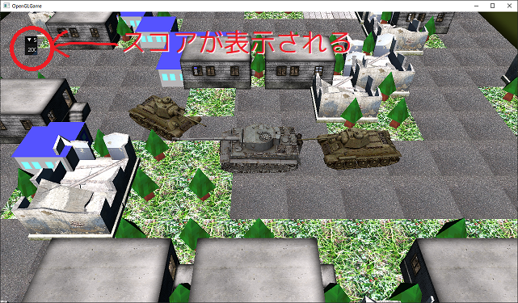

[OpenGL 3D 2020 第14回]

# 腐った脳みそに知能を宿らせる

## 習得目標

* ステンシルバッファの使い方。
* 影を描画する方法。
* アクターのベロシティ(速度)を制御して対象に向かって移動させる方法。

第14回ではまずアクターの影を描画します。そして、ゾンビがプレイヤーを追いかけて攻撃してくるようにします。

## 1. ステンシル・バッファ

### 1.1 3Dげーむにおける影の重要性

古い時代のゲームを除けば、すべてのゲームのキャラクターの足元には影が表示されています。影が重要な理由は、わたしたち人間は無意識のうちに、影によって物体の相対的な位置関係を認識しているからです。

<p align="center">


<br>
[影のない2Dゲーム(左=ゼビウス 中=ロックマン6 右=ゴールデンアックス)]
</p>

特に3Dゲームは2Dゲームより高さが分かりにくい内容のものが多いため、影は位置関係を知るための重要な手がかりになります。

<p align="center">

<br>
[影のある3Dゲーム(左=ジャンピングフラッシュ 右=コールオブデューティ)]
</p>

しかし、現実のようにリアルな影を描画するのはかなり複雑な問題です。さらに、リアルにしようとすればするほど描画に必要な計算時間も増えます。

そこで多くのゲームでは、ゲームに求められるリアルさの程度と影の描画にかけられる時間のバランスを考えて、影の描画技法を選択することになります。

### 1.2 さまざまな影の描画技法

影を描画することは、コンピューターグラフィックスの重要な研究領域のひとつです。そのため、これまでにさまざまな描画技法が考案されてきました。代表的な技法を以下に示します。

* 書き割りの影
* テクスチャマッピング
* デカール
* ポリゴン投影
* シャドウボリューム
* デプスシャドウ

#### 書き割りの影

>利点: プログラム不要。<br>
>欠点: 動く物体には使えない。光源が動く場合は使えない。

光源も物体も動かない場合、影がどこにどのように落ちるかは決まっています。ですから、モデルのテクスチャに影を書き込んでおくことができます。

動く物体には使えないので、他の技法と組み合わせて使われることが多いです。

この技法は3D特有のものではなく、2Dゲームでも普通に使われています。

#### テクスチャマッピング

>利点: プログラムが簡単。処理が高速。<br>
>欠点: 影の形がモデルと合わない。凹凸のある地形が苦手。自分に自分の影が落ちない。

「テクスチャマッピング」技法は、影の描画の中でも最も単純なものです。これは影の形をしたテクスチャを三角形や四角形のモデルに貼り付けて、キャラクターの足元に描画する技法です。

あまりに簡単な技法なので、処理は非常に高速です。

要するに「足元に影の絵を敷いて目をごまかす」ということです。子供だましのようですが、実際に人間は「影の有無」には敏感でも「影の形状」にはそこまで注意を払いませんから、よほど元の形状と違っていない限り、その不自然さはあまり気にならないようです。

多くの場合、ぼんやりした円形の画像が使われます。あまり元の形状に合わせた影を描いてしまうと、キャラクターをアニメーションさせたときに不自然さが増してしまうからです。

アニメーションに対応する数の影画像を用意すればよりリアルな影を描画することができますが、影画像を描く手間がかかること、そして影画像を読み込むメモリが増えることからあまり行われることはありません。

一枚板のモデルなので、地形に凹凸があると影の一部が消えたり浮いてしまったりします。

この技法も3D特有のものではなく、2Dゲームでも同様の技法が使われています。

#### デカール

>利点: 凹凸のある地形に対応できる。処理が高速。<br>
>欠点: プログラムが少し大変。影の形がモデルと合わない。自分に自分の影が落ちない。

影が落ちる範囲にある地形ポリゴンを取得し、そのポリゴンに対して影テクスチャを描画する技法です。凹凸のある地形でも自然な影が表示できます。

影が落ちる範囲にある地形ポリゴンを探す必要があるため、テクスチャマッピングに比べると時間がかかります。

#### ポリゴン投影

>利点: プログラムが簡単。影の形がモデルと一致。<br>
>欠点: 凹凸のある地形が苦手。自分に自分の影が落ちない。

車に轢かれたカエルのようにぺしゃんこに潰したモデルを、キャラクターの足元に描画する技法です。

特別なことをしなくてもキャラクターの形状やアニメーションに対応できる点で、テクスチャマッピング技法より優れています。ただし、モデルを2回描画しなければならないため、描画にはそれなりに時間がかかります。

描画時間の増加を軽減するため、影専用の低ポリゴンモデルを用意することが多いです。低ポリゴンモデルはなので細かい部分は実際のモデルとは違ってしまいますが、先に述べたとおり人間は影の細かい部分までは見ないので、問題になることはまずありません。

モデルを平面につぶして描画するため、地形に凹凸があると影の一部が消えたり浮いてしまったりします。

地形の凹凸に対応するにはポリゴン投影した影をテクスチャに描画し、デカール技法と組み合わせて描画します。

#### シャドウボリューム

>利点: 凹凸のある地形に対応できる。影の形がモデルと一致。自分に自分の影が落ちる。<br>
>欠点: プログラムが大変。処理が低速。

「影になる空間」を表すモデルを作り、そのモデルの内側に入ったピクセルを暗くすることで影を描画する技法です。この「影になる空間」のことを「シャドウボリューム」と呼びます。

この技法では、キャラクターの腕や頭の影が身体に投影されるような表現(「セルフシャドウ」といいます)が可能です。シャドウボリュームはキャラクターの向きやアニメーションに応じて作り直さなくてはならないため、描画にはかなりの時間がかかります。

この技法でも、描画時間を短縮するために低ポリゴンモデルを使うことが多いです。

#### デプスシャドウ

>利点: 凹凸のある地形に対応できる。影の形がモデルと一致。自分に自分の影が落ちる。<br>
>欠点: プログラムが大変。処理が低速。

「光源から見た3D空間」を描画し、カメラから見た3D空間を描画するときは「光源から見た3D空間」の描画結果と比較することで、影になるかならないかを判定する技法です。

シャドウボリュームと同じく、セルフシャドウが可能です。3D空間の描画を2回行わなくてはならないため、描画にはかなりの時間がかかります。

この技法でも、低ポリゴンモデルを使うことで描画時間を減らすことができます。

### 1.3 どの技法を選ぶべきか

実際の3Dゲームでは、いずれかひとつの技法だけで影を表現することは少なく、大抵は上記の技法を組み合わせて使っています。

しかしながら、これから複数の技法をマスターして組み合わせるには時間がかかりすぎますので、どれかひとつだけを選んで作成することにします。

最も簡単なのは「テクスチャマッピング」技法ですが、キャラクター以外の物体には使いづらいため「書き割りの影」などを併用する必要があり、「どれかひとつだけ」というルールから外れてしまいます。

「デカール」技法は凹凸に対応できるのは魅力的なのですが、プログラムするには一定の3Dグラフィックスの知識が要求されます。たとえ写したプログラムが動いたとしても、十分な知識がなくては何が行われているかを理解することは難しいでしょう。

「シャドウボリューム」や「デプスシャドウ」はかなりリアルな影を描画できますが、デカール技法以上に高度な技術と知識が必要です。

残るのは「ポリゴン投影」です。最も単純なポリゴン投影は「Y座標を0にして描画」するだけなのでとても簡単ですし、それでいて、あらゆる図形に対応することができます。それに、それほど高度な知識も必要ありません。

このようなわけで、本テキストでは「ポリゴン投影」による影描画を作成していきます。

<div style="page-break-after: always"></div>

## 2. ポリゴン投影による影の描画

### 2.1 アクターをぺちゃんこにする行列

1.3節でも書きましたが、最も単純なポリゴン投影は「Y座標を`0`にして描画する」ことです。これはモデルを「Y座標`0`の平面に投影する」ことを意味しています。

Y座標を`0`にする最も簡単な方法は「Y座標に`0`を掛ける」ことで、これは行列によって実行できます。

<p align="center">
<br>
</p>

上記の行列の`00`の部分がX座標に掛けられる値、`11`の部分がY座標に掛けられる値、`22`の部分がZ座標に掛けられる値です。Y座標に`0`を掛けるには`11`に`0`を指定すればよさそうです。つまり、

<p align="center">
<br>
[Yに0を掛ける行列]
</p>

という行列を作ります。そして、この行列をモデル行列とビュー行列の間に入れます。

とりあえず影を描画するプログラムを書き始めましょう。`MainGameScene.cpp`を開き、`Render`メンバ関数の中にある「点光源の位置を描画するプログラム」の下に、次のプログラムを追加してください。

```diff
     texTree->Bind(0);
     primitiveBuffer.Get(GameData::PrimNo::tree).Draw();
   }
+
+  // アクターの影を描画.
+  {
+    // ぺちゃんこ行列(Y座標を0にする行列)を作成.
+    const glm::mat4 matShadow(
+      1.00f, 0.00f, 0.00f, 0.00f,
+      0.00f, 0.00f, 0.00f, 0.00f,
+      0.00f, 0.00f, 1.00f, 0.00f,
+      0.00f, 0.00f, 0.00f, 1.00f);
+
+    // ぺちゃんこ行列→ビュー行列→プロジェクション行列の順番に掛ける行列を作る.
+    const glm::mat4 matShadowVP = matVP * matShadow;
+
+    // ぺちゃんこビュープロジェクション行列を使って全てのアクターを描画する.
+    for (const auto& actor : actors) {
+      actor->Draw(*pipeline, matShadowVP);
+    }
+  }

   // 2D表示.
   {
     glDisable(GL_CULL_FACE);
     glDisable(GL_DEPTH_TEST);
```

プログラムが書けたらビルドして実行してください。アクターの足元に何かがチラチラと表示されていたら成功です。

<p align="center">
<br>
</p>

### 2.2 ぺちゃんこアクターを少し浮かせる

あのチラチラと見えている不気味なモノは何なのでしょう…驚くなかれ、実はあれこそがぺちゃんこにされたモデルなのです。

ぺちゃんこになったモデルと地面はどちらもY座標が`0`なので、どちらが手前に表示されるかは微妙な計算の誤差によって決まります。その結果があの目ざわりなチラツキです。もし地面が表示されなかったらキレイなぺちゃんこモデルが表示されているはずなのです。

試しに地面を描画しないようにしてみましょう。`Render`メンバ関数にある、地面を描画するプログラムをコメントアウトしてください。

```diff
   // 地面を描画.
   {
     const glm::mat4 matModel = glm::mat4(1);
     const glm::mat4 matMVP = matProj * matView * matModel;
     pipeline->SetMVP(matMVP);
     pipeline->SetModelMatrix(matModel);
     texGround->Bind(0);
-   primitiveBuffer.Get(GameData::PrimNo::ground).Draw();
+   //primitiveBuffer.Get(GameData::PrimNo::ground).Draw();
   }
```

コメントアウトしたら、ビルドして実行してください。アクターの足元に、ぺちゃんこになったモデルが表示されていたら成功です。

<p align="center">
<br>
</p>

確かにぺちゃんこモデルが表示されていることが分かったので、地面の描画をもとに戻しましょう。

```diff
     pipeline->SetMVP(matMVP);
     pipeline->SetModelMatrix(matModel);
     texGround->Bind(0);
-   //primitiveBuffer.Get(GameData::PrimNo::ground).Draw();
+   primitiveBuffer.Get(GameData::PrimNo::ground).Draw();
   }
```

さて、問題はぺちゃんこモデルがちらつかないようにすることです。しかしこれは簡単で、ぺちゃんこモデルを地面より少しだけ高い位置に表示すればいいのです。

座標変換行列の`30 31 32`の部分が平行移動成分で、`30`がX軸の平行移動量、`31`がY軸の平行移動量、`32`がZ軸の平行移動量となっています。ですから、`31`の部分にほんの小さな数値、例えば`0.01`を入れてやります。

ぺちゃんこ行列を作成するプログラムを、次のように変更してください。

```diff
     const glm::mat4 matShadow(
       1.00f, 0.00f, 0.00f, 0.00f,
       0.00f, 0.00f, 0.00f, 0.00f,
       0.00f, 0.00f, 1.00f, 0.00f,
-      0.00f, 0.00f, 0.00f, 1.00f);
+      0.00f, 0.01f, 0.00f, 1.00f);

     // ぺちゃんこ行列→ビュー行列→プロジェクション行列の順番に掛ける行列を作る.
     const glm::mat4 matShadowVP = matShadow * matVP;
```

プログラムが書けたらビルドして実行してください。地面の上に、ぺちゃんこモデルがちらつかずに表示されていたら成功です。

<p align="center">
<br>
</p>

### 2.3 ぺちゃんこモデルを黒くする

現在の影は、見た目はぺちゃんこになっていますが、影というには色の主張が激しすぎます。影は影らしく黒くなっているべきでしょう。

モデルを黒くするには以下の3つの方法が考えられます。

1. ライトを真っ暗にする。
2. モデル全体の色を表すユニフォーム変数を追加する。
3. 影用のシェーダを追加する。

1は既存のシェーダを使えるのですぐにプログラムできます。2は多少プログラムを追加しなくてはなりませんが、モデル全体の色を操作する機能は影以外にも応用できます。

しかし、今回は3の「影用のシェーダを追加する」方法を使うことにします。というのは、1と2は汎用すぎて影の描画に使うと処理時間が無駄になるからです。

### 2.4 影用シェーダを追加する

まずは影用の頂点シェーダを作りましょう。ソリューションエクスプローラーを使って、プロジェクトの`Res`フォルダに`Shadow.vert`(シャドウ・バート)というファイルを追加してください。追加したファイルを開き、次のプログラムを追加してください。

```diff
+/**
+* 影用頂点シェーダ.
+*/
+#version 450 core
+
+// 入力変数
+layout(location=0) in vec3 vPosition;
+layout(location=2) in vec2 vTexcoord;
+
+// 出力変数
+layout(location=1) out vec2 outTexcoord;
+out gl_PerVertex {
+  vec4 gl_Position;
+};
+
+// ユニフォーム変数
+layout(location=0) uniform mat4 matMVP;
+
+// 頂点シェーダプログラム.
+void main()
+{
+  outTexcoord = vTexcoord;
+  gl_Position = matMVP * vec4(vPosition, 1.0);
+}
```

`VAO`を使い回せるように、ロケーション番号は他のシェーダと合わせています。そのため番号が飛び飛びになっている点に注意してください。

影の描画には、物体に色を付けるために使われる法線や色情報は不要なので、それらは読み込まないようにしています。

続いてフラグメントとシェーダを作成します。プロジェクトの`Res`フォルダに`Shadow.frag`(シャドウ・フラグ)というファイルを追加してください。追加したファイルを開き、次のプログラムを追加してください。

```diff
+/**
+* 影用フラグメントシェーダ.
+*/
+#version 450 core
+
+// 入力変数
+layout(location=1) in vec2 inTexcoord;
+
+// 出力変数
+out vec4 fragColor;
+
+// ユニフォーム変数
+layout(binding=0) uniform sampler2D texColor;
+
+// フラグメントシェーダプログラム.
+void main()
+{
+  fragColor.rgb = vec3(0);
+  fragColor.a = texture(texColor, inTexcoord).a;
+}
```

影用のフラグメントシェーダは`fragColor`に黒を指定するだけでも十分ですが、テクスチャに透明な部分がある場合に備えて、アルファ値だけはテクスチャの値を使うようになっています。

### 2.5 影用シェーダを読み込む

それでは作成した影用シェーダを読み込みますが、まず読み込み先となるシェーダ変数を追加します。`GameData.h`を開き、次のプログラムを追加してください。

```diff
   // 描画用のメンバ変数.
   std::shared_ptr<Shader::Pipeline> pipeline3D;
   std::shared_ptr<Shader::Pipeline> pipeline2D;
+  std::shared_ptr<Shader::Pipeline> pipelineShadow;
   Mesh::PrimitiveBuffer primitiveBuffer;
   Texture::Sampler sampler;
```

次に`GameData.cpp`を開き、`Initialize`メンバ関数に次のプログラムを追加してください。

```diff
   pipeline2D = std::make_shared<Shader::Pipeline>("Res/Simple.vert", "Res/Simple.frag");
   if (!pipeline2D || !*pipeline2D) {
     return false;
   }
+  pipelineShadow = std::make_shared<Shader::Pipeline>("Res/Shadow.vert", "Res/Shadow.frag");
+  if (!pipelineShadow || !*pipelineShadow) {
+    return false;
+  }

   // サンプラ・オブジェクトを作成する.
   sampler.SetWrapMode(GL_REPEAT);
```

### 2.6 影用シェーダを使った描画

それでは影用シェーダを使ってみましょう。`MainGameScene.cpp`を開き、影を描画するプログラムを次のように変更してください。

```diff
     // ぺちゃんこ行列→ビュー行列→プロジェクション行列の順番に掛ける行列を作る.
     const glm::mat4 matShadowVP = matShadow * matVP;
+
+    // 影用パイプランをバインド.
+    std::shared_ptr<Shader::Pipeline> pipelineShadow = GameData::Get().pipelineShadow;
+    pipelineShadow->Bind();

     // ぺちゃんこビュープロジェクション行列を使って全てのアクターを描画する.
     for (const auto& actor : actors) {
-      actor->Draw(*pipeline, matShadowVP);
+      actor->Draw(*pipelineShadow, matShadowVP);
     }
```

プログラムが書けたらビルドして実行してください。影が黒くなっていたら成功です。成功なのですが…コンソールウィンドウに大量のエラーメッセージが出力されていますね。

<p align="center">
<br>
</p>

### 2.7 通常の描画と影の描画を切り替える

エラーメッセージをよく見ると`SetModelMatrix`という関数でエラーが起きているらしいことが分かります。どうやらモデル行列の設定に失敗しているようです。

これは実は、影用シェーダは単独のモデル行列を使わないので、モデル行列用のユニフォーム変数が定義されていないことが原因です。

対策として、アクタークラスの`Draw`メンバ関数の引数に「何を描画するか」を指定できるようにします。

`Actor.h`を開き、次のプログラムを追加してください。

```diff
   Actor(std::string actorName, const Mesh::Primitive* prim,
     std::shared_ptr<Texture::Image2D> tex, const glm::vec3& pos);

   void Update(float deltTIme);
+
+  // 描画の種類.
+  enum DrawType {
+    color,  // 通常描画.
+    shadow, // 影描画.
+  };
-  void Draw(const Shader::Pipeline& pipeline, const glm::mat4& matVP) const;
+  void Draw(const Shader::Pipeline& pipeline, const glm::mat4& matVP,
+    DrawType drawType) const;

  void SetCylinderCollision(float top, float bottom, float radius);
  void SetBoxCollision(const glm::vec3& min, const glm::vec3& max);
```

次に`Actor.cpp`を開き、`Draw`メンバ関数の引数を次のように変更してください。

```diff
 * @param pipeline 行列の設定先となるパイプラインオブジェクト.
 * @param matVP    描画に使用するビュープロジェクション行列.
+* @param drawType 描画の種類.
 */
-void Actor::Draw(const Shader::Pipeline& pipeline, const glm::mat4& matVP) const
+void Actor::Draw(const Shader::Pipeline& pipeline, const glm::mat4& matVP,
+  DrawType drawType) const
 {
   // プリミティブが設定されていないときは何もせず終了.
   if (!primitive) {
```

続いて、`Draw`メンバ関数の中で`SetModelMatrix`関数を呼び出している部分を、次のように変更してください。

```diff
   const glm::mat4 matModel =
     matTranslate * matRotateY * matRotateZ * matRotateX * matScale;

   // GPUメモリに行列を転送.
+  if (drawType != DrawType::shadow) {
+    pipeline.SetModelMatrix(matModel);
+  }
   pipeline.SetMVP(matVP * matModel);

   // テクスチャイメージスロット0番にテクスチャを割り当てる.
   texture->Bind(0);
```

これで描画の種類が「影」の場合は`SetModelMatrix`関数を呼び出さなくなります。

それでは`MainGameScene.cpp`に戻り、`Draw`メンバ関数の中でアクターを描画している部分に、描画の種類をしていしましょう。

まず通常のアクターの描画を次のように変更してください。

```diff
   // アクターリストを描画.
   const glm::mat4 matVP = matProj * matView;
   for (size_t i = 0; i < actors.size(); ++i) {
-    actors[i]->Draw(*pipeline, matVP);
+    actors[i]->Draw(*pipeline, matVP, Actor::DrawType::color);
   }

   // 点光源の位置を描画.
```

次に影の描画を次のように変更してください。

```diff
     pipelineShadow->Bind();
     const glm::mat4 matShadowVP = matVP * matShadow;
     for (const auto& actor : actors) {
-      actor->Draw(*pipelineShadow, matShadowVP);
+      actor->Draw(*pipelineShadow, matShadowVP, Actor::DrawType::shadow);
     }
   }

   // 2D表示.
```

プログラムが書けたらビルドして実行してください。影が黒色で表示あれ、コンソールウィンドウにエラーが出力されていなければ成功です。

### 2.8 影を光源の向きに合わせて投影する


