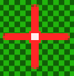

[OpenGL 3D 2020 第15回]

# 

## 習得目標

* GLFWライブラリでマウス入力を扱う方法
* 
* 


## 1. マウスカーソルと3D空間

### 1.1 マウスカーソルの座標を取得する

敵に追いかけられているとき、わざわざその敵に向かっていくようなことはしないものです。しかし、現在のプログラムでは、敵を撃ちたければ敵のいる方向に前進しなくてはなりません。

これはあまりよい戦い方とは言えません。そこでマウスカーソルによってプレイヤーの向きを指定できるようにしようと思います。自由に向きを指定できるようになれば360度どの方向にも射撃できるため、死角もなくなりますね。

GLFWライブラリによってマウスカーソルの座標を取得するには、`glfwGetCursorPos`(ジーエルエフダブリュー・ゲット・カーソル・ポス)関数を使います。

<pre class="tnmai_code"><strong>【書式】</strong>
void glfwGetCursorPos(GLFWウィンドウのアドレス, X座標を格納する変数のアドレス, Y座標を格納する変数のアドレス);
</pre>

マウスカーソル座標はウィンドウ左上を原点とし、右方向を+X、下方向を+Yとする「ウィンドウ座標系」で表されます。

「ウィンドウ座標系」はOpenGLのどの座標系とも違っているので、マウスカーソル座標をOpenGLで扱えるようにするには何らかの座標変換を行わなくてはなりません。

また、マウスカーソル座標が必要になるたびに`glfwGetCursorPos`関数を実行するのは面倒です。そこで、`GameData`クラスの`Update`メンバ関数でマウスカーソル座標を取得して、`GameData`クラスのメンバ変数に記録しておくことにします。このメンバ変数の名前は`cursorPosition`(カーソル・ポジション)としましょう。

同様に、毎回座標変換プログラムを書くのも面倒ですから、「ウィンドウ座標系からOpenGLの座標系への変換」も`Upadte`メンバ関数でやってしまいましょう。結果として、`cursorPosition`はOpenGLの座標系におけるマウスカーソル座標を表すことになります。

それでは`GameData.h`を開き、`GameData`クラスの定義に次のプログラムを追加してください。

```diff
   uint32_t keyPressed = 0; // 押しているキー.
   uint32_t keyPressedInLastFrame = 0; // 最後のフレームで押されたキー.
+
+  // マウスカーソルの座標(画面中心を0とするOpenGLの二次元ワールド座標系).
+  glm::vec2 cursorPosition = glm::vec2(0);

   // プリミティブ番号.
   // プリミティブの読み込み順と一致させること.
   enum PrimNo {
```

次に`GameData.cpp`を開き、`GameData::Update`メンバ関数に次のプログラムを追加してください。

```diff
     // 押されているキーを更新.
     keyPressed = newKey;
   }
+
+  // マウスカーソル座標の更新.
+  {
+    // マウスカーソル座標(左上原点、下が+Yのウィンドウ座標系)を変数xとyに取得.
+    double x, y;
+    glfwGetCursorPos(window, &x, &y);
+
+    /* 取得した座標をOpenGL座標系に変換. */
+
+    // ウィンドウサイズを変数wとhに取得.
+    int w, h;
+    glfwGetWindowSize(window, &w, &h);
+
+    // 「左下原点、上が+Y」の座標系(OpenGLのスクリーン座標系)に変換.
+    // 1を引いているのは、例えば高さ720の場合、座標が取りうる範囲は0～719の720段階になるため。
+    y = (h - 1) - y;
+
+    // 「画面中心が原点、上が+Y」の座標系(OpenGLの二次元ワールド座標系)に変換.
+    x -= w * 0.5;
+    y -= h * 0.5;
+
+    // 座標をfloat型に変換してcursorPositionメンバ変数に代入.
+    // (OpenGLは基本的にfloat型で処理を行うので、型を合わせておくと扱いやすい).
+    cursorPosition.x = static_cast<float>(x);
+    cursorPosition.y = static_cast<float>(y);
+  }
 }

 /**
 * プリミティブを描画する.
```

これで`Update`メンバ関数が実行されるたびに、マウスカーソル座標が更新されるようになります。

### 1.2 マウスカーソル位置を表示する

実際にマウスカーソルの座標が取得できているかを確認するために、マウスカーソル座標に画像を表示してみましょう。プロジェクトの`Res`フォルダに`MouseCursor.tga`という画像ファイルを追加し、大きさを32x32ピクセルにしてください。

次に`Ctrl+A`で全体を選択して`delete`で消去すると、画像全体が透明になります。透明になったら、画像の中心が分かるように好きな色で十字などを描いてください。

<p align="center">

</p>

<pre class="tnmai_assignment">
<strong>【課題01】</strong>
<code>MainGameScene</code>クラスに<code>texMouseCursor</code>という名前で<code>std::shared_ptr&lt;Texture::Image2D&gt;</coce>型のテクスチャ変数を追加しなさい。
<code>MainGameScene::Initialize</code>メンバ関数の中で、<code>texMouseCursor</code>に<code>MouseCursor.tga</code>を読み込みなさい。
</pre>

続いて、テクスチャとして読み込んだカーソル画像を表示します。`MainGameScene.cpp`を開き、`Render`メンバ関数に次のプログラムを追加してください。

```diff
     std::shared_ptr<Shader::Pipeline> pipeline2D = GameData::Get().pipeline2D;

     pipeline2D->Bind();
+
+    // マウスカーソルを表示.
+    {
+      // マウスカーソル画像のテクスチャのピクセル数を拡大率に設定.
+      const glm::mat4 matModelS = glm::scale(glm::mat4(1),
+        texMouseCursor->Width(), texMouseCursor->Height(), 1));
+
+      // マウスカーソル座標を表示位置に設定.
+      const glm::mat4 matModelT = glm::translate(glm::mat4(1),
+        glm::vec3(GameData::Get().cursorPosition, 0));
+
+      // MVP行列を計算し、GPUメモリに転送.
+      const glm::mat4 matMVP = matProj * matView * matModelT * matModelS;
+      pipeline2D->SetMVP(matMVP);
+
+      // マウスカーソル画像のテクスチャをグラフィックスパイプラインに割り当てる.
+      texMouseCursor->Bind(0);
+
+      // 上の設定が適用された四角形を描画.
+      primitiveBuffer.Get(GameData::PrimNo::plane).Draw();
+    }

     // ゲームクリア画像を描画.
     if (isGameClear) {
       const glm::mat4 matModelS = glm::scale(glm::mat4(1),
```

プログラムが書けたらビルドして実行してください。矢印型のマウスカーソルの下に、自分で描いた画像が表示されていたら成功です。

### 1.3 標準の矢印型マウスカーソルを非表示にする

自分で作ったカーソルを表示できるようになると、Windowsが表示している矢印型カーソルが邪魔になってきます。この標準カーソルは消すことができます。

GLFWライブラリの場合、`glfwSetInputMode`(ジーエルエフダブリュー・セット・インプット・モード)という関数で標準カーソルの表示・非表示を設定します。

<pre class="tnmai_code"><strong>【書式】</strong>
void glfwSetInputMode(設定するウィンドウ, 設定項目, 設定する値);
</pre>

`glfwSetInputMode`関数で設定可能な項目を以下に示します。

| 設定項目                  | 内容                                     |
|:--------------------------|:-----------------------------------------|
| GLFW_CURSOR               | マウスカーソルの表示状態                 |
| GLFW_STICKY_KEYS          | キーの押下状態の取りこぼしを防ぐ         |
| GLFW_STICKY_MOUSE_BUTTONS | マウスボタンの押下状態の取りこぼしを防ぐ |
| GLFW_LOCK_KEY_MODS        | CAPSLOCKキーの状態を取得する             |
| GLFW_RAW_MOUSE_MOTION     | マウスが実際に動いた距離を取得する       |

設定する値は設定項目によって違うので、今回はマウスカーソルの表示状態についてだけ説明します。他の項目の詳細については`https://www.glfw.org/docs/3.3/group__input.html`の`glfwSetInputMode`関数を参照してください。

マウスカーソルの表示状態を設定するには「設定項目」に`GLFW_CURSOR`(ジーエルエフダブリュー・カーソル)を指定し、「設定する値」に以下のいずれかの値を指定します。

| 設定する値           | 内容                                             |
|:---------------------|:-------------------------------------------------|
| GLFW_CURSOR_NORMAL   | 標準のマウスカーソルを表示する                   |
| GLFW_CURSOR_HIDDEN   | ウィンドウの内側のみマウスカーソルを非表示にする |
| GLFW_CURSOR_DISABLED | 常にマウスカーソルを非表示にする                 |

最初は`GLFW_CURSOR_NORMAL`(ジーエルエフダブリュー・カーソル・ノーマル)に設定されています。残りの2つのどちらもマウスカーソルを非表示になります。

基本的には`GLFW_CURSOR_HIDDEN`(ジーエルエフダブリュー・カーソル・ヒドゥン)を指定します。`GLFW_CURSOR_DISABLED`(ジーエルエフダブリュー・カーソル・ディセーブルド)の場合、ウィンドウ右上の✕ボタンなども押せなくなるからです。

それでは標準マウスカーソルを非表示にしましょう。現在のところ照準を表示するのはメインゲーム画面だけなので、メインゲーム画面の初期化時に消して、終了時にもとに戻すことにします。

`MainGameScene.cpp`を開き、`Initialize`メンバ関数の末尾に次のプログラムを追加してください。

```diff
   // ゲームデータの初期設定.
   GameData& gamedata = GameData::Get();
   gamedata.killCount = 0;
+
+  // 標準マウスカーソルを非表示にする.
+  glfwSetInputMode(gamedata.window, GLFW_CURSOR, GLFW_CURSOR_HIDDEN);

   std::cout << "[情報] MainGameSceneを開始.\n";
   return true;
 }
```

次に、`Finalize`メンバ関数に次のプログラムを追加してください。

```diff
 void MainGameScene::Finalize()
 {
+  // 標準マウスカーソルを表示する.
+  GameData& gamedata = GameData::Get();
+  glfwSetInputMode(gamedata.window, GLFW_CURSOR, GLFW_CURSOR_NORMAL);
+
   std::cout << "[情報] MainGameSceneを終了.\n";
 }
```

プログラムが書けたらビルドして実行してください。メインゲーム画面で矢印型マウスカーソルが非表示になり、ゲームクリアしてタイトル画面に戻ったときに、標準カーソルが復活していれば成功です。

### 1.4 マウスカーソル座標から伸びる直線の作り方

これでマウスカーソル座標を取得できるようになりました。しかしこの座標は画像などを表示するための二次元のワールド座標で、アクターが存在する三次元のワールド座標ではありません。

そのため、プレイヤーの向きとして扱うには2Dワールド座標から3Dワールド座標に変換しなくてはなりません。

このときの「3Dワールド座標」は「プレイヤーの腰のあたりの高さにあるXZ平面上の点」となります。「地面上の点」にしないのは、斜め上から見下ろすような視点の場合、プレイヤーの向きとマウスカーソル座標が視覚的にずれて見えるのを防ぐためです。

XZ平面上の座標は、カーソル座標をカメラの視錐台の手前側の面と奥側の面に投影し、この2点を結んだ線とXZ平面との交差判定を行うことで調べられます。

視錐台の手前側と奥側に投影した座標は以下の手順で計算できます。

1. 2Dワールド座標から2Dクリップ座標に変換。
2. ビュープロジェクション行列の逆行列を計算。
3. 手前側の平面上の3Dワールド座標を計算(2Dクリップ座標に`-1`のZ座標を加えて3Dクリップ座標を作り、逆行列と掛け合わせる)。
4. 奥側の平面上の3Dワールド座標を計算(2Dクリップ座標に`+1`のZ座標を加えて3Dクリップ座標を作り、逆行列と掛け合わせる)。

ところで、上記の手順は入力に関する処理なので、書く場所は`ProcessInput`メンバ関数がよいと思われます。ところが、「ビュープロジェクション行列」は`Render`メンバ関数で作成しているため、`ProcessInput`メンバ関数からは参照できません。

そこで、ビュープロジェクション行列をメンバ変数にして、どのメンバ関数からも参照できるようにします。また、ビュープロジェクション行列の作成は「データの更新」だと考えられるので、`Update`メンバ関数に移動させます。

### 1.5 ビュープロジェクション行列を作成する場所を変更する

ビュープロジェクション行列が複数のメンバ関数から参照できるようにメンバ変数にしましょう。`MainGameScene.h`を開き、`MainGameScene`クラスの定義に次のプログラムを追加してください。

```diff
   std::shared_ptr<Texture::Image2D> texBullet;
   std::shared_ptr<Texture::Image2D> texGameClear;
   Shader::PointLight pointLight;
+
+  glm::mat4 matProj = glm::mat4(1); // プロジェクション行列.
+  glm::mat4 matView = glm::mat4(1); // ビュー行列.

   ActorList actors; // アクター配列.
   ActorPtr playerActor; // プレイヤーアクター.
```

次に、`Render`メンバ関数からビュープロジェクション行列を作成するプログラムを切り取ります。

```diff
   pipeline->SetLight(directionalLight);
   pipeline->SetLight(pointLight);
-
-  // カメラをプレイヤーアクターのななめ上に配置.
-  const glm::vec3 viewPosition = playerActor->position + glm::vec3(0, 7, 7);
-  // プレイヤーアクターの足元が画面の中央に映るようにする.
-  const glm::vec3 viewTarget = playerActor->position;
-
-  // 座標変換行列を作成.
-  int w, h;
-  glfwGetWindowSize(window, &w, &h);
-  const float aspectRatio = static_cast<float>(w) / static_cast<float>(h);
-  const glm::mat4 matProj =
-    glm::perspective(glm::radians(45.0f), aspectRatio, 0.1f, 500.0f);
-  const glm::mat4 matView =
-    glm::lookAt(viewPosition, viewTarget, glm::vec3(0, 1, 0));

   primitiveBuffer.BindVertexArray();
```

切り取ったプログラムを`Update`メンバ関数の末尾に貼り付けてください。

```diff
       std::cout << "[情報] ゲームクリア条件を達成\n";
     }
   }
+
+  // カメラをプレイヤーアクターのななめ上に配置.
+  const glm::vec3 viewPosition = playerActor->position + glm::vec3(0, 7, 7);
+  // プレイヤーアクターの足元が画面の中央に映るようにする.
+  const glm::vec3 viewTarget = playerActor->position;
+
+  // 座標変換行列を作成.
+  int w, h;
+  glfwGetWindowSize(window, &w, &h);
+  const float aspectRatio = static_cast<float>(w) / static_cast<float>(h);
+  const glm::mat4 matProj =
+    glm::perspective(glm::radians(45.0f), aspectRatio, 0.1f, 500.0f);
+  const glm::mat4 matView =
+    glm::lookAt(viewPosition, viewTarget, glm::vec3(0, 1, 0));
 }

 /**
 * メインゲーム画面を描画する.
```

それから、ビュープロジェクション行列をメンバ変数で置き換えます。座標変換行列を作成するプログラムを次のように変更してください。

```diff
   // 座標変換行列を作成.
   int w, h;
   glfwGetWindowSize(window, &w, &h);
   const float aspectRatio = static_cast<float>(w) / static_cast<float>(h);
-  const glm::mat4 matProj =
-    glm::perspective(glm::radians(45.0f), aspectRatio, 0.1f, 500.0f);
+  matProj = glm::perspective(glm::radians(45.0f), aspectRatio, 0.1f, 500.0f);
-  const glm::mat4 matView =
-    glm::lookAt(viewPosition, viewTarget, glm::vec3(0, 1, 0));
+  matView = glm::lookAt(viewPosition, viewTarget, glm::vec3(0, 1, 0));
 }

 /**
 * メインゲーム画面を描画する.
```

プログラムが書けたらビルドして実行してください。メイン画面がこれまでと同じ見え方をしていれば成功です。

### 1.6 マウスカーソル座標を視錐台の手前と奥に投影する

ビュープロジェクション行列の問題が解決したので、ようやくマウスカーソル座標の変換に手を付けられます。まずはやることをコメントに書きます。`MainGameScene.cpp`を開き、`ProcessInput`メンバ関数に次のプログラムを追加してください。

```diff
 void MainGameScene::ProcessInput(GLFWwindow* window)
 {
+  /* マウスカーソル座標をワールド座標に変換 */
+  {
+    // 2Dワールド座標から2Dクリップ座標に変換.
+    // ビュープロジェクション行列の逆行列を計算.
+    // 手前側の平面上の3Dワールド座標を計算.
+    // 奥側の平面上の3Dワールド座標を計算.
+  }
+
   // プレイヤーアクターを移動させる.
   glm::vec3 direction = glm::vec3(0);
   if (glfwGetKey(window, GLFW_KEY_A) == GLFW_PRESS) {
```

それでは、コメントに対応するプログラムを1行ずつ作成していきます。まずはクリップ座標への変換です。

クリップ座標系はXYZのすべての軸が`-1`～`+1`の大きさを持つ座標系です。対して、二次元ワールド座標はX軸が`-ウィンドウ幅/2`～`+ウィンドウ幅/2`、Y軸が`-ウィンドウ高さ/2`～`+ウィンドウ高さ/2`の大きさです。


このことから、二次元ワールド座標をクリップ座標に変換するには「二次元ワールド座標をウィンドウサイズの半分の値で割るとクリップ座標になる」ことが分かります。

>二次元ワールド座標をウィンドウサイズの半分の値で割るとクリップ座標になる

座標変換プログラムに次のプログラムを追加してください。

```diff
   /* マウスカーソル座標をワールド座標に変換 */
   {
     // 2Dワールド座標から2Dクリップ座標に変換.
+    const glm::vec2 pos2DClip((cursor.x / (w * 0.5), cursor.y / (h * 0.5));
+
     // ビュープロジェクション行列の逆行列を計算.
     // 手前側の平面上の3Dワールド座標を計算.
     // 奥側の平面上の3Dワールド座標を計算.
```

次にビュープロジェクション行列の逆行列を計算します。逆行列の計算には`glm::inverse`(ジーエルエム・インバース)関数を使うのでしたね。計算結果はローカル変数`matInverseVP`(マット・インバース・ブイピー)に代入します。座標変換プログラムに次のプログラムを追加してください。

```diff
     // 2Dワールド座標から2Dクリップ座標に変換.
     const glm::vec2 pos2DClip((cursor.x / (w * 0.5), cursor.y / (h * 0.5));

     // ビュープロジェクション行列の逆行列を計算.
+    const glm::mat4 matInverseVP = glm::inverse(matProj * matView);
+
     // 手前側の平面上の3Dワールド座標を計算.
     // 奥側の平面上の3Dワールド座標を計算.
   }
```

座標と逆行列が手に入ったので、視錐台の手前側の平面上の座標および奥側の平面上の座標を計算します。

```diff
     // ビュープロジェクション行列の逆行列を計算.
     const glm::mat4 matInverseVP = glm::inverse(matProj * matView);

     // 手前側の平面上の3Dワールド座標を計算.
+    const glm::vec3 posNear = matInverseVP * glm::vec4(pos2DClip, -1, 1);
     // 奥側の平面上の3Dワールド座標を計算.
+    const glm::vec3 posFar = matInverseVP * glm::vec4(pos2DClip, 1, 1);
   }

   // プレイヤーアクターを移動させる.
   glm::vec3 direction = glm::vec3(0);
```

これで、`posNear`(ポス・ニア)には手前側平面上のマウスカーソル座標が入り、`posFar`(ポス・ファー)には奥側平面上のマウスカーソル座標が入るはずです。

>**【どうして3Dクリップ座標なのにvec4を使っているの？】**<br>
>座標変換では、次元をひとつ増やした「同次座標系」という座標系で計算することが多いのですが、これは「そのほうが便利だから」です。例えば2D座標系の場合、2D座標系のままでは「図形をZ軸に対して回転させる」ということができません。そこで一時的に次元を増やして3D座標変換を行い、計算後に増やした次元を削除します。<br>
>増やした次元の初期値には適当に都合のいい値を設定します。2D座標系をZ軸回転させる場合、増やしたZ座標の値を`0`にしておくと変換結果が予測しやすいです。同様に3Dの座標変換では増えた次元を使って平行移動を行いますが、この場合は増えた次元を`1`にすると結果が予測しやすいのです。

### 1.7 線分と平面の交差判定

1.6節で求めた2点を結ぶ<ruby>線分<rt>せんぶん</rt></ruby>と、プレイヤーの腰の高さにあるXZ平面との交差判定を作っていきます。まず直線および平面をあらわす構造体を定義しましょう。今のところ衝突判定は`Actor.h`、`Actor.cpp`に書いているので、線分と平面の交差判定も`Actor.h`に定義することにします。

線分の構造体名は`Segment`(セグメント)、平面の構造体名は`Plane`(プレーン)とします。交差判定関数は`Intersect`(インターセクト)とします。`Actor.h`を開き、ファイルの末尾に次のプログラムを追加してください。

```diff
 void UpdateActorList(ActorList&, float);
 bool DetectCollision(Actor&, Actor&, bool block);
+
+/**
+* 線分.
+*/
+struct Segment
+{
+  glm::vec3 start; // 線分の始点.
+  glm::vec3 end;   // 線分の終点.
+};
+
+/**
+* 平面.
+*/
+struct Plane
+{
+  glm::vec3 point;  // 平面上の任意の座標.
+  glm::vec3 normal; // 平面の法線.
+};
+
+bool Intersect(const Segment& seg, const Plane& plane, glm::vec3* p);

 #endif // ACTOR_H_INCLUDED
```

それでは交差判定を書きましょう。`Actor.cpp`を開き、`DetectCollision`関数の定義の下に、次のプログラムを追加してください。

```diff
   default:
     return false;
   }
 }
+
+/**
+* 線分と平面が交差する座標を求める.
+*
+* @param seg   線分.
+* @param plane 平面.
+* @param p     線分と平面の交点を格納する変数のアドレス. 戻り値がtrueの場合のみ有効.
+*
+* @retval true  交差している.
+* @retval false 交差していない.
+*/
+bool Intersect(const Segment& seg, const Plane& plane, glm::vec3* p)
+{
+  // 線分の始点から終点へ移動したとき、平面に近づく距離denomを求める.
+  const glm::vec3 v = seg.end - seg.start;
+  const float denom = glm::dot(plane.normal, v);
+
+  // 近づく距離がほぼ0の場合、線分は平面と平行なので交差しない.
+  if (std::abs(denom) < 0.0001f) {
+    return false;
+  }
+
+  // 平面から線分の始点までの垂直距離を求める.
+  const float distance = glm::dot(plane.normal, plane.point - seg.start);
+
+  // 始点を0、終点を1として、交点の位置を示す比率tを計算する.
+  const float t = distance / denom;
+
+  // tが0未満または1より大きい場合、交点は線分の外側にあるので交差しない.
+  if (t < 0 || t > 1) {
+    return false;
+  }
+
+  // 交点は線分上にあるので交差している.
+  // 線分ベクトルvと比率tから交点座標を計算して*pに代入.
+  *p = seg.start + v * t;
+  return true;
+}
```

### 1.8 線分と平面の交点を取得する

`Intersect`関数を使って交点を求めましょう。まずは交点の座標を格納するメンバ変数を作ります。変数名は`mouseCurosrPosition`(マウス・カーソル・ポジション)はちょっと長すぎるので、`posMouseCursor`(ポス・マウス・カーソル)とします。

`MainGameScene.h`を開き、`MainGameScene`クラスに次のプログラムを追加してください。

```diff
   glm::mat4 matProj = glm::mat4(1); // プロジェクション行列.
   glm::mat4 matView = glm::mat4(1); // ビュー行列.
+
+  // マウスカーソル座標.
+  glm::vec3 posMouseCursor = glm::vec3(0);

   ActorList actors; // アクター配列.
   ActorPtr playerActor; // プレイヤーアクター.
```

>**【名前の先頭につける<ruby>接頭辞<rt>せっとうじ</rt></ruby>について】**<br>
>`pos`は`position`を短縮したものです。変数の意味を明確にするため、変数名の先頭に短縮形を付けることがあります。このような「名前の先頭につける短縮形」のことを「接頭辞(せっとうじ)」といいます。同じ目的で末尾につける場合もあり、末尾の場合は「接尾辞(せつびじ)」といいます。

それではマウスカーソルの3Dワールド座標を計算し、プレイヤーアクターの向きに反映しましょう。`MainGameScene.cpp`を開き、`ProcessInput`メンバ関数に次のプログラムを追加してください。

```diff
     const glm::vec3 posNear = matInverseVP * glm::vec4(pos2DClip, -1, 1);
     // 奥側の平面上の3Dワールド座標を計算.
     const glm::vec3 posFar = matInverseVP * glm::vec4(pos2DClip, 1, 1);
+
+    // マウスカーソル座標か視線方向に伸びる線分を定義.
+    const Segment seg = { posNear, posFar };
+    // プレイヤーの腰の高さのXZ平面を定義.
+    const Plane plane = { playerActor->position + glm::vec3(0, 1, 0), glm::vec3(0, 1, 0) };
+    // マウスカーソル線分とXZ平面の交点を求める.
+    if (Intersect(seg, plane, &posMouseCursor)) {
+      // 交点からプレイヤーアクターの向きを計算.
+      playerActor->rotation.y = std::atan2(
+        playerActor->position.z - posMouseCursor.z,
+        posMouseCursor.x - playerActor->position.x);
+    }
   }

   // プレイヤーアクターを移動させる.
   glm::vec3 direction = glm::vec3(0);
```

それから、既存のプレイヤーアクターの向きを設定するプログラムを削除します。`ProcessInput`メンバ関数を次のように変更してください。

```diff
     velocity.z += 1;
   }
   if (glm::length(direction) > 0) {
-    // 移動方向からプレイヤーアクターの向きを計算.
-    playerActor->rotation.y = std::atan2(-direction.z, direction.x);

     // 正規化することで、ななめ移動でも同じ速度で移動させる.
     const float speed = 4.0f; // プレイヤーアクターの速度(メートル毎秒).
```

プログラムが書けたらビルドして実行してください。マウスカーソルを動かし、プレイヤーが常にマウスカーソルの方向を向いていたら成功です。

<div style="page-break-after: always"></div>

## 2. 


GLFWライブラリでマウスホイールの状態を取得するには、GLFWウィンドウに対してコールバック関数を指定する必要があります。

>**コールバック関数って？**<br>
>事前に関数ポインタを設定し、何らかの条件が満たされたときに設定された関数が呼び出される仕組みにおいて、設定する関数のことを「コールバック関数」と呼びます。
>「コールバック」は「折り返し電話する」という意味の英単語です。ご家庭の留守番電話などに「〇〇です。～の要件でご相談したいので、折り返し電話をください。」というようなメッセージを聞いたことがあるかもしれません。おうちの方が帰宅してこのメッセージを聞いたら〇〇さんに電話を掛けることになるでしょう。この場合「〇〇さんの連絡先」が「コールバック関数」、「帰宅してこのメッセージを聞いた」というのが発動の「条件」に相当します。

### 1.2 スクロール値のコールバック関数を定義する

コールバック関数は関数の書式が決まっています。先ほどの説明で「〇〇さんの電話番号」の部分が「〇〇さんの郵便番号」だったら折り返し電話を掛けられませんよね。

マウスカーソルの座標を取得するコールバック関数は、次の書式で書かなくてはなりません。

<pre class="tnmai_code"><strong>【書式】</strong>
void コールバック関数名(GLFWwindow* window, double xoffset, double yoffset);
</pre>

ここで`window`引数は登録先のGLFWウィンドウ、`xoffset`(エックス・オフセット)引数と`yoffset`(ワイ・オフセット)引数は、カーソルが


