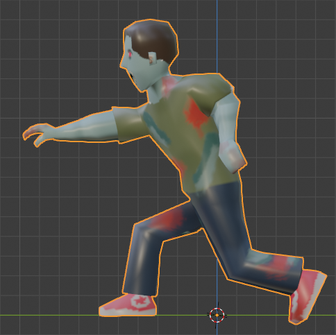

[OpenGL 3D 2020 第15回]

# マウスカーソルに向かって撃て！

## 習得目標

* GLFWライブラリでマウス入力を扱う方法。
* 線分と平面の交差判定。
* アクター状態を追加する方法と追加した状態の使い方。
* 衝突してもアクターを押し返さないようにする方法。

## 1. マウスカーソルと3D空間

### 1.1 マウスカーソルの座標を取得する

敵に追いかけられているとき、わざわざその敵に向かっていくようなことはしないものです。しかし、現在のプログラムでは、敵を撃ちたければ敵のいる方向に前進しなくてはなりません。

これはあまりよい戦い方とは言えません。そこでマウスカーソルによってプレイヤーの向きを指定できるようにしようと思います。自由に向きを指定できるようになれば360度どの方向にも射撃できるため、死角もなくなりますね。

GLFWライブラリによってマウスカーソルの座標を取得するには、`glfwGetCursorPos`(ジーエルエフダブリュー・ゲット・カーソル・ポス)関数を使います。

<pre class="tnmai_code"><strong>【書式】</strong>
void glfwGetCursorPos(GLFWウィンドウのアドレス, X座標を格納する変数のアドレス, Y座標を格納する変数のアドレス);
</pre>

マウスカーソル座標はウィンドウ左上を原点とし、右方向を+X、下方向を+Yとする「ウィンドウ座標系」で表されます。

「ウィンドウ座標系」はOpenGLのどの座標系とも違っているので、マウスカーソル座標をOpenGLで扱えるようにするには何らかの座標変換を行わなくてはなりません。

また、マウスカーソル座標が必要になるたびに`glfwGetCursorPos`関数を実行するのは面倒です。そこで、`GameData`クラスの`Update`メンバ関数でマウスカーソル座標を取得して、`GameData`クラスのメンバ変数に記録しておくことにします。このメンバ変数の名前は`cursorPosition`(カーソル・ポジション)としましょう。

同様に、毎回座標変換プログラムを書くのも面倒ですから、「ウィンドウ座標系からOpenGLの座標系への変換」も`Upadte`メンバ関数でやってしまいましょう。結果として、`cursorPosition`はOpenGLの座標系におけるマウスカーソル座標を表すことになります。

それでは`GameData.h`を開き、`GameData`クラスの定義に次のプログラムを追加してください。

```diff
   uint32_t keyPressed = 0; // 押しているキー.
   uint32_t keyPressedInLastFrame = 0; // 最後のフレームで押されたキー.
+
+  // マウスカーソルの座標(画面中心を0とするOpenGLの二次元ワールド座標系).
+  glm::vec2 cursorPosition = glm::vec2(0);

   // プリミティブ番号.
   // プリミティブの読み込み順と一致させること.
   enum PrimNo {
```

次に`GameData.cpp`を開き、`GameData::Update`メンバ関数に次のプログラムを追加してください。

```diff
     // 押されているキーを更新.
     keyPressed = newKey;
   }
+
+  // マウスカーソル座標の更新.
+  {
+    // マウスカーソル座標(左上原点、下が+Yのウィンドウ座標系)を変数xとyに取得.
+    double x, y;
+    glfwGetCursorPos(window, &x, &y);
+
+    /* 取得した座標をOpenGL座標系に変換. */
+
+    // ウィンドウサイズを変数wとhに取得.
+    int w, h;
+    glfwGetWindowSize(window, &w, &h);
+
+    // 「左下原点、上が+Y」の座標系(OpenGLのスクリーン座標系)に変換.
+    // 1を引いているのは、例えば高さ720の場合、座標が取りうる範囲は0～719の720段階になるため。
+    y = (h - 1) - y;
+
+    // 「画面中心が原点、上が+Y」の座標系(OpenGLの二次元ワールド座標系)に変換.
+    x -= w * 0.5;
+    y -= h * 0.5;
+
+    // 座標をfloat型に変換してcursorPositionメンバ変数に代入.
+    // (OpenGLは基本的にfloat型で処理を行うので、型を合わせておくと扱いやすい).
+    cursorPosition.x = static_cast<float>(x);
+    cursorPosition.y = static_cast<float>(y);
+  }
 }

 /**
 * プリミティブを描画する.
```

これで`Update`メンバ関数が実行されるたびに、マウスカーソル座標が更新されるようになります。

### 1.2 マウスカーソル位置を表示する

実際にマウスカーソルの座標が取得できているかを確認するために、マウスカーソル座標に画像を表示してみましょう。プロジェクトの`Res`フォルダに`MouseCursor.tga`という画像ファイルを追加し、大きさを32x32ピクセルにしてください。

次に`Ctrl+A`で全体を選択して`delete`で消去すると、画像全体が透明になります。透明になったら、画像の中心が分かるように好きな色で十字などを描いてください。

<p align="center">

</p>

<pre class="tnmai_assignment">
<strong>【課題01】</strong>
<code>MainGameScene</code>クラスに<code>texMouseCursor</code>という名前で<code>std::shared_ptr&lt;Texture::Image2D&gt;</code>型のテクスチャ変数を追加しなさい。
<code>MainGameScene::Initialize</code>メンバ関数の中で、<code>texMouseCursor</code>に<code>MouseCursor.tga</code>を読み込みなさい。
</pre>

続いて、テクスチャとして読み込んだカーソル画像を表示します。`MainGameScene.cpp`を開き、`Render`メンバ関数に次のプログラムを追加してください。

```diff
     std::shared_ptr<Shader::Pipeline> pipeline2D = GameData::Get().pipeline2D;

     pipeline2D->Bind();
+
+    // マウスカーソルを表示.
+    {
+      // マウスカーソル画像のテクスチャのピクセル数を拡大率に設定.
+      const glm::mat4 matModelS = glm::scale(glm::mat4(1),
+        texMouseCursor->Width(), texMouseCursor->Height(), 1));
+
+      // マウスカーソル座標を表示位置に設定.
+      const glm::mat4 matModelT = glm::translate(glm::mat4(1),
+        glm::vec3(GameData::Get().cursorPosition, 0));
+
+      // MVP行列を計算し、GPUメモリに転送.
+      const glm::mat4 matMVP = matProj * matView * matModelT * matModelS;
+      pipeline2D->SetMVP(matMVP);
+
+      // マウスカーソル画像のテクスチャをグラフィックスパイプラインに割り当てる.
+      texMouseCursor->Bind(0);
+
+      // 上の設定が適用された四角形を描画.
+      primitiveBuffer.Get(GameData::PrimNo::plane).Draw();
+    }

     // ゲームクリア画像を描画.
     if (isGameClear) {
       const glm::mat4 matModelS = glm::scale(glm::mat4(1),
```

プログラムが書けたらビルドして実行してください。矢印型のマウスカーソルの下に、自分で描いた画像が表示されていたら成功です。

### 1.3 標準の矢印型マウスカーソルを非表示にする

自分で作ったカーソルを表示できるようになると、Windowsが表示している矢印型カーソルが邪魔になってきます。この標準カーソルは消すことができます。

GLFWライブラリの場合、`glfwSetInputMode`(ジーエルエフダブリュー・セット・インプット・モード)という関数で標準カーソルの表示・非表示を設定します。

<pre class="tnmai_code"><strong>【書式】</strong>
void glfwSetInputMode(GLFWウィンドウのアドレス, 設定項目, 設定する値);
</pre>

`glfwSetInputMode`関数で設定可能な項目を以下に示します。

| 設定項目                  | 内容                                     |
|:--------------------------|:-----------------------------------------|
| GLFW_CURSOR               | マウスカーソルの表示状態                 |
| GLFW_STICKY_KEYS          | キーの押下状態の取りこぼしを防ぐ         |
| GLFW_STICKY_MOUSE_BUTTONS | マウスボタンの押下状態の取りこぼしを防ぐ |
| GLFW_LOCK_KEY_MODS        | CAPSLOCKキーの状態を取得する             |
| GLFW_RAW_MOUSE_MOTION     | マウスが実際に動いた距離を取得する       |

設定する値は設定項目によって違うので、今回はマウスカーソルの表示状態についてだけ説明します。他の項目の詳細については`https://www.glfw.org/docs/3.3/group__input.html`の`glfwSetInputMode`関数を参照してください。

マウスカーソルの表示状態を設定するには「設定項目」に`GLFW_CURSOR`(ジーエルエフダブリュー・カーソル)を指定し、「設定する値」に以下のいずれかの値を指定します。

| 設定する値           | 内容                                             |
|:---------------------|:-------------------------------------------------|
| GLFW_CURSOR_NORMAL   | 標準のマウスカーソルを表示する                   |
| GLFW_CURSOR_HIDDEN   | ウィンドウの内側のみマウスカーソルを非表示にする |
| GLFW_CURSOR_DISABLED | 常にマウスカーソルを非表示にする                 |

最初は`GLFW_CURSOR_NORMAL`(ジーエルエフダブリュー・カーソル・ノーマル)に設定されています。残りの2つのどちらもマウスカーソルを非表示になります。

基本的には`GLFW_CURSOR_HIDDEN`(ジーエルエフダブリュー・カーソル・ヒドゥン)を指定します。`GLFW_CURSOR_DISABLED`(ジーエルエフダブリュー・カーソル・ディセーブルド)の場合、ウィンドウ右上の✕ボタンなども押せなくなるからです。

それでは標準マウスカーソルを非表示にしましょう。現在のところ照準を表示するのはメインゲーム画面だけなので、メインゲーム画面の初期化時に消して、終了時にもとに戻すことにします。

`MainGameScene.cpp`を開き、`Initialize`メンバ関数の末尾に次のプログラムを追加してください。

```diff
   // ゲームデータの初期設定.
   GameData& gamedata = GameData::Get();
   gamedata.killCount = 0;
+
+  // 標準マウスカーソルを非表示にする.
+  glfwSetInputMode(gamedata.window, GLFW_CURSOR, GLFW_CURSOR_HIDDEN);

   std::cout << "[情報] MainGameSceneを開始.\n";
   return true;
 }
```

次に、`Finalize`メンバ関数に次のプログラムを追加してください。

```diff
 void MainGameScene::Finalize()
 {
+  // 標準マウスカーソルを表示する.
+  GameData& gamedata = GameData::Get();
+  glfwSetInputMode(gamedata.window, GLFW_CURSOR, GLFW_CURSOR_NORMAL);
+
   std::cout << "[情報] MainGameSceneを終了.\n";
 }
```

プログラムが書けたらビルドして実行してください。メインゲーム画面で矢印型マウスカーソルが非表示になり、ゲームクリアしてタイトル画面に戻ったときに、標準カーソルが復活していれば成功です。

### 1.4 マウスカーソル座標から伸びる直線の作り方

これでマウスカーソル座標を取得できるようになりました。しかしこの座標は画像などを表示するための二次元のワールド座標で、アクターが存在する三次元のワールド座標ではありません。

そのため、プレイヤーの向きとして扱うには2Dワールド座標から3Dワールド座標に変換しなくてはなりません。

このときの「3Dワールド座標」は「プレイヤーの腰のあたりの高さにあるXZ平面上の点」となります。「地面上の点」にしないのは、斜め上から見下ろすような視点の場合、プレイヤーの向きとマウスカーソル座標が視覚的にずれて見えるのを防ぐためです。

XZ平面上の座標は、カーソル座標をカメラの視錐台の手前側の面と奥側の面に投影し、この2点を結んだ線とXZ平面との交差判定を行うことで調べられます。

視錐台の手前側と奥側に投影した座標は以下の手順で計算できます。

1. 2Dワールド座標から2Dクリップ座標に変換。
2. ビュープロジェクション行列の逆行列を計算。
3. 手前側の平面上の3Dワールド座標を計算(2Dクリップ座標に`-1`のZ座標を加えて3Dクリップ座標を作り、逆行列と掛け合わせる)。
4. 奥側の平面上の3Dワールド座標を計算(2Dクリップ座標に`+1`のZ座標を加えて3Dクリップ座標を作り、逆行列と掛け合わせる)。

ところで、上記の手順は入力に関する処理なので、書く場所は`ProcessInput`メンバ関数がよいと思われます。ところが、「ビュープロジェクション行列」は`Render`メンバ関数で作成しているため、`ProcessInput`メンバ関数からは参照できません。

そこで、ビュープロジェクション行列をメンバ変数にして、どのメンバ関数からも参照できるようにします。また、ビュープロジェクション行列の作成は「データの更新」だと考えられるので、`Update`メンバ関数に移動させます。

### 1.5 ビュープロジェクション行列を作成する場所を変更する

ビュープロジェクション行列が複数のメンバ関数から参照できるようにメンバ変数にしましょう。`MainGameScene.h`を開き、`MainGameScene`クラスの定義に次のプログラムを追加してください。

```diff
   std::shared_ptr<Texture::Image2D> texBullet;
   std::shared_ptr<Texture::Image2D> texGameClear;
   Shader::PointLight pointLight;
+
+  glm::mat4 matProj = glm::mat4(1); // プロジェクション行列.
+  glm::mat4 matView = glm::mat4(1); // ビュー行列.

   ActorList actors; // アクター配列.
   ActorPtr playerActor; // プレイヤーアクター.
```

次に、`Render`メンバ関数からビュープロジェクション行列を作成するプログラムを切り取ります。

```diff
   pipeline->SetLight(directionalLight);
   pipeline->SetLight(pointLight);
-
-  // カメラをプレイヤーアクターのななめ上に配置.
-  const glm::vec3 viewPosition = playerActor->position + glm::vec3(0, 7, 7);
-  // プレイヤーアクターの足元が画面の中央に映るようにする.
-  const glm::vec3 viewTarget = playerActor->position;
-
-  // 座標変換行列を作成.
-  int w, h;
-  glfwGetWindowSize(window, &w, &h);
-  const float aspectRatio = static_cast<float>(w) / static_cast<float>(h);
-  const glm::mat4 matProj =
-    glm::perspective(glm::radians(45.0f), aspectRatio, 0.1f, 500.0f);
-  const glm::mat4 matView =
-    glm::lookAt(viewPosition, viewTarget, glm::vec3(0, 1, 0));

   primitiveBuffer.BindVertexArray();
```

切り取ったプログラムを`Update`メンバ関数の末尾に貼り付けてください。

```diff
       std::cout << "[情報] ゲームクリア条件を達成\n";
     }
   }
+
+  // カメラをプレイヤーアクターのななめ上に配置.
+  const glm::vec3 viewPosition = playerActor->position + glm::vec3(0, 7, 7);
+  // プレイヤーアクターの足元が画面の中央に映るようにする.
+  const glm::vec3 viewTarget = playerActor->position;
+
+  // 座標変換行列を作成.
+  int w, h;
+  glfwGetWindowSize(window, &w, &h);
+  const float aspectRatio = static_cast<float>(w) / static_cast<float>(h);
+  const glm::mat4 matProj =
+    glm::perspective(glm::radians(45.0f), aspectRatio, 0.1f, 500.0f);
+  const glm::mat4 matView =
+    glm::lookAt(viewPosition, viewTarget, glm::vec3(0, 1, 0));
 }

 /**
 * メインゲーム画面を描画する.
```

それから、ビュープロジェクション行列をメンバ変数で置き換えます。座標変換行列を作成するプログラムを次のように変更してください。

```diff
   // 座標変換行列を作成.
   int w, h;
   glfwGetWindowSize(window, &w, &h);
   const float aspectRatio = static_cast<float>(w) / static_cast<float>(h);
-  const glm::mat4 matProj =
-    glm::perspective(glm::radians(45.0f), aspectRatio, 0.1f, 500.0f);
+  matProj = glm::perspective(glm::radians(45.0f), aspectRatio, 0.1f, 500.0f);
-  const glm::mat4 matView =
-    glm::lookAt(viewPosition, viewTarget, glm::vec3(0, 1, 0));
+  matView = glm::lookAt(viewPosition, viewTarget, glm::vec3(0, 1, 0));
 }

 /**
 * メインゲーム画面を描画する.
```

プログラムが書けたらビルドして実行してください。メイン画面がこれまでと同じ見え方をしていれば成功です。

### 1.6 マウスカーソル座標を視錐台の手前と奥に投影する

ビュープロジェクション行列の問題が解決したので、ようやくマウスカーソル座標の変換に手を付けられます。まずはやることをコメントに書きます。`MainGameScene.cpp`を開き、`ProcessInput`メンバ関数に次のプログラムを追加してください。

```diff
 void MainGameScene::ProcessInput(GLFWwindow* window)
 {
+  /* マウスカーソル座標をワールド座標に変換 */
+  {
+    // 2Dワールド座標から2Dクリップ座標に変換.
+    // ビュープロジェクション行列の逆行列を計算.
+    // 手前側の平面上の3Dワールド座標を計算.
+    // 奥側の平面上の3Dワールド座標を計算.
+  }
+
   // プレイヤーアクターを移動させる.
   glm::vec3 direction = glm::vec3(0);
   if (glfwGetKey(window, GLFW_KEY_A) == GLFW_PRESS) {
```

それでは、コメントに対応するプログラムを1行ずつ作成していきます。まずはクリップ座標への変換です。

クリップ座標系はXYZのすべての軸が`-1`～`+1`の大きさを持つ座標系です。対して、二次元ワールド座標はX軸が`-ウィンドウ幅/2`～`+ウィンドウ幅/2`、Y軸が`-ウィンドウ高さ/2`～`+ウィンドウ高さ/2`の大きさです。


このことから、二次元ワールド座標をクリップ座標に変換するには「二次元ワールド座標をウィンドウサイズの半分の値で割るとクリップ座標になる」ことが分かります。

>二次元ワールド座標をウィンドウサイズの半分の値で割るとクリップ座標になる

座標変換プログラムに次のプログラムを追加してください。

```diff
   /* マウスカーソル座標をワールド座標に変換 */
   {
     // 2Dワールド座標から2Dクリップ座標に変換.
+    const glm::vec2 pos2DClip((cursor.x / (w * 0.5), cursor.y / (h * 0.5));
+
     // ビュープロジェクション行列の逆行列を計算.
     // 手前側の平面上の3Dワールド座標を計算.
     // 奥側の平面上の3Dワールド座標を計算.
```

次にビュープロジェクション行列の逆行列を計算します。逆行列の計算には`glm::inverse`(ジーエルエム・インバース)関数を使うのでしたね。計算結果はローカル変数`matInverseVP`(マット・インバース・ブイピー)に代入します。座標変換プログラムに次のプログラムを追加してください。

```diff
     // 2Dワールド座標から2Dクリップ座標に変換.
     const glm::vec2 pos2DClip((cursor.x / (w * 0.5), cursor.y / (h * 0.5));

     // ビュープロジェクション行列の逆行列を計算.
+    const glm::mat4 matInverseVP = glm::inverse(matProj * matView);
+
     // 手前側の平面上の3Dワールド座標を計算.
     // 奥側の平面上の3Dワールド座標を計算.
   }
```

座標と逆行列が手に入ったので、視錐台の手前側の平面上の座標および奥側の平面上の座標を計算します。

```diff
     // ビュープロジェクション行列の逆行列を計算.
     const glm::mat4 matInverseVP = glm::inverse(matProj * matView);

     // 手前側の平面上の3Dワールド座標を計算.
+    const glm::vec3 posNear = matInverseVP * glm::vec4(pos2DClip, -1, 1);
     // 奥側の平面上の3Dワールド座標を計算.
+    const glm::vec3 posFar = matInverseVP * glm::vec4(pos2DClip, 1, 1);
   }

   // プレイヤーアクターを移動させる.
   glm::vec3 direction = glm::vec3(0);
```

これで、`posNear`(ポス・ニア)には手前側平面上のマウスカーソル座標が入り、`posFar`(ポス・ファー)には奥側平面上のマウスカーソル座標が入るはずです。

>**【どうして3Dクリップ座標なのにvec4を使っているの？】**<br>
>座標変換では、次元をひとつ増やした「同次座標系」という座標系で計算することが多いのですが、これは「そのほうが便利だから」です。例えば2D座標系の場合、2D座標系のままでは「図形をZ軸に対して回転させる」ということができません。そこで一時的に次元を増やして3D座標変換を行い、計算後に増やした次元を削除します。<br>
>増やした次元の初期値には適当に都合のいい値を設定します。2D座標系をZ軸回転させる場合、増やしたZ座標の値を`0`にしておくと変換結果が予測しやすいです。同様に3Dの座標変換では増えた次元を使って平行移動を行いますが、この場合は増えた次元を`1`にすると結果が予測しやすいのです。

### 1.7 線分と平面の交差判定

1.6節で求めた2点を結ぶ<ruby>線分<rt>せんぶん</rt></ruby>と、プレイヤーの腰の高さにあるXZ平面との交差判定を作っていきます。まず直線および平面をあらわす構造体を定義しましょう。今のところ衝突判定は`Actor.h`、`Actor.cpp`に書いているので、線分と平面の交差判定も`Actor.h`に定義することにします。

線分の構造体名は`Segment`(セグメント)、平面の構造体名は`Plane`(プレーン)とします。交差判定関数は`Intersect`(インターセクト)とします。`Actor.h`を開き、ファイルの末尾に次のプログラムを追加してください。

```diff
 void UpdateActorList(ActorList&, float);
 bool DetectCollision(Actor&, Actor&, bool block);
+
+/**
+* 線分.
+*/
+struct Segment
+{
+  glm::vec3 start; // 線分の始点.
+  glm::vec3 end;   // 線分の終点.
+};
+
+/**
+* 平面.
+*/
+struct Plane
+{
+  glm::vec3 point;  // 平面上の任意の座標.
+  glm::vec3 normal; // 平面の法線.
+};
+
+bool Intersect(const Segment& seg, const Plane& plane, glm::vec3* p);

 #endif // ACTOR_H_INCLUDED
```

それでは交差判定を書きましょう。`Actor.cpp`を開き、`DetectCollision`関数の定義の下に、次のプログラムを追加してください。

```diff
   default:
     return false;
   }
 }
+
+/**
+* 線分と平面が交差する座標を求める.
+*
+* @param seg   線分.
+* @param plane 平面.
+* @param p     線分と平面の交点を格納する変数のアドレス. 戻り値がtrueの場合のみ有効.
+*
+* @retval true  交差している.
+* @retval false 交差していない.
+*/
+bool Intersect(const Segment& seg, const Plane& plane, glm::vec3* p)
+{
+  // 線分の始点から終点へ移動したとき、平面に近づく距離denomを求める.
+  const glm::vec3 v = seg.end - seg.start;
+  const float denom = glm::dot(plane.normal, v);
+
+  // 近づく距離がほぼ0の場合、線分は平面と平行なので交差しない.
+  if (std::abs(denom) < 0.0001f) {
+    return false;
+  }
+
+  // 平面から線分の始点までの垂直距離を求める.
+  const float distance = glm::dot(plane.normal, plane.point - seg.start);
+
+  // 始点を0、終点を1として、交点の位置を示す比率tを計算する.
+  const float t = distance / denom;
+
+  // tが0未満または1より大きい場合、交点は線分の外側にあるので交差しない.
+  if (t < 0 || t > 1) {
+    return false;
+  }
+
+  // 交点は線分上にあるので交差している.
+  // 線分ベクトルvと比率tから交点座標を計算して*pに代入.
+  *p = seg.start + v * t;
+  return true;
+}
```

### 1.8 線分と平面の交点を取得する

`Intersect`関数を使って交点を求めましょう。まずは交点の座標を格納するメンバ変数を作ります。変数名は`mouseCurosrPosition`(マウス・カーソル・ポジション)はちょっと長すぎるので、`posMouseCursor`(ポス・マウス・カーソル)とします。

`MainGameScene.h`を開き、`MainGameScene`クラスに次のプログラムを追加してください。

```diff
   glm::mat4 matProj = glm::mat4(1); // プロジェクション行列.
   glm::mat4 matView = glm::mat4(1); // ビュー行列.
+
+  // マウスカーソル座標.
+  glm::vec3 posMouseCursor = glm::vec3(0);

   ActorList actors; // アクター配列.
   ActorPtr playerActor; // プレイヤーアクター.
```

>**【名前の先頭につける<ruby>接頭辞<rt>せっとうじ</rt></ruby>について】**<br>
>`pos`は`position`を短縮したものです。変数の意味を明確にするため、変数名の先頭に短縮形を付けることがあります。このような「名前の先頭につける短縮形」のことを「接頭辞(せっとうじ)」といいます。同じ目的で末尾につける場合もあり、末尾の場合は「接尾辞(せつびじ)」といいます。

それではマウスカーソルの3Dワールド座標を計算し、プレイヤーアクターの向きに反映しましょう。`MainGameScene.cpp`を開き、`ProcessInput`メンバ関数に次のプログラムを追加してください。

```diff
     const glm::vec3 posNear = matInverseVP * glm::vec4(pos2DClip, -1, 1);
     // 奥側の平面上の3Dワールド座標を計算.
     const glm::vec3 posFar = matInverseVP * glm::vec4(pos2DClip, 1, 1);
+
+    // マウスカーソル座標か視線方向に伸びる線分を定義.
+    const Segment seg = { posNear, posFar };
+    // プレイヤーの腰の高さのXZ平面を定義.
+    const Plane plane = { playerActor->position + glm::vec3(0, 1, 0), glm::vec3(0, 1, 0) };
+    // マウスカーソル線分とXZ平面の交点を求める.
+    if (Intersect(seg, plane, &posMouseCursor)) {
+      // 交点からプレイヤーアクターの向きを計算.
+      playerActor->rotation.y = std::atan2(
+        playerActor->position.z - posMouseCursor.z,
+        posMouseCursor.x - playerActor->position.x);
+    }
   }

   // プレイヤーアクターを移動させる.
   glm::vec3 direction = glm::vec3(0);
```

それから、既存のプレイヤーアクターの向きを設定するプログラムを削除します。`ProcessInput`メンバ関数を次のように変更してください。

```diff
     velocity.z += 1;
   }
   if (glm::length(direction) > 0) {
-    // 移動方向からプレイヤーアクターの向きを計算.
-    playerActor->rotation.y = std::atan2(-direction.z, direction.x);

     // 正規化することで、ななめ移動でも同じ速度で移動させる.
     const float speed = 4.0f; // プレイヤーアクターの速度(メートル毎秒).
```

プログラムが書けたらビルドして実行してください。マウスカーソルを動かし、プレイヤーが常にマウスカーソルの方向を向いていたら成功です。

### 1.9 マウスクリックによる射撃

右手でマウスを操作するのと同時にキーボードの射撃キーを押すのは困難です。そこで、マウスのボタンで射撃するように変更しましょう。

マウスボタンの状態を調べるには`glfwGetMouseButton`(ジーエルエフダブリュー・ゲット・マウス・ボタン)関数を使います。

<pre class="tnmai_code"><strong>【書式】</strong>
int glfwGetMouseButton(GLFWウィンドウのアドレス, 状態を取得したいマウスのボタンID);
</pre>

「状態を取得するマウスのボタン」には以下のいずれかのボタンIDを指定します。

| ボタンID                 | 対応するボタン     |
|:-------------------------|:-------------------|
| GLFW_MOUSE_BUTTON_LEFT   | マウスの左ボタン   |
| GLFW_MOUSE_BUTTON_RIGHT  | マウスの右ボタン   |
| GLFW_MOUSE_BUTTON_MIDDLE | マウスの中央ボタン |
| GLFW_MOUSE_BUTTON_4 ～<br>GLFW_MOUSE_BUTTON_8 | マウスのその他のボタン |

戻り値は、ボタンが押されていたら`GLFW_PRESS`、押されていなければ`GLFW_RELEASE`になります。

それではマウスの左ボタンを`Key::shot`に割り当てます。`GameData.cpp`を開き、`Update`メンバ関数に次のプログラムを追加してください。

```diff
       if (glfwGetKey(window, keyMap[i].keyGlfw) == GLFW_PRESS) {
         newKey |= keyMap[i].keyGamedata;
       }
     }
+
+    // マウスの左ボタンで射撃.
+    if (glfwGetMouseButton(window, GLFW_MOUSE_BUTTON_LEFT) == GLFW_PRESS) {
+      newKey | Key::shot;
+    }

     // 前回のUpdateで押されておらず(~keyPressed)、
     // かつ現在押されている(newKey)キーを、最後のフレームで押されたキーに設定.
     keyPressedInLastFrame = ~keyPressed & newKey;
```

右クリックで射撃できるようになったので、`J`キーによる射撃は削除しましょう。`Update`メンバ関数を次のように変更してください。

```diff
       { Key::up,    GLFW_KEY_W },
       { Key::down,  GLFW_KEY_S },
-      { Key::shot,  GLFW_KEY_J },
     };

     // 現在押されているキーを取得.
     uint32_t newKey = 0; // 現在押されているキー.
```

プログラムが書けたらビルドして実行してください。マウスの右ボタンをクリックすると弾丸が発射されて、`J`キーを押しても発射されなければ成功です。

>**【まとめ】**<br>
>
>* マウスカーソル座標を得るには`glfwGetCursorPos`関数を使う。
>* `glfwGetCursorPos`で得られた座標は「左上を原点とする座標系」なので、OpenGLで使うには座標変換が必要となる。
>* 2D座標系から3D座標系への変換には「ビュープロジェクション行列の逆行列」を使う。
>* 線分と平面の交差判定は、線分の始点と平面の垂直距離を求め、始点→終点ベクトルの移動量との比率を調べることで行う。
>* マウスボタンの状態を調べるには`glfwGetMouseButton`関数を使う。

<div style="page-break-after: always"></div>

## 2. ゾンビの逆襲

### 2.1 ゾンビの攻撃

プレイヤーが一方的に<ruby>蹂躙<rt>じゅうりん</rt></ruby>するのはストレス発散にはいいかもしれませんが、ゲームとしてはあまりおもしろくはありません。そろそろゾンビからも攻撃してもらいましょう。

まずはゾンビの攻撃アニメーションを用意します。ウェブブラウザで`https://github.com/tn-mai/OpenGL3D2020/tree/master/Res/zombie_male/`にアクセスし、以下のファイルをダウンロードしてプロジェクトの`Res`フォルダに保存してください。

攻撃アニメ: zombie_male_attack_0.obj ～ zombie_male_attack_6.obj

<pre class="tnmai_assignment">
<strong>【課題02】</strong>
ゾンビの攻撃アニメーションを作成しなさい。変数名は<code>anmZombieMaleAttack</code>とします。インターバルは<code>0.125f</code>、ループ再生は<code>false</code>に設定してください。
</pre>

次に「アクターの状態」に「攻撃中」を追加します。`Actor.h`を開き、`State`列挙型に次のプログラムを追加してください。

```diff
   // アクターの状態.
   enum State {
     idle,  // 何もしていない.
     walk,  // 歩いている.
+    attack, // 攻撃している.
     dead,  // 死んでいる.
   };
   State state = State::idle; // 現在の動作状態.
```

ゾンビはどんなときに攻撃アニメーションになるでしょうか。おそらくそれは、プレイヤーがすぐ目の前にいるときでしょう。

しかし、コンピュータには「すぐ目の前」という概念は理解できませんから、厳密な表現で言いかえます。今回はプレイヤーが「距離3m以内」かつ「前方左右30度以内」にいたら攻撃することにしましょう。

まずは「距離3m以内」の判定を行います。`MainGameScene.cpp`を開き、`Update`メンバ関数に次のプログラムを追加してください。

```diff
           front.z = -std::sin(e->rotation.y);
           // 正面方向に1m/sの速度で移動するように設定.
           e->velocity = front;
+
+          // プレイヤーが距離3m以内かつ前方左右30度以内にいたら攻撃.
+          const float distanceSq = glm::dot(dirPlayer, dirPlayer);
+          if (distanceSq <= 3.0f * 3.0f) {
+          }
         } else {
           e->velocity = glm::vec3(0);
         }
```

ゾンビからプレイヤーまでのベクトルは`dirPlayer`変数に格納されていますから、内積を使って「ベクトルの長さの二乗」を計算して、プレイヤーまでの距離の二乗を得ます。

大小比較の場合は両辺を二乗しても結果が変わらないので、これによって時間のかかる平方根の計算をあとまわしにできます。

次に「前方左右30度以内」の判定を行いますが、これも内積を使うと簡単です。「単位ベクトル同士の内積はベクトルのなす角のコサイン」になるからです。

また、ベクトルが左右どちらにあってもコサインの結果は変わらないので、「左右〇〇度」のような判定には特に適しています。

それでは、「距離3m以内」の判定の下に、次のプログラムを追加してください。

```diff
           // プレイヤーが距離3m以内かつ前方左右30度以内にいたら攻撃.
           const float distanceSq = glm::dot(dirPlayer, dirPlayer);
           if (distanceSq <= 3.0f * 3.0f) {
+            // dirPlayerを単位ベクトル化したベクトル = dirPlayer / dirPlayerの長さ
+            const glm::vec3 unitDirPlayer = dirPlayer / std::sqrt(distanceSq);
+            // 単位ベクトル同士の内積の結果は「cosθ」(θ=2つのベクトルがなす角)になる.
+            const float cosTheta = glm::dot(front, unitDirPlayer);
+            // acos関数でコサインθからθに戻す.
+            const float angle = std::acos(cosTheta);
+            // 「θ(=frontとdirPlayerのなす角)」が30度以下なら攻撃.
+            if (angle <= glm::radians(30.0f)) {
+              // 攻撃アニメーションを再生.
+              e->SetAnimation(GameData::Get().anmZombieMaleAttack);
+              // アクターの状態変数を「攻撃」に変更.
+              e->state = Actor::State::attack;
+            }
           }
         } else {
           e->velocity = glm::vec3(0);
         }
```

これでプレイヤーがすぐ目の前にいたら攻撃を行うようになります。

>**【stateメンバ変数は何もしない】**<br>
>`state`メンバ変数の値を`walk`や`attack`に変更しただけでは何も起こりません。何かを起こすには`state`メンバ変数に代入されている値を参照して、その値に応じた処理をするプログラムを書く必要があります。

### 2.2 攻撃状態の処理

ただし、このままだとゾンビの攻撃アニメーションは一向に進みません。なぜかというと、攻撃アニメーションが毎フレーム設定されるため、アニメーションの再生状態がリセットされるからです。

対策として、「死んでいなければ歩く」という処理を「歩行状態なら歩く」のように変更します。これによって歩行状態以外では方向転換や攻撃を行わなくなります。

まずゾンビの初期状態を`idle`から`walk`に変更します。`Initialize`メンバ関数のゾンビを作成するプログラムを次のように変更してください。

```diff
     actor->rotation.y =
       std::uniform_real_distribution<float>(0, glm::radians(360.0f))(random);
     // アクターのアニメーションを設定.
     actor->SetAnimation(GameData::Get().anmZombieMaleWalk);
+    // アクターの状態変数を「歩行」に変更.
+    actor->state = Actor::State::walk;
     // 作成したアクターを、アクターリストに追加.
     actors.push_back(actor);
   }
```

それから、攻撃状態のときは攻撃アニメーションの終了を監視し、終了していたら歩行状態に戻します。

まずは「死んでいなければ歩く」を「歩行状態なら歩く」に変更します。実際には歩くだけでなく攻撃も行うので、コメントは「歩行状態のときの処理」としましょう。`Update`メンバ関数を次のように変更してください。

```diff
     // ゾンビアクターの場合.
     if (e->name == "zombie") {
-      // 死んでいなければ歩く.
-      if (e->state != Actor::State::dead) {
+      // 歩行状態のときの処理.
+      if (e->state == Actor::State::walk) {
         // プレイヤーのいる方向を計算.
         const glm::vec3 dirPlayer = playerActor->position - e->position;
```

次に、攻撃アニメーションの終了を監視します。ループしないアニメーションの場合、`animationNo`が最後のアニメーションになっているかどうかで判定できます。「歩行状態のときの処理」の上に、次のプログラムを追加してください。

```diff
      // ゾンビアクターの場合.
     if (e->name == "zombie") {
+      // 攻撃状態のときの処理.
+      if (e->state == Actor::State::attack) {
+        // アニメーション番号がアニメ枚数以上だったら、攻撃アニメ終了とみなす.
+        if (e->animationNo >= e->animation->list.size() - 1) {
+          // 歩行アニメを再生.
+          e->SetAnimation(GameData::Get().anmZombieMaleWalk);
+          // アクターの状態変数を「歩行」に変更.
+          e->state = Actor::State::walk;
+        }
+      }

       // 歩行状態のときの処理.
-      if (e->state == Actor::State::walk) {
+      else if (e->state == Actor::State::walk) {
         // プレイヤーのいる方向を計算.
         const glm::vec3 dirPlayer = playerActor->position - e->position;
```

アニメーションを変更するときは状態の変更もセットで行うようにします。「アクターの動作状態が変化したのでそれに適したアニメーションを再生する」という関係なので、アニメーションだけを変更することはまずありえないからです。

プログラムが書けたらビルドして実行してください。プレイヤーをゾンビのすぐ目の前に移動させるとゾンビが攻撃してくること、ゾンビから離れると歩行状態に戻ることが確認できれば成功です。

### 2.3 攻撃判定を発生させるのは誰か

いよいよゾンビの攻撃に実体を与えまます。基本的には攻撃範囲を表すアクターを追加するだけですが、以下のようにいくつか考えなくてはならないことがあります。

1. 攻撃範囲アクターをいつ追加し、いつ削除するのか。
2. 攻撃範囲アクターの発生位置。
3. 攻撃範囲アクターを削除するのは誰か。

攻撃範囲アクターを追加するタイミングは例えば以下の2通り考えられます。

**A.** ゾンビの攻撃と同時に攻撃範囲アクターを追加します。腕の振り始めから攻撃判定が発生するのは不自然なので、攻撃範囲アクターはいい感じに衝突判定の発生を制御する必要があります。

**B.** 攻撃開始後、何らかの攻撃力が発生しそうなタイミングで攻撃範囲アクターを追加します。この追加タイミングはゾンビアクターが制御します。追加と同時に衝突判定を発生させられます。

今回は**B**の方法を使い、発生タイミングはアニメーション番号で制御することにします。攻撃力の発生しそうな見た目のモデルを表示するのと同時に、攻撃判定を発生させたいからです。

同じ理由で、削除タイミングもアニメーション番号で制御します。`MainGameScene.cpp`を開き、攻撃状態のときの処理に次のプログラムを追加してください。

```diff
          // アクターの状態変数を「歩行」に変更.
          e->state = Actor::State::walk;
        }
+       // アニメ番号が4なら攻撃範囲を削除する.
+       else if (e->animationNo == 4) {
+       }
+       // アニメ番号が3なら攻撃範囲を作成する.
+       else if (e->animationNo == 3) {
+       }
      }

      // 歩行状態のときの処理.
      else if (e->state == Actor::State::walk) {
```

### 2.4 攻撃範囲アクターを追加する

次に、アクタークラスに**攻撃範囲アクターを制御するためのメンバ変数**を追加します。アクターを制御するのですから、変数の型は`std::shared_ptr<Actor>`がいいでしょう。

ちょうどいいことに、ポインタ型の変数は制御対象のアクターの有無を表すことができます。この性質は「攻撃範囲アクターの制御用ポインタ変数が`nullptr`ならば、まだ攻撃判定は出ていない」のような判定に使えます。

メンバ変数名は`attackActor`(アタック・アクター)とします。`Actor.h`を開き、`Actor`クラスの定義に次のプログラムを追加してください。

```diff
   // 衝突解決関数へのポインタ.
   void (*OnHit)(Actor&, Actor&, void*) = [](Actor&, Actor&, void*) {};
+
+  std::shared_ptr<Actor> attackActor; // 攻撃範囲を表すアクター.

   bool isDead = false; // 死亡フラグ.
 };
```

次に、攻撃範囲の作成と削除の条件に、攻撃範囲アクターの有無を追加します。`MainGameScene.cpp`を開き、攻撃範囲の作成と削除を判定するプログラムを次のように変更してください。

```diff
          // アクターの状態変数を「歩行」に変更.
          e->state = Actor::State::walk;
        }
-       // アニメ番号が4なら攻撃範囲を削除する.
-       else if (e->animationNo == 4) {
+       // アニメ番号が4かつ攻撃範囲が存在すれば攻撃範囲を削除する.
+       else if (e->animationNo == 4 && e->attackActor) {
        }
-       // アニメ番号が3なら攻撃範囲を作成する.
-       else if (e->animationNo == 3) {
+       // アニメ番号が3かつ攻撃範囲が存在しなければ攻撃範囲を作成する.
+       else if (e->animationNo == 3 && !e->attackActor) {
        }
      }

      // 歩行状態のときの処理.
```

上記のように、アクターが存在しないとき、またはアクターが存在するとき、という判定を追加すると、何回もアクターを追加してしまうという事態を避けることができます。

>**【プログラムの意図と条件式には強い関連がある】**<br>
>テキストやコメントに書かれた「プログラムの意図」と「実際のプログラム」には強い関連があります。条件式の`!`を入れ忘れる、`<`と`<=`を間違える、といったミスが多いと感じたら、ただテキストを書き写しているだけになっていないかを自問してください。プログラムの意図を理解することなくテキストを進めてしまうと、いざ自分でプログラムを考えるとき、考えたことをプログラムとして表現することができません。

### 2.5 攻撃範囲アクターを作成する

続いて攻撃範囲アクターを作成するわけですが、その前に「攻撃範囲を作成する位置」を決めておかなくてはなりません。

ゾンビの攻撃アニメを確認したところ、最も前方に腕が伸びている状態では、ゾンビの手はゾンビ本体の前方およそ1メートルくらいまで伸びています。また、高さはおよそ0.9mくらいのようです。

<p align="center">

<br>
[zombie_male_attack_03.objを横と上から見たところ(1マス=10cm)]
</p>

ということは、高さ0.9m、前方1mの位置に攻撃範囲を作成すればよさそうです。`MainGameScene.cpp`を開き、ゾンビの攻撃アニメを再生する部分に、次のプログラムを追加してください。

```diff
        // アニメ番号が3かつ攻撃範囲が存在しなければ攻撃範囲を作成する.
        else if (e->animationNo == 3 && !e->attackActor) {
+         // ゾンビの正面方向を計算.
+         const glm::vec3 front(std::cos(e->rotation.y), 0, -std::sin(e->rotation.y));
+         // 攻撃範囲の位置を計算.
+         const glm::vec3 pos = e->position + glm::vec3(0, 0.9f, 0) + front;
        }
      }

      // 歩行状態のときの処理.
```

これで位置は計算できたので、いよいよ攻撃範囲アクターを作成します。位置を計算するプログラムの下に、次のプログラムを追加してください。

```diff
        // アニメ番号が3かつ攻撃範囲が存在しなければ攻撃範囲を作成する.
        else if (e->animationNo == 3 && !e->attackActor) {
          // ゾンビの正面方向を計算.
          const glm::vec3 front(std::cos(e->rotation.y), 0, -std::sin(e->rotation.y));
          // 攻撃範囲の位置を計算.
          const glm::vec3 pos = e->position + glm::vec3(0, 0.9f, 0) + front;
+         // 攻撃範囲アクターを作成.
+         e->attackActor = std::make_shared<Actor>("EnemyAttack", nullptr, nullptr, pos);
+         // 攻撃範囲アクターをアクターリストに追加.
+         newActors.push_back(e->attackActor);
        }
      }

      // 歩行状態のときの処理.
```

最後に衝突判定を設定します。プレイヤーが避けられるように小さめにします。ゾンビが攻撃している画像を見たところでは、縦0.4m、半径0.1m程度で十分でしょう。攻撃範囲アクターを作成するプログラムの下に、次のプログラムを追加してください。

```diff
          const glm::vec3 pos = e->position + glm::vec3(0, 0.9f, 0) + front;
          // 攻撃範囲アクターを作成.
          e->attackActor = std::make_shared<Actor>("EnemyAttack", nullptr, nullptr, pos);
+         // 攻撃判定を設定.
+         e->attackActor->SetCylinderCollision(0.2f, -0.2f, 0.1f);
          // 攻撃範囲アクターをアクターリストに追加.
          newActors.push_back(e->attackActor);
        }
```

これで攻撃範囲アクターは他のアクターと衝突できるようになりました。

### 2.6 攻撃範囲アクターを削除する

次に、攻撃範囲アクターを削除するプログラムを作成します。攻撃判定が残り続けないようにするためです。アニメ番号が4のときを判定するプログラムに、次のプログラムを追加してください。

```diff
          e->state = Actor::State::walk;
        }
        // アニメ番号が4かつ攻撃範囲が存在すれば攻撃範囲を削除する.
        else if (e->animationNo == 4 && e->attackActor) {
+         e->attackActor->isDead = true;
+         e->attackActor = nullptr;
        }
        // アニメ番号が3かつ攻撃範囲が存在しなければ攻撃範囲を作成する.
        else if (e->animationNo == 3 && !e->attackActor) {
```

アクターを削除するために`isDead`メンバ変数に`true`を代入するのでした。その後、攻撃範囲アクター制御用のポインタ変数を`nullptr`にして、攻撃範囲アクターを持っていない状態にします。

ほかにも、攻撃範囲アクターを削除するべきタイミングがあります。それは「ゾンビが攻撃以外の状態になったとき」です。例えば、攻撃範囲アクターが削除される前にゾンビが倒される、という状況は十分に考えられますよね。

ゾンビアクターの更新プログラムの先頭に、次のプログラムを追加してください。`

```diff
      // ゾンビアクターの場合.
     if (e->name == "zombie") {
+      // 攻撃中以外なら攻撃範囲を削除する.
+      if (e->state != Actor::State::attack && e->attackActor) {
+        e->attackActor->isDead = true;
+        e->attackActor = nullptr;
+      }
+
       // 攻撃状態のときの処理.
       if (e->state == Actor::State::attack) {
         // アニメーション番号がアニメ枚数以上だったら、攻撃アニメ終了とみなす.
```

これで、攻撃が中断されたら攻撃範囲アクターが削除されるはずです。

### 2.9 攻撃範囲アクターとプレイヤーの衝突判定

プレイヤーが攻撃範囲アクターと衝突したらプレイヤーが死亡するようにします。まずは死亡アニメを追加しなくてはなりません。

ウェブブラウザで`https://github.com/tn-mai/OpenGL3D2020/tree/master/Res/player_male/`にアクセスし、以下のファイルをダウンロードしてプロジェクトの`Res`フォルダに保存してください。

プレイヤー死亡アニメ: player_male_down_0.obj ～player_male_down_3.obj

<pre class="tnmai_assignment">
<strong>【課題03】</strong>
プレイヤーの死亡アニメーションを作成しなさい。変数名は<code>anmPlayerDead</code>とします。インターバルは<code>0.2f</code>、ループ再生は<code>false</code>に設定してください。
</pre>

アニメーションが用意できたら、衝突を処理するプログラムを追加します。`Initialize`メンバ関数のプレイヤーアクターを作成するプログラムに、次のプログラムを追加してください。

```diff
   playerActor = std::make_shared<Actor>(
     &primitiveBuffer.Get(PrimNo::player_idle_0),
     texPlayer, glm::vec3(10, 0, 10));
   // 垂直円柱型の衝突判定を設定.
   playerActor->SetCylinderCollision(1.7f, 0.0f, 0.25f);
+  // 衝突処理を設定.
+  playerActor->OnHit = [](Actor& a, Actor& b) {
+    // 敵の攻撃範囲アクターと衝突した場合.
+    if (b.name == "EnemyAttack") {
+      // プレイヤーが死んでいなければ.
+      if (a.state != Actor::State::dead) {
+        // 移動を止める.
+        a.velocity = glm::vec3(0);
+        // 倒れるアニメーションを再生.
+        a.SetAnimation(GameData::Get().anmPlayerDead);
+        // 状態を「死亡」にする.
+        a.state = Actor::State::dead;
+      }
+    }
+  };

   // 作成したプレイヤーアクターを、アクターリストに追加.
   actors.push_back(player);
```

### 2.10 プレイヤーの死亡とゲームオーバーを作成する

プレイヤーが死亡していたら、プレイヤーの操作はできなくなるべきでしょう。そしてゲームオーバーとなり、あとはタイトル画面に戻るのを待つだけとなるでしょう。

この処理を実現するため、まずはゲームオーバー状態を判定するメンバ変数を追加します。`MainGameScene.h`を開き、次のプログラムを追加してください。

```diff
   size_t appearanceEnemyCount = 10;

   // クリア条件を満たしたかどうか.
   bool isGameClear = false;
+
+  // ゲームオーバー条件を満たしたかどうか.
+  bool isGameOver = false;
 };

 #endif // MAINGAMESCENE_H_INCLUDED
```

次に死亡判定とゲームオーバー判定を行います。`MainGameScene.cpp`を開き、`ProcessInput`メンバ関数に次のプログラムを追加してください。

```diff
       SceneManager::Get().ChangeScene(SCENENAME_TITLE);
     }
     return;
   }
+
+  // ゲームオーバー?
+  if (isGameOver) {
+    // Enterキーが押されたらタイトル画面に移動.
+    if (gamedata.keyPressedInLastFrame & GameData::Key::enter) {
+      SceneManager::Get().ChangeScene(SCENENAME_TITLE);
+    }
+    return;
+  }
+
+  // プレイヤーが死んでいる?
+  if (playerActor->state == Actor::State::dead) {
+    // アニメーションが終了していたらゲームオーバーにする.
+    if (playerActor->animationNo >= playerActor->animation->list.size() - 1) {
+      isGameOver = true;
+    }
+    return;
+  }

   // プレイヤーアクターを移動させる.
   glm::vec3 direction = glm::vec3(0);
```

ここまでに書いたプログラムは、

「プレイヤーが死ぬと死亡アニメーションが再生される→死亡アニメーションが終了したらゲームオーバーフラグが立つ→ゲームオーバーフラグが立っていたらEnterキーでタイトル画面に戻ることができる」

という流れになっています。

また、プレイヤーが死んでいるとき及びゲームオーバーフラグが立っているとき、プレイヤーアクターが操作できてしまうとまずいので、いずれの場合も即座に`return`を実行して、プレイヤーアクターの操作が行われないようにしています。

<pre class="tnmai_assignment">
<strong>【課題04】</strong>
ゲームオーバーロゴを作成し、<code>isGameOver</code>が<code>true</code>のときだけ表示するようにしなさい。変数名は<code>texGameOver</code>とします。表示方法はゲームクリアロゴを参考にするとよいでしょう。
</pre>

課題04が完了したらビルドして実行してください。プレイヤーがゾンビの攻撃を受けると死亡アニメが再生され、その後ゲームオーバーロゴが表示され、そのときにEnterキーを押してタイトル画面に戻れたら成功です。

>**【まとめ】**<br>
>
>* アクターの状態を表す適切なデータがない場合、新しい状態の追加を検討する。
>* ベクトルAについて内積を使って`glm::dot(A, A)`のようにすると「Aの長さの2乗」が計算できる。
>* 単位ベクトルA, Bの内積`glm::dot(A, B)`の結果は`cosθ`で、`θ`は「AとBのなす角」を表す。
>* `std::acos`関数を使うと`cosθ`から`θ`を計算できる。
>* アニメーションの終了は`animationNo`が`animation.list.size() - 1`以上かどうかで判定できる。

<div style="page-break-after: always"></div>

## 3. アクターの耐久値とダメージの管理

### 3.1 アクターに耐久値メンバ変数を追加する

ゲームオーバーが入ったことで、ひとまずゲームとしての体裁は整いました。しかし、ゾンビの一撃でやられてしまうのはちょっと弱すぎます。その点では、たかが一発の銃弾でやらてしまうゾンビたちも、かなり不甲斐ないと言えるでしょう。

この問題を解決するために、アクターに「耐久値」を設定し、耐久値が残っている限りは死なないようにしようと思います。

まずはメンバ変数を追加しましょう。名前は`health`(ヘルス)とします。`Actor.h`を開き、次のプログラムを追加してください。

```diff
     dead, // 死んでいる.
   };
   State state = State::idle; // 現在の動作状態.
+  float health = 0; // 耐久値.

   const Mesh::Primitive* primitive = nullptr;
   std::shared_ptr<Texture::Image2D> texture;
```

### 3.2 プレイヤーの耐久値を設定する

まずはプレイヤーアクターの耐久値を設定します。とりあえず`10`にしましょう。`MainGameScene.cpp`を開き、`Initialize`メンバ関数のプレイヤーアクターを作成するプログラムに、次のプログラムを追加してください。

```diff
   playerActor = std::make_shared<Actor>(
     "player",
     &GameData::Get().primitiveBuffer.Get(PrimNo::player_idle_0),
     texPlayer, glm::vec3(10, 0, 10));
+  playerActor->health = 10;
   playerActor->SetAnimation(GameData::Get().anmPlayerIdle);
   // 垂直円柱型の衝突判定を設定.
   playerActor->SetCylinderCollision(1.7f, 0.0f, 0.25f);
```

次に、衝突処理関数を変更しましょう。衝突処理関数を次のように変更してください。

```diff
   // 衝突処理を設定.
   playerActor->OnHit = [](Actor& a, Actor& b) {
     // 敵の攻撃範囲アクターと衝突した場合.
     if (b.name == "EnemyAttack") {
-      // プレイヤーが死んでいなければ.
-      if (a.state != Actor::State::dead) {
+      // プレイヤーが死んでいたら何もしない.
+      if (a.state == Actor::State::dead) {
+        return;
+      }
+      // 耐久値を減らす.
+      a.health -= 2;
+      // 連続ヒットしないように攻撃範囲アクターの判定を消す.
+      b.collision.shape = Collision::Shape::none;
+      // 耐久値が0以下になったら死亡.
+      if (a.health <= 0) {
         // 移動を止める.
         a.velocity = glm::vec3(0);
         // 倒れるアニメーションを再生.
         a.SetAnimation(GameData::Get().anmPlayerDown);
         // 状態を「死亡」にする.
         a.state = Actor::State::dead;
       }
     }
   };
```

プログラムが書けたらビルドして実行してください。プレイヤーが攻撃を受けてもすぐにはゲームオーバーにならず、何度か攻撃を受けることでゲームオーバーになれば成功です。

### 3.3 ゾンビの耐久値を設定する

プレイヤーと同じように、ゾンビにも耐久値を設定しましょう。ゾンビは大量に出てくるので、あまり耐久値が高いと難易度が高くなってしまいます。とりあえずゾンビの耐久値は`3`としますが、実際にプレイしてみてお好みの数値を設定してください。

それでは、`Initialize`メンバ関数のゾンビを作成するプログラムに、次のプログラムを追加してください。

```diff
     // アクターを作成.
     std::shared_ptr<Actor> actor =
       std::make_shared<Actor>(pPrimitive, texZombieMale, pos);
+    // アクターの耐久値を設定.
+    actor->health = 3;
     // 垂直円柱型の衝突判定を設定.
     actor->SetCylinderCollision(1.6f, 0.0f, 0.3f);
     // アクターのY軸回転を設定.
```

### 3.4 ダメージアニメを再生する

次に、ゾンビに弾が当たったら耐久値を減らす処理を追加します。しかし、ただ減らすだけだと弾が命中したことが分かりませんので、専用のアニメーションを再生しようと思います。

まずはゾンビのダメージアニメーションを用意します。ウェブブラウザで`https://github.com/tn-mai/OpenGL3D2020/tree/master/Res/zombie_male/`にアクセスし、以下のファイルをダウンロードしてプロジェクトの`Res`フォルダに保存してください。

ダメージアニメ: zombie_male_damage_0.obj ～ zombie_male_damage_3.obj

<pre class="tnmai_assignment">
<strong>【課題05】</strong>
ゾンビのダメージアニメーションを作成しなさい。変数名は<code>anmZombieMaleDamage</code>とします。インターバルは<code>0.1f</code>、ループ再生は<code>false</code>に設定してください。
</pre>

ダメージアニメが作成できたらゾンビの衝突処理を書き換えましょう。次のように、`if else`を使ってダメージ処理と既存の死亡処理を分けてください。

```diff
     actor->OnHit = [](Actor& a, Actor& b, void* option) {
       // ゾンビと弾丸の衝突だった場合
       if (a.name == "zombie" && b.name == "bullet") {
+        // ゾンビの耐久値を減らす.
+        a.health -= 1;
+        // 耐久値が0より大きければダメージアニメを再生.
+        if (a.health > 0) {
+          a.SetAnimation(GameData::Get().anmZombieMaleDamage);
+        } else {
           // 死亡アニメーションを設定.
           a.SetAnimation(GameData::Get().anmZombieMaleDown);
           // 衝突判定を無くす.
           a.collision.shape = Collision::Shape::none;
           // 速度を0にする.
           a.velocity = glm::vec3(0);
           // 死亡状態にする.
           a.state = Actor::State::dead;
           // 倒したゾンビの数を1体増やす.
           ++GameData::Get().killCount;
+        }
       }
     };
     actors.push_back(actor);
```

プログラムが書けたらビルドして実行してください。ゾンビが一撃では倒れず、3発当てると倒せるようになっていたら成功です。

### 3.5 ダメージ状態を追加する

ダメージを受けてもゾンビの状態は`walk`のままなので、すぐに歩行アニメに戻ってしまいます。ダメージアニメを最後まで再生するには、アクターがダメージを受けている状態を識別できなくてはなりません。

手っ取り早いのは`State`列挙型にダメージ状態を追加することです。`Actor.h`を開き、`State`列挙型に次のプログラムを追加してください。

```diff
   enum State {
     idle,  // 何もしていない.
     walk,  // 歩いている.
     attack, // 攻撃している.
+    damage, // ダメージを受けている.
     dead,  // 死んでいる.
   };
   State state = State::idle; // 現在の動作状態.
```

次に、ゾンビがダメージを受けたときにダメージ状態にします。`MainGameScene.cpp`を開き、`Initialize`メンバ関数のゾンビの衝突処理関数に次のプログラムを追加してください。

```diff
         // 耐久値が0より大きければダメージアニメを再生.
         if (a.health > 0) {
           a.SetAnimation(GameData::Get().anmZombieMaleDamage);
+          a.state = Actor::State::damage;
         } else {
           // 死亡アニメーションを設定.
           a.SetAnimation(GameData::Get().anmZombieMaleDown);
```

続いて、ゾンビの更新処理に「ダメージ状態」を扱うプログラムを追加します。攻撃状態の処理と同じように「ダメージアニメの再生が終了していたら歩行状態にする」というようにします。`Update`メンバ関数のゾンビの更新プログラムを次のように変更してください。

```diff
         e->attackActor->isDead = true;
         e->attackActor = nullptr;
       }
+
+      // ダメージ状態のときの処理.
+      if (e->state == Actor::State::damage) {
+        // アニメーション番号がアニメ枚数以上だったら、ダメージアニメ終了とみなす.
+        if (e->animationNo >= e->animation->list.size() - 1) {
+          // 歩行アニメを再生.
+          e->SetAnimation(GameData::Get().anmZombieMaleWalk);
+          // アクターの状態変数を「歩行」に変更.
+          e->state = Actor::State::walk;
+        }
+      }
       // 攻撃状態のときの処理.
-      if (e->state == Actor::State::attack) {
+      else if (e->state == Actor::State::attack) {
         // アニメーション番号がアニメ枚数以上だったら、攻撃アニメ終了とみなす.
         if (e->animationNo >= e->animation->list.size() - 1) {
```

プログラムが書けたらビルドして実行してください。ゾンビを攻撃したとき、ダメージアニメーションが最後まで再生されてから歩行アニメに戻っていれば成功です。

### 3.6 攻撃によるのけぞりを再現する

ダメージを受けたとき、攻撃が来たのとは逆方向に少し移動させるとそれらしい動きになります。この動きは「ノックバック」や「のけぞり」と呼ばれています。

今回のダメージ源は弾なので、弾の速度ベクトルから移動方向を計算し、それに適当な速度を掛けたものをゾンビの移動速度に設定すればよさそうです。`Initialize`メンバ関数のゾンビの衝突処理関数に、次のプログラムを追加してください。

```diff
         // 耐久値が0より大きければダメージアニメを再生.
         if (a.health > 0) {
+          // 弾の速度が0でなければノックバックを設定する.
+          if (glm::dot(b.velocity, b.velocity)) {
+            const glm::vec3 direction = glm::normalize(b.velocity);
+            const float knockbackSpeed = 2;
+            a.velocity = direction * knockbackSpeed;
+          }
           a.SetAnimation(GameData::Get().anmZombieMaleDamage);
           a.state = Actor::State::damage;
         } else {
           // 死亡アニメーションを設定.
```

プログラムが書けたらビルドして実行してください。ゾンビに弾を当てたとき、ゾンビが少し後ろに下がるような動きをしていたら成功です。

>**【まとめ】**<br>
>
>* アクターに耐久値を追加した。
>* `glm::normalize`を使ってベロシティを正規化すると方向ベクトルが得られる。
>* 方向ベクトルに速度を掛けるとベロシティにになる。

<div style="page-break-after: always"></div>

## 4. 押し合わない衝突判定を作る

### 4.1 ブロックフラグを追加する

衝突が発生すると、衝突が起こらない位置にアクターが移動します。しかし、攻撃範囲などはアクターを移動させないほうがよいです。実際に、弾を連射できていたときは、弾同士が衝突してずれて表示されていたと思いますが、本来はずれずにまっすぐ進むべきでしょう。

そこで、`Collision`構造体に「相手を押し返す機能」の有無を示すメンバ変数を追加し、この変数が`false`だったらアクターの移動を行わない、というプログラムを追加しようと思います。

まずはメンバ変数を追加します。変数名は`blockOtherActors`(ブロック・アザー・アクターズ)とします。「他のアクターの移動をブロックする」という意味です。`Actor.h`を開き、`Collision`構造体に次のプログラムを追加してください。

```diff
   enum Shape {
     none,     // 衝突判定なし.
     cylinder, // 垂直円柱.
   };
   Shape shape = Shape::none;
+  bool blockOtherActors = true; // 相手を押し返すならtrue.

   // 円柱のパラメータ.
   float top;    // 円柱の上端.
   float bottom; // 円柱の下端.
```

### 4.2 円柱同士の衝突判定にブロックフラグを追加する

次に、衝突判定関数に「ブロックするかしないか」を引数として渡せるようにします。`Actor.cpp`を開き、`CollideCylinders`(コライド・シリンダーズ)関数の定義を次のように変更してください。

```diff
 * @param a     衝突形状が円柱のアクターA.
 * @param b     衝突形状が円柱のアクターB.
+* @param block 相手をブロックするかどうか.
 *
 * @retval true  衝突している.
 * @retval false 衝突していない.
 */
-bool CollideCylinders(Actor& a, Actor& b)
+bool CollideCylinders(Actor& a, Actor& b, bool block)
 {
   // 円柱Aの下端が、円柱Bの上端より上にあるなら交差なし.
   const float bottomA = a.position.y + a.collision.bottom;
```

続いて、`block`引数を使う処理を追加します。`CollideCylinders`関数に次のプログラムを追加してください。

```diff
   if (d2 > r * r) {
     return false;
   }
+
+  // ブロックしないならここで終了.
+  if (!block) {
+    return true;
+  }

   /* 重複しない位置に移動させる */

   // Y軸方向の重なっている部分の長さを計算.
   const float overlapY =
```

### 4.3 円柱と直方体の衝突判定にブロックフラグを追加する

もうひとつの衝突判定関数にもブロックフラグを追加しましょう。

```diff
 * @param a     衝突形状が円柱のアクター.
 * @param b     衝突形状が直方体のアクター.
+* @param block 相手をブロックするかどうか.
 *
 * @retval true  衝突している.
 * @retval false 衝突していない.
 */
-bool CollideCylinderAndBox(Actor& a, Actor& b)
+bool CollideCylinderAndBox(Actor& a, Actor& b, bool block)
 {
   // 円柱の下端が直方体の上端の上にあるなら衝突していない.
   const float bottomA = a.position.y + a.collision.bottom;
```

円柱同士のときと同様に、`block`変数が`false`なら押し返し処理をスキップさせます。`CollideCylinderAndBox`関数に次のプログラムを追加してください。

```diff
   if (d2 > a.collision.radius * a.collision.radius) {
     return false;
   }
+
+  // ブロックしないならここで終了.
+  if (!block) {
+    return true;
+  }

   /* 重複しない位置に移動させる */

   // Y軸方向の重なっている部分の長さを計算.
   const float overlapY = std::min(topA, topB) - std::max(bottomA, bottomB);
```

### 4.4 DetectCollision関数をブロックフラグに対応させる

仕上げに衝突判定関数を呼び出す`DetectCollision`関数を修正していきます。アクターが2体いるのでブロックフラグの組み合わせは4通り考えられます。

問題になるのは、一方のアクターが「ブロックする」、他方が「ブロックしない」となっていた場合ですが、今回はどちらか一方のアクターが「ブロックしない」ならば、他方のアクターも「ブロックしない」扱いとします。

例えば、ゾンビアクターを「ブロックする」、弾アクターを「ブロックしない」という設定にするのはありうると思います。もし「どちらか一方がブロックするなら他方もブロックする」となっていた場合、弾とゾンビが押し合います。

ここで、弾アクターに貫通能力を追加してゾンビに当たっても消えなようにしたとすると、弾がゾンビを押し続けるという面白い図ができることになります。

それに対して「一方がブロックしないなら他方もブロックしない」ようになっている場合は、こういったことは起こりません。

それではプログラムを書いていきましょう。`DetectCollision`関数を次のように変更してください。

```diff
 bool DetectCollision(Actor& a, Actor& b)
 {
+  // 両方とも「ブロックする」場合のみブロックする.
+  const bool block = a.block && b.block;
+
   // 衝突形状ごとに処理を分ける.
   switch (a.collision.shape) {
   // アクターAが円柱の場合.
   case Collision::Shape::cylinder:
     switch (b.collision.shape) {
-    case Collision::Shape::cylinder: return CollideCylinders(a, b);
-    case Collision::Shape::box:      return CollideCylinderAndBox(a, b);
+    case Collision::Shape::cylinder: return CollideCylinders(a, b, block);
+    case Collision::Shape::box:      return CollideCylinderAndBox(a, b, block);
     default:                         return false;
     }

   // アクターAが直方体の場合.
   case Collision::Shape::box:
     switch (b.collision.shape) {
-    case Collision::Shape::cylinder: return CollideCylinderAndBox(b, a);
+    case Collision::Shape::cylinder: return CollideCylinderAndBox(b, a, block);
     case Collision::Shape::box:      return false;
     default:                         return false;
     }
```

上記のプログラムでは、「どちらか一方がブロックしないなら他方もブロックしない」を「両方がブロックする場合のみブロックする」と言い換えていますが、結局は同じ意味です。

### 4.5 アクターにブロックフラグを設定する

それではブロックフラグを設定しましょう。まず弾アクターが他のアクターをブロックしないように設定します。`MainGameScene.cpp`を開き、弾アクターを作成するプログラムに、次のプログラムを追加してください。

```diff
     // 衝突形状を設定.
     bullet->SetCylinderCollision(0.1f, -0.1f, 0.125f);
+    bullet->blockOtherActors = false;

     // 衝突処理を設定.
     bullet->OnHit = [](Actor& a, Actor& b, void* option) {
       // 衝突先が弾丸またはプレイヤーの場合は何もしない.
```

同様に、ゾンビの攻撃範囲アクターもブロックしないように設定しましょう。ゾンビアクターを作成するプログラムに、次のプログラムを追加してください。

```diff
          e->attackActor = std::make_shared<Actor>("EnemyAttack", nullptr, nullptr, pos);
          // 攻撃判定を設定.
          e->attackActor->SetCylinderCollision(0.2f, -0.2f, 0.1f);
+         e->attackActor->blockOtherActors = false;
          // 攻撃範囲アクターをアクターリストに追加.
          newActors.push_back(e->attackActor);
        }
```

これで弾アクターとゾンビの攻撃範囲アクターは、他のアクターを押し返すことはありません。

>**【まとめ】**<br>
>
>* 衝突判定で「押し返さない」という選択ができるようになった。
>* 押し返さないようにするにはアクターの`blockOtherActors`メンバ変数を`false`にする。
