[OpenGL 3D 2020 第17回]

# 手榴弾が百五十発

## 習得目標

* アクターの派生クラスを作れるようになる。
* 安定した衝突判定のつくりかた。
* 不必要な計算を早期に削除する必要性。

## 1. 手榴弾を投げる

### 1.1 手榴弾の実装手順とモデルファイルの用意

ゾンビの大群に対して単発の銃だけではいかにも心許ありません。そこで、新たな武器として手榴弾を追加しましょう。以下の手順で手榴弾を使えるようにしていきます。

>1. 手榴弾用のモデルとテクスチャを用意する。
>2. 手榴弾アクタークラスを作る。
>3. 手榴弾を投げるキーを追加する。
>4. キーが押されたら手榴弾を投げる。

まず手榴弾用のモデルとテクスチャを用意しましょう。Webブラウザで以下のURLにアクセスし、

`https://github.com/tn-mai/OpenGL3D2020/tree/master/Res/`

次の2つのファイルをダウンロードし、プロジェクトの`Res`フォルダに保存してください。

* m67_grenade.obj
* m67_grenade.tga

<pre class="tnmai_assignment">
<strong>【課題01】</strong>
<code>GameData</code>クラスに手榴弾のモデルを読み込むプログラムを追加しなさい。追加する位置は<code>bullet</code>の下とし、<code>PrimNo</code>に追加する列挙子の名前は<code>m67_grenade</code>とします。
</pre>

### 1.2 手榴弾アクターに必要な機能

次に手榴弾用のアクタークラスを作りますが、まずは必要な機能を考えてまとめておきます。手榴弾アクターには以下の機能が必要だと考えられます。

>1. 座標、向き、速度によって初期化される。
>2. 一定時間で消滅する。
>3. 消滅と同時に攻撃範囲アクターを作成する。
>4. 手榴弾は回転しながら飛ぶ。

`1`はコンストラクタの引数で指定すればよいでしょう。`2`については「タイマー変数」を用意して更新のたびに数値を減らし、ある数値以下になったら`isDead`を`true`にすれば実現できそうです。

`3`は`isDead`の設定と同時に攻撃範囲アクターを作成すればよさそうです。アクターを作成するためには`MainGameScene`へのポインタが必要ですね。

ここで問題になるのは「誰が攻撃範囲アクターを削除するのか」という点です。ゾンビと違って手榴弾アクターはすぐに消滅するため役に立ちません。そこで、`Actor`クラスに「寿命」という機能を追加し、寿命が尽きたら自動的に消滅させるようにします。

それから、消滅するときに専用の仮想関数を呼び出すようにしておくと、消滅と同時になにか処理を行うことができます。この寿命機能があれば`2`のタイマーは不要になり、「誰が攻撃範囲アクターを削除するのか」という問題もなくなります。`2`と`3`はこれで解決ですね。

`4`は見た目だけの問題です。一般的に人間に投げられたモノは回転しながら飛んでいくので、それを再現するための機能です。`OnUpdate`で`rotation`メンバ変数をちょっとずつ増やすか減らすことで回転するはずです。

手榴弾アクターの仕様についてはこんなところでしょうか。

### 1.3 Actorクラスに寿命機能を追加する

まずは寿命機能を作成しましょう。寿命は英語で`lifespan`(ライフスパン)と言うので、変数名にはこの単語を採用します。また消滅するときに呼び出す専用の仮想関数は`OnDestroy`(オン・デストロイ)とします。

なお、`on ～`という言い回しは「～されたとき/～したとき」という意味で、特定条件で実行される関数の名前によく使われます。例えば`OnDestroy`は「Destroyされたとき」つまり「破壊されたとき」という意味になります。

`Actor.h`を開き、`Actor`クラスの`OnUpdate`仮想関数の定義の下に`OnDestroy`仮想関数を追加してください。

```diff
   void Update(float deltaTime);
   virtual void OnUpdate(float) {}
+  virtual void OnDestroy() {}

   // 描画の種類.
   enum DrawType {
```

それから、`health`メンバ変数の下に、`lifespan`メンバ変数を追加してください。

```diff
   State state = State::idle; // 現在の動作状態.
   float health = 0; // 耐久値.
+  float lifespan = 0; // 寿命(0以下は寿命なし).

   const Mesh::Primitive* primitive = nullptr;
   std::shared_ptr<Texture::Image2D> texture;
```

次に寿命を減らす処理を行います。`Actor.cpp`を開き、`Update`メンバ関数に次のプログラムを追加してください。

```diff
 void Actor::Update(float deltaTime)
 {
   OnUpdate(deltaTime);
+
+  // 寿命チェック.
+  if (lifespan > 0) {
+    // 寿命を減らした結果が0以下になったら死亡.
+    lifespan -= deltaTime;
+    if (lifespan <= 0) {
+      isDead = true;
+    }
+  }
+
+  // 死んでいたら更新終了.
+  if (isDead) {
+    return;
+  }

   // 移動速度に重力を加算.
   if (gravityScale) {
```

最後に消滅するときに`OnDestroy`を呼び出します。`UpdateActorList`関数に次のプログラムを追加してください。

```diff
   for (size_t i = 0; i < actorList.size(); ++i) {
     actorList[i]->Update(deltaTime);
   }
+
+  // 死んでいるアクターに対してOnDestroyを呼び出す.
+  for (auto& e : actorList) {
+    if (e->isDead) {
+      e->OnDestroy();
+    }
+  }

   // 死んでいるアクターの削除.
   // 1. 生きてるアクターと死んでるアクターを分離し、
   //    最初の死んでるアクターの位置iを取得.
```

この設計では、全てのアクターの更新が完了してから`OnDestroy`が呼び出されることに注目してください。あるアクターの`isDead`メンバ変数がいつ誰によって`true`にされるか分からないため、`Update`と同じ`for`文に含めることはできません。

これで寿命機能と死亡時に関数を呼び出す機能は完成です。

### 1.4 GrenadeActorクラスを定義する

寿命機能が完成したので、次は`GrenadeActor`(グレネード・アクター)クラスを作成していきます。

`Src\Actors`フォルダに`GrenadeActor.h`というヘッダファイルを追加してください。追加したファイルを開き、次のプログラムを追加してください。

```diff
+/**
+* @file GrenadeActor.h
+*/
+#ifndef GRENADEACTOR_H_INCLUDED
+#define GRENADEACTOR_H_INCLUDED
+#include "../Actor.h"
+
+// 先行宣言.
+class MainGameScene;
+
+/**
+* 手榴弾アクター.
+*/
+class GrenadeActor : public Actor
+{
+public:
+  GrenadeActor(const glm::vec3& pos, float rotY, const glm::vec3& vel,
+    MainGameScene* scene);
+  virtual ~GrenadeActor() = default;
+
+  virtual void OnUpdate(float) override;
+  virtual void OnDestroy() override;
+
+private:
+  MainGameScene* mainGameScene = nullptr;
+};
+
+#endif // GRENADEACTOR_H_INCLUDED
```

### 1.5 手榴弾アクターのコンストラクタを定義する

次に`Src\Actors`フォルダに`GrenadeActor.cpp`というCPPファイルを追加してください。まずはコンストラクタを書いていきます。追加したファイルを開き、次のプログラムを追加してください。

```diff
+/**
+* @file GrenadeActor.cpp
+*/
+#include "GrenadeActor.h"
+#include "../MainGameScene.h"
+#include "../GameData.h"
+
+/**
+* コンストラクタ.
+*
+* @param pos   アクターを配置する座標.
+* @param rotY  アクターの向き.
+* @param vel   アクターの速度.
+* @param scene メインゲームシーンのアドレス.
+*/
+GrenadeActor::GrenadeActor(const glm::vec3& pos, float rotY, const glm::vec3& vel,
+  MainGameScene* scene) :
+  Actor("grenade",
+   &GameData::Get().primitiveBuffer.Get(GameData::PrimNo::m67_grenade),
+   std::make_shared<Texture::Image2D>("Res/m67_grenade.tga"), pos),
+  mainGameScene(scene)
+{
+  rotation.y = rotY;
+  velocity = vel;
+  gravityScale = 1;
+  lifespan = 2; // 点火時間.
+  scale = glm::vec3(1.5f);
+  SetCylinderCollision(0.15f, -0.15f, 0.15f);
+}
```

寿命はとりあえず2秒としておきます。あとは、実際にゲームをプレイして各自で調整してください。

手榴弾モデルの大きさは約半径10cmですが、小さくて見づらかったので1.5倍にしています。本物は手で握れるくらいに小さいので画面上で判別しやすいように大きめに作ったのですが、まだ小さかったみたいです。

### 1.6 手榴弾アクターのOnUpdateメンバ関数を定義する

続いて`OnUpdate`メンバ関数を定義します。この関数では`4`の「アクターの回転」を処理します。

回転していない状態が右向きなので、縦回転はZ軸回転に当たります。また、速度が0のときはベクトルの長さを計算できないため、回転処理自体をスキップします。コンストラクタの定義の下に、次のプログラムを追加してください。

```diff
   velocity = vel;
   gravityScale = 1;
 }
+
+/**
+* 手榴弾の状態を更新する.
+*
+* @param deltaTime 前回の更新からの経過時間(秒).
+*/
+void GrenadeActor::OnUpdate(float deltaTime)
+{
+  // 速度に応じて回転させる.
+  if (glm::dot(velocity, velocity) > 0) {
+    const float speed = glm::length(velocity);
+    rotation.z -= glm::radians(400.0f) * speed * deltaTime;
+  }
+}
```

なお回転速度は毎秒400°としましたが、これは手榴弾の直径がおよそ30cmだというところから求めました。円周が約90cmなので一回転すると90cm進む計算になります。つまり秒速1m/sのとき1秒間で回転する角度は

`秒間回転角 = 360 / 0.9`

となります。正確には円周は90cmではなく30πcmですが、これは演出なのでとりあえずそれっぽければ十分です。

### 1.7 攻撃範囲アクターを発生させる

続いて攻撃判定アクターを発生させましょう。これは`OnDestroy`メンバ関数で行いますので、まずこの関数を定義しましょう。`OnUpdate`メンバ関数の定義の下に、次のプログラムを追加してください。

```diff
     rotation.z -= glm::radians(400.0f) * speed * deltaTime;
   }
 }
+
+/**
+* 手榴弾が破壊されたときの処理.
+*/
+void GrenadeActor::OnDestroy()
+{
+}
```

それでは攻撃範囲アクターを作成していきます。攻撃範囲アクターにモデルは不要なので、プリミティブとテクスチャは`nullptr`を指定します。座標は手榴弾と同じでいいと思います。

本物の手榴弾の殺傷半径は十数mに及ぶものもありますが、あまり広範囲の攻撃半径を持たせるとゲームでは強力すぎます。そこで今回は半径3m程度に抑えることにします。また、上下方向は2m程度にしておきます。

それでは`OnDestroy`メンバ関数に次のプログラムを追加してください。

```diff
 void GrenadeActor::OnDestroy()
 {
+  // 攻撃範囲アクターを追加.
+  ActorPtr actor = std::make_shared<Actor>("explosion", nullptr, nullptr, position);
+  actor->lifespan = 0.00001f;
+  actor->SetCylinderCollision(2, -2, 3);
+  actor->collision.blockOtherActors = false;
+  mainGameScene->AddActor(actor);
 }
```

攻撃範囲アクターの寿命を非常に短く設定することで、発生したらすぐに消去されるようにしています。

### 1.8 爆風でゾンビを吹き飛ばす

映画やドラマでは手榴弾の爆発で役者が吹き飛ばされているシーンを見かけます。実際の手榴弾にはそんな吹き飛ばし能力はないのですが、見た目が派手なので採用しようと思います。

まず、衝突相手がゾンビだったら吹き飛ばす方向に速度を設定するようにしましょう。方向は手榴弾の座標とゾンビの座標の差から計算すればよいでしょう。`OnDestroy`メンバ関数に次のプログラムを追加してください。

```diff
   actor->SetCylinderCollision(2, -2, 3);
   actor->collision.blockOtherActors = false;
+  // 衝突処理を設定.
+  actor->OnHit = [](Actor& a, Actor& b, void*) {
+    // ゾンビだったら吹き飛ばす.
+    if (b.name == "zombie") {
+      // 吹き飛ばす方向を計算.
+      glm::vec3 v = b.position - a.position;
+    }
+  };
   mainGameScene->AddActor(actor);
 }
```

ところでゾンビの座標は足元を指しているため、手榴弾が地面で爆発したら真横に吹き飛ばされるでしょう。しかし実際のゾンビは高さがあり、本来は下から上に向かって爆風を受けるはずです。

そこで、少し上に吹き飛ばすようにしましょう。これは単に変数`v`のY要素に適当な数値を加算するだけです。ゾンビの身長が1.7mくらいなので、1mほど高くすればよいでしょう。衝突処理に次のプログラムを追加してください。

```diff
       // 吹き飛ばす方向を計算.
       glm::vec3 v = b.position - a.position;
+      // ゾンビの腹部付近が基準となるようにY座標を少し上に動かす.
+      v.y += 1;
     }
   };
 }
```

また、手榴弾とゾンビが完全に重なってしまうことも考えられます。その場合`v`の長さが`0`になり、吹き飛ばす方向の計算ができません。そこで完全に重なっている場合は上に吹き飛ばします。衝突処理に次のプログラムを追加してください。

```diff
       // 吹き飛ばす方向を計算.
       glm::vec3 v = b.position - a.position;
       // ゾンビの腹部付近が基準となるようにY座標を少し上に動かす.
       v.y += 1;
+      // 完全に重なっている場合は上に吹き飛ばす.
+      if (glm::dot(v, v) <= 0) {
+        b.velocity += glm::vec3(0, 5, 0);
+        return;
+      }
     }
   };
 }
```

吹き飛ばす速度は適当に5m/sとしました。`高さ=初速^2 / (重力加速度*2)`から1.3mほどの高さまで吹き飛ぶと予想できます。

次に、重なっていない通常の場合の吹き飛ばし速度を計算していきます。吹き飛ばし速度は爆発の中心に近いほど速く、衝突形状の端ではほとんど吹き飛ばない程度に遅くなるはずです。

そこで爆発の中心から衝突形状の端までの距離とゾンビまでの距離の比率によって、吹き飛ばす速度を変えることにします。衝突形状は円柱状なので、端までの距離は半径よりも長くなることに注意してください。

それでは距離の比率を計算しましょう。比率を表す変数名は`ratio`(レシオ)とします。衝突処理に次のプログラムを追加してください。

```diff
         b.velocity += glm::vec3(0, 5, 0);
         return;
       }
+
+      // 爆風の最大到達距離を計算.
+      const float longY = std::max(a.collision.top, -a.collision.bottom);
+      const float maxRange = std::sqrt(
+        a.collision.radius * a.collision.radius + longY * longY);
+      // 最大到達距離とゾンビまでの距離の比率を計算.
+      const float ratio = glm::length(v) / maxRange;
     }
   };
 }
```

最後に吹き飛ばし速度を計算してベロシティに加算します。`ratio`は中心が`0`で外周が`1`なので、中心に近いほど速くするには`1 - ratio`とする必要があります。衝突処理に次のプログラムを追加してください。

```diff
       // 最大到達距離とゾンビまでの距離の比率を計算.
       const float ratio = glm::length(v) / maxRange;
+      // 爆発中心に近いほど強く吹き飛ばす.
+      // 速度は最大6m/s、最低2m/sとする.
+      const float speed = (1 - ratio) * 4 + 2;
+      b.velocity += glm::normalize(v) * speed;
     }
   };
 }
```

これで手榴弾アクターは完成です。

>**【爆発の影響】**<br>
>爆発の影響は点ではなく面で受けるため、正確には距離の二乗で減少します。距離の二乗で速度を計算すると、少し離れるだけで急速に速度が低下して吹き飛ばしている感じが少なくなるため、今回はわざと比例させています。

### 1.9 <ruby>投擲<rt>とうてき</rt></ruby>キーを追加する

完成した手榴弾アクターを投げるキーを決めましょう。まずキーを表す列挙子を作成する必要があります。

<pre class="tnmai_assignment">
<strong>【課題02】</strong>
<code>GameData.h</code>の<code>Key</code>列挙型に<code>grenade</code>(グレネード)という列挙子を追加しなさい。数値は他のキーが使っていない値を設定すること。
</pre>

手榴弾は右クリックで投げるようにします。`GameData.cpp`を開き、`Update`メンバ関数に次のプログラムを追加してください。

```diff
     // マウスの左ボタンで射撃.
     if (glfwGetMouseButton(window, GLFW_MOUSE_BUTTON_LEFT) == GLFW_PRESS) {
       newKey |= Key::shot;
     }
+
+    // マウスの右ボタンで手榴弾を投げる.
+    if (glfwGetMouseButton(window, GLFW_MOUSE_BUTTON_RIGHT) == GLFW_PRESS) {
+      newKey |= Key::grenade;
+    }

     // 前回のUpdateで押されておらず(~keyPressed)、
     // かつ現在押されている(newKey)キーを、最後のフレームで押されたキーに設定.
     keyPressedInLastFrame = ~keyPressed & newKey;
```

これでマウスの右ボタンを押すと`GameData::Key::grenade`に対応するビットがONになります。

### 1.10 手榴弾アクターを投げる

これでようやく手榴弾を投げられます。まずはプレイヤーアクターが手榴弾を使えるように、手榴弾アクターのヘッダファイルをインクルードします。`PlayerActor.cpp`を開き、次のプログラムを追加してください。

```diff
 * @file PlayerActor.cpp
 */
 #include "PlayerActor.h"
+#include "GrenadeActor.h"
 #include "../MainGameScene.h"
 #include "../GameData.h"
```

それでは手榴弾アクターを作成しましょう。このとき、発生位置としてプレイヤーアクターの座標を使ってしまうと、手榴弾が足元から飛んでいくことになります。そこで、頭の上あたりから飛んでいくように位置を調整しましょう。

`ProcessInput`メンバ関数に次のプログラムを追加してください。

```diff
     // アクターをリストに追加.
     mainGameScene->AddActor(bullet);
   }
+
+  // 手榴弾を投げる.
+  if (GameData::Get().keyPressedInLastFrame & GameData::Key::grenade) {
+    // プレイヤーのY軸回転から正面方向を計算.
+    const glm::vec3 front = glm::vec3(std::cos(rotation.y), 0, -std::sin(rotation.y));
+    // プレイヤーの頭の上あたりから投げる.
+    const glm::vec3 pos = position + front * 0.2f + glm::vec3(0, 1.8f, 0)
+    // 投げる速度は正面方向へ4m/s、上方向へ4m/sとする(要調整).
+    const glm::vec3 vel = front * 4.0f + glm::vec3(0, 4, 0);
+    // 手榴弾アクターを作成.
+    ActorPtr grenade = std::make_shared<GrenadeActor>(
+      pos, rotation.y, vel, mainGameScene);
+    mainGameScene->AddActor(grenade);
+  }
 }

/**
 * プレイヤーアクターの入力処理.
```

プログラムが書けたらビルドして実行してください。右クリックでプレイヤーアクターが向いている方に手榴弾が投げられたら成功です。

### 1.11 手榴弾でゾンビにダメージを与える

さて、手榴弾が爆発してもゾンビは平然としています。なぜなら爆発に当たったことに気づいていないからです。爆発を気づかせるためにゾンビの衝突処理を修正しましょう。

`ZombieActor.cpp`を開き、コンストラクタにある衝突処理プログラムを次のように変更してください。

```diff
     OnHit = [](Actor& a, Actor& b, void* option) {
-      // ゾンビと弾丸の衝突だった場合
-      if (a.name == "zombie" && b.name == "bullet") {
+      // 弾丸または爆発と衝突した場合
+      if (b.name == "bullet" || b.name == "explosion") {
+        // すでに死亡していたら何もしない.
+        if (a.state == Actor::State::dead) {
+          return;
+        }
         // ゾンビの耐久値を減らす.
+        if (b.name == "explosion") {
+          a.health -= 3;
+        } else {
           a.health -= 1;
+        }
         // 耐久値が0より大きければダメージアニメを再生.
         if (a.health > 0) {
```

爆発は弾丸より威力を高くしてみました。これでゾンビは爆発の存在に気づいて大メージを受けることになるでしょう。また、すでにゾンビが死亡していたら、死亡数を増やさないため即座にリターンさせています。

プログラムが書けたらビルドして実行してください。手榴弾の爆風でゾンビを倒せたら成功です。

### 1.12 <ruby>摩擦<rt>まさつ</rt></ruby>がないとゾンビが滑る

手榴弾でゾンビを倒すとゾンビは吹き飛びます。そこまではいいのですが、そのあと地面に落ちてからも止まらずに滑り続けてしまいます。また、そもそも死んだときに速度を0にしているので、地面を滑る以前に吹き飛ばないように思えます。

速度を0にしているのに吹き飛んだり滑ったりするのは、衝突処理の順番が影響しています。更新や衝突はアクター配列の若い番号から順番に処理されます。

手榴弾はゾンビよりあとに追加しているので、ゾンビの衝突処理で速度を0にしていても、その直後に手榴弾の衝突処理で速度が上書きされてしまうのです。

現実の地面に落とした物がそのうち止まるのは、物体同士の間に<ruby>摩擦力<rt>まさつりょく</rt></ruby>が働くからです。また、土やアスファルトと比べて凍った地面は摩擦力が弱く、より滑りやすくなります。

そこで、アクターに摩擦の強さ、つまり「摩擦係数(まさつけいすう)」を表すメンバ変数を追加し、摩擦によって減速する機能を追加しようと思います。

また、摩擦力は瞬間的な力ではなく持続的な力なので、摩擦が起きている期間が分からないと速度を減らせません。そこで、摩擦力の発生は衝突判定で行い、摩擦力を速度に反映するのは、経過時間が分かる`Update`メンバ関数で行うことにします。

衝突判定で発生した摩擦力を`Update`メンバ関数まで持ち越すために、摩擦力を表すメンバ変数も作る必要があります。摩擦係数は`friction`(フリクション)、発生した摩擦力は`drag` (ドラッグ)という名前にします。`Actor.h`を開き、次のプログラムを追加してください。

```diff
   std::shared_ptr<Actor> attackActor; // 攻撃の衝突判定用アクター.

   float gravityScale = 0; // 重力影響率.
+  float friction = 0.5f;  // 摩擦係数.
+  float drag = 0;         // 発生した摩擦力.

   bool isDead = false; // 死亡フラグ.
 };
```

摩擦係数は多くの場合0～1の範囲なので、とりあえず中間の0.5としました。摩擦係数は物質や状態によって大きく変動するため、「摩擦係数 (物質名)」などで検索して調べるほか、プレイして気持ちよく感じる値を選ぶとよいでしょう。

### 1.13 摩擦力を発生させる

摩擦による減速は、`m=質量`、`a=加速度`、`μ'=動摩擦係数`、`N=垂直抗力`として、以下の公式であらわされます。処理を簡単にするため、静止摩擦については考慮しないことにします。

`ma = μ'N`

この式の`a`が求めたい値です。垂直抗力`N`は「物体が置かれた面に力を加えたとき、同じ大きさで面から垂直に受ける力」のことです。

<p align="center">
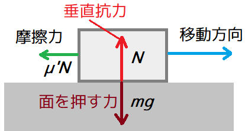
</p>

物体が水平な面に置かれているとき、物体が面に加える力は「質量と垂直方向の加速度」の積です。水平な面において垂直方向の加速度は重力加速度`g`で表されるので、

`ma = μ'mg`

と変形できます。やりたいことは「摩擦による加速度`a`に経過時間を掛けてベロシティから引く」なので、この式の加速度`a`について解くと、

`a = μ'g`

となります。つまり、これからやるべきことは以下の2つです。

>1. 衝突が起きたときに摩擦による加速度`a`を計算して`drag`メンバ変数に代入する。
>2. `Update`メンバ関数で`drag`に経過時間を掛けてベロシティから引く。

では早速`1`をやっていきましょう。重力は下方向に働くので、重力による摩擦が起きるのは上下方向に押し返す場合のみです。

また現在の衝突判定では、直方体はあまり動かないアクターに使うことを想定しています。つまり基本的には摩擦力が発生しないわけです。

そこで、摩擦力は垂直円柱のみ発生させることにして、まず垂直円柱同士の衝突判定に摩擦力発生プログラムを追加しましょう。

加速度`a`は摩擦係数と重力加速度の積です。摩擦係数はアクターによって違う可能性があるので、平均値を使うことにします。`Actor.cpp`を開き、`CollideCylinders`関数に次のプログラムを追加してください。

```diff
       a.position.y += topB - bottomA; // Aを上に移動.
       // Aが下方向に移動していたらAの速度のY要素を0にする.
       a.velocity.y = std::max(0.0f, a.velocity.y);
+      // Aに摩擦力を発生.
+      const float averageF = (a.friction + b.friction) * 0.5f;
+      a.drag = averageF * GameData::Get().gravity.y;
     } else {
       b.position.y += topA - bottomB; // Bを上に移動.
       // Bが下方向に移動していたらBの速度のY要素を0にする.
       b.velocity.y = std::max(0.0f, b.velocity.y);
+      // Bに摩擦力を発生.
+      const float averageF = (a.friction + b.friction) * 0.5f;
+      a.drag = averageF * GameData::Get().gravity.y;
     }
   } else if (d2 < 0.0001f) {
     // アクターAとBを均等に押し返す.
```

続いて、垂直円柱と直方体の衝突判定に摩擦プログラムを追加します。`CollideCylinderAndBox`関数に次のプログラムを追加してください。

```diff
       a.position.y += topB - bottomA; // Aを上に移動.
       // 落下(速度のY要素が0未満)していたらY要素を0にする.
       a.velocity.y = std::max(a.velocity.y, 0.0f);
+      // Aに摩擦力を発生.
+      const float averageF = (a.friction + b.friction) * 0.5f;
+      a.drag = averageF * GameData::Get().gravity.y;
     } else {
       a.position.y -= topA - bottomB; // Aを下に移動.
     }
```

これで上下方向に衝突していたら摩擦力が発生するようになります。

### 1.14 摩擦力を速度に反映する

次は、発生した摩擦力をベロシティに反映します。`Update`メンバ関数に次のプログラムを追加してください。

```diff
   // 移動速度に重力を加算.
   if (gravityScale) {
     velocity += GameData::Get().gravity * gravityScale * deltaTime;
   }
+
+  // ベロシティに摩擦力を反映.
+  if (drag) {
+    // 摩擦力は水平方向に影響するのでY成分が0のベクトルを作る.
+    const glm::vec3 v(velocity.x, 0, velocity.z);
+    const float speed = glm::length(v);
+    // 水平移動していなければ摩擦力は働かない.
+    if (speed > 0) {
+      // 摩擦力による減速量が現在の速度以下なら速度から摩擦力を引く.
+      // 現在の速度以上なら速度を0にする.
+      if (speed > -drag * deltaTime) {
+        velocity += glm::normalize(v) * drag * deltaTime;
+      } else {
+        velocity.x = velocity.z = 0;
+      }
+    }
+    // 摩擦力を0にリセット.
+    drag = 0;
+  }

   // 座標を更新.
   position += velocity * deltaTime;
```

プログラムが書けたらビルドして実行してください。吹き飛んだゾンビが地面で止まったら成功です。

>**【まとめ】**<br>
>
>* 寿命機能によって時間を指定してアクターを削除することができる。
>* 新しい衝突処理を作るときは、衝突の影響を受ける側の`OnHit`を確認する。
>* 摩擦による加速度は`摩擦係数×重力加速度`で計算できる。
>* 衝突によって速度を変化させる場合、経過時間を考慮しなければならない。

<div style="page-break-after: always"></div>

## 2. 衝突判定の改良

### 2.1 経過時間の罠

手榴弾を投げていると、結構な頻度で不発になることに気づいているかもしれません。それは実は不発ではなく、地面に埋まりすぎて横に押し出されてしまっているのです。

なぜ「埋まりすぎる」なんてことが起こるのでしょう。それは、「経過時間の中間の状態は無視する」というプログラムになっているからです。

プログラムでは「経過時間」ごとに座標を更新するため、例えば経過時間が60分の1秒(0.0166...秒)だとすると、`1m/s`で移動する物体は「経過時間」ごとに`0.0166...m`、つまり約`1.67cm`進むことになります。

この物体の高さ及び直径が`1cm`の垂直円柱だとすると、時間が`1/60秒`進むごとに円柱は右に`1.67cm`ずつ移動します。これを表したのが以下の図です。

<p align="center">
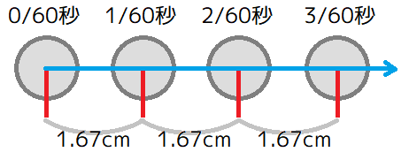
</p>

経過時間単位で位置を更新すると、位置の変化は連続的にならず上図のように飛び飛びに変化します。そのため中間に厚さ`1mm`の板があったとしても、衝突は起こらずにすり抜けてしまいます。

これを防ぐ方法はいくつかありますが、簡単なのは円柱の直径を大きくすることです。例えば直径を2倍の`2cm`にすると、隙間がなくなるためすり抜けることはありません。

<p align="center">
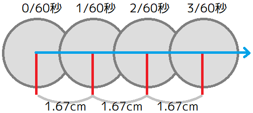
</p>

ただし、経過時間は常に`1/60秒`になるとは限らず、コンピューターの都合で短くなったり長くなったりします。そのため、実際の座標は以下の図ように変化します。

<p align="center">
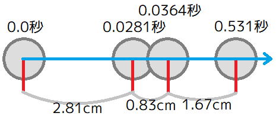
</p>

経過時間の長さはコンピューターの状態によるため、どれだけ直径を大きくしたとしても、すり抜けてしまう可能性をゼロにはできません。

この不安定な経過時間の影響で、手榴弾が地面と衝突したとき、以下のように境界に重なるか完全に埋まるかのどちらかの状態になります。

<p align="center">
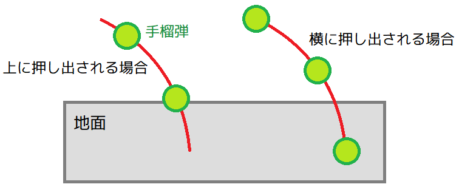
</p>

<pre class="tnmai_assignment">
<strong>【課題03】</strong>
手榴弾の衝突判定の大きさを上下0.3m半径0.3mに設定して、手榴弾が地面の上に表示される確率が高くなることを確認しなさい。
</pre>

<pre class="tnmai_assignment">
<strong>【課題04】</strong>
手榴弾の衝突判定の大きさを上下0.1m半径0.1mに設定して、手榴弾が地面の上に表示される確率が低くなることを確認しなさい。
</pre>

全く埋まらないようにする方法として「物体が移動した軌跡を図形化して衝突判定を行う」というものがありますが、これには複雑な計算が必要なため、ゲームに登場する全ての物体に対して行うのは難しいです。

そこで、プログラムが比較的簡単で、適切な衝突判定を設定すれば多くの場合に対応できる、

「押し出す距離が最も短い方向に押し出す」

という方法を使おうと思います。

簡単な方法であるだけに、衝突する物体の両方が小さすぎたり速度が速すぎたりすると対応しきれないこともありますが、これまでのプログラムよりはおかしな結果になりにくくなるはずです。

### 2.2 垂直円柱同士の衝突判定を修正する

それでは、垂直円柱の衝突判定から修正していきましょう。まずはY方向に押し返す距離の計算を変更します。円柱の高さではなく、押し返す距離だけを考慮します。

`Actor.cpp`を開き、`CollideCylinders`関数のY方向の押し返す距離の計算を、次のように変更してください。

```diff
   if (!isBlock) {
     return true;
   }

   // ブロック指定があるので相手を押し返す.

-  // Y軸方向の重なっている部分の長さを計算.
-  const float overlapY = std::min(topA, topB) - std::max(bottomA, bottomB);
-
-  // 短いほうの円柱の高さの半分を計算.
-  const float shortY = std::min(topA - bottomA, topB - bottomB);
+  // 上下の押し返す距離が短い方向を「Y方向の押し返す距離」とする.
+  float py = 0;
+  const float y0 = bottomB - topA;
+  const float y1 = topB - bottomA;
+  if (std::abs(y0) > std::abs(y1)) {
+    py = y1;
+  } else {
+    py = y0;
+  }

   // 重なっている長さが円柱の3/4未満なら上または下に押し返す.
   // 3/4以上なら横に押し返す.
   // 押し返す方向を計算できない場合(d2が0の場合)+X方向に押し返す.
```

なお、XZ方向に押し返す距離の計算は変更しなくてもそのまま使えます。

次に、Y方向に押し返す条件を「Y方向の押し返す距離がXZ方向に押し返す距離より短い場合」に変更します。上下に押し返すかどうかを判定するプログラムを、次のように変更してください。

```diff
   } else {
     py = y1;
   }

-  // 重なっている長さが円柱の3/4未満なら上または下に押し返す.
-  // 3/4以上なら横に押し返す.
-  // 押し返す方向を計算できない場合(d2が0の場合)+X方向に押し返す.
-  if (overlapY < shortY * 0.75f) {
+  // 中心間の距離dを計算.
+  const float d = std::sqrt(d2);
+  // XZ方向の押し返す距離sを計算.
+  const float s = r - d;
+  // Y方向の押し返す距離がXZ方向の押し返す距離より短ければY方向に押し出す.
+  // 長ければXZ方向に押し返す.
+  if (std::abs(py) < s) {
     // 下端が高い位置にあるアクターを上に移動.
     if (bottomA > bottomB) {
       a.position.y += topB - bottomA; // Aを上に移動.
```

`py`の符号は、アクターAから見て上下どちらのほうが押し返す距離が短いかを表しています。符号がプラスなら上の方が近いので、アクターBがアクターAを上に押し返し、マイナスなら下のほうが近いので、逆にアクターAがアクターBを上に押し返すようにします

押し返す方向を判定する`if`を次のように変更してください。

```diff
   // Y方向の押し返す距離がXZ方向の押し返す距離より短ければY方向に押し出す.
   // 長ければXZ方向に押し返す.
   if (std::abs(py) < s) {
-    // 下端が高い位置にあるアクターを上に移動.
-    if (bottomA > bottomB) {
+    // 上方向が近い場合はAを上に移動.
+    if (std::abs(y0) > std::abs(y1)) {
       a.position.y += topB - bottomA; // Aを上に移動.
       // Aが下方向に移動していたらAの速度のY要素を0にする.
       a.velocity.y = std::max(a.velocity.y, 0.0f);
```

それから、XZ方向に押し返すプログラムで計算している変数`d`と`s`は、押し返す方向を判定するときに計算済みになっています。2度も同じ計算をするのは無駄なので2度目の計算を削除します。XZ方向に押し返すプログラムを次のように変更してください。

```diff
     a.position += n * r * 0.5f;
     b.position -= n * r * 0.5f;
   } else {
-    // 中心間の距離dを計算.
-    const float d = std::sqrt(d2);
-    // 押し返す距離sを計算.
-    const float s = r - d;
     // 円柱の中心軸間の方向ベクトルnを計算.
     const glm::vec3 n(dx / d, 0, dz / d);
     // アクターAとBを均等に押し返す.
```

これで重なっている距離が短い方に押し返すようになります。

### 2.3 垂直円柱と立方体の衝突判定を修正する

続いて垂直円柱と立方体の衝突判定を「押し出す距離が短い方向に押し出す」ように変更します。この変更では、Y方向の処理をXおよびZ方向と同じ処理にする必要があります。そこで、とりあえず現在のY方向の距離の計算と判定を削除します。

`CollideCylinderAndBox`関数のY方向の距離計算と判定プログラムを、以下のように削除してください。

```diff
   if (d2 > a.collision.radius * a.collision.radius) {
     return false;
   }

   /* 重複しない位置に移動させる */

-  // Y軸方向の重なっている部分の長さを計算.
-  const float overlapY = std::min(topA, topB) - std::max(bottomA, bottomB);
-
-  // 円柱と直方体のうち、短いほうの高さの半分を計算.
-  const float halfY = std::min(topA - bottomA, topB - bottomB) * 0.5f;
-
-  // 重なっている長さが円柱の半分未満ならY軸方向に押し返す.
-  // 半分以上ならXZ平面方向に押し返す.
-  if (overlapY < halfY) {
-    // 円柱の下端が直方体の下端より高い位置にあるなら円柱を上に移動.
-    // そうでなければ円柱を下に移動.
-    if (bottomA > bottomB) {
-      a.position.y += topB - bottomA; // Aを上に移動.
-      // 落下(速度のY要素が0未満)していたらY要素を0にする.
-      a.velocity.y = std::max(a.velocity.y, 0.0f);
-      // Aに摩擦力を発生.
-      const float averageF = (a.friction + b.friction) * 0.5f;
-      a.drag = averageF * GameData::Get().gravity.y;
-    } else {
-      a.position.y -= topA - bottomB; // Aを下に移動.
-    }
-  } else if (d2 > 0) {
-    // 中心軸と最近接点の距離dを計算.
-    const float d = std::sqrt(d2);
-    // 押し返す距離sを計算.
-    const float s = a.collision.radius - d;
-    // 最近接点から中心軸への方向ベクトルnを計算.
-    const glm::vec3 n(dx / d, 0, dz / d);
-    // アクターAを押し返す.
-    a.position += n * s;
-  } else {
+  {
     // 直方体の中心座標(cx, cz)を計算.
     const float cx = b.position.x +
       (b.collision.boxMin.x + b.collision.boxMax.x) * 0.5f;
```

次に、XYZすべての方向について押し返す距離を計算します。押し返す距離を計算するプログラムを次のように変更してください。

```diff
     // 直方体の中心座標から円柱の中心軸までの距離(ox, oz)を計算.
     const float ox = a.position.x - cx;
     const float oz = a.position.z - cz;

-    // 押し出す距離を計算.
-    const float px = a.collision.radius + hx - std::abs(ox);
-    const float pz = a.collision.radius + hz - std::abs(oz);
+    // 押し返す距離pを計算.
+    glm::vec3 p = glm::vec3(0);
+
+    // 上下の押し返す距離が短い方向をp.yとする.
+    const float y0 = bottomB - topA;
+    const float y1 = topB - bottomA;
+    if (std::abs(y0) <= std::abs(y1)) {
+      p.y = y0;
+    } else {
+      p.y = y1;
+    }
+
+    // 円柱中心が直方体中心に対してマイナス側にあるならマイナス側のほうが短い.
+    // プラス側にあるならプラス側のほうが短い.
+    const float r = a.collision.radius;
+    if (ox < 0) {
+      p.x = -(r + hx) - ox;
+    } else {
+      p.x = (r + hx) - ox;
+    }
+    if (oz < 0) {
+      p.z = -(r + hz) - oz;
+    } else {
+      p.z = (r + hz) - oz;
+    }

     // 押し出す距離が短いほうに押し出す.
     if (px < pz) {
       // 円柱の中心軸が-X側にあるなら-X方向の移動距離のほうが近い.
```

これで各軸の押し返す距離が分かりました。

最後に最も短い軸の方向にアクターを押し出します。既存のプログラムはXとZについてしか計算していないので、ここにYの計算を追加しなくてはなりません。

押し返す距離が最も短い方向を見つけるには、まず押し返す距離の絶対値を計算し、全ての組み合わせについて絶対値が小さい方向を判定することで行います。アクターを押し出すプログラムを次のように変更してください。

```diff
       p.z = (r + hz) - oz;
     }

     // 押し出す距離が短いほうに押し出す.
+    const glm::vec3 absp = glm::abs(p);
-    if (px < pz) {
-      // 円柱の中心軸が-X側にあるなら-X方向の移動距離のほうが近い.
-      if (ox < 0) {
-        a.position.x -= px;
-      } else {
-        a.position.x += px;
-      }
-    } else {
-      // 円柱の中心軸が-Z側にあるなら-Z方向の移動距離のほうが近い.
-      if (oz < 0) {
-        a.position.z -= pz;
-      } else {
-        a.position.z += pz;
-      }
-    }
+    if (absp.x < absp.y) {
+      if (absp.x < absp.z) {
+        a.position.x += p.x;
+      } else {
+        a.position.z += p.z;
+      }
+    } else {
+      if (absp.y < absp.z) {
+        a.position.y += p.y;
+        // 上に押し返す場合は摩擦力が発生する.
+        if (p.y >= 0) {
+          a.drag = (a.friction + b.friction) * 0.5f * GameData::Get().gravity.y;
+        }
+      } else {
+        a.position.z += p.z;
+      }
+    }
   }
   return true;
 }
```

それから、移動方向と押し返す方向が逆向きの場合、その方向の移動速度を0にします。これは、アクターを壁に平行な方向に移動させるためです。押し返す処理に次のプログラムを追加してください。

```diff
     if (absp.x < absp.y) {
       if (absp.x < absp.z) {
         a.position.x += p.x;
+        // 押し返す方向と逆向きに移動していたら速度を0にする.
+        if (a.velocity.x * p.x < 0) {
+          a.velocity.x = 0;
+        }
       } else {
         a.position.z += p.z;
+        // 押し返す方向と逆向きに移動していたら速度を0にする.
+        if (a.velocity.z * p.z < 0) {
+          a.velocity.z = 0;
+        }
       }
     } else {
       if (absp.y < absp.z) {
         a.position.y += p.y;
+        // 押し返す方向と逆向きに移動していたら速度を0にする.
+        if (a.velocity.y * p.y < 0) {
+          a.velocity.y = 0;
+        }
         // 上に押し返す場合は摩擦力が発生する.
         if (p.y >= 0) {
           a.drag = (a.friction + b.friction) * 0.5f * GameData::Get().gravity.y;
         }
       } else {
         a.position.z += p.z;
+        // 押し返す方向と逆向きに移動していたら速度を0にする.
+        if (a.velocity.z * p.z < 0) {
+          a.velocity.z = 0;
+        }
       }
     }
   }
   return true;
```

これで直方体は垂直円柱を、重なっている距離が短い方向に押し返すようになります。

プログラムが書けたらビルドして実行してください。衝突判定を小さくした手榴弾でも確実に地面の上に表示されていたら成功です。

### 2.4 計算回数を増やす

ところで、いくらゾンビとはいえ現在の移動速度は遅すぎて、ゲームとしての緊張感がまるでありません。そこでソンビの移動速度を上げましょう。`ZombieActor.cpp`を開き、

```diff
       front.y = 0;
       front.z = -std::sin(e->rotation.y);
-      // 正面方向に1m/sの速度で移動するように設定.
-      velocity.x = front.x;
-      velocity.z = front.z;
+      // 正面方向に3m/sの速度で移動するように設定.
+      velocity.x = front.x * 3.0f;
+      velocity.z = front.z * 3.0f;
       e->state = Actor::State::walk;

       // プレイヤーが距離3m以内かつ前方左右30度以内にいたら攻撃.
       const float distanceSq = glm::dot(dirPlayer, dirPlayer);
```

プログラムが書けたらビルドして実行してください。ゾンビが高速で襲ってきたら成功です。

ゾンビの速度が確認できたら、そのままプレイヤーアクターをマップの四隅に移動させてください。そのまましばらく何もせずにゾンビに襲われていると、ゾンビやプレイヤーが木の向こう側に移動してしまうことがあります。

木の向こうに行ってしまう理由は、衝突するアクターが多くなると、1回の衝突判定による押し返しだけでは結果が安定しないからです。

たとえば3体のゾンビが壁に向かって移動しているとします。

<p align="center">
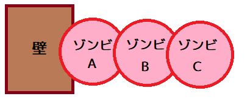
</p>

衝突処理が「壁→ゾンビA→ゾンビB→ゾンビC」の順に実行されるとすると、まず壁とゾンビAの衝突処理によってゾンビAが押し返されます。

<p align="center">
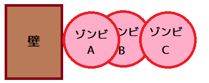
</p>

次にゾンビAとゾンビBが互いを押し返します。これによってゾンビAはまた壁と重なります

<p align="center">
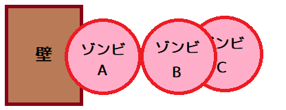
</p>

最後にゾンビBとゾンビCが互いを押し返します。ゾンビBは再びゾンビAと重なります。

<p align="center">
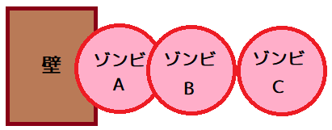
</p>

これで全ての衝突処理が完了しましたが、依然としてゾンビAは(めり込み度合いは減ったものの)壁に重なっており、ゾンビAとゾンビBの重なりも解決していません。

そこで衝突判定をもう一度行います。最初のときと同様に、まずゾンビAが壁に押し返されます。

<p align="center">
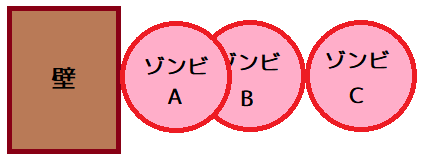
</p>

次にゾンビAとゾンビBが互いを押し返します。

<p align="center">
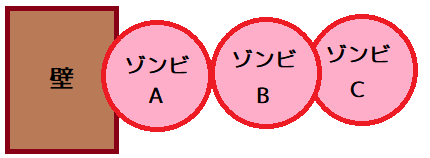
</p>

そしてゾンビBとゾンビCが互いを押し返します。

<p align="center">
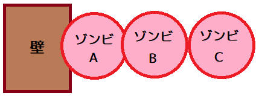
</p>

さて、2回目の衝突判定が完了しても、まだゾンビたちと壁は重なったままです。しかし、1回目と比べると重なり度合いが少なくなっています。

さらに衝突判定を繰り返せば、重なりはもっと少なくなると予想されます。このように、衝突判定を繰り返すことで、アクターが密集した状態でも重なり度合いを少なくしていくことができます。

ということなので、より安定した結果を得るために計算回数を増やしましょう。ただし、回数が多ければ多いほどより安定した結果になりますが、多すぎると計算にかかる時間が長くなってリアルタイム処理とはいえなくなってしまいます。

そこで今回は衝突判定を5回行うことにします。`MainGameScene.cpp`を開き、`Update`メンバ関数にある衝突判定プログラムに、次のプログラムを追加してください。

```diff
   UpdateActorList(actors, deltaTime);

   // 衝突判定.
+  for (size_t loop = 0; loop < 5; ++loop) {
     for (size_t ia = 0; ia < actors.size(); ++ia) {
       Actor& a = *actors[ia]; // アクターA
       // 計算済み及び自分自身を除く、残りのアクターとの間で衝突判定を実行.
       for (size_t ib = ia + 1; ib < actors.size(); ++ib) {
         Actor& b = *actors[ib]; // アクターB
         // 衝突判定.
         if (DetectCollision(a, b)) {
           a.OnHit(a, b, this);
           b.OnHit(b, a, this);
         }
       } // 閉じ括弧の数に注意.
     }
+  }

   // まだクリアしていない?
   if (!isGameClear) {
     // クリア条件(「倒した敵の数」が「出現する敵の数」以上)を満たしている?
```

上記のプログラムは衝突判定を5回行うことで、衝突の結果が安定する可能性を高めています。

プログラムが書けたらビルドして実行してください。どうやら多少は安定して、木の向こうに行ってしまう確率は減っているようですが、しかし、しばらくするとゾンビが押し出されてしまいます。

### 2.5 経過時間を固定値にする

ゾンビが木の向こうに押し出されてしまうのは、経過時間が安定していないからです。移動の段階で思い切りめり込んでしまっていたら、どれだけ計算回数を増やそうと意味はありません。

しかし、逆に考えれば「経過時間が一定になるようにできればかなり安定させられる」と予想できます。

といってもWindowsが決める経過時間は変えられません。そこで「経過時間を1/60秒単位に分割して何度も更新処理を実行する」ようにします。

ところで、処理を1/60単位で行う場合、中途半端に余った時間の扱いが問題になります。

1/60秒は約0.16秒ですから、例えば経過時間が0.17秒だったとすると、更新処理を1回行ったあと0.01秒だけ余ります。しかし、わずか0.01秒のために更新処理を行うのはもったいないです。

経過時間が0.31秒の場合だと、更新処理1回のあと0.15秒も残ることになります。しかし、どの程度の時間が残っていたら更新処理を行うかを決めることは難しいので、余った時間は常に次回の経過時間に加算するほうが確実です。この処理のためには「経過時間の余りを記録する変数」が必要となります。

また、経過時間が0.10秒だったときはどうでしょう。1/60秒未満は更新処理を行わないとすると、全く何も更新されず画面だけが描画される期間ができてしまいます。これを防ぐには、経過時間が1/60秒未満の場合でも、少なくとも1回は更新処理が行われるようにします。

それでは経過時間を1/60秒単位にするプログラムを書いていきましょう。まず「経過時間の余り」を記録する変数を追加します。変数名は`remainingDeltaTime`(リメイニング・デルタ・タイム)とします。`remaining`は「残り」という意味です。`MainGameScene.h`を開き、次のプログラムを追加してください。

```diff
   // クリア条件を満たしたかどうか.
   bool isGameClear = false;
   bool isGameOver = false;
+
+  // 残り経過時間.
+  float remainingDeltaTime = 0;
 };

 #endif // MAINGAMESCENE_H_INCLUDED
```

次に`remainingDeltaTime`メンバ変数を使って、経過時間を固定する処理を追加します。繰り返し処理では一般的に`for`が使われますが、「少なくとも1回は実行する」という繰り返しを書く場合は`do～while`を使うと簡単です。

まず`do`を書きます。`MainGameScene.cpp`を開き、`Update`メンバ関数に次のプログラムを追加してください。

```diff
 void MainGameScene::Update(GLFWwindow* window, float deltaTime)
 {
+  // 経過時間を固定値にする.
+  const float maxDeltaTime = 1.0f / 60.0f;
+  remainingDeltaTime += deltaTime;
+  // 残り経過時間が固定値より小さければ残り経過時間を使用する.
+  deltaTime = std::min(remainingDeltaTime, maxDeltaTime);
+  do {
     // アクターリストに含まれるアクターの状態を更新する.
     UpdateActorList(actors, deltaTime);
```

次に`while`を書きます。衝突判定のループの下に、次のプログラムを追加してください。

```diff
             a.OnHit(a, b, this);
             b.OnHit(b, a, this);
           }
         } // 閉じ括弧の数に注意.
       }
     }
+
+    // 今回の更新で消費した時間を残り経過時間から減算.
+    // 経過時間が固定値以上ならループ.
+    remainingDeltaTime -= deltaTime;
+  } while (remainingDeltaTime >= maxDeltaTime);

   // まだクリアしていない?
   if (!isGameClear) {
     // クリア条件(「倒した敵の数」が「出現する敵の数」以上)を満たしている?
```

プログラムが書けたらビルドして実行し、マップの四隅に移動してしばらく待機してください。ゾンビが木の向こうに押し出されなくなっていれば成功です。

これで経過時間を固定値にすることができました。さらに処理回数が増えたことで処理時間がかかるようになってしまいましたが、安定させるためには仕方ありません。

もっとも、処理時間の長さについてはビルド設定を`Release`(リリース)に変更すると、かなり改善されますので試してみてください。ただし、`Release`ではブレークポイントなどが使いにくくなるため、普段は`Debug`(デバッグ)に戻しておくのを忘れないように。

### 2.6 衝突しそうなペアだけ衝突判定を行う

いくら`Release`にすれば処理時間が改善されるとはいっても、最初から処理時間が短いに越したことはありません。処理時間が長くなった原因のひとつは衝突判定の回数が多いことなので、もし判定回数を減らすことができれば少しは処理時間が短くなるはずです。

衝突判定に時間がかかるのは、距離に関係なく全てのアクター同士について、衝突するかどうかを調べているからです。しかし通常は、あるアクターと衝突するのは近くのアクターだけで、衝突処理で多少移動したとしても遠くのアクターと衝突することはありません。

ということは、全く衝突の可能性がないアクターとは衝突判定を行わないようにすれば、衝突判定の回数を減らせるはずです。

衝突判定の回数を減らすためによく使われるのは「衝突しそうなアクターのペアを記録しておく」という方法です。この方法では、最初に何らかの方法で衝突の可能性のあるアクターのペアを見つけ出し、実際の衝突判定は見つかったペアに対してだけ行います。

この方法を使う場合「衝突の可能性のあるアクターのペアを見つけ出す」ためにどんな方法を使うかが問題になります。この部分に時間がかかりすぎるのは本末転倒だからです。

しかし、今回は単純にすべてのアクターを総当りで調べる方法を使います。処理時間はかかりますが簡単に作成できますし、何度も総当りを繰り返すより効率がよくなるのは間違いないからです。

作成するプログラムは以下のようになります。

>1. アクターに「衝突しそうな範囲」というメンバ変数を追加する。
>2. 衝突処理の前に「衝突の可能性があるペアの配列」、「衝突したペアの配列」という2つの配列を用意する。
>3. 総当りで「衝突しそうな範囲」の重複を調べ、重複していたら「衝突の可能性があるペア」として記録する。。
>4. 全ての「衝突の可能性があるペア」について衝突判定を実行し、衝突していたら「衝突したペア」として記録する。
>5. 全ての「衝突したペア」について`OnHit`を呼び出す。

### 2.7 アクターに衝突しそうな範囲を追加する

それでは`1`の「衝突しそうな範囲」を追加しましょう。この範囲は「物体の形状を再現しやすく」、「衝突判定が素早く終わる」必要があります。

この両方を満たすのは「軸並行境界ボックス」と呼ばれる形状です。英語では`Axis Aligned Bounding Box`(アクシス・アラインド・バウンディング・ボックス)、略して`AABB`(エーエービービー)と呼ばれます。

`AABB`は基本的には直方体の衝突形状とまったく同じです。ただし今回の目的では、`AABB`同士の衝突判定だけができれば十分で、また重なっている距離を調べる必要もないので「中心座標と半径」の2つで表現することにします。

それでは`Actor.h`を開き、`Collision`構造体の定義の下に軸並行境界ボックスの定義を追加してください。

```diff
   // 直方体のパラメータ.
   glm::vec3 boxMin;
   glm::vec3 boxMax;
 };
+
+/**
+* 軸並行境界ボックス.
+*/
+struct AABB
+{
+  glm::vec3 c = glm::vec3(0); // 中心座標.
+  glm::vec3 r = glm::vec3(0); // 各軸の半径.
+};

 /**
 * アクター.
 */
```

次に`AABB`構造体を`Actor`クラスに追加します。メンバ変数名は`boundingBox`(バウンディング・ボックス)とします。`Actor`クラスの定義に次のプログラムを追加してください。

```diff
   float animationTimer = 0; // プリミティブ切り替えタイマー(秒).

   // 衝突判定用の変数.
   Collision collision;
+  AABB boundingBox; // 衝突しそうな範囲.

   // 衝突解決関数へのポインタ.
   void (*OnHit)(Actor&, Actor&, void*) = [](Actor&, Actor&, void*) {};
```

### 2.8 衝突しそうな範囲を設定する

さて、`boundingBox`は「衝突しそうな範囲」なので、少なくとも衝突形状を完全に包み込んでいなくてはなりません。そこで、衝突形状を設定するメンバ関数の中で、形状を包み込むように初期化します。

`Actor.cpp`を開き、`SetCylinderCollision`メンバ関数に次のプログラムを追加してください。

```diff
   collision.top = top;
   collision.bottom = bottom;
   collision.radius = radius;
+
+  // 衝突しそうな範囲を設定.
+  boundingBox.c = position;
+  boundingBox.c.y += (collision.top + collision.bottom) * 0.5f;
+  boundingBox.r.x = collision.radius;
+  boundingBox.r.y = (collision.top - collision.bottom) * 0.5f;
+  boundingBox.r.z = boundingBox.r.x;
 }

 /**
 * 直方体の衝突判定を設定する.
```

続いて、直方体の衝突形状を設定するメンバ関数も修正します。`SetBoxCollision`メンバ関数に次のプログラムを追加してください。

```diff
   collision.shape = Collision::Shape::box;
   collision.boxMin = min;
   collision.boxMax = max;

+  // 衝突しそうな範囲を設定.
+  boundingBox.c = position + (collision.boxMin + collision.boxMax) * 0.5f;
+  boundingBox.r = (collision.boxMax - collision.boxMin) * 0.5f;
 }

 /**
 * アニメーションを設定する.
```

直方体と`boundingBox`は表現方法が違うだけで、どちらも`AABB`であることに違いはありません。そのため、垂直円柱と比べると簡単に初期化することができます。

また、衝突判定を素早く行うためには`boundingBox`の中心座標はアクターが移動するたびに更新しておくと効率的です。そこで`Update`メンバ関数で中心座標を更新しましょう。`Update`メンバ関数に次のプログラムを追加してください。

```diff
   // 座標を更新.
   position += velocity * deltaTime;
+
+  // 衝突しそうな範囲を更新.
+  const float vl = glm::length(velocity) * deltaTime * 2.0f;
+  switch (collision.shape) {
+  case Collision::Shape::cylinder:
+    boundingBox.c = position;
+    boundingBox.c.y += (collision.top + collision.bottom) * 0.5f;
+    boundingBox.r.x = collision.radius + vl;
+    boundingBox.r.y = (collision.top - collision.bottom) * 0.5f + vl;
+    boundingBox.r.z = boundingBox.r.x;
+    break;
+  case Collision::Shape::box:
+    boundingBox.c = position + (collision.boxMin + collision.boxMax) * 0.5f;
+    boundingBox.r = (collision.boxMax - collision.boxMin) * 0.5f + vl;
+    break;
+  }

   // アニメーションデータがあればアニメーションする.
   if (animation && !animation->list.empty()) {
```

半径を更新するとき、ベロシティによって半径を広げているところに注意してください。移動速度が速いほどめり込む距離が伸びるため、大きく押し返されてさまざまなアクターに衝突する可能性があります。そこで、速度によって半径を拡大しておきます。

### 2.9 衝突する可能性があるペアを見つける

それでは`boundingBox`を使って衝突しそうなペアを見つけましょう。まずは「衝突の可能性があるペアの配列」と「衝突したペアの配列」を用意します。どちらも`std::vector`クラスの変数として定義すればよいでしょう。

また、C++言語には「ペア」を表す`std::pair`(エスティーディー・ペア)というクラスがあるのでこれを使ってアクターのペアを表現することにします。

「衝突しそうなペアの配列」の変数名は`potentiallyCollidingPairs`(ポテンシャリー・コライディング・ペアーズ)、「衝突したペアの配列」の変数名は`collidedPairs`(コライデッド・ペアーズ)とします。

`collide`(コライド)は「衝突する」という意味、`potentially`(ポテンシャリー)は「もしかすると、潜在的に」という意味です。

`MainGameScene.cpp`を開き、`Update`メンバ関数に次のプログラムを追加してください。

```diff
       newActors.clear();
     }

     // 衝突判定.
+
+    // 衝突する可能性があるペアを格納する配列.
+    std::vector<std::pair<Actor&, Actor&>> potentiallyCollidingPairs;
+    potentiallyCollidingPairs.reserve(1000);
+
+    // 衝突したペアを格納する配列.
+    std::vector<std::pair<Actor*, Actor*>> collidedPairs;
+    collidedPairs.reserve(1000);

     for (size_t loop = 0; loop < 5; ++loop) {
       for (size_t ia = 0; ia < actors.size(); ++ia) {
         Actor& a = *actors[ia]; // アクターA
```

どの程度のペアが見つかるかは、状況によって違いすぎて予想することが難しいので、それぞれの配列の容量は多めに予約しています。

次に、衝突しそうなペアを見つけるために総当りループを作成します。このループは衝突判定ループと全く同じなのでコピー＆ペーストで作ると簡単です。`collidedPairs`変数の定義の下に、次のプログラムを追加してください。

```diff
     // 衝突したペアを格納する配列.
     std::vector<std::pair<Actor*, Actor*>> collidedPairs;
     collidedPairs.reserve(1000);
+
+    // 衝突しそうなペアをリストアップ.
+    for (size_t ia = 0; ia < actors.size(); ++ia) {
+      Actor& a = *actors[ia]; // アクターA
+      // 計算済み及び自分自身を除く、残りのアクターとの間で衝突判定を実行.
+      for (size_t ib = ia + 1; ib < actors.size(); ++ib) {
+        Actor& b = *actors[ib]; // アクターB
+      }
+    }

     for (size_t loop = 0; loop < 5; ++loop) {
       for (size_t ia = 0; ia < actors.size(); ++ia) {
         Actor& a = *actors[ia]; // アクターA
```

ここからが衝突判定と違う部分です。まず`AABB`の交差判定を行います。この判定は、2次元の四角形の衝突判定を3次元の立方体に拡張したものです。アクターBの死亡判定の下に、次のプログラムを追加してください。

```diff
       // 計算済み及び自分自身を除く、残りのアクターとの間で衝突判定を実行.
       for (size_t ib = ia + 1; ib < actors.size(); ++ib) {
         Actor& b = *actors[ib]; // アクターB
+
+        // 2つのAABBが交差していなければ衝突しない(多分).
+        const glm::vec3 d = glm::abs(b.boundingBox.c - a.boundingBox.c);
+        const glm::vec3 r = a.boundingBox.r + b.boundingBox.r;
+        if (d.x > r.x || d.y > r.y || d.z > r.z) {
+          continue;
+        }
       }
     }

     for (size_t loop = 0; loop < 5; ++loop) {
```

次に`blockOtherActors`(ブロック・アザー・アクターズ)メンバ変数と衝突形状をチェックし、判定結果によって配列に追加するか何もしないかを切り替えます。`AABB`の交差判定の下に、次のプログラムを追加してください。

```diff
         if (d.x > r.x || d.y > r.y || d.z > r.z) {
           continue;
         }
+
+        // どちらかがブロックしない、または衝突形状が直方体同士の場合、
+        // ここで衝突判定を行う(現在、直方体同士はブロックしない設定のため).
+        if (!a.collision.blockOtherActors || !b.collision.blockOtherActors || (
+          a.collision.shape == Collision::Shape::box &&
+          b.collision.shape == Collision::Shape::box)) {
+          if (DetectCollision(a, b)) {
+            collidedPairs.emplace_back(&a, &b);
+          }
+          continue;
+        }
+
+        // ここまで来たら衝突する可能性がある.
+        potentiallyCollidingPairs.emplace_back(a, b);
       }
     }

     for (size_t loop = 0; loop < 5; ++loop) {
```

いずれかのアクターの`blockOtherActors`が`false`だったり衝突形状がどちらも直方体の場合、押し返しが発生しないので押し返しループを実行する必要はありません。

その場合、この時点で衝突判定を行ってしまいます。そして実際に衝突していたら「衝突したペア」として<ruby>`collidedPairs`<rt>コライデッド・ペアーズ</rt></ruby>配列に追加します。

双方がブロック有効かついずれかの衝突形状が直方体ではない場合、押し返しループで衝突判定を行うために<ruby>`potentiallyCollidingPairs`<rt>ポテンシャリー・コライディング・ペアーズ</rt></ruby>配列に追加します。

これで「衝突する可能性があるペア」を見つけることができるようになりました。

### 2.10 本当に衝突するか調べる

衝突する可能性があるペアを見つけたので、今度は本当に衝突するかを調べていきます。衝突判定ループを次のように「衝突の可能性があるペアのループ」に変更してください。

```diff
         // ここまで来たら衝突の可能性がある.
         potentiallyCollidingPairs.emplace_back(a, b);
       }
     }

+    // 衝突判定を行い、本当に衝突するペアを見つける.
     for (size_t loop = 0; loop < 5; ++loop) {
-      for (size_t ia = 0; ia < actors.size(); ++ia) {
-        Actor& a = *actors[ia]; // アクターA
-        // 計算済み及び自分自身を除く、残りのアクターとの間で衝突判定を実行.
-        for (size_t ib = ia + 1; ib < actors.size(); ++ib) {
-          Actor& b = *actors[ib]; // アクターB
-          // 衝突判定.
-          if (DetectCollision(a, b)) {
-            a.OnHit(a, b, this);
-            b.OnHit(b, a, this);
-          }
-        } // 閉じ括弧の数に注意.
-      }
+      bool hasCollision = false; // 衝突が発生したらtrueにする.
+      for (auto& pair : potentiallyCollidingPairs) {
+        if (DetectCollision(pair.first, pair.second)) {
+          collidedPairs.emplace_back(&pair.first, &pair.second);
+          hasCollision = true;
+        }
+      }
+      if (!hasCollision) {
+        break;
+      }
     }

     // 今回の更新で消費した時間を残り経過時間から減算.
     // 経過時間が固定値以上ならループ.
     remainingDeltaTime -= deltaTime;
```

もともとは「ループ、アクターA、アクターB」という3重の`for`でした。2重`for`で100体のゾンビ全てを処理すると`5050`回の衝突判定が必要で、これがさらに`5`回実行されるので、総計`25250`回も衝突判定が必要でした。

変更したプログラムでは、事前に衝突の可能性があるペアを見つけることで「ループ、衝突の可能性があるペア」という2重の`for`になりました。

事前計算は総当りなので判定が`5050`回必要ですが、判定を簡単にすることで通常の衝突判定より速く完了します。そして「衝突の可能性があるペア」の数は、ゾンビが平均して5体のゾンビと衝突の可能性があるとして`500`個で、これは`5050`の約1/10です。

このため、5回実行したとしても1回の総当りループの半分の回数になり、事前計算の判定回数を加えたとしても2回の総当りループよりも少ない回数で衝突判定が完了します。

`hasCollision`(ハズ・コリジョン)はループ中に衝突が発生したかどうかを記録する変数です。もし一度も衝突が発生しなければもうループする必要はないので、`break`でループを終了します。

### 2.11 OnHitを実行する

衝突を調べ終わると<ruby>`collidedPairs`<rt>コライデッド・ペアーズ</rt></ruby>配列に衝突したペアが登録された状態になります。しかし、何度も衝突判定を行っているため、同じペアが重複して登録されている可能性があります。

衝突処理が複数回実行されることを防ぐために、まずは重複しているペアを除外しなくてはなりません。

配列から重複している要素を除去するには、`std::sort`(エスティーディー・ソート)と`std::unique`(エスティーディー・ユニーク)、そして`std::vector`クラスの`erase`(イレース)メンバ関数という3つの関数を使うのが簡単です。

<pre class="tnmai_code"><strong>【書式】</strong>
void sort(並び替える範囲の先頭, 並び替える範囲の終端);
</pre>

`std::sort`(エスティーディー・ソート)は配列の要素を昇順で並び替える関数です。

`[6,2,5,6,7,5,3]` ・・・(1)

という配列に対して`std::sort`を実行すると、

`[2,3,5,5,6,6,7]` ・・・(2)

のように並び替えられます。

<pre class="tnmai_code"><strong>【書式】</strong>
iterator unique(テスト方法, 比較に使う値, 比較対象ビット);
</pre>

`std::unique`(エスティーディー・ユニーク)は隣り合った重複要素以外を配列の先頭に移動し、重複しない範囲の終端を返します。

`[2,3,5,5,6,6,7]` ・・・(3)

という配列に対して`std::unique`を実行すると、

`[2,3,5,6,7,6,7]` ・・・(4)

というように変化します。そして、重複しない範囲`2,3,5,6,7`の次の位置である添字`5`の位置を返します。

そして、`erase`メンバ関数にこの戻り値と配列の末尾を指定すると、

`[2,3,5,6,7]` ・・・(5)

のように重複要素が削除された配列が得られます。

ただし、ソート前の配列(1)に`std::unique`を使っても重複要素は削除されません。`std::unique`が削除できるのは隣り合った要素だけなので、同じ要素が離れた位置にある場合は何の効果もないからです。これが`std::sort`と組み合わせる理由です。

さらに`std::unique`だけでは要素が削除されなかったりコピーされる場合があることにも注意してください。例えば配列(4)では`6`が削除されておらず、さらに`7`が2つに増えています。

重複要素を完全に削除するには`erase`メンバ関数と組み合わせなくてはなりません。

また、この技法は「配列をソートする」ため、配列に格納した順番が重要となる場面では使えない点にも注意してください。

説明が長くなりましたが、この`sort unique erase`(ソート・ユニーク・イレース)技法を使って重複するペアを除外しましょう。衝突するペアを見つけるプログラムの下に、次のプログラムを追加してください。

```diff
       if (!hasCollision) {
         break;
       }
     }
+
+    // 重複するペアを除外する.
+    std::sort(collidedPairs.begin(), collidedPairs.end());
+    const auto itr = std::unique(collidedPairs.begin(), collidedPairs.end());
+    collidedPairs.erase(itr, collidedPairs.end());
+
+    // OnHitを呼び出す.
+    for (auto& e : collidedPairs) {
+      e.first->OnHit(*e.first, *e.second, this);
+      e.second->OnHit(*e.second, *e.first, this);
+    }

     // 今回の更新で消費した時間を残り経過時間から減算.
     // 経過時間が固定値以上ならループ.
     remainingDeltaTime -= deltaTime;
```

プログラムが書けたらビルドして実行してください。処理速度の差は分かりにくいかもしれませんが、四隅に移動したとき、少なくとも総当りと同じように問題なく動作していたら成功です。

<p align="center">
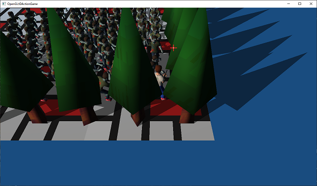
</p>

>**【まとめ】**
>
>* コンピューターによる3Dプログラムでは座標の更新は飛び飛びになる。
>* 衝突判定を何度も繰り返すと、衝突結果が安定しやすくなる。
>* 経過時間による不安定さをなくすには、固定の経過時間を使い`for`で繰り返し更新を行う。
>* 要素数が多いと総当りはとても時間がかかる。
>* 総当りを繰り返すのではなく、事前に目的とする組み合わせを見つけておくと処理時間を減らせるかもしれない。
>* 多重の`for`は遅いので、なんとかして`for`を減らすとよい。
>* `std::vector`から重複要素を削除するには`sort unique erase`を組み合わせる。
