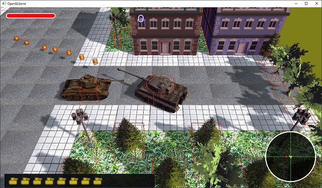

[OpenGL 3D 2020 第18回]

# <ruby>血煙<rt>ちけむ</rt></ruby>りゾンビ<ruby>山<rt>やま</rt></ruby>

## 習得目標

* 
* 
* 

## 1. スプライト

### 1.1 画像による不定形の物体の表現

ゲームでは炎や煙、血しぶきといった演出効果がよく使われます。しかし、これらは決まった形を持たないために3Dモデルを作れなかったり、大量に表示する必要があるために本来の複雑な形状を3Dモデル化しにくかったりします。

そこで昔の人は考えました。

>「3Dモデルにできないのなら、2D画像で表示すればいいじゃない。」

こうして、決まった形を持たない物体は「ビルボード」または「スプライト」という技術で表示されるようになったのです。

>**【本当のところはどうなの？】**<br>
>スプライトという用語はもともとは任天堂ファミリーコンピューターやセガマークIIIなどの2Dグラフィックスハードウェアで使われていました。その後、プレイステーションやセガサターンなど初期の3Dグラフィックスハードウェアが登場しましたが、当時は本当に限られた性能しか持っていませんでした。そこで、少しでも良いグラフィクス表現を求めて、2Dグラフィックスハードウェア時代のスプライト機能を3D空間で再現することが行われるようになっていったのです。<br>
>3Dグラフィクスハードウェアの性能が格段に進歩した2020年代に入っても、いまだに炎や煙といった物体にはスプライトが使用されています。しかし近年は、雲などの2D画像を用意するのではなく、計算によってリアルタイムに3D描画するアプリケーションも増えています。

### 1.2 書き換え可能なVBOを作るためにCreateBuffer関数を修正する

3Dグラフィックスハードウェアには、2Dグラフィックスハードウェアのようなスプライト機能は搭載されていません。四角いプリミティブにテクスチャを貼り付けて表示すればスプライトと同じ表現ができるからです。

問題は「同じ表現ができるけれども効率的ではない」ということです。OpenGLにとって`glDrawArrays`や`glDrawElements`といった描画関数の呼び出しは時間がかかる処理なので、多数のスプライトを１枚ずつ描画するのはあまり得意とはえいないのです。

そこで、多数のスプライトをひとつのプリミティブにまとめて、一度の描画関数呼び出しで描画するようにします。しかし、スプライトは自由に移動できるべきですし、新しく作られたり削除されれたりして数が変わることもあるでしょう。

このため、初期化時点でプリミティブを作っておくことはできず、スプライトの状態が変化するたびに作り直す必要があります。`VBO`を作り直せるようにするには「書き換え可能な`VBO`」が必要です。

`VBO`を「書き換え可能」にするには、`glBufferStorage`関数の第3引数に`GL_DYNAMIC_STORAGE_BIT`(ジーエル・ダイナミック・ストレージ・ビット)を指定します。

さて、ずいぶん以前のことになりますが、`GLContext`名前空間に`CreateBuffer`という「バッファオブジェクトを作成する関数」を作ってもらいました。

`glBufferStorage`はこの関数の中で呼ばれているので、`CreateBuffer`関数に新しく引数を追加し、追加した引数を`glBufferStorage`の引数として使うようにしていきます。`GLContext.h`を開き、`CreateBuffer`関数の宣言を次のように変更してください。

```diff
 namespace GLContext {

-GLuint CreateBuffer(GLsizeiptr size, const GLvoid* data);
+GLuint CreateBuffer(GLsizeiptr size, const GLvoid* data, GLbitfield flags = 0);
 GLuint CreateVertexArray(GLuint vboPosition, GLuint vboColor, GLuint vboTexcoord,
   GLuint vboNormal, GLuint ibo);
 GLuint CreateProgram(GLenum type, const GLchar* code);
```

引数の型は`GLbitfield`(ジーエル・ビットフィールド)です。これは`glBufferStorage`関数の第3引数と同じ型で、ビット単位のフラグを扱う場合に使われます。

続いて`GLContext.cpp`を開き、`CreateBuffer`関数の定義を次のように変更してください。

```diff
 * @param size データのサイズ.
 * @param data データへのポインタ.
+* @param flags バッファオブジェクトの機能フラグ.
 *
 * @return 作成したバッファオブジェクト.
 */
-GLuint CreateBuffer(GLsizeiptr size, const GLvoid* data)
+GLuint CreateBuffer(GLsizeiptr size, const GLvoid* data, GLbitfield flags)
 {
   GLuint id = 0;
   glCreateBuffers(1, &id);
-  glNamedBufferStorage(id, size, data, 0);
+  glNamedBufferStorage(id, size, data, flags);
   return id;
 }
```

### 1.3 スプライトクラスを定義する

スプライトはアクターと同様に位置や大きさ、回転などを指定できるべきです。そこで、それらを管理するスプライトクラスを定義します。

スプライトは2Dの四角形であること以外、アクターとの違いはありません。スプライトにも位置や姿勢を表す座標・拡大率・回転といったメンバ変数や、画像を表示するためのテクスチャメンバ変数が必要です。重力影響率や寿命もあったほうが便利でしょう。

プリミティブの形状は2Dの四角形だと決まっているうえ、描画するときは複数のスプライトをひとつのプリミティブにまとめる必要があるため、プリミティブは持ちません。

また、頻繁にテクスチャを切り替えると描画速度が下がるので、複数の画像をひとつのテクスチャにまとめた「テクスチャアトラス」や「スプライトシート」と呼ばれる画像を使うことがあります。

テクスチャアトラスを使うためには「テクスチャ上のスプライトとして表示する範囲」を指定できなくてはなりません。そのためには、スプライトクラスに画像の範囲を設定するメンバ変数が必要となります。

これらを踏まえて以下のようなスプライトクラスを定義しました。プロジェクトの`Src`フォルダに`Sprite.h`というヘッダファイルを追加してください。追加したファイルを開き、次のプログラムを追加してください。

```diff
+/**
+* @file Sprite.h
+*/
+#ifndef SPRITE_H_INCLUDED
+#define SPRITE_H_INCLUDED
+#include "Texture.h"
+#include "Shader.h"
+#include <glm/glm.hpp>
+#include <vector>
+#include <memory>
+
+/**
+* スプライト.
+*/
+class Sprite
+{
+public:
+  Sprite() = default;
+  Sprite(const glm::vec3& pos, std::shared_ptr<Texture::Image2D> tex,
+    const std::vec2& origin = glm::vec2(0),
+    const std::vec2& size = glm::vec2(1));
+  ~Sprite() = default;
+  Sprite(const Sprite&) = default;
+  Sprite& operator=(const Sprite&) = default;
+
+  void Update(float deltaTime);
+
+  std::shared_ptr<Texture::Image2D> texture; // 画像を含むテクスチャ.
+  glm::vec2 imageOrigin = glm::vec2(0); // 画像の左下テクスチャ座標.
+  glm::vec2 imageSize = glm::vec2(1); // 画像の大きさ.
+
+  glm::vec3 position = glm::vec3(0); // 座標.
+  float rotation = 0;                // Z軸回転.
+  glm::vec2 scale =glm::vec2(1);     // 拡大率.
+  glm::vec4 color = glm::vec4(1);    // 色と不透明度.
+
+  glm::vec3 velocity = glm::vec3(0); // 速度.
+
+  float gravityScale = 0; // 重力の影響率.
+  float lifespan = 0;     // 寿命.
+  bool isDead = false;    // 死亡フラグ.
+};
+
+#endif // SPRITE_H_INCLUDED
```

2D画像を回転させる場合、Z軸回転だけで十分なので`vec3`ではなく`float`を使っています。また拡大率も`X`と`Y`だけなので`vec3`ではなく`vec2`を使っています。

また、プリミティブを更新するということは頂点データの内容を変更できるということなので、座標だけでなくカラーも指定できるようにしてみました。画像の色合いを変えたり、徐々にフェードアウトするような処理に利用できるでしょう。

### 1.4 コンストラクタを定義する

それではスプライトクラスのメンバ関数を定義していきましょう。まずコンストラクタを定義します。プロジェクトの`Src`フォルダに`Sprite.cpp`という名前のCPPファイルを追加してください。追加したファイルを開き、次のプログラムを追加してください。

```diff
+/**
+* @file Sprite.cpp
+*/
+#include "Sprite.h"
+#include "GLContext.h"
+#include "GameData.h"
+
+/**
+* コンストラクタ.
+*
+* @param pos    表示する位置.
+* @param tex    描画に称するテクスチャ.
+* @param origin 表示範囲の左下座標(テクスチャ座標系).
+* @param size   表示範囲の大きさ(テクスチャ座標系).
+*/
+Sprite::Sprite(const glm::vec3& pos, std::shared_ptr<Texture::Image2D> tex,
+  const glm::vec2& origin, const glm::vec2& size) :
+  texture(tex), imageOrigin(origin), imageSize(size), position(pos)
+{
+}
```

コンストラクタでは引数で渡された値を、メンバ初期化子リストの構文を使ってメンバ変数に代入します。

### 1.5 Updateメンバ関数を定義する

次に`Update`メンバ関数を定義します。コンストラクタの定義の下に、次のプログラムを追加してください。

```diff
   texture(tex), imageOrigin(origin), imageSize(size), position(pos)
 {
 }
+
+/**
+* スプライトの状態を更新する.
+*
+* @param deltaTime 前回の更新からの経過時間(秒).
+*/
+void Sprite::Update(float deltaTime)
+{
+  // 寿命チェック.
+  if (lifespan > 0) {
+    // 寿命を減らした結果が0以下になったら死亡.
+    lifespan -= deltaTime;
+    if (lifespan <= 0) {
+      isDead = true;
+    }
+  }
+
+  // 移動速度に重力を加算.
+  const glm::vec3 gravity = GameData::Get().gravity;
+  velocity += gravity * gravityScale * deltaTime;
+
+  // 座標を更新.
+  position += velocity * deltaTime;
+}
```

`Update`メンバ関数も、基本はアクタークラスの同名メンバ関数と同じ処理を行います。寿命を処理し、重力によって移動速度を更新し、速度によって座標を更新します。

### 1.6

さて、スプライトもアクターと同様にポインタの配列で管理することにします。そうなると、配列に含まれるすべてのスプライトを更新する関数があったほうがよいでしょう。

スプライト配列を更新する関数なので、`UpdateSpriteList`(アップデート・スプライト・リスト)という名前にします。`Sprite.h`を開き、スプライト配列を更新する関数を宣言してください。

```diff
   float lifespan = 0;     // 寿命.
   bool isDead = false;    // 死亡フラグ.
 };
+
+void UpdateSpriteList(std::vector<std::shared_ptr<Sprite>>& sprites,
+  float deltaTime);

 #endif // SPRITE_H_INCLUDED
```

次に関数の内容を定義します。`Sprite.cpp`を開き、`Sprite::Update`メンバ関数の定義の下に、次のプログラムを追加してください。

```diff
   // 座標を更新.
   position += velocity * deltaTime;
 }
+
+/**
+* スプライトの配列を更新する.
+*
+* @param sprites   スプライトの配列
+* @param deltaTime 前回の更新からの経過時間.
+*/
+void UpdateSpriteList(std::vector<std::shared_ptr<Sprite>>& sprites,
+  float deltaTime)
+{
+  // 配列が空なら何もしない.
+  if (sprites.empty()) {
+    return;
+  }
+
+  // すべてのスプライトの寿命、座標、速度などを更新.
+  for (auto& e : sprites) {
+    e->Update(deltaTime);
+  }
+
+  // dead状態のスプライトを削除.
+  const auto isDead = [](std::shared_ptr<Sprite> p) { return p->isDead; };
+  const auto i = std::remove_if(sprites.begin(), sprites.end(), isDead);
+  sprites.erase(i, sprites.end());
+}
```

この関数を使えばスプライト配列を簡単に更新できます。

### 1.7

`Actor`クラスのときは、プリミティブの描画は`Primitive`クラスで作成済みだったので、大した手間はかかりませんでした。しかし`Sprite`クラスには描画の仕組みがなにもありません。そこで、スプライトを描画するクラスを作ることにしましょう。

スプライトを描画するクラスなので、名前は`SpriteRenderer`(スプライト・レンダラ)とします(`renderer`は「描写する」という意味の`render`(レンダー)に`-er`を付与した単語で「描写するもの」という意味になります)。

まずは雛形として、コンストラクタとデストラクタだけを宣言したクラス定義から始めましょう。`Sprite.h`を開き、次のプログラムを追加してください。

```diff
 void UpdateSpriteList(std::vector<std::shared_ptr<Sprite>>& sprites,
   float deltaTime);
+
+/**
+* スプライト描画クラス.
+*/
+class SpriteRenderer
+{
+public:
+  SpriteRenderer() = default;
+  ~SpriteRenderer();
+  SpriteRenderer(const SpriteRenderer&) = delete;
+  SpriteRenderer& operator=(const SpriteRenderer&) = delete;
+
+private:
+};

 #endif // SPRITE_H_INCLUDED
```

この章の最初に説明したように、スプライトの描画はひとつのプリミティブにまとめて行います。プリミティブを扱うためには`PrimitiveBuffer`クラスと同様に、`VBO`や`IBO`、`VAO`といったバッファオブジェクトを管理する機能が必要です。

`PrimitiveBuffer`クラスにならって、バッファオブジェクトを管理する機能の名前は`Allocate`(アロケート)と`Free`(フリー)とします。

また、`PrimitiveBuffer`の`Allocate`メンバ関数では、頂点数とインデックス数を別々に指定していました。しかし、スプライトの頂点数とインデックス数はスプライト1個につき4と6に決まっているので、「表示したい最大スプライト数」から計算可能です。

そこで、`SpriteRenderer`では`Allocate`メンバ関数の引数は「表示したい最大スプライト数」だけとします。`SpriteRenderer`クラスの定義に、次のプログラムを追加してください。

```diff
   ~SpriteRenderer();
   SpriteRenderer(const SpriteRenderer&) = delete;
   SpriteRenderer& operator=(const SpriteRenderer&) = delete;
+
+  // バッファオブジェクト管理.
+  bool Allocate(size_t maxSpriteCount);
+  void Free();

 private:
 };

 #endif // SPRITE_H_INCLUDED
```

それから、スプライト配列からプリミティブを作成する関数と、プリミティブを描画する関数も必要でしょう。それぞれ`Update`(アップデート)と`Draw`(ドロー)という名前にします。

バッファオブジェクトを管理するメンバ関数の宣言の下に、次のプログラムを追加してください。

```diff
   // バッファオブジェクト管理.
   bool Allocate(size_t maxSpriteCount);
   void Free();
+
+  // プリミティブの更新.
+  void Update(
+    const std::vector<std::shared_ptr<Sprite>>& sprites,
+    const glm::mat4& matView);
+
+  // プリミティブの描画.
+  void Draw(std::shared_ptr<Shader::Pipeline> pipeline,
+    const glm::mat4& matVP) const;

 private:
 };

 #endif // SPRITE_H_INCLUDED
```

とりあえず必要そうなメンバ関数はこれくらいでしょうか。

続いて`SpriteRenderer`に必要なメンバ変数について考えてみましょう。`Allocate`や`Free`でバッファオブジェクトを管理するためには、作成した`VBO`や`IBO`、`VAO`のIDを格納する変数が必要です。まずはこれらの変数を追加しましょう。

`SpriteRenderer`クラスに次のメンバ変数を定義してください。

```diff
   void Draw(std::shared_ptr<Shader::Pipeline> pipeline,
     const glm::mat4& matVP) const;

 private:
+  // バッファオブジェクト.
+  GLuint ibo = 0;
+  GLuint vboPosition = 0;
+  GLuint vboColor = 0;
+  GLuint vboTexcoord = 0;
+  GLuint vboNormal = 0;
+  GLuint vao = 0;
 };

 #endif // SPRITE_H_INCLUDED
```

これでよさそうですが、実はちょっと問題があります。バッファオブジェクトは`Update`メンバ関数が呼ばれるたびに更新することになるのですが、GPUが描画のためにバッファオブジェクトを使っているときに更新してしまうと、正しく描画される保証がありません。

このような場合、2つのバッファオブジェクトを用意しておいて、一方を描画中に他方を更新し、更新が完了したら描画と更新の役割を入れ替える「ダブルバッファ」という技法を使います。

ダブルバッファを行うにはIDを格納する変数をそれぞれ2個用意し、さらに「現在どちらのバッファオブジェクトの組を更新中かを示す変数」が必要となります。

なお、スプライト用の`IBO`は`VBO`とは違って最初に作成したら変更されることはありません。ですから`IBO`にダブルバッファは不要です。それではバッファオブジェクト変数の定義を次のように変更してください。

```diff
 private:
   // バッファオブジェクト.
   GLuint ibo = 0;
+  struct Buffer {
     GLuint vboPosition = 0;
     GLuint vboColor = 0;
     GLuint vboTexcoord = 0;
     GLuint vboNormal = 0;
     GLuint vao = 0;
+  };
+  Buffer buffers[2];
+  size_t updatingBufferIndex = 0; // 更新するバッファオブジェクトの番号.
 };

 #endif // SPRITE_H_INCLUDED
```

上記のプログラムではバッファオブジェクトを`Buffer`(バッファ)構造体としてまとめ、2要素の配列変数`buffers`(バッファーズ)を定義しています。

これらのメンバ変数は`buffers[pudatingBufferIndex]`のようにして使います。これでバッファオブジェクトについては準備完了です。

さて、他に必要な変数はあるでしょうか？

例えば`Update`メンバ関数に、`VAO`に入り切らないくらいたくさんのスプライトが指定された場合はどうなるでしょう。何の手立てもせずに更新処理を行ってしまうと、書き込みサイズをオーバーしたことで何らかのエラーが発生することになるでしょう。

これを予防するには、`VAO`に入り切らないスプライトは無視するなどの対策が必要です。簡単なのは、描画できる最大スプライト数を覚えておいて、この数を超えたら`VAO`の更新を終了することです。

ということで、「描画できる最大スプライト数」を代入するメンバ変数を追加します。バッファオブジェクト用メンバ変数の定義の下に、次のプログラムを追加してください。

```diff
   };
   Buffer buffers[2];
   size_t updatingBufferIndex = 0; // 更新するバッファオブジェクトの番号.
+
+  size_t maxSpriteCount = 0; // 描画できる最大スプライト数.
 };

 #endif // SPRITE_H_INCLUDED
```

あと必要そうなのは、プリミティブの描画に関する変数です。スプライトの総数は毎回違う可能性があるので、少なくともいくつのインデックスを描画すればよいかは毎回計算して覚えておかなくてはなりません。

また、現在の描画プログラムでは、ひとつのプリミティブにはひとつテクスチャしか指定できません。テクスチャが異なる場合はプリミティブを分けなくてはなりません。

複数のプリミティブを扱うには、プリミティブを配列で管理するのが簡単です。描画できる最大スプライト数を代入するメンバ変数定義の下に、次のプログラムを追加してください。

```diff
   size_t updatingBufferIndex = 0; // 更新するバッファオブジェクトの番号.

   size_t maxSpriteCount = 0; // 描画できる最大スプライト数.
+
+  // プリミティブの描画情報.
+  struct Primitive {
+    GLsizei count; // インデックス数.
+    GLint baseVertex; // インデックス0に対応する頂点データの位置.
+    std::shared_ptr<Texture::Image2D> texture; // 描画に使うテクスチャ.
+  };
+  std::vector<Primitive> primitives; // プリミティブ配列.
 };

 #endif // SPRITE_H_INCLUDED
```

これで`SpriteRenderer`クラスの定義は完了です。

### 1.8 デストラクタを定義する

`SpriteRenderer`クラスには定義が必要なコンストラクタはひとつもありませんから、今回はデストラクタから定義を書いていきます。`Sprite.cpp`を開き、`UpdateSpriteList`関数の定義の下に、次のプログラムを追加してください。

```diff
   const auto i = std::remove_if(sprites.begin(), sprites.end(), isDead);
   sprites.erase(i, sprites.end());
 }
+
+/**
+* デストラクタ.
+*/
+SpriteRenderer::~SpriteRenderer()
+{
+  Free();
+}
```

デストラクタは`Free`メンバ関数を呼び出すだけです。

### 1.9 Allocateメンバ関数を定義する

次は`Allocate`メンバ関数を定義します。この関数では主にバッファオブジェクトの作成を行います。内容は`PrimitiveBuffer`クラスの`Allocate`メンバ関数と非常によく似ていますので見比べてみるとよいでしょう。

ある程度長い関数になりそうなので、まずは雛形を書き、その後は以下の順番で必要なプログラムを追加していきます。

>1. バッファオブジェクトを作成済みかどうかチェック.
>2. `IBO`を作成.
>3. `for`を使って`VBO`と`VAO`を2個ずつ作成.
>4. プリミティブ配列の容量を予約.
>5. 最大スプライト数をメンバ変数に代入.

またいくつか必要なライブラリ関数があるので、ヘッダファイルをインクルードしておきます。`Sprite.cpp`の先頭に次のインクルード文を追加してください。

```diff
 #include "Sprite.h"
 #include "GLContext.h"
 #include "GameData.h"
+#include <glm/gtc/matrix_transform.hpp>
+#include <iostream>
+#include <algorithm>
+#include <limits>

 /**
 * コンストラクタ.
```

それでは、デストラクタの定義の下に次のプログラムを追加してください。

```diff
 SpriteRenderer::~SpriteRenderer()
 {
   Free();
 }
+
+/**
+* スプライト用のメモリを確保する.
+*
+* @param maxSpriteCount 格納可能な最大スプライト数.
+*
+* @retval true  確保成功.
+* @retval false 確保失敗、または既に確保済み.
+*/
+bool SpriteRenderer::Allocate(size_t maxSpriteCount)
+{
+  return true;
+}
```

次にバッファオブジェクトが作成済みかどうかを調べます。`IBO`、1個目の`VBO`と`VAO`、2個目の`VBO`と`VAO`の順で作成していくので、2個目の`VAO`が作成できているなら他のバッファオブジェクトは作成できているはずです。

ということは、最後に作成する2個目の`VAO`の状態を調べれば、作成済みかどうかが分かるわけです。`Allocate`メンバ関数に次のプログラムを追加してください。

```diff
 bool SpriteRenderer::Allocate(size_t maxSpriteCount)
 {
+  // 2個目のvaoが存在する場合は作成済み.
+  if (buffers[1].vao) {
+    std::cerr << "[警告]" << __func__ << ": VAOは作成済みです.\n";
+    return false;
+  }
   return true;
 }
```

続いて`IBO`を作成します。`PrimitiveBuffer`クラスでは`VBO`、`IBO`、`VAO`の順で作成しましたが、`SpriteRenderer`クラスではまず`IBO`を作成します。`VBO`と`VAO`はダブルバッファのために2個ずつ作成しなくてはならないので、あとでまとめて作ります。

また、インデックスとスプライトは完全に対応します。例えば最初に描画するスプライトのインデックスは常に`0,1,2,2,3,0`です。同様に2番目のスプライトのインデックスは`4,5,6,6,7,4`で、5番目のインデックスは`16,17,18,18,19,16`です。

つまり、N番目のスプライトのインデックスは`M=N*4`とすると`M+0,M+1,M+2,M+2,M+3,M+0`になることが決まっているわけです。そのため、`Allocate`メンバ関数が実行された時点ですべてのインデックスを作成しておくことができます。

インデックスデータの作成には`std::vector`と`for`を使います。作成済みチェックプログラムの下に、次のプログラムを追加してください。

```diff
     std::cerr << "[警告]" << __func__ << ": VAOは作成済みです.\n";
     return false;
   }
+
+  // インデックスデータを作成.
+  const size_t maxIndex = std::min<size_t>(maxSpriteCount * 6, 65536) / 6;
+  std::vector<GLushort> indices;
+  indices.resize(maxIndex * 6);
+  for (GLushort i = 0; i < maxIndex; ++i) {
+    const GLushort vertexIndex = i * 4;
+    const size_t arrayIndex = static_cast<size_t>(i) * 6;
+    indices[arrayIndex + 0] = vertexIndex + 0;
+    indices[arrayIndex + 1] = vertexIndex + 1;
+    indices[arrayIndex + 2] = vertexIndex + 2;
+    indices[arrayIndex + 3] = vertexIndex + 2; // 左辺と右辺で足す数が違うので注意.
+    indices[arrayIndex + 4] = vertexIndex + 3; // 左辺と右辺で足す数が違うので注意.
+    indices[arrayIndex + 5] = vertexIndex + 0; // 左辺と右辺で足す数が違うので注意.
+  }
+  ibo = GLContext::CreateBuffer(indices.size() * sizeof(GLushort), indices.data());
+
   return true;
 }
```

インデックスデータは`GLushort`で作っているため、インデックスの最大値は`65535`に制限されることに注意してください。上記のプログラムでは`std::min`関数を使ってこの制限を超えないようにしています。

`for`の内側の6つの代入では、左辺が「インデックスデータを代入する位置」、右辺が「代入するインデックスデータ」なので、左右で足している数値が違います。注意してください。

次に`VBO`と`VAO`を作成します。書き換え可能は`VBO`を作成するには`flags`引数に`GL_DYNAMIC_STORAGE_BIT`(ジーエル・ダイナミック・ストレージ・ビット)を指定します。`IBO`を作成するプログラムの下に、次のプログラムを追加してください。

```diff
     indices[arrayIndex + 5] = vertexIndex + 0;
   }
   ibo = GLContext::CreateBuffer(indices.size() * sizeof(GLushort), indices.data());
+
+  // VBOとVAOを作成.
+  // 必要な頂点数は最大スプライト数の4倍.
+  const GLsizei vertexCount = static_cast<GLsizei>(maxSpriteCount * 4);
+  for (auto& e : buffers) {
+    e.vboPosition = GLContext::CreateBuffer(
+      vertexCount * sizeof(glm::vec3), nullptr, GL_DYNAMIC_STORAGE_BIT);
+    e.vboColor = GLContext::CreateBuffer(
+      vertexCount * sizeof(glm::vec4), nullptr, GL_DYNAMIC_STORAGE_BIT);
+    e.vboTexcoord = GLContext::CreateBuffer(
+      vertexCount * sizeof(glm::vec2), nullptr, GL_DYNAMIC_STORAGE_BIT);
+    e.vboNormal = GLContext::CreateBuffer(
+      vertexCount * sizeof(glm::vec3), nullptr, GL_DYNAMIC_STORAGE_BIT);
+    e.vao = GLContext::CreateVertexArray(
+      e.vboPosition, e.vboColor, e.vboTexcoord, e.vboNormal, ibo);
+    if (!e.vboPosition || !e.vboColor || !e.vboTexcoord || !e.vboNormal || !ibo || !e.vao) {
+      std::cerr << "[エラー]" << __func__ << ": VAOの作成に失敗.\n";
+      Free();
+      return false;
+    }
+  }

   return true;
 }
```

上記のプログラムは`PrimitiveBuffer`とよく似ていますが、ダブルバッファのために`for`ループになっている点が大きな違いです。

最後にプリミティブ配列の容量を予約し、最大スプライト数をメンバ変数に代入します。`VBO`、`VAO`を作成するプログラムの下に次のプログラムを追加してください。

```diff
       std::cerr << "[エラー]" << __func__ << ": VAOの作成に失敗.\n";
       Free();
       return false;
     }
   }
+
+  primitives.reserve(100);
+  this->maxSpriteCount = maxSpriteCount;

   return true;
 }
```

これで`Allocate`メンバ関数は完成です。

### 1.10 Freeメンバ関数を定義する

続いてバッファオブジェクトを解放するメンバ関数を定義します。この関数は`glDeleteVertexArrays`、`glDeleteBuffers`関数を使ってバッファオブジェクトを削除し、IDを保持するメンバ変数にに0を代入して何も作成されていない状態にします。

`Allocate`メンバ関数の定義の下に、次のプログラムを追加してください。

```diff
   this->maxSpriteCount = maxSpriteCount;

   return true;
 }
+
+/**
+* 描画データを破棄しGPUメモリを解放する.
+*/
+void SpriteRenderer::Free()
+{
+  primitives.clear();
+  maxSpriteCount = 0;
+  updatingBufferIndex = 0;
+
+  for (auto& e : buffers) {
+    glDeleteVertexArrays(1, &e.vao);
+    e.vao = 0;
+    glDeleteBuffers(1, &e.vboTexcoord);
+    e.vboTexcoord = 0;
+    glDeleteBuffers(1, &e.vboColor);
+    e.vboColor = 0;
+    glDeleteBuffers(1, &e.vboPosition);
+    e.vboPosition = 0;
+    glDeleteBuffers(1, &e.vboNormal);
+    e.vboNormal = 0;
+  }
+  glDeleteBuffers(1, &ibo);
+  ibo = 0;
+}
```

### 1.11 Updateメンバ関数を定義する

さらに続いてプリミティブデータを更新するメンバ関数を定義していきます。プリミティブデータの更新は以下の手順で行います。

>1. 古いプリミティブデータを削除.
>2. スプライトをカメラからの距離順に並べ替える.
>3. `VBO`に入り切らないスプライトを除去.
>4. 頂点データ作成用の配列を準備.
>5. スプライトを頂点データに変換.
>6. 頂点データをGPUメモリにコピー.

6工程もあるのでかなり長い関数になることが予想されます。ということで、今回も雛形から始めましょう。`Free`メンバ関数の定義の下に次のプログラムを追加してください。

```diff
   glDeleteBuffers(1, &ibo);
   ibo = 0;
 }
+
+/**
+* 描画データを更新する.
+*
+* @param sprites  更新するスプライトの配列.
+* @param matView  更新に使用するビュー行列.
+*/
+void SpriteRenderer::Update(
+  const std::vector<std::shared_ptr<Sprite>>& sprites, const glm::mat4& matView)
+{
+}
```

さて、最初の工程は「1. 古いプリミティブデータを削除」です。プリミティブデータは`primitives`メンバ変数に格納されているデータのことです。このデータは`std::vector`クラスの`clear`メンバ関数を使えば削除できます。

`Update`メンバ関数に次のプログラムを追加してください。

```diff
 void SpriteRenderer::Update(
   const std::vector<std::shared_ptr<Sprite>>& sprites, const glm::mat4& matView)
 {
+  // プリミティブデータを削除.
+  primitives.clear();
 }
```

描画するスプライトがひとつもない場合、これでやることは全部です。プリミティブデータを削除するプログラムの下に、次のプログラムを追加してください。

```diff
   const std::vector<std::shared_ptr<Sprite>>& sprites, const glm::mat4& matView)
 {
   // プリミティブデータを削除.
   primitives.clear();
+
+  // スプライトがひとつもなければこれ以上やることはない.
+  if (sprites.empty()) {
+    return;
+  }
 }
```

続いて、スプライトをカメラからの距離順に並べ替えます。スプライトは透明または半透明の部分を持つ画像を表示するために使われますが、半透明ではZバッファが無意味になってしまうためにこの工程が必要となります。

並べ替えには`std::sort`関数を使えば簡単ですが、引数で受け取った配列を勝手に並べ替えるわけにはいきません。また、スプライトごとにカメラからの距離を計算する必要もあります。

そこで、カメラからの距離とスプライトのアドレスをペアにした新しい配列を作り、この配列を並べ替えます。カメラからの距離はワールド座標にビュー行列を掛けたあとのZ座標です。

スプライト配列が空かどうかを判定するプログラムの下に、次のプログラムを追加してください。

```diff
   if (sprites.empty()) {
     return;
   }
+
+  // カメラからの距離とスプライトのアドレスをペアにして配列tmpに代入.
+  using SortingData = std::pair<float, const Sprite*>;
+  std::vector<SortingData> tmp;
+  tmp.resize(sprites.size());
+  for (size_t i = 0; i < sprites.size(); ++i) {
+    const glm::vec3 p = matView * glm::vec4(sprites[i]->position, 1);
+    tmp[i].first = p.z;
+    tmp[i].second = sprites[i].get();
+  }
+  // tmpをカメラからの距離順で並べ替える.
+  std::sort(tmp.begin(), tmp.end(),
+    [](const SortingData& a, const SortingData& b) {
+      return a.first < b.first;
+    });
 }
```

上記のプログラムでは配列`tmp`(テンプ)を作成するときに`resize`(リサイズ)メンバ関数を使っています。`reserve`(リザーブ)を使っていないのは、配列に格納する要素数があらかじめ分かっているからです。

`std::vector`に追加する要素数が分かっている場合、「`reserve`で予約して`push_back`で追加」というやり方より「`resize`でサイズを決めて添字でデータを設定」というやり方のほうが効率的な場合が多いです。うまく使い分けましょう。

スプライトを並び替えたら「3. `VBO`に入り切らないスプライトを除去」します。これは単純に`tmp`を`maxSpritCount`で`resize`するだけです。ただし、サイズが不足しているのは何らかのバグの可能性があるため、警告を表示するようにします。

スプライトをカメラからの距離順で並べ替えるプログラムの下に、次のプログラムを追加してください。

```diff
     [](const SortingData& a, const SortingData& b) {
       return a.first < b.first;
     });
+
+  // 表示要求されたスプライトの数が多すぎて、確保したGPUメモリでは足りない場合、
+  // 警告メッセージを表示し、入り切らない分は切り捨てる.
+  if (tmp.size() > maxSpriteCount) {
+    std::cout << "[警告]" << __func__ <<
+      ": スプライト数が多すぎます(要求=" << tmp.size() <<
+      "/最大=" << maxSpriteCount << ").\n";
+    tmp.resize(maxSpriteCount);
+  }
 }
```

次に「4. 頂点データ作成用の配列を準備」します。座標、色、テクスチャ座標、法線の4つについて`std::vector`クラスの変数を作り、`resize`で配列の大きさを設定します。

```diff
       "/最大=" << maxSpriteCount << ").\n";
     tmp.resize(maxSpriteCount);
   }
+
+  // 頂点データを格納する配列を準備.
+  // GPUメモリにコピーしたらもう不要なのでローカル変数を使う.
+  std::vector<glm::vec3> positions;
+  std::vector<glm::vec4> colors;
+  std::vector<glm::vec2> texcoords;
+  std::vector<glm::vec3> normals;
+  const size_t vertexCount = tmp.size() * 4;
+  positions.resize(vertexCount);
+  colors.resize(vertexCount);
+  texcoords.resize(vertexCount);
+  normals.resize(vertexCount);
 }
```

それでは「5. スプライトを頂点データに変換」し、準備した配列に頂点データを代入していきましょう。まず`tmp`配列を`for`ループで処理するプログラムを書きます。配列を準備するプログラムの下に、次のプログラムを追加してください。

```diff
   colors.resize(vertexCount);
   texcoords.resize(vertexCount);
   normals.resize(vertexCount);
+
+  // 最初のプリミティブを作成.
+  primitives.push_back({ 0, 0, tmp[0].second->texture });
+
+  // すべてのスプライトを頂点データに変換.
+  for (size_t i = 0; i < tmp.size(); ++i) {
+    const Sprite& sprite = *tmp[i].second;
+  }
 }
```

まずは座標変換行列を作ります。これはアクタークラスの座標変換行列の作成とほぼ同じですが、回転軸がZ軸だけな点と、Z軸方向の拡大率が常に`1`な点が違います。スプライトの参照を取得するプログラムの下に次のプログラムを追加してください。

```diff
   // すべてのスプライトを頂点データに変換.
   for (size_t i = 0; i < tmp.size(); ++i) {
     const Sprite& sprite = *tmp[i].second;
+
+    // 座標変換行列を作成.
+    const glm::mat4 matT = glm::translate(glm::mat4(1), sprite.position);
+    const glm::mat4 matR = glm::rotate(glm::mat4(1), sprite.rotation, glm::vec3(0, 0, 1));
+    const glm::mat4 matS = glm::scale(glm::mat4(1), glm::vec3(sprite.scale, 1));
+    const glm::mat4 matModel = matT * matR * matS;
+    const glm::vec3 normal = glm::vec3(0, 0, 1);
   }
 }
```

次にプログラムを見やすくするためだけのために、テクスチャ座標をローカル変数に代入します。座標変換行列を作成するプログラムの下に、次のプログラムを追加してください。

```diff
     const glm::mat4 matS = glm::scale(glm::mat4(1), glm::vec3(sprite.scale, 1));
     const glm::mat4 matModel = matT * matR * matS;
     const glm::vec3 normal = glm::vec3(0, 0, 1);
+
+    // テクスチャ座標の右下originと大きさsizeを取得.
+    const glm::vec2 origin = sprite.imageOrigin;
+    const glm::vec2 size = sprite.imageSize;
   }
 }
```

テクスチャ座標を取得したら、いよいよ頂点データを作成していきます。頂点データは四角形の左下から反時計回りに作っていきます。テクスチャ座標を取得するプログラムの下に次のプログラムを追加してください。

```diff
     // テクスチャ座標の右下originと大きさsizeを取得.
     const glm::vec2 origin = sprite.imageOrigin;
     const glm::vec2 size = sprite.imageSize;
+
+    // データの格納開始位置vを計算.
+    size_t v = i * 4;
+
+    // 左下の頂点データを作成.
+    positions[v] = matModel * glm::vec4(-0.5f, -0.5f, 0, 1);
+    colors[v] = sprite.color;
+    texcoords[v] = origin;
+    normals[v] = normal;
+    ++v; // 次の格納位置へ.
+
+    // 右下の頂点データを作成.
+    positions[v] = matModel * glm::vec4(0.5f, -0.5f, 0, 1);
+    colors[v] = sprite.color;
+    texcoords[v] = glm::vec2(origin.x + size.x, origin.y);
+    normals[v] = normal
+    ++v; // 次の格納位置へ.
+
+    // 右上の頂点データを作成.
+    positions[v] = matModel * glm::vec4(0.5f, 0.5f, 0, 1);
+    colors[v] = sprite.color;
+    texcoords[v] = origin + size;
+    normals[v] = normal
+    ++v; // 次の格納位置へ.
+
+    // 左上の頂点データを作成.
+    positions[v] = matModel * glm::vec4(-0.5f, 0.5f, 0, 1);
+    colors[v] = sprite.color;
+    texcoords[v] = glm::vec2(origin.x, origin.y + size.y);
+    normals[v] = normal
   }
 }
```

スプライトは`1x1`のサイズで作るようにしました。大きさを調整する場合は`scale`メンバ変数の値を調節してください。

頂点データの次はプリミティブデータを作成します。

>1. 直前のスプライトと同じテクスチャが使われていたらインデックス数を6増やす.
>2. 違うテクスチャが使われていたら新しいプリミティブを作る.

というのが基本動作ですが、使用可能なインデックス番号の制限を超える場合は違うテクスチャが使われていたのと同じく、新しいプリミティブを作成します。頂点データを作成するプログラムの下に、次のプログラムを追加してください。

```diff
     colors[v] = sprite.color;
     texcoords[v] = glm::vec2(origin.x, origin.y + size.y);
     normals[v] = normal
+
+    // 描画プリミティブを更新.
+    Primitive& e = primitives.back();
+    if (e.texture == sprite.texture) {
+      // 同じテクスチャを使うスプライトの場合はデータ数を増やすだけ.
+      // ただし、インデックスが最大値を超える場合は新しい描画データを追加.
+      if (e.count + 6 <= 65536) {
+        e.count += 6;
+      } else {
+        const GLint vertexCount = (e.count / 6) * 4; // インデックス数から頂点数を計算.
+        primitives.push_back({ 6, e.baseVertex + vertexCount, sprite.texture });
+      }
+    } else {
+      // テクスチャが違っている場合は新しい描画データを追加.
+      const GLint vertexCount = (e.count / 6) * 4;
+      primitives.push_back({ 6, e.baseVertex + vertexCount, sprite.texture });
+    }
   }
 }
```

最後に「6. 頂点データをGPUメモリにコピー」します。すでに作成済みの`VBO`にデータをコピーするには`glNamedBufferSubData`(ジーエル・ネームド・バッファ・サブ・データ)関数を使います。

頂点データを変換する`for`ループの下に、次のプログラムを追加してください。

```diff
       const GLint vertexCount = (e.count / 6) * 4;
       primitives.push_back({ 6, e.baseVertex + vertexCount, sprite.texture });
     }
   }
+
+  // 頂点データをGPUメモリにコピー.
+  Buffer& e = buffers[updatingBufferIndex];
+  glNamedBufferSubData(e.vboPosition,
+    0, positions.size() * sizeof(glm::vec3), positions.data());
+  glNamedBufferSubData(e.vboColor,
+    0, colors.size() * sizeof(glm::vec4), colors.data());
+  glNamedBufferSubData(e.vboTexcoord,
+    0, texcoords.size() * sizeof(glm::vec2), texcoords.data());
+  glNamedBufferSubData(e.vboNormal,
+    0, normals.size() * sizeof(glm::vec3), normals.data());
+
+  // 更新対象を切り替える.
+  updatingBufferIndex = !updatingBufferIndex;
 }
```

<pre class="tnmai_code"><strong>【書式】</strong>
void glNamedBufferSubData(バッファオブジェクトID, コピー先オフセット, コピーするバイト数, コピーするデータのアドレス);
</pre>

この関数は、指定されたデータを、バッファオブジェクトIDに紐付けられたGPUメモリにコピーします。コピーするサイズが0だったり、バッファオブジェクトに割り当てられたメモリに入り切らないサイズを指定するとコピーに失敗します。

コピーが終わったら次の更新に備えて更新対象のバッファオブジェクトを切り替えます。`updatingBufferIndex`は`0`か`1`の値になるので、`!`(エクスクラメーションマーク、否定)演算子で値を反転しています。

### 1.12 Drawメンバ関数を定義する

ようやく最後のメンバ関数まで来ましたね。`Draw`メンバ関数ではパイプラインをバインドし、深度テストやアルファブレンディングの設定を行ったうえですべてのプリミティブを描画します。

`Update`メンバ関数の定義の下に次のプログラムを追加してください。

```diff
   // 更新対象を切り替える.
   updatingBufferIndex = !updatingBufferIndex;
 }
+
+/**
+* スプライトを描画する.
+*
+* @param pipeline 描画に使用するグラフィックスパイプライン.
+* @param matVP    描画に使用するビュープロジェクション行列.
+*/
+void SpriteRenderer::Draw(
+  std::shared_ptr<Shader::Pipeline> pipeline,
+  const glm::mat4& matVP) const
+{
+  // データがなければ何もしない.
+  if (primitives.empty()) {
+    return;
+  }
+
+  // パイプラインをバインドし、各種データを設定する.
+  pipeline->Bind();
+  pipeline->SetMVP(matVP);
+  pipeline->SetModelMatrix(glm::mat4(1));
+  pipeline->SetObjectColor(glm::vec4(1));
+
+  // 深度テストは行うが、書き込みはしないように設定.
+  glEnable(GL_DEPTH_TEST);
+  glDepthMask(GL_FALSE);
+
+  // アルファブレンディングを有効化.
+  glEnable(GL_BLEND);
+  glBlendFunc(GL_SRC_ALPHA, GL_ONE_MINUS_SRC_ALPHA);
+
+  // 裏面も描画するように設定.
+  glDisable(GL_CULL_FACE);
+
+  // VAOをバインド.
+  glBindVertexArray(buffers[!updatingBufferIndex].vao);
+
+  // 描画データを順番に描画する.
+  for (const auto& e : primitives) {
+    e.texture->Bind(0);
+    glDrawElementsBaseVertex(GL_TRIANGLES, e.count, GL_UNSIGNED_SHORT, nullptr, e.baseVertex);
+  }
+
+  // テクスチャのバインドを解除.
+  const GLuint id = 0;
+  glBindTextures(0, 1, &id);
+
+  // VAOのバインドを解除.
+  glBindVertexArray(0);
+
+  // 深度バッファへの書き込みを許可.
+  glDepthMask(GL_TRUE);
+
+  // 裏面は描画しないように設定.
+  glEnable(GL_CULL_FACE);
+}
```

上記のプログラムにおけるグラフィックスパイプラインの設定は、スプライトを描画する場合によく使われる設定の例です。描画するスプライトによっては設定を変えたほうがいい場合もあります。

例えばアルファブレンディングはいわゆる「乗算」にしていますが、「加算」や「減算」などの別の合成方法を使いたい場合もあるでしょう。

別の合成方法を使いたい場合は、引数で合成方法を指定できるようにしたり、スプライトクラス自体に合成方法を指定するメンバ変数を追加することも考えられます。

### 1.13 血しぶきを描画する

スプライト機能を使って、ゾンビに弾が当たったら血しぶきが飛び散るようにしましょう。まず`MainGameScene`クラスにスプライトを描画する機能を追加します。`MainGameScene.h`を開き、次のように`Sprite.h`をインクルードしてください。

```diff
 #include "Texture.h"
 #include "Actor.h"
 #include "Actors/PlayerActor.h"
+#include "Sprite.h"
 #include <memory>

 /**
 * メインゲーム画面.
```

次に`MainGameScene`クラスの定義に次のプログラムを追加してください。

```diff
   void AddActor(ActorPtr p);
   ActorPtr GetPlayerActor();
   const glm::vec3& GetMouseCursor() const;
+
+  void AddBloodSprite(const glm::vec3& position);

 private:
   std::shared_ptr<Texture::Image2D> texGround = nullptr;
   std::shared_ptr<Texture::Image2D> texTree = nullptr;
```

<br>

```diff
   // 残り経過時間.
   float remainingDeltaTime = 0;
+
+  // スプライト.
+  std::vector<std::shared_ptr<Sprite>> sprites;
+  SpriteRenderer spriteRenderer;
 };

 #endif // MAINGAMESCENE_H_INCLUDED
```

次にスプライトレンダラの初期化プログラムを追加します。`MainGameScene.cpp`を開き、`Initialize`メンバ関数の末尾に次のプログラムを追加してください。

```diff
   // 新規アクター追加用の配列のサイズを予約する.
   newActors.reserve(100);
+
+  // スプライトの初期化.
+  sprites.reserve(1000);
+  spriteRenderer.Allocate(1000);

   std::cout << "[情報] MainGameSceneを開始.\n";
   return true;
 }
```

<pre class="tnmai_assignment">
<strong>【課題01】</strong>
血しぶきテクスチャを作成し<code>MainGameScene::Initialize</code>メンバ関数で読み込みなさい。32x32ピクセルのTGA画像を作成し、画像全体を消去したあと10個ほど赤い点を打つだけで十分です。変数名は<code>texBlood</code>とします。
</pre>

続いてスプライトを頂点データに変換します。`Update`メンバ関数の末尾に次のプログラムを追加してください。

```diff
   matView =
     glm::lookAt(viewPosition, viewTarget, glm::vec3(0, 1, 0));
+
+  UpdateSpriteList(sprites, deltaTime);
+  spriteRenderer.Update(sprites, matView);
 }

 /**
 * メインゲーム画面を描画する.
```

そしてスプライトを描画します。`Render`メンバ関数の影を描画するプログラムの下に、次のプログラムを追加してください。

```diff
     // 深度バッファへの描き込みを許可.
     glDepthMask(GL_TRUE);
   }
+
+  // スプライトを描画.
+  spriteRenderer.Draw(pipeline, matProj * matView);
+
+  // 3Dモデル用のVAOをバインドしなおしておく.
+  primitiveBuffer.BindVertexArray();

   // 2D表示.
   {
     glDisable(GL_CULL_FACE);
     glDisable(GL_DEPTH_TEST);
```

最後に、血しぶきスプライトを追加する関数を定義します。`GetMouseCursor`メンバ関数の定義の下に、次のプログラムを追加してください。

```diff
 {
   return posMouseCursor;
 }
+
+/**
+* 血しぶきスプライトを追加する.
+*
+* @param position スプライトを表示する座標.
+*/
+void MainGameScene::AddBloodSprite(const glm::vec3& position)
+{
+  GameData& gamedata = GameData::Get();
+
+  std::shared_ptr<Sprite> blood = std::make_shared<Sprite>(
+    position + glm::vec3(0, 1, 0),gamedata.texBlood);
+  blood->velocity = glm::vec3(
+    std::uniform_real_distribution<float>(-3, 3)(gamedata.random);
+    std::uniform_real_distribution<float>(-3, 3)(gamedata.random);
+    std::uniform_real_distribution<float>(-3, 3)(gamedata.random);
+  );
+  blood->scale = glm::vec2(
+    std::uniform_real_distribution<float>(0.25f, 0.5f)(gamedata.random));
+  blood->gravityScale = 1;
+  blood->lifespan = 0.5f;
+
+  sprites.push_back(blood);
+}
```

それではゾンビに血しぶきをぶちまけてもらいましょう。

`AddBloodSprite`メンバ関数を呼び出すには、`ZombieActor`クラスの`mainGameScene`メンバ変数を使う必要があります。しかし、`OnHit`においてゾンビを指す変数`a`の型は`Actor&`なので、そのままでは血しぶきを作れません。

そこで、`static_cast`(スタティック・キャスト)によって`Actor&`から`ZombieActor&`に型をキャストして、`AddBloodSprite`メンバ関数を呼び出します。

`ZombieActor.cpp`を開き、コンストラクタで設定している衝突処理プログラムに、次のプログラムを追加してください。

```diff
         } else {
           a.health -= 1;
         }
+
+        // 血しぶきをまき散らす.
+        ZombieActor& zombie = static_cast<ZombieActor&>(a);
+        for (int i = ; i < 5; ++i) {
+          a.mainGameScene->AddBloodSprite(a.position);
+        }

         // 耐久値が0より大きければダメージアニメを再生.
         if (a.health > 0) {
```

プログラムが書けたらビルドして実行してください。ゾンビを攻撃したとき血しぶきが表示されたら成功です。

<p align="center">

</p>

<pre class="tnmai_assignment">
<strong>【課題02】</strong>
煙の画像を作成し、手榴弾が爆発したときに煙のスプライトを表示しなさい。
</pre>

### 1.14 どこから見ても正面が表示されるようにする

現在、すべてのスプライトはワールド座標系に垂直に配置されています。しかし例えばカメラが真下に向けられるような状況ではただの板であることがバレてしまいます。

<pre class="tnmai_assignment">
<strong>【課題03】</strong>
カメラの視点をプレイヤーの真上から見下ろす視点に変更しなさい。カメラの上ベクトルがカメラの向きベクトルと平行にならないように注意すること。
</pre>

これは都合がよくありません。そこで、カメラの向きに合わせてスプライトの向きも回転させることにします。アイデアとしては、カメラが右に30°回転したのならスプライトは左に30°回転させます。すると回転が打ち消し合って正面から見ているように表示されます。

この処理は`SpriteRenderer`クラスの`Update`メンバ関数において、頂点データを作成するときに行います。まずはカメラの逆回転を表す行列を作成しましょう。`Sprite.cpp`を開き、`Update`メンバ関数に次のプログラムを追加してください。

```diff
       "/最大=" << maxSpriteCount << ").\n";
     tmp.resize(maxSpriteCount);
   }
+
+  // スプライトをカメラに向ける「逆ビュー回転行列」を作成する.
+  // 1. 平行移動成分を除去するためglm::mat3コンストラクタで左上3x3を取得.
+  // 2. 拡大縮小成分を除去するためinverse-transpose変換を行う.
+  // 3. カメラの回転を打ち消すため、回転成分の逆行列を作成.
+  const glm::mat3 matViewR = glm::transpose(glm::inverse(glm::mat3(matView)));
+  const glm::mat4 matInverseViewR = glm::inverse(matViewR);

   // 頂点データを格納する配列を準備.
   // GPUメモリにコピーしたらもう不要なのでローカル変数を使う.
   std::vector<glm::vec3> positions;
```

次に、頂点の座標変換行列に「逆ビュー回転行列」を組み込みます。組み込む位置は「平行移動と回転のあいだ」でなくてはなりません。「回転」より前に組み込んだ場合、回転軸が「Z軸を逆ビュー回転行列で回転させたもの」になってしまうからです。

それでは頂点の座標変換行列を作成するプログラムを次のように変更してください。

```diff
     // 座標変換行列を作成.
     const glm::mat4 matT = glm::translate(glm::mat4(1), sprite.position);
     const glm::mat4 matR = glm::rotate(glm::mat4(1), sprite.rotation, glm::vec3(0, 0, 1));
     const glm::mat4 matS = glm::scale(glm::mat4(1), glm::vec3(sprite.scale, 1));
-    const glm::mat4 matModel = matT * matR * matS;
-    const glm::vec3 normal = glm::vec3(0, 0, 1);
+    const glm::mat4 matModel = matT * matInverseViewR * matR * matS;
+    const glm::vec3 normal = matInverseViewR * glm::vec4(0, 0, 1, 1);

     // テクスチャ座標の右下originと大きさsizeを取得.
     const glm::vec2 origin = sprite.imageOrigin;
     const glm::vec2 size = sprite.imageSize;
```

プログラムが書けたらビルドして実行してください。真上から見下ろす視点でも、血しぶきが正面向きに表示されていたら成功です。

<p align="center">

</p>

<pre class="tnmai_assignment">
<strong>【課題04】</strong>
カメラの視点をもとに戻しなさい。あるいは、好きな視点に変更しても構いません。
</pre>

>**【まとめ】**
>
>* 描画関数呼び出しは時間がかかるので、可能な限り回数を減らすべき。
>* 書き換え可能なバッファオブジェクトを作成するには`GL_DYNAMIC_STORAGE_BIT`を使う。
>* 逆ビュー回転行列を使うと常にカメラを向いたプリミティブを表示できる。

<div style="page-break-after: always"></div>

## 1. 

### 1.1 

>**【まとめ】**
>
>* 
>* 
>* 

<div style="page-break-after: always"></div>

## 1. 

### 1.1 

>**【まとめ】**
>
>* 
>* 
>* 


