[OpenGL 3D 2020 第19回]

# BGMとSEどっちもあるとゲームが楽しい

## 習得目標

* ライブラリを手動でアプリケーションに組み込む方法。
* CRI Atomランタイムライブラリの基本的な使い方。
* CRI Atom Craftツールで音声ファイルを作成する方法。

## 1. 音を奏でる

### 1.1 ADX2 LEのインストール

ゲームは、プレイヤーへのフィードバックの多くの部分を音声に頼っています。まるで本物のような映像を作り出せたとしても、それだけではプレイヤーを没入させるのは難しいものです。

例としてテレビ番組を考えてみましょう。みなさんが番組を見る時、音声はスピーカーからではなく、画面の中の人物が発声しているかのように感じていると思います。これは、人間にとって視覚が支配的な情報源であるからこそ起こる現象です。

しかし一方で、音声を切ってしまうと、番組の内容がほとんど分からなくなってしまいます(環境映像のようなものは除いて)。このことは、聴覚が人間の情報伝達において、いかに重要であるかを示しています。

簡単な効果音の再生はさまざまなライブラリで実装可能です。しかしBGM、特にMP3やOGGなどは、いくつかのライブラリを組み合わせて実装しなければなりません。

また、ゲームで求められる低遅延な音の再生になると、ライブラリではなく環境固有のAPIを使う必要が出てきます。

これらをひとつひとつ解決していくこともできますが、時間がかかるわりに得られるものは多くありません(音声ミドルウェアの開発者を目指すのでなければ、の話ですが)。

そこで、今回はミドルウェアを使って楽をすることにします。 今回は日本語での情報が多く、初期導入にあたってアカウント登録などの手間がかからないという点から「ADX2 LE」(エーディーエックス・ツー・エルイー)を使うことにしました。

ウェブブラウザで

`https://game.criware.jp/products/adx2-le/`

を開き、「ダウンロード」リンクからADX2 LEのインストーラーをダウンロードし、ADX2 LEをインストールしてください。

>**【ADX2 LEの制限】**<br>
>ADX2 LEは、ADX2にいくつかの制限を付けてインディーズ向けに無償で提供しているライブラリです。そのため、ADX2では可能でもADX2 LEにはできないことがいくつか存在します。特に重要なのは「32bit版しか存在しない」ことです。Visual Studioの「プラットフォーム」タブが`x64`になっているとビルドに失敗するので注意してください。

### 1.2 インクルードパスの追加

ADX2 LEでは以下の2つのツールを使用します。

>* CRI Atomランタイムライブラリ
>* CRI Atomツール

アプリケーションには「CRI Atomランタイムライブラリ(長いので以降は「Atomライブラリ」と呼びます)」を組み込み、「CRI Atomツール」で作成した音声ファイルを読み込んで再生を行います。

Atomライブラリを組み込むには、プロジェクトにSDKのインクルードパスとライブラリを設定する必要があります。まずはインクルードパスから追加しましょう。ソリューションエクスプローラーでプロジェクトのプロパティを開いてください。

<p align="center">
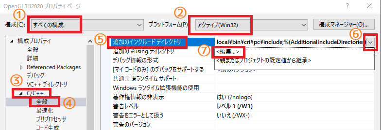
</p>

そして、環境を「すべての構成」(①)、プラットフォームを「Win32」に設定します(②)。次に、「C/C++→全般→追加のインクルードディレクトリ」(③、④、⑤)を選択します。

右端の下向き矢印をクリックして(⑥)、プルダウンメニューから「編集」を選択します(⑦)。すると「追加のインクルードディレクトリ」ウィンドウが開きます。

<p align="center">
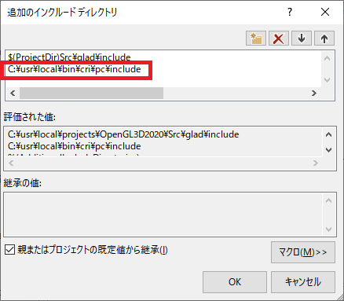
</p>

すでに`GLAD`のインクルードパスが設定されていると思います。`GLAD`のインクルードパスの下をクリックして、以下のパスを追加してください。

`ADX2 LEをインクルードしたフォルダ/cri/pc/include`

追加したらOKボタンを押してダイアログボックスを閉じ、プロパティウィンドウの「適用」ボタンを押して変更を有効にします。

>**【パス指定について】**<br>
>これらを行わず絶対パスを使うこともできますが、その場合はプロジェクトフォルダを移動したりコピーするたびにパスを変更しなくてはなりません。<br>
>また、複数台のPCで作業をしていて、それぞれADX2 LEのインストール先が異なる場合は「環境変数」を使用するとよいでしょう。環境変数については「環境変数 windows」などのキーワードでインターネット検索すると情報が見つかるでしょう。

### 1.3 ライブラリパスの追加

次は「リンカー→全般→追加のライブラリディレクトリ」(①、②、③)を選択してください。インクルードパスと同様に、右端の下向き矢印をクリックして(④)、プルダウンメニューから「編集」を選択します(⑤)。

<p align="center">
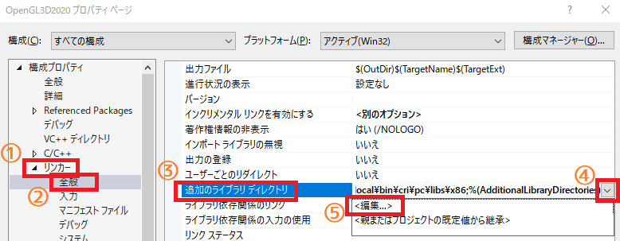
</p>

すると「追加のライブラリディレクトリ」というウィンドウが開きます。

<p align="center">
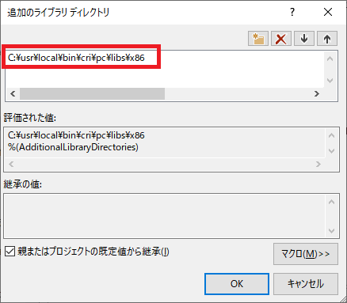
</p>

「<別のオプション>」の下に以下のライブラリパスを追加し、右上にある上向き矢印を押して順番を入れ替えてください。

`ADX2 LEをインクルードしたフォルダ/cri/pc/libs/x86`

これも、みなさんがインストールしたディレクトリを選択してください。追加したらOKボタンを押してダイアログボックスを閉じ、プロパティウィンドウの「適用」ボタンを押して変更を有効にします。

### 1.4 依存ファイルの追加

設定はもう一箇所あります。「リンカー→入力→追加の依存ファイル」を選択してください(①、②)。次に右端の下向き矢印をクリックして(③)、プルダウンメニューから「編集」を選択します(④)。

<p align="center">

</p>

すると「追加の依存ファイル」というウィンドウが開きます。

<p align="center">
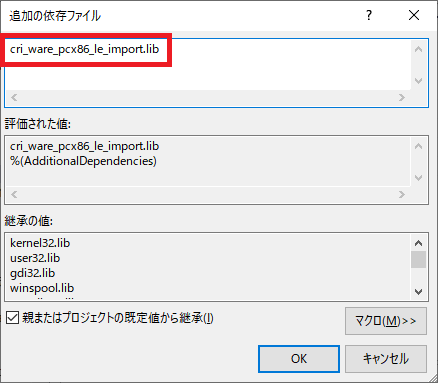
</p>

ファイルリストに

`cri_ware_pcx86_le_import.lib`

というライブラリファイル名を追加してください。追加したらOKボタンを押してダイアログボックスを閉じ、プロパティウィンドウの「適用」ボタンを押して変更を有効にします。

### 1.5 DLLファイルのコピー

あと一息です。ADX2 LEではDLL(ダイナミック・リンク・ライブラリ)という形式のファイルを、実行ファイルから見えるところに置いておく必要があります。最も簡単なのは、実行ファイルと同じフォルダにコピーすることです。

目的のDLLファイルは

`ADX2LEのインストール先フォルダ/cri/pc/libs/x86/`

にある

`cri_ware_pcx86_le.dll`

というファイルです。これを、プロジェクトの`Debug`フォルダにコピーしてください。`Release`フォルダがある場合はそちらにもコピーしておくといいでしょう。これでADX2 LEを使用する準備は整いました。

<pre class="tnmai_assignment">
<strong>【課題01】</strong>
ADX2LEのマニュアルは
<code>ADX2LEのインストール先フォルダ/cri/documentation/</code>
にある<code>CRI_ADX2LE_PC_Manual.chm</code>というファイルです。このファイルを開き、以下の2つの項目にひととおり目を通しなさい。2章からは、これらをある程度読んでいることを前提として解説していきます。
- CRI ADX2 LE Windows版マニュアル
- CRI ADX2ユーザーズマニュアル
なお、CRI Atomツールのマニュアルは<code>cri/tools/criatomex/win/manual/jpn/contents/index.html</code>です。こちらの「CRI ADX2 Toolsを初めて使う方へ」も読んでおいてください。
</pre>

>**【まとめ】**<br>
>
>* 音声の再生には専用のライブラリを使うと簡単。
>* ADX2 LEは無料で使えて、日本製なので日本語情報が豊富。
>* Visual Studioでライブラリを使用可能にするには「インクルードディレクトリ」、「ライブラリディレクトリ」、「ライブラリ名」を設定する必要がある。

<div style="page-break-after: always"></div>

## 2. Audioクラス

### 2.1 Audioクラスを定義する

オーディオに関する機能は全てATOMライブラリが定義してくれているので、わたしたちはそれを使うだけで音がなります。といっても、直接使うには手続きが面倒な部分もありますから、必要な機能をクラスとしてまとめておくと便利です。

オーディオクラスはプログラム全体でひとつだけあれば十分ですから、「シングルトン」として作成することにします。クラス名は`Audio`(オーディオ)としましょう。

プロジェクトの`Src`フォルダに`Audio.h`を追加してください。そして追加した`Audio.h`を開き、次のプログラムを追加してください。

```diff
+/**
+* @file Audio.h
+*/
+#ifndef AUDIO_H_INCLUDED
+#define AUDIO_H_INCLUDED
+#include <cri_adx2le.h>
+#include <vector>
+
+/**
+* 音声制御クラス.
+*/
+class Audio
+{
+public:
+  static Audio& Instance();
+
+private:
+  Audio() = default;
+  ~Audio();
+  Audio(const Audio&) = delete;
+  Audio& operator=(const Audio&) = delete;
+};
+
+#endif // AUDIO_H_INCLUDED
```

Atomライブラリを使うには`cri_adx2le.h`というヘッダファイルをインクルードします。

### 2.2 Atomライブラリを制御するメンバ関数を宣言する

通常のクラスはコンストラクタで初期化してデストラクタで破棄します。しかしシングルトンパターンでは、コンストラクタやデストラクタが`private`になっているため呼び出せません。

そこで、かわりに初期化用と破棄用のメンバ関数を用意します。初期化は`Initialize`(イニシャライズ)、破棄は`Finalize`(ファイナライズ)という名前にしましょう。

Atomライブラリを初期化して音声を再生可能な状態にするには、音声の基本設定が書き込まれたACFファイルのパスと、DSPバス設定の名前が最低限必要となります。破棄については特にパラメータは不要です。

これらを踏まえて、`Audio`クラスの定義に次のプログラムを追加してください。

```diff
 class Audio
 {
 public:
   static Audio& Instance();
+
+  // システム・データ管理.
+  bool Initialize(const char* acfPath, const char* dspBusName);
+  void Finalize();

 private:
   Audio() = default;
   ~Audio();
```

Atomライブラリで音声を再生するには、音声を含むACBファイルとAWBファイルが必要です。これらは再生前に Atomライブラリに読み込んでおかなくてはなりません。これを行うメンバ関数名を`Load`(ロード)とします。

音声ファイルは複数作ることができ、シーンの変更などによって切り替えることが可能です。これを実現するためには、不要になった音声ファイルを破棄するメンバ関数が必要でしょう。このメンバ関数名は`Unload`(アンロード)とします。

また、複数の音声ファイルを読み込めるように、音声データをインデックスで管理することにします。例えば効果音は0番に読み込み、BGMは1番に読み込むといった使い方を想定しています。

そのために`Load`と`Unload`には、対象となるインデックスを引数で渡す必要があるでしょう。ということで、`Audio`クラスの定義に次のプログラムを追加してください。

```diff
   // システム・データ管理.
   bool Initialize(const char* acfPath, const char* dspBusName);
   void Finalize();
+  bool Load(size_t index, const char* acbPath, const char* acwPath);
+  void Unload(size_t index);

 private:
   Audio() = default;
   ~Audio();
```

Atomライブラリでは`criAtomEx_ExecuteMain`関数を定期的に呼び出す必要があります。これを行うためのメンバ関数も必要です。名前は`Update`とします。なおAtomライブラリは自前で経過時間を管理しているため、引数で経過時間を渡す必要はありません。

それでは、`Audio`クラスの定義に次のプログラムを追加してください。

```diff
   void Finalize();
   bool Load(size_t index, const char* acbPath, const char* acwPath);
   void Unload(size_t index);
+  void Update();

 private:
   Audio() = default;
   ~Audio();
```

### 2.3 音声を制御するメンバ関数を宣言する

システム管理以外に、音声の再生や停止を行うメンバ関数も必要です。再生は`Play`(プレイ)、停止は`Stop`(ストップ)という名前にします。

Atomライブラリには、再生する音声を指定する方法がいくつか用意されています。しかし、キューIDを使うのが基本となりますので、`Play`メンバ関数もキューIDだけ対応すれば当面は十分です。

`Audio`クラスの定義に次のプログラムを追加してください。

```diff
   bool Load(size_t index, const char* acbPath, const char* acwPath);
   void Unload(size_t index);
   void Update();
+
+  // 再生制御.
+  void Play(size_t playerId, int cueId);
+  void Stop(size_t playerId);

 private:
   Audio() = default;
   ~Audio();
```

これで、最低限必要そうなメンバ関数は宣言できたと思います。

### 2.4 Atomライブラリ及び音声を制御するメンバ変数を定義する

次にメンバ変数を定義します。Atomライブラリのマニュアルにある「ADX2 クイックスタート」を読むと、記録しておく必要があるのは以下の3つです。

| 必要なメンバ変数の型 | 必要な個数 |
|:---------------------|:----------:|
| ボイスプールハンドル | 1          |
| ACBハンドル          | 1以上      |
| プレイヤーハンドル   | 1以上      |

「ボイスプールハンドル」はひとつ作れば十分ですが、「ACBハンドル」と「プレイヤーハンドル」は複数作成します。特にプレイヤーは、発音後も制御が必要なBGMとそれ以外の2つを作成しておくことで、音声の制御がやりやすくなります。

複数作成するハンドルについては`std::vector`を使って定義することにします。

さらに「ADX2 クイックスタート」では説明されていませんが、`D-BAS`(ディーバス)のIDも記録しておく必要があります。`D-BAS`(Dynamic Buffer Allocation System)はストリーミング再生用のメモリ管理を行うオブジェクトです。

それでは、`Audio`クラスの定義に次のプログラムを追加してください。

```diff
   Audio(const Audio&) = delete;
   Audio& operator=(const Audio&) = delete;
+
+  CriAtomExVoicePoolHn voicePool = nullptr;
+  CriAtomDbasId dbasId = CRIATOMDBAS_ILLEGAL_ID;
+  std::vector<CriAtomExAcbHn> acbList;
+  std::vector<CriAtomExPlayerHn> players;
 };

 #endif // AUDIO_H_INCLUDED
```

ところで、Atomライブラリで音声の再生を行う関数は以下の書式になっています。

<pre class="tnmai_code"><strong>【書式】</strong>
void criAtomExPlayer_SetCueId(プレイヤーハンドル, ACBハンドル, キューID);
</pre>

プレイヤーハンドルとキューIDが必要なのは当然ですが、それだけでなくキューを含む「ACBのハンドル」も必要となっています。

しかし、`Audio`クラスの`Play`メンバ関数にはACBハンドルを指定するための引数を入れていません。理由は、音声を再生するときにいちいちACBまで指定するのは面倒ですし、キューを別のACBに移動させるたびにプログラムを修正しなくてはならないからです。

引数にACBハンドルがないので、`Play`メンバ関数はキューIDから自動的にACBハンドルを選択できなくてはなりません。幸いAtomライブラリには、キューIDがACBに含まれているかどうかを調べる`criAtomExAcb_ExistsId`関数があります。

キューIDが重複していない限り、この関数をすべてのACBに対して使用すれば、必要なACBハンドルが分かります。ただ、この方法では検索時間が必要になるという問題があります。

そこで、キューIDとACBハンドルの対応表を作ることにします。この対応表はACBハンドルの配列になっていて、キューIDを添え字にすると対応するACBハンドルが得られるという仕組みです。

「キューIDからACBハンドルを取得する」データなので、名前は`cueIdToAcbMap`(キューアイディー・トゥ・エーシービー・マップ)とします。それでは、`Audio`クラスの定義に次のプログラムを追加してください。

```diff
   CriAtomDbasId dbasId = CRIATOMDBAS_ILLEGAL_ID;
   std::vector<CriAtomExAcbHn> acbList;
   std::vector<CriAtomExPlayerHn> players;
+  std::vector<CriAtomExAcbHn> cueIdToAcbMap;
 };

 #endif // AUDIO_H_INCLUDED
```

>**【メンバ変数にコメントを書く？　書かない？】**<br>
>もしメンバ変数名から何に使うためのものか想像がつかないようなら、コメントに変数の用途を書いておくといいでしょう。簡単に用途が想像できるような名前を付けるのが理想ですが、常にそれが可能なわけではありませんからね。

<pre class="tnmai_assignment">
<strong>【課題02】</strong>
上記のプログラムで使用している4つのAtomライブラリの型について、<code>CRI_ADX2LE_PC_Manual.chm</code>のキーワード検索機能を使って説明している箇所を探して説明を読みなさい。
</pre>

>**【Atomライブラリの型の読み方】**<br>
>筆者は次のように読んでいます。正確なところは不明なので、適当な読み方でO.K.です。
>| 型名 | 読み方 |
>|:-----|:-------|
>| CriAtomExVolicePoolHn | シーアールアイ・アトム・エクス・ボイス・プール・ハンドル |
>| CriAtomDbasId | シーアールアイ・アトム・ディーバス・アイディー |
>| CriAtomExAcbHn | シーアールアイ・アトム・エクス・エーシービー・ハンドル |
>| CriAtomExPlayerHn | シーアールアイ・アトム・エクス・プレイヤー・ハンドル |
>
>なお、この例で分かるように`Hn`は(おそらく)`handle`(ハンドル)の短縮形です。`Ex`は`extended`(エクステンデッド)か`extension`(エクステンション)の短縮形だと思うのですが、正解は不明です。

### 2.5 ヘルパー関数を定義する

`Audio`クラスの定義が完了したので、クラスのメンバ関数を定義していきましょう。

プロジェクトの`Src`フォルダに`Audio.cpp`というCPPファイルを追加してください。まずは必要なヘッダファイルをインクルードします。追加した`Audio.cpp`を開き、次のプログラムを追加してください。

```diff
+/**
+* @file Audio.cpp
+*/
+#include "Audio.h"
+#include <algorithm>
+#include <iostream>
```

`Audio.h`の他に、C++標準ライブラリの関数を使うために`algorithm`(アルゴリズム)をインクルードし、エラー出力用に`iostream`をインクルードしています。

次に、関数を実装する前にADX2 LEを使うために必要な関数を定義します。作成するのは以下の3つです。

>* エラーコールバック関数
>* メモリ確保関数(アロケータ)
>* メモリ破棄関数(デアロケータ)

これらは「ADX2 クイックスタート」の「\[ゲームへの組み込み\]編 (3)ライブラリ初期化」にサンプルプログラムが掲載されています。

ほぼ掲載されたとおりに作っていきますが、`C++`ということで、エラーメッセージの出力先は`std::cerr`に変更し、メモリの確保と開放には`malloc`、`free`ではなく`operator new`と`operator delete`を使うことにします。

それではインクルード文の下に、次のプログラムを追加してください。

```diff
 #include "Audio.h"
 #include <algorithm>
 #include <iostream>
+
+/**
+* オーディオ用エラーコールバック.
+*
+* @param errid  エラーの種類を示すID.
+* @param p1     erridの補足情報その1.
+* @param p2     erridの補足情報その2.
+* @param parray (未使用).
+*/
+void AudioErrorCallback(const CriChar8* errid, CriUint32 p1, CriUint32 p2,
+  CriUint32* parray)
+{
+  const CriChar8* err = criErr_ConvertIdToMessage(errid, p1, p2);
+  std::cerr << err << std::endl;
+}
+
+/**
+* オーディオ用アロケータ.
+*
+* @param obj  登録時に指定したユーザー引数.
+* @param size 確保するバイト数.
+*
+* @return 確保したメモリのアドレス.
+*/
+void* AudioAllocate(void* obj, CriUint32 size)
+{
+  return operator new(size);
+}
+
+/**
+* オーディオ用デアロケータ.
+*
+* @param obj 登録時に指定したユーザー引数.
+* @param ptr 開放するメモリのアドレス.
+*/
+void AudioDeallocate(void* obj, void* ptr)
+{
+  operator delete(obj);
+}
```

`AudioErrorCallback`(オーディオ・エラー・コールバック)関数は、Atomライブラリからのエラー情報を受け取るためのコールバック関数です。

Atomライブラリにはエラー情報を文字列に変換してくれる`criErr_ConverteIdToMessage`関数が備わっているので、これを使ってエラー文字列を取得して標準エラー出力に出力しています。

`AudioAllocate`(オーディオ・アロケート)と`AudioDeallocate`(オーディオ・デアロケート)はメモリの確保と解放を行うための関数です。Atomライブラリはユーザーが直接メモリを管理できるように確保関数と解放関数を指定する仕組みになっています。

関数名にある`Allocate`(アロケート)は「割り当てる」という意味で、`Deallocate`(デアロケート)は「割り当て解除、取り除く」という意味です。これらの名前はメモリ管理関数などでよく使われます。

メモリ管理関数では`operator new`(オペレータ・ニュー)関数と`operator delete`(オペレータ・デリート)関数を使ってメモリを確保・解放しています。

これらは`new`演算子や`delete`演算子が内部で呼び出す関数で、`malloc`、`free`と同様にメモリの割り当てと解放だけを行い、コンストラクタやデストラクタを呼び出しません。

めったに使う機会はないと思いますが、今回のように自前のメモリ管理関数を作らなければならない場合、これらの関数を使うと処理をC++言語に丸投げすることができます。

### 2.6 Audio::Instance関数を定義する

それではメンバ関数を定義していきましょう。まずは`Instance`(インスタンス)メンバ関数から始めます。`AudioDeallocate`関数の定義の下に次のプログラムを追加してください。

```diff
 void AudioDeallocate(void* obj, void* ptr)
 {
   operator delete(obj);
 }
+
+/**
+* 音声制御クラスを取得する.
+*
+* @return 音声制御クラスのインスタンスの参照.
+*/
+Audio& Audio::Instance()
+{
+  static Audio instance;
+  return instance;
+}
```

この関数は`instance`というスタティックローカル変数を定義して、その変数の参照を返します。

### 2.7 デストラクタを定義する

続いて、デストラクタを定義します。`Instance`メンバ関数の定義の下に次のプログラムを追加してください。

```diff
   static Audio instance;
   return instance;
 }
+
+/**
+* デストラクタ.
+*/
+Audio::~Audio() {
+  Finalize();
+}
```

デストラクタは`Finalize`メンバ関数を呼び出して、すべてのオブジェクトを破棄します。

### 2.8 Atomライブラリを初期化する

次に`Initialize`(イニシャライズ)メンバ関数を定義します。`Initialize`関数ではAtomライブラリを初期化し、音声を再生する準備をします。「ADX2クイックスタート \[ゲームへの組み込み\]編」に書かれているとおり以下の順番で処理していきます。

>1. エラーコールバック関数の登録
>2. メモリアロケータの登録
>3. ライブラリの初期化
>4. ストリーミング用バッファの作成
>5. 全体設定ファイル(ACF)の登録
>6. DSPバス設定の登録
>7. ボイスプールの作成

ご覧のとおり、いろいろやることがあるので雛形から徐々に作っていくことにしましょう。`Instance`メンバ関数の定義の下に、次のプログラムを追加してください。

```diff
   static Audio instance;
   return instance;
 }
+
+/**
+* 音声制御システムを初期化する.
+*
+* @param acfPaht    全体設定を保持するACFファイルのパス.
+* @param dspBusName 音声システムで使用するDSPバス名.
+*
+* @retval true  初期化成功.
+* @retval false 初期化失敗.
+*/
+bool Audio::Initialize(const char* acfPath, const char* dspBusName)
+{
+  return true;
+}
```

#### 1. エラーコールバック関数の登録

それでは「エラーコールバック関数の登録」から作成していきましょう。エラーコールバック関数を登録するには`criErr_SetCallback`(シーアールアイ・エラー・セット・コールバック)関数を使います。<br>
`Initialize`メンバ関数に次のプログラムを追加してください。

```diff
 bool Audio::Initialize(const char* acfPath, const char* dspBusName)
 {
+  // エラーコールバック関数を登録する.
+  criErr_SetCallback(ErrorCallback);
+
   return true;
 }
```

#### 2. メモリアルケータの登録

メモリアロケータを登録するには`criAtomEx_SetUserAllocator`(シーアールアイ・アトム・エクス・セット・ユーザー・アロケータ)関数を使います。エラーコールバック関数を登録するプログラムの下に、次のプログラムを追加してください。

```diff
   // エラーコールバック関数を登録する.
   criErr_SetCallback(ErrorCallback);
+
+  // メモリ管理関数を登録する.
+  criAtomEx_SetUserAllocator(AudioAllocate, AudioDeallocate, nullptr);

   return true;
 }
```

#### 3. ライブラリの初期化

ライブラリの初期化には`criAtomEx_Initialize_WASAPI`(シーアールアイ・アトム・エクス・イニシャライズ・ワサピ)関数を使います。

`WASAPI`は`Windows Audio Session API`(ウィンドウズ・オーディオ・セッション・エーピーアイ)の略称で、Windows Vista以降に搭載されている音声制御用のインターフェイスです。

`WASAPI`はPC版のAtomライブラリが内部で使用していますが、Atomライブラリを使ううえで`WASAPI`の知識はほとんど必要ありません。そのため`WASAPI`について詳しい説明はしませんが、興味があればインターネット検索で調べてみるとよいでしょう。

さて、`criAtomEx_Initialize_WASAPI`関数は3つの引数を受け取ります。最初の引数にはAtomライブラリの設定を行う初期化用構造体を指定できます。残りの2個は手動メモリ管理用で、メモリアロケータを登録している場合は使用しません。

「ADX2クイックスタート」では初期化用構造体を使っていませんが、実際のアプリケーションで使う場合はいくつか設定をしておくべき項目があります。そこで、まずは初期化用構造体を作成しましょう。

しかしその前に、ADX2マニュアルの「CRI Atomライブラリについて ライブラリの初期化パラメータ解説」を再度確認してください。そこには初期化用構造体を指定しなかった場合のライブラリの初期設定が書かれています。

>* フレームワークをマルチスレッドモデルに設定
>* サーバ処理の実行頻度を60Hzに設定
>* 最大バーチャルボイス数を16に設定
>* CRI File Systemライブラリをデフォルト設定で初期化

このうち、「最大バーチャルボイス数」と「CRI File Systemライブラリ」の設定を変更します。

「最大バーチャルボイス数」は、Atomライブラリが同時に再生管理できる音声の数です。すでにこの数の音声が再生されている状態で、さらに音声を再生しようとすると再生に失敗します。

例えば手榴弾の爆風が10体のゾンビに命中し、すべて死亡したとします。それぞれのゾンビがダメージ音と死亡音声の2つを鳴らすとすると、それだけで20個になってデフォルトの16個では足りません。このような場合に備えて最大数を増やしておきます。

「CRI File Systemライブラリ」は音声ファイルの読み込みを制御するために、Atomライブラリが内部で使用しています。これも様々な設定項目がありますが、そのうち「ローダー数」を変更しておきます。

「ローダー」はファイルを読み込むためのオブジェクトで、再生する音声ごとにひとつ必要です。さらにAtomライブラリが内部で使用するぶんもありますので、同時発音数より大きな値を設定しなくてはなりません。

ローダー数が足りないと、後で説明する「ボイスプール」の作成に失敗してしまいます。

さらに、初期化パラメータ解説には書かれていませんが、3D音源を使う場合に備えてAtomライブラリの座標系も指定しておきます。Atomライブラリの初期値は左手座標系なので、OpenGLに合わせて右手座標系にします。

初期化用構造体は`CriAtomExConfig_WASAPI`(シーアールアイ・アトム・エクス・コンフィグ・ワサピ)とです。メモリアロケータを登録するプログラムの下に、次のプログラムを追加してください。

```diff
   // メモリ管理関数を登録する.
   criAtomEx_SetUserAllocator(AudioAllocate, AudioDeallocate, nullptr);

+  // 初期化パラメータを設定する.
+  CriAtomExConfig_WASAPI libConfig;
+  criAtomEx_SetDefaultConfig_WASAPI(&libConfig);
+
+  // ローダー数を設定する.
+  CriFsConfig fsConfig;
+  criFs_SetDefaultConfig(&fsConfig);
+  fsConfig.num_loaders = 40; // num_voicesより大きい値を設定すること.
+  libConfig.atom_ex.fs_config = &fsConfig;
+
+  // 再生制御可能な音声の最大数. 実際の発音数はボイスプールのnum_voicesで指定する.
+  libConfig.atom_ex.max_virtual_voices = 64;
+
+  // OpenGL用に右手座標系を指定.
+  libConfig.atom_ex.coordinate_system = CRIATOMEX_COORDINATE_SYSTEM_RIGHT_HANDED;

   return true;
 }
```

ボイス数は32個にする予定なので、ローダー数はそれより多い40個にしました。なぜ8個増やしたのかというと、ボイス数とローダー数の初期値が8と16だからです(この数値からは2倍にすることも考えられますが、それはさすがに多すぎます)。

バーチャルボイス数の初期値は16個ですが、先に説明したようにこれでは少なすぎます。2倍の32個もあれば大抵の場合は問題なさそうですが、アクションゲームということでさらに余裕を見て4倍の64個としました。

バーチャルボイス数はメモリとCPU時間の必要量に影響します。ロールプレイングゲームやアドベンチャーゲームのように、音の発生源となるキャラクターが大量に表示されることがないゲームでは初期値のままのほうがよいでしょう。

それでは作成した初期化用構造体を使ってAtomライブラリを初期化しましょう。初期化用構造体を作成するプログラムの下に、次のプログラムを追加してください。

```diff
   // OpenGL用に右手座標系を指定.
   libConfig.atom_ex.coordinate_system = CRIATOMEX_COORDINATE_SYSTEM_RIGHT_HANDED;
+
+  // Atomライブラリを初期化.
+  criAtomEx_Initialize_WASAPI(&libConfig, nullptr, 0);

   return true;
 }
```

>**【バーチャルボイス数≠実際の発音数】**<br>
>バーチャルボイス数は再生管理可能な音声の数であって、実際に発音できる音声の数ではないことに注意してください。実際の発音数はボイスプールで指定します。

#### 4. ストリーミング用バッファの作成

ストリーミング用バッファの作成には`criAtomDbus_Create`(シーアールアイ・アトム・ディーバス・クリエイト)関数を使います。

Atomライブラリのストリーミング用バッファは、`D-BAS`(ディーバス)というCRIが開発したプログラムを使っています。そのため、ストリーミング用バッファを制御する関数には`Dbas`という文字が付きます。

また、`D-BAS`にも専用の初期化用構造体があって、さまざまな設定を調整することができるようになっています。しかし、通常はデフォルト設定のままで問題はないでしょう。

それでは、Atomライブラリを初期化するプログラムの下に、次のプログラムを追加してください。

```diff
   // Atomライブラリを初期化.
   criAtomEx_Initialize_WASAPI(&libConfig, nullptr, 0);
+
+  // ストリーミング用バッファを作成.
+  dbasId = criAtomDbas_Create(nullptr, nullptr, 0);

   return true;
 }
```

#### 5. 全体設定ファイル(ACF)の登録

次に、音声の全体的な設定を記録したACF(エーシーエフ)ファイルを、Atomライブラリに登録します。ACFファイルの登録には`criAtomEx_RegisterAcfFile`(シーアールアイ・アトム・エクス・レジスター・エーシーエフ・ファイル)関数を使います。

<pre class="tnmai_code"><strong>【書式】</strong>
CriBool criAtomEx_RegisterAcfFile(バインダハンドル, ACFファイルのパス, 作業用メモリのアドレス, 作業用メモリのサイズ);
</pre>

この関数には4つの引数がありますが、指定する必要があるのは「ACFファイルのパス」だけです。バインダハンドルは`ADX2`専用で、`ADX2 LE`では使えないので`nullptr`を指定します。

そして、メモリ管理関数を登録している場合は作業用メモリを指定する必要はありませんから、作業用メモリのアドレスには`nullptr`、作業用メモリのサイズには`0`そ指定します。

ストリーミング用バッファ`を作成するプログラムの下に、次のプログラムを追加してください。

```diff
   // ストリーミング用バッファを作成.
   dbasId = criAtomDbas_Create(nullptr, nullptr, 0);
+
+  // ACFファイルを読み込む.
+  if (criAtomEx_RegisterAcfFile(nullptr, acfPath, nullptr, 0) == CRI_FALSE) {
+    std::cerr << "[エラー]" << __func__ << ":" << acfPath << "の読み込みに失敗.\n";
+    Finalize();
+    return false;
+  }

   return true;
 }
```

#### 6. DSPバス設定の登録

「DSP(ディーエスピー)バス」は再生中の複数の音声を合成(ミックス)して、実際に出力される音を作り上げるオブジェクトです。また、音声にエコーやリバーブといったエフェクトをかけるのもこのDSPバスで行います。

Atomライブラリでは最低1つのDSPバスが必要です。エフェクトをかけたり外したりする場合はエフェクト用のDSPバスを追加します。

```diff
     std::cerr << "[エラー]" << __func__ << ":ACFファイルの読み込みに失敗.\n";
     return false;
   }
+
+  // DSPバスを割り当てる.
+  criAtomEx_AttachDspBusSetting(dspBusName, nullptr, 0);

   return true;
 }
```

>**【D-BASとDSPバスは無関係】**<br>
>D-BASとDSPバスはたまたま名前が似ているだけで、両者にはなんの関係もありません。

#### 7. ボイスプールの作成

Atomライブラリの初期化の最後は「ボイスプールの作成」です、ADX2マニュアルの「ADX2のキーアイテム ボイス ボイスについて」では、次のようにボイスを説明しています。

>ボイスはサウンド再生を行う最も基本的なオブジェクトです。

そして、「ボイスプール」は複数のボイスを管理するオブジェクトです。最大同時発音数はボイスプールの設定によって決まります。また、ボイスプールには「ストリーミング音声の有効・無効」と「最大サンプリングレート」も設定します。

DSPバスを割り当てるプログラムの下に、次のプログラムを追加してください。

```diff
   // DSPバスを割り当てる.
   criAtomEx_AttachDspBusSetting(dspBusName, nullptr, 0);
+
+  // ボイスプールを設定する.
+  CriAtomExStandardVoicePoolConfig svpConfig;
+  criAtomExVoicePool_SetDefaultConfigForStandardVoicePool(&svpConfig);
+  svpConfig.num_voices = libConfig.atom_ex.max_virtual_volices / 2; // 同時発音数.
+  svpConfig.player_config.streaming_flag = CRI_TRUE; // ストリーミング再生を有効化.
+  svpConfig.player_config.max_sampling_rate =
+    48000 * 2; // 最大サンプリングレート. ピッチ変更を考慮してCD音質の2倍を設定.
+  voicePool = criAtomExVoicePool_AllocateStandardVoicePool(&svpConfig, nullptr, 0);

   return true;
 }
```

`num_voices`(ナム・ボイシズ)には同時に発音できる音声の最大数を指定します。上記のプログラムでは「最大バーチャルボイス数の半分」にしています。

ボイスはバーチャルボイスのうち優先度が高い順に割り当てられ、優先度が高いバーチャルボイスの再生が終わるとボイスが開放されます。このとき、優先度が低いバーチャルボイスがまだ再生していたら、空いたボイスが割り当てられて途中から再生が行われます。

ボイスは実際の発音を伴うため、バーチャルボイス数よりもメモリとCPU時間に与える影響が大きくなります。そのため、ボイス数をバーチャルボイス数より少なくしておくと音声処理の効率を上げやすいです。

もちろん、バーチャルボイス数が十分に少ない場合は、バーチャルボイス数とボイス数を合わせておくとよいでしょう。なお、同時発音数はバーチャルボイス数以上にはならないため、バーチャルボイス数を超えるボイス数を指定する意味はありません。

`streaming_flag`(ストリーミング・フラグ)を`CRI_TRUE`(シーアールアイ・トゥルー)にすると、ストリーミング再生が有効になります。大抵のBGMはストリーミング再生されるので、この設定は重要です。

`max_sampling_rate`(マックス・サンプリング・レート)は再生可能な音声の精度を指定します。通常はCD音質である`48000`を指定しますが、ピッチ(=音の高さ)を上げたい場合は、上げたい倍率に合わせてより高い値を設定します。

すべての設定が完了したら、`criAtomExVoicePool_AllocateStandardVoicePool`(シーアールアイ・アトム・エクス・ボイス・プール・アロケート・スタンダード・ボイス・プール)関数でボイスプールを作成します。

これでAtomライブラリの初期化は完了です。

### 2.9 Audio::Initializeメンバ関数を完成させる

`Initialize`メンバ関数の目的には、Atomライブラリの初期化だけでなく`Audio`クラスの初期化も含まれます。ここからは`Audio`クラスの初期化をしていきます。

まず、音声再生用のプレイヤーオブジェクトを作成します。プレイヤーオブジェクトを作成するには`criAtomExPlayer_Create`(シーアールアイ・アトム・エクス・プレイヤー・クリエイト)関数を使います。

Atomライブラリでは再生、停止、音量の設定などを、プレイヤーオブジェクト単位で行う仕組みになっています。例えば効果音とBGMを別々のプレイヤーで再生すれば、個別に音量の設定や停止を行うことができます。

それでは、ボイスプールを作成するプログラムの下に、次のプログラムを追加してください。

```diff
   svpConfig.player_config.max_sampling_rate =
     48000 * 2; // 最大サンプリングレート. ピッチ変更を考慮してCD音質の2倍を設定.
   voicePool = criAtomExVoicePool_AllocateStandardVoicePool(&svpConfig, nullptr, 0);
+
+  // 再生制御用プレイヤーを作成する.
+  players.resize(8);
+  for (auto& e : players) {
+    e = criAtomExPlayer_Create(nullptr, nullptr, 0);
+  }

   return true;
 }
```

本テキストでは一般的な音声再生を目標にしているので、プレイヤー数は8としています。もし3Dサウンドを使いたい場合は、音源の位置ごとにプレイヤーを割り当てる必要があるため、プレイヤー数を増やしてください。

続いてACB読み込み配列を作成します。配列を用意するだけなので、`resize`メンバ関数を使って大きさを指定したら終わりです。プレイヤーを作成するプログラムの下に、次のプログラムを追加してください。

```diff
   for (auto& e : players) {
     e = criAtomExPlayer_Create(nullptr, nullptr, 0);
   }
+
+  // acb読み込み配列を確保.
+  // ここで指定した数は、同時に読み込み可能なACBファイルの最大数になる.
+  // Loadで配列に読み込み、Unloadで破棄する.
+  acbList.resize(16);

   return true;
 }
```

次にキューIDとACBファイルの対応表を用意します。これも配列を作るだけなので`resize`メンバ関数を呼べば終わりです。ACB読み込み配列を作成するプログラムの下に、次のプログラムを追加してください。

```diff
   // ここで指定した数は、同時に読み込み可能なACBファイルの最大数になる.
   // Loadで配列に読み込み、Unloadで破棄する.
   acbList.resize(16);
+
+  // キューIDとacbファイルの対応表を確保.
+  // キューIDを添え字に使うことで対応するacbファイルを取得できる.
+  // サウンド再生にははキューIDとacbファイルのペアが必要なため.
+  // Loadで対応表に追加され、Unloadで削除される.
+  cueIdToAcbMap.resize(4096);

   return true;
 }
```

### 2.10 初期化済み判定を追加する

ところで、プログラムにミスは付きものですから、`Initialize`メンバ関数や`Finalize`メンバ関数が連続で呼ばれることが無いとは言い切れません。そこで「初期化済みフラグ」変数を追加して、すでに初期化されていたら何もしないようにしましょう。

`Audio.h`を開き、`Audio`クラスの定義に次のプログラムを追加してください。

```diff
   std::vector<CriAtomExAcbHn> acbList;
   std::vector<CriAtomExPlayerHn> players;
   std::vector<CriAtomExAcbHn> cueIdToAcbMap;
+
+  bool isInitialized = false; // 初期化済みならtrue.
 };

 #endif // AUDIO_H_INCLUDED
```

次に`Audio.cpp`を開き、`Initialize`メンバ関数の先頭に次のプログラムを追加してください。

```diff
 bool Audio::Initialize(const char* acfPath, const char* dspBusName)
 {
+  // 初期化済みなら何もしない.
+  if (isInitialized) {
+    return true;
+  }
+
   // エラーコールバック関数を登録する.
   criErr_SetCallback(ErrorCallback);
```

それから、`Initialize`メンバ関数の末尾にも次のプログラムを追加してください。

```diff
   // サウンド再生にははキューIDとacbファイルのペアが必要なため.
   // Loadで対応表に追加され、Unloadで削除される.
   cueIdToAcbMap.resize(4096);

+  isInitialized = true;
   return true;
 }
```

### 2.11 Audio::Finalize関数を定義する

続いて破棄関数を実装します。破棄処理では、各オブジェクトに対応する破棄関数を呼び出すだけです。破棄関数の名前は「デストロイ」、「リリース」、「フリー」と様々ですが、作成関数と合わせるためにこうなっているようです。

`Initialize`メンバ関数の定義の下に、次のプログラムを追加してください。

```diff
   isInitialized = true;
   return true;
 }
+
+/**
+* 音声制御システムを破棄する.
+*/
+void Audio::Finalize()
+{
+  // 初期化されていなければ何もしない.
+  if (!isInitialized) {
+    return;
+  }
+
+  // すべてのプレイヤーを破棄.
+  for (auto& e : players) {
+    if (e) {
+      criAtomExPlayer_Destroy(e);
+      e = nullptr;
+    }
+  }
+
+  // すべてのACBファイルを破棄.
+  for (auto& e : acbList) {
+    if (e) {
+      criAtomExAcb_Release(e);
+      e = nullptr;
+    }
+  }
+
+  // キューIDとACBの対応表を初期化.
+  std::fill(cueIdToAcbMap.begin(), cueIdToAcbMap.end(), nullptr);
+
+  // ボイスプールを破棄.
+  if (voicePool) {
+    criAtomExVoicePool_Free(voicePool);
+    voicePool = nullptr;
+  }
+
+  // ACFファイルの登録を解除.
+  criAtomEx_UnregisterAcf();
+
+  // DBASを破棄.
+  if (dbasId != CRIATOMDBAS_ILLEGAL_ID) {
+    criAtomDbas_Destroy(dbasId);
+    dbasId = CRIATOMDBAS_ILLEGAL_ID;
+  }
+
+  // ADX2LEを終了.
+  criAtomEx_Finalize_WASAPI();
+
+  isInitialized = false;
+}
```

### 2.12 Audi::Load関数を定義する

次に音声ファイルを読み込むメンバ関数を定義します。音声ファイルの読み込みには`criAtomExAcb_LoadAcbFile`(シーアールアイ・アトム・エクス・ロード・エーシービー・ファイル)関数を使います。

音声ファイルには以下の2種類があります。

>* ACB(エーシービー)ファイル: オンメモリ再生用の波形データが格納されています。
>* AWB(エーダブリュービー)ファイル: ストリーミング再生用の波形データが格納されています。

`criAtomExAcb_LoadAcbFile`関数はACBファイルとAWBファイルの両方を読み込むことができます。

`Finalize`メンバ関数の定義の下に、次のプログラムを追加してください。

```diff
   criAtomEx_Finalize_WASAPI();

   isInitialized = false;
 }
+
+/**
+* 音声ファイルを読み込む.
+*
+* @param index   読み込み先のACB配列の番号.
+* @param acbPath ACBファイルのパス名.
+* @param awbPath AWBファイルのパス名.
+*
+* @retval true  読み込み成功.
+* @retval false 読み込み失敗.
+*/
+bool Audio::Load(size_t index, const char* acbPath, const char* awbPath)
+{
+  if (index >= acbList.size()) {
+    std::cerr << "[エラー]" << __func__ << ":" <<
+      acbPath << "のインデックスが大きすぎます.\n";
+    return false;
+  }
+
+  // 念のため読み込み先の要素を解放.
+  Unload(index);
+
+  // 音声ファイルを読み込む.
+  acbList[index] = criAtomExAcb_LoadAcbFile(
+    nullptr, acbPath, nullptr, awbPath, nullptr, 0);
+  if (!acbList[index])) {
+    std::cerr << "[エラー]" << __func__ << ":" << acbPath << "の読み込みに失敗.\n";
+    return false;
+  }
+
+  return true;
+}
```

音声ファイルの読み込みに成功したら、キューIDとACBの対応表を作ります。`criAtomExAcb_GetNumCues`(シーアールアイ・アトム・エクス・エーシービー・ゲット・ナム・キューズ)関数で取得したキューの数だけループして対応表に追加していきます。

キュー情報を取得するには`criAtomExAcb_GetCueInfoByInex`(シーアールアイ・アトム・エクス・エーシービー・ゲット・キュー・インフォ・バイ・インデックス)関数を使います。キュー情報に記録されているキューIDを添え字にして対応付けを行います。

音声ファイルを読み込むプログラムの下に、次のプログラムを追加してください。

```diff
+
+  // キューIDとACBの対応表を更新.
+  const CriSint32 numCues = criAtomExAcb_GetNumCues(acbList[index]);
+  for (int i = 0; i < numCues; ++i) {
+    // キュー情報を取得.
+    CriAtomExCueInfo cueInfo;
+    if (!criAtomExAcb_GetCueInfoByIndex(acbList[index], i, &cueInfo)) {
+      std::cerr << "[警告]" << __func__ << ":" << acbPath << "の" <<
+        i << "番目のキュー情報を取得できません.\n";
+      continue;
+    }
+    // 対応表よりキューIDが大きい場合は対応表のサイズを拡張.
+    if (cueIdToAcbMap.size() <= static_cast<size_t>(cueInfo.id)) {
+      cueIdToAcbMap.resize(cueInfo.id + 1);
+    }
+    // キューIDとACBを対応付ける.
+    cueIdToAcbMap[cueInfo.id] = acbList[index];
+  }
+  return true;
+}
```

### 2.13 Audio::Unlaodメンバ関数を定義する

`Unload`メンバ関数は、シーンの切り替えなどで不要になった音声ファイルを破棄し、別の音声ファイルを読み込めるようにする関数です。

音声ファイルを破棄するには`criAtomExAcb_Release`(シーアールアイ・アトム・エクス・エーシービー・リリース)関数を使います。

また、破棄されたACBファイルを使って再生が行われてしまうことを防ぐために、 音声ファイルを破棄する前に、キューIDとACBの対応表から、音声ファイルに対応するデータを削除しておく必要があります。

対応表からデータを削除するには、ACBハンドルを`nullptr`にします。これにはC++標準ライブラリの`replace`(リプレイス)関数を使うのが簡単です。

<pre class="tnmai_code"><strong>【書式】</strong>
void replace(置き換える範囲の先頭, 置き換える範囲の終端, 置き換え対象の値, 置き換える値);
</pre>

`replace`関数は、「置き換え範囲」にあるすべての「置き換え対象の値」を「置き換える値」で置き換えます。

それでは、`Load`メンバ関数の定義の下に、、次のプログラムを追加してください。

```diff
     cueIdToAcbMap[cueInfo.id] = acbList[index];
   }
   return true;
 }
+
+/**
+* オーディオファイルを破棄する.
+*
+* @param index 破棄するACB配列の番号.
+*/
+void Audio::Unload(size_t index)
+{
+  if (index >= acbList.size()) {
+    std::cerr << "[エラー]" << __func__ << ":" <<
+      "インデックスが大きすぎます.\n";
+    return;
+  }
+
+  if (acbList[index]) {
+    // 対応表から破棄予定のACBハンドルを削除.
+    std::replace(cueIdToAcbMap.begin(), cueIdToAcbMap.end(),
+      acbList[index], static_cast<CriAtomExAcbHn>(nullptr));
+
+    // ACBハンドルを破棄
+    criAtomExAcb_Release(acbList[index]);
+    acbList[index] = nullptr;
+  }
+}
```

### 2.14 Audio::Updateメンバ関数を定義する

Atomライブラリの状態を更新するには`criAtomEx_ExecuteMain`(シーアールアイ・アトム・エクス・エグゼキュート・メイン)関数を呼び出します。`Finalize`メンバ関数の定義の下に、次のコードを追加してください。

```diff
     acbList[index] = nullptr;
   }
 }
+
+/**
+* 音声システムの状態を更新する.
+*/
+void Audio::Update()
+{
+  // 音声システムの状態を更新.
+  criAtomEx_ExecuteMain();
+}
```

### 2.15 Audio::Playメンバ関数を定義する

次に音声を再生する関数を実装します。

Atomライブラリで音声を再生するには`criAtomExPlayer_SetCueId`(シーアールアイ・アトム・エクス・プレイヤー・セット・キュー・アイディ)と`criAtomExPlayer_Start`(シーアールアイ・アトム・エクス・プレイヤー・スタート)の2つの関数を使います。

まず`criAtomExPlayer_SetCue`関数でプレイヤーにキューを割り当てます。キューを割り当てたあとで`criAtomExPlayer_Start`関数を呼ぶと再生が開始されます。

それでは、`Update`関数定義の下に、次のプログラムを追加してください。

```diff
+
+/**
+* 音声を再生する.
+*
+* @param playerId 再生に使用するプレイヤー番号.
+* @param cueId    再生するキューID.
+*/
+void Audio::Play(size_t playerId, int cueId)
+{
+  // プレイヤー番号がプレイヤー数以上の場合は何もしない.
+  if (playerId >= players.size()) {
+    return;
+  }
+  // 対応表がnullptrの場合は何もしない.
+  if (!cueIdToAcbMap[cueId]) {
+    return;
+  }
+
+  // プレイヤーにキューをセット.
+  criAtomExPlayer_SetCueId(players[playerId], cueIdToAcbMap[cueId], cueId);
+
+  // セットしたキューを再生.
+  criAtomExPlayer_Start(players[playerId]);
+}
```

本テキストでは扱いませんが、音声の音量やピッチを変更して再生したい場合は`SetCueId`と`Start`の間で変更したいパラメータを設定します。

### 2.16 Audio::Stopメンバ関数を定義する

最後は再生停止関数です。音声を停止するには`criAtomExPlayer_Stop`(シーアールアイ・アトム・エクス・プレイヤー・ストップ)関数を使います。`Play`関数定義の下に、次のコードを追加してください。

```diff
   // セットしたキューを再生.
   criAtomExPlayer_Start(players[playerId]);
 }
+
+/**
+* 音声を停止する.
+*
+* @param playerId 再生を停止するプレイヤー番号.
+*/
+void Audio::Stop(size_t playerId)
+{
+  // プレイヤー番号がプレイヤー数以上の場合は何もしない.
+  if (playerId >= players.size()) {
+    return;
+  }
+
+  // 再生を停止する.
+  criAtomExPlayer_Stop(players[playerId]);
+}
```

これで`Audio`クラスのすべてのメンバ関数を定義することができました。

>**【まとめ】**<br>
>
>* ADX2 LEのプログラムに組み込むライブラリは「Atomライブラリ」という名前。
>* Atomライブラリはアプリケーションの目的に合わせてさまざまな設定をすることができる。
>* ACFファイルには全体設定が格納されている。ACBファイルとAWBファイルには音声データが格納されている。
>* Atomライブラリでは、音声は「キュー」というデータ単位で再生する。キューは「プレイヤー」によって再生される。

<div style="page-break-after: always"></div>

## 3. 音声ファイルを用意する

### 3.1 音声素材を手に入れる

ADX2 LE用の音声ファイルを作成するために音声素材を集めます。必要な素材のリストは以下のとおりです。

| 種別 | 用途                  |
|:----:|:----------------------|
| BGM  | タイトル画面のBGM     |
| BGM  | メインゲーム画面のBGM |
| BGM  | ゲームクリア時のBGM   |
| BGM  | ゲームオーバー時のBGM |
| SE   | タイトル画面でゲーム開始キーが押されたときに鳴らす音 |
| SE   | プレイヤーの足音      |
| SE   | プレイヤーにゾンビの攻撃が命中したときの音 |
| SE   | プレイヤーが死んだときの音 |
| SE   | 弾丸の発射音          |
| SE   | 手榴弾を投げる音      |
| SE   | 手榴弾の爆発音        |
| SE   | ゾンビに弾丸・手榴弾が命中したときの音 |
| SE   | ゾンビが死んだときの音 |
| SE   | ゾンビが攻撃するときの音 |

音声を見つけるのに有用なサイトをいくつか挙げますので、これらから上記の用途に合う音声を見つけてダウンロードしてください。ダウンロードしたファイルは、音声作業用フォルダを作ってそのなかにまとめておくとよいでしょう。

また、サイトごとにサブフォルダを作っておくと、どのサイトからダウンロードしたのかが分かるのでおすすめです。

良質なBGMをフリーで公開しているサイトの例:

* `soundimage.org`: Eric Matyas(エリック・マティアス)氏の個人サイトで、ゲーム開発者向けの無料の音楽や効果音、テクスチャなどが公開されています。右のリストから好きなジャンルを選んで音楽を探してください。
* `incompetech.filmmusic.io`: Kevin MacLeod(ケビン・マクロード)氏の個人サイトで、映画やゲーム向けの無料の音楽が公開されています。左の`Search`(サーチ)または`Genres`(ジャンル)を選んで音楽を探してください。
* `bensound.com`: Benjamin Tissot(ベンジャミン・ティソ)氏の個人サイトで、映画やゲーム向けの無料の音楽が公開されています。`DOWNLOAD`(ダウンロード)と表示されているのが無料の音楽です。

`soundcloud.com`など馴染みのサイトがあるのなら、そちらで検索してもよいでしょう。

良質な効果音をフリーで公開しているサイト:

* `www.fesliyanstudios.com`: David Fesliyan(デイビッド・フェスリアン)氏の個人サイトで、映画やゲーム向けの音楽と効果音が公開されています。`zombie`で検索するとやたら大量の効果音が出てくるのが特徴です。
* `freesound.org`: スペインのポンペウ・ファブラ大学の音楽技術グループが管理運営している音声投稿サイトです。23万を超える大量の音声が投稿されているため品質にバラつきはありますが、大抵の効果音が見つかります。

オンラインで効果音を作成するサイト:

* `https://www.leshylabs.com/apps/sfMaker/`: 昔のゲームで使われたような効果音を生成してくれるサイトです。左のプリセットボタンをクリックするだけでランダムな効果音が作れます。

<pre class="tnmai_assignment">
<strong>【課題03】</strong>
上記のサイトでお好みのBGMと効果音を検索して、必要な音声を集めなさい。
なお、ADX2 LEが扱える音声ファイルは<code>WAV</code>(ウェーブ)形式のものだけです。<code>MP3</code>(エムピー・スリー)などの場合はファイル形式を変換するオンラインサイトやツールを使って<code>WAV</code>形式に変換しておいてください。
</pre>

### 3.2 CRI Atom Craftプロジェクトを作成する

集めた音声素材をAtomライブラリで使える音声ファイルにするには、CRI Atom Craft(シーアールアイ・アトム・クラフト)ツールを使います。このツールは以下のパスにインストールされています。

`ADX2LEのインストール先フォルダ/cri/tools/criatomex/win/`

上記フォルダ内の`CriAtomCraft.exe`をダブルクリックするとCRI Atom Craftツールが起動します。

また、ツールのマニュアルは上記フォルダの`manual/jpn/contents/index.html`をダブルクリックすると表示されます。本テキストではマニュアルの「CRI Atom Craft チュートリアル」をベースに作業を行いますので、マニュアルを開いておいてください。

さっそくですが、マニュアルの「チュートリアル プロジェクトの作成」ページを開いてください。ツールを起動すると「スタートページ」が表示されます。スタートページにある「新規作成」ボタンをクリックすると「プロジェクトの新規作成」ウィンドウが開きます。

チュートリアルではプロジェクト名を`TutorialProject`としていますが、本テキストではVisual Studioのプロジェクト名と同じ名前にしてください。

プロジェクトの保存先のフォルダ名は`Tutorial`となっていますが、本テキストでは何も入力せずデフォルトのままにしてください。

プロジェクト名とフォルダ名を確認したら「プロジェクトの新規作成」ボタンを押してプロジェクトを作成してください。

プロジェクトを作成すると、次に「ワークユニットの追加」ウィンドウが表示されます。「ワークユニット」は作業内容を分割して管理するための仕組みです。一人で作業する場合はひとつのワークユニットだけで十分です。

ただデフォルトの名前は`WorkUnit_0`と味気ないので、`MainWorkUnit`という名前に変更してください。ワークユニット名を変更したら「追加」ボタンをクリックしてください。するとプロジェクトが作成されます。

### 3.3 プロジェクトに音声素材を追加する

次に、マニュアルの「チュートリアル キューシートの作成」を開いてください。チュートリアルでは最初からあるキューシートを削除して新しく作り直すように指示されますが、あれは削除と追加の練習をさせたいだけなのでやらなくていいです。

ADX2は「キュー」という単位で発音を制御します。「キューシート」はキューをグループとしてまとめる仕組みです。音声ファイルはキューシートごとに作られるので、例えば以下のような使い方ができます。

>* データ管理をやりやすくするため、BGM、効果音、ボイスなどの種類で分ける。
>* 必要なメモリを減らすため、シーンごとにキューシートを分けてシーンが切り替わるときに音声ファイルを切り替える。
>* 必要なメモリを減らすため、キャラクターや武器ごとに分けて、シーンに登場するデータだけを読み込む。

基本的には作業効率を考えて、管理のしやすさで分けることになります。そのうえで、必要に応じてシーンやキャラクターなどでさらに分割管理することを考えます。

また、キューシート名は音声ファイルの名前にも使われます。そのため、キューシート名を変更するとアプリケーションで音声ファイルを読み込んでいるプログラムも変更しなくてはなりません。

今回はBGMとSEで分けることにします。ということで、まず既存のキューシートの名前を`BGM`に変更してください。そして新しいキューシートを作成し、名前を`SE`に変更してください。

キューシートを作成したら音声素材を追加しましょう。エクスプローラを起動して音声素材のあるフォルダを開いてください。そして、BGM素材を`BGM`キューシートにドラッグ&ドロップしてください。同様にSE素材を`SE`キューシートにドラッグ&ドロップしてください。

これで音声素材が追加されるはずです。もしうまく追加できない場合は、音声素材が`WAV`形式であることを確認してください。`MP3`形式などは追加できませんので、「mp3 wav 変換」などで検索して音声素材を変換してからもう一度追加してください。

### 3.4 キューの名前を変更する

キュー名には音声素材の名前がそのまま使われます。ダウンロードした音声素材はそれぞれのサイトが適当につけた名前になっているので、どれが何の音なのかが分かりにくいですよね。

そこで、キュー名を変更してわかりやすくしましょう。キュー名を変更するにはキューを右クリックして「名前の変更」を選択します。それでは、すべてのキューの名前を以下の表に書かれているキュー名に変更してください。

| 種別 | 用途                     | キュー名         |
|:----:|:-------------------------|:-----------------|
| BGM  | タイトル画面のBGM        | BGM_TITLE        |
| BGM  | メインゲーム画面のBGM    | BGM_MAINGAME     |
| BGM  | ゲームクリア時のBGM      | BGM_GAMECLEAR    |
| BGM  | ゲームオーバー時のBGM    | BGM_GAMEOVER     |
| SE   | タイトル画面でゲーム開始キーが押されたときに鳴らす音 | SE_GAMESTART |
| SE   | プレイヤーの足音         | SE_PLAYER_FOOTSTEP |
| SE   | プレイヤーにゾンビの攻撃が命中したときの音 | SE_PLAYER_DAMAGE |
| SE   | プレイヤーが死んだときの音 | SE_PLAYER_DEAD |
| SE   | 弾丸の発射音             | SE_SHOT          |
| SE   | 手榴弾を投げる音         | SE_GRENADE       |
| SE   | 手榴弾の爆発音           | SE_EXPLOSION     |
| SE   | ゾンビに弾丸・手榴弾が命中したときの音 | SE_ZOMBIE_DAMAGE |
| SE   | ゾンビが死んだときの音   | SE_ZOMBIE_DEAD   |
| SE   | ゾンビが攻撃するときの音 | SE_ZOMBIE_ATTACK |

なお、キューIDにはキュー名を含む`#define`された名前が付けられます。ですから、新しくキューを追加したときは、プログラムで使うときに音声の種類が分かるような名前を付けるようにしてください。

### 3.5 キューIDが重複しないようにする

キューIDはキューシートが異なると重複することがあります。しかしキューIDが重複すると、「キューIDからACBを見つける」機能が正しく動きません。そこで、重複しないようにBGMのキューIDを変更しておきます。

とりあえずSEとBGMが`1000`ほど離れていれば安全だと思いますので、SEは`0`から、BGMは`1000`からの連番を割り当てることにしましょう。タイトル画面のBGMのキューを選択し、インスペクターでキューIDを`1000`に変更してください。

なお、Atom Craftはデフォルトで`0`番からキューIDを割り振りますので、SEについては変更の必要はありません。

<pre class="tnmai_assignment">
<strong>【課題04】</strong>
タイトル画面以外のBGMについて、キューIDが重複しないように注意して<code>1001</code>からの連番に変更しなさい。キューを選択するとインスペクターウィンドウにキューID項目が表示されるので、この項目の値を変更します。インスペクターウィンドウが表示されていない場合は、下部の「インスペクター」ボタンをクリックしてください。
</pre>

### 3.6 BGMをストリーミング再生に設定する

効果音と比較するとBGMは容量が大きいため、より多くのメモリを必要とします。使用するBGMが増えるとそれだけメモリが必要となり、ファイルをメモリに読み込むためのロード時間も長くなってしまいます。

この問題を解決するために「ストリーミング再生」という方法が使われます。ストリーミング再生は以下のような仕組みになっています。

>1. 音声データの先頭部分だけをメモリに読み込んで再生を開始.
>2. 再生が終わった部分のメモリを解放する.
>3. 2で空いたメモリに、音声データの続きを読み込む.
>4. まだ読み込んでいない音声データがあるなら2に戻る.
>5. 全ての音声データを再生したら再生終了.

このように、ストリーミング再生では読み込みと再生を同時に行うことで、見かけのロード時間を短縮しています。それに加えて、再生が終わった部分のメモリを再利用することで、必要なメモリを削減しているのです。

ストリーミング再生の設定方法については、マニュアルの「音声素材の登録 マテリアル(エンコード)パラメーターの設定 ストリーミングタイプ」を参照してください。

ストリーミング再生設定は「マテリアル」、「マテリアルフォルダー」、「ターゲットコンフィグ」の3箇所で設定できます。

| 設定箇所             | どんなときに設定する？                                 |
|:--------------------:|:-------------------------------------------------------|
| ターゲットコンフィグ | 実行環境によってストリーミングタイプを変更したい場合   |
| マテリアルフォルダー | 音声素材にまとめてストリーミングタイプを設定したい場合 |
| マテリアル           | 音声素材ごとにストリーミングタイプを設定したい場合     |

音声素材ごとにストリーミングを設定するのは面倒なので、まとめて設定できる「マテリアルフォルダー」を使います。ターゲットコンフィグはPC版とスマホ版で処理を変えたい場合などに使いますが、今回はPC版だけなので使いません。

まずはマテリアルフォルダーを追加しましょう。CRI Atom Craftツールの下部にウィンドウ選択ボタンが並んでいます。この中の「マテリアルツリー」をクリックしてください。

<p align="center">
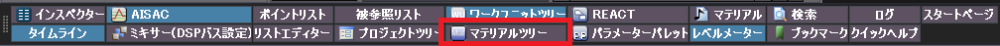
</p>

するとマテリアルツリーウィンドウが表示されます。マテリアルルートフォルダの上で右クリックして(①)、「新規オブジェクト(②)→サブフォルダの作成(③)」をクリックしてください。するとサブフォルダが作成されます。

<p align="center">
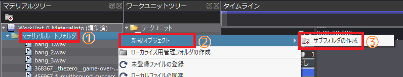
</p>

今度は作成したサブフォルダの上で右クリックして(①)、「名前の変更」を選んでください(②)。そしてサブフォルダの名前を「ストリーミング」に変更してください。

<p align="center">
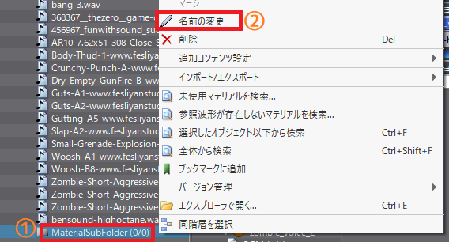
</p>

次にドラッグ&ドロップによって、すべてのBGMを「ストリーミング」フォルダに移動させてください。

<p align="center">
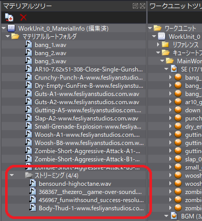
</p>

最後に「ストリーミング」フォルダの設定を変更します。「ストリーミング」フォルダをクリックして選択状態にしたあと、下部のウィンドウ選択ボタンにある「インスペクター」をクリックしてください。

<p align="center">

</p>

すると「インスペクターウィンドウ」が開きます。インスペクターウィンドウの「ストリーミングタイプ」という項目が目的のものです。

ストリーミングタイプの値は「デフォルト(メモリ)」となっています。この値をダブルクリックすると選択リストが表示されるので、「ストリーミング」をクリックしてください。

<p align="center">
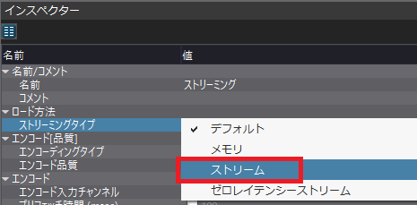
</p>

これで「ストリーミング」マテリアルフォルダにある音声素材はすべてストリーミング再生されるようになります。

### 3.7 BGMにループ再生を設定する

一般的にゲームのBGMは無限に繰り返し再生されます。CRI Atom Craftツールに音声素材を追加した段階では繰り返し再生が無効になっていますので、ループ情報を変更して繰り返し再生されるようにしましょう。

ループの設定方法についてはマニュアルの以下の2つを参照してください。

* 音声素材の登録 マテリアル(エンコード)パラメーターの設定 ストリーミングタイプ
* 目的別Tips 設計にかかわること 作業開始前に決めておくこと ループ方法を決める

マニュアルにも書いてあるとおり、CRI Atom Craftツールでは様々なループ設定ができますが、一般的なBGMではマテリアルのループ設定を使うのがよいでしょう。

マテリアルツリーからメインゲーム画面で再生するをクリックして選択状態にしてください。するとインスペクターウィンドウに音声素材の設定が表示されます。インスペクターウィンドウをスクロールして「ループ情報の上書き」という項目を探してください。

「ループ情報の上書き」項目が見つかったら、値の「False」をダブルクリックして値リストを表示し、「True」を選択してください。

<p align="center">
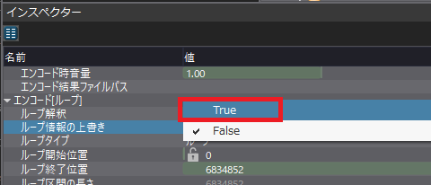
</p>

これでBGMがループ再生されるようになります。

### 3.8 BGMの優先度を上げる

ADX2 LEには「優先度」という概念があります。同時発音数を超えて音声を鳴らそうとしたとき、鳴らそうとした音声より優先度の低い音声を停止することで、優先度の高い音声が常に再生されることを保証します。

優先度は`0`から`255`まで指定することができ、数字が大きいほど優先度が高くなります。初期状態ではすべてのキューの優先度は`0`です。そのため、手榴弾などで大量の的にダメージを与えたりすると、`BGM`が停止してしまう可能性があります。

そこで、`BGM`の優先度を上げることにします。優先度は「カテゴリ」という機能で指定します。カテゴリは音声をグループ分けするための機能です。

プロジェクトツリーの「カテゴリ」には最初から`CategoryGroup_0`がありますので、この項目を右クリックして「新規オブジェクト→カテゴリの作成」を選択してください。

<p align="center">
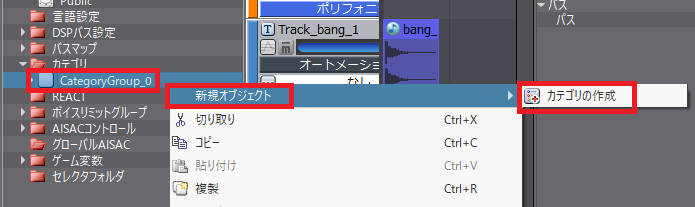
</p>

すると`Category_0`というカテゴリが追加されます。今度はワークユニットツリーから適当な音声のキューを左クリックして、キューのインスペクターウィンドウを表示してください。

インスペクターウィンドウの中にある「カテゴリ」という項目を見つけて、値の空欄をクリックしてください。すると「カテゴリの編集」というウィンドウが開きます。

<p align="center">
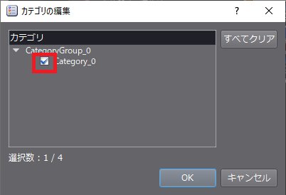
</p>

`Category_0`にチェックを入れて「OK」ボタンをクリックすると、音声が`Category_0`に分類されます。

<pre class="tnmai_assignment">
<strong>【課題05】</strong>
すべての音声を<code>Category_0</code>に分類しなさい。
</pre>

次にタイトル画面用BGMのキューを選択し、インスペクターウィンドウの「カテゴリキュープライオリティレベル」という項目を見つけてください。

<p align="center">
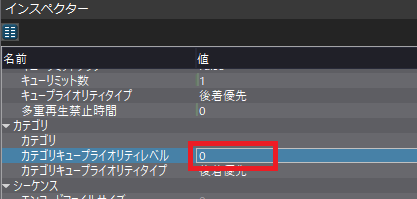
</p>

この項目の値を`128`に変更してください。これでタイトル画面用BGMは優先的に再生されるようになります。

<pre class="tnmai_assignment">
<strong>【課題06】</strong>
メインゲーム画面、ゲームクリア、ゲームオーバーのBGMの優先度を<code>128</code>に設定しなさい。
</pre>

### 3.9 音声ファイルを作成する

それでは音声ファイルを作成しましょう。ウィンドウ上部のメニューバーの「ビルド」をクリックし、次に「Atomキューシートバイナリのビルド」をクリックすると「Atomキューシートバイナリのビルド」ウィンドウが開きます。

まず右側のキューシートリストの下部にある「全て」ボタンをクリックして、すべてのキューシートにチェックを付けてください。

チェックを付けたら、右下にある「ビルド」ボタンをクリックします。するとビルド処理が始まります。ビルド処理が完了したら「ビルドログ」が表示されます。

<p align="center">

</p>

「出力パスを開く」ボタンをクリックすると、音声ファイルのあるフォルダが開きます。出力先はプロジェクトのあるフォルダになっていると思います。

プロジェクトフォルダをダブルクリックして開くと、`Public`(パブリック)というフォルダがあるはずです。これはデフォルトの「ターゲットコンフィグ」の名前です。

`Public`をダブルクリックすると、その中に以下の音声ファイルが作成されていると思います。

* OpenGL3DActionGame.acf
* OpenGL3DActionGame_acf.h
* MainWorkUnit/BGM.acb
* MainWorkUnit/BGM.awb
* MainWorkUnit/BGM.h
* MainWorkUnit/SE.acb
* MainWorkUnit/SE.h

これで音声ファイルを作ることができました。

>**【まとめ】**<br>
>
>* 音声ファイルの作成にはCRI Atom Craftツールを使う。
>* CRI Atom Craftツールに登録できるのは`WAV`形式のみ。
>* 音声をストリーミング再生するには、「ストリーミングタイプ」を「ストリーム」に設定したマテリアルフォルダに入れる。
>* 音声を無限ループするには、マテリアルの「ループ情報の上書き」を`True`にする。

<div style="page-break-after: always"></div>

## 4. 音声の再生

### 4.1 音声ファイルの移動

作成した音声ファイルを`Visual Studio`のプロジェクトフォルダに移動しましょう。`Res`フォルダに`Audio`というフォルダを追加してください。そして、音声ファイルが出力されたフォルダから、以下の音声ファイルを切り取って貼り付けてください。

* OpenGL3DActionGame.acf
* MainWorkUnit/BGM.acb
* MainWorkUnit/BGM.awb
* MainWorkUnit/SE.acb

音声を再生するにはヘッダファイルも必要です。`Src`フォルダに`Audio`というサブフォルダを作成してください。そして、音声ファイルが出力されたフォルダから、以下のヘッダファイルを切り取って貼り付けてください。

* OpenGL3DActionGame_acf.h
* MainWorkUnit/BGM.h
* MainWorkUnit/SE.h

これらのヘッダファイルには、初期化に必要な`D-BAS`名や音声に対応するキューIDが保存されていて、インクルードすればその定義を初期化や再生に利用できるようになっています。

### 4.2 ヘッダファイルのインクルード

まずは音声ファイルを読みこんで再生できるようにします。`Main.cpp`を開き、次のインクルード文を追加してください。

```diff
 #include <glad/glad.h>
 #include "GLContext.h"
 #include "SceneManager.h"
 #include "GameData.h"
+#include "Audio.h"
+#include "Audio/OpenGL3DActionGame_acf.h"
 #include <GLFW/glfw3.h>
 #include <string>
```

### 4.3 音声ファイルを読み込む

それでは音声ファイルを読み込みましょう。まず`Audio`クラスのインスタンスを取得し、`Audio::Initialzie`メンバ関数で初期設定を行います。次に`Audio::Load`メンバ関数でACB及びAWBファイルを読み込みます。

`Main.cpp`を開き、デバッグメッセージコールバック関数を設定するプログラムの下に、次のプログラムを追加してください。

```diff
   glDebugMessageCallback(DebugCallback, nullptr);
+
+  // 音声を初期化する.
+  Audio& audio = Audio::Instance();
+  audio.Initialize("Res/Audio/OpenGL3DActionGame.acf",
+    CRI_OPENGL3DACTIONGAME_ACF_DSPSETTING_DSPBUSSETTING_0);
+  audio.Load(0, "Res/Audio/MainWorkUnit/SE.acb", nullptr);
+  audio.Load(1, "Res/Audio/MainWorkUnit/BGM.acb", "Res/Audio/MainWorkUnit/BGM.awb");

   // ゲーム全体で使うデータを初期化する.
   GameData& gamedata = GameData::Get();
   if (!gamedata.Initialize(window)) {
```

`CRI_OPENGL3DACTIONGAME_ACF_DSPSETTING_DSPBUSSETTING_0`はDSP設定名を指すマクロ定数です。これは`OpenGL3DActionGame_acf.h`に定義されています。

### 4.4 音声の更新を呼び出す

音声処理は定期的に`Audio::Update`メンバ関数を呼び出す必要があります。メインループに次のプログラムを追加してください。

```diff
     sceneManager.Update(window, deltaTime);
     sceneManager.Render(window);
+
+    // 音声の更新
+    audio.Update();

     glfwPollEvents();
     glfwSwapBuffers(window);
```

### 4.5 音声処理を終了する

最後に、ゲームが終了するタイミングでAtomライブラリを終了させます。メインループの下に次のプログラムを追加してください。

```diff
     glfwSwapBuffers(window);
   }
+
+  // 音声の終了.
+  audio.Finalize();

   // GLFWの終了.
   glfwTerminate();
```

これで音声を再生する準備が整いました。

### 4.6 音声を再生する

それでは音声を再生するプログラムを追加しましょう。音声を再生するにはキューIDが分かっていなくてはなりません。キューIDはCRI Atom Craftツールが出力したヘッダファイルにかかれています。

`TitleScene.cpp`を開き、次のプログラムを追加してください。

```diff
 #include "TitleScene.h"
 #include "SceneManager.h"
 #include "GameData.h"
+#include "Audio_adx2le/Audio.h"
+#include "Audio/MainWorkUnit/BGM.h"
+#include "Audio/MainWorkUnit/SE.h"
 #include <glm/gtc/matrix_transform.hpp>
 #include <iostream>
```

次にBGMを再生します。再生は`Audio::Play`メンバ関数で行います。BGMの再生には「プレイヤー0番」を使うことにします。キューIDは`BGM.h`と`SE.h`を確認してください。

それでは、`TitleScene::Initialize`メンバ関数に次のプログラムを追加してください。

```diff
   if (!texLogo || !texPressEnter) {
     return false;
   }
+
+  Audio::Instance().Play(0, CRI_BGM_TITLE);

   std::cout << "[情報] titlesceneを開始.\n";
   return true;
 }
```

なお、キューIDはキュー名を以下のルールで変換した名前が付けられます。

>* 小文字を全て大文字に変換。
>* `-`(マイナス)を`_`(アンダーバー)に置換。

日本語などの全角文字は一応使えますが、キューIDの名前に全角文字がそのまま入るため、ヘッダファイルをインクルードするとビルドエラーになります。そのため、キュー名は英数字とアンダーバーだけで付けるのが安全です。

>**【音声にコメントを付ける】**<br>
>インスペクターウィンドウを使うと、音声にコメントを設定することができます。コメントはヘッダファイルにも出力されるので、適切なコメントを設定しておくと、どのキューIDにどの音声が割り当てられているかが分かりやすくなります。

続いてゲーム開始音を再生しましょう。UI系の効果音は「プレイヤー1番」を使うことにします。ProcessInput`メンバ関数に次のプログラムを追加してください。

```diff
 void TitleScene::ProcessInput(GLFWwindow* window)
 {
   // Enterキーが押されたらタイトル画面に切り替える.
   if (glfwGetKey(window, GLFW_KEY_ENTER)) {
+    Audio& audio = Audio::Instance();
+    audio.Stop(0);
+    audio.Play(1, CRI_SE_GAME_START);
     SceneManager::Get().ChangeScene(SCENENAME_MAINGAME);
   }
 }
```

プログラムが書けたらビルドして実行してください。BGMと効果音が再生されたら成功です。

<pre class="tnmai_assignment">
<strong>【課題07】</strong>
メインゲーム画面にBGMと効果音を付けなさい。
</pre>

>**【まとめ】**<br>
>
>* 作成した音声ファイルをアプリケーションで使うには、ACF、ACB、AWBファイルをアプリケーションが参照可能なフォルダにコピーする。
>* 初期化に必要な`D-BAS`名や再生に必要なキューIDは、音声ファイルと同時に出力されるヘッダファイルに書かれている。
>* キューIDに影響するので、キュー名は英数字とアンダーバーだけで定義するべき。
>* 音声の再生には「プレイヤー番号」と「キューID」が必要。
