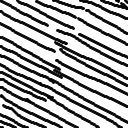
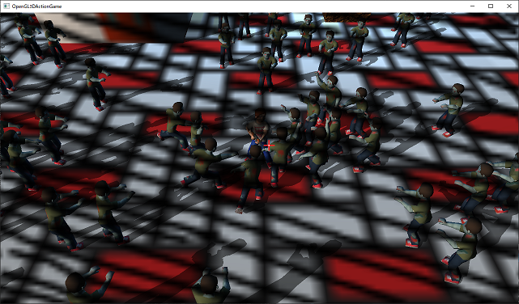
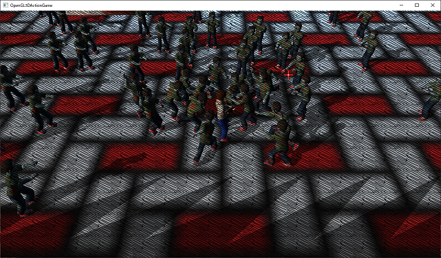
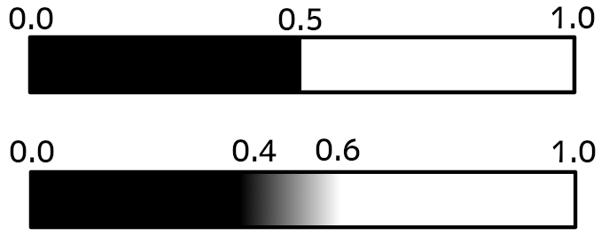
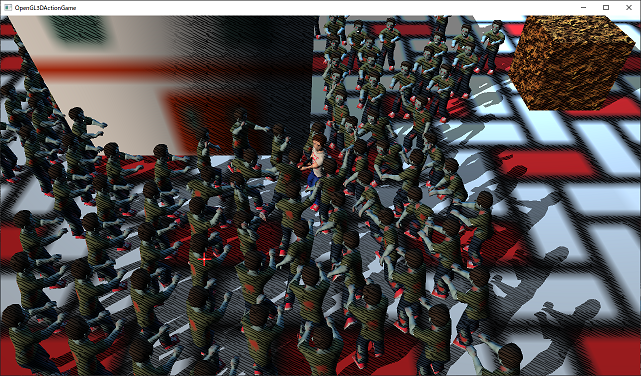
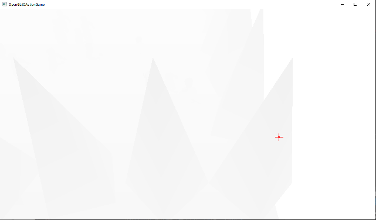
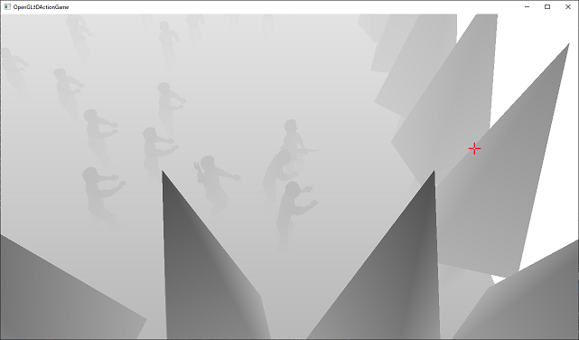
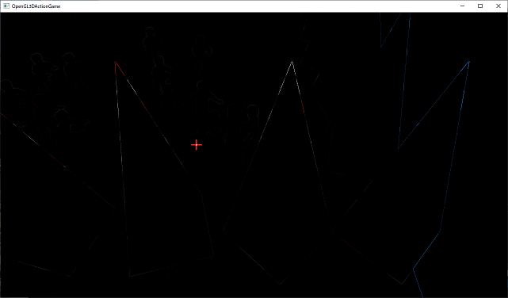
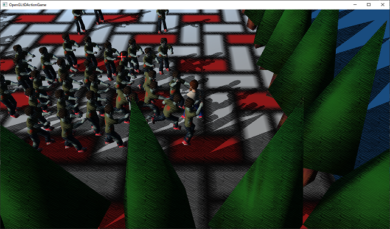
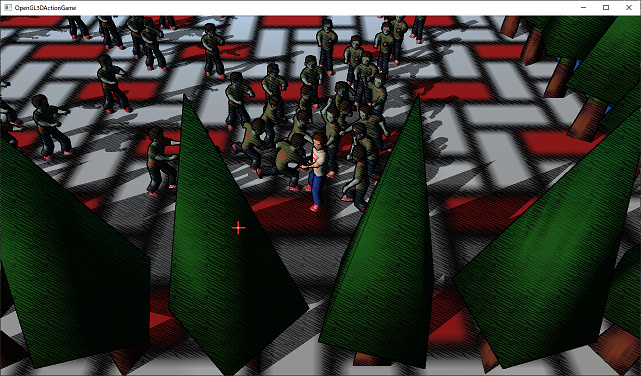

[OpenGL 3D 2020 第20回]

# 裏世界ポストプロセス

## 習得目標

* フレームバッファオブジェクトの使い方
* テクスチャへの描画
* 画面全体にエフェクトをかける方法
* 適切なニア平面とファー平面の決め方

## 1. フレームバッファオブジェクト(FBO)

### 1.1 フレームバッファとポストプロセス

OpenGLで`glDrawElements`などの描画関数を実行すると、グラフィックスパイプラインに割り当てられている「フレームバッファ」に対して描画が行われます。

フレームバッファには描画が終わった画像が存在します。シェーダを使ってこの画像を編集することで、さまざまな効果を表現することができます。このような描画が終わった後の画像を編集することを「ポストプロセス」といいます。

一般的にポストプロセスでは、フォトショップの画像フィルタのような「画面全体に影響する処理」を行います。よく使われるポストプロセスには次のようなものがあります。

>* グレースケール(白黒画像に変換)
>* セピア(セピア色に変換)
>* ぼかし
>* ポスタリゼーション(イラスト風に変換)
>* アウトライン(輪郭線を描く)
>* ヴィネット(画面端を暗くする)
>* ブルーム(光のあふれ出しを表現)
>* アンチエイリアス(ギザギザな部分をなめらかにする)
>* アンビエントオクルージョン(へこんだ部分を暗くする)

### 1.2 フレームバッファオブジェクトとテクスチャID

ポストプロセスを行うには、フレームバッファの画像をテクスチャとして読み出せるようにする必要があります。しかし、GLFWによって自動的に作成されるフレームバッファには、画像をテクスチャとして読み出す機能がありません。

なぜなら、GPUによっては「フレームバッファとテクスチャの画像形式が異なる場合がある」からです。そこで、「描画先にテクスチャを指定できるフレームバッファ」を作成してグラフィックスパイプラインに割り当てます。

この「描画先にテクスチャを指定できるフレームバッファ」を「フレームバッファ・オブジェクト」といいます。

フレームバッファオブジェクトをグラフィックスパイプラインに割り当てることで、描画された画像をテクスチャとして読み出せるようになります。

テクスチャをフレームバッファオブジェクトに割り当てるには、テクスチャIDが必要となります。そこで、`Image2D`クラスにIDを取得する機能を追加しましょう。`Texture.h`を開き、次のプログラムを追加してください。

```diff
   void Unbind() const;
   GLsizei Width() const;
   GLsizei Height() const;
+
+  // テクスチャIDを取得する.
+  GLuint GetId() const { return id; }

 private:
   std::string name;
   GLuint id = 0;
```

これでテクスチャIDを取得できるようになりました。

### 1.3 フレームバッファオブジェクトを管理するクラスを作る

さて、プログラムでフレームバッファオブジェクトを使う場合、関連する機能をクラスとしてまとめてしまうと扱いやすくなります。そこで、まずはフレームバッファオブジェクトを制御するクラスを作りましょう。

クラス名は`FramebufferObject`(フレームバッファ・オブジェクト)とします。ところで、いちいち「フレームバッファオブジェクト」と書くと読みにくいため、以後は`FBO`(エフビーオー)と表記します。

プロジェクトの`Src`フォルダに`FramebufferObject.h`というヘッダファイルを追加してください。そして追加したファイルを開き、次のプログラムを追加してください。

```diff
+/**
+* @file FramebufferObject.h
+*/
+#ifndef FRAMEBUFFEROBJECT_H_INCLUDED
+#define FRAMEBUFFEROBJECT_H_INCLUDED
+#include "glad/glad.h"
+#include "Texture.h"
+#include <memory>
+
+/**
+* フレームバッファオブジェクト.
+*/
+class FramebufferObject
+{
+public:
+  FramebufferObject(int w, int h);
+  ~FramebufferObject();
+  FramebufferObject(const FramebufferObject&) = delete;
+  FramebufferObject& operator=(const FramebufferObject&) = delete;
+
+  void Bind() const;
+  void BindColorTexture(GLuint) const;
+  void UnbindColorTexture() const;
+
+  // フレームバッファオブジェクトIDを取得する.
+  GLuint GetId() const { return fbo; }
+
+private:
+  GLuint fbo = 0; // フレームバッファオブジェクトのID.
+  std::shared_ptr<Texture::Image2D> texColor; // 描画用カラーテクスチャ.
+  GLuint depthStencil = 0; // 深度ステンシルバッファのID.
+  int width = 0; // フレームバッファの幅(ピクセル).
+  int height = 0; // フレームバッファの高さ(ピクセル).
+};
+
+#endif // FRAMEBUFFEROBJECT_H_INCLUDED
```

### 1.3 コンストラクタを定義する

それでは`FramebufferObject`クラスのメンバ関数を定義していきます。プロジェクトの`Src`フォルダに`FramebufferObject.cpp`というCPPファイルを追加してください。追加したCPPファイルを開き、次のプログラムを追加してください。

```diff
+/**
+* @file FramebufferObject.cpp
+*/
+#include "FramebufferObject.h"
+#include "GameData.h"
+#include <iostream>
+
+/**
+* コンストラクタ.
+*
+* @param w フレームバッファの幅(ピクセル数).
+* @param h フレームバッファの高さ(ピクセル数).
+*/
+FramebufferObject::FramebufferObject(int w, int h)
+{
+  // カラーテクスチャを作成.
+
+  // 深度ステンシル用レンダーバッファを作成.
+
+  // フレームバッファオブジェクトを作成.
+
+  // フレームバッファオブジェクトが作成できたかチェック.
+}
```

`FBO`を作成するには、プログラム中のコメントにあるように4つの作業が必要となります。まずは「カラーテクスチャの作成」を行いますが、これはすでに`Texture::Image2D`クラスとして作成済みです。

ですから、ここでは`std::make_shared`関数を使って、`Texture::Image2D`クラスを作成するだけで済みます。コンストラクタの定義に次のプログラムを追加してください。

```diff
 FramebufferObject::FramebufferObject(int w, int h)
 {
   // カラーテクスチャを作成.
+  texColor = std::make_shared<Texture::Image2D>("FBO(Color)", w, h, nullptr, GL_RGBA, GL_UNSIGNED_BYTE);
+  if (!texColor || !texColor->GetId()) {
+    std::cerr << "[エラー]" << __func__ << ":フレームバッファ用カラーテクスチャの作成に失敗.\n";
+    texColor.reset(); // カラーテクスチャを破棄.
+    return;
+  }

   // 深度ステンシル用レンダーバッファを作成.

   // フレームバッファオブジェクトを作成.
```

次に、深度ステンシルバッファを作成します。`FBO`でテクスチャ以外のバッファを使うには「レンダーバッファ」というものを使います。

レンダーバッファは「テクスチャとしては使えない描画用バッファ」で、デフォルトのフレームバッファに割り当てられているのと同じものです。

レンダーバッファは`glCreateRenderbuffers`(ジーエル・クリエイト・レンダーバッファーズ)関数で作成し、`glNamedRenderbufferStorage`(ジーエル・ネームド・レンダーバッファ・ストレージ)関数で画像形式と大きさを設定します。

<p><code class="tnmai_code"><strong>【書式】</strong><br>
void glCreateRenderbuffers(作成するバッファ数, IDを格納する変数のアドレス);
</code></p>

<p><code class="tnmai_code"><strong>【書式】</strong><br>
void glNamedRenderbufferStorage(レンダーバッファID, 画像形式, 画像の幅, 画像の高さ);
</code></p>

レンダーバッファを深度ステンシルバッファとして作成する場合、「画像形式」には`GL_DEPTH24_STENCIL8`(ジーエル・デプス・にじゅうよん・ステンシル・はち)を指定します。

この形式名の`24`と`8`は、「24ビットの深度バッファ」と「8ビットのステンシルバッファ」であることを表します。この形式は合計32ビットで収まりがよいのでよく使われます。

他には`GL_DEPTH32F_STENCIL8`を指定することができます。こちらは数値だけを見ると合計40ビットですが、40というのはコンピュータにとって中途半端な大きさなので、実際には64ビットサイズの画像形式になります。

それでは深度ステンシル用のレンダーバッファを作成しましょう。カラーテクスチャを作成するプログラムの下に、次のプログラムを追加してください。

```diff
     texColor.reset(); // カラーテクスチャを破棄.
     return;
   }

   // 深度ステンシル用レンダーバッファを作成.
+  glCreateRenderbuffers(1, &depthStencil);
+  glNamedRenderbufferStorage(depthStencil, GL_DEPTH24_STENCIL8, w, h);

   // フレームバッファオブジェクトを作成.

   // フレームバッファオブジェクトが作成できたかチェック.
```

カラーと深度ステンシルの両方の用意ができたら、この2つを使ってフレームバッファオブジェクトを作成します。`FBO`の作成には`glCreateFramebuffers`(ジーエル・クリエイト・フレームバッファーズ)関数を使います。

<p><code class="tnmai_code"><strong>【書式】</strong><br>
void glCreateFramebuffers(作成するバッファ数, IDを格納する変数のアドレス);
</code></p>

作成した`FBO`にテクスチャを割り当てるには`glNamedFramebufferTexture`(ジーエル・ネームド・フレームバッファ・テクスチャ)関数を使います。

<p><code class="tnmai_code"><strong>【書式】</strong><br>
void glNamedFramebufferTexture(割り当て先FBOのID, 割り当てる場所, 割り当てるテクスチャのID, 割り当てるミップマップレベル);
</code></p>

レンダーバッファを割り当てるには`glNamedFramebufferRenderbuffer`(ジーエル・ネームド・フレームバッファ・レンダーバッファ)関数を使います。

<p><code class="tnmai_code"><strong>【書式】</strong><br>
void glNamedFramebufferRenderbuffer(割り当て先FBOのID, 割り当てる場所, 割り当て対象, 割り当てるレンダーバッファのID);
</code></p>

それではレンダーバッファを作成するプログラムの下に、次のプログラムを追加してください。

```diff
   glCreateRenderbuffers(1, &depthStencil);
   glNamedRenderbufferStorage(depthStencil, GL_DEPTH24_STENCIL8, w, h);

   // フレームバッファオブジェクトを作成.
+  glCreateFramebuffers(1, &fbo);
+  glNamedFramebufferTexture(fbo, GL_COLOR_ATTACHMENT0, texColor->GetId(), 0);
+  glNamedFramebufferRenderbuffer(fbo, GL_DEPTH_STENCIL_ATTACHMENT, GL_RENDERBUFFER, depthStencil);

   // フレームバッファオブジェクトが作成できたかチェック.
 }
```

>**【glFramebufferRenderbuffer関数の「割り当て対象」引数について】**<br>
>現在この引数に指定できるのは`GL_RENDERBUFFER`のみなので、わざわざ指定する意味が無いように思えます。<br>
>`https://www.khronos.org/registry/OpenGL/extensions/EXT/EXT_framebuffer_object.txt`のIssues (30)によると、この引数を指定する理由として「将来レンダーバッファの種類が増えるかもしれないから」と説明されています。

最後にフレームバッファオブジェクトが正常に作成されたことをチェックします。これには`glCheckNamedFramebufferStatus`(ジーエル・チェック・ネームド・フレームバッファ・ステータス)関数を使います。

<p><code class="tnmai_code"><strong>【書式】</strong><br>
void glCheckNamedFramebufferStatus(チェックするFBOのID, IDが0だったとき代わりにチェックするバインディングポイント);
</code></p>

`glCheckNamedFramebufferStatus`関数の最初の引数に`0`を指定すると、二番目の引数で指定したバインディングポイントに割り当てられている`FBO`がチェックされます。

今回は`FBO`は常にゼロ以外を指定するので、二番目の引数には指定可能な値であれば何を指定しても構いませんが、とりあえず`GL_FRAMEBUFFER`を指定しておきます。その他の指定可能な値については関数名でWeb検索して調べてください。

フレームバッファが適切に作成されている場合、`glCheckNamedFramebufferStatus`関数は`GL_FRAMEBUFFER_COMPLETE`(ジーエル・フレームバッファ・コンプリート)を返します。

それでは、フレームバッファオブジェクトを作成するプログラムの下に、次のプログラムを追加してください。

```diff
   glNamedFramebufferTexture(fbo, GL_COLOR_ATTACHMENT0, texColor->GetId(), 0);
   glNamedFramebufferRenderbuffer(fbo, GL_DEPTH_STENCIL_ATTACHMENT, GL_RENDERBUFFER, depthStencil);

   // フレームバッファオブジェクトが作成できたかチェック.
+  if (glCheckNamedFramebufferStatus(fbo, GL_FRAMEBUFFER) != GL_FRAMEBUFFER_COMPLETE) {
+    std::cerr << "[エラー]" << __func__ << ":オフスクリーンバッファの作成に失敗.\n";
+    glDeleteFramebuffers(1, &fbo);
+    fbo = 0;
+    texColor.reset();
+    return;
+  }
 }
```

最後にフレームバッファの幅と高さをメンバ変数に代入します。`FBO`をチェックするプログラムの下に、次のプログラムを追加してください。

```diff
     texColor.reset();
     return;
   }
+
+  width = w;
+  height = h;
 }
```

この処理はコンストラクタ初期化子で行うこともできますが、今回は`FBO`の作成に失敗した場合はこれらの値が`0`になっているほうが適切だと考えたため、この位置で代入しています。

これでコンストラクタは完成です。

### 1.4 デストラクタを定義する

続いてデストラクタを定義しましょう。デストラクタではレンダーバッファとフレームバッファを破棄します。テクスチャは`std::shared_ptr`を使っているため、書かなくても自動的に破棄されます。

レンダーバッファを破棄するには`glDeleteRenderbuffers`(ジーエル・デリート・レンダーバッファーズ)関数を使います。`FBO`を破棄するには`glDeleteFramebuffers`(ジーエル・デリート・フレームバッファーズ)関数を使います。

<p><code class="tnmai_code"><strong>【書式】</strong><br>
void glDeleteRenderbuffers(削除するレンダーバッファの数, 削除するレンダーバッファIDの配列);
</code></p>

<p><code class="tnmai_code"><strong>【書式】</strong><br>
void glDeleteFraembuffers(削除するFBOの数, 削除するFBOのIDの配列);
</code></p>

コンストラクタの定義の下に、次のプログラムを追加してください。

```diff
   width = w;
   height = h;
 }
+
+/**
+* デストラクタ.
+*/
+FramebufferObject::~FramebufferObject()
+{
+  glDeleteRenderbuffers(1, &depthStencil);
+  glDeleteFramebuffers(1, &fbo);
+}
```

### 1.5 FBOをグラフィックスパイプラインにバインドする

次に、`FBO`をグラフィックスパイプラインに割り当てる(バインドする)メンバ関数を定義しましょう。割り当てには`glBindFramebuffer`(ジーエル・バインド・フレームバッファ)関数を使います。

<p><code class="tnmai_code"><strong>【書式】</strong><br>
void glBindFraembuffers(バインディングポイント, バインディングポイントに割り当てるFBOのID);
</code></p>

バインディングポイントには以下の3つから選択します。

| バインディングポイント名 | 説明 |
|:-------------------------|:-----|
| GL_DRAW_FRAMEBUFFER      | ここに割り当てられたフレームバッファに描画される |
| GL_READ_FRAMEBUFFER      | ここに割り当てられたフレームバッファから読み出しが行われる |
| GL_FRAMEBUFFER           | GL_DRAW_FRAMEBUFFERとGL_READ_FRAMEBUFFERの両方に割り当てる |

`GL_READ_FRAMEBUFFER`は`glReadPixels`関数や`glCopyTexSubImage2D`関数の読み出し元になります。しかし、これらはOpenGLに`FBO`が追加される以前の古い機能なので、現在ではデバッグ目的以外で使われることはありません。

残るは`GL_DRAW_FRAMEBUFFER`と`GL_FRAMEBUFFER`の2つですが、名前が短いことと、読み書きで異なるフレームバッファを割り当てると管理が面倒になることから`GL_FRAMEBUFFER`を指定することが一般的です。

それから、描画範囲を指定する`glViewport`(ジーエル・ビューポート)関数も呼び出しておきます。`glViewport`は画像の描画範囲を指定する関数です。

<p><code class="tnmai_code"><strong>【書式】</strong><br>
void glViewport(描画範囲左下のX座標, 描画範囲左下のY座標, 描画範囲の幅, 描画範囲の高さ);
</code></p>

OpenGLにはフレームバッファの大きさとは別に、「フレームバッファのどの範囲に描画するか」を示す「ビューポート」というパラメータがあります。ビューポートはフレームバッファとは別に管理されているため、フレームバッファを切り替えてもビューポートは変わりません。

何らかの目的で、デフォルトのフレームバッファとは大きさが異なる`FBO`を作成し、グラフィックスパイプラインにバインドしたとします。しかし、ビューポートはデフォルトのフレームバッファの大きさのままです。

そのため、カメラの一部だけが描画されたり、逆にフレームバッファの一部に画面が縮小表示されたりしてしまいます。この問題を回避するには、フレームバッファをバインドするたびにビューポートも再設定します。

なんとなく理屈がわかったところでプログラムを書きましょう。デストラクタの定義の下に、次のプログラムを追加してください。

```diff
   glDeleteRenderbuffers(1, &depthStencil);
   glDeleteFramebuffers(1, &fbo);
 }
+
+/**
+* グラフィックスパイプラインの描画先にFBOを割り当てる.
+*/
+void FramebufferObject::Bind() const
+{
+  glBindFramebuffer(GL_FRAMEBUFFER, fbo);
+  glViewport(0, 0, width, height);
+}
```

### 1.6 バインドを解除するメンバ関数を定義する

割り当てたオブジェクトが不要になったら、割り当てを解除しなくてはなりません。そのために、割り当てを解除するメンバ関数を定義しましょう。関数名は`Unbind`(アンバインド)としました。

割り当てを開場するには`glBindFramebuffer`関数の第2引数に`0`を指定します。`0`を指定することでデフォルトのフレームバッファが割り当てられます。

ただ、どういうわけかOpenGLではデフォルトフレームバッファの大きさを取得できません。それは実行環境とウィンドウサイズによって決められるので「環境ごとにサイズを取得できる機能があるはず」という理由からです。

GLFWライブラリを使っている場合、デフォルトフレームバッファのサイズは`glfwGetFramebufferSize`関数によって取得できます。それでは`Bind`メンバ関数の定義の下に、次のプログラムを追加してください。

```diff
   glBindFramebuffer(GL_FRAMEBUFFER, fbo);
   glViewport(0, 0, width, height);
 }
+
+/**
+* グラフィックスパイプラインの描画先をデフォルトのフレームバッファに戻す.
+*/
+void FramebufferObject::Unbind() const
+{
+  glBindFramebuffer(GL_FRAMEBUFFER, 0);
+
+  int w, h;
+  glfwGetFramebufferSize(GameData::Get().window, &w, &h);
+  glViewport(0, 0, w, h);
+}
```

### 1.7 カラーテクスチャをグラフィックスパイプラインに割り当てる

`FramebufferObject`クラスを作った理由は、描画された画像をテクスチャとして扱うためでした。そのためには、テクスチャを「テクスチャイメージユニット」に割り当てる必要があります。

そのためには、テクスチャをバインドするメンバ関数か、テクスチャへのポインタを返すメンバ関数のどちらかを作らなくてはなりません。

今回はテクスチャをバインドするメンバ関数を定義します。ポインタを返してしまうと、そのポインタの誤用によってテクスチャが破棄されてしまう危険があるからです。

`Unbind`メンバ関数の下に、次のように`BindColorTexture`(バインド・カラー・テクスチャ)メンバ関数の定義を追加してください。

```diff
   glfwGetFramebufferSize(window, &w, &h);
   glViewport(0, 0, w, h);
 }
+
+/**
+* カラーテクスチャをグラフィックスパイプラインに割り当てる.
+*
+* @param unit 割り当て先のテクスチャユニット番号.
+*/
+void FramebufferObject::BindColorTexture(GLuint unit) const
+{
+  texColor->Bind(unit);
+}
```

### 1.8 テクスチャのバインドを解除する

`FBO`と同様に、テクスチャにも割り当てを解除するメンバ関数が必要でしょう。このメンバ関数の名前は、テクスチャを割り当てるメンバ関数名に似せて`UnbindColorTexture`(アンバインド・カラー・テクスチャ)としました。

`BindColorTexture`メンバ関数の定義のに次のプログラムを追加してください。

```diff
   texColor->Bind(unit);
   texDepthStencil->Bind(unit + 1);
 }
+
+/**
+* カラーテクスチャをグラフィックスパイプラインから取り外す.
+*/
+void FramebufferObject::UnbindColorTexture() const
+{
+  texColor->Unbind();
+}

```

これで`FramebufferObject`クラスの定義は完成です。

>**【まとめ】**<br>
>
>* テクスチャに描画するには`FramebufferObject`を使う。
>* 深度ステンシルバッファを作成するには、画像形式に`GL_DEPTH24_STENCIL8`を指定する。
>* フレームバッファをバインドするときは`glViewport`で描画範囲を指定する。

<div style="page-break-after: always"></div>

## 2. FBOを使った描画

### 2.1 FBOをMainGameSceneクラスに追加する

メインゲーム画面の描画に`FBO`を使ってみましょう。そのために、`MainGameScene`クラスに`FramebufferObject`クラスの変数を追加します。まずヘッダファイルをインクルードしましょう。`MainGameScene.h`を開き、次のプログラムを追加してください。

```diff
 #include "Actor.h"
 #include "Actors/PlayerActor.h"
 #include "Sprite.h"
+#include "FramebufferObject.h"
 #include <memory>

 /**
 * メインゲーム画面.
```

次に`MainGameScene`クラスの定義に次のプログラムを追加してください。

```diff
   std::vector<std::shared_ptr<Sprite>> sprites;
   SpriteRenderer spriteRenderer;
+
+  std::shared_ptr<FramebufferObject> fbo;
 };

 #endif // MAINGAMESCENE_H_INCLUDED
```

これで`FBO`を追加することができました。

### 2.2 FBOを初期化する

それでは、追加した`FBO`を作成しましょう。`FBO`を作成するにはフレームバッファの幅と高さが必要となります。ポストプロセスを行う場合、`FBO`の大きさはデフォルトフレームバッファと同じにします。

同じ大きさにすることで、`FBO`にはデフォルトフレームバッファに描画する場合とまったく同じ画像が作られます。`MainGameScene.cpp`を開き、`Initialize`メンバ関数の先頭に次のプログラムを追加してください。

```diff
 bool MainGameScene::Initialize()
 {
+  // FBOを初期化する.
+  int width, height;
+  glfwGetFramebufferSize(GameData::Get().window, &width, &height);
+  fbo= std::make_shared<FramebufferObject>(wwidth, height);
+  if (!fbo|| !fbo->GetId()) {
+    return false;
+  }

   texGround = std::make_shared<Texture::Image2D>("Res/Ground.tga");
   texTree   = std::make_shared<Texture::Image2D>("Res/Tree.tga");
```

### 2.3 FBOに描画する

初期化を終えたら次はグラフィックスパイプラインに`FBO`を割り当てて、`FBO`に描画されるようにしましょう。`Render`メンバ関数の先頭に次のプログラムを追加してください。

```diff
 void MainGameScene::Render(GLFWwindow* window) const
 {
+  // 描画先をフレームバッファオブジェクトに変更.
+  fbo->Bind();
+
   GameData& global = GameData::Get();
   std::shared_ptr<Shader::Pipeline> pipeline = global.pipeline;
   Mesh::PrimitiveBuffer& primitiveBuffer = global.primitiveBuffer;
```

`Bind`メンバ関数が実行されると、以降の描画は全て`FBO`に対して行われます。

もちろんこのままだとデフォルトフレームバッファには何も描画されないため、表示される画面は何も変化しなくなってしまいます。そこで、ポストプロセスを行いたい描画処理が全て終わった時点で、描画先をデフォルトフレームバッファに戻します。

```diff
   spriteRenderer.Draw(pipeline, matProj * matView);

   // 3Dモデル用のVAOをバインドしなおしておく.
   primitiveBuffer.BindVertexArray();
+
+  // 描画先をデフォルトのフレームバッファに戻す.
+  fbo->Unbind();
+  glClear(GL_COLOR_BUFFER_BIT | GL_DEPTH_BUFFER_BIT | GL_STENCIL_BUFFER_BIT);

   // 2D表示.
   {
     glDisable(GL_CULL_FACE);
```

`Unbind`メンバ関数が実行されると、描画先がデフォルトフレームバッファに戻ります。これで2D表示処理は画面に表示されるようになりますが、`FBO`に描画した画像についてはまだ画面には表示されません。

プログラムが書けたらビルドして実行してください。メインゲーム画面で照準画像だけが表示されていたら成功です。

### 2.4 FBOの内容をデフォルトフレームバッファに描画する

照準しか表示されないのは、3Dグラフィックス部分を`FBO`に描画するようにしたからです。`FBO`をデフォルトフレームバッファに表示するには、`FBO`のカラーテクスチャを使ってデフォルトフレームバッファに描画します。

2Dグラフィックスを表示するプログラムに、次のプログラムを追加してください。

```diff
     std::shared_ptr<Shader::Pipeline> pipeline2D = GameData::Get().pipelineSimple;

     pipeline2D->Bind();
+
+    // FBOの内容を描画.
+    {
+      int w, h;
+      glfwGetFramebufferSize(GameData::Get().window, &w, &h);
+      const glm::mat4 matModelS = glm::scale(glm::mat4(1), glm::vec3(w, h, 1));
+      const glm::mat4 matModelT = glm::translate(glm::mat4(1), glm::vec3(0, 0, 0));
+      const glm::mat4 matModel = matModelT * matModelS;
+      pipeline2D->SetMVP(matVP * matModel);
+
+      glDisable(GL_BLEND);
+      fbo->BindColorTexture(0);
+
+      primitiveBuffer.Get(GameData::PrimNo::plane).Draw();
+
+      fbo->UnbindColorTexture();
+      glEnable(GL_BLEND);
+    }

     // マウスカーソルを表示.
     {
       // マウスカーソル画像のテクスチャのピクセル数を拡大率に設定.
       const glm::mat4 matModelS = glm::scale(glm::mat4(1),
```

プログラムが書けたらビルドして実行してください。3Dグラフィックスが表示されていたら成功です。

### 2.5 ぼかしフィルタを作成する

次にポストプロセスとして「ぼかしフィルタ」を作成します。今回は多くの画像編集アプリケーションで利用されている「ガウシアン・フィルタ」というぼかしフィルタを作ります。

ガウシアン・フィルタに限らず、ぼかしフィルタの原理は「周囲NxMピクセルを特定の比率で混ぜ合わせる」ことです。この比率に「ガウス分布」を使うものを「ガウシアン・フィルタ」と呼びます。

>本テキストは数学の学習が目的ではないので、ガウス分布について詳しい説明はしません。各自で「ガウス分布」または「正規分布」という単語で検索して確認してください。

プロジェクトの`Res`フォルダに`Filter_Blur.frag`というテキストファイルを追加してください。追加したファイルを開き、次のプログラムを追加してください。

```diff
+#version 450
+
+// 入力変数
+layout(location=0) in vec4 inColor;
+layout(location=1) in vec2 inTexcoord;
+
+// 出力変数
+out vec4 fragColor;
+
+// ユニフォーム変数
+layout(binding=0) uniform sampler2D texColor;
+
+// ぼかしサイズ.
+const int size = 5;
+
+// 比率.
+const float kernel[size][size] = { 
+  { 0.003765, 0.015019, 0.023792, 0.015019, 0.003765 },
+  { 0.015019, 0.059912, 0.094907, 0.059912, 0.015019 },
+  { 0.023792, 0.094907, 0.150342, 0.094907, 0.023792 },
+  { 0.015019, 0.059912, 0.094907, 0.059912, 0.015019 },
+  { 0.003765, 0.015019, 0.023792, 0.015019, 0.003765 },
+};
+
+// フラグメントシェーダプログラム
+void main()
+{
+  // 1ピクセルの大きさを計算.
+  vec2 unitSize = vec2(1) / textureSize(texColor, 0);
+
+  // 周囲5x5ピクセルを混ぜ合わせる.
+  vec3 color = vec3(0);
+  vec2 texcoord;
+  texcoord.y = inTexcoord.y - unitSize.y * float(size);
+  for (int y = 0; y < size; ++y) {
+    texcoord.x = inTexcoord.x - unitSize.x * float(size);
+    for (int x = 0; x < size; ++x) {
+      color += texture(texColor, texcoord).rgb * kernel[y][x];
+      texcoord.x += unitSize.x;
+    }
+    texcoord.y += unitSize.y;
+  }
+
+  fragColor = inColor * vec4(color, 1);
+}
```

このシェーダで使用している`textureSize`関数は、サンプラに割り当てられているテクスチャの大きさを取得する関数です。

<p><code class="tnmai_code"><strong>【書式】</strong><br>
ivec2 textureSize(サンプラ, ミップマップレベル);
</code></p>

ミップマップを持つテクスチャの場合、第2引数にはどのミップマップレベルの大きさを取得するかを指定できます。ミップマップを持たないテクスチャの場合は`0`を指定しなくてはなりません。

この関数の戻り値は`ivec2`(アイ・ベク・ツー)という整数ベクトル型です。もっとも、PC用のGLSLでは地頭的に適切な型に変換されるため、整数と浮動小数点数の違いを意識することはあまりないと思います。

テクスチャ座標系では画像の左下が`(0, 0)`で、右上が`(1, 1)`に当たるため、1ピクセルの大きさは「1 / テクスチャの大きさ」で計算できます。

>**【スウィズリング】**<br>
>シェーダに書かれている`.rgb`は`GLSL`言語の`Swizzling`(スウィズリング)と呼ばれる機能です。`GLSL`のベクトル型は構造体ではありませんが、`x`、`y`、`z`、`w`または`r`、`g`、`b`、`a`の名前で要素にアクセスできるようになっています。これらの要素名を`.`のあとに連続して書くことで、要素の数や順番を自由に変換することが可能です。例えば`texture`関数の戻り値は`vec4`型ですが、`.rgb`を付けることで`vec3`型に変換することができます。`vec3`型に変換するだけなら`vec3`コンストラクタでも可能ですが、スウィズリングは代入される側でも使える点で優れています。

<pre class="tnmai_assignment">
<strong>【課題01】</strong>
<code>GameData</code>クラスに<code>Filter_Blur.frag</code>を使った、新しいパイプラインオブジェクトを追加しなさい。パイプラインオブジェクトの名前は<code>pipelineBlur</code>としなさい。頂点シェーダには<code>Simple.vert</code>を使いなさい。
</pre>

### 2.6 ぼかしフィルタを使う

それではぼかしフィルタを使ってみましょう。`MainGameScene.cpp`を開き、`Render`メンバ関数のFBOの内容を描画するプログラムを次のように変更してください。

```diff
     // FBOの内容を描画.
     {
+      std::shared_ptr<Shader::Pipeline> pipelineFbo = GameData::Get().pipelineBlur;
+      pipelineFbo->Bind();
+
       int w, h;
       glfwGetFramebufferSize(GameData::Get().window, &w, &h);
       const glm::mat4 matModelS = glm::scale(glm::mat4(1), glm::vec3(w, h, 1));
       const glm::mat4 matModelT = glm::translate(glm::mat4(1), glm::vec3(0, 0, 0));
       const glm::mat4 matModel = matModelT * matModelS;
-      pipeline2D->SetMVP(matVP * matModel);
+      pipelineFbo->SetMVP(matVP * matModel);

       glDisable(GL_BLEND);
       fbo->BindColorTexture(0);

       primitiveBuffer.Get(GameData::PrimNo::plane).Draw();

       fbo->UnbindColorTexture();
       glEnable(GL_BLEND);
+
+      pipeline2D->Bind();
     }
```

プログラムが書けたらビルドして実行してください。メインゲーム画面で3Dグラフィックスが少しぼやけて表示されていて、しかし照準はまったくぼけていなければ成功です。

### 2.7 ポスタリゼーションフィルタ

次は、見た目をイラスト風に変換するフィルタを書いてみましょう。イラスト風に色数を減らす処理のことを「ポスタリゼーション(ポスター化)」といいます。画像をポスター化する簡単な方法は、一定の明るさの範囲を1色にまとめてしまうことです。

例えば、明るさを4段階に分けるとすると、0.0～0.25までは0.25、0.25～0.5を0.5、0.5～0.75までを0.75、0.75以上を1.0とするわけです。このような連続した値を階段状の値に変換する処理を「量子化(りょうしか)」といいます。

プロジェクトの`Res`フォルダに`Filter_Posterization.frag`というテキストファイルを追加してください。追加したファイルを開き、次のプログラムを追加してください。

```diff
+#version 450
+
+// 入力変数
+layout(location=0) in vec4 inColor;
+layout(location=1) in vec2 inTexcoord;
+
+// 出力変数
+out vec4 fragColor;
+
+// ユニフォーム変数
+layout(binding=0) uniform sampler2D texColor;
+
+// 階調数.
+const float level = 5;
+
+// フラグメントシェーダプログラム
+void main()
+{
+  // カラーを取得.
+  fragColor = inColor * texture(texColor, inTexcoord);
+
+  // 最も明るい要素を全体の明るさとする.
+  float brightness = max(fragColor.r, max(fragColor.g, fragColor.b));
+
+  // level段階で量子化された明るさを計算.
+  float quantizedBrightness = floor(brightness * level + 0.5) / level;
+
+  // 量子化された明るさと実際の明るさの比をカラーに掛けることで、実際のカラーを量子化する.
+  fragColor.rgb *= quantizedBrightness / brightness;
+}
```

なお、このシェーダはポスタリゼーションの一例に過ぎません。ポスタリゼーションには明るさの選択や量子化の方法などの違いで、さまざまなバリエーションが存在します。

<pre class="tnmai_assignment">
<strong>【課題02】</strong>
<code>GameData</code>クラスに<code>Filter_Posterization.frag</code>を使った、新しいパイプラインオブジェクトを追加しなさい。パイプラインオブジェクトの名前は<code>pipelinePosterization</code>としなさい。頂点シェーダには<code>Simple.vert</code>を使いなさい。
</pre>

それではポスタリゼーションフィルタを使ってみましょう。`MainGameScene.cpp`を開き、`Render`メンバ関数のFBOの内容を描画するプログラムを次のように変更してください。

```diff
     // FBOの内容を描画.
     {
-      std::shared_ptr<Shader::Pipeline> pipelineFbo = GameData::Get().pipelineBlur;
+      std::shared_ptr<Shader::Pipeline> pipelineFbo = GameData::Get().pipelinePosterization;
       pipelineFbo->Bind();

       int w, h;
       glfwGetFramebufferSize(GameData::Get().window, &w, &h);
```

プログラムが書けたらビルドして実行してください。メインゲーム画面の3Dグラフィックスが、なんとなくイラスト風になっていたら成功です。

>**【まとめ】**<br>
>
>* シェーダでテクスチャのサイズを取得するには`textureSize`関数を使う。
>* 1ピクセルのサイズは`1 / textureSize`で計算できる。
>* 複数のピクセルを混ぜ合わせることで画像をぼかすことができる。
>* 連続した値を階段状に変換することを「量子化」という。
>* 色を量子化することでポスタリゼーションを行うことができる。

<div style="page-break-after: always"></div>

## 3. 深度バッファを使ったポストプロセス

### 3.1 追加のテクスチャを使ったポストプロセス

画像を加工する方法のひとつに「別の画像を合成する」という手法があります。例えば紙の画像を合成することで、紙の上に描いた絵のように見せることができます。暗い色の部分にだけ斜線を描いた画像を合成すれば、鉛筆やペンで描いたような影表現が可能です。

とりあえず画像を用意しましょう。今回は鉛筆画のような質感を与えるために、斜線のテクスチャを作ります。プロジェクトの`Res`フォルダに`Pencil.tga`というTGAファイルを追加してください。

質感を与えるためのテクスチャにはある程度の解像度が必要ですが、必要以上に大きくするのは無意味です。今回は`64x64`ピクセルの大きさにしてください。大きさを変更したら、以下の画像のように適当に斜線を描いてください。

<p align="center">

</p>

<pre class="tnmai_assignment">
<strong>【課題03】</strong>
<code>Pencil.tga</code>を<code>MainGameScene::Initialize</code>メンバ関数で読み込みなさい。変数名は<code>texPencil</code>とします。
</pre>

画層の用意ができたらシェーダを作成しましょう。プロジェクトの`Res`フォルダに`Filter_Pencil.frag`というテキストファイルを追加してください。追加したファイルを開き、次のプログラムを追加してください。

```diff
+#version 450
+
+// 入力変数
+layout(location=0) in vec4 inColor;
+layout(location=1) in vec2 inTexcoord;
+
+// 出力変数
+out vec4 fragColor;
+
+// ユニフォーム変数
+layout(binding=0) uniform sampler2D texColor;
+
+// フラグメントシェーダプログラム
+void main()
+{
+  // カラーを取得.
+  fragColor = inColor * texture(texColor, inTexcoord);
+}
```

さて、複数の画像を扱うためには、まずシェーダにサンプラを追加して空いているテクスチャ・イメージ・ユニットに割り当てます。そして、同じ番号のテクスチャ・イメージ・ユニットにテクスチャを割り当てます。

まずはシェーダにサンプラを追加しましょう。`Filter_Pencil.frag`に次のプログラムを追加してください。

```diff
 // ユニフォーム変数
 layout(binding=0) uniform sampler2D texColor;
+layout(binding=1) uniform sampler2D texPencil;

 // フラグメントシェーダプログラム
 void main()
 {
```

サンプラは`binding`の数値に対応するテクスチャ・イメージ・ユニットに割り当てられます。

次にこのサンプラを使ってテクスチャを読み込み、通常の画像と合成しましょう。いろいろな合成方法がありますが、今回はとりあえず色同士を乗算することにします。

色を乗算することで、斜線テクスチャの白い部分は合成元の色が表示され、黒い部分は斜線テクスチャの色が表示されます。カラーを取得するプログラムの下に、次のプログラムを追加してください。

```diff
 // フラグメントシェーダプログラム
 void main()
 {
   // カラーを取得.
   fragColor = inColor * texture(texColor, inTexcoord);
+
+  // 斜線テクスチャを読み込む.
+  vec3 pencil = texture(texPencil, inTexcoord).rgb;
+
+  // 斜線の色を元の色に乗算.
+  fragColor.rgb *= pencil;
 }
```

これで`texColor`と`texPencil`を合成した結果が表示されるようになります。

<pre class="tnmai_assignment">
<strong>【課題04】</strong>
<code>GameData</code>クラスに<code>Filter_Pencil.frag</code>を使った、新しいパイプラインオブジェクトを追加しなさい。パイプラインオブジェクトの名前は<code>pipelinePencil</code>としなさい。頂点シェーダには<code>Simple.vert</code>を使いなさい。
</pre>

それでは鉛筆画シェーダを使ってみましょう。`MainGameScene.cpp`を開き、`Render`メンバ関数のFBOの内容を描画するプログラムを次のように変更してください。

```diff
     // FBOの内容を描画.
     {
-      std::shared_ptr<Shader::Pipeline> pipelineFbo = GameData::Get().pipelinePosterization;
+      std::shared_ptr<Shader::Pipeline> pipelineFbo = GameData::Get().pipelinePencil;
       pipelineFbo->Bind();

       int w, h;
       glfwGetFramebufferSize(GameData::Get().window, &w, &h);
```

そしてテクスチャを割り当てます。

```diff
       pipelineFbo->SetMVP(matVP * matModel);

       glDisable(GL_BLEND);
       fbo->BindColorTexture(0);
+      texPencil->Bind(1);

       primitiveBuffer.Get(GameData::PrimNo::plane).Draw();

+      texPencil->Unbind();
       fbo->UnbindColorTexture();
       glEnable(GL_BLEND);
```

プログラムが書けたらビルドして実行してください。メインゲーム画面に斜線が表示されていたら成功です。

<p align="center">

</p>

### 3.2 斜線の太さを調整する

3.1節で作成したシェーダでは、画面に落書きしたようにしか見えません。これは斜線テクスチャが画面全体に拡大表示されているからです。斜線に見えるようにするには画像を等倍で表示する必要があります。

横方向を等倍表示するには「画面の横サイズを斜線テクスチャの横サイズで割った値」をテクスチャ座標に掛けます。現在の画面の横サイズは`1280`ピクセルで、鉛筆テクスチャは`64`ピクセルなので、この値は`20`になります。

なぜ掛けるかというと、横に`20`枚の斜線テクスチャを表示するには、画面の座標の`0～1/20`が`0.0～1.0`になるように変換すればよいからです。それでは`Filter_Pencil.frag`を次のように変更してください。

```diff
   // カラーを取得.
   fragColor = inColor * texture(texColor, inTexcoord);

-  // 斜線テクスチャを読み込む.
+  // 斜線テクスチャを等倍で画面全体に敷き詰める.
+  vec2 screenSize = vec2(1280, 720); // 画面サイズ.
+  vec2 texPencilSize = textureSize(texPencil, 0); // 斜線テクスチャのサイズ.
+  vec2 texcoord = inTexcoord * (screenSize / texPencilSize);
-  vec3 pencil = texture(texPencil, inTexcoord).rgb;
+  vec3 pencil = texture(texPencil, texcoord).rgb;

   // 斜線の色を元の色に乗算.
   fragColor.rgb *= pencil;
 }
```

GLSLには画面サイズを取得する機能がないため、変数`screenSize`(スクリーン・サイズ)を定義しています。

テクスチャのサイズを取得するには`textureSize`(テクスチャ・サイズ)関数を使います。ミップマップ機能を使用していない場合、「ミップマップレベル」には`0`を指定しなくてはならないことに注意してください。

ところで、サンプラのラップモードを`GL_REPEAT`以外に指定している場合、`0～1`の範囲を超えるテクスチャ座標はラップモードによって異なる扱いになります。どのラップモードでも繰り返し表示を行うには`fract`(フラクト)関数を使います。

<pre class="tnmai_code"><strong>【書式】</strong>
float fract(float);
vec2 fract(vec2);
vec3 fract(vec3);
vec4 fract(vec4);
</pre>

`fract`関数は引数の小数部分を返します。例えば引数に`1.1`を渡すと`0.1`が返されます。引数に`2.8`を渡すと`0.8`が返されます。このように`fract`を使うと`0～1`の繰り返しを作成することができます。

前のプログラムでテクスチャ座標を20倍(これは画像サイズよって変わります)しているので、`fract`と組み合わせることで`0～1`が20回繰り返されるようになるわけです。

なお、`fract`関数に限らずGLSLの多くの関数は、`float`や`vec4`などのさまざまな数値型のいずれに対しても機能する「汎用関数」になっています。それでは、斜線テクスチャを読み込むプログラムに、次のプログラムを追加してください。

```diff
   vec2 screenSize = vec2(1280, 720); // 画面サイズ.
   vec2 texPencilSize = textureSize(texPencil, 0); // 斜線テクスチャのサイズ.
   vec2 texcoord = inTexcoord * (screenSize / texPencilSize);
+  texcoord = fract(texcoord); // 小数部だけを残す.
   vec3 pencil = texture(texPencil, texcoord).rgb;

   // 斜線の色を元の色に乗算.
   fragColor.rgb *= pencil;
```

プログラムが書けたらビルドして実行してください。メインゲーム画面にちゃんとした細さの斜線が表示されていたら成功です。

<p align="center">

</p>

### 3.3 影にだけ斜線を入れる

今度は画像の暗い部分にだけ斜線が表示されるようにしてみましょう。ピクセルの明るさには、ポスタリゼーションと同様にRGBのうちもっとも大きな数値を使うことにします。

斜線テクスチャを読み込むプログラムの下に、次のプログラムを追加してください。

```diff
   vec2 texPencilSize = textureSize(texPencil, 0); // 斜線テクスチャのサイズ.
   vec2 texcoord = fract(inTexcoord * (screenSize / texPencilSize));
   vec3 pencil = texture(texPencil, texcoord).rgb;
+
+  // 最も明るい要素を全体の明るさとする.
+  float brightness = max(fragColor.r, max(fragColor.g, fragColor.b));

   // 斜線の色を元の色に乗算.
   fragColor.rgb *= pencil;
 }
```

さて「暗い部分」を判定する最も簡単な方法は`if`を使うことです。ただし画像の場合、「暗い」と「暗くない」の2パターンで分けると境界部分がはっきりと目立ってしまい、見た目がよくありません。

GLSLではある値によって画像の合成比率を変更する場合、`smoothstep`(スムースステップ)関数や`mix`(ミックス)関数を使います。なおさまざまな型の関数を全部記載していると紙面が不足するため、以後は汎用関数の戻り型を`genType`(ジェン・タイプ)と表記します。

<pre class="tnmai_code"><strong>【書式】</strong>
genType smoothstep(0とみなす値, 1とみなす値, 変換元の値);
</pre>

`smoothstep`関数は「変換元の値」が「0とみなす値」以下の場合は`0`、「1とみなす値」以上の場合は`1`、そして「0とみなす値」と「1とみなす値」の中間の場合は`0～1`に変換した結果を返します。

例えば明るさが`0.5`未満を「暗い」、`0.5`以上を「暗くない」のように判定したいとします。「0とみなす値」に`0.4`、「1とみなす値」に`0.6`を指定すれば、`0.5`の前後になめらかに値が変化する領域を作ることができます。

<p align="center">
<br>
[上段=ifの場合 下段=smoothstepの場合]
</p>

`mix`関数は値Aと値Bを`0.0～1.0`の「合成比率」によって合成します。

<pre class="tnmai_code"><strong>【書式】</strong>
genType mix(合成する値A, 合成する値B, 合成比率);
</pre>

合成は以下の式で行われます。

`戻り値 = 合成する値A * (1 - 合成比率) + 合成する値B * 合成比率`

「合成比率」が`0`のときは戻り値は「合成する値A」になり、`1`のときは「合成する値B」になるため、`mix`関数を`if`の代わりに使うことができます。さらに、合成比率を`smoothstep`関数で生成すれば、`if`では不可能な「なめらかな値の変化」を行えます。

それでは、明るさを計算するプログラムの下に、次のプログラムを追加してください。

```diff
   vec3 pencil = texture(texPencil, texcoord).rgb;

   // 最も明るい要素を全体の明るさとする.
   float brightness = max(fragColor.r, max(fragColor.g, fragColor.b));
+
+  // 暗い部分と暗くない部分の境界をなめらかに変化させる.
+  float ratio = smoothstep(0.3, 0.5, brightness); // 合成比率.
+
+  // 暗い領域は斜線テクスチャの色、明るい領域は白色になるように合成.
+  pencil = mix(pencil, vec3(1), ratio);

   // 斜線の色を元の色に乗算.
   fragColor.rgb *= pencil;
 }
```

プログラムが書けたらビルドして実行してください。メインゲーム画面の暗い部分にだけ斜線が表示されていたら成功です。

<p align="center">

</p>

<pre class="tnmai_assignment">
<strong>【課題05】</strong>
テキストの設定値では斜線が表示される範囲が広すぎて、ゾンビの全身に斜線が表示されています。<code>smoothstep</code>の引数を変更して、ゾンビの影になっている部分だけに斜線が表示されるようにしなさい。
</pre>

### 3.4 FramebufferObjectに深度ステンシルテクスチャを追加する

影に斜線を入れましたが、まだ鉛筆画らしさが足りないように思えます。より鉛筆で描いた雰囲気を出すために、輪郭線を追加してみましょう。

フォトショップなどの画像編集ソフトウェアには、色や明るさの違いが大きい部分に輪郭線を作り出すフィルタが用意されています。ただ、色や明るさにもとづくフィルタは輪郭線が過剰に入ってしまうという問題があります。

そこで今回は、色ではなく深度の違いによって輪郭線を作り出すことにします。深度を取得できるようにするには`FBO`に「深度テクスチャ」を設定しなくてはなりません。

また、ポストプロセスによっては深度テクスチャが不要なこともありますから、深度テクスチャの有無を指定できると便利です。`FramebufferObject.h`を開き、次のプログラムを追加してください。

```diff
 #include "glad/glad.h"
 #include "Texture.h"
 #include <memory>
+
+/**
+* FBOの種類.
+*/
+enum class FboType {
+  colorDepthStencil, // カラーテクスチャと深度ステンシルテクスチャを持つFBO.
+  color, // カラーテクスチャのみを持つFBO.
+};

 /**
 * フレームバッファオブジェクト.
 */
 class FramebufferObject
 {
 public:
-  FramebufferObject(int w, int h);
+  FramebufferObject(int w, int h, FboType type = FboType::colorDepthStencil);
   ~FramebufferObject();
   FramebufferObject(const FramebufferObject&) = delete;
   FramebufferObject& operator=(const FramebufferObject&) = delete;

   void Bind() const;
   void BindColorTexture(GLuint) const;
   void UnbindColorTexture() const;
+  void BindDepthStencilTexture(GLuint) const;
+  void UnbindDepthStencilTexture() const;

   // フレームバッファオブジェクトIDを取得する.
   GLuint GetId() const { return fbo; }

 private:
   GLuint fbo = 0; // フレームバッファオブジェクトのID.
   std::shared_ptr<Texture::Image2D> texColor; // 描画用カラーテクスチャ.
+  std::shared_ptr<Texture::Image2D> texDepthStencil; // 深度ステンシルテクスチャ.
   GLuint depthStencil = 0; // 深度ステンシルバッファのID.
   int width = 0; // フレームバッファの幅(ピクセル).
   int height = 0; // フレームバッファの高さ(ピクセル).
 };
```

### 3.5 FramebufferObjectコンストラクタを深度ステンシルテクスチャに対応させる

それでは`FramebufferObject`クラスの定義に合わせてコンストラクタの定義を変更しましょう。`FramebufferObject.cpp`を開き、コンストラクタの定義を次のように変更してください。

```diff
 * @param w    フレームバッファの幅(ピクセル数).
 * @param h    フレームバッファの高さ(ピクセル数).
+* @param type FBOの種類.
 */
-FramebufferObject::FramebufferObject(int w, int h)
+FramebufferObject::FramebufferObject(int w, int h, FboType type)
 {
   // カラーテクスチャを作成.
   texColor = std::make_shared<Texture::Image2D>("FBO(Color)", w, h, nullptr, GL_RGBA, GL_UNSIGNED_BYTE);
   if (!texColor || !texColor->GetId()) {
     std::cerr << "[エラー]" << __func__ << ":フレームバッファ用カラーテクスチャの作成に失敗.\n";
     texColor.reset(); // カラーテクスチャを破棄.
     return;
   }
```

次に深度ステンシルテクスチャを作成します。深度ステンシルテクスチャを作成するには、画像のピクセル形式に`GL_DEPTH_STENCIL`、ピクセルの型に`GL_UNSIGNED_INT_24_8`を指定します。

加えて、フレームバッファオブジェクトを作成するとき`GL_DEPTH_STENCIL_ATTCHMENT`に(レンダーバッファではなく)深度ステンシルテクスチャを指定する必要もあります。

このため、`type`ごとに深度ステンシルを管理するオブジェクトの作成方法とフレームバッファオブジェクトの設定方法を変えなくてはなりません。これは`if`で`type`引数の値を判定することで行います。コンストラクタの定義次のように変更してください。

```diff
     texColor.reset(); // カラーテクスチャを破棄.
     return;
   }

+  if (type == FboType::colorDepthStencil) {
+    // 深度ステンシルテクスチャを作成.
+    texDepthStencil = std::make_shared<Texture::Image2D>(
+      "FBO(DepthStencil)", w, h, nullptr, GL_DEPTH_STENCIL, GL_UNSIGNED_INT_24_8);
+    if (!texDepthStencil || !texDepthStencil->GetId()) {
+      std::cerr << "[エラー]" << __func__ << ":フレームバッファ用深度ステンシルテクスチャの作成に失敗.\n";
+      texColor.reset(); // カラーテクスチャを破棄.
+      return;
+    }
+
+    // フレームバッファオブジェクトを作成.
+    glCreateFramebuffers(1, &fbo);
+    glNamedFramebufferTexture(fbo, GL_COLOR_ATTACHMENT0, texColor->GetId(), 0);
+    glNamedFramebufferTexture(fbo, GL_DEPTH_STENCIL_ATTACHMENT, texDepthStencil->GetId(), 0);
+  } else {
     // 深度ステンシル用レンダーバッファを作成.
     glCreateRenderbuffers(1, &depthStencil);
     glNamedRenderbufferStorage(depthStencil, GL_DEPTH24_STENCIL8, w, h);

     // フレームバッファオブジェクトを作成.
     glCreateFramebuffers(1, &fbo);
     glNamedFramebufferTexture(fbo, GL_COLOR_ATTACHMENT0, texColor->GetId(), 0);
     glNamedFramebufferRenderbuffer(fbo, GL_DEPTH_STENCIL_ATTACHMENT, GL_RENDERBUFFER, depthStencil);
+  }

   // フレームバッファオブジェクトが作成できたかチェック.
   if (glCheckNamedFramebufferStatus(fbo, GL_FRAMEBUFFER) != GL_FRAMEBUFFER_COMPLETE) {
```

これで、`type`引数が`FboType::colorDepthStencil`の場合はテクスチャが、深度ステンシル用のオブジェクトとして割り当てられるようになます

### 3.6 深度ステンシルテクスチャ用のメンバ関数を定義する

深度ステンシルテクスチャの割り当て及び割り当て解除用のメンバ関数も定義しなくてはなりません。`UnbindColorTexture`メンバ関数の定義の下に次のプログラムを追加してください。

```diff
 void FramebufferObject::UnbindColorTexture() const
 {
   texColor->Unbind();
 }
+
+/**
+* 深度ステンシルテクスチャをグラフィックスパイプラインに割り当てる.
+*
+* @param unit 割り当て先のテクスチャユニット番号.
+*/
+void FramebufferObject::BindDepthStencilTexture(GLuint unit) const
+{
+  texDepthStencil->Bind(unit);
+}
+
+/**
+* 深度ステンシルテクスチャをグラフィックスパイプラインから取り外す.
+*/
+void FramebufferObject::UnbindDepthStencilTexture() const
+{
+  texDepthStencil->Unbind();
+}
```

これで、割り当てと割り当ての解除ができるようになりました。

### 3.7 GLContext::CreateImage2D関数を深度ステンシルテクスチャに対応させる

深度ステンシルテクスチャを使えるようにするには、テクスチャの作成についても手を入れなくてはなりません。というのは、現在の`CreateImage2D`関数はすべてのテクスチャが`GL_RGBA8`で表せると仮定してしまっているからです。

これを、深度ステンシルテクスチャを作る指示が来た場合は`GL_DEPTH24_STENCIL8`で表すように修正します。

```diff
   // テクスチャ・オブジェクトを作成し、GPUメモリを確保する.
   glCreateTextures(GL_TEXTURE_2D, 1, &id);
+  if (type == GL_UNSIGNED_INT_24_8) {
+    glTextureStorage2D(id, 1, GL_DEPTH24_STENCIL8, width, height);
+  } else {
     glTextureStorage2D(id, 1, GL_RGBA8, width, height);
+  }

   // GPUメモリにデータを転送する.
   GLint alignment;
   glGetIntegerv(GL_UNPACK_ALIGNMENT, &alignment);
```

これで深度ステンシルテクスチャを作成するときは内部データ形式として`GL_DEPTH24_STENCIL8`が使われるようになりました。

このように、テクスチャを作成する場合はさまざまなデータ形式を適切に設定する必要があります。画像データと指定するデータ形式の対応については、以下のOpenGLリファレンスマニュアルの説明を参照してください。<br>
`https://www.khronos.org/registry/OpenGL-Refpages/gl4/html/glTexStorage2D.xhtml`

プログラムが書けたらビルドして実行してください。深度ステンシルテクスチャを使用する前と同じように画面が表示されていたら、深度ステンシルテクスチャの動作テストは成功です。

### 3.8 深度ステンシルテクスチャを使う

それでは深度ステンシルテクスチャを使っていきます。なお、今回使用するのは「深度」の部分だけで「ステンシル」部分は使いません。

まずはテクスチャをグラフィックスパイプライン割り当てましょう。`MainGameScene.cpp`を開き、`Render`メンバ関数に次のプログラムを追加してください。

```diff
       glDisable(GL_BLEND);
       fbo->BindColorTexture(0);
       texPencil->Bind(1);
+      fbo->BindDepthStencilTexture(2);

       primitiveBuffer.Get(GameData::PrimNo::plane).Draw();

+      fbo->UnbindDepthStencilTexture();
       texPencil->Unbind();
       fbo->UnbindColorTexture();
       glEnable(GL_BLEND);
```

続いて、シェーダにサンプラを追加します。`Filter_Pencil.frag`に次のプログラムを追加してください。

```diff
 // ユニフォーム変数
 layout(binding=0) uniform sampler2D texColor;
 layout(binding=1) uniform sampler2D texPencil;
+layout(binding=2) uniform sampler2D texDepth;

 // フラグメントシェーダプログラム
 void main()
 {
```

深度テクスチャはデータ形式こそ通常のカラーテクスチャと違いますが、サンプラの指定方法やテクスチャの読み込み方法はカラーテクスチャと同じです。

さて、まずは深度テクスチャがきちんと読み込めているか確認しましょう。`Filter_Pencil.frag`の末尾に次のプログラムを追加してください。

```diff
   // 暗い領域は斜線テクスチャの色、明るい領域は白色になるように合成.
   pencil = mix(pencil, vec3(1), ratio);

   // 斜線の色を元の色に乗算.
   fragColor.rgb *= pencil;
+  fragColor.rgb = texture(texDepth, inTexcoord).rrr;
 }
```

上記のプログラムの末尾にある`rrr`は「スウィズリング」の例です。スウィズリングを使うと、この例ようにベクトルの特定の要素を複製したデータを作ることもできます。

`r`要素を複製しているのは、深度テクスチャには`r`要素しか値がないからです。単に`fragColor`変数に代入すると真っ赤になってしまって見づらいので、`r`要素を`g`と`b`にも複製して白黒にしています。

プログラムが書けたらビルドして実行してください。真っ白な画面が表示されると思いますが、木を植えた方向に移動すると、何かが描かれているのは分かると思います。

<p align="center">

</p>

### 3.9 カメラに映る範囲を調整する

深度テクスチャの色がほとんど判別できないのは、ニア平面とファー平面の設定が不適切だからです。深度バッファに書き込まれる値の変化量は「手前にある物体」と「奥にある物体」で異なります。これは

>近くにある物体ほど奥行きの違いを詳細に判別できるようにするため

です。基本的には、これは深度バッファとして好ましい性質です。目の前にある物体の奥行きの差が1m単位でしか分からないのは困りますが、1000m先にある物体が実際には1001m先にあったとしても、気づくことはないでしょう。

しかしこの性質は、カメラに映る範囲を適切に設定しなければ、深度値が無駄に消費されることも意味しています。ニア平面をカメラに近づけすぎるのも、ファー平面をむやみに遠くしすぎるのも好ましくありません。

深度値の計算は`glm::perspective`関数とグラフィックスパイプラインの内部処理によって実現されています。これは次のような計算式になっています。

>n = 視点からニア平面までの距離<br>
>f = 視点からファー平面までの距離
>
>仮の深度値 = z ∗ (n+f) / (n−f) + 2fn / (n−f)<br>
>深度値 = 仮の深度値 / -z

`glm::perspective`関数が「仮の深度値」を計算し、グラフィックスパイプラインが「仮の深度値」から実際に深度バッファに格納される「深度値」を計算します。

実際に数値を当てはめて計算してみると分かりますが、これによって、カメラに映る最小距離であるニア平面と最大距離であるファー平面のうち、ニア平面から10%の範囲だけで利用可能な深度値の90%が使用されるようになっています。

さて、本テキストで作成しているゲームでは、カメラがあまり近くに寄ることはないと考えられます。そこで、ニア平面をカメラから`1m`に変更します。

ファー平面の距離は`500m`のままとします。確かに、地平線が見えるほど遠くが見える必要もありませんが、ファー平面が深度値の精度に与える影響は、ニア平面に比べてごくわずかなので、500m程度なら問題にはならないはずです。

`MainGameScene.cpp`を開き、`Update`メンバ関数の座標変換行列を作成しているプログラムを、次のように変更してください。

```diff
  glfwGetWindowSize(window, &w, &h);
  const float aspectRatio = static_cast<float>(w) / static_cast<float>(h);
  matProj =
-   glm::perspective(glm::radians(45.0f), aspectRatio, 0.1f, 500.0f);
+   glm::perspective(glm::radians(45.0f), aspectRatio, 1.0f, 500.0f);
  matView =
    glm::lookAt(viewPosition, viewTarget, glm::vec3(0, 1, 0));
```

プログラムが書けたらビルドして実行してください。プレイヤーやゾンビが判別できるくらいに明るさが変化していたら成功です。

<p align="center">

</p>

なお、あらゆるゲームに適合するような範囲は存在しません。ゲーム内容あるいはシーンに応じて適切な値を設定しなくてはなりません。

例えば一人称視点のゲームでは、ニア平面が少なくとも`0.5m`程度の距離まで見えなくては困るでしょう。またオープンワールドではファー平面が`1000m`や`2000m`、あるいはもっと遠いこともあるでしょう。

より広い範囲を表示したい場合は、深度バッファの形式を「浮動小数点数」に切り替えてください。本テキストで使用している「24ビット整数」と比べて、はるかに広い範囲の値をより正確に扱うことができます。

>**【オープンワールドゲームの深度バッファ技法】**<br>
>本テキストでは扱いませんが、現代のオープンワールドゲームでは「対数深度バッファ」という技法が使われています。対数深度バッファではシェーダプログラムを工夫することで、精度の問題を大きく改善することができます。

### 3.10 ラプラシアンフィルタ

深度バッファに適切な値を設定できるようになったので、輪郭線の作成に戻ります。輪郭線の作成には、世間で最もよく使われているであろう「ラプラシアン・フィルタ」を使います。

「ラプラシアンフィルタ」は対象ピクセルとその周囲のピクセルについて、変化の勾配を求めることで輪郭線を検出します。これは数学的には「二次微分」に相当する操作です。

二次微分なんて聞くと難しそうですが、プログラムは案外簡単ですから心配はいりません。実際に行うのは描画しようとしているピクセルとその周囲の8つのピクセルを、特定の比率で混ぜ合わせるだけです。

混ぜ合わせる比率にはさまざまなバリエーションが存在しますが、今回は以下の比率を使うことにします。

| -1 | -1 | -1 |
|:--:|:--:|:--:|
| -1 | +8 | -1 |
| -1 | -1 | -1 |

中心と周囲のピクセルが同じ色ならば、全ての数値が等しいので合計は`0`になります。また、グラデーションのようになめらかに変化する、例えば左側が暗く右側が明るくなっていくような場合も左右の色の平均は中央の色と等しいため、合計は`0`になります。

色の変化が不連続な場所があると合計が`0`以外の数値になります。そのため、合計が一定以上の大きさになる場合は急激に色が変化している領域だということですから、そのようなピクセルは輪郭にあたると判定できるわけです。

それでは、斜線テクスチャと白色を合成するプログラムの下に、次のプログラムを追加してください。3x3程度なら`for`を使わずに書き下すほうがプログラムが短くなるので、今回は`for`を使いません。

```diff
   float ratio = smoothstep(0.3, 0.5, brightness); // 合成比率.

   // 暗い領域は斜線テクスチャの色、明るい領域は白色になるように合成.
   pencil = mix(pencil, vec3(1), ratio);
+
+  // 周囲8個のピクセルとの差分を計算(ラプラシアンフィルタ).
+  vec2 pixelSize = vec2(1) / textureSize(texDepth, 0);
+  float outline = 8 * texture(texDepth, inTexcoord).r;
+  outline -= texture(texDepth, inTexcoord + pixelSize * vec2(-1, 1)).r;
+  outline -= texture(texDepth, inTexcoord + pixelSize * vec2( 0, 1)).r;
+  outline -= texture(texDepth, inTexcoord + pixelSize * vec2( 1, 1)).r;
+  outline -= texture(texDepth, inTexcoord + pixelSize * vec2(-1, 0)).r;
+  outline -= texture(texDepth, inTexcoord + pixelSize * vec2( 1, 0)).r;
+  outline -= texture(texDepth, inTexcoord + pixelSize * vec2(-1,-1)).r;
+  outline -= texture(texDepth, inTexcoord + pixelSize * vec2( 0,-1)).r;
+  outline -= texture(texDepth, inTexcoord + pixelSize * vec2( 1,-1)).r;

-  // 斜線の色を元の色に乗算.
-  fragColor.rgb *= pencil;
-  fragColor.rgb = texture(texDepth, inTexcoord).rrr;
+  // 斜線と輪郭の色を元の色に乗算.
+  fragColor.rgb *= pencil * outline;
 }
```

プログラムが書けたらビルドして実行してください。次の画像のように、真っ暗な画面に微妙にカラフルな輪郭線が表示されたら成功です。

<p align="center">

</p>

### 3.11 輪郭線の色を調整する

ラプラシアンフィルタの結果をただ利用するだけだと、鉛筆画というよりなにかの抽象画のようになってしまいます。しかし「色がついている部分が輪郭線」であることは間違いなさそうです。

こうなってしまうのは、「輪郭線ではない部分は`0`になる」というラプラシアンフィルタの性質によります。ごく単純には`1-ラプラシアンフィルタの結果`とすれば「輪郭線ではない部分は`1`」とすることができます。

```diff
   outline -= texture(texDepth, inTexcoord + pixelSize * vec2( 0,-1)).r;
   outline -= texture(texDepth, inTexcoord + pixelSize * vec2( 1,-1)).r;
+  outline = 1 - outline; // 輪郭線ではない部分を1にする.

   // 斜線と輪郭の色を元の色に乗算.
   fragColor.rgb *= pencil * outline;
 }
```

プログラムが書けたらビルドして実行してください。次のように輪郭の外側に黒いライン、内側に明るいラインが見えていたら成功です。

<p align="center">

</p>

### 3.12 輪郭線の白い部分を黒くする

明るいラインはラプラシアンフィルタの結果がマイナスになっている部分です。ラプラシアンフィルタの結果はプラスだけでなくマイナスにもなりうるため、絶対値を使う必要があります。

輪郭線ではない部分を1にするプログラムを、次のように変更してください。

```diff
   outline -= texture(texDepth, inTexcoord + pixelSize * vec2( 0,-1)).r;
   outline -= texture(texDepth, inTexcoord + pixelSize * vec2( 1,-1)).r;
-  outline = 1 - outline; // 輪郭線ではない部分を1にする.
+  outline = 1 - abs(outline); // 輪郭線ではない部分を1にする.

   // 斜線と輪郭の色を元の色に乗算.
   fragColor.rgb *= pencil * outline;
 }
```

プログラムが書けたらビルドして実行してください。明るいラインが消えて輪郭線が太くなっていたら成功です。

### 3.13 輪郭線を目立たせる

木には濃い輪郭線が出ていますが、プレイヤーやゾンビの輪郭線はほとんど分かりません。プレイヤーやゾンビは木よりカメラから遠いので、深度値の変化が少なくなるからです。

簡単な修正方法は、ラプラシアンフィルタの結果に対象ピクセルの深度値を掛けることです。深度値は手前が`0.0`、奥が`1.0`なので、これによって手前のピクセルほど変化量を小さくすることができます。

ただ、深度値を掛けることで全体的に数値が小さめになるため、そのままでは輪郭線がほとんど見えなくなってしまいます。そこで`smoothstep`を使って輪郭線とみなす範囲を指定します。

輪郭線ではない部分を`1`にするプログラムを、次のように変更してください。

```diff
   outline -= texture(texDepth, inTexcoord + pixelSize * vec2( 0,-1)).r;
   outline -= texture(texDepth, inTexcoord + pixelSize * vec2( 1,-1)).r;
+  outline *= texture(texDepth, inTexcoord).r; // 奥行きによる変化量の差をなくす.
-  outline = 1 - abs(outline); // 輪郭線ではない部分を1にする.
+  outline = 1 - smoothstep(0.0, 0.01, abs(outline)); // 輪郭線ではない部分を1にする.

   // 斜線と輪郭の色を元の色に乗算.
   fragColor.rgb *= pencil * outline;
 }
```

プログラムが書けたらビルドして実行してください。プレイヤーやゾンビにもはっきりと輪郭線が見えていたら成功です。

<p align="center">

</p>

<pre class="tnmai_assignment">
<strong>【課題06】</strong>
画面端の輪郭線が不自然に見えるのは、深度バッファを割り当てたテクスチャイメージユニットのラップモードが<code>GL_REPEAT</code>だからです。<code>GL_CLAMP_TO_EDGE</code>にすると改善します。新しいサンプラを追加して、画面端の輪郭線が自然に見えるようにしなさい。
</pre>

<pre class="tnmai_assignment">
<strong>【課題07】</strong>
画像をグレースケールまたはセピア色にするシェーダを作成しなさい。
</pre>

>**【まとめ】**<br>
>
>* GLSLの多くの関数はさまざまな型を受け付ける「汎用関数」になっている。
>* 深度ステンシルテクスチャを作成するには、ピクセル形式に`GL_DEPTH_STENCIL`、ピクセルの型に`GL_UNSIGNED_INT_24_8`を指定し、`glTextureStorage2D`の内部形式に`GL_DEPTH24_STENCIL8`そ指定する。
>* GLSLの「スウィズリング」は、ベクトル型の要素の順序と数をを自由に入れ替えて出力する機能。
>* `glm::perspective`関数に指定するニア平面とファー平面の距離は、ゲーム内容に合わせて可能な限り狭くするとよい。
