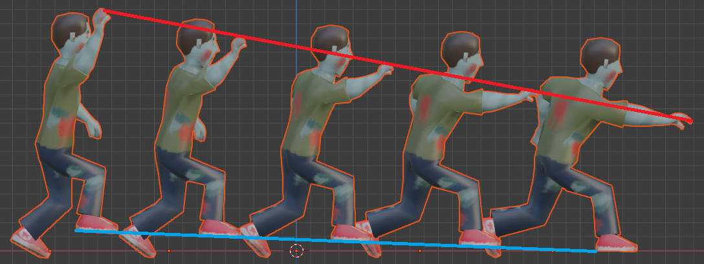

[OpenGL 3D 2020 第21回]

# PUI PUI モーフィング

## 習得目標

* 「モーフィング」の仕組み
* 3つ以上のモデルを使ったモーフィング
* データを設定(および解除)するタイミングの選び方

## 1. モーフィング

### 1.1 もっとなめらかにアニメーションさせるには

現在のアニメーションでは、パラパラアニメと同じように一定時間ごとにモデルを切り替えることで動きを表現しています。この方法は追加の計算なしで手軽にアニメーションを再生できるのが利点です。

反面、なめらかにアニメーションさせるにはモデル数を多くしなくてはならず、読み込み時間が長くなったり必要メモリ量が増えてしまう、といった問題があります。

そこで、複数のモデルを合成して中間のモデルを作り出すことにします。この技法のことを「モーフィング」と言います。モーフィングは「変形させる、変化する」という意味の`Morph`(モーフ)を現在進行系にした単語です。

<p align="center">
<br>
[左端と右端のモデルの中間をモーフィングで生成]
</p>

モーフィングを使えば、少ないモデル数でも十分になめらかなアニメーションを再生できます。今回は、最も基本となる「2つのモデルによるモーフィング」を作成します。

作成手順は次のとおりです。

1. 頂点シェーダにモーフィング機能を追加
2. VAOにモーフィング用の頂点アトリビュートを追加
3. モーフィング用の頂点データを指定する機能を作成
4. モーフィング用の2つめのモデルを管理する機能を追加
5. モーフィングの合成比率を指定する機能を作成

>**【もうひとつの解決方法】**<br>
>多くのアプリケーションでは、「スケルタル・アニメーション」という技法を使うことでこの問題を解決しています。しかし、スケルタルアニメーションを動かすためには複雑なプログラムが必要なので今回は作成しません。

### 1.2 フラグメント・ライティング・シェーダにモーフィング用の変数を追加する

最初に頂点シェーダにモーフィング機能を追加します。モーフィングの仕組みは「2つの頂点データを指定した比率で合成する」というものです。

モーフィングしない状態のモデルを「ベースメッシュ」、モーフィング後の状態のモデルを「モーフターゲット」と呼びます。モーフィングは次の式で表現されます。

>モーフィングされたモデル ＝ (1.0 － 合成比率) × ベースメッシュ ＋ 合成比率 × モーフターゲット

式から分かるように、合成比率が0.0のときはベースメッシュがそのまま表示され、1.0のときはモーフターゲットがそのまま表示されます。

頂点シェーダには既存の頂点データがあるため、これをベースメッシュとして使うことにします。モーフィングを行うためには、残りの「モーフターゲット」と「合成比率」を追加する必要があります。

まずはモーフターゲットを追加しましょう。これは頂点データなので入力変数に追加します。モーフターゲットの頂点データ名は、分かりやすいようにベースメッシュに`Morph`(モーフ)を付け足した名前にします。

`FragmentLighting.vert`を開き、次の入力変数を追加してください。

```diff
 // 入力変数
 layout(location=0) in vec3 vPosition;
 layout(location=1) in vec4 vColor;
 layout(location=2) in vec2 vTexcoord;
 layout(location=3) in vec3 vNormal;
+layout(location=4) in vec3 vMorphPosition;
+layout(location=5) in vec3 vMorphNormal;

 // 出力変数
 layout(location=0) out vec4 outColor;
 layout(location=1) out vec2 outTexcoord;
```

頂点データには座標、色、テクスチャ座標、法線という4つのデータがありますが、モーフターゲットには座標と法線だけを追加することにしました。

モーフィングで色やテクスチャ座標を変化させることは少ないため、追加するのは最もよく使われる座標と法線だけに絞りました。定義できる入力変数の数は限られているため、めったに使われないデータを追加する余裕はないからです。

>**【定義できる入力変数の最大数】**
>これはGPUやドライバなどの環境によって異なります。ただしOpenGLの仕様では「少なくとも16個は定義できること」と決められています。つまり、確実に安全だといえるのは16個までということです。

続いて合成比率を追加します。これはひとつのモデルの描画中は変化しないので、ユニフォーム変数にするのが適切でしょう。名前は`morphWeight`(モーフウェイト)とします。モデル行列のユニフォーム変数の下に、次のユニフォーム変数を追加してください。

```diff
 // ユニフォーム変数
 layout(location=0) uniform mat4 matMVP;
 layout(location=1) uniform mat4 matModel;
+layout(location=10) uniform float morphWeight;
 
 // 頂点シェーダプログラム
 void main()
```

ロケーション番号は頂点シェーダだけでなく、フラグメントシェーダのユニフォーム変数とも重複しないように注意する必要があります。`FragmentLighting.frag`では`6`番まで使っているので、少し余裕を見て`10`にしました。

### 1.3 フラグメント・ライティング・シェーダにモーフィング機能を追加する

新たに定義したデータを使って、モーフィングの計算を行いましょう。計算式は1.2節のものを使い、座標と法線の2つを計算します。さらに、法線については「正規化」も行います。

第8回のフラグメントライティングでも説明しましたが、正しい照明計算のためには法線の長さが`1`でなければなりません。ベクトルを合成すると長さが変化してしまうため、正規化して長さを`1`に戻す必要があるのです。

それでは、頂点シェーダプログラムを次のように変更してください。

```diff
 // 頂点シェーダプログラム
 void main()
 {
+  // モーフィング
+  vec3 position = (1 - morphWeight) * vPosition + morphWeight * vMorphPosition;
+  vec3 normal = (1 - morphWeight) * vNormal + morphWeight * vMorphNormal;
+  normal = normalize(normal);
+
   outColor = vColor;
   outTexcoord = vTexcoord;
-  outPosition = vec3(matModel * vec4(vPosition, 1));
+  outPosition = vec3(matModel * vec4(position, 1));
   mat3 matNormal = transpose(inverse(mat3(matModel)));
-  outNormal = matNormal * vNormal;
+  outNormal = matNormal * normal;

-  gl_Position = matMVP * vec4(vPosition, 1.0);
+  gl_Position = matMVP * vec4(position, 1.0);
 }
```

モーフィングの計算をしたあと、モーフィングした値を使うように既存のプログラムを書き換えています。

### 1.4 影シェーダにモーフィング機能を追加する

モーフィングが影響するシェーダはもうひとつあります。それは影シェーダです。影シェーダは照明計算を行わないため法線は不要で、座標と合成比率があれば十分です。`Shadow.vert`を開き、次のように変更してください。

```diff
 // 入力変数
 layout(location=0) in vec3 vPosition;
 layout(location=2) in vec2 vTexcoord;
+layout(location=4) in vec3 vMorphPosition;

 // 出力変数
 layout(location=1) out vec2 outTexcoord;
 out gl_PerVertex {
   vec4 gl_Position;
 };

 // ユニフォーム変数
 layout(location=0) uniform mat4 matMVP;
+layout(location=10) uniform float morphWeight;

 // 頂点シェーダプログラム.
 void main()
 {
+  // モーフィング
+  vec3 position = (1 - morphWeight) * vPosition + morphWeight * vMorphPosition;
+
   outTexcoord = vTexcoord;
-  gl_Position = matMVP * vec4(vPosition, 1.0);
+  gl_Position = matMVP * vec4(position, 1.0);
 }
```

これでシェーダにモーフィング機能を追加することができました。

### 1.5 VAOにモーフィング用の頂点アトリビュートを追加する

頂点データを入力変数に入力するためには、頂点アトリビュートを設定する必要があります。そこで`GLContext::CreateVertexArray`関数にプログラムを追加します。

現在のプログラムでは全ての頂点データを同じVBOに格納しているので、頂点アトリビュートを追加するために引数を追加する必要はありません。そのため、追加するのは既存の頂点アトリビュートのインデックスを変更しただけのものになります。

`GLContext.cpp`を開き、`CreateVertexArray`関数に次のプログラムを追加してください。

```diff
   glVertexArrayAttribFormat(id, normalIndex, 3, GL_FLOAT, GL_FALSE, 0);
   glVertexArrayAttribBinding(id,normalIndex, normalBindingIndex);
   glVertexArrayVertexBuffer(id, normalBindingIndex, vboNormal, 0, sizeof(glm::vec3));
+
+  // モーフィング用の座標データの頂点アトリビュートを設定.
+  const GLuint morphPositionIndex = 4;
+  const GLuint morphPositionBindingIndex = 4;
+  glEnableVertexArrayAttrib(id, morphPositionIndex);
+  glVertexArrayAttribFormat(id, morphPositionIndex, 3, GL_FLOAT, GL_FALSE, 0);
+  glVertexArrayAttribBinding(id,morphPositionIndex, morphPositionBindingIndex);
+  glVertexArrayVertexBuffer(id, morphPositionBindingIndex, vboPosition, 0,
+    sizeof(Position));
+
+  // モーフィング用の法線データの頂点アトリビュートを設定.
+  const GLuint morphNormalIndex = 5;
+  const GLuint morphNormalBindingIndex = 5;
+  glEnableVertexArrayAttrib(id, morphNormalIndex);
+  glVertexArrayAttribFormat(id, morphNormalIndex, 3, GL_FLOAT, GL_FALSE, 0);
+  glVertexArrayAttribBinding(id,morphNormalIndex, morphNormalBindingIndex);
+  glVertexArrayVertexBuffer(id, morphNormalBindingIndex, vboNormal, 0,
+    sizeof(glm::vec3));
 
   glVertexArrayElementBuffer(id, ibo);

   return id;
```

使用している関数については、第02回のVOA作成についてのテキストを参照してください。

### 1.6 モーフィング用の頂点データを指定する機能を追加する

現在、描画するモデルの頂点データがある位置は`glDrawElementBaseVertex`関数の`baseVertex`引数によって指定しています。しかし、この方法ではひとつのモデルしか指定できません。

しかし、モーフィングを行うためには少なくとも2つのモデルを指定できなくてはなりません。そこで、頂点アトリビュートの「最初の要素の位置」を指定する機能を使うことにします。

<p><code class="tnmai_code"><strong>【書式】</strong><br>
glVertexArrayVertexBuffer(VAOのID, バインディング・ポイントの番号,<br>
&emsp;バッファ・オブジェクトのID, 最初の要素の位置, 要素間の距離);
</code></p>

「最初の要素の位置」は、VP(バーテックス・プラー)に送る要素の位置を、バッファ・オブジェクト先頭からのバイト数で指定するためのものです。多少設定が<ruby>煩雑<rt>はんざつ</rt></ruby>になりますが、この方法なら頂点データの位置を頂点アトリビュートごとに指定することができます。

注意点として、`glVertexArrayVertexBuffer`関数に指定するバインディング・ポイントは、VAOを作成するときに指定したものと同じ値でなくてはなりません。

そこで、バインディング・ポイントの定数をグローバル変数にして、`CreateVertexArray`関数と、これから作成する頂点データ位置指定関数の両方で使えるようにしましょう。

`CreateVertexArray`関数にある`positionIndex`変数と`positionBindingIndex`変数を`Ctrl+X`などで切り取ってください。

```diff
   GLuint id = 0;
   glCreateVertexArrays(1, &id);

-  const GLuint positionIndex = 0;
-  const GLuint positionBindingIndex = 0;
   glEnableVertexArrayAttrib(id, positionIndex);
   glVertexArrayAttribFormat(id, positionIndex, 3, GL_FLOAT, GL_FALSE, 0);
```

そして、`GLContext`名前空間の先頭に貼り付けてください。

```diff
 * OpenGLコンテキストに関する機能を格納する名前空間.
 */
 namespace GLContext {
+
+const GLuint positionIndex = 0;
+const GLuint positionBindingIndex = 0;

 /**
 * バッファ・オブジェクトを作成する.
```

<pre class="tnmai_assignment">
<strong>【課題01】</strong>
<code>CreateVertexArray</code>関数にある残りの色、テクスチャ座標、法線、モーフィング用座標、モーフィング用法線の2つのインデックス変数を、頂点と同様に<code>GLContext</code>名前空間の先頭に移動しなさい。
</pre>

個別に指定できるように、ベースメッシュの位置を指定する関数とモーフターゲットの位置を指定する関数を分けて作成しましょう。

関数名は`SetMorphBaseMesh`(セット・モーフ・ベースメッシュ)と `SetMorphTargetMesh` (セット・モーフ・ターゲットメッシュ)とします。

`SetBaseMesh`、`SetMorphTarget`という名前も考えたのですが、以下の理由から<ruby>前述<rt>ぜんじゅつ</rt></ruby>の名前を採用しました。

>* モーフィング用の関数であることを明示したい
>* 関連する関数だということが分かるように名前を似せたい
>* `Target`というのは結局のところメッシュを指しているので`TargetMesh`でも不自然ではない

また、`glVertexArrayVertexBuffer`は引数にVAOとVBOの両方を指定しなくてはなりません。そのため、作成する関数も、必要なVAOとVBOを引数として受け取るようにします。特に返したい値もないので、戻り値の型は`void`にします。

`GLContext.h`を開き、`CreateVertexArray`関数の宣言の下に、次の関数宣言を追加してください。

```diff
 GLuint CreateBuffer(GLsizeiptr size, const GLvoid* data, GLbitfield flags = 0);
 GLuint CreateVertexArray(GLuint vboPosition, GLuint vboColor,
   GLuint vboTexcoord, GLuint vboNormal, GLuint ibo);
+
+void SetMorphBaseMesh(GLuint vao, GLuint vboPosition, GLuint vboColor,
+  GLuint vboTexcoord, GLuint vboNormal, GLuint baseVertex);
+
+void SetMorphTargetMesh(GLuint vao, GLuint vboPosition,
+  GLuint vboNormal, GLuint baseVertex);
+
 GLuint CreateProgram(GLenum type, const GLchar* code);
 GLuint CreateProgramFromFile(GLenum type, const char* filename);
```

それでは`SetMorphBaseMesh`関数を作成しましょう。`GLContext.cpp`を開き、 `CreateVertexArray`関数の定義の下に次のプログラムを追加してください。

```diff
   glVertexArrayElementBuffer(id, ibo);

   return id;
 }
+
+/**
+* ベースメッシュを設定する.
+*
+* @param vboPosition VAOに関連付けられる座標データ.
+* @param vboColor    VAOに関連付けられるカラーデータ.
+* @param vboTexcoord VAOに関連付けられるテクスチャ座標データ.
+* @param vboNormal   VAOに関連付けられる法線データ.
+* @param baseVertex  頂点データの位置.
+*/
+void SetMorphBaseMesh(GLuint vao, GLuint vboPosition, GLuint vboColor,
+  GLuint vboTexcoord, GLuint vboNormal, GLuint baseVertex)
+{
+  glVertexArrayVertexBuffer(vao, positionBindingIndex, vboPosition,
+    baseVertex * sizeof(Position), sizeof(Position));
+  glVertexArrayVertexBuffer(vao, colorBindingIndex, vboColor,
+    baseVertex * sizeof(Color), sizeof(Color));
+  glVertexArrayVertexBuffer(vao, texcoordBindingIndex, vboTexcoord,
+    baseVertex * sizeof(glm::vec2), sizeof(glm::vec2));
+  glVertexArrayVertexBuffer(vao, normalBindingIndex, vboNormal,
+    baseVertex * sizeof(glm::vec3), sizeof(glm::vec3));
+}

 /**
 * シェーダー・プログラムをビルドする.
```

`glDrawElementBaseVertex`関数では`baseVertex`をそのまま使っていましたが、 `glVertexArrayVertexBuffer`関数の場合はバイト数で指定するため、データのサイズを乗算している点が違っています。

続いて`SetMorphTargetMesh`関数を定義しましょう。`SetMorphBaseMesh`関数の定義の下に、次のプログラムを追加してください。

```diff
   glVertexArrayVertexBuffer(vao, normalBindingIndex, vboNormal,
     baseVertex * sizeof(glm::vec3), sizeof(glm::vec3));
 }
+
+/**
+* モーフターゲットを設定する.
+*
+* @param vboPosition VAOに関連付けられる座標データ.
+* @param vboNormal   VAOに関連付けられる法線データ.
+* @param baseVertex  頂点データの位置.
+*/
+void SetMorphTargetMesh(GLuint vao, GLuint vboPosition,
+  GLuint vboNormal, GLuint baseVertex)
+{
+  glVertexArrayVertexBuffer(vao, morphPositionBindingIndex, vboPosition,
+    baseVertex * sizeof(Position), sizeof(Position));
+  glVertexArrayVertexBuffer(vao, morphNormalBindingIndex, vboNormal,
+    baseVertex * sizeof(glm::vec3), sizeof(glm::vec3));
+}

 /**
 * シェーダー・プログラムをビルドする.
```

モーフターゲットで設定するのは座標と法線の2つだけです。

### 1.7 PrimitiveBufferクラスに頂点データの位置を指定する機能を追加する

前節で作成した頂点データの位置を指定する2つの関数は、どちらもVAOとVBOを必要とします。VAOやVBOは`PrimitiveBuffer`クラスが管理しています。

ということは、`PrimitiveBuffer`クラスにVAOとVBOを公開させるか、`PrimitiveBuffer`クラスに`SetMorphBaseMesh`と`SetMorphTargetMesh`を呼び出すメンバ関数を追加するか、いずれかの方法を取る必要があります。

メンバ変数を公開するのはオブジェクト指向の「カプセル化」の原則に反します。ですから、メンバ関数を追加するほうが適切でしょう。関数名は先ほど作成したのとまったく同じ`SetMorphBaseMesh`と`SetMorphTargetMesh`がいいでしょう。

これらのメンバ関数の引数は`baseVertex`だけになります。VAOとVBOは`PrimitiveBuffer`クラスが管理しているので、外部から受け取る必要はないからです。`Mesh.h`を開き、 `PrimitiveBuffer`クラスの定義に次のプログラムを追加してください。

```diff
   // VAOバインド管理.
   void BindVertexArray() const;
   void UnbindVertexArray() const;
+
+  void SetMorphBaseMesh(GLuint baseVertex) const;
+  void SetMorphTargetMesh(GLuint baseVertex) const;

 private:
   std::vector<Primitive> primitives;
```

続いて、追加したメンバ関数の定義を書きます。`Mesh.cpp`を開き、`UnbindVertexArray`メンバ関数の定義の下に、次のプログラムを追加してください。

```diff
 void PrimitiveBuffer::UnbindVertexArray() const
 {
   glBindVertexArray(0);
 }
+
+/**
+* ベースメッシュを設定する.
+*
+* @param baseVertex 頂点データの位置.
+*/
+void PrimitiveBuffer::SetMorphBaseMesh(GLuint baseVertex) const
+{
+  GLContext::SetMorphBaseMesh(vao, vboPosition, vboColor, vboTexcoord, vboNormal,
+    baseVertex);
+}
+
+/**
+* モーフターゲットを設定する.
+*
+* @param baseVertex 頂点データの位置.
+*/
+void PrimitiveBuffer::SetMorphTargetMesh(GLuint baseVertex) const
+{
+  GLContext::SetMorphTargetMesh(vao, vboPosition, vboNormal, baseVertex);
+}

 } // namespace Mesh
```

### 1.8 Primitiveクラスにモーフターゲットを指定する機能を追加する

モデルの描画は最終的には`Primitive`クラスの`Draw`メンバ関数で行います。 `Primitive` クラスはひとつのモデルを管理するためのクラスですが、モーフィングのためには「ベースメッシュ」と「モーフターゲット」の2つ指定できなくてはなりません。

そこで、`Draw`メンバ関数の引数としてモーフターゲットを指定できるようにします。

また、ベースメッシュにしてもモーフターゲットにしても、頂点データの位置を指定するためには`PrimitiveBuffer`クラスを使わなくてはなりません。ですから、`Primitive`クラスに `PrimitiveBuffer`へのポインタを持たせることにします。

ということで、`Primitive`クラスに`PrimitiveBuffer`へのポインタを追加したいのですが、クラスの定義順が`Primitive`→`PrimitiveBuffer`なので、`Primitive`クラスを定義する時点では`PrimitiveBuffer`クラスは見えていません。

こういうときは「先行宣言」の出番です。`Mesh.h`を開き、`Mesh`名前空間の先頭に次のプログラムを追加してください。

```diff
 #include <vector>

 namespace Mesh {
+
+// 先行宣言.
+class PrimitiveBuffer;

 /**
 * プリミティブデータ.
```

これで`Primitive`クラスを定義する前に、`PrimitiveBuffer`というクラスが存在することがコンパイラに伝わります。それではポインタを追加しましょう。`Primitive`クラスに次のプログラムを追加してください。

```diff
 class Primitive
 {
 public:
   Primitive() = default;
-  Primitive(GLenum m, GLsizei c, GLsizeiptr o, GLint b) :
-    mode(m), count(c), indices(reinterpret_cast<GLvoid*>(o)), baseVertex(b)
+  Primitive(GLenum m, GLsizei c, GLsizeiptr o, GLint b,
+    const PrimitiveBuffer* pb) :
+    mode(m), count(c), indices(reinterpret_cast<GLvoid*>(o)), baseVertex(b),
+    primitiveBuffer(pb)
   {}
   ~Primitive() = default;

   void Draw() const;

 private:
   GLenum mode = GL_TRIANGLES; // プリミティブの種類.
   GLsizei count = 0;          // 描画するインデックス数.
   const GLvoid* indices = 0;  // 描画開始インデックスのバイトオフセット.
   GLint baseVertex = 0;       // インデックス0番とみなされる頂点配列内の位置.
+
+  // このプリミティブを所有するオブジェクトのポインタ.
+  const PrimitiveBuffer* primitiveBuffer = nullptr;
 };
```

なお、メンバ変数のコメントを上の行に置いたのは、紙面だと一行に収まらないからです。書き写すときは他のメンバ変数のように、コメントを右に書いて1行にまとめるとよいでしょう。

`PrimitiveBuffer`へのポインタは、コンストラクタで指定することにしました。引数が増えたので、`Primitive`クラスのオブジェクトを作成するプログラムも、変更しなくてはなりません。

`Mesh.cpp`を開き、`PrimitiveBuffer::Add`メンバ関数を次のように変更してください。

```diff
   if (!CopyData(ibo, sizeof(GLushort), curIndexCount, indexCount, pIndex)) {
     return false;
   }

   primitives.push_back(Primitive(GL_TRIANGLES, static_cast<GLsizei>(indexCount),
-    sizeof(GLushort) * curIndexCount, curVertexCount));
+    sizeof(GLushort) * curIndexCount, curVertexCount, this));

   curVertexCount += static_cast<GLsizei>(vertexCount);
   curIndexCount += static_cast<GLsizei>(indexCount);
```

これで、`PrimitiveBuffer`へのポインタが`Primitive`クラスに設定されるようになりました。

それでは、`Primitive::Draw`メンバ関数の引数にモーフターゲットを追加しましょう。 `Mesh.h` を開き、`Primitive`クラスの`Draw`メンバ関数の宣言を次のように変更してください。

```diff
     primitiveBuffer(pb)
   {}
   ~Primitive() = default;

-  void Draw() const;
+  void Draw(const Primitive* morphTarget = nullptr) const;

 private:
   GLenum mode = GL_TRIANGLES; // プリミティブの種類.
```

デフォルト引数として`nullptr`を設定している理由は、モーフィングを必要としない描画の場合に、わざわざモーフターゲット引数を指定しなくてもいいようにしたかったからです。

ここまでに追加した`PrimitiveBuffer`へのポインタとモーフターゲット引数を使って、頂点データの位置を指定しましょう。`Mesh.cpp`を開き、`Primitive::Draw`メンバ関数の定義を次のように変更してください。

```diff
 /**
 * プリミティブを描画する.
+*
+* @param morphTarget モーフィング終了時のプリミティブ.
+*                    モーフィングしない場合はnullptrを指定する.
 */
-void Primitive::Draw() const
+void Primitive::Draw(const Primitive* morphTarget) const
 {
+  // ベースメッシュの頂点データの位置を設定.
+  primitiveBuffer->SetMorphBaseMesh(baseVertex);
+
+  // モーフターゲットの頂点データの位置を設定.
+  if (morphTarget) {
+    primitiveBuffer->SetMorphTargetMesh(morphTarget->baseVertex);
+  } else {
+    primitiveBuffer->SetMorphTargetMesh(baseVertex);
+  }
-  glDrawElementsBaseVertex(mode, count, GL_UNSIGNED_SHORT, indices, baseVertex);
+  glDrawElementsBaseVertex(mode, count, GL_UNSIGNED_SHORT, indices, 0);
 }
 
 /**
 * デストラクタ.
```

これで`Draw`メンバ関数の引数にモーフターゲットとなる`Primitive`を指定すれば、モーフィング用の頂点データの位置が設定されるようにできました。

### 1.9 合成比率を指定する機能を作成する

モーフターゲットを指定できるようになったので、次は合成比率を指定できるようにしましょう。合成比率はシェーダのユニフォーム変数なので、シェーダを管理する`Pipeline`(パイプライン)クラスにメンバ関数を追加するのがよさそうです。

関数名は`SetMorphWeight`(セット・モーフ・ウェイト)とします。合成比率は`float`型の引数で受け取ります。この関数は、他のユニフォーム変数に値を設定するメンバ関数と同じく、成功か失敗かを返すことにします。

`Shader.h`を開き、`Pipeline`クラスの定義に次のプログラムを追加してください。

```diff
   bool SetLight(const DirectionalLight& light) const;
   bool SetLight(const PointLight& light) const;
   bool SetAmbientLight(const glm::vec3& color) const;
+  bool SetMorphWeight(float weight) const;
 
 private:
   GLuint id = 0;
   GLuint vp = 0;
```

他の関数を参考にしながら定義を書いていきます。合成比率は`float`型なので、GPUメモリにデータを転送する関数は`glProgramUniform1f`(ジーエル・プログラム・ユニフォーム・ワン・エフ)を使います。

関数名の最後の`1`は「要素数が1のデータ」であることを、`f`は「float型のデータ」であることを表しています。`glProgramUniform`で検索して見つかるサイトを見れば、類似した関数のバリエーションが分かるでしょう。

`Shader.cpp`を開き、`Pipeline::SetAmbientLight`メンバ関数の定義の下に、次のプログラムを追加してください。

```diff
     std::cerr << "[エラー]" << __func__ << ":環境光の設定に失敗.\n";
     return false;
   }
   return true;
 }
+
+/**
+* モーフィングの合成比率を設定する.
+*
+* @param weight モーフィングの合成比率(0.0～1.0の範囲で指定すること).
+*/
+bool Pipeline::SetMorphWeight(float weight) const
+{
+  glGetError(); // エラー状態をリセット.
+
+  const GLint locMorphWeight = 10; // シェーダのロケーション番号と揃えること.
+
+  glProgramUniform1f(vp, locMorphWeight, weight);
+  if (glGetError() != GL_NO_ERROR) {
+    std::cerr << "[エラー]" << __func__ << ":モーフィング合成比率の設定に失敗.\n";
+    return false;
+  }
+  return true;
+}

 /**
 * プログラムパイプラインのバインドを解除する.
```

### 1.10 Actorクラスにモーフターゲット管理機能を追加する

今回モーフィングを行う目的は、アニメーションをなめらかにするためでした。アニメーションは`Actor`クラスが管理しているので、`Actor`クラスのアニメーションプログラムにモーフィング機能を付け足して、アニメーションをキレイにしていきましょう。

モーフィングには2つのモデルが必要ですが、`Actor`クラスはすでに`Primitive`へのポインタをメンバ変数として持っています。このメンバ変数を「ベースメッシュ」としましょう。

となると、あとは「モーフターゲット」に当たるメンバ変数を追加する必要がありそうです。追加するメンバ変数はベースメッシュと同じく`Primitive`へのポインタで、名前は `morphTarget`(モーフターゲット)とします。

`Actor.h`を開き、`Actor`クラスの定義に次のプログラムを追加してください。

```diff
   float health = 0; // 耐久力.
   float lifespan = 0; // 寿命(秒). 0以下は無限扱い.

   const Mesh::Primitive* primitive = nullptr;
+  const Mesh::Primitive* morphTarget = nullptr;
   std::shared_ptr<Texture::Image2D> texture;

   glm::vec3 position = glm::vec3(0); // アクターの表示位置.
   glm::vec3 rotation = glm::vec3(0); // アクターの向き.
```

`primitive`メンバ変数はアニメーションに伴って更新されますので、同様に `morphTarget` メンバ変数も更新しましょう。基本的には「`primitive`に設定したプリミティブの次のプリミティブ」を指定すればOKです。

モーフィングによって2つのプリミティブの中間の状態が作り出され、結果的になめらかなアニメーションが行われます。`Actor.cpp`を開き、`Actor::Update`メンバ関数に次のプログラムを追加してください。

```diff
       }
     }
     primitive = animation->list[animationNo];
+
+    // モーフターゲットを更新.
+    size_t nextAnimationNo = animationNo + 1;
+    morphTarget = animation->list[nextAnimationNo];
   }
 }

 /**
 * アクターを描画する.
```

しかし、このプログラムではアニメーションが終端に到達したときに「次のプリミティブ」が存在しないという問題が起こります。そして、この問題を防ぐ方法はループ再生の有無によって異なります。

ループ再生が有効な場合、アニメーションは最初から再生しなおされるので、次のプリミティブというのは「先頭のプリミティブ」になります。こうした処理では「剰余」を使うと簡単にループさせることができます。

モーフターゲットを更新するプログラムに、次のプログラムを追加してください。

```diff
     // モーフターゲットを更新.
     size_t nextAnimationNo = animationNo + 1;
+    if (animation->isLoop) {
+      nextAnimationNo %= animation->list.size();
+    }
     morphTarget = animation->list[nextAnimationNo];
   }
 }
```

次にループ再生が無効な場合、最後までアニメーションしたら、それ以上はアニメーションは変化しません。これは「次のプリミティブとして指定可能なプリミティブを、最後のプリミティブまでに制限する」という方法で実現できます。

変数が取りうふ範囲をある数値以下に制限するには`std::min`関数を使うのが簡単です。モーフターゲットを更新するプログラムに、次のプログラムを追加してください。

```diff
     // モーフターゲットを更新.
     size_t nextAnimationNo = animationNo + 1;
     if (animation->isLoop) {
       nextAnimationNo %= animation->list.size();
+    } else {
+      nextAnimationNo = std::min(nextAnimationNo, animation->list.size() - 1);
     }
     morphTarget = animation->list[nextAnimationNo];
   }
 }
```

これでループ再生の有無に関わらず、適切なモーフターゲットが選択されるようになりました。

### 1.11 合成比率を設定して描画する

仕上げに`Draw`メンバ関数でモーフターゲットを指定した描画を行います。このとき、合成比率の計算も行います。

合成比率はアニメーションタイマーの値から計算します。タイマーがインターバルの値を超えるとタイマーの値が`0`に戻り、アニメーションが進行します。

このことから、タイマーが`0`のときは合成比率を`0.0`とし、タイマーがインターバルと等しいときは合成比率が`1.0`とするのが良さそうです。これは「タイマー÷インターバル」という式で計算できます。

それから、デルタタイムが非常に大きい場合はタイマーがインターバルを大きく超える値になることがあります。また、浮動小数点数の計算誤差によって、計算結果が`0.0～1.0`の範囲をわずかに超えてしまう可能性もないとはいえません。

そこで`glm::clamp`(ジーエルエム・クランプ)関数を使って取りうる範囲を`0.0～1.0`に制限することにします。それから、アニメーションが設定されていない場合の合成比率は`0`とします。

`Actor::Draw`メンバ関数に、次のプログラムを追加してください。

```diff
     pipeline.SetModelMatrix(matModel);
   }
   pipeline.SetMVP(matVP * matModel);
+
+  // ベースメッシュとモーフターゲットの合成比率を設定.
+  if (animation) {
+    pipeline.SetMorphWeight(
+      glm::clamp(animationTimer / animation->interval, 0.0f, 1.0f));
+  } else {
+    pipeline.SetMorphWeight(0);
+  }

   // テクスチャイメージスロット0番にテクスチャを割り当てる.
   texture->Bind(0);
```

最後に、`Primitive::Draw`メンバ関数の引数に`morphTarget`メンバ変数を設定します。 `Actor::Draw`メンバ関数を次のように変更してください。

```diff
   // テクスチャイメージスロット0番にテクスチャを割り当てる.
   texture->Bind(0);
 
   // プリミティブを描画.
-  primitive->Draw();
+  primitive->Draw(morphTarget);
 }

 /**
 * 垂直円柱の衝突判定を設定する.
```

### 1.12 影の描画時に合成比率を設定する

ここまでのプログラムでモーフィングは機能するようになっているのですが、1箇所だけ追加しなくてはならない部分があります。それは影の描画処理です。

影シェーダにもモーフィング機能を入れたため、最後に画面全体に影色を塗るときにもモーフィングが機能してしまっています。しかし、現在は合成比率を指定せずに影色を塗っています。

合成比率を更新していないので、「最後にモーフィングを行ったアクターの合成比率」がそのまま利用されることになります。

もっとも、アニメーションしない描画では、どんな合成比率を指定しても結果は変わらないため、表示上問題は起こらないと思います。しかし万が一を考えると、明示的に合成比率を指定しておくべきでしょう。

`MainGameScene.cpp`を開き、画面全体に影色を塗るプログラムに次のプログラムを追加してください。

```diff
     // 画面全体に影色を塗る.
     pipelineShadow->SetMVP(glm::scale(glm::mat4(1), glm::vec3(2)));
+    pilelineShadow->SetMorphWeight(0);
     primitiveBuffer.Get(GameData::PrimNo::plane).Draw();

     // 深度バッファを有効化.
     glEnable(GL_DEPTH_TEST);
```

プログラムが書けたらビルドして実行してください。アニメーションがなめらかになっていたら成功です。

>**【きれいにアニメーションしないことがある】**
>アニメーションが正しく表示されない場合、モデルデータをダウンロードし直してみてください。モーフィングを行うには、2つのモデルで頂点インデックスの順番が同じでなければなりません。古いモデルデータでは、頂点インデックスの順番がずれている可能性があります。

<br>

>**【まとめ】**<br>
>
>* 2つ以上のモデルを、合成比率を変化させながら合成して表示することを「モーフィング」という。
>* 「モーフィング」を使うと、比較的簡単になめらかなアニメーションを表示できる。
>* モーフィングを行うには「ベースメッシュ」と「モーフターゲット」の2つのモデルが必要。
>* 同時に実行されるシェーダ間で、ロケーション番号が重複しないように気をつけなければならない。
>* 関数に必要なオブジェクトがあるクラスのプライベートメンバになっている場合、メンバを公開するよりもクラスにメンバ関数を追加することで必要なオブジェクトを使うことができる。

<div style="page-break-after: always"></div>

## 2. アニメーションをなめらかに切り替える

### 2.1 切り替える瞬間をなくすには

歩行アニメーションから静止アニメーションに切り替わると、手足が一瞬にして静止アニメーションの初めの位置に移動します。再生するアニメーションを切り替えているのだから当然なのですが、やっぱり不自然ですよね。

そこで、アニメーションの切り替えも、モーフィングによってなめらかに行われるようにしようと思います。基本的にはモーフィングで合成するモデルの数を増やすだけです。

具体的には直前のアニメーションと現在のアニメーションを専用の合成比率で合成します。例として、歩行アニメーションから静止アニメーションに切り替えることを考えてみましょう。

歩行アニメーションから静止アニメーションに切り替わる直前に表示されているのは、歩行アニメーションのベースメッシュとモーフターゲットを、合成比率で合成したものです。

静止アニメーションに切り替えるとき、切り替わる前の「ベースメッシュ」、「モーフターゲット」、「合成比率」の3つを覚えておきます。この3つがあれば「直前のアニメーションの状態」を計算することができます。

そして、静止アニメーションに切り替わってから一定時間は、「直前のアニメーションの状態」と「現在のアニメーションの状態」」を合成して表示します。

このとき、時間経過によって合成比率を徐々に変化させると、なめらかにアニメーションを切り替えることができます。

### 2.2 フラグメント・ライティング・シェーダに直前のアニメーション用の変数を追加する

2つのアニメーション間のモーフィングは、モーフィング用の変数とそれを制御するプログラムを追加する、という点ではアニメーションのモーフィングと同じです。

頂点シェーダに直前のアニメーションのベースメッシュ、モーフターゲット、合成比率の3つを追加することから始めましょう。変数名には「前の」という意味の`previous`(プレビアス)を短縮した`Prev`(プレブ)を付けることにしました。

`FragmentLighting.vert`を開き、次の入力変数を追加してください。

```diff
 layout(location=3) in vec3 vNormal;
 layout(location=4) in vec3 vMorphPosition;
 layout(location=5) in vec3 vMorphNormal;
+layout(location=6) in vec3 vPrevBaseMeshPosition;
+layout(location=7) in vec3 vPrevBaseMeshNormal;
+layout(location=8) in vec3 vPrevMorphTargetPosition;
+layout(location=9) in vec3 vPrevMorphTargetNormal;

 // 出力変数
 layout(location=0) out vec4 outColor;
 layout(location=1) out vec2 outTexcoord;
```

今回も座標と法線だけを追加しています。1.2節で説明したように、定義できる入力変数の数は限られているためです。

続いて、以前のアニメーション用の合成比率と、アニメーションの合成比率の2つを追加します。これは`morphWeight`の型を`vec3`とすることで実現できます。`morphWeight`変数の型を次のように変更してください。

```diff
 // ユニフォーム変数
 layout(location=0) uniform mat4 matMVP;
 layout(location=1) uniform mat4 matModel;
+
+// x = 現在のアニメーション合成比率
+// y = 直前のアニメーション合成比率
+// z = アニメーション間の合成比率
-layout(location=10) uniform float morphWeight;
+layout(location=10) uniform vec3 morphWeight;
 
 // 頂点シェーダプログラム
 void main()
```

### 2.3 フラグメント・ライティング・シェーダにアニメーション間のモーフィング機能を追加する

新たに定義したデータを使って、モーフィングの計算を変更しましょう。なお合成には`mix`(ミックス)関数を使うことにします。

<pre class="tnmai_code"><strong>【書式】</strong>
vec3 mix(合成する値A, 合成する値B, 合成比率);
</pre>

`mix`関数は以下の計算結果を返します。これは1.2節で説明した式とまったく同じ計算を行います。

>合成結果 ＝ (1.0 － 合成比率) × 合成する値A＋ 合成比率 × 合成する値B

アニメーション間のモーフィングを行うプログラムは、次の手順でモーフィングを行います。

1. 現在のアニメーションのモーフィングの結果を計算
2. 直前のアニメーションのモーフィングの結果を計算
3. 2つのアニメーションの計算結果をモーフィング

それでは、頂点シェーダプログラムを次のように変更してください。

```diff
 // 頂点シェーダプログラム
 void main()
 {
   // モーフィング
-  vec3 position = (1 - morphWeight) * vPosition + morphWeight * vMorphPosition;
+  vec3 curPosition = mix(vPosition, vMorphPosition, morphWeight.x);
+  vec3 prevPosition = mix(vPrevBaseMeshPosition, vPrevMorphTargetPosition,
+    morphWeight.y);
+  vec3 position = mix(curPosition, prevPosition, morphWeight.z);
+
-  vec3 normal = (1 - morphWeight) * vNormal + morphWeight * vMorphNormal;
+  vec3 curNormal = mix(vNormal, vMorphNormal, morphWeight.x);
+  vec3 prevNormal = mix(vPrevBaseMeshNormal, vPrevMorphTargetNormal,
+    morphWeight.y);
+  vec3 normal = mix(curNormal, prevNormal, morphWeight.z);
   normal = normalize(normal);

   outColor = vColor;
   outTexcoord = vTexcoord;
```

### 2.4 影シェーダにアニメーション間のモーフィング機能を追加する

フラグメント・ライティング・シェーダに続いて、影シェーダを変更します。 `Shadow.vert`を開き、プログラムを次のように変更してください。

```diff
 layout(location=0) in vec3 vPosition;
 layout(location=2) in vec2 vTexcoord;
 layout(location=4) in vec3 vMorphPosition;
+layout(location=6) in vec3 vPrevBaseMeshPosition;
+layout(location=8) in vec3 vPrevMorphTargetPosition;

 // 出力変数
 layout(location=1) out vec2 outTexcoord;
 out gl_PerVertex {
   vec4 gl_Position;
 };

 // ユニフォーム変数
 layout(location=0) uniform mat4 matMVP;
+
+// x = 現在のアニメーション合成比率
+// y = 直前のアニメーション合成比率
+// z = アニメーション間の合成比率
-layout(location=10) uniform float morphWeight;
+layout(location=10) uniform vec3 morphWeight;

 // 頂点シェーダプログラム.
 void main()
 {
   // モーフィング
-  vec3 position = (1 - morphWeight) * vPosition + morphWeight * vMorphPosition;
+  vec3 curPosition = mix(vPosition, vMorphPosition, morphWeight.x);
+  vec3 prevPosition = mix(vPrevBaseMeshPosition, vPrevMorphTargetPosition,
+    morphWeight.y);
+  vec3 position = mix(curPosition, prevPosition, morphWeight.z);

   outTexcoord = vTexcoord;
   gl_Position = matMVP * vec4(position, 1.0);
 }
```

### 2.5 VAOにモーフィング用の頂点アトリビュートを追加する

次に、頂点アトリビュートを追加しましょう。まずはインデックス定数を追加します。 `GLContext.cpp`を開き、`morphNormalBindingIndex`定数の定義の下に次のプログラムを追加してください。

```diff
 const GLuint morphPositionBindingIndex = 4;
 const GLuint morphNormalIndex = 5;
 const GLuint morphNormalBindingIndex = 5;
+
+const GLuint prevBasePositionIndex = 6;
+const GLuint prevBasePositionBindingIndex = 6;
+const GLuint prevBaseNormalIndex = 7;
+const GLuint prevBaseNormalBindingIndex = 7;
+
+const GLuint prevMorphPositionIndex = 8;
+const GLuint prevMorphPositionBindingIndex = 8;
+const GLuint prevMorphNormalIndex = 9;
+const GLuint prevMorphNormalBindingIndex = 9;

 /**
 * バッファ・オブジェクトを作成する.
```

続いて、直前のアニメーションのベースメッシュとモーフターゲットの頂点アトリビュートを設定します。`CreateVertexArray`関数に次のプログラムを追加してください。

```diff
   glVertexArrayAttribBinding(id,morphNormalIndex, morphNormalBindingIndex);
   glVertexArrayVertexBuffer(id, morphNormalBindingIndex, vboNormal, 0,
     sizeof(glm::vec3));
+ 
+  // 直前のアニメーション用ベースメッシュの頂点アトリビュートを設定.
+  glEnableVertexArrayAttrib(id, prevBasePositionIndex);
+  glVertexArrayAttribFormat(id, prevBasePositionIndex, 3, GL_FLOAT, GL_FALSE, 0);
+  glVertexArrayAttribBinding(id,prevBasePositionIndex, prevBasePositionBindingIndex);
+  glVertexArrayVertexBuffer(id, prevBasePositionBindingIndex, vboPosition, 0,
+    sizeof(Position));
+  glEnableVertexArrayAttrib(id, prevBaseNormalIndex);
+  glVertexArrayAttribFormat(id, prevBaseNormalIndex, 3, GL_FLOAT, GL_FALSE, 0);
+  glVertexArrayAttribBinding(id,prevBaseNormalIndex, prevBaseNormalBindingIndex);
+  glVertexArrayVertexBuffer(id, prevBaseNormalBindingIndex, vboNormal, 0,
+    sizeof(glm::vec3));
+
+  // 直前のアニメーション用モーフターゲットの頂点アトリビュートを設定.
+  glEnableVertexArrayAttrib(id, prevMorphPositionIndex);
+  glVertexArrayAttribFormat(id, prevMorphPositionIndex, 3, GL_FLOAT, GL_FALSE, 0);
+  glVertexArrayAttribBinding(id,prevMorphPositionIndex, prevMorphPositionBindingIndex);
+  glVertexArrayVertexBuffer(id, prevMorphPositionBindingIndex, vboPosition, 0,
+    sizeof(Position));
+  glEnableVertexArrayAttrib(id, prevMorphNormalIndex);
+  glVertexArrayAttribFormat(id, prevMorphNormalIndex, 3, GL_FLOAT, GL_FALSE, 0);
+  glVertexArrayAttribBinding(id,prevMorphNormalIndex, prevMorphNormalBindingIndex);
+  glVertexArrayVertexBuffer(id, prevMorphNormalBindingIndex, vboNormal, 0,
+    sizeof(glm::vec3));

   glVertexArrayElementBuffer(id, ibo);

   return id;
```

>**【似たような処理が続いて、どこを書いているのか混乱する場合】**<br>
>`CreateVertexArray`関数では似たような処理がいくつも続くので、処理を関数化すると見やすくなると思います。余裕があればチャレンジしてみると良いでしょう。

### 2.6 直前のアニメーション用の頂点データを指定する機能を追加する

直前のアニメーションの頂点アトリビュートにも「最初の要素の位置」を指定する関数を追加します。関数名は`SetPreviousMorphMesh`(セット・プレビアス・モーフ・メッシュ)とします。

`GLContext.h`を開き、`SetMorphTargetMesh`関数の宣言の下に、次の関数宣言を追加してください。<br><br>

```diff
 void SetMorphTargetMesh(GLuint vao, GLuint vboPosition,
   GLuint vboNormal, GLuint baseVertex);
+
+void SetPreviousMorphMesh(GLuint vao, GLuint vboPosition, GLuint vboNormal,
+  GLuint baseMeshBaseVertex, GLuint morphTargetBaseVertex);

 GLuint CreateProgram(GLenum type, const GLchar* code);
 GLuint CreateProgramFromFile(GLenum type, const char* filename);
```

それでは`SetPreviousMorphMesh`関数を作成しましょう。`GLContext.cpp`を開き、 `SetMorphTargetMesh`関数の定義の下に次のプログラムを追加してください。

```diff
   glVertexArrayVertexBuffer(vao, morphNormalBindingIndex, vboNormal,
     baseVertex * sizeof(glm::vec3), sizeof(glm::vec3));
 }
+
+/**
+* 直前のアニメーションのベースメッシュとモーフターゲットを設定する.
+*
+* @param vboPosition           VAOに関連付けられる座標データ.
+* @param vboNormal             VAOに関連付けられる法線データ.
+* @param baseMeshBaseVertex    直前のベースメッシュの頂点データの位置.
+* @param morphTargetBaseVertex 直前のモーフターゲットの頂点データの位置.
+*/
+void SetPreviousMorphMesh(GLuint vao, GLuint vboPosition, GLuint vboNormal,
+  GLuint baseMeshBaseVertex, GLuint morphTargetBaseVertex)
+{
+  glVertexArrayVertexBuffer(vao, prevBasePositionBindingIndex, vboPosition,
+    baseMeshBaseVertex * sizeof(Position), sizeof(Position));
+  glVertexArrayVertexBuffer(vao, prevBaseNormalBindingIndex, vboNormal,
+    baseMeshBaseVertex * sizeof(glm::vec3), sizeof(glm::vec3));
+
+  glVertexArrayVertexBuffer(vao, prevMorphPositionBindingIndex, vboPosition,
+    morphTargetBaseVertex * sizeof(Position), sizeof(Position));
+  glVertexArrayVertexBuffer(vao, prevMorphNormalBindingIndex, vboNormal,
+    morphTargetBaseVertex * sizeof(glm::vec3), sizeof(glm::vec3));
+}

 /**
 * シェーダー・プログラムをビルドする.
```

内容的には`SetMorphTargetMesh`関数とほぼ同じです。違いを見比べてみてください。

<br>

<br>

### 2.7 PrimitiveBufferクラスに直前のアニメーション用の頂点データの位置を指定する機能を追加する

`SetPreviousMorphMesh`関数は`VAO`と`VBO`を使うので、他の頂点データの位置を指定する関数と同様に`PrimitiveBuffer`クラスのメンバ関数を経由して間接的に呼び出す必要があります。

`Mesh.h`を開き、`PrimitiveBuffer`クラスの定義に次のプログラムを追加してください。

```diff
   void SetMorphBaseMesh(GLuint baseVertex) const;
   void SetMorphTargetMesh(GLuint baseVertex) const;
+  void SetPreviousMorphMesh(GLuint baseMeshBaseVertex,
+    GLuint morphTargetBaseVertex) const;

 private:
   std::vector<Primitive> primitives;
```

続いて、追加したメンバ関数の定義を書きます。`Mesh.cpp`を開き、 `SetMorphTargetMesh` メンバ関数の定義の下に、次のプログラムを追加してください。

```diff
 void PrimitiveBuffer::SetMorphTargetMesh(GLuint baseVertex) const
 {
   GLContext::SetMorphTargetMesh(vao, vboPosition, vboNormal, baseVertex);
 }
+
+/**
+* 直前のアニメーションのメッシュを設定する.
+*
+* @param baseMeshBaseVertex    直前のベースメッシュの頂点データの位置.
+* @param morhpTargetBaseVertex 直前のモーフターゲットの頂点データの位置.
+*/
+void PrimitiveBuffer::SetPreviousMorphMesh(
+  GLuint baseMeshBaseVertex, GLuint morhpTargetBaseVertex) const
+{
+  GLContext::SetPreviousMorphMesh(vao, vboPosition, vboNormal,
+    baseMeshBaseVertex, morhpTargetBaseVertex);
+}

 } // namespace Mesh
```

同名の関数を呼び出すだけなので、特に難しい部分はないと思います。

<br>

### 2.8 Primitive::Drawメンバ関数に直前のアニメーションを指定する機能を追加する

現在のアニメーション用のモーフターゲットド同様に、直前のアニメーション用のベースメッシュとモーフターゲットも、`Primitive::Draw`メンバ関数の引数にします。

`Mesh.h`を開き、`Primitive`クラスの`Draw`メンバ関数の宣言を次のように変更してください。

```diff
     primitiveBuffer(pb)
   {}
   ~Primitive() = default;

-  void Draw(const Primitive* morphTarget = nullptr) const;
+  void Draw(const Primitive* morphTarget = nullptr
+    const Primitive* prevBaseMesh = nullptr,
+    const Primitive* prevMorphTarget = nullptr) const;

 private:
   GLenum mode = GL_TRIANGLES; // プリミティブの種類.
```

追加した引数にもデフォルト引数として`nullptr`を設定しておきます。理由は`morphTarget` 引数を追加したときと同じく、モーフィングを必要としない描画の場合にこれらの引数の指定を不要にするためです。

関数の定義も変更しましょう。`Mesh.cpp`を開き、`Primitive::Draw`メンバ関数の定義を次のように変更してください。

```diff
 * @param morphTarget     モーフィング終了時のプリミティブ.
 *                        モーフィングしない場合はnullptrを指定する.
+* @param prevBaseMesh    直前のアニメーションのモーフィング開始時のプリミティブ.
+*                        モーフィングしない場合はnullptrを指定する.
+* @param prevMorphTarget 直前のアニメーションのモーフィング終了時のプリミティブ.
+*                        モーフィングしない場合はnullptrを指定する.
 */
-void Primitive::Draw(const Primitive* morphTarget) const
+void Primitive::Draw(const Primitive* morphTarget,
+  const Primitive* prevBaseMesh, const Primitive* prevMorphTarget) const
 {
   // ベースメッシュの頂点データの位置を設定.
   primitiveBuffer->SetMorphBaseMesh(baseVertex);

   // モーフターゲットの頂点データの位置を設定.
   if (morphTarget) {
     primitiveBuffer->SetMorphTargetMesh(morphTarget->baseVertex);
   } else {
     primitiveBuffer->SetMorphTargetMesh(baseVertex);
   }
+
+  // 直前のアニメーションの頂点データの位置を設定.
+  if (prevBaseMesh && prevMorphTarget) {
+    primitiveBuffer->SetPreviousMorphMesh(
+      prevBaseMesh->baseVertex, prevMorphTarget->baseVertex);
+  } else if (morphTarget) {
+    primitiveBuffer->SetPreviousMorphMesh(
+      baseVertex, morphTarget->baseVertex);
+  } else {
+    primitiveBuffer->SetPreviousMorphMesh(
+      baseVertex, baseVertex);
+  }

   glDrawElementsBaseVertex(mode, count, GL_UNSIGNED_SHORT, indices, 0);
 }
```

### 2.9 Pipeline::SetMorphWeightメンバ関数の合成比率の型を変更する

次は合成比率の指定を`vec3`型に対応させます。`Shader.h`を開き、`Pipeline`クラスの定義に次のプログラムを追加してください。

```diff
   bool SetLight(const DirectionalLight& light) const;
   bool SetLight(const PointLight& light) const;
   bool SetAmbientLight(const glm::vec3& color) const;
-  bool SetMorphWeight(float weight) const;
+  bool SetMorphWeight(const glm::vec3& weight) const;
 
 private:
   GLuint id = 0;
   GLuint vp = 0;
```

合成比率を`glm::vec3`型に変えたので、GPUメモリにデータを転送する関数は `glProgramUniform3f` (ジーエル・プログラム・ユニフォーム・スリー・エフ)に変更します。`Shader.cpp`を開き、`Pipeline::SetMorphWeight`メンバ関数を次のように変更してください。

```diff
 * モーフィングの合成比率を設定する.
 *
 * @param weight モーフィングの合成比率(0.0～1.0の範囲で指定すること).
+*                 x = 現在のアニメーション合成比率
+*                 y = 直前のアニメーション合成比率
+*                 z = アニメーション間の合成比率
+*                 モーフィングしない場合は全て0を指定すること.
 */
-bool Pipeline::SetMorphWeight(float weight) const
+bool Pipeline::SetMorphWeight(const glm::vec3& weight) const
 {
   glGetError(); // エラー状態をリセット.
 
   const GLint locMorphWeight = 10; // シェーダのロケーション番号と揃えること.
 
-  glProgramUniform1f(vp, locMorphWeight, weight);
+  glProgramUniform3f(vp, locMorphWeight, weight.x, weight.y, weight.z);
   if (glGetError() != GL_NO_ERROR) {
     std::cerr << "[エラー]" << __func__ << ":モーフィング合成比率の設定に失敗.\n";
     return false;
```

コメントにも書いてありますが、モーフィングを行わない場合は3つの合成比率を全て`0`に設定することとします。

### 2.10 Actorクラスに直前のアニメーションの管理機能を追加する

アニメーションは`Actor`クラスの管理下にあるので、アニメーション間のモーフィングに必要なデータも`Actor`クラスで管理します。

変数名は「前の」という意味の<ruby>接頭辞<rt>せっとうじ</rt></ruby>`prev`を付けて`prevBaseMesh`(プレブ・ベースメッシュ)と`prevMorphTarget`(プレブ・モーフターゲット)、そして`prevMorphWeight`(プレブ・モーフウェイト)とします。

`Actor.h`を開き、`Actor`クラスの定義に次のプログラムを追加してください。

```diff
   const Mesh::Primitive* primitive = nullptr;
   const Mesh::Primitive* morphTarget = nullptr;
+  const Mesh::Primitive* prevBaseMesh = nullptr;
+  const Mesh::Primitive* prevMorphTarget = nullptr;
+  float prevMorphWeight = 0;
   std::shared_ptr<Texture::Image2D> texture;

   glm::vec3 position = glm::vec3(0); // アクターの表示位置.
   glm::vec3 rotation = glm::vec3(0); // アクターの向き.
```

「直前のアニメーション」を設定するのは、アニメーションが切り替わるタイミングです。そして、アニメーションの切り替えは`SetAnimation`メンバ関数の中で行われます。

アニメーションの切り替えが済んでしまうと、直前のアニメーションが何だったのか分からなくなってしまうので、直前のアニメーションの設定はアニメーションを切り替える前に行います。

それから、アニメーションが設定されていない場合は何もしません。それでは`Actor.cpp`を開き、`SetAnimation`メンバ関数に次のプログラムを追加してください。

```diff
   if (this->animation == animation) {
     return;
   }
+
+  // 現在のアニメーションを直前のアニメーションとして記録する.
+  if (this->animation) {
+    prevBaseMesh = primitive;
+    prevMorphTarget = morphTarget;
+    prevMorphWeight = glm::clamp(
+      animationTimer / this->animation->interval, 0.0f, 1.0f);
+  }

   this->animation = animation;
   animationNo = 0;
   animationTimer = 0;
```

合成比率の計算は`Draw`メンバ関数で行っているのとまったく同じなので、詳細は1.11節を参照してください。

### 2.11 直前のアニメーションを指定して描画する

設定した「直前のアニメーション」を`Primitive`クラスの`Draw`メンバ関数に引き渡します。`Actor::Draw`メンバ関数を次のように変更してください。

```diff
   // テクスチャイメージスロット0番にテクスチャを割り当てる.
   texture->Bind(0);

   // プリミティブを描画.
-  primitive->Draw(morphTarget);
+  primitive->Draw(morphTarget, prevBaseMesh, prevMorphTarget);
 }

 /**
 * 垂直円柱の衝突判定を設定する.
```

### 2.12 アニメーションを切り替える時間を設定する

「直前のアニメーション」を設定できるようになったので、「現在のアニメーション」との間の合成比率を決めていきましょう。

今回は、時間経過によってアニメーション間の合成比率を決定しようと思います。そのために、`Actor`クラスに新しいタイマー変数を追加します。変数名は`morphTransitionTimer`(モーフ・トランジション・タイマー)とします。

`transition`は「<ruby>遷移<rt>せんい</rt></ruby>、変化、変わり目」といった意味を持っています。`Actor.h`を開き、`Actor`クラスの定義に次のプログラムを追加してください。

```diff
   const Mesh::Primitive* prevBaseMesh = nullptr;
   const Mesh::Primitive* prevMorphTarget = nullptr;
   float prevMorphWeight = 0;
+  float morphTransitionTimer = 0; // アニメーション切り替えタイマー.
   std::shared_ptr<Texture::Image2D> texture;

   glm::vec3 position = glm::vec3(0); // アクターの表示位置.
   glm::vec3 rotation = glm::vec3(0); // アクターの向き.
```

直前のアニメーションの設定と同時にこのタイマーに「適当な値」を設定し、タイマーが`0`になったら「直前のアニメーション」の設定を解除する、という使い方を想定しています。

とりあえず「適当な値」を定義しておきましょう。この値は「アニメーションが完全に切り替わるのにかかる時間」です。

時間が長すぎるといつまでも完全に切り替わらずにもたついた印象になります。逆に短すぎると切り替えが早すぎて不自然になります。とりあえず`0.2`秒としておきます。

変数名は`maxMorphTransitionTime`(マックス・モーフ・トランジション・タイム)としましょう。`Actor.cpp`を開き、`iostream`のインクルード文の下に次のプログラムを追加してください。

```diff
 #include <glm/gtc/matrix_transform.hpp>
 #include <algorithm>
 #include <iostream>
+
+// アニメーションの切り替えにかかる時間(秒).
+const float maxMorphTransitionTime = 0.2f;

 /**
 * コンストラクタ.
```

それではアニメーションを切り替えるときにタイマーに値を設定します。`SetAnimation`メンバ関数に次のプログラムを追加してください。

```diff
   if (this->animation) {
     prevBaseMesh = primitive;
     prevMorphTarget = morphTarget;
     prevMorphWeight = glm::clamp(
       animationTimer / this->animation->interval, 0.0f, 1.0f);
+    morphTransitionTimer = maxMorphTransitionTime;
   }

   this->animation = animation;
```

タイマーの更新は以下の流れで行うことにします。タイマーの処理には経過時間が必要なので、`Update`メンバ関数で行うのが適切です。

>1. タイマーが0以下の場合は何もしない。
>2. タイマーが0より大きい場合、タイマーから`deltaTime`を減算する。
>3. 減算した結果、タイマーが0以下になったら「直前のアニメーション」を解除する。

`Update`メンバ関数に次のプログラムを追加してください。

```diff
       }
     }
     primitive = animation->list[animationNo];
+
+    // アニメーション切り替えタイマーを減算し、
+    // 0以下になったら切り替え完了として直前のアニメーションの設定を解除.
+    if (morphTransitionTimer > 0) {
+      morphTransitionTimer -= deltaTime;
+      if (morphTransitionTimer <= 0) {
+        // 直前のアニメーションの設定を解除.
+        prevMorphWeight = 0;
+        prevBaseMesh = nullptr;
+        prevMorphTarget = nullptr;
+        morphTransitionTimer = 0;
+      }
+    }

     // モーフターゲットを更新.
     size_t nextAnimationNo = animationNo + 1;
     if (animation->isLoop) {
```

これで、アニメーション切り替えタイマーによって直前のアニメーションの設定が解除されるようになりました。

<br>

### 2.13 直前のアニメーションの合成比率を設定する

合成比率はアニメーションを切り替え始めた瞬間が`1`で、切り替えが完了したら`0`になるようにします。

この値はアニメーション切り替えタイマーの値から計算します。タイマーが取りうる値の範囲は`maxMorphTransitionTime`から`0`までなので、タイマーを `maxMorphTransitionTime` で割れば計算できます。

`Actor::Draw`メンバ関数を次のように変更してください。

```diff
     pipeline.SetModelMatrix(matModel);
   }
   pipeline.SetMVP(matVP * matModel);

   // ベースメッシュとモーフターゲットの合成比率を設定.
   if (animation) {
-    pipeline.SetMorphWeight(
-      glm::clamp(animationTimer / animation->interval, 0.0f, 1.0f));
+    pipeline.SetMorphWeight(glm::vec3(
+      glm::clamp(animationTimer / animation->interval, 0.0f, 1.0f),
+      prevMorphWeight,
+      morphTransitionTimer / maxMorphTransitionTime);
   } else {
-    pipeline.SetMorphWeight(0);
+    pipeline.SetMorphWeight(glm::vec3(0));
   }

   // テクスチャイメージスロット0番にテクスチャを割り当てる.
   texture->Bind(0);
```

<pre class="tnmai_assignment">
<strong>【課題02】</strong>
影の描画時の合成比率の設定を修正しなさい(影はモーフィングを行いません)。
</pre>

課題02が終わったらビルドして実行してください。静止アニメーションと歩行アニメーションがなめらかに切り替わったたら成功です。

>**【まとめ】**<br>
>
>* アニメーションをなめらかに切り替えるには、モーフィングに使うモデルを増やす。
>* 既存の変数の型を変えることで、ユニフォーム変数の追加に対応できる場合がある。
>* 経過時間を使った処理を追加する場合、新しいタイマー変数の追加を検討する。
>* 「0～任意の値」を「0～1」に変換するには、「任意の値」で割るとよい。
