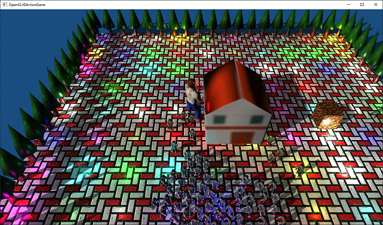
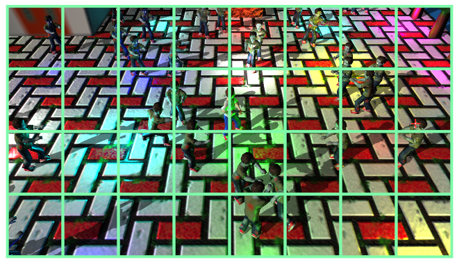

[OpenGL 3D 2020 第22回]

# 8x4等分の視錐台

## 習得目標

* SSBOの使い方
* 球と視錐台の交差判定
* 空間を分割して処理する方法

## 1. SSBO(シェーダー・ストレージ・バッファ・オブジェクト)

### 1.1 シェーダー・ストレージ・ブロック

<p align="center">
<br>
</p>

ホラーやスプラッタでは、恐怖を高めるために夜間に物事が進行します。そして、夜にはたくさんのライトが暗闇を照らします。電気の通っていない山奥や孤島でもないかぎり、人間の暮らす領域では無数のライトが空間を照らしています。

たくさんのライトをシェーダーで扱うには、ライトのデータをGPUメモリに転送し、シェーダーから読み込めるようにしなくてはなりません。

現在のシェーダーにはひとつの平行光源とひとつの点光源があり、どちらもユニフォーム変数として定義しています。ライトを増やすには定義するユニフォーム変数を増やすだけに思えます。

残念ながら、これはうまくいきません。なぜなら、シェーダーに定義できるユニフォーム変数の数には限界があるからです。

OpenGLの仕様で保証されているユニフォーム変数の数は「1024個」です。結構多いように見えますが、これは`float`換算の数値なので、`vec4`換算だと256個になり、`mat4`換算ではわずか64個です。

例えば、点光源は2個の`vec4`で表せます。ユニフォーム変数を全て点光源に割り当てると、合計128個定義できます。しかし、近年のゲームでは数百から数千のライトが使われうこともめずらしくありません。

加えて、座標変換行列などのデータも定義しなくてはならないため、実際に使えるのはよくて半分程度でしょう。とても足りているとは言えません。

結局、現代のゲームに必要とされる大量のデータを定義するには、ユニフォーム変数は少なすぎるのです。これはみんな分かっていたので、より大量のデータを扱うために「ユニフォームブロック」という機能が追加されました。

ユニフォームブロックは16キロバイトのサイズを保証します。さらに、同時に36個のユニフォームブロックをバインドできるため、合計は576キロバイトになります。

これはかなりの改善でしたが、より効率的なデータ処理を求めると、用途によってはまだ不足することがありました。そこで、さらに「シェーダー・ストレージ・ブロック」という機能が追加されました。

シェーダーストレージブロックでは、なんと16メガバイトの大きさが保証されています。また、同時に8個までバインドすることができるので、合計は128メガバイトに達します。実にユニフォームブロックの200倍以上です。

さらに、シェーダーストレージブロックでは、シェーダーからデータを書き込むこともできます。これはユニフォーム変数やユニフォームブロックにはできないことです。

本テキストではシェーダーストレージブロックを使って、たくさんのライトを表示してみようと思います。

>**【シェーダーストレージブロックに欠点はあるか】**<br>
>いいことづくめのシェーダーストレージブロックですが、OpenGL 4.3以上に対応していないと使えないという欠点があります。対応していないGPUやOSで開発する場合、かわりにユニフォームブロックを使うか、あるいは大容量が必要ならテクスチャにデータを書き込むかを選択するしかありません。

### 1.2 シェーダー・ストレージ・バッファ・オブジェクト

ユニフォーム変数にデータを転送するには`glUniform4fv`のような関数を使いました。しかしシェーダーストレージブロックにはこの関数は使えません。

その代わりに、シェーダーストレージブロックにデータを転送するには「シェーダー・ストレージ・バッファ・オブジェクト」というものを使います。…名前が長いので、以後は「SSBO(エス・エス・ビー・オー)」と省略して書くことにします。

SSBOは「シェーダーストレージブロック用のGPUメモリ」を管理するオブジェクトです。OpenGL 4.5におけるGPUメモリは汎用のバッファオブジェクトとして管理されるので、SSBOも以前に作った`CreateBuffer`関数で作成することができます。

オブジェクトとしては、バインド先がシェーダーストレージブロックである、という点をのぞけばVBOと同じです。SSBOの管理を簡単にするために、必要な機能をクラスとしてまとめることにします。

クラス名は`ShaderStorageBufferObject`(シェーダー・ストレージ・バッファ・オブジェクト)とします。そのまんまですが、名前というものは分かりやすいことが大事なので、これでいいのです。

SSBOに期待される機能はデータの書き込みと読み込み、そしてグラフィックスパイプラインへの割り当ておよび割り当て解除です。今回は読み込みは行わないので、必要なメンバ関数は3つになります。

プロジェクトの`Src`フォルダに`ShaderStorageBufferObject.h`というヘッダファイルを追加してください。追加したファイルを開き、次のプログラムを追加してください。

```diff
+/**
+* @file ShaderStorageBufferObject.h
+*/
+#ifndef SHADERSTORAGEBUFFEROBJECT_H_INLCUDED
+#define SHADERSTORAGEBUFFEROBJECT_H_INLCUDED
+#include "glad/glad.h"
+
+/**
+* シェーダー・ストレージ・バッファ・オブジェクト(SSBO).
+*/
+class ShaderStorageBufferObject
+{
+public:
+  explicit ShaderStorageBufferObject(size_t size);
+  ~ShaderStorageBufferObject();
+  ShaderStorageBufferObject(const ShaderStorageBufferObject&) = delete;
+  ShaderStorageBufferObject& operator=(const ShaderStorageBufferObject&) = delete;
+
+  void CopyData(const void* data, size_t size, size_t offset) const;
+  void Bind(GLuint binding) const;
+  void Unbind(GLuint binding) const;
+
+private:
+  GLuint id = 0;     // オブジェクトID
+  size_t size = 0;   // バッファの大きさ(単位=バイト).
+  void* p = nullptr; // データの転送先を指すポインタ.
+};
+
+#endif // SHADERSTORAGEBUFFEROBJECT_H_INLCUDED
```

コンストラクタにSSBOのサイズを渡して初期化します。通常、このサイズは対応するシェーダー・ストレージ・ブロックと同じサイズを指定しますが、そうしなければならない、というわけではありません。

OpenGLのバッファオブジェクトを取り扱う他のクラスと同様に、SSBOもバッファIDのコピーが作られると都合が悪いです。そこで、コピーコンストラクタとコピー代入演算子に`delete`を指定して、勝手にコピーを作れないようにしています。

### 1.3 コンストラクタを定義する

それではメンバ関数を書いていきます。SSBOの作成には、以前に定義した`GLContext::CreateBuffer`関数が使えます。ただし、引数にはSSBO用のものを指定します。

今回作成するSSBOは「CPUから書き込み」「GPUで読み取る」というものです。VAOを作成するとき、バッファへの書き込みには`glNamedBufferSubData`関数を使いましたね。

この関数による書き込みはSSBOでも使えます。ただし、`glNamedBufferSubData`はデータを送る回数が1度きりなら効率的に扱えますが、今回扱うライトデータのように毎フレーム書き込む必要のあるデータには向いていません。

そこで、代わりに「永続的マッピング(Persistent mapping)」という方法を使うことにします。永続的マッピングでは、OpenGLコンテキストから「GPUにデータを転送するためのメモリのアドレス」を取得して、このアドレスにデータを直接書き込みます。

データ転送用メモリのアドレスを取得するには`glMapNamedBufferRange`(ジーエル・マップ・ネームド・バッファ・レンジ)関数を使います。

プロジェクトの`Src`フォルダに`ShaderStorageBufferObject.cpp`というファイルを追加してください。追加したファイルを開き、次のプログラムを追加してください。

```diff
+/**
+* @file ShaderStorageBufferObject.cpp
+*/
+#include "ShaderStorageBufferObject.h"
+#include "GLContext.h"
+#include <iostream>
+
+/**
+* コンストラクタ.
+*
+* @param size  SSBOの大きさ(バイト数).
+*/
+ShaderStorageBufferObject::ShaderStorageBufferObject(size_t size)
+{
+  id = GLContext::CreateBuffer(size, nullptr,
+    GL_MAP_WRITE_BIT | GL_MAP_PERSISTENT_BIT | GL_MAP_COHERENT_BIT);
+  if (!id) {
+    std::cerr << "[エラー]" << __func__ << "SSBOの作成に失敗(size=" << size ").\n";
+    return;
+  }
+  p = glMapNamedBufferRange(id, 0, size,
+    GL_MAP_WRITE_BIT | GL_MAP_PERSISTENT_BIT | GL_MAP_COHERENT_BIT);
+  if (!p) {
+    std::cerr << "[エラー]" << __func__ << "データ転送用メモリアドレスの取得に失敗.\n";
+    return;
+  }
+  this->size = size;
+}
```

<p><code class="tnmai_code"><strong>【書式】</strong><br>
void glMapNamedBufferRange(データ転送先のバッファID, データ転送先オフセット,
  転送するデータの最大バイト数, データ転送用メモリの用途);
</code></p>

`glMapNamedBufferRange`関数を使う場合、用途を示す引数には`CreateBuffer`と同じ値を指定する必要があります。用途が一致しないとアドレスの取得に失敗します。用途には以下の値のビット論理和を指定します。

| 名前 | 用途 |
|:-----|:-----|
|<ruby>GL_MAP_READ_BIT<rt>ジーエル・マップ・リード・ビット</rt></ruby>| 転送用メモリからの読み込み |
|<ruby>GL_MAP_WRITE_BIT<rt>ジーエル・マップ・リード・ビット</rt></ruby>| 転送用メモリへの書き込み |
|<ruby>GL_MAP_PERSISTENT_BIT<rt>ジーエル・マップ・パーシステント・ビット</rt></ruby>| 転送先GPUメモリが使用中(描画処理中)でも読み書きを許可 |
|<ruby>GL_MAP_COHERENT_BIT<rt>ジーエル・マップ・コヒーレント・ビット</rt></ruby>| CPUが転送用メモリを変更した、またはGPUが転送先GPUメモリを変更した時、変更を自動的に他方へ転送する |

永続的マッピングを使う場合は必ず`GL_MAP_PERSISTENT_BIT`を指定します。この値を指定しない場合、SSBOを使った描画を行う前にマッピングを解除しないとエラーが発生します。

`GL_MAP_COHERENT_BIT`を指定すると、書き込んだデータは、OpenGLコンテキストによって自動的にGPUメモリに転送されます。

この値を指定しない場合、マッピングを解除するか、`glFlushMappedBufferRange`または`glMemoryBarrier`関数を使って転送完了待ちを指示するか、いずれかの方法を取らない限り、転送が行われる保証はありません。

### 1.4 デストラクタを定義する

次にデストラクタを作成します。デストラクタでは、コンストラクタで行った永続的マッピングを解除し、SSBOを破棄します。

永続的マッピングを解除するには`glUnmapNamedBuffer`(ジーエル・アンマップ・ネームド・バッファ)関数を使います。

<p><code class="tnmai_code"><strong>【書式】</strong><br>
void glUnmapNamedBuffer(永続的マッピングを行ったバッファID);
</code></p>

SSBOはVBOと同様のバッファオブジェクトなので、`VBO`と同じ`glDeleteBuffers`関数で破棄できます。コンストラクタの定義の下に次のプログラムを追加してください。

```diff
   }
   this->size = size;
 }
+
+/**
+* デストラクタ.
+*/
+ShaderStorageBufferObject::~ShaderStorageBufferObject()
+{
+  glUnmapNamedBuffer(id);
+  glDeleteBuffers(1, &id);
+}
```

### 1.5 CopyDataメンバ関数を定義する

次に、転送したいデータをSSBOにコピーする関数を作成します。`glMapNamedBufferRange`関数で取得したアドレスには、C言語の通常の代入や関数を使って書き込むことができます。今回はC標準ライブラリの`memcpy`関数を使います。

<p><code class="tnmai_code"><strong>【書式】</strong><br>
void* memcpy(転送先の先頭アドレス, 転送するデータの先頭アドレス, 転送するデータのバイト数);
</code></p>

C言語の場合と同様に、確保したメモリサイズを超える位置にデータをコピーしようとするとエラーになります。`memcpy`を使う前に転送するデータの位置とサイズが適切かどうかをチェックするべきです。

それでは、デストラクタの定義の下に、次のプログラムを追加してください。

```diff
   glUnmapNamedBuffer(id);
   glDeleteBuffers(1, &id);
 }
+
+/**
+* データをSSBOにコピーする.
+*
+* @param data コピーするデータのアドレス.
+* @param size コピーするバイト数.
+* @param offset コピー先の先頭位置(バイト単位).
+*/
+void ShaderStorageBufferObject::CopyData(
+  const void* data, size_t size, size_t offset) const
+{
+  if (offset + size > this->size) {
+    std::cerr << "[エラー]" << __func__ <<
+      ": サイズまたはオフセットが大きすぎます(size=" << size <<
+      ",offset=" << offset << "/" << this->size << ").\n";
+    return;
+  }
+  memcpy(static_cast<char*>(p) + offset, data, size);
+}
```

### 1.6 Bindメンバ関数を定義する

続いてSSBOをグラフィックスパイプラインに割り当てるメンバ関数を作成します。割り当てには`glBindBufferBase`(ジーエル・バインド・バッファ・ベース)関数を使います。

<p><code class="tnmai_code"><strong>【書式】</strong><br>
void glBindBufferBase(割り当て先の種類, 割り当て先のロケーション番号, 割り当てるSSBOのバッファID);
</code></p>

`CopyData`メンバ関数の定義の下に、次のプログラムを追加してください。

```diff
   }
   memcpy(static_cast<char*>(p) + offset, data, size);
 }
+
+/**
+* SSBOをグラフィックスパイプラインに割り当てる.
+*
+* @param location 割り当て先のロケーション番号.
+*/
+void ShaderStorageBufferObject::Bind(GLuint location) const
+{
+  glBindBufferBase(GL_SHADER_STORAGE_BUFFER, location, id);
+}
```

### 1.7 Unbindメンバ関数を定義する

最後にSSBOの割り当てを解除するメンバ関数を作ります。SSBOの割り当てを解除するには、バッファIDに`0`を指定して、割り当てと同じ`glBindBufferRange`関数を使います。

`Bind`メンバ関数の定義の下に、次のプログラムを追加してください。

```diff
 {
   glBindBufferBase(GL_SHADER_STORAGE_BUFFER, location, id);
 }
+
+/**
+* SSBOのグラフィックスパイプラインへの割り当てを解除する.
+*
+* @param location 割り当て先のロケーション番号.
+*/
+void ShaderStorageBufferObject::Unbind(GLuint location) const
+{
+  glBindBufferBase(GL_SHADER_STORAGE_BUFFER, location, 0);
+}
```

これで`ShaderStorageBufferObject`クラスは完成です。

>**【まとめ】**<br>
>
>* シェーダーストレージバッファオブジェクト(SSBO)を使うとシェーダーに大量のデータを送ることができる。
>* SSBOはバッファオブジェクトの一種である。
>* `glMapNamedBufferRange`関数を使うことで、SSBOとデータをやり取りするためのアドレスを取得できる。このアドレスには`memcpy`などでデータを書き込める。
>* 永続的マッピングを使うことでデータのやり取りが簡単になる。
>* SSBOは専用のバインディングポイントに割り当てる。

<div style="page-break-after: always"></div>

## 2. ライトを管理するクラスを作る

### 2.1 誰が大量のライトを管理するべきか

現在のプログラムでは、ライトのデータを`Pipeline`クラス経由で直接指定しています。これは、平行光源と点光源をひとつずつしか使っていないので、管理機能を作る意義があまりなかったからです。

しかし、SSBOによって大量のライトを扱う場合は話が変わります。例えば、SSBOと大量のライトの管理を`Pipeline`クラスが行うとすると、ライトを必要としないシェーダーにもライトを管理する機能がくっつくという無駄が生じます。

あるいは、`MainGameScene`クラスで管理することも考えられます。すると、すでにさまざまな機能を担当している`MainGameScene`クラスのプログラムがさらに複雑になってしまいます。

また、他のクラスで同様のライトを使う場合は、`MainGameScene`クラスのライト機能だけを使えるように工夫するか、ライトのプログラムをコピーするしかありません。

そうなるくらいなら、専用のクラスを作って管理するほうが使い勝手がよいです。さらに、管理クラスではライトのことだけを考えればいいので、クラスに余分な情報が入りません。結果としてプログラムを理解しやすくなります。

### 2.2 ライト構造体を定義する

「ライトを管理する」クラスなので`LightManager`(ライト・マネージャ)という名前にします。「マネージャ」というのは「管理者、監督者」という意味です。

`LightManager`クラスはライトとSSBOを管理し、ライトのデータをSSBOにコピーして、グラフィックスパイプラインに割り当てる役割を<ruby>担<rt>にな</rt></ruby>います。

すでに`Shader.h`にライトの構造体が定義されていますが、今回は新しい構造体を作ることにします。ライトの機能が重複しないように、`LightManager`によるライトの管理が完成したら、`Shader.h`にあるライトの構造体は削除しようと思います。

また、たくさんのライトを扱う場合、ポインタを使って管理するほうが扱いやすいです。そこで、新しく作成するライト構造体はポインタで管理することにします。

>* 新しいライト構造体を作る。
>* ライト構造体はポインタで管理できるようにする。
>* `LightManger`クラスは、ライト構造体のポインタとSSBOを管理する。

とりあえずファイルを追加して、必要そうなヘッダファイルをインクルードしましょう。今回作成するライト関連のクラスや変数は、すべて`Light`(ライト)名前空間に格納することにします。

プロジェクトの`Src`フォルダに、`Light.h`という名前のヘッダファイルを追加してください。追加したファイルを開き、次のプログラムを追加してください。

```diff
+/**
+* @file Light.h
+*/
+#ifndef LIGHT_H_INCLUDED
+#define LIGHT_H_INCLUDED
+#include "glad/glad.h"
+#include "ShaderStorageBufferObject.h"
+#include <glm/glm.hpp>
+#include <vector>
+#include <string>
+#include <memory>
+
+namespace Light {
+
+} // namespace Light
+
+#endif//LIGHT_H_INCLUDED
```

>**【インクルードするヘッダファイルについて】**<br>
>ヘッダファイルは必要があるからインクルードしています。たくさんのデータを扱うから`vector`をインクルードする、文字列を使うので`string`をインクルードする、スマートポインタを使いたいので`memory`をインクルードする、といった具合です。見かたを変えると、インクルードされているヘッダファイルを見れば、そのファイルでどんなプログラムが書かれているかをある程度予想できる、ということになります。<br>
>ただし、「必要だと思ってインクルードしたけど結局使わなかった」とか、「最初は必要だったけれど作っていくうちに不要になった」という理由で、もはやインクルードしている意味が失われていることはありえます。不要になったヘッダファイルをインクルードしたままにすると、あとからプログラムを見た時に理解しづらくなってしまいます。不要になったインクルード文は速やかに削除しましょう。

まずはライトの構造体を作成します。ひとまずは点光源だけ対応しますが、あとでライトの種類を増やせるような作りにしようと思います。

また、大量のライトを作成する場合、個々のライトを識別する機能があると役に立つかもしれません。そこで、`Actor`クラスのように名前を付けられるよう、`std::string`型のメンバ変数を追加しようと思います。

`Light`名前空間の中に、次のプログラムを追加してください。

```diff
 #include <memory>

 namespace Light {
+
+/**
+* ライト.
+*/
+struct Light
+{
+  // ライトの種類.
+  enum class Type {
+    PointLight,       // 点光源.
+  };
+
+  std::string name;   // ライトの名前.
+  Type type = Type::PointLight; // ライトの種類.
+  glm::vec3 position; // 光を放つ位置.
+  glm::vec3 color;    // ライトの色.
+};
+
+// ライト構造体のポインタ型.
+using LightPtr = std::shared_ptr<Light>;

 } // namespace Light

 #endif//LIGHT_H_INCLUDED
```

### 2.3 ライトマネージャクラスを定義する

続いて、作成した`Light`構造体(のポインタ)を管理する`LightManager`クラスを作ります。`LightManager`クラスには、ライトを追加する機能、削除する機能を作ります。

加えて、全ライトのデータをSSBOを使ってGPUメモリに転送したり、SSBOをグラフィックスパイプラインに割り当てる機能も必要でしょう。クラスの設計は、このような目的達成に必要な機能を考慮して行います。

>**【最初から完璧なクラスを作るのは難しい】**<br>
>もっとも、あとから必要になったり、作ったものの必要なかったりという機能が出てくるのは普通のことなので、最初から完璧に作ろうとは思わないでください。作っている過程や、完成したクラスを使っているうちに、徐々に改善していけばよいのです。

それでは、`Light`構想体の定義の下に、次のプログラムを追加してください。

```diff
 // ライト構造体のポインタ型.
 using LightPtr = std::shared_ptr<Light>; // ライト構造体のポインタ型.
+
+/**
+* ライトを管理するクラス.
+*/
+class LightManager
+{
+public:
+  LightManager();
+  ~LightManager() = default;
+  LightManager(const LightManager&) = delete;
+  LightManager& operator=(const LightManager&) = delete;
+
+  // ライト管理用メンバ関数.
+  LightPtr CreateLight(const glm::vec3& position, const glm::vec3& color);
+  void RemoveLight(const LightPtr& light);
+  LightPtr GetLight(size_t n) const;
+  size_t GetLightCount() const;
+
+  // SSBO管理用メンバ関数.
+  void Update();
+  void Bind(GLuint binding) const;
+  void Unbind(GLuint binding) const;
+
+private:
+  std::vector<LightPtr> lights; // 管理中のライトポインタ配列.
+  std::shared_ptr<ShaderStorageBufferObject> ssbo[2]; // ライトデータ転送用SSBO.
+  int updatingBufferIndex = 0; // 更新するSSBOの番号.
+};
+
+// ライトマネージャクラスのポインタ型.
+using LightManagerPtr = std::shared_ptr<LightManager>;

 } // namespace Light

 #endif//LIGHT_H_INCLUDED
```

SSBOが2つあるのはスプライトでも利用した「ダブルバッファ」技法を使うためです。ダブルバッファは「一方のバッファを描画しているあいだに他方のバッファにデータを書き込み、書き込みが完了したらバッファの役割を入れ替える」という方法でしたね。

### 2.4 シェーダ用のライトデータを定義する

`Light`構造体には「名前」メンバがありますが、ライティングを行うときには使われません。つまりライトの名前は「GPUメモリに転送しなくてよいデータ」なわけです。不要なデータを転送するのは無駄なので避けたいところです。

また、`Light`構造体の座標と色は`glm::vec3`型ですが、シェーダーでは`vec3`型は扱いにくい型とされています。そのため、シェーダーストレージブロックに転送する際は`vec4`型に変換しておく必要があります。

これらのことから、`Light`構造体とは別に、シェーダーに送るためのデータ構造を用意することにします。

とりあえずファイルを作成しましょう。プロジェクトの`Src`フォルダに`Light.cpp`というファイルを追加してください。追加したファイルを開き、次のプログラムを追加してください。

```diff
+/**
+* @file Light.cpp
+*/
+#include "Light.h"
+#include <iostream>
+
+namespace Light {
+
+const glm::uint maxLightCount = 1024; // シーン全体で使えるライトの最大数.
+
+/**
+* シェーダ用のライトデータ.
+*/
+struct LightForShader
+{
+  glm::vec4 position;
+  glm::vec4 color;
+};
+
+/**
+* SSBOに転送するデータの形式.
+*/
+struct LightData
+{
+  int lightCount;
+  int dummy[3];
+  LightForShader lights[maxLightCount];
+};
+
+} // namespace Light
```

`maxLightCount`(マックス・ライト・カウント)は、SSBOを使って転送するライトの最大数を表します。SSBOの能力を考えれば、最大数は五千でも一万でも問題はないと思いますが、そんなに使うこともないでしょうから1024個にしてみました。

### 2.5 コンストラクタを定義する

それでは`LightManager`クラスのコンストラクタから書いていきましょう。コンストラクタではSSBOを初期化します。また、ライトポインタの容量を予約しておきます。`LightData`構造体の定義の下に、次のプログラムを追加してください。

```diff
   int dummy[3];
   LightForShader lights[maxLightCount];
 };
+
+/**
+* コンストラクタ.
+*/
+LightManager::LightManager()
+{
+  lights.reserve(1024);
+  ssbo[0] = std::make_shared<ShaderStorageBufferObject>(sizeof(LightData));
+  ssbo[1] = std::make_shared<ShaderStorageBufferObject>(sizeof(LightData));
+}

 } // namespace Light
```

`ShaderStorageBufferObject`コンストラクタの引数は「SSBOのバイト数」です。 `LightManager`クラスにとって、それは「`LightData`構造体のバイト数」に当たります。

### 2.6 CreateLightメンバ関数を定義する

続いてライトを作成する`CreateLight`(クリエイト・ライト)メンバ関数を作ります。 `std::make_shared`関数を使って`Light`構造体を作成し、`lights`配列に追加します。

コンストラクタの定義の下に、次のプログラムを追加してください。

```diff
   ssbo[1] = std::make_shared<ShaderStorageBufferObject>(sizeof(LightData));
 }
+
+/**
+* ライトを作成する.
+*
+* @param position ライトの座標.
+* @param color    ライトの明るさ.
+*
+* @return 作成したライトへのポインタ.
+*/
+LightPtr LightManager::CreateLight(const glm::vec3& position, const glm::vec3& color)
+{
+  if (lights.size() >= maxLightCount) {
+    std::cerr << "[警告]" << __func__ << "これ以上ライトを追加できません.\n";
+    return nullptr;
+  }
+
+  LightPtr p = std::make_shared<Light>();
+  p->position = position;
+  p->color = color;
+  lights.push_back(p);
+  return p;
+}

 } // namespace Light
```

### 2.7 RemoveLightメンバ関数を定義する

作成するメンバ関数があるなら、削除するメンバ関数も必要でしょう。`RemoveLight`(リムーブ・ライト)メンバ関数は、`lights`配列の中から引数で受け取ったポインタを見つけ、見つかったライト構造体を削除します。

`CreateLight`メンバ関数の定義の下に、次のプログラムを追加してください。

```diff
   lights.push_back(p);
   return p;
 }
+
+/**
+* ライトを削除する.
+*
+* @param light 削除するライトへのポインタ.
+*/
+void LightManager::RemoveLight(const LightPtr& light)
+{
+  auto itr = std::find(lights.begin(), lights.end(), light);
+  if (itr != lights.end()) {
+    lights.erase(itr);
+  }
+}

 } // namespace Light
```

### 2.8 GetLightメンバ関数を定義する

ライトの位置や色を、作成したあとで変更したいこともあるでしょう。そのためには、ライトを取得するメンバ関数が必要です。`RemoveLight`メンバ関数の定義の下に、次のプログラムを追加してください。

```diff
     lights.erase(itr);
   }
 }
+
+/**
+* ライトを取得する.
+*
+* @param n ライトの番号.
+*
+* @return n番目のライトへのポインタ.
+*         ライトの数がn個未満の場合はnullptrを返す.
+*/
+LightPtr LightManager::GetLight(size_t n) const
+{
+  if (n >= lights.size()) {
+    return nullptr;
+  }
+  return lights[n];
+}

 } // namespace Light
```

### 2.9 GetLightCountメンバ関数を定義する

`GetLight`メンバ関数でライトを取得する時、作成したライトの最大数を超えてしまうと危険です。現在のライトの数が分かれば、有効なインデックスかどうかを調べることができます。

`GetLight`メンバ関数の定義の下に、次のプログラムを追加してください。

```diff
   }
   return lights[n];
 }
+
+/**
+* ライトの数を取得する.
+*
+* @return ライトの数.
+*/
+size_t LightManager::GetLightCount() const
+{
+  return lights.size();
+}

 } // namespace Light
```

### 2.10 Updateメンバ関数を定義する

`Update`(アップデート)メンバ関数は、`CreateLight`メンバ関数によって追加されたライトのデータを、SSBOを使ってGPUメモリに転送します。これは以下の手順で行います。

>1. `LightData`構造体を作成。
>2. `Light`構造体のメンバのうち、`position`と`color`を取り出して`LightForShader`(ライト・フォー・シェーダー)構造体の同名メンバ変数に代入。
>3. SSBOを使って`LightData`をGPUメモリに転送。

`GetLightCount`メンバ関数の定義の下に次のプログラムを追加してください。

```diff
 size_t LightManager::GetLightCount() const
 {
   return lights.size();
 }
+
+/**
+* GPUに転送するライトデータを更新する.
+*/
+void LightManager::Update()
+{
+  // LightData構造体を作成.
+  std::shared_ptr<LightData> lightData = std::make_shared<LightData>();
+
+  // Light構造体をLightForShader構造体に変換.
+  lightData->lightCount = static_cast<int>(lights.size());
+  for (glm::uint i = 0; i < lights.size(); ++i) {
+    const LightPtr& e = lights[i];
+    lightData->lights[i].position = glm::vec4(e->position, 1);
+    lightData->lights[i].color = glm::vec4(e->color, 1);
+  }
+
+  // LightDataをGPUメモリに転送.
+  const size_t size = sizeof(LightForShader) * lights.size();
+  ssbo[updatingBufferIndex]->CopyData(lightData.get(), size, 0);
+  updatingBufferIndex = !updatingBufferIndex;
+}

 } // namespace Light
```

### 2.11 Bindメンバ関数を定義する

次に、データ転送が終わったSSBOを、グラフィックスパイプラインに割り当てるメンバ関数を作ります。といっても、やることはSSBOの`Bind`メンバ関数を呼び出すだけです。

`Update`メンバ関数の定義の下に次のプログラムを追加してください。

```diff
   ssbo[updatingBufferIndex]->CopyData(lightData.get(), size, 0);
   updatingBufferIndex = !updatingBufferIndex;
 }
+
+/**
+* SSBOをグラフィックスパイプラインに割り当てる.
+*
+* @param location 割り当て先のロケーション番号.
+*/
+void LightManager::Bind(GLuint location) const
+{
+  ssbo[!updatingBufferIndex]->Bind(location);
+}

 } // namespace Light
```

### 2.12 Unbindメンバ関数を定義する

最後にSSBOの割り当てを解除するメンバ関数を作ります。`Bind`メンバ関数の定義の下に次のプログラムを追加してください。

```diff
 void LightManager::Bind(GLuint location) const
 {
   ssbo[!updatingBufferIndex]->Bind(location);
 }
+
+/**
+* SSBOのグラフィックスパイプラインへの割り当てを解除する.
+*
+* @param location 割り当て先のロケーション番号.
+*/
+void LightManager::Unbind(GLuint location) const
+{
+  ssbo[!updatingBufferIndex]->Unbind(location);
+}

 } // namespace Light
```

これでひとまず、`LightManager`クラスは完成です。

>**【まとめ】**<br>
>
>* 大量のオブジェクトを管理する場合、専用の管理クラスを作ることを考慮する。
>* オブジェクトを追加する機能を作る場合、削除する機能も作るべき。
>* CPU側のデータ構造とGPU(シェーダー)側のデータ構造が異なっていても構わない。

<div style="page-break-after: always"></div>

## 3. シェーダーストレージブロック

### 3.1 FragmentLighting.fragにシェーダーストレージブロックを追加する

GLSLでは、大量のデータを扱うための「インターフェイス・ブロック」という機能があります。これはC++の「名前空間」のようなもので、1つ以上の変数を`{`と`}`で囲ったものです。ブロックには用途に応じてさまざまな属性を指定できます。

インターフェイスブロックには`uniform`(ユニフォーム)と`buffer`(バッファ)の2種類があります。`uniform`で作成すると「ユニフォーム・ブロック」、`buffer`で作成すると「シェーダー・ストレージ・ブロック」になります。

そして、SSBOによってGPUメモリに転送されたデータは、「シェーダー・ストレージ・ブロック」を使って参照します(ユニフォーム・ブロックでは参照できません)。シェーダー・ストレージ・ブロックは次の書式で作成します。

```c++
ブロック修飾子1 ブロック修飾子2 ... buffer
{
  メンバ変数1
  メンバ変数2
  ...
};
```

ブロック修飾子にはユニフォーム変数で使っている`layout`修飾子などを指定できます。今回はデータの配置方法とバインディングポイントを決める`layout`(レイアウト)修飾子と「読み取り専用」を示す`readonly`(リードオンリー)修飾子を使います。

>**【詳しい情報について】**<br>
>インターフェイスブロックと修飾子について、詳しくは以下のURLを参照してください。<br>
>`https://www.khronos.org/opengl/wiki/Interface_Block_(GLSL)`<br>
>`https://www.khronos.org/opengl/wiki/Type_Qualifier_(GLSL)`

シェーダー・ストレージ・ブロックは、C++側で定義した「SSBOに転送するデータの定義」と同じように書きます。`Light.cpp`から`LightForShader`構造体と`LightData`構造体を「コピー」して、次のように`FragmentLighting.frag`に貼り付けてください。

```diff
 // 環境光
 layout(location=6) uniform vec3 ambientLight;
+
+const uint maxLightCount = 1024; // シーン全体で使えるライトの最大数.
+
+/**
+* シェーダ用のライトデータ.
+*/
+struct LightForShader
+{
+  vec4 position;
+  vec4 color;
+};
+
+/**
+* SSBOに転送するデータの形式.
+*/
+struct LightData
+{
+  int lightCount;
+  int dummy[3];
+  LightForShader lights[maxLightCount];
+};

 // フラグメントシェーダプログラム
 void main()
 {
```

次に`LightData`構造体をシェーダー・ストレージ・ブロックに変更します。

```diff
 * SSBOに転送するデータの形式.
 */
-struct LightData 
+buffer LightData 
 {
   int lightCount;
   int dummy[3];
   LightForShader lights[maxLightCount];
 };

 // フラグメントシェーダプログラム
```

そして修飾子を付け加えます。まずバインディングポイントを指定する`layout`を書きます。インターフェイスブロックで指定するのはロケーション番号ではなく「バインディングポイント」です。そのため`binding`修飾子を使います。

SSBOは専用のバインディングポイントを持っているので、テクスチャなどとは独立して番号を指定できます。とりあえず`0`番に割り当てることにしましょう。

さらに、「メモリ・レイアウト」を指定する`std430`(エス・ティー・ディー・よんさんぜろ)も追加しましょう。「メモリ・レイアウト」はインターフェイスブロックのメンバが「GPUメモリ上でどのように配置されているか」を選択する修飾子です。

4種類のメモリ・レイアウトを選択可能で、それぞれ以下の修飾子で指定できます。

| 修飾子 | 説明 |
|:-------|:-----|
| packed&nbsp; | 配置をOpenGLに任せます。<br>配置された位置はOpenGL APIを使って調べます。 |
| shared | 未使用のメンバを削除しないことを除いて`packed`と同じです。<br>配置された位置はOpenGL APIを使って調べます。 |
| std140 | `shared`と同様に全てのメンバを保持します。<br>全ての型は`vec4`型のサイズである16バイト境界に配置されます。<br>そのため、配置された位置を調べる必要はありません。 |
| std430 | `shared`と同様に全てのメンバを保持します。<br>`bool`、`int`、`float`は4バイト、`double`、`vec2`は8バイト、`vec3`以上の大きさの型は16バイト境界に配置されます。<br>そのため、配置された位置を調べる必要はありません。 |

この中では`std430`が最も効率的で扱いやすいのですが、シェーダー・ストレージ・ブロックでしか使えません。言い換えると、シェーダー・ストレージ・ブロックでは`std430`を使うべきだ、ということです。

それから、今回はシェーダーからSSBOへの書き込みは行いません。そこで、読み取り専用を示す`readonly`(リードオンリー)修飾子も付けておきます。

ここまでの説明を踏まえて、`LightData`シェーダー・ストレージ・ブロックに、次のように修飾子を追加してください。

```diff
 * SSBOに転送するデータの形式.
 */
 buffer LightData 
+layout(std430, binding=0) readonly buffer LightData 
 {
   int lightCount;
   int dummy[3];
```

これでシェーダー・ストレージ・ブロックが設定できました。

### 3.2 点光源の処理をシェーダー・ストレージ・ブロックで置き換える

それでは、点光源のプログラムを`LightData`を使うように変更しましょう。

なお、インターフェイスブロックは、あくまでGPUメモリを参照する方法を決めるものです。一応はブロック名を付けますが、構造体や名前空間のように、ブロック名を参照することはできません。

そのため、ブロック内に書いたメンバ変数名を修飾なしで、そのまま使うことができます。このことを踏まえて、点光源のプログラムを次のように変更してください。

```diff
   // 平行光源
   {
     float theta = max(dot(worldNormal, directionalLight.direction.xyz), 0);
     totalLightColor += directionalLight.color.rgb * theta;
   }
 
   // 点光源
+  for (int i = 0; i < lightCount; ++i)
   {
     // フラグメントからライトへ向かうベクトルを計算.
-    vec3 lightVector = pointLight.position.xyz - inPosition;
+    vec3 lightVector = lights[i].position.xyz - inPosition;
 
     // 距離による明るさの変化量を計算.
     float lengthSq = dot(lightVector, lightVector);
     float intensity = 1.0 / (1.0 + lengthSq);
 
     // 面の傾きによる明るさの変化量を計算.
     float theta = 1;
     if (lengthSq > 0) {
       vec3 direction = normalize(lightVector);
       theta = max(dot(worldNormal, direction), 0);
     }
 
     // 変化量をかけ合わせて明るさを求め、ライトの明るさ変数に加算.
-    totalLightColor += pointLight.color.rgb * theta * intensity;
+    totalLightColor += lights[i].color.rgb * theta * intensity;
   }
 
   fragColor = inColor * texture(texColor, inTexcoord);
   fragColor.rgb *= totalLightColor;
```

`LightData::lightCount`や`LightData.lightCount`ではなく、単に`lightCount`と書いているのは、先に説明した「ブロック名を参照することはできない」というインターフェイスブロックの性質によるものです。

### 3.3 ライトを追加する

2章で作成した`LightManager`クラスを使って、シェーダー・ストレージ・ブロックにライトデータを転送しましょう。

まずはライトマネージャ用の変数を用意しましょう。`MainGameScene.h`を開き、ヘッダファイルをインクルードしてください。

```diff
 #include "Sprite.h"
 #include "FramebufferObject.h"
+#include "Light.h"
 #include <memory>

 /**
 * メインゲーム画面.
```

次に`MainGameScene`クラスに`LightManager`クラスのポインタを追加してください。

```diff
   std::vector<std::shared_ptr<Sprite>> sprites;
   SpriteRenderer spriteRenderer;

   std::shared_ptr<FramebufferObject> fboMain;

+  Light::LightManagerPtr lightManager;
 };

 #endif // MAINGAMESCENE_H_INCLUDED
```

次にライトマネージャを作成し、ライトを追加します。ライトは地面の2x2mに1つの間隔で、地面から1mの高さに配置することにします。`MainGameScene.cpp`を開き、`Initialize`メンバ関数に次のプログラムを追加してください。

```diff
   pointLight = Shader::PointLight{
     glm::vec4(8, 10,-8, 0),
     glm::vec4(0.4f, 0.7f, 1.0f, 0) * 200.0f
   };
+
+  // ライトマネージャが管理するライトを作成する
+  lightManager = std::make_shared<Light::LightManager>();
+  for (int i = 0; i < 400; ++i) {
+    const float x = static_cast<float>(i % 20) * 2 - 19;
+    const float z = static_cast<float>(i / 20) * 2 - 19;
+    const float intencity =
+     std::uniform_real_distribution<float>(0.25f, 4.0f)(GameData::Get().random);
+    const int c = std::uniform_int_distribution<>(1, 7)(GameData::Get().random);
+    lightManager->CreateLight(glm::vec3(x, 1.0f, z),
+      glm::vec3(c & 1, (c >> 1) & 1, (c >> 2) & 1) * intencity);
+  }

   // ゲームデータの初期設定.
   GameData& gamedata = GameData::Get();
   gamedata.killCount = 0;
```

次にライトの状態を更新します。`Update`メンバ関数の末尾に次のプログラムを追加してください。

```diff
   UpdateSpriteList(sprites, deltaTime);
   spriteRenderer.Update(sprites, matView);
+
+  // ライトマネージャを更新.
+  lightManager->Update();
 }

 /**
 * メインゲーム画面を描画する.
```

そして、描画時にライトマネージャが管理しているSSBOを、グラフィックスパイプラインに割り当てます。既存のポイントライトは不要なので、設定プログラムは消しましょう。`Render`メンバ関数を次のように変更してください。

```diff
     glm::vec4(1, 0.9f, 0.8f, 1)
   };
   pipeline->SetLight(directionalLight);

-  pipeline->SetLight(pointLight);
+  // ライト用SSBOをバインド.
+  lightManager->Bind(0);

   primitiveBuffer.BindVertexArray();
   pipeline->Bind();
```

最後に割り当てを解除します。ライト用SSBOは`FragmentLighting.frag`で使用しています。最後にこのシェーダーを使うのはスプライトの描画なので、そのあとで解除するのがよいでしょう。

スプライトを描画するプログラムの下に、次のプログラムを追加してください。

```diff
   // スプライトを描画.
   spriteRenderer.Draw(pipeline, matProj * matView);
+
+  // ライト用SSBOのバインドを解除.
+  lightManager->Unbind(0);
 
   // 3Dモデル用のVAOをバインドしなおしておく.
   primitiveBuffer.BindVertexArray();
```

当然のことですが、ライト用SSBOを使うシェーダーを利用するプログラムを追加した場合は、それらを使うプログラムより下で割り当てを解除する必要があります。シェーダーの変更や追加を行う場合は、解除のタイミングを調整してください。

プログラムが書けたらビルドして実行してください。地面、木、ゾンビたちなど、全てがさまざまな色のライトで照らされていたら成功です。

>**【まとめ】**<br>
>
>* シェーダーでSSBOを読み書きするときは「シェーダーストレージブロック」を使う。
>* `std430`というメモリレイアウトを指定することで、データ構造が効率的になる。
>* あまりたくさんのライトを使うと、シェーダーの処理に時間がかかる。

<div style="page-break-after: always"></div>

## 4. タイル・ベースド・レンダリング

### 4.1 全てのライトが見た目に影響するとは限らない

<p align="center">
<br>
</p>

大量のライトを扱えるようになったのはいいのですが、そのぶん処理に時間がかかるようになりました。フラグメントを1つ描画するのに400個のライトを処理しなくてはならない以上、時間がかかるのは当然のことです。

しかし、ゲーム画面をよく観察してみると、全てのライトが全てのフラグメントに影響しているようには見えません。どちらかというと、近くにあるライト以外は何の影響もないように見えるのではないでしょうか。

この感覚は正しくて、実際に遠くあるライトからの影響というのは、ないものとして扱っても見た目は違いません。

例えば夜は星々や月の光が地上を照らしています。しかし昼間は星や月の光を感じることはありません。では、昼は、星や月から光が届いていないのでしょうか？

もちろん、そんなわけはありません。昼間でも間違いなくそれらの光は地上に届いています。しかし、太陽の光が強力すぎるため、それらが見た目に影響しないのです。

つまり、十分に弱い光は存在しないものとみなすことができるわけです。このために、全てのライトに「影響範囲」というパラメータを追加し、フラグメントが範囲外にあるときはそのライトを無視するようにします。

ただ、影響範囲を設定しただけではあまり処理時間は減らせません。結局400個のライトについて、フラグメントが範囲内かどうかを調べなくてはならないからです。

こうした問題でよく使われるのは、空間を格子状に分割して、分割した小さな空間ごとに処理を分ける方法です。今回は画面を8x4個に区切り、個々の空間に影響しうるライトのリストを作ることにします。

分割した空間に影響しないライトは描画処理から除外されるため、処理時間を減らすことができるはです。このように、画面を分割して描画することを「Tile-based rendering(タイル・ベースド・レンダリング)」と言います。

画面を分割したそれぞれの領域を「タイル」と呼びます。

### 4.2 平面と球の交差判定

<p align="center">
<br>
</p>

以前にプロジェクション行列の説明をしたとき「視錐台(しすいだい)」という単語が出てきたことを覚えているでしょうか。視錐台の内側にある物体が画面に表示されるのでした。

2Dの画面を分割するということを3D空間に置き換えると、「視錐台を分割する」という操作になります。ライトの影響範囲を球形とすると、視錐台を分割した空間とライトを表す球が重なっていたら、そのライトは空間に影響する可能性があります。

この判定のために、視錐台と球の交差判定プログラムを書かなくてはなりません。ただ、視錐台は平面の組み合わせで作ることができますから、実際に必要なのは「球と平面の交差判定」と「球と(平面を組み合わせた)視錐台の交差判定」の2つです。

ところで、マウスカーソル座標を計算する時に平面の構造体を定義しています。平面の定義は`Actor.h`にありますから、球も`Actor.h`に定義しましょう。`Actor.h`を開き、次のプログラムを追加してください。

```diff
   glm::vec3 point;  // 平面上の任意の座標.
   glm::vec3 normal; // 平面の法線.
 };
+
+/**
+* 球体.
+*/
+struct Sphere
+{
+  glm::vec3 center; // 球の中心座標.
+  float radius;     // 球の半径.
+};

 bool Intersect(const Segment& seg, const Plane& plane, glm::vec3* p);
+bool SphereInsidePlane(const Sphere& sphere, const Plane& plane);

 #endif // ACTOR_H_INCLUDED
```

球は英語で「Sphere(スフィア)」なので、構造体の名前も`Sphere`にしました。また、さきほどは球と平面の交差判定と言いましたが、実際に必要なのは「球が平面のどちら側に存在するか」という判定です。

そこで、関数名は`SphereInsidePlane`(スフィア・インサイド・プレーン、球は平面の表側にあるか)としました。

球と平面の判定は、以前作成した線分と平面の判定よりかなり簡単です。それは以下の手順で行います。

>1. 球の中心座標から平面までの距離を計算する。
>2. 距離が球の半径未満なら交差している。

それではプログラムを書きましょう。`Intersect`関数の定義の下に、次のプログラムを追加してください。

```diff
   *p = seg.start + v * t;
   return true;
 }
+
+/**
+* 球が平面の表側にあるかどうかを調べる.
+*
+* @param sphere 球.
+* @param plane  平面.
+*
+* @retval true  平面の表側にあるか、部分的に重なっている.
+* @retval false 完全に裏側にある.
+*/
+bool SphereInsidePlane(const Sphere& sphere, const Plane& plane)
+{
+  const float d = glm::dot(plane.normal, sphere.center - plane.point);
+  return d >= -sphere.radius;
+}

 /**
 * アクターの衝突を処理する.
```

<br>

### 4.3 視錐台を定義する

次に球と視錐台の判定を作成します。視錐台の分割はライト処理用なので、`Light.h`と`Light.cpp`に追加することにします。

4.2節で説明したように、視錐台は平面を組み合わせて作ることができます。基本的には上下左右に前後をあわせて6面必要ですが、視錐台がビュー空間にあると仮定できれば前後方向は視点からの距離だけで十分です。

さらに、分割によってつくられる小さな視錐台の前後平面は、全ておなじ平面です。そのため小さな視錐台が個別に前後の距離を保つ必要はありません。

これらのことから、上下左右の平面を持つ小さな「サブ視錐台」と、上下左右の平面に加えて前後方向の距離を持ち、全てのサブ視錐台を掌握する「メイン視錐台」の2つがあればよさそうです。

<p align="center">
<br>
</p>

さっそく作成しましょう。メイン視錐台の構造体名は`Frusutm`とします。視錐台は英語で「Frustum(フラスタム)」というからです。サブ視錐台は`SubFrustum`(サブ・フラスタム)とします。

視錐台の詳細は、はライトマネージャが知っていれば十分なので、ヘッダファイルでは先行宣言だけ行います。直接操作するのはメイン視錐台なので、宣言するのは`Frusutm`構造体だけで十分です。`Light.h`に次のプログラムを追加してください。

```diff
 #include <string>
 #include <memory>

 namespace Light {
+
+// 先行宣言.
+struct Frustum; // 視錐台(しすいだい).
+using FrustumPtr = std::shared_ptr<Frustum>;
+
+FrustumPtr CreateFrustum(const glm::mat4& matInvProj, float zNear, float zFar);

 /**
 * 点光源.
```

次に定義を行います。まず平面を使うために`Actor.h`をインクルードし、それから画面の分割数を表す定数を定義しましょう。`Light.cpp`を開き、次のプログラムを追加してください。

```diff
 * @file Light.cpp
 */
 #include "Light.h"
+#include "Actor.h"
 #include <iostream>

 namespace Light {
+
+const glm::uint tileCountX = 8; // 視錐台のX方向の分割数.
+const glm::uint tileCountY = 4; // 視錐台のY方向の分割数.

 /**
 * シェーダと同じ形式のライトデータ.
```

`glm::uint`(ジーエルエム・ユーイント)はGLSLの`uint`型に対応する型で、基本的にはC++の`unsigned int`型と同じです。ただし、環境によっては`unsingd int`ではないことがあるため、GLSLとの連携を考慮してGLMの型を使うことにしました。

次にサブ視錐台とメイン視錐台を定義します。`tileCountY`の定義の下に、次のプログラムを追加してください。

```diff
 const glm::uint tileCountX = 8; // 視錐台のX方向の分割数.
 const glm::uint tileCountY = 4; // 視錐台のY方向の分割数.
+
+/**
+* 表示するライトを選別するためのサブ視錐台.
+*/
+struct SubFrustum
+{
+  Plane planes[4]; // 0=左 1=右 2=上 3=下
+};
+
+/**
+* 表示するライトを選別するための視錐台.
+*/
+struct Frustum
+{
+  SubFrustum baseFrustum; // メイン視錐台の上下左右平面.
+  float zNear;            // メイン視錐台の手前側平面までの距離.
+  float zFar;             // メイン視錐台の奥側平面までの距離.
+  SubFrustum tiles[tileCountY][tileCountX]; // サブ視錐台の配列.
+};

 /**
 * シェーダと同じ形式のライトデータ.
```

### 4.4 スクリーン座標をビュー座標に変換する

画面を分割してサブ視錐台を作る場合、スクリーン座標系で分割してからビュー座標系へと変換すると簡単です。そのために、スクリーン座標系からビュー座標系へと座標変換を行う関数を作っておきます。

まずスクリーン座標型の大きさを定義しましょう。`tileCountY`の定義の下に、次のプログラムを追加してください。

```diff
 const glm::uint tileCountX = 8; // 視錐台のX方向の分割数.
 const glm::uint tileCountY = 4; // 視錐台のY方向の分割数.
+const glm::uint screenSizeX = 1280; // 画面の幅.
+const glm::uint screenSizeY = 720;  // 画面の高さ.

 /**
 * 表示するライトを選別するためのサブ視錐台.
```

追加した変数を使って座標変換関数を書いていきます。手順は以下の2つです。

1. スクリーン座標をNDC(正規化デバイスコンテキスト)座標に変換。
2. NDC座標をビュー座標に変換。

`1`はGPUが自動的にやってくれる座標変換の逆の処理です。GPU内部の話なので普段はあまり気にしませんが、このような逆変換を行うためには、仕組みを知っておく必要があります。

`2`はプロジェクション行列の逆行列を使えば簡単に実現できます。ただし、ここにもGPUが自動的に行っている「`W`要素で全体を割る」という処理がはさまります。このGPUが行うのとは逆の処理をプログラムしなくてはなりません。

といっても難しいことではなく「逆プロジェクション行列を掛けた結果を`W`要素で割る」だけです。

この関数の名前は`ScreenToView`(スクリーン・トゥ・ビュー)とします。`LightData`構造体の定義の下に次のプログラムを追加してください。

```diff
   glm::uint lightCounts[tileCountY][tileCountX];
   LightForShader lights[maxLightCount];
 };
+
+/**
+* スクリーン座標をビュー座標に変換する.
+*
+* @param p          スクリーン座標.
+* @param matInvProj 逆プロジェクション行列.
+*
+* @return ビュー座標系に変換したpの座標.
+*/
+glm::vec3 ScreenToView(const glm::vec3& p, const glm::mat4& matInvProj)
+{
+  glm::vec4 pp;
+
+  // スクリーン座標系→NDC座標系.
+  pp.x = (p.x / screenSizeX) * 2 - 1;
+  pp.y = (p.y / screenSizeY) * 2 - 1;
+  pp.z = p.z;
+  pp.w = 1;
+
+  // NDC座標系→ビュー座標系.
+  pp = matInvProj * pp;
+  pp /= pp.w;
+
+  return pp;
+}

 /**
 * コンストラクタ.
```

### 4.5 サブフラスタムを作成する

`ScreenToView`関数を使ってサブフラスタムを作る関数を書いていきます。関数名は`CreateSubFrustum`(クリエイト・サブフラスタム)でいいでしょう。

スクリーン座標からサブフラスタムを作成するには、逆プロジェクション行列とサブフラスタムの範囲を表す2つのスクリーン座標が必要です。

`Plane`構造体は「平面上の1点の座標と法線」によって平面を表します。ビュー座標系において視点は常に`(0, 0, 0)`にあります。サブ視錐台を構成する上下左右の平面は必ず視点を通るので、平面の座標には`(0, 0, 0)`が使えます。

次に法線は「外積」の結果が「2つのベクトルに垂直なベクトル」になる性質から計算できます。例えば左側の平面の場合「視点とサブ視錐台の左下を通るベクトルと、視点と左上を通るベクトルの外積」が法線になります。

同様に、右の平面の法線は「視点と右上を通るベクトルと、視点と右下を通るベクトルの外積」になります。それでは`ScreenToView`関数の定義の下に、次のプログラムを追加してください。

```diff
   pp /= pp.w;
 
   return pp;
 }
+
+/**
+* ビュー座標系のサブ視錐台を作成する.
+*
+* @param matProj プロジェクション行列.
+* @param x0      タイルの左下のX座標. 
+* @param y0      タイルの左下のY座標. 
+* @param x1      タイルの右上のX座標. 
+* @param y1      タイルの右上のY座標. 
+*
+* @return 作成したサブ視錐台.
+*/
+SubFrustum CreateSubFrustum(const glm::mat4& matInvProj,
+  float x0, float y0, float x1, float y1)
+{
+  const glm::vec3 p0 = ScreenToView(glm::vec3(x0, y0, 1), matInvProj);
+  const glm::vec3 p1 = ScreenToView(glm::vec3(x1, y0, 1), matInvProj);
+  const glm::vec3 p2 = ScreenToView(glm::vec3(x1, y1, 1), matInvProj);
+  const glm::vec3 p3 = ScreenToView(glm::vec3(x0, y1, 1), matInvProj);
+
+  return SubFrustum{
+    Plane{ glm::vec3(0), glm::normalize(glm::cross(p0, p3)) },
+    Plane{ glm::vec3(0), glm::normalize(glm::cross(p2, p1)) },
+    Plane{ glm::vec3(0), glm::normalize(glm::cross(p3, p2)) },
+    Plane{ glm::vec3(0), glm::normalize(glm::cross(p1, p0)) }
+  };
+}

 /**
 * コンストラクタ.
```

### 4.6 メインフラスタムを作成する

`CreateFrustum`(クリエイト・フラスタム)関数は、引数として通常のプロジェクション行列と、手前及び奥の平面までの距離を受け取り、メインフラスタムとサブフラスタムを計算します。

基本的には`CreateSubFrustum`関数を分割領域の数だけループ実行するだけです。`CreateSubFrustum`関数の定義の下に、次のプログラムを追加してください。

```diff
     Plane{ glm::vec3(0), glm::normalize(glm::cross(p1, p0)) }
   };
 }
+
+/**
+* ビュー座標系の視錐台を作成する.
+*
+* @param matProj プロジェクション行列.
+* @param zNear   視点から近クリップ平面までの距離.
+* @param zFar    視点から遠クリップ平面までの距離.
+*
+* @return 作成した視錐台.
+*/
+FrustumPtr CreateFrustum(const glm::mat4& matProj, float zNear, float zFar)
+{
+  FrustumPtr frustum = std::make_shared<Frustum>();
+
+  // 逆プロジェクション行列を計算.
+  const glm::mat4& matInvProj = glm::inverse(matProj);
+
+  // メインフラスタムを作成.
+  frustum->baseFrustum =
+    CreateSubFrustum(matInvProj, 0, 0, screenSizeX, screenSizeY);
+  frustum->zNear = -zNear;
+  frustum->zFar = -zFar;
+
+  // サブフラスタムを作成.
+  const glm::vec2 tileSize = glm::vec2(screenSizeX, screenSizeY) /
+    glm::vec2(tileCountX, tileCountY);
+  const float tileSizeY = screenSizeY / tileCountY;
+  for (int y = 0; y < tileCountY; ++y) {
+    for (int x = 0; x < tileCountX; ++x) {
+      const float x0 = static_cast<float>(x) * tileSize.x;
+      const float x1 = x0 + tileSize.x;
+      const float y0 = static_cast<float>(y) * tileSize.y;
+      const float y1 = y0 + tileSize.y;
+      frustum->tiles[y][x] = CreateSubFrustum(matInvProj, x0, y0, x1, y1);
+    }
+  }
+
+  return frustum;
+}

 /**
 * コンストラクタ.
```

`zNear`と`zFar`の符号を逆にしていることに注意してください。`CreateFrustum`関数の引数は、プロジェクション行列を作成する`glm::perspective`関数にならって正の数を受け取るようにします。

しかし、ビュー座標系では奥方向がマイナスになるため、計算しやすいようにここで座標系の符号に変換しているのです。

### 4.7 球とサブフラスタムの交差判定

フラスタムを作れるようになったので、次は球とサブフラスタムの交差判定を書いていきます。といっても、最も重要な「球と平面の交差判定」はすでに作ってあるので、難しい部分はありません。

球が、サブ視錐台の上下左右すべての面に対して内側に存在する、つまり`SphereInsidePlane`関数が`true`を返すなら交差しています。どれかひとつでも`false`だったら交差していません。

関数名は`SphereInsideSubFrustum`(スフィア・インサイド・サブフラスタム)とします。`CreateFrustum`関数の定義の下に次のプログラムを追加してください。

```diff
       frustum->tiles[y][x] = CreateSubFrustum(matInvProj, x0, y0, x1, y1);
     }
   }

   return frustum;
 }
+
+/**
+* 球とサブ視錐台の交差判定.
+*
+* @param sphere  球.
+* @param frustum サブ視錐台.
+*
+* @retval true  交差している.
+* @retval false 交差していない.
+*/
+bool SphereInsideSubFrustum(const Sphere& sphere, const SubFrustum& frustum)
+{
+  for (int i = 0; i < 4; ++i) {
+    if (!SphereInsidePlane(sphere, frustum.planes[i])) {
+      return false;
+    }
+  }
+  return true;
+}

 /**
 * コンストラクタ.
```

### 4.8 球とメインフラスタムの交差判定

続いて球とメインフラスタムの交差判定を書いていきます。メインフラスタムでは、まず前後の平面との交差判定を行います。これは、ビュー空間ではZ軸のみの判定になります。

球が前後の平面の内側にあることが分かったら、`SphereInsideSubFrustum`関数を使って上下左右の平面との交差判定を行います。

関数名は`SphereInsideFrustum`(スフィア・インサイド・フラスタム)とします。`SphereInsideSubFrustum`関数の定義の下に次のプログラムを追加してください。

```diff
   }
   return true;
 }
+
+/**
+* 球と視錐台の交差判定.
+*
+* @param sphere  球.
+* @param frustum 視錐台.
+*
+* @retval true  交差している.
+* @retval false 交差していない.
+*/
+bool SphereInsideFrustum(const Sphere& sphere, const Frustum& frustum)
+{
+  if (sphere.center.z - sphere.radius > frustum.zNear) {
+    return false;
+  }
+  if (sphere.center.z + sphere.radius < frustum.zFar) {
+    return false;
+  }
+  return SphereInsideSubFrustum(sphere, frustum.baseFrustum);
+}

 /**
 * コンストラクタ.
```

これで球とメインフラスタム、球とサブフラスタムの交差判定は完成です。

### 4.9 LightData構造体にタイルデータを追加する

球とフラスタムの交差判定を行うことで、ライトがどのタイルに影響するかを調べることができます。あとは影響するライトをSSBOに記録する方法を考えるだけです。

簡単な方法としては、タイルごとに例えば最大128個まで処理できることにして、`X軸の分割数*Y軸の分割数*128`個の配列を用意することです。

さらに別の配列に「タイルに影響するライトの数」を記録します。シェーダーでは処理中のフラグメントがどのタイルに含まれるかを調べ、そのタイルに影響するライトだけを処理します。

それでは、まず`LightData`構造体にメンバ変数を追加しましょう。ライトのインデックスを格納するメンバの名前は`lightIndices`(ライト・インディシーズ)、ライトの数を格納するメンバの名前は`lightCounts`(ライト・カウンツ)とします。

`LightData`構造体に次のプログラムを追加してください。

```diff
 * 描画に関係するライトの情報.
 */
 struct LightData
 {
-  int lightCount;
-  int dummy[3];
+  glm::uint lightIndices[tileCountY][tileCountX][128];
+  glm::uint lightCounts[tileCountY][tileCountX];
   LightForShader lights[maxLightCount];
 };

 /**
 * スクリーン座標をビュー座標に変換する.
```

それから、同じデータをシェーダーストレージブロックのほうにも追加しなくてはなりません。`FragmentLighting.frag`を開き、`LightData`ブロックに次のプログラムを追加してください。

```diff
 // 環境光
 layout(location=6) uniform vec3 ambientLight;

 const uint maxLightCount = 1024; // シーン全体で使えるライトの最大数.
+const uvec2 tileCount = uvec2(8, 4);       // 視錐台の分割数.
+const uvec2 screenSize = uvec2(1280, 720); // 画面の大きさ.
+const vec2 tileSize =
+  vec2(screenSize) / vec2(tileCount); // 分割区画の大きさ.

 /**
 * ライト.
 */
 struct LightForShader
 {
   vec4 position;
   vec4 color;
 };

 /**
 * 描画に関係するライトの情報.
 */
 layout(std430, binding=0) readonly buffer LightData 
 {
-  int lightCount;
-  int dummy[3];
+  uint lightIndices[tileCount.y][tileCount.x][128];
+  uint lightCounts[tileCount.y][tileCount.x];
   Light lights[maxLightCount];
 };
```

なお、GLSLではベクトル型であっても`const`キーワードが付いていれば定数扱いとなり、配列のサイズとして使うことができます。しかし、GLMライブラリのベクトル型はあくまでも構造体なので、メンバ変数を配列のサイズに使うことはできません。

### 4.10 タイルに影響するライトを記録する

それでは、ここまでに追加した関数と変数を使って、タイルに影響するライトを記録していきましょう。これは`LightManager::Update`メンバ関数で行います。手順は以下のとおりです。

1. メインフラスタムと交差しているライトだけを`LightData::lights`に登録する。
2. サブフラスタムごとに登録されたライトとの交差判定を行う。
3. 交差しているライトのインデックスを`lightIndices`に記録し、`lightsCounts`をインクリメントする。

まず`LightManager::Update`メンバ関数の引数として、フラスタムとビュー行列を受け取るように変更します。`Light.h`を開き、`Update`メンバ関数の宣言を次のように変更してください。

```diff
   size_t GetLightCount() const;

   // SSBO管理用メンバ関数.
-  void Update();
+  void Update(const FrustumPtr& frustum, const glm::mat4& matView);
   void Bind(GLuint binding) const;
   void Unbind(GLuint binding) const;
```

ビュー行列はライトの座標を変換するために使います。フラスタムはビュー空間で定義されているので、ライトの座標もビュー座標系でなくては正しい判定が行えないからです。

さて、まずはライトがメインフラスタムと交差しているかどうか、言い換えると「画面に影響するライトかどうか」を調べます。この処理によって、GPUに転送する必要のあるライトを絞り込むことができ、さらに明らかに無関係なライトを除外できます。

`Light.cpp`を開き、`Update`メンバ関数を次のように変更してください。

```diff
 * @param matView 描画に使用するビュー行列.
 * @param frustum 視錐台.
 */
-void LightManager::Update()
+void LightManager::Update(const FrustumPtr& frustum, const glm::mat4& matView)
 {
   // LightData構造体を作成.
   std::shared_ptr<LightData> lightData = std::make_unique<LightData>();
+
+  // ビュー座標系に変換したライト座標を記録するための配列.
+  std::vector<glm::vec3> posView;
+  posView.reserve(lights.size());

   // Light構造体をLightForShader構造体に変換.
-  lightData->lightCount = static_cast<int>(lights.size());
   for (glm::uint i = 0; i < lights.size(); ++i) {
     const LightPtr& e = lights[i];
+
+    // ライトの座標をビュー座標系に変換.
+    const glm::vec3 pos = matView * glm::vec4(e->position, 1);
+
+    // ライトの影響範囲を計算.
+    const float range =
+      sqrt(glm::max(e->color.r, glm::max(e->color.g, e->color.b))) * 3;
+
+    // ライトの影響範囲とメインフラスタムの交差判定を行う.
+    if (SphereInsideFrustum(Sphere{ pos, range }, *frustum)) {
-      lightData->lights[i].position = glm::vec4(e->position, 1);
-      lightData->lights[i].color = glm::vec4(e->color, 1);
+      // 交差しているのでライトを登録.
+      // このとき、カラーのa要素にライトの影響範囲を入れておく.
+      lightData->lights[posView.size()].position = glm::vec4(e->position, 1);
+      lightData->lights[posView.size()].color = glm::vec4(e->color, range);
+      posView.push_back(pos);
+
+      // 登録数がライトの最大数以上になったら登録処理を終了する.
+      if (posView.size() >= maxLightCount) {
+        break;
+      }
+    }
   }

   // LightDataをGPUメモリに転送.
```

次にサブフラスタムとライトの交差判定を行います。タイルが2次元配列になっていて、さらにライトの配列も処理しなくてはならないため、この処理は3重ループになります。

メインフラスタムとライトの交差判定プログラムの下に、次のプログラムを追加してください。

```diff
       if (posView.size() >= maxLightCount) {
         break;
       }
     }
   }
+
+  // すべてのサブフラスタムについてループ
+  for (int y = 0; y < tileCountY; ++y) {
+    for (int x = 0; x < tileCountX; ++x) {
+      const SubFrustum& f = frustum->tiles[y][x];
+      glm::uint count = 0; // タイルに影響するライト数.
+
+      // すべての登録済みライトについてループ.
+      for (glm::uint i = 0; i < posView.size(); ++i) {
+        // ライトの影響範囲とサブフラスタムの交差判定を行う.
+        const Sphere s = { posView[i],
+          lightData->lights[i].color.a };
+        if (SphereInsideSubFrustum(s, f)) {
+          // ライトのインデックスをタイルのインデックス配列に追加.
+          lightData->lightIndices[y][x][count] = i;
+          ++count; // タイルに影響するライト数をインクリメント.
+
+          // インデックス配列が満杯になったらこのタイルは終了.
+          // この警告が毎回出るようなら配列サイズを調整すること.
+          if (count >= 128) {
+            std::cerr << "[警告]" << __func__ <<
+              "サイズ不足[" << y << "][" << x << "]\n";
+            break;
+          }
+        }
+      }
+      // タイルに影響するライト数を設定.
+      lightData->lightCounts[y][x] = count;
+    }
+  }

   // LightDataをGPUメモリに転送.
   const size_t size = sizeof(LightForShader) * lights.size();
```

最後に`LightData`の転送サイズを調整します。`LightData`をGPUメモリに転送するプログラムを次のように変更してください。

```diff
       lightData->lightCounts[y][x] = count;
     }
   }

   // LightDataをGPUメモリに転送.
-  const size_t size = sizeof(LightForShader) * lights.size();
+  const size_t size = sizeof(LightData::lightIndices) +
+    sizeof(LightData::lightCounts) + sizeof(LightForShader) * posView.size();
   ssbo[updatingBufferIndex]->CopyData(lightData.get(), size, 0);
   updatingBufferIndex = !updatingBufferIndex;
 }
```

これでタイルに影響するライトの情報がSSBOにコピーされるようになりました。

### 4.11 フラスタムの作成と更新処理の修正

`LightManager`クラスの更新処理を変更したので、それを使っているプログラムも修正します。`MainGameScene.h`を開き、次のプログラムを追加してください。

```diff
   std::shared_ptr<FramebufferObject> fboMain;

   Light::LightManagerPtr lightManager;
+  Light::FrustumPtr frustum;
 };

 #endif // MAINGAMESCENE_H_INCLUDED
```

次にフラスタムを作成します。`MainGameScene.cpp`を開き、`Initialize`メンバ関数に次のプログラムを追加してください。

```diff
   pointLight = Shader::PointLight{
     glm::vec4(8, 10,-8, 0),
     glm::vec4(0.4f, 0.7f, 1.0f, 0) * 200.0f
   };
+
+  // ライト用のフラスタムを作成する.
+  const float aspectRatio = 1280.0f / 720.0f;
+  matProj = glm::perspective(glm::radians(45.0f), aspectRatio, 1.0f, 500.0f);
+  frustum = Light::CreateFrustum(matProj, 1, 500);

   // ライトマネージャが管理するライトを作成する
   lightManager = std::make_shared<Light::LightManager>();
   for (int i = 0; i < 400; ++i) {
```

なお、今回は最初にフラスタムを作成し、ゲーム中はずっと使い回す予定でいますが、もしプロジェクション行列を変更したときは、同時にフラスタムも更新してください。

さて、フラスタムが作成できたので、`LightManager::Update`の呼び出しも修正しましょう。`MainGameScene::Update`メンバ関数のライトマネージャ更新プログラムを、次のように変更してください。

```diff
   UpdateSpriteList(sprites, deltaTime);
   spriteRenderer.Update(sprites, matView);

   // ライトマネージャを更新.
-  lightManager->Update();
+  lightManager->Update(frustum, matView);
 }

 /**
 * メインゲーム画面を描画する.
```

これでライトマネージャの変更は完了です。

### 4.12 FragmentLighting.fragをタイルに対応させる

最後にシェーダーを変更します。まずフラグメントが所属するタイルを調べます。フラグメントのスクリーン座標は`gl_FragCoord`という変数で取得できます。

スクリーン座標をタイルのサイズで割れば、所属するタイルのインデックスになります。`FragmentLighting.frag`を開き、点光源ループの先頭に次のプログラムを追加してください。

```diff
     float theta = max(dot(worldNormal, directionalLight.direction.xyz), 0);
     totalLightColor += directionalLight.color.rgb * theta;
   }
 
   // 点光源
+  uvec2 tileId = uvec2(gl_FragCoord.xy * (vec2(1) / tileSize));
+  const uint lightCount = lightCounts[tileId.y][tileId.x];
   for (int i = 0; i < lightCount; ++i)
   {
     // フラグメントからライトへ向かうベクトルを計算.
```

次に、タイルのインデックス配列から、ライトのインデックスを取得します。点光源ループを次のように変更してください。

```diff
   const uint lightCount = lightCounts[tileId.y][tileId.x];
   for (int i = 0; i < lightCount; ++i)
   {
+    // ライトのインデックスを取得.
+    uint lightIndex = lightIndices[tileId.y][tileId.x][i];

     // フラグメントからライトへ向かうベクトルを計算.
-    vec3 lightVector = lights[i].position.xyz - inPosition;
+    vec3 lightVector = lights[lightIndex].position.xyz - inPosition;
 
     // 距離による明るさの変化量を計算.
     float lengthSq = dot(lightVector, lightVector);
     float intensity = 1.0 / (1.0 + lengthSq);

     // 面の傾きによる明るさの変化量を計算.
     float theta = 1;
     if (lengthSq > 0) {
       vec3 direction = normalize(lightVector);
       theta = max(dot(worldNormal, direction), 0);
     }
 
     // 変化量をかけ合わせて明るさを求め、ライトの明るさ変数に加算.
-    totalLightColor += lights[i].color.rgb * theta * intensity;
+    totalLightColor +=
+      lights[lightIndex].color.rgb * theta * intensity;
   }
 
   fragColor = inColor * texture(texColor, inTexcoord);
   fragColor.rgb *= totalLightColor;
```

物理的に正しいライティングでは、ライトは無限の影響範囲を持っています。しかし今回作成したプログラムでは、処理速度を上げるために影響範囲を制限しなくてはなりません。

この目的のために`smoothstep`関数を使います。ライトからの距離が`fallOff`以上になったら明るさを減らしていき、距離が`range`に到達したら明るさを`0`にします。

`intensity`を計算するプログラムの下に、次のプログラムを追加してください。

```diff
     // 距離による明るさの変化量を計算.
     float lengthSq = dot(lightVector, lightVector);
     float intensity = 1.0 / (1.0 + lengthSq);
+
+    // 範囲外に光が影響しないように制限する.
+    const float fallOff = 0.75; // 減衰を開始する距離(比率).
+    float range = lights[lightIndex].color.a;
+    float attenuation = 1 - smoothstep(range * fallOff, range, sqrt(lengthSq));
+    intensity *= attenuation;

     // 面の傾きによる明るさの変化量を計算.
     float theta = 1;
     if (lengthSq > 0) {
```

これでタイルに影響しないライトを無視できるようになりました。プログラムが書けたらビルドして実行してください。処理速度が向上していたら成功です。

>**【まとめ】**<br>
>
>* 画面を小さなタイル状の領域に分割して描画することを「タイル・ベースド・レンダリング」という。
>* ライトの影響範囲を適切に制限すると、影響を与えるタイルを限定できる。
>* 個々のライトが影響するタイルはごくわずかなので、タイル単位でライティングを切り替えることで処理速度を上げることができる。

<pre class="tnmai_assignment">
<strong>【課題01】</strong>
電灯モデルを作成してシーンに配置し、そこにライトを作成しなさい。
</pre>

<pre class="tnmai_assignment">
<strong>【課題02】</strong>
手榴弾が爆発した時、爆発の中心にライトを作成しなさい。次に、作成したライトが一定時間で消えるようにしなさい。
</pre>
