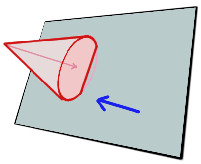
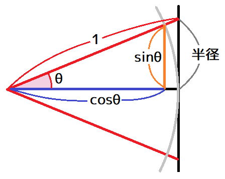
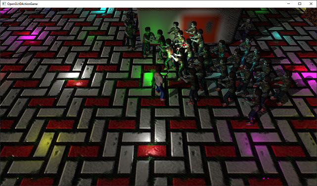

[OpenGL 3D 2020 第23回]

# スポットライトと円錐

## 習得目標

* 円錐と視錐台の交差判定
* GPUメモリに転送するデータを`vec4`にまとめる方法
* スポットライトの使い方

## 1. スポットライト

### 1.1 スポットライトとは

ポイントライト(点光源)を使うと、電球やろうそく、松明といった光源を表現することができます。しかし、世の中にある多くの光源を見渡してみると、その多くは一部もしくは大部分がシェードなどで隠されています。

例えば、懐中電灯や自動車のヘッドライトは正面の狭い範囲にだけ光が当たるようになっています。街灯の上側は覆いがかぶせられ、道路だけを照らすようになっています。

このような「光の一部分が<ruby>覆<rt>おお</rt></ruby>い隠されている光源」を「スポットライト」と言います。コンピューター・グラフィックスで現実のような光を表現するために、スポットライトはポイントライト以上に重要です。

### 1.2 スポットライト=円錐

角度によりますが、スポットライトの形状は「<ruby>円錐<rt>えんすい</rt></ruby>」にかなり近いものです。タイルにスポットライトが影響するかどうかを判定するためには「平面と円錐の交差判定」を行わなくてはなりません。

まずは「円錐」の構造体を定義しましょう。円錐は「先端座標`tip`(ティップ)」、「円錐の高さ`height`(ハイト)」、「円錐の向き`direction`(ディレクション)」、「底面の半径`radius`(レイディアス)」によって定義できます。

<p align="center">
<br>
</p>

これらをまとめて構造体にしていきます。円錐は英語で`Cone`(コーン)というので、構造体名は`Cone`とします。円錐と平面の交差判定を行う関数は`ConeInsidePlane`(コーン・インサイド・プレーン)としましょう。

`Actor.h`を開き、`Sphere`構造体の定義の下に次のプログラムを追加してください

```diff
   glm::vec3 center; // 球の中心座標.
   float radius;     // 球の半径.
 };
+
+/**
+* 円錐.
+*/
+struct Cone
+{
+  glm::vec3 tip; // 先端の座標.
+  float height;  // 円錐の高さ.
+  glm::vec3 direction; // 円錐の向き.
+  float radius;  // 底面の半径.
+};

 bool Intersect(const Segment& seg, const Plane& plane, glm::vec3* p);
 bool SphereInsidePlane(const Sphere& sphere, const Plane& plane);
+bool ConeInsidePlane(const Cone& cone, const Plane& plane);

 #endif // ACTOR_H_INCLUDED
```

<br><br>

<br><br>

### 1.3 ConeInsidePlane関数を定義する

<p align="center">
<br>
</p>

それでは交差判定を定義しましょう。幸いなことに、これは以下の2つの判定を行うだけです。

>1. 円錐の頂点が平面の表側にあれば、円錐は平面の表側に存在する。
>2. 裏側にあるとき、平面から円錐底部の中心までの距離が、底部の半径のマイナス値より大きければ、円錐は平面の表側に存在する.

この`2`について計算するには「底面から平面へ最短距離で向かうベクトル」を求めます。これには以下のように、外積の結果が「2つのベクトルに垂直なベクトルになる」という性質を利用します。

>1. 円錐の向きベクトルと平面の法線ベクトルの外積を計算 → 向きベクトルに垂直で平面と平行なベクトルが求まる。
>2. 向きベクトルと1で求めたベクトルの外積を計算 → 最短距離で向かうベクトルが求まる。

それでは、`Actor.cpp`を開き、球が平面の表側にあるか調べる関数の定義の下に、次のプログラムを追加してください。

```diff
   const float d = glm::dot(plane.normal, sphere.center - plane.point);
   return d >= -sphere.radius;
 }
+
+/**
+* 円錐が平面の表側にあるかどうかを調べる.
+*
+* @param cone   円錐.
+* @param plane  平面.
+*
+* @retval true  平面の表側にあるか、部分的に重なっている.
+* @retval false 完全に裏側にある.
+*/
+bool ConeInsidePlane(const Cone& cone, const Plane& plane)
+{
+  // 円錐の頂点が平面の表側にあれば判定終了.
+  if (glm::dot(plane.normal, cone.tip - plane.point) >= 0) {
+    return true;
+  }
+
+  // 平面の法線と円錐の向きに垂直なベクトルaを求める.
+  // これは平面に平行なベクトルになる.
+  const glm::vec3 a = glm::cross(plane.normal, cone.direction);
+
+  // 円錐の向きとベクトルaに垂直なベクトルを求める.
+  // これは底面の中心から平面への最短の向きベクトルになる.
+  const glm::vec3 b = glm::normalize(glm::cross(cone.direction, a));
+
+  // ベクトルbの方向の底面の端の座標qを求める.
+  const glm::vec3 q = cone.tip +
+    cone.direction * cone.height + b * cone.radius;
+
+  // 平面上の座標と底面の端の座標の間のベクトルcを計算.
+  const glm::vec3 c = q - plane.point;
+
+  // ベクトルcの平面の法線方向に射影した長さが0以上なら、qは表側にある.
+  return glm::dot(plane.normal, c) >= 0;
+}

 /**
 * アクターの衝突を処理する.
```

### 1.4 円錐と視錐台の交差判定を作成する

次に本命の円錐と視錐台の交差判定を書いていきます。といっても、基本的な作りは球と視錐台の交差判定と同じで、使う関数が違うだけです。

まずはサブフラスタムとの交差判定を書きましょう。関数名は`ConeInsideSubFrustum`(コーン・インサイド・サブフラスタム)とします。球と視錐台の交差判定を行う関数定義の下に、次のプログラムを追加してください。

```diff
   if (sphere.center.z + sphere.radius < frustum.zFar) {
     return false;
   }
   return SphereInsideSubFrustum(sphere, frustum.baseFrustum);
 }
+
+/**
+* 円錐とサブ視錐台の交差判定.
+*
+* @param cone    円錐.
+* @param frustum サブ視錐台.
+*
+* @retval true  衝突している.
+* @retval false 衝突していない.
+*/
+bool ConeInsideSubFrustum(const Cone& cone, const SubFrustum& frustum)
+{
+  for (const auto& plane : frustum.planes) {
+    if (!ConeInsidePlane(cone, plane)) {
+      return false;
+    }
+  }
+  return true;
+}

 /**
 * コンストラクタ.
```

サブフラスタムを構成する全ての平面との交差判定を行い、全てに合格したら交差しています。この流れは球の場合とまったく同じです。

続いてメインフラスタムとの交差判定を作成します。関数名は`ConeInsideFrustum`(コーン・インサイド・フラスタム)とします。サブフラスタムとの交差判定プログラムの下に、次のプログラムを追加してください。

```diff
     if (!ConeInsidePlane(cone, plane)) {
       return false;
     }
   }
   return true;
 }
+
+/**
+* 円錐と視錐台の交差判定.
+*
+* @param cone    円錐.
+* @param frustum 視錐台.
+*
+* @retval true  衝突している.
+* @retval false 衝突していない.
+*/
+bool ConeInsideFrustum(const Cone& cone, const Frustum& frustum)
+{
+  if (!ConeInsidePlane(cone, Plane{
+    glm::vec3(0, 0, frustum.zNear), glm::vec3(0, 0, -1) })) {
+    return false;
+  }
+  if (!ConeInsidePlane(cone, Plane{
+    glm::vec3(0, 0, frustum.zFar), glm::vec3(0, 0, 1) })) {
+    return false;
+  }
+  return ConeInsideSubFrustum(cone, frustum.baseFrustum);
+}

 /**
 * コンストラクタ.
```

この関数も、`SphereInsideFrustum`関数と見比べてみると、関数や引数の名前が違うだけでやっていることはまったく同じだということが分かります。なぜなら、どちらも「全ての平面と交差判定を行い、全て合格したら交差している」という仕組みを使うからです。

これで円錐と視錐台の交差判定は完成です。

### 1.5 スポットライトのパラメータ

スポットライトの底面は実際には球面なので、円錐とは微妙に形状が異なります。そのため、底面の半径のかわりに、円錐の頂点部分の角度を使用します。

<p align="center">
<br>
</p>

スポットライトは、ポイントライトに「ライトの向き」と「照らす角度」を追加することで表現できます。ライトの向きは`direction`(ディレクション)、照らす角度は`coneAngle`(コーン・アングル)という名前の変数にしましょう。

また、多くのスポットライトは<ruby>外縁部<rt>がいえんぶ</rt></ruby>にいくほど光が弱くなる傾向があります。そこで、明るさが減り始める角度を、`falloffAngle`(フォールオフ・アングル)という名前の変数として追加します。

`Light.h`を開き、`Light`構造体に次のプログラムを追加してください。

```diff
 struct Light
 {
   // ライトの種類.
   enum class Type {
     PointLight, // 点光源.
+    SpotLight,  // スポット光源.
   };
 
   std::string name;   // ライトの名前.
   Type type = Type::PointLight; // ライトの種類.
   glm::vec3 position; // 光を放つ位置.
   glm::vec3 color;    // ライトの色.
+  glm::vec3 direction;// 光を放つ方向.
+  float coneAngle;    // スポットライトが照らす角度(単位=ラジアン).
+  float falloffAngle; // スポットライトの減衰開始角度(単位=ラジアン).
 };
```

「ライトの向き」は`glm::vec3`型で、これは方向ベクトルになります。物体の姿勢は「3軸の回転角度」や「クォータニオン」、「行列」でも表現可能ですが、方向ベクトルが最も簡単にライティングを計算できるからです。

「照らす角度」と「減衰開始角度(明るさが減り始める角度)」はどちらも`float`型で、単位には「ラジアン」を使います。これも、コンピューターにとっては度数法より弧度法のほうが計算が簡単だからです。

### 1.6 スポットライトを追加する関数を定義する

現在の`LightManager`クラスには、ポイントライトを作成するメンバ関数しかありません。そこで、スポットライトを作成するメンバ関数を追加します。関数名は`CreateSpotLight`(クリエイト・スポットライト)とします。

`LightManager`クラスの定義に、次のように`CreateSpotLight`メンバ関数を宣言してください。

```diff
   LightManager& operator=(const LightManager&) = delete;

   LightPtr CreateLight(const glm::vec3& position, const glm::vec3& color);
+  LightPtr CreateSpotLight(const glm::vec3& position, const glm::vec3& color,
+    const glm::vec3& direction, float coneAngle, float falloffAngle);
   void RemoveLight(const LightPtr& light);
   LightPtr GetLight(size_t n) const;
   size_t LightCount() const;
```

続いて`CreateSoptLight`メンバ関数を定義します。`Light.cpp`を開き、`CreateLight`メンバ関数の定義の下に次のプログラムを追加してください。

```diff
   lights.push_back(p);
   return p;
 }
+
+/**
+* スポットライトを作成する.
+*
+* @param position     ライトの座標.
+* @param color        ライトの明るさ.
+* @param direction    ライトの方向.
+* @param coneAngle    スポットライトが照らす角度(単位=ラジアン).
+* @param falloffAngle スポットライトの減衰開始角度(単位=ラジアン).
+*
+* @return 作成したライトへのポインタ.
+*/
+LightPtr LightManager::CreateSpotLight(const glm::vec3& position, const glm::vec3& color,
+  const glm::vec3& direction, float coneAngle, float falloffAngle)
+{
+  LightPtr p = std::make_shared<Light>();
+  p->type = Light::Type::SpotLight;
+  p->position = position;
+  p->color = color;
+  p->direction = direction;
+  p->coneAngle = coneAngle;
+  p->falloffAngle = falloffAngle;
+  lights.push_back(p);
+  return p;
+}

 /**
 * ライトを削除する.
```

関数の内容としては、引数を`Light`構造体の対応するメンバ変数に代入しているだけです。

### 1.7 シェーダ用のライトデータにパラメータを追加する

CPU側で使う構造体だけにスポットライトの変数を追加しても、シェーダからは見えません。そこで、シェーダ用の`LightForShader`構造体にもスポットライトのパラメータを追加しましょう。

シェーダ用のデータは`vec4`単位で処理されるため、例えば`coneAngle`と`falloffAngle`はまとめて一つの`vec4`に代入すると、シェーダで効率的に処理できます。

また、これまではポイントライトしか使っていなかったので「ライトの種類」を設定しなくても問題はありませんでした。しかし、ポイントライトとスポットライトを使い分けるためには「ライトの種類」もシェーダに送らなくてはなりません。

ライトの種類は`int`か`float`が1つあれば表現できます。こういうパラメータは既存のメンバ変数の未使用部分に入れると効率的です。`position`メンバ変数は`xyz`要素しか使っていないので、`w`要素にライトの種類を代入することにします。

あと、前回のテキストで「ライトの範囲」をこっそり`color`の`w`要素に入れています。ついでなので、これも分かりやすいメンバ変数名に変えることにします。それでは、`LightForShader`構造体を次のように変更してください。

```diff
 * シェーダと同じ形式のライトデータ.
 */
 struct LightForShader
 {
-  glm::vec4 position;
-  glm::vec4 color;
+  glm::vec4 positionAndType;     // xyz=position, w=type
+  glm::vec4 colorAndRange;       // xyz=color, w=range
+  glm::vec4 direction;           // xyz=direction, w=(未使用)
+  glm::vec4 coneAndFalloffAngle; // x=coneAngle, y=falloffAngle, zw=(未使用)
 };

 /**
 * 描画に関係するライトの情報.
```

時間がたってからでも使い方を思い出せるように、コメントで「どの要素を何に使っているか」を書いておきます。

### 1.8 Updateメンバ関数をスポットライトに対応させる

シェーダ用ライトデータの作成は`Update`メンバ関数で行っています。`Update`メンバ関数を`LightForShader`構造体の変更に対応させましょう。

ポイントライトの場合、ビュー座標系に変換しなくてはならないのは中心座標だけでした。しかしスポットライトの場合は向きも変換しなくてはなりません。

また、視錐台との交差判定には、スポットライトをすっぽりと包む円錐を使います。円錐を定義するには底面の半径が必要です。これはライトの届く距離とライトが照らす角度から計算する必要があります。

これらの計算を、視錐台との交差判定のたびに行うのは時間の無駄です。球の場合は`posView`という配列にビュー座標だけを記録していましたが、円錐も扱えるように大幅に機能拡張することにします。

まず、交差判定で使用する球と円錐をまとめた構造体を定義します。計算過程で使用するデータなので、「中間」を意味する`Intermediate`(インターメディエイト)という単語を使って`IntermediateData`(インターメディエイト・データ)という名前にします。

`LightManager::Update`メンバ関数に次のプログラムを追加してください。

```diff
 void LightManager::Update(const FrustumPtr& frustum, const glm::mat4& matView)
 {
   // LightData構造体を作成.
   std::shared_ptr<LightData> lightData = std::make_unique<LightData>();
 
-  // ビュー座標系に変換したライト座標を記録するための配列.
+  // 計算過程で使う中間データ.
+  struct IntermediateData
+  {
+    // 形状の種類.
+    enum class Shape {
+      sphere, // 球.
+      cone,   // 円錐.
+    };
+    Shape collisionShape; // 交差判定に使う形状.
+    Sphere sphere;        // 球.
+    Cone cone;            // 円錐.
+  };
-  std::vector<glm::vec3> posView;
+  std::vector<IntermediateData> posView;
   posView.reserve(lights.size());

   // Light構造体をLightForShader構造体に変換.
   for (glm::uint i = 0; i < lights.size(); ++i) {
```

`IntermediateData`には球か円錐のいずれかのデータを記録します。どちらを記録したのかは`shape`(シェイプ)メンバ変数に設定します。

次にライトの向きを計算するための回転行列を作成します。行列から回転成分だけを取り出すには「インバース&トランスポーズ」を使えばよいのでした。中間データの配列を作成するプログラムの下に、次のプログラムを追加してください。

```diff
     Cone cone;            // 円錐.
   };
   std::vector<IntermediateData> posView;
   posView.reserve(lights.size());
+
+  // ライトの向きをビュー座標系に変換するための回転行列を作る.
+  const glm::mat3 matViewRot = glm::transpose(glm::inverse(glm::mat3(matView)));
 
   // Light構造体をLightForShader構造体に変換.
   for (glm::uint i = 0; i < lights.size(); ++i) {
     const LightPtr& e = lights[i];
```

ここからはライトの種類ごとに交差判定を行います。まず種類によって処理を分けます。ライトとメインフラスタムの交差判定プログラムに、次のプログラムを追加してください。

```diff
     // ライトの影響範囲を計算.
     const float range =
       sqrt(glm::max(e->color.r, glm::max(e->color.g, e->color.b))) * 3;

     // ライトの影響範囲とメインフラスタムの交差判定を行う.
+    if (e->type == Light::Type::PointLight) {
+      // ポイントライトの交差判定.
       if (SphereInsideFrustum(Sphere{ pos, range }, *frustum)) {
         // 交差しているのでライトを登録.
         // このとき、カラーのa要素にライトの影響範囲を入れておく.
         lightData->lights[posView.size()].position = glm::vec4(e->position, 1);
         lightData->lights[posView.size()].color = glm::vec4(e->color, range);
         posView.push_back(pos);

         // 登録数がライトの最大数以上になったら登録処理を終了する.
         if (posView.size() >= maxLightCount) {
           break;
         }
       }
+    } else if (e->type == Light::Type::SpotLight) {
+      // スポットライトの交差判定.
+    }
   }
 
   // すべてのサブフラスタムについて、登録されたライトとの交差判定を行う.
   for (int y = 0; y < tileCountY; ++y) {
```

それでは、ポイントライトの交差判定を`IntermediateData`構造体に対応させましょう。ポイントライトの交差判定プログラムを次のように変更してください。

```diff
     // ライトの影響範囲とメインフラスタムの交差判定を行う.
     if (e->type == Light::Type::PointLight) {
       // ポイントライトの交差判定.
+      const Sphere sphere = { pos, range };
-      if (SphereInsideFrustum(Sphere{ pos, range }, *frustum)) {
+      if (SphereInsideFrustum(sphere, *frustum)) {
         // 交差しているのでライトを登録.
-        // このとき、カラーのa要素にライトの影響範囲を入れておく.
-        lightData->lights[posView.size()].position = glm::vec4(e->position, 1);
-        lightData->lights[posView.size()].color = glm::vec4(e->color, range);
-        posView.push_back(pos);
+        lightData->lights[posView.size()].positionAndType = 
+          glm::vec4(e->position, static_cast<float>(Light::Type::PointLight));
+        lightData->lights[posView.size()].colorAndRange = glm::vec4(e->color, range);

+        // 中間データを登録.
+        IntermediateData intermediate;
+        intermediate.shape = IntermediateData::Shape::sphere;
+        intermediate.sphere = sphere;
+        posView.push_back(intermediate);
+
         // 登録数がライトの最大数以上になったら登録処理を終了する.
         if (posView.size() >= maxLightCount) {
           break;
         }
       }
     } else if (e->type == Light::Type::SpotLight) {
```

次に円錐と視錐台の交差判定を作成します。円錐底面の半径は、ライトの影響範囲を表す`range`と、ライトが照らす角度から計算します。

影響範囲が`1`、照らす角度を`θ`とすると、半径は以下の図のように表されます。

<p align="center">
<br>
</p>

この図から分かるように、「底面の半径」は次の式で求めることができます。

>`sinθ * 影響範囲 / cosθ`

また、上記の式からは`θ`が大きい場合に、底面の半径が非常に長くなることが予想されます。その結果、円錐とスポットライト形状は<ruby>著<rt>いちじる</rt></ruby>しく異なってしまいます。

目安は、`coneAngle`を45度以下にすることです。それ以上は円錐では近似できません。

底面の半径が計算できれば、あとは難しくありません。スポットライトの交差判定に次のプログラムを追加してください。

```diff
         if (posView.size() >= maxLightCount) {
           break;
         }
       }
     } else if (e->type == Light::Type::SpotLight) {
+      // スポットライトの交差判定.
+
+      // ビュー座標系のライトの向きを計算.
+      const glm::vec3 dir = matViewRot * e->direction;
+
+      // 影響範囲と照らす角度から円錐底面の半径を計算.
+      const float radius =
+        std::sin(e->coneAngle) * range / std::cos(e->coneAngle);
+
+      const Cone cone = { pos, range, dir, radius };
+      if (ConeInsideFrustum(cone, *frustum)) {
+        // 交差しているのでスポットライトを登録.
+        lightData->lights[posView.size()].positionAndType = 
+          glm::vec4(e->position, static_cast<float>(Light::Type::SpotLight));
+        lightData->lights[posView.size()].colorAndRange = glm::vec4(e->color, range);
+        lightData->lights[posView.size()].direction = glm::vec4(e->direction, 1);
+        lightData->lights[posView.size()].coneAndFalloffAngle =
+          glm::vec4(e->coneAngle, e->falloffAngle, 0, 1);
+
+        // 中間データを登録.
+        IntermediateData intermediate;
+        intermediate.shape = IntermediateData::Shape::cone;
+        intermediate.cone = cone;
+        posView.push_back(intermediate);
+
+        // 登録数がライトの最大数以上になったら登録処理を終了する.
+        if (posView.size() >= maxLightCount) {
+          break;
+        }
+      }
     }
   }
 
   // すべてのサブフラスタムについて、登録されたライトとの交差判定を行う.
   for (int y = 0; y < tileCountY; ++y) {
```

プログラムの基本的な部分はポイントライトと同じですが、スポットライトはポイントライトより多くのデータを必要とするため、設定するデータの数が増えています。

これで、メインフラスタムの交差判定がスポットライトを処理できるようになりました。

### 1.9 サブフラスタムとスポットライトの交差判定を作成する

続いて、サブフラスタムの交差判定をスポットライトに対応させます。ライトとサブフラスタムの交差判定プログラムを、次のように変更してください。波括弧の数がかなり多いので、括弧の数に注意してください。

```diff
   // すべてのサブフラスタムについてループ
   for (int y = 0; y < tileCountY; ++y) {
     for (int x = 0; x < tileCountX; ++x) {
       const SubFrustum& f = frustum->tiles[y][x];
       glm::uint count = 0; // タイルに影響するライト数.

       // すべての登録済みライトについてループ.
       for (glm::uint i = 0; i < posView.size(); ++i) {
         // ライトの影響範囲とサブフラスタムの交差判定を行う.
+        const IntermediateData::Shape shape = posData[i].shape;
+        if (shape == IntermediateData::Shape::sphere) {
-          if (SphereInsideSubFrustum(Sphere{ posView[i].position,
-            posView[i].range }, f)) {
+          if (SphereInsideSubFrustum(posView[i].sphere, f)) {
             // ライトのインデックスをタイルのインデックス配列に追加.
             lightData->lightIndices[y][x][count] = i;
             ++count; // タイルに影響するライト数をインクリメント.

             // インデックス配列が満杯になったらこのタイルは終了.
             // この警告が毎回出るようなら配列サイズを調整すること.
             if (count >= 128) {
               std::cerr << "[情報]" << __func__ <<
                 "サイズ不足[" << y << "][" << x << "]\n";
               break;
             }
           }
+        } else if (shape == IntermediateData::Shape::cone) {
+          if (ConeInsideSubFrustum(posView[i].cone, f)) {
+            // ライトのインデックスをタイルのインデックス配列に追加.
+            lightData->lightIndices[y][x][count] = i;
+            ++count; // タイルに影響するライト数をインクリメント.
+
+            // インデックス配列が満杯になったらこのタイルは終了.
+            // この警告が毎回出るようなら配列サイズを調整すること.
+            if (count >= 128) {
+              std::cerr << "[情報]" << __func__ <<
+                "サイズ不足[" << y << "][" << x << "]\n";
+              break;
+            }
+          }
+        }
       }
       // タイルに影響するライト数を設定.
       lightData->lightCounts[y][x] = count;
     }
   }
```

これで、スポットライトを影響するタイルに割り当てられるようになりました。

### 1.10 フラグメントシェーダをスポットライトに対応させる

GPUに転送するデータを変更したので、それを受け取るシェーダのほうも変更していきます。まずライトの種類を示す変数を追加しましょう。`FragmentLighting.frag`を開き、次のプログラムを追加してください。

```diff
 const uvec2 screenSize = uvec2(1280, 720); // 画面の大きさ.
 const vec2 tileSize =
   vec2(screenSize) / vec2(tileCount); // 分割区画の大きさ.
+
+// ライトの種類.
+const float Type_PointLight = 0;
+const float Type_SpotLight = 1;

 /**
 * シェーダ用のライトデータ.
 ```

続いて、`LightForShader`を次のように変更してください。

 ```diff
 const float Type_SpotLight = 1;

 /**
 * シェーダ用のライトデータ.
 */
 struct LightForShader
 {
-  vec4 position;
-  vec4 color;
+  vec4 positionAndType;     // ライトの座標と種類.
+  vec4 colorAndRange;       // ライトの色(明るさ)と、光の届く範囲.
+  vec4 direction;           // ライトが照らす方向.
+  vec4 coneAndFalloffAngle; // スポットライトが照らす角度と減衰開始角度.
 };

 /**
 * SSBOに転送するデータの形式.
```

とりあえず変数名の変更に対応しましょう。ライトの明るさを計算する`for`ループを次のように変更してください。

```diff
     // ライトのインデックスを取得.
     uint lightIndex = lightIndices[tileId.y][tileId.x][i];

     // フラグメントからライトへ向かうベクトルを計算.
-    vec3 lightVector = lights[lightIndex].position.xyz - inPosition;
+    vec3 lightVector =
+      lights[lightIndex].positionAndType.xyz - inPosition;
 
     // 距離による明るさの変化量を計算.
     float lengthSq = dot(lightVector, lightVector);
     float intensity = 1.0 / (1.0 + lengthSq);
 
     // 範囲外に光が影響しないように制限する.
     const float fallOff = 0.75; // 減衰を開始する距離(比率).
-    float range = lights[lightIndex].color.a;
+    float range = lights[lightIndex].colorAndRange.a;
     float attenuation = 1 - smoothstep(range * fallOff, range, sqrt(lengthSq));
     intensity *= attenuation;

     // 面の傾きによる明るさの変化量を計算.
     float theta = 1;
     if (lengthSq > 0) {
       vec3 direction = normalize(lightVector);
       theta = max(dot(worldNormal, direction), 0);
     }
 
     // 変化量をかけ合わせて明るさを求め、ライトの明るさ変数に加算.
     totalLightColor +=
-      lights[lightIndex].color.rgb * theta * intensity;
+      lights[lightIndex].colorAndRange.rgb * theta * intensity;
   }

   fragColor = inColor * texture(texColor, inTexcoord);
   fragColor.rgb *= totalLightColor;
```

次に、スポットライトの向きと照らす角度による明るさの変化を付け加えます。これは以下の手順で行います。

>1. 内積を使って、ライトからフラグメントへ向かうベクトル(`-lightVector`)と、ライトの向きベクトルのなす角を計算。
>2. 1の計算結果がライトが照らす角度以上なら、スポットライトはフラグメントに当たっていない。
>3. ライトが照らす角度未満なら、減衰開始角度との間で`smoothstep`補間して明るさを計算。

`1`では内積の結果が`cosθ`になることを利用します。そのうえで、`cosθ`から`θ`を計算する`acos`(エー・コス、アーク・コサイン)関数を使って角度を求めます。

ライトの明るさを計算する`for`ループに次のプログラムを追加してください。

```diff
     // 範囲外に光が影響しないように制限する.
     const float fallOff = 0.75; // 減衰を開始する距離(比率).
     float range = lights[lightIndex].colorAndRange.a;
     float attenuation = 1 - smoothstep(range * fallOff, range, sqrt(lengthSq));
     intensity *= attenuation;
+
+    // スポットライトの場合、円錐の外周部の減衰を計算する.
+    if (lights[lightIndex].positionAndType.w == Type_SpotLight) {
+      vec3 direction = lights[lightIndex].direction.xyz;
+      float coneAngle = lights[lightIndex].coneAndFalloffAngle.x;
+
+      // ライトからフラグメントへ向かうベクトルと、スポットライトのベクトルのなす角が
+      // ライトが照らす角度以上なら範囲外.
+      float angle = acos(dot(direction, normalize(-lightVector)));
+      if (angle >= coneAngle) {
+        continue;
+      }
+
+      // 減衰開始角度と外周角度の間で補間.
+      float falloffAngle = lights[lightIndex].coneAndFalloffAngle.y;
+      intensity *= smoothstep(coneAngle, falloffAngle, angle);
+    }

     // 面の傾きによる明るさの変化量を計算.
     float theta = 1;
     if (lengthSq > 0) {
```

これでスポットライトが描画されるようになりました。

### 1.11 スポットライトを使う

それではスポットライトを表示してみましょう。プレイヤーの正面方向を照らす懐中電灯を作ってみようと思います。プレイヤーの向きに合わせて角度を変えられるように、ライトのポインタ変数を用意します。

`MainGameScene.h`を開き、次のプログラムを追加してください。

```diff
   std::shared_ptr<FramebufferObject> fboMain;

   Light::LightManagerPtr lightManager;
   Light::FrustumPtr frustum;
+  Light::LightPtr flashLight; // 懐中電灯
 };

 #endif // MAINGAMESCENE_H_INCLUDED
```

`flashLight`(フラッシュ・ライト)は「懐中電灯」のことです。

次に`flashLight`変数にスポットライトを割り当てます。`MainGameScene.cpp`を開き、`Initialize`メンバ関数に次のプログラムを追加してください。

```diff
     lightManager->CreateLight(glm::vec3(x, 1.0f, z),
       glm::vec3(c & 1, (c >> 1) & 1, (c >> 2) & 1) * intencity);
   }
+
+  // 懐中電灯を作成.
+  flashLight = lightManager->CreateSpotLight(
+    playerActor->position + glm::vec3(0, 1.2f, 0),
+    glm::vec3(1, 0.9f, 0.8f) * 10.0f, glm::vec3(1, 0, 0),
+    glm::radians(20.0f), glm::radians(5.0f));

   // ゲームデータの初期設定.
   GameData& gamedata = GameData::Get();
   gamedata.killCount = 0;
```

次にライトの状態を更新します。`Update`メンバ関数の末尾に次のプログラムを追加してください。

```diff
   UpdateSpriteList(sprites, deltaTime);
   spriteRenderer.Update(sprites, matView);
+
+  // 懐中電灯の状態を更新.
+  if (flashLight) {
+    // 懐中電灯の位置をプレイヤーと合わせる.
+    flashLight->position = playerActor->position + glm::vec3(0, 1.2f, 0);
+
+    // 懐中電灯の向きをプレイヤーと合わせる.
+    flashLight->direction = glm::rotate(glm::mat4(1),
+      playerActor->rotation.y, glm::vec3(0, 1, 0)) * glm::vec4(1, 0, 0, 1);
+  }

   // ライトマネージャを更新.
   lightManager->Update();
 }
```

それと、プレイヤーが死んでいたら懐中電灯を削除しましょう。`ProcessInput`メンバ関数にあるプレイヤーの死亡判定プログラムに、次のプログラムを追加してください。

```diff
   // プレイヤーが死んでいたら
   if (!isGameOver) {
     if (playerActor->state == Actor::State::dead) {
+      // 懐中電灯を削除する.
+      if (flashLight) {
+        lightManager->RemoveLight(flashLight);
+        flashLight.reset();
+      }
       // アニメーションが終了していたらゲームオーバーにする.
       if (playerActor->animationNo >= playerActor->animation->list.size() - 1) {
```

プログラムが書けたらビルドして実行してください。プレイヤーの正面方向に懐中電灯の光が見えていたら成功です。

スポットライトが見えにくい場合は、ディレクショナルライトとアンビエントライトを暗くするとよいでしょう。

<p align="center">
<br>
</p>

<pre class="tnmai_assignment">
<strong>【課題01】</strong>
以下のURLから<code>street_lamp_a.obj</code>と<code>street_lamp_a.tga</code>をダウンロードし、家の周囲に4つ配置しなさい。
<code>https://github.com/tn-mai/OpenGL3D2020/tree/master/Res</code>
</pre>

<pre class="tnmai_assignment">
<strong>【課題02】</strong>
課題01で配置した4つの街灯の先端にスポットライトを配置しなさい。スポットライトの向きは真下とします。色と照らす角度は自由ですが、最低限地面を照らせる明るさにしてください。
</pre>

>**【まとめ】**<br>
>
>* ポイントライトだけでは現実のライトを再現しきれないため、スポットライトのような特殊な光源が必要となる。
>* 円錐と平面の交差は、先端座標の交差判定と底面の交差判定の2つの計算によって判定できる。
>* 円錐をスポットライトに近似した図形として使うためには、照らす角度を45度以下にすることが望ましい。
