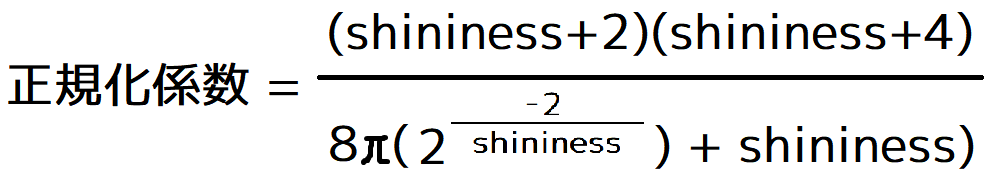
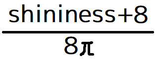
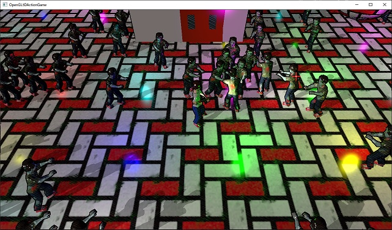
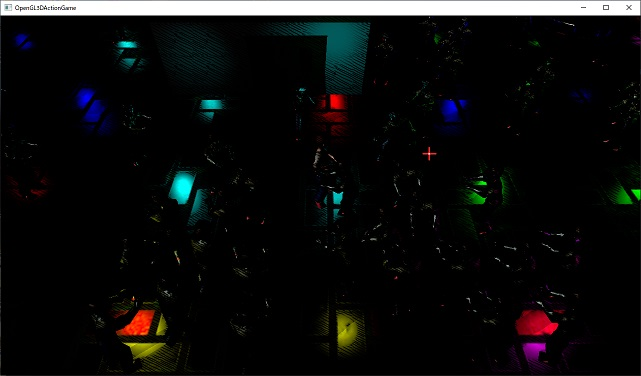
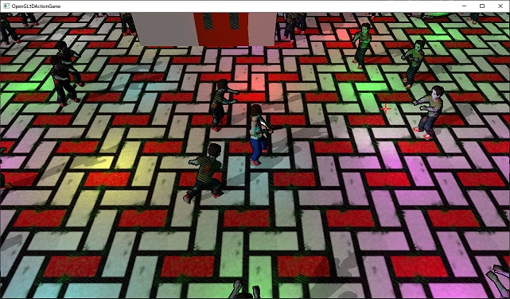
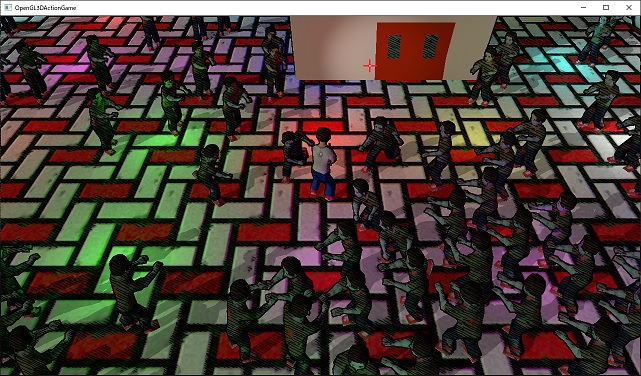
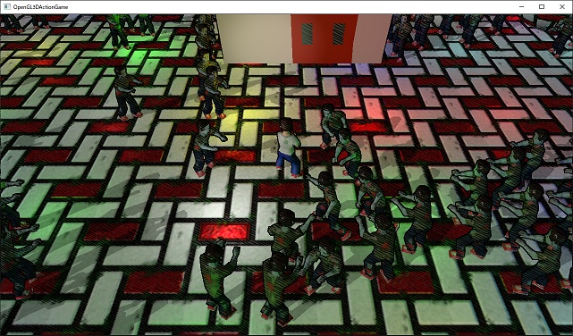

[OpenGL 3D 2020 第24回]

# めぐりあい<ruby>鏡面反射<rt>スペキュラ</rt></ruby>

## 習得目標

* 拡散反射と鏡面反射の違い
* Blinn-Phong(ブリン・フォン)反射モデル
* 物理的に正しいレンダリング
* テクスチャを使って物体の滑らかさを設定する

## 1. 鏡面反射

### 1.1 なめらかな物体は鏡のように光を反射する

これまでの描画では「拡散反射(かくさんはんしゃ)」という要素だけを扱ってきました。拡散反射は、めちゃくちゃざらざらな物体の表面で起こる光の反射を表しています。

しかし、現実の物体はざらざらなものばかりではなく、つるつるな物体も存在します。つるつる、は「なめらか」と言い換えることができるでしょう。

なめらかな物体の表面では、拡散反射はほとんど起こりません。その代わりに「鏡面反射(きょうめんはんしゃ)」が起こります。

鏡面反射は、名前に「鏡」が含まれていることから分かるように、鏡のようになめらかな面における光の反射を表します。鏡面反射は英語では「Specular(スペキュラ)」と言います

物体表面で起こる光の反射は「拡散反射」と「鏡面反射」を合成したものと考えられます。表面がざらざらな物体では拡散反射の比率が高くなり、なめらかな物体では鏡面反射の比率が高くなります。

また、その中間の「ざらざらともつるつるとも言えない物体」では、拡散反射と鏡面反射は1:1の比率で合成されます。

このように、物体表面のなめらかさを「拡散反射と鏡面反射を合成する比率」として表すと、さまざまななめらかさの物体を表現できるようになります。

### 1.2 <ruby>Blinn-Phong<rt>ブリン・フォン</rt></ruby>反射モデル

拡散反射にはランバートさんが考案した「ランバート反射」を使いました。ランバート反射は鏡面反射を表現できないので、別の計算式を使わなくてはなりません。

鏡面反射を表現するための式はいくつも考案されていますが、今回はその中でも比較的簡単に作成できる「Blinn-Phong(ブリン・フォン)反射モデル」を作成します。

「Blinn-Phong反射モデル」は、Bui Tuong Phong(ブイ・トゥオン・フォン)博士が開発したPhong反射モデルを、Jim Blinn(ジム・ブリン)博士が改良したものです。

Phong反射モデルは、

>光の入射方向と法線から、光が最も強く反射される方向ベクトルR(アール)を計算し、Rと視線方向のなす角に応じて明るさを変化させる

モデルです。

このモデルは、表面のなめらかさによって明るさを変化させる方法を変えられるようになっています。それによってざらざらな素材もつるつるな素材も表現できるというわけです。

しかし、Phong反射モデルには、「方向ベクトルRの計算に時間がかかる」、「Rと視線のなす角を内積で求めているため、光源のある方向から物体を見る場合を適切に扱えない」という2つの問題がありました。

この欠点を改良したのがBlinn-Phong反射モデルです。Blinn-Phong反射モデルは、

>光の入射方向と視線方向のちょうと中間の方向を指すベクトルH(エイチ)を計算し、Hと視線方向のなす角に応じて明るさを変化させる

モデルです。ベクトルRをベクトルHで置き換えただけなのですが、これが上記2つの問題を解決し、さらにより物理的に正しい反射を作り出すことにつながっています。

まず「2つのベクトルの中間方向」は2つのベクトルを足して正規化すれば計算できます。これは複雑な計算を伴うベクトルRよりかなり高速です。

次に「高原のある方向から物体を見る場合」ですが、光の入射方向と視線方向がなす角は最大でも180度を超えません。そのため、どこから物体を見てもベクトルHが90度を超えることはないので、常に内積で角度を計算できます。

また、どんなになめらかに見える物体であっても、その表面には微細な<ruby>凹凸<rt>おうとつ</rt></ruby>が存在します。これは、「光が最も強く反射される方向」が視線方向によって変化することを意味します。

つまり「光が最も強く反射される方向」は光の入射角と視線の方向によって変わるのです。ベクトルHの計算方法はこの性質を表現しているわけです。

これらのことから、Blinn-Phong反射モデルは、単なるPhong反射モデルの代用品ではなく、より物理的に正しい反射モデルだと考えられます。

### 1.3 FragmentLighting.fragに視点座標を追加する

鏡面反射では、光の入射方向と視点の方向から反射率を計算します。鏡面反射には「物体を見る角度によって反射率が大きく変化する」という特徴があるからです。

視点の方向はフラグメントの座標によって異なるので、シェーダで計算しなくてはなりません。そこで、まずはシェーダに視点座標のユニフォーム変数を追加しましょう。

加えて、後々の計算で必要となるπも定義しておきます。GLSLにはπを表す定数も関数もないため、必要なら自分で定義しなくてはなりません。

変数名は`viewPosition`(ビュー・ポジション)とします。`FragmentLighting.frag`を開き、次のプログラムを追加してください。

```diff
 // 環境光
 layout(location=6) uniform vec3 ambientLight;
+
+// 視点座標
+layout(location=7) uniform vec3 viewPosition;
+
+// 円周率.
+const float PI = 3.14159265359;

 const uvec2 screenSize = uvec2(1280, 720); // 画面の大きさ.
 const uvec2 tileCount = uvec2(8, 4); // 視錐台の分割数.
 const vec2 tileSize =
```

`ambientLight`(アンビエント・ライト)は`vec3`型で、ロケーション番号は`6`です。`vec3`型に必要なロケーション数は1個なので、次に使えるロケーション番号は`6+1`で`7`番です。

そこで、`viewPosition`のロケーション番号は`7`としました。

次にこのユニフォーム変数にデータを転送する関数を書きましょう。ユニフォーム変数は`Shader::Pipeline`クラスが管理していますので、ここに追加します。関数名は`SetViewPosition`(セット・ビュー・ポジション)でいいでしょう。

`Shader.h`を開き、次のプログラムを追加してください。

```diff
   bool SetLight(const PointLight& light) const;
   bool SetAmbientLight(const glm::vec3& color) const;
   bool SetMorphWeight(const glm::vec3& weight) const;
+  bool SetViewPosition(const glm::vec3& position) const;

 private:
   GLuint id = 0;
   GLuint vp = 0;
```

続いて`Shader.cpp`を開き、`SetMorphWeight`メンバ関数の定義の下に次のプログラムを追加してください。

```diff
     std::cerr << "[エラー]" << __func__ << ":モーフィング合成比率の設定に失敗.\n";
     return false;
   }
   return true;
 }
+
+/**
+* シェーダに視点座標を設定する.
+*
+* @param position 設定する視点座標.
+*
+* @retval true  設定成功.
+* @retval false 設定失敗.
+*/
+bool Pipeline::SetViewPosition(const glm::vec3& position) const
+{
+  glGetError(); // エラー状態をリセット.
+
+  const GLint locViewPosition = 7;
+  glProgramUniform3f(fp, locViewPosition, position.x, position.y, position.z);
+  if (glGetError() != GL_NO_ERROR) {
+    std::cerr << "[エラー]" << __func__ << ":視点座標の設定に失敗.\n";
+    return false;
+  }
+  return true;
+}

 /**
 * プログラムパイプラインのバインドを解除する.
```

これでフラグメントシェーダに視点座標を設定できるようになりました。

### 1.4 FragmentLighting.fragに鏡面反射率の計算を追加する

それでは鏡面反射率を計算していきましょう。鏡面反射率は、アンビエントライトを除く全ての種類のライトで計算しなくてはなりません。そこで、鏡面反射率を計算する関数として定義することにします。

関数名は`computeSpecular`(コンピュート・スペキュラ)とします。`FragmentLighting.frag`を開き、`LightData`ブロックの定義の下に次のプログラムを追加してください。

```diff
   uint lightCounts[tileCount.y][tileCount.x];
   Light lights[maxLightCount];
 };
+
+/**
+* スペキュラを計算する(Blinn-Phong).
+*
+* @param L          光の入射方向.
+* @param N          フラグメントの法線.
+* @param V          視線ベクトル.
+* @param shininess  光沢係数.
+* @param normalizationFactor 正規化係数.
+*
+* @return 鏡面反射率.
+*/
+float computeSpecular(vec3 L, vec3 N, vec3 V, float shininess, float normalizationFactor)
+{
+  // ハーフベクトルを計算.
+  vec3 H = normalize(L + V);
+
+  // ハーフベクトルと視線ベクトルのなす角を計算.
+  float theta = max(dot(N, H), 0);
+
+  // 正規化Blinn-Phong反射モデルによって鏡面反射率を計算.
+  return pow(theta, shininess) * normalizationFactor;
+}

 // フラグメントシェーダプログラム
 void main()
 {
```

`pow`(パウ)は「べき乗」を計算する関数です。

<p><code class="tnmai_code"><strong>【書式】</strong><br>
genType pow(べき乗の底, べき乗の指数);
</code></p>

`Blinn-Phong`反射モデルは、べき乗を使うことで、反射率が「ハーフベクトルと視線ベクトルのなす角」に反比例するようにしたものといえます。

べき乗の指数は`shininess`(シャイニネス)引数です。`shininess`は「鏡面反射のするどさ」を表すパラメータで、「なめらかさ」から計算されます。

取りうる値は最小が`1`で、最大は`∞`(無限大)です。`float`型の精度の問題から、多くのゲームでは最大を`2000`から`10000`程度にしているようです。

もうひとつ注意が必要なのは`normalizationFactor`(ノーマリゼーション・ファクター)引数です。`normalizationFactor`を日本語に訳すと「<ruby>正規化係数<rt>せいきか けいすう</rt></ruby>」となります。

先に説明したように、`Blinn-Phong`反射モデルでは「べき乗」によって鏡面反射を表現します。しかし、単純に「べき乗」するだけだと、反射する光の量が減ってしまうという問題があります。

そこで、指数に応じた係数を掛けることで、反射する光の量を一定にすることが考えられました。これが正規化係数です。

`shininess`と同様に、正規化係数も「なめらかさ」から自動的に計算することができます。

### 1.5 平行光源の鏡面反射を計算する

それでは、`computeSpecular`関数を使って、平行光源の鏡面反射を計算しましょう。まずは鏡面反射のための様々なパラメータを準備します。`FragmentLighting.frag`の`main`関数の先頭に、次のプログラムを追加してください。

```diff
 // フラグメントシェーダプログラム
 void main()
 {
+  float smoothness = 0.5; // なめらかさ
+  float shininess = exp2(smoothness * 12 + 1); // 光沢度
+
+  // Blinn-Phong反射モデルの正規化係数を計算.
+  float normalizationFactor = (shininess + 8) / (8.0 * PI);
+
+  vec3 viewVector = normalize(viewPosition - inPosition); // 視線ベクトル
   vec3 worldNormal = normalize(inNormal);
   vec3 totalLightColor = ambientLight;
+  vec3 totalSpecularColor = vec3(0); // 全てのライトの鏡面反射の合計

  // 平行光源
  {
    float theta = max(dot(worldNormal, -directionalLight.direction.xyz), 0);
```

光沢度`shininess`(シャイニネス)は数字の範囲が大きすぎるため、人間が直感的に扱うには向いていません。そこで「なめらかさ」を表す`smoothness`(スムースネス)という変数を用意しました。

シャイニネスはスムースネスを指数とした「2のべき乗」の値として計算されます。2のべき乗は`exp2`(イーエックスピー・ツー)という関数で計算することができます。

<p><code class="tnmai_code"><strong>【書式】</strong><br>
genType exp2(べき乗の指数);
</code></p>

シャイニネスが取りうる値の範囲は、例えばBATTLE FIELD 3やDontnodでは2～2048、COD Black OpsやFarCry3では1～8192のようです。大きな数値を使えるようにすると、より鋭い反射を扱えるかわりに細かい調整がやりにくくなります。

今回は中間を取って2～8192の範囲にしてみました。

`Blinn-Phong`反射モデルの正規化係数は次の式で計算できます。

<p align="center">

</p>

この式は、そのままリアルタイム・コンピュータ・グラフィックスで使うにはかなり複雑です。そこで、「細かく見ると違っているが、おおよそ同じ結果になる簡単な式」が考案されました。それが以下の式です。

<p align="center">

</p>

非常に簡単になっていますね。しかし、最初の複雑な式とほとんど同じ結果を返してくれます。

次に`computeSpecular`関数を使って鏡面反射を計算します。平行光源の計算に次のプログラムを追加してください。

```diff
   // 平行光源
   {
     float theta = max(dot(worldNormal, -directionalLight.direction.xyz), 0);
     totalLightColor += directionalLight.color.rgb * theta;
+
+    totalSpecularColor += directionalLight.color.rgb * theta *
+      computeSpecular(-directionalLight.direction.xyz, worldNormal, viewVector,
+      shininess, normalizationFactor);
   }

   // 点光源
   uvec2 tileId = uvec2(gl_FragCoord.xy * (vec2(1) / tileSize));
```

鏡拡散反射と同様に、面反射でも`theta`(シータ)が`0`以下の場合は鏡面反射が起こらないようにしています。`theta`が`0`以下というのは光源が面の後ろ側にあることを意味するので、光が当たることはありえないからです。

### 1.6 ポイントライトとスポットライトの鏡面反射を計算する

続いて、ポイントライト及びスポットライトの鏡面反射を計算します。明るさを計算する`for`ループの末尾に、次のプログラムを追加してください。

```diff
     // 変化量をかけ合わせて明るさを求め、ライトの明るさ変数に加算.
     totalLightColor += lights[lightIndex].colorAndRange.rgb * theta * intensity;
+
+    totalSpecularColor += lights[lightIndex].colorAndRange.rgb * theta * intensity *
+      computeSpecular(normalize(lightVector), worldNormal, viewVector,
+      shininess, normalizationFactor);
   }

   fragColor = inColor * texture(texColor, inTexcoord);
   fragColor.rgb *= totalLightColor;
```

最後に、計算した鏡面反射をフラグメントの色に反映します。

```diff
     // 変化量をかけ合わせて明るさを求め、ライトの明るさ変数に加算.
     totalLightColor += lights[lightIndex].colorAndRange.rgb * theta * intensity;
   }

   fragColor = inColor * texture(texColor, inTexcoord);
-  fragColor.rgb *= totalLightColor;
+  fragColor.rgb *= totalLightColor * (1 - smoothness); // 乗算.
+  fragColor.rgb += totalSpecularColor * smoothness; // 加算.
 }
```

拡散反射が物体の色と乗算しているのに対して、鏡面反射は単に足されている、という点に注意してください。なぜこうなっているのかというと、物体が金属以外の場合、鏡面反射は物体の色の影響を受けないからです。

また、拡散反射に`1 - smoothness`を掛け、鏡面反射に`smoothness`を掛けることで、反射する光の総量が入射する光の総量を超えないようにしています。

この計算は物理的には全く正しくありません。また、物体が金属の場合は大きく計算方法が違ってきます。より物理的に正しい計算については、また後ほど説明します。

>**【二色性反射モデル】**<br>
>物体が反射する光を「拡散反射と鏡面反射の合計」で表す方法を「<ruby>二色性反射<rt>にしょくせいはんしゃ</rt></ruby>モデル」といいます。<br>

プログラムが書けたらビルドして実行してください。あらゆる物体に鏡面反射によるライトの形が見えていたら成功です。

<p align="center">

</p>

<pre class="tnmai_assignment">
<strong>【課題01】</strong>
<code>smoothness</code>に<coce>0.1</code>を設定して実行し、見え方の変化を確認しなさい。次にと<code>0.9</code>を設定して同様に確認しなさい。
確認したら0.5に戻しなさい。
</pre>

>**【まとめ】**<br>
>
>* 光の反射には「拡散反射」と「鏡面反射」がある。
>* Blinn-Phong反射モデルは鏡面反射を表現する方法のひとつ。
>* 物体の「なめらかさ」によって光の反射具合が違う。

<div style="page-break-after: always"></div>

## 2. 金属と非金属の違い

### 2.1 導体と誘電体

鏡面反射を導入した結果、綺麗な反射が得られるようになりました。しかし、「どこがどうとは言えないけど現実の見え方とは違う」と感じたのではないでしょうか。

それは、拡散反射と鏡面反射を合計する時に考慮すべき「反射の性質を決める重要な要素」に漏れがあるからです。この「重要な要素」とは

>物体が金属なのか、非金属なのか

という要素です。

1章でも少し触れましたが、金属と非金属では光の反射の計算方法を変えなくてはなりません。なぜなら、

>光は電磁波の一種なので、電気を通す物体と通さない物体では、ふるまいが異なる

からです。物理の用語では「電気を通す物質」は「<ruby>導体<rt>どうたい</rt></ruby>」、「電気を通さない物質」は「<ruby>誘電体<rt>ゆうでんたい</rt></ruby>」と呼ばれます。

>**【誘電体≒絶縁体】**<br>
>誘電体は「絶縁体」とほぼ同義です。「物質内の自由に動ける電荷の有無」という視点で考える場合に、「絶縁体」ではなく「誘電体」と呼ばれます。

この用語を使うと、反射光の計算は以下のように説明できます。

| 材質 | 反射光の性質 |
|:----------:|:-------------|
| 導体       | 鏡面反射のみで拡散反射はしない。鏡面反射は光の色と物体の色の両方が影響する。 |
| 誘電体     | 拡散反射と鏡面反射の合成。鏡面反射は光の色だけが反映され、物体の色は影響しない。 |

ゲームなどのリアルタイム・コンピュータ・グラフィックスでは、この性質を`metallic`(メタリック、金属度)という数値で表現します。

### 2,2 金属パラメータを追加する

それではシェーダに`metallic`変数を追加し、材質による反射の違いを表現してみましょう。

`main`関数の先頭に次のプログラムを追加してください。

```diff
 // フラグメントシェーダプログラム
 void main()
 {
+  float metallic = 1;     // 0=誘電体(非金属) 1=導体(金属)
   float smoothness = 0.5; // なめらかさ(鏡面反射の割合)
   float shininess = exp2(smoothness * 10 + 3); // 光沢度
```

続いて、シェーダの最後でフラグメントの色を計算するプログラムを、次のように変更してください。

```diff
     // 変化量をかけ合わせて明るさを求め、ライトの明るさ変数に加算.
     totalLightColor += lights[lightIndex].colorAndRange.rgb * theta * intensity;
   }

   fragColor = inColor * texture(texColor, inTexcoord);
-  fragColor.rgb *= totalLightColor * (1 - smoothness); // 乗算.
-  fragColor.rgb += totalSpecularColor * smoothness; // 加算.
+  vec3 diffuse  = fragColor.rgb * (1 - metallic);
+  vec3 specular = mix(vec3(1), fragColor.rgb, metallic);
+  fragColor.rgb = (diffuse * totalLightColor) + (specular * totalSpecularColor);
 }
```

`diffuse`(ディフーズ)という変数を追加して、`metallic`が`0`のときだけ拡散反射が行われるようにしました。

鏡面反射は、誘電体では光の色がそのまま使われますが、導体では物体の色を掛ける必要があります。そこで、`mix`関数を使って`metallic`が`0`のときは`1`、`metallic`が`1`のときは「フラグメントの色」が使われるようにしています。

このように、メタリック変数を導入したことで、導体と誘電体の両方の反射を扱えるようになりました。

プログラムが書けたらビルドして実行してください。`metallic`が`1`なので拡散反射がなくなり、非常に暗い画面になっていたら成功です。

<p align="center">
<br>
[導体の反射]
</p>

<pre class="tnmai_assignment">
<strong>【課題02】</strong>
<code>metallic</code>に<code>0</code>を設定して、導体と誘電体の反射の違いを確認しなさい。
</pre>

<p align="center">
<br>
[誘電体の反射]
</p>

### 2.3 拡散反射を物理的に正しくする

ところで、これまで拡散反射にはライトの明るさをそのまま使っていました。実は、これは物理的には間違っていました。

拡散反射では、フラグメントに入射した光は「全ての方向に均等に放射される」ことになっています。全ての、とはいっても後ろには放射されないと考えられるので、正しくは半球の範囲に均等に放射されるわけです。

ということは、入射した光は様々な方向に分散するため、目に入る光の量は、入射した光の量よりかなり少なくなるはずです。そして、これは実際には`1/π`になることが分かっています。

そこで、拡散反射の計算を少し修正します。フラグメントの色を計算するプログラムを、次のように変更してください。

```diff
     // 変化量をかけ合わせて明るさを求め、ライトの明るさ変数に加算.
     totalLightColor += lights[lightIndex].colorAndRange.rgb * theta * intensity;
   }

   fragColor = inColor * texture(texColor, inTexcoord);
-  vec3 diffuse  = fragColor.rgb * (1 - metallic);
+  vec3 diffuse  = fragColor.rgb * (1 - metallic) * (1 / PI);
   vec3 specular = mix(vec3(1), fragColor.rgb, metallic);
   fragColor.rgb = (diffuse * totalLightColor) + (specular * totalSpecularColor);
 }
```

ちなみに鏡面反射については、`computeSpecular`関数の中に`PI`で割る処理が入っています。

プログラムが書けたらビルドして実行してください。全体的に画面が暗くなっていたら成功です。

<pre class="tnmai_assignment">
<strong>【課題03】</strong>
ディレクショナルライト、ポイントライト、スポットライトの明るさを調整して、以前と同じ見た目になるようにしなさい。
</pre>

### 2.4 フレネル反射

ここまでで、それなりに物理的に正しいレンダリングができるようになってきました。しかし、現実世界にはあとひとつ、特にやっかいな要素が潜んでいます。

それは「光の入射方向と視線方向が反対に近くなるほど鏡面反射が増大する」という現象です。「近くの水面は水中が見えるのに、遠くの水面は空の光が反射して全く見えない」という状況が分かりやすいでしょう。

これは「フレネルの式」という公式で説明される現象で、水面だけでなくありとあらゆる物体で発生することが分かっています。

>**【フレネルってどういう意味？】**<br>
>「フレネルの式」は、この式を発見した18世紀のフランス科学者「オーギュスタン・ジャン・フレネル(Augustin Jean Fresnel)」氏の名前が由来です。

フレネルの式は以下のようなものです。見ただけで計算に時間がかかりそうなのが分かると思います。

>```txt
>rp = (n2 * cosθ1 − n1 * cosθ2) / (n2 * cosθ1 + n1 * cosθ2)
>rs = (n1 * cosθ1 − n2 * cosθ2) / (n1 * cosθ1 + n2 * cosθ2)
>```

この式は、屈折率がn1及びn2で表される2つの物質の境界において、光がθ1方向に入射・反射し、θ2方向に屈折する場合、光の反射率がrpまたはrsになることを表しています。

フレネルの式はとても計算が面倒なので、リアルタイム・コンピュータ・グラフィックスには全く向いていません。そこで、`Blinn-Phong`反射モデルの正規化係数のように、だいたいそれっぽい計算式が考案されています。

これは考案者である「クリストファー・シュリック(Christophe Schlick)」氏の名前を取って「シュリックの<ruby>近似式<rt>きんじしき</rt></rubh>」と呼ばれています。

ある物質において、光の入射角θが0度のときのフレネルの式の解を`F0`とし、任意の角度の解を`Fθ`とすると、シュリックの式は以下のようになります。

>`Fθ = F0 + (1 - F0) * (1 - cosθ)^5`

この式における`F0`は事前に計算しておくことが可能なので、シェーダではこの式を解くだけで済みます。

しかし、この式には「任意の数のべき乗」が入っているため、まだそれなりに時間がかかります。そこでより軽量な「2のべき乗」を使った以下の式がよく使われています。

>`Fθ = F0 + (1 - F0) * 2^(-8.656170 * cosθ)`

この式は「クライテリオン・ゲームズ(Criterion Games)」によって開発されたもののようです。これを使って、フレネルの式による反射率を計算していきます。

`LightData`ブロックの定義の下に、次のプログラムを追加してください。

```diff
   uint lightCounts[tileCount.y][tileCount.x];
   Light lights[maxLightCount];
 };
+
+/**
+* フレネル反射率を計算する.
+*
+* @param F0  角度が0度のときのフレネル反射率.
+* @param L   光の入射方向.
+* @param V   視線ベクトル.
+*/
+float Fresnel(float F0, vec3 L, vec3 V)
+{
+  vec3 H = normalize(L + V);
+  return F0 + (1 - F0) * exp2(-8.656170 * max(dot(V, H), 0));
+}

 /**
 * スペキュラを計算する(Blinn-Phong).
```

### 2.4 フレネル反射率を計算する

ところで、フレネルの近似式を使うには「角度が0度のときのフレネルの式の解」、つまり`F0`の値を求めなくてはなりません。ですが、これを自分で計算する必要はありません。

というのも、`F0`は物質の屈折率を表す`IOR`という値から簡単に計算することができて、さらに実際の物質から`IOR`を計測して公開しているサイトがいくつもあるからです(`IOR list`で検索すると出てきます)。

また計測結果から、誘電体の`F0`は大半が`0.02～0.05`の範囲にあり、導体の`F0`は`0.7～1.0`であることが分かっています。後述しますが、導体の`F0`は物質の色をそのまま使うことができます。

なので、とりあえず「誘電体なら`0.04`、導体なら`1.0`」を使っておけばよいです。導体の場合は最後に物質の色を掛けるので、鏡面反射を計算する段階では`1`を使うことができます。

```diff
   float metallic = 1;     // 0=誘電体(非金属) 1=導体(金属)
   float smoothness = 0.5; // なめらかさ(鏡面反射の割合)
   float shininess = exp2(smoothness * 10 + 3); // 光沢度
+
+  // フレネル係数を計算.
+  // とりあえず、誘電体は0.04、導体は1.0に設定.
+  float F0 = mix(0.04, 1.0, metallic);

   // Blinn-Phong反射モデルの正規化係数を計算.
   float normalizationFactor = (shininess + 8) / (8.0 * PI);
```

このプログラムでは`mix`関数を使って、`metallic`が`0`のときは`0.04`、`metallic`が`1`のときは`1.0`となるようにしています。

GLSLでは`if`文のような条件分岐を使うと計算にかかる時間が増えてしまいます。そのため、このプログラムのように、計算によって数値を選択する方法を使います。

次に、平行光源の反射にフレネル反射率の計算を追加します。平行光源の明るさを計算するプログラムを次のように変更してください。

```diff
   // 平行光源
   {
+    // フレネル反射率を計算.
+    float F = Fresnel(F0, -directionalLight.direction.xyz, viewVector);
+
     float theta = max(dot(worldNormal, -directionalLight.direction.xyz), 0);
-    totalLightColor += directionalLight.color.rgb * theta;
+    totalLightColor += directionalLight.color.rgb * theta * (1 - F);

     totalSpecularColor += directionalLight.color.rgb * theta *
       computeSpecular(-directionalLight.direction.xyz, worldNormal, viewVector,
-      shininess, normalizationFactor);
+      shininess, normalizationFactor) * F;
   }

   // 点光源
   uvec2 tileId = uvec2(gl_FragCoord.xy * (vec2(1) / tileSize));
```

同様に、ポイントライト及びスポットライトにもフレネル反射率の計算を追加します。ポイントライト及びスポットライト明るさを計算するプログラムを、次のように変更してください。

```diff
       theta = max(dot(worldNormal, direction), 0);
     }
+
+    // フレネル反射率を計算.
+    float F = Fresnel(F0, normalize(lightVector), viewVector);

     // 変化量をかけ合わせて明るさを求め、ライトの明るさ変数に加算.
-    totalLightColor += lights[lightIndex].colorAndRange.rgb * theta * intensity;
+    totalLightColor += lights[lightIndex].colorAndRange.rgb * theta * intensity *
+      (1 - F);

     totalSpecularColor += lights[lightIndex].colorAndRange.rgb * theta * intensity *
       computeSpecular(normalize(lightVector), worldNormal, viewVector,
-      shininess, normalizationFactor);
+      shininess, normalizationFactor) * F;
   }

   fragColor = inColor * texture(texColor, inTexcoord);
   vec3 diffuse  = fragColor.rgb * (1 - metallic) * (1 / PI);
```

これでフレネル反射率の計算は完成です。プログラムが書けたらビルドして実行してください。なんだか見たところは普通っぽい画像が表示されていたら成功です。

<p align="center">
<br>
</p>

### 2.5 導体に環境光を反映する

最後に、導体にアンビエントライトを追加します。拡散反射と鏡面反射を合成するプログラムを次のように変更してください。

```diff
   fragColor = inColor * texture(texColor, inTexcoord);
   vec3 diffuse  = fragColor.rgb * (1 - metallic) * (1 / PI);
   vec3 specular = mix(vec3(1), fragColor.rgb, metallic);
-  fragColor.rgb = (diffuse * totalLightColor) + (specular * totalSpecularColor);
+  fragColor.rgb = (diffuse * totalLightColor) + (specular * totalSpecularColor) +
+    (ambientLight * fragColor.rgb * metallic);
 }
```

導体の場合、アンビエントライトも物体の色の影響を受けます。

>**【まとめ】**<br>
>
>* 物質には電気を通す「導体」と電気を通さない「誘電体」がある。
>* 導体と誘電体では光を反射する方法が異なる。
>* 導体は拡散反射をしない。
>* 鏡面反射は光源と視点の関係で変化する。この関係はフレネルの式によって解くことができる。

<div style="page-break-after: always"></div>

## 3. テクスチャによる材質の指定

### 3.1 テクスチャサンプラを追加する

物体が導体なのか、誘電体なのか、また、表面はどの程度「なめらか」なのか、といったパラメータをテクスチャから取得できるようにしましょう。

導体か誘電体かを表す「メタリック」をテクスチャの「赤要素」に、「なめらかさ」を表す「スムースネス」をテクスチャの「緑要素」に格納することにします。

まずテクスチャサンプラを追加します。`FragmentLighting.frag`に次のプログラムを追加してください。

```diff
 // 出力変数
 out vec4 fragColor;

 // ユニフォーム変数
 layout(binding=0) uniform sampler2D texColor;
+layout(binding=1) uniform sampler2D texMetallicSmoothness;

 // 平行光源
 struct DirectionalLight {
   vec4 direction;
```

次に`metallic`と`smoothness`をテクスチャから読み込むように変更します。

```diff
 // フラグメントシェーダプログラム
 void main()
 {
-  float metallic = 1;     // 0=誘電体(非金属) 1=導体(金属)
-  float smoothness = 0.5; // なめらかさ(鏡面反射の割合)
+  // 0=誘電体(非金属) 1=導体(金属)
+  float metallic = texture(texMetallicSmoothness, inTexcoord).r;
+
+  // なめらかさ(鏡面反射の割合)
+  float smoothness = texture(texMetallicSmoothness, inTexcoord).g;
   float shininess = exp2(smoothness * 10 + 3);

   // フレネル係数を計算.
   // とりあえず、誘電体は0.04、導体は1.0に設定.
```

これでシェーダ側の準備は完了です。

### 3.2 アクターにテクスチャを追加する

続いてアクターにテクスチャを追加します。`Actor.h`を開き、次のプログラムを追加してください。

```diff
   float morphTransitionTimer = 0;
   std::shared_ptr<Texture::Image2D> texture;
+  std::shared_ptr<Texture::Image2D> texMetallicSmoothness;
 
   glm::vec3 position = glm::vec3(0); // アクターの表示位置.
   glm::vec3 rotation = glm::vec3(0); // アクターの向き.
```

最後にテクスチャをグラフィックスパイプラインに割り当てます。`Actor.cpp`を開き、`Draw`メンバ関数に次のプログラムを追加してください。

```diff
     pipeline.SetMorphWeight(glm::vec3(0));
   }

   texture->Bind(0);
+  if (texMetallicSmoothness) {
+    texMetallicSmoothness->Bind(1);
+  } else {
+    glBindTextures(1, 1, nullptr);
+  }

   // プリミティブを描画.
   primitive->Draw(morphTarget, prevBaseMesh, prevMorphTarget);
```

### 3.3 テクスチャを設定する

地面用のメタリック・スムースネステクスチャを作成します。次のように、溝が`(0, 20, 0)`、白いタイルが`(0, 200, 0)`、赤いタイルが`(255, 40, 0)`となるように塗り分けたテクスチャを作成してください。

<p align="center">
<br>
</p>

作成したら、`Ground_ms.tga`というファイル名を付けて、プロジェクトの`Res`フォルダに保存してください。

そして、地面アクターを作成するプログラムに、次のプログラムを追加してください。

```diff
+    actor->texMetallicSmoothness =
+      std::make_shared<Texture::Image2D>("Res/Ground_ms.tga");
```

追加したらビルドして実行してください。タイルや溝にそれぞれ違った質感が感じられれば成功です。

<p align="center">
<br>
</p>

>**【まとめ】**<br>
>
>* 物質の属性をテクスチャで指定することができる。
>* テクスチャを使うことで、ピクセルごとに属性を指定することができる。
