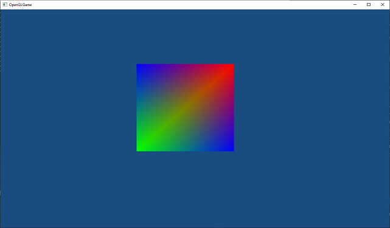
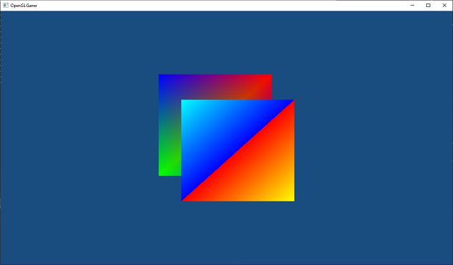
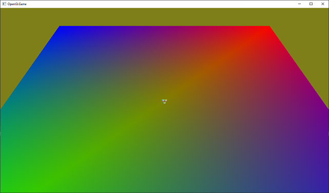

[OpenGL 3D 2021 第03回]

# インデックス・バッファ

## 習得目標

* インデックス・バッファの使い方
* さまざまな座標系の違い
* 複数のモデルを表示する方法

## 1. インデックス・バッファ

### 1.1 不必要に頂点データを増やさない方法

OpenGLが描画できるプリミティブには四角形がありません。四角形を表示するには、 `GL_TRIANGLES`や`GL_TRIANGLE_STRIP`、`GL_TRIANGLE_FAN`のいずれかを使って2つの三角形を組み合わせます。どれを使ってもよさそうに思えますが、複数の四角形を表示するときに違いが出てきます。

`GL_TRIANGLES`は好きな位置に図形を作れるので、`glDrrawArrays`呼び出しは1回で十分です。しかし、`GL_TRIANGLE_STRIP`、`GL_TRIANGLE_FAN`では四角形の数だけ呼び出さなければなりません。ここで問題になるのが、`glDrawArrays`の実行にかかる時間です。

`glDrawArrays`を含むOpenGLの描画関数は、描画準備のために内部でさまざまなGPUの設定を変更します。そのため、OpenGLの関数としてはかなり時間がかかります。

この設定変更にかかる時間は、描画する頂点データの数に関わらず一定です。そのため、図形ごとに描画関数を実行するより、図形データをまとめて一度の描画関数呼び出しで描画するほうが効率的です。そういうわけで、一般的には`GL_TRIANGLES`が使われます。

ただし、`GL_TRIANGLES`を使う場合、ひとつの四角形につき頂点データが合計6つ必要です。図形としては角がひとつ増えただけなのに、頂点データは3つも追加しなければならないのです。頂点データが増えると、それだけメモリが必要です。また、頂点データの数だけシェーダーが実行されるため、処理時間も増えます。

<p align="center">

</p>

`glDrawArrays`を使って描画する限り、`GL_TRIANGLES`は他の形式より多くの頂点を用意せざるをえません。これが、過去に`GL_TRIANGLES`が日の目を見なかった原因です。しかし、現在は猫も<ruby>杓子<rt>しゃくし</rt></ruby>も`GL_TRIANGLES`を使っています。なぜなら、近代的なGPUは、必要最小限の頂点データを用意するだけで図形を描画できるからです。

その<ruby>要<rt>かなめ</rt></ruby>となるのが「インデックス・バッファ」です。インデックスバッファを使えば、頂点データを直接プリミティブとして扱うのではなく、「頂点の番号」によって共有できるようになります。

`GPU`が頂点シェーダーを実行すると、その結果は「頂点の番号」と共に記録されます。別のポリゴンを描画するとき、記録にある番号が指定されると即座に実行結果が読み出されます。何度も頂点シェーダーを実行しなくて済むので、より高速にプリミティブを描画できるわけです。

### 1.2 インデックス・データ

インデックス・バッファの使い方を確認するために、頂点データ配列に4つの頂点を追加しましょう。`positions`と`colors`の先頭に、次のプログラムを追加してください。なお、過去の課題をクリアした結果、テキストに書かれているプログラムとは違っている部分はそのままで構いません。以降のプログラムも同様です。

```diff
 /// 座標データ.
 const Position positions[] = {
+  {-0.3f, -0.3f, 0.4f},
+  { 0.2f, -0.3f, 0.4f},
+  { 0.2f,  0.5f, 0.4f},
+  {-0.3f,  0.5f, 0.4f},
+
   {-0.33f, -0.5f, 0.5f},
   { 0.33f, -0.5f, 0.5f},
   { 0.0f,  0.5f, 0.5f},
```

<br>

```diff
 /// 色データ.
 const Color colors[] = {
+  {0.0f, 1.0f, 0.0f, 1.0f},
+  {0.0f, 0.0f, 1.0f, 1.0f},
+  {1.0f, 0.0f, 0.0f, 1.0f},
+  {0.0f, 0.0f, 1.0f, 1.0f},
+
   {0.0f, 1.0f, 1.0f, 1.0f}, // 水色
   {1.0f, 1.0f, 0.0f, 1.0f}, // 黄色
   {1.0f, 0.0f, 1.0f, 1.0f}, // 紫色
```

追加した頂点データは、左下を始点として反時計回りに4つの頂点を定義しています。

次に、インデックスデータを追加しましょう。色データ配列の定義の下に、次のプログラムを追加してください。

```diff
   {1.0f, 1.0f, 0.0f, 1.0f}, // 黄色
   {1.0f, 0.0f, 1.0f, 1.0f}, // 紫色
 };
+
+// インデックスデータ.
+const GLushort indices[] = {
+  0, 1, 2, 2, 3, 0,
+};

 /// 頂点シェーダー.
 const GLchar* const vsCode =
```

インデックスデータは「頂点データ配列の先頭から何番目の頂点データか」を示す数値の集まりです。頂点データがそうであるように、インデックスデータもプリミティブの指定と組み合わせてはじめて実際の形状が確定します。

今回作成した`indices`(インディシーズ、indexの複数形)配列変数の場合、`GL_TRIANGLES`を使って描画する前提で「0, 1, 2」と[2, 3, 0」という2つの三角形を定義しています。`0`と`2`が2回ずつ使われているのが分かりますね。これは、2つの三角形の間で`0`番と`2`番の頂点が「<ruby>共有<rt>きょうゆう</rt></ruby>」されていることを意味します。

インデックスデータの型は以下の3つから選択できます。

|型|ビット数|表せる範囲|
|:-:|:-:|:--|
|GLubyte(ジーエル・ユー・バイト)|8|0～255|
|GLushort(ジーエル・ユー・ショート)|16|0～65535|
|GLuint(ジーエル・ユー・イント)|32|0～4294967295|

ビット数の大きい型のほうが多くの頂点データを扱うことができますが、インデックスデータのサイズが大きくなります。今回はそれほど大きな頂点データを扱うつもりはありませんので、16bitの`GLushort`で十分だと判断しました。

### 1.3 Index Buffer Object(IBO)の作成

頂点データを格納するときに「Vertex Buffer Object(VBO)」というオブジェクトを作りましたね。同様に、インデックスデータを格納するには「Index Buffer Object(インデックス・バッファ・オブジェクト、IBO)」というオブジェクトを使います。

といっても、`IBO`の作り方は`VBO`と全く同じです。ですから、`CreateBuffer`関数で作ることができます。`VAO`を作成するプログラムに次のプログラムを追加してください。

```diff
   // VAOを作成する.
   const GLuint vboPosition = GLContext::CreateBuffer(sizeof(positions), positions);
   const GLuint vboColor = GLContext::CreateBuffer(sizeof(colors), colors);
+  const GLuint ibo = GLContext::CreateBuffer(sizeof(indices), indices);
   const GLuint vao = GLContext::CreateVertexArray(vboPosition, vboColor);
   if (!vao) {
```

不要になったら後始末をしなければなりません。後始末をするプログラムに、次のプログラムを追加してください。

```diff
   glDeleteProgram(fp);
   glDeleteProgram(vp);
   glDeleteVertexArrays(1, &vao);
+  glDeleteBuffers(1, &ibo);
   glDeleteBuffers(1, &vboColor);
   glDeleteBuffers(1, &vboPosition);
```

### 1.4 IBOをVAOに関連付ける

`VBO`と同様に`IBO`もVAOに設定しなければなりません。そこで、`CreateVertexArray`関数の引数に`IBO`を追加することにします。`GLContext.h`を開き、`CreateVertexArray`関数の宣言を次のように修正してください。

```diff
 namespace GLContext {

 GLuint CreateBuffer(GLsizeiptr size, const GLvoid* data);
-GLuint CreateVertexArray(GLuint vboPosition, GLuint vboColor);
+GLuint CreateVertexArray(GLuint vboPosition, GLuint vboColor, GLuint ibo);
 GLuint CreateProgram(GLenum type, const GLchar* code);
 GLuint CreatePipeline(GLuint vp, GLuint fp);
```

続いて、`GLContext.cpp`を開き、`CreateVertexArray`関数の引数にインデックスバッファを加えてください。

```diff
 * @param vboPosition VAOに関連付けられる座標データ.
 * @param vboColor    VAOに関連付けられるカラーデータ.
+* @param ibo         VAOに関連付けられるインデックスデータ.
 *
 * @return 作成したVAO.
 */
-GLuint CreateVertexArray(GLuint vboPosition, GLuint vboColor)
+GLuint CreateVertexArray(GLuint vboPosition, GLuint vboColor, GLuint ibo)
 {
-  if (!vboPosition || !vboColor) {
+  if (!vboPosition || !vboColor || !ibo) {
     return 0;
   }
```

インデックスバッファを`VAO`に設定するには`glVertexArrayElementBuffer`(ジーエル・バーテックス・アレイ・エレメント・バッファ)関数を使います。`CreateVertexArray`関数に次のプログラムを追加してください。

```diff
   glVertexArrayAttribBinding(id, colorIndex, colorBindingIndex);
   glVertexArrayVertexBuffer(id, colorBindingIndex, vboColor, 0, sizeof(Color));
+
+  glVertexArrayElementBuffer(id, ibo);

   return id;
 }
```

<p><code class="tnmai_code"><strong>【書式】</strong><br>
void glVertexArrayElementBuffer(VAOのID, IBOのID);
</code></p>

この関数を呼ぶと`VAO`に`IBO`が割り当てられ、`IBO`を使ったプリミティブの描画ができるようになります。これで`VAO`に`IBO`が設定されました。

これらの変更により、`Main.cpp`の`CreateVertexArray`関数呼び出しでエラーが発生しています。次の課題を行ってエラーを修正してください。

<pre class="tnmai_assignment">
<strong>【課題01】</strong>
<code>CreateVertexArray</code>関数の引数に<code>ibo</code>変数を追加してエラーを修正しなさい。
</pre>

### 1.5 インデックスデータを使った描画

最後に描画関数を変更します。頂点データの場合は`glDrawArrays`関数を使いますが、インデックスデータでは`glDrawElements`(ジーエル・ドロー・エレメンツ)関数が使われます。そういうことなので、メインループのプログラムを次のように変更してください。

```diff
     glBindVertexArray(vao);
     glBindProgramPipeline(pipeline);

-    glDrawArrays(GL_TRIANGLES, 0, sizeof(positions)/sizeof(positions[0]));
+    glDrawElements(
+      GL_TRIANGLES, sizeof(indices)/sizeof(indices[0]), GL_UNSIGNED_SHORT, 0);

     glBindProgramPileline(0);
     glBindVertexArray(0);
```

`glDrawElements`関数の書式は次のとおりです。

<p><code class="tnmai_code"><strong>【書式】</strong><br>
void glDrawElements(プリミティブの種類, 描画するインデックスの数,<br>
&emsp;インデックスの型, インデックスデータの位置);
</code></p>

参考までに、`glDrawArrays`関数の書式も挙げておきます。

<p><code class="tnmai_code"><strong>【書式】</strong><br>
void glDrawArrays(プリミティブの種類, 頂点データの位置, 描画する頂点の数);
</code></p>

こうして比べてみると、頂点とインデックスの違いはあっても、2つの関数がとてもよく似ていることが分かりますね。そして、一番の違いは`glDrawElements`には「インデックスの型」という引数があることでしょう。

頂点データの場合、データ構造は`VAO`を作成するときに同時に定義していました。しかし、インデックスデータには頂点データのような複雑な構造はなく、ひとつの型があるだけです。その程度ならわざわざ`VAO`に設定する必要はありませんので、引数で指定する形になっているのです。

「インデックスの型」は以下の3つから指定します。

|インデックスの型|対応する定数名|
|:-:|:--|
|GLubyte|GL_UNSIGNED_BYTE(ジーエル・アンサインド・バイト)|
|GLushort|GL_UNSIGNED_SHORT(ジーエル・アンサインド・ショート)|
|GLuint|GL_UNSIGNED_INT(ジーエル・アンサインド・イント)|

`indices`変数は`GLushort`型なので、`GL_UNSIGNED_SHORT`を指定しています。

>**【補足】** `unsigned`(アンサインド)は「符号のない、無符号の」という意味です。

「インデックスデータの位置」は、描画に使うインデックスデータの先頭位置を「インデックスデータの先頭からのバイト数」(バイトオフセットといいます)で指定します。今回は先頭から使うので`0`を指定しています。

プログラムが書けたらビルドして実行してください。次のように四角形がひとつ表示されたら成功です。

<p align="center">

</p>

### 1.6 頂点を共有しないという選択

表示したい図形によっては、2つ以上のポリゴンで頂点を共有すると都合が悪い場合があります。例えば、四角形を追加して、以下の画像のように表示したいとします。

<p align="center">

</p>

追加した四角形は、対角線にそって色が混ざらずに分かれています。このような結果を得るには、ポリゴンごとに異なる色を設定しなければなりません。言葉で説明されても分かりにくいと思いますのでちょっとやってみましょう。まず次のように座標データと色データを追加してください。

```diff
 const Position positions[] = {
   {-0.3f, -0.3f, 0.4f},
   { 0.2f, -0.3f, 0.4f},
   { 0.2f,  0.5f, 0.4f},
   {-0.3f,  0.5f, 0.4f},
+
+  {-0.2f, -0.5f, 0.1f},
+  { 0.3f, -0.5f, 0.1f},
+  { 0.3f,  0.3f, 0.1f},
+  { 0.3f,  0.3f, 0.1f},
+  {-0.2f,  0.3f, 0.1f},
+  {-0.2f, -0.5f, 0.1f},

   {-0.33f, 0.5f, 0.5f},
```

<br>

```diff
 const Color colors[] = {
   {0.0f, 1.0f, 0.0f, 1.0f},
   {0.0f, 0.0f, 1.0f, 1.0f},
   {1.0f, 0.0f, 0.0f, 1.0f},
   {0.0f, 0.0f, 1.0f, 1.0f},
+
+  {1.0f, 0.0f, 0.0f, 1.0f},
+  {1.0f, 1.0f, 0.0f, 1.0f},
+  {1.0f, 0.0f, 0.0f, 1.0f},
+  {0.0f, 0.0f, 1.0f, 1.0f},
+  {0.0f, 1.0f, 1.0f, 1.0f},
+  {0.0f, 0.0f, 1.0f, 1.0f},

   {0.0f, 1.0f, 1.0f, 1.0f},
```

続いて、次のようにインデックスデータを追加してください。

```diff
 /// インデックスデータ.
 const GLushort indices[] = {
   0, 1, 2, 2, 3, 0,
+  4, 5, 6, 7, 8, 9,
 };
```

四角形をひとつ追加するだけなのですが、頂点データは4個ではなく6個追加されています。それと、追加したインデックスデータに重複する番号がないことに気づいたでしょうか？

プログラムが書けたらビルドして実行してください。先に示した画像のように表示されたら成功です。

OpenGLにおいて、ポリゴン内の各フラグメントの色は、各頂点の色を、頂点からの距離の比率によって混合したものになります。そのため、最初に作った四角形のように複数のポリゴンで頂点を共有している場合、境界線はあまりはっきりとは見えません。これは基本的には望ましい動作です。というのも、現実の物体には、はっきりとした境界のない部分のほうが多いからです。

<p align="center">

</p>

しかし、時にはポリゴン境界をはっきりとさせたい場合があります。そんなときは、この節で追加した四角形のように、ポリゴンごとに別々の頂点データを割り当てます(頂点を共有しません)。この場合、`glVertexArrays`関数で描画するのと比べると、インデックスデータのぶんだけ余分なメモリが必要になってしまいます。

この節で追加したような小さな図形でインデックスデータを使うことは、デメリットしかありません。しかし、一般的にゲームのキャラクターは数百から数万の頂点を持っています。そのようなデータでは、たとえ一部の頂点が共有できないとしても、全体としては共有される頂点数のほうがはるかに多くなります。ですから、インデックスデータを使うほうが効率的であることに変わりはありません。

>**【インデックスデータを使わないほうがよい場合はあるの？】**<br>
めったに無いことですが、頂点が全くあるいはほとんど共有されない場合は、インデックスデータを使わないほうがよいです。例としては、`GL_POINT`を使った点の描画が挙げられます。

<pre class="tnmai_assignment">
<strong>【課題02】</strong>
<code>indices</code>配列にインデックスデータを追加して、「第02回の課題07」で作成した3つの三角形が表示されるようにしなさい。
</pre>

>**【1章のまとめ】**
>
>* 頂点を番号で管理する仕組みを「インデックスバッファ」という。
>* インデックスバッファを使うと頂点データを共有できるので、描画が高速になる。
>* インデックスバッファを使って描画するには`glDrawElements`関数を使う。
>* 表示したい画像によっては、頂点を共有できない場合がある。

<div style="page-break-after: always"></div>

## 2. 座標系

### 2.1 さまざまな座標系

これまで、頂点データの座標には0.5とか-0.3といった数値を使ってきました。例えば最初の頂点の座標は(-0.5, 0.5, 0.5)です。前回説明したように、これはこの頂点が「ワールド座標系上のX座標-0.5、Y座標0.5、Z座標0.5の位置にある」ことを示しているわけですが、この「ワールド座標系」とは何者なのでしょう？それを知るには、まずOpenGLで使われる座標系について理解しなければなりません。

「座標系」は「座標を定めるためのルール」です。このルールには「原点の位置」、「距離の単位」「軸の数や方向」などが含まれます。コンピューター・グラフィックスでは、用途に応じてさまざまな座標系を使い分けます。OpenGLで使われる座標系を下図に示します。また、座標系はそれぞれ異なる原点と軸を持っています。以下の図は、コンピューター・グラフィックスで使われる一般的な座標系とその関係を表しています。

<p align="center">

</p>

* **ローカル座標系**<br>
ポリゴンモデルを定義する座標系です。モデル座標系、オブジェクト座標系とも呼ばれます。一般的に、頂点シェーダの入力はこの座標系になります。原点は、モデルの中心か足元とされることが多いです。

* **ワールド座標系**<br>
ポリゴンモデル同士の位置関係を定義する座標系です。原点はシーンの中心とされることが多いです。ローカル座標系からワールド座標系への変換は「モデル変換」または「ワールド変換」と呼ばれます。

* **ビュー座標系**<br>
視点を基準とする座標系です。カメラ座標系、視点(Eye)座標系とも呼ばれます。原点は視点の座標になります。ワールド座標系からビュー座標系への変換は「ビュー変換」と呼ばれます。

* **クリップ座標系**<br>
クリッピングという、画面に映らない部分を除去する処理のための座標系です。頂点シェーダ(テッセレータやジオメトリシェーダも使う場合、それらの中で最後に実行されるシェーダ)から出力される座標は、この座標系て定義されていなければなりません。ビュー座標系からクリップ座標系への変換は「プロジェクション変換」と呼ばれます。

* **正規化デバイス(NDC)座標系**<br>
クリップ座標系のX,Y,Z要素をW要素で除算した座標系です。この変換はクリッピングの直後に行われ、PAへの入力になります。英語の頭文字(Normalized Device Coordinates)から、NDC座標系とも呼ばれます。<br>
頂点座標を正規化デバイス座標系に変換したとき、XYZのいずれかの要素が1より大きいか、または-1より小さい場合は描画がスキップされます。画面外の頂点を描画するのは無駄だからです。クリップ座標系から正規化デバイス座標系への変換は`GPU`が自動的に行います。そのため、この変換には特に名前はついていません。

* **スクリーン座標系**<br>
フレームバッファ上の座標系です。ウィンドウ座標系とも呼ばれます。OpenGLでは左下が原点です。正規化デバイス座標系からスクリーン座標系への変換は、グラフィックスハードウェアが行います。そのため、特に名前はありません。

上記のいずれかの座標系で定義された座標を、別の座標系で表される座標に変換する操作を「座標変換」といいます。

さて、頂点データを定義している空間を表す座標系は「ワールド座標系」と説明しました。しかし、実際には「ローカル座標系であり、ワールド座標系であり、ビュー座標系であり、クリップ座標系でもあり、またNDC座標系でもある」というのが正しい説明になります。

頂点シェーダから出力する座標は「クリップ座標系」に変換したものでなくてはなりません。一般的に、頂点シェーダに入力される座標データは「ローカル座標系」で定義されているので、頂点シェーダで座標変換を行います。

しかし、みなさんに書いてもらった頂点シェーダには、まだ座標変換がありません。そのため、座標変換が必要ないように「クリップ座標系」で定義した頂点データを使っています。

つまり、「ローカル座標系 = ワールド座標系 = スクリーン座標系 = クリップ座標系」とすることで、座標変換をしなくても画面に絵が出るように工夫していたのです。

そして、頂点シェーダーではw要素に常に1を設定しています。1で除算しても座標は変化しないので、クリップ座標系の座標と正規化デバイス座標系の座標は常に等しくなります。

### 2.2 右手座標系と左手座標系

ここまでは、目的に応じた座標系を説明してきました。それとは別に、各軸の向きに注目した座標系の分類があります。それが、「右手座標系」と「左手座標系」です。これは、親指から順にX,Y,Zの軸を割り当てていった時、ある座標系がどちらの手で表現できるかを示しています。

<p align="center">

</p>

OpenGLでは伝統的に右手座標系が使われます。ところが、クリップ座標系から先、つまりフラグメントシェーダーでは左手座標系が使われるんです。このため、OpenGLの頂点シェーダーは、通常の座標変換だけでなく、右手と左手の座標変換も行う必要があります。幸いなことに、右手座標系と左手座標系の変換はZ座標の符号を逆にするだけです。

>**【最初から左手座標系を使うわけにはいかないの？】**<br>基本的にはなんの問題もありません。実際、そのほうが座標変換は分かりやすくなるでしょう。現代のGPUは左手座標系を採用するDirectXとともに発展してきましたが、OpenGLはそれ以前から右手座標系を採用していました。<br>
そうした歴史的背景から、既存のOpenGL用プログラムやライブラリは、ほとんどが右手座標系を採用しています。そのため、素直に右手座標系を使うほうが手間がかかりません。もちろん、既存の資産を捨て去り、全てのプログラムを自分で作り上げるつもりなら、どちらでも好きな座標系を使うことができます。

### 2.3 基本的な座標変換(平行移動)

座標変換が実際にどんなことをするのか、簡単な座標変換をやってみて確認しましょう。基本的な座標変換は以下の3種類です。2.2節で説明したさまざまな座標系の間の変換も、以下の基本変換の組み合わせで実現できます。

>1. 平行移動
>2. 拡大・縮小
>3. 回転

まずは「平行移動」をやってみましょう。「平行移動」は座標に特定の数値を足す(または引く)だけの変換です。頂点シェーダを次のように変更してください。

```diff
   "void main() { \n"
   "  outColor = vColor; \n"
-  "  gl_Position = vec4(vPosition, 1.0); \n"
+  "  gl_Position.x = vPosition.x + 0.25; \n"
+  "  gl_Position.y = vPosition.y; \n"
+  "  gl_Position.z = vPosition.z; \n"
+  "  gl_Position.w = 1.0; \n"
   "} \n";

 /// フラグメントシェーダー.
```

この座標変換は、頂点をX軸方向に0.25だけ動かします。プログラムが書けたらビルドして実行してください。次のようにすべての図形が右にずれて表示されたら成功です。

<p align="center">

</p>

<pre class="tnmai_assignment">
<strong>【課題03】</strong>
「平行移動」によって、全ての図形を左に<code>0.3</code>下に<code>0.5</code>移動させなさい。
</pre>

### 2.4 基本的な座標変換(拡大・縮小)

次の座標変換は「拡大・縮小」です。「拡大・縮小」は座標に拡大・縮小の比率を掛け算します。1より大きい数値を掛けると「拡大」、1未満の数値を掛けると「縮小」になります。1を掛けた場合は拡大も縮小も起こりません。

また、X方向は拡大、Y方向は縮小、というように、軸ごとに掛ける数値を変更できます。それでは、頂点シェーダを次のように変更してください。

```diff
   "void main() { \n"
   "  outColor = vColor; \n"
-  "  gl_Position.x = vPosition.x - 0.3; \n"
-  "  gl_Position.y = vPosition.y - 0.5; \n"
-  "  gl_Position.z = vPosition.z; \n"
+  "  gl_Position.x = (vPosition.x * 2.0) - 0.3; \n"
+  "  gl_Position.y = (vPosition.y * 0.5) - 0.5; \n"
+  "  gl_Position.z = (vPosition.z * 1.0); \n"
   "  gl_Position.w = 1.0; \n"
   "} \n";
```

プログラムが書けたらビルドして実行してください。次のような横に潰されたような図形が表示されたら成功です。

<p align="center">

</p>

座標計算ではX,Y,Zの3つを計算する必要があります。これらを個別に計算すると、プログラムの見た目がごちゃごちゃして分かりにくくなりがちです。

そこでベクトルを使います。次のように、平行移動の数値と拡大・縮小の数値をベクトルにまとめてください。

```diff
   "void main() { \n"
   "  outColor = vColor; \n"
-  "  gl_Position.x = (vPosition.x * 2.0) - 0.3; \n"
-  "  gl_Position.y = (vPosition.y * 0.5) - 0.5; \n"
-  "  gl_Position.z = (vPosition.z * 1.0); \n"
+  "  gl_Position.xyz = vPosition * vec3(2.0, 0.5, 1.0) + vec3(-0.3,-0.5, 0.0); \n"
   "  gl_Position.w = 1.0; \n"
   "} \n";
```

プログラムが書けたらビルドして実行してください。ベクトルで置き換える前と同じ画像が表示されていたら成功です。このように、ベクトルを使うことで行数が短くなり、プログラムを見通しやすくなります。

<pre class="tnmai_assignment">
<strong>【課題04】</strong>
「拡大・縮小」によって、図形のX方向が<code>0.5</code>倍、Y方向が<code>1.5</code>倍の大きさで表示されるようにしなさい。
</pre>

### 2.5 基本的な座標変換(回転)

最後の座標変換は「回転」です。回転には三角関数`sin`と`cos`を使います。角度<ruby>θ<rt>シータ</rt></ruby>だけ回転させる計算は次の式で表されます。

>回転後のX座標 = X座標 \* cosθ - Y座標 \* sinθ<br>
>回転後のY座標 = X座標 \* sinθ + Y座標 \* cosθ

ただ、ベクトルを使って回転を計算するのは少し難しいので、XとYは個別に計算することにします。頂点シェーダを次のように変更してください。

```diff
   "void main() { \n"
   "  outColor = vColor; \n"
+  "  float s = sin(1.0); \n"
+  "  float c = cos(1.0); \n"
+  "  vec3 p = vPosition; \n"
+  "  p.x = vPosition.x * c - vPosition.y * s; \n"
+  "  p.y = vPosition.x * s + vPosition.y * c; \n"
-  "  gl_Position.xyz = vPosition * vec3(0.5, 1.5, 1.0) + vec3(-0.3,-0.5, 0.0); \n"
+  "  gl_Position.xyz = p * vec3(0.5, 1.5, 1.0) + vec3(-0.3,-0.5, 0.0); \n"
   "  gl_Position.w = 1.0; \n"
   "} \n";
```

プログラムが書けたらビルドして実行してください。次のように図形が回転していたら成功です。

<p align="center">

</p>

`sin`と`cos`には角度<ruby>θ<rt>シータ</rt></ruby>を指定します。上のプログラムではθは`1.0`になっています。でも、1度回転させたようには見えませんね。実はこの`1.0`は度数法ではなく「ラジアン(弧度法)」という単位で指定しています。

コンピューターで角度を表すときは「度数法」の代わりに「ラジアン」という単位を使います。理由は、コンピューターにとって、ラジアンのほうが素早く計算できるからです。度数法からラジアンを求めるには次の式を使います。

>`ラジアン = 度数法の角度 / 180 * 2π`

この式によると、`1.0`ラジアンは約57.3度になります。このように、度数法とラジアンは表現方法が違うだけです。しかし、数値にπが出てくるため人間にとって直感的ではありません。そこで、度数法からラジアンに単位変換を行う`radians`(ラジアンズ)という関数が用意されています。

`radians`関数を使って前のプログラムをわかりやすくしましょう。頂点シェーダを次のように変更してください。

```diff
   "void main() { \n"
   "  outColor = vColor; \n"
-  "  float s = sin(1.0); \n"
-  "  float c = cos(1.0); \n"
+  "  float s = sin(radians(57.3)); \n"
+  "  float c = cos(radians(57.3)); \n"
   "  vec3 p = vPosition; \n"
   "  p.x = vPosition.x * c - vPosition.y * s; \n"
   "  p.y = vPosition.x * s + vPosition.y * c; \n"
```

プログラムが書けたらビルドして実行してください。1ラジアンは約57.3度なので、`radians`を使う前とほとんど同じ画像が表示されるはずです。

<pre class="tnmai_assignment">
<strong>【課題05】</strong>
図形を120度回転して表示しなさい。
</pre>

>**【2章のまとめ】**
>
>* コンピューター・グラフィックスではさまざまな「座標系」というものを使い分ける。
>* 座標系は「座標を決めるためのルール」。
>* OpenGLは基本的に「右手座標系」。ただしフラグメントシェーダーでは「左手座標系」に変わる。
>* 座標変換は「平行移動」「拡大・縮小」「回転」を組み合わせて作ることができる。

<div style="page-break-after: always"></div>

## 3. 座標変換と行列

### 3.1 行列による座標変換

これまではワールド座標系だけで暮らしてきましたが、いよいよ新たな座標系を導入していこうと思います。この章では「ローカル座標」、「ワールド座標系」、「ビュー座標系」、「クリップ座標系」を扱います。

複数の座標系を扱うとき、ある座標系で定義された座標が、別の座標系ではどのような座標として見えるかを計算する必要が生じます。この計算のことを「座標変換」というのでした。

前の章では平行移動、拡大・縮小、回転の3つの座標変換を学びました。このうち「回転」だけがベクトルでは計算が難しい、という話もしました。

ここで「行列(ぎょうれつ)」が登場します。行列はベクトルを2次元に拡張したもので、平行移動、拡大・縮小、回転の全てを扱うことができます。座標変換を行列で表したものが以下の3つです。

<p align="center">
<br>
[左=平行移動　中=拡大・縮小　右=回転]
</p>

このような、横に4つ、縦に4つの数値を並べた行列を「4<ruby>行<rt>ぎょう</rt></ruby>4<ruby>列<rt>れつ</rt></ruby>の行列」といいます。行の数と列の数は違っていても構いません。例えば、座標ベクトルは「3行1列の行列」または「1行3列の行列」と考えることができます。このように、行列はベクトルを拡張したものになっています。

また、本テキストは数学の授業ではないので「行列の計算方法」を覚える必要はありません。重要なのは「行列を使ってできること」、つまり「行列で座標変換ができる」というルールを覚えることです。

難しいながらも便利は行列ですが、実際に計算するとなるとかなり厄介です。例えば4行4列の行列同士の積を計算するには、64回の乗算と48回の加算が必要です。行列とベクトルの計算は乗算と加算が合計28回必要です。

幸い、`GLSL`には行列を作成したり計算する機能が備わっていますので、そんな恐ろしい計算をしなくても大丈夫です。それでは、座標変換を同等の行列で置き換えましょう。頂点シェーダを次のように変更してください。

```diff
   "void main() { \n"
   "  outColor = vColor; \n"
   "  float s = sin(radians(120.0)); \n"
   "  float c = cos(radians(120.0)); \n"
-  "  vec3 p = vPosition; \n"
-  "  p.x = vPosition.x * c - vPosition.y * s; \n"
-  "  p.y = vPosition.x * s + vPosition.y * c; \n"
-  "  gl_Position.xyz = p * vec3(0.5, 1.5, 1.0) + vec3(-0.3,-0.5, 0.0); \n"
-  "  gl_Position.w = 1.0; \n"
+  "  mat4 matT = mat4(1); \n"
+  "  matT[3] = vec4(-0.3,-0.5, 0.0, 1.0); \n"
+  "  mat4 matS = mat4(1); \n"
+  "  matS[0][0] = 0.5; \n"
+  "  matS[1][1] = 1.5; \n"
+  "  mat4 matR = mat4(1); \n"
+  "  matR[0][0] = c; \n"
+  "  matR[0][1] = -s; \n"
+  "  matR[1][0] = s; \n"
+  "  matR[1][1] = c; \n"
+  "  gl_Position = matT * matS * matR * vec4(vPosition, 1.0); \n"
   "} \n";

 /// フラグメントシェーダー.
```

行列とベクトルの積を求めるには、28回の計算が必要なのでした。しかし、積を計算するたびにそんなに多くの計算を書くのは面倒すぎます。そのため、`GLSL`では、行列同士の積、行列とベクトルの積は、普通の掛け算と同じように`*`記号で表せるようになっています。

ただし、プログラムに現れないだけで、内部的には28回の計算が行われます。不必要な計算は避けるようにしましょう。

`mat4(1)`は「単位行列」を作成します。「単位行列」は次のような、左上から右下の斜めの部分だけ1で、他はすべて0になっている行列です。

```c++
　　　　   1 0 0 0
単位行列 = 0 1 0 0
　　　　   0 0 1 0
　　　　   0 0 0 1
```

単位行列は、他の行列や座標に掛けたとき何も変化させない(ルールを変えない)変換行列です(実数の`1.0`のようなものです)。

プログラムが書けたらビルドして実行してください。行列で置き換える前と同じように表示されていたら成功です。これで、座標変換を行列で書けることが分かりました。

>**【古いGLMライブラリの単位行列】**<br>
インターネットにある`GLM`ライブラリを使ったサンプルのなかには、`glm::mat4()`のように引数無しで単位行列を作成しているものがあります。これは間違いではありません。古い(v0.9.9.0より前の)バージョンでは、引数を指定しなくても単位行列が作れたからです。<br>
しかし、`GLM`ライブラリが手本とする`GLSL`では最初から引数が必要でした。そのため、v0.9.9.0において、単位行列や単位ベクトルを作るときは引数を必要とするように修正されたのです。

### 3.2 <ruby>OpenGL Mathematics<rt>オープンジーエル・マスマティックス</rt></ruby>(GLM)の導入

前節では頂点シェーダに座標変換を書きました。しかし、座標変換を頂点シェーダに書いてしまうと、拡大・縮小の比率や回転角度を変更できません。そこで、座標変換用の行列はC++プログラムで作成し、頂点シェーダに転送できるようにしましょう。

問題は、C++には行列やベクトルを計算する機能がないということです。しかしご安心ください。こういう世間でよく使われる機能にはライブラリが存在するものです。実際に行列ライブラリはいくつもあります。今回は、その中でもOpenGLと親和性の高い`GLM`(ジーエル・エム)というライブラリを使うことにします。

ありがたいことに`GLM`もNuGetでインストールできます。メニューから「プロジェクト→NuGetパッケージの管理」を選択し、ソリューションのNuGetパッケージ管理ウィンドウが開いてください。ウィンドウが開いたら「参照」を選択して(①)、検索用テキストボックスに「glm」と入力します(②)。

いくつか候補が表示されると思いますが、その中から「glm」というパッケージを選びます(③)。右側のインストールボタンをクリックするとインストールが開始されます(②)。インストールが完了したら、NuGetパッケージ管理ウィンドウを閉じてください。

<p align="center">

</p>

`GLM`ライブラリのインストールが終わったら、`Main.cpp`にヘッダファイルをインクルードしましょう。`Main.cpp`を開き、インクルード文を次のように変更してください。

```diff
 #include <glad/glad.h>
 #include "GLContext.h"
+#include <glm/gtc/matrix_transform.hpp>
 #include <GLFW/glfw3.h>
 #include <string>
 #include <iostream>
```

`GLM`ライブラリは用途別にヘッダファイルが分けられています。今回インクルードしている`matrix_transform.hpp`(マトリクス・トランスフォーム・エイチピーピー)には座標変換を行う関数が定義されています。

次に、頂点シェーダからC++に座標変換プログラムを移動させます。`Ctrl+X`などで、頂点シェーダから以下のプログラムを切り取ってください。

```diff
   "void main() { \n"
   "  outColor = vColor; \n"
-  "  float s = sin(radians(120.0)); \n"
-  "  float c = cos(radians(120.0)); \n"
-  "  mat4 matT = mat4(1); \n"
-  "  matT[3] = vec4(-0.3,-0.5, 0.0, 1.0); \n"
-  "  mat4 matS = mat4(1); \n"
-  "  matS[0][0] = 0.5; \n"
-  "  matS[1][1] = 1.5; \n"
-  "  mat4 matR = mat4(1); \n"
-  "  matR[0][0] = c; \n"
-  "  matR[0][1] = -s; \n"
-  "  matR[1][0] = s; \n"
-  "  matR[1][1] = c; \n"
   "  gl_Position = matT * matS * matR * vec4(vPosition, 1.0); \n"
   "} \n";
```

続いて、C++プログラムのメインループ内に、`Ctrl+V`などで切り取ったプログラムを貼り付けてください。

```diff
     glBindVertexArray(vao);
     glBindProgramPipeline(pipeline);
+  "  float s = sin(radians(120.0)); \n"
+  "  float c = cos(radians(120.0)); \n"
+  "  mat4 matT = mat4(1); \n"
+  "  matT[3] = vec4(-0.3,-0.5, 0.0, 1.0); \n"
+  "  mat4 matS = mat4(1); \n"
+  "  matS[0][0] = 0.5; \n"
+  "  matS[1][1] = 1.5; \n"
+  "  mat4 matR = mat4(1); \n"
+  "  matR[0][0] = c; \n"
+  "  matR[0][1] = -s; \n"
+  "  matR[1][0] = s; \n"
+  "  matR[1][1] = c; \n"
 
     glDrawElements(
       GL_TRIANGLES, sizeof(indices)/sizeof(indices[0]), GL_UNSIGNED_SHORT, 0);
```

貼り付けたら、`"`や`\n`などのC++として不要な部分を消します。

<pre class="tnmai_assignment">
<strong>【課題06】</strong>
貼り付けたプログラムから、行頭の<code>"</code>と行末の<code>\n"</code>を全て削除しなさい。
</pre>

`GLM`ライブラリのクラスや関数は`glm`名前空間に格納されています。そのため、クラスや関数の前に`glm::`を追加します。貼り付けたプログラムを次のように変更してください。

```diff
     glBindVertexArray(vao);
     glBindProgramPipeline(pipeline);
-    float s = sin(radians(120.0));
-    float c = cos(radians(120.0));
-    mat4 matT = mat4(1);
+    float s = sin(glm::radians(120.0));
+    float c = cos(glm::radians(120.0));
+    glm::mat4 matT = glm::mat4(1);
     matT[3] = vec4(-0.3,-0.5, 0.0, 1.0);
-    mat4 matS = mat4(1);
-    mat4 matS = mat4(1);
+    glm::mat4 matS = glm::mat4(1);
+    glm::mat4 matS = glm::mat4(1);
     matS[0][0] = 0.5;
     matS[1][1] = 1.5;
-    mat4 matR = mat4(1);
+    glm::mat4 matR = glm::mat4(1);
     matR[0][0] = c;
     matR[0][1] = -s;
     matR[1][0] = s;
```

これで座標変換プログラムを移動することができました。

### 3.3 シェーダーの変更

続いて、C++のプログラムで計算した座標変換行列を受け取る機能を、頂点シェーダに追加します。頂点シェーダーを次のように書き換えてください。

```diff
   "out gl_PerVertex { \n"
   "  vec4 gl_Position; \n"
   "}; \n"
+  "layout(location=0) uniform mat4 matTRS; \n"
   "void main() { \n"
   "  outColor = vColor; \n"
-  "  gl_Position = matT * matS * matR * vec4(vPosition, 1.0); \n"
+  "  gl_Position = matTRS * vec4(vPosition, 1.0); \n"
   "} \n";
   "}";
```

重要な変更は、`matTRS`(マット・ティーアールエス)というグローバル変数が追加されていることです。`matTRS`という変数名は`Translate`(平行移動)、`Rotate`(回転)、`Scale`(拡大・縮小)の頭文字から名付けました。

`matTRS`変数の型は`uniform mat4`となっています。`uniform`(ユニフォーム)は、CPUからGPUへコピーされるパラメータであることを示します。`uniform`型の変数に書き込めるのはCPU側だけです。GPU(シェーダー)側では読み取り専用となり変更できません。プリミティブの描画中は変化しないことから「均一な、一様な」という意味の`uniform`という名前が付けられています。

`mat4`(マット・フォー)は4行4列の行列を表す型です。行列には他にも`mat3`(3行3列)や`mat2`(2行2列)といったものがあります。行と列を`x`(小文字のエックス)でつなぐ`mat4x4`(マット・フォー・バイ・フォー)という書き方もあります。なお、`mat`は`matrix`(マトリクス、行列)という単語を省略したものです。

`in`変数や`out`変数と同じく、`uniform`変数にもロケーションを指定できます。`uniform`変数の場合、この番号は「アプリケーションからデータを受け取るための位置情報」として使われます。用途が違うので`in`、`out`と同じロケーション番号を指定できます。

ふたつ目の変更は、`gl_Position`の計算方法です。頂点座標に3つの行列を掛ける式から、`matTRS`だけを掛けるように変えています。これは、C++プログラムで行列の乗算まで行って、頂点シェーダに送る予定だからです。

### 3.4 座標変換行列をシェーダに転送する

C++プログラムからシェーダーにデータを送るには、転送先となる`uniform`変数のロケーション番号が必要となります。これはシェーダを変更するときに指定しましたね。

しかし、単に`0`と書いてもなんのことだか分かりづらいです。そこで、ロケーション番号を表す定数を定義しておきます。パイプライン・オブジェクトを作成するプログラムの下に、次のプログラムを追加してください。

```diff
   if (!pipeline) {
     return 1;
   }
+
+  // uniform変数の位置.
+  const GLint locMatTRS = 0;

   // メインループ.
   while (!glfwWindowShouldClose(window)) {
```

この値を`locMatTRS`(ロク・マット・ティーアールエス)という変数に格納します。`loc`は`location`(ロケーション)の短縮形、`Mat`は`Matrix`(マトリクス)の短縮形です。

ロケーション番号には`GLuint`ではなく`GLint`を使います。`u`しか違いがなくて間違えやすいので注意してください。

それでは、ロケーション定数を使って行列を`uniform`変数に転送しましょう。行列の転送には`glProgramUniformMatrix4fv`(ジーエル・プログラム・ユニフォーム・マトリクス・フォー・エフ・ブイ)関数を使います。MVP行列を作成するプログラムの下に、次のプログラムを追加してください。

```diff
     matR[0][1] = -s;
     matR[1][0] = s;
     matR[1][1] = c;

+     // 行列をシェーダに転送する.
+    glm::mat4 matTRS = matT * matS * matR;
+    glProgramUniformMatrix4fv(vp, locMatTRS, 1, GL_FALSE, &matTRS[0][0]);

    glDrawElements(
      GL_TRIANGLES, sizeof(indices)/sizeof(indices[0]), GL_UNSIGNED_SHORT, 0);
```

<p><code class="tnmai_code"><strong>【書式】</strong><br>
void glProgramUniformMatrix4fv(プログラム・オブジェクトID, 転送位置,<br>
&emsp;転送する行列の数, 転置の有無, 転送する行列のアドレス);
</code></p>

この関数の最初の引数は、転送先となるプログラム・オブジェクトのIDです。2つ目は転送先のuniform変数の位置(ロケーション番号)です。3つめの引数は、転送する行列の数です。4つめの引数は、行列を転置するかどうかを指定します(転置というのは行と列の内容を入れ替えることです)。

5つめの引数は、転送するデータへのポインタです。上記のプログラムでは`&matMVP[0][0]`とすることで、行列の最初の要素へのポインタを渡しています。

プログラムが書けたらビルドして実行してください。座標変換行列の計算をC++プログラムに移動する前と同じ画像が表示されていたら成功です。

C++から座標変換行列を制御できるようになったので、毎フレーム座標変換行列を書き換えてみましょう。uniform変数の位置を定義するプログラムの下に、次のプログラムを追加してください。

```diff
   // uniform変数の位置.
   const GLint locMatTRS = 0;
+
+  // 座標変換行列の回転角度.
+  float degree = 0;

   // メインループ.
   while (!glfwWindowShouldClose(window)) {
```

次に回転行列を作成するプログラムを、次のように変更してください。

```diff
     glBindVertexArray(vao);
     glBindProgramPipeline(pipeline);
-    float s = sin(glm::radians(120.0));
-    float c = cos(glm::radians(120.0));
+    float s = sin(glm::radians(degree));
+    float c = cos(glm::radians(degree));
+    degree += 0.01f;
     glm::mat4 matT = glm::mat4(1);
     matT[3] = vec4(-0.3,-0.5, 0.0, 1.0);
```

プログラムが書けたらビルドして実行してください。図形が回転していたら成功です。

<pre class="tnmai_assignment">
<strong>【課題07】</strong>
拡大・縮小率を示す変数<code>scale</code>を追加して、図形が2倍から少しずつ縮小するようにしなさい。このとき、XとYの両方に同じ拡大・縮小率を指定すること。
</pre>

### 3.5 ビュー行列とプロジェクション行列

この節では、2.1節で示した「ビュー変換」と「プロジェクション変換」を追加します。ビュー変換を行う行列を「ビュー行列」、プロジェクション変換を行う行列を「プロジェクション行列」と呼ぶことにします。

そして、これまでに作成した「図形の位置や角度を操作する座標変換行列」のことを「モデル行列」と呼ぶことにします。

移動、拡大・縮小、回転によって頂点の座標を操作する、という点において、どの座標変換行列も違いはありません。それなのに、わざわざ複数の行列を使い分ける理由は、座標変換の目的が異なっているからです。目的が違うことから、行列を作成する方法も異なります。`GLM`ライブラリには、目的に応じて行列を作成する関数が用意されています。

|行列名|関数名|
|:--|:--|
|モデル行列|translate(トランスレート)<br>rotate(ローテート)<br>scale(スケール)|
|ビュー行列|lookAt(ルック・アット)|
|プロジェクション行列|perspective(パースペクティブ)<br>ortho(オーソ)|

それでは、これらの関数を使って変換行列を作っていきましょう。メインループ内にある、パイプラインオブジェクトをバインドするプログラムの下に、以下のプログラムを追加してください。

```diff
     matR[0][1] = -s;
     matR[1][0] = s;
     matR[1][1] = c;

+    // プロジェクション行列を作成.
+    int w, h;
+    glfwGetWindowSize(window, &w, &h);
+    const float aspectRatio = static_cast<float>(w) / static_cast<float>(h);
+    const glm::mat4 matProj =
+      glm::perspective(glm::radians(45.0f),  aspectRatio, 0.1f, 200.0f);
+
+    // ビュー行列を作成.
+    const glm::mat4 matView =
+      glm::lookAt(glm::vec3(0, 3, 3), glm::vec3(0, 0, 0), glm::vec3(0, 1, 0));

      // 行列をシェーダに転送する.
-    glm::mat4 matTRS = matT * matS * matR;
-    glProgramUniformMatrix4fv(vp, locMatTRS, 1, GL_FALSE, &matTRS[0][0]);
+    const glm::mat4 matModel = matT * matS * matR;
+    const glm::mat4 matMVP = matProj * matView * matModel;
+    glProgramUniformMatrix4fv(vp, locMatTRS, 1, GL_FALSE, &matMVP[0][0]);

     glDrawArrays(GL_TRIANGLES, 0, sizeof(positions)/sizeof(positions[0]));
```

`matModel`(マット・モデル)、`matView`(マット・ビュー)、`matProj`(マット・プロジェ)の３つがそれぞれモデル行列、ビュー行列、プロジェクション行列を表しています。

`glm::perspective`(ジーエルエム・パースペクティブ)は、透視投影を行うプロジェクション行列を作成します。

<p><code class="tnmai_code"><strong>【書式】</strong><br>
glm::mat4 glm::perspective(視野角, アスペクト比, 描画範囲の手前側, 描画範囲の奥側);
</code></p>

「透視投影」は、近くにあるプリミティブほど大きく、遠くにあるプリミティブほど小さくなるような変換で、みなさんが現実の世界を見るのと同じように3D空間を見るための変換方法です。

基本的には、Z座標の値が大きいほど画面上でも大きく、Zが小さいほど画面上でも小さく表示されます。どの程度大きく、または小さく表示されるかは、「視野角」というパラメータで設定します。視野角を大きくすると広角レンズのように大きさが強調され、小さくすると望遠レンズのように大きさがあまり変わらなくなります。

また、多くのウィンドウやモニターは表示範囲の縦横比が1:1ではありません。この縦横比は「アスペクト比」というパラメータで設定します。アスペクト比はY軸に対するX軸の比率です。通常は「描画範囲の幅÷描画範囲の高さ」となります。描画範囲は`glfwGetWindowSize`(ジーエルエフダブリュー・ゲット・ウィンドウ・サイズ)関数で取得できます。

3つめと4つめの引数は、奥行き方向の描画範囲を設定します。視点より後ろにあったり、遠すぎてほとんど見えないような頂点を除外するための機能です。今回は、Z座標が0.1～200の範囲にあるプリミティブだけが描画されるようにしました。

`glm::lookAt`(ジーエルエム・ルック・アット)は、ワールド座標系からビュー座標系への変換を行うビュー行列を作成します。

<p><code class="tnmai_code"><strong>【書式】</strong><br>
glm::mat4 glm::lookAt(視点, 注視点, 視点の上方向ベクトル);
</code></p>

「視点」はみなさんの頭やカメラの位置のことです。「注視点」は注目している物や場所の位置です。そして「上方向ベクトル」は視点の傾きを表します。みなさんの頭を視点とすると、上方向ベクトルは頭のてっぺんからまっすぐ上にのびています。首を傾けると、上方向ベクトルも傾きます。視点と注視点の2つだけでは、この「傾ける」という動作を表現できませんよね。だから、上方向ベクトルが必要なのです。

そういうわけで、上記のプログラムは「ワールド座標系の(2, 3, 3)に視点があり、そこからワールド原点(0, 0, 0)を見ているビュー座標系」への変換行列を作っていることになります。

モデル行列は、プリミティブをワールド座標の「どこへ」「どのような大きさで」「どんな角度で」表示するかを決める行列です。

3つの座標変換行列を計算したあとは、それらをかけ合わせることで行列を合成し、ひとつの行列にまとめています。 MVPという名前はMost Valuable Player(モスト・バリューアブル・プレイヤー)…ではなく、Model View Projection(モデル・ビュー・プロジェクション)の頭文字が由来です。

プログラムが書けたらビルドして実行してください。次のように斜め上から見たような画像が表示されたら成功です。

<p align="center">

</p>

>**【短縮形と頭文字】**<br>
>単語をまったく短縮しないで`locationMatrixModelViewProjection`などと書くのは面倒なうえ、プログラムが読みづらくなりがちです。短縮形をうまく使うとプログラムが読みやすくなります。<br>
>ただし、なにもかも短縮するのはやりすぎです。基本的には、ローカル変数のように利用する範囲が狭いものや、メンバ変数のようにクラス名などで修飾されるものについて短縮形を使います。<br>
>短縮形を使うときはルールを決めておきましょう。同じ単語なのに書いた場所によって短縮形が違っていると、プログラムの意図を読み取るのに苦労します。また、いちいち短縮形を考える手間もなくなります。<br>
本テキストでは単語の先頭3文字が短縮形の基本です。また、行列における`MVP`などのように、元の単語が明らかな場合は頭文字を使うことがあります。

<br>

>**【行列積は交換法則が成り立たない！？】**<br>
>行列を掛ける順番はとても重要です。なぜなら、行列の乗算では、みなさんが慣れ親しんでいる交換法則が成り立たないからです。実数または虚数の数値aとbがあるとき、<br>
>`a × b = b ×a`<br>
>が成り立ちますよね。だから、2×4でも4×2でも、答えは同じ8になるわけです。ですが、行列の場合は<br>
>`mA × mB ≠ mB × mA`<br>
>となります。2行2列で確認してみましょう。
>
>```c++
>|1 2| × |5 6| = |1×5+3×6 2×5+4×6| = |23 34|
>|3 4|   |7 8|   |1×7+3×8 2×7+4×8|   |31 46|
>
>|5 6| × |1 2| = |5×1+7×2 6×1+8×3| = |19 30|
>|7 8|   |3 4|   |5×3+7×4 6×2+8×4|   |43 44|
>```
>
>順番を変えると結果が全く違いますね。プリミティブが思ったように表示されないときは、行列を掛ける順番が正しいかどうかを確認してみるといいでしょう。

### 3.6 座標系の違い

さて、ここでふたつの重要なお知らせがあります。座標変換行列を導入した結果、<br>
**頂点データを定義しているワールド座標のルールと、それ以外の座標系のルールは違うものになりました。**<br>
これまではどちらも`左手座標系`ルールだったのですが、座標系を気にするようなプログラムを書いてはいなかったので、このことに気づかなかったと思います。

特に注意してもらいたいのは、一般的なOpenGLの世界において、`クリップ座標系は左手座標系`、`ワールド座標系は右手座標系`になっていることです。座標変換に使っている`GLM`ライブラリでは、OpenGLの一般的なワールド座標系を作り出します。ですから、作成しているプログラムも一般的なものに変わったわけです。これにより、Z軸の方向が逆になりました。

それと、以前は正方形として表示されていた四角形が、少し縦長に表示されていましたよね。実はこれが本当の形です。元々縦長の図形だったのが、画面サイズが`1280x720`と横長なために、`スクリーン座標系`への変換の過程で左右に引き伸ばされていたのです。

ただ、「画面サイズを変えると見た目も変わる」というのは、あまり見栄えがよくありません。そこで、一般的には透視投影変換のタイミングで縦横の比率(アスペクト比)を考慮した変換行列を作るようにします。`glm::perspective`関数でこの比率を考慮した行列を作るようにプログラムを変えましたから、今後は頂点データで定義したとおりの図形を表示できます。

もうひとつ、ワールド座標系の大きさの単位を`1メートル`に決めました。これからは、プログラムで距離を`1.0`と書いたとき、それは`1メートル`を意味することになります。

これまでは特に単位は決めておらず謎のままでした。単位を決めたことで、描画する四角形が`0.5x0.8m`の大きさであることや、視点がどのあたりの位置にあるのかが理解しやすくなると思います。

>**【ワールド座標系の単位はどうやって決める？】**<br>
ワールド座標系における`1.0`をどれくらいの大きさにするべきかは、表示したい内容によって異なります。人間やそれに近い大きさのものを表示するなら`1メートル`は分かりやすい単位でしょう。惑星規模の映像を表示したいなら`1キロメートル`にしてもいいでしょう。また、小さな動物が活躍するようなゲームなら、`1センチメートル`単位にすることも考えられます。ワールド座標の単位はプランナー、アーティスト、プログラマーが相談して決めます。

### 3.7 深度バッファを使う

ところで、2枚の四角形の前後関係がおかしいような気がしませんか？　目の錯覚…？　いいえ、錯覚ではありません。実際におかしくなっています。

OpenGLのプリミティブの描画順は、単純にインデックスデータで渡された順番になります。何もしなければピクセルはどんどん上書きされていきます。こういう仕組みなので、視点から見て奥にあるプリミティブがあとから描画されると、現実なら手前のプリミティブで隠れてしまう部分まで描画されてしまうのです。

これを防ぐには「深度バッファ」というものを使います。「深度バッファ」はピクセルごとの奥行き情報を格納しているメモリ領域です。ラスタライザ(RS)は、深度バッファに書かれた奥行きとフラグメントのZ値を比較し、深度バッファより手前にあると判断されたフラグメントだけを、フラグメントシェーダに送ります。

実は、深度バッファは`GLFW`が自動的に作成してくれています。わたしたちがしなければならないのは、深度バッファの利用を許可することだけです。`Main.cpp`に移動し、メインループの先頭に次のプログラムを追加してください。

```diff
   // メインループ.
   while (!glfwWindowShouldClose(window)) {
+    glEnable(GL_DEPTH_TEST); // 深度バッファを有効にする.
     glClearColor(0.1f, 0.3f, 0.5f, 1.0f);
     glClear(GL_COLOR_BUFFER_BIT | GL_DEPTH_BUFFER_BIT);
```

`glEnable`(ジーエル・イネーブル)関数は、OpenGLが持つさまざまな機能を有効にする関数です。

<p><code class="tnmai_code"><strong>【書式】</strong><br>
void glEnable(有効にする機能のID);
</code></p>

深度バッファを有効にするには、引数に`GL_DEPTH_TEST`(ジーエル・デプス・テスト)を指定します。なお、機能を無効にするときは`glDisable`(ジーエル・ディセーブル)関数を使います。

プログラムが書けたらビルドして実行してください。以下のように正しい前後関係で描画されたら成功です。

### 3.8 裏面カリング

`glEnable`関数にはさまざまな定数を指定することができますが、深度テスト以外で特に有用なのは、「<ruby>裏面<rt>りめん</rt></ruby>カリング(back-face culling)」という機能です(cull(カル)は「集める、(集めて)取り除く」という意味の英単語です)。

ポリゴンで球や直方体を作った場合を考えてください。これらの形状が描画されるとき、裏を向いている面は表を向いている面によって隠されてしまうため、絶対に画面には映りません。表示されないのに描画するのは無駄ですよね。「裏面カリング」が有効になっていると、OpenGLは裏向きのポリゴンを描画しなくなります。

裏面カリングを有効にするには`glEnable`関数の引数に`GL_CULL_FACE`(ジーエル・カル・フェイス)を指定します。

<pre class="tnmai_assignment">
<strong>【課題08】</strong>
深度バッファを有効にした直後に、裏面カリングを有効にするプログラムを追加しなさい。
</pre>

>**【表裏の決め方】**<br>
>プリミティブの表裏を決めるのは頂点の位置関係です。例えば、三角形を構成するインデックスデータが0, 1, 2の順に定義されているとします。この3点が視点から見て反時計回りの順番で見えているとき、プリミティブは表向きになっています。時計回りの順番で見えているなら裏向きになっています。<br>
>ポリゴンが表示されないときは、インデックスデータを2,1,0のように逆順にしてみると表示される場合があります。

<pre class="tnmai_assignment">
<strong>【課題09】</strong>
3つの三角形が表示されない場合、インデックスデータの定義順が時計回りになっています。三角形が表示されるように、インデックスデータの定義順を反時計回り変更しなさい。
</pre>

>**【3章のまとめ】**
>
>* 「行列」は「数値を縦と横に並べたもの」。
>* 座標変換は行列で表すことができる。
>* 「何も変換しない行列」を「単位行列」という。
>* 行列の乗算には順序がある。
>* 本テキストの距離単位は1.0=1mとする。
>* 奥行きを正しく表現するには、深度バッファを有効にする。

<div style="page-break-after: always"></div>

## 4. VBO、IBOを部分的に描画する

### 4.1 データの追加

現在は、インデックスバッファに設定されているすべてのプリミティブを、一度の`glDrawElements`関数で描画しています。風景を表示するだけならこのままでも構わないのですが、ゲームのようなインタラクティブ性のあるアプリケーションを作る場合は、頂点やインデックスの一部分だけを表示したり、移動したりといったことが出来るべきでしょう。

`glDrawElements`関数は、描画に使うインデックスの範囲を指定できます。しかし今回は、さらに頂点データの位置もできる`glDrawElementsBaseVertex`(ジーエル・ドロー・エレメンツ・ベース・バーテックス)という関数を使うことにします。

<p><code class="tnmai_code"><strong>【書式】</strong><br>
void glDrawElementsBaseVertex(プリミティブの種類,<br>
&emsp;描画するインデックスの数, インデックスの型, インデックスデータの位置,<br>
&emsp;頂点データの位置);
</code></p>

引数は`glDrawElements`とほとんど同じですが、末尾に「頂点データの位置」が追加されています。あとで説明しますが、この引数があるとデータを作りやすくなるんです。

この関数を使う前に、今回の描画に使うデータを追加しましょう。緑の四角錐と茶色の三角錐を縦に重ねて「木」を表現してみることにします。`Main.cpp`を開き、`positions`配列と`colors`配列の先頭に、次のデータを追加してください。

```diff
 /// 座標データ.
 const Position positions[] = {
+  // 木
+  { 0.00f, 5.0f, 0.00f},
+  { 0.00f, 1.5f,-1.00f},
+  {-1.00f, 1.5f, 0.00f},
+  { 0.00f, 1.5f, 1.00f},
+  { 1.00f, 1.5f, 0.00f},
+  { 0.00f, 4.0f, 0.00f},
+  { 0.00f, 0.0f,-0.36f},
+  {-0.31f, 0.0f, 0.18f},
+  { 0.31f, 0.0f, 0.18f},
+
   {-0.3f, -0.3f, 0.4f},
   { 0.2f, -0.3f, 0.4f},
```

<br>

```diff
 /// 色データ.
 const Color colors[] = {
+  // 木
+  {0.5f, 0.8f, 0.3f, 1.0f},
+  {0.1f, 0.3f, 0.0f, 1.0f},
+  {0.1f, 0.3f, 0.0f, 1.0f},
+  {0.1f, 0.3f, 0.0f, 1.0f},
+  {0.1f, 0.3f, 0.0f, 1.0f},
+  {0.2f, 0.1f, 0.0f, 1.0f},
+  {0.5f, 0.3f, 0.2f, 1.0f},
+  {0.5f, 0.3f, 0.2f, 1.0f},
+  {0.5f, 0.3f, 0.2f, 1.0f},
+
   {0.0f, 1.0f, 0.0f, 1.0f},
   {0.0f, 0.0f, 1.0f, 1.0f},
```

四角錐には5つ、三角錐には4つの頂点が必要ですから、合計9個の頂点データを追加しています。追加した頂点データは「ローカル座標系」で定義されることに注意してください。今回作成する木のモデルでは、幹の中心が地面に接する点を原点としています。

頂点データの次はインデックスデータをついかしましょう。`indices`変数の先頭に、次のデータを追加してください。

```diff
 /// インデックスデータ.
 const GLushort indices[] = {
+  // 木
+  0, 1, 2, 0, 2, 3, 0, 3, 4, 0, 4, 1, 1, 4, 3, 3, 2, 1,
+  5, 6, 7, 5, 7, 8, 5, 8, 6,
+
   0, 1, 2, 2, 3, 0,
```

木を構成する三角形の数は、葉っぱにあたる緑の四角錐が6枚、幹にあたる茶色の三角錐は(地面当たる部分は見えないので)底面なしで3枚。合計9枚です。`GL_TRIANGLES`で描画する予定なので`3×9 = 27`個のインデックスを追加しています。

### 4.2 <ruby>Primitive<rt>プリミティブ</rt></ruby>クラスを作る

次に、描画するインデックスデータの範囲を表すクラスを作成します。このクラスはプリミティブ単位の描画データを表すので、`Primitive`(プリミティブ)という名前にします。

ソリューションエクスプローラーの「ソースファイル」の上で右クリックメニューを開き、「追加→新しい項目」を選択して「新しい項目の追加」ウィンドウを開きます。そして、プロジェクトの`Src`フォルダに`Primitive.h`というヘッダファイルを追加してください。ファイルを追加したら、そのファイルに以下のプログラムを追加してください。

```diff
+/**
+* @file Primitive.h
+**/
+#ifndef PRIMITIVE_H_INCLUDED
+#define PRIMITIVE_H_INCLUDED
+#include <glad/glad.h>
+
+/**
+* プリミティブデータ.
+*/
+class Primitive
+{
+public:
+  Primitive() = default;
+  Primitive(GLenum m, GLsizei c, size_t o, GLint b) :
+    mode(m), count(c), indices(reinterpret_cast<GLvoid*>(o)), baseVertex(b)
+  {}
+  ~Primitive() = default;
+
+  void Draw() const;
+
+private:
+  GLenum mode = GL_TRIANGLES; ///< プリミティブの種類.
+  GLsizei count = 0; ///< 描画するインデックス数.
+  const GLvoid* indices = 0; ///< 描画開始インデックスのバイトオフセット.
+  GLint baseVertex = 0; ///< インデックス0番とみなされる頂点配列内の位置.
+};
+
+#endif // PRIMITIVE_H_INCLUDED
```

`Primitive`クラスには`glDrawElementsBaseVertex`関数の引数に対応するデータを格納します。`glDrawElementsBaseVertex`関数によって描画するためには、その引数に指定するデータが必要になるからです。

続いて、プロジェクトの`Src`フォルダに`Primitive.cpp`というcppファイルを追加してください。追加したファイルを開き、次のプログラムを追加してください。

```diff
+/**
+* @file Primitive.cpp
+*/
+#include "Primitive.h"
+
+/**
+* プリミティブを描画する.
+*/
+void Primitive::Draw() const
+{
+  glDrawElementsBaseVertex(mode, count, GL_UNSIGNED_SHORT, indices, baseVertex);
+}
```

`Draw`関数は、`Primitive`クラスのメンバ変数を`glDrawElementsBaseVertex`関数に渡してプリミティブを描画します。この関数は`glDrawElements`関数の兄弟で、追加の引数として「インデックスの0番とみなす頂点データの位置」を受け取ります。

インデックス型に`GLushort`を使う場合、頂点数は「全体で65536個まで」です。それ以上の頂点データがある場合は`GLuint`に切り替えなくてはなりません。しかし、ベースバーテックスを使う場合、この制限は「プリミティブごとに65536個まで」に変わります。

100万頂点のデータであっても、65536個以下のプリミティブに分割すれば`GLushort`で扱えるわけです。いくらインデックスデータが頂点データより小さいとはいえ、万単位ともなれば無視できない容量になります。小さな型で表せるなら、それに越したことはありません。

また、図形の見た目を調整するとき、頂点データを増やしたり減らしたりしたいことがあります。`glDrawElements`では、インデックスはすべての頂点データに対して一意でなければならないため、増減させた図形以降のインデックスもすべて変更する必要があります。

<p align="center">

</p>

対して`glDrawElementsBaseVertex`ならば、インデックスのかわりにベース・バーテックスの番号を変更するだけで描画できます。

<p align="center">

</p>

後半のインデックスが`0`から始まっていること、頂点データを増減させてもインデックスが変わらないことが分かるでしょうか。

>**【補足】**<br>
ベースバーテックスはプリミティブ単位で指定します。そのため、ひとつのプリミティブのなかで頂点データを増減させる場合、ベースバーテックスは無力です。しかし、変更の必要があるのはそのプリミティブのインデックスと、他のプリミティブのベースバーテックスだけです。すべてのインデックスを変えるよりはずっと簡単です。

### 4.3 Primitiveのリストを作る

`Primitive`クラスを使って、描画するインデックスの範囲を定義しましょう。まずは`Primitive.h`をインクルードします。`Main.cpp`を開き、`GLContext.h`のインクルード文の下に、次のプログラムを追加してください。

```diff
 #include <glad/glad.h>
 #include "GLContext.h"
+#include "Primitive.h"
 #include <glm/gtc/matrix_transform.hpp>
 #include <GLFW/glfw3.h>
 #include <string>
```

続いて、描画するインデックスの範囲を定義します。`indices`配列の下に、次のプログラムを追加してください。

```diff
   0, 1, 2, 2, 3, 0,
   4, 5, 6, 7, 8, 9,
 };
+
+// 描画データ.
+const Primitive primTree(GL_TRIANGLES, 27, 0, 0);

 /// 頂点シェーダー.
 static const GLchar* const vsCode =
```

`primTree`(プリム・ツリー)変数は、さきほど追加した「木」のインデックスデータを表します。名前の`prim`は`primitive`を省略したもので、この変数がプリミティブデータだと分かるように付けています。

最初の引数はプリミティブの種類です。次の`27`という数字は、木が27個のインデックスでできていることを意味します。その次の`0`は木の描画に使う「最初のインデックスデータの位置」です。木のインデックスデータは`indices`配列の先頭、つまり0バイト目から始まっているので`0`を設定しています。先の`27`という数字と合わせると「インデックスデータの先頭から27個分」が木のデータの範囲ということです。

最後の`0`は、木の描画に使う「最初の頂点データの位置」です。木の頂点データは`positions`及び`colors`配列の先頭、つまり0番目にありますから、これも`0`を設定しています。

### 4.4 Primitiveクラスによる描画

それでは、`Primitive`クラスを使って描画してみましょう。メインループ内の`glDrawElements`関数呼び出しを次のように書き換えてください。

```diff
     const glm::mat4 matModel = glm::mat4(1);
     const glm::mat4 matMVP = matProj * matView * matModel;
     glProgramUniformMatrix4fv(vp, locMatMVP, 1, GL_FALSE, &matMVP[0][0]);

-    glDrawElements(
-      GL_TRIANGLES, sizeof(indices)/sizeof(indices[0]), GL_UNSIGNED_SHORT, 0);
+    primTree.Draw();

     glBindProgramPileline(0);
     glBindVertexArray(0);
```

プログラムが書けたらビルドして実行してください。目の前に茶色と緑の物体が表示されたら成功です。

<p align="center">

</p>

ところで、現在の視点座標は`数十cm`の三角形や四角形がちょうど画面に収まる位置にしています。しかし、今回追加した木のモデルは高さが`5m`あるので、現在の視点からでは全体を映すことができません。そこで、視点の位置を変更しましょう。ビュー行列を作成するプログラムを、次のように変更してください。

```diff
     const glm::mat4 matProj =
       glm::perspective(glm::radians(45.0f),  aspectRatio, 0.1f, 200.0f);
     const glm::mat4 matView =
-      glm::lookAt(glm::vec3(0, 3, 3), glm::vec3(0, 0, 0), glm::vec3(0, 1, 0));
+      glm::lookAt(glm::vec3(0, 20, 20), glm::vec3(0, 0, 0), glm::vec3(0, 1, 0));
     const glm::mat4 matModel = glm::mat4(1);
     const glm::mat4 matMVP = matProj * matView * matModel;
```

プログラムが書けたらビルドして実行してください。画面中央に、緑と茶色でできた物体(木のつもり)が表示されていれば成功です。

<p align="center">

</p>

### 4.5 木を動かす

現在、モデル行列には「単位行列」を設定しています。これが意味するところは「拡大縮小も回転もせずにワールド座標の原点に配置する」ということです。 好きな位置、好きな大きさ、好きな角度で表示できるようにするには、モデル行列を適切に設定しなければなりません。

モデル行列は、「平行移動」、「回転」、「拡大縮小」の3種類の変換行列を組み合わせて作成します。作成には以下の関数を使用します。

| 作成する関数 | 作成される行列 |
|:--|:--|
| <ruby>glm::translate<rt>ジーエルエム・トランスレート</rt></ruby> | 平行移動行列 |
| <ruby>glm::rotate<rt>ジーエルエム・ローテート</rt></rubh>        | 回転行列     |
| <ruby>glm::scale<rt>ジーエルエム・スケール</rt></ruby>           | 拡大縮小行列 |

すでに説明したように、行列の乗算では交換法則が成り立ちません。そのため、上記の3つの行列を掛け合わせる順番が重要になってきます。この順序は3Dツールによってばらばらです。

しかし、ことゲームに関しては、多くの3Dゲームやエンジンで「拡大縮小→回転(X軸→Z軸→Y軸)→平行移動」の順が採用されています。ゲームキャラクターの姿勢を表すのには、この順番が最も都合がよいと考えられているからです。そういうことなので、本テキストでもこの順番でやっていきます。

とりあえずは平行移動、つまり位置を動かしてみましょう。右に10m動かすことにします。それでは、モデル行列を次のように書き換えてください。

```diff
     const glm::mat4 matView =
       glm::lookAt(glm::vec3(0, 20, 30), glm::vec3(0, 0, 0), glm::vec3(0, 1, 0));
-    const glm::mat4 matModel = glm::mat4(1);
+    const glm::mat4 matModel = glm::translate(glm::mat4(1), glm::vec3(10, 0, 0));
     const glm::mat4 matMVP = matProj * matView * matModel;
     glProgramUniformMatrix4fv(vp, locMatMVP, 1, GL_FALSE, &matMVP[0][0]);
```

`glm::translate`は「平行移動ベクトルから平行移動行列を作り、元になる行列に右から掛けた結果を返す」関数です。

<p><code class="tnmai_code"><strong>【書式】</strong><br>
glm::mat4 glm::translate(元になる行列, 平行移動ベクトル);
</code></p>

プログラムが書けたらビルドして実行してください。木が右側に移動していたら成功です。モデル行列を使うことで、頂点データは何も変えていないのに、表示する位置を変えることができました。

<p align="center">

</p>

<pre class="tnmai_assignment">
<strong>【課題03】</strong>
<code>glm::translate</code>関数の引数の値を変更して、木を向かって左側10mの位置に表示しなさい。
</pre>

### 4.6 地面を作る

今の状態では本当に木の位置が変わったのか、実は見る側の座標が変わったのかが分かりにくいですね。そこで、基準となる地面を追加しましょう。大きさは原点を中心とする縦横40mの正方形で、明るい砂色の地面とします。

まずは頂点データを追加します。`positions`と`colors`に次のプログラムを追加してください。

```diff
 /// 座標データ.
 const Position positions[] = {
+  // 地面
+  {-20, 0, 20},
+  { 20, 0, 20},
+  { 20, 0,-20},
+  {-20, 0,-20},
+
   // 木
   { 0.00f, 5.0f, 0.00f},
   { 0.00f, 1.5f,-1.00f},
```

<br>

```diff
 /// 色データ.
 const Color colors[] = {
+  // 地面
+  {0.8f, 0.7f, 0.5f, 1.0f},
+  {0.8f, 0.7f, 0.5f, 1.0f},
+  {0.8f, 0.7f, 0.5f, 1.0f},
+  {0.8f, 0.7f, 0.5f, 1.0f},
+
   // 木
   {0.5f, 0.8f, 0.3f, 1.0f},
   {0.1f, 0.3f, 0.0f, 1.0f},
```

ご覧の通り、地面の頂点データは4つ、つまり単純な四角形として作りました。

続いて、インデックスデータを追加しましょう。`indices`配列に次のプログラムを追加してください。

```diff
 /// インデックスデータ.
 const GLushort indices[] = {
+  // 地面
+  0, 1, 2, 2, 3, 0,
+
   // 木
   0, 1, 2, 0, 2, 3, 0, 3, 4, 0, 4, 1, 1, 4, 3, 3, 2, 1,
```

地面は一個の四角形としたので、三角形ふたつに相当する6個のインデックスデータを用意しています。

最後に、`Primitive`を追加します。描画データリストを次用に書き換えてください。

```diff
   4, 5, 6, 7, 8, 9,
 };

 /// 描画データリスト.
+const Primitive primGround(GL_TRIANGLES, 6, 0, 0); // 地面
-const Primitive primTree(GL_TRIANGLES, 27, 0, 4); // 木
+const Primitive primTree(GL_TRIANGLES, 27, 6 * sizeof(GLushort), 4); // 木

 /// 頂点シェーダー.
 static const GLchar* const vsCode =
```

`primTree`の引数を変更していることに注意してください。`6 * sizeof(GLushort)`の部分は木のインデックスデータの最初のバイト位置を表しています。

`indices`配列は「地面→木」の順にインデックスデータを定義しています。地面のインデックスデータは`6`個なので、木のデータの開始位置は、`6`にインデックス1個分のバイト数を掛けたものになります。`indices`は`GLushort`型の配列なので、1個のサイズは`sizeof(GLushort)`で求められます。

もし木の次にデータを追加するなら、その開始位置は地面と木のデータ数を足して`33 * sizeof(GLushort)`になるでしょう。

最後の引数`4`は頂点データの開始位置です。インデックスデータと同じく、木の頂点データも地面の直後にあります。地面の頂点データは4個なので、木の頂点データの開始位置は`4`になります。これで地面は完成です。

### 4.7 地面を描画する

作成した地面を表示しましょう。3Dグラフィックスでは画面に表示されるキャラクターは、それぞれ固有のローカル座標系を持ちます。言い換えると、木と地面は別々のモデル行列を使うということです。

パイプラインオブジェクトをバインドするプログラムの下に、次のプログラムを追加してください。

```diff
     const glm::mat4 matView =
       glm::lookAt(glm::vec3(0, 20, 30), glm::vec3(0, 0, 0), glm::vec3(0, 1, 0));
+
+    // 地面を描画.
+    {
+      const glm::mat4 matModel = glm::mat4(1);
+      const glm::mat4 matMVP = matProj * matView * matModel;
+      glProgramUniformMatrix4fv(vp, locMatMVP, 1, GL_FALSE, &matMVP[0][0]);
+      primGround.Draw();
+    }

     const glm::mat4 matModel = glm::translate(glm::mat4(1), glm::vec3(-10, 0, 0));
     const glm::mat4 matMVP = matProj * matView * matModel;
     glProgramUniformMatrix4fv(vp, locMatMVP, 1, GL_FALSE, &matMVP[0][0]);

     primTree.Draw();

     glBindProgramPileline(0);
```

このプログラムは、地面用のモデル行列を作成し、さらにそのモデル行列を掛けたMVP行列を作成してシェーダーに転送します。そのあとで地面を描画しています。プログラムが書けたらビルドして実行してください。茶色の地面が表示されたら成功です。

<p align="center">

</p>

### 4.8 複数の木を植える

木が1本だけではさびしいので、もっとたくさん植えたいですね。好きな場所に好きな数だけ木を植えるには、木を植えるたびにモデル換行列を書き換えます。`for`を使って地面の端に19本の木を並べて植えてみましょう。木を表示するプログラムを、次のように変更してください。

```diff
       glProgramUniformMatrix4fv(vp, locMatMVP, 1, GL_FALSE, &matMVP[0][0]);
       primGround.Draw();
     }

+  // 木を描画.
+  for (float i = 0; i < 18; ++i) {
-    const glm::mat4 matModel = glm::translate(glm::mat4(1), glm::vec3(10, 0, 0));
+    const glm::vec3 position(-17, 0, -17 + i * 2);
+    const glm::mat4 matModel =
+      glm::translate(glm::mat4(1), position);
     const glm::mat4 matMVP = matProj * matView * matModel;
     glProgramUniformMatrix4fv(vp, locMatMVP, 1, GL_FALSE, &matMVP[0][0]);

     primTree.Draw();
+  }

   glBindProgramPileline(0);
   glBindVertexArray(0);
```

プログラムが書けたらビルドして実行してください。地面の左端に木が並んで植えられていたら成功です。

<p align="center">

</p>

<pre class="tnmai_assignment">
<strong>【課題04】</strong>
地面の右側に、左側と同じ間隔で木を18本並べなさい。
ヒント: <code>for</code>をコピー＆ペーストする。
</pre>

<pre class="tnmai_assignment">
<strong>【課題05】</strong>
地面の奥側に、左右と同じ間隔で木を16本並べなさい。
</pre>

>**【4章のまとめ】**
>
>* `glm::lookAt`関数の第1引数は「カメラの位置」を表す。
>* `glm::translate`関数を使うと座標を平行移動させることができる。
>* 別の`MVP`行列で描画するには、その都度`glProgramUniformMatrix4fv`関数を実行しなくてはならない。
