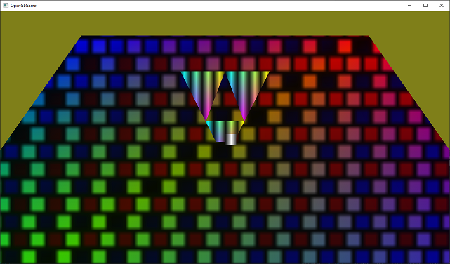
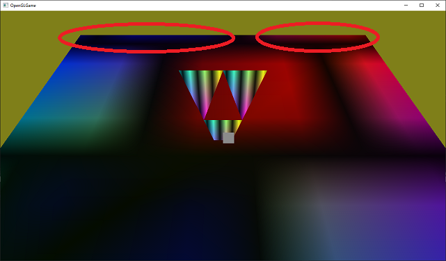
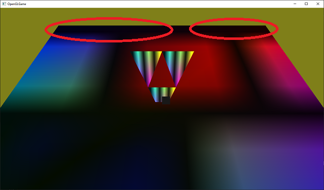

[OpenGL 3D 2021 第04回]

# テクスチャのしくみ

## 習得目標

* プリミティブに画像を貼り付ける方法
* テクスチャ座標の見かた
* ラップ・モードによるテクスチャの見えかたの違いを理解する
* テクスチャ・フィルタによる見えかたの違いを理解する

## 1. テクスチャを使う

### 1.1 テクスチャをプリミティブに貼るということ

物体の表面の細かな模様や凹凸まで全てを`GL_LINES`や`GL_TRIANGLES`で作成し、色などの属性を指定すれば、理論上はあらゆる物体を表現できます。しかし、この方法では信じられない数のプリミティブが必要になってしまいます。

そこで、プリミティブに画像を貼り付ける「テクスチャ・マッピング」という技法が考案されました。`texture`(テクスチャ)は「織物の出来栄え、手触り、物の質感」という意味です。

例えば、次の画像の床や壁などは、わずかな数のプリミティブで作られた単なる平面です。しかし、そこに石模様のテクスチャを貼り付けることで、あたかも本当に石のモデルで作られているかのように見せています。もちろん、近くに寄って見ると、実際には平面に書かれた絵だとばれてしまうわけですが。

<p align="center">

</p>

なお、「マッピング(mapping)」の意味は「地図を書く」より「貼り付ける、割り当てる」と考えるほうがイメージしやすいかもしれません。

テクスチャとシェーダを組み合わせることで、物体の色だけでなく、凹凸や物体の濡れ具合といったさまざまな状態を表すことができます。

### 1.2 画像データを定義する

テクスチャは画像データから作られます。画像データには目的に応じてさまざまな形式が存在します。今回はもっとも一般的な形式である`RGBA8`形式で作成します。これは、

>1ピクセルに赤、緑、青、不透明度の4要素があり、各要素のビット数が8

という形式です。OpenGLでは32bit型の<ruby>`GLuint`<rt>ジーエル・ユー・イント</rt></ruby>に相当します。画像データはこの`GLuint`の1次元配列として定義します。一般的にはファイルから画像データを読み込みますが、今回はデータの構造が分かるように、プログラム中に直接定義することにします。

画像が大きいと手で書くのが大変になるので、作成するのは8x8の大きさとします。それでも、`0x12345678`のような数値を64個書く必要があります。ただ、これくらいの桁数になると、数字を見間違える可能性が高くなります。そこで、いくつかの色を1文字の変数で定義して、それらを並べて画像を作ることにしました。

描画データリストの定義の下に、次のプログラムを追加してください。

```diff
 const Primitive primGround(GL_TRIANGLES, 6, 0, 0); // 四角形
 const Primitive primTriangles(GL_TRIANGLES, 9, 12 * sizeof(GLushort), 0); // 三角形
 const Primitive primCube(GL_TRIANGLES, 36, 21 * sizeof(GLushort), 19); // 立方体
+
+// 画像データ.
+const int imageGroundWidth = 8; // 画像の幅.
+const int imageGroundHeight = 8; // 画像の高さ.
+const GLuint X = 0xff'18'18'18; // 黒.
+const GLuint W = 0xff'ff'ff'ff; // 白.
+const GLuint R = 0xff'10'10'e0; // 赤.
+const GLuint B = 0xff'e0'10'10; // 青.
+const GLuint imageGround[imageGroundWidth * imageGroundHeight] = {
+  X, B, B, B, X, W, W, W,
+  X, B, B, B, X, W, W, W,
+  X, B, B, B, X, W, W, W,
+  X, X, X, X, X, X, X, X,
+  W, W, X, R, R, R, X, W,
+  W, W, X, R, R, R, X, W,
+  W, W, X, R, R, R, X, W,
+  X, X, X, X, X, X, X, X,
+};

 /// 頂点シェーダ.
 static const GLchar* const vsCode =
```

画像データの幅と高さは、このデータをテクスチャとして登録するために必要となります。そこで、`imageGroundWidth`(イメージ・グラウンド・ウィス)、`imageGroundHeight`(イメージ・グラウンド・ハイト)という変数を定義しています。

色データは`X`、`W`、`R`、`B`という定数を定義し、これらを使って作成することにします。このようにする理由は、32ビットのデータをそのまま書くと、手間がかかるうえに間違えやすいからです。白、赤、青の変数名は`White`、`Red`、`Blue`の頭文字です。黒だけ`B`ではなく`X`にしているのは、頭文字が青と重複するためです。

色データは32ビットを8ビット単位に区切り、前から「アルファ、赤、緑、青」の順で設定します。ビット単位で値を設定する場合、10進数より16進数のほうが分かりやすいです。また、色データの桁を把握しやすくするために、数値の区切り記号として`'`(シングル・クォーテーション、Shift+7キー)を使っています。この機能はC++14で追加されました。

こうして定義した`imageGround`(イメージ・グラウンド)配列は次のような模様になります(なぜグラウンドという名前なのかというと、この画像を地面に貼る予定だからです)。

<p align="center">

</p>

ところで、この画像では赤い部分が上に、青い部分が下になっていますね。しかし、先程定義した画像データでは、赤色を表す変数`R`は下に、青色を示す変数`B`は上に書いています。上下が逆さまになってますね。理由は、OpenGLの画像データが、画像の下から上に向かって記録するルールになっているからです。

### 1.3 <ruby>CreateImage2D<rt>クリエイト・イメージ・ツーディ</rt></ruby>を宣言する

それでは、画像データをテクスチャとして使えるようにしていきましょう。テクスチャを作成する関数は`CreateImage2D`(クリエイト・イメージ・ツーディ)という名前にします。`GLContext.h`を開き、次のプログラムを追加してください。

```diff
 GLuint CreateVertexArray(GLuint vboPosition, GLuint vboColor, GLuint ibo);
 GLuint CreateProgram(GLenum type, const GLchar* code);
 GLuint CreatePipeline(GLuint vp, GLuint fp);
+GLuint CreateImage2D(GLsizei width, GLsizei height, const void* data);

 } // namespace GLContext

 #endif // GLCONTEXT_H_INCLUDED
```

テクスチャの作成にはさまざまな情報が必要ですが、そのすべてを引数で指定するのは現実的ではありません。今回は、最低限必要な画像の幅、画像の高さ、画像データの3つを引数で指定できるようにして、残りの情報は関数の中で設定することにしました。

### 1.4 <ruby>CreateImage2D<rt>クリエイト・イメージ・ツーディ</rt></ruby>を定義する

テクスチャ作成関数は少し長いので、ちょっとずつ実装していきます。最初はコメントと雛形から書いていきましょう。`GLContext.cpp`を開き、`CreatePipeline`関数の定義の下に、次のプログラムを追加してください。

```diff
     glDeleteProgramPipelines(1, &id);
     return 0;
   }
   return id;
 }
+
+/**
+* 2Dテクスチャを作成する.
+*
+* @param width   画像の幅(ピクセル数).
+* @param height  画像の高さ(ピクセル数).
+* @param data    画像データのアドレス.
+*
+* @retval 0以外  作成したテクスチャ・オブジェクトのID.
+* @retval 0      テクスチャの作成に失敗.
+*/
+GLuint CreateImage2D(GLsizei width, GLsizei height, const void* data)
+{
+  glGetError(); // エラー状態をリセット.
+
+  GLuint id;
+
+  return id;
+}

 } // namespace GLContext
```

それではテクスチャ作成プログラムを書いていきましょう。テクスチャの作成は以下の4つの手順で行います。

>1. テクスチャ・オブジェクトを作成する。
>2. テクスチャ用のGPUメモリを確保する。
>3. テクスチャデータをGPUメモリにコピーする。
>4. テクスチャのパラメータを設定する。

`1.`の「テクスチャ・オブジェクトの作成」は、`glCreateTextures`(ジーエル・クリエイト・テクスチャーズ)関数で行います。`2.`の「GPUメモリの確保」は、`glTextureStorage2D`(ジーエル・テクスチャ・ストレージ・ツーディ)関数で行います。`CreateImage2D`関数の定義に次のプログラムを追加してください。

```diff
 GLuint CreateImage2D(GLsizei width, GLsizei height, const void* data)
 {
   glGetError(); // エラー状態をリセット.

+  // テクスチャ・オブジェクトを作成し、GPUメモリを確保する.
   GLuint id;
+  glCreateTextures(GL_TEXTURE_2D, 1, &id);
+  glTextureStorage2D(id, 1, GL_RGBA8, width, height);

   return id;
 }
```

<p><code class="tnmai_code"><strong>【書式】</strong><br>
void glCreateTextures(テクスチャの種類, 作成する数,<br>
&emsp;テクスチャ・オブジェクトIDを格納する変数のアドレス);
</code></p>

`glCreateTextures`は指定した種類のテクスチャ・オブジェクトを作成します。`glCreateBuffers`や`glCreateVertexArrays`などと同じく、一度に複数のオブジェクトを作成できます。

テクスチャの種類には様々なものが指定できますが、本テキストで使うテクスチャの種類は`GL_TEXTURE_2D`だけです。よく使われるテクスチャの種類を以下に示します。

定数名|内容
---|---
<ruby>GL_TEXTURE_1D<rt>ジーエル・テクスチャ・ワンディ</rt></rubh>|一次元画像
<ruby>GL_TEXTURE_2D<rt>ジーエル・テクスチャ・ツーディ</rt></rubh>|二次元画像
<ruby>GL_TEXTURE_3D<rt>ジーエル・テクスチャ・スリーディ</rt></rubh>|三次元画像
<ruby>GL_TEXTURE_CUBE_MAP<rt>ジーエル・テクスチャ・キューブ・マップ</rt></rubh>|キューブマップ画像
<ruby>GL_TEXTURE_2D_ARRAY<rt>ジーエル・テクスチャ・ツーディ・アレイ</rt></rubh>|二次元画像の配列
<ruby>GL_TEXTURE_BUFFER<rt>ジーエル・テクスチャ・バッファ</rt></rubh>|数値を格納するテクスチャ

テクスチャにはここに挙げた以外にも様々な種類があります。詳しくは`https://www.khronos.org/opengl/wiki/Texture#Theory`を参照してください。

<p><code class="tnmai_code"><strong>【書式】</strong><br>
void glTextureStorage2D(テクスチャ・オブジェクトID, 作成するレベル数,<br>
&emsp;内部イメージ形式, テクスチャの幅, テクスチャの高さ);
</code></p>

`glTextureStorage2D`はGPUメモリを確保し、テクスチャ・オブジェクトに割り当てます。必要なメモリ量は引数から自動的に計算されます。

「作成するレベル数」は、テクスチャが持つ「ミップマップ・レベルの枚数」です。ミップマップ(MIP map)というのは「オブジェクトとカメラの距離に応じて大きさの違うテクスチャを使い分ける機能」のことです。

プリミティブが遠くに表示される場合、そこに貼り付けた画像も縮小されます。しかし、画像の縮小はとても時間のかかる処理なので、ゲームなどでは使い物になりません。

しかし、実際のGPUは確かに非常に素早く縮小をやってのけています。実は、GPUは1/2の縮小までなら高速かつ正しく縮小できるように作られているのです。そのかわり、1/2より小さくなる場合は縮小っぽく見える処理でごまかします。そのため、あまり綺麗な見た目にはなりません。

MIPMAPは、事前に1/2, 1/4, 1/8,...のサイズに縮小した画像を用意しておくことで、どんなサイズでも正確に縮小できるようにします。また、遠距離の物体に対して巨大なテクスチャを読み込む必要がなくなるため、GPUが処理に使う時間も短くなります。

MIPMAPはレベル0が最も距離が近い場合で、数字が大きくなるほどより遠い場合に使われるテクスチャとなります。レベルの最大値はハードウェアやドライバによって違いますが、8か16が多いです。

>**【MIPってどういう意味？】**<br>
>MIPはラテン語の「*multum in parvo*」の略称です。これは「小さな入れ物に、たくさんの物が入っている」というような意味だそうです。

「内部イメージ形式」は、画像データがどのようにGPUメモリに格納されるかを指定します。よく使われる形式を以下に示します。

定数名|意味
:-:|---
<ruby>GL_R8<rt>ジーエル・アール・はち</rt></ruby>|8bitの赤成分のみ
<ruby>GL_RGBA8<rt>ジーエル・アールジービーエー・はち</rt></ruby>|それぞれ8bitの赤緑青および透明度の4成分
<ruby>GL_RGBA16F<rt>ジーエル・アールジービーエー・じゅうろく・エフ</rt></ruby>|それぞれ16bit浮動小数点数の赤緑青および透明度の4成分
<ruby>GL_RGB565<rt>ジーエル・アールジービー・ごーろくご</rt></ruby>|5bitの赤、6bitの緑、5bitの青の3成分

なお、一部の色成分だけを格納する形式を指定した場合、格納されない色成分を読み出した結果は0になります。例えば`GL_R8`を指定すると、赤成分だけを持つテクスチャが作られます。このテクスチャから緑や青成分を読み出すと、常に`0.0`になるということです。

`GL_R8`は、白黒画像を扱うために使われます。赤色だけの画像を扱えないわけではありませんが、基本的には単に1成分の画像を表す形式です。なお、現実の世界では純粋に単一色で表現できる物体はほとんど存在せず、基本的にはすべての色成分が混じっています。そのため、単色に見える物体であっても`GL_RGBA8`などのほうが適しています。

その他のさまざまな内部イメージ形式について、詳しくは`https://www.khronos.org/opengl/wiki/Image_Format`を参照してください。

「テクスチャの幅」と「テクスチャの高さ」は、テクスチャの縦と横のピクセル数です。今回は画像と同じにしています。最小値は`1`です。最大値は実行環境によって違いますが、OpenGL 4.0までは少なくとも`1024`、OpenGL 4.1以降は少なくとも`16384`が保証されています。

>**【数字の英語読みと日本語読み】**<br>
>英語のほうが発音が長くなる傾向があるため、数字部分に限っては日本語で読まれることが多いです。しかし、1D,2D,3Dについては、慣習的にワンディ、ツーディ、スリーディと発音されることが多いようです。とはいえ、いちディ、にーディ、さんディでも全く問題はありません。日本人になら十分に通じます。

### 1.5 GPUメモリに画像データを転送する

テクスチャ・オブジェクトを作成しGPUメモリを確保したら、そこに画像データを転送します。これには`glTextureSubImage2D`(ジーエル・テクスチャ・サブ・イメージ・ツーディ)関数を使います。

```diff
   GLuint id;
   glCreateTextures(GL_TEXTURE_2D, 1, &id);
   glTextureStorage2D(id, 1, GL_RGBA8, width, height);
+
+  // GPUメモリにデータを転送する.
+  glTextureSubImage2D(id, 0, 0, 0, width, height, GL_RGBA, GL_UNSIGNED_BYTE, data);
+  const GLenum result = glGetError();
+  if (result != GL_NO_ERROR) {
+    std::cerr << "[エラー]" << __func__ << "テクスチャの作成に失敗\n";
+    glDeleteTextures(1, &id);
+    return 0;
+  }

   return id;
 }
```

<p><code class="tnmai_code"><strong>【書式】</strong><br>
void glTextureSubImage2D(テクスチャ・オブジェクトID, 転送先レベル,<br>
&emsp;転送先X座標, 転送先Y座標, 転送データの幅, 転送データの高さ,<br>
&emsp;ピクセル形式, データの型, データのアドレス);
</code></p>

やたらとたくさんの引数を持つ関数ですが、言っていることは「「幅、高さ、画像形式、データの型」で定義されたデータを、テクスチャの「レベル、転送先X, Y座標」の位置にコピーせよ」という意味です。

例えば`glTextureStorage2D(id, 4, GL_RGBA8, 800, 600);`という引数でGPUメモリを確保したとします(緑の四角)。そこに`glTextureSubImage2D(id, 0, 200, 50, 500, 400, GL_RGBA, GL_UNSIGNED_BYTE, data);`という引数でデータを転送した場合、そのデータは下図のように転送されます(赤の四角)。

<p align="center">
<br>
[800x600のテクスチャの(200, 50)の位置に、500x400の画像を転送]
</p>

「ピクセル形式」はデータに格納されている「色の種類と順序」を指定します。例えば、赤緑青の順で成分が格納されている場合は`GL_RGB`(ジーエル・アールジービー)を指定します。赤成分のみのデータの場合は`GL_RED`(ジーエル・レッド)を指定します。詳しくは`https://www.khronos.org/opengl/wiki/Pixel_Transfer#Pixel_format`を参照してください。

ピクセル形式と内部イメージ形式が異なる場合、OpenGLはピクセル形式を内部イメージ形式に変換してGPUメモリにコピーします。

>**【内部イメージ形式とピクセル形式の違い】**<br>
>「ピクセル形式」は、GPUメモリを確保するときに出てきた「内部イメージ形式」とよく似ています。しかし、両者はまったく異なる意味で使われます。間違えやすいので注意してください。とはいえ、多くの場合はほぼ同じ形式を指定することになります。<br>
>また、歴史的な理由で内部イメージ形式には、ピクセル形式と同じ定数を指定することが出来てしまいます。しかし、内部イメージ形式には常に`GL_RGBA8`のように末尾にサイズの付いた定数(あるいは圧縮形式の定数)を使ってください。そうすれば、ピクセル形式と混同することを避けられるでしょう。

「データの型」という引数は、転送元の(CPUメモリにある)画像が、どのように色を格納しているかを指定します。基本的には「各色成分の大きさ」を指定しますが、特殊な格納形式の場合は対応する定数を指定します。

例えば画像データの色成分が各色8ビット(=1バイト)で格納されている(一般的な画像の)場合、`GL_UNSIGNED_BYTE`を指定します。色成分が各色5ビットで、それを16ビット(=2バイト)に結合した値が格納されている場合は、`GL_UNSIGNED_SHORT_5_5_5_1`を指定します。詳しくは`https://www.khronos.org/opengl/wiki/Pixel_Transfer#Pixel_type`を参照してください。

データを転送したあとは、`glGetError`関数でエラーチェックを行います。エラー自体はデバッグ出力機能で検出できますが、エラーの有無で処理を分けたいときは自分で調べる必要があります。

`glGetError`は、エラーがなければ`GL_NO_ERROR`を返します。ということは、エラーが起きたときは「それ以外」が返されるわけです。だから、`result != GL_NO_ERROR`の場合にエラー処理を行うようにしています。

エラーが起きたときは、作成したテクスチャ・オブジェクトを削除しなくてはなりません。これには`glDeleteTextures`(ジーエル・デリート・テクスチャーズ)関数を使います。

<p><code class="tnmai_code"><strong>【書式】</strong><br>
void glDeleteTextures(削除する数,<br>
&emsp;テクスチャ・オブジェクトIDを格納する変数のアドレス);
</code></p>

テクスチャを削除したら`0`を返して終了します。バッファ・オブジェクトと同様に、`0`は「テクスチャ・オブジェクトがない」ことを示すからです。

これで`CreateImage2D`関数は完成です。

>**【1章のまとめ】**<br>
>
>* プリミティブに貼り付ける画像データのことを「テクスチャ」という。
>* OpenGLの画像データは「画像の下から上」に向かって格納される。
>* `glTextureSubImage2D`関数は、テクスチャの好きな場所に、好きな大きさのデータをコピーできる。

<div style="page-break-after: always"></div>

## 2. テクスチャの表示

### 2.1 テクスチャオブジェクトを作成する

`CreateImage2D`を使ってテクスチャオブジェクトを作成していきます。`degree`変数を定義するプログラムの下に、次のプログラムを追加してください。

```diff
   // 座標変換行列の回転角度.
   float degree = 0;

+  // テクスチャを作成.
+  const GLuint texGround = GLContext::CreateImage2D(
+    imageGroundWidth, imageGroundHeight, imageGround);
+  if (!texGround) {
+    return 1;
+  }

   // メインループ.
   while (!glfwWindowShouldClose(window)) {
```

地面用のテクスチャにする予定なので、変数名は`texGround`(テックス・グラウンド)としました。これでテクスチャオブジェクトの作成は完了です。

### 2.2 テクスチャオブジェクトを削除する

作成したテクスチャオブジェクトは、不要になったら削除しなければなりません。後始末をするプログラムに、次のプログラムを追加してください。

```diff
     glfwSwapBuffers(window);
   }

   // 後始末.
+  glDeleteTextures(1, &texGround);
   glDeleteProgramPipelines(1, &pipeline);
   glDeleteProgram(fp);
   glDeleteProgram(vp);
```

テクスチャオブジェクトを削除するには、`CreateImage2D`関数でも使った`glDeleteTextures`を使います。

### 2.4 サンプラとテクスチャ・イメージ・ユニット

OpenGLは作成したテクスチャオブジェクトを自動的に使ってくれたりはしません。テクスチャを使うようにシェーダを書き換える必要があります。`GLSL`でテクスチャを扱うには、テクスチャを選択する`sampler`(サンプラ)型と、テクスチャから色を取得する`texture`(テクスチャ)関数を使います。

テクスチャの種類に応じてさまざまなサンプラが存在します。今回扱うのは2Dテクスチャなので、`sampler2D`(サンプラ・ツーディ)を使います。1Dテクスチャなら`sampler1D`、3Dテクスチャなら`sampler3D`というように、テクスチャの種類によって使えるサンプラ型が決められています。間違ったサンプラ型を指定するとテクスチャを読み込めません。

サンプラ変数の名前は`texColor`(テックス・カラー)とします(`tex`は`texture`の短縮形)。それでは、フラグメント・シェーダに次のプログラムを追加してください。

```diff
 static const GLchar* const fsCode =
   "#version 450 \n"
   "layout(location=0) in vec4 inColor; \n"
   "out vec4 fragColor; \n"
+  "layout(binding=0) uniform sampler2D texColor; \n"
   "void main() { \n"
-  "  fragColor = inColor; \n"
+  "  vec4 tc = texture(texColor, gl_FragCoord.xy * 0.01); \n"
+  "  fragColor = inColor * tc; \n"
   "}";
```

サンプラは`uniform`変数でなければなりません。また、レイアウト修飾子には、`location`ではなく`binding`(バインディング)修飾子を書きます。`binding`修飾子は「テクスチャ・イメージ・ユニット」のユニット番号を指定します。

「テクスチャ・イメージ・ユニット」はOpenGLコンテキストの一部で、テクスチャとサンプラの割り当てを管理しています。サンプラ、テクスチャ、そしてテクスチャ・イメージ・ユニットは次の図のように接続されます。

<p align="center">
<br>
</p>

この図では、テクスチャAはユニット0を通じてサンプラXに割り当てられ、テクスチャBはユニット4を通じてサンプラYに割り当てられます。同様に、テクスチャCとサンプラZはユニット1を通じてつながっています。

同じテクスチャを複数のユニットに割り当てることができます。また、同じユニットに複数のサンプラを割り当てることもできます。例えば、テクスチャAをユニット0とユニット1に割り当て、ユニット0にはサンプラXとZを、ユニット1にはサンプラYを割り当てる、ということも可能です。

### 2.5 テクスチャから色を読み取る

<p><code class="tnmai_code"><strong>【書式】</strong><br>
vec4 texture(サンプラ, テクスチャ座標);
</code></p>

`texture`関数は、「サンプラ」に割り当てられたテクスチャから、「テクスチャ座標」の位置にある色を読み取ります。テクスチャ座標には`gl_FragCoord`(ジーエル・フラグ・コード)変数を使います。

`gl_FragCoord`は`vec4`型の`in`変数で、`gl_Position`と同じく`GLSL`で用途が決められています。この変数は`GLSL`が自動的に定義してくれるので、プログラマが定義する必要はありません。

`gl_FragCoord`には、スクリーン座標系においてピクセルが描かれる位置が格納されます。スクリーン座標系なので原点(0, 0)は左下、画面サイズは1280x720なので右上が(1279, 719)になります。ただ、この数値はテクスチャ座標としては大きすぎます。そこで、もう少し小さい数値にするために`0.01`を掛けているわけです。

#### スウィズリング

`vec4`など`GLSL`のベクトル型には「スウィズリング」という機能があります。`.`(ピリオド)に続いて`x`, `y`, `z`, `w`を書くことで、一部の要素だけを取り出したり、順序を入れ替えて取り出すことができます。上記のプログラムでは`gl_FragCoord`変数をテクスチャ座標として使うために、xy要素を2要素ベクトル(つまり`vec2`型)として取り出しています。

#### ベクトルの乗算

ベクトル型の乗算は、以下に示すように、お互いの要素を個別に乗算した結果になります。

>  ```c++
>  vec4 a = vec4(1, 2, 3, 4);
>  vec4 b = vec4(8, 7, 6, 5);
>  vec4 c = a * b;
>  vec4 d;
>  d.x = a.x * b.x;
>  d.y = a.y * b.y;
>  d.z = a.z * b.z;
>  d.w = a.w * b.w;
>  //この時点で変数cとdの値は等しい
>  ```

乗算だけでなく四則演算は全てこのルールで動作します。上記のプログラムでは、頂点カラーとテクスチャカラーを合成するために乗算を使っています。

### 2.7 テクスチャをテクスチャ・イメージ・ユニットに割り当てる

テクスチャを表示するための最後の仕事は、テクスチャをテクスチャ・イメージ・ユニットに割り当てる作業です。地面を表示するプログラムに、次のプログラムを追加してください。

```diff
     const glm::mat4 matMVP = matProj * matView * matModel;
     glProgramUniformMatrix4fv(vp, locMatTRS, 1, GL_FALSE, &matMVP[0][0]);
+
+    glBindTextureUnit(0, texGround); // テクスチャを割り当てる.

     primGround.Draw();
     primTriangles.Draw();
     primCube.Draw();
```

<p><code class="tnmai_code"><strong>【書式】</strong><br>
void glBindTextureUnit(ユニット番号, テクスチャオブジェクトID);
</code></p>

`glBindTextureUnit`関数を使うと、指定したテクスチャを「ユニット番号」に対応するテクスチャ・イメージ・ユニットに割り当てます。

プログラムが書けたらビルドして実行してください。以下ような画像が表示されたら成功です。

<p align="center">
<br>
</p>

>**【同時に使えるテクスチャの数】**<br>
>テクスチャ・イメージ・ユニットの数には限りがあります。さらに、シェーダステージごとに使える数の制限があります。OpenGL 4.1以上のバージョンでは、フラグメント・シェーダでは少なくとも16個のユニットが使えることになっています。この制限を超える数のテクスチャを使うときは、プログラムで適宜テクスチャを割り当て直さなくてはなりません。<br>
>なお、世の中には4.1対応を謳っているにもかかわらず、ユニット数が15個以下のGPUが存在しますので、気をつけてください。

### 2.8 テクスチャの割り当てを解除する

テクスチャを使い終わったら、すみやかに割り当てを解除しなければなりません。プリミティブを描画するたびに、割り当てられている全てのテクスチャに対して読み込み準備作業が発生するからです。

読み込み準備作業は、シェーダがそのテクスチャを使わなくても発生します。そのため、使われないテクスチャの準備にかかる時間のぶんだけ、本来の描画にかけられる時間が減ってしまいます。ですから、不必要に時間を消費しないように、使わないテクスチャの割り当てを解除しておく必要があるのです。

テクスチャの割り当てを解除するには`glBindTextureUnit`関数のテクスチャオブジェクトIDに`0`を指定します。OpenGLの仕様にはそう書いてあります。しかし、大変残念なことに、2021年3月現在、インテル社のWindows用グラフィックス・ドライバは、この仕様を満たしていません。

そこで、古い方法を使って割り当てを解除します。古い方法では`glActiveTexture`(ジーエル・アクティブ・テクスチャ)関数と、`glBindTexture`(ジーエル・バインド・テクスチャ)関数の2つを組み合わせます。プリミティブを描画するプログラムの下に、次のプログラムを追加してください。

```diff
     glBindTextureUnit(0, texGround); // テクスチャを割り当てる.

     primGround.Draw();
     primTriangles.Draw();
     primCube.Draw();
+
+    // テクスチャの割り当てを解除.
+    glActiveTexture(GL_TEXTURE0);
+    glBindTexture(GL_TEXTURE_2D, 0);

     glBindProgramPipeline(0);
     glBindVertexArray(0);
```

<p><code class="tnmai_code"><strong>【書式】</strong><br>
void glActiveTexture(テクスチャユニット番号);
</code></p>

`glActiveTexture`関数は、そのあとの`glBindTexture`関数が操作するテクスチャ・イメージ・ユニットの番号を指定します。ただし、番号は`GL_TEXTURE0`や`GL_TEXTURE15`といったマクロ定数で指定しなければなりません。

<p><code class="tnmai_code"><strong>【書式】</strong><br>
void glBindTexture(テクスチャの種類, テクスチャオブジェクトID);
</code></p>

`glBindTexture`関数は、`glActiveTexture`で指定したユニットに対して、テクスチャオブジェクトIDを割り当てます。テクスチャオブジェクトIDが`0`の場合は、現在割り当てられているテクスチャを解除します。

「テクスチャの種類」には、IDで指定したテクスチャが2次元テクスチャなのか、3次元テクスチャなのか、といったことをマクロ定数で指定します。バインドを解除するときは、現在割り当てられているテクスチャの種類を指定します。今回の場合、割り当てているのは2Dテクスチャなので、`GL_TEXTURE_2D`という定数を指定しています。

>**【なぜglBindTextureUnitが作られたのか】**<br>
>`glActiveTexture`と`glBindTexture`を使えば`glBindTextureUnit`と同じことが実現できます。それなのにOpenGL 4.5で`glBindTextureUnit`が追加されたのは、これらの古い関数は扱いを間違える可能性があったからです。古い方法では、種類の異なるテクスチャを同じテクスチャイメージスロットに割り当てることができてしまいます。割り当てたテクスチャのどれかひとつだけが有効で、それはOpenGLが勝手に決めてしまいます。つまり、使うテクスチャをプログラムで制御できないわけです。

プログラムが書けたらビルドして実行してください。割り当て解除プログラムを追加する前と全く同じ見え方になっていたら(多分)成功です。

<p align="center">
<br>
</p>

<pre class="tnmai_assignment">
<strong>【課題01】</strong>
三角形のための画像データを定義しなさい。大きさは6x6ピクセルで、白と黒の縞模様にしてください。配列変数の名前は<code>imageTriangle</code>としてください。
</pre>

<pre class="tnmai_assignment">
<strong>【課題02】</strong>
<code>GLContext::CreateImage2D</code>関数を使って、課題01で作成した<code>imageTriangle</code>からテクスチャオブジェクトを作成しなさい。テクスチャオブジェクトの変数名は<code>texTriangle</code>としてください。<code>glDeleteTextures</code>関数で削除するのを忘れないように。
</pre>

<pre class="tnmai_assignment">
<strong>【課題03】</strong>
<code>positions</code>配列の値を修正して、三角形の大きさを10倍にしなさい。
</pre>

<pre class="tnmai_assignment">
<strong>【課題04】</strong>
次の図を参考にして、<code>texcoords</code>配列に三角形のテクスチャ座標データを追加しなさい。
<p align="center"></p></pre>

課題01と02で作成したテクスチャを三角形に貼り付けてみましょう。三角形を描画するプログラムの手前に、次のプログラムを追加してください。

```diff
     primGround.Draw();
+
+    glBindTextureUnit(0, texTriangle); // テクスチャを割り当てる.
     primTriangles.Draw();
     primCube.Draw();

     // テクスチャの割り当てを解除.
     glActiveTexture(GL_TEXTURE0);
```

プログラムが書けたらビルドして実行してください。三角形に縞模様が表示されていたら成功です。

<p align="center">
<br>
</p>

>**【デフォルト・テクスチャに手を出すな！】**<br>
>実は、テクスチャ・オブジェクトID`0`には、OpenGLを初期化したときに自動的にテクスチャ・オブジェクトが割り当てられます(このテクスチャのことを「デフォルト・テクスチャ」といいます)。ですから厳密には「オブジェクトがない」という状態はありえません。デフォルト・テクスチャは、プリミティブごとにひとつのテクスチャしか使えなかったOpenGL 1.0時代の名残です。<br>
>デフォルト・テクスチャは特別扱いされていて、`glDeleteTextures`でも削除できません。また、他の`glCreate`系関数と同様に、`glCreateTextures`関数も絶対に`0`を返しません。しかし、それ以外はあらゆる操作を受け付けます。`0`を「テクスチャが設定されていないことを示す数値」として適切に使うために、デフォルト・テクスチャに何かを設定するべきではありません。

<br>

>**【2章のまとめ】**<br>
>
>* 「サンプラ」はシェーダがテクスチャを読み込むときに使うオブジェクト。
>* 「テクスチャ・イメージ・ユニット」はサンプラとテクスチャを結びつける機能。
>* シェーダでテクスチャを読み出すには、サンプラ変数を定義し、`texture`関数にサンプラ変数を指定する。
>* 環境によっては最新のOpenGLの関数が使えないことがある。

<div style="page-break-after: always"></div>

## 3. テクスチャ座標

### 3.1 テクスチャ座標を定義する

とりあえずは画像を表示できましたね。しかし、思っていたのとは違った見え方だったのではないでしょうか？　画像が地面と同じように、傾いて見えることを期待していたと思います。その理由は、プリミティブに「テクスチャ座標」を用意していなかったからです。

プリミティブに思い通りのテクスチャを貼り付けるには、画像の貼り付けたい部分の座標を、頂点データで指定しなければなりません。この座標を「テクスチャ座標」といいます。現在の頂点データにはテクスチャ座標がありませんので、追加していきましょう。

二次元画像の場合、当然ですがテクスチャ座標も二次元になります。テクスチャ座標は「テクスチャ座標系」で指定します。OpenGLのテクスチャ座標系は、画像の左下が原点(0,0)で画像の右上が(1,1)になっています。

<p align="center">
<br>
</p>

テクスチャ座標系の各軸は、`U, V`または`S, T`と呼ばれます(`X, Y`ではありません)。そのためテクスチャ座標は「UV座標」とか「ST座標」と呼ばれます。呼び方が違うだけで`UV`も`ST`も、`XY`と同じ2D座標です。そのため、実際のプログラムでは全て2Dベクトルとして扱います。

それでは、色データの定義の下に、次のプログラムを追加してください。

```diff
   {1.0f, 0.0f, 1.0f, 1.0f}, // 紫色
 };
+
+/// テクスチャ座標データ.
+const glm::vec2 texcoords[] = {
+  // 地面
+  { 0.0f, 0.0f},
+  { 1.0f, 0.0f},
+  { 1.0f, 1.0f},
+  { 0.0f, 1.0f},
+};

 /// インデックスデータ.
 const GLushort indices[] = {
```

テクスチャ座標は二次元座標なので`glm::vec2`(ジーエルエム・ベク・ツー)型の配列とします。変数名は`texcoords`(テックス・コーズ)とします。これは`texture coordinates`(テクスチャ・コーディネーツ、「テクスチャ座標」という意味)の短縮形です。

なお、本来は他のモデルについても、頂点データにテクスチャ座標を追加しなければなりません。しかし、手間がかかるので、とりあえず地面だけ設定しています。設定していない頂点のテクスチャ座標は(0, 0)になります。

>**【OpenGLのテクスチャ座標系はなぜSTなのか】**<br>
>OpenGLが`ST`を選んだ本当の理由は分かりません。そもそもテクスチャ座標系の軸の名前が`UV`や`ST`なのは、頂点座標との混同を避けるためです。`UV`については、頂点座標が`W`,`X`,`Y`,`Z`の4つを使っているので、その直前の文字が選ばれたと言われています。DirectXなど多くのシステムでは`UV`が使われています。<br>
>`ST`の由来は不明です。数学では平面上の座標を`r=r0+S*w+T*v`で表すから、という話があります。初期のOpenGLは学術的な利用が多かったので、その分野に関わる人間ならひと目で意味が分かる文字を選んだ、というのが根拠です。<br>
>また、OpenGLでは「エバリュエータ」と呼ばれる機能(現在は廃止)の座標に`U`と`V`を割り当てていました。これとの重複を避けるため、という理由もあったようです。<br>
>文献によっては「`ST`は`UV`を正規化した値(`S=U/テクスチャの幅`, `T=V/テクスチャの高さ`)」と説明されることもあります。実際、確かにOpenGLの`ST`は正規化されています。しかし、`UV`が正規化されていない値だという仕様は見当たりませんし、DirectXの`UV`は正規化されています。

### 3.2 テクスチャ座標をVAOに追加できるようにする

続いて、テクスチャ座標データを`VAO`に設定できるようにします。`GLContext.h`を開き、`CreateVertexArray`関数の宣言を次のように書き換えてください。

```diff
 namespace GLContext {

 GLuint CreateBuffer(GLsizeiptr size, const GLvoid* data);
-GLuint CreateVertexArray(GLuint vboPosition, GLuint vboColor, GLuint ibo);
+GLuint CreateVertexArray(GLuint vboPosition, GLuint vboColor,
+  GLuint vboTexcoord, GLuint ibo);
 GLuint CreateProgram(GLenum type, const GLchar* code);
 GLuint CreatePipeline(GLuint vp, GLuint fp);
 GLuint CreateImage2D(GLsizei width, GLsizei height, const void* data);
```

定義のほうにも引数を追加しましょう。`GLContext.cpp`を開き、次のインクルード文を追加してください。

```diff
 * @file GLContext.cpp
 */
 #include "GLContext.h"
+#include <glm/glm.hpp>
 #include <vector>
 #include <iostream>
```

`glm.hpp`は、GLMライブラリの基本的な型に関する宣言を含むヘッダファイルです。次に、`CreateVertexArray`関数の定義を次のように書き換えてください。

```diff
 * @param vboPosition VAOに関連付けられる座標データ.
 * @param vboColor    VAOに関連付けられるカラーデータ.
+* @param vboTexcoord VAOに関連付けられるテクスチャ座標データ.
 * @param ibo         VAOに関連付けられるインデックスデータ.
 *
 * @return 作成したVAO.
 */
-GLuint CreateVertexArray(GLuint vboPosition, GLuint vboColor, GLuint ibo)
+GLuint CreateVertexArray(GLuint vboPosition, GLuint vboColor,
+  GLuint vboTexcoord, GLuint ibo)
 {
-  if (!vboPosition || !vboColor || !ibo) {
+  if (!vboPosition || !vboColor || !vboTexcoord || !ibo) {
     return 0;
   }
```

続いて、空いている頂点アトリビュートにテクスチャ座標データを設定します。`0`と`1`は使用済みなので`2`番のアトリビュートを使うことにします。それから、空いているバインディング・ポイントを使ってテクスチャ座標データを頂点アトリビュートに割り当てます。アトリビュートと同じく2番のバインディング・ポイントを使うことにします。

`vboColor`をバインディング・ポイントに割り当てるプログラムの下に、次のテクスチャ座標を割り当てるプログラムを追加してください。

```diff
   glVertexArrayAttribBinding(id, colorIndex, colorBindingIndex);
   glVertexArrayVertexBuffer(id, colorBindingIndex, vboColor, 0, sizeof(Color));
+
+  // テクスチャ座標データをバインディングポイントに割り当てる.
+  const GLuint texcoordIndex = 2;
+  const GLuint texcoordBindingIndex = 2;
+  glEnableVertexArrayAttrib(id, texcoordIndex);
+  glVertexArrayAttribFormat(id, texcoordIndex, 2, GL_FLOAT, GL_FALSE, 0);
+  glVertexArrayAttribBinding(id,texcoordIndex, texcoordBindingIndex);
+  glVertexArrayVertexBuffer(
+    id, texcoordBindingIndex, vboTexcoord, 0, sizeof(glm::vec2));

   glVertexArrayElementBuffer(id, ibo);

   return id;
```

最初に`glm.hpp`をインクルードしたのは、`GlVertexArrayVertexBuffer`関数に設定する「要素間の距離」を計算するためです。各関数の詳細は第02回のテキストを参照してください。

### 3.3 バッファオブジェクトをVAOに設定する

`Main.cpp`に戻り、テクスチャ座標データからバッファオブジェクトを作成します。`VAO`を作成するプログラムを、次のように変更してください。

```diff
   // VAOを作成する.
   const GLuint vboPosition = GLContext::CreateBuffer(sizeof(positions), positions);
   const GLuint vboColor = GLContext::CreateBuffer(sizeof(colors), colors);
+  const GLuint vboTexcoord = GLContext::CreateBuffer(sizeof(texcoords), texcoords);
   const GLuint ibo = GLContext::CreateBuffer(sizeof(indices), indices);
-  const GLuint vao = GLContext::CreateVertexArray(vboPosition, vboColor, ibo);
+  const GLuint vao = GLContext::CreateVertexArray(
+    vboPosition, vboColor, vboTexcoord, ibo);
   if (!vao) {
     return 1;
```

作成したバッファオブジェクトは、不要になったら削除しなくてはならないのでした。後始末をしている部分に、次のプログラムを追加してください。

```diff
   glDeleteProgram(vp);
   glDeleteVertexArrays(1, &vao);
   glDeleteBuffers(1, &ibo);
+  glDeleteBuffers(1, &vboTexcoord);
   glDeleteBuffers(1, &vboColor);
   glDeleteBuffers(1, &vboPosition);
```

### 3.4 頂点シェーダにテクスチャ座標を送る

テクスチャ座標データを用意して`VAO`に設定したので、そのデータを使うようにシェーダを書きかえましょう。頂点データは頂点シェーダに送られますので、まずはこちらから対応していきます。`Main.cpp`を開き、頂点シェーダに次のプログラムを追加してください。

```diff
   "#version 450 \n"
   "layout(location=0) in vec3 vPosition; \n"
   "layout(location=1) in vec4 vColor; \n"
+  "layout(location=2) in vec2 vTexcoord; \n"
   "layout(location=0) out vec4 outColor; \n"
+  "layout(location=1) out vec2 outTexcoord; \n"
   "out gl_PerVertex { \n"
   "  vec4 gl_Position; \n"
   "}; \n"
   "layout(location=0) uniform mat4 matTRS; \n"
   "void main() { \n"
   "  outColor = vColor; \n"
+  "  outTexcoord = vTexcoord; \n"
   "  gl_Position = matTRS * vec4(vPosition, 1.0); \n"
   "}";
```

バーテックス・プラーによって読み取られたテクスチャ座標は、`in`変数の`vTexcoord`(ブイ・テックスコード)に格納されます。なぜなら、テクスチャ座標のバインディング・ポイントに`2`を指定したからです。

そして、シェーダプログラムでは、これを`outTexcoord`(アウト・テックスコード)変数に代入します。`outTexcoord`は`out`変数で、ロケーション番号は`1`です。そのため、この変数に代入した値はフラグメント・シェーダの1番目の入力変数に送られます。

### 3.5 フラグメントシェーダでテクスチャ座標を使う

フラグメントシェーダのほうにもテクスチャ座標を追加しましょう。フラグメントシェーダに次のプログラムを追加してください。

```diff
 static const GLchar* const fsCode =
   "#version 450 \n"
   "layout(location=0) in vec4 inColor; \n"
+  "layout(location=1) in vec2 inTexcoord; \n"
   "out vec4 fragColor; \n"
   "layout(binding=0) uniform sampler2D texColor; \n"
   "void main() { \n"
-  "  vec4 tc = texture(texColor, gl_FragCoord.xy * 0.01); \n"
+  "  vec4 tc = texture(texColor, inTexcoord); \n"
   "  fragColor = inColor * tc; \n"
   "}";
```

上記のプログラムでは、1番の入力変数にテクスチャ座標を受け取り、それを`texture`関数の引数として使っています。これで、頂点のテクスチャ座標を元にしてテクスチャが貼られるようになります。

プログラムが書けたらビルドして実行してください。テクスチャが地面いっぱいに表示されていたら成功です。

<p align="center">
<br>
</p>

>**【3章のまとめ】**<br>
>
>* プリミティブにテクスチャを貼り付けるには、頂点にテクスチャ座標を設定する。
>* テクスチャ座標は2次元座標で、通常は0.0～1.0の範囲で指定する。

<div style="page-break-after: always"></div>

## 4. サンプラ・オブジェクト

### 4.1 ラップ・モード

下の画像の赤で囲んだ部分に注目してください。地面の端っこが青色っぽくなっていたり、赤色っぽくなっている部分がありますね。

<p align="center">
<br>
</p>

しかし、画像データは下記の形だったはずです。上端の部分は全部黒で、先ほどの画像のように青や赤は見えません。これはどういうことなんでしょう。

<p align="center">
<br>
</p>

画像の端に色がつくのは、GPUがテクスチャ座標0.0～1.0の外側を自動的に計算しているためです。つまり、自動計算された色が見えてしまっているわけです。

テクスチャ座標は、0.0より小さくしたり、1.0より大きくすることが可能です。0.0～1.0の範囲を超えた部分の色は、GPUが自動計算します。この計算方法は「ラップ・モード」を指定することで変更できます。

ラップ・モードには以下の5種類が指定できます。オレンジの枠の中が画像データ、外がGPUの作り出すデータです。

<p align="center">
<br>
</p>

最初、ラップ・モードには一番左の`GL_REPEAT`(ジーエル・リピート)が設定されています。 `GL_REPEAT`は、0.0～1.0の外側に同じ画像データを無限に並べます。計算上は「整数部分を切り捨てる」という動作になります。このため、テクスチャ座標0.5と4129.5はどちらも同じピクセルデータが使われます。

`GL_REPEAT`では同じ画像データが並べられるので、上端を超えた部分には画像データの一番下の部分が繋がります(画像がループしているイメージです)。さきほどの赤丸の部分は、画像の下端の色が表示されていたわけです。

そして、GPUはテクスチャを拡大・縮小するとき周囲のピクセルの色を混ぜ合わせます。これは色がなめらかに移り変わるようにするためです。この混ぜ合わせ機能と`GL_REPEAT`の組み合わせによって、反対側の色が混ざって見えているわけです。

### 4.2 サンプラ・オブジェクト作成関数を定義する

反対側の色が混ざらないようにするには、ラップ・モードを`GL_CLAMP_TO_EDGE`(ジーエル・クランプ・トゥ・エッジ)に切り替えます。`GL_CLAMP_TO_EDGE`では、画像の端の部分の色が、外側に向かって無限に並べられます。

ラップ・モードの指定には「サンプラ・オブジェクト」というものを使います。まずはサンプラオブジェクトを作成する関数を作りましょう。関数名は`CreateSampler`(クリエイト・サンプラ)とします。`GLContext.h`を開き、次のプログラムを追加してください。

```diff
 GLuint CreateProgram(GLenum type, const GLchar* code);
 GLuint CreatePipeline(GLuint vp, GLuint fp);
+GLuint CreateSampler(GLenum wrapMode);
 GLuint CreateImage2D(GLsizei width, GLsizei height, const void* data);

 } // namespace GLContext

 #endif // GLCONTEXT_H_INCLUDED
```

続いて`GLContext.cpp`を開き、`CreatePipeline`関数の定義の下に、次のプログラムを追加してください。

```diff
     glDeleteProgramPipelines(1, &id);
     return 0;
   }
   return id;
 }
+
+/**
+* サンプラ・オブジェクトを作成する.
+*
+* @param wrapMode  ラップ・モード.
+*
+* @retval 0以外 作成したサンプラ・オブジェクト.
+* @retval 0     サンプラ・オブジェクトの作成に失敗.
+*/
+GLuint CreateSampler(GLenum wrapMode)
+{
+  glGetError(); // エラー状態をリセット.
+
+  GLuint id;
+
+  return id;
+}

 /**
 * 2Dテクスチャを作成する.
```

 サンプラオブジェクトの作成には`glCreateSamplers`(ジーエル・クリエイト・サンプラーズ)関数を使います。`CreateSampler`関数に次のプログラムを追加してください。

```diff
 GLuint CreateSampler(GLenum wrapMode)
 {
   glGetError(); // エラー状態をリセット.

+  // サンプラ・オブジェクトを作成する.
   GLuint id;
+  glCreateSamplers(1, &id);
+  if (glGetError() != GL_NO_ERROR) {
+    std::cerr << "[エラー]" << __func__ << "サンプラの作成に失敗\n";
+    glDeleteSamplers(1, &id);
+    return 0;
+  }

   return id;
 }
```

<p><code class="tnmai_code"><strong>【書式】</strong><br>
void glCreateSamplers(作成するサンプラの数, サンプラIDを格納する変数のアドレス);
</code></p>

`glCreateSamplers`関数を実行したらエラーチェックを行います。`glGetError`が `GL_NO_ERROR`以外を返した場合、サンプラの作成は失敗です。そのときは`glDeleteSamplers`(ジーエル・デリート・サンプラーズ)関数でサンプラを削除して`0`を返します。

<p><code class="tnmai_code"><strong>【書式】</strong><br>
void glDeleteSamplers(削除するサンプラの数, サンプラIDを格納する変数のアドレス);
</code></p>

次にラップ・モードを設定します。サンプラを作成するプログラムの下に、次のプログラムを追加してください。

```diff
     glDeleteSamplers(1, &id);
     return 0;
   }
+
+  // ラップ・モードを設定する.
+  glSamplerParameteri(id, GL_TEXTURE_WRAP_S, wrapMode);
+  glSamplerParameteri(id, GL_TEXTURE_WRAP_T, wrapMode);
+  if (glGetError() != GL_NO_ERROR) {
+    std::cerr << "[エラー]" << __func__ << ":ラップモードではない値が指定された.\n";
+    glDeleteSamplers(1, &id);
+    return 0;
+  }

   return id;
 }
```

ラップ・モードを設定するには`glSamplerParameteri`(ジーエル・サンプラ・パラメータ・アイ)関数を使います。

<p><code class="tnmai_code"><strong>【書式】</strong><br>
void glSmaplerParameteri(サンプラオブジェクトID, パラメータの種類, 設定する値);
</code></p>

* <ruby>**GL_TEXTURE_WRAP_S**<rt>ジーエル・テクスチャ・ラップ・エス</rt></ruby><br>
  <ruby>**GL_TEXTURE_WRAP_T**<rt>ジーエル・テクスチャ・ラップ・ティ</rt></ruby><br>
  0.0未満または1.0以上のテクスチャ座標が指定された場合の、横及び縦方向の座標の扱い方です(OpenGLではテクスチャ座標系の軸を表すのに`X`と`Y`ではなく`S`と`T`を使います)。それぞれ、次の4種類のうちから指定できます。

  ラップモード名|効果
  ---|---
  <ruby>GL_CLAMP_TO_EDGE<rt>ジーエル・クランプ・トゥ・エッジ</rt></ruby> | 0.0未満は0.0、1.0以上は1.0に切り捨てられます。
  <ruby>GL_CLAMP_TO_BORDER<rt>ジーエル・クランプ・トゥ・ボーダー</rt></ruby> | 0.0未満、1.0以上の座標は、全て<ruby>`GL_TEXTURE_BORDER_COLOR`<rt>ジーエル・テクスチャ・ボーダー・カラー</rt></ruby>というパラメータで設定した色になります。
  <ruby>GL_REPEAT<rt>ジーエル・リピート</rt></ruby> | 整数部を無視します。例えば3.5と0.5は同じ、-1.3と0.7と同じピクセルを指します。
  <ruby>GL_MIRRORED_REPEAT<rt>ジーエル・ミラード・リピート</rt></ruby> | `GL_REPEAT`と同様に整数部を無視しますが、整数部が奇数の場合は`1-小数部`を使います。例えば`2.6`は`0.6`になりますが、`1.6`の場合は`0.4`になります。負数も同様に`-0.3`は`0.3`になり、`-1.3`は`0.7`になります。
  <ruby>GL_MIRROR_CLAMP_TO_EDGE<rt>ジーエル・ミラー・クランプ・トゥ・エッジ</rt></ruby> | **このモードはOpenGL 4.4で追加されました。** -1.0～1.0の範囲は`GL_MIRRORED_REPEAT`と同様に動作し、その外側は`GL_CLAMP_TO_EDGE`のように動作します。

これでサンプラを作成する関数は完成です。

### 4.3 サンプラオブジェクトを作る

それではサンプラオブジェクトを使ってみましょう。`Main.cpp`を開き、テクスチャを作成するプログラムの下に、次のプログラムを追加してください。

```diff
  if (!texGround || !texTriangle) {
    return 1;
  }
+
+  // サンプラを作成.
+  const GLuint sampler = GLContext::CreateSampler(GL_CLAMP_TO_EDGE);
+  if (!sampler) {
+    return 1;
+  }

  // メインループ.
  while (!glfwWindowShouldClose(window)) {
```

他のオブジェクトと同じく、サンプラオブジェクトも不要になったら削除しなくてはなりません。後始末をするプログラムに、次のプログラムを追加してください。

```diff
   // 後始末.
+  glDeleteSamplers(1, &sampler);
   glDeleteTextures(1, &texTriangle);
   glDeleteTextures(1, &texGround);
   glDeleteProgramPipelines(1, &pipeline);
```

### 4.4 サンプラオブジェクトを使う

サンプラオブジェクトを有効にするには`glBindSampler`(ジーエル・バインド・サンプラ)関数を使って「テクスチャ・イメージ・ユニット」に割り当てます。`VAO`を割り当てるプログラムの下に、次のプログラムを追加してください。

```diff
     glBindVertexArray(vao);
     glBindProgramPipeline(pipeline);
+    glBindSampler(0, sampler);
+
    float s = sin(glm::radians(degree));
    float c = cos(glm::radians(degree));
```

描画が終わったらサンプラの割り当てを解除しましょう。テクスチャの割り当てを解除するプログラムの下に、次のプログラムを追加してください。

```diff
     // テクスチャの割り当てを解除.
     glActiveTexture(GL_TEXTURE0);
     glBindTexture(GL_TEXTURE_2D, 0);

+    glBindSampler(0, 0);
     glBindProgramPileline(0);
     glBindVertexArray(0);
```

<p><code class="tnmai_code"><strong>【書式】</strong><br>
void glBindSampler(ユニット番号, サンプラオブジェクトID);
</code></p>

この関数は`glBindTextureUnit`関数のサンプラオブジェクト版です。プログラムが書けたらビルドして実行してください。次の画像のように、地面の奥側が黒くなっていたら成功です。

<p align="center">
<br>
</p>

### 4.5 拡大・縮小フィルタ

テクスチャの色がボケているのは、画像を拡大・縮小するとき色がなめらかに変化するように、GPUが近くのピクセルの色を混ぜ合わせるからです。この機能を「拡大・縮小フィルタ」といいます。

次の図は、フィルタの種類によって色がどう混ぜ合わされるかを示したものです。

<p align="center">
<br>
</p>

中央の画像を見てください。太い線はテクスチャのピクセルを示しています。細い線は実際に描画されるピクセル(フラグメントといいます)を示しています。

`GL_LINEAR`(ジーエル・リニア)は、フラグメントに近い4つのピクセルを選び、フラグメントの中心から各ピクセルの中心までの距離の比率で色を混ぜ合わせます。フィルタを設定していないときは、この動作になります。

一方、`GL_NEAREST`は各フラグメントの中心部分の色だけが使われます。そのため、どれだけ拡大しても色が混ざることはありません。

混ぜ方はこの2通りだけです。縮小フィルタについては、ミップマップに関連してさらにいくつかの設定が存在します。

なお、ミップマップは簡単にいうと、描画速度を向上させるために、ポリゴンが表示されるサイズに応じて、大きさの異なるテクスチャを使い分けるテクニックです。本テキストではこのテクニックは使いません。

それでは、実際にフィルタを設定していきましょう。`GLContext.cpp`を開き、`CreateSampler`関数に次のプログラムを追加してください。

```diff
     std::cerr << "[エラー]" << __func__ << ":ラップモードではない値が指定された.\n";
     glDeleteSamplers(1, &id);
     return 0;
   }
+
+  // フィルタを設定する.
+  glSamplerParameteri(id, GL_TEXTURE_MIN_FILTER, GL_NEAREST_MIPMAP_NEAREST);
+  glSamplerParameteri(id, GL_TEXTURE_MAG_FILTER, GL_NEAREST);
+  if (glGetError() != GL_NO_ERROR) {
+    std::cerr << "[エラー]" << __func__ << ":フィルタではない値が指定された.\n";
+    glDeleteSamplers(1, &id);
+    return 0;
+  }

   return id;
 }
```

縮小フィルタ、拡大フィルタの名前と設定する値を以下に示します。

* <ruby>**GL_TEXTURE_MIN_FILTER**<rt>ジーエル・テクスチャ・ミン・フィルタ</rt></ruby><br>
  テクスチャを縮小表示する場合の読み取り方法です(`MIN`は`minify`(ミニファイ、縮小する)の略です)。これには以下の6種類があります。

  縮小フィルタ名|効果
  ---|---
  <ruby>GL_NEAREST<rt>ジーエル・ニアレスト</rt></ruby> | 読み取るテクスチャ座標に最も近い1ピクセルを読み取ります。ミップマップがある場合、最小レベルが使われます。
  <ruby>GL_LINEAR<rt>ジーエル・リニア</rt></ruby> | 読み取るテクスチャ座標に最も近い4ピクセルを読み取り、距離による加重平均を取ります。ミップマップがある場合、最小レベルが使われます。
  <ruby>GL_NEAREST_MIPMAP_NEAREST<rt>ジーエル・ニアレスト・ミップマップ・ニアレスト</rt></ruby> | カメラからの距離に最も合うミップレベルのテクスチャを選び、`GL_NEAREST`方式で読み取ります。
  <ruby>GL_LINEAR_MIPMAP_NEAREST<rt>ジーエル・リニア・ミップマップ・ニアレスト</rt></ruby> | カメラからの距離に最も合うミップレベルのテクスチャを選び、`GL_LINEAR`方式で読み取ります。
  <ruby>GL_NEAREST_MIPMAP_LINEAR<rt>ジーエル・ニアレスト・ミップマップ・リニア</rt></ruby> | カメラからの距離が最も近いミップレベルのテクスチャを2つ選び、それぞれ`GL_NEAREST`方式で読み取ったあと、カメラからの距離による加重平均を取ります。
  <ruby>GL_LINEAR_MIPMAP_LINEAR<rt>ジーエル・リニア・ミップマップ・リニア</rt></ruby> | カメラからの距離が最も近いミップレベルのテクスチャを2つ選び、それぞれ`GL_LINEAR`方式で読み取ったあと、カメラからの距離による加重平均を取ります。

  初期値は`GL_NEAREST_MIPMAP_LINEAR`です。名前に`MIPMAP`が含まれる値はミップマップを設定したテクスチャ用です。ミップマップを使わない場合は`GL_NEAREST`か`GL_LINEAR`に変更しなければなりません。

* <ruby>**GL_TEXTURE_MAG_FILTER**<rt>ジーエル・テクスチャ・マグ・フィルタ</rt></ruby><br>
  テクスチャを拡大表示する場合の読み取り方法です(`MAG`は`magnify`(マグニファイ、拡大する)の略です)。指定できるのは以下の2種類だけです。拡大では常に最大レベル(通常はレベル0)のテクスチャを使うため、MIPMAPを扱うフィルタは存在しないからです。

  拡大フィルタ名|効果
  ---|---
  <ruby>GL_NEAREST<rt>ジーエル・ニアレスト</rt></ruby> | 読み取るテクスチャ座標に最も近い1ピクセルを読み取ります。
  <ruby>GL_LINEAR<rt>ジーエル・リニア</rt></ruby> | 読み取るテクスチャ座標に最も近い4ピクセルを読み取り、距離による加重平均を取ります。
  
  このパラメータの初期値は`GL_LINEAR`です。なので、今回の場合は設定しなくても問題はなかったりします。それでも設定しているのは、`GL_TEXTURE_MIN_FILTER`だけ変更して`GL_TEXTURE_MAG_FILTER`の設定を忘れる、というミスを防ぐためです。

2種類のフィルタの使い分けですが、基本的には`GL_LINEAR`を使ってください。ドット絵風にしたい場合だけ`GL_NEAREST`を試してみるといいでしょう。

プログラムが書けたらビルドして実行してください。以下のように境界がはっきりとした画像が表示されたら成功です。

<p align="center">
<br>
</p>

>**【その他のサンプラ・パラメータについて】**<br>
>詳細は`https://www.khronos.org/opengl/wiki/Sampler_Object`を参照してください。

### 4.6 0.0～1.0の範囲を超えるテクスチャ座標

テクスチャ座標系について「画像の左下が(0,0)、右上が(1,1)」と説明しました。そして、それを超える範囲がどうなるのかは、ラップ・モードによって変わるのでした。

地面のテクスチャ座標を変更したらどうなるかを見てみましょう。地面のテクスチャ座標データを、次のように変更してください。

```diff
 /// テクスチャ座標データ.
 const glm::vec2 texcoords[] = {
   // 地面
-  { 0.0f, 0.0f },
-  { 1.0f, 0.0f },
-  { 1.0f, 1.0f },
-  { 0.0f, 1.0f },
+  {-4.0f,-4.0f },
+  { 4.0f,-4.0f },
+  { 4.0f, 4.0f },
+  {-4.0f, 4.0f },
 };

 /// インデックスデータ.
 const GLushort indices[] = {
```

プログラムが書けたらビルドして実行してください。以下の画像のように表示されていたら成功です。5.1節にある`GL_CLAMP_TO_EDGE`の図と見比べてみてください。

<p align="center">
<br>
</p>

<pre class="tnmai_assignment">
<strong>【課題05】</strong>
ラップ・モードを変更して実行し、5.1節の図のとおりに見た目が変化することを確認しなさい。
コメント化などで、三角形と立方体の描画を一時的に無効化すると確認しやすいでしょう。
確認したあとは<code>GL_REPEAT</code>を設定しなさい。
</pre>

<pre class="tnmai_assignment">
<strong>【課題06】</strong>
地面にグラデーションがかかって表示されるのは、地面の色データが合成されているためです。画像データの色が表示されるように、地面の色データを白に変更しなさい。
</pre>

>**【4章のまとめ】**<br>
>
>* テクスチャ座標が0.0～1.0を超える部分の色は、GPUが自動的に決定する。
>* ラップモードを変えることで、0.0～1.0を超える部分の色の決め方を変更できる。
>* 拡大・縮小フィルタを指定すると、テクスチャをピクセル単位で描画するか、なめらかに描画するかを変更できる。

<div style="page-break-after: always"></div>

## 5. 地面マップ

### 5.1 マップデータを作成する

見た目に変化をつけるために、複数のテクスチャを使い分けて地面を描くようにしていきます。まず以下の課題を行って、2つのテクスチャを追加してください。

<pre class="tnmai_assignment">
<strong>【課題07】</strong>
「<ruby>緑地<rt>りょくち</rt></ruby>」を表すテクスチャと「道路」表すテクスチャの2つを作成しなさい。テクスチャ変数名は<code>texGreen</code>、<code>texRoad</code>としなさい。画像の大きさは8x8とします。色は自由に決めてください。
</pre>

次に、地面のどの位置にどのテクスチャを割り当てるかを、2次元配列として定義します。フラグメントシェーダ文字列の定義の下に、次のプログラムを追加してください。

```diff
   "  vec4 tc = texture(texColor, inTexcoord); \n"
   "  fragColor = inColor * tc; \n"
   "} \n";
+
+/// マップデータ.
+int mapData[10][10] = {
+  { 0, 0, 0, 1, 2, 2, 1, 0, 0, 0},
+  { 0, 0, 0, 1, 2, 2, 1, 0, 0, 0},
+  { 0, 0, 0, 1, 2, 2, 1, 0, 0, 0},
+  { 0, 0, 0, 1, 2, 2, 1, 0, 0, 0},
+  { 0, 0, 0, 1, 2, 2, 1, 0, 0, 0},
+  { 0, 0, 0, 1, 2, 2, 1, 0, 0, 0},
+  { 0, 0, 0, 1, 2, 2, 1, 0, 0, 0},
+  { 0, 0, 0, 1, 2, 2, 1, 0, 0, 0},
+  { 0, 0, 0, 1, 2, 2, 1, 0, 0, 0},
+  { 0, 0, 0, 1, 2, 2, 1, 0, 0, 0},
+};

 /**
 * OpenGLからのメッセージを処理する.
```

マップデータの`0`は緑地、`1`はタイル、`2`は道路を表します。

<div style="page-break-after: always"></div>

### 5.2 マップデータを描画する

地面は小さな四角形を敷き詰めて作成します。現在の地面用の四角形は大きすぎるので、大きさを縮めましょう。`positions`配列を次のように変更してください。

```diff
 const Position positions[] = {
   // 地面
-  {-20.0f, 0.0f, 20.0f},
-  { 20.0f, 0.0f, 20.0f},
-  { 20.0f, 0.0f,-20.0f},
-  {-20.0f, 0.0f,-20.0f},
+  {-2.0f, 0.0f, 2.0f},
+  { 2.0f, 0.0f, 2.0f},
+  { 2.0f, 0.0f,-2.0f},
+  {-2.0f, 0.0f,-2.0f},
 
   {-0.2f, -0.5f, 0.1f},
   { 0.3f, -0.5f, 0.1f},
```

それでは、作成したテクスチャと小さくした地面用の四角形を使って、マップデータを描画しましょう。四角形の表示位置を変更するには、描画のたびにモデル行列を変更します。地面を描画するプログラムを次のように変更してください。

```diff
     const glm::mat4 matMVP = matProj * matView * matModel;
     glProgramUniformMatrix4fv(vp, locMatTRS, 1, GL_FALSE, &matMVP[0][0]);

-    glBindTextureUnit(0, texGround); // テクスチャを割り当てる.
-
-    primGround.Draw();
     glBindTextureUnit(0, texTriangle); // テクスチャを割り当てる.
     primTriangles.Draw();
     primCube.Draw();
+
+    // マップを(-20,-20)-(20,20)の範囲に描画.
+    const GLuint mapTexList[] = { texGreen, texGround, texRoad };
+    for (int y = 0; y < 10; ++y) {
+      for (int x = 0; x < 10; ++x) {
+        // 四角形が4x4mなので、xとyを4倍した位置に表示する.
+        const glm::vec3 position(x * 4 - 20, 0, y * 4 - 20);
+
+        // 行列をシェーダに転送する 
+        const glm::mat4 matModel = glm::translate(glm::mat4(1), position);
+        const glm::mat4 matMVP = matProj * matView * matModel;
+        glProgramUniformMatrix4fv(vp, locMatTRS, 1, GL_FALSE, &matMVP[0][0]);
+
+        const int textureNo = mapData[y][x];
+        glBindTextureUnit(0, mapTexList[textureNo]); // テクスチャを割り当てる.
+        primGround.Draw();
+      }
+    }

     // テクスチャの割り当てを解除.
     glActiveTexture(GL_TEXTURE0);
```

モデルの表示位置を指定するには`glm::translate`(ジーエルエム・トランスレート)関数を使います。

| 作成する関数 | 作成される行列 |
|:--|:--|
| <ruby>glm::translate<rt>ジーエルエム・トランスレート</rt></ruby> | 平行移動行列 |
| <ruby>glm::rotate<rt>ジーエルエム・ローテート</rt></rubh>        | 回転行列     |
| <ruby>glm::scale<rt>ジーエルエム・スケール</rt></ruby>           | 拡大縮小行列 |

`mapTexList`配列は、番号に対応するテクスチャを決めています。マップデータの種類を増やすには、この配列にテクスチャを追加する必要があります。

プログラムが書けたらビルドして実行してください。次のように、緑地、タイル、道路の3種類が、マップデータのとおりに表示されていたら成功です。

<p align="center">
<br>
</p>

<pre class="tnmai_assignment">
<strong>【課題08】</strong>
地面モデルのテクスチャ座標を-4.0～4.0になっています。これを0.0～1.0に変更しなさい。
</pre>

<pre class="tnmai_assignment">
<strong>【課題09】</strong>
マップデータを自由に変更しなさい。画像を変更したり、新しい画像を追加しても構いません。
</pre>

>**【5章のまとめ】**<br>
>
>* モデル行列を変更することで、プリミティブの表示位置を自由に指定できる。
>* 表示位置の指定には`glm::translate`(ジーエルエム・トランスレート)関数を使う。
