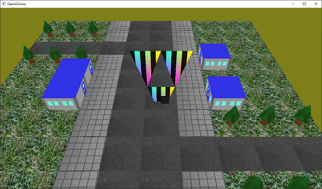
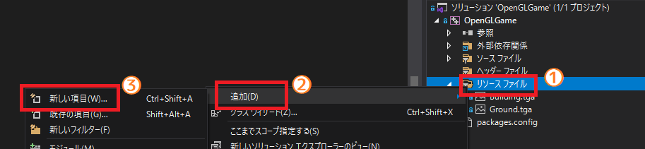
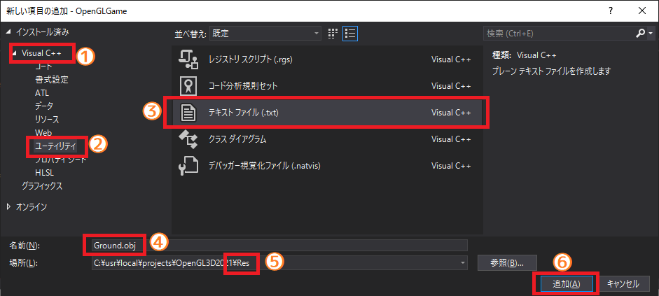
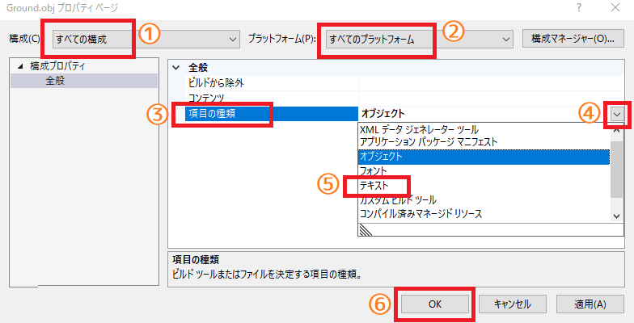
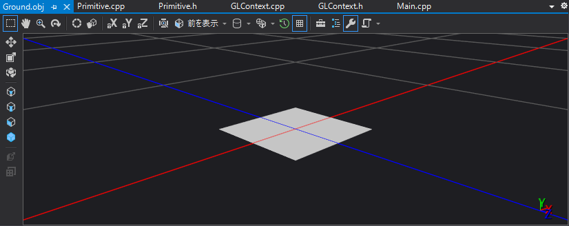
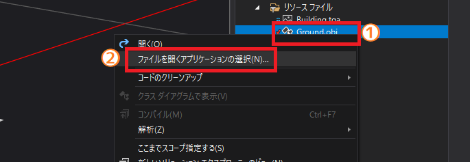
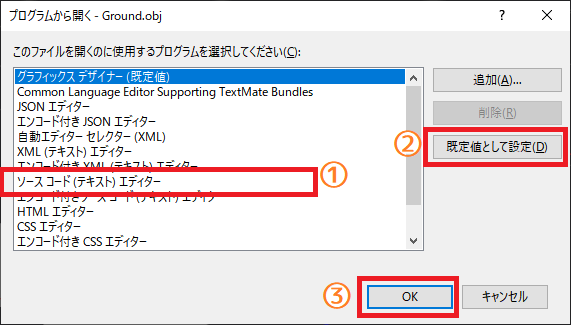

[OpenGL 3D 2020 第06回]

# 図形をファイルから読み込む

## 習得目標

* 変数と関数をクラスで置き換える方法
* デストラクタでオブジェクトを削除する利点
* OBJファイルの基本的な文法
* テキストファイルを読み込んで解析する方法

## 1. プリミティブを作りやすくする

### 1.1 <ruby>PrimitveBuffer<rt>プリミティブ・バッファ</rt></ruby>クラスを定義する

`Primitive`クラスの変数を定義するには、頂点データとインデックスデータの位置を正確に指定しなければなりません。例えば、図形をちょっと修正したらいい感じになる気がしたので、頂点データやインデックスデータの途中にデータを増やしたい(減らしたい)としましょう。

当然、その頂点データを使っている`Primitive`の値も変更しなければなりません。さらに、変更したデータより後ろにある頂点データも、先頭からの位置がずれます。そのため、それらのデータを使っている`Primitive`も修正する必要があります。

このように、頂点データの変更は影響範囲が広いため、面倒なうえ間違いを起こしやすいです。この問題を解決するために、本テキストでは`Primitive`型データの作成をプログラム化し、クラスとしてまとめることにします。手順は次のとおりです。

>1. 「`Primitive`型のデータを管理するクラス」を作る。管理クラスにはVBO、IBO、VAOを持たせ、頂点データから`Primitive`型のデータを作成できるようにする。
>2. 頂点データを物体単位で分割する。
>3. 分割した頂点データを使って、管理クラスに描画データを作成してもらう。
>4. 管理クラスから描画データを取得して描画する。

まず「`Primitive`型のデータを管理するクラス」を作ります。管理クラスには`Primitive` の配列と、`VBO`、`IBO`、`VAO`といった「頂点データの管理に使うバッファオブジェクト」を持たせます。

次に、現在はひとかたまりになっている頂点データを、物体ごとに分離します。そして 、管理クラスに対して図形の頂点データを渡します。管理クラスは渡された描画データをGPUメモリにコピーし、`Primitive`のパラメータを自動的に計算して描画データを作ります。

管理クラスを作りはじめる前に、必要なヘッダファイルをインクルードします。 `Primitive.h`を開き、次のプログラムを追加してください。

```diff
 #ifndef MESH_H_INCLUDED
 #define MESH_H_INCLUDED
 #include <glad/glad.h>
+#include <glm/glm.hpp>
+#include <vector>

 /**
 * プリミティブデータ.
```

 それでは管理クラスを定義しましょう。名前は`PrimitiveBuffer`(プリミティブ・バッファ)とします。`Primitive`型の定義の下に、次のプログラムを追加してください。

```diff
   const GLvoid* indices = 0; ///< 描画開始インデックスのバイトオフセット.
   GLint baseVertex = 0; ///< インデックス0番とみなされる頂点配列内の位置.
 };
+
+/**
+* 複数のプリミティブを管理するクラス.
+*/
+class PrimitiveBuffer
+{
+public:
+  PrimitiveBuffer(GLsizei maxVertexCount, GLsizei maxIndexCount);
+  ~PrimitiveBuffer();
+
+  // プリミティブの追加
+  bool Add(size_t vertexCount, const glm::vec3* pPosition, const glm::vec4* pColor,
+    const glm::vec2* pTexcoord, size_t indexCount, const GLushort* pIndex);
+
+  // プリミティブの取得
+  const Primitive& Get(size_t n) const;
+
+  // VAOバインド管理
+  void BindVertexArray() const;
+  void UnbindVertexArray() const;
+
+private:
+  std::vector<Primitive> primitives; // 描画データの配列
+
+  // バッファID
+  GLuint vboPosition = 0;
+  GLuint vboColor = 0;
+  GLuint vboTexcoord = 0;
+  GLuint ibo = 0;
+  GLuint vao = 0;
+
+  GLsizei maxVertexCount = 0; // 格納できる最大頂点数
+  GLsizei curVertexCount = 0; // 格納済み頂点数
+  GLsizei maxIndexCount = 0;  // 格納できる最大インデックス数
+  GLsizei curIndexCount = 0;  // 格納済みインデックス数
+};

 #endif // PRIMITIVE_H_INCLUDED
```

`PrimitiveBuffer`クラスの使い方は、次のようになります。

>1. コンストラクタの引数に、管理予定の頂点数とインデックス数を指定して、バッファオブジェクトを作成する。
>2. `Add`(アド)メンバ関数を使って`Primitive`を追加する。
>3. `Get`(ゲット)メンバ関数を使って、追加した`Primitive`を取得する。
>4. `Primitive`を描画する前に、`BindVertexArray`(バインド・バーテックス・アレイ)メンバ関数でVAOをバインドする。
>5. `Primitive`を描画する。
>6. 全ての`Primitive`を描画したら、`UnbindVertexArray`(アンバインド・バーテックス・アレイ)メンバ関数でVAOのバインドを解除する。

メンバ変数のうち、`vboPosition`から`vao`まではVBO、IBO、VAOを表す変数です。そして、 `maxVertexCount`(マックス・バーテックス・カウント)から下の4つのメンバ変数は、データの追加に関係します。

`maxVertexCount`はVBOに格納できる頂点の数、`maxIndexCount`(マックス・インデックス・カウント)はIBOに格納できるインデックスの数を表します。これらの変数には、コンストラクタ引数に指定した値をそのまま代入する予定です。

`curVertexCount`(カー・バーテックス・カウント)と`curIndexCount`(カー・インデックス・カウント)は、`Add`によって追加された頂点およびインデックスの合計数を表します。最初は`0`で、データが追加されるたびに増加させる予定です。

なお、変数名の先頭にある`cur`(カー)は`current`(カレント、「現在の」という意味)の短縮形です。

### 1.2 コンストラクタを定義する

続いて、メンバ関数を定義していきます。まずは必要なヘッダファイルをインクルードしましょう。`Primitive.cpp`を開き、次のプログラムを追加してください。

```diff
 * @file Primitive.cpp
 */
 #include "Primitive.h"
+#include "GLContext.h"
+#include <iostream>

 /**
 * プリミティブを描画する.
```

手始めにコンストラクタを定義します。コンストラクタでは`VBO`、`IBO`、`VAO`を作成します。`Primitive::Draw`メンバ関数の定義の下に、次のプログラムを追加してください。

```diff
   glDrawElementsBaseVertex(mode, count, GL_UNSIGNED_SHORT, indices, baseVertex);
 }
+
+/**
+* プリミティブ用のメモリを確保する.
+*
+* @param maxVertexCount  格納可能な最大頂点数.
+* @param maxIndexCount   格納可能な最大インデックス数.
+*/
+PrimitiveBuffer::PrimitiveBuffer(GLsizei maxVertexCount, GLsizei maxIndexCount)
+{
+  // VBO, IBO, VAOを作成.
+  vboPosition = GLContext::CreateBuffer(sizeof(glm::vec3) * maxVertexCount, nullptr);
+  vboColor = GLContext::CreateBuffer(sizeof(glm::vec4) * maxVertexCount, nullptr);
+  vboTexcoord = GLContext::CreateBuffer(sizeof(glm::vec2) * maxVertexCount, nullptr);
+  ibo = GLContext::CreateBuffer(sizeof(GLushort) * maxIndexCount, nullptr);
+  vao = GLContext::CreateVertexArray(vboPosition, vboColor, vboTexcoord, ibo);
+  if (!vboPosition || !vboColor || !vboTexcoord || !ibo || !vao) {
+    std::cerr << "[エラー]" << __func__ << ": VAOの作成に失敗.\n";
+  }
+
+  // 描画データ用のメモリを1000個分予約.
+  primitives.reserve(1000);
+
+  // 管理予定の頂点数とインデックス数を設定.
+  this->maxVertexCount = maxVertexCount;
+  this->maxIndexCount = maxIndexCount;
+}
```

コンストラクタでは、最初に`VBO`、`IBO`、`VAO`を作成します。いずれかの作成に失敗した場合はエラーメッセージを表示します。

`VAO`の作成に成功したら、`reserve`(リザーブ)メンバ関数を使って`Primitive`の配列サイズを予約し、次に頂点とインデックスの最大数を設定します。

なお、引数とメンバ変数の名前が同じときは、引数が優先して使われます。メンバ変数を操作したいときは、変数名の前に`this->`を付けなくてはなりません。

`reserve`メンバ関数の構文は次のとおりです。

<pre class="tnmai_code"><strong>【書式】</strong><code>
void std::vector::reserve(予約する要素数);
</code></pre>

`reserve`(リサーブ)関数は、`vector`型の変数がすぐに確保できる容量を予約します(`reserve`は「予約する」という意味です)。`vector`型は、最初に適当な大きさのメモリを確保して、そこにデータを詰め込んでいきます。

データが確保したメモリに入り切らなくなったとき、より大きい別のメモリを確保しなおして、そちらにデータをコピーし、古いメモリを解放します。`vector`型がいくらでも大きな配列を作れるのは、このような仕組みになっているからです。

ただし、この仕組みにはひとつ問題があります。メモリの確保やデータのコピーにはそれなりの時間がかかるので、プログラムの動作が遅くなってしまうことがあるのです。

そこで`reserve`関数の出番です。`reserve`関数は指定された大きさのメモリを確保します(このとき配列の長さは変化しません)。`vector`型にデータを入れるより前に十分な大きさのメモリを確保しておけば、メモリの再確保やデータのコピーは起こりません。

`reserve`で予約したサイズで足りなくなったときは、通常どおりメモリが再確保されてデータがコピーされます。

今回は1000個のプリミティブまではデータのコピーが起こらないようにしてみました。いきなり1000個も追加することはないでしょうが、これだけあれば、あとからみなさんがいろいろなデータを追加しても、すぐに足りなくなることはないでしょう。

>**【ひとつのバッファオブジェクトに複数の図形を詰め込む理由】**<br>
>OpenGLの仕様では、図形ごとに`VBO`、`IBO`、`VAO`を作成することもできます。しかし、基本的にはひとつの`VBO`、`IBO`、`VAO`にすべての図形を詰め込みます。そのほうが、GPUの性能をより効率的に引き出せるからです。GPUのグラフィックスパイプラインは流れ作業で図形を描画する構造になっていて、パイプラインが完全に動作を終えてからでないと状態を変更できません。そして、一旦パイプラインを止めると、再開にはある程度の時間がかかります。このため、頻繁に状態を変更すると、本来の描画能力を発揮できなくなってしまいます。「バッファオブジェクトを切り替える」ことも「状態の変更」に当たるため、図形ごとにバッファオブジェクトを作ると状態変更が頻発します。ひとつのバッファオブジェクトに図形を詰め込むことで状態変更を避けられるわけです。

### 1.3 デストラクタを定義する

続いてデストラクタを定義します。コンストラクタの定義の下に、次のプログラムを追加してください。

```diff
   this->maxIndexCount = maxIndexCount;
 }
+
+/**
+* デストラクタ.
+*/
+PrimitiveBuffer::~PrimitiveBuffer()
+{
+  glDeleteVertexArrays(1, &vao);
+  glDeleteBuffers(1, &ibo);
+  glDeleteBuffers(1, &vboTexcoord);
+  glDeleteBuffers(1, &vboColor);
+  glDeleteBuffers(1, &vboPosition);
+}
```

デストラクタでオブジェクトを削除すれば、削除し忘れることはありません。変数が削除されるとき、必ずデストラクタが実行されるからです。

なお、`glDeleteBuffers`、`glDeleteVertexArrays`にゼロまたは未使用のオブジェクトを指定した場合、これらの関数は何もしません。ですから、オブジェクトが`0`かどうかのチェックは不要です。

### 1.4 <ruby>Add<rt>アド</rt></ruby>メンバ関数を定義する

次は`Add`メンバ関数を定義します。少し長い関数なので、<ruby>雛形<rt>ひながた</rt></ruby>から作っていくことにしましょう。デストラクタの定義の下に、次のプログラムを追加してください。

```diff
   glDeleteBuffers(1, &vboPosition);
 }
+
+/**
+* 描画データを追加する.
+*
+* @param vertexCount 追加する頂点データの数.
+* @param pPosition   座標データへのポインタ.
+* @param pColor      色データへのポインタ.
+* @param pTexcoord   テクスチャ座標データへのポインタ.
+* @param indexCount  追加するインデックスデータの数.
+* @param pIndex      インデックスデータへのポインタ.
+*
+* @retval true  追加に成功.
+* @retval false 追加に失敗.
+*/
+bool PrimitiveBuffer::Add(size_t vertexCount, const glm::vec3* pPosition,
+  const glm::vec4* pColor, const glm::vec2* pTexcoord,
+  size_t indexCount, const GLushort* pIndex)
+{
+
+  return true;
+}
```

まずはエラーチェックを加えましょう。考えられるのは次のケースです。

>* コンストラクタで`VAO`の作成に失敗した。
>* 確保したGPUメモリの残りが不足していてデータをコピーできない。

これらについてエラーチェックプログラムを書いていきます。`Add`メンバ関数に次のプログラムを追加してください。

```diff
   const glm::vec4* pColor, const glm::vec2* pTexcoord,
   size_t indexCount, const GLushort* pIndex)
 {
+  // エラーチェック.
+  if (!vao) {
+    std::cerr << "[エラー]" << __func__ <<
+      ": VAOの作成に失敗しています.\n";
+    return false;
+  } else if (vertexCount > static_cast<size_t>(maxVertexCount) - curVertexCount) {
+    std::cerr << "[警告]" << __func__ << ": VBOが満杯です(max=" << maxVertexCount <<
+      ", cur=" << curVertexCount << ", add=" << vertexCount << ")\n";
+    return false;
+  } else if (indexCount > static_cast<size_t>(maxIndexCount) - curIndexCount) {
+    std::cerr << "[警告]" << __func__ << ": IBOが満杯です(max=" << maxIndexCount <<
+      ", cur=" << curIndexCount << ", add=" << indexCount << ")\n";
+    return false;
+  }

   return true;
 }
```

`VAO`が正しく作成されていれば、`vao`変数には`0`以外の値が入っているはずです。`0`ならばエラーメッセージを出力して`false`を返して関数を終了します。

次に、指定された頂点数が、追加可能な頂点数を超えていないかチェックします。追加可能な頂点数は、管理可能な頂点数`maxVertexCount`から現在の頂点数`curVertexCount`を引くことで求められます。

追加可能な頂点数が、指定された頂点数数より少ない場合は`false`を返して関数を終了します。その後、インデックスデータについても同じチェックを行います。

`maxVertexCount`を`size_t`型にキャストしている理由は、左辺の`vertexCount`と型を合わせるためです。`GLsizei`と`size_t`は符号の有無が違うため、キャストで型を合わせないと、ビルド時に警告が表示されてしまいます。

>**【エラーチェックの意義】**<br>
>プログラムが常に正しく書かれ、そのとおりに実行されるならエラーチェックなど書く必要はありません。しかし、現実はそんなに簡単ではありません。そのため、できるだけ早い段階でエラーを見つけて対処することが重要です。

エラーチェックの次は、頂点データをGPUメモリにコピーしていきます。データのコピーには `glCopyNamedBufferSubData`(ジーエル・コピー・ネームド・バッファ・サブ・データ)関数を使います。エラーチェックプログラムの下に、次のプログラムを追加してください。

```diff
       ", cur=" << curIndexCount << ", add=" << indexCount << ")\n";
     return false;
   }
+
+  // GPUメモリに頂点座標データをコピー.
+  const GLsizei size = static_cast<GLsizei>(sizeof(glm::vec3) * vertexCount);
+  const GLuint readBuffer = GLContext::CreateBuffer(size, pPosition);
+  if (!readBuffer) {
+    std::cerr << "[エラー]" << __func__ << ": コピー元バッファの作成に失敗(size=" <<
+      size << ").\n";
+    return false;
+  }
+  const GLsizei offset = static_cast<GLsizei>(sizeof(glm::vec3) * curVertexCount);
+  glCopyNamedBufferSubData(readBuffer, vboPosition, 0, offset, size);
+  glDeleteBuffers(1, &readBuffer);
+  if (glGetError() != GL_NO_ERROR) {
+    std::cerr << "[エラー]" << __func__ << ": データのコピーに失敗(size=" <<
+      size << ", offset=" << offset << ").\n";
+    return false;
+  }

   return true;
 }
```

<pre class="tnmai_code"><strong>【書式】</strong><code>
void glCopyNamedBufferSubData(コピー元のバッファオブジェクトID,
  コピー先のバッファオブジェクトID, コピー元のオフセット,
  コピー先のオフセット, コピーするバイト数);
</code></pre>

この関数は、あるバッファオブジェクトから別のバッファオブジェクトにデータをコピーします。ただし、`glNamedBufferStorage`関数の「利用方法」に`0`を指定した場合、CPUから直接データをコピーすることはできません。

そのため、コピーしたいデータを持つ新しいバッファオブジェクトを作成し、 `glCopyNamedBufferSubData`を使って目的のバッファオブジェクトにコピーする、という方法を使います。また、サイズやコピー先の位置の指定はバイト単位なので、 `sizeof(glm::vec3)` を掛けてバイト数を計算しています。

### 1.5 データのコピーを関数化する

さて、上記のプログラムでコピーしたのは座標データだけなので、残りの色データ、テクスチャ座標データ、インデックスデータも同じ方法でコピーしましょう。…と、言いたいところですが、いくらなんでも、こんなプログラムを4回も書くのは面倒すぎます。

そこで、上記のプログラムを元にして、他のデータでも使えるような関数を作りましょう。 `Primitive.cpp`の先頭のインクルード文の下に、次のプログラムを追加してください。

```diff
 #include <iostream>
+
+/**
+* データをGPUメモリにコピーする.
+*
+* @param writeBuffer コピー先のバッファオブジェクト.
+* @param unitSize    要素のバイト数.
+* @param offsetCount コピー先オフセット(要素単位).
+* @param count       コピーする要素数.
+* @param data        コピーするデータのアドレス.
+*
+* @retval true  コピー成功.
+* @retval false コピー失敗.
+*/
+bool CopyData(GLuint writeBuffer, GLsizei unitSize,
+  GLsizei offsetCount, size_t count, const void* data)
+{
+  return true;
+}

 /**
 * プリミティブを描画する.
```

次に、`Add`関数から以下の部分を切り取り（範囲選択して`Ctrl+X`)、

```diff
     return false;
   }

   // GPUメモリに頂点座標データをコピー.
-  const GLsizei size = static_cast<GLsizei>(sizeof(glm::vec3) * vertexCount);
-  const GLuint readBuffer = GLContext::CreateBuffer(size, pPosition);
-  if (!readBuffer) {
-    std::cerr << "[エラー]" << __func__ << ": コピー元バッファの作成に失敗(size=" <<
-      size << ").\n";
-    return false;
-  }
-  const GLsizei offset = static_cast<GLsizei>(sizeof(glm::vec3) * curVertexCount);
-  glCopyNamedBufferSubData(readBuffer, vboPosition, 0, offset, size);
-  glDeleteBuffers(1, &readBuffer);
-  if (glGetError() != GL_NO_ERROR) {
-    std::cerr << "[エラー]" << __func__ << ": データのコピーに失敗(size=" <<
-      size << ", offset=" << offset << ").\n";
-    return false;
-  }

   return true;
 }
```

`CopyData`(コピー・データ)関数の中に貼り付けてください(`Ctrl+V`)。

```diff
 bool CopyData(GLuint writeBuffer, GLsizei unitSize,
   GLsizei offsetCount, GLsizei count, const void* data)
 {
+  const GLsizei size = static_cast<GLsizei>(sizeof(glm::vec3) * vertexCount);
+  const GLuint readBuffer = GLContext::CreateBuffer(size, pPosition);
+  if (!readBuffer) {
+    std::cerr << "[エラー]" << __func__ << ": コピー元バッファの作成に失敗(size=" <<
+      size << ").\n";
+    return false;
+  }
+  const GLsizei offset = static_cast<GLsizei>(sizeof(glm::vec3) * curVertexCount);
+  glCopyNamedBufferSubData(readBuffer, vboPosition, 0, offset, size);
+  glDeleteBuffers(1, &readBuffer);
+  if (glGetError() != GL_NO_ERROR) {
+    std::cerr << "[エラー]" << __func__ << ": データのコピーに失敗(size=" <<
+      size << ", offset=" << offset << ").\n";
+    return false;
+  }
   return true;
 }
```

貼り付けたプログラムは`sizeof(glm::vec3)`や`pPosition`といった、座標データ専用の書き方のままです。それらを`CopyData`の引数に置き換えるすることで、他のデータにも使える関数にしましょう。座標データ専用のプログラムを、次のように書き換えてください。

```diff
 bool CopyData(GLuint id, GLsizei unitSize, GLsizei offsetCount, GLsizei count,
   const void* data)
 {
-  const GLsizei size = static_cast<GLsizei>(sizeof(glm::vec3) * vertexCount);
-  const GLuint readBuffer = GLContext::CreateBuffer(size, pPosition);
+  const GLsizei size = static_cast<GLsizei>(unitSize * count);
+  const GLuint readBuffer = GLContext::CreateBuffer(size, data);
   if (!readBuffer) {
     std::cerr << "[エラー]" << __func__ << ": コピー元バッファの作成に失敗(size=" <<
       size << ").\n";
     return false;
   }
-  const GLsizei offset = static_cast<GLsizei>(sizeof(glm::vec3) * curVertexCount);
-  glCopyNamedBufferSubData(readBuffer, vboPosition, 0, offset, size);
+  const GLsizei offset = static_cast<GLsizei>(unitSize * offsetCount);
+  glCopyNamedBufferSubData(readBuffer, writeBuffer, 0, offset, size);
   glDeleteBuffers(1, &readBuffer);
   if (glGetError() != GL_NO_ERROR) {
     std::cerr << "[エラー]" << __func__ << ": データのコピーに失敗(size=" << size <<
```

これで`CopyData`関数は完成です。

### 1.6 Addメンバ関数を完成させる

それでは、`Add`メンバ関数に戻りましょう。エラーチェックプログラムの下に、次のプログラムを追加してください。

```diff
     return false;
   }

   // GPUメモリに頂点座標データをコピー.
+  if (!CopyData(vboPosition, sizeof(glm::vec3), curVertexCount, vertexCount,
+    pPosition)) {
+    return false;
+  }

   return true;
 }
```

`CopyData`関数に置き換えたことで、プログラムがスッキリしました。こんなに短ければ、残りはコピー&ペーストで簡単に書けちゃいます。さっそくやってみましょう。座標データをコピーするプログラムの下に、次のプログラムを追加してください。

```diff
   if (!CopyData(vboPosition, sizeof(glm::vec3), curVertexCount, vertexCount,
     pPosition)) {
     return false;
   }
+
+  // GPUメモリに色データをコピー.
+  if (!CopyData(vboColor, sizeof(glm::vec4), curVertexCount, vertexCount, pColor)) {
+    return false;
+  }
+
+  // GPUメモリにテクスチャ座標データをコピー.
+  if (!CopyData(vboTexcoord, sizeof(glm::vec2), curVertexCount, vertexCount,
+    pTexcoord)) {
+    return false;
+  }
+
+  // GPUメモリにインデックスデータをコピー.
+  if (!CopyData(ibo, sizeof(GLushort), curIndexCount, indexCount, pIndex)) {
+    return false;
+  }

   return true;
 }
```

>**【コピペの際は見落としに注意！】**<br>
>コピー&ペーストは便利ですが、細かな違いを見落としがちです。修正漏れや書き間違いがないか、しっかり見直すようにしましょう。また、「何故この部分を変更しなくてはならないのか」をしっかり考えましょう。どこを変更すべきか、なぜ変更しなければならないか、を考えながら作業することでミスを減らすことができるでしょう。

全てのデータをバッファオブジェクトにコピーしたら、いよいよ描画データを作成します。インデックスデータをコピーするプログラムの下に、次のプログラムを追加してください。

```diff
   if (!CopyData(ibo, sizeof(GLushort), curIndexCount, indexCount, pIndex)) {
     return false;
   }
+
+  // 描画データを作成.
+  const Primitive prim(GL_TRIANGLES, static_cast<GLsizei>(indexCount),
+    sizeof(GLushort) * curIndexCount, curVertexCount);
+
+  // 描画データを配列に追加.
+  primitives.push_back(prim);
+
+  // 現在のデータ数を、追加したデータ数だけ増やす.
+  curVertexCount += static_cast<GLsizei>(vertexCount);
+  curIndexCount += static_cast<GLsizei>(indexCount);

   return true;
 }
```

インデックスデータのバイトオフセットは、要素のサイズと`curIndexCount`から計算できます。この値はすぐ上のプログラムでコピーしたデータの転送先オフセットと同じになります。頂点データの開始位置には`curVertexCount`を使います。この設計のため、インデックスは常に`0`から始まります。

現在、いくつかのインデックスデータは、`0`より大きい番号が最初のインデックスになっていると思います。お手数ですが、それらについては`0`から始まるように修正してもらわなくてはなりません。

`Primitive`を追加したら、`curVertexCount`と`curIndexCount`にコピーしたデータ数を加算します。この計算によって、この2つのメンバ変数は「追加したデータの数」を表すようになります。なお、ここのキャストはコンパイラの警告を黙らせるために入れています。

### 1.7 <ruby>Get<rt>ゲット<rt></ruby>メンバ関数を定義する

`Get`(ゲット)メンバ関数は、`Add`で追加した`Primitive`を取得する関数です。基本的には指定されたインデックスに対応する`Primitive`を返すだけです。ただ、インデックスが正しいかどうかはチェックしなければなりません。それでは、`Add`メンバ関数の下に次のプログラムを追加してください。

```diff
   curIndexCount += static_cast<GLsizei>(indexCount);

   return true;
 }
+
+/**
+* プリミティブを取得する.
+*
+* @param n プリミティブのインデックス.
+*
+* @return nに対応するプリミティブ.
+*/
+const Primitive& PrimitiveBuffer::Get(size_t n) const
+{
+  if (n > static_cast<int>(primitives.size())) {
+    std::cerr << "[警告]" << __func__ << ":" << n <<
+      "は無効なインデックスです(size=" << primitives.size() << ").\n";
+    // 仮の描画データを返す.
+    static const Primitive dummy;
+    return dummy;
+  }
+  return primitives[n];
+}
```

エラーが発生したときの対策はいろいろな考え方がありますが、今回はエラーメッセージを表示したあと、仮の描画データを返すようにしてみました。

>**【エラーが起きたときはどうするべき?】**<br>
>これは本当に状況次第です。一般的にはエラーメッセージをコンソールウィンドウやファイルに出力して、すぐにプログラムを終了させます。エラーが起きた後もプログラムが正しく動作するという保証はどこにもないからです。ただ、ゲーム中にプログラムをいきなり終了すると、セーブができなくてゲームのプレイ状況が失われる、といったことが起こり得ます。そのため、多少表示がおかしくなる程度であれば、仮データを表示してプログラムの実行を続けることが多いです。

### 1.8 <ruby>BindVertexArray<rt>バインド・バーテックス・アレイ</rt></ruby>メンバ関数を定義する

`BindVertexArray`(バインド・バーテックス・アレイ)メンバ関数は、`VAO`をOpenGLコンテキストに割り当てます。

>**【OpenGLコンテキストに割り当てる = バインドする】**<br>
>ところで、毎回「OpenGLコンテキストに割り当てる」と書くのは、文章が長くなって読みづらいと思います。そこで、今後は「バインドする」のように書くことにします。

`Get`関数の定義の下に次のプログラムを追加してください。

```diff
     return dummy;
   }
   return primitives[n];
 }
+
+/**
+* VAOをグラフィックスパイプラインにバインドする.
+*/
+void PrimitiveBuffer::BindVertexArray() const
+{
+  glBindVertexArray(vao);
+}
```

この関数は`glBindVertexArray`を実行しているだけです。

<div style="page-break-after: always"></div>

### 1.9 <ruby>UnbindVertexArray<rt>アンバインド・バーテックス・アレイ</rt></ruby>関数を定義する

`UnbindVertexArray`(アンバインド・バーテックス・アレイ)関数は、`VAO`のバインドを解除します。`BindVertexArray`関数の定義の下に次のプログラムを追加してください。

```diff
   glBindVertexArray(vao);
 }
+
+/**
+* VAOのバインドを解除する.
+*/
+void PrimitiveBuffer::UnbindVertexArray() const
+{
+  glBindVertexArray(0);
+}
```

これも、`glBindVertexArray`を実行しているだけです。これで`PrimitiveBuffer`クラスは完成です。

>**【1章のまとめ】**<br>
>
>* クラスを使うと変数をまとめて管理することができる。
>* デストラクタでオブジェクトを削除すると、削除し忘れることを防げる。

<div style="page-break-after: always"></div>

## 2. PrimitiveBufferを使った描画

### 2.1 頂点データを分割する

現在の頂点データは、すべての図形がひとかたまりの配列になっています。そのため、図形の区切りをコメントで<ruby>記<rt>しる</rt></ruby>しています。1.1節で説明したように、データがひとかたまりになっていると、`Primitive`を作るときに面倒な計算をしなければなりません。

この計算をなくすために、図形ごとに配列を分けていきましょう。それと、この機会に座標データの型を、より便利な`glm::vec3`型で置き換えることにします。

それでは、`Main.cpp`を開き、座標データ(`positions`配列)を次のように書きかえてください(行数が多いので、一部を`︙`で省略しています)。

```diff
 #include <iostream>
 #pragma comment(lib, "opengl32.lib")

-/// 座標データ.
-const Position positions[] = {
-  // 地面
+/// 座標データ:地面
+const glm::vec3 posGround[] = {
   {-2.0f, 0.0f, 2.0f},
   { 2.0f, 0.0f, 2.0f},
   { 2.0f, 0.0f,-2.0f},
   {-2.0f, 0.0f,-2.0f},
+};

+/// 座標データ:四角形
+const glm::vec3 posRectangle[] = {
   {-0.2f, -0.5f, 0.1f},
   { 0.3f, -0.5f, 0.1f},
   { 0.3f,  0.3f, 0.1f},
   { 0.3f,  0.3f, 0.1f},
   {-0.2f,  0.3f, 0.1f},
   {-0.2f, -0.5f, 0.1f},
+};

+/// 座標データ:三角形
+const glm::vec3 posTriangle[] = {
   {(-0.33f/2.0f) * 10.0f,( 0.5f/2.0f) * 10.0f, 0.6f },
   {( 0.33f/2.0f) * 10.0f,( 0.5f/2.0f) * 10.0f, 0.6f },
             ︙
   {( 0.33f/2.0f+0.165f) * 10.0f,( 0.5f/2.0f+0.5f) * 10.0f, 0.6f },
   {( 0.00f/2.0f+0.165f) * 10.0f,(-0.5f/2.0f+0.5f) * 10.0f, 0.6f },
+};

   // 立方体
   { 0, 0, 0}, { 1, 0, 0}, { 1, 0, 1}, { 0, 0, 1},
```

配列の名前は「`pos`+物体の名前」という規則としました。この規則に従うと、例えば地面の座標データ配列の名前は`posGround`(ポス・グラウンド)となります。

<pre class="tnmai_assignment">
<strong>【課題01】</strong>
<code>posGround</code>、<code>posRectangle</code>の修正を参考にして、立方体、木、建物のデータを図形ごとの配列に分けなさい。
配列の名前は、立方体は<code>posCube</code>、木は<code>posTree</code>、建物は<code>posWarehouse</code>としなさい。
</pre>

<pre class="tnmai_assignment">
<strong>【課題02】</strong>
座標データと同じやり方で、<code>colors</code>配列を、図形ごとに別々の配列となるように分けなさい。配列変数の型は<code>Color</code>型から<code>glm::vec4</code>型に変更すること。
配列の名前は座標データを参考にして、<code>colGround</code>、<code>colTree</code>のように、「<code>col</code>+物体の名前」としなさい。
</pre>

<pre class="tnmai_assignment">
<strong>【課題03】</strong>
座標データや色データと同じやり方で、<code>texcoords</code>配列を、図形ごとに別々の配列となるように分けなさい。配列の名前は座標データを参考にして、<code>tcGround</code>、<code>tcTree</code>のように、「<code>tc</code>+物体の名前」としなさい。
</pre>

### 2.2 インデックスデータを分割する

続いてインデックスデータを分割します。次のようにインデックスデータを書き換えてください。なお、みなさんの書いたインデックスデータが、以下のプログラムと違っていても問題はありません。図形ごとに異なる配列になっていれば大丈夫です。

```diff
-/// インデックスデータ
+/// インデックスデータ:地面
+const GLushort indexGround[] = {
   0, 1, 2, 2, 3, 0,
+};
+ 
+/// インデックスデータ:四角形
+const GLushort indexRectangle[] = {
   4, 5, 6, 7, 8, 9,
+};
+
+/// インデックスデータ:三角形
+const GLushort indexTriangle[] = {
  12,11,10,15,14,13,18,17,16,
+};
+
+/// インデックスデータ:立方体
+const GLushort indexCube[] = {
  0, 1, 2, 2, 3, 0, 4, 5, 1, 1, 0, 4,
  5, 6, 2, 2, 1, 5, 6, 7, 3, 3, 2, 6,
  7, 4, 0, 0, 3, 7, 7, 6, 5, 5, 4, 7,
+};
+
+/// インデックスデータ:木
+const GLushort indexTree[] = {
  0, 1, 2, 0, 2, 3, 0, 3, 4, 0, 4, 5, 1, 4, 3, 3, 2, 1, // 葉
  6, 7, 8, 6, 8, 9, 6, 9,10, 6,10,11, 7,10, 9, 9, 8, 7, // 幹
+};
+
+/// インデックスデータ:建物
+const GLushort indexWarehouse[] = {
  0, 1, 6, 6, 5, 0,
  1, 2, 7, 7, 6, 1,
```

インデックスデータについては、もうひとつ作業が残っています。`Add`メンバ関数を作成したときにも説明しましたが、`Add`関数の都合で、全てのインデックスデーが`0`から始まるように修正する必要があるのです。

手始めに、四角形のインデックスデータを次のように変更してください。

```diff
 /// インデックスデータ:四角形
 const GLushort indexRectangle[] = {
-  4, 5, 6, 7, 8, 9,
+  0, 1, 2, 3, 4, 5,
 };
```

頂点データを分割する前、四角形の頂点データは4番目から9番目にありました。ですから、インデックスデータは`4`番から始まっています。これを`0`番から始まるようにするには、全てのインデックスから頂点データの開始位置を引きます。

四角形の場合、頂点データの開始位置は`4`番目なので、全てのインデックスから`4`を引いています(上のプログラムを確認してください)。

<pre class="tnmai_assignment">
<strong>【課題04】</strong>
四角形のインデックスデータの修正方法を参考にして、三角形と立方体のインデックスデータを、番号が<code>0</code>から始まるように修正しなさい。
</pre>

### 2.3 VBO, IBO, VAOをPrimitiveBufferで置き換える

`PrimitiveBuffer`型の変数を追加し、分割した頂点データから描画データを作成します。

まず、`VAO`の作成に使うバッファオブジェクトを全て削除し、`PrimitiveBuffer`型の変数で置き換えます。これらのバッファオブジェクトの役割は、`PrimitiveBuffer`クラスが引き継ぎます。`VAO`を作成するプログラムを次のように書き換えてください。

```diff
   // VAOを作成する.
-  const GLuint vboPosition = GLContext::CreateBuffer(sizeof(positions), positions);
-  const GLuint vboColor = GLContext::CreateBuffer(sizeof(colors), colors);
-  const GLuint vboTexcoord = GLContext::CreateBuffer(sizeof(texcoords), texcoords);
-  const GLuint ibo = GLContext::CreateBuffer(sizeof(indices), indices);
-  const GLuint vao = GLContext::CreateVertexArray(vboPosition, vboColor,
-    vboTexcoord, ibo);
-  if (!vao) {
-    return 1;
-  }
+  PrimitiveBuffer primitiveBuffer(100'000, 300'000);

   // パイプライン・オブジェクトを作成する.
   const GLuint vp = GLContext::CreateProgram(GL_VERTEX_SHADER, vsCode);
```

管理予定の頂点数は10万、インデックス数は30万としました。そんなに使う予定はないのですが、これだけあれば、あとでみなさんが好きなデータを追加したくなっても安心でしょう。なお、頂点数が少ないのは、頂点の共有によって節約できるためです。

バッファオブジェクトの後始末をするプログラムも消してしまいましょう。次のように`VBO`、 `IBO`、 `VAO`を削除するプログラムを削除してください。

```diff
   glDeleteProgram(fp);
   glDeleteProgram(vp);
-  glDeleteVertexArrays(1, &vao);
-  glDeleteBuffers(1, &ibo);
-  glDeleteBuffers(1, &vboTexcoord);
-  glDeleteBuffers(1, &vboColor);
-  glDeleteBuffers(1, &vboPosition);

   // GLFWの終了.
```

ところで、後始末はプログラムの最後でだけやればいい、というものではありません。プログラムを終了させるときは、必ずそれまでに作成したオブジェクトの後始末が必要です。

「プログラムを終了させるとき」というのは`main`関数の終わりだけとは限りません。 `main` 関数の中で`return`文を使っているすべての場所が該当します。当然、 `return` 文を追加するたびに、適切な後始末を書かなければなりません。

これはかなり面倒で、間違いを起こしやすいです。実際、`VAO`などの作成に失敗したときは何の後始末もしていません(気づいていましたか？)。本来はちゃんと後始末が必要です。また、オブジェクトの作成順を変更した場合、後始末をする場所や順序も変えなくてはなりません。

しかし、今後は`PrimitiveBuffer`クラスがバッファオブジェクトを管理するため、この問題は起こりません。クラスでは最後に必ずデストラクタが実行されるので、デストラクタに後始末を書いておけば削除し忘れることはないからです。

### 2.4 PrimitiveBufferに描画データを追加する

次に、分割した頂点データを使って`primitiveBuffer`に描画データを追加します。 `primitiveBuffer` 変数の定義の下に次のプログラムを追加してください。

```diff
   // VAOを作成する.
   PrimitiveBuffer primitiveBuffer(100'000, 300'000);
+
+  // 描画データを追加する.
+  primitiveBuffer.Add(4, posGround, colGround, tcGround, 6, indexGround);

   // パイプライン・オブジェクトを作成する.
   const GLuint vp = GLContext::CreateProgram(GL_VERTEX_SHADER, vsCode);
```

上記のプログラムの`4`は頂点数、`6`はインデックス数です。この数値は`posGround`配列の要素数と、`indexGround`配列の要素数になります。つまり、要素数を数える必要があるわけです。もし要素数が変化したら数え直しです。

ですが、数を数えるなどという仕事は人間が手作業でやることではありません。人生は短いのですから、これこそコンピューターにやらせるべきです。そのために`C++17`には `std::size` (エスティーディ・サイズ)という「要素数を数える」関数が追加されているのです。さっそく上記のプログラムを次のように書き換えてください。

```diff
   PrimitiveBuffer primitiveBuffer(100'000, 300'000);

-  primitiveBuffer.Add(4, posGround, colGround, tcGround, 6, indexGround);
+  primitiveBuffer.Add(std::size(posGround), posGround, colGround, tcGround,
+    std::size(indexGround), indexGround);

  // パイプライン・オブジェクトを作成する.
```

これで人生に使える時間が増えました。同じやり方で他の図形も追加しましょう。

<pre class="tnmai_assignment">
<strong>【課題05】</strong>
地面の描画データの追加方法を参考にして、地面の描画データの後に以下の描画データを追加しなさい。書いてある順番どおりに追加すること。
  四角形、三角形、立方体、木、建物
</pre>

>**【Getメンバ関数と追加順の関係】**<br>
>`Add`メンバ関数で描画データを追加した順番が、`Get`メンバ関数に指定する番号になります。表示したい図形の番号分からないときは、`Add`した順番を確認しましょう。

これで、以前作成した`Primitive`型の変数は不要になるので、全部消してしまいましょう。次のように描画データを削除してください。

```diff
  5, 6,10,10,11, 5,
 };
-
-// 描画データ.
-const Primitive primGround(GL_TRIANGLES, 6, 0, 0); // 四角形
-const Primitive primTriangles(GL_TRIANGLES, 9, 12 * sizeof(GLushort), 0); // 三角形
-const Primitive primCube(GL_TRIANGLES, 36, 21 * sizeof(GLushort), 19); // 立方体
-const Primitive primTree(GL_TRIANGLES, 36, 57 * sizeof(GLushort), 27); // 木
-const Primitive primWarehouse(GL_TRIANGLES, 30, 93 * sizeof(GLushort), 39); // 建物

 // 画像データ.
 const int imageGroundWidth = 8; // 画像の幅.
```

### 2.5 PrimitiveBufferのVAOをバインドする

続いて、`VAO`のバインドを`PrimitiveBuffer`のバインド関数で置き換えます。`VAO`をバインドするプログラムを次のように書き換えてください。

```diff
     glClearColor(0.5f, 0.5f, 0.1f, 1.0f);
     glClear(GL_COLOR_BUFFER_BIT | GL_DEPTH_BUFFER_BIT);

-    glBindVertexArray(vao);
+    primitiveBuffer.BindVertexArray();
     glBindProgramPipeline(pipeline);
     glBindSampler(0, sampler);
```

`VAO`のバインドを解除するプログラムも次のように書き換えてください。

```diff
     glBindSampler(0, 0);
     glBindProgramPipeline(0);
-    glBindVertexArray(0);
+    primitiveBuffer.UnbindVertexArray();

     glfwPollEvents();
     glfwSwapBuffers(window);
```

### 2.6 PrimitiveをPrimitiveBufferで置き換える

最後に、`Primitive`型変数を使って描画している部分を`PrimitiveBuffer`で置き換えます。地面を描画するプログラムを、次のように書き換えてください。

```diff
         const int textureNo = mapData[y][x];
         glBindTextureUnit(0, mapTexList[textureNo]); // テクスチャを割り当てる.
-        primGround.Draw();
+        primitiveBuffer.Get(0).Draw();
       }
     }
```

`PrimitiveBuffer`に追加した`Primitive`を取得するには、`Get`メンバ関数に「`0`から始まる追加順の番号」を指定します。「地面」は最初に`Add`したので`0`番目ということです。もし「木」を取得するなら`1`、「家」なら`2`を指定します。

<pre class="tnmai_assignment">
<strong>【課題06】</strong>
三角形、立方体、木、建物の描画を<code>PrimitiveBuffer::Get</code>で置き換えなさい。
</pre>

課題06が完了したらビルドして実行してください。以前と同じ画面が表示できたら成功です。

<p align="center">

</p>

>**【2章のまとめ】**<br>
>
>* 描画データに頂点データの位置を指定する場合、インデックスは`0`から始まる。
>* 配列の要素数を調べるには`std::size`関数を使う(C++17以降)。
>* `Get`メンバ関数に指定する番号は`Add`の実行順による。

<div style="page-break-after: always"></div>

## 3. OBJファイルを読み込む

### 3.1 ファイル形式の選択

`PrimitiveBuffer`クラスを作ったことで、図形を追加しやすくなりました。そうはいっても、手作業で頂点データやインデックスデータを作るのは大変です。一応、10枚程度の三角形を組み合わせたような図形であれば、手作業で作れなくもないでしょう。

しかし、世の多くの図形データは数千、数万の頂点データから作られています。そんな大量のデータを手作業で書くことは不可能、とは言いませんが非現実的です。そこで、通常は図形作成用のアプリケーションを使います。このようなアプリを「モデリング・ツール」などと呼びます。

ここで問題となるのは、モデリング・ツールによって、作成されるデータの形式が異なることです。しかも、それらはモデリング・ツール自身が使うために定義されているので、ほかのプログラムから使うことができません。

それでは不便なので、異なるツールの間でデータをやり取りするための汎用形式が存在します。今回は汎用形式のひとつである`OBJ`(オブジェ)形式を扱います。OBJ形式を選んたのは、仕様が小さくて比較的プログラミングが簡単なうえ、対応しているツールが多いからです。

>**【OBJ(オブジェ)形式について】**<br>
>Advanced Visualizer(アドバンスド・ビジュアライザ)というツールのために開発されたファイル形式です。仕様が非常に小さくまとまっていて扱いやすいのですが、標準では頂点カラーが定義できない、アニメーションを扱えないなどの制約があります。しかし、定義された時期が古いため長く使われていること、仕様が公開されていること、単純であることの3点から、ほとんどのモデリング・ツールが読み書きに対応しています。

### 3.2 OBJファイルを追加する

OBJファイルはテキスト・ファイルです。そのため、テキスト・エディタで簡単に編集できます。仕様では点・線・三角形だけでなく、多角形や曲線、曲面も定義できます。しかし、とりあえず必要なのは三角形の読み込み機能だけです。まずはこの機能を作成していきます。

実際にOBJファイルを作ってみましょう。ソリューションエクスプローラーの「リソースファイル」フィルターの上で右クリックし(①)、「追加→新しい項目」を選択してください(②③)。

<p align="center">

</p>

プロパティウィンドウが開いたら、右側のリストから「Visual C++→ユーティリティ」を(①、②)、中央のリストから「テキストファイル」を選択します(③)。

<p align="center">

</p>

そして、名前を`Ground.obj`に変更にします(④)。その下の「場所」の指定を「プロジェクトのResフォルダ」を指すように変更するのを忘れないように(⑤)。最後に「追加」ボタンを押すとOBJファイルが作成されます(⑥)。

なお、`Ground.obj`を追加してからビルドすると、以下のエラーが出てビルドに失敗します。

>LNK1136 ファイルが無効であるか、または壊れています。

このエラーの原因は`.obj`という拡張子にあります。Visual Studioは`.obj`という拡張子を、ビルド中に使用される「オブジェクトファイル」というファイルの拡張子だと思っています。しかし`Ground.obj`は「図形ファイル」なので混乱してしまうのです。

この勘違いを正すには、Visual Studioに「`Ground.obj`はオブジェクトファイルではない」ことを教えなくてはなりません。これは、ファイルのプロパティから「項目の種類」を設定することで実現できます。

追加した`Ground.obj`を右クリックして「右クリックメニュー」を表示し、下の方にある「プロパティ」を選んでください。すると、以下のようにプロパティウィンドウが表示されます。

<p align="center">

</p>

まず、構成とプラットフォームを「すべての構成」、「すべてのプラットフォーム」にしてください(①、②)。次に、中央にある「項目の種類」という文字をクリックします(③)。すると、右側に下向き矢印のボタンが表示されます。

この矢印をクリックすると、選択可能な種類がリストアップされます(④)。リストを下にスクロールさせると「テキスト」という項目があるので、それをクリックしてください(⑤)。最後にOKボタンを押すと変更が反映されます(⑥)。

このように、Visual Studioが認識するファイルの種類は、プロパティで項目の種類を設定することで、自由に変えることができます。

### 3.3 OBJファイルの文法

OBJファイルには4つの基本的な文法があります。すなわち、頂点座標を定義する`v`と、テクスチャ座標を定義する`vt`、法線を定義する`vn`、そして面を定義する`f`です。

>**v** *x y z*<br>
>&emsp;頂点の座標を定義します。`v`はvertexの頭文字です。`x`,`y`,`z`は頂点のX,Y,Z座標<br>
>&emsp;を表す浮動小数点数です。各要素はスペースで区切られます。

>**vt** *u v*<br>
>&emsp;テクスチャ座標を定義します。`vt`はvertex textureの頭文字です。`u`,`v`は頂点の<br>
>&emsp;U, V座標を表す浮動小数点数です。各要素はスペースで区切られます。

>**vn** *i j k*<br>
>&emsp;法線を定義します。`vn`はvertex normalの頭文字です。`i`,`j`,`k`は頂点の法線の<br>
>&emsp;X,Y,Z成分を表す浮動小数点数です。各要素はスペースで区切られます。
>&emsp;※法線については次回以降のテキストで説明します。

>**f** *v1/vt1/vn1 v2/vt2/vn2 v3/vt3/vn3*<br>
>&emsp;多角形による面を定義します。`f`はfaceの頭文字です。`v1`,`vt1`,`vn1`は面を構成<br>
>&emsp;する頂点座標、テクスチャ座標、法線の番号です。各番号はスラッシュ(`/`)で分離さ<br>
>&emsp;れます。番号とスラッシュの間にスペースを入れてはいけません。番号は1番から始まり<br>
>&emsp;ます。多角形の頂点の数だけこの組を記述します。組はスペースで区切られます。

OpenGLのインデックスデータと異なり、OBJファイル・フォーマットでは頂点を構成する座標、テクスチャ座標、法線のインデックスを、個別に定義するようになっています。

これらに加えて、コメント記号として`#`(シャープ)を使うことができます。`#`で始まる行はコメントとして扱われます。

### 3.4 OBJファイルに頂点座標を定義する

それでは、地面の頂点データをOBJファイルに書いていきましょう。まずはコメントで、このファイルがどんなモデルを格納しているのかを記しておきます。`Ground.obj`に次のテキストを追加してください。

```diff
+#
+# Ground.obj
+#
```

続いて頂点座標を定義します。`Main.cpp`を開き、次のように頂点座標の部分を切り取ってください(範囲選択をして`Ctrl+X`キーで切り取れます)。

```diff
 #include <iostream>
 #pragma comment(lib, "opengl32.lib")
-
-/// 座標データ:地面
-const glm::vec3 posGround[] = {
-  {-2.0f, 0.0f, 2.0f},
-  { 2.0f, 0.0f, 2.0f},
-  { 2.0f, 0.0f,-2.0f},
-  {-2.0f, 0.0f,-2.0f},
-};

 /// 座標データ:四角形
 const glm::vec3 posRectangle[] = {
```

そして、切り取ったデータを`Ground.obj`に貼り付けてください(`Ctrl+V`キーで貼り付けられます)。

```diff
 #
 # Ground.obj
 #
+
+/// 座標データ:地面
+const glm::vec3 posGround[] = {
+  {-2.0f, 0.0f, 2.0f},
+  { 2.0f, 0.0f, 2.0f},
+  { 2.0f, 0.0f,-2.0f},
+  {-2.0f, 0.0f,-2.0f},
+};
```

OBJファイルフォーマットでは、`{`、`}`や`,`(カンマ)、それに`float`型を表す`f`は使えません。まずはこれらを削除しましょう。また、データの区切りには`,`(カンマ)ではなく「空白」を使います。貼り付けた座標データを次のように書きかえてください。

<div style="page-break-after: always"></div>

>**【fの消し忘れに注意】**<br>
>この作業では、X、Y要素の末尾にある`f`を消し忘れることが多いので、注意して消してください。また、マイナス記号が前の数字とつながってしまわないように、しっかり空白を入れましょう。

>**【Shift+Altによる矩形選択を使おう】**<br>
>`Shift`キーと`Alt`の両方を押しながら矢印キーを動かすと<ruby>矩形<rt>くけい</rt></ruby>選択が可能です。選択状態で`Delete`キーを押すと選択範囲を削除できます。英数字キーを押すとすべての行を押したキーの英数字で上書きします。`Ctrl+C`や`Ctrl+X`も使えます。

```diff
 # Ground.obj
 #

-/// 座標データ:地面
-const glm::vec3 posGround[] = {
-  {-2.0f, 0.0f, 2.0f},
-  { 2.0f, 0.0f, 2.0f},
-  { 2.0f, 0.0f,-2.0f},
-  {-2.0f, 0.0f,-2.0f},
-};
+  -2.0  0.0   2.0
+   2.0  0.0   2.0
+   2.0  0.0  -2.0
+  -2.0  0.0  -2.0
```

空白を入れる場所は厳密に決まっていますが、数はひとつ以上ならいくつ書いても構いません。見やすくなるように数を調節するといいでしょう。

OBJファイルでは、座標データの先頭には`v`を付けます。先程と同様に、ShiftキーとAltキーを組み合わせて先頭の縦一列を選択し、`v`キーを押してすべての列の先頭に`v`を置いてください。このとき、うっかりマイナス記号を消してしまわないように、また、`v`と数字やマイナス記号がくっつかないように気をつけましょう。

```diff
 # Ground.obj
 #

-  -2.0  0.0   2.0
-   2.0  0.0   2.0
-   2.0  0.0  -2.0
-  -2.0  0.0  -2.0
+v -2.0  0.0   2.0
+v  2.0  0.0   2.0
+v  2.0  0.0  -2.0
+v -2.0  0.0  -2.0
```

これで座標データの追加は完了です。

### 3.5 OBJファイルにテクスチャ座標を定義する

続いてテクスチャ座標を定義します。`Main.cpp`を開き、頂点座標のときと同様にShiftキーとAltキーを使って、テクスチャ座標の部分を切り取ってください。

```diff
   { 1, 1, 1, 1 }, { 1, 1, 1, 1 },
 };
-
-/// テクスチャ座標データ:地面
-const glm::vec2 tcGround[] = {
-  {-0.0f,-0.0f },
-  { 1.0f,-0.0f },
-  { 1.0f, 1.0f },
-  {-0.0f, 1.0f },
-};

 /// テクスチャ座標データ:四角形
 const glm::vec2 tcRectangle[] = {
```

再び`Ground.obj`を開き、切り取ったテクスチャ座標を頂点座標の下に貼り付けてください。

```diff
 v  2.0  0.0  -2.0
 v -2.0  0.0  -2.0
+
+/// テクスチャ座標データ:地面
+const glm::vec2 tcGround[] = {
+  {-0.0f,-0.0f },
+  { 1.0f,-0.0f },
+  { 1.0f, 1.0f },
+  {-0.0f, 1.0f },
+};
```

頂点座標のときと同様に、OBJファイルフォーマットでは使えない部分を削除しましょう。テクスチャ座標は先頭に`vt`が必要なので、同時に追加します。ということで、テクスチャ座標の部分を次のように変更してください。`Shift+Alt`を活用しましょう。

```diff
 v  2.0  0.0  -2.0
 v -2.0  0.0  -2.0

-/// テクスチャ座標データ:地面
-const glm::vec2 tcGround[] = {
-  {-0.0f,-0.0f },
-  { 1.0f,-0.0f },
-  { 1.0f, 1.0f },
-  {-0.0f, 1.0f },
-};
+vt -0.0  -0.0
+vt  1.0  -0.0
+vt  1.0   1.0
+vt -0.0   1.0
```

これで、テクスチャ座標を定義することができました。

### 3.6 OBJファイルに三角形を定義する

図形を定義するには、頂点データだけでは不完全です。図形がどのような面で構成されているのかを定義しなければなりません。これは、OpenGLのインデックスデータにあたります。OBJファイル形式もインデックスによって多角形を定義するのですが、違いが2つあります。

ひとつは、頂点座標とテクスチャ座標に個別のインデックスを指定するところです。例えば、頂点座標は同じでテクスチャ座標だけが異なる2つの頂点があるとします。OpenGLでは完全な頂点データが必要なので、頂点座標は重複して定義しなければなりません。対してOBJファイルでは、テクスチャ座標だけを2つ定義することができます。

もうひとつは、インデックスが1番から始まる点です。C/C++言語やOpenGLでは0番から始まるので、OBJファイルでもうっかり0番を使ってしまいがちです。注意してください。

これらを踏まえて、面のデータを定義しましょう。まずは`Main.cpp`にある`indexGround`配列を切り取ります。

```diff
   { 0.25f, 1.0f}, { 0.0f, 1.0f},
 };
-
-/// インデックスデータ:地面
-const GLushort indexGround[] = {
-  0, 1, 2, 2, 3, 0,
-};

 /// インデックスデータ:四角形
 const GLushort indexRectangle[] = {
```

`Ground.obj`を開き、切り取ったインデックスデータを次のように貼り付けてください。

```diff
 vt  1.0   1.0
 vt -0.0   1.0
+
+/// インデックスデータ:地面
+const GLushort indexGround[] = {
+  0, 1, 2, 2, 3, 0,
+};
```

まず頂点のインデックス番号をずらします。インデックスはOpenGLでは`0`から、OBJファイルでは`1`から数えるのでした。そのため、インデックスの数字を1増やさなければなりません。面の定義を次のように変更してください。

>**【数字を変える順番を考える】**<br>
>数字を増やす場合、大きい方の数字から増やしていくと間違えにくいです。例えば`1,2,3` という数列があるとします。小さい方から変えていくと `2,2,3` → `2,3,3` → `2,3,4` の順番で変えることになるでしょう。この場合、変更した数字と変更していない数字が同じになってしまいます。逆に大きい方から変えていけば `1,2,4` → `1,3,4` → `2,3,4` となり、数字が重複することはありません。

```diff
 vt  1.0   1.0
 vt -0.0   1.0

-/// インデックスデータ:地面
-const GLushort indexGround[] = {
-  0, 1, 2, 2, 3, 0,
-};
+  1, 2, 3, 3, 4, 1,
```

OBJファイル・フォーマットでは、1行にひとつの三角形しか定義できません。そこで、次のようにインデックスを3つずつの組に分けてください。

```diff
 vt  1.0   1.0
 vt -0.0   1.0

-  1, 2, 3, 3, 4, 1,
+  1, 2, 3,
+  3, 4, 1,
```

面の定義の先頭には`f`が必要です。また、他の定義と同様に区切りはカンマではなくスペースです。インデックスデータを次のように変更してください。

```diff
 vt  1.0   1.0
 vt -0.0   1.0

-  1, 2, 3,
-  3, 4, 1,
+f 1  2  3
+f 3  4  1
```

最後に、頂点座標、テクスチャ座標の2つに個別のインデックスを割り当てます。といっても、今回の場合はOpenGLのデータを元にしているため、全て同じインデックスになります。ですから`1`と書いてあるなら`1/1`に、`7`と書いてあれば`7/7`のようにしていきます。

それでは、面の定義を次のように変更してください。なお、この場面でも`Shift+Alt`による矩形選択が便利です。縦1列をコピーして貼り付けると簡単に変更できます。

```diff
-f 1  2  3
-f 3  4  1
+f 1/1  2/2  3/3
+f 3/3  4/4  1/1
```

これで地面のモデルをOBJファイルにすることができました。OBJファイル形式の構造を、なんとなく理解してもらえているといいのですが。

>**【OBJファイルの色データについて】**<br>
>色データはOBJファイルに移動しません。標準のOBJファイルには「面ごとの色データ」はあっても「頂点単位の色データ」を定義する方法がないからです。面の色は「マテリアルファイル」で指定できますが、今回は処理を簡単にするために色データは扱いません。

### 3.7 ファイルを開くプログラムの変更

作成した`Ground.obj`を一度閉じて、ソリューションエクスプローラーから再び開いてください。すると、テキストエディタではなく、以下のようなグラフィックエディタが起動します。

<p align="center">

</p>

グラフィックエディタは見た目の確認用です。普段はテキストとして開くほうが便利なので、ファイルを開くアプリを変更しましょう。ソリューションエクスプローラーで `Ground.obj`を右クリックし(①)、「ファイルを開くアプリケーションの選択」を選びます(②)。

<p align="center">

</p>

すると、次のようなプログラム選択ウィンドウが表示されます。リストから「ソースコード(テキスト)エディター」を選択し、右側にある「既定値として設定」ボタンを押してください(②)。これでプログラムが変更されます。最後に「OK」を押してウィンドウを閉じます(③)。

<p align="center">

</p>

以後、`Ground.obj`はテキストエディタで開かれるようになります。もしグラフィックエディタで開きたいときは、上記の手順でプログラム選択ウィンドウを開き「グラフィックスデザイナー」を選択して「OK」を押します。

>**【3章のまとめ】**<br>
>
>* OBJファイル形式は、3Dデータを記録するための汎用のファイル形式。
>* OBJファイルには`v`、`vt`、`vn`、`f`の4つの基本構文がある。
>* OBJファイルのインデックスは`1`から始まる。

<div style="page-break-after: always"></div>

## 4. OBJファイルを読み込む

### 4.1 OBJファイルを読み込む関数を宣言する

この章では、前の章で作成したOBJファイルを読み込んで、描画データにする機能を作成します。OBJファイルを読み込む関数の宣言を追加することから始めましょう。「OBJファイルを読み込んでプリミティブバッファに追加する関数」なので、名前は`AddFromObjFile`(アド・フロム・オブジェ・ファイル)としましょう。

それでは、`Primitive.h`を開き、次のプログラムを追加してください。

```diff
   // プリミティブの追加.
   bool Add(size_t vertexCount, const glm::vec3* pPosition, const glm::vec4* pColor,
     const glm::vec2* pTexcoord, size_t indexCount, const GLushort* pIndex);
+  bool AddFromObjFile(const char* filename);

   // プリミティブの取得.
   const Primitive& Get(size_t n) const;
```

この関数の引数は「読み込むOBJファイル名」です。戻り値は`Add`関数と同じく「描画データの追加に成功したかどうか」です。

### 4.2 ヘッダファイルのインクルード

次に、OBJファイルを読み込むために必要なヘッダファイルをインクルードします。C++でファイルを読み込むためには`fstream`(エフ・ストリーム)ヘッダが必要です。

また、OBJファイルのデータは行単位で定義されています。行を扱うのは`std::string`クラスの得意分野なので、`string`(ストリング)ヘッダもインクルードします。行の<ruby>解析<rt>かいせき</rt></ruby>には、 `stdio.h`で宣言されている`sscanf`(エス・スキャン・エフ)関数が便利です。

なお、Visual Studioで`sscanf`を使う場合、ヘッダファイルをインクルードする前に `_CRT_SECURE_NO_WARNINGS`(シーアールティー・セキュア・ノー・ワーニングス)というマクロ定数を定義しなくてはなりません。それでは、`Primitive.cpp`を開き、次のプログラムを追加してください。

```diff
 * @file Primitive.cpp
 */
+#define _CRT_SECURE_NO_WARNINGS
 #include "Primitive.h"
 #include "GLContext.h"
+#include <fstream>
+#include <string>
+#include <stdio.h>
 #include <iostream>
```

### 4.3 AddFromObjFile関数を定義する

これから`AddFromObjFile`関数の定義を書いていきますが、この関数はかなり長くなるので、<ruby>雛形<rt>ひながた</rt></ruby>から始めて少しずつ完成させましょう。`PrimitiveBuffer::Add`メンバ関の数定義の下に、次のプログラムを追加してください。

```diff
   curIndexCount += static_cast<GLsizei>(indexCount);

   return true;
 }
+
+/**
+* OBJファイルからプリミティブを追加する.
+*
+* @param filename ロードするOBJファイル名.
+*
+* @retval true  追加成功.
+* @retval false 追加失敗.
+*/
+bool PrimitiveBuffer::AddFromObjFile(const char* filename)
+{
+  // データ変換用の配列を準備.
+  std::vector<glm::vec3> positions; // OpenGL用の頂点座標
+  std::vector<glm::vec4> colors;    // OpenGL用の色
+  std::vector<glm::vec2> texcoords; // OpenGL用のテクスチャ座標
+  std::vector<GLushort> indices;    // OpenGL用のインデックス
+
+  // プリミティブを追加する.
+  const bool result = Add(positions.size(), positions.data(), colors.data(),
+    texcoords.data(), indices.size(), indices.data());
+  return result;
+}

 /**
 * プリミティブを取得する.
```

この雛形では、頂点データおよびインデックスデータの入れ物を用意し、それを`Add`関数に渡しています。関数の戻り値には`Add`関数の戻り値をそのまま使うことにします。ここに、OBJファイルを読み込んで頂点データとインデックスデータを作成するプログラムを追加していきます。

### 4.4 ファイルを開く

まずはファイルの読み込み処理を追加しましょう。ファイルの読み込みには `std::ifstream` (エスティーディー・アイ・エフ・ストリーム)クラスを使います。 `AddFromObjFile` 関数に次のプログラムを追加してください。

```diff
 bool PrimitiveBuffer::AddFromObjFile(const char* filename)
 {
+  // ファイルを開く.
+  std::ifstream ifs(filename);
+  if (!ifs) {
+    std::cerr << "[エラー]" << __func__ << ":`" << filename << "`を開けません.\n";
+    return false;
+  }
+
   // データ変換用の配列を準備.
   std::vector<glm::vec3> positions;
```

ファイルを開くには`std::ifstream`クラスのコンストラクタにファイル名を指定します。

<pre class="tnmai_code"><strong>【書式】</strong>
std::ifstream(ファイル名, フラグ);
</pre>

「フラグ」にはファイルの操作方法などを指定します。特に必要ない場合は省略できます。変数名は`ifstream`の先頭3文字を取って`ifs`(アイエフエス)としました。

`ifstream`クラスの変数を評価すると、ファイル操作に成功していたら`true`、失敗していたら`false`が得られます(`ifstream`クラスの機能)。今回はこの機能を使って「失敗ならエラーメッセージを表示して終了」という処理をしています。

>**【std::ifstreamの正体】**<br>
>`std::ifstream`は`std::basic_ifstream<char>`の別名です。`ifstream`について検索する場合は`basic_ifstream`も合わせて検索するとよいでしょう。

### 4.5 データ格納用の配列を準備する

ファイルを開くことに成功したら、読み取ったデータを格納するための配列を準備します。3章で作成したOBJファイルには、「頂点座標」、「テクスチャ座標」、「インデックス」の3つのデータがありました。つまり、データ格納用の変数も3種類必要になるわけです。

ファイルを開けたかどうか確認するプログラムの下に、次のプログラムを追加してください。

```diff
     std::cerr << "[エラー]" << __func__ << ":`" << filename << "`を開けません.\n";
     return false;
   }
+
+  // データ読み取り用の配列を準備
+  std::vector<glm::vec3> objPositions; // OBJファイルの頂点座標
+  std::vector<glm::vec2> objTexcoords; // OBJファイルのテクスチャ座標
+  struct Index {
+    int v, vt;
+  };
+  std::vector<Index> objIndices; // OBJファイルのインデックス
+
+  // 配列用のメモリを予約.
+  objPositions.reserve(100'000);
+  objTexcoords.reserve(100'000);
+  objIndices.reserve(100'000);

   // データ変換用の配列を準備.
   std::vector<glm::vec3> positions; // OpenGL用の頂点座標
```

`Index`(インデックス)構造体は、`f`書式の2種類のインデックスをまとめて記録するために使います。その後、変換中の不要なメモリ確保を避けるために`reserve`(リザーブ)メンバ関数を使ってある程度のメモリを予約しておきます。

>**【10万頂点という予約サイズの根拠】**<br>
>あまりに頂点数の多いファイルでは変換にかかる時間が長くなるため、メモリの予約による高速化の効果が見込めません。10万頂点も予約すれば十分でしょう。

### 4.6 ファイルを行単位で読み込む

ここから、いよいよOBJファイルを読み込んでいきます。OBJファイルは行単位でデータが書き込まれていますので、まずは1行ずつ、すべての行を読み込むプログラムを書きましょう。

`C++`においてファイルを行単位で読み込む場合、`std::getline`(エスティーディー・ゲット・ライン)関数を使うのが定番です。また、ファイルを最後まで読み込んだかどうかを調べるには`eof`(イー・オー・エフ)メンバ関数を使います。

配列用のメモリを予約するプログラムの下に、次のプログラムを追加してください。

```diff
   objTexcoords.reserve(100'000);
   objindices.reserve(100'000);
+
+  // ファイルからモデルのデータを読み込む.
+  size_t lineNo = 0; // 読み込んだ行数
+  while (!ifs.eof()) {
+    std::string line;
+    std::getline(ifs, line); // ファイルから1行読み込む
+    ++lineNo;
+  }

   // データ変換用の配列を準備.
   std::vector<glm::vec3> positions; // OpenGL用の頂点座標
```

<pre class="tnmai_code"><strong>【書式】</strong>
bool std::ifstream::eof();
</pre>

`eof`(イー・オー・エフ)メンバ関数は、読み込み位置がファイルの終端(end of file)に到達していたら`true`、到達していなければ`false`を返します。

<pre class="tnmai_code"><strong>【書式】</strong>
std::istream& std::getline(入力ストリーム, データを格納する変数);
</pre>

`std::getline`は、1つめの引数で指定された「入力ストリーム」から1行読み取って、2つめの引数に格納する関数です。「入力ストリーム」とは`std::istream`(エスティーディー・アイ・ストリーム)の派生クラスのことで、`std::ifstream`も含まれます。

`lineNo`(ライン・ナンバー)変数はエラー処理のための変数で、「読み込んだ行数」を表します。正しく読み込めない行を見つけたら、エラーメッセージと一緒に`lineNo`を出力します。これによって、メッセージを見れば問題の行が分かります。

### 4.7 空行、コメント行のチェックとデータの種類の取得

次に、読み込んだ行の文法を調べ、文法に対応する処理を追加していきます。最初に「<ruby>空行<rt>くうぎょう</rt></ruby>」と「コメント<ruby>行<rt>ぎょう</rt></ruby>」を読み飛ばす処理を作成します。1行読み込むプログラムの下に、次のプログラムを追加してください。

```diff
     std::string line;
     std::getline(ifs, line); // ファイルから1行読み込む
     ++lineNo;
+
+    // 行の先頭にある空白を読み飛ばす.
+    const size_t posData = line.find_first_not_of(' ');
+    if (posData != std::string::npos) {
+      line = line.subst(posData);
+    }
+
+    // 空行またはコメント行なら無視して次の行へ進む.
+    if (line.empty() || line[0] == '#') {
+      continue;
+    }
+
+    // データの種類を取得.
+    const size_t posEndOfType = line.find(' ');
+    const std::string type = line.substr(0, posEndOfType);
+    const char* p = line.c_str() + posEndOfType; // データ部分を指すポインタ.
   }

   // データ変換用の配列を準備.
```

最初に行の先頭の空白があるかどうかを調べます。空白は以後のデータ解析の邪魔になるので読み飛ばす必要があるからです。これには`find_first_not_of`(ファインド・ファースト・ノット・オブ)メンバ関数と`substr`(サブストリング)メンバ関数を使います。

<pre class="tnmai_code"><strong>【書式】</strong>
size_t std::string::find_first_not_of(文字) const;
</pre>

`find_first_not_of`メンバ関数は、文字列を先頭から見ていき、引数で指定した「文字」`以外`の文字が最初に出てきた位置を返します。指定した文字しか出てこなかった場合は `std::string::npos`(エスティーディ・ストリング・エヌポス)という定数を返します。

<pre class="tnmai_code"><strong>【書式】</strong>
std::string std::string::substr(取り出す範囲の先頭, 取り出す文字数) const;
</pre>

`substr`は`substring`(サブストリング)の短縮形で、「部分列」という意味です。名前のとおり、元の文字列の一部分を取り出すために使います。「取り出す文字数」を省略すると、文字列の最後までが部分列となります。

空白を読み飛ばしたら、次は空行(何もない行)を判定します。これには`empty`(エンプティ)メンバ関数を使います。

<pre class="tnmai_code"><strong>【書式】</strong>
bool std::string::empty() const;
</pre>

`empty`関数は、文字列の長さが`0`の場合は`true`、`1`以上の場合は`false`を返します。今回のプログラムでは、空行だった場合は何もせずに次の行の読み込みに進みます。続くコメント行の判定は、文字列の先頭(0番目)が`#`かどうかを調べるだけです。

こうしてデータ以外の行を読み飛ばしたら、次は「データの種類」を取得します。これには前述の`substr`メンバ関数と`find`メンバ関数を使います。

<pre class="tnmai_code"><strong>【書式】</strong>
size_t std::string::find(検索する文字, 検索開始位置) const;
</pre>

`find`は「見つける」という意味の英単語です。名前のとおり、指定された文字が最初に見つかった位置を返します。OBJファイルの書式では`v`、`vt`、`f`の直後には必ず空白がありますから、この空白より前の部分は`v`、`vt`、`f`のいずれかになるはずです。

データの種類を取得したら、`c_str`メンバ関数と`size`メンバ関数を使って数値部分のポインタを計算します。

### 4.8 頂点座標を読み取る

続いて「頂点座標」を読み取ります。コメント行を判定するプログラムの下に、次のプログラムを追加してください。

```diff
     const std::string type = line.substr(0, posEndOfType);
     const char* p = line.c_str() + posEndOfType; // データ部分を指すポインタ.
+
+    // タイプ別のデータ読み込み処理.
+    if (type == "v") { // 頂点座標
+      glm::vec3 v(0);
+      if (sscanf(p, "%f %f %f", &v.x, &v.y, &v.z) != 3) {
+        std::cerr << "[警告]" << __func__ << ":頂点座標の読み取りに失敗.\n" <<
+          "  " << filename << "(" << lineNo << "行目): " << line << "\n";
+      }
+      objPositions.push_back(v);
+    }
   }

   // データ変換用の配列を準備.
```

最初に`==`演算子で書式が`v`かどうかを調べます。`v`ならば、読み込んだ行には頂点座標が記録されています。

`glm::vec3`型の変数`v`は、頂点座標を一時的に格納するための変数です。データの読み取りには`sscanf`(エス・スキャン・エフ)関数を使います。

<pre class="tnmai_code"><strong>【書式】</strong>
int sscanf(読み取る文字列, 書式指定文字列, データ格納先変数のリスト, ...);
</pre>

`sscanf`関数は、`scanf`関数と同じように書式指定文字列に従ってデータを変数に格納します。`scanf`関数との違いは、標準入力の代わりに読み取る文字列を指定できる点です。戻り値は「データの格納に成功した変数の数」です。

なお、書式指定文字列の中の空白文字は「連続した空白のかたまり」を表します。そのため、元データにどれだけ空白があっても問題なく読み取ることができます。

`sscanf`の戻り値によって、正しくデータが読み取れたかどうかを判定することができます。上記のプログラムの場合、データ格納先として3つの変数を指定しています。ですから、すべての変数にデータが格納されたら、戻り値は`3`になるはずです。

戻り値が`3`ではない場合は読み取りに失敗しています。失敗した場合は「エラーの概要」、「エラーが発生したファイル名と行数」、「エラーが発生した行データ」を出力します。

読み取りに成功しても失敗しても、読み取った結果は`objPositions`(オブジェ・ポジションズ)変数に追加します。エラーが起きた場合でもデータを追加する理由は、可能な限り正常な図形として表示されるようにするためです。

また、エラーメッセージの種類は「警告」としました。このエラーは「プログラムの実行に与える影響が少ない」と考えられるからです(図形が多少おかしくてもゲームの実行を優先)。

>**【エラーの深刻度】**<br>
>エラーの深刻度の評価は、アプリケーションや評価する人によって違うのが普通です。しかし、プロジェクトごとに基準を定めておくべきでしょう。そうしないと、重大なエラーを見落とすことになりかねません。<br>
>なお、本テキストの基本的な方針は、「アプリケーションの継続が困難」なものを「エラー」、それ以外のエラーを「警告」とします。また、「エラーではないが、出力しておくとデバッグに役立ちそうなデータ」は「情報」とします。

### 4.9 テクスチャ座標を読み取る

頂点座標の次は、テクスチャ座標を読み取りましょう。頂点座標を読み取るプログラムの下に、次のプログラムを追加してください。

```diff
           "  " << filename << "(" << lineNo << "行目): " << line << "\n";
       }
       objPositions.push_back(v);
+
+    } else if (type == "vt") { // テクスチャ座標
+      glm::vec2 vt(0);
+      if (sscanf(p, "%f %f", &vt.x, &vt.y) != 2) {
+        std::cerr << "[警告]" << __func__ << ":テクスチャ座標の読み取りに失敗.\n" <<
+          "  " << filename << "(" << lineNo << "行目): " << line << "\n";
+      }
+      objTexcoords.push_back(vt);
     }
   }
```

テクスチャ座標の読み取りは、基本的には頂点座標の読み取りと同じです。読み取るデータが`glm::vec2`型であること、データの追加先が`objTexcoords`(オブジェ・テックスコーズ)になっていることに注意してください。

テクスチャ座標は2要素のパラメータなので、読み取ったデータ数が`2`以外の場合はエラーメッセージを表示します。これで頂点データの読み取り部分は完成です。

### 4.10 面データを読み取る

最後に読み取るのは「面」のデータです。面データの書式は多少複雑ですが、適切な書式指定文字列を設定すれば`sscanf`で読み取れます。テクスチャ座標を読み取るプログラムの下に、次のプログラムを追加してください。スラッシュ(`/`)と空白(` `)には特に注意してください。

```diff
           "  " << filename << "(" << lineNo << "行目): " << line << "\n";
       }
       objTexcoords.push_back(vt);
+
+    } else if (type == "f") { // 面
+      Index f[3];
+      const int n = sscanf(p, "%d/%d %d/%d %d/%d",
+        &f[0].v, &f[0].vt,
+        &f[1].v, &f[1].vt,
+        &f[2].v, &f[2].vt);
+      if (n != 6) {
+        std::cerr << "[警告]" << __func__ << ":面データの読み取りに失敗.\n"
+          "  " << filename << "(" << lineNo << "行目): " << line << "\n";
+      } else {
+        for (int i = 0; i < 3; ++i) {
+          objIndices.push_back(f[i]);
+        }
+      }
     }
   }
```

面データの読み取りでエラーが起きた場合、面データは追加しません。ポリゴンがひとつ表示されなくなるだけだからです。

### 4.11 未対応のデータタイプに対処する

OBJファイルが破損していたり、OBJ形式ではないファイルを読み込もうとした場合、`type`変数が頂点データでも面でもない、ということは十分に考えられます。そこで、見知らぬタイプだった場合はエラーメッセージを表示しましょう。面データを読み取るプログラムの下に、次のプログラムを追加してください。

```diff
           objIndices.push_back(f[i]);
         }
       }
+
+    } else { // 未対応の書式
+      std::cerr << "[警告]" << __func__ << ":未対応の形式です.\n" <<
+        "  " << filename << "(" << lineNo << "行目): " << line << "\n";
     }
   }
```

これでデータの読み取り処理は完成です。

### 4.12 頂点データを変換する

すべての行を読み終えると、`eof`関数が`true`を返すようになって`while`が終了します。続いて、読み取ったデータをOpenGLとGLSLが扱える形式に変換します。まずは変換用のメモリを確保しましょう。データ変換用の配列を定義するプログラムの下に、次のプログラムを追加してください。

```diff
   std::vector<glm::vec2> texcoords; // OpenGL用のテクスチャ座標
   std::vector<GLushort> indices;    // OpenGL用のインデックス
+
+  // データ変換用のメモリを確保.
+  const size_t indexCount = objIndices.size();
+  positions.reserve(indexCount);
+  texcoords.reserve(indexCount);
+  indices.reserve(indexCount);

   // プリミティブを追加.
   const bool result = Add(positions.size(), positions.data(), colors.data(),
```

このプログラムでは、頂点データの代入先となる3つの変数について、`reserve`(リザーブ)メンバ関数を使って、インデックスデータと同じ数の要素を格納できるメモリを確保しています。

インデックスデータの数は`indexCount`(インデックス・カウント)変数に代入してから使っています。何度も使う値を変数に代入しておくと、プログラムが読みやすくなります。

### 4.13 インデックスデータを追加する

続いて、データ変換処理を作成します。これは、`for`によってすべての面データを調べ、頂点データとインデックスデータを追加するプログラムになります。

今回は、面の頂点ごとに頂点データとインデックスデータを作ります。この方法は、頂点とインデックスが1対1で対応しているため、インデックスデータを作る意味がありません(`glDrawArrays`のほうが効率的なデータ)。そのぶん、プログラムを書くのは簡単です。

まずはインデックスデータを追加します。インデックスデータは`0`から順番に追加していくだけです。OBJファイル形式の表裏の定義は、OpenGLと同じく頂点の順序が反時計回りのときに表になるようになっています。ですから、特に変換の必要はありません。

変換用のメモリを確保するプログラムの下に、次のプログラムを追加してください。

```diff
   texcoords.reserve(indexCount);
   indices.reserve(indexCount);
+
+  // OBJファイルのデータをOpenGLのデータに変換.
+  for (size_t i = 0; i < indexCount; ++i) {
+    // インデックスデータを追加.
+    indices.push_back(static_cast<GLushort>(i));
+  }

   // プリミティブを追加する.
   const bool result = Add(positions.size(), positions.data(), colors.data(),
```

インデックスデータの追加は、`indices`変数にループカウンタ`i`を追加するだけです。

### 4.14 頂点データを変換する

頂点データの変換は少し複雑です。まず`objIndices`配列から頂点座標のインデックスを取り出し、`1`を引いて変数`v`に代入します。`1`を引いているのは、`1`から始まるOBJファイルのインデックスを`0`から始まるOpenGLのインデックスに変換するためです。

こうしてOpenGLで使えるインデックスを取得したら、それを使って`objPositions`配列からデータを取り出し、`positions`変数に追加します。

インデックスが`objPositions`配列の範囲内を指していればこれで完了ですが、ファイルが壊れていたりデータを書き間違えたりして、範囲外を指す場合があります。その場合はエラーメッセージを出力して仮データを追加します。

それでは、頂点座標を変換しましょう。インデックスデータを追加するプログラムの下に、次のプログラムを追加してください。

```diff
   for (size_t i = 0; i < indexCount; ++i) {
     // インデックスデータを追加.
     indices.push_back(static_cast<GLushort>(i));
+
+    // 頂点座標を変換.
+    const int v = objIndices[i].v - 1;
+    if (v < static_cast<int>(objPositions.size())) {
+      positions.push_back(objPositions[v]);
+    } else {
+      std::cerr << "[警告]" << __func__ << ":頂点座標インデックス" << v <<
+        "は範囲[0, " << objPositions.size() << ")の外を指しています.\n" <<
+        "  " << filename << "\n";
+      positions.push_back(glm::vec3(0));
+    }
   }

   // プリミティブを追加する.
```

続いてテクスチャ座標を変換します。頂点座標を変換するプログラムの下に、次のプログラムを追加してください。変換の手順は頂点座標と同じですが、データ型と変数の違いに注意しましょう。

```diff
         "は範囲[0, " << objPositions.size() - 1 << "]の外を指しています.\n";
       positions.push_back(glm::vec3(0));
     }
+
+    // テクスチャ座標を変換.
+    const int vt = objIndices[i].vt - 1;
+    if (vt < static_cast<int>(objTexcoords.size())) {
+      texcoords.push_back(objTexcoords[vt]);
+    } else {
+      std::cerr << "[警告]" << __func__ << ":テクスチャ座標インデックス" << vt <<
+        "は範囲[0, " << objTexcoords.size() << ")の外を指しています.\n" <<
+        "  " << filename << "\n";
+      texcoords.push_back(glm::vec2(0));
+    }
   }

   // プリミティブを追加する.
```

### 4.15 色データを設定する

OBJファイルには色データがありません。しかし、現在作っているプログラムでは色データが必須です。そこで、白だけの色データを作成することにします。座標データを変換義するプログラムの下に、次のプログラムを追加してください。

```diff
       texcoords.push_back(glm::vec2(0));
     }
   }
+
+  // 色データを設定.
+  colors.resize(positions.size(), glm::vec4(1));

   // プリミティブを追加する.
   const bool result = Add(positions.size(), positions.data(), colors.data(),
```

色データは頂点データの一部なので、頂点数と同じ数が必要となります。そこで、`resize`(リサイズ)関数を使って`positions`変数と同じ数のデータを作成します。

<pre class="tnmai_code"><strong>【書式】</strong>
void std::vector::resize(新しいサイズ, 初期値);
</pre>

`resize`(リサイズ)関数は、配列の大きさを「新しいサイズ」で指定した大きさに変更します。この関数には「初期値」を指定することができます。「新しいサイズ」が現在の配列サイズより大きい場合、拡張した領域は「初期値」で埋められます。

>**【resizeとreserveを間違えないように気をつけよう】**<br>
>`resize`(リサイズ)関数と`reserve`(リザーブ)関数は名前も引数も似ているため、慣れないうちは非常に間違えやすいです。`resize`は実際に配列の大きさを変更します。`reserve`は配列の大きさを予約するだけで、実際の大きさは変更しません。

### 4.16 OBJファイルの情報を出力する

最後に、OBJファイルの読み込みに成功したことを、コンソールウィンドウに出力しましょう。プリミティブを追加するプログラムの下に、次のプログラムを追加してください。

```diff
   // プリミティブを追加する.
   const bool result = Add(positions.size(), positions.data(), colors.data(),
     texcoords.data(), indices.size(), indices.data());
+  if (result) {
+    std::cout << "[情報]" << __func__ << ":" << filename << "(頂点数=" <<
+      positions.size() << " インデックス数=" << indices.size() << ")\n";
+  } else {
+    std::cerr << "[エラー]" << __func__ << ":" << filename << "の読み込みに失敗.\n";
+  }
   return result;
 }
```

これで`AddFromObjFile`関数は完成です。

### 4.17 AddFromObjFile関数を使う

それでは、作成したOBJファイル読み込み関数を使ってみましょう。`Main.cpp`を開き、プリミティブバッファにメッシュを追加するプログラムを、次のように変更してください。

```diff
   PrimitiveBuffer primitiveBuffer(100'000, 300'000);

   // 描画データを追加する.
-  primitiveBuffer.Add(std::size(posGround), posGround, colGround, tcGround,
-    std::size(indexGround), indexGround);
+  primitiveBuffer.AddFromObjFile("Res/Ground.obj");
   primitiveBuffer.Add(std::size(posRectangle), posRectangle, colRectangle, tcRectangle,
     std::size(indexRectangle), indexRectangle);
```

プログラムが書けたらビルドして実行してください。地面の表示がOBJファイルを使う前と変わっていなければ成功です。

<p align="center">

</p>

>**【4章のまとめ】**<br>
>
>* C++でファイルを読み込むには`std::ifstream`クラスを使う。
>* 1行読み込むには`std::getline`関数を使う。
>* テキストデータを解析するには`sscanf`を使う。
>* `reserve`(リザーブ)メンバ関数は配列のメモリを予約するだけなので、配列の大きさは変わらない。配列の大きさを変更するには`resize`(リサイズ)メンバ関数を使う。

<pre class="tnmai_assignment">
<strong>【課題07】</strong>
四角形、三角形、木、建物をOBJファイルにして、<code>AddFromObjFile</code>関数で描画データを追加するように変更しなさい。OBJファイル名は頂点データの変数名を参考にしなさい。例えば四角形なら<code>posRectangle</code>配列の名前を元に<code>Rectangle.obj</code>という名前を付けます。作成したOBJファイルは<code>Res</code>フォルダに保存しなさい。
</pre>
