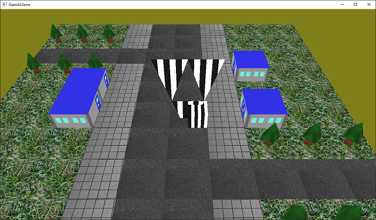
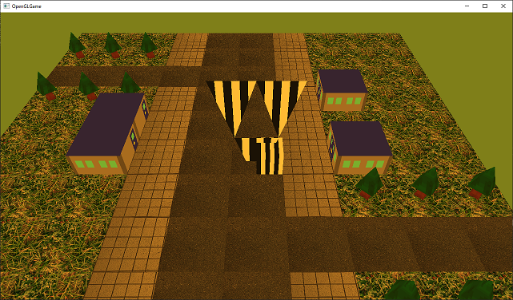
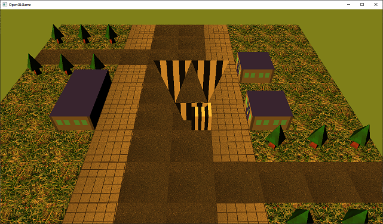

[OpenGL 3D 2021 第07回]

# シェーダーとライティング

## 習得目標

* シェーダーをファイルから作成する方法
* 法線(ほうせん)とは何か
* 光の向きと法線と明るさの関係(ランバート反射)
* 環境光を使った大域照明(たいいきしょうめい)

## 1. プログラム・パイプライン・オブジェクトを使いやすくする

### 1.1 <ruby>ProgramPipeline<rt>プログラムパイプライン</rt></ruby>クラスを定義する

第06回のテキストでは、頂点データを扱うバッファオブジェクトを`PrimitiveBuffer`クラスにまとめました。今回は「プログラム・オブジェクト」と「プログラム・パイプライン・オブジェクト」の2つをクラスにまとめていきます。

グラフィックス・パイプラインには、機能の異なる複数のシェーダーを設定することができます。個々のシェーダーを表すのが「プログラム・オブジェクト」、グラフィックス・パイプラインを表すのが「プログラム・パイプライン・オブジェクト」です。

今回は、この2つのオブジェクトをひとつのクラスにまとめます。1つのクラスにまとめるほうが、別々のクラスにするより作成と管理の手間を減らせるからです。

「プログラム・パイプライン・オブジェクト」を管理するクラスなので、クラス名は `ProgramPipeline`(プログラム・パイプライン)とします。

プロジェクトの`Src`フォルダに`ProgramPipeline.h`というファイルを追加してください。追加した`ProgramPipeline.h`を開き、次のプログラムを追加してください。

```diff
+/**
+* @file ProgramPipeline.h
+*/
+#ifndef PROGRAMPIPELINE_H_INCLUDED
+#define PROGRAMPIPELINE_H_INCLUDED
+#include <glad/glad.h>
+#include <glm/glm.hpp>
+
+/**
+* シェーダープログラムを管理するクラス.
+*/
+class ProgramPipeline
+{
+public:
+  ProgramPipeline(const char* vsCode, const char* fsCode);
+  ~ProgramPipeline();
+
+  // オブジェクトの有効性を判定する
+  bool IsValid() const;
+
+  // ユニフォーム変数の設定
+  bool SetUniform(GLint, const glm::mat4&) const;
+
+  // バインド管理
+  void Bind() const;
+  void Unbind() const;
+
+private:
+  GLuint vp = 0;       // プログラム・オブジェクト(頂点シェーダー)
+  GLuint fp = 0;       // プログラム・オブジェクト(フラグメントシェーダー)
+  GLuint pipeline = 0; // プログラム・パイプライン・オブジェクト
+};
+
+#endif // PROGRAMPIPELINE_H_INCLUDED
```

`ProgramPipeline`クラスの使い方は、次のようになります。

>1. コンストラクタの引数に、頂点シェーダーとフラグメントシェーダーの文字列を指定してクラスを作成。
>2. `IsValid`(イズ・バリッド)メンバ関数で作成に成功したかどうかをチェック。
>3. `Bind`(バインド)メンバ関数でプログラム・パイプライン・オブジェクトをバインド。
>4. `SetUniform`(セット・ユニフォーム)メンバ関数でMVP行列をGPUメモリにコピー。
>5. `Primitive`を描画。
>6. 全ての`Primitive`を描画したら、`Unbind`(アンバインド)メンバ関数でプログラム・パイプライン・オブジェクトのバインドを解除。

あるオブジェクトをクラスにする場合、そのオブジェクトを使ってできることがメンバ関数の候補となります。OpenGLの場合、オブジェクトIDを代入した変数名でプログラム内を検索します。

すると、そのオブジェクトを使っているプログラムが見つかるでしょう。見つけたプログラムは全てメンバ関数の候補となります。

次に、メンバ関数を定義するためのファイルを追加しましょう。プロジェクトの`Src`フォルダに`ProgramPipeline.cpp`(シェーダー・シーピーピー)というファイルを追加してください。追加した`ProgramPipeline.cpp`を開き、次のプログラムを追加してください。

```diff
+/**
+* @file ProgramPipeline.cpp
+*/
+#include "ProgramPipeline.h"
+#include "GLContext.h"
+#include <iostream>
```

### 1.2 コンストラクタを定義する

それではコンストラクタから書いていきましょう。`ProgramPipeline.cpp`に次のプログラムを追加してください。

```diff
 #include "GLContext.h"
 #include <iostream>
+
+/**
+* コンストラクタ.
+*
+* @param vsCode  頂点シェーダープログラムのアドレス.
+* @param fsCode  フラグメントシェーダープログラムのアドレス.
+*/
+ProgramPipeline::ProgramPipeline(const char* vsCode, const char* fsCode)
+{
+  vp = GLContext::CreateProgram(GL_VERTEX_SHADER, vsCode);
+  fp = GLContext::CreateProgram(GL_FRAGMENT_SHADER, fsCode);
+  pipeline = GLContext::CreatePipeline(vp, fp);
+  if (pipeline) {
+    std::cout << "[情報]プログラムパイプラインを作成(id=" << pipeline <<
+      ", vp=" << vsCode << ", fp=" << fsCode << ")\n";
+  }
+}
```

プログラム・オブジェクトとプログラム・パイプライン・オブジェクトを作成する機能は、以前のテキストで`GLContext`名前空間に定義したものを使います。

### 1.3 デストラクタを定義する

次はデストラクタを定義しましょう。コンストラクタの定義の下に、次のプログラムを追加してください。

```diff
   fp = GLContext::CreateProgram(GL_FRAGMENT_SHADER, fsCode);
   pp = GLContext::CreatePipeline(vp, fp);
 }
+
+/**
+* デストラクタ.
+*/
+ProgramPipeline::~ProgramPipeline()
+{
+  if (pipeline) {
+    std::cout << "[情報]プログラムパイプラインを削除(id=" << pipeline << ")\n";
+  }
+  glDeleteProgramPipelines(1, &pipeline);
+  glDeleteProgram(fp);
+  glDeleteProgram(vp);
+}
```

デストラクタでは`glDeleteProgramPipelines`でプログラム・パイプライン・オブジェクトを削除し、`glDeleteProgram`でプログラム・オブジェクトを削除します。

### 1.4 <ruby>IsValid<rt>イズ・バリッド</rt></ruby>関数を定義する

`IsValid`(イズ・バリッド)は、`ProgramPipeline`クラスが使用可能になっていることを調べる関数です。デストラクタの定義の下に、次のプログラムを追加してください。

```diff
   glDeleteProgram(fp);
   glDeleteProgram(vp);
 }
+
+/**
+* オブジェクトが使える状態かどうかを調べる.
+*
+* @retval true  使える.
+* @retval false 使えない(初期化に失敗している).
+*/
+bool ProgramPipeline::IsValid() const
+{
+  return pipeline;
+}
```

コンストラクタには戻り値がないため、初期化に成功したかどうかを判定できません。そこで判定用の関数を作り、コンストラクタの実行結果を調べられるようにしておきます。

プログラムは`pipeline`(パイプライン)変数を返すだけです。これは、C++では、数値型の値を`bool`型として評価すると、`0`以外なら`true`、`0`なら`false`になるからです。

コンストラクタで初期化に成功していれば、`pipeline`(パイプライン)変数には`0`以外の値が入っているはずなので、`pipeline`変数の値を`bool`型にするだけで、初期化に成功したかどうかが分かるという仕組みです。

>**【コンストラクタの結果を調べる別の方法】**<br>
>C++には「例外」という機能があります。「例外」を使えば、コンストラクタの処理結果をを呼び出し元に伝えられます。本テキストでは「例外」については扱いません。

### 1.5 <rubySetUniform>セット・ユニフォーム</rt></ruby>関数を定義する

続いて、`SetUniform`(セット・ユニフォーム)メンバ関数を定義します。この関数は「MVP行列などのユニフォーム変数にデータをコピーする」ために使います。`IsValid`メンバ関数の定義の下に、次のプログラムを追加してください。

```diff
+
+/**
+* ユニフォーム変数にデータをコピーする.
+*
+* @param location ユニフォーム変数の位置.
+* @param data     ユニフォーム変数にコピーするデータ.
+*
+* @retval true  コピー成功.
+* @retval false コピー失敗.
+*/
+bool ProgramPipeline::SetUniform(GLint location, const glm::mat4& data) const
+{
+  glGetError(); // エラー状態をリセット.
+
+  glProgramUniformMatrix4fv(vp, location, 1, GL_FALSE, &data[0][0]);
+  if (glGetError() != GL_NO_ERROR) {
+    std::cerr << "[エラー]" << __func__ << ":ユニフォーム変数の設定に失敗.\n";
+    return false;
+  }
+  return true;
+}
```

ユニフォーム変数にデータをコピーするには`glProgramUniform`(ジーエル・プログラム・ユニフォーム)系の関数を使います。関数名は転送先の変数の型によって異なります。

今回は4x4行列の変数なので、`Matrix4fv`(マトリクス・フォー・エフ・ブイ)を付け加えた`glProgramUniformMatrix4fv`(ジーエル・プログラム・ユニフォーム・マトリクス・フォー・エフ・ブイ)関数を使います。

なお、作成する全てのシェーダーに`MVP`行列変数が存在するとは限りません。存在しない場合は転送に失敗してしまいます。`glProgramUniform`系関数による転送の失敗を検知するには `glGetError`関数を使います。

`glGetError`の戻り値が`GL_NO_ERROR`の場合は転送成功。それ以外なら転送失敗です。今回は、転送に失敗した場合にエラーメッセージを表示するようにしました。

### 1.6 <ruby>Bind<rt>バインド</rt></ruby>関数を定義する

続いて、プログラム・パイプライン・オブジェクトを、グラフィックスパイプラインにバインドするメンバ関数を定義します。`SetUniform`メンバ関数の定義の下に、次のプログラムを追加してください。

```diff
   }
   return true;
 }
+
+/**
+* プログラムパイプラインをバインドする.
+*/
+void ProgramPipeline::Bind() const
+{
+  glBindProgramPipeline(pipeline);
+}
```

### 1.7 <ruby>Unbind<rt>アンバインド</rt></ruby>関数を定義する

最後に、バインドを解除するメンバ関数を定義します。`Bind`メンバ関数の定義の下に、次のプログラムを追加してください。

```diff
 {
   glBindProgramPipeline(ppo);
 }
+
+/**
+* プログラムパイプラインのバインドを解除する.
+*/
+void ProgramPipeline::Unbind() const
+{
+  glBindProgramPipeline(0);
+}
```

これで`ProgramPipeline`クラスの定義は完成です。

### 1.8 pipeline変数をProgarmPipelineクラスで置き換える

作成した`ProgramPipeline`クラスで、`Main.cpp`のプログラム・パイプライン・オブジェクトを置き換えましょう。まずは`ProgramPipeline.h`をインクルードします。`Main.cpp`を開き、`Primitive.h`のインクルード文の下に次のプログラムを追加してください。

```diff
 #include "GLContext.h"
 #include "Primitive.h"
+#include "ProgramPipeline.h"
 #include <glm/gtc/matrix_transform.hpp>
 #include <GLFW/glfw3.h>
 #include <string>
```

次に、パイプライン・オブジェクトを作成するプログラムを、次のように書き換えてください。

```diff
   primitiveBuffer.AddFromObjFile("Res/Tree.obj");
   primitiveBuffer.AddFromObjFile("Res/Warehouse.obj");

   // パイプライン・オブジェクトを作成する.
-  const GLuint vp = GLContext::CreateProgram(GL_VERTEX_SHADER, vsCode);
-  const GLuint fp = GLContext::CreateProgram(GL_FRAGMENT_SHADER, fsCode);
-  const GLuint pipeline = GLContext::CreatePipeline(vp, fp);
-  if (!pipeline) {
+  ProgramPipeline pipeline(vsCode, fsCode);
+  if (!pipeline.IsValid()) {
     return 1;
   }
```

### 1.9 パイプラインオブジェクトの後始末を消す

`Pipeline`クラスは、デストラクタが自動的にオブジェクトを削除するようにしてあります。ですから後始末は必要ありません。後始末プログラムを次のように書き換えてください。

```diff
   glDeleteTextures(1, &texGreen);
   glDeleteTextures(1, &texGround);
-  glDeleteProgramPipelines(1, &pipeline);
-  glDeleteProgram(fp);
-  glDeleteProgram(vp);

   // GLFWの終了.
   glfwTerminate();
```

### 1.10 バインド方法を変更する

次に、バインド方法を`ProgramPipeline`クラスのやりかたで置き換えます。パイプラインオブジェクトをバインドするプログラムを、以下のように書き換えてください。

```diff
     glClear(GL_COLOR_BUFFER_BIT | GL_DEPTH_BUFFER_BIT);

     primitiveBuffer.BindVertexArray();
-    glBindProgramPipeline(pipeline);
+    pipeline.Bind();
     glBindSampler(0, sampler);
```

同様に、バインド解除プログラムを`Unbind`関数で置き換えます。バインド解除処理を次のように書き換えてください。

```diff
     glBindSampler(0, 0);
-    glBindProgramPipeline(0);
+    pipeline.Unbind();
     primitiveBuffer.UnbindVertexArray();

     glfwPollEvents();
     glfwSwapBuffers(window);
```

### 1.11 MVP行列のコピー方法を変更する

最後に、`MVP行列`をGPUメモリにコピーする処理を書き換えます。行列をシェーダーに転送するプログラムを、次のように書き換えてください。

```diff
     // 行列をシェーダーに転送する 
     const glm::mat4 matModel = glm::mat4(1);
     const glm::mat4 matMVP = matProj * matView * matModel;
-    glProgramUniformMatrix4fv(vp, locMatTRS, 1, GL_FALSE, &matMVP[0][0]);
+    pipeline.SetUniform(locMatTRS, matMVP);
 
     glBindTextureUnit(0, texTriangle); // テクスチャを割り当てる.
     primitiveBuffer.Get(2).Draw();
```

置き換える前と後でやっていることに実質的な違いはありません。しかし、機能を`ProgramPipeline`クラスにまとめたことで、OpenGLの膨大な関数の山から必要な関数を探す手間をなくすことができました。

<pre class="tnmai_assignment">
<strong>【課題01】</strong>
木と建物を描画するプログラムと、地面を描画するプログラムについて、<code>MVP行列</code>をGPUメモリにコピーするプログラムを<code>SetUniform</code>関数を使うように書き換えなさい。
</pre>

課題01が完了したら、ビルドして実行してください。下の画像ように、これまでと変わらない映像が表示されたら成功です。相変わらず見た目は変わりませんが、今は変わらないことが成功の<ruby>証<rt>あかし</rt></ruby>です。

<p align="center">

</p>

>**【1章のまとめ】**<br>
>
>* クラスを使うと変数をまとめて管理することができる。
>* コンストラクタには戻り値がないため処理結果を返せない。
>* コンストラクタの処理結果を返す関数を用意するとよい。

<div style="page-break-after: always"></div>

## 2. シェーダーをファイルから読み込む

### 2.1 ファイルからシェーダーを作る関数を追加する

現在、シェーダープログラムは文字列として直接`Main.cpp`に書いています。しかし、この方法ではシェーダーの内容を書き換えるたびに、プログラム全体をビルドしなくてはなりません。そのため、シェーダーのデバッグや新しい効果の実験に時間がかかってしまいます。

そこで、シェーダープログラムをファイルから読み込むように変更しましょう。プログラム全体をビルドする必要がなくなるため、シェーダーのデバッグや実験がやりやすくなります。

まず、ファイルからプログラム・オブジェクトを作成する関数を宣言します。関数名は`CreateProgramFromFile`(クリエイト・プログラム・フロム・ファイル)とします。`GLContext.h`を開き、次のプログラムを追加してください。

```diff
 GLuint CreateVertexArray(GLuint vboPosition, GLuint vboColor,
   GLuint vboTexcoord, GLuint ibo);
 GLuint CreateProgram(GLenum type, const GLchar* code);
+GLuint CreateProgramFromFile(GLenum type, const char* filename);
 GLuint CreatePipeline(GLuint vp, GLuint fp);
 GLuint CreateImage2D(GLsizei width, GLsizei height, const void* data,
```

関数を定義する前に、ファイルの読み込みに必要な機能を含むヘッダファイルをインクルードします。`GLContext.cpp`を開き、次のプログラムを追加してください。

```diff
 #include <glm/glm.hpp>
 #include <cstdint>
 #include <fstream>
+#include <sstream>
 #include <vector>
 #include <iostream>
```

`sstream`(エス・ストリーム)ヘッダには、文字列の入出力をサポートする「ストリング・ストリーム」という機能が定義されています。

それでは`CreateProgramFromFile`関数を定義しましょう。`CreateProgram`関数の定義の下に、次のプログラムを追加してください。

```diff
   }
   return program;
 }
+
+/**
+* ファイルからシェーダー・プログラムを作成する.
+*
+* @param type     シェーダーの種類.
+* @param filename シェーダーファイル名.
+*
+* @retval 0より大きい 作成したプログラム・オブジェクト.
+* @retval 0           プログラム・オブジェクトの作成に失敗.
+*/
+GLuint CreateProgramFromFile(GLenum type, const char* filename)
+{
+  std::ifstream ifs(filename);
+  if (!ifs) {
+    std::cerr << "[エラー]" << __func__ << ":" << filename <<
+      "を開けません.\n";
+    return 0;
+  }
+  std::stringstream ss;
+  ss << ifs.rdbuf();
+  return GLContext::CreateProgram(type, ss.str().c_str());
+}

 /**
 * パイプライン・オブジェクトを作成する.
```

ファイルを開くのは、画像の読み込みでも使った`std::ifstream`で行います。ファイルの読み込みには`std::stringstream`(エスティーディ・ストリング・ストリーム)クラスを使います。

`stringstream`クラスには、`<<`演算子でファイルストリームからストリングストリームへとデータを読み込む機能があります。上記のプログラムでは、この機能を使ってファイル全体を読み込んでいます。

<pre class="tnmai_code"><strong>【書式】</strong><code>
std::ostream& std::ostream::operator<<(ストリームバッファへのポインタ);
</code></pre>

C++ではファイルなどのデータ入出力を扱うクラスを「ストリーム(「流れ」や「小川」という意味)」と呼びます。そして、ストリームクラスでは、左シフト演算子(`<<`)のことを「出力演算子」、右シフト演算子(`>>`)のことを「入力演算子」と呼びます。

これらの演算子は「演算子のオーバーロード」によって定義されており、「右辺のストリームからデータを読み込んで左辺のストリームに出力する」、「左辺のストリームからデータを読み込んで右辺のストリームに入力する」機能を持ちます。

>**【演算子の意味は変えないようにしよう】**<br>
>現在の視点では、演算子のオーバーロードを行うときは「演算子の意味を変えない」ことが重要だとされています。しかし、ストリーム型の入力演算子(`>>`)と出力演算子(`<<`)は、まだそういった経験が蓄積されるずっと前に作られたため、演算子の意味を変えてしまっています。これには「オーバーロードにできることの例を示したい」という側面もあったようです。しかし、現在では悪い作法だと考えられています。
>同じオーバーロードでも、例えば`glm::vec4`の`+`演算子や`*`演算子などは四則演算の意味を維持しているので、自然な拡張だといえます。

ストリングストリームに読み込まれたデータは`str`(エスティーアール)メンバ関数で取得できます。

<pre class="tnmai_code"><strong>【書式】</strong><code>
std::string std::stringstream::str() const;
</code></pre>

ただし、`str`メンバ関数の戻り値は`std::string`型です。`CreateProgram`関数の引数は`const GLchar*`型なので、直接指定することはできません。そこで、さらに`c_str`(シー・エスティーアール)メンバ関数を使って`const char*`型に変換します。

<pre class="tnmai_code"><strong>【書式】</strong><code>
const char* std::string::c_str();
</code></pre>

`c_str`メンバ関数は「C言語形式の文字列」を返します。この関数名は`C-style STRing`(シー・スタイル・ストリング)を短縮したものです。

>**【テキストファイルを読み込む別の方法】**<br>
>OBJファイルの読み込みで使った`eof`関数と`getline`関数によって、次のように読み込むこともできます。
>
>```c++
>std::string s;
>while (ifs.eof()) {
>  std::string line;
>  std::getline(ifs, line);
>  s.push_back(line);
>}
>```
>
>このやり方でも問題はありませんが、1行ずつ読み込むので、ファイル全体を読み込む速度が`stringstream`クラスより遅くなる場合があります。

### 2.2 Pipelineコンストラクタをファイル名に対応させる

続いて`CreateProgramFromFile`関数を使うように`ProgramPipeline`コンストラクタを書き換えます。`ProgramPipeline.cpp`を開き、`Pipeline`コンストラクタを次のように変更してください。

```diff
 /**
 * コンストラクタ.
 *
-* @param vsCode  頂点シェーダープログラムのアドレス.
-* @param fsCode  フラグメントシェーダープログラムのアドレス.
+* @param vsCode  頂点シェーダーファイル名.
+* @param fsCode  フラグメントシェーダーファイル名.
 */
 Pipeline::Pipeline(const char* vsCode, const char* fsCode)
 {
-  vp = GLContext::CreateProgram(GL_VERTEX_SHADER, vsCode);
-  fp = GLContext::CreateProgram(GL_FRAGMENT_SHADER, fsCode);
+  vp = GLContext::CreateProgramFromFile(GL_VERTEX_SHADER, vsCode);
+  fp = GLContext::CreateProgramFromFile(GL_FRAGMENT_SHADER, fsCode);
   pipeline = GLContext::CreatePipeline(vp, fp);
 }
```

これで、ファイルから`ProgramPipeline`を作れるようになりました。

### 2.3 シェーダープログラムをファイルに移す

次は、頂点シェーダーとフラグメントシェーダーをファイルに移していきましょう。頂点シェーダーファイルの名前は`Simple.vert`(シンプル・バート)、フラグメントシェーダーファイルの名前は`Simple.frag`(シンプル・フラグ)とします。

それでは、ソリューションエクスプローラーの「リソースファイル」を右クリックし、「追加→新しい項目」を選択してください。

<p align="center">

</p>

「新しい項目の追加」ウィンドウが開いたら、まず左側のリストから「ユーティリティ」を探してクリックします(①)。次に中央のリストにある「テキストファイル」をクリックします(②)。

そうしたら、「場所」欄が、プロジェクトの`Res`フォルダを指すように変更してください(③)。フォルダを変更したら、「名前」欄に`Simple.vert`と入力してください(④)。種類、場所、名前がこのテキストの説明とおなじになっていることを確認したら、「追加」ボタンをクリックしてファイルを追加します(⑤)。

続いて`Main.cpp`にある頂点シェーダープログラムを`Simple.vert`に移動します。次のように`Main.cpp`にある頂点シェーダープログラムを範囲選択し、`Ctrl+X`キーを押して切り取ってください。

```diff
   G, G, G, G, G, G, G, G,
 };

-/// 頂点シェーダー.
-static const char* vsCode =
-  "#version 450 \n"
-  "layout(location=0) in vec3 vPosition; \n"
-  "layout(location=1) in vec4 vColor; \n"
-  "layout(location=2) in vec2 vTexcoord; \n"
-  "layout(location=0) out vec4 outColor; \n"
-  "layout(location=1) out vec2 outTexcoord; \n"
-  "out gl_PerVertex { \n"
-  "  vec4 gl_Position; \n"
-  "}; \n"
-  "layout(location=0) uniform mat4 matTRS; \n"
-  "void main() { \n"
-  "  outColor = vColor; \n"
-  "  outTexcoord = vTexcoord; \n"
-  "  gl_Position = matTRS * vec4(vPosition, 1.0); \n"
-  "} \n";
-
 /// フラグメントシェーダー.
 static const GLchar* const fsCode =
 ```

`Simple.vert`を開き、`Ctrl+V`キーを押して、切り取ったプログラムを貼り付けてください。

```diff
+/// 頂点シェーダー.
+static const char* vsCode =
+  "#version 450 \n"
+  "layout(location=0) in vec3 vPosition; \n"
+  "layout(location=1) in vec4 vColor; \n"
+  "layout(location=2) in vec2 vTexcoord; \n"
+  "layout(location=0) out vec4 outColor; \n"
+  "layout(location=1) out vec2 outTexcoord; \n"
+  "out gl_PerVertex { \n"
+  "  vec4 gl_Position; \n"
+  "}; \n"
+  "layout(location=0) uniform mat4 matTRS; \n"
+  "void main() { \n"
+  "  outColor = vColor; \n"
+  "  outTexcoord = vTexcoord; \n"
+  "  gl_Position = matTRS * vec4(vPosition, 1.0); \n"
+  "} \n";
+
```

次に不要な行を削除します。次のように`Simple.vert`の最初の2行を削除してください。

```diff
-/// 頂点シェーダー.
-static const GLchar* const vsCode =
   "#version 450 \n"
   "layout(location=0) in vec3 vPosition; \n"
   "layout(location=1) in vec4 vColor; \n"
```

続いて、行の先頭の`"`と末尾の`\n"`、それと最後の行の`";`を削除します。頂点シェーダープログラムを次のように書き換えてください。

```diff
-  "#version 450 \n"
-  "layout(location=0) in vec3 vPosition; \n"
-  "layout(location=1) in vec4 vColor; \n"
-  "layout(location=2) in vec2 vTexcoord; \n"
-  "layout(location=0) out vec4 outColor; \n"
-  "layout(location=1) out vec2 outTexcoord; \n"
-  "out gl_PerVertex { \n"
-  "  vec4 gl_Position; \n"
-  "}; \n"
-  "layout(location=0) uniform mat4 matTRS; \n"
-  "void main() { \n"
-  "  outColor = vColor; \n"
-  "  outTexcoord = vTexcoord; \n"
-  "  gl_Position = matTRS * vec4(vPosition, 1.0); \n"
-  "} \n";
+#version 450
+layout(location=0) in vec3 vPosition;
+layout(location=1) in vec4 vColor;
+layout(location=2) in vec2 vTexcoord;
+layout(location=0) out vec4 outColor;
+layout(location=1) out vec2 outTexcoord;
+out gl_PerVertex {
+  vec4 gl_Position;
+};
+layout(location=0) uniform mat4 matTRS;
+void main() {
+  outColor = vColor;
+  outTexcoord = vTexcoord;
+  gl_Position = matTRS * vec4(vPosition, 1.0);
+}
```

全部の行がつながっていると見づらいので、適宜空白とコメントを追加しましょう。頂点シェーダープログラムを次のように書き換えてください。

```diff
 #version 450
+
+// 入力変数
 layout(location=0) in vec3 vPosition;
 layout(location=1) in vec4 vColor;
 layout(location=2) in vec2 vTexcoord;
+
+// 出力変数
 layout(location=0) out vec4 outColor;
 layout(location=1) out vec2 outTexcoord;
 out gl_PerVertex {
   vec4 gl_Position;
 };
+
+// ユニフォーム変数
 layout(location=0) uniform mat4 matTRS;
+
+// 頂点シェーダープログラム
 void main() {
   outColor = vColor;
   outTexcoord = vTexcoord;
```

これで頂点シェーダーファイルは完成です。

<pre class="tnmai_assignment">
<strong>【課題02】</strong>
プロジェクトの<code>Res</code>フォルダに<code>Simple.frag</code>というファイルを作成しなさい。そして、<code>Simple.vert</code>を参考にして、<code>fsCode</code>配列を<code>Simple.frag</code>に移動し、不要部分の除去とコメントの追加を行いなさい。
</pre>

### 2.4 シェーダーファイルを読み込む

シェーダーファイルから`ProgramPipeline`を作成するように変更しましょう。`Main.cpp`を開き、`pipeline`変数を作成するプログラムを次のように書き換えてください。

```diff
   // パイプライン・オブジェクトを作成する.
-  ProgramPipeline pipeline(vsCode, fsCode);
+  ProgramPipeline pipeline("Res/Simple.vert", "Res/Simple.frag");
   if (!pipeline.IsValid()) {
     return 1;
   }
```

変更を終えたら、ビルドして実行してください。以下の画像のように、これまでと同じ画面が表示されたら成功です。

>* 何も表示されなかった場合は頂点シェーダープログラムを見直す。
>* 図形が全部真っ黒になってしまう場合はフラグメントシェーダープログラムを見直す。

<p align="center">

</p>

### 2.5 シェーダープログラムを読みやすくする

Visual Studioにはプログラム開発を支援する機能があって、単語に色を付けてくれたり、単語の候補を表示したり、間違った部分に赤い波線を表示したりしてくれます。この機能のことを `IntelliSense`(インテリ・センス)といいます。

ただし、インテリセンスの支援機能が働くのは、`C++`や`C#`などのVisual Studioが知っている言語だけです。そして、Visual Studioは`GLSL`について何も知りません。

つまり、シェーダープログラムの開発ではインテリセンスの支援を受けられないのです。これはとても不便です。ですが、安心してください。Visual Studioには、本来持っていない機能を追加できる「拡張機能」というものがあるんです(ゲームのMODのようなもの)。

Daniel Scherzer(ダニエル・シャーザー)という方が「`GLSL`でも支援機能が働くようにする」という拡張機能を作ってくれています。ありがたくこの拡張機能を追加して、シェーダープログラムでも`IntelliSense`の支援を受けられるようにしましょう。

ウィンドウ上部のメニューから「拡張機能→拡張機能の管理」を選択してください。すると、次のような「拡張機能の管理」ウィンドウが開きます。

<p align="center">

</p>

まず左のリストにある「オンライン」をクリックします(①)。次に、右上のテキストボックスに「glsl」と入力してください(②)。すると、中央のリストの内容が変化します。

中央のリストから「GLSL language Integration」(ジーエルエスエル・ランゲージ・インテグレーション、GLSL言語の統合という意味)という項目を探してクリックします。すると「ダウンロード」ボタンが表示されるので、これをクリックしてください(③)。

ダウンロードが完了するとウィンドウ下部の色が変化し、「Visual Studoを終了したらインストールしてやる」みたいなメッセージが表示されます。そうしたら右下の「閉じる」ボタンをクリックしてウィンドウを閉じます(④)。

ウィンドウを閉じたら、先程のメッセージに従ってVisual Studioを終了させてください。しばらくすると、下のようなウィンドウが表示されますので、「はい」を選択してください。

<p align="center">

</p>

今度は次のような「GLSL language integration」のインストーラが表示されます。

<p align="center">

</p>

「Modify」(モディファイ)ボタンをクリックするとインストールが始まります。インストール完了までしばらくお待ち下さい。

正常にインストールが行われたら、インストーラの表示が次のように変わります。「Close」(クローズ)ボタンをクリックしてインストーラを終了させてください。

<p align="center">

</p>

インストーラを終了したら、Visual Studioを起動してください。シェーダーファイルを開いたとき、次の画像のように単語に色が付いていたらインストール成功です。

<p align="center">

</p>

>**【2章のまとめ】**<br>
>
>* ファイル全体を一度に読み込むときは`std::stringstream`クラスを使う。
>* Visual Studioでシェーダーファイルを読みやすくするには、「GLSLランゲージインテグレーション」拡張機能を入れるとよい。

<div style="page-break-after: always"></div>

## 3. <ruby>法線<rt>ほうせん</rt></ruby>

### 3.1 光の向き

現実世界はさまざまな色であふれています。真っ白な壁でも、よく見ると微妙な陰影がついています。なぜなら、さまざまな角度から来た光に照らされているからです。現実世界では、光があるからこそ物体を見ることができるのです。

実は、みなさんが作った世界にも光はあります。詳しいことは後で説明しますが、みなさんが書いたシェーダーは「世界全体が均一な光で包まれている」状態を表現しているのです。だから木や家に色が付いて表示されるんですね。

しかし、「均一な光で包まれている」状態では陰影を表現することができません。頂点の色を調整すればそれらしい陰影を付けることはできますが、物体が回転した途端に御破算です。

また、現実世界の太陽などは、時刻によって異なる方向から光を投げかけていますよね。だからこそ、朝や昼、夕方や夜という一日の移り変わりがあるわけです。しかし、均一な光ではこの移り変わりを再現できません。

そこで、もう少しだけ複雑な光の表現を追加していきます。OpenGLの世界では「光」もまたデータの一種です。そして、「光のデータをもとに物体表面の明るさを計算する」ことによって、画面に表示する色が決まります。

この工程を「ライティング」といいます。OpenGLの世界では、ライティングはシェーダーのお仕事です。ですから、光のデータをシェーダーに送る必要があります。

### 3.2 <ruby>法線<rt>ほうせん</rt></ruby>

光が物体を照らす明るさは、光の位置と物体の表面の角度によって決まります。これを決めるために「物体の表面の向き」、という情報もシェーダーに送らなければなりません。

「物体の表面の向き」は、「物体表面のある点に接する平面(接平面)に対して垂直な直線」として表されます。このような垂直線を「法線(ほうせん)」と呼びます。

<p align="center">
 <br>
[立方体と球の法線(赤い矢印)]
</p>

>**【なぜ垂線ではなく法線と言うの？】**<br>
> 「<ruby>法線<rt>ほうせん</rt></ruby>」という名前は、英語の`normal`(ノーマル)を翻訳したものです。ただ、「normal」の翻訳が何故「法線」になったのかという理由はよく分かっていません。<br>
>`normal`には「標準、規則、垂直」などの意味があるのですが、日本語ではこれらを一語で表せる単語がありません。一説によると、`normal`という単語が最初に舶来したとき、法律の本から「規則→法」という翻訳がなされ、あとから数学の本に書かれている`normal`にも同じ訳があてられた、とされています。また、先に中国で訳されたものが入ってきたという説(中国で「`normal`→法線」と訳された理由は不明)もありますが、いずれも噂に過ぎず、真相は不明です。

コンピュータグラフィックスでは、法線を「長さ1のベクトル」として表します。この「長さ1のベクトル」のことを「単位ベクトル」といいます。

半径の長さが1の球体があるとしましょう。この球の中心から球の表面上の任意の点を結ぶ直線を引きます。この直線が単位ベクトルです。半径1の球を数式で表すと次の式になります。

`1= √(x^2+y^2+z^2 )`

「単位ベクトル」とは、上の式を満たす`x, y, z`の組のことです。

>**【法線に単位ベクトルを使う理由】**<br>
>法線に単位ベクトルを使う理由は「角度を計算するときに割り算を省略できるので、計算が速くなるから」です。<br>
>法線のように「方向を表すベクトル」のことを、「方向ベクトル」や「向きベクトル」といいます。方向ベクトルを使った計算では、2つの方向ベクトルのなす角を求めることが多いです。角度を求めるときは、2つの方向ベクトルを乗算します。その結果は、角度と長さを乗算した数値になります。角度と長さが混じっているため、角度だけを知りたい場合は長さで割らなくてはなりません。しかし、ベクトルの長さが`1`ならばどうでしょうか。`1`をどれだけ掛けても値は変化しませんから、割り算を省略できます。

### 3.3 頂点データに法線を追加する

「物体の表面の向き」のことを「法線」(ほうせん)といい、法線は「単位ベクトル」であることを学びました。さて、物体の法線をデータ化するにはいくつかの方法があります。最も一般的なのは「頂点座標における法線」を追加することです。

まず地面の法線データを追加しましょう。下図のように地面はまっすぐ上を向いています。そのため、地面の法線(物体の表面の向き)を表すベクトルは全て`(0, 1, 0)`となります。

<p align="center">

</p>

OBJファイルにおいて、法線データは`vn`構文で表されます(`vertex normal`(バーテックス・ノーマル)の頭文字)。`Ground.obj`を開き、地面のテクスチャ座標データの下に、次のデータを追加してください。

```diff
 vt  1.0   1.0
 vt -0.0   1.0

+vn  0.0  1.0  0.0

 f 1/1 2/2 3/3
 f 3/3 4/4 1/1
```

地面のように平らな図形では、全ての頂点の法線は同じ方向を向きます。OBJファイルでは要素ごとにインデックスを指定できるので、値が等しいデータはひとつ定義するだけで済ませることができます。

法線のインデックスは`f`構文の3番目の値として定義します。インデックスデータを次のように変更してください。

```diff
 vn  0.0  1.0  0.0

-f 1/1 2/2 3/3
-f 3/3 4/4 1/1
+f 1/1/1 2/2/1 3/3/1
+f 3/3/1 4/4/1 1/1/1
```

ここでのポイントは、ひとつの法線データをすべての頂点で利用しているところです。

`f`構文の書き方にはいくつかの種類があります。頂点座標インデックスを`v1`, `v2`, `v3`、テクスチャ座標インデックスを`vt1`, `vt2`, `vt3`、法線インデックスを`vn1`, `vn2`, `vn3`としたときの、`f`構文の種類は次のとおりです。

| 含まれるデータ | 構文 |
|:--------------:|:-----|
| 頂点座標のみ                 | f&emsp;v1 v2 v3                         |
| 頂点座標+テクスチャ座標      | f&emsp;v1/vt1 v2/vt2 v3/vt3             |
| 頂点座標+テクスチャ座標+法線 | f&emsp;v1/vt1/vn1 v2/vt2/vn2 v3/vt3/vn3 |
| 頂点座標+法線                | f&emsp;v1//vn1 v2//vn2 v3//vn3          |

この表から分かるとおり、頂点座標インデックスは省略できません。頂点座標がないと図形を作れないからです。

### 3.4 CreateVertexArray関数を法線データに対応させる

法線データをシェーダーに送るために、`VAO`に法線データを追加する必要があります。
`GLContext.h`を開き、`CreateVertexArray`関数の宣言を次のように書き換えてください。

```diff
 namespace GLContext {

 GLuint CreateBuffer(GLsizeiptr size, const GLvoid* data);
 GLuint CreateVertexArray(GLuint vboPosition, GLuint vboColor,
-  GLuint vboTexcoord, GLuint ibo);
+  GLuint vboTexcoord, GLuint vboNormal, GLuint ibo);
 GLuint CreateProgram(GLenum type, const GLchar* code);
 GLuint CreateProgramFromFile(GLenum type, const char* filename);
```

次に`GLContext.cpp`を開き、`CreateVertexArray`関数の定義を次のように書き換えてください。

```diff
 * @param vboColor    VAOに関連付けられるカラーデータ.
 * @param vboTexcoord VAOに関連付けられるテクスチャ座標データ.
+* @param vboNormal   VAOに関連付けられる法線データ.
 * @param ibo         VAOに関連付けられるインデックスデータ.
 *
 * @return 作成したVAO.
 */
 GLuint CreateVertexArray(GLuint vboPosition, GLuint vboColor,
+  GLuint vboTexcoord, GLuint ibo)
+  GLuint vboTexcoord, GLuint vboNormal, GLuint ibo)
 {
-  if (!vboPosition || !vboColor || !vboTexcoord || !ibo) {
+  if (!vboPosition || !vboColor || !vboTexcoord || !vboNormal || !ibo) {
     return 0;
   }
```

続いて、法線の頂点アトリビュートを設定します。バインディング・ポイントの0～2番には既に頂点データを割り当てているので、次の空き番号である3番に割り当てましょう。

<pre class="tnmai_assignment">
<strong>【課題03】</strong>
<code>CreateVertexArray</code>関数について、テクスチャ座標<code>vboTexcoord</code>をバインディング・ポイント2番に割り当てるプログラムの下に、法線<code>vboNormal</code>をバインディング・ポイ
ント3番に割り当てるプログラムを追加しなさい。頂点アトリビュート番号を表す変数名は<code>normalIndex</code>、バインディング・ポイント番号を表す変数名は
<code>normalBindingIndex</code>としなさい。法線の型は<code>glm::vec3</code>です。
</pre>

### 3.5 PrimitiveBufferクラスを法線データに対応させる

`CreateVertexArray`関数を使っている`PrimitiveBuffer`クラスも変更しなければなりません。そのためには、法線データを格納するための`VBO`変数が必要となります。
`Primitive.h`を開き、`PrimitiveBuffer`クラスに次のメンバ変数を追加してください。

```diff
   // バッファID
   GLuint vboPosition = 0;
   GLuint vboColor = 0;
   GLuint vboTexcoord = 0;
+  GLuint vboNormal = 0;
   GLuint ibo = 0;
   GLuint vao = 0;
```

続いて、追加した`vboNormal`変数にGPUメモリを割り当てましょう。`Primitive.cpp`を開き、コンストラクタを次のように書き換えてください。

```diff
   vboColor = GLContext::CreateBuffer(sizeof(glm::vec4) * maxVertexCount, nullptr);
   vboTexcoord = GLContext::CreateBuffer(sizeof(glm::vec2) * maxVertexCount, nullptr);
+  vboNormal = GLContext::CreateBuffer(sizeof(glm::vec3) * maxVertexCount, nullptr);
   ibo = GLContext::CreateBuffer(sizeof(GLushort) * maxIndexCount, nullptr);
-  vao = GLContext::CreateVertexArray(vboPosition, vboColor, vboTexcoord, ibo);
-  if (!vboPosition || !vboColor || !vboTexcoord || !ibo || !vao) {
+  vao = GLContext::CreateVertexArray(vboPosition, vboColor, vboTexcoord, vboNormal,ibo);
+  if (!vboPosition || !vboColor || !vboTexcoord || !vboNormal || !ibo || !vao) {
     std::cerr << "[エラー]" << __func__ << ": VAOの作成に失敗.\n";
   }
```

割り当てたメモリは不要になったら解放しなくてはなりません。デストラクタに次のプログラムを追加してください。

```diff
 PrimitiveBuffer::~PrimitiveBuffer()
 {
   glDeleteVertexArrays(1, &vao);
   glDeleteBuffers(1, &ibo);
+  glDeleteBuffers(1, &vboNormal);
   glDeleteBuffers(1, &vboTexcoord);
   glDeleteBuffers(1, &vboColor);
```

これで、法線データ用のGPUメモリを割り当てられるようになりました。

### 3.6 Addメンバ関数を法線データに対応させる

GPUメモリを確保できるようになったので、次は`Add`メンバ関数の引数に法線データを追加にします。`Primitive.h`を開き、`Add`メンバ関数の宣言を次のように書き換えてください。

```diff
   // プリミティブの追加.
   bool Add(size_t vertexCount, const glm::vec3* pPosition, const glm::vec4* pColor,
-    const glm::vec2* pTexcoord, size_t indexCount, const GLushort* pIndex);
+    const glm::vec2* pTexcoord, const glm::vec3* pNormal,
+    size_t indexCount, const GLushort* pIndex);
   const Primitive& Get(size_t n) const;

   // VAOバインド管理.
```

続いて定義も変更していきましょう。`Primitive.cpp`を開き、`Add`メンバ関数の定義を次のように書き換えてください。

```diff
 * @param pColor      色データへのポインタ.
 * @param pTexcoord   テクスチャ座標データへのポインタ.
+* @param pNormal     法線データへのポインタ.
 * @param indexCount  追加するインデックスデータの数.
 * @param pIndex      インデックスデータへのポインタ.
 *
 * @retval true  追加成功.
 * @retval false 追加失敗.
 */
 bool PrimitiveBuffer::Add(size_t vertexCount, const glm::vec3* pPosition,
-  const glm::vec4* pColor, const glm::vec2* pTexcoord,
+  const glm::vec4* pColor, const glm::vec2* pTexcoord, const glm::vec3* pNormal,
   size_t indexCount, const GLushort* pIndex)
 {
   if (!vao) {
```

次に法線データをGPUメモリにコピーします。

<pre class="tnmai_assignment">
<strong>【課題04】</strong>
<code>Add</code>関数について、テクスチャ座標<code>vboTexcoord</code>をGPUメモリにコピーするプログラムの下に、法線<code>vboNormal</code>をGPUメモリにコピーするプログラムを追加しなさい。
</pre>

これで、`PrimitiveBuffer`クラスも法線データを扱えるようになりました。

### 3.7 OBJファイルから法線データを読み込む

OBJファイルから法線データを読み込むために、`AddFromObjFile` メンバ関数に次の機能を追加していきます。

>1. OBJファイルから法線データを読み込む。
>2. 面データを読み込むとき、法線インデックスも読み込むようにする。
>3. 読み込んだ法線データをOpenGLで使える形に変換する。
>4. OBJファイルに法線データがない場合、計算によって法線を作成する。
>5. 変換した法線データを`Add`メンバ関数の引数に指定する。

まずは、法線を読み込むための配列変数とインデックスを追加します。`Primitive.cpp`を開き、`AddFromObjFile`メンバ関数にある`objTexcoords`配列変数を定義するプログラムの下に、次のプログラムを追加してください。

```diff
   std::vector<glm::vec3> objPositions; // OBJファイルの頂点座標
   std::vector<glm::vec2> objTexcoords; // OBJファイルのテクスチャ座標
+  std::vector<glm::vec3> objNormals;   // OBJファイルの法線
   // インデックス用
   struct Index {
-    int v, vt;
+    int v = 0;  // 頂点座標インデックス
+    int vt = 0; // テクスチャ座標インデックス
+    int vn = 0; // 法線インデックス
   };
   std::vector<Index> objIndices; // OBJファイルのインデックス

   // 容量を予約.
   objPositions.reserve(10'000);
   objTexcoords.reserve(10'000);
+  objNormals.reserve(10'000);
   objIndices.reserve(10'000);
```

次に、追加した`objNormals`配列に法線データを読み込みます。テクスチャ座標の`vt`構文を読み取るプログラムの下に、次のプログラムを追加してください。

```diff
         std::cerr << "[警告]" << __func__ << ":テクスチャ座標の読み取りに失敗.\n" <<
           "  " << filename << "(" << lineNo << "行目): " << line << "\n";
       }
       objTexcoords.push_back(vt);
+
+    } else if (type == "vn") { // 法線
+      glm::vec3 vn(0);
+      if (sscanf(p, "%f %f %f", &vn.x, &vn.y, &vn.z) != 3) {
+        std::cerr << "[警告]" << __func__ << ":法線の読み取りに失敗.\n" <<
+          "  " << filename << "(" << lineNo << "行目): " << line << "\n";
+      }
+      objNormals.push_back(vn);

     } else if (type == "f") { // 面
       Index f[3];
```

### 3.8 OBJファイルから法線インデックスを読み込む

次は`f`構文を法線インデックスに対応させます。法線インデックスを持たないOBJファイルも読み込めるように、`sscanf`を2回使います。`f`構文を解析するプログラムを次のように変更してください。

```diff
     } else if (type == "f") { // 面
       Index f[3];
+      bool isSuccess = false; // true=解析成功 false=解析失敗
+
+      // 「頂点座標/テクスチャ座標」バージョンの解析.
-      const int n = sscanf(p, " %d/%d %d/%d %d/%d",
+      if (sscanf(p, " %d/%d %d/%d %d/%d",
         &f[0].v, &f[0].vt,
         &f[1].v, &f[1].vt,
-        &f[2].v, &f[2].vt);
+        &f[2].v, &f[2].vt) == 6) { // データは6個
+        isSuccess = true; // 解析成功
+      }
+      // 「頂点座標/テクスチャ座標/法線」バージョンの解析.
+      else if(sscanf(p, " %d/%d/%d %d/%d/%d %d/%d/%d",
+        &f[0].v, &f[0].vt, &f[0].vn,
+        &f[1].v, &f[1].vt, &f[1].vn,
+        &f[2].v, &f[2].vt, &f[2].vn) == 9) { // データは9個
+        isSuccess = true; // 解析成功
+      }
+ 
-      if (n != 6) {
+      if (!isSuccess) {
         std::cerr << "[警告]" << __func__ << ":面データの読み取りに失敗.\n"
           "  " << filename << "(" << lineNo << "行目): " << line << "\n";
```

これで、法線がある場合、ない場合の両方に対応できるようになりました。

### 3.9 法線データをOpenGLで使えるように変換する

法線データを読み込んだら、次は読み込んだデータをOpenGLで使えるデータに変換します。まず、変換後のデータを入れる配列を用意します。データ変換用の配列を用意するプログラムに、次のプログラムを追加してください。

```diff
   std::vector<glm::vec3> positions; // OpenGL用の頂点座標
   std::vector<glm::vec4> colors;    // OpenGL用の色
   std::vector<glm::vec2> texcoords; // OpenGL用のテクスチャ座標
+  std::vector<glm::vec3> normals;   // OpenGL用の法線
   std::vector<GLushort> indices;    // OpenGL用のインデックス

   // データ変換用のメモリを確保.
   const size_t indexCount = objIndices.size();
   positions.reserve(indexCount);
   texcoords.reserve(indexCount);
+  normals.reserve(indexCount);
   indices.reserve(indexCount);
```

それでは法線データを変換するプログラムを追加しましょう。やることは頂点座標やテクスチャ座標とだいたい同じで、<br>
「インデックス番目の法線データを取り出し、変換用配列に`push_back`する」<br>
という内容です。

テクスチャ座標を変換するプログラムの下に、次のプログラムを追加してください。

```diff
         "  " << filename << "\n";
       texcoords.push_back(glm::vec2(0));
     }
+
+    // 法線を変換.
+    const int vn = objIndices[i].vn - 1;
+    if (vn < static_cast<int>(objNormals.size())) {
+      normals.push_back(objNormals[vn]);
+    } else {
+      std::cerr << "[警告]" << __func__ << ":法線インデックス" << vn <<
+        "は範囲[0, " << objNormals.size() << ")の外を指しています.\n" <<
+        "  " << filename << "\n";
+      normals.push_back(glm::vec3(0, 1, 0));
+    }
   }

   // 色データを設定.
   colors.resize(positions.size(), glm::vec4(1));
```

ただ、これでは「法線データを持たないOBJファイル」に対応できません。`VAO`に法線を追加したので、法線データがない場合でもどうにかして法線を用意しなくてはなりません。

とりあえず、インデックスが`0`のとき、適当な法線を追加するプログラムを書いてみます。法線を変換するプログラムに次のプログラムを追加してください。

```diff
         "  " << filename << "\n";
       texcoords.push_back(glm::vec2(0));
     }

+    // 法線インデックスがないデータの場合、なんとかして法線を用意する.
+    if (objIndices[i].vn == 0) {
+      // なんとかして用意した法線を追加.
+      const glm::vec3 normal = glm::vec3(0, 1, 0);
+      normals.push_back(normal);
+    } else {
       // 法線を変換.
       const int vn = objIndices[i].vn - 1;
       if (vn < static_cast<int>(objNormals.size())) {
         normals.push_back(objNormals[vn]);
       } else {
         std::cerr << "[警告]" << __func__ << ":法線インデックス" << vn <<
           "は範囲[0, " << objNormals.size() << ")の外を指しています.\n" <<
           "  " << filename << "\n";
         normals.push_back(glm::vec3(0, 1, 0));
       }
+    }
   }

   // 色データを設定.
   colors.resize(positions.size(), glm::vec4(1));
```

これで法線データを読み込めるようになりました。

>**【3章のまとめ】**<br>
>
>* 「物体表面のある点に接する平面(接平面)に対して垂直な直線」のことを「法線」という。
>* 法線は単位ベクトル(長さ1のベクトル)である。
>* コンピューター・グラフィックスでは、頂点位置の法線を法線データとする。
>* OBJファイル形式では、`vn`構文で法線データを記述する。

<div style="page-break-after: always"></div>

## 4. ランバート反射によるライティング

### 4.1 ランバート反射とはなにか

コンピューター・グラフィックスでは、物体の表面の明るさも計算で算出します。しかし、現実世界の光を再現するには膨大な計算が必要で、ゲームのように1/60秒で画面を描き出すことは不可能です。

例えば、CG映画では1秒間に24枚の画像が次々に表示されます。この1枚の計算にどれだけの時間がかかるかというと、映像データを全て揃えたうえで、数万個のCPUを使って、短くて数時間、長い場合は数日にも及びます。

こんなに時間がかかるようでは、とてもゲームのようなリアルタイム性を求められる分野には使えません。そんなわけで、簡単な計算でそれっぽい見た目になる方法がいくつも考え出されました。今回は、そんな方法のひとつである「ランバート反射」を学習します。

ランバート反射は、

>物体のある点で反射した光(反射光)の強さは、その点の法線と光源方向のなす角θの余弦(コサイン)と正比例する

という法則(「ランベルトの余弦則」といいます)を利用した計算方法です。

>**【ランバート？　ランベルト？】**<br>
>「ランバート反射」と「ランベルトの余弦則」は、これを発見したドイツの数学者「ヨハン・ハインリヒ・ランベルト(Johann Heinrich Lambert)」の名前にちなんでなづけられました。微妙に名前が違うのは、分野によって読み方の慣習が違うからです。物理学徒は英語読みで「ランバート」、数学徒はドイツ語読みで「ランベルト」と呼んだのです。

壁を懐中電灯で照らしているとします。懐中電灯の向きを徐々に斜めに傾けていくと、壁に当たる光は徐々に横に伸びていきます。そして、壁と水平になるまで傾けると、光は壁に沿ってまっすぐ向こう側にいってしまい、壁にはまったく当たりません。

<p align="center">
<br>
[照らす面積が増えると暗くなる]
</p>

上図の赤い線は、角度によって光が照らす面積がどう変わるかを表しています。正面から照らしたときの面積を1とすると、45°で照らしたときの面積は1.4倍になります。60°で照らしたときの面積は2倍、75°だと3.8倍にもなります。

つまり、角度によって光が照らす面積が変化するわけです。しかし、懐中電灯から出る光の量は角度によらず一定です。そのため、角度がついて照らす面積が増えると、同じ光の量でより広い範囲を照らさなくてはなりません。

懐中電灯が出す光の量(明るさ)を100としましょう。そして、光を壁に垂直(0°)に当てたとき、懐中電灯に照らされる部分の面積が10平方cmだとします。このとき、1平方cm当たりの光の量は10です。

ここから懐中電灯を傾けていくと、傾きに応じて照らされる面積が増えていきます。照らされる面積が増えると、1平方cm当たりの光の量は減少します。次の表は、照らす角度と1平方cm当たりの光の量の変化をまとめたものです。

| 照らす角度 | 照らされる面積(平方cm) | 1平方cm当たりの光の量 |
|:----------:|:----------------------:|:---------------------:|
|  0°       | 10.0                   | 10.0                  |
| 30°       | 11.5                   |  8.7                  |
| 45°       | 14.1                   |  7.1                  |
| 60°       | 20.0                   |  5.0                  |
| 75°       | 38.6                   |  2.6                  |
| 90°       | ----                   |  0.0                  |

このように、照らす角度がきつくなると見かけの明るさが弱くなるのは、

>光の量は変わらないのに、照らさなくてはならない面積が増える
> → 単位面積当たりの光の量が減少する

という理屈によります。そして、「単位面積当たりの光の量」は三角関数のコサインで表すことができます。コサインの値は、単位面積当たりの光の量の変化と完全に一致します。これが「ランベルトの余弦則」の言っていることです。

### 4.2 ライティング・シェーダーを作成する

ここからはランバート反射による光の処理を行うシェーダーを作ります。

<pre class="tnmai_assignment">
<strong>【課題05】</strong>
<code>Res</code>フォルダに<code>VertexLighting.vert</code>(バーテックス・ライティング・バート)というファイルを追加しなさい。ファイルの追加方法は本テキストの2.3節を参照のこと。
ファイルを追加したら、<code>Simple.vert</code>の内容を全てコピーして<code>VertexLighting.vert</code>に貼り付けなさい。
</pre>

貼り付けたシェーダープログラムに、法線を受け取る入力変数を追加しましょう。テクスチャ座標の入力変数定義の下に、次のプログラムを追加してください。

```diff
 layout(location=0) in vec3 vPosition;
 layout(location=1) in vec4 vColor;
 layout(location=2) in vec2 vTexcoord;
+layout(location=3) in vec3 vNormal;

 // 出力変数
 layout(location=0) out vec4 outColor;
```

次に、法線の変換に使う行列`matModel`(マット・モデル)と、光のデータ`directionalLight`(ディレクショナル・ライト)を定義します。`matTRS`変数の定義の下に、次のプログラムを追加してください。

```diff
 // ユニフォーム変数
 layout(location=0) uniform mat4 matTRS;
+layout(location=1) uniform mat4 matModel;
+
+// 平行光源
+struct DirectionalLight {
+  vec3 direction; // ライトの向き
+  vec3 color;     // ライトの色(明るさ)
+};
+DirectionalLight light = {
+  { 0.65,-0.63,-0.43 },
+  { 1.81, 1.16, 0.32 },
+};

 // 頂点シェーダープログラム
 void main()
```

ライトのパラメータは夕日をイメージしてみました。向きは`(0.53,-0.27,-0.8)`となっていて、これは左斜め後ろから太陽が照らしていることになります。色も`(2.0, 1.0, 0.5)`のように赤成分を強く、青成分を弱くして、オレンジっぽくしています。

コンピューター・グラフィックスでは光を放つ物体のことを「ライト」あるいは「光源(こうげん)」と呼びます。ライトにも様々な種類がありますが、今回は「平行光源(へいこうこうげん)」と呼ばれるものを追加します。

「平行光源」は、太陽や月のように「非常に遠くにあって、強力な光を放つ物体」を表現するためのライトです。単一の方向に平行な光線を放つので「平行光源」というわけです。平行光源は、英語では「ディレクショナル・ライト」といいます。

<p align="center">
<br>
[平行光源]
</p>

平行光源は「光の方向」と「光の色(明るさ)」という2つのパラメーターによって定義されます。上記のプログラムでは、それぞれ`direction`(ディレクション、「方向」という意味)と`color`(カラー)という名前でメンバ変数を定義しました。

>**【GLSLの構造体にできること・できないこと】**<br>
>GLSLの構造体は、基本的にはC++言語の構造体と同じです。ただし、以下のような違いがあります。
>
>* 無名構造体を定義することはできません。
>* 構造体の中に構造体を定義することはできません。
>  グローバルに定義した構造体を、別の構造体のメンバにすることは可能です。
>* シェーダーの入出力(in/out修飾子のついた変数)としては使えません。
>* C++のコンストラクタのように「構造体名()」の形で初期化することができます。

### 4.3 法線行列

詳しい説明はあとにして、とにかくランバート反射を実装してみましょう。
`VertexLighting.vert`の`main`関数に、次のプログラムを追加してください。

```diff
 void main() {
+  // 回転行列を取り出す.
+  mat3 matNormal = transpose(inverse(mat3(matModel)));
+
+  // ワールド座標系の法線を計算.
+  vec3 worldNormal = normalize(matNormal * vNormal);
+
-  outColor = vColor;
+  // ランバート反射による明るさを計算.
+  float cosTheta = max(dot(worldNormal, -light.direction), 0);
+  vec3 lightColor = light.color * cosTheta;
+  outColor.rgb = vColor.rgb * lightColor;
+
+  // 不透明度は物体の値をそのまま使う.
+  outColor.a = vColor.a;
+
   outTexcoord = vTexcoord;
   gl_Position = matMVP * vec4(vPosition, 1.0);
 }
```

まずは法線の向きを計算します。一般的に、光の向きはワールド座標系で定義します。なぜなら、他の座標系で定義すると、人間にとって扱いにくいからです。

しかし、頂点シェーダーが受け取る法線はモデル座標系で定義されています。座標系が異なるベクトル同士では、正しい計算ができません。そこで、法線をワールド座標系に変換することで、2つのベクトルの座標系を一致させます。

法線をワールド座標系に変換するには「法線行列(<ruby>normal matrix<rt>ノーマル・マトリクス</rt></ruby>>)」という行列を使います。法線行列は、モデル行列の回転成分のみを抜き出したものです。

なぜモデル行列をそのまま使えないかと言うと、モデル行列には平行移動成分や拡大縮小成分も含まれている可能性があるためです。これらが混じったまま計算してしまうと、結果が「方向ベクトル」ではなくなってしまいます。

### 4.4 <ruby>mat3<rt>マットスリー</rt></ruby>, <ruby>invers<rt>インバース</rt></ruby>, <ruby>transpose<rt>トランスポーズ</rt></ruby>による回転行列の抽出

>※この節の内容はちょっと難しいと思います。よく分からなくても気にしないでください。

問題は、どうやって回転成分だけを取り出すか、です。ここで次の図を見てください。

<p align="center">
<br>
</p>

この図は、座標変換行列の各要素が、どの変換に使われるかを表したものです。

回転成分は左上の`3x3`に入っているので、まずは`3x3`部分を取り出します。これには`mat3`コンストラクタを使います。`mat3`コンストラクタに`4x4`行列を指定すると、左上の`3x3`部分だけを持つ行列が作られます。これで移動成分を取り除くことができます。

`3x3`要素にはまだ回転と拡大縮小という2種類の成分が入っています。ここから回転成分だけを取り出すには、`inverse`(インバース)関数と`transpose`(トランスポーズ)関数の2つを組み合わせます(ここは難しいので「そういうもの」だと思っておいてください)。

<pre class="tnmai_code"><strong>【書式】</strong>
逆行列 inverse(行列);
</pre>

`inverse`関数は「逆行列」を計算します。逆行列は、元の行列に掛けると単位行列になるような行列のことです。

>```txt
>     1 2 3                  0.125  0.3125 -0.1875
> m = 4 1 0 -> inverse(m) = -0.5   -0.25    0.75
>     2 3 2                  0.625  0.625  -0.4375
>
>                  1 0 0
> m * inverse(m) = 0 1 0
>                  0 0 1
>```

<pre class="tnmai_code"><strong>【書式】</strong>
転置行列 transpose(行列);
</pre>

`transpose`関数は「転置行列」を計算します。転置行列は、左上から右下の対角線を軸にして、成分を反転したものです。

>```txt
>     1 2 3                   1 4 2
> m = 4 1 0 -> transpose(m) = 2 1 3
>     2 3 2                   3 0 2
>```

詳しい証明は省略しますが、この2つの関数を組み合わせると、`3x3`行列から拡大縮小成分を取り除き、回転成分だけを持つ行列を作ることができます(これも、そういうものだと思っておいてください)。

こうして首尾よく回転行列を手に入れたら、この回転行列を`vNormal`に掛けることでワールド座標系の法線が得られます。しかし、転置行列と逆行列だけでは、拡大縮小の影響を完全に消し去ることができません。

そこで、`normalize`(ノーマライズ)関数を使います。ノーマライズ関数は、ベクトルの長さを`1`に変換します。

<pre class="tnmai_code"><strong>【書式】</strong>
単位ベクトル normalize(ベクトル);
</pre>

行列を掛けたあと、さらにノーマライズ関数を実行することで、長さが1の法線が得られます。

### 4.5 ランバート反射の計算式

ワールド座標系の法線を計算したら、いよいよランバート反射を計算します。上記のプログラムにおいて、ランバート反射は`dot`(ドット)関数で表されています。`dot`は内積を計算するGLSLの関数です。2つのベクトルの内積は以下の式で表されます。

`ベクトルAの長さ × ベクトルBの長さ × cosθ`

ここで「向きは長さ1のベクトルで表す」という取り決めが生きてきます。AとBの長さが1のとき、ベクトルの内積は`cosθ`と等しくなるからです。なお、物体から見みると光の向きは逆になりますから、`direction`変数にはマイナス符号を付けています。

ところで、入射角度が`90°`より大きくなると、`cosθ`の結果がマイナスになります。これは、光が物体の裏側を照らしていることを表しています。光が裏側に`100%`当たっているなら、表側の光の量は常に`0%`になるはずです。

この`0`にする処理をしているのが、`max`(マックス)関数です。`max`関数は、引数に指定した2つの数値のうち大きい方を返します。

<pre class="tnmai_code"><strong>【書式】</strong>
float max(float, float);
</pre>

ランバート反射を計算して光の量が得られたら、あとは光の量さとライトの色をかけ合わせると、ピクセルに当たるライトの明るさになります。この明るさを物体の色に掛け合わせることで、最終的な色が決まります。

>**【物体の色成分を0にしてはならない】**<br>
>明るさの計算は基本的に乗算で行われます。そのため、計算に使われる値にひとつでも`0`
>があると、最終的な色が`0`になります。例えば、物体の赤色成分の値が`0`の場合、赤い
>光をどれほど強く当てても、最終的な色は黒になります。しかし現実の物体は、それが本当
>に純粋な青色に見えたとしても、実際にはわずかに赤や緑の成分が含まれています。
>実際、2021年において最も黒い物質と呼ばれる「ベンタブラック」ですら、光の`0.04%`
>を反射します。ですから、物体の色成分は`0.1`以上にすることをオススメします。

>**【表示する色の計算式】**<br>
>表示する色 = 物体の色 × ライトの色 × cos(ライトの向きと法線がなす角)<br>
>
>例)<br>
>物体の色 = (0.5, 0.9, 0.2)<br>
>ライトの色 = (1.0, 1.0, 0.7)<br>
>ライトの向きと法線がなす角 = 60°
>
>表示する色 = (0.5, 0.9, 0.2) × (1.0, 1.0, 0.7) × cos(60°)<br>
>&emsp;= (0.5, 0.9, 0.2) × (1.0, 1.0, 0.7) × 0.5<br>
>&emsp;= (0.25, 0.45, 0.07)

<pre class="tnmai_assignment">
<strong>【課題06】</strong>
<code>(1.0, 1.0, 0.7)</code>という色の光が<code>(0.5, 0.2, 0.1)</code>という色の物体に対して垂直方向に入射したときの、最終的な色を求めなさい。計算にはWindows 10の電卓アプリ(左上
の「三」をクリックして「関数電卓」を選ぶとよい)や、スマホの電卓アプリなどを使うとよいでしょう。
</pre>

<pre class="tnmai_assignment">
<strong>【課題07】</strong>
課題06の光と物体について、光が30°、45°、60°の角度で入射したときの最終的な色を、小数点以下第2位まで求めなさい。
ただし、<code>cos30°=0.87</code>, <code>cos45°=0.7</code>, <code>cos60°=0.5</code>とします。
</pre>

### 4.6 頂点ライティングシェーダーを使う

作成したシェーダープログラムを使ってみましょう。`Main.cpp`を開き、`pipelie`変数を定義するプログラムを、次のように変更してください。

```diff
   // パイプライン・オブジェクトを作成する.
-  ProgramPipeline pipeline("Res/Simple.vert", "Res/Simple.frag");
+  ProgramPipeline pipeline("Res/VertexLighting.vert", "Res/Simple.frag");
   if (!pipeline.IsValid()) {
     return 1;
   }
```

次に、モデル行列のユニフォーム変数の位置を定義します。`matTRS`ユニフォーム変数の位置を定義するプログラムの下に、次のプログラムを追加してください。

```diff
   // uniform変数の位置.
   const GLint locMatTRS = 0;
+  const GLint locMatModel = 1; // モデル行列用ユニフォーム変数の位置

   // 座標変換行列の回転角度.
   float degree = 0;
```

定義した位置にモデル行列をコピーしましょう。三角形と立方体用の`MVP`行列をシェーダーに転送するプログラムの下に、次のプログラムを追加してください。

```diff
     const glm::mat4 matModel = glm::mat4(1);
     const glm::mat4 matMVP = matProj * matView * matModel;
     pipeline.SetUniform(locMatTRS, matMVP);
+    pipeline.SetUniform(locMatModel, matModel);

     glBindTextureUnit(0, texTriangle); // テクスチャを割り当てる.
     primitiveBuffer.Get(2).Draw();
```

同様に、木と建物の描画でもモデル行列をコピーします。木と建物の`MVP`行列をシェーダーに転送するプログラムの下に、次のプログラムを追加してください。

```diff
         const glm::mat4 matModel = glm::translate(glm::mat4(1), position);
         const glm::mat4 matMVP = matProj * matView * matModel;
         pipeline.SetUniform(locMatTRS, matMVP);
+        pipeline.SetUniform(locMatModel, matModel);

         glBindTextureUnit(0, p.tex); // テクスチャを割り当てる.
         p.prim.Draw();
```

<pre class="tnmai_assignment">
<strong>【課題08】</strong>
地面の描画について、<code>locMatModel</code>の位置にモデル行列をコピーするプログラムを追加しなさい。
</pre>

課題08ができたらビルドして実行してください。次のように、シーン全体がオレンジがかった色になっていたら成功です。

<p align="center">

</p>

<pre class="tnmai_assignment">
<strong>【課題09】</strong>
建物の法線データを作成しなさい。
</pre>

### 4.7 法線を計算する

前節の描画結果を見て「ライティングをしたわりに立体感がないな」と感じたかもしれません。それは、法線を持たないOBJファイルの場合、全ての法線が`(0, 1, 0)`になるからです。

ランバート反射において、光の量は「光の方向と法線のなす角」によって計算されます。つまり、法線が同じなら光の量も同じになります。立体感を出すには、面の向きに合わせた法線を計算しなくてはなりません。

面の法線は「三角形の任意の2つの辺に対して垂直なベクトル」と考えられます。このベクトルを計算するには`cross`(クロス)関数を使います。面の法線の計算手順は次のとおりです。

<div style="page-break-after: always"></div>

>1. 面の3つの頂点座標を取得する。
>2. 頂点座標から2つの辺ベクトルを求める。
>3. `cross`関数で2辺に対して垂直なベクトルを求める。
>4. 垂直ベクトルを単位ベクトルに変換する。

まずは3つの頂点座標を取得します。`Primitive.cpp`を開き、`AddFromObjFile`メンバ関数に次のプログラムを追加してください。

```diff
     // 法線データがない場合、面の頂点座標から法線を計算する.
     if (objIndices[i].vn == 0) {
+      // 面の頂点座標を配列pに取得.
+      glm::vec3 p[3];
+      const size_t n = (i / 3);
+      for (size_t j = 0; j < 3; ++j) {
+        const int v = objIndices[n * 3 + j].v - 1;
+        p[j] = objPositions[v];
+      }
 
       // なんとかして用意した法線を追加.
       const glm::vec3 normal = glm::vec3(0, 1, 0);
```

`f`構文のインデックスデータは3頂点を組としてひとつの面を表します。つまり、`i`個目のインデックスデータは`i / 3`番目の`f`構文のデータになるわけです。

`i / 3`を`N`とすると、`N`番目の`f`構文のインデックスデータは

>`N * 3 + 0`個目<br>
>`N * 3 + 1`個目<br>
>`N * 3 + 2`個目

になります。これらの頂点インデックスを使うことで`objPositions`配列から面の頂点座標を取得できます。

面の頂点座標を手に入れたら、頂点座標を結ぶ辺ベクトルを計算します。これは頂点同士を引き算するだけです。頂点座標を取得するプログラムの下に、次のプログラムを追加してください。

```diff
         const int v = objIndices[n * 3 + j].v - 1;
         p[j] = objPositions[v];
       }
+
+      // 辺aと辺bを計算.
+      const glm::vec3 a = p[1] - p[0];
+      const glm::vec3 b = p[2] - p[0];
 
       // なんとかして用意した法線を追加.
       const glm::vec3 normal = glm::vec3(0, 1, 0);
```

これで三角形の2辺が分かりましたので、いよいよ`cross`関数の出番です。辺aとbを計算するプログラムの下を、次のように変更してください。

```diff
       // 辺aと辺bを計算.
       const glm::vec3 a = p[1] - p[0];
       const glm::vec3 b = p[2] - p[0];
 
-      // なんとかして用意した法線を追加.
-      const glm::vec3 normal = glm::vec3(0, 1, 0);
+      // aとbに垂直なベクトルを計算.
+      glm::vec3 normal = glm::cross(a, b);
+
       normals.push_back(normal);
     }
```

最後に垂直ベクトルを単位ベクトルに変換します。ベクトルを単位ベクトルに変換することを「正規化(せいきか)」といいます。正規化は次の式で行います。

>単位ベクトル = ベクトル ÷ ベクトルの長さ

ベクトルの長さを求めるには、X, Y, Zの各要素を2乗して平方根を取ります。平方根は`sqrt`(スクウェア・ルート)関数で求められます。それでは、垂直ベクトルを計算するプログラムの下に、次のプログラムを追加してください。

```diff
       // aとbに垂直なベクトルを計算.
       glm::vec3 normal = glm::cross(a, b);
+
+      // 垂直ベクトルの長さを計算.
+      const float length = sqrt(
+        normal.x * normal.x + normal.y * normal.y + normal.z * normal.z);
+
+      // 垂直ベクトルを単位ベクトルに変換.
+      normal = normal / length;
 
       normals.push_back(normal);
     }
```

これで、正しく面の向きを表す法線が使われるようになるはずです。プログラムが書けたらビルドして実行してください。次のように物体に立体感が出ていたら成功です。

<p align="center">

</p>

### 4.8 環境光を追加する

ランバート反射では、光が当たらない部分の光の量は`0`になるため、真っ黒になっていて何も見えません。

しかし、現実の世界では、太陽の反対側にある壁だからといって真っ黒になることはありません。直接的な光が当たらなくても、周囲のさまざまな物体で反射した光に照らされているからです。

このような、空間内のさまざまな物体に反射してくる光のことを「間接光(かんせつこう)」といいます。コンピューターグラフィックスでも間接光を再現できれば、反対側が真っ黒で何も見えない、ということは無くなるはずです。間接光による光の量を計算することを

>グローバル・イルミネーション(<ruby>大域照明<rt>たいいきしょうめい</rt></ruby>)

といいます。コンピューターで大域照明を再現するために、多くの研究者が工夫を凝らしてきました。現在では、リアルタイムでもかなり現実に近い大域照明が行えるようになっています。

ただ、コンピューターグラフィックスの初心者にとって、多くの工夫が凝らされた大域照明の技法は難しすぎます。そのため、本テキストでは近年のモダンな大域照明ではなく、最も初期に開発された「環境光」(かんきょうこう)という技法を使うことにします。これは、

>「空間全体を満たす代表的な光の色」を決めて、すべての物体をその色で照らす。

という方法です。例えば晴れた昼間は空の色が影響するので、環境光は水色になります。夕方ならば赤色になるでしょう。日中の森の中では木々の緑色になるでしょう。

まずは頂点シェーダーに環境光を表す変数を追加します。変数名は`ambientLight`(アンビエント・ライト)としましょう(アンビエントは「環境」という意味)。

`VertextLighting.vert`を開き、平行光源の変数の定義の下に、次のプログラムを追加してください。

```diff
 DirectionalLight light = {
   { 0.65,-0.63,-0.43 },
   { 1.81, 1.16, 0.32 },
 };
+
+// 環境光の色(明るさ)
+vec3 ambientLight = { 0.15, 0.10, 0.20 };

 // 頂点シェーダープログラム
 void main() {
```

環境光のパラメータは光の色だけなので、構造体にはしないことにしました。

>**【夕方の環境光を紫色にしたワケ】**<br>
>夕方の太陽光は、大気を通過する距離が伸びるため赤色になります。一方で上空では通過する距離が短いままなので青いままです。夕方の環境光を紫色にしたのは、この2色が大気中の微粒子で散乱して混ざった色を再現するためです。

次に環境光をライトの明るさ計算に加えます。`main`関数の、`totalLightColor`変数の定義を、次のように変更してください。

```diff
   // ワールド座標系の法線を計算.
   vec3 worldNormal = matNormal * vNormal;
+
+  // 環境光を設定.
+  vec3 lightColor = ambientLight;
+
   // ランバート反射による明るさを計算.
   float cosTheta = max(dot(worldNormal, -light.direction), 0);
-  vec3 lightColor = light.color * cosTheta;
+  lightColor += light.color * cosTheta;
+
+  // 物体の色とライトの色を乗算.
   outColor.rgb = vColor.rgb * lighColor;

   // 不透明度は物体の値をそのまま使う.
```

プログラムが書けたらビルドして実行してください。これまで真っ黒だった面の模様がうっすらと見えていれば成功です。

<p align="center">

</p>

>**【平行光源と環境光の明るさの比率について】**<br>
>平行光源と環境光の明るさはゲームが表現したい環境によって変化します。例えば、日中の太陽光と空の明るさの比率は`9:1`～`8:2`です。これを平行光源と環境光の明るさの比率にするとよいでしょう。

<pre class="tnmai_assignment">
<strong>【課題10】</strong>
以下の表から好きな時間帯を選び、<code>VertexLighting.vert</code>ファイルの平行光源と環境光のパラメータを変更して実行しなさい。
<table>
<tr><th>時間帯</th><th>平行光源の方向</th><th>平行光源の色</th><th>環境光の色</th></tr>
<tr><td>　朝</td><td>(-0.70, -0.59, -0.41)</td><td>(1.94, 1.65, 1.24)</td><td>(0.15, 0.10, 0.20)</td></tr>
<tr><td>　昼</td><td>( 0.08, -0.82, -0.57)</td><td>(2.00, 1.88, 1.82)</td><td>(0.10, 0.15, 0.20)</td></tr>
<tr><td>　夜</td><td>(-0.22, -0.80, -0.56)</td><td>(0.33, 0.55, 0.69)</td><td>(0.20, 0.10, 0.15)</td></tr>
</table></pre>

>**【4章のまとめ】**<br>
>
>* コンピューター・グラフィックスでは、光が物体に当たる角度から光の量を計算する。
>* 光の方向と法線の余弦から光の量を求める方法を「ランバート反射」という。
>* 周囲の物体に反射した光を間接光という。
>* 間接光によるライティングを大域照明(グローバル・イルミネーション)という。
>* 「環境光」は、大域照明のための最も簡単な技法のひとつ。
