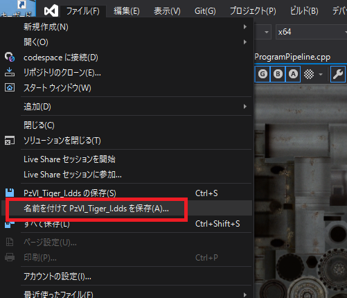

[OpenGL 3D 2021 第08回]

# 戦車の動かしかた

## 習得目標

* 普通のポインタを止めて、常にスマートポインタを使う
* キー入力によってキャラクターを動かす方法
* 描画に使うオブジェクトの管理

## 1. 削除の自動化

### 1.1 テクスチャの削除を自動化する

OpenGLのオブジェクトは、使い終わったら削除しなくてはなりません。しかし、プログラムがどんどん変わっていくような状況で、オブジェクトを削除するべきタイミングを手動で管理することは大変に難しい作業です。

そこでC++では、クラスのデストラクタで削除を行うことで、削除タイミングの管理を自動化します。既に`VBO`、`IBO`、`VAO`は、`PrimitiveBuffer`クラスが自動的に削除するようになっています。

ただ、テクスチャとサンプラはまだ自動的に削除するようになっていません。そこで、これらも削除を自動化しようと思います。

削除を自動化するために、テクスチャ・オブジェクトを管理するクラスを作ります。名前はストレートに`Texture`(テクスチャ)としましょう。テクスチャクラスは以下の機能を持ちます。

>1. 画像ファイル名からテクスチャを作成する。
>2. 作成の成功・失敗の確認。
>3. テクスチャを削除する。
>4. テクスチャをグラフィックスパイプラインにバインドする。
>5. グラフィックスパイプラインへのバインドを解除する。

1の「作成」はコンストラクタ、3の削除はデストラクタで行うのが適当でしょう。2, 4, 5はメンバ関数で行うことにします。

それでは、プロジェクトの`Src`フォルダに`Texture.h`というヘッダファイルを作成してください。そして、追加した`Texture.h`に次のプログラムを追加してください。

```diff
+/**
+* @file Texture.h
+*/
+#ifndef TEXTURE_H_INCLUDED
+#define TEXTURE_H_INCLUDED
+#include <glad/glad.h>
+#include "GLContext.h"
+#include <string>
+
+/**
+* テクスチャを管理するクラス.
+*/
+class Texture
+{
+public:
+  Texture(const char* filename); // コンストラクタ
+  ~Texture();                    // デストラクタ
+
+  // オブジェクトの有効性を判定する
+  bool IsValid() const;
+
+  // バインド管理
+  void Bind(GLuint unit) const;
+  void Unbind(GLuint unit) const;
+
+private:
+  std::string name; // 画像ファイル名
+  GLuint id = 0;    // オブジェクトID
+};
+
+#endif // TEXTURE_H_INCLUDED
```

### 1.2 コンストラクタを定義する

ソースファイルを追加し、メンバ関数を定義していきましょう。プロジェクトの`Src`フォルダに`Texture.cpp`というファイルを追加してください。追加したファイルを開き、次のプログラムを追加してください。

```diff
+/**
+* @file Texture.cpp
+*/
+#include "Texture.h"
+#include "GLContext.h"
+#include <iostream>
+
+/**
+* コンストラクタ.
+*
+* @param filename 画像ファイル名.
+*/
+Texture::Texture(const char* filename)
+{
+  id = GLContext::CreateImage2D(filename);
+  if (id) {
+    name = filename;
+    std::cout << "[情報]" << __func__ << "テクスチャ" << filename << "を作成.\n";
+  } else {
+    std::cout << "[エラー]" << __func__ << "テクスチャ" << filename << "の作成に失敗.\n";
+  }
+}
```

コンストラクタでは`CreateImage2D`関数を呼び出してテクスチャを作成します。次に作成結果に応じたデバッグ用のメッセージを出力します。

### 1.3 デストラクタを定義する

次にデストラクタを定義します。コンストラクタの定義の下に、次のプログラムを追加してください。

```diff
     std::cout << "[エラー]" << __func__ << "テクスチャ" << filename << "の作成に失敗.\n";
   }
 }
+
+/**
+* デストラクタ.
+*/
+Texture::~Texture()
+{
+  if (id) {
+    std::cout << "[情報]" << __func__ << "テクスチャ" << name << "を削除.\n";
+  }
+  glDeleteTextures(1, &id);
+}
```

### 1.4 <ruby>IsValid<rt>イズ・バリッド</rt></ruby>関数を定義する

`IsValid`(イズ・バリッド)は、`Texture`クラスが使用可能になっているかどうかを調べるメンバ関数です。デストラクタの定義の下に、次のプログラムを追加してください。

```diff
   }
   glDeleteTextures(1, &id);
 }
+
+/**
+* オブジェクトが使える状態かどうかを調べる.
+*
+* @retval true  使える.
+* @retval false 使えない(初期化に失敗している).
+*/
+bool Texture::IsValid() const
+{
+  return id;
+}
```

`ProgramPipeline`クラスの時にも説明しましたが、コンストラクタには戻り値がないため、初期化に成功したかどうかを判定できません。そこで判定用の関数を作り、コンストラクタの実行結果を調べられるようにしておきます。

コンストラクタで初期化に成功していれば、`id`(アイディー)変数には`0`以外の値が入っているはずです。`id`変数の値を`bool`型に変換して返せば、作成に成功したかどうかが分かります。

### 1.5 <ruby>Bind<rt>バインド</rt></ruby>関数を定義する

続いて、テクスチャ・オブジェクトを、グラフィックスパイプラインにバインドするメンバ関数を定義します。`IsValid`メンバ関数の定義の下に、次のプログラムを追加してください。

```diff
 {
   return id;
 }
+
+/**
+* テクスチャをグラフィックスパイプラインに割り当てる.
+*
+* @param unit 割り当てるテクスチャイメージユニットの番号.
+*/
+void Texture::Bind(GLuint unit) const
+{
+  glBindTextureUnit(unit, id);
+}
```

### 1.6 <ruby>Unbind<rt>アンバインド</rt></ruby>関数を定義する

最後に、バインドを解除するメンバ関数を定義します。`Bind`メンバ関数の定義の下に、次のプログラムを追加してください。

```diff
 {
   glBindTextureUnit(unit, id);
 }
+
+/**
+* テクスチャの割り当てを解除する.
+*
+* @param unit 割り当て解除するテクスチャイメージユニットの番号.
+*/
+void Texture::Unbind(GLuint unit) const
+{
+  glBindTextureUnit(unit, 0);
+}
```

これで`Texture`クラスの定義は完了です。

### 1.7 テクスチャ・オブジェクトをTextureクラスで置き換える

作成した`Texture`クラスで、`Main.cpp`のテクスチャ・オブジェクトを置き換えていきます。`Main.cpp`を開き、`ProgramPipeline.h`のインクルード文の下に、次のプログラムを追加してください。

```diff
 #include "Primitive.h"
 #include "ProgramPipeline.h"
+#include "Texture.h"
 #include <glm/gtc/matrix_transform.hpp>
 #include <GLFW/glfw3.h>
 #include <string>
```

>**【配列から作成しているテクスチャについて】**<br>
>まだTGAファイルにしていないテクスチャがある場合、全てTGAファイルから作成するようにプログラムを変更してから先へ進んでください。

次に、テクスチャ・オブジェクトを作成するプログラムを、次のように書き換えてください。

```diff
   // テクスチャを作成.
-  const GLuint texGround = GLContext::CreateImage2D("Res/Ground.tga");
-  const GLuint texTriangle = GLContext::CreateImage2D("Res/Triangle.tga");
-  const GLuint texGreen = GLContext::CreateImage2D("Res/Green.tga");
-  const GLuint texRoad = GLContext::CreateImage2D("Res/Road.tga");
-  const GLuint texTree = GLContext::CreateImage2D("Res/Tree.tga");
-  const GLuint texWarehouse = GLContext::CreateImage2D("Res/Warehouse.tga");
+  Texture texGround = Texture("Res/Ground.tga");
+  Texture texTriangle = Texture("Res/Triangle.tga");
+  Texture texGreen = Texture("Res/Green.tga");
+  Texture texRoad = Texture("Res/Road.tga");
+  Texture texTree = Texture("Res/Tree.tga");
+  Texture texWarehouse = Texture("Res/Warehouse.tga");
-  if (!texGround || !texTriangle || !texGreen || !texRoad || !texTree || !texWarehouse) {
-    return 1;
-  }

   // サンプラを作成.
   const GLuint sampler = GLContext::CreateSampler(GL_REPEAT);
```

作成に成功したかどうかの判定は削除することにしました。これまでは、テキストどおりに動くようにしたかったのでエラーチェックをしていたのですが、そろそろ無くしてもよい頃合いでしょう。

このエラーチェックを無くしても、コンソールウィンドウに出力されたメッセージを見ればエラーの有無は分かります。また、アプリのユーザーの視点に立った場合、テクスチャが表示されないことより、アプリが動作しないことのほうが問題だと考えられます。

### 1.8 テクスチャ・オブジェクトの後始末を消す

`Texture`クラスは、デストラクタが自動的にオブジェクトを削除しますので、手動の後始末を書く必要はありません。後始末プログラムを次のように書き換えてください。

```diff
   // 後始末.
   glDeleteSamplers(1, &sampler);
-  glDeleteTextures(1, &texWarehouse);
-  glDeleteTextures(1, &texTree);
-  glDeleteTextures(1, &texRoad);
-  glDeleteTextures(1, &texGreen);
-  glDeleteTextures(1, &texTriangle);
-  glDeleteTextures(1, &texGround);

   // GLFWの終了.
   glfwTerminate();
```

### 1.9 バインド方法を変更する

次に、`glBindTextureUnit`関数を、`Texture`クラスの`Bind`メンバ関数で置き換えます。テクスチャ・オブジェクトをバインドするプログラムを、以下のように書き換えてください。

```diff
     pipeline.SetUniform(locMatTRS, matMVP);
     pipeline.SetUniform(locMatModel, matModel);
 
-    glBindTextureUnit(0, texTriangle); // テクスチャを割り当てる.
+    texTriangle.Bind(0); // テクスチャを割り当てる.
     primitiveBuffer.Get(2).Draw();
     primitiveBuffer.Get(3).Draw();
```

続いて物体の表示データを修正します。`Texture`クラスのデストラクタが二重に起動することを防ぐため、変数のアドレス(または参照)を使います。これについては後で説明します。`ObjectData`構造体と`objectList`配列を次のように変更してください。

```diff
     // マップに配置する物体の表示データ.
     struct ObjectData {
       Primitive prim;
-      GLuint tex;
+      const Texture* tex;
     };

     // 描画する物体のリスト.
     const ObjectData objectList[] = {
       { Primitive(), 0 },    // なし
-      { primitiveBuffer.Get(4), texTree }, // 木
-      { primitiveBuffer.Get(5), texWarehouse }, // 建物
+      { primitiveBuffer.Get(4), &texTree }, // 木
+      { primitiveBuffer.Get(5), &texWarehouse }, // 建物
     };
```

`ObjectData`を使っているプログラムも修正します。テクスチャを割り当てるプログラムを次のように変更してください。

```diff
         pipeline.SetUniform(locMatTRS, matMVP);
         pipeline.SetUniform(locMatModel, matModel);

-        glBindTextureUnit(0, p.tex); // テクスチャを割り当てる.
+        p.tex->Bind(0); // テクスチャを割り当てる.
         p.prim.Draw();
       }
```

同様にして`mapTexList`配列も修正しましょう。`mapTexList`配列を次のように変更してください。

```diff
     // マップを(-20,-20)-(20,20)の範囲に描画.
-    const GLuint mapTexList[] = { texGreen, texGround, texRoad };
+    const Texture* mapTexList[] = { &texGreen, &texGround, &texRoad };
     for (int y = 0; y < 10; ++y) {
       for (int x = 0; x < 10; ++x) {
```

最後に`mapTexList`配列の要素をバインドするプログラムを、次のように変更してください。

```diff
         pipeline.SetUniform(locMatModel, matModel);
 
         const int textureNo = mapData[y][x];
-        glBindTextureUnit(0, mapTexList[textureNo]); // テクスチャを割り当てる.
+        mapTexList[textureNo]->Bind(0); // テクスチャを割り当てる.
         primitiveBuffer.Get(0).Draw();
       }
     }
```

これで、テクスチャ・オブジェクトを手動で管理する手間をなくせました。

<pre class="tnmai_assignment">
<strong>【課題01】</strong>
プロジェクトの<code>Src</code>フォルダに<code>Sampler.h</code>と<code>Sampler.cpp</code>というファイルを追加して、サンプラを管理する<code>Sampler</code>クラスを作成しなさい。
</pre>

<pre class="tnmai_assignment">
<strong>【課題02】</strong>
課題01で作成した<code>Sampler</code>クラスを使って、<code>main</code>関数にある<code>sampler</code>変数を置き換えなさい。
</pre>

>**【1章のまとめ】**<br>
>
>* クラスを使うと変数をまとめて管理することができる。
>* デストラクタでオブジェクトを削除すると、削除し忘れることを防げる。

<div style="page-break-after: always"></div>

## 2. スマートポインタによるオブジェクト管理

### 2.1 ポインタを使う理由

1章では、配置する物体や地面の模様を描画する時、`Texture`クラスの変数ではなく、変数のアドレスを使いました。もし変数をコピーしていたらどうなっていたでしょう。


<br><br><br><br>


`Texture`クラスの変数をコピーすると、テクスチャ・オブジェクトIDが格納されている`id`メンバ変数がコピーされます。そして、コピーした変数もデストラクタを実行します。

`texGreen`変数を`mapTexList[0]`に代入したとしましょう。C++言語の代入は「右辺の値を左辺にコピーする」という動作をします。また、OpenGLのオブジェクトは、オブジェクトを示す整数値で管理されます。

これらのことから、この時点で`texGreen`と`mapTexList[0]`の`id`メンバ変数には同じ整数値が代入された状態になります。

次に、「変数の有効期限は同じレベルの`}`まで」というC++のルールにより、`while`ループの終端で`mapTexList[0]`の有効期限が切れて削除されます。`mapTexList[0]`は`Texture`クラスの変数なので、`Texture`クラスのデストラクタが実行されます。

`Texture`クラスのデストラクタは、クラスが管理しているテクスチャ・オブジェクトを削除します。これによって`mapTexList[0]`が管理しているテクスチャ・オブジェクトが削除されます。

`texGreen`と`mapTexList[0]`の`id`メンバ変数の値は等しいので、`texGreen`の`id`メンバ変数はもうテクスチャを表しません。つまり、2回目以降の`while`ループではもはや`texGreen`はなんの役にも立たないのです。

それだけではありません。`main`関数が終了するときに`texGreen`のデストラクタが実行されるので、何も指していないIDを削除しようとしてエラーが発生します。このように、デストラクタと変数のコピーの組み合わせは、時にはやっかいな問題となることがあります。

実際に書いてもらったプログラムでは、この問題を避けるために「アドレス】を使っています。

「アドレス」は「変数の場所」を表現します。「場所」を表すという点では配列の「添え字」と同じです。しかし、添え字は「特定の配列の中の場所」を表すことしかできません。

それに対して、アドレスは「メモリ内のあらゆる場所」を表すことができます。アドレスは「メモリ全体を配列とする添え字」だと考えてもよいでしょう。そして、アドレスを代入するための変数は「ポインタ」あるいは「ポインタ変数」と呼ばれます。

>**【アドレスとポインタ】**<br>
>厳密には違うものなのですが、アドレスのことをポインタと言うことは結構多いです。ただ、ポインタのことをアドレスと呼ぶのはあまり聞きません。

ポインタを使う主な目的には、次のようなものがあります。

>* 同じ変数をプログラムの複数の場所で使いたい。
>* 関数の中で変数を書き換えたい。
>* メモリをコピーする量を減らしてプログラムの実行速度を上げたい。

### 2.2 スマートポインタ

ポインタの有用性はお分かり頂けたと思いますが、ポインタを使うことによって、次のような弊害もあります。

>1. ポインタの指している変数がいつまで有効なのか分からない。
>2. 通常の変数とポインタ変数で、メンバにアクセスするための演算子が違う。

特に1は多くのバグの原因となるため、非常にやっかいです。しかし、C++にはこの問題を解決するための「スマートポインタ」と呼ばれるクラス群が用意されています。

スマートポインタはデストラクタで自動的に`delete`を実行してくれるクラスの総称です。クラスですが、普通のポインタと同じ感覚で使えるように作られています。

現代のC++では、ほとんどの場合にスマートポインタが使われます。普通のポインタは危険なので極力避けます。今回は最も汎用的な機能を持つ`shared_ptr`(シェアード・ポインタ)クラスを使います。

シェアードポインタは自分のコピーがどれだけ作られたかを把握していて、まだコピーが残っているあいだは`delete`を実行しません。これによって、全てのシェアードポインタは有効な変数を指していることが保証されます。

シェアードポインタを含むスマートポインタクラスは、`memory`ヘッダに定義されています。 `Main.cpp`を開き、次のプログラムを追加してください。

```diff
 #include <GLFW/glfw3.h>
 #include <string>
 #include <iostream>
+#include <memory>
 #pragma comment(lib, "opengl32.lib")
```

### 2.3 Textureをシェアードポインタで置き換える

次に`Texutre`クラスの変数をシェアードポインタで置き換えます。シェアードポインタは次のように書くことで「管理する型」のポインタになります。

<pre class="tnmai_code"><strong>【書式】</strong>
std::shared_ptr<管理する型>
</pre>

今回は使いませんが、配列を管理する場合は、型名の直後に配列を表す`[]`を付けて以下のように書きます。

<pre class="tnmai_code"><strong>【書式】</strong>
std::shared_ptr<管理する型[]>
</pre>

それでは、シェアードポインタを使ってみましょう。`Main.cpp`を開き、テクスチャを作成するプログラムを次のように変更してください。

```diff
   // テクスチャを作成.
-  Texture texGround = Texture("Res/Ground.tga");
-  Texture texTriangle = Texture("Res/Triangle.tga");
-  Texture texGreen = Texture("Res/Green.tga");
-  Texture texRoad = Texture("Res/Road.tga");
-  Texture texTree = Texture("Res/Tree.tga");
-  Texture texWarehouse = Texture("Res/Warehouse.tga");
+  std::shared_ptr<Texture> texGround(new Texture("Res/Ground.tga"));
+  std::shared_ptr<Texture> texTriangle(new Texture("Res/Triangle.tga"));
+  std::shared_ptr<Texture> texGreen(new Texture("Res/Green.tga"));
+  std::shared_ptr<Texture> texRoad(new Texture("Res/Road.tga"));
+  std::shared_ptr<Texture> texTree(new Texture("Res/Tree.tga"));
+  std::shared_ptr<Texture> texWarehouse(new Texture("Res/Warehouse.tga"));

   // サンプラを作成.
   const GLuint sampler = GLContext::CreateSampler(GL_REPEAT);
```

次に、`Texture`クラスの`Bind`メンバ関数の呼び出しを`.`から`->`に変更します。テクスチャ・オブジェクトをバインドするプログラムを、以下のように書き換えてください。

```diff
     pipeline.SetUniform(locMatTRS, matMVP);
     pipeline.SetUniform(locMatModel, matModel);
 
-    texTriangle.Bind(0); // テクスチャを割り当てる.
+    texTriangle->Bind(0); // テクスチャを割り当てる.
     primitiveBuffer.Get(2).Draw();
     primitiveBuffer.Get(3).Draw();
```

続いて物体の表示データを修正します。`ObjectData`構造体と`objectList`配列を次のように変更してください。

```diff
     // マップに配置する物体の表示データ.
     struct ObjectData {
       Primitive prim;
-      const Texture* tex;
+      const std::shared_ptr<Texture> tex;
     };

     // 描画する物体のリスト.
     const ObjectData objectList[] = {
       { Primitive(), 0 },    // なし
-      { primitiveBuffer.Get(4), &texTree }, // 木
-      { primitiveBuffer.Get(5), &texWarehouse }, // 建物
+      { primitiveBuffer.Get(4), texTree }, // 木
+      { primitiveBuffer.Get(5), texWarehouse }, // 建物
     };
```

`texTree`、`texWarehouse`をポインタ変数にしたので、もう`&`でアドレスを求める必要はありません。

<pre class="tnmai_assignment">
<strong>【課題03】</strong>
<code>objectList</code>配列を参考にして、<code>mapTexList</code>配列をシェアードポインタを使うように修正しなさい。
</pre>

<pre class="tnmai_assignment">
<strong>【課題04】</strong>
<code>Sampler</code>クラスの変数を、スマートポインタで管理するようにプログラムを変更しなさい。
</pre>

>**【2章のまとめ】**<br>
>
>* 
>* 

<div style="page-break-after: always"></div>

## 3. 戦車を動かす

### 3.1 インターネットからOBJファイルを手に入れる

曲がりなりにもOBJファイルを読み込めるようになったので、無料のOBJファイルをダウンロードして読み込んでみましょう。ウェブブラウザで以下のサイトにアクセスしてください。

`https://free3d.com/ja/`

すると次のような画面が表示されます。

<p align="center">

</p>

画面中央上部にある検索ボックスに「戦車」と入力して`Enter`キーを押してください。すると戦車の検索結果が表示されます。

<p align="center">

</p>

わたしたちが読み込めるのはOBJファイル形式だけなので、ファイル形式の中から「obj」をクリックします。すると、OBJファイル形式でダウンロードできるデータだけが表示されます。

今回は左上の「タイガーI重戦車」をダウンロードします。「タイガーI重戦車」の画像をクリックしてください。するとデータの詳細が表示されます。

<p align="center">

</p>

この画面で「ダウンロード」ボタンをクリックすると、画面上部に次のような小さなウィンドウが開きます。

<p align="center">

</p>

ファイル名の下に、ファイルに含まれるデータ形式が表示されていますので、「obj」が含まれるファイルを選択します。このデータのファイルはひとつだけなので、選択の余地はありません。

なお、大抵のデータは圧縮されていますので、何らかのアプリで展開する必要があります。タイガーI戦車の場合はrar(ラー)形式で圧縮されています。ただ、Windowsの標準機能ではrar形式を展開できません。

既に7-ZipやWinRARなどのアプリをインストールしている場合は、それを使って展開してください。展開アプリをインストールした記憶がない場合は、以下のサイトから64ビット版の`7-zip`(セブン・ジップ)というアプリをダウンロードしてインストールしてください。

>`https://sevenzip.osdn.jp/`

### 3.2 画像ファイルをTGA形式に変換する

ダウンロードしたrarファイルを展開すると、以下のファイルが現れると思います。

>* Additional.txt
>* PzVI_Tiger_I_NM.dds
>* PzVI_Tiger_I_SM.dds
>* PzVI_Tiger_I_track.dds
>* PzVI_Tiger_I_track_NM.dds
>* PzVI_Tiger_I_track_SM.dds
>* PzVI_Tiger_I.dds
>* Tiger_I.3ds
>* Tiger_I.blend
>* Tiger_I.mtl
>* Tiger_I.obj

一番下の「Tiger_I.obj」がOBJファイルです。末尾が`dds`となっているのは画像ファイルです。しかし、現在のわたしたちはTGA形式の画像しか扱えません。そこで、Visual Studioを使ってDDS形式をTGA形式に変換します。

「PzVI_Tiger_I.dds」をエクスプローラーからVisual Studioの編集ウィンドウにドラッグ&ドロップするか、Visual Studioのメニューから「ファイル→開く→ファイル」を選択して開きます。

すると、プロパティウィンドウには次のように表示されていると思います(プロパティウィンドウが開いていない場合は画像ウィンドウ上部の「スパナアイコン」をクリック)。

<p align="center">

</p>

プロパティの「形式」欄は`DXGI_FORMAT_BC1_UNORM`になっていると思いますが、この形式からはTGAファイルに変換できません。DDSファイルをTGAファイルに変換するには、TGAファイルに変換可能な形式を選ぶ必要があります。TGAに変換可能な形式は以下の5つです。

>* 32bpp RGBA
>* 32bpp BGRA
>* 32bpp BGR
>* 16bpp BGRA 5551
>* 8bpp Gray

今回は「16bpp BGRA 5551」を選択してください。

プロパティを操作すると、画像ウィンドウのタブ選択が解除されてしまいます。選択が解除されているとメニューの操作対象にできないので、以下のようにタブをクリックして選択状態にしてください。この操作は忘れがちなので注意しましょう。

<p align="center">

</p>

タブを選択したら、ファイルメニューから「名前を付けてPzVI_Tiger_I.ddsを保存」を選択してください。

<p align="center">

</p>

すると「名前を付けてファイルを保存」ウィンドウが開きます。

<p align="center">

</p>

最初は「ファイルの種類」が「Direct Draw Surface(\*.dds)」になっています。この部分をクリックすると、選択可能な種類のリストが表示されますので「TGAファイル(\*.tga)」を選択してください。

ファイルの種類を変更したら「保存」ボタンをクリックします。すると次のようなウィンドウが表示されます。

<p align="center">

</p>

ここで「OK」をクリックすると、画像がTGAファイルとして保存されます。これでTGAへの変換は完了です。

>**【他の画像形式もTGAに変換できる】**<br>
>JPGやPNGファイルなども、DDSファイルと同様の方法でTGAに変換できます。JPG, PNGの場合は形式の選択は不要なので「名前を付けて～を保存」を選ぶだけで変換できます。

### 3.3 OBJファイルを表示する

OBJファイルとTGAファイルを手に入れたので表示してみましょう。とりあえず、`Tiger_I.obj`と`PzVI_Tiger_I.tga`をプロジェクトの`Res`フォルダにコピーしてください。

`Main.cpp`を開き、OBJファイルを読み込むプログラムに、次のプログラムを追加してください。

```diff
   primitiveBuffer.AddFromObjFile("Res/Cube.obj");
   primitiveBuffer.AddFromObjFile("Res/Tree.obj");
   primitiveBuffer.AddFromObjFile("Res/Warehouse.obj");
+  primitiveBuffer.AddFromObjFile("Res/Tiger_I.obj");

   // パイプライン・オブジェクトを作成する.
   ProgramPipeline pipeline("Res/VertexLighting.vert", "Res/Simple.frag");
```

次に、テクスチャを読み込むプログラムに、次のプログラムを追加してください。

```diff
   std::shared_ptr<Texture> texRoad(new Texture("Res/Road.tga"));
   std::shared_ptr<Texture> texTree(new Texture("Res/Tree.tga"));
   std::shared_ptr<Texture> texWarehouse(new Texture("Res/Warehouse.tga"));
+  std::shared_ptr<Texture> texTank(new Texture("Res/PzVI_Tiger_I.tga"));

   // サンプラを作成.
   std::shard_ptr<Sampler> sampler(new Sampler(GL_REPEAT));
```

続いて、三角形を描画するプログラムの下に、次のプログラムを追加してください。

```diff
     texTriangle->Bind(0); // テクスチャを割り当てる.
     primitiveBuffer.Get(2).Draw();
     primitiveBuffer.Get(3).Draw();
+
+    // 以下の6という数字は、戦車をprimitiveBufferに追加した順番と一致させること.
+    // この文章の意味が分からない場合は先生に質問してください.
+    // 分かる場合はこのコメントを書く必要はありません.
+    texTank->Bind(0);
+    primitiveBuffer.Get(6).Draw();

     // マップに配置する物体の表示データ.
     struct ObjectData {
```

プログラムが書けたらビルドして実行してください。画面に戦車が表示されていたら成功です。

<p align="center">

</p>

<pre class="tnmai_assignment">
<strong>【課題05】</strong>
タイガーI重戦車の作者のページから、「T-34」戦車のOBJファイルをダウンロードして<code>Res</code>フォルダにコピーし、画面に表示しなさい。作者のページを開くには、モデルのページに表示されている「作者名」をクリックします。
<p align="center"></p></pre>

### 3.4 戦車の表示位置をずらす

物体が重なっていると見づらいので戦車の表示位置をずらしましょう。戦車を表示するプログラムに、次のプログラムを追加してください。

```diff
     primitiveBuffer.Get(2).Draw();
     primitiveBuffer.Get(3).Draw();

+    // 戦車を表示
+    {
+      const glm::mat4 matModel =
+        glm::translate(glm::mat4(1), glm::vec3(0, 0, 5));
+      const glm::mat4 matMVP = matProj * matView * matModel;
+      pipeline.SetUniform(locMatTRS, matMVP);
+      pipeline.SetUniform(locMatModel, matModel);
+
       texTank->Bind(0);
       primitiveBuffer.Get(6).Draw();
+    }

     // T-34を表示(8回課題05)
     texTankT34->Bind(0);
     primitiveBuffer.Get(7).Draw();

     // マップに配置する物体の表示データ.
     struct ObjectData {
```

追加したプログラムは、平行移動行列を作成する`translate`(トランスレート)関数を使って、戦車の位置を5m下に動かしています。

<pre class="tnmai_code"><strong>【書式】</strong><code>
座標変換行列 glm::translate(元になる座標変換行列, 平行移動させる距離);
</code></pre>

`translate`関数は、以下の計算を行った結果を返します。

>返される座標変換行列 = 元になる座標変換行列 * 作成した平行移動行列

この計算が意味するところは、

>`translate`は、「元になる座標変換行列」に平行移動成分を付与する関数

だということです。このことから、平行移動行列を作るには「元になる座標変換行列」に単位行列`glm::mat4(1)`を指定すればよいことが分かります。単位行列は「何もしない行列」なので、

>単位行列(=何もしない行列) * 平行移動行列 → 平行移動行列

となるからです。プログラムが書けたらビルドして実行してください。戦車が下に移動していたら成功です。

<p align="center">

</p>

このように、<ruby>`translate`<rt>トランスレート</rt></ruby>関数を使うと、物体の表示位置を操作することができます。

<pre class="tnmai_assignment">
<strong>【課題06】</strong>
課題05で表示したT-34戦車の表示位置を、5メートル左に移動させなさい。
</pre>

### 3.5 キー操作による移動

`translate`関数の「平行移動させる距離」に変数を指定すると、変数の値を変化させることで継続的な移動を表現することができます。そして、「キーが押されたときだけ変数の値を変化させる」とすることで、戦車をキーボードで操作できるようになります。

まずは「戦車の位置」を表す変数を作成します。変数名は`posTank`(ポス・タンク)とします。 `Main.cpp`を開き、メインループの手前に次のプログラムを追加してください。

```diff
   // サンプラを作成.
   std::shared_ptr<Sampler> sampler(new Sampler(GL_REPEAT));
+
+  glm::vec3 posTank(0, 0, 0); // 戦車の位置

   // メインループ.
   while (!glfwWindowShouldClose(window)) {
     glEnable(GL_DEPTH_TEST); // 深度バッファを有効にする.
```

キーの状態を調べるには`glfwGetKey`(ジーエルエフダブリュー・ゲット・キー)関数を使います。

<pre class="tnmai_code"><strong>【書式】</strong><code>
キーの状態 glfwGetKey(ウィンドウ変数, 調べるキーの定数);
</code></pre>

「キーの定数」は、GLFWライブラリが定義している定数を指定します。これはキー名に`GLFW_KEY_`を付けた名前として定義されています。例えば`A`キーの定数は `GLFW_KEY_A`です。`glfwGetKey`関数の戻り値は次の2種類です

| キーの状態     | 返される定数                                     |
|:---------------|:-------------------------------------------------|
| 押されている   | `GLFW_PRESS`(ジーエルエフダブリュー・プレス)     |
| 押されていない | `GLFW_RELEASE`(ジーエルエフダブリュー・リリース) |

それでは戦車を動かすプログラムを作成しましょう。メインループの先頭に、次のプログラムを追加してください。

```diff
   // メインループ.
   while (!glfwWindowShouldClose(window)) {
+    // 戦車を移動させる
+    if (glfwGetKey(window, GLFW_KEY_A) == GLFW_PRESS) {
+      posTank.x -= 0.01f;
+    } else if (glfwGetKey(window, GLFW_KEY_D) == GLFW_PRESS) {
+      posTank.x += 0.01f;
+    }
+
     glEnable(GL_DEPTH_TEST); // 深度バッファを有効にする.
     glEnable(GL_CULL_FACE);
```

>**【矢印キーやEnterキーなどの指定方法】**<br>
>下記を含む全てのキー定数は`glfw3.h`に書かれています。
>
>| キー     | 定数                   |
>|:--------:|:-----------------------|
>| 矢印(右) | GLFW_KEY_RIGHT         |
>| 矢印(左) | GLFW_KEY_LEFT          |
>| 矢印(下) | GLFW_KEY_DOWN          |
>| 矢印(上) | GLFW_KEY_UP            |
>| Enter    | GLFW_KEY_ENTER         |
>| 左Shift  | GLFW_KEY_LEFT_SHIFT    |
>| 右Ctrl   | GLFW_KEY_RIGHT_CONTROL |
>| スペース | GLFW_KEY_SPACE         |

次に戦車を表示するプログラムを、次のように変更してください。

```diff
     // 戦車を表示
     {
       const glm::mat4 matModel =
-        glm::translate(glm::mat4(1), glm::vec3(0, 0, 5));
+        glm::translate(glm::mat4(1), posTank);
       const glm::mat4 matMVP = matProj * matView * matModel;
       pipeline.SetUniform(locMatTRS, matMVP);
```

プログラムが書けたらビルドして実行してください。`A`キーと`D`キーで戦車が左右に移動したら成功です。

<pre class="tnmai_assignment">
<strong>【課題07】</strong>
戦車を左右に移動させるプログラムを参考に、戦車のZ座標を<code>W</code>キーで上に、<code>S</code>キーで下に移動させるプログラムを追加しなさい。
</pre>

### 3.6 ソリューション構成

閑話休題、ここでちょっと「ソリューション構成」についてお話させてください。ソリューション構成は、目的に応じたビルドを行うための設定です。Visual Studioでプロジェクトを作成すると、`Debug`(デバッグ)と`Release`(リリース)の2つの構成が自動的に作成されます。

`Debug`はアプリケーションの開発中に使われます。作成される実行ファイルにはさまざまなデバッグ情報が組み込まれており、効率的にデバッグすることができます。そのかわり実行速度はかなり遅いです。

`Release`はアプリケーションを提出用にビルドする時に使われます。作成される実行ファイルは`Debug`構成と比べてかなり高速に実行されます。しかし、デバッグ情報がないのでデバッグは(不可能ではないですが)難しいものとなります。

通常は`Debug`構成で開発し、販売用あるいは就職作品として提出するときは`Release`でビルドします。ただし、`Release`構成でしか起きないエラーがあるので、開発中も定期的に`Release`でビルドしてテストすることをオススメします。

お試しとして`Relase`構成でビルドをしてみましょう。ソリューション構成の変更は、Visual Studio上部に表示されている「`Debug`」という表示をクリックすることで行うことができます。

<p align="center">

</p>

`Debug`という文字をクリックすると、選択可能なソリューション構成のリストが表示されます(①)。リストにある`Release`をクリックすると構成が変更されます(②)。

ソリューション構成を`Release`に変更したら、ビルドして実行してください。戦車の移動速度が少し速くなっていると思います。

<pre class="tnmai_assignment">
<strong>【課題08】</strong>
ソリューション構成を<code>Debug</code>に戻しなさい。
</pre>

### 3.7 移動速度を安定させる

ソリューション構成によって移動速度が変換するのは、プログラムの実行速度が変わることで、1秒間に実行されるメインループの回数が変化するからです。

戦車はループ1回につき`0.01f`の速度で移動させているので、実行速度が遅いためループ回数が少なくなる`Debug`構成では、1秒間に移動できる距離が短くなるわけです。

また、どの構成の場合でも、最終的な実行速度はコンピューターの性能に依存します。作成した実行ファイルを性能の異なるPCにコピーして実行したとします。性能が異なるということは、自分のPCとはループ回数が違うということです。その結果、戦車の移動速度も自分のPCとは違ってきます。

このように、コンピューターの性能に依存したプログラムを書いてしまうと、アプリを入手した全員に同じ体験をしてもらうことができません。

同じ体験をしてもらうためには、コンピューターの性能が違っても移動速度が同じになるように、プログラムを書く必要があります。多くのゲームでは、経過時間を計測して、1/60秒に1回だけループが実行されるようにしています。

それでは1/60秒で動かす仕組みを作成しましょう。この仕組には3つの変数が登場します。

>* 前回の時刻
>* 現在の時刻
>* 時刻の差分

これらの変数を使ったループ制御の考え方は次のとおりです。

>1. 「前回の時刻」を現在の時刻で初期化する。
>2. 「現在の時刻」を調べる。
>3. 「現在の時刻」と「前回の時刻」の差を求め、「時刻の差分」に代入する。
>4. 「前回の時刻」を「現在の時刻」で上書きする。
>5. 「時刻の差分」が1/60秒未満なら2に戻る。
>6. 「時刻の差分」が1/60秒以上なら、1/60秒ごとに1回、ゲーム状態を更新する。
>7. ゲーム状態を描画する。
>8. 2に戻る。

6で「1/60秒ごとに1回ゲーム状態を更新する」としているのは、移動速度が遅くなるのを防ぐためです。もし「時刻の差分が1/60秒以上なら1回ゲーム状態を更新する」としてしまうと、「時刻の差分」が2/60秒や3/60秒の場合、1/60秒を基準とした移動速度は、実際には1/2や1/3の速度になってしまいます。

それでは変数の定義から書いていきましょう。変数名は、「前回の時刻」は`loopTime`(ループタイム)、「時刻の差分」は`diffLoopTime`(ディフ・ループタイム)とします。`diff`(ディフ)は`difference`(ディファレンス、「差」という意味)の短縮形です。

メインループの手前に次のプログラムを追加してください。

```diff
   glm::vec3 posTank(0, 0, 0); // 戦車の位置

   // メインループ.
+  double loopTime = glfwGetTime(); // 1/60秒間隔でループ処理するための時刻変数
+  double diffLoopTime = 0;         // 時刻の差分
   while (!glfwWindowShouldClose(window)) {
     // 戦車を移動させる
     if (glfwGetKey(window, GLFW_KEY_A) == GLFW_PRESS) {
```

時刻を取得するには`glfwGetTime`(ジーエルエフダブリュー・ゲット・タイム)関数を使います。

次に時刻の差分を計算します。「現在の時刻」を表す変数名は`curLoopTime`(カー・ループタイム)とします。`cur`は`current`(カレント、「現在の」という意味)の短縮形です。メインループの先頭に次のプログラムを追加してください。

```diff
   double loopTime = glfwGetTime(); // 1/60秒間隔でループ処理するための時刻変数
   double diffLoopTime = 0;         // 時刻の差分
   while (!glfwWindowShouldClose(window)) {
+    // 現在時刻を取得
+    const double curLoopTime = glfwGetTime();
+    // 現在時刻と前回時刻の差を、時刻の差分に加算
+    diffLoopTime += curLoopTime - loopTime;
+    // 前回時刻を現在時刻に更新
+    loopTime = curLoopTime;
+    // 時刻の差分が1/60秒未満なら、ループの先頭に戻る
+    if (diffLoopTime < 1.0 / 60.0) {
+      continue;
+    }
+
     // 戦車を移動させる
     if (glfwGetKey(window, GLFW_KEY_A) == GLFW_PRESS) {
```

最後に、時刻の差分の1/60ごとにゲーム状態を更新するようにします。戦車を移動させるプログラムに、次のプログラムを追加してください。

```diff
     if (diffLoopTime < 1.0 / 60.0) {
       continue;
     }
+
+
+    //
+    // ゲーム状態を更新する
+    //
+
+    for (; diffLoopTime >= 1.0 / 60.0; diffLoopTime -= 1.0 / 60.0) {
       // 戦車を移動させる
       if (glfwGetKey(window, GLFW_KEY_A) == GLFW_PRESS) {
         posTank.x -= 0.01f;
       } else if (glfwGetKey(window, GLFW_KEY_D) == GLFW_PRESS) {
         posTank.x += 0.01f;
       }
       if (glfwGetKey(window, GLFW_KEY_W) == GLFW_PRESS) {
         posTank.z -= 0.01f;
       } else if (glfwGetKey(window, GLFW_KEY_S) == GLFW_PRESS) {
         posTank.z += 0.01f;
       }
+    }
+
+    //
+    // ゲーム状態を描画する
+    //
+
     glEnable(GL_DEPTH_TEST); // 深度バッファを有効にする.
     glEnable(GL_CULL_FACE);
```

プログラムが書けたらビルドして実行してください。`Debug`構成と`Release`構成の両方で実行して、どちらも同じ速度で移動するようになっていたら成功です。

<pre class="tnmai_assignment">
<strong>【課題09】</strong>
戦車の移動速度を「秒速4メートル」にしなさい(ヒント：秒速1メートルの場合、1/60秒では1/60メートル進みます)。
</pre>

### 3.8 戦車を回転させる

今度は戦車を旋回できるようにします。まず戦車の向きを表す変数`rotTank`(ロット・タンク)を追加します。`rot`は`rotate`(ローテート、「回転」という意味)の短縮形です。戦車の位置を表す変数の下に、次のプログラムを追加してください。

```diff
   std::shared_ptr<Sampler> sampler(new Sampler(GL_REPEAT));

   glm::vec3 posTank(0, 0, 0); // 戦車の位置
+  float rotTank = 0;          // 戦車の向き

   // メインループ.
   double loopTime = glfwGetTime(); // 1/60秒間隔でループ処理するための時刻
```

次に、戦車を移動させるプログラムを次のように変更してください。

```diff
     for (; diffLoopTime >= 1.0 / 60.0; diffLoopTime -= 1.0 / 60.0) {
       // 戦車を移動させる
       if (glfwGetKey(window, GLFW_KEY_A) == GLFW_PRESS) {
-        posTank.x -= 4.0f / 60.0f;
+        rotTank += glm::radians(90.0f) / 60.0f;
       } else if (glfwGetKey(window, GLFW_KEY_D) == GLFW_PRESS) {
-        posTank.x += 4.0f / 60.0f;
+        rotTank -= glm::radians(90.0f) / 60.0f;
       }
       if (glfwGetKey(window, GLFW_KEY_W) == GLFW_PRESS) {
```

このプログラムでは、1秒間に90°の速度で旋回するようにしています。

戦車の向きを描画に反映させましょう。戦車を表示するプログラムを次のように変更してください。

```diff
     // 戦車を表示
     {
       const glm::mat4 matModel =
-        glm::translate(glm::mat4(1), posTank);
+        glm::translate(glm::mat4(1), posTank) *
+        glm::rotate(glm::mat4(1), rotTank, glm::vec3(0, 1, 0));
       const glm::mat4 matMVP = matProj * matView * matModel;
       pipeline.SetUniform(locMatTRS, matMVP);
```

`rotate`(ローテート)関数は、座標変換行列に回転成分を追加する関数です。

<pre class="tnmai_code"><strong>【書式】</strong><code>
座標変換行列 glm::rotate(元になる座標変換行列, 回転角度, 回転軸);
</code></pre>

この関数は、「回転軸(かいてんじく」のまわりを「回転角度」だけ回転させる座標変換行列を作ることができます。回転角度はラジアンで指定します。回転軸は向きベクトルで指定します。例えばY軸まわりに回転させる場合、回転軸には`(0,1,0)`を指定します。

プログラムが書けたらビルドして実行してください。`A`と`D`キーを押したときに戦車が旋回したら成功です。

### 3.9 向いている方向に進ませる

`W`と`S`キーを押すと、戦車は向きとは関係なく上下に移動します。しかし、戦車とは向いている方向にしか進めないものです。そこで、向いている方向に移動するように変更しましょう。

回転していない戦車は画面下を向いています。下は+Z方向なので、このときの戦車の向きをベクトルで表すと`(0, 0, 1)`になります。戦車が旋回すると、この向きベクトルが「戦車の向き」だけ回転します。ベクトルを回転させるには回転行列を使います。回転行列は`rotate`(ローテート)関数で作成できるのでしたね。

これらを踏まえて、`rotate`関数を使って戦車の向きベクトルを計算しましょう。戦車を移動させるプログラムに、次のプログラムを追加してください。

```diff
       } else if (glfwGetKey(window, GLFW_KEY_D) == GLFW_PRESS) {
         rotTank -= glm::radians(90.0f) / 60.0f;
       }
+
+      // rotTankが0のときの戦車の向きベクトル
+      glm::vec3 tankFront(0, 0, 1);
+      // rotTankラジアンだけ回転させる回転行列を作る
+      const glm::mat4 matRot = glm::rotate(glm::mat4(1), rotTank, glm::vec3(0, 1, 0));
+      // 向きベクトルをrotTankだけ回転させる
+      tankFront = matRot * glm::vec4(tankFront, 1);
+
       if (glfwGetKey(window, GLFW_KEY_W) == GLFW_PRESS) {
         posTank += front * 4.0f / 60.0f;
```

次に、`tankFront`方向に前進・後退するようにします。戦車を上下に移動させるプログラムを、次のように変更してください。

```diff
       // 向きベクトルをrotTankだけ回転させる
       tankFront = matRot * glm::vec4(tankFront, 1);

       if (glfwGetKey(window, GLFW_KEY_W) == GLFW_PRESS) {
-        posTank.z -= 4.0f / 60.0f;
+        posTank += tankFront * 4.0f / 60.0f;
       } else if (glfwGetKey(window, GLFW_KEY_S) == GLFW_PRESS) {
-        posTank.z += 4.0f / 60.0f;
+        posTank -= tankFront * 4.0f / 60.0f;
       }
     }
```

プログラムが書けたらビルドして実行してください。`A`、`D`キーで戦車を旋回させたあと、`W`、`S`キーで戦車の向いている方向に前進・後退できたら成功です。

>**【3章のまとめ】**<br>
>
>* 
>* 

<div style="page-break-after: always"></div>

## 4. OBJファイルの問題に対処する

### 4.1 裏面を表示する

戦車を動かしながら、砲身の部分を観察してください。表示が少しおかしいと思いませんか？　実はこの戦車モデル、一部のパーツが裏向きに作られてしまっています。

しかし、このようなことは、フリーのOBJファイルにはよくあることです。プリミティブの表と裏は、リアルタイムで動作するアプリでは重要ですが、MAYAやBlenderなどの3Dモデル作成ツールでは、描画速度が少しくらい遅くてもあまり困りません。

そのため、3Dモデル作成ツールでは製作時の自由度を優先して、表でも裏でも問題なく表示されるように設計されています。おかげで、フリーの3Dモデルは表裏の設定が適当だったりするわけです。

とはいえ、表示がおかしいまま放っておくわけにもいきません。今回は、多少の速度低下には目をつぶって、表でも裏でも表示されるようにしていきます。裏面プリミティブを表示するには`GL_CULL_FACE`を無効にするだけです。

<pre class="tnmai_assignment">
<strong>【課題10】</strong>
<code>GL_CULL_FACE</code>を無効にしなさい。
</pre>

`GL_CULL_FACE`を無効にすると、次のように砲身と車輪が真っ黒になってしまうと思います。

<p align="center">
<br>
[砲身と車輪が黒い]
</p>

### 4.2 裏面の法線を逆向きにする

真っ黒になってしまう理由は、法線が表方向を向いているからです。コンピューターグラフィックスでは、ポリゴンが表を向けていようと裏を向けていようと、表側から見たときの明るさを使って表示されます。そのため、表裏が反転しているモデルは黒く表示されてしまいます。

<br><br><br><br>


この問題を解決するには、

>面が裏向きの場合、法線の向きを逆にしてから明るさを計算する

という方法を使います。面の表裏は`gl_FrontFacing`(ジーエル・フロント・フェイシング)という変数で調べることができます。`true`のときは表向き、`false`のときは裏向きです。法線を逆にするには`-1`を掛けます。

しかし、ひとつだけ問題があります。`gl_FrontFacing`はフラグメントシェーダー専用の変数なので、頂点シェーダでは使えないのです。そこで、明るさの計算をフラグメントシェーダーで行う新しいシェーダープログラムを作成することにします。

まず`Res`フォルダに`FragmentLightting.vert`(フラグメント・ライティング・バート)というファイルを追加し、`Simple.vert`の内容を全部コピーして貼り付けてください。

今回作成するシェーダーでは、明るさの計算をフラグメントシェーダーで行います。そのため、頂点シェーダーには明るさの計算は書きませんが、法線の計算だけは頂点シェーダーで済ませます。それでは、コピーしたプログラムに次のプログラムを追加してください。

```diff
 layout(location=1) in vec4 vColor;
 layout(location=2) in vec2 vTexcoord;
+layout(location=3) in vec3 vNormal;

 // 出力変数
 layout(location=0) out vec4 outColor;
 layout(location=1) out vec2 outTexcoord;
+layout(location=2) out vec3 outNormal;
 out gl_PerVertex {
   vec4 gl_Position;
 };

 // ユニフォーム変数
 layout(location=0) uniform mat4 matTRS;
+layout(location=1) uniform mat4 matModel;

 // 頂点シェーダープログラム
 void main() {
+  // 回転行列を取り出す.
+  mat3 matNormal = transpose(inverse(mat3(matModel)));
+
+  // ワールド座標系の法線を計算.
+  outNormal = normalize(matNormal * vNormal);
+
   outColor = vColor;
   outTexcoord = vTexcoord;
```

>**【頂点シェーダーにできることにフラグメントシェーダーを使わない】**<br>
>フラグメントシェーダーでも法線の計算をすることはできますが、頂点シェーダーでもできることは頂点シェーダーで行うべきです。その理由は、頂点シェーダーとフラグメントシェーダーでは、頂点シェーダのほうがはるかに実行回数が少ないからです。実行回数が少なければ計算回数も少なくなりますから、GPUに他の処理をさせる余裕ができます。GPUに余裕があれば、よりキレイなグラフィックスを表示したり、解像度を上げることができます。

### 4.3 裏面の法線を逆向きにする

次に、`Res`フォルダに`FragmentLighting.frag`(フラグメント・ライティング・フラグ)というファイルを追加し、`Simpler.frag`の内容を全部コピーして貼り付けてください。そして、次のように法線を受け取る`in`変数を追加してください。

```diff
 // 入力変数
 layout(location=0) in vec4 inColor;
 layout(location=1) in vec2 inTexcoord;
+layout(location=2) in vec3 inNormal;

 // 出力変数
 out vec4 fragColor;
```

それでは本命のライティング用データを追加しましょう。`VertexLighting.vert`から平行光源と環境光のパラメータをコピーして、`FragmentLighting.frag`に貼り付けてください。

```diff
 // ユニフォーム変数
 layout(binding=0) uniform sampler2D texColor;
+
+// 平行光源
+struct DirectionalLight {
+  vec3 direction; // ライトの向き
+  vec3 color;     // ライトの色(明るさ)
+};
+DirectionalLight light = {
+  { 0.65,-0.63,-0.43},
+  { 1.81, 1.16, 0.32},
+};
+
+// 環境光の色(明るさ)
+vec3 ambientLight = { 0.15, 0.10, 0.20 };

 // フラグメントシェーダープログラム
 void main() {
```

コピーしたライトデータを使って明るさを計算しましょう。`FragmentLighting.frag`に次のプログラムを追加してください。

```diff
 // フラグメントシェーダープログラム
 void main() {
   vec4 tc = texture(texColor, inTexcoord);
   fragColor = inColor * tc;
+
+  // 線形補間によって長さが1ではなくなっているので、正規化して長さを1に復元する.
+  vec3 worldNormal = normalize(inNormal);
+
+  // 面が裏向きの場合、法線の向きを逆にする.
+  if (gl_FrontFacing == false) {
+    worldNormal *= -1;
+  }
+
+  // 環境光を設定.
+  vec3 lightColor = ambientLight;
+
+  // ランバート反射による明るさを計算.
+  float cosTheta = max(dot(worldNormal, -light.direction), 0);
+  lightColor += light.color * cosTheta;
+
+  fragColor.rgb *= lightColor;
 }
```

### 4.4 normalize(inNormal)という処理が必要な理由

頂点シェーダーから受け取った「法線データ`inNormal`」は、ある理由からそのままでは使えません。そこで、`normalize`関数を使って単位ベクトル(長さが1のベクトル)に変換しなおします。

頂点シェーダーで正規化しているのに、なぜまた正規化しなおすのかというと、ポリゴン内の各ピクセルの法線は、各色データと同様に、頂点の法線を頂点からの距離の比率によって混合したものになるからです。

「距離の比率によって混合する方法」を「線形補間(せんけいほかん)」といいます。線形補間は、色や座標データにはちょうどよくても、法線のような向きベクトルではうまく働きません。以下は色が線形補間される場合の図ですが、同じことが法線でも行われます。

<p align="center">

</p>

上記の数値を、法線を表す「向きベクトル」だと考えてください。左側の頂点の向きベクトルは、`(1, 0, 0)`なので、その長さは

`√(1*1 + 0*0 + 0*0) = 1.0`

です。同様に右側と下側の頂点も、長さは`1.0`になっています。

さて、左右の頂点の中間はGPUが自動的に計算します。上の図では`(0.5, 0.5, 0.0)`となっていますが、このベクトルの長さは

`√(0.5*0.5 + 0.5*0.5 + 0*0) = 0.707106...`

です。なんと、長さが`1.0`ではなくなってしまいました。このように、線形補間は向きベクトルを正しく扱うことができません。しかし、逆にいうと長さが変わってしまうだけのことで、向いている方向は間違っていません。

方向が正しいのなら、正規化して長さを`1.0`に戻せばこの問題は解決します。これが、上記のプログラムで法線`inNormal`を`normalize`関数で正規化している理由です。

### 4.5 面が裏向きの場合に法線を逆向きにする

最後に、法線の向きを逆にするプログラムを追加しましょう。表裏の判定にはGLSLが自動的に定義する`gl_FrontFacing`変数を使います。法線を正規化するプログラムの下に、次のプログラムを追加してください。

```diff
   // 線形補間によって長さが1ではなくなっているので、正規化して長さを1に復元する.
   vec3 worldNormal = normalize(inNormal);
+
+  // 面が裏向きの場合、法線の向きを逆にする.
+  if (gl_FrontFacing == false) {
+    worldNormal = -worldNormal;
+  }

   // 環境光を設定.
   vec3 lightColor = ambientLight;
```

ベクトルの符号を反転させると、向きベクトルを逆向きにすることができます。それでは完成したシェーダーを使ってみましょう。`Main.cpp`を開き、プログラムパイプラインを作成するプログラムを、次のように変更してください。

```diff
   // パイプライン・オブジェクトを作成する.
-  ProgramPipeline pipeline("Res/VertexLighting.vert", "Res/Simple.frag");
+  ProgramPipeline pipeline("Res/FragmentLighting.vert", "Res/FragmentLighting.frag");
   if (!pipeline.IsValid()) {
     return 1;
   }
```

プログラムが書けたらビルドして実行してください。砲身と車輪の部分にテクスチャが表示されていたら成功です。

<p align="center">

</p>

### 4.6 建物をダウンロードする

次は何か建物のOBJファイルを表示しましょう。今度は`TurboSquid`(ターボスクイッド)というサイトを使います。ウェブブラウザのアドレスバーに以下のURLを入力してサイトを開いてください。

>`www.turbosquid.com`

すると以下のようなサイトが表示されます。

<p align="center">

</p>

ターボスクイッドを利用するにはユーザー登録が必要です。右上にある「LOGIN/JOIN」という文字をクリックして、登録画面を開いてください。

<p align="center">

</p>

この画面では数字を振った場所に必要事項を入力します。

>① Eメールアドレス
>② ログインに使うパスワード
>③ ②のパスワードをもう一度入力
>④ チェックを外す(お知らせメールを受け取るかどうかの設定)

①～④を入力したら、⑤の「CREATE MY ACCOUNT」(クリエイト・マイアカウント)ボタンをクリックしてください。しばらく待つと、①に入力したEメールアドレスに次のような「確認メール」が着信します。

<p align="center">

</p>

メール本文のURLをクリックすると、確認完了ページに移動します。これでアカウント登録は完了です。

それでは、再びターボスクイッドのトップページを表示してください。そして、中央の検索テキストボックスに`house`と入力してEnterキーを押してください。

<p align="center">

</p>

すると、家に関連するモデルがずらりと表示されます。表示されているモデルはほとんど有料です。まず無料モデルを絞り込みましょう。右上の方にある「price」(プライス)という文字をクリックすると、金額で絞り込むことができます。

<p align="center">

</p>

「Free」をクリックすると、無料モデルと比較的安価なモデルが半々に表示されるようになります。「FREE」と書かれたオレンジのタグが付いているのが無料モデルです。

続いてファイル形式で絞り込みます。「Formats」(フォーマッツ)をクリックするとファイル形式で絞り込むことができます。

<p align="center">

</p>

これで、無料のOBJファイルを探しやすくなりました。さっそく今回使うOBJファイルをダウンロードしましょう。ページを一番下までスクロールさせると「Next Page >」という文字があります。この文字を何回かクリックして4ページ目を表示してください。

4ページ目のちょうど中央あたりに、以下のような灰色のモデルがあると思います。このモデルの画像をクリックしてください。

<p align="center">

</p>

すると、次のようにモデルの説明ページが表示されます。モデルをダウンロードするために、右側にある「Download」ボタンをクリックしてください。

<p align="center">

</p>

そうするとダウンロード管理ページに移動します。この画面では、モデル画像の横にダウンロードできるファイルの一覧が表示されます。ファイル名の横にはファイル形式が表示されます。

<p align="center">

</p>

ここにOBJ形式のファイルが置いてある場合は、そのファイル名をクリックすればダウンロードできます。しかし、このモデルのOBJファイルは「show all」の中に隠されています。「show all」という文字をクリックすると、次のように全てのファイルが表示されます。

<p align="center">

</p>

このモデルの場合、OBJファイルとテクスチャは圧縮されておらず、個別のファイルに分けられているようです。OBJファイル(①)とテクスチャ(②)の2つのファイルをダウンロードして、プロジェクトの`Res`フォルダにコピーしてください。

<pre class="tnmai_assignment">
<strong>【課題11】</strong>
ダウンロードしたテクスチャをTGAファイルに変換し、テクスチャとして読み込みなさい。テクスチャ変数名は<code>texBrickHouse</code>(テックス・ブリックハウス)としなさい。
</pre>

<pre class="tnmai_assignment">
<strong>【課題12】</strong>
T-34戦車を表示するプログラムの下に、ダウンロードした<code>HouseRender.obj</code>を表示するプログラムを追加しなさい。表示する座標は<code>(-8, 2, 0)</code>としなさい。
</pre>

課題12の結果は、以下の画像のようになると思います。

<p align="center">

</p>

### 4.7 多角形ポリゴンに対応する

こんなに穴だらけになる理由は、OBJファイルの中身を調べると分かります。`HouseRender.obj`の297行目付近は次のようになっています。

>```txt
>294 | vt 0.318789 0.243862
>295 | usemtl Material.001
>296 | s 1
>297 | f 1/1 2/1 3/1 4/1
>298 | f 5/1 6/1 7/1 8/1
>299 | f 9/1 10/1 11/1 12/1
>```

`f`構文に4つの頂点インデックスが指定されているのが見て取れます。OBJファイルの仕様では多角形を定義できるため、4つ以上の頂点インデックスを設定することができるのです。しかし、このデータのままでは、三角形しか表示できないOpenGLでは使えません。

そこで、多角形を三角形の集まりに変換するように、プログラムを修正することにします。

頂点インデックスの個数が分からない以上、読み込むデータの数を`6`や`9`などと決めてかかることはできません。そこで、`305/2`や`293/21`のような、ひと組のデータごと読み込むことにします。そして、頂点インデックスの記録用変数`f`の型を`std::vector`に変更し、データ数が分からなくても大丈夫なようにします。

それでは、`Primitive.cpp`を開き、`f`構文を解析するプログラムを次のように変更してください。

```diff
     } else if (type == "f") { // 面
-      Index f[3];
-      bool isSuccess = false; // true=解析成功 false=解析失敗
-      // 「頂点座標/テクスチャ座標」バージョンの解析
-      if (sscanf(p, " %d/%d %d/%d %d/%d",
-        &f[0].v, &f[0].vt,
-        &f[1].v, &f[1].vt,
-        &f[2].v, &f[2].vt) == 6) { // データは6個
-        isSuccess = true; // 解析成功
-      }
-      // 「頂点座標/テクスチャ座標/法線」バージョンの解析
-      else if(sscanf(p, " %d/%d/%d %d/%d/%d %d/%d/%d",
-        &f[0].v, &f[0].vt, &f[0].vn,
-        &f[1].v, &f[1].vt, &f[0].vn,
-        &f[2].v, &f[2].vt, &f[0].vn) == 9) { // データは9個
-        isSuccess = true; // 解析成功
-      }
+      std::vector<Index> f; // 面の頂点データの配列
+      for (size_t i = 0; ; ++i) {
+        int readBytes = 0;    // 読み込んだ文字数
+        Index tmp;
+        // 「頂点座標/テクスチャ座標/法線」バージョンの解析
+        if (sscanf(p, " %d/%d/%d %n", &tmp.v, &tmp.vt, &tmp.vn, &readBytes) == 3) {
+          f.push_back(tmp);
+          p += readBytes;
+        }
+        // 「頂点座標/テクスチャ座標」バージョンの解析
+        else if (sscanf(p, " %d/%d %n", &tmp.v, &tmp.vt, &readBytes) == 2) {
+          f.push_back(tmp);
+          p += readBytes;
+        } else {
+          break; // 読み込み完了
+        }
+      }

       if (isSuccess) {
         for (int i = 0; i < 3; ++i) {
```

ひと組ずつデータを読み込むためには、`sscanf`を実行するたびに、変数`p`が「次の頂点インデックスの位置」を指すように更新しなくてはなりません。「次の頂点インデックスの位置」を指すには、`p`に「読み込んだ文字数」を加算します。

`sscanf`関数の書式の一つである`%n`を使います。`%n`は、対応する引数に、直前までに読み込んだ文字数を代入する書式です。なお、`%n`は「読み込んだデータ数」には影響しません。

例えば上記のプログラムの「頂点座標/テクスチャ座標」バージョンでは、追加の引数が3つあるにも関わらず、読み込んだデータ数のチェックは`2`で行っています。`&readBytes`引数は`%n`用なので、読み込んだデータ数として計上されないからです。

続いて、読み込んだ多角形を、三角形の集まりに変換します。OBJファイルの多角形は`GL_TRIANGLE_FAN`プリミティブに相当します。つまり、`0,1,2`、`0,2,3`、`0,3,4`のように、三角形のひとつめの頂点を`0`番目の頂点インデックスに固定し、残りの2頂点は、三角形をひとつ作るごとに`1`ずつずらしていきます。

頂点インデックスを読み込んだあと、`objIndices`にデータを代入するプログラムを次のように変更してください。

```diff
           break; // 読み込み完了
         }
       }
 
-      if (isSuccess) {
-        for (int i = 0; i < 3; ++i) {
-          objIndices.push_back(f[i]);
-        }
-      }
+      if (f.size() >= 3) {
+        for (size_t i = 2; i < f.size(); ++i) {
+          objIndices.push_back(f[0]); // ひとつめは0番目で固定
+          objIndices.push_back(f[i - 1]);
+          objIndices.push_back(f[i]);
+        }
+      } else {
+        std::cerr << "[警告]" << __func__ << ":面データの読み取りに失敗.\n"
+          "  " << filename << "(" << lineNo << "行目): " << line << "\n";
+      }
     } else { // 未対応の書式
       std::cerr << "[警告]" << __func__ << ":未対応の形式です.\n" <<
```

これで多角形を表示できるようになります。プログラムが書けたらビルドして実行してください。次のように穴が消えていたら成功です。

<p align="center">

</p>

### 4.8 不要な面を削除する

真っ黒な部分はスクリーンショット用の背景パーツのようです。このように不要な部分がある場合、OBJファイルから該当する`f`構文を削除(またはコメント化)します。

MAYA, 3DS Max, Blenderなどで作成されたOBJファイルは、データがパーツごとに分けられていることが多いです。OBJファイルには、パーツを分けるための構文が4つあります。

| 構文               | 説明 |
|:-------------------|:-----|
| g グループ名       | 以降に定義するデータを「グループ名」のメンバーとする。               |
| o オブジェクト名   | 以降に定義するデータを「オブジェクト名」のメンバーとする。           |
| s 番号             | 以降に定義するデータを「スムージンググループ番号」のメンバーとする。 |
| mg 番号 距離       | 以降に定義するデータを「マージグループ番号」のメンバーとする。       |

多くのOBJファイルでは、`o`か`g`の構文を使ってデータを論理的なグループに分けています。ですから、`o`か`g`が見つかったら、そこがパーツの区切りだと考えられます。実際に`HouseRender.obj`を見てみると、以下の2つの`o`構文が見つかります。

>4 | o Plane

>553 | o Cube.001_Cube

オブジェクト名の`Plane`(プレーン)は「平面」、`Cube`(キューブ)は「立方体」という意味です。背景パーツは平面を曲げた形状、建物本体は直方体、つまり立方体を変形させた形状ですから、おそらく`Plane`のほうが背景パーツでしょう。

試しに4行ほどコメントにしてみましょう。`HouseRender.obj`の297行目付近を次のように変更してください。

```diff
 vt 0.318789 0.243862
 usemtl Material.001
 s 1
-f 1/1 2/1 3/1 4/1
-f 5/1 6/1 7/1 8/1
-f 9/1 10/1 11/1 12/1
-f 13/1 14/1 15/1 16/1
+# f 1/1 2/1 3/1 4/1
+# f 5/1 6/1 7/1 8/1
+# f 9/1 10/1 11/1 12/1
+# f 13/1 14/1 15/1 16/1
 f 17/1 18/1 19/1 20/1
 f 21/1 22/1 23/1 24/1
```

OBJファイルを変更したらプログラムを実行してください。黒い部分に穴が空いているのが分かると思います。どうやら「当たり」のようですね。

<p align="center">

</p>

<pre class="tnmai_assignment">
<strong>【課題13】</strong>
背景パーツを完全に排除するため、<code>HouseRender.obj</code>の297行目から552行目までをコメント化、または削除しなさい。
</pre>

### 4.9 表示するサイズを調整する

背景パーツを消してみたところ、どうも建物の表示が小さすぎるようです。とりあえず大きさを2倍にしてみましょう。物体の大きさを変更するには`scale`(スケール)関数を使います。`Main.cpp`を開き、建物を表示するモデル行列の計算プログラムを、次のように変更してください。

```diff
     // 建物を表示(8回課題12)
     {
       const glm::mat4 matModel =
-        glm::translate(glm::mat4(1), glm::vec3(-8, 2, 0));
+        glm::translate(glm::mat4(1), glm::vec3(-8, 2, 0)) *
+        glm::scale(glm::mat4(1), glm::vec3(2, 2, 2));
       const glm::mat4 matMVP = matProj * matView * matModel;
       pipeline.SetUniform(locMatTRS, matMVP);
       pipeline.SetUniform(locMatModel, matModel);
```

`scale`(スケール)関数は、座標変換行列に拡大縮小成分を追加する関数です。

<pre class="tnmai_code"><strong>【書式】</strong><code>
座標変換行列 glm::scale(元になる座標変換行列, 拡大縮小の倍率);
</code></pre>

プログラムを変更したらビルドして実行してください。次のように建物が中央に移動していたら成功です。

<p align="center">

</p>

拡大しただけなのに建物が移動したのは、OBJファイルのデータが原点に配置されていないからです。これを解決するには、拡大縮小のまえに「物体を原点に平行移動」します。

OBJファイルをVisual Studioの「グラフィックスデザイナー」で開いて調べたところ、建物から原点までの距離はおよそ`(-2.6, 2.0, 0.8)`でした。ということは、この距離を平行移動させる行列を追加すれば良さそうです。

OpenGLの行列の乗算では、右辺の変換が先に実行されます。建物を表示するプログラムを次のように変更してください。

```diff
     // 建物を表示(8回課題12)
     {
       const glm::mat4 matModel =
-        glm::translate(glm::mat4(1), glm::vec3(-8, 2, 0)) *
-        glm::scale(glm::mat4(1), glm::vec3(2, 2, 2));
+        glm::translate(glm::mat4(1), glm::vec3(-8, 0, 0)) *
+        glm::scale(glm::mat4(1), glm::vec3(2, 2, 2)) *
+        glm::translate(glm::mat4(1), glm::vec3(-2.6f, 2.0f, 0.8f));
       const glm::mat4 matMVP = matProj * matView * matModel;
       pipeline.SetUniform(locMatTRS, matMVP);
```

プログラムが書けたらビルドして実行してください。次のように建物が元に位置に表示されていたら成功です。

<p align="center">

</p>

<pre class="tnmai_assignment">
<strong>【課題14】</strong>
建物の拡大縮小率を<code>4</code>倍にしたうえで、他の物体と重ならない位置に移動させなさい。
</pre>

<pre class="tnmai_assignment">
<strong>【課題15】</strong>
TurboSquid、Free3D、またはその他のサイトから、別の建物のOBJファイルをダウンロードして画面に表示しなさい。
</pre>

>**【4章のまとめ】**<br>
>
>* 
>* 

<div style="page-break-after: always"></div>


