[OpenGL 3D 2021 第09回]

# アクターと衝突判定

## 習得目標

* 何度も使うプログラムのかたまりを関数にする手順
* アクターに機能を追加する手順
* 直方体の当たり判定を計算する方法

## 1. アクター構造体

### 1.1 描画に必要なプログラムを関数にする

毎回、物体を表示するときは、行列を計算して、GPUメモリにコピーして、テクスチャを割り当てて、最後に描画関数を実行する、というプログラムを書く必要があります。

このような決まりきったプログラムを毎回書くのは面倒なものです。そこで描画に必要なプログラムを切り出して「物体を描画する関数」にしてしまうと便利です。

それでは、描画を行う関数を作成しましょう。`Main.cpp`を開き、`DebugCallback`関数の定義の下に、次のプログラムを追加してください。

```diff
     std::cerr << s << "\n";
   }
 }
+
+/**
+* 物体を描画する.
+*/
+void Draw(
+  Primitive prim,                  // 描画するプリミティブ
+  std::shared_ptr<Texture> tex,    // 描画に使うテクスチャ
+  glm::vec3 position,              // 物体の位置
+  glm::vec3 scale,                 // 物体の拡大縮小率
+  float rotation,                  // 物体の回転角度
+  glm::vec3 adjustment,            // 物体を原点に移動するための距離
+  const ProgramPipeline& pipeline, // 描画に使うプログラムパイプライン
+  glm::mat4 matProj,               // 描画に使うプロジェクション行列
+  glm::mat4 matView)               // 描画に使うビュー行列
+{
+  // モデル行列を計算する
+  glm::mat4 matT = glm::translate(glm::mat4(1), position);
+  glm::mat4 matR = glm::rotate(glm::mat4(1), rotation, glm::vec3(0, 1, 0));
+  glm::mat4 matS = glm::scale(glm::mat4(1), scale);
+  glm::mat4 matA = glm::translate(glm::mat4(1), adjustment);
+  glm::mat4 matModel = matT * matR * matS * matA;
+
+  // MVP行列を計算する
+  glm::mat4 matMVP = matProj * matView * matModel;
+
+  // モデル行列とMVP行列をGPUメモリにコピーする
+  const GLint locMatTRS = 0;
+  const GLint locMatModel = 1;
+  pipeline.SetUniform(locMatTRS, matMVP);
+  pipeline.SetUniform(locMatModel, matModel);
+
+  tex->Bind(0); // テクスチャを割り当てる
+  prim.Draw();  // プリミティブを描画する
+}

/**
* エントリーポイント.
```

この関数を使って三角形と立方体の描画を書き直しましょう。三角形と立方体の描画を次のように変更してください。

```diff
     // ビュー行列を作成.
     const glm::mat4 matView =
       glm::lookAt(glm::vec3(0, 20, 20), glm::vec3(0, 0, 0), glm::vec3(0, 1, 0));

-    // 行列をシェーダに転送する 
-    const glm::mat4 matModel = glm::mat4(1);
-    const glm::mat4 matMVP = matProj * matView * matModel;
-    pipeline.SetUniform(locMatTRS, matMVP);
-    pipeline.SetUniform(locMatModel, matModel);
-
-    texTriangle->Bind(0); // テクスチャを割り当てる.
-    primitiveBuffer.Get(2).Draw();
-    primitiveBuffer.Get(3).Draw();
+    // 三角形を描画する
+    Draw(primitiveBuffer.Get(2), texTriangle,
+      glm::vec3(0), glm::vec3(1), 0.0f, glm::vec3(0),
+      pipeline, matProj, matView);
+
+    // 立方体を描画する
+    Draw(primitiveBuffer.Get(3), texTriangle,
+      glm::vec3(0), glm::vec3(1), 0.0f, glm::vec3(0),
+      pipeline, matProj, matView);

     // 戦車を表示
     {
```

このように、プログラムの一部を関数にすることで、引数を指定するだけで必要な処理が行われる、という形にすることができます。

プログラムが書けたらビルドして実行してください。これまでどおりに三角形と立方体が表示されていたら成功です。

>**【関数を使う利点について】**<br>
>
>* **何度でも利用できる(再利用性)**<br>
>一度関数を作成すると、プログラムのあらゆる場所から利用することができます。例えば`sin`や`cos`を計算する時、毎回計算プログラムを書かなければならないとしたら、プログラムはとても煩雑で理解しづらいものになってしまうでしょう。
>* **修正が簡単(保守性)**<br>
>`sin`の計算に間違いを見つけたとしましょう。もし毎回計算プログラムを書いていたら、そのすべての箇所を修正しなければなりません。`sin`関数を使っている場合、関数の中身を修正するだけで、すべての`sin`の計算が正しくなります。
>* **中身が分からなくてもいい(抽象化)**<br>
>`sin`関数や`cos`関数が内部でどんな計算をしているかを知る必要はありません。数学の`sin`と`cos`を計算する関数だということが分かっていれば使うことができます。
>* **問題の分割に使える(構造化)**<br>
>「ゲームを作る」のような大きな目的をゼロから考えて達成することは、誰にとっても難しいことです。そこで、「キャラを表示する」「キャラを動かす」といった小さな目的に分割します。小さな目的をゼロから作成するのは、大きな目的と比べてはるかに簡単です。<br>
>プログラム全体を「大きな目的」だとすると、関数は「小さな目的」に当たります。すべての関数を完成させたとき、プログラム全体が完成します。

### 1.2 構造体を使って引数を減らす

描画処理のようにある程度複雑なプログラムになると、引数の数がとても多くなってしまいます。関数化によって計算を書く手間がなくなったとはいえ、毎回これらの引数を書くのはちょっと面倒ですよね。そこで、描画に必要な引数を「構造体」としてまとめます。

1.1節で作成した`Draw`関数の引数は、基本的に「物体の描画に関するパラメータ」です。しかし、例えば「物体の位置」パラメータなどは、値を操作することで物体が移動する、という観点から見ると「物体を制御するパラメータ」とも考えられます。

そういうわけで、「物体を制御するパラメータ」を構造体にしていこうと思います。構造体にする目的を以下に示します。

物体を制御するパラメータをまとめた構造体やクラスは、「ゲームオブジェクト」や「アクター」、または「エンティティ」などと呼ばれています。どの名前でも本質的な違いはないので、大抵はプログラマの好みで名前が選ばれます。

本テキストでは「文字数が短い」という理由から「アクター」という名前を採用します。アクターは「<ruby>俳優<rt>はいゆう</rt></ruby>」や「<ruby>役者<rt>やくしゃ</rt></ruby>」という意味です。

また、アクターという名前を付けることで、プログラムを

>俳優(アクター)を、いつ、どこに配置し、どのように動かすかを指示するもの。

というように<ruby>捉<rt>とら</rt></ruby>えられるようになります。

`DebugCallback`関数の定義の下に、次のプログラムを追加してください。メンバ変数は`Draw`関数の引数`prim`(プリム)から`adjustment`(アジャストメント)をコピー＆ペーストして作成するとよいでしょう。

```diff
     std::cerr << s << "\n";
   }
 }
+
+/**
+* 物体を制御するパラメータ.
+*/
+struct Actor
+{
+  Primitive prim;                  // 描画するプリミティブ
+  std::shared_ptr<Texture> tex;    // 描画に使うテクスチャ
+  glm::vec3 position;              // 物体の位置
+  glm::vec3 scale;                 // 物体の拡大縮小率
+  float rotation;                  // 物体の回転角度
+  glm::vec3 adjustment;            // 物体を原点に移動するための距離
+};

 /**
 * 物体を描画する.
```

次に、構造体を使うように`Draw`関数を修正します。

```diff
 /**
 * 物体を描画する.
 */
 void Draw(
-  Primitive prim,                  // 描画するプリミティブ
-  std::shared_ptr<Texture> tex,    // 描画に使うテクスチャ
-  glm::vec3 position,              // 物体の位置
-  glm::vec3 scale,                 // 物体の拡大縮小率
-  float rotation,                  // 物体の回転角度
-  glm::vec3 adjustment,            // 物体を原点に移動するための距離
+  const Actor& actor,              // 物体の制御パラメータ.
   const ProgramPipeline& pipeline, // 描画に使うプログラムパイプライン
   glm::mat4 matProj,               // 描画に使うプロジェクション行列
   glm::mat4 matView)               // 描画に使うビュー行列
 {
   // モデル行列を計算する
-  glm::mat4 matT = glm::translate(glm::mat4(1), position);
-  glm::mat4 matR = glm::rotate(glm::mat4(1), rotation, glm::vec3(0, 1, 0));
-  glm::mat4 matS = glm::scale(glm::mat4(1), scale);
-  glm::mat4 matA = glm::translate(glm::mat4(1), adjustment);
+  glm::mat4 matT = glm::translate(glm::mat4(1), actor.position);
+  glm::mat4 matR = glm::rotate(glm::mat4(1), actor.rotation, glm::vec3(0, 1, 0));
+  glm::mat4 matS = glm::scale(glm::mat4(1), actor.scale);
+  glm::mat4 matA = glm::translate(glm::mat4(1), actor.adjustment);
   glm::mat4 matModel = matT * matR * matS * matA;

   // MVP行列を計算する
   glm::mat4 matMVP = matProj * matView * matModel;

   // モデル行列とMVP行列をGPUメモリにコピーする
   const GLint locMatTRS = 0;
   const GLint locMatModel = 1;
   pipeline.SetUniform(locMatTRS, matMVP);
   pipeline.SetUniform(locMatModel, matModel);

-  tex->Bind(0); // テクスチャを割り当てる
-  prim.Draw();  // プリミティブを描画する
+  actor.tex->Bind(0); // テクスチャを割り当てる
+  actor.prim.Draw();  // プリミティブを描画する
 }
```

最後に、`Draw`関数を呼び出しているプログラムを次のように変更してください。

```diff
     // ビュー行列を作成.
     const glm::mat4 matView =
       glm::lookAt(glm::vec3(0, 20, 20), glm::vec3(0, 0, 0), glm::vec3(0, 1, 0));

     // 三角形を描画する
-    Draw(primitiveBuffer.Get(2), texTriangle,
+    Actor triangle = { primitiveBuffer.Get(2), texTriangle,
       glm::vec3(0), glm::vec3(1), 0.0f, glm::vec3(0),
+    };
-      pipeline, matProj, matView);
+    Draw(triangle, pipeline, matProj, matView);

     // 立方体を描画する
-    Draw(primitiveBuffer.Get(3), texTriangle,
+    Actor cube = { primitiveBuffer.Get(3), texTriangle,
       glm::vec3(0), glm::vec3(1), 0.0f, glm::vec3(0),
+    };
-      pipeline, matProj, matView);
+    Draw(cube, pipeline, matProj, matView);

     // 戦車を表示
     {
```

プログラムが書けたらビルドして実行してください。`Actor`構造体を使う前と同じように三角形と立方体が表示されていたら成功です。

>**【構造体を使う利点について】**<br>
>
>* **何度でも利用できる(再利用性)**<br>
>いちど構造体を作成すると、プログラムのあらゆる場所から利用することができます。物体
>* **修正が簡単(保守性)**<br>
>複数の物体を扱うときは「配列」を使うと思います。このとき、構造体を使わずに「位置データの配列」「拡大縮小率の配列」「回転角度の配列」のように個別に作成したとしましょう。この場合、物体に新しいパラメータ(HPなど)を追加するには、新しい配列を追加する必要があります。構造体なら、メンバ変数を追加するだけ済みます。
>* **中身が分からなくてもいい(抽象化)**<br>
>実際に構造体を使う部分のプログラム以外は、構造体の詳細を知る必要はありません。例えば関数の引数に構造体を指定するとき、関数を呼び出す側では構造体のメンバを知らなくても問題ありません。
>* **問題の分割に使える(構造化)**<br>
>構造体は、変数をグループ分けするための手段のひとつです。適切にグループ分けすると、変数の用途を理解しやすくなります。

### 1.3 構造体をファイルに分離する

色々なプログラムを`Main.cpp`にばかり書いていると、プログラムが読みにくくなってしまいます。作成した`Actor`構造体と`Draw`関数を別のファイルに分けましょう。

プロジェクトの`Src`フォルダに`Actor.h`というファイルを追加してください。追加したファイルに次のプログラムを追加してください。

```diff
+/**
+* @file Actor.h
+*/
+#ifndef ACTOR_H_INCLUDED
+#define ACTOR_H_INCLUDED
+#include <glad/glad.h>
+#include "Primitive.h"
+#include "Texture.h"
+#include "ProgramPipeline.h"
+#include <glm/glm.hpp>
+
+
+#endif // ACTOR_H_INCLUDED
```

次に`Main.cpp`に`Actor.h`をインクルードしてください。

```diff
 #include "ProgramPipeline.h"
 #include "Texture.h"
 #include "Sampler.h"
+#include "Actor.h"
 #include <glm/gtc/matrix_transform.hpp>
 #include <GLFW/glfw3.h>
```

<pre class="tnmai_assignment">
<strong>【課題01】</strong>
<code>Main.cpp</code>の<code>Actor</code>構造体を切り取って、<code>Actor.h</code>に貼り付けなさい。
</pre>

### 1.4 Draw関数を別ファイルに分離する

`Actor`構造体の次は`Draw`関数を分離します。まずは`Draw`関数のプロトタイプ宣言を追加しましょう。`Main.cpp`の`Draw`関数の先頭部分をコピーして、`Actor.h`の`Actor`構造体の定義の下に貼り付けてください。

```diff
   float rotation;                  // 物体の回転角度
   glm::vec3 adjustment;            // 物体を原点に移動するための距離
 };
+
+void Draw(
+  const Actor& actor,              // 物体の制御パラメータ
+  const ProgramPipeline& pipeline, // 描画に使うプログラムパイプライン
+  glm::mat4 matProj,               // 描画に使うプロジェクション行列
+  glm::mat4 matView)               // 描画に使うビュー行列  

 #endif // ACTOR_H_INCLUDED
```

そして、`)`の後ろに`;`を付けてください。

```diff
   const ProgramPipeline& pipeline, // 描画に使うプログラムパイプライン
   glm::mat4 matProj,               // 描画に使うプロジェクション行列
-  glm::mat4 matView)               // 描画に使うビュー行列  
+  glm::mat4 matView);              // 描画に使うビュー行列  

 #endif // ACTOR_H_INCLUDED
```

これでプロトタイプ宣言を追加することができました。続いて関数の定義を分離します。分離先となるCPPファイルを作成しましょう。プロジェクトの`Src`フォルダに`Actor.cpp`というCPPファイルを追加してください。追加したファイルを開き、次のプログラムを追加してください。

```diff
+/**
+* @file Actor.cpp
+*/
+#include "Actor.h"
+#include <glm/gtc/matrix_transform.hpp>
+
```

<pre class="tnmai_assignment">
<strong>【課題02】</strong>
<code>Main.cpp</code>の<code>Draw</code>関数の定義を切り取って、<code>Actor.cpp</code>に貼り付けなさい。
</pre>

課題02ができたらビルドして実行してください。`Actor`構造体と`Draw`関数の分離前と同じように、三角形と立方体が表示されていたら成功です。

このように、構造体と関数を使うことで、使わない場合より理解しやすいプログラムを書くことができます。

### 1.5 戦車の描画をアクター構造体で置き換える

今度は戦車を`Actor`構造体を使うように書き換えていきます。まず「戦車の位置」と「戦車の向き」を`Actor`構造体で置き換えましょう。`posTank`と`rotTank`の定義を、次のように`Actor`構造体で置き換えてください。

```diff
   std::shared_ptr<Sampler> sampler(new Sampler(GL_REPEAT));

-  glm::vec3 posTank(0, 0, 0); // 戦車の位置
-  float rotTank = 0;          // 戦車の向き
+  // 戦車のパラメータ
+  Actor tank = { primitiveBuffer.Get(6), texTank,
+    glm::vec3(0), glm::vec3(1), 0.0f, glm::vec3(0) };

   // メインループ.
   double loopTime = glfwGetTime(); // 1/60秒間隔でループ処理するための時刻
```

次に、戦車を移動させるプログラムを次のように変更してください。

```diff
     for (; diffLoopTime >= 1.0 / 60.0; diffLoopTime -= 1.0 / 60.0) {
       // 戦車を移動させる
       if (glfwGetKey(window, GLFW_KEY_A) == GLFW_PRESS) {
-        rotTank += glm::radians(90.0f) / 60.0f;
+        tank.rotation += glm::radians(90.0f) / 60.0f;
       } else if (glfwGetKey(window, GLFW_KEY_D) == GLFW_PRESS) {
-        rotTank -= glm::radians(90.0f) / 60.0f;
+        tank.rotation -= glm::radians(90.0f) / 60.0f;
       }

-      // rotTankが0のときの戦車の向きベクトル
+      // tank.rotationが0のときの戦車の向きベクトル
       glm::vec3 tankFront(0, 0, 1);
-      // rotTankラジアンだけ回転させる回転行列を作る
-      const glm::mat4 matRot = glm::rotate(glm::mat4(1), rotTank, glm::vec3(0, 1, 0));
-      // 向きベクトルをrotTankだけ回転させる
+      // tank.rotationラジアンだけ回転させる回転行列を作る
+      const glm::mat4 matRot =
+        glm::rotate(glm::mat4(1), tank.rotation, glm::vec3(0, 1, 0));
+      // 向きベクトルをtank.rotationだけ回転させる
       tankFront = matRot * glm::vec4(tankFront, 1);

       if (glfwGetKey(window, GLFW_KEY_W) == GLFW_PRESS) {
-        posTank += tankFront * 4.0f / 60.0f;
+        tank.position += tankFront * 4.0f / 60.0f;
       } else if (glfwGetKey(window, GLFW_KEY_S) == GLFW_PRESS) {
-        posTank -= tankFront * 4.0f / 60.0f;
+        tank.position -= tankFront * 4.0f / 60.0f;
       }
     }
```

最後に戦車の描画を次のように変更してください。

```diff
     // 戦車を表示
+    Draw(tank, pipeline, matProj, matView);
-    {
-      const glm::mat4 matModel =
-        glm::translate(glm::mat4(1), posTank) *
-        glm::rotate(glm::mat4(1), rotTank, glm::vec3(0, 1, 0));
-      const glm::mat4 matMVP = matProj * matView * matModel;
-      pipeline.SetUniform(locMatTRS, matMVP);
-      pipeline.SetUniform(locMatModel, matModel);

-      texTank->Bind(0);
-      primitiveBuffer.Get(6).Draw();
-    }

     // T-34を表示(課題05)
     {
       const glm::mat4 matModel = glm::translate(glm::mat4(1), glm::vec3(-5, 0, 0));
```

プログラムが書けたらビルドして実行してください。これまでどおりにタイガーI重戦車を操縦できていれば成功です。

<pre class="tnmai_assignment">
<strong>【課題03】</strong>
タイガーI重戦車の<code>Actor</code>構造体の定義の下に、T-34戦車の<code>Actor</code>構造体を追加しなさい。
</pre>

<pre class="tnmai_assignment">
<strong>【課題04】</strong>
T-34戦車の描画プログラムを、課題03で作成した<code>Actor</code>構造体を使うように変更しなさい。変数名は<code>tankT34</code>としなさい。
</pre>

<pre class="tnmai_assignment">
<strong>【課題05】</strong>
T-34戦車の<code>Actor</code>構造体の定義の下に、建物(HouseRender.obj)の<code>Actor</code>構造体を追加しなさい。変数名は<code>brickHouse</code>としなさい。
次に、<code>brickHouse</code>変数を使うように、建物の描画プログラムを変更しなさい。
</pre>

<pre class="tnmai_assignment">
<strong>【課題06】</strong>
<code>brickHouse</code>の<code>Actor</code>構造体の定義の下に、第08回課題15で追加した建物の<code>Actor</code>構造体を追加しなさい。変数名は自分で決めなさい。
次に、追加した変数を使うように、追加した建物の描画プログラムを変更しなさい。
</pre>

>**【1章のまとめ】**<br>
>
>* 
>* 

<div style="page-break-after: always"></div>

## 2. アクター配列

### 2.1 アクターを配列で管理する

三角形から建物までをアクター構造体を使った描画に置き換えた結果、メインループの中に`Draw`関数が連続して書かれている部分ができています。

このような場合、配列と`for`を使うことでプログラムをさらに簡略化することができます。まず配列を用意しましょう。変数名は`actor`を複数形にした`actors`(アクターズ)とします。`objectMapData`配列の定義の下に、次のプログラムを追加してください。

```diff
   { 0, 0, 0, 0, 0, 0, 0, 1, 1, 1},
   { 0, 0, 0, 0, 0, 0, 0, 0, 0, 0},
 };
+
+// アクターの配列.
+std::vector<Actor> actors;

 /**
 * OpenGLからのメッセージを処理する.
```

それでは、`actors`配列を使うようにプログラムを変更しましょう。`push_back`メンバ関数を使って、アクターを`actors`配列に追加します。タイガーI戦車のパラメータを設定するプログラムを、次のように変更してください。

```diff
   // サンプラを作成.
   std::shared_ptr<Sampler> sampler(new Sampler(GL_REPEAT));

   // 戦車のパラメータ
-  Actor tank = { primitiveBuffer.Get(6), texTank,
-    glm::vec3(0), glm::vec3(1), 0.0f, glm::vec3(0) };
+  actors.push_back(Actor{ primitiveBuffer.Get(6), texTank,
+    glm::vec3(0), glm::vec3(1), 0.0f, glm::vec3(0) });

   // T-34戦車のパラメータ
   Actor tank = { primitiveBuffer.Get(7), texTankT34,
```

C++11より前は、構造体を`vector`型に追加するには最初に変数を作成し、その変数を`push_back`の引数にする、という手間をかけなくてはなりませんでした。

しかし、C++11からは、以下の書式によって「名前を持たない変数」を作れるようになりました。この書式を使うことで、いちいち名前付きの変数を作成しなくても`push_back`できます。

>`構造体名 { 初期値リスト }`

>**【構造体名の省略】**<br>
>`push_back`関数のように、引数の型から構造体名が推測できる場合は、`{ 初期値リスト }`のように構造体名を省略できます。実際に上記のプログラムでも`Actor`の部分は省略可能です。ただし、慣れないうちはきちんと構造体名を書くほうがよいでしょう。そのほうが、バグを起こしにくいからです。

次に、戦車を移動させるプログラムを次のように変更してください。

```diff
     for (; diffLoopTime >= 1.0 / 60.0; diffLoopTime -= 1.0 / 60.0) {
       // 戦車を移動させる
       if (glfwGetKey(window, GLFW_KEY_A) == GLFW_PRESS) {
-        tank.rotation += glm::radians(90.0f) / 60.0f;
+        actors[0].rotation += glm::radians(90.0f) / 60.0f;
       } else if (glfwGetKey(window, GLFW_KEY_D) == GLFW_PRESS) {
-        tank.rotation -= glm::radians(90.0f) / 60.0f;
+        actors[0].rotation -= glm::radians(90.0f) / 60.0f;
       }

       // tank.rotationが0のときの戦車の向きベクトル
       glm::vec3 tankFront(0, 0, 1);
       // tank.rotationラジアンだけ回転させる回転行列を作る
       const glm::mat4 matRot =
-        glm::rotate(glm::mat4(1), tank.rotation, glm::vec3(0, 1, 0));
+        glm::rotate(glm::mat4(1), actors[0].rotation, glm::vec3(0, 1, 0));
       // 向きベクトルをtank.rotationだけ回転させる
       tankFront = matRot * glm::vec4(tankFront, 1);

       if (glfwGetKey(window, GLFW_KEY_W) == GLFW_PRESS) {
-        tank.position += tankFront * 4.0f / 60.0f;
+        actors[0].position += tankFront * 4.0f / 60.0f;
       } else if (glfwGetKey(window, GLFW_KEY_S) == GLFW_PRESS) {
-        tank.position -= tankFront * 4.0f / 60.0f;
+        actors[0].position -= tankFront * 4.0f / 60.0f;
       }
     }
```

最後に、戦車の描画プログラムを次のように変更してください。

```diff
       glm::vec3(0), glm::vec3(1), 0.0f, glm::vec3(0),
       pipeline, matProj, matView);

     // 戦車を表示
-    Draw(tank, pipeline, matProj, matView);
+    Draw(actors[0], pipeline, matProj, matView);

     // T-34を表示(課題05)
     {
       const glm::mat4 matModel = glm::translate(glm::mat4(1), glm::vec3(-5, 0, 0));
```

プログラムが書けたらビルドして実行してください。これまでどおりに戦車が表示され、操縦できていれば成功です。

<pre class="tnmai_assignment">
<strong>【課題07】</strong>
タイガーI重戦車の変更を参考にして、<code>tankT34</code>変数の定義を、<code>actors</code>配列へ追加するプログラムで置き換えなさい。
次に、T-34を表示するプログラムを<code>actors</code>配列を使うように書き換えなさい。
</pre>

<pre class="tnmai_assignment">
<strong>【課題08】</strong>
タイガーI重戦車の変更を参考にして、<code>brickHouse</code>変数と第08課題15の建物の定義を、<code>actors</code>配列へ追加するプログラムで置き換えなさい。
次に、それらの建物を表示するプログラムを<code>actors</code>配列を使うように書き換えなさい。
</pre>

### 2.2 三角形と立方体を配列に追加する

続いて、三角形と立方体を`actors`配列に追加します。まず三角形を描画するプログラムから次の部分を切り取ってください(範囲選択してCtrl+X)。

```diff
     const glm::mat4 matView =
       glm::lookAt(glm::vec3(0, 20, 20), glm::vec3(0, 0, 0), glm::vec3(0, 1, 0));

     // 三角形を描画する
-    Actor triangle = { primitiveBuffer.Get(2), texTriangle,
-      glm::vec3(0), glm::vec3(1), 0.0f, glm::vec3(0),
-    };
     Draw(triangle, pipeline, matProj, matView);

     // 立方体を描画する
```

そして、サンプラを作成するプロうぐらむの下に貼り付けます(Ctrl+V)。

```diff
   // サンプラを作成.
   std::shared_ptr<Sampler> sampler(new Sampler(GL_REPEAT));

+    Actor triangle = { primitiveBuffer.Get(2), texTriangle,
+      glm::vec3(0), glm::vec3(1), 0.0f, glm::vec3(0),
+    };
   // 戦車のパラメータ
   actors.push_back(Actor{ primitiveBuffer.Get(6), texTank,
     glm::vec3(0), glm::vec3(1), 0.0f, glm::vec3(0) });
```

貼り付けたプログラムを次のように変更してください。

```diff
   // サンプラを作成.
   std::shared_ptr<Sampler> sampler(new Sampler(GL_REPEAT));

-  Actor triangle = { primitiveBuffer.Get(2), texTriangle,
-    glm::vec3(0), glm::vec3(1), 0.0f, glm::vec3(0),
-  };
+  // 三角形のパラメータ
+  actors.push_back(Actor{ primitiveBuffer.Get(2), texTriangle,
+    glm::vec3(0), glm::vec3(1), 0.0f, glm::vec3(0) });
   // 戦車のパラメータ
   actors.push_back(Actor{ primitiveBuffer.Get(6), texTank,
     glm::vec3(0), glm::vec3(1), 0.0f, glm::vec3(0) });
```

<pre class="tnmai_assignment">
<strong>【課題09】</strong>
三角形を描画するプログラムを、<code>actors</code>配列を使うように書き換えなさい。
</pre>

<pre class="tnmai_assignment">
<strong>【課題10】</strong>
三角形を描画するプログラムの変更内容を参考にして、三角形のパラメータと戦車のパラメータの間に、四角形のパラメータを追加するプログラムを書きなさい。
次に、四角形を描画するプログラムを、<code>actors</code>配列を使うように書き換えなさい。
</pre>

### 2.3 アクターの描画をまとめる

アクターを配列で管理するようにしたので、描画プログラムも`for`をつかってまとめられるようになりました。物体の描画プログラムを次のように変更してください。

```diff
     const glm::mat4 matView =
       glm::lookAt(glm::vec3(0, 20, 20), glm::vec3(0, 0, 0), glm::vec3(0, 1, 0));

-    // 三角形を描画する
-    Draw(actor[0], pipeline, matProj, matView);
-
-    // 立方体を描画する
-    Draw(actor[1], pipeline, matProj, matView);
-
-    // 戦車を表示
-    Draw(actors[2], pipeline, matProj, matView);
-
-    // T-34を表示(8回課題05)
-    Draw(actors[3], pipeline, matProj, matView);
-
-    // 建物を表示(8回課題12)
-    Draw(actors[4], pipeline, matProj, matView);
-
-    // 別の建物を表示(8回課題15)
-    Draw(actors[5], pipeline, matProj, matView);
+    // アクターを描画する
+    for (int i = 0; i < actors.size(); ++i) {
+      Draw(actors[i], pipeline, matProj, matView);
+    }

     // マップに配置する物体の表示データ.
     struct ObjectData {
```

プログラムが書けたらビルドして実行してください。これまでどおりに画面が表示されていたら成功です。

### 2.4 アクターに名前をつける

現在、プログラムを実行すると、戦車ではなく三角形が操縦対象になってしまっています。なぜなら、戦車を動かすプログラムの操縦対象を`actors[0]`としているからです。配列は便利な機能ですが、「追加順が変わると添え字も変わる」ことがバグを生み出すことがあります。

バグを生み出さないようにするには「添字を使わない」ことです。ひとつの方法として、アクターに名前を付けることが挙げられます。名前によってアクターを特定することで、添え字を使わずに操作対象を選べるようになります。

まず、アクター構造体に名前メンバを追加します。`Actor.h`を開き、`Acgtor`構造体に次のプログラムを追加してください。

```diff
 #include "Texture.h"
 #include "ProgramPipeline.h"
+#include <string>
 #include <glm/glm.hpp>

 /**
 * 物体を制御するパラメータ.
 */
 struct Actor
 {
+  std::string name;                // アクターの名前
   Primitive prim;                  // 描画するプリミティブ
   std::shared_ptr<Texture> tex;    // 描画に使うテクスチャ
```

手始めに、三角形と立方体に名前を付けてみましょう。アクターの名前は以下のルールで付けることにしました。

>* 基本的に英数字と記号を使う。日本語などは使わない(`Tatemono`のようなローマ字表記は可)。
>* 単語の頭文字だけ大文字で、2文字目からは小文字にする。
>* 単語の間を詰める(空白を入れない)。

このルールに従って、三角形の名前は`Triangle`(トライアングル)、立方体の名前は`Cube`(キューブ)とします。それでは、`actors`配列にアクターを追加するプログラムを次のように変更してください。

```diff
   // 三角形のパラメータ
-  actors.push_back({ primitiveBuffer.Get(2), texTriangle,
+  actors.push_back({ "Triangle", primitiveBuffer.Get(2), texTriangle,
     glm::vec3(0), glm::vec3(1), 0.0f, glm::vec3(0) });
   // 立方体のパラメータ
-  actors.push_back({ primitiveBuffer.Get(3), texTriangle,
+  actors.push_back({ "Cube", primitiveBuffer.Get(3), texTriangle,
     glm::vec3(0), glm::vec3(1), 0.0f, glm::vec3(0) });
   // 戦車のパラメータ
```

<pre class="tnmai_assignment">
<strong>【課題11】</strong>
タイガーI重戦車、T-34戦車、建物のパラメータに以下の「名前】を追加しなさい。
<table>
<tr><th>アクターの種類</th><th>nameに設定する名前</th></tr>
<tr><td>タイガーI重戦車</td><td>Tiger-I</td></tr>
<tr><td>T-34戦車</td><td>T-34</td></tr>
<tr><td>建物</td><td>BrickHouse</td></tr>
</table></pre>

### 2.5 名前でアクターを検索する

次は`vector`配列から「名前が一致するアクター」を検索する関数を作成します。`Actor.h`に次のプログラムを追加してください。

```diff
 #include "Texture.h"
 #include "ProgramPipeline.h"
 #include <string>
+#include <vector>
 #include <glm/glm.hpp>

 /**
 * 物体を制御するパラメータ.
```

関数名は`Find`(ファインド、「見つける」という意味)とします。次のように、`Draw`関数の宣言の下に`Find`関数の宣言を追加してください。

```diff
   glm::mat4 matProj,               // 描画に使うプロジェクション行列
   glm::mat4 matView);              // 描画に使うビュー行列  
+
+Actor* Find(std::vector<Actor>& actors, const char* name);

 #endif // ACTOR_H_INCLUDED
```

続いて`Find`関数の定義を作成します。`Actor.cpp`を開き、`Draw`関数の定義の下に、次のプログラムを追加してください。

```diff
   actor.tex->Bind(0); // テクスチャを割り当てる
   actor.prim.Draw();  // プリミティブを描画する
 }

+/**
+* アクター配列から名前の一致するアクターを検索する.
+*
+* @param actors 検索対象の配列.
+* @param name   検索するアクターの名前.
+*
+* @retval nullptr以外 最初にnameと名前が一致したアクターのアドレス.
+* @retval nullptr     actorsの中に名前が一致するアクターがない.
+*/
+Actor* Find(std::vector<Actor>& actors, const char* name)
+{
+  // actors配列からnameが一致する要素を見つけて返す(課題12)
+}
```

<pre class="tnmai_assignment">
<strong>【課題12】</strong>
<code>Find</code>関数の説明コメントを読み、説明の内容を満たすプログラムを書いて関数を完成させなさい。
</pre>

作成した`Find`関数を使って、戦車を操縦できるように修正しましょう。`Main.cpp`を開き、戦車を移動させるプログラムを次のように変更してください。

```diff
     for (; diffLoopTime >= 1.0 / 60.0; diffLoopTime -= 1.0 / 60.0) {
       // 戦車を移動させる
+      Actor* tank = Find(actors, "Tiger-I");
+      if (tank) {
         if (glfwGetKey(window, GLFW_KEY_A) == GLFW_PRESS) {
-          actors[0].rotation += glm::radians(90.0f) / 60.0f;
+          tank->rotation += glm::radians(90.0f) / 60.0f;
         } else if (glfwGetKey(window, GLFW_KEY_D) == GLFW_PRESS) {
-          actors[0].rotation -= glm::radians(90.0f) / 60.0f;
+          tank->rotation -= glm::radians(90.0f) / 60.0f;
         }

         // tank.rotationが0のときの戦車の向きベクトル
         glm::vec3 tankFront(0, 0, 1);
         // tank.rotationラジアンだけ回転させる回転行列を作る
-        const glm::mat4 matRot = glm::rotate(glm::mat4(1), actors[0].rotation, glm::vec3(0, 1, 0));
+        const glm::mat4 matRot = glm::rotate(glm::mat4(1), tank->rotation, glm::vec3(0, 1, 0));
         // 向きベクトルをtank.rotationだけ回転させる
         tankFront = matRot * glm::vec4(tankFront, 1);

         if (glfwGetKey(window, GLFW_KEY_W) == GLFW_PRESS) {
-          actors[0].position += tankFront * 4.0f / 60.0f;
+          tank->position += tankFront * 4.0f / 60.0f;
         } else if (glfwGetKey(window, GLFW_KEY_S) == GLFW_PRESS) {
-          actors[0].position -= tankFront * 4.0f / 60.0f;
+          tank->position -= tankFront * 4.0f / 60.0f;
         }
+      }
     }
```

プログラムが書けたらビルドして実行してください。三角形ではなく戦車を操縦できるようになっていたら成功です。

### 2.6 アクターを使って物体を表示する

この調子で、次は木と建物についてもアクター構造体を使うように書き換えましょう。まず、三角形と立方体と同様に、物体を配置するプログラムをメインループの手前に移動します。

`ObjectData`構造体の定義から、物体を配置する2重のforの末尾までを選択し、`Ctrl+X`で切り取ってください。

```diff
    for (int i = 0; i < actors.size(); ++i) {
      Draw(actors[i], pipeline, matProj, matView);
    }
-
-    // マップに配置する物体の表示データ.
-    struct ObjectData {
-      Primitive prim;
-      const std::shared_ptr<Texture> tex;
-    };
-
-    // 描画する物体のリスト.
-    const ObjectData objectList[] = {
-      { Primitive(), 0 },    // なし
-      { primitiveBuffer.Get(4), texTree }, // 木
-      { primitiveBuffer.Get(5), texWarehouse }, // 建物
-    };
-
-     // 木を植える.
-    for (int y = 0; y < 10; ++y) {
-      for (int x = 0; x < 10; ++x) {
-        const int objectNo = objectMapData[y][x];
-        if (objectNo <= 0 || objectNo >= std::size(objectList)) {
-          continue;
-        }
-        const ObjectData p = objectList[objectNo];
-
-        // 四角形が4x4mなので、xとyを4倍した位置に表示する.
-        const glm::vec3 position(x * 4 - 20, 0, y * 4 - 20);
-
-        // 行列をシェーダに転送する 
-        const glm::mat4 matModel = glm::translate(glm::mat4(1), position);
-        const glm::mat4 matMVP = matProj * matView * matModel;
-        pipeline.SetUniform(locMatTRS, matMVP);
-        pipeline.SetUniform(locMatModel, matModel);
-
-        p.tex->Bind(0); // テクスチャを割り当てる.
-        p.prim.Draw();
-      }
-    }

    // マップを(-20,-20)-(20,20)の範囲に描画.
    const std::shared_ptr<Texture> mapTexList[] = { texGreen, texGround, texRoad };
```

次に、切り取ったプログラムをサンプラを作成するプログラムの下に貼り付けてください。

```diff
   // サンプラを作成.
   std::shared_ptr<Sampler> sampler(new Sampler(GL_REPEAT));
+
+    // マップに配置する物体の表示データ.
+    struct ObjectData {
+      Primitive prim;
+      const std::shared_ptr<Texture> tex;
+    };
+
+    // 描画する物体のリスト.
+    const ObjectData objectList[] = {
+      { Primitive(), 0 },    // なし
+      { primitiveBuffer.Get(4), texTree }, // 木
+      { primitiveBuffer.Get(5), texWarehouse }, // 建物
+    };
+
+    // 木を植える.
+    for (int y = 0; y < 10; ++y) {
+      for (int x = 0; x < 10; ++x) {
+        const int objectNo = objectMapData[y][x];
+        if (objectNo <= 0 || objectNo >= std::size(objectList)) {
+          continue;
+        }
+        const ObjectData p = objectList[objectNo];
+
+        // 四角形が4x4mなので、xとyを4倍した位置に表示する.
+        const glm::vec3 position(x * 4 - 20, 0, y * 4 - 20);
+
+        // 行列をシェーダに転送する 
+        const glm::mat4 matModel = glm::translate(glm::mat4(1), position);
+        const glm::mat4 matMVP = matProj * matView * matModel;
+        pipeline.SetUniform(locMatTRS, matMVP);
+        pipeline.SetUniform(locMatModel, matModel);
+
+        p.tex->Bind(0); // テクスチャを割り当てる.
+        p.prim.Draw();
+      }
+    }

   // 三角形のパラメータ
   actors.push_back({ "Triangle", primitiveBuffer.Get(2), texTriangle,
     glm::vec3(0), glm::vec3(1), 0.0f, glm::vec3(0) });
```

とりあえず、物体に名前を付けます。`ObjectData`構造体の定義と、`objectList`配列を次のように変更してください。

```diff
     // マップに配置する物体の表示データ.
     struct ObjectData {
+      const char* name;           
       Primitive prim;
       const std::shared_ptr<Texture> tex;
     };

     // 描画する物体のリスト.
     const ObjectData objectList[] = {
-      { Primitive(), 0 },    // なし
-      { primitiveBuffer.Get(4), texTree }, // 木
-      { primitiveBuffer.Get(5), texWarehouse }, // 建物
+      { "", Primitive(), 0 },    // なし
+      { "Tree", primitiveBuffer.Get(4), texTree }, // 木
+      { "Warehouse", primitiveBuffer.Get(5), texWarehouse }, // 建物
     };
```

そして、追加した名前データを使って`Actor`を作成し、`actors`配列に追加します。二重forの内側を次のように変更してください。

```diff
         // 四角形が4x4mなので、xとyを4倍した位置に表示する.
         const glm::vec3 position(x * 4 - 20, 0, y * 4 - 20);
-
-        // 行列をシェーダに転送する 
-        const glm::mat4 matModel = glm::translate(glm::mat4(1), position);
-        const glm::mat4 matMVP = matProj * matView * matModel;
-        pipeline.SetUniform(locMatTRS, matMVP);
-        pipeline.SetUniform(locMatModel, matModel);
-
-        p.tex->Bind(0); // テクスチャを割り当てる.
-        p.prim.Draw();
+        actors.push_back(Actor{ p.name, p.prim, p.tex,
+          position, glm::vec3(1), 0.0f, glm::vec3(0) });
       }
     }
```

プログラムが書けたらビルドして実行してください。木と建物がこれまでどおりに表示されていたら成功です。

<pre class="tnmai_assignment">
<strong>【課題13】</strong>
物体を表示するプログラムの変更方法を参考にして、マップを描画するプログラムをアクター構造体を使うように変更しなさい。
</pre>

>**【2章のまとめ】**<br>
>
>* 
>* 

<div style="page-break-after: always"></div>

## 3. 弾を発射する

### 3.1 弾モデルを追加する

この章では戦車から弾を発射する機能を追加します。まず弾となる3Dモデルを用意しましょう。次のように、Visual Studioのファイルメニュー(①)から「新規作成→ファイル」を選択してください(②、③)。

<p align="center">
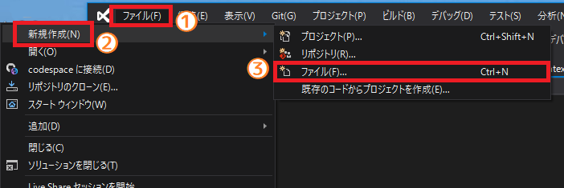
</p>

すると、3Dモデルを表示・編集する画面が表示されます。

<p align="center">
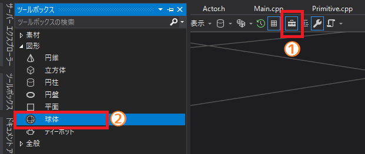
</p>

画面上部の「工具箱アイコン」をクリックすると、左側に作成できる図形一覧が表示されます(①)。一覧から「球体」をダブルクリックすると、画面に球体が追加されます(②)。この球体が弾になります。

作成した球体を保存しましょう。次のようにファイルメニューから「名前を付けてScene1.fbxを保存」を選択してください(①、②)。

<p align="center">
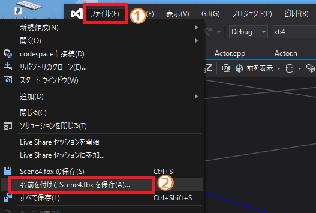
</p>

すると「名前を付けてファイルを保存」が開きます。

<p align="center">
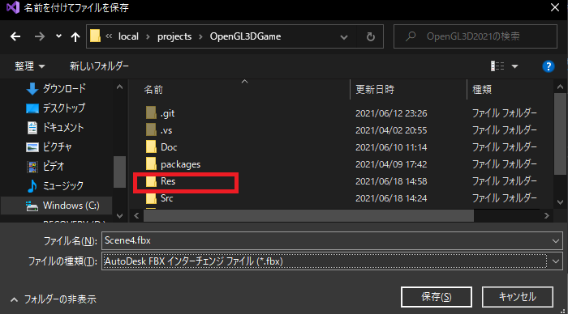
</p>

まず保存先を`Res`フォルダに変更しましょう。`Res`フォルダをダブルクリックしてください。

<p align="center">
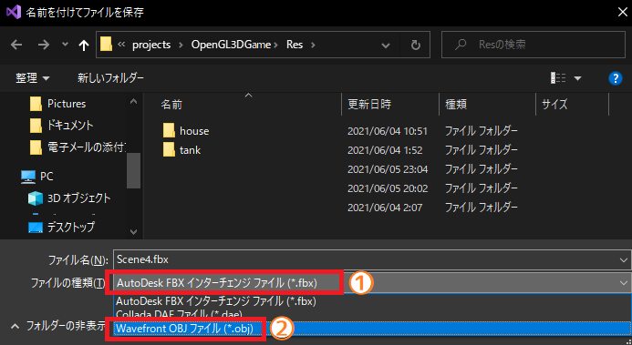
</p>

`Res`フォルダ位に移動したら、次はファイルの種類を「OBJファイル」に変更します。ファイルの種類の入力欄をクリックして種類の一覧を表示し(①)、「Wavefront OBJファイル(*.obj)」(ウェーブフロント・オブジェファイル)を選択してください(②)。

<p align="center">
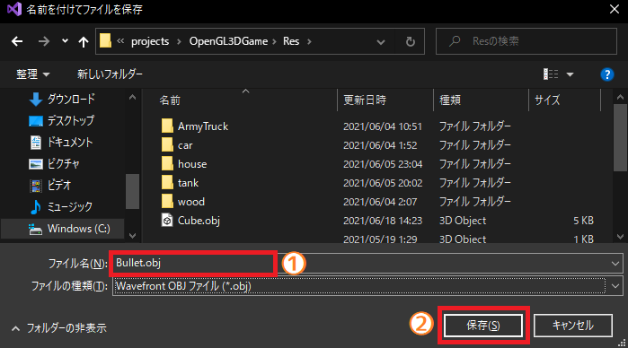
</p>

最後にファイル名を「Bullet.obj」(バレット・オブジェ)に変更し(①)、保存ボタンをクリックしてください(②)。

ファイルを保存したら、3Dモデル編集ウィンドウは閉じてください。これで弾モデルを追加することとができました。

<pre class="tnmai_assignment">
<strong>【課題14】</strong>
<code>Bullet.obj</code>を読み込むプログラムを追加しなさい。
</pre>

<pre class="tnmai_assignment">
<strong>【課題15】</strong>
<code>Bullet.obj</code>用の画像ファイルを作成し、<code>texBullet</code>(テックス・バレット)という変数に読み込むプログラムを追加しなさい。
</pre>

### 3.2 弾を発射する

作成した弾を「マウスの左ボタン」で発射できるようにします。マウスボタンの状態を取得するには`glfwGetMouseButton`(ジーエルエフダブリュー・ゲット・マウス・ボタン)関数を使います。

<pre class="tnmai_code"><strong>【書式】</strong><code>
ボタンの状態 glfwGetMouseButton(GLFWウィンドウのアドレス, 状態を知りたいボタン名);
</code></pre>

戦車を動かすプログラムの下に、次のプログラムを追加してください。

```diff
         } else if (glfwGetKey(window, GLFW_KEY_S) == GLFW_PRESS) {
           tank->position -= tankFront * 4.0f / 60.0f;
         }
+
+        // マウス左ボタンの状態を取得する
+        int shotButton = glfwGetMouseButton(window, GLFW_MOUSE_BUTTON_LEFT);
+
+        // マウス左ボタンが押されていたら弾アクターを追加する
+        if (shotButton != 0) {
+          Actor bullet = { "Bullet", primitiveBuffer.Get(9), texBullet,
+            tank->position, glm::vec3(1), tank->rotation, glm::vec3(0) };
+          actors.push_back(bullet);
+        }
       }
     }

     //
     // ゲーム状態を描画する
```

プログラムが書けたらビルドして実行してください。マウス左ボタンを押したときに球体が表示されたら成功です(見えない場合は戦車を移動させてみてください)。

<p align="center">
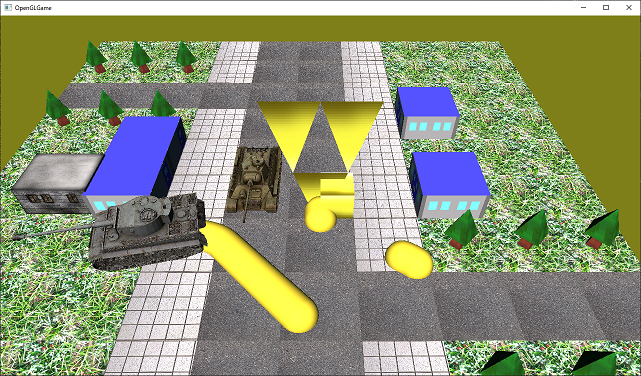
</p>

### .3.3 弾を動かす

弾がその場に残ったままでは、「遠くの敵戦車を倒す」という目的を達成できません。そこで、アクターに速度パラメータを追加して、弾が飛んでいくようにしましょう。速度は英語で「velocity(ベロシティ)」といいますので、変数名は`velocity`とします。

`Actor.h`を開き、次のプログラムを追加してください。

```diff
   glm::vec3 scale;                 // 物体の拡大縮小率
   float rotation;                  // 物体の回転角度
   glm::vec3 adjustment;            // 物体を原点に移動するための距離
 
+  glm::vec3 velocity = glm::vec3(0); // 速度(メートル毎秒)
 };

 void Draw(
   const Actor& actor,              // 物体の制御パラメータ
```

次に、弾の速度を設定します。`Main.cpp`を開き、弾を発射するプログラムに、ベロシティを設定するプログラムを追加してください。

```diff
         if (shotButton != 0) {
           Actor bullet = { "Bullet", primitiveBuffer.Get(9), texBullet,
             tank->position, glm::vec3(1), tank->rotation, glm::vec3(0) };
+
+          // 戦車の向いている方向に、30m/sの速度で移動させる
+          bullet.velocity = tankFront * 30.0f;
+
           actors.push_back(bullet);
         }
       }
     }
```

最後に、`velocity`変数を`position`変数に加算するプログラムを追加します。`Main.cpp`を開き、弾を発射するプログラムの下に、次のプログラムを追加してください。

```diff
           actors.push_back(bullet);
         }
       }
+
+      // アクターの状態を更新する
+      for (int i = 0; i < actors.size(); ++i) {
+        // アクターの位置を更新する
+        actors[i].position += actors[i].velocity * 1.0f / 60.0f;
+      }
     }

     //
     // ゲーム状態を描画する
```

プログラムが書けたらビルドして実行してください。発射した弾が戦車の向いている方向に飛んでいったら成功です。

### .3.4 アクターに寿命を持たせる

現在は無限に弾が発射され続け、発射された弾はいつまでも飛び続けます。また、ボタンを押している間は弾が発射され続けるため、ちょっとボタンを押しっぱなしにすると数百発の弾が発射されてカクカクになってしまいます。

このカクカクは、リリースビルドに切り替えることでかなり改善します。しかし、根本的な問題は、大量のアクターが存在することです。そこで、アクターの総数が増えすぎないように、ゲームに影響を与えなくなった弾を消しましょう。

「ゲームに影響を与えなくなる」という状態はいくつか考えられます。

>1. 一定時間が経過した。
>2. 一定距離を移動した。
>3. ゲームが許可する空間の外に出た。

1と2はほとんど同じですが、2は移動しない物体には使えません。3にも2と同じ問題があります。この理由から、最も汎用的に使えるのは1です。ですから、今回は1の手法で弾を消すことにします。`Actor.h`を開き、次のプログラムを追加してください。

```diff
   float rotation;                  // 物体の回転角度
   glm::vec3 adjustment;            // 物体を原点に移動するための距離
 
   glm::vec3 velocity = glm::vec3(0); // 速度(メートル毎秒)
+  float lifespan = 0;              // 寿命(秒、0以下なら寿命なし)
+  bool isDead = false;             // true=死亡(削除待ち) false=生存中
 };

 void Draw(
   const Actor& actor,              // 物体の制御パラメータ
```

変数名は`lifespan`(ライフスパン、「寿命」という意味)にしました。また、すべてのアクターに寿命による管理が必要とは限りません。そこで、「ライフスパンが`0`以下の場合は寿命なし」とします。

また、「寿命が尽きた瞬間にアクターを削除する」というのは「筋が悪い」ことが多いです。なぜなら、他のアクターが寿命が尽きたアクターの情報を使って何かするかもしれないからです。そこで、「削除待ち」を表す`isDead`(イズ・デッド)というメンバ変数を追加しました。

次に弾に寿命を設定します。`Main.cpp`を開き、弾を発射するプログラムに、次のプログラムを追加してください。

```diff
         if (shotButton != 0) {
           Actor bullet = { "Bullet", primitiveBuffer.Get(9), texBullet,
             tank->position, glm::vec3(1), tank->rotation, glm::vec3(0) };
+
+          // 1.5秒後に弾を消す
+          bullet.lifespan = 1.5f;

           // 戦車の向いている方向に、30m/sの速度で移動させる
           bullet.velocity = tankFront * 30.0f;

           actors.push_back(bullet);
         }
```

最後に寿命の管理プログラムを作成します。アクターの状態を更新するプログラムに、次のプログラムを追加してください。

```diff
       // アクターの状態を更新する
       for (int i = 0; i < actors.size(); ++i) {
+        // アクターの寿命を減らす
+        if (actors[i].lifespan > 0) {
+          actors[i].lifespan -= 1.0f / 60.0f;
+
+          // 寿命の尽きたアクターを「削除待ち」状態にする
+          if (actors[i].lifespan <= 0) {
+            actors[i].isDead = true;
+            continue; // 削除待ちアクターは更新をスキップ
+          }
+        }
+
         // アクターの位置を更新する
         actors[i].position += actors[i].velocity * 1.0f / 60.0f;
       }
+
+      // 削除待ちのアクターを削除する
+      actors.erase(
+        std::remove_if(actors.begin(), actors.end(), [](Actor& a) { return a.isDead; }),
+        actors.end());
     }

     //
     // ゲーム状態を描画する
```

`vector`型の配列から特定の要素を削除するには、`erase`(イレース)メンバ関数と`remove_if`(リムーブ・イフ)関数を組み合わせて使います。イレース関数は「指定した範囲の要素を削除する」関数です。

<pre class="tnmai_code"><strong>【書式】</strong>
削除した要素の次の要素の位置 vector::erase(削除する範囲の先頭, 削除する範囲の終端);
</pre>

リムーブイフ関数は、「条件に従って、削除しない要素と削除する要素を分離する」関数です。

<pre class="tnmai_code"><strong>【書式】</strong>
削除する要素の先頭 std::remove_if(処理する範囲の先頭, 処理する範囲の終端, 削除する条件);
</pre>

また、`begin`(ビギン)メンバ関数は配列の先頭要素の位置、`end`(エンド)メンバ関数は配列の終端位置を返します。これらの関数を使って特定の要素を削除する手順は次のようになっています。

>1. リムーブイフ関数を使って、配列全体を削除しない要素と削除する要素に分離する。
>2. 1を実行すると、リムーブイフ関数は分離した削除要素の先頭位置を返す。
>3. イレース関数を使って、2で取得した削除要素の先頭から配列の末尾までを削除する。

プログラムが書けたらビルドして実行してください。ボタンを押し続けても、あまりカクカクしくなっていれば成功です。

<p align="center">
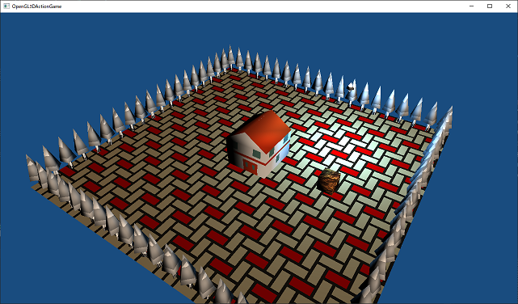
</p>

>**【リムーブイフとイレースはペアで使うこと】**<br>
>「ようそを さくじょするときは かならず イレースしてください！ リムーブイフだけでは ダメですよ！」<br>
>※しかし、`std::list`など一部の型ではリムーブイフがメンバ関数になっていて、リムーブイフだけで削除できる。ややこしい…。

### 3.5 押した瞬間を判定する

カクカクしにくくはなりましたが、まだ完全に解消できたとはいえません。もっと弾を減らすために、ボタンを押した瞬間だけ弾を発射するようにしましょう。

「ボタンを押した瞬間」というのは「前回調べたときは押されていない」が「今は押されている」という状態です。今のボタン状態は`shotButton`変数で分かりますから、あとは「前回調べた時の状態」を表す変数を追加する必要があります。

この変数の名前は`oldShotButton`(オールド・ショット・ボタン)とします。メインループの手前に次のプログラムを追加してください。

```diff
   // メインループ.
   double loopTime = glfwGetTime(); // 1/60秒間隔でループ処理するための時刻
   double diffLoopTime = 0;         // 時刻の差分
+  int    oldShotButton = 0;        // 前回のショットボタンの状態
   while (!glfwWindowShouldClose(window)) {
     // 現在時刻を取得
```

次に、弾の発射判定に`oldShotButton`を追加します。弾の発射判定を次のように変更してください。

```diff
         // マウス左ボタンの状態を取得する
         int shotButton = glfwGetMouseButton(window, GLFW_MOUSE_BUTTON_LEFT);

-        // マウス左ボタンが押されていたら弾アクターを追加する
-        if (shotButton != 0) {
+        // マウス左ボタンが押された瞬間に弾アクターを発射する
+        if (shotButton != 0 && oldShotButton == 0) {
           Actor bullet = { "Bullet", primitiveBuffer.Get(9), texBullet,
             tank->position, glm::vec3(1), tank->rotation, glm::vec3(0) };
```

最後に、オールドショットボタン変数の状態を更新します。弾を発射するプログラムの下に、次のプログラムを追加してください。

```diff
           bullet.velocity = tankFront * 30.0f;
 
           actors.push_back(bullet);
         }
+
+        // 「前回のショットボタンの状態」を更新する
+        oldShotButton = shotButton;
       }

       // アクターの状態を更新する
```

プログラムが書けたらビルドして実行してください。ボタンを押したときだけ弾が発射されたら成功です。

### 3.6 発射位置を調整する

普通、戦車の弾は、地面を這うように飛んでいったりはしません。発射位置を調整して、ちゃんと砲身から発射されるようにしましょう。弾を発射するプログラムを次のように変更してください。

```diff
         // マウス左ボタンが押された瞬間に弾アクターを発射する
         if (shotButton != 0 && oldShotButton == 0) {
+          // 発射位置を砲の先端に設定
+          glm::vec3 position = tank->position + tankFront * 6.0f;
+          position.y += 2.0f;
+
           Actor bullet = { "Bullet", primitiveBuffer.Get(9), texBullet,
-            tank->position, glm::vec3(1), tank->rotation, glm::vec3(0) };
+            position, glm::vec3(1), tank->rotation, glm::vec3(0) };

           // 1.5秒後に弾を消す
           bullet.lifespan = 1.5f;
```

プログラムが書けたらビルドして実行してください。弾が砲の先端から発射されていたら成功です。

### 3.7 弾の大きさを調整する

砲に対して弾が大きすぎるので、弾をちょっと小さくしましょう。弾を発射するプログラムを次のように変更してください。

```diff
           glm::vec3 position = tank->position + tankFront * 6.0f;
           position.y += 2.0f;

           Actor bullet = { "Bullet", primitiveBuffer.Get(9), texBullet,
-            position, glm::vec3(1), tank->rotation, glm::vec3(0) };
+            position, glm::vec3(0.25f), tank->rotation, glm::vec3(0) };

           // 1.5秒後に弾を消す
           bullet.lifespan = 1.5f;
```

プログラムが書けたらビルドして実行してください。弾が小さくなっていたら成功です。

<p align="center">
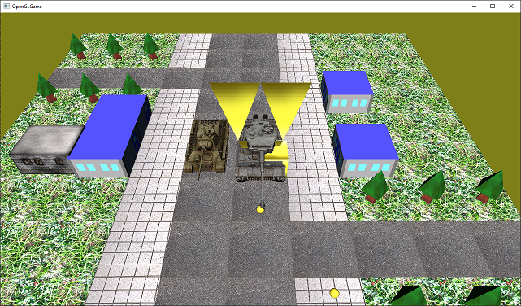
</p>

>**【3章のまとめ】**<br>
>
>* 
>* 
>* 

<div style="page-break-after: always"></div>

## 4. 衝突判定

### 4.1 直方体の当たり判定を追加する

せっかく弾を発射できるようになったので、敵戦車に当たり判定を付けましょう。今回は、最も簡単な当たり判定形状である「直方体(ちょくほうたい)」を使うことにします。

直方体は対角線で結ばれた2点によって定義できます。`Actor.h`を開き、次のプログラムを追加してください。

```diff
 #include <string>
 #include <vector>
 #include <glm/glm.hpp>
+
+/**
+* 直方体.
+*/
+struct Box
+{
+  glm::vec3 min = glm::vec3(0);
+  glm::vec3 max = glm::vec3(0);
+};

 /**
 * 物体を制御するパラメータ.
```

`min`(ミン)と`max`(マックス)は対角線で結ばれた2点を表すメンバ変数です。直方体の(-X,-Y,-Z)位置と(+X,+Y,+Z)位置の2点を指定します。

それでは、この`Box`(ボックス)構造体を`Actor`構造体に追加しましょう。当たり判定は英語で「コライダー(collider)」といいます。ですから、変数名は`collider`としましょう。`Actor`構造体に次のメンバ変数を追加してください。

```diff
   float lifespan = 0;              // 寿命(秒、0以下なら寿命なし)
   bool isDead = false;             // true=死亡(削除待ち) false=生存中
+
+  Box collider;                    // 衝突判定
 };

 void Draw(
   const Actor& actor,              // 物体の制御パラメータ
```

### 4.2 衝突を判定する関数を追加する

次にコライダー変数を使って衝突を調べる関数を追加します。とりあえず関数を作成しましょう。関数名は`ProcessCollision`(プロセス・コリジョン、「衝突を処理する」という意味)とします。`Find`関数の宣言の下に、次の宣言を追加してください。

```diff
   glm::mat4 matView);              // 描画に使うビュー行列  

 Actor* Find(std::vector<Actor>& actors, const char* name);
+bool ProcessCollision(Actor& actorA, Actor& actorB);

 #endif // ACTOR_H_INCLUDED
```

この関数の目的は、アクター`actorA`とアクター`actorB`が衝突しているかどうかを調べることです。次に、関数の定義を作成します。`Actor.cpp`を開き、`Find`関数の定義の下に、次のプログラムを追加してください。

```diff
   return nullptr;
 }
+
+/**
+* 衝突を処理する.
+*
+* @param actorA  衝突しているか調べるアクター
+* @param actorB  衝突しているか調べるアクター
+*
+* @retval true  衝突している
+* @retval false 衝突していない
+*/
+bool ProcessCollision(Actor& actorA, Actor& actorB)
+{
+  // 衝突している
+  return true;
+}
```

衝突判定はワールド座標系で行う必要があります。しかし、コライダーはローカル座標系で定義するほうが便利です。そこで、衝突判定ではまずワールド座標系のコライダーを計算します。これは、ローカル座標系のコライダーにアクターの座標を加算するだけです。`ProcessCollision`関数の定義に次のプログラムを追加してください。

```diff
 bool ProcessCollision(Actor& actorA, Actor& actorB)
 {
+  // ワールド座標系のコライダーを計算する
+  Box a = actorA.collider;
+  a.min += actorA.position;
+  a.max += actorA.position;
+
+  Box b = actorB.collider;
+  b.min += actorB.position;
+  b.max += actorB.position;
+
   // 衝突している
   return true;
```

直方体同士の衝突の有無を調べるには、X, Y, Zの3つの軸について、個別に衝突しているかどうかを調べます。次の図では、2つの直方体`a`と`b`の関係を表したものです。`min`がマイナス方向の平面、`max`がプラス方向の平面の座標を表していると考えてください。

<p align="center">
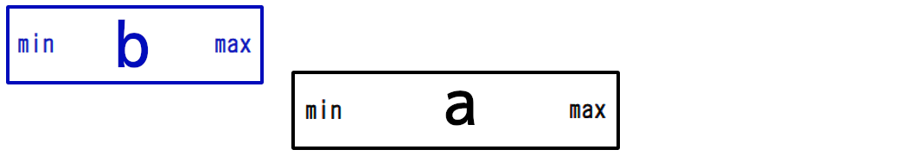
</p>

記述を簡単にするため、直方体`a`の`min`の値のことを`a.min`、`max`の値のことを`a.max`のように書くことにします。さて、上の図のように、`a.min`が`b.max`より右にある(=`b.max`より大きい)場合、直方体`a`と`b`は衝突していません。

<p align="center">
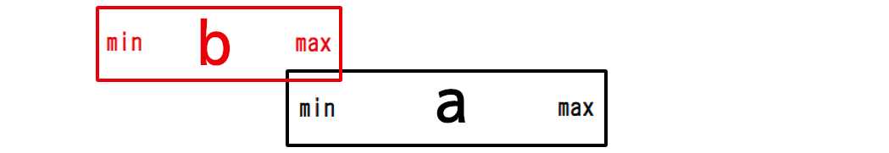
</p>

`a.min`が、`b.max`の左にある(=`b.max`以下)の場合、直方体`a`と`b`は衝突している可能性があります。「可能性がある」と書いたのは、次の場合がありうるからです。

<p align="center">
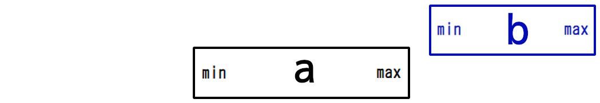
</p>

上の図では`a.min`が`b.max`の左にあります(=`b.max`以下です)。しかし、図から明らかなように、実際には直方体`a`と`b`は衝突していません。このような場合があるため、さらに`a.max`と`b.min`についても比較する必要があります。上の図にあるように、`a.max`が`b.min`より左にある(小さい)場合は衝突していません。

対して、以下の図のように`a.max`が`b.min`以上の場合、直方体`a`と`b`は衝突している可能性があります。

<p align="center">
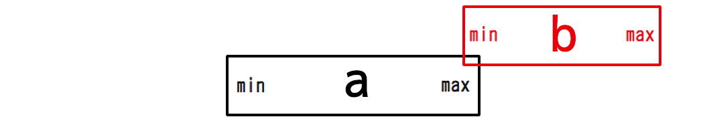
</p>

このように、直方体の両側の平面の座標を比較することで、「ある軸において直方体が衝突している」ことを調べることができます。この判定をX, Y, Zの3つの軸すべてに行います。そして、すべての軸で「衝突している」と判定されたら、「直方体`a`と`b`は衝突している」と考えられます。

まずX軸の衝突判定を行います。ワールド座標系のコライダーを計算するプログラムの下に、次のプログラムを追加してください。

```diff
   b.min += actorB.position;
   b.max += actorB.position;
+
+  // aの左側面がbの右側面より左にあるなら、衝突していない
+  if (a.min.x >= b.max.x) {
+    return false;
+  }
+  // aの右側面がbの左側面より右にあるなら、衝突していない
+  if (a.max.x < b.min.x) {
+    return false;
+  }

   // 衝突している
   return true;
```

さきほどの図と見比べてみてください。同じことが書かれているのが分かると思います。同様にして、Y軸とZ軸の判定を行います。X軸の判定の下に、次のプログラムを追加してください。

```diff
   if (a.max.x < b.min.x) {
     return false;
   }
+
+  // aの下面がbの上面より上にあるなら、衝突していない
+  if (a.min.y >= b.max.y) {
+    return false;
+  }
+  // aの上面がbの下面より下にあるなら、衝突していない
+  if (a.max.y < b.min.y) {
+    return false;
+  }
+
+  // aの奥側面がbの手前側面より手前にあるなら、衝突していない
+  if (a.min.z >= b.max.z) {
+    return false;
+  }
+  // aの手前側面がbの奥側面より奥にあるなら、衝突していない
+  if (a.max.z < b.min.z) {
+    return false;
+  }

   // 衝突している
   return true;
```

これで衝突を判定する関数は完成です。

### 4.3 衝突判定を使って敵を倒す

敵戦車と弾に当たり判定を付けます。T-34戦車を作成するプログラムに、次のプログラムを追加してください。

```diff
   // T-34戦車のパラメータ
   actors.push_back({ "T-34", primitiveBuffer.Get(7), texTankT34,
     glm::vec3(-5, 0, 0), glm::vec3(1), 0.0f, glm::vec3(0) });
+  // T-34戦車に当たり判定を付ける
+  actors.back().collider = Box{ glm::vec3(-2, 0, -2), glm::vec3(2, 3, 2) };
   // 建物のパラメータ
   actors.push_back({ "BrickHouse", primitiveBuffer.Get(8), texBrickHouse,
```

続いて、弾を発射するプログラムに次のプログラムを追加してください。

```diff
           // 戦車の向いている方向に、30m/sの速度で移動させる
           bullet.velocity = tankFront * 30.0f;
+
+          // 弾に当たり判定を付ける
+          bullet.collider = Box{ glm::vec3(-0.25f), glm::vec3(0.25f) };

           actors.push_back(bullet);
         }
```

これでT-34戦車と弾を衝突させる準備が整いました。最後に、プロセスコリジョン関数を使って衝突を判定しましょう。アクターを更新するプログラムの下に、次のプログラムを追加してください。

```diff
         // アクターの位置を更新する
         actors[i].position += actors[i].velocity * 1.0f / 60.0f;
       }
+
+      // アクターの衝突判定を行う
+      for (int a = 0; a < actors.size(); ++a) {
+        for (int b = a + 1; b < actors.size(); ++b) {
+
+          // 削除待ちアクターは衝突しない
+          if (actors[a].isDead) {
+            break;
+          } else if (actors[b].isDead) {
+            continue;
+          }
+
+          if (ProcessCollision(actors[a], actors[b])) {
+            // T-34戦車と弾の衝突を処理する
+            if (actors[a].name == "T-34" && actors[b].name == "Bullet") {
+              actors[a].isDead = true; // T-34戦車を消去する
+              actors[b].isDead = true; // 弾を消去する
+            }
+          }
+        }
+      }

       // 削除待ちのアクターを削除する
       actors.erase(
```

すべてのアクターについて、残りのアクターとの間で何らかの処理をする、ということをやりたい場合、よく使われるのは二重for文です。しかし、内側のfor文を素直に先頭からループさせてしまうと、同じ組み合わせを2回処理してしまいます。

そこで、内側のfor文ではループ変数の初期値を「外側のループ変数 + 1」としています。これによって、すべての組み合わせが1回だけ処理されるようになります。

プログラムが書けたらビルドして実行してください。弾がT-34戦車に当たったとき、戦車が消えたら成功です。

<p align="center">
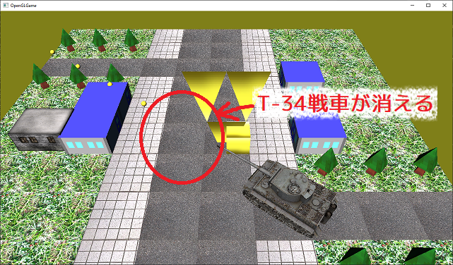
</p>

### 4.4 アクターに耐久力を設定する

T-34戦車が一発で壊れてしまうのは弱すぎる気がします。耐久値(たいきゅうち)を設定して、何発かは耐えられるようにしてみましょう。変数名は`health`(ヘルス)とします。`Actor.h`を開き、次のプログラムを追加してください。

```diff
   float lifespan = 0;              // 寿命(秒、0以下なら寿命なし)
   bool isDead = false;             // true=死亡(削除待ち) false=生存中
+  float health = 10;               // 耐久値

   Box collider;                    // 衝突判定
 };
```

次に、T-34戦車と弾が衝突した時、T-34戦車の耐久値を減らすプログラムを追加します。`Main.cpp`を開き、T-34戦車と弾の衝突処理プログラムを次のように変更してください。

```diff
           if (ProcessCollision(actors[a], actors[b])) {
             // T-34戦車と弾の衝突を処理する
             if (actors[a].name == "T-34" && actors[b].name == "Bullet") {
+              // T-34戦車の耐久値を減らす
+              actors[a].health -= 1;
+              // 耐久値が0以下になったらT-34戦車を消去する
+              if (actors[a].health <= 0) {
                 actors[a].isDead = true; // T-34戦車を消去する
+              }
               actors[b].isDead = true; // 弾を消去する
             }
           }
```

プログラムが書けたらビルドして実行してください。T-34戦車に弾を10発打ち込むと、戦車が消えたら成功です。

>**【4章のまとめ】**<br>
>
>* 
>* 
>* 


