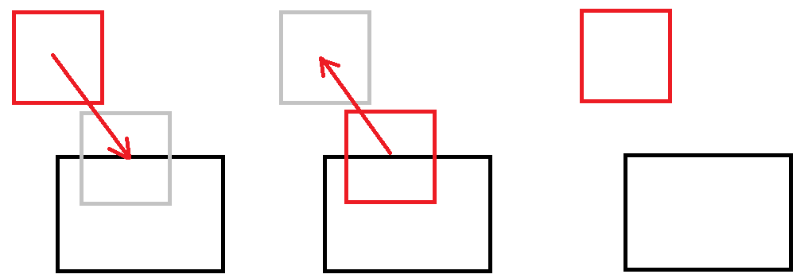
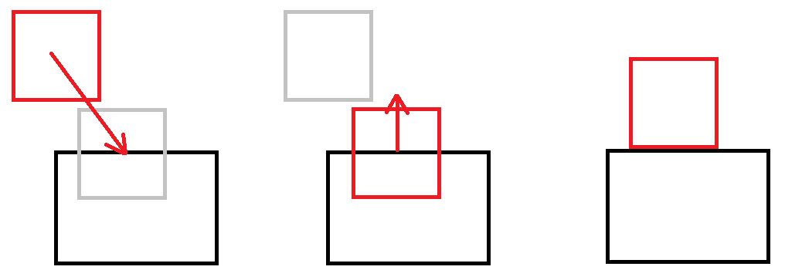
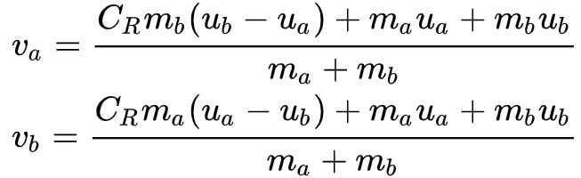
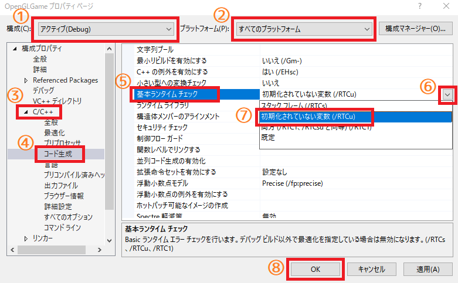

[OpenGL 3D 2021 第10回]

# 速度と反発と摩擦

>**【テキストを始めるまえに】**<br>
>衝突判定はどうしても数学的な話が多くなるので、これまで以上に難しいと感じることが多いと思います。内容がよく分からなくても気にせず、とにかくプログラムを書いていってください。

## 習得目標

* 衝突したときの物体同士の重なりを解決できるようになる。
* 衝突後の速度を求められるようになる。
* 反発係数、摩擦係数による挙動の違いを制御できるようになる。

## 1. 重なりを解決する

### 1.1 アクターを重なっていない状態にするには

前回作成した衝突判定プログラムによって、アクター同士の衝突を検出できるようになりました。実際には衝突検出プログラムは、2つの物体が「重なっている状態」を検出しています。

しかし現実世界では、ひとつの物体が存在する場所に、他の物体を重ねて存在させることはできません。これをコンピューターで再現するには、「重なっている状態」を取り消して「重なっていない状態」に戻す必要があります。

アクターを「重なっていない状態」に戻す簡単な方法のひとつは「移動前の座標に戻す」ことです。しかし、この方法では「物体同士が密着する」ことができず、図形がわずかに離れた状態になってしまいます。

<p align="center">

</p>

より妥当な方法は「重なっている部分の長さ」を求めて、その長さだけアクターを移動させることです。この方法なら「物体同士が密着する」状態を作り出せるようになります。

<p align="center">

</p>

「重なっている部分の長さ」は以下の手順で計算します。

>1. `a.max.x - b.min.x`を計算する。
>2. `b.max.x - a.min.x`を計算する。
>3. 1と2の短いほうを「X軸方向の重なっている部分の長さ」とする。
>4. X軸と同じ方法で「Y軸方向の重なっている部分の長さ」と「Z軸方向の重なっている部分の長さ」を計算する。
>5. X, Y, Zのうち最も短いものを「重なっている部分の長さ」とする。

<p align="center">

</p>

アクターの座標から、上の方法で計算した「重なっている部分の長さ」をを引くと、アクターを重なっていない座標に移動させることができます。

それでは「重なっている部分の長さ」を求めましょう。<br>
`Actor.cpp`を開き、`DetectCollision`関数を次のように変更してください。

```diff
   b.min += actorB.position;
   b.max += actorB.position;

   // aの左側面がbの右側面より右にあるなら、衝突していない
-  if (a.min.x >= b.max.x) {
+  const float dx0 = b.max.x - a.min.x;
+  if (dx0 <= 0) {
     return false;
   }
   // aの右側面がbの左側面より左にあるなら、衝突していない
-  if (a.max.x < b.min.x) {
+  const float dx1 = a.max.x - b.min.x;
+  if (dx1 <= 0) {
     return false;
   }

   // aの下面がbの上面より上にあるなら、衝突していない
   if (a.min.y >= b.max.y) {
```

<pre class="tnmai_assignment">
<strong>【課題01】</strong>
X軸方向の重なっている部分の長さを求めるプログラムを参考に、Y軸およびZ軸方向の重なっている長さを求めるプログラムを追加しなさい。
Y軸方向の長さを表す変数名は<code>dy0</code>と<code>dy1</code>、Z軸方向の長さを表す変数名は<code>dz0</code>と<code>dz1</code>としなさい。
</pre>

### 1.2 <ruby>浸透距離<rt>しんとうきょり</rt></ruby>が最も短い方向を選ぶ

ところで「重なっている部分の長さ」という名前はちょっと呼びにくいですね。そこで、以後は「浸透距離(しんとうきょり)」と呼ぶことにします。

さて、すべて方向で浸透距離(重なっている部分の長さ)を求めたら、次はそれらのうちで最も短い方向を選びます。これは「ある方向の浸透距離が、他の方向の浸透距離より短い場合、短い方向から衝突した可能性のほうが高い」と考えられるからです。

そのために、まず各軸について浸透距離が短いほうを選択して、候補を6個から3個に減らします。これは数値の小さい方を選ぶだけです。候補を代入する変数名は`penetration`(ペネトレーション、「貫通」や「浸透」という意味)とします。

衝突判定プログラムに、次のプログラムを追加してください。

```diff
   const float dz1 = a.max.z - b.min.z;
   if (dz1 <= 0) {
     return false;
   }
+
+  // XYZの各軸について「浸透距離(重なっている部分の長さ)」が短い方向を選択する
+  glm::vec3 penetration; // 浸透距離と方向
+  if (dx0 <= dx1) {
+    penetration.x = -dx0;
+  } else {
+    penetration.x = dx1;
+  }
+  if (dy0 <= dy1) {
+    penetration.y = -dy0;
+  } else {
+    penetration.y = dy1;
+  }
+  if (dz0 <= dz1) {
+    penetration.z = -dz0;
+  } else {
+    penetration.z = dz1;
+  }

   // 衝突している
   return true;
```

次に、3つの候補から最も短い方向を選びます。これは単純に3つの軸を順番に比較するだけです。候補から外れた軸の値は`0`にしておきます。候補を3つに絞るプログラムの下に、次のプログラムを追加してください。

```diff
   } else {
     penetration.z = -dz1;
   }
+
+  // 浸透距離の絶対値
+  glm::vec3 absPenetration = glm::abs(penetration);
+
+  // XYZ軸のうち、浸透距離が最も短い軸の成分だけを残す
+  if (absPenetration.x >= absPenetration.y) {
+    penetration.x = 0;
+    if (absPenetration.z >= absPenetration.y) {
+      penetration.z = 0;
+    } else {
+      penetration.y = 0;
+    }
+  } else {
+    penetration.y = 0;
+    if (absPenetration.x >= absPenetration.z) {
+      penetration.x = 0;
+    } else {
+      penetration.z = 0;
+    }
+  }

   // 衝突している
   return true;
```

最後に、アクターの座標から浸透距離を引きます。

```diff
       penetration.z = 0;
     }
   }
+
+  // 重なりの解決
+  actorA.position -= penetration * 0.5f;
+  actorB.position += penetration * 0.5f;

   // 衝突している
   return true;
```

重ならないようになっているかを調べるために、タイガーI戦車にもコライダーを設定します。`Main.cpp`を開き、戦車を作成するプログラムに次のプログラムを追加してください。

```diff
   // 戦車のパラメータ
   actors.push_back(Actor{ primitiveBuffer.Get(6), texTank,
     glm::vec3(0), glm::vec3(1), 0.0f, glm::vec3(0) });
+  actors.back().collider = Box{ glm::vec3(-2, 0, -2), glm::vec3(2, 3, 2) };

   // T-34戦車のパラメータ
   actors.push_back(Actor{ "T-34", primitiveBuffer.Get(7), texTankT34,
```

プログラムが書けたらビルドして実行してください。タイガーI戦車を動かして、T-34戦車を押して移動させることができたら成功です。

<pre class="tnmai_assignment">
<strong>【課題02】</strong>
建物<code>BrickHouse</code>にコライダーを設定しなさい。
</pre>

### 1.3 浸透距離を返す

ところで、ディテクトコリジョン関数は「衝突の検出」が目的です。そのため「重なりの解決」まで行うのは関数の目的からすると行きすぎています。

そこで、「重なりの解決」は別の関数に分離することにします。まずディテクトコリジョン関数が計算した「浸透距離」を、関数の呼び出し元に返せるようにします。`Actor.h`を開き、次のプログラムを追加してください。

```diff
   glm::mat4 matView);              // 描画に使うビュー行列  

 Actor* Find(std::vector<Actor>& actors, const char* name);
+
+/**
+* 衝突情報
+*/
+struct Contact
+{
+  Actor* a = nullptr;
+  Actor* b = nullptr;
+  glm::vec3 penetration; // 浸透距離
+};

-bool DetectCollision(Actor& a, Actor& b);
+bool DetectCollision(Actor& a, Actor& b, Contact& contact);

 #endif // ACTOR_H_INCLUDED
```

次に、`Actor.cpp`を開き、ディテクトコリジョン関数を次のように変更してください。

```diff
 * @param actorA  衝突しているか調べるアクター
 * @param actorB  衝突しているか調べるアクター
+* @param contact 衝突情報
 *
 * @retval true  衝突している
 * @retval false 衝突していない
 */
-bool DetectCollision(Actor& actorA, Actor& actorB)
+bool DetectCollision(Actor& actorA, Actor& actorB, Contact& contact)
 {
   // ワールド座標系の衝突図形を計算する
   Box a = actorA.collider;
```

そして、計算した浸透距離を`contact`変数に代入します。ディテクトコリジョン関数に次のプログラムを追加してください。

```diff
       penetration.z = 0;
     }
   }
+
+  // 衝突情報を設定する
+  contact.a = &actorA;
+  contact.b = &actorB;
+  contact.penetration = penetration;

   // 重なりの解決
   actorA.position += penetration * 0.5f;
   actorB.position -= penetration * 0.5f;
```

### 1.4 重なりを解決する関数を作る

コンタクト構造体の情報を使って、重なりを解決する関数を定義します。<br>
関数名は`SolveContact`(ソルブ・コンタクト)とします。`Solve`(ソルブ)は「解決する」という意味の動詞、`Contact`(コンタクト)は「接触」という意味の名詞です。

`Actor.h`を開き、次のプログラムを追加してください。

```diff
   glm::vec3 penetration; // 浸透距離
 };

 bool DetectCollision(Actor& a, Actor& b, Contact& contact);
+void SolveContact(Contact& contact);

 #endif // ACTOR_H_INCLUDED
```

次に`Actor.cpp`を開き、ディテクトコリジョン関数の定義の下に、次のプログラムを追加してください。

```diff
   // 衝突している
   return true;
 }
+
+/**
+* 重なりを解決する
+*
+* @param contact 衝突情報
+*/
+void SolveContact(Contact& contact)
+{
+  Actor& actorA = *contact.a;
+  Actor& actorB = *contact.b;
+  glm::vec3 penetration = contact.penetration;
+}
```

続いて、ディテクトコリジョン関数の末尾にある「重なりの解決」プログラムを切り取り、

```diff
   contact.b = &actorB;
   contact.penetration = penetration;
-
-  // 重なりの解決
-  actorA.position -= penetration * 0.5f;
-  actorB.position += penetration * 0.5f;

   // 衝突している
   return true;
```

ソルブコンタクト関数に貼り付けてください。

```diff
   Actor& actorA = *contact.a;
   Actor& actorB = *contact.b;
   glm::vec3 penetration = contact.penetration;
+
+  // 重なりの解決
+  actorA.position -= penetration * 0.5f;
+  actorB.position += penetration * 0.5f;
 }
```

これで「重なりの解決」を関数にすることができました。

### 1.5 コンタクト構造体を使う

それでは、コンタクト構造体を使うように、衝突プログラムを修正します。まずコンタクト構造体を格納する配列を用意します。`Main.cpp`の衝突判定を行うプログラムに次のプログラムを追加してください。

```diff
         actors[i].position += actors[i].velocity * deltaTime;
       }
+
+      // 衝突情報の配列を用意する
+      std::vector<Contact> contacts;
+      contacts.reserve(actors.size());

       // アクターの衝突判定を行う
       for (int a = 0; a < actors.size(); ++a) {
         for (int b = a + 1; b < actors.size(); ++b) {
```

次に、ディテクトコリジョン関数を呼び出しているプログラムを、次のように変更してください。

```diff
           } else if (actors[b].isDead) {
             continue;
           }

+          Contact contact;
-          if (DetectCollision(actors[a], actors[b])) {
+          if (DetectCollision(actors[a], actors[b], contact)) {
+            contacts.push_back(contact);
+
             // T-34戦車と弾の衝突を処理する
             if (actors[a].name == "T-34" && actors[b].name == "Bullet") {
```

そして、収集したコンタクト構造体を使って重なりを解決します。衝突判定を行うプログラムの下に、次のプログラムを追加してください。

```diff
               actors[b].isDead = true; // 弾を消去する
             }
           }
         }
       }
+
+      // 重なりを解決する
+      for (int i = 0; i < contacts.size(); ++i) {
+        SolveContact(contacts[i]);
+      }

      // 削除待ちのアクターを削除する
      actors.erase(
```

プログラムが書けたらビルドして実行してください。T-34戦車や建物を押して動かすことができていたら成功です。

### 1.6 動かない物体を作る

建物にコライダーを設定したため、建物を押して移動させることができるようになっています。しかし、一般的な建物は地面に固定されていて、何かで押したくらいでは動きません。

そこで、アクターに「静物フラグ」を追加して、動かせない物体を表現できるようにします。フラグ変数の名前は`isStatic`(イズ・スタティック)とします。`static`(スタティック)は「静止した、動かない」という意味です。`Actor.h`を開き、次のプログラムを追加してください。

```diff
   bool isDead = false;             // false=死亡(削除待ち) true=生存中

   Box collider;                    // 衝突判定
+  bool isStatic = false;           // false=動かせる物体 true=動かせない物体 
 };

 void Draw(
```

通常、「静物フラグ」は木や建物などに設定します。木や建物のような物体は、重なって配置できたほうが見た目のバリエーションを作りやすいです。そこで、動かない物体同士は衝突しないことにしましょう。

`Actor.h`を開き、ディテクトコリジョン関数に次のプログラムを追加してください。

```diff
 bool DetectCollision(Actor& actorA, Actor& actorB)
 {
+  // 動かせない物体同士は衝突しない
+  if (actorA.isStatic && actorB.isStatic) {
+    return false;
+  }
+
   // ワールド座標系の衝突図形を計算する
   Box a = actorA.collider;
```

これで動かせない物体同士は衝突しなくなりました。次に、ソルブコンタクト関数を、次のように変更してください。

```diff
   Actor& actorA = *contact.a;
   Actor& actorB = *contact.b;
   glm::vec3 penetration = contact.penetration;

+  if (actorA.isStatic) {
+    // 重なりの解決: アクターAは動かせないので、アクターBだけ動かす
+    actorB.position += penetration;
+  }
+  else if (actorB.isStatic) {
+    // 重なりの解決: アクターBは動かせないので、アクターAだけ動かす
+    actorA.position -= penetration;
+  }
+  else {
     // 重なりの解決
     actorA.position -= penetration * 0.5f;
     actorB.position += penetration * 0.5f;
+  }
 }
```

最後に建物の静物フラグを`true`にします。`Main.cpp`を開き、建物を作成するプログラムに、次のプログラムを追加してください。

```diff
   actors.push_back(Actor{ "BrickHouse", primitiveBuffer.Get(8), texBrickHouse,
     glm::vec3(-16, 0, 0), glm::vec3(2, 2, 2), 0.0f, glm::vec3(-2.6f, 2.0f, 0.8f) });
   actors.back().collider = Box{ glm::vec3(-2.2f, 0, -1.6f), glm::vec3(2.2f, 2, 1.6f) };
+  actors.back().isStatic = true;

   // メインループ.
   double loopTime = glfwGetTime(); // 1/60秒間隔でループ処理するための時刻
```

プログラムが書けたらビルドして実行してください。建物を押しても動かなければ成功です。

<div style="page-break-after: always"></div>

### 1.7 マップにコライダーを設定する

次はマップにコライダーを設定します。マップのアクターを作成するプログラムに、次のプログラムを追加してください。なお、マップのアクターを作成するプログラムは以前の課題で作ってもらったものです。以下のプログラムと違っていても問題はありません。

```diff
       // 四角形が4x4mなので、xとyを4倍した位置に表示する.
       const glm::vec3 position(x * 4 - 20, 0, y * 4 - 20);

       const int textureNo = mapData[y][x];
       actors.push_back(Actor{ "Ground", primitiveBuffer.Get(0), mapTexList[textureNo],
         position, glm::vec3(1), 0.0f, glm::vec3(0) });
+      actors.back().collider = Box{ glm::vec3(-2, -10, -2), glm::vec3(2, 0, 2) };
+      actors.back().isStatic = true;
     }
   }
+
+  // エレベーターのパラメータ
+  {
+    const glm::vec3 position(-4, -1, -4);
+    actors.push_back(Actor{ "Elevator", primitiveBuffer.Get(0), texGround,
+      position, glm::vec3(1), 0.0f, glm::vec3(0) });
+    actors.back().velocity.y = 1;
+    actors.back().collider = Box{ glm::vec3(-2, -10, -2), glm::vec3(2, 0, 2) };
+    actors.back().isStatic = true;
+  }

  // 三角形のパラメータ
  actors.push_back({ "Triangle", primitiveBuffer.Get(2), texTriangle,
```

次に、メインループの中の「アクターの状態を更新する」プログラムに、次のプログラムを追加してください。

```diff
             actors[i].isDead = true;
             continue; // 削除待ちアクターは更新をスキップ
           }
         }
+
+        // エレベーターの移動方向を切り替える
+        if (actors[i].name == "Elevator") {
+          // 高さ4mに到達したら、移動方向を下にする
+          if (actors[i].position.y >= 4) {
+            actors[i].position.y = 4;
+            actors[i].velocity.y = -1;
+          }
+          // 高さ-1mに到達したら、移動方向を上にする
+          else if (actors[i].position.y <= -1) {
+            actors[i].position.y = -1;
+            actors[i].velocity.y = 1;
+          }
+        }
 
         // アクターの位置を更新する
         actors[i].position += actors[i].velocity * deltaTime;
       }
```

プログラムが書けたらビルドして実行してください。マップの一部がゆっくりと上下に移動していたら成功です。タイガーI戦車を動かして、エレベーターの上に乗ってみてください。

### 1.8 重力を加える

エレベーターに乗って上に移動すると、下に戻れなくなります。なぜかというと、このゲームには重力が働いていないからです。下に戻れるように重力を追加しましょう。

エレベーターの移動方向を切り替えるプログラムの下に、次のプログラムを追加してください。

```diff
             actors[i].velocity.y = 1;
           }
         }
+
+        // 速度に重力加速度を加える
+        actors[i].velocity.y += -9.8f * deltaTime;

         // アクターの位置を更新する
         actors[i].position += actors[i].velocity * deltaTime;
       }
```

プログラムが書けたらビルドして実行してください。何も変わっていないように見えますが、弾を発射してみてください。すると弾が斜め上に飛んでいくと思います。これは、すべての物体が重力で加速しながら落下しているからです。

マップなどの地形が落下してしまうと困りますね。そこで、`isStatic`メンバ変数が`true`のアクターには重力を加えないことにします。重力加速度を加えるプログラムを次のように変更してください。

```diff
             actors[i].velocity.y = 1;
           }
         }

         // 速度に重力加速度を加える
+        if (!actors[i].isStatic) {
           actors[i].velocity.y += -9.8f * deltaTime;
+        }

         // アクターの位置を更新する
         actors[i].position += actors[i].velocity * deltaTime;
       }
```

プログラムが書けたらビルドして実行してください。発射した弾が、斜め上に飛んでいくことはなくなるはずです。

>**【1章のまとめ】**<br>
>
>* 重なっている距離を座標から引くことで、重なっていない状態にすることができる。
>* 重力がないと下に落ちることができない。

<div style="page-break-after: always"></div>

## 2. <ruby>非弾性衝突<rt>ひ だんせい しょうとつ</rt></ruby>

### 2.1 非弾性衝突に使う変数を定義する

プログラムを起動してから1分ほど放置すると、アクターが地面を突き抜けて落ちていきます。これは重力が加算され続けた結果、ベロシティの数値が非常に大きくなってしまったためです。

現在、衝突判定は1/60秒間隔で実行されています。地面の厚さは10mなので、アクターが1/60秒で10m移動する速度(600m/s)に達すると、地面を突き抜けてしまいます(なお600m/sは時速にすると「時速2160キロメートル」です)。

重力加速度は9.8m/s^2なので、ベロシティは1秒ごとに9.8m/s増加します。600m/sを超えるのは約61秒後になりますね。

しかし、現実の物体は地面を突き抜けたりはしません。地面に衝突したことで「運動エネルギー」が音や熱などに変換されて失われ、最終的にベロシティが0になるからです。

さて、物理の世界において、衝突による「運動エネルギーの変化」は「非弾性衝突(ひ・だんせい・しょうとつ)」という現象で説明されます。非弾性衝突の公式に衝突したアクターのパラメータを当てはめると、衝突後のベロシティが分かります。

<p align="center">
<br>
[非弾性衝突の公式(「Wikipedia:非弾性衝突」より)]
</p>

>`va`: アクターAの衝突後の速度<br>
>`vb`: アクターBの衝突後の速度<br>
>`CR`: 反発係数<br>
>`ma`: アクターAの質量<br>
>`mb`: アクターBの質量<br>
>`ua`: アクターAの衝突前の速度<br>
>`ub`: アクターBの衝突前の速度<br>

非弾性衝突の公式に当てはめるパラメータは、物体の「質量」と物体の「速度」、それから「反発係数」と呼ばれる「衝突前の運動エネルギーと衝突後の運動エネルギーの比」です。

また、ベロシティがそのまま運動エネルギーとして使われるわけではありません。非弾性衝突に関わる運動エネルギーは衝突面の法線方向の成分だけです。そのため法線の情報も必要となります。

まずはアクターに質量と反発係数を設定できるようにしましょう。変数名には英訳を使います。質量の英訳は`mass`(マス)です。反発係数の英訳は`coefficient of restitution`(コエフィシエント・オブ・リスティテューション)ですが、長すぎるので`cor`(コー)とします。

`Actor.h`を開き、次のプログラムを追加してください。

```diff
   bool isDead = false;             // false=死亡(削除待ち) true=生存中

   box collider;                    // 衝突判定
+  float mass = 1;                  // 質量(kg)
+  float cor = 0.7f;                // 反発係数(0.0～1.0)
   bool isstatic = false;           // false=動かせる物体 true=動かせない物体 
 };
```

次に、衝突情報に法線を追加します。コンタクト構造体に次のプログラムを追加してください。

```diff
   Actor* a = nullptr;
   Actor* b = nullptr;
   glm::vec3 penetration; // 浸透距離
+  glm::vec3 normal;      // 衝突面の法線
 };

 bool DetectCollision(Actor& a, Actor& b, Contact& contact);
```

それと、衝突後の速度を計算するとベロシティの値が変化します。しかし、同時に複数の衝突が起きた場合、途中でベロシティが変わってしまうと正しい計算ができません。

そこで、コンタクト構造体に「衝突が起きた瞬間のベロシティ」を記録しておくことにしました。コンタクト構造体に次のプログラムを追加してください。

```diff
   Actor* a = nullptr;
   Actor* b = nullptr;
+  glm::vec3 velocityA;   // 衝突時点でのアクターAのベロシティ
+  glm::vec3 velocityB;   // 衝突時点でのアクターBのベロシティ
   glm::vec3 penetration; // 浸透距離
   glm::vec3 normal;      // 衝突面の法線
 };
```

### 2.2 衝突面の法線を求める

衝突面及びその法線は、アクターAがアクターBに衝突した(`A→B`)と考えるか、逆にアクターBがアクターAに衝突した(`B→A`)と考えるかによって異なります。どちらを選んでも違いはありません。

ただし、プログラムのある部分では`A→B`、別の部分では`B→A`というように混ぜて使うと、プログラムが分かりにくくなってしまいます。今回は、前者の`A→B`(アクターAがアクターBに衝突した)と考えるほうで統一することにします。

`A→B`を選んだのは、既存の浸透距離の計算が「アクターAがアクターBの中に何メートル浸透したか」となっているからです。

さて、`A→B`の場合の衝突面は「アクターAがアクターBのどの面に衝突したか」を表します。つまり、衝突面は「アクターBの6つの面のいずれか」です。

しかし、既に重なっている状態から、正しい衝突面を見つけることは難しい問題です。とはいえ、方法がないわけではありません。よく使われるのは「浸透距離が最も短い方向を衝突面とする」という方法です。

その理屈は、

>ある方向の浸透距離が他の方向より短いのは、その方向から衝突したから。

というものです。これは以下の手順で作成します。

>1. 「衝突面になる可能性の高さ」を表す`score`(スコア)という変数を作る。
>2. 2つの衝突方向の長さを比較し、短い方向のスコアをインクリメントする。
>3. すべての方向の組み合わせについて2を行う。
>4. もっともスコアが高い方向を衝突面とする。

まず候補となる法線を計算します。`Actor.cpp`を開き、ディテクトコリジョン関数に次のプログラムを追加してください。

```diff
   // XYZの各軸について重なっている距離が短い方向を選択する
+  glm::vec3 normal;  // 衝突面(アクターBのいずれかの面)の法線
   glm::vec3 penetration; // 重なっている距離と方向
   if (dx0 <= dx1) {
     penetration.x = -dx0;
+    normal.x = 1;
   } else {
     penetration.x = dx1;
+    normal.x = -1;
   }
   if (dy0 <= dy1) {
     penetration.y = -dy0;
+    normal.y = 1;
   } else {
     penetration.y = dy1;
+    normal.y = -1;
   }
   if (dz0 <= dz1) {
     penetration.z = -dz0;
+    normal.z = 1;
   } else {
     penetration.z = dz1;
+    normal.z = -1;
   }
```

浸透方向は分かっているので、その逆方向が法線候補になります。次にスコア変数を作成します。`Actor.cpp`を開き、ディテクトコリジョン関数に次のプログラムを追加してください。

```diff
   // 浸透距離の絶対値
   glm::vec3 absPenetration = glm::abs(penetration);
+
+  // 衝突面になる可能性の高さ
+  glm::vec3 score = glm::vec3(0);

   // XYZ軸のうち、浸透距離が最も短い軸の成分だけを残す
   if (absPenetration.x >= absPenetration.y) {
```

初期値は`0`にしておきます。次に浸透距離を比較し、スコアをインクリメントします。スコア変数の定義の下に、次のプログラムを追加してください。

```diff
   // 衝突面になる可能性の高さ
   glm::vec3 score = glm::vec3(0);
+
+  // 浸透距離が短い方向のほうが衝突面である可能性が高い(はず)
+  for (int a = 0; a < 2; ++a) {
+    for (int b = a + 1; b < 3; ++b) {
+      if (absPenetration[a] < absPenetration[b]) {
+        ++score[a];
+      } else {
+        ++score[b];
+      }
+    }
+  }

   // XYZ軸のうち、浸透距離が最も短い軸の成分だけを残す
   if (absPenetration.x >= absPenetration.y) {
```

`glm::vec3`などのGLMライブラリのベクトル型は、添え字を使って要素にアクセスする機能を持っています。これはGLSLの同等の機能をC++で再現したものです。`v[0]`と書くと`v.x`と書いたのと同じ意味になります。

最後に「もっともスコアが高い方向」を選びます。スコアを付けるプログラムの下に、次のプログラムを追加してください。

```diff
         ++score[b];
       }
     }
   }
+
+  // より可能性が低い方向を除外する
+  // 値が等しい場合、Z,X,Yの順で優先的に除外する
+  if (score.x <= score.y) {
+    normal.x = 0;
+    if (score.z <= score.y) {
+      normal.z = 0;
+    } else {
+      normal.y = 0;
+    }
+  } else {
+    normal.y = 0;
+    if (score.z <= score.x) {
+      normal.z = 0;
+    } else {
+      normal.x = 0;
+    }
+  }

   // XYZ軸のうち、浸透距離が最も短い軸の成分だけを残す
   if (absPenetration.x >= absPenetration.y) {
```

このプログラムでは、スコアが低い(=衝突面ではない)方向の成分を`0`にすることで、もっともスコアが高い方向だけを残しています。

最後に、求めた法線を衝突情報にコピーします。衝突情報を設定するプログラムに、次のプログラムを追加してください。

```diff
   // 衝突情報を設定する
   contact.a = &actorA;
   contact.b = &actorB;
+  contact.velocityA = actorA.velocity;
+  contact.velocityB = actorB.velocity;
   contact.penetration = penetration;
+  contact.normal = normal;

   // 衝突している
   return true;
```

### 2.3 衝突後の速度を計算する

衝突面の法線を使って、衝突後の速度を計算していきます。まず、ソルブコンタクト関数に次のプログラムを追加してください。

```diff
   Actor& actorA = *contact.a;
   Actor& actorB = *contact.b;
   glm::vec3 penetration = contact.penetration;
+  glm::vec3 normal = contact.normal;
+
+  // 反発係数の平均値を計算
+  float cor = (actorA.cor + actorB.cor) * 0.5f;

   if (actorA.isStatic) {
     // 重なりの解決: アクターAは動かせないので、アクターBだけ動かす
```

反発係数は材質の組み合わせによって変化します。しかし、あまりにも多くの要因が影響するため、計算によって正しい値を求めることは困難です。そのため、殆どの物理プログラムは2つの反発係数を掛けたり、平均値を使ったりして誤魔化しています。

本テキストではUE4やUnityのデフォルトである「平均値」を使うことにしました。非弾性衝突による衝突後の速度の計算には、この章の最初に出てきた公式を使います。

<p align="center">
<br>
[非弾性衝突の公式(「Wikipedia:非弾性衝突」より)]
</p>

この式で使われている記号の意味は以下のとおりです。

>`va`: アクターAの衝突後の速度<br>
>`vb`: アクターBの衝突後の速度<br>
>`CR`: 反発係数<br>
>`ma`: アクターAの質量<br>
>`mb`: アクターBの質量<br>
>`ua`: アクターAの衝突前の速度<br>
>`ub`: アクターBの衝突前の速度<br>

アクターの量は分かっています。反発係数は計算済みです。衝突前の速度は、つまり現在のベロシティです。ただし、必要なのは衝突面の法線方向の速度だけです。

法線方向の速度は、ベロシティと法線の内積を計算することで求めることができます。反発係数の平均値を計算するプログラムの下に、次のプログラムを追加してください。

```diff
   // 反発係数の平均値を計算
   float cor = (actorA.cor + actorB.cor) * 0.5f;
+
+  // 法線方向の速度を計算
+  float ua = glm::dot(normal, actorA.velocity);
+  float ub = glm::dot(normal, actorB.velocity);

   if (actorA.isStatic) {
     // 重なりの解決: アクターAは動かせないので、アクターBだけ動かす
```

これで計算に必要な数値が揃いました。

>**【内積と射影】**<br>
>ベクトルBからベクトルAに垂直に光を当てたとき、ベクトルA上にできるベクトルBの影の長さを求めることを「射影(しゃえい)」といいます。射影は「法線方向の速度を求める」というような問題を解くために使われます。内積は射影を効率的に計算する手段です。

それでは衝突後の速度を求めましょう。まず衝突したアクターがどちらも動ける場合を計算します。重なりを解決するプログラムを次のように変更してください。

```diff
     // 重なりの解決: アクターBは動かせないので、アクターAだけ動かす
     actorA.position -= penetration;
   }
   else {
+    // 衝突後の速度を計算
+    float massAB = actorA.mass + actorB.mass;
+    float c = actorA.mass * ua + actorB.mass * ub;
+    float va = (c + cor * actorB.mass * (ub - ua)) / massAB;
+    float vb = (c + cor * actorA.mass * (ua - ub)) / massAB;

     // 重なりの解決
     actorA.position -= penetration * 0.5f;
```

>**【なぜこの公式で速度が計算できるのか】**<br>
>反発係数を求める公式と、運動量保存の法則から求めることができます。証明については以下のURLが参考になるかと思います。<br>
>`http://www.wakariyasui.sakura.ne.jp/p/mech/hannpatu/nihannpatu.html`

計算で求めた衝突後の速度を設定しましょう。まず、ベロシティから法線方向の速度成分を消去するために、衝突前の速度を引きます。次に衝突後の速度を加算します。衝突後の速度を計算するプログラムの下に、次のプログラムを追加してください。

```diff
     float va = (c + cor * actorB.mass * (ub - ua)) / massAB;
     float vb = (c + cor * actorA.mass * (ua - ub)) / massAB;
+
+    // 衝突前の速度を0にする
+    actorA.velocity -= normal * ua;
+    actorB.velocity -= normal * ub;
+
+    // 衝突後の速度を加算する
+    actorA.velocity += normal * va;
+    actorB.velocity += normal * vb;

     // 重なりの解決
     actorA.position -= penetration * 0.5f;
```

これで、動くアクター同士が衝突したあとの速度が、物理的に正しく更新されるようになりました。

### 2.4 動かないアクターと衝突した場合

動かないアクターと衝突したときの衝突後の速度を求めるには、動かないアクターの質量を「無限大」とみなして計算します。この場合、動くアクターの質量は完全に無視できます(相手が無限大なので質量がいくつでも関係がない)。

アクターAが「動かないアクター」の場合、アクターBの衝突後の速度を求める式は以下のようになります。この式は`無限大 / 無限大 = 1`と`X / 無限大 = 0`から求めることができます。

>`vb = ua + cor * (ub - ua)`

それでは衝突後の速度を求めましょう。アクターAのイズスタティック変数が`true`の場合のプログラムを次のように変更してください。

```diff
   float ua = glm::dot(normal, actorA.velocity);
   float ub = glm::dot(normal, actorB.velocity);

   if (actorA.isStatic) {
+    float vb = ua + cor * (ua - ub); // 衝突後の速度を計算
+    actorB.velocity -= normal * ub;  // 衝突前の速度を0にする
+    actorB.velocity += normal * vb;  // 衝突後の速度を加算する
+
     // 重なりの解決: アクターAは動かせないので、アクターBだけ動かす
     actorB.position += penetration;
   }
   else if (actorB.isStatic) {
+    float va = ub + cor * (ub - ua); // 衝突後の速度を計算
+    actorA.velocity -= normal * ua;  // 衝突前の速度を0にする
+    actorA.velocity += normal * va;  // 衝突後の速度を加算する
+
     // 重なりの解決: アクターBは動かせないので、アクターAだけ動かす
     actorA.position -= penetration;
   }
```

プログラムが書けたらビルドして実行してください。1分待っても戦車が地面を突き抜けたりしなければ成功です。

### 2.5 戦車の移動をベロシティで制御する

衝突後の速度の計算は、アクターのベロシティを使って行われます。しかし、現在の戦車の移動は座標を直接操作することで行っているため、ベロシティは0のままです。

このままでは衝突後の速度の計算が正しく行われませんので、ベロシティを使って移動するよう変更しましょう。

`Main.cpp`を開き、戦車を移動するプログラムを次のように変更してください。

```diff
         // 向きベクトルをtank.rotationだけ回転させる
         tankFront = matRot * glm::vec4(tankFront, 1);

+        float tankAccel = 0.2f; // 戦車の加速度
         if (glfwGetKey(window, GLFW_KEY_W) == GLFW_PRESS) {
-          tank->position += tankFront * 4.0f * deltaTime;
+          tank->velocity += tankFront * tankAccel;
         } else if (glfwGetKey(window, GLFW_KEY_S) == GLFW_PRESS) {
-          tank->position -= tankFront * 4.0f * deltaTime;
+          tank->position -= tankFront * tankAccel;
         }
       }
     }
```

プログラムが書けたらビルドして実行してください。戦車が滑るように移動し、他のアクターに衝突して跳ね返るようになっていたら成功です。

<pre class="tnmai_assignment">
<strong>【課題03】</strong>
<code>cor</code>メンバ変数の値をデフォルト値を<code>0.1f</code>や<code>0.9f</code>などに変更して、反発係数による挙動の違いを確かめなさい。
反発係数の効果を確認したら、好きな反発係数をデフォルト値に設定しなさい。
</pre>

>**【2章のまとめ】**<br>
>
>* 非弾性衝突の公式を使うと、物体の質量から衝突後の速度を求めることができる。
>* 動かない物体は「無限大の質量」を持つものとすれば、同じ公式を使って計算できる。

<div style="page-break-after: always"></div>

## 3. <ruby>摩擦<rt>まさつ</rt></ruby>

### 3.1 <ruby>摩擦係数<rt>まさつけいすう</rt></ruby>

戦車がいつまでも滑り続けるのは、地面との摩擦(まさつ)がないからです。摩擦現象をプログラムすることで、アクターの速度が徐々に遅くなり、最後には停止させることができます。

摩擦とは「すべりにくさ」のことです。すべりにくさは材質や表面の状態によって異なります。土やアスファルトはすべりにくいですが、氷や金属はかなりすべりやすいです。

物理の世界では「すべりにくさ」のことを「摩擦係数(まさつけいすう)」といいます。通常、摩擦係数は0～1の値をとります。0に近いほどすべりやすく、1に近いほどすべりにくくなります。

まずは、アクター構造体に摩擦係数の変数を追加します。変数名は摩擦の英訳の`friction` (フリクション)にします。`Actor.h`を開き、次のプログラムを追加してください。

```diff
   box collider;                    // 衝突判定
   float mass = 1;                  // 質量(kg)
   float cor = 0.8f;                // 反発係数(0.0～1.0)
+  float friction = 0.7f;           // 摩擦係数(0.0～1.0)
   bool isstatic = false;           // false=動かせる物体 true=動かせない物体 
 };
```

次に`Actor.cpp`を開き、ソルブコンタクト関数に摩擦係数の平均値を計算するプログラムを追加してください。

```diff
   // 反発係数の平均値を計算
   float cor = (actorA.cor + actorB.cor) * 0.5f;
+
+  // 摩擦係数の平均値を計算
+  float friction = 1.0f - (actorA.friction + actorB.friction) * 0.5f;

   // 法線方向の速度を計算
   float ua = glm::dot(normal, actorA.velocity);
```

### 3.2 衝突面と平行な方向(タンジェント)を求める

ところで、摩擦は「衝突面と平行な方向の速度成分にだけ起こる現象」です。そのため、摩擦をプログラムするには「衝突面と平行な方向の速度成分」を計算しなくてはなりません。

「衝突面と平行な方向」は、法線の周囲360度どの方向でもありえます。しかし、速度成分として使えるのは「ベロシティと平行な方向」だけです。

つまり、実際に求める必要があるのは「衝突面と平行かつベロシティと平行な方向」です。この方向のことを「タンジェント」といいます(日本語では「従法線(じゅうほうせん)」)。

タンジェントを求めるためには「外積(がいせき)」という計算を行います。外積を使うと

>2つのベクトルに対して垂直なベクトル

を求めることができます。なんだか複雑そうですが、GLMライブラリには外積を計算してくれる
`cross`(クロス)関数があるので、難しく考えなくても大丈夫です。

外積を使ったタンジェントの求めかたは、次のとおりです。

>1. 「衝突面の法線」と「ベロシティ」に対して垂直なベクトルを求める。
>2. 「衝突面の法線」と「1で求めたベクトル」に対して垂直なベクトルを求める。
>3. 2で求めたベクトルを「正規化(せいきか)」する。

外積2回と正規化1回でタンジェントが求められる、ということになります。

それではタンジェントを計算しましょう。摩擦係数の平均値を計算するプログラムの下に、次のプログラムを追加してください。

```diff
   // 摩擦係数の平均値を計算
   float friction = 1.0f - (actorA.friction + actorB.friction) * 0.5f;
+
+  // 「アクターAの相対ベロシティ」を計算
+  glm::vec3 rv = actorA.velocity - actorB.velocity;
+
+  // 衝突面と相対ベロシティに平行なベクトル(タンジェント)を計算
+  glm::vec3 tangent = glm::cross(normal, glm::cross(normal, rv));
+
+  // タンジェントを正規化
+  if (glm::length(tangent) > 0.000001f) {
+    tangent = glm::normalize(tangent);
+  } else {
+    tangent = glm::vec3(0);
+  }

   // 法線方向の速度を計算
   float ua = glm::dot(normal, actorA.velocity);
```

タンジェントの計算に使うのは、2つのアクターの速度を合計した「相対的なベロシティ」です。変数名`rv`(アールブイ)は`relative velocity`(リラティブ・ベロシティ、「相対的なベロシティ」という意味)の頭文字です。

>アクターBに対するアクターAの相対ベロシティ = アクターAのベロシティ - アクターBのベロシティ

また、上記のプログラムでは、タンジェントを正規化するまえにベクトルの長さをチェックしています。法線と全く同じ方向から衝突した場合、タンジェント方向の長さは`0`です。

しかし、正規化は「全要素を長さで割る」操作なので、長さが`0`だと割ることができません。この場合、正しいタンジェントを求めることができないので、`vec3(0)`を代入して「タンジェントなし」を表すことにしました。

最後に摩擦力(タンジェント方向のベロシティを減らす力)を計算します。摩擦力は以下の公式から求めます。

>摩擦力 = 摩擦係数 * 垂直抗力

「垂直抗力」は「衝突面に垂直な方向にかかる加速度」です。これは「重力加速度」と考えられます。計算時間の単位は`1/60`秒なので、秒間重力加速度の`1/60`を使います。

それでは、タンジェントを正規化するプログラムの下に、次のプログラムを追加してください。

```diff
   } else {
     tangent = glm::vec3(0);
   }
+
+  // 摩擦力
+  float frictionForce = friction * 9.8f / 60.0f;

   // 法線方向の速度を計算
   float ua = glm::dot(normal, actorA.velocity);
```

摩擦力は「タンジェント方向のベロシティと逆向きに働く仮想的な力」です。この力は「タンジェント方向のベロシティ」より大きくなることはありません。垂直抗力を決めるプログラムの下に、摩擦力を制限するプログラムを追加してください。

```diff
   // 摩擦力
   float frictionForce = friction * 9.8f / 60.0f;
+
+  // 摩擦力の最大値を計算
+  float maxForce = std::abs(glm::dot(tangent, rv));
+
+  // 摩擦力を最大値に制限
+  frictionForce = std::min(frictionForce, maxForce);

   // 法線方向の速度を計算
   float ua = glm::dot(normal, actorA.velocity);
```

`std::min`(エスティーディー・ミン)は「2つの引数のうち小さいほうを返す」関数です。この関数を使うには`algorithm`(アルゴリズム)というヘッダファイルをインクルードする必要があります。`Actor.cpp`の先頭に次のプログラムを追加してください。

```diff
 #include "Actor.h"
 #include <glm/gtc/matrix_transform.hpp>
 #include <iostream>
+#include <algorithm>

 /**
 * コンストラクタ
```

それではタンジェント方向の摩擦力を計算しましょう。摩擦力を最大値に制限するプログラムの下に、次のプログラムを追加してください。

```diff
   // 摩擦力を最大値に制限
   frictionForce = std::min(frictionForce, maxforce);
+
+  // タンジェント方向の摩擦力を計算
+  glm::vec3 frictionVelocity = normal.y * frictionForce * tangent;

   // 法線方向の速度を計算
   float ua = glm::dot(normal, actorA.velocity);
```

これで摩擦力を計算することができました。

### 3.3 摩擦をプログラムする

あとは摩擦力をベロシティから引くだけです。どちらかが動かないアクターの場合からやっていきましょう。アクターの衝突後の速度を計算するプログラムに、次のプログラムを追加してください。

```diff
   if (actorA.isStatic) {
     float vb = ua + cor * (ua - ub); // 衝突後の速度を計算
     actorB.velocity -= normal * ub;  // 衝突前の速度を0にする
     actorB.velocity += normal * vb;  // 衝突後の速度を加算する
+    actorB.velocity += frictionVelocity; // 摩擦による速度を加算する

     // 重なりの解決: アクターAは動かせないので、アクターBだけ動かす
     actorB.position += penetration;
   }
   else if (actorB.isStatic) {
     float va = ub + cor * (ub - ua); // 衝突後の速度を計算
     actorA.velocity -= normal * ua;  // 衝突前の速度を0にする
     actorA.velocity += normal * va;  // 衝突後の速度を加算する
+    actorA.velocity += frictionVelocity; // 摩擦による速度を加算する

     // 重なりの解決: アクターBは動かせないので、アクターAだけ動かす
     actorA.position -= penetration;
   }
```

上記のプログラムでアクターBのほうが「加算」になっているのは、アクターBから見た相対ベロシティはアクターAとは逆向き、つまりマイナスになるからです。

次に、動くアクター同士の摩擦をプログラムします。

```diff
     // 衝突後の速度を加算する
     actorA.velocity += normal * va;
     actorB.velocity += normal * vb;
+
+    // 摩擦による速度を加算する
+    actorA.velocity -= frictionVelocity;
+    actorB.velocity += frictionVelocity;

     // 重なりの解決
     actorA.position -= penetration * 0.5f;
     actorB.position += penetration * 0.5f;
```

プログラムが書けたらビルドして実行してください。戦車を動かした時にぴょんぴょんはねていたら成功です。

### 3.4 ぴょんぴょんはねないようにする

戦車がぴょんぴょんはねるのは、複数のマップアクターと衝突しているからです。すべてのマップアクターが同時に戦車を押し返すため、大きくはねる動きになってしまうのです。

これを避ける簡単な方法は、マップのコライダーを削除し、1つの見えない大きなコライダーを追加することです。しかし、ちょっとでもコライダーが重なる部分があると対応できません。

別の方法として、「似ているコンタクト構造体を併合する」というやりかたがあります。この方法では、同じ平面で発生した全ての衝突を併合して、1回の衝突にまとめてしまいます。併合によって、何度も押し返されることを防ぐわけです。

また、併合ではコライダーを作り直す必要がありません。そのため、今回はコンタクト構造体を併合する方法を選びました。そして、以下の条件を満たした場合に「似ている」と判定することにします。

>* 衝突面の座標が近い。
>* 同じアクターと衝突している。

また、2つのコンタクト構造体があったとき、併合する側と併合される側を決める基準も決めておきます。比較は「浸透距離の長さ」で行い、浸透距離が長い構造体を併合する側、短い構造体を併合される側とします。

上記の条件を判定できるように、コンタクト構造体に情報を追加しましょう。`Actor.h`を開き、コンタクト構造体に次のプログラムを追加してください。

```diff
   glm::vec3 velocityB;   // 衝突時点でのアクターBのベロシティ
   glm::vec3 penetration; // 浸透距離
   glm::vec3 normal;      // 衝突面の法線
+  glm::vec3 position;    // 衝突面の座標
+  float penLength;       // 浸透距離の長さ
 };
```

追加したメンバ変数に値を設定しましょう。`Actor.cpp`を開き、ディテクトコリジョン関数の末尾に次のプログラムを追加してください。

```diff
   contact.velocityB = actorB.velocity;
   contact.penetration = penetration;
   contact.normal = normal;
+
+  // 衝突面の座標を計算する
+  {
+    // 基本的にアクターBの座標を使うが、アクターBが静物の場合はアクターAの座標を使う
+    Actor* target = &actorB;
+    glm::vec3 targetNormal = normal;
+    if (actorB.isStatic) {
+      target = &actorA;
+      targetNormal *= -1; // 法線の向きを反転する
+    }
+    // コライダーの半径を計算する
+    glm::vec3 halfSize = (target->collider.max - target->collider.min) * 0.5f;
+    // コライダーの中心座標を計算する
+    glm::vec3 center = (target->collider.max + target->collider.min) * 0.5f;
+    // 衝突面の座標を計算する
+    contact.position = target->position + center - halfSize * targetNormal;
+  }
+
+  // 浸透距離の長さを計算する
+  contact.penLength = glm::length(penetration);

   // 衝突している
   return true;
```

### 3.5 コンタクト構造体の一致判定関数を作る

次に「似ている」ことを判定する関数を作成します。関数名は`Equal`(イコール)とします。`Actor.h`を開き、次のプログラムを追加してください。

```diff
   glm::vec3 penetration; // 浸透距離
 };

 bool DetectCollision(Actor& a, Actor& b, Contact& contact);
 void SolveContact(Contact& contact);
+bool Equal(const Contact& ca, const Contact& cb);

 #endif // ACTOR_H_INCLUDED
```

それではイコール関数を定義していきましょう。`Actor.cpp`を開き、ソルブコンタクト関数の定義の下に、次のプログラムを追加してください。

```diff
     actorA.position -= penetration * 0.5f;
     actorB.position += penetration * 0.5f;
   }
 }
+
+/**
+* 2つのコンタクト構造体が似ているか調べる
+*
+* @param ca 比較するコンタクト構造体A
+* @param cb 比較するコンタクト構造体B
+*
+* @return true  似ている
+* @return false 似ていない
+*/
+bool Equal(const Contact& ca, const Contact& cb)
+{
+
+  return true; // 似ている
+}
```

まずは1つ目の条件「衝突面の座標が近い」を判定していきます。これは距離を比較するだけです。イコール関数に次のプログラムを追加してください。

```diff
 bool Equal(const Contact& ca, const Contact& cb)
 {
+  // 衝突面の距離が離れている場合は似ていない
+  if (glm::length(ca.position - cb.position) > 0.01f) {
+    return false; // 似ていない
+  }

   return true; // 似ている
 }
```

2つ目の条件は少し複雑です。基本的には動かないアクターを無視して、動くアクターが一致しているかどうかを見ます。まず動かないアクターの有無を調べます。法線の方向を比較するプログラムの下に、次のプログラムを追加してください。

```diff
   if (glm::length(ca.position - cb.position) > 0.01f) {
     return false; // 似ていない
   }
+
+  // 動かないアクターの有無によって判定を分ける
+  bool hasStaticA = ca.a->isStatic || ca.b->isStatic;
+  bool hasStaticB = cb.a->isStatic || cb.b->isStatic;
+  switch (hasStaticA + hasStaticB * 2) {
+  case 0b00: // A,Bともに動くアクターのみ
+    return false;
+
+  case 0b01: // A=動かないアクターを含む, B=動くアクターのみ
+    return false;
+
+  case 0b10: // A=動くアクターのみ B=動かないアクターを含む
+    return false;
+
+  case 0b11: // A,Bともに動かないアクターを含む 
+    return false;
+  }

   return true; // 似ている
 }
```

あとはケースごとに判定を書いていきます。A,Bともに動くアクターのみの場合、双方のアクターが完全に一致する場合に「似ている」と判定します。`0b00`のケースに次のプログラムを追加してください。

```diff
   bool hasStaticB = cb.a->isStatic || cb.b->isStatic;
   switch (hasStaticA + hasStaticB * 2) {
   case 0b00: // A,Bともに動くアクターのみ
+    // アクターが両方とも一致したら似ている
+    if (ca.a == cb.a && ca.b == cb.b) {
+      break;
+    }
+    if (ca.a == cb.b && ca.b == cb.a) {
+      break;
+    }
     return false;

   case 0b01: // A=動かないアクターを含む, B=動くアクターのみ
```

一方が動くアクターのみ、他方が動かないアクターを含む場合、どちらかのペアは絶対に一致しません。そのため、常に「似ていない」と判定します。`0b01`と`0b10`のケースに次のプログラムを追加してください。

```diff
     break;

   case 0b01: // A=動かないアクターを含む, B=動くアクターのみ
+    // 常に似ていないと判定する
     return false;

   case 0b10: // A=動くアクターのみ B=動かないアクターを含む
+    // 常に似ていないと判定する
     return false;

   case 0b11: // A,Bともに動かないアクターを含む 
     return false;
```

最後は「A,Bともに動かないアクターを含む」場合です。この場合、動くアクターが違う場合は「似ていない」と判定します。`0b11`のケースに次のプログラムを追加してください。

```diff
     return false; // 常に似ていないと判定する

   case 0b11: // A,Bともに動かないアクターを含む 
+    {
+    // 動くアクター同士が一致したら似ている
+    Actor* a = ca.a;
+    if (ca.a->isStatic) {
+      a = ca.b;
+    }
+    Actor* b = cb.a;
+    if (cb.a->isStatic) {
+      b = cb.b;
+    }
+    if (a == b) {
+      break;
+    }
+    }
     return false;
   }
```

これでコンタクト構造体が「似ている」かどうかを判定できるようになりました。

### 3.6 コンタクト構造体を併合する

イコール関数を使ってコンタクト構造体を併合するプログラムを書いていきます。`Main.cpp`
を開き、コンタクト構造体を配列に追加するプログラムを次のように変更してください。

```diff
           Contact contact;
           if (DetectCollision(actors[a], actors[b], contact)) {
-            contacts.push_back(contact);
+            // 配列の中に、作成したコンタクト構造体と似ているものがあるか調べる
+            auto itr = std::find_if(contacts.begin(), contacts.end(),
+              [&contact](const Contact& c) { return Equal(contact, c); });
+
+            // 似ているコンタクト構造体が見つからなければ、作成した構造体を配列に追加する
+            if (itr == contacts.end()) {
+              contacts.push_back(contact);
+            } else {
+              // 似ている構造体が見つかった場合、浸透距離が長いほうを残す
+              if (contact.penLength > itr->penLength) {
+                *itr = contact;
+              }
+            }

             // T-34戦車と弾の衝突を処理する
             if (actors[a].name == "T-34" && actors[b].name == "Bullet") {
```

これで不要なコンタクト構造体は削除されるはずです。プログラムが書けたらビルドして実行してください。ぴょんぴょんはねることがなくなって、スムーズに移動できたら成功です。

### 3.7 衝突面のスコア判定を改善する

かなりスムーズに動けるようになりましたが、たまに地面に引っかかることがあります。これは不適切な衝突面が選択されたのが原因です。マップに継ぎ目があるかぎり、この現象を完全になくすことは難しいです。しかし、悪あがきくらいはしてみるべきでしょう。

作成するのは、「浸透が始まった時間」に応じてスコアを加算する処理です。<br>
アクターAが秒速`V`でアクターBに衝突したとします。このときの浸透距離を`P`とすると、浸透が始まったのは`P / V`秒前だと考えられます。

軸の方向によって速度も浸透距離も異なるので、浸透が始まった時間も異なります。そして「もっとも早く浸透を始めた方向 = 衝突した方向」考えるのは妥当でしょう。

それではプログラムを書いていきましょう。最初に、アクターAがアクターBに衝突する速度を求めます。`Actor.cpp`を開き、衝突面のスコアを計算するプログラムに次のプログラムを追加してください。

```diff
         ++score[b];
       }
     }
   }
+
+  // 相対ベロシティを計算する
+  glm::vec3 rv = actorA.velocity - actorB.velocity;

   // より可能性が低い方向を除外する
   // 値が等しい場合、Z,X,Yの順で優先的に除外する
   if (score.x <= score.y) {
```

次に浸透が始まった時間を求めます。これは、すべての軸について`P / V`を行うだけです。このときも、`0`除算が起きないように注意しなくてはなりません。相対ベロシティを計算するプログラムの下に、次のプログラムを追加してください。

```diff
   // 相対ベロシティを計算する
   glm::vec3 rv = actorA.velocity - actorB.velocity;
+
+  // 浸透が始まった時間tを計算する
+  glm::vec3 t = glm::vec3(-FLT_MAX);
+  for (int i = 0; i < 3; ++i) {
+    if (rv[i]) {
+      t[i] = penetration[i] / rv[i];
+    }
+  }

   // より可能性が低い方向を除外する
   // 値が等しい場合、Z,X,Yの順で優先的に除外する
   if (score.x <= score.y) {
```

続いて「浸透が始まった時間」がより早い方向のスコアを加算します。ただし、以下の2つの場合はスコアを加算しません。

>* 「浸透が始まった時間」がゲームの更新間隔(`1/60`秒)より前の場合、その方向から衝突した可能性はありません。
>* 「浸透が始まった時間」がマイナスの場合は「未来の時間」になります。この場合も衝突した可能性はありません。

```diff
       t[i] = penetration[i] / rv[1];
     }
   }
+
+  // 浸透が始まった時間tが大きいほど、より早い時点で浸透が始まったと考えられる
+  const float deltaTime = 1.0f / 60.0f;
+  for (int a = 0; a < 2; ++a) {
+    for (int b = a + 1; b < 3; ++b) {
+      int i = a;
+      if (t[a] < t[b]) {
+        i = b;
+      }
+      if (t[i] > 0 && t[i] <= deltaTime) {
+        score[i] += 1.5f;
+      }
+    }
+  }

   // より可能性が低い方向を除外する
   // 値が等しい場合、Z,X,Yの順で優先的に除外する
   if (score.x <= score.y) {
```

スコアの加算値を`1.5f`としたのは、時間による判定のほうが、距離による判定より正しい可能性が高いからです。プログラムが書けたらビルドして実行してください。地面に引っかかることが少なくなっているはずです(ゼロではないですが)。

<pre class="tnmai_assignment">
<strong>【課題04】</strong>
<code>friction</code>メンバ変数のデフォルト値を変更して挙動の違いを確認しなさい。
摩擦係数の効果を確認したら、自分の好みの摩擦係数をデフォルト値に設定しなさい。
</pre>

>**【3章のまとめ】**<br>
>
>* 摩擦力をプログラムすると、物体が滑り続けないようにすることができる。
>* 浸透が始まった時間が早いということは、その方向から衝突した可能性が高い。

<div style="page-break-after: always"></div>

## 4. マップを拡張する

### 4.1 マップを広くする

衝突判定が完成したので、建物や木にコライダーを設定してちょっとした迷路を作ってみましょう。ただ、10x10のマップは迷路を作るにはちょっと狭いので、マップを大きくしましょう。

<pre class="tnmai_assignment">
<strong>【課題05】</strong>
<code>mapData</code>と<code>objectMapData</code>のサイズを16x16以上にしなさい。
</pre>

マップを大きくすると、ゲームの処理速度が大きく低下する場合があります。これは衝突判定の回数が大幅に増加するからです。しかし、CPUが本来の能力を発揮できていれば、この程度の判定回数は問題にならないはずです。

処理速度が落ちてしまう原因は、プロジェクトのプロパティ設定にあります。ソリューションエクスプローラーのプロジェクト名を右クリックし、「プロパティ」を選択してください。

<p align="center">
<br>
</p>

プロパティウィンドウが開いたら、構成を「アクティブ(Debug)」に(①)、プラットフォームを「すべてのプラットフォーム」にしてください(②)。

次に左側のツリーから「C/C++」を選び(③)、その中の「コード生成」をクリックしてください(④)。右側に表示された項目リストから「基本ランタイムチェック」をクリックすると(⑤)、右端に`v`アイコンが表示されます。

この`v`アイコンをクリックすると選択可能な項目のリストが表示されます(⑥)。リストから「初期化されていない変数(/RTCu)」をクリックしてください(⑦)。最後に「OK」ボタンを押してウィンドウを閉じてください(⑧)。

設定を変更したらビルドして実行してください。処理速度が元の速さに戻っていると思います。

<pre class="tnmai_assignment">
<strong>【課題06】</strong>
建物と木にコライダーを設定しなさい。動かないアクターの場合は<code>isStatic</code>メンバ変数に<code>true</code>を設定しておくこと。
</pre>

<pre class="tnmai_assignment">
<strong>【課題07】</strong>
建物と木を使ってマップを迷路にしなさい。
</pre>

### 4.2 カメラを動かす

マップが広くなったため、固定カメラではマップ全体を見ることができません。マップを動き回れるように、カメラがタイガーI戦車と一緒に移動するようにします。`Main.cpp`を開き、メインループの前に次のプログラムを追加してください。

```diff
   double loopTime = glfwGetTime();     // 1/60秒間隔でループ処理するための時刻
   double diffLoopTime = 0;             // 時刻の差分
   const float deltaTime = 1.0f / 60.0f;// 時間間隔
+  glm::vec3 cameraPosition = glm::vec3(0, 20, 20); // カメラの座標
+  glm::vec3 cameraTarget   = glm::vec3(0, 0, 0);   // カメラの注視点の座標
   while (!glfwWindowShouldClose(window)) {
    // 現在時刻を取得
```

次に、ビュー行列を作成するプログラムを、追加した変数を使うように変更してください。

```diff
     // ビュー行列を作成.
     const glm::mat4 matView =
-      glm::lookAt(glm::vec3(0, 20, 20), glm::vec3(0), glm::vec3(0, 1, 0));
+      glm::lookAt(cameraPosition, cameraTarget, glm::vec3(0, 1, 0));

     // アクターを描画する
     for (int i = 0; i < actors.size(); ++i) {
```

それから、カメラ変数がタイガーI戦車を常に注目するようにします。削除街のアクターを削除するプログラムの下に、次のプログラムを追加してください。

```diff
       actors.erase(
         std::remove_if(
           actors.begin(), actors.end(), [](Actor& a) { return a.isDead; }),
         actors.end());
+
+      // カメラデータを更新する
+      {
+        Actor* target = Find(actors, "Tiger-I");
+        if (target) {
+          cameraPosition = target->position + glm::vec3(0, 20, 20);
+          cameraTarget = target->position;
+        }
+      }
     }

     //
     // ゲーム状態を描画する
```

プログラムが書けたらビルドして実行してください。戦車を移動させたとき、カメラが常に戦車に注目していたら成功です。

### 4.3 T-34戦車を動かす

そろそろT-34戦車にも動いてもらいましょう。とりあえずタイガーI戦車を追いかけさせてみます。今回は以下の手順でプログラムしていきます。

>1. タイガーI戦車のアクターを検索する。
>2. T-34戦車の正面方向とタイガーI戦車のいる方向を求める。
>3. T-34戦車の正面方向とタイガーI戦車のいる方向の角度差を求める。
>4. 角度差が±10度未満の場合、タイガーI戦車までの距離が15m以上なら前進、それ以下なら停止する。
>5. 角度差が±10以上の場合、タイガーI戦車のいる方向に旋回する。

まずタイガーI戦車を検索します。`Main.cpp`を開き、エレベーターの方向を切り替えるプログラムの下に、次のプログラムを追加してください。

```diff
             actors[i].position.y = -1;
             actors[i].velocity.y = 1;
           }
         }
+        // T-34戦車を移動させる
+        else if (actors[i].name == "T-34") {
+          // 追跡対象アクターを検索
+          Actor* target = Find(actors, "Tiger-I");
+          if (target) {
+          }
+        }
 
         // 速度に重力加速度を加える
         if (!actors[i].isStatic) {
```

次に、T-34戦車の正面方向と、タイガーI戦車のいる方向を計算します。追跡対象アクターを検索するプログラムに、次のプログラムを追加してください。

```diff
           // 追跡対象アクターを検索
           Actor* target = Find(actors, "Tiger-I");
           if (target) {
+            // T-34戦車の正面方向のベクトルを計算
+            glm::mat4 matR =
+              glm::rotate(glm::mat4(1), actors[i].rotation, glm::vec3(0, 1, 0));
+            glm::vec3 t34Front = matR * glm::vec4(0, 0, 1, 1);
+
+            // T-34戦車からタイガーI戦車へのベクトルdを計算
+            glm::vec3 d = target->position - actors[i].position;
+
+            // T-34戦車からタイガーI戦車への距離を計算
+            float length = glm::length(d);
+
+            // ベクトルdを正規化
+            d = glm::normalize(d);
           }
         }
```

そして、タイガーI戦車のいる方向との角度差を求めます。角度差を求めるには「内積」と
`acos`(エー・コス、アーク・コサイン)関数を使います。ベクトルdを正規化するプログラムの下に、次のプログラムを追加してください。

```diff
             // ベクトルdを正規化
             d = glm::normalize(d);
+
+            // T-34戦車の正面ベクトルと、タイガーI戦車へのベクトルの角度差
+            float r = std::acos(glm::dot(t34Front, d));
           }
         }
```

`cosθ`の値をアークコサイン関数の引数に指定すると`θ`が返されます。つまり、

>acos(cosθ) の実行結果はθ

となるわけです。また内積の定義は

>|a||b|cosθ

なので、`a`、`b`が共に単位ベクトルの場合は`1*1*cosθ = cosθ`となります。文章にすると

>単位ベクトル同士の内積は、ベクトルがなす角のコサイン

です。まとめると、上記のプログラムは

>単位ベクトル同士の内積を計算し、`acos`関数でベクトルのなす角`θ`に変換している

という処理をしています。

### 4.4 一定距離まで前進する

次は、角度差が10度未満なら前進させます。角度差を求めるプログラムの下に、次のプログラムを追加してください。

```diff
             // T-34戦車の正面ベクトルと、タイガーI戦車へのベクトルの角度差
             float r = std::acos(glm::dot(t34Front, d));
+
+            // T-34戦車の正面とタイガーI戦車のいる方向の角度が10度未満の場合...
+            if (r < glm::radians(10.0f)) {
+              // タイガーI戦車までの距離が15mより遠い場合は前に加速
+              if (length > 15.0f) {
+                actors[i].velocity += t34Front * 0.3f;
+              }
+              // 15m未満の場合は減速→停止
+              else {
+                // ベロシティのt34Front方向の長さを計算
+                float v = glm::dot(t34Front, actors[i].velocity);
+                // 長さが0.2以上なら0.2を減速、それ以下なら長さ分を減速(=停止)する
+                actors[i].velocity -= t34Front * glm::clamp(v, -0.2f, 0.2f);
+              }
+            }
           }
         }

         // 速度に重力加速度を加える
```

減速および停止は、現在のベロシティの長さを短くすることで行います。いきなり`0`にすると急停止して不自然なので、長さを`0.2`ずつ短くするようにしています。

長さが`0.2`未満の場合、「ベロシティの長さ - ベロシティの長さ」という計算になります。その結果、ベロシティが`0`になるため停止します。

### 4.5 相手を正面に捉えるように旋回する

次に、角度差が10度以上の場合、にタイガーI戦車を正面に捉えるように旋回させます。このとき、単純に角度を減算するだけだと、角度差が180度以上の場合に遠回りになってしまいます。

このような場合は「外積(がいせき)」を使います。外積の定義は次のとおりです

>|<ruby>a<rt>→</rt></ruby>||<ruby>b<rt>→</rt></ruby>|sinθ

内積を使うと`cosθ`が得られるように、外積を使うと`sinθ`が得られることが分かると思います。外積の結果はベクトルになります。そして、この「結果のベクトルの長さ」が`sinθ`に当たります。

それでは、角度差が10度未満の場合のプログラムの下に、次のプログラムを追加してください。

```diff
                 // 長さが0.2以上なら0.2を減速、それ以下なら長さ分を減速(=停止)する
                 actors[i].velocity -= t34Front * glm::clamp(v, -0.2f, 0.2f);
               }
             }
+            // 角度が10度以上の場合...
+            else {
+              // T-34戦車の正面ベクトルと、タイガーI戦車へのベクトルの外積を計算
+              glm::vec3 n = glm::cross(t34Front, d);
+              // yが0以上なら反時計回り、0未満なら時計回りに回転するほうが近い
+              if (n.y >= 0) {
+                actors[i].rotation += glm::radians(90.0f) * deltaTime;
+              } else {
+                actors[i].rotation -= glm::radians(90.0f) * deltaTime;
+              }
+            }
           }
         }

         // 速度に重力加速度を加える
```

外積の結果は元のベクトルに垂直なベクトルです。そのため、XZ平面方向のベクトルの外積を計算すると、結果はY方向のベクトルになります。そのため`n.y`とすることで`sinθ`の値が分かるのです。

`sinθ`が0以上(プラス)なら反時計回りの方向、0未満(マイナス)なら時計回りの方向が、タイガーI戦車のいる方向になります。

プログラムが書けたらビルドして実行してください。タイガーI戦車を移動させた時、T-34戦車が追いかけてきたら成功です。

>**【4章のまとめ】**<br>
>
>* 内積<code>dot</code>を使うと、相手が正面にいるかどうかを調べることができる。
>* 外積<code>cross</code>を使うと、相手が右側にいるか左側にいるかを調べることができる。
