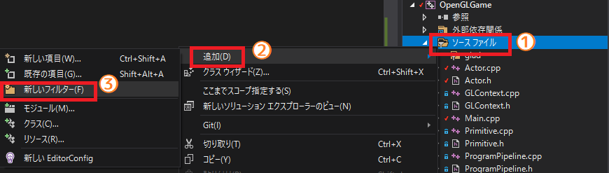
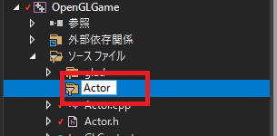
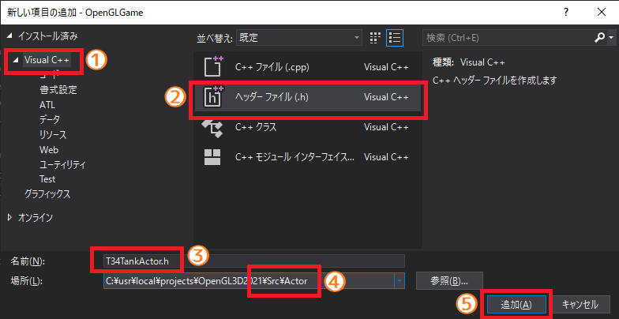
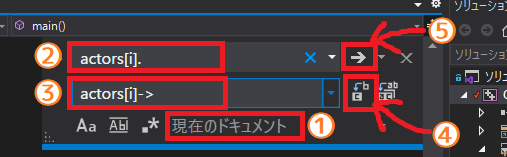
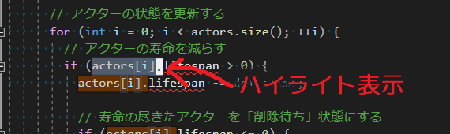
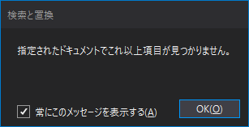
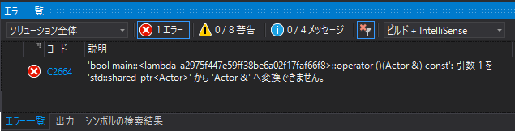
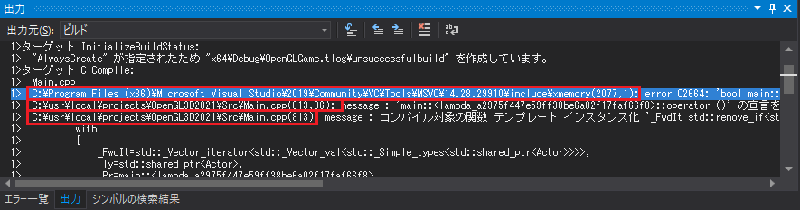

[OpenGL 3D 2021 第11回]

# ポリモーフィズムと仮想関数

## 習得目標

* 仮想関数によってポリモーフィズムを実現する方法を理解する。
* 
* 

## 1. 構造体からクラスへ

### 1.1 仮想関数は派生クラスで上書きできる

現在、弾がT-34戦車に当たったことを判定するために、アクターの名前を調べています。しかし、「文字列を比較する」操作は時間がかかります。アクターの種類が増えて、たくさんの名前を判定するようになると、衝突判定にかかる時間がどんどん長くなってしまいます。

そこで、アクター自身に「衝突した時に実行するメンバ関数→衝突処理関数」を持たせることにします。つまり、アクター自身に処理を任せるわけです。

これによって、衝突を判定するプロうグラムは、衝突したアクターの持っている関数を実行するだけで済むようになります。いちいち名前を調べる必要はありません。

この方法を実現するために、C++の「仮想関数(かそうかんすう)」という仕組みを使うことにします。「仮想関数」は基底クラスのメンバ関数を派生クラスで上書きする仕組みです。

>「基底クラスのメンバ関数を派生クラスで上書きすること」を「オーバーライド」といいます。

今回の場合、基底クラスは`Actor`クラスになります。仮想関数を使うには、基底クラスに「上書き可能なメンバ関数」を用意しなくてはなりません。メンバ関数を「上書き可能」にするには、関数宣言の先頭に`virtual`(バーチャル)キーワードを追加します。

それと、これは慣習的なものですが、仮想関数を持たせる対象は構造体よりクラスのほうがふさわしいです。C++では伝統的に「メンバ関数を持たない単純なデータ型は構造体、それ以外の複雑なデータ型はクラス」という使い分けがされてきたためです。

仮想関数は当然メンバ関数でもあるわけで、「仮想関数を持つデータ型はクラスにするべき」ということになります。そこで、`Actor`を構造体からクラスに変更します。

それでは`Actor`に変更を加えましょう。メンバ関数名は`OnCollision`(オン・コリジョン)とします。Actor.h`を開き、`Actor`構造体の定義を次のように変更してください。

>**【onは動詞じゃないのに関数名に使ってもいいの？】**<br>
>`on`で始まる関数は、「関数名は動詞で始める」という基本ルールの例外です。「何かが起きた時に受動的に呼び出される」関数の場合に`on`で始まる名前を付けます。この場合の`on`は「～の状態にある、～したとき」という意味になります。
>例えば`OnCollision`は「衝突したとき」という意味です。衝突した時にどんな処理を行うかはクラスや状況次第なので、あえて名前をつけるなら`DoSomethingOnCollision`(ドゥ・サムシング・オン・コリジョン、衝突時に何かをする)などでしょうか。
>しかし、「何かをする」という文の情報量はゼロです。プログラマは無意味な名前を嫌う傾向があるため、`on`から後ろだけを関数名として残すようになったのです。
>とはいえ、`on`で始まる関数名は例外的なものです。通常は「関数名は動詞で始める」という基本ルールにしたがってください。

```diff
 * 物体を制御するパラメータ.
 */
-struct Actor
+class Actor
 {
+public:
+  virtual void OnCollision(const struct Contact& contact);
+
   std::string name;                // アクターの名前
   Primitive prim;                  // 描画するプリミティブ
```

オンコリジョン関数は、引数としてコンタクト構造体を受け取るようにしました。コンタクト構造体には、衝突を処理するときに必要となる、衝突に関するさまざまな情報がはまとめられているからです。

オンコリジョン関数は上書きされることが前提の関数ですが、基底クラスにも定義は必要です。建物や地面のように「衝突しても特に何も行わない」アクターの場合、上書きすることはないからです。`Actor.cpp`を開き、次のプログラムを追加してください。

```diff
 #include "Actor.h"
 #include <iostream>
+
+/**
+* 衝突を処理する
+*
+* @param contact 衝突情報
+*/
+void Actor::OnCollision(const struct Contact& contact)
+{
+  // 何もしない
+}

 /**
 * 物体を描画する.
```

>「仮想関数」は派生クラスでメンバ関数を上書きできる仕組み。
>メンバ関数を「上書き可能」にする、つまり仮想関数にするには、メンバ関数宣言の先頭に`virtual`キーワードを付ける。

### 1.2 コンストラクタとデストラクタを定義する

仮想関数の真の力を発揮するには`new`を使ってオブジェクトを作成する必要があります。仮想関数を持つクラスを`new`で作成するには、コンストラクタとデストラクタを定義しなくてはなりません。定義しなくてもビルドエラーにはなりませんが、実行時にエラーが起きます。

`Actor.h`を開き、次のプログラムを追加してください。

```diff
 class Actor
 {
 public:
+  Actor(
+    const std::string& name,
+    const Primitive& prim,
+    std::shared_ptr<Texture> tex,
+    const glm::vec3& position,
+    const glm::vec3& scale,
+    float rotation,
+    const glm::vec3& adjustment);
+
+  virtual ~Actor() = default;
   virtual void OnCollision(const struct Contact& contact);

   std::string name;                // アクターの名前
   Primitive prim;                  // 描画するプリミティブ
```

デストラクタにくっついている`= default`(イコール・デフォルト)は、「定義をコンパイラに作らせる」ことを指示する記法です。コンストラクタとデストラクタにだけ使うことができて、「定義が必要だが、特にやることはない」場合に指定します。

>**【引数に`const&`を付ける場合、付けない場合】**<br>
>`const&`を付けない場合、引数には元の変数がコピーされます。いくつもメンバ変数を抱えている型の場合、コピーに時間が取られることになります。`const&`を付けると「参照(内部的にはポインタと同じ)」になるのでコピーは行われません。コピーしないので、時間を節約できます。付ける、付けないの使い分けは以下のルールに従います。
>
>1. `int`や`float`など、最初から使える型(組み込み型)の場合は`const&`を付けません。
>2. それ以外の型は全て`const&`を付けます。
>
>組み込み型に`const&`を付けないのは、データが小さいためコピーにかかる時間を無視できるからです。組み込み型でなくても、ある型が十分に小さい、例えばメンバ変数が`int`ひとつだけの場合、は`const&`を付けないという選択もありえます。しかし、今現在は小さな型だとしても、あとからメンバ変数が追加されるかもしれません。メンバ変数を追加したり削除したりするたびに`const&`を付けたり外したりするのはバグのもとですから、組み込み型以外は最初から`const&`を付けておくほうが安全です。

さて、デストラクタはともかく、コンストラクタには引数があるのでちゃんと定義する必要があります。といっても、やることは引数をメンバ変数に代入するだけですが。`Actor.cpp`を開き、次のプログラムを追加してください。

```diff
 #include "Actor.h"
 #include <iostream>
+
+/**
+* コンストラクタ
+*/
+Actor::Actor(
+  const std::string& name,
+  const Primitive& prim,
+  std::shared_ptr<Texture> tex,
+  const glm::vec3& position,
+  const glm::vec3& scale,
+  float rotation,
+  const glm::vec3& adjustment) :
+  name(name),
+  prim(prim),
+  tex(tex),
+  position(position),
+  scale(scale),
+  rotation(rotation),
+  adjustment(adjustment)
+{
+}

 /**
 * 衝突を処理する
```

メンバ変数の初期化には「メンバ初期化子(しょきかし)リスト」を使います。メンバ初期化子リストは引数リスト末尾の閉じカッコのあとに`:`を付けると、そこから関数先頭の`{`までは「メンバ初期化子リスト」になります。

メンバ初期化子リストでは`メンバ変数名(引数リスト)`の形式で書くことで、メンバ変数のコンストラクタが呼び出されます。メンバ初期化子リストと普通の代入の違いは次のとおりです。

|   | 初期化子リスト | 代入 |
|:--|:--------------:|:----:|
| **実行される機能** | コンストラクタ | 代入演算子 |
| **const変数の初期化** | ○ | ☓ |

上の表にあるように、メンバ初期化子リストは「コンストラクタによる初期化」、「const変数の初期化」が可能です。C++にメンバ初期化子リストが追加された理由は、代入演算子ではこの2つを実現できないためです。

なお、大抵の場合はどちらの方法を使っても同じように初期化できます。しかし、できるだけメンバ初期化子リストを使ってください。初期化専用の機能だけあって、代入演算子より初期化が速く完了する場合が多いからです。

### 1.3 T34TankActorクラスを定義する

`Actor`クラスの派生クラスとして`T34TankActor`(ティー・さんじゅうよん・タンク・アクター)クラスを作成します。今回は、ファイルを作成するフォルダを

>プロジェクトの`Src\Actor`フォルダ

に変更します。`Src`フォルダにファイルが増えてきたので、フォルダを分けないと必要なファイルを見つけづらくなるからです。

それではソリューションエクスプローラーの`ソースファイル`フィルタを右クリックし(①)、「追加→新しいフィルター」を選択肢てください(②, ③)。

<p align="center">
<br>
</p>

新しいフィルタが追加されるので、名前を`Actor`にしてください。

<p align="center">
<br>
</p>

それではヘッダファイルを追加しますが、追加先フォルダが違うので注意してください。ファイル名は`T34TankActor.h`とします。`Actor`フィルタを右クリックし、「追加→新しい項目」を選択して「新しい項目の追加」ウィンドウを開きます。

<p align="center">
<br>
</p>

左側のリストに有る「Visual C++」をクリックし(①)、次に中央の「ヘッダファイル(.h)」をクリックします(②)。そして、名前欄に`T34TankActor.h`と入力してください(③)。次に、場所欄を「プロジェクトフォルダ」の「`Src\Actor`」に変更してください(④)。

>場所が「プロジェクトフォルダの`Src\Actor`」になっていることを確認すること。今後、`Actor`クラスの派生クラスは`Src\Actor`に追加していきます。

名前と場所を設定したら、OKボタンをクリックしてファイルを作成します(⑤)。

それでは`T34TankActor`クラスを定義しましょう。作成した`T34TankActor.h`を開き、次のプログラムを追加してください。`Actor`クラスをコピー&ペーストして名前を変えると簡単にできると思います(名前の変え忘れに注意!)。

```diff
+/**
+* @file T34TankActor.h
+*/
+#ifndef T34TANKACTOR_H_INCLUDED
+#define T34TANKACTOR_H_INCLUDED
+#include "../Actor.h"
+
+/**
+* T-34戦車
+*/
+class T34TankActor : public Actor
+{
+public:
+  T34TankActor(
+    const std::string& name,
+    const Primitive& prim,
+    std::shared_ptr<Texture> tex,
+    const glm::vec3& position,
+    const glm::vec3& scale,
+    float rotation,
+    const glm::vec3& adjustment);
+
+  virtual ~T34TankActor() = default;
+  virtual void OnCollision(const struct Contact& contact) override;
+};
+
+#endif // T34TANKACTOR_H_INCLUDED
```

これで「T-34戦車を表すアクタークラス」を定義することができました。

>**【override(オーバーライド)キーワード】**<br>
>`override`キーワードには「基底クラスの仮想関数を上書きしない場合はエラーを表示する」という効果があります。仮想関数を上書きするときは、戻り値型、関数名、引数型の3つが基底クラスの仮想関数と同じでなければなりません。しかし、C++11より前は、それらをうっかり間違えてしまってもエラーにはなりませんでした。この間違いによるバグは見つけづらいため、正しく上書きすることを強制するために`override`キーワードが追加されました。なお、`override`キーワードを付けなくてもビルドエラーにはなりません。しかし、これは古いプログラムを保護するための措置なので、みなさんが仮想関数を上書きするときは必ず`override`キーワードを付けてください。

### 1.4 T34TankActorのメンバ関数を定義する

次に`T34TankActor`のメンバ関数を定義していきます。プロジェクトの`Res\Actor`フォルダに`T34TankActor.cpp`というCPPファイルを追加してください。追加したファイルを開き、次のプログラムを追加してください。

```diff
+/**
+* @file T34TankActor.cpp
+*/
+#include "T34TankActor.h"
+
+/**
+* コンストラクタ
+*/
+T34TankActor::T34TankActor(
+  const std::string& name,
+  const Primitive& prim,
+  std::shared_ptr<Texture> tex,
+  const glm::vec3& position,
+  const glm::vec3& scale,
+  float rotation,
+  const glm::vec3& adjustment) :
+  Actor(name, prim, tex, position, scale, rotation, adjustment) // 基底クラスを初期化
+{
+}
```

基底クラスを初期化するには、メンバ初期化子リストで基底クラスのコンストラクタを呼び出します。

続いてオンコリジョン関数を定義します。コンストラクタの定義の下に、次のプログラムを追加してください。

```diff
   Actor(name, prim, tex, position, scale, rotation, adjustment) // 基底クラスを初期化
 {
 }
+
+/**
+* 衝突を処理する
+*
+* @param contact 衝突情報
+*/
+void T34TankActor::OnCollision(const struct Contact& contact)
+{
+}
```

このメンバ関数に、T-34戦車の衝突に関する処理をコピーします。`Main.cpp`を開き、次のプログラムを切り取ってください。

```diff
               if (contact.penLength > itr->penLength) {
                 *itr = contact;
               }
             }
-
-            // T-34戦車と弾の衝突を処理する
-            if (actors[a].name == "T-34" && actors[b].name == "Bullet") {
-              // T-34戦車の耐久値を減らす
-              actors[a].health -= 1;
-              if (actors[a].health <= 0) {
-                actors[a].isDead = true; // T-34戦車を消去する
-              }
-              actors[b].isDead = true; // 弾を消去する
-            }
           }
         }
       }

       // 重なりを解決する
```

`T34TankActor.cpp`を開き、オンコリジョン関数に貼り付けてください。

```diff
 * @param contact 衝突情報
 */
 void T34TankActor::OnCollision(const struct Contact& contact)
 {
+
+            // T-34戦車と弾の衝突を処理する
+            if (actors[a].name == "T-34" && actors[b].name == "Bullet") {
+              // T-34戦車の耐久値を減らす
+              actors[a].health -= 1;
+              if (actors[a].health <= 0) {
+                actors[a].isDead = true; // T-34戦車を消去する
+              }
+              actors[b].isDead = true; // 弾を消去する
 }
```

行頭の空白がそのままだと不格好なので、メニューから「編集→詳細→ドキュメントのフォーマット」を選択してください。空白の数が整理されます。

空白を整理したらプログラムを修正します。貼り付けたプログラムにおいて、`actors[a]`はT-34戦車、つまり自分自身を表しています。この場合は単に削除します。オンコリジョン関数を次のように変更してください。

>**【-行と+行の共通部分を残す】**<br>
>`-`行と`+`行の違いを注意深く観察し、できるだけ共通部分を残して`+`行に変えることを心がけてください。
>そのうえで、「なぜこのように変更したのか」を考えながら変更していってください。
>「`-`行を消してから、改めて`+`行を書く」というやりかたでは変更点に気づけないので、プログラムを理解することが難しくなります。

```diff
 void T34TankActor::OnCollision(const struct Contact& contact)
 {
-
   // T-34戦車と弾の衝突を処理する
-  if (actors[a].name == "T-34" && actors[b].name == "Bullet") {
+  if (name == "T-34" && actors[b].name == "Bullet") {
     // T-34戦車の耐久値を減らす
-    actors[a].health -= 1;
-    if (actors[a].health <= 0) {
-      actors[a].isDead = true; // T-34戦車を消去する
-    }
+    health -= 1;
+    if (health <= 0) {
+      isDead = true; // T-34戦車を消去する
     }
     actors[b].isDead = true; // 弾を消去する
 }
```

`actors[b]`は衝突した相手を表しています。これは`contact`構造体のメンバ変数`b`に当たります。`actors[b]`を次のように変更してください。

```diff
 void T34TankActor::OnCollision(const struct Contact& contact)
 {
   // T-34戦車と弾の衝突を処理する
-  if (name == "T-34" && actors[b].name == "Bullet") {
+  if (name == "T-34" && contact.b->name == "Bullet") {
     // T-34戦車の耐久値を減らす
     health -= 1;
     if (health <= 0) {
       isDead = true; // T-34戦車を消去する
     }
-    actors[b].isDead = true; // 弾を消去する
+    contact.b->isDead = true; // 弾を消去する
 }
```

それから、このメンバ関数が呼ばれたということは`name == "T-34"`は確定なので、消すことができます。自分の名前を確認するプログラムを消してください。

```diff
 void T34TankActor::OnCollision(const struct Contact& contact)
 {
   // T-34戦車と弾の衝突を処理する
-  if (name == "T-34" && contact.b->name == "Bullet") {
+  if (contact.b->name == "Bullet") {
     // T-34戦車の耐久値を減らす
     health -= 1;
```

これでT-34戦車と弾が衝突したときのプログラムを、オンコリジョン関数に移動することができました。

### 1.5 T34TankActorクラスを使う

それでは作成した`T34TankActor`クラスを使ってみましょう。とにかく`Main.cpp`にヘッダファイルをインクルードしなくては始まりません。`Main.cpp`を開き、`T34TankActor.h`のインクルード文を追加してください。

```diff
 #include "Texture.h"
 #include "Sampler.h"
 #include "Actor.h"
+#include "Actor/T34TankActor.h"
 #include <glm/gtc/matrix_transform.hpp>
 #include <GLFW/glfw3.h>
```

これで`T34TankActor`クラスが使えるようになりました。T-34戦車を作成しているプログラム次のように変更してください。

```diff
     glm::vec3(0), glm::vec3(1), 0.0f, glm::vec3(0) });
   actors.back().collider = Box{ glm::vec3(-1.8f, 0, -1.8f), glm::vec3(1.8f, 2.8f, 1.8f) };

   // T-34戦車のパラメータ
-  actors.push_back(Actor{ "T-34", primitiveBuffer.Get(7), texTankT34,
+  actors.push_back(T34TankActor{ "T-34", primitiveBuffer.Get(7), texTankT34,
     glm::vec3(-5, 0, 0), glm::vec3(1), 0.0f, glm::vec3(0) });
   // T-34戦車に衝突判定を付ける
   actors.back().collider = Box{ glm::vec3(-1.5f, 0, -1.5f), glm::vec3(1.5f, 2.5f, 1.5f) };
```

それから、衝突した時にオンコリジョン関数を呼び出す必要があります。重なりを解決する`for`文に次のプログラムを追加してください。

```diff
       // 重なりを解決する
       for (int i = 0; i < contacts.size(); ++i) {
+        Contact& c = contacts[i];
+
+        // 衝突方向を逆にした衝突情報を作る
+        Contact contactBtoA;
+        contactBtoA.a = c.b;
+        contactBtoA.b = c.a;
+        contactBtoA.velocityA = c.velocityB;
+        contactBtoA.velocityB = c.velocityA;
+        contactBtoA.accelA = c.accelB;
+        contactBtoA.accelB = c.accelA;
+        contactBtoA.penetration = -c.penetration;
+        contactBtoA.normal = -c.normal;
+        contactBtoA.position = c.position;
+        contactBtoA.penLength = c.penLength;
+
+        // 衝突処理関数を呼び出す
+        c.a->OnCollision(c);
+        c.b->OnCollision(contactBtoA);
+
-        SolveContact(contacts[i]);
+        SolveContact(c);
       }
```

<pre class="tnmai_assignment">
<strong>【課題01】</strong>
他の2両のT-34戦車について、<code>T34TankActor</code>クラスを使うように変更しなさい。
</pre>

課題01が完了したら、ビルドして実行してください。T-34戦車に弾を当てると…弾は消えないし、何発当ててもT-34戦車を倒すことはできなくなっていると思います。これは、オンコリジョン関数が呼ばれていないということです。

### 1.6 actors配列をシェアードポインタの配列にする

`T34TankActor`クラスのオンコリジョン関数が呼ばれないのは、

>`actors`配列は<ruby>飽<rt>あ</rt></ruby>くまで`Actor`クラスの配列なので、`Actor`クラス以外のデータは格納できないから

です。これが何故「オンコリジョン関数が呼ばれないこと」に関係するのかを理解するには、派生クラスの構造を知る必要があります。派生クラスの構造は

>基底クラス + 派生クラスで追加した部分

というようになっています。例えば`T34TankActor`コンストラクタを実行すると

>`Actor`クラス + `T34TankActor`クラスで追加した部分

というオブジェクトが作られます。さて、このオブジェクトを`actors`配列に`push_back`したとします。`actors`配列には`Actor`クラスしか格納できないため、「`Actor`クラス」の部分だけが格納されます。

では「`T34TankActor`クラスで追加した部分」はどうなるのかというと、単に捨てられます。このとき、仮想関数の上書きもなかったことになります。`T34TankActor`クラスで上書きしたオンコリジョン関数が呼ばれなかったのはこのためです。

さて、上書きしたオンコリジョン関数が呼ばれるようにするには、「派生クラスで追加した部分」が残るようにしなくてはなりません。これを実現する方法は、

>`actors`を`Actor`クラスへのポインタ配列にする

です。`Actor`クラスのポインタに入れられるのは「`Actor`クラス」のアドレスだけですが、アドレスの代入では「派生クラスで追加した部分」は維持されます。つまり「仮想関数を上書きした」という情報も残るわけです。

それでは`actors`をポインタ配列に変更しましょう。ポインタ型にはもちろんシェアードポインタを使います。`Main.cpp`を開き、`actors`配列の定義を次のように変更してください。

```diff
   { 0, 0, 0, 0, 0, 0, 0, 0, 0, 0, 0, 0, 0, 0, 1, 1},
   { 0, 0, 0, 0, 0, 0, 0, 0, 0, 0, 0, 0, 0, 0, 1, 3},
 };

 // アクターの配列.
-std::vector<Actor> actors;
+std::vector<std::shared_ptr<Actor>> actors;

 /**
 * OpenGLからのメッセージを処理する.
```

### 1.7 .を->に置き換える

ポインタ配列に変えたことで、`actors`を使っている部分の大半がエラーになっているはずです。これらのエラーに対処していきます。

「値」から「ポインタ」に変更したので、メンバを参照する部分を`.`から`->`を使うように変更しなくてはなりません。

`.`を使っている部分は大量にありますが、どれも`actors[?].`という形で、`?`の部分が`i`だったり`a`だったりするだけです。同じテキストを全て書き換えたい場合、`Ctrl+H`による「クイック置換(ちかん)」が便利です。

実際にやってみましょう。`Ctrl`キーを押しながら`H`キーを押して、「クイック置換ウィンドウ」を表示します。

<p align="center">

</p>

>①置き換える範囲<br>
>②検索する(置き換え前の)語句<br>
>③置き換え後の語句<br>
>④「次を置換」ボタン(押すと置き換えを実行)<br>
>⑤「次を検索」ボタン(押すと置き換えをスキップ)<br>

クイック置換ウィンドウを開いたら、①の部分が「現在のドキュメント」になっていることを確認してください。もし「現在のプロジェクト」や「ソリューション全体」が選ばれていると、意図しない範囲まで置き換えられてしまいます。「現在のドキュメント」以外になっている場合はクリックして「現在のドキュメント」を選択してください。

次に②に「検索する語句」を入力します。今回の場合は`actors[i].`と入力してください(ドットを忘れないように)。続いて③に「置き換え後の語句」を入力します。今回は`.`を`->`に変えたいので`actors[i]->`と入力してください。

この時点で、最初に見つかった「置き換える語句」がハイライト表示されていると思います。ハイライト表示されていない場合、②の欄に入力した語句が間違っていないか確認してください。

<p align="center">

</p>

置き換え前の語句(②)と置き換え後の語句(③)を入力したら、④の「置き換えボタン」をクリックします。すると、ハイライト表示された語句が置き換えられます。そして、次の語句にハイライトが移動します。

<pre class="tnmai_assignment">
<strong>【課題02】</strong>
「次を置換」ボタンを使って、<code>actors[i].</code>の<code>.</code>演算子を、全て<code>-></code>演算子に置き換えなさい。
</pre>

すべての語句を置き換えると、以下のウィンドウが表示されます。

<p align="center">

</p>

これが表示されたら置き換えは完了です。

<pre class="tnmai_assignment">
<strong>【課題03】</strong>
クイック置換機能(Ctrl+H)を使って、<code>actors[a].</code>と<code>actors[b].</code>の<code>.</code>演算子を、全て<code>-></code>演算子に置き換えなさい。
</pre>

### 1.8 back().をback()->に置換する

次に、`back().`構文によってアクターのメンバを参照している部分を、`->`演算子を使うように置き換えます。Ctrl+Hでクイック置換ウィンドウを開き、次のように設定してください。

>検索語句: `actors.back().`<br>
>置換後の語句: `actors.back()->`<br>

<pre class="tnmai_assignment">
<strong>【課題04】</strong>
「次を置換」ボタンを使って、<code>actors.back().</code>を全て<code>actors.back()-></code>に置き換えなさい。
</pre>

### 1.9 アクターをnewで作成する

アクターを作成して`push_back`しているプログラムを修正します。これもクイック置換機能(Ctrl+H)を使います。クイック置換ウィンドウを開き、次のように設定してください。

>検索語句: `push_back(Actor{`<br>
>置換後の語句: `push_back(std::shared_ptr<Actor>(new Actor{`<br>

<pre class="tnmai_assignment">
<strong>【課題04】</strong>
「次を置換」ボタンを使って、全ての<code>push_back(Actor{</code>を<code>push_back(std::shared_ptr&lt;Actor&gt;(new Actor{</code>に置き換えなさい。
</pre>

課題04の置き換えによって`(`がひとつ増えています。そのため、対応する`)`を追加しなくてはなりません。クイック置換機能で`)`を追加することもできますが、誤った場所を置き換えてしまったり、空白の有無などで置き換え漏れが出る可能性があります。面倒ですが、ひとつひとつ手作業で確認して修正するほうがよいでしょう。

<pre class="tnmai_assignment">
<strong>【課題05】</strong>
<code>push_back(std::shared_ptr&lt;Actor&gt;(new Actor{</code>に置き換えた部分について、末尾(<code>;</code>の直前)に閉じカッコ<code>)</code>を追加して、エラーを解消しなさい。
エラー箇所を見つけるには<code>std::shared_ptr&lt;Actor&gt;</code>で検索するとよいでしょう。
</pre>

`T34TankActor`を作成している部分は少ないはずなので、手動で置き換えていきます。T-34戦車のパラメータを設定するプログラムを、次のように変更してください。

```diff
     glm::vec3(0), glm::vec3(1), 0.0f, glm::vec3(0) });
   actors.back().collider = Box{ glm::vec3(-1.8f, 0, -1.8f), glm::vec3(1.8f, 2.8f, 1.8f) };

   // T-34戦車のパラメータ
-  actors.push_back(T34TankActor{ "T-34", primitiveBuffer.Get(7), texTankT34,
-    glm::vec3(-5, 0, 0), glm::vec3(1), 0.0f, glm::vec3(0) });
+  actors.push_back(std::shared_ptr<Actor>(new T34TankActor{
+    "T-34", primitiveBuffer.Get(7), texTankT34,
+    glm::vec3(-5, 0, 0), glm::vec3(1), 0.0f, glm::vec3(0) }));
   // T-34戦車に衝突判定を付ける
   actors.back().collider = Box{ glm::vec3(-1.5f, 0, -1.5f), glm::vec3(1.5f, 2.5f, 1.5f) };
```

ここでの変更は以下の2点だけです(改行が増えているのは紙幅の都合です)。

>* 先頭に`std::shared_ptr<Actor>(new `を追加。
>* `;`の前に`)`を追加。

これで、`std::shared_ptr`と`new`を使って、T-34戦車が作成されるようになりました。

<pre class="tnmai_assignment">
<strong>【課題06】</strong>
他の2両のT-34戦車について、<code>std::shared_ptr&lt;Actor&gt;</code>と<code>new</code>を使って作成するように変更しなさい。
</pre>

### 1.9 Find関数をポインタに対応させる

次に対処するエラーは`Find`関数の引数です。対処する方法はいくつか考えられます。

>1. `Find`関数自体をシェアードポインタに対応させる。
>2. 新たにシェアードポインタ版の`Find`関数を作成する。
>3. 呼び出し側で既存の`Find`関数を使えるように工夫する。

どの方法も一長一短です。が、今回は一番ラクに対応できる1の方法にします。シェアードポインタに変更した以上、今後`std::vector<Actor>`型を使うことはないと考えられるため、既存の`Find`関数を残しておく意味が薄いからです。

まずシェアードポインタを使えるようにヘッダファイルをインクルードします。`Actor.h`を開き、次のインクルード文を追加してください。

```diff
 #include "ProgramPipeline.h"
 #include <string>
 #include <vector>
 #include <glm/glm.hpp>
+#include <memory>

 /**
 * 直方体.
```

次に、`Find`関数の宣言を次のように変更してください。

```diff
   glm::mat4 matProj,               // 描画に使うプロジェクション行列
   glm::mat4 matView);              // 描画に使うビュー行列  

-Actor* Find(std::vector<Actor>& actors, const char* name);
+Actor* Find(std::vector<std::shared_ptr<Actor>>& actors, const char* name);

 /**
 * 衝突情報
```

続いて`Actor.cpp`を開き、`Find`関数の定義を次のように変更してください。

```diff
 * @retval nullptr以外 最初にnameと名前の一致したアクター.
 * @retval nullptr     actorsの中に名前の一致するアクターがない.
 */
-Actor* Find(std::vector<Actor>& actors, const char* name)
+Actor* Find(std::vector<std::shared_ptr<Actor>>& actors, const char* name)
 {
   for (int i = 0; i < actors.size(); ++i) {
-    if (actors[i].name == name) {
-      return &actors[i];
+    if (actors[i]->name == name) {
+      return actors[i].get();
     }
   }
   return nullptr;
 }
```

シェアードポインタから通常のポインタを取得するには`get`(ゲット)メンバ関数を使います。

<pre class="tnmai_code"><strong>【書式】</strong><code>
ポインタ std::shared_ptr<T>::get() const;
</code></pre>

これで`Find`関数をシェアードポインタに対応させることができました。

>**【シェアードポインタを通常のポインタに戻す(別解)】**<br>
>`&*actors[i]`と書いても通常のポインタを取得できます。これは「一旦`*`で参照に変換し、改めて`&`でアドレスを取得する」という手順になっています。慣れないと理解しづらいため、基本的には`get`メンバ関数を使ってください。

### 1.10 弾をシェアードポインタにする

弾の作成でエラーが起きています。弾を作成するプログラムを次のように変更してください。

```diff
           // 発射位置を砲の先端に設定
           glm::vec3 position = tank->position + tankFront * 6.0f;
           position.y += 2.0f;

-          Actor bullet = { "Bullet", primitiveBuffer.Get(9), texBullet,
-            position, glm::vec3(0.25f), tank->rotation, glm::vec3(0) };
+          std::shared_ptr<Actor> bullet(new Actor{
+            "Bullet", primitiveBuffer.Get(9), texBullet,
+            position, glm::vec3(0.25f), tank->rotation, glm::vec3(0) });

           // 1.5秒後に弾を消す
           bullet.lifespan = 1.5f;
```

<pre class="tnmai_assignment">
<strong>【課題07】</strong>
<code>bullet</code>変数について、<code>.</code>演算子を<code>-></code>演算子に置き換えてエラーを修正しなさい。
</pre>

### 1.11 アクターの描画をシェアードポインタに対応させる

最後のエラーは`Draw`関数の呼び出しです。`Draw`関数については呼び出し側を修正することにします。理由は`Draw`関数を修正するよりも簡単だからです。`Main.cpp`にあるアクターを描画するプログラムを、次のように変更してください。

```diff
     // アクターを描画する
     for (int i = 0; i < actors.size(); ++i) {
-      Draw(actors[i], pipeline, matProj, matView);
+      Draw(*actors[i], pipeline, matProj, matView);
     }

     // マップに配置する物体の表示データ.
     struct ObjectData {
```

### 1.12 アクターの削除をシェアードポインタに対応させる

表示上はエラーが無くなったように見えるので、一度ビルドしてみましょう。すると以下のようなエラーが表示されてビルドに失敗します。

<p align="center">
<br>
</p>

エラーメッセージをダブルクリックするとC++標準ライブラリの中が表示されますが、今回のエラーの原因はライブラリではありません。「エラー一覧」ウィンドウは役に立たないので「出力」ウィンドウを確認してみましょう。

<p align="center">
<br>
</p>

出力ウィンドウで注目するべきは「ファイル名」です。ほとんどの場合、表示されるファイル名が自分の作ったファイルになっている行が本当の原因です。

ファイル名が`Main.cpp`になっている行をダブルクリックしてください。すると「本当の原因」のある行が表示されます。今回の場合、それは「アクターを削除する」プログラムです。

プログラムをよく見ると、ラムダ式の引数が`Actor&`になっています。しかし`actors`配列の要素の型は`std::shared_ptr<Actor>`に変わっているので、型が違うというエラーが出ているわけです。

そういうことなので、対処法は`Actor`を`std::shared_ptr<Actor>`に置き換えることです。アクターを削除するプログラムを次のように変更してください。

```diff
       // 削除待ちのアクターを削除する
       actors.erase(
         std::remove_if(
-          actors.begin(), actors.end(), [](Actor& a) { return a.isDead; }),
+          actors.begin(), actors.end(),
+            [](const std::shared_ptr<Actor>& a) { return a->isDead; }),
         actors.end());

       // カメラデータを更新する
       {
```

プログラムが書けたらビルドしてください。今度こそエラーがなくなっているはずです。それから、`actors`をシェアードポインタ配列にしたことで、オンコリジョン関数も動作するようになっていると思います。T-34戦車を撃って壊せるかどうか、試してみてください。弾が反射せず、T-34戦車を壊すことができたら成功です。

今後、アクターが衝突したときに特別な処理をさせたくなったら、アクタークラスの派生クラスを作成して、オンコリジョン関数をオーバーライドすればOKです。

>**【1章のまとめ】**<br>
>
>* 
>* 

<div style="page-break-after: always"></div>

## 2. 

### 2.1 <ruby>OnUpdate<rt>オン・アップデート</rt></ruby>仮想関数を追加する

現在のプログラムで「アクターごとに処理が違う」部分は「アクターの作成」、「アクターの衝突」、そして「アクターの更新」です。「アクターの作成」を仮想関数にすることはできません。メンバ関数は、クラスを初期化したあとでなくては使えないからです。

そうすると、仮想関数にできるのは「アクターの更新」だけです。第2章では「アクターの更新」を仮想関数にしていきます。

また、「アクターの更新」プログラムはメインループのかなりの部分を占めています。仮想関数として分離することで、残ったメインループが読みやすくなる、という効果も期待できるでしょう。

まずは基底クラスに仮想関数を追加しましょう。関数名は`OnUpdate`(オン・アップデート)とします。`Actor.h`を開き、`Actor`クラスの定義に次のプログラムを追加してください。

```diff
     const glm::vec3& adjustment);

   virtual ~Actor() = default;
+  virtual void OnUpdate(float deltaTime);
   virtual void OnCollision(const struct Contact& contact);
 
   std::string name;                // アクターの名前
```

次に`Actor.cpp`を開き、コンストラクタの定義の下に、オンアップデート関数の定義を追加してください。

```diff
   adjustment(adjustment)
 {
 }
+
+/**
+* アクターの状態を更新する
+*
+* @param deltaTime 前回の更新からの経過時間(秒)
+*/
+void Actor::OnUpdate(float deltaTime)
+{
+  // 何もしない
+}

 /**
 * 衝突を処理する
```

これで上書きされる関数は用意できました。次はオンアップデート関数を呼び出すプログラムを追加しましょう。アクターを更新する関数なので、実際にアクターの状態を更新している部分に追加します。

`Main.cpp`を開き、アクターの状態を更新するプログラムに次のプログラムを追加してください。

```diff
             actors[i]->isDead = true;
             continue; // 削除待ちアクターは更新をスキップ
           }
         }
+
+        actors[i]->OnUpdate(deltaTime);

         // エレベーターの移動方向を切り替える
         if (actors[i].name == "Elevator") {
           // 高さ4mに到達したら、移動方向を下にする
```

### 2.2 T-34戦車のOnUpdate関数を定義する

現在、仮想関数で置き換えられそうなプログラムは以下の3つです。

>* タイガーI戦車を移動させるプログラム。
>* T-34戦車を移動させるプログラム。
>* エレベーターを移動させるプログラム。

最終的には全て仮想関数にしたいところですが、とりあえず、既にクラスを定義しているT-34戦車から手を付けることにします。`T34TankActor.h`を開き、次のプログラムを追加してください。

```diff
     float rotation,
     const glm::vec3& adjustment);
 
   virtual ~T34TankActor() = default;
+  virtual void OnUpdate(float deltaTime) override;
   virtual void OnCollision(const struct Contact& contact) override;
 };

 #endif // T34TANKACTOR_H_INCLUDED
```

次に`T34TankActor.cpp`を開き、コンストラクタの定義の下に次のプログラムを追加してください。

```diff
   const glm::vec3& adjustment) :
   Actor(name, prim, tex, position, scale, rotation, adjustment)
 {
 }
+
+/**
+* アクターの状態を更新する
+*
+* @param deltaTime 前回の更新からの経過時間(秒)
+*/
+void T34TankActor::OnUpdate(float deltaTime)
+{
+}

 /**
 * 衝突を処理する
```

「T-34戦車を移動させるプログラム」をオンアップデート関数に移動します。このプログラムは`Main.cpp`にあります。アクターの状態を更新するプログラムは`Main.cpp`にしか書いていないので当然ですね。

アクターを移動させるということは、アクターの座標、ベロシティ、角度を変更するということです。ちょっと行数が多いですが、以下のプログラムを切り取って、`T34TankActor`クラスのオンアップデート関数に貼り付けてください。

```diff
             actors[i].position.y = -1;
             actors[i].velocity.y = 1;
           }
         }
-        // T-34戦車を移動させる
-        else if (actors[i]->name == "T-34") {
-          // 追跡対象アクターを検索
-          Actor* target = Find(actors, "Tiger-I");
-          if (target) {
-            // T-34戦車の正面方向のベクトルを計算
-            glm::mat4 matR = glm::rotate(glm::mat4(1), actors[i]->rotation, glm::vec3(0, 1, 0));
-                     ・
-                     ・
-                     ・
-              // yが0以上なら反時計回り、0未満なら時計回りに回転するほうが近い
-              if (n.y >= 0) {
-                actors[i]->rotation += glm::radians(90.0f) * deltaTime;
-              } else {
-                actors[i]->rotation -= glm::radians(90.0f) * deltaTime;
-              }
-            }
-          }
-        }
 
         // 速度に重力加速度を加える
         if (!actors[i]->isStatic) {
```

それでは貼り付けたプログラムを修正していきましょう。まず自分の名前を確認する必要はないので、名前を調べる部分を駆除します。オンアップデート関数を次のように変更してください。

```diff
 void T34TankActor::OnUpdate(float deltaTime)
 {
-        // T-34戦車を移動させる
-        else if (actors[i]->name == "T-34") {
           // 追跡対象アクターを検索
           Actor* target = Find(actors, "Tiger-I");
           if (target) {
```

対応する閉じカッコも消します。オンアップデート関数の末尾を次のように変更してください。

```diff
               } else {
                 actors[i]->rotation -= glm::radians(90.0f) * deltaTime;
               }
             }
           }
-        }
 }

 /**
 * 衝突を処理する
```

### 2.3 actors[i]->を消去する

ここで一度、空白の数を整理しておきましょう。メニューから「編集→詳細→ドキュメントのフォーマット」を選択してください。

…空白を整理できたら修正を続けましょう。貼り付けたプログラムは`actors[i]->name == "T-34"`が真の場合だけ実行されるプログラムでした。ということはプログラム中の`actors[i]`はT-34戦車自身を指しています。

メンバ関数の中では自分自身を`this`で表すので、貼り付けたプログラムの`actors[i]`は`this`で置き換えることができます。さらに`this`は省略できるので、単に`actors[i]->`を削除すれば`this`で置き換えたのと同じになります。

それでは、以下のように`actors[i]->`を削除してください。

```diff
   // 追跡対象アクターを検索
   Actor* target = Find(actors, "Tiger-I");
   if (target) {
     // T-34戦車の正面方向のベクトルを計算
-    glm::mat4 matR = glm::rotate(glm::mat4(1), actors[i]->rotation, glm::vec3(0, 1, 0));
+    glm::mat4 matR = glm::rotate(glm::mat4(1), rotation, glm::vec3(0, 1, 0));
     glm::vec3 t34Front = matR * glm::vec4(0, 0, 1, 1);

     // T-34戦車からタイガーI戦車へのベクトルdを計算
```

<pre class="tnmai_assignment">
<strong>【課題08】</strong>
オンアップデート関数に貼り付けたプログラムから、全ての<code>actors[i]-&gt;</code>を削除しなさい。
</pre>

### 2.4 GLMライブラリを使えるようにする

次は、GLMライブラリの`rotate`関数がエラーになる問題を解決しましょう。これは必要なヘッダファイルをインクルードすれば解決できます。どのファイルをインクルードする必要があるのかは、ライブラリのマニュアルやドキュメントから探します。

GLMライブラリはGitHubで管理されています。以下のURLでアクセスしてください。

`https://github.com/g-truc/glm`

上記のページにある`manual.md`というファイルが、GLMライブラリのマニュアルです。ファイル名をクリックするとマニュアルが表示されるので、`Ctrl+F`で検索ウィンドウを表示して、`rotate`を検索してください。すると、必要なヘッダファイルが見つかると思います。

<pre class="tnmai_assignment">
<strong>【課題09】</strong>
GLMライブラリのマニュアルから<code>rotate</code>関数に必要なヘッダファイルを調べ、<code>T34TankActor.cpp</code>にインクルードしなさい。
</pre>

### 2.5 T34TankActorクラスにタイガーI戦車のポインタを持たせる

最後に残った問題は、`T34TankActor`からは`Find`(ファインド)関数が使えないことです。

すぐに思いつく解決方法は、`Find`関数をどこからでも使えるようにすることです。「`Find`関数がどこからでも使える」というのは、別のクラスを作るときにも使えそうですし、ちょっと便利そうに思えます。

`Find`関数を改造する以外の方法はないでしょうか？

T-34戦車の移動処理において、`Find`関数を使う目的は「(プレイヤーの操作する)タイガーI戦車の情報を知るため」です。この目的は、例えば「コンストラクタの引数でタイガーI戦車のアドレスを受け取る」という方法でも実現できるはずです。

「タイガーI戦車のアドレスを受け取るためのメンバ関数を追加する」という方法も考えられますね。

これらを「プログラムの他の部分に対する影響の少なさ順」で並べると次のようになります。

| 方法 | 外部への影響 | 再利用性 | 作業量 |
|:-----|:-------------|:--------:|:------:|
| コンストラクタ引数の追加 | 低(コンストラクタ使用箇所のみ) | 低 | 少ない |
| メンバ関数の追加 | 中(いつでもメンバ関数を実行できる) | 中 | すこし多い |
| `Find`関数の改造 | 高(どこｋらでも`Find`を使える) | 高 | 多い |

複数の選択肢がある場合、どの方法が最も適切なのかは状況次第です。ですが、基本的には「より影響の少ない方法を選ぶ」べきです。

今回は基本に忠実に、もっとも外部への影響が少ない「コンストラクタ引数の追加」でいこうと思います。他の方法は必要になった時に実装すればよいでしょう。`T34TankActor.h`を開き、`T34TankActor`クラスの定義を次のように変更してください。

```diff
   T34TankActor(
     const std::string& name,
     const Primitive& prim,
     std::shared_ptr<Texture> tex,
     const glm::vec3& position,
     const glm::vec3& scale,
     float rotation,
-    const glm::vec3& adjustment);
+    const glm::vec3& adjustment,
+    const std::shared_ptr<Actor>& target);
 
   virtual ~T34TankActor() = default;
   virtual void OnUpdate(float deltaTime) override;
   virtual void OnCollision(const struct Contact& contact) override;
+
+private:
+  std::shared_ptr<Actor> target; // 追いかける対象のアクター
 };

 #endif // T34TANKACTOR_H_INCLUDED
```

次に`T34TankActor.cpp`を開き、コンストラクタの定義を次のように変更してください。

```diff
   const glm::vec3& position,
   const glm::vec3& scale,
   float rotation,
-  const glm::vec3& adjustment) :
-  Actor(name, prim, tex, position, scale, rotation, adjustment) // 基底クラスを初期化
+  const glm::vec3& adjustment,
+  const std::shared_ptr<Actor>& target) :
+  Actor(name, prim, tex, position, scale, rotation, adjustment), // 基底クラスを初期化
+  target(target)
 {
 }

 /**
 * アクターの状態を更新する
```

コンストラクタで「追跡対象のアクター」が設定されるようになったので、`Find`関数の呼び出しを削除することができます。オンアップデート関数を次のように変更してください。

```diff
 void T34TankActor::OnUpdate(float deltaTime)
 {
-  // 追跡対象アクターを検索
-  Actor* target = Find(actors, "Tiger-I");
+  // 追跡対象アクターが設定されている場合の処理
   if (target) {
     // T-34戦車の正面方向のベクトルを計算
     glm::mat4 matR = glm::rotate(glm::mat4(1), rotation, glm::vec3(0, 1, 0));
```

これで`T34TankActor`クラス側の変更は完了です。あとはコンストラクタを呼び出しているプログラムを変更すれば、`Find`関数の問題は解決です。

コンストラクタに追加した引数にはタイガーI戦車へのポインタが必要です。ということで、まずポインタを作ります。 `Main.cpp`を開き、タイガーI戦車を作成するプログラムを次のように変更してください。

```diff
   // 戦車のパラメータ
-  actors.push_back(std::shared_ptr<Actor>(new Actor{ primitiveBuffer.Get(6), texTank,
-    glm::vec3(0), glm::vec3(1), 0.0f, glm::vec3(0) }));
-  actors.back()->collider = Box{ glm::vec3(-2, 0, -2), glm::vec3(2, 3, 2) };
+  std::shared_ptr<Actor> playerTank(new Actor{ primitiveBuffer.Get(6), texTank,
+    glm::vec3(0), glm::vec3(1), 0.0f, glm::vec3(0) });
+  playerTank->collider = Box{ glm::vec3(-2, 0, -2), glm::vec3(2, 3, 2) };
+  actors.push_back(playerTank);

   // T-34戦車のパラメータ
   actors.push_back(std::shared_ptr<Actor>(new T34TankActor{
```

次に、`T34TankActor`を作成しているプログラムを次のように変更してください。

```diff
   // T-34戦車のパラメータ
   actors.push_back(std::shared_ptr<Actor>(new T34TankActor{
     "T-34", primitiveBuffer.Get(7), texTankT34,
-    glm::vec3(-5, 0, 0), glm::vec3(1), 0.0f, glm::vec3(0) }));
+    glm::vec3(-5, 0, 0), glm::vec3(1), 0.0f, glm::vec3(0), playerTank }));
   // T-34戦車に衝突判定を付ける
   actors.back().collider = Box{ glm::vec3(-1.5f, 0, -1.5f), glm::vec3(1.5f, 2.5f, 1.5f) };
```

プログラムが書けたらビルドして実行してください。T-34戦車が、オンアップデート関数を作成する前と同様にタイガーI戦車を追いかけてきたら成功です。

### 2.6 エレベーターをアクターの派生クラスにする

次は、エレベーターをアクターの派生クラスにします。クラス名は`ElevatorActor`とします。

プロジェクトの`Src\Actor`フォルダに`ElevatorActor.h`というヘッダファイルを追加してください。追加したファイルを開き、次のプログラムを追加してください。

```diff
+/**
+* @file ElevatorActor.h
+*/
+#ifndef ELEVATORACTOR_H_INCLUDED
+#define PLAYERACTOR_H_INCLUDED
+#include "../Actor.h"
+
+/**
+* エレベーター
+*/
+class ElevatorActor : public Actor
+{
+public:
+  ElevatorActor(
+    const std::string& name,
+    const Primitive& prim,
+    std::shared_ptr<Texture> tex,
+    const glm::vec3& position,
+    const glm::vec3& scale,
+    float rotation,
+    const glm::vec3& adjustment);
+
+  virtual ~ElevatorActor() = default;
+  virtual void OnUpdate(float deltaTime) override;
+};
+
+#endif // ELEVATORACTOR_H_INCLUDED
```

次に`Src\Actor`フォルダに`ElevatorActor.cpp`というCPPファイルを追加してください。追加したファイルを開き、次のプログラムを追加してください。

```diff
+/**
+* @file ElevatorActor.cpp
+*/
+#include "ElevatorActor.h"
+
+/**
+* コンストラクタ
+*/
+ElevatorActor::ElevatorActor(
+  const std::string& name,
+  const Primitive& prim,
+  std::shared_ptr<Texture> tex,
+  const glm::vec3& position,
+  const glm::vec3& scale,
+  float rotation,
+  const glm::vec3& adjustment) :
+  Actor(name, prim, tex, position, scale, rotation, adjustment) // 基底クラスを初期化
+{
+}
+
+/**
+* アクターの状態を更新する
+*
+* @param deltaTime 前回の更新からの経過時間(秒)
+*/
+void ElevatorActor::OnUpdate(float deltaTime)
+{
+}
```

<pre class="tnmai_assignment">
<strong>【課題10】</strong>
<code>Main.cpp</code>にある「エレベーターの移動方向を切り替える」プログラムを切り取って、エレベーターアクターの<code>OnUpdate</code>関数に貼り付けなさい。
</pre>

T-34戦車のときと同様に、`actors[i]`は自分自身を表しています。この`actors[i]`変数は`this`に置き換える必要があります。そして`this`は省略可能なので、単に`tank->`を消去すれば`this`に置き換えたのと同じことになります。

<pre class="tnmai_assignment">
<strong>【課題11】</strong>
課題10で貼り付けたプログラム中の<code>actors[i]-&gt;</code>を全て削除しなさい。クイック置換ウィンドウで、「置換後の語句」欄に何も書かないで置き換えるとよいでしょう。
</pre>

これでエレベーターアクターは完成です。最後に、`Actor`のかわりに`ElevatorActor`を使ってエレベーターを作成するように書き換えます。`Main.cpp`を開き、ヘッダファイルをインクルードしてください。

```diff
 #include "Sampler.h"
 #include "Actor.h"
 #include "Actor/T34TankActor.h"
+#include "Actor/ElevatorActor.h"
 #include <GLFW/glfw3.h>
 #include <glm/gtc/matrix_transform.hpp>
 #include <string>
```

次に、エレベーターを作成するプログラムを次のように変更してください。

```diff
  // エレベーター
  {
    const glm::vec3 position(-4, -1, -4);
-   actors.push_back(std::shared_ptr<Actor>(new Actor{ "Elevator", primitiveBuffer.Get(0), mapTexList[0],
+   actors.push_back(std::shared_ptr<Actor>(new ElevatorActor{
+     "Elevator", primitiveBuffer.Get(0), mapTexList[0],
      position, glm::vec3(1), 0.0f, glm::vec3(0) }));
    actors.back()->velocity.y = 1;
    actors.back()->collider = Box{ glm::vec3(-2, -10, -2), glm::vec3(2, 0, 2) };
    actors.back()->isStatic = true;
  }
```

プログラムが書けたらビルドして実行してください。エレベーターが問題なく動作していれば成功です。

<pre class="tnmai_assignment">
<strong>【課題12】</strong>
T-34戦車やエレベーターを参考に、タイガーI戦車が発射する弾を<code>Actor</code>クラスの派生クラスとして新しく作成しなさい。クラス名は<code>BulletActor</code>とします。
バレットアクターのオンアップデート関数、オンコリジョン関数は「何もしない関数」として定義すること。
</pre>

>**【2章のまとめ】**<br>
>
>* 
>* 

<div style="page-break-after: always"></div>

## 3.

### 3.1 

>**【2章のまとめ】**<br>
>
>* 
>* 

<div style="page-break-after: always"></div>


