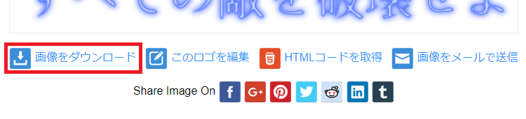

[OpenGL 3D 2021 第12回]

# 

## 習得目標

* 
* 
* 

## 1. ゲームエンジンでGLFWを管理する

### 1.1 GLFWの初期化をゲームエンジンクラスに移動する

現在のプログラムでは、キー入力やフレームバッファの切り替えなどを行うとき、GLFWライブラリの関数を直接呼び出しています。GLFWライブラリの多くの関数は、引数として`GLFWwindow`型ポインタを受け取ります。

しかし、現在この`GLFWwindow`型ポインタは`main`関数で作成しています。そのため、例えば`Main.cpp`以外のファイルでGLFWライブラリの関数を使いたい場合、このポインタをなんとかしなくてはなりません。

「なんとかする」というのは、具体的には以下の2パターンが考えられます。

>1. ポインタをグローバル変数にして、どのファイルからでも使えるようにする。
>2. ポインタが使えるファイル内に新しい関数を追加し、その関数内でGLFWライブラリの関数を呼び出す。

ところで、プログラミングの歴史における経験則に「グローバル変数はあとあと管理が面倒になることが多い」という経験則があります。つまり、1の「ポインタをグローバル変数にする」はあまり良くない方法といえます。

今回は経験則に従って、2の「新しい関数を追加する」方法を使うことにします。新しい関数を追加する場所は、さまざまなファイルで使うことを想定したファイルやクラスを選びます。

そのようなファイルやクラスがなければ新しく作る必要がありますが、幸いにも現在のプロジェクトには「ゲームエンジンクラス」というぴったりのクラスがあります。

ということで、本章ではGLFWライブラリを使うプログラムをゲームエンジンクラスに移動していきます。まず、ゲームエンジンクラス側に機能を受け入れる準備をします。`GameEngine.h`を開き、次のプログラムを追加してください。

```diff
 #include "Texture.h"
 #include "Actor.h"
+#include <GLFW/glfw3.h>
 #include <unordered_map>
 #include <random>

 using ActorList = std::vector<std::shared_ptr<Actor>>;
 using TextureBuffer = std::unordered_map<std::string, std::shared_ptr<Texture>>;
```

次に`GLFWwindow`型ポインタ変数を追加します。ゲームエンジンクラスの定義に次のプログラムを追加してください。

```diff
   ~GameEngine() = default;
   GameEngine(const GameEngine&) = delete;
   GameEngine& operator=(const GameEngine&) = delete;

+  GLFWwindow* window = nullptr;
   ActorList actors;
   ActorList newActors;
```

これでGLFWライブラリ機能の受け入れ準備は完了です。

### 1.2 OpenGLの初期化をゲームエンジンクラスに移動する

それではGLFWライブラリの機能をゲームエンジンクラスに移していきましょう。最初に、初期化処理をゲームエンジンクラスに移動します。`Main.cpp`を開き、GLFWの初期化からデバッグコールバックの設定までを切り取ってください。

```diff
 * エントリーポイント.
 */
 int main()
 {
-  // GLFWの初期化.
-  if (glfwInit() != GLFW_TRUE) {
-    return 1;
-  }
-
-  // 描画ウィンドウの作成.
-  glfwWindowHint(GLFW_OPENGL_PROFILE, GLFW_OPENGL_CORE_PROFILE);
-  glfwWindowHint(GLFW_OPENGL_FORWARD_COMPAT, GLFW_TRUE);
-  glfwWindowHint(GLFW_CONTEXT_VERSION_MAJOR, 4);
-  glfwWindowHint(GLFW_CONTEXT_VERSION_MINOR, 5);
-  glfwWindowHint(GLFW_OPENGL_DEBUG_CONTEXT, GLFW_TRUE);
-  GLFWwindow* window =
-    glfwCreateWindow(1280, 720, "OpenGLGame", nullptr, nullptr);
-  if (!window) {
-    glfwTerminate();
-    return 1;
-  }
-  glfwMakeContextCurrent(window);
-
-  // OpenGL関数のアドレスを取得する.
-  if (!gladLoadGLLoader(reinterpret_cast<GLADloadproc>(glfwGetProcAddress))) {
-    glfwTerminate();
-    return 1;
-  }
-
-  glDebugMessageCallback(DebugCallback, nullptr);
-  
   GameEngine::Initialize();
   GameEngine& engine = GameEngine::Get();
```

`GameEngine.cpp`を開き、`Initialize`メンバ関数の定義に切り取ったプログラムを貼り付けてください。

```diff
   if (!engine) {
     engine = new GameEngine;
   }

+  // GLFWの初期化.
+  if (glfwInit() != GLFW_TRUE) {
+    return 1;
+  }
+
+  // 描画ウィンドウの作成.
+  glfwWindowHint(GLFW_OPENGL_PROFILE, GLFW_OPENGL_CORE_PROFILE);
+  glfwWindowHint(GLFW_OPENGL_FORWARD_COMPAT, GLFW_TRUE);
+  glfwWindowHint(GLFW_CONTEXT_VERSION_MAJOR, 4);
+  glfwWindowHint(GLFW_CONTEXT_VERSION_MINOR, 5);
+  glfwWindowHint(GLFW_OPENGL_DEBUG_CONTEXT, GLFW_TRUE);
+  GLFWwindow* window =
+    glfwCreateWindow(1280, 720, "OpenGLGame", nullptr, nullptr);
+  if (!window) {
+    glfwTerminate();
+    return 1;
+  }
+  glfwMakeContextCurrent(window);
+
+  // OpenGL関数のアドレスを取得する.
+  if (!gladLoadGLLoader(reinterpret_cast<GLADloadproc>(glfwGetProcAddress))) {
+    glfwTerminate();
+    return 1;
+  }
+
+  glDebugMessageCallback(DebugCallback, nullptr);
+
   engine->actors.reserve(1000);
   engine->newActors.reserve(1000);

   engine->primitiveBuffer.reset(new PrimitiveBuffer(1'000'000, 4'000'000));
```

プログラムを貼り付けると「`DebugCallback`が定義されていない」というエラーが発生すると思います。以下の課題を完了してエラーを解決してください。

<pre class="tnmai_assignment">
<strong>【課題01】</strong>
<code>Main.cpp</code>から<code>DebugCallback</code>関数を切り取って、<code>GameEngine.cpp</code>の先頭にある<code>engine</code>変数の下に貼り付けなさい。
<code>std::cerr</code>でエラーが発生する場合は、適切なヘッダファイルをインクルードしてエラーを解消してください。
</pre>

### 1.3 GLFWの終了をゲームエンジンクラスに移動する

初期化を移動したので、対になる終了処理もゲームエンジンクラスに移動させます。`Main.cpp`を開き、次のプログラムを切り取ってください。

```diff
     glfwSwapBuffers(window);
   }

   GameEngine::Finalize();

-  // GLFWの終了.
-  glfwTerminate();
-
   return 0;
 }
```

`GameEngine.cpp`を開き、`Finalize`メンバ関数の定義に切り取ったプログラムを貼り付けてください。

```diff
 void GameEngine::Finalize()
 {
+  // GLFWの終了.
+  glfwTerminate();
+
   delete engine;
   engine = nullptr;
 }
```

貼り付けただけだと、誤って`Finalize`メンバ関数が複数回実行してしまうと、`glfwTerminate`関数も複数回実行されてしまいます。これを防ぐため、`engine`変数が有効なときだけ終了処理を行います。`Finalize`メンバ関数を次のように変更してください。

```diff
 void GameEngine::Finalize()
 {
+  if (engine) {
     // GLFWの終了.
     glfwTerminate();

     delete engine;
     engine = nullptr;
+  }
 }
```

### 1.4 GLFW関数をゲームエンジンクラスに実装する

`window`変数を移動させたため、`Main.cpp`で`window`変数を使っている関数は全てエラーになります。これらの関数もゲームエンジンクラスに移動させます。`Main.cpp`を開き、`Ctrl+F`キーを押して検索ウィンドウを表示してください。

次に、検索ウィンドウの検索語句テキストに`window`と入力してください。すると次のように`glfwWindowShouldClose`(ジーエルエフダブリュー・ウィンドウ・シュッド・クローズ)関数を使っている部分が見つかるはずです(見つからない場合は`→`ボタンをクリックして探してください)。

>```c++
>  glm::vec3 cameraPosition = glm::vec3(0, 20, 20); // カメラの座標
>  glm::vec3 cameraTarget   = glm::vec3(0, 0, 0);   // カメラの注視点の座標
>  while (!glfwWindowShouldClose(window)) {
>   // 現在時刻を取得
>```

`glfwWindowShouldClose`関数が見つかったら、検索ウィンドウ内の`☓`ボタンをクリックするか`esc`キーを押して検索ウィンドウを閉じてください。

GLFWライブラリの関数をゲームエンジンクラスに移動させる手順は次のとおりです。

>1. 関数の追加: ゲームエンジンクラスに「GLFWライブラリの関数を呼び出す関数」を追加する。
>2. 関数の置き換え: `Main.cpp`でGLFWライブラリの関数を呼び出している部分を、1で追加した関数に置き換える。

それでは「関数の追加」からやっていきます。`GameEngine.h`を開き、ゲームエンジンクラスに次のプログラムを追加してください。

```diff
   const Primitive& GetPrimitive(int n) const { return primitiveBuffer->Get(n); }

   std::shared_ptr<Texture> LoadTexture(const char* filename);
+
+  /**
+  * この関数がtrueを返したらウィンドウを閉じる(=アプリを終了させる)
+  */
+  bool WindowShouldClose() const
+  {
+    return glfwWindowShouldClose(window);
+  }

 private:
   GameEngine() = default;
```

基本的に、メンバ関数の定義はCPPファイルに書くべきです。しかし、ここで定義している`WindowSholdClose`(ウィンドウ・シュッド・クローズ)メンバ関数のように、関数の定義が十分に短い（1～3行程度の)場合、直接クラス定義に書いてもよいでしょう。

次に「関数の置き換え」を行います。これは`glfw`を`engine.`に変えて`window`引数をなくすだけです。`Main.cpp`を開き、`glfwWindowShouldClose`関数を使うプログラムを次のように変更してください。

```diff
   glm::vec3 cameraPosition = glm::vec3(0, 20, 20); // カメラの座標
   glm::vec3 cameraTarget   = glm::vec3(0, 0, 0);   // カメラの注視点の座標
-  while (!glfwWindowShouldClose(window)) {
+  while (!engine.WindowShouldClose()) {
    // 現在時刻を取得
```

これで`glfwWindowShouldClose`関数の置き換えは完了です。

### 1.5 

次の置き換え対象を探すために、`Ctrl+F`キーで検索ウィンドウを開き、検索語句テキストに`window`を入力しましょう。すると`glfwGetKey`(ジーエルエフダブリュー・ゲット・キー)関数が見つかります。

>```c++
>         float tankAccel = 0.2f; // 戦車の加速度
>         if (glfwGetKey(window, GLFW_KEY_W) == GLFW_PRESS) {
>           tank->velocity += tankFront * tankAccel;
>         } else if (glfwGetKey(window, GLFW_KEY_S) == GLFW_PRESS) {
>           tank->position -= tankFront * tankAccel;
>         }
>```

それでは「関数の追加」を行いましょう。`GameEngine.h`を開き、ゲームエンジンクラスに次のプログラムを追加してください。

```diff
   bool WindowShouldClose() const
   {
     return glfwWindowShouldClose(window);
   }
+
+  /**
+  * キーが押されていたらtrue、押されていなかったらfalse
+  */
+  bool GetKey(int key) const
+  {
+    return glfwGetKey(window, key) == GLFW_PRESS;
+  }

 private:
   GameEngine() = default;
```

続いて、追加した関数で`glfwGetKey`関数を置き換えます。`Main.cpp`を開き、`glfwGetKey`を使っているプログラムを次のように変更してください。

```diff
         float tankAccel = 0.2f; // 戦車の加速度
-        if (glfwGetKey(window, GLFW_KEY_W) == GLFW_PRESS) {
+        if (engine.GetKey(GLFW_KEY_W)) {
           tank->velocity += tankFront * tankAccel;
-        } else if (glfwGetKey(window, GLFW_KEY_S) == GLFW_PRESS) {
+        } else if (engine.GetKey(GLFW_KEY_S)) {
           tank->position -= tankFront * tankAccel;
         }
```

<pre class="tnmai_assignment">
<strong>【課題02】</strong>
<code>Main.cpp</code>にある全ての<code>glfwGetKey</code>関数呼び出しを、ゲームエンジンクラスの<code>GetKey</code>メンバ関数で置き換えなさい。
</pre>

<pre class="tnmai_assignment">
<strong>【課題03】</strong>
<code>glfwWindowShouldClose</code>関数と<code>glfwGetKey</code>関数の置き換えかたを参考に、<code>glfwGetMouseButton</code>関数呼び出しをゲームエンジンクラスのメンバ関数で置き換えなさい。
メンバ関数名は<code>GetMouseButton</code>としなさい。
</pre>

### 1.6 glfwGetWindowSize関数をゲームエンジンクラスに移動する

`Ctrl+F`を押して検索語句`window`の検索を続けます。すると`glfwGetWindowSize`関数が見つかるでしょう。

>```c++
>    // プロジェクション行列を作成.
>    int w, h;
>    glfwGetWindowSize(window, &w, &h);
>    const float aspectRatio = static_cast<float>(w) / static_cast<float>(h);
>    const glm::mat4 matProj =
>      glm::perspective(glm::radians(45.0f),  aspectRatio, 0.1f, 200.0f);
>```

`glfwGetWindowSize`関数は、引数で受け取ったアドレスに値を代入するタイプの関数です。昔のC言語では構造体を戻り値にできなかったため、このような設計をするのが普通でした。

しかし、現代のCは関数の戻り値に構造体を指定できますし、C++は最初から構造体やクラスを返すことができるように作られています。そこで、ゲームエンジンクラスに追加するメンバ関数は、`glm::vec2`型の値を返すように設計します。

また、ウィンドウサイズはあまり<ruby>頻繁<rt>ひんぱん</rt></ruby>に変更されないと考えられます。ゲームエンジンの初期化時にサイズを取得し、サイズ変更を検知したときに更新すれば十分でしょう。

ウィンドウサイズを格納するメンバ変数を用意します。`GameEngine.h`を開き、ゲームエンジンクラスの定義に次のプログラムを追加してください。

```diff
   GameEngine& operator=(const GameEngine&) = delete;

   GLFWwindow* window = nullptr;
+  glm::vec2 windowSize = glm::vec2(0);
   ActorList actors;
   ActorList newActors;
```

次に、ウィンドウサイズを返すメンバ関数を追加します。ゲームエンジンクラスの定義に次のプログラムを追加してください。

```diff
   {
     return glfwGetMouseButton(window, button);
   }
+
+  /**
+  * ウィンドウサイズを返す
+  */
+  glm::vec2 GetWindowSize() const
+  {
+    return windowSize;
+  }

 private:
   GameEngine() = default;
```

続いて、ゲームエンジンを初期化するときにウィンドウサイズを取得します。`GameEngine.cpp`を開き、`Initialize`メンバ関数の定義に次のプログラムを追加してください。

```diff
   glDebugMessageCallback(DebugCallback, nullptr);

   engine->window = window;
+
+  int w, h;
+  glfwGetWindowSize(window, &w, &h);
+  engine->windowSize = glm::vec2(w, h);

   engine->actors.reserve(1000);
   engine->newActors.reserve(1000);
```

最後に、`Main.cpp`の`glfwGetWindowSize`関数を次のように置き換えてください。

```diff
     // プロジェクション行列を作成.
-    int w, h;
-    glfwGetWindowSize(window, &w, &h);
-    const float aspectRatio = static_cast<float>(w) / static_cast<float>(h);
+    const glm::vec2 windowSize = engine.GetWindowSize();
+    const float aspectRatio = windowSize.x / windowSize.y;
     const glm::mat4 matProj =
       glm::perspective(glm::radians(45.0f),  aspectRatio, 0.1f, 200.0f);
```

C言語を想定したライブラリの場合、C++で使いやすい形の関数に置き換えると、ほんの少しですがプログラムを管理しやすくなります。

### 1.7 glfwSwapBuffers関数をゲームエンジンクラスに移動する

`window`変数の検索を続けると、`glfwSwapBuffers`(ジーエルエフダブリュー・スワップ・バッファーズ)関数が見つかるでしょう。この関数もゲームエンジンクラスに移動します。

>```c++
>    pipeline.Unbind();
>    primitiveBuffer.UnbindVertexArray();
>
>    glfwPollEvents();
>    glfwSwapBuffers(window);
>  }
>
>  // ゲームエンジンを終了する
>  GameEngine::Finalize();
>```

そばにある`glfwPollEvents`(ジーエルエフダブリュー・ポール・イベンツ)関数もGLFWライブラリの関数です。これも一緒に移動させましょう。

これまでと同様、まずはメンバ関数を追加します。`GameEngine.h`を開き、ゲームエンジンクラスの定義に次のプログラムを追加してください。

```diff
   {
     return windowSize;
   }
+
+  /**
+  * フロントバッファとバックバッファを交換する
+  */
+  void SwapBuffers() const
+  {
+    glfwSwapBuffers(window);
+    glfwPollEvents();
+  }
  
 private:
   GameEngine() = default;
```

次に`Main.cpp`を開き、`glfwSwapBuffers`と`glfwPollEvents`関数を以下のように置き換えてください。

```diff
     pipeline.Unbind();
     primitiveBuffer.UnbindVertexArray();

-    glfwPollEvents();
-    glfwSwapBuffers(window);
+    engine.SwapBuffers();
   }

   // ゲームエンジンを終了する
   GameEngine::Finalize();
```

ここまでの変更によって、GLFWライブラリの機能をゲームエンジンクラス経由で使えるようになりました。今後はどのCPPファイルからでもGLFWライブラリの機能を利用できます。

<pre class="tnmai_assignment">
<strong>【課題04】</strong>
<code>Main.cpp</code>にある全ての<code>glfwGetTime</code>関数呼び出しを、ゲームエンジンクラスのメンバ関数で置き換えなさい。
メンバ関数名は<code>GetTime</code>としなさい。
</pre>

<pre class="tnmai_assignment">
<strong>【課題05】</strong>
もしテキストで扱っていないGLFWライブラリの関数を使っている場合、それらの関数をゲームエンジンクラスのメンバ関数で置き換えなさい。
他のGLFWライブラリの関数を使っていない場合は、この課題を無視してください。
</pre>

<pre class="tnmai_assignment">
<strong>【課題06】</strong>
現在使用している全てのGLFWライブラリの関数をゲームエンジンクラスのメンバ関数で置き換え終わったら、<code>Main.cpp</code>から<code>GLFW/glfw3.h</code>のインクルード文を削除しなさい。
</pre>

### 1.8 プリミティブに名前を付ける

読み込むプリミティブの数が増えてくると、プリミティブを番号で識別することが難しくなっていきます。そこで、プリミティブに名前を付けて、名前で検索できるようにします。

`Primitive.h`を開き、プリミティブクラスを次のように変更してください。

```diff
 class Primitive
 {
 public:
   Primitive() = default;
-  Primitive(GLenum m, GLsizei c, size_t o, GLint b) :
+  Primitive(const char* name, GLenum m, GLsizei c, size_t o, GLint b) :
+    name(name),
     mode(m), count(c), indices(reinterpret_cast<GLvoid*>(o)), baseVertex(b)
   {}
   ~Primitive() = default;
 
   void Draw() const;
+  const std::string& GetName() const { return name; }
 
 private:
+  std::string name;           // プリミティブ名
   GLenum mode = GL_TRIANGLES; // プリミティブの種類.
   GLsizei count = 0; // 描画するインデックス数.
```

次に、プリミティブバッファクラスのアド関数に、名前を受け取る引数を追加します。アド関数の宣言を次のように変更してください。

```diff
   // プリミティブの追加
   bool Add(size_t vertexCount, const glm::vec3* pPosition, const glm::vec4* pColor,
     const glm::vec2* pTexcoord, const glm::vec3* pNormal,
-    size_t indexCount, const GLushort* pIndex);
+    size_t indexCount, const GLushort* pIndex, const char* name = nullptr);
   bool AddFromObjFile(const char* filename);

   // プリミティブの取得
```

それでは、アド関数を修正しましょう。`Primitive.cpp`を開き、アド関数を次のように変更してください。

```diff
 * @param indexCount  追加するインデックスデータの数
 * @param pIndex      インデックスデータへのポインタ
+* @param name        プリミティブの名前
 *
 * @retval true  追加に成功
 * @retval false 追加に失敗
 */
 bool PrimitiveBuffer::Add(size_t vertexCount, const glm::vec3* pPosition,
   const glm::vec4* pColor, const glm::vec2* pTexcoord, const glm::vec3* pNormal,
-  size_t indexCount, const GLushort* pIndex)
+  size_t indexCount, const GLushort* pIndex, const char* name)
 {
   // エラーチェック.
   if (!vao) {
```

さらに、アド関数の描画データを作成するプログラムを次のように変更してください。

```diff
   if (!CopyData(ibo, sizeof(GLushort), curIndexCount, indexCount, pIndex)) {
     return false;
   }

   // 描画データを作成.
-  const Primitive prim(GL_TRIANGLES, static_cast<GLsizei>(indexCount),
+  const Primitive prim(name, GL_TRIANGLES, static_cast<GLsizei>(indexCount),
     sizeof(GLushort) * curIndexCount, curVertexCount);

   // 描画データを配列に追加.
   primitives.push_back(prim);
```

それから、アドフロムオブジェ関数の場合は「ファイル名を名前として使う」ことにしましょう。というのは、ファイル名とは異なるプリミティブ名を覚えるのは面倒だからです。アドフロムオブジェ関数を次のように変更してください。

```diff
`  // 頂点データとインデックスデータをGPUメモリにコピーする.
  const bool result = Add(positions.size(), positions.data(), colors.data(),
-   texcoords.data(), normals.data(), indices.size(), indices.data());
+   texcoords.data(), normals.data(), indices.size(), indices.data(),
+   filename);
  if (result) {
    std::cout << "[情報]" << __func__ << ":" << filename << "(頂点数=" <<
      positions.size() << " インデックス数=" << indices.size() << ")\n";
```

これで、プリミティブに名前を設定できるようになりました。

### 1.9 プリミティブを名前で検索する

次に、プリミティブバッファクラスに「名前による検索」機能を追加します。メンバ関数名は`Find`(ファインド。「探す」、「見つける」という意味)とします。`Primitive.h`を開き、プリミティブバッファクラスの定義に次のプログラムを追加してください。

```diff
   bool AddFromObjFile(const char* filename);

   // プリミティブの取得
   const Primitive& Get(size_t n) const;
+  const Primitive& Find(const char* name) const;

   // VAOバインド管理.
   void BindVertexArray() const;
```

続いてファインド関数を定義します。`Primitive.cpp`を開き、`Get`メンバ関数の定義の下に、次のプログラムを追加してください。

```diff
     return dummy;
   }
   return primitives[n];
 }
+
+/**
+* プリミティブを取得する
+*
+* @param name プリミティブの名前
+*
+* @return 名前がnameと一致するプリミティブ
+*/
+const Primitive& PrimitiveBuffer::Find(const char* name) const
+{
+  for (int i = 0; i < primitives.size(); ++i) {
+    if (primitives[i].GetName() == name) {
+      // 名前が一致する描画データを見つけた(見つけた描画データを返す)
+      return primitives[i];
+    }
+  }
+
+  // 名前が一致する描画データは見つからなかった(仮の描画データを返す)
+  static const Primitive dummy;
+  return dummy;
+}

 /**
 * VAOをグラフィックスパイプラインにバインドする
```

作成したファインド関数と、前節で行ったアドフロムオブジェ関数の変更の2つが組み合わさることで、ファイル名を使ってプリミティブを検索できるようになりました。

### 1.10 ゲームエンジンクラスにプリミティブ検索機能を追加する

プリミティブを検索するには、ゲームエンジンクラスからプリミティブバッファクラスを取得し、プリミティブバッファクラスのファインド関数を使う、という手順が必要です。

これはちょっと面倒なので、ゲームエンジンクラスにプリミティブを検索する機能を追加しましょう。`GameEngine.h`を開き、ゲームエンジンクラスの定義に次のプログラムを追加してください。

```diff
   PrimitiveBuffer& GetPrimitiveBuffer() { return *primitiveBuffer; }
   const Primitive& GetPrimitive(int n) { return primitiveBuffer->Get(n); }
+  const Primitive& GetPrimitive(const char* name) const;

   std::shared_ptr<Texture> LoadTexture(const char* filename);

   /**
   * この関数がtrueを返したらウィンドウを閉じる(=アプリを終了させる)
```

次に`GameEngine.cpp`を開き、アップデートアクターズ関数の定義の下に、次のプログラムを追加してください。

```diff
   // 新規アクター配列を空にする
   newActors.clear();
 }
+
+/**
+* 名前の一致するプリミティブを取得する
+*
+* @param filename プリミティブ名
+*
+* @return filenameと名前が一致するプリミティブ
+*/
+const Primitive& GameEngine::GetPrimitive(const char* filename) const
+{
+  return primitiveBuffer->Find(filename);
+}

 /**
 * テクスチャを読み込む
```

これで、ゲームエンジンクラスから直接プリミティブを取得できます。

>**【1章のまとめ】**<br>
>
>* 
>* 

<div style="page-break-after: always"></div>

## 2. タイガーI戦車をアクターの派生クラスにする

### 2.1 タイガーI戦車用のクラスを定義する

本章では、タイガーI戦車のプログラムを`Main.cpp`から別のファイルに分離します。以前のタイガーI戦車を操作するプログラムは`window`変数を必要とするGLFWライブラリの関数を使っていたため、別のファイルに分離することが簡単ではありませんでした。

現在、それらの関数は全てゲームエンジンクラスのメンバ関数で置き換えられています。この置き換えによって、タイガーI戦車を操作するプログラムを別のファイルに分離できるようになりました。

プロジェクトの`Src\Actor`フォルダに`PlayerActor.h`というヘッダファイルを追加してください。追加したファイルを開き、次のプログラムを追加してください。アクタークラスをコピーして、名前などを変更すると早くできるでしょう。

```diff
+/**
+* @file PlayerActor.h
+*/
+#ifndef PLAYERACTOR_H_INCLUDED
+#define PLAYERACTOR_H_INCLUDED
+#include "../Actor.h"
+
+/**
+* プレイヤーが操作する戦車
+*/
+class PlayerActor : public Actor
+{
+public:
+  PlayerActor(
+    const std::string& name,
+    const Primitive& prim,
+    std::shared_ptr<Texture> tex,
+    const glm::vec3& position,
+    const glm::vec3& scale,
+    float rotation,
+    const glm::vec3& adjustment);
+
+  virtual ~PlayerActor() = default;
+  virtual void OnUpdate(float deltaTime);
+  virtual void OnCollision(const struct Contact& contact);
+
+private:
+};
+
+#endif // PLAYERACTOR_H_INCLUDED
```

それにしても、コンストラクタの引数が多いのはなんとかならないものでしょうか…。

ここで改めて引数の必要性を考えてみると、例えばタイガーI戦車の「名前」は`Tiger-I`に決まっています。「プリミティブ」は`Tiger_I.obj`で「テクスチャ」は`PzVl_Tiger_I.tga`を使うはずです。

つまり、これらのパラメータを自由に変更できる必要はありません。コンストラクタの中で決まった値を指定すれば十分だと考えられます。ということは、これらの引数をコンストラクタから削除しても大丈夫そうです。

それでは、不要な引数を削除しましょう。コンストラクタの宣言を次のように変更してください。

```diff
 public:
   PlayerActor(
-    const std::string& name,
-    const Primitive& prim,
-    std::shared_ptr<Texture> tex,
     const glm::vec3& position,
     const glm::vec3& scale,
-    float rotation,
+    float rotation);
-    const glm::vec3& adjustment);

   virtual ~PlayerActor() = default;
   virtual void OnUpdate(float deltaTime);
```

次に、タイガーI戦車の操作に必要な変数をプライベートメンバに追加します。`Main.cpp`をざっとながめたところ、`oldShotButton`変数が必要なようです。

>```c++
>   double loopTime = glfwGetTime();     // 1/60秒間隔でループ処理するための時刻
>   double diffLoopTime = 0;             // 時刻の差分
>   const float deltaTime = 1.0f / 60.0f;// 更新間隔
>   int    oldShotButton = 0;        // 前回のショットボタンの状態
>   while (!glfwWindowShouldClose(window)) {
>     // 現在時刻を取得
>```

`oldShotButton`変数を定義している行をコピーして、次のように`PlayerActor.h`に貼り付けてください。

```diff
   virtual void OnUpdate(float deltaTime);
   virtual void OnCollision(const struct Contact& contact);

 private:
+  int oldShotButton = 0;               // 前回のショットボタンの状態
 };

 #endif // PLAYERACTOR_H_INCLUDED
```

### 2.2 コンストラクタを定義する

それではコンストラクタから定義していきましょう。プロジェクトの`Src\Actor`フォルダに`PlayerActor.cpp`というヘッダファイルを追加してください。追加したファイルを開き、次のプログラムを追加してください。

```diff
+/**
+* @file PlayerActor.cpp
+*/
+#include "PlayerActor.h"
+#include "../GameEngine.h"
+
+/**
+* コンストラクタ
+*/
+PlayerActor::PlayerActor(
+  const glm::vec3& position,
+  const glm::vec3& scale,
+  float rotation) :
+  Actor(
+    "Tiger-I",
+    GameEngine::Get().GetPrimitive("Res/Tiger_I.obj"),
+    GameEngine::Get().LoadTexture("Res/PzVl_Tiger_I.tga"),
+    position, scale, rotation, glm::vec3(0))
+{
+}
```

また、タイガーI戦車のコライダーを`Main.cpp`で設定していますが、これも決まった値を設定するだけなので、コンストラクタに移動できます。`Main.cpp`を開き、タイガーI戦車にコライダーを設定するプログラムを切り取ってください。

```diff
   // 戦車のパラメータ
   std::shared_ptr<Actor> playerTank(new Actor{ "Tiger-I", primitiveBuffer.Get(6), texTank,
     glm::vec3(0), glm::vec3(1), 0.0f, glm::vec3(0) });
-  playerTank->collider = Box{ glm::vec3(-1.8f, 0, -1.8f), glm::vec3(1.8f, 2.8f, 1.8f) };
   actors.push_back(playerTank);
```

`PlayerActor.cpp`に戻り、切り取ったプログラムをコンストラクタに貼り付けてください。

```diff
     GameEngine::Get().LoadTexture("Res/PzVl_Tiger_I.tga"),
     position, scale, rotation, glm::vec3(0))
 {
+  playerTank->collider = Box{ glm::vec3(-1.8f, 0, -1.8f), glm::vec3(1.8f, 2.8f, 1.8f) };
 }
```

それから、`playerTank->`の部分は不要なので削除します。コライダーを設定するプログラムを次のように変更してください。

```diff
     GameEngine::Get().LoadTexture("Res/PzVl_Tiger_I.tga"),
     position, scale, rotation, glm::vec3(0))
 {
-  playerTank->collider = Box{ glm::vec3(-1.8f, 0, -1.8f), glm::vec3(1.8f, 2.8f, 1.8f) };
+  collider = Box{ glm::vec3(-1.8f, 0, -1.8f), glm::vec3(1.8f, 2.8f, 1.8f) };
 }
```

これでコンストラクタは完成です。

>**【あなたのゲームにscaleやrotationは必要ですか？】**<br>
>もし「自分が作りたいゲームでは特に使わないな」と思う引数がまだあるなら、それらも削除して構いません。

### 2.3 <ruby>OnUpdate<rt>オン・アップデート</rt></ruby>仮想関数を定義する

コンストラクタの次はオンアップデート仮想関数を定義します。オンアップデート仮想関数は「アクターの位置などを更新するための関数」です。コンストラクタの定義の下に、次のプログラムを追加してください。

```diff
     position, scale, rotation, glm::vec3(0))
 {
 }
+
+/**
+* アクターの状態を更新する
+*
+* @param deltaTime 前回の更新からの経過時間(秒)
+*/
+void PlayerActor::OnUpdate(float deltaTime)
+{
+  GameEngine& engine = GameEngine::Get();
+}
```

オンアップデート仮想関数でやるべきことは、アクターの位置や速度の更新です。タイガーI戦車については、`Main.cpp`にある「タイガーI戦車を移動させるプログラム」が該当します。

このプログラムをオンアップデート関数に移動すれば、タイガーI戦車の移動をオンアップデート関数で管理できるようになるはずです。`Main.cpp`を開き、タイガーI戦車を移動させるプログラムを切り取ってください。

```diff
     // ゲーム状態を更新する
     //

     for (; diffLoopTime >= deltaTime; diffLoopTime -= deltaTime) {
-
-     // 戦車を移動させる
-     Actor* tank = Find(actors, "Tiger-I");
-     if (tank) {
-       if (engine.GetKey(GLFW_KEY_A)) {
-         tank->rotation += glm::radians(90.0f) * deltaTime;
-                 ・
-                 ・
-                 ・
-         // 弾に衝突判定を付ける
-         bullet->collider = Box{ glm::vec3(-0.25f), glm::vec3(0.25f) };
-         bullet->mass = 6.8f;
-         bullet->friction = 1.0f;
-
-         actors.push_back(bullet);
-       }
-
-       // 「前回のショットボタンの状態」を更新する
-       oldShotButton = shotButton;
-     }

      // アクターの状態を更新する
      for (int i = 0; i < actors.size(); ++i) {
        // アクターの寿命を減らす
```

次に`PlayerActor.cpp`を開き、オンアップデート関数に切り取ったプログラムを貼り付けてください。

```diff
 void PlayerActor::OnUpdate(float deltaTime)
 {
   GameEngine& engine = GameEngine::Get();
+
+     // 戦車を移動させる
+     Actor* tank = Find(actors, "Tiger-I");
+     if (tank) {
+       if (engine.GetKey(GLFW_KEY_A)) {
+         tank->rotation += glm::radians(90.0f) * deltaTime;
+                 ・
+                 ・
+                 ・
+         // 弾に衝突判定を付ける
+         bullet->collider = Box{ glm::vec3(-0.25f), glm::vec3(0.25f) };
+         bullet->mass = 6.8f;
+         bullet->friction = 1.0f;
+
+         actors.push_back(bullet);
+       }
+
+       // 「前回のショットボタンの状態」を更新する
+       oldShotButton = shotButton;
+     }
 }
```

先頭の`Fnid`関数とそれに続く`if`は不要なので削除します。

```diff
   GameEngine& engine = GameEngine::Get();

      // 戦車を移動させる
-     Actor* tank = Find(actors, "Tiger-I");
-     if (tank) {
        if (engine.GetKey(GLFW_KEY_A)) {
          tank->rotation += glm::radians(90.0f) * deltaTime;
                  ・
                  ・
                  ・
          // 弾に衝突判定を付ける
          bullet->collider = Box{ glm::vec3(-0.25f), glm::vec3(0.25f) };
          bullet->mass = 6.8f;
          bullet->friction = 1.0f;
 
          actors.push_back(bullet);
        }
 
        // 「前回のショットボタンの状態」を更新する
        oldShotButton = shotButton;
-     }
 }
```

ここでVisual Studio上部のメニューから「編集→詳細→ドキュメントのフォーマット」を選択して空白の数を整理しておいてください。

<pre class="tnmai_assignment">
<strong>【課題07】</strong>
テキスト第11回 2章のT-34戦車のオンアップデート関数を定義する手順を参考にして、オンアップデート関数内の全ての<code>tank-></code>を削除しなさい。
なお、変数名が重複するため、<code>tank->position</code>の部分は<code>this->position</code>のように<code>tank-></code>を<code>this-></code>で置き換える必要があります。
</pre>

<pre class="tnmai_assignment">
<strong>【課題08】</strong>
<code>`rotate`: `glm`のメンバではありません</code>のように「～のメンバではありません」のようなエラーが出た場合、エラーメッセージに書かれた関数宣言を含むヘッダファイルをインクルードすれば直ります。
例えば、<code>rotate</code>関数は<code>glm/gtc/matrix_transform.hpp</code>ヘッダに定義されています。
<code>GameEngine.cpp</code>に<code>rotate</code>関数が定義されているヘッダをインクルードしてエラーを解決しなさい。
</pre>

### 2.4 ゲームエンジンクラスを使ってエラーを解決する

次にプリミティブとテクスチャの取得を修正します。`bullet`変数を呈するプログラムを次のように変更してください。

```diff
     glm::vec3 position = position + tankFront * 6.0f;
     position.y += 2.0f;

     std::shared_ptr<Actor> bullet(new Actor{
-      "Bullet", primitiveBuffer.Get(9), texBullet,
+      "Bullet",
+      engine.GetPrimitive("Res/Bullet.obj"),
+      engine.LoadTexture("Res/Bullet.tga"),
       position, glm::vec3(0.25f), rotation, glm::vec3(0) });

     // 1.5秒後に弾を消す
     bullet->lifespan = 1.5f;
```

続いて、弾アクターをアクター配列に追加するプログラムを次のように変更してください。

```diff
     // 弾に衝突判定を付ける
     bullet->collider = Box{ glm::vec3(-0.25f), glm::vec3(0.25f) };

-    actors.push_back(bullet);
+    engine.AddActor(bullet);
   }

   // 「前回のショットボタンの状態」を更新する
   oldShotButton = shotButton;
```

### 2.5 <ruby>OnCollision<rt>オン・コリジョン</rt></ruby>仮想関数を定義する

次にオンコリジョン仮想関数を定義します。オンコリジョン仮想関数は衝突の結果を扱う関数です。関数の内容は、

>1. T-34戦車が発射する弾(エネミーバレットアクター)に衝突したらヘルス(`health`)を減らす。
>2. ヘルスが`0`以下になったら削除する。
>3. エネミーバレットアクターを削除する。

の3つとします。オンアップデート仮想関数の定義の下に、次のプログラムを追加してください。

```diff
   // 「前回のショットボタンの状態」を更新する
   oldShotButton = shotButton;
 }
+
+/**
+* 衝突を処理する
+*
+* @param contact 衝突情報
+*/
+void PlayerActor::OnCollision(const struct Contact& contact)
+{
+  if (contact.b->name == "EnemyBullet") {
+    --health;
+    if (health <= 0) {
+      isDead = true;
+    }
+    contact.b->isDead = true;
+  }
+}
```

また、アクターのデフォルトのヘルスは`1`しかありません。これではすぐに死んでしまうので、ヘルスを`10`に増やしましょう。コンストラクタに次のプログラムを追加してください。

```diff
     GameEngine::Get().LoadTexture("Res/PzVl_Tiger_I.tga"),
     position, scale, rotation, glm::vec3(0))
 {
+  health = 10;
   collider = Box{ glm::vec3(-1.8f, 0, -1.8f), glm::vec3(1.8f, 2.8f, 1.8f) };
 }

 /**
 * アクターの状態を更新する
```

### 2.6 PlayerActorクラスを使う

```diff
 #include "Texture.h"
 #include "Sampler.h"
 #include "Actor.h"
+#include "Actor/PlayerActor.h"
 #include "Actor/T34TankActor.h"
 #include "Actor/ElevatorActor.h"
```

```diff
   actors.push_back(std::shared_ptr<Actor>(new Actor{ "Cube", primitiveBuffer.Get(3), texTriangle,
     glm::vec3(0, 0, -4), glm::vec3(1), 0.0f, glm::vec3(0) }));

   // 戦車のパラメータ
-  std::shared_ptr<Actor> playerTank(new Actor{ "Tiger-I", primitiveBuffer.Get(6), texTank,
-    glm::vec3(0), glm::vec3(1), 0.0f, glm::vec3(0) });
+  std::shared_ptr<Actor> playerTank(new PlayerActor{ glm::vec3(0), glm::vec3(1), 0.0f });
   actors.push_back(playerTank);

   // T-34戦車のパラメータ
```

プログラムが書けたらビルドして実行してください。これまでどおりにタイガーI戦車を操縦できていたら成功です。また、敵の弾を10発受けたらタイガーI戦車が消えることも確認してください。

>**【2章のまとめ】**<br>
>
>* 
>* 

<div style="page-break-after: always"></div>

## 3. ゲームのルールを管理する

### 3.1 ゲームルール管理クラスを作成する

ゲームにはルールが必要です。ここでいう「ルール」とは、「敵を全滅させたら勝ち」のようなゲーム内容に関わるものだけでなく、ゲームの開始方法や終了方法など、ゲームの進行に関わるすべての条件を指します。

市販されている大抵のゲームには、ゲームのルールを管理するための専用のクラスがあります。また、ゲームの規模がある程度大きい場合などは、ルールが複数のクラスに分割されていることが多いです。

本テキストでは、ルール管理を行うクラスをひとつだけ作成します。クラス名は`GameManager`(ゲーム・マネージャ)とします。プロジェクトの`Src`フォルダに`GameManager.h`(ゲームマネージャ・エイチ)というファイルを作成してください。

作成したファイルを開き、次のプログラムを追加してください。

```diff
+/**
+* @file GameManager.h
+*/
+#ifndef GAMEMANAGER_H_INCLUDED
+#define GAMEMANAGER_H_INCLUDED
+#include "Actor.h"
+#include <vector>
+
+/**
+* ゲーム管理クラス
+*/
+class GameManager
+{
+public:
+  static bool Initialize();
+  static void Finalize();
+  static GameManager& Get();
+
+private:
+  GameManager() = default;
+  ~GameManager() = default;
+  GameManager(const GameManager&) = delete;
+  GameManager& operator=(const GameManager&) = delete;
+};
+
+#endif // GAMEMANAGER_H_INCLUDED
```

ゲームマネージャの定義は「シングルトン」にしています。ゲームルールを管理するシステムはひとつあれば十分だからです。

### 3.2 シングルトンのためのメンバ関数を定義する

ゲームマネージャのメンバ関数を定義していきます。まずプロジェクトの`Src`フォルダに`GameManager.cpp`(ゲームマネージャ・シーピーピー)というファイルを追加してください。追加したファイルを開き、次のプログラムを追加してください。

```diff
+/**
+* @file GameManager.cpp
+*/
+#include "GameManager.h"
+#include "GameEngine.h"
+#include "Actor/PlayerActor.h"
+#include "Actor/T34TankActor.h"
+#include <iostream>
+
+namespace {
+
+GameManager* manager = nullptr;
+
+}
+
+/**
+* ゲームマネージャの初期化
+*/
+bool GameManager::Initialize()
+{
+  if (!manager) {
+    manager = new GameManager;
+  }
+  return true;
+}
+
+/**
+* ゲームマネージャの終了
+*/
+void GameManager::Finalize()
+{
+  if (manager) {
+    delete manager;
+    manager = nullptr;
+  }
+}
+
+/**
+* ゲームエンジンを取得する
+*/
+GameManager& GameManager::Get()
+{
+  return *manager;
+}
```

シングルトンの基本的な構造は、第11回で作成したゲームエンジンクラスと同じです。コンストラクタ、コピー代入演算子などをプライベート定義して勝手に作れないようにし、イニシャライズ関数とファイナライズ関数でオブジェクトの作成を制御します。

### 3.3 ゲームの動作状態を考える

続いて、ゲームの骨格となる「ゲームの動作状態」を定義します。大抵のゲームには「ゲームの開始」、「ゲームをプレイ中」、「会話」、「ステータス表示」、「ゲームクリア」のように、いくつかの異なる動作状態が存在します。

動作状態の数や種類は個々のゲームによって違います。本テキストで作成するゲームでは、次の4つの動作状態を定義することにします。

>1. ゲーム開始
>2. ゲームプレイ中
>3. ゲームクリア
>4. ゲームオーバー

これらを列挙型として定義します。列挙型の名前は`State`(ステート、「状態」という意味)としましょう。`GameManager.h`を開き、次のプログラムを追加してください。

```diff
   static void Finalize();
   static GameManager& Get();
+
+  // ゲームの動作状態
+  enum class State {
+    start,     // ゲーム開始
+    playing,   // ゲームプレイ中
+    gameclear, // ゲームクリア
+    gameover,  // ゲームオーバー
+  };
 
 private:
   GameManager() = default;
```

次に動作状態を保持するメンバ変数を追加します。ゲームマネージャクラスに次のプログラムを追加してください。

```diff
   GameManager(const GameManager&) = delete;
   GameManager& operator=(const GameManager&) = delete;
+
+  State state = State::start; // 現在の動作状態
 };

 #endif // GAMEMANAGER_H_INCLUDED
```

`state`(ステート)メンバ変数は、ゲームの進行に応じて適切な値に変更する必要があります。

### 3.4 動作状態を更新するメンバ関数を定義する

次に、動作状態の更新を行うメンバ関数を追加します。ゲームの動作状態の更新は、タイガーI戦車や敵となるT-34戦車の状態を監視することで行います。

例えば、全てのT-34戦車が破壊されていたら動作状態を`gameclear`にする、タイガーI戦車が破壊されていたら`gameover`にする、などです。

関数名は`Update`(アップデート)とします。`GameManager.h`を開き、次のプログラムを追加してください。

```diff
     gameclear, // ゲームクリア
     gameover,  // ゲームオーバー
   };
+
+  void Update(float deltaTime);
 
 private:
   GameManager() = default;
```

`GameManager.cpp`を開き、ゲット関数の定義の下に次のプログラムを追加してください。

```diff
 {
   return *manager;
 }
+
+/**
+* ゲームの動作状態を更新する
+*/
+void GameManager::Update(float deltaTime)
+{
+  GameEngine& engine = GameEngine::Get();
+
+  switch (state) {
+  case State::start:
+    state = State::playing;
+    std::cout << __func__ << ": start -> playing\n";
+    break;
+
+  case State::playing:
+    if (/*タイガーI戦車が死んでいる？*/) {
+      state = State::gameover;
+      std::cout << __func__ << ": playing -> gameover\n";
+    }
+    else {
+      if (/*T-34戦車が全滅している？*/) {
+        state = State::gameclear;
+        std::cout << __func__ << ": playing -> gameclear\n";
+      }
+    }
+    break;
+
+  case State::gameclear:
+    if (engine.GetKey(GLFW_KEY_ENTER)) {
+      state = State::start;
+      std::cout << __func__ << ": gameclear -> start\n";
+    }
+    break;
+
+  case State::gameover:
+    if (engine.GetKey(GLFW_KEY_ENTER)) {
+      state = State::start;
+      std::cout << __func__ << ": gameover -> start\n";
+    }
+    break;
+  }
+}
```

上記のプログラムでは「タイガーI戦車が死んでいる？」、「T-34戦車が全滅している？」の部分がコメントになっていて、このままではビルドできません。

この2つのコメントをプログラムするには、ゲームマネージャがタイガーI戦車とT-34戦車の状態を調べられるようにする必要があります。

### 3.5 ゲームマネージャでタイガーI戦車を作成する

タイガーI戦車やT-34戦車の状態を調べるには、ゲームマネージャクラスがそれらの戦車アクターを知っていなくてはなりません。まずはアクターを監視するためのメンバ変数を追加します。`GameManager.h`を開き、次のプログラムを追加してください。

```diff
   GameManager& operator=(const GameManager&) = delete;

   State state = State::start; // 現在の動作状態
+  std::shared_ptr<Actor> playerTank;
+  std::vector<std::shared_ptr<Actor>> enemies;
 };

 #endif // GAMEMANAGER_H_INCLUDED
```

ゲームを何度も繰り返し遊べるようにするには、ゲームマネージャクラスでアクターの作成を管理するほうが便利です。そこで、`Main.cpp`にあるタイガーI戦車とT-34戦車を作成するプログラムを、ゲームマネージャクラスのメンバ関数にします。

関数名は`SpawnPlayer`(スポーン・プレイヤー)と`SpawnEnemies`(スポーン・エネミーズ)とします。コピー代入演算子を`delete`指定するプログラムの下に、次のプログラムを追加してください。

```diff
   GameManager(const GameManager&) = delete;
   GameManager& operator=(const GameManager&) = delete;
+
+  void SpanwPlayer();
+  void SpawnEnemies();

   State state = State::start; // 現在の動作状態
   std::shared_ptr<Actor> playerTank;
   std::vector<std::shared_ptr<Actor>> enemies;
```

この2つのメンバ関数はプライベートメンバにしています。プライベートメンバ関数は、実行タイミングを完全にクラスの管理下に置けるため、決まった状況でだけ正しく動くことを保証すればいいからです。

もしこれらのメンバ関数がパブリックメンバだった場合、「どんな状況で呼び出されても正常に動作する」ような関数として定義しなくてはなりません。そうしないとバグの元になるからです。

>「コメントに呼び出すべきタイミングを書いておく」という方法もあります。でも、あなたはコメントを最後まで読んでいますか？　もしあなたが読んでいないなら、将来この関数を使うであろう「誰か」(1週間後のあなた自身かもしれません)もコメントを読まないでしょう。

続いて、スポーンプレイヤー関数を定義します。`GameManager.cpp`を開き、アップデート関数の定義の下に、次のプログラムを追加してください。

```diff
+
+/**
+* プレイヤーの戦車を生成する
+*/
+void GameManager::SpawnPlayer()
+{
+  // 以前のタイガーI戦車を削除
+  if (playerTank) {
+    playerTank->isDead = true;
+  }
+
+  // 新しいタイガーI戦車を作成
+}
```

次に`Main.cpp`を開き、タイガーI戦車を作成するプログラムを切り取ってください。

```diff
   actors.push_back(std::shared_ptr<Actor>(new Actor{ "Cube", primitiveBuffer.Get(3), texTriangle,
     glm::vec3(0, 0, -4), glm::vec3(1), 0.0f, glm::vec3(0) }));
-
-  // 戦車のパラメータ
-  std::shared_ptr<Actor> playerTank(new PlayerActor{ glm::vec3(0), glm::vec3(1), 0.0f });
-  actors.push_back(playerTank);

   // T-34戦車のパラメータ
```

`GameManager.cpp`を開き、切り取ったプログラムをスポーンプレイヤー関数に貼り付けてください。

```diff
     playerTank->isDead = true;
   }

   // 新しいタイガーI戦車を作成
+
+  // 戦車のパラメータ
+  std::shared_ptr<Actor> playerTank(new PlayerActor{ glm::vec3(0), glm::vec3(1), 0.0f });
+  actors.push_back(playerTank);
 }
```

そして、貼り付けたプログラムをメンバ変数の`playerTank`を使うように修正します。貼り付けたプログラムを次のように変更してください。

```diff
   // 新しいタイガーI戦車を作成
-
-  // 戦車のパラメータ
-  std::shared_ptr<Actor> playerTank(new PlayerActor{ glm::vec3(0), glm::vec3(1), 0.0f });
+  playerTank.reset(new PlayerActor{ glm::vec3(0), glm::vec3(1), 0.0f });
+
-  actors.push_back(playerTank);
+  // タイガーI戦車をゲームエンジンに登録
+  GameEngine::Get().AddActor(playerTank);
 }
```

### 3.6 ゲームマネージャでT-34戦車を作成する

次はスポーンエネミーズ関数を定義します。スポーンプレイヤー関数の定義の下に、次のプログラムを追加してください。

```diff
   // タイガーI戦車をゲームエンジンに登録
   GameEngine::Get().AddActor(playerTank);
 }
+
+/**
+* 敵戦車を生成
+*/
+void GameManager::SpawnEnemies()
+{
+  GameEngine& engine = GameEngine::Get();
+
+  // 以前に作成したT-34戦車を削除
+  for (int i = 0; i < enemies.size(); ++i) {
+    if (enemies[i]) {
+      enemies[i]->isDead = true;
+    }
+  }
+  enemies.clear();
+
+  // 課題09: 新しいT-34戦車を作成
+
+  // T-34戦車をゲームエンジンに登録
+  for (int i = 0; i < enemies.size(); ++i) {
+    engine.AddActor(enemies[i]);
+  }
+}
```

<pre class="tnmai_assignment">
<strong>【課題09】</strong>
<code>Main.cpp</code>からT-34戦車を作成するプログラムを切り取り、スポーンエネミーズ関数の「新しいT-34戦車を作成」というコメントの下に貼り付けなさい。
</pre>

<pre class="tnmai_assignment">
<strong>【課題10】</strong>
課題09で貼り付けたプログラムについて、すべてのT-34戦車を<code>enemies</code>配列に<code>push_back</code>するプログラムを追加しなさい。
</pre>

### 3.7 アップデート関数を完成させる

追加したメンバ変数とメンバ関数を使って、アップデート関数を完成させましょう。アップデート関数を次のように変更してください。

```diff
   switch (state) {
   case State::start:
+    SpawnPlayer();
+    SpawnEnemies();
     state = State::playing;
     std::cout << __func__ << ": start -> playing\n";
     break;
 
   case State::playing:
-    if (/*タイガーI戦車が死んでいる？*/) {
+    if (playerTank->isDead) {
       state = State::gameover;
       std::cout << __func__ << ": playing -> gameover\n";
     }
     else {
+      int surviverCount = 0;
+      for (int i = 0; i < enemies.size(); ++i) {
+        if (enemies[i] && !enemies->isDead) {
+          ++surviverCount;
+        }
+      }
-      if (/*T-34戦車が全滅している？*/) {
+      if (surviverCount <= 0) {
         state = State::gameclear;
         std::cout << __func__ << ": playing -> gameclear\n";
       }
     }
```

これでアップデート関数は完成です。

### 3.8 ゲームマネージャを使う

それではゲームマネージャを使ってゲームの動作状態を管理してみましょう。`Main.cpp`を開き、次のプログラムを追加してください。

```diff
 #include "Texture.h"
 #include "Sampler.h"
 #include "Actor.h"
+#include "GameManager.h"
 #include "Actor/PlayerActor.h"
 #include "Actor/T34TankActor.h"
```

次に、メインループの手前にゲームマネージャを作成するプログラムを追加してください。

```diff
   // 立方体のパラメータ
   actors.push_back(std::shared_ptr<Actor>(new Actor{ "Cube", primitiveBuffer.Get(3), texTriangle,
     glm::vec3(0, 0, -4), glm::vec3(1), 0.0f, glm::vec3(0) }));
+
+  // ゲームマネージャを作成
+  GameManager::Initialize();
+  GameManager& manager = GameManager::Get();

   // メインループ.
   double loopTime = engine.GetTime();  // 1/60秒間隔でループ処理するための時刻
   double diffLoopTime = 0;             // 時刻の差分
```

次にゲームマネージャのアップデート関数を呼び出します。アップデート関数はゲームの動作状態を常に監視しなくてはならないので、アクターの更新プログラムの直後に実行します。アクターの状態を更新する`for`の下に、次のプログラムを追加してください。

```diff
         // アクターの位置を更新する
         actors[i]->position += actors[i]->velocity * deltaTime;
       }

+      manager.Update(deltaTime);
       GameEngine::Get().UpdateActors();

       // 衝突情報の配列を用意する
```

最後にゲームマネージャを終了させます。メインループの下に、次のプログラムを追加してください。

```diff
     engine.SwapBuffers();
   }

+  GameManager::Finalize();
   GameEngine::Finalize();

   return 0;
```

これでゲームマネージャによってゲームの動作状態が管理できるようになりました。プログラムが書けたらビルドして実行してください。タイガーI戦車が破壊されたり、T-34戦車を全滅させたとき、コンソールウィンドウに動作状態の変化を示すメッセージが表示されたら成功です。

ゲームクリアやゲームオーバーになったあと、`Enter`キーを押して新しいゲームが始められることも確認してください。

### 3.9 テキスト画像を用意する

「コンソールウィンドウを見ないとゲームの動作状態が分からない」というのは不便ですし、ゲームとしても不親切です。そこで、動作状態に応じた文章を表示しましょう。

ただし、OpenGLには文章を表示する機能がありません。そのため、文章を画像として作成し、その画像をテクスチャとして表示する、という方法が使われます。

画像はPhotoShopやBlenderのような画像編集ソフトで作成します。Visual Studioで作成することも可能ですが、あまり凝ったデザインは作れません。こういうときは、オンラインのロゴ作成サイトが便利です。

ウェブブラウザを開き、以下のURLのサイトを開いてください。

>`ja.cooltext.com`

すると以下のようなサイトが表示されると思います。

<p align="center">
<br>
</p>

まずは「ロゴスタイルを選択してください」の下に表示されている様々なスタイルから、好きなスタイルをクリックしてください。すると以下のような画面に変わります。

<p align="center">
<br>
</p>

最初に選択されているフォントは日本語フォントではないので、フォント画像をクリックしてフォントの選択画面を表示します。使いたいフォントをクリックすると、そのフォントが選択されて前の画面に戻ります。

<p align="center">
<br>
</p>

フォントを選択したら、「ロゴテキスト」欄にゲームの目的を入力してください(①)。

<p align="center">
<br>
</p>

すると、ロゴの表示が入力テキストのとおりに変更されます。文字色を変更したい場合は`Logo`タブで変更できます(②)。影の見た目を調整したい場合は`Shadow`タブで変更できます(③)。

表示されるタブの種類と変更可能なパラメータはスタイルごとに異なります。いろいろ試してみるとよいでしょう。納得のいくロゴが完成したら、`Create Logo`ボタンをクリックしてください。

<p align="center">
<br>
</p>

左端の「画像をダウンロード」という文字をクリックすると「名前を付けて保存」ウィンドウが開きます。ファイル名を`GameStart.png`にして、プロジェクトの`Res`フォルダに保存してください。

<p align="center">
<br>
</p>

<pre class="tnmai_assignment">
<strong>【課題11】</strong>
保存した<code>GameStart.png</code>をVisual Studioで開き、上部メニューバーから「ファイル→名前を付けてGameStart.pngを保存」を選択して、<code>TGA</code>形式の画像として保存しなさい。
</pre>

### 3.10 テキスト画像を表示する

作成したテキスト画像を表示するために、板モデルを追加します。プロジェクトの`Res`フォルダに`Plane.obj`(プレーン・オブジェ)というファイルを追加してください。追加したファイルを開き、次のテキストを追加してください。

```diff
+v -0.5 -0.5  0.0
+v  0.5 -0.5  0.0
+v  0.5  0.5  0.0
+v -0.5  0.5  0.0
+
+vt 0.0 0.0
+vt 1.0 0.0
+vt 1.0 1.0
+vt 0.0 1.0
+
+vn  0.0  0.0 -1.0
+
+f 1/1/1 2/2/1 3/3/1
+f 3/3/1 4/4/1 1/1/1
```

>`Plane.obj`をプロジェクトに追加した場合、ファイルのプロパティを開いて「項目の種類」を「テキスト」に変更することを忘れないように。

<pre class="tnmai_assignment">
<strong>【課題12】</strong>
<code>AddFromObjFile</code>メンバ関数を使って<code>Plane.obj</code>をプリミティブバッファに読み込むプログラムを追加しなさい。
</pre>

それではテキストを表示しましょう。`GameManager.cpp`を開き、アップデート関数に次のプログラムを追加してください。

```diff
   case State::start:
     SpawnPlayer();
     SpawnEnemies();
+
+    { // ゲーム開始メッセージを表示する
+      std::shared_ptr<Actor> gamestart(new Actor{"GameStart",
+        engine.GetPrimitive("Res/Plane.obj"),
+        engine.LoadTexture("Res/GameStart.tga"),
+        glm::vec3(0, 5, 0), glm::vec3(20.0f, 4.0f, 1.0f), 0.0f, glm::vec3(0) });
+      gamestart->lifespan = 3;
+      gamestart->isStatic = true;
+      engine.AddActor(gamestart);
+    }
     state = State::playing;
     std::cout << __func__ << ": start -> playing\n";
     break;
```

プログラムが書けたらビルドして実行してください。ゲーム開始時にテキスト画像が表示されていたら成功です。

>**【3章のまとめ】**<br>
>
>* 
>* 

<div style="page-break-after: always"></div>

## 4. UI表示

### 4.1 


>**【4章のまとめ】**<br>
>
>* 
>* 
