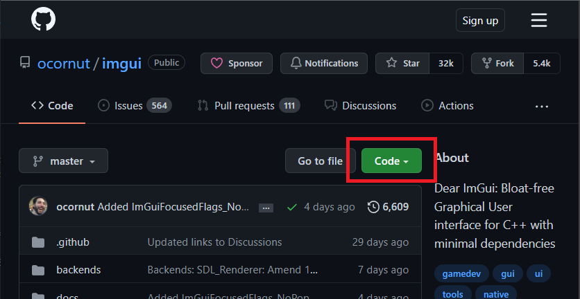
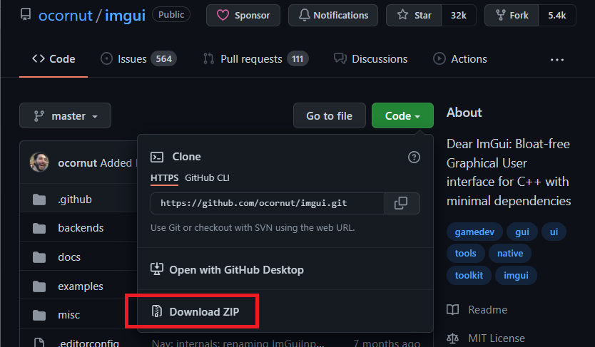
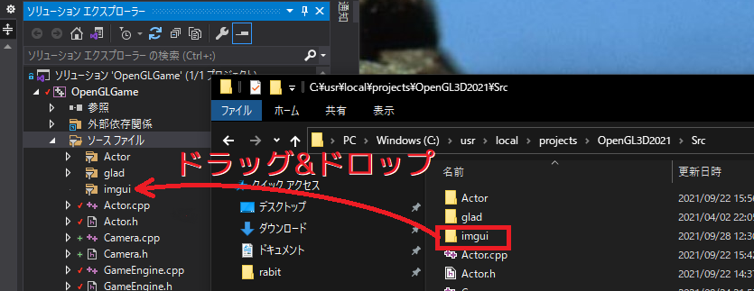
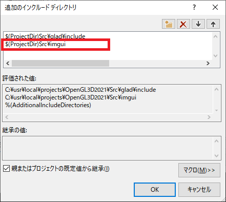
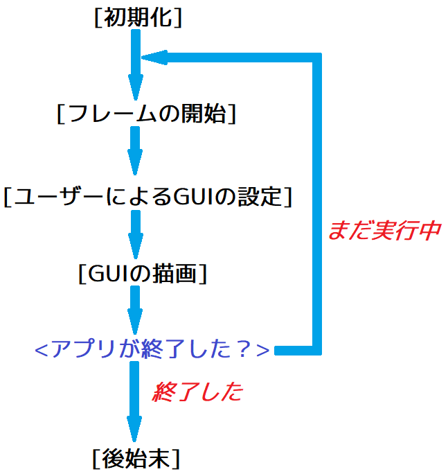
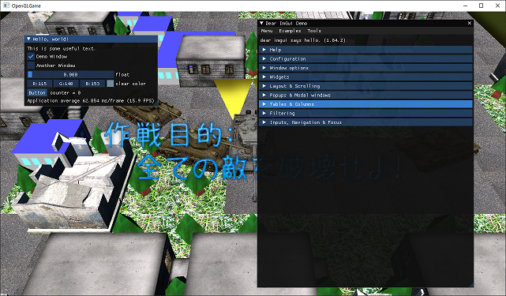

[OpenGL 3D 2021後期 第01回]

# ゲームエンジンを完成させる

## 習得目標

* ゲームエンジンに移動させるべき関数を見分けられる。
* Dear ImGuiをプロジェクトに追加し、ウィンドウを表示できる。

## 1. 衝突判定とアクターの描画をゲームエンジンに移動する

### 1.1 ゲームエンジンに移すべきプログラム

`main`関数には、あと少しだけゲームエンジンクラスに移せそうなプログラムが残っています。簡易ゲームエンジンを完成させるには、それらを`main`関数からゲームエンジンクラスに移動する必要があります。

移動するのは以下の3つです。

* 衝突判定
* カメラデータの更新
* アクターの描画

### 1.2 衝突判定をゲームエンジンに移動する

それでは「衝突判定」から移動させていきます。まず移動先となるメンバ関数を定義します。名前は`UpdatePhysics`(アップデート・フィジックス)としましょう。`GameEngine.h`を開き、次のプログラムを追加してください。

```diff
   void AddActor(std::shared_ptr<Actor> actor) { newActors.push_back(actor); }
   void UpdateActors(float deltaTime);
   void PostUpdateActors();
+  void UpdatePhysics(float deltaTime);

   PrimitiveBuffer& GetPrimitiveBuffer() { return *primitiveBuffer; }
   const Primitive& GetPrimitive(int n) { return primitiveBuffer->Get(n); }
```

>Physics(フィジックス): 物理、物理学

続いて`GameEngine.cpp`を開き、`PostUpdateActors`メンバ関数の定義の下に、次のプログラムを追加してください。

```diff
   // 新規アクター配列を空にする
   newActors.clear();
 }
+
+/**
+* アクターの衝突判定を行う
+*/
+void GameEngine::UpdatePhysics(float deltaTime)
+{
+}

 /**
 * 削除待ちのアクターを削除する
```

それでは衝突判定プログラムを移動させましょう。`Main.cpp`を開き、ゲーム状態を更新するプログラムのうち「衝突判定から衝突の解決までの範囲」を切り取ってください。

```diff
     for (; diffLoopTime >= deltaTime; diffLoopTime -= deltaTime) {
       engine.UpdateActors(deltaTime);
       manager.Update(deltaTime);
       engine.PostUpdateActors();

-      // アクターの衝突判定を行う
-      std::vector<Contact> contacts;
-      contacts.reserve(actors.size());
-      for (int a = 0; a < actors.size(); ++a) {
-          ・
-          ・
-          ・
-        // 重なりを解決する
-        SolveContact(contacts[i]);
-      }

       // 削除待ちのアクターを削除する
       engine.RemoveDeadActors();

       // カメラデータを更新する
```

`GameEngine.cpp`に戻り、アップデートフィジックス関数の中に、切り取ったプログラムを貼り付けてください。

```diff
 * アクターの衝突判定を行う
 */
 void GameEngine::UpdatePhysics(float deltaTime)
 {
+      // アクターの衝突判定を行う
+      std::vector<Contact> contacts;
+      contacts.reserve(actors.size());
+      for (int a = 0; a < actors.size(); ++a) {
+          ・
+          ・
+          ・
+        // 重なりを解決する
+        SolveContact(contacts[i]);
+      }
 }

 /**
 * 削除待ちのアクターを削除する
```

`actors`変数でエラーが出るので修正します。アップデートフィジックス関数に次のプログラムを追加してください。

```diff
 void GameEngine::UpdatePhysics(float deltaTime)
 {
+  ActorList& actors = GetActors(Layer::Default);

   // アクターの衝突判定を行う
   std::vector<Contact> contacts;
```

最後に、切り取ったプログラムがあった場所からアップデートフィジックス関数を呼び出します。`Main.cpp`を開き、ゲーム状態を更新するプログラムに次のプログラムを追加してください。

```diff
     for (; diffLoopTime >= deltaTime; diffLoopTime -= deltaTime) {
       engine.UpdateActors(deltaTime);
       manager.Update(deltaTime);
       engine.PostUpdateActors();
-
+      engine.UpdatePhysics(deltaTime);
+
       // 削除待ちのアクターを削除する
       engine.RemoveDeadActors();
```

これで衝突判定をゲームエンジンクラスに移動することができました。プログラムが書けたらビルドして実行してください。衝突判定が違和感なく実行されていたら成功です。

### 1.3 カメラクラスを宣言する

次は、カメラデータの更新プログラムを移動します。ただ、カメラ関係の機能は、これまであまり手をつけてきませんでした。ちょうといい機会なので、ここでカメラデータをクラスとして定義することにします。

クラス名は`Camera`(カメラ)とします。今回作成するカメラクラスではあまり凝ったことはせず、カメラデータを管理するだけにしています。より高度なカメラクラスを作る場合は自由に機能を拡張してください。

プロジェクトの`Src`フォルダに`Camera.h`(カメラ・ドット・エイチ)というヘッダファイルを追加してください。追加したファイルを開き、次のプログラムを追加してください。

```diff
+/**
+* @file Camera.h
+*/
+#ifndef CAMERA_H_INCLUDED
+#define CAMERA_H_INCLUDED
+#include <glm/glm.hpp>
+
+/**
+* カメラデータ
+*/
+class Camera
+{
+public:
+  // コンストラクタ、デストラクタ
+  Camera() = default;
+  ~Camera() = default;
+
+  // メンバ関数
+  void Update();
+  const glm::mat4& GetViewMatrix() const;
+  const glm::mat4& GetProjectionMatrix() const;
+
+  // メンバ変数
+  glm::vec3 position = glm::vec3(0, 0, 0);
+  glm::vec3 up = glm::vec3(0, 1, 0);
+  glm::vec3 target = glm::vec3(0, 0, -1);
+  float aspectRatio = 1.0f;
+  float fovy = glm::radians(45.0f);
+  float zNear = 0.1f;
+  float zFar = 200.0f;
+
+private:
+  glm::mat4 matView = glm::mat4(1);
+  glm::mat4 matProj = glm::mat4(1);
+};
+
+#endif // CAMERA_H_INCLUDED
```

なお、今回作成するカメラクラスでは、ほとんどのメンバ変数をパブリックにして自由に読み書きできるようにしています。メンバ変数をパブリックにすることは、オブジェクト指向の「カプセル化」という点ではあまり良い作法ではありません。

しかし、データ設定関数とデータ取得関数をいちいち作成するのは面倒なので、このようにしています。これが気になる場合、すべてのメンバ変数をプライベートにして、データ設定関数とデータ取得関数を定義するとよいでしょう。

また、このカメラクラスでは、派生クラスを作成することも考慮していません。「プレイヤーを追いかけるカメラ」、「指定されたルートを移動するカメラ」などを作る場合は、デストラクタとアップデート関数を仮想関数にするとよいでしょう。

### 1.4 カメラクラスのメンバ関数を定義する

次にプロジェクトの`Src`フォルダに`Camera.cpp`(カメラ・ドット・シーピーピー)というソースファイルを追加してください。追加したファイルを開き、次のプログラムを追加してください。

```diff
+/**
+* @file Camera.cpp
+*/
+#include "Camera.h"
+#include <glm/gtc/matrix_transform.hpp>
+
+/**
+* ビュー行列を取得する
+*/
+const glm::mat4& Camera::GetViewMatrix() const
+{
+  return matView;
+}
+
+/**
+* プロジェクション行列を取得する
+*/
+const glm::mat4& Camera::GetProjectionMatrix() const
+{
+  return matProj;
+}
+
+/**
+* カメラの状態を更新する
+*/
+void Camera::Update()
+{
+  // ビュー行列を作成.
+  matView = glm::lookAt(position, target, up);
+
+  // プロジェクション行列を作成.
+  matProj = glm::perspective(fovy, aspectRatio, zNear, zFar);
+}
```

これらのメンバ関数は以下のように使うことを想定しています。

* ゲームループの中で毎回アップデート関数を実行する。
* 描画時に、ゲットビューマトリクス関数とゲットプロジェクションマトリクス関数でビュー行列とプロジェクション行列を取得して描画する。

### 1.5 ゲームエンジンにカメラ変数を追加する

それでは、カメラクラスをゲームエンジンに組み込みましょう。`GameEngine.h`を開き、`Camera.h`をインクルードしてください。

```diff
 #include "ProgramPipeline.h"
 #include "Sampler.h"
 #include "Actor.h"
+#include "Camera.h"
 #include <GLFW/glfw3.h>
 #include <unordered_map>
 #include <random>
```

次にカメラ変数を追加します。ゲームエンジンクラスの定義に次のプログラムを追加してください。

```diff
   ActorList newActors; // 追加するアクターの配列
   std::shared_ptr<PrimitiveBuffer> primitiveBuffer; // プリミティブ配列
   TextureBuffer textureBuffer;                      // テクスチャ配列
+  Camera mainCamera; // メインカメラ
 };
 
 #endif // GAMEENGINE_H_INCLUDED
```

それから、ゲームエンジンからメインカメラを取得できるようにします。ゲームエンジンクラスの定義に次のプログラムを追加してください。

```diff
   double GetTime() const
   {
     return glfwGetTime();
   }
+
+  /**
+  * メインカメラを取得する
+  */
+  Camera& GetCamera() { return mainCamera; }
+  const Camera& GetCamera() const { return mainCamera; }

private:
  GameEngine() = default;
  ~GameEngine() = default;
```

ここではコンスト属性のない「通常のメンバ関数(非コンストメンバ関数)」とコンスト属性の付いた「コンストメンバ関数」の2つを定義しています。

コンストメンバ関数はメンバ変数の値を書き換えられないため、メインカメラ変数に値を設定するには非コンストメンバ関数を定義する必要があります。

値を書き換えられる場合は非コンストメンバ関数が呼び出され、書き換えられない場合はコンストメンバ関数が呼び出されます。この呼び分けはコンパイラが自動的にやってくれます。

続いて、ゲームエンジンクラスにカメラの状態を更新する関数を追加します。ゲームエンジンクラスの定義の次のプログラムを追加してください。

```diff
   void UpdateActors(float deltaTime);
   void PostUpdateActors();
   void UpdatePhysics(float deltaTime);
+  void UpdateCamera();
   void RemoveDeadActors();
   void RenderDefault();
```

アップデートカメラ関数はメインカメラの状態を更新する関数です。`GameEngine.cpp`を開き、アップデートフィジックス関数の定義の下に次のプログラムを追加してください。

```diff
   // 重なりを解決する
   SolveContact(c);
 }
+
+/**
+* カメラの状態を更新する
+*/
+void GameEngine::UpdateCamera()
+{
+  mainCamera.Update();
+}

 /**
 * 削除待ちのアクターを削除する
```

それから、カメラのメンバ変数のうち、`aspectRatio`(アスペクト比)は描画領域(通常は画面の大きさ)によって変化します。そこで、アスペクト比だけはゲームエンジンを初期化するときに設定しておきます。

iイニシャライズ関数に次のプログラムを追加してください。

```diff
     engine->newActors.reserve(1000);
     engine->primitiveBuffer.reset(new PrimitiveBuffer(1'000'000, 4'000'000));
     engine->textureBuffer.reserve(1000);
+
+    // カメラのアスペクト比を設定
+    Camera& camera = engine->GetCamera();
+    camera.aspectRatio = engine->windowSize.x / engine->windowSize.y;
   }
   return true;
 }
```

最後に、アップデートカメラ関数の呼び出しを追加します。`Main.cpp`を開き、次のプログラムを追加してください。

```diff
       manager.Update(deltaTime);
       engine.PostUpdateActors();
       engine.UpdatePhysics(deltaTime);
+      engine.UpdateCamera();

       // 削除待ちのアクターを削除する
       engine.RemoveDeadActors();
```

これでカメラクラスを使えるようになりました。

### 1.6 ゲームマネージャにカメラの更新プログラムを移動する

カメラの更新はゲームマネージャの仕事です。ゲームエンジンの仕事は、ゲームマネージャによって更新されたカメラを使って画像を表示することです。

そこで、ゲームマネージャクラスにカメラを更新するメンバ関数を追加します。`GameManager.h`を開き、次のプログラムを追加してください。

```diff
   void SetState(State s);

   void Update(float deltaTime);
+  void UpdateCamera();

 private:
   GameManager() = default;
   ~GameManager() = default;
```

次に`GameManager.cpp`を開き、アップデートメンバ関数の定義の下に次のプログラムを追加してください。

```diff
     break;
   }
 }
+
+/**
+* カメラの状態を更新する
+*/
+void GameManager::UpdateCamera()
+{
+}

 /**
 * 描画データを追加する.
```

続いて`Main.cpp`を開き、`Ctrl+X`などでカメラデータを更新するプログラムを切り取ってください。

```diff
       // 削除待ちのアクターを削除する
       engine.RemoveDeadActors();
-
-      // カメラデータを更新する
-      {
-        std::shared_ptr<Actor> target = Find(actors, "Tiger-I");
-        if (target) {
-          const glm::mat4 matRot =
-            glm::rotate(glm::mat4(1), target->rotation, glm::vec3(0, 1, 0));
-          const glm::vec3 tankFront = matRot * glm::vec4(0, 0, 1, 1);
-          cameraPosition = target->position + glm::vec3(0, 20, 20);
-          cameraTarget = target->position;
-        }
-      }
     }

     //
     // ゲーム状態を描画する
```

再び`GameManager.cpp`を開き、アップデートカメラ関数に切り取ったプログラムを貼り付けてください。

```diff
 void GameManager::UpdateCamera()
 {
+
+      // カメラデータを更新する
+      {
+        std::shared_ptr<Actor> target = Find(actors, "Tiger-I");
+        if (target) {
+          const glm::mat4 matRot =
+            glm::rotate(glm::mat4(1), target->rotation, glm::vec3(0, 1, 0));
+          const glm::vec3 tankFront = matRot * glm::vec4(0, 0, 1, 1);
+          cameraPosition = target->position + glm::vec3(0, 20, 20);
+          cameraTarget = target->position;
+        }
+      }
 }

 /**
 * 描画データを追加する.
```

貼り付けたプログラムを、ゲームエンジンに追加したカメラ変数を使うように書き換えていきます。まずゲームエンジンを取得します。アップデートカメラ関数の先頭に次のプログラムを追加してください。

```diff
 void GameManager::UpdateCamera()
 {
+  GameEngine& engine = GameEngine::Get();

   // カメラデータを更新する
   {
```

続いて、アップデートカメラ関数を次のように修正してください。

```diff
 void GameManager::UpdateCamera()
 {
+  GameEngine& engine = GameEngine::Get();
-  // カメラデータを更新する
+  // プレイヤー戦車を斜めに見下ろすように、カメラの位置と向きを設定する
-  {
-    std::shared_ptr<Actor> target = Find(actors, "Tiger-I");
+    std::shared_ptr<Actor> target = Find(engine.GetActors(), "Tiger-I");
     if (target) {
       const glm::mat4 matRot =
         glm::rotate(glm::mat4(1), target->rotation, glm::vec3(0, 1, 0));
       const glm::vec3 tankFront = matRot * glm::vec4(0, 0, 1, 1);
+      Camera& camera = engine.GetCamera();
-      cameraPosition = target->position + glm::vec3(0, 20, 20);
-      cameraTarget = target->position;
+      camera.psition = target->position + glm::vec3(0, 20, 20);
+      camera.target = target->position;
     }
-  }
 }
```

>**【プログラムのフォーマットについて】**<br>
>プログラムを修正したら、上部メニューから「編集→詳細→ドキュメントのフォーマット」を選択してインデントを修正すること。<br>
>フォーマットされていないプログラムはとても読みづらいため、後でどこに何が書いてあるかを調べることが難しくなります。その結果、思い切った変更や修正ができなくなることがあります。<br>
>プログラムをコピー&貼り付けしたときは、常にフォーマットを実行するようにしてください。

最後にメインループからアップデートカメラ関数を呼び出します。`Main.cpp`を開き、メインループに次のプログラムを追加してください。

```diff
       engine.PostUpdateActors();
       engine.UpdatePhysics(deltaTime);
+      manager.UpdateCamera();
       engine.UpdateCamera();

       // 削除待ちのアクターを削除する
       engine.RemoveDeadActors();
```

これで更新プログラムをゲームエンジンに移動することができました。ただし、カメラを変更したので描画が正しく行われなくなっています。

### 1.9 描画の後始末をゲームエンジンに移動する

次は描画プログラムを移動します。`GameEngine.h`を開き、移動先となるメンバ関数を宣言してください。

```diff
   void UpdateCamera();
   void RemoveDeadActors();
+  void RenderDefault();
   void RenderUI();
+  void PostRender();

   PrimitiveBuffer& GetPrimitiveBuffer() { return *primitiveBuffer; }
   const Primitive& GetPrimitive(int n) { return primitiveBuffer->Get(n); }
```

`RenderDefault`(レンダー・デフォルト)メンバ関数は、通常のアクターを描画するための関数です。もうひとつの`PostRender`(ポスト・レンダー)メンバ関数は描画の後始末をするための関数で、VAOやテクスチャのバインド解除を行います。

それては関数定義を追加しましょう。`GameEngine.cpp`を開き、リムーブデッドアクターズ関数の定義の下に、次のプログラムを追加してください。

```diff
       [](std::shared_ptr<Actor>& a) { return a->isDead; }),
       a.end());
   }
 }
+
+/**
+* デフォルトアクターを描画する
+*/
+void GameEngine::RenderDefault()
+{
+}

 /**
 * UIアクターを描画する
```

続いてレンダーユーアイ関数の定義の下に、次のプログラムを追加してください。

```diff
   samplerUI->Unbind(0);
   primitiveBuffer->UnbindVertexArray();
 }
+
+/**
+* 描画の後始末をする
+*/
+void GameEngine::PostRender()
+{
+}

 /**
 * 名前の一致するプリミティブを取得する
```

続いてプログラムを移動させましょう。`Main.cpp`を開き、アクターを描画するプログラムの下に次のプログラムを追加してください。

```diff
     for (int i = 0; i < actors.size(); ++i) {
       Draw(*actors[i], pipeline, matProj, matView);
     }
+    engine.RenderDefault();
     engine.RenderUI();
+    engine.PostRender();

     // テクスチャの割り当てを解除.
     glActiveTexture(GL_TEXTURE0);
```

それでは、行数の少ない「後始末」から移動させます。ポストレンダー関数呼び出しの下にあるプログラムを範囲選択して、Ctrl+Xなどで切り取ってください。

```diff
     engine.RenderUI();
     engine.PostRender();
-
-    // テクスチャの割り当てを解除.
-    glActiveTexture(GL_TEXTURE0);
-    glBindTexture(GL_TEXTURE_2D, 0);
-
-    sampler.Unbind();
-    pipeline.Unbind();
-    primitiveBuffer.UnbindVertexArray();
-
     engine.SwapBuffers();
   }
```

`GameEngine.cpp`を開き、ポストレンダー関数に切り取ったプログラムを貼り付けてください。

```diff
 void GameEngine::PostRender()
 {
+
+    // テクスチャの割り当てを解除.
+    glActiveTexture(GL_TEXTURE0);
+    glBindTexture(GL_TEXTURE_2D, 0);
+
+    sampler.Unbind();
+    pipeline.Unbind();
+    primitiveBuffer.UnbindVertexArray();
+
 }

 /**
 * 名前の一致するプリミティブを取得する
```

それから、3D描画用のグラフィックスパイプランとサンプラもゲームエンジンに移動させなくてはなりません。`GameEngine.cpp`を開き、次のプログラムを追加してください。

```diff
   GLFWwindow* window = nullptr;
   glm::vec2 windowSize = glm::vec2(0);
+  std::shared_ptr<ProgramPipeline> pipeline;
   std::shared_ptr<ProgramPipeline> pipelineUI;
+  std::shared_ptr<Sampler> sampler;
   std::shared_ptr<Sampler> samplerUI;
   ActorList actors;
   ActorList newActors;
```

`GameEngine.cpp`を開き、イニシャライズ関数に次のプログラムを追加してください。

```diff
     int w, h;
     glfwGetWindowSize(window, &w, &h);
     engine->windowSize = glm::vec2(w, h);

+    engine->pipeline.reset(new ProgramPipeline("Res/VertexLighting.vert", "Res/Simple.frag"));
     engine->pipelineUI.reset(new ProgramPipeline("Res/Simple.vert", "Res/Simple.frag"));
+
+    engine->sampler.reset(new Sampler(GL_REPEAT));
     engine->samplerUI.reset(new Sampler(GL_CLAMP_TO_EDGE));
```

<pre class="tnmai_assignment">
<strong>【課題01】</strong>
<code>Main.cpp</code>にある<code>pipeline</code>変数と<code>sampler</code>変数を削除しなさい。
</pre>

<pre class="tnmai_assignment">
<strong>【課題02】</strong>
<code>PostRender</code>メンバ関数のエラーを修正しなさい。
</pre>

>**【不要な<ruby>空行<rt>くうぎょう</rt></ruby>は削除すること】**<br>
>貼り付けたプログラムの先頭と末尾の空行は、元々はプログラムを意味のあるかたまりに分けるために必要でした。しかし、プログラムを移動させた結果、これらの空行は意味をなさなくなっています。<br>
>このような空行は、プログラムが見づらくなる原因になるので消してください。また、空行は「ドキュメントのフォーマット」を使っても消えませんので、手動で整理する必要があります。<br>

### 1.10 描画をゲームエンジンに移動する

続いて、描画プログラムをゲームエンジンに移動します。`Main.cpp`を開き、次のように描画プログラムを切り取ってください。

```diff
     //
     // ゲーム状態を描画する
     //
-
-    glEnable(GL_DEPTH_TEST); // 深度バッファを有効にする.
-    glClearColor(0.5f, 0.5f, 0.1f, 1.0f);
-    glClear(GL_COLOR_BUFFER_BIT | GL_DEPTH_BUFFER_BIT);
-
-    primitiveBuffer.BindVertexArray();
-    pipeline.Bind();
-    sampler->Bind(0);
-        ・
-        ・
-        ・
-    // アクターを描画する
-    for (int i = 0; i < actors.size(); ++i) {
-      Draw(*actors[i], pipeline, matProj, matView);
-    }
     engine.RenderUI();
     engine.PostRender();
     engine.SwapBuffers();
```

`GameEngine.cpp`を開き、レンダーデフォルト関数の中に、切り取った描画プログラムを貼り付けてください。貼り付けたあとで「ドキュメントのフォーマット」を実行するのを忘れないように。

```diff
 void GameEngine::RenderDefault()
 {
+
+    glEnable(GL_DEPTH_TEST); // 深度バッファを有効にする.
+    glClearColor(0.5f, 0.5f, 0.1f, 1.0f);
+    glClear(GL_COLOR_BUFFER_BIT | GL_DEPTH_BUFFER_BIT);
+
+    primitiveBuffer.BindVertexArray();
+    pipeline.Bind();
+    sampler->Bind(0);
+        ・
+        ・
+        ・
+    // アクターを描画する
+    for (int i = 0; i < actors.size(); ++i) {
+      Draw(*actors[i], pipeline, matProj, matView);
+    }
 }

 /**
 * UIアクターを描画する
```

それではエラーに対処していきましょう。まず、以前に図形の回転に使っていたプログラムがまだ残っている場合、もう使いませんので削除します。

```diff
   glClearColor(0.5f, 0.5f, 0.1f, 1.0f);
   glClear(GL_COLOR_BUFFER_BIT | GL_DEPTH_BUFFER_BIT);
-
-  float s = sin(glm::radians(degree));
-  float c = cos(glm::radians(degree));
-  degree += 0.01f;
-  glm::mat4 matT = glm::mat4(1);
-  matT[3] = glm::vec4(-0.3, -0.5, 0.0, 1.0);
-  glm::mat4 matS = glm::mat4(1);
-  matS[0][0] = 0.5;
-  matS[1][1] = 1.5;
-  glm::mat4 matR = glm::mat4(1);
-  matR[0][0] = c;
-  matR[0][1] = -s;
-  matR[1][0] = s;
-  matR[1][1] = c;

   // プロジェクション行列を作成.
   const glm::vec2 windowSize = engine.GetWindowSize();
```

次に、プロジェクション行列とビュー行列をカメラ変数から取得するように変更します。

```diff
   glClearColor(0.5f, 0.5f, 0.1f, 1.0f);
   glClear(GL_COLOR_BUFFER_BIT | GL_DEPTH_BUFFER_BIT);

-  // プロジェクション行列を作成.
-  const glm::vec2 windowSize = engine.GetWindowSize();
-  const float aspectRatio = windowSize.x / windowSize.y;
-  const glm::mat4 matProj =
-    glm::perspective(glm::radians(45.0f), aspectRatio, 0.1f, 200.0f);
+  const glm::mat4 matProj = mainCamera.GetProjectionMatrix();
-
-  // ビュー行列を作成.
-  const glm::mat4 matView =
-    glm::lookAt(cameraPosition, cameraTarget, glm::vec3(0, 1, 0));
+  const glm::mat4 matView = mainCamera.GetViewMatrix();

   // アクターを描画する
   for (int i = 0; i < actors.size(); ++i) {
```

続いてアクターの描画を配列に対応させます。

```diff
   // アクターを描画する
+  const int layer = static_cast<int>(Layer::Default);
+  ActorList& defaultActors = actors[layer];
-  for (int i = 0; i < actors.size(); ++i) {
-    Draw(*actors[i], pipeline, matProj, matView);
+  for (int i = 0; i < defaultActors.size(); ++i) {
+    Draw(*defaultActors[i], pipeline, matProj, matView);
   }
 }
```

これで描画プログラムをゲームエンジンに移動することができました。プログラムが書けたらビルドして実行してください。特に問題なくゲームが実行できていたら成功です。

### 1.11 衝突判定を高速化する

衝突判定に時間がかかる理由のひとつは、実際には衝突しない大量のアクターを処理しているからです。衝突しないことが分かっている組み合わせを除外することで、衝突判定にかかる時間を短縮することができます。

例えば`isStatic`が`true`に設定されているアクター同士は衝突しません。そこで、`isStatic`が`false`に設定されている、つまり非スタティックなアクターだけ衝突判定を行うように変更しましょう。

まず、非スタティックなアクターを格納する配列を用意します。配列名は`nonStaticActors`(ノン・スタティック・アクターズ)とします。次に`for`を使って`isStatic`メンバ変数が`false`のアクターをノンスタティックアクターズ配列に追加します。

`GameEngine.cpp`を開き、アップデートフィジックス関数に次のプログラムを追加してください。

```diff
 void GameEngine::UpdatePhysics(float deltaTime)
 {
   ActorList& actors = GetActors(Layer::Default);
+
+  // 非スタティックなアクターをリストアップ
+  ActorList nonStaticActors;
+  nonStaticActors.reserve(actors.size());
+  for (const std::shared_ptr<Actor>& e : actors) {
+    if (!e->isStatic) {
+      nonStaticActors.push_back(actors[i]);
+    }
+  }

  std::vector<Contact> contacts;
  contacts.reserve(actors.size());
  for (int a = 0; a < actors.size(); ++a) {
```

このプログラムで使用している`for`は、「範囲for」や「範囲ベースfor」と呼ばれる書き方を使っています。`範囲for`は以下の書式を持ちます。

<pre class="tnmai_code"><strong>【書式】</strong><code>
for (範囲ループ変数 : ループ範囲) {
  プログラム
}
</code></pre>

例えば次の`範囲for`と通常の`for`は全く同じ動作になります。

>```c++
>  int n[5] = { 0, 1, 2, 3, 4 };
>
>  // 範囲for
>  for (int e : n) {
>    std::cout << e << '\n';
>  }
>
>  // 通常のfor
>  {
>    int* begin = std::begin(n);
>    int* end = std::end(n);
>    for (; begin != end; ++begin) {
>      int e = *begin;
>      std::cout << e << '\n';
>    }
>  }
>```

`範囲for`は、配列全体をループ処理したい、かつループ変数が必要ない場合に便利です。しかし、配列の一部をループさせたり、ループ内の計算でループ変数を使いたい場合は使えません。そういった場合は通常の`for`を使ってください。

それでは、衝突判定を行う2重`for`ループを次のように変更してください。

```diff
   std::vector<Contact> contacts;
   contacts.reserve(actors.size());
-  for (int a = 0; a < actors.size(); ++a) {
+  for (std::shared_ptr<Actor>& a : nonStaticActors) {
-    for (int b = a + 1; b < actors.size(); ++b) {
+    for (std::shared_ptr<Actor>& b : actors) {
+      // 同じアクターは衝突しない
+      if (a == b) {
+        continue;
+      }
+
       // 削除待ちアクターは衝突しない
-      if (actors[a]->isDead) {
+      if (a->isDead) {
         break;
-      } else if (actors[b]->isDead) {
+      } else if (b->isDead) {
         continue;
       }
 
       Contact contact;
-      if (DetectCollision(*actors[a], *actors[b], contact)) {
+      if (DetectCollision(*a, *b, contact)) {
         // 配列の中に、作成したコンタクト構造体と似ているものがあるか調べる
```

外側のforのループ範囲に`nonStaticActors`配列を使うことで、ループの回数を減らしています。そのかわり、内側のループ範囲である`actors`と重複する可能性が生まれました。

そこで、内側のforループに「同じアクターかどうかの判定」を追加することで、この問題を回避することにしました。

プログラムが書けたらビルドして実行してください。これで多少は処理が軽くなると思います。

>**【補足】**<br>
>理想的には、アクターを追加するときに、スタティックアクター配列と非スタティックアクター配列に分けるほうがよいでしょう。
>その場合、`isStatic`の値を変更するときに配列を移動する処理も必要となるでしょう。

>**【1章のまとめ】**<br>
>
>* ゲームの内容に直接関わらないプログラムをゲームエンジンに移動すると、プログラムが管理しやすくなる。
>* ループ処理には`範囲for`を活用する。

<div style="page-break-after: always"></div>

## 2. Dear ImGui(ディア・イムグイ)

### 2.1 ImGuiライブラリのダウンロード

ゲームにおいて、GUI(ジーユーアイ、グイ)のプログラミングは非常に骨が折れる作業です。そして、プログラミングにおいて骨が折れる作業というものは、大抵だれかがライブラリを作ってくれています。

というわけで、Dear ImGui(ディア・イムグイ)という、GUIを扱うライブラリを取り入れてみようと思います。Dear ImGuiは以下の用途で使われることを目的として作られています。

* コンテンツ作成ツールのGUI
* ゲームのデバッグメニュー

この目的を見て分かるように、実のところ<font color=red>Dear ImGuiはゲームのUIを作成するためのツールではありません。</font>

だからといって、ゲームのUIを作れないわけではありません。実際、Dear ImGuiをゲームUIとして使っているアプリケーションは存在します。ただ「AAAタイトルに見られるような高度なUIを作成するためのライブラリではない」というだけです。

よほど高機能なゲームUIを作るのでなければ、Dear ImGuiでも十分に見栄えのするUIを作成できます。

また、Dear ImGuiで仮のUIを作成しておき、徐々にゲーム専用のUIに置き換えていく、という使い方もできるでしょう。

>**【Dear ImGuiの名前について】**<br>
>GUIの世界には元々ImGuiという用語が存在していました。これは「Immediate Mode GUI(イミディエイト・モード・グイ)」が由来です。「イミディエイト」は「すぐに、即時の」という意味です。ImGuiという用語は、プログラムに書いたとおりのものが即座に表示されるタイプのGUIを意味します。<br>
>Dear ImGuiの作者ocornut氏は、当初自分のGUIライブラリの名前を単に`ImGui`としていました。しかし既存のImGuiの意味とライブラリ名が混同されるようになったため、混乱を避けるために先頭にDearを付けたそうです。
>
>参照: `https://github.com/ocornut/imgui/blob/master/docs/FAQ.md`<br>
>&ensp;&ensp;&ensp;&ensp;&ensp;What is this library called?
>
>それはともかく、いちいちDear ImGuiと書くのは面倒なので、以後本テキストではDear ImGuiのことを単にImGuiと書くことにします。

Dear ImGuiは公式GitHubサイトからダウンロードすることができます。ブラウザで以下のURLを開いてください。

`https://github.com/ocornut/imgui`

以下のようなサイトが表示されると思います。

<p align="center">
<br>
</p>

GitHubから最新のライブラリをダウンロードするには、緑色の`Code`ボタンをクリックします。すると以下のようなサブウィンドウが表示されます。

<p align="center">
<br>
</p>

ウィンドウ下部にある`Download ZIP`(ダウンロード・ジップ)と書かれている部分をクリックすると、ダウンロードが開始されますので、適当なフォルダに保存してください。

次に、プロジェクトにImGuiライブラリを格納するためのフォルダを追加します。エクスプローラーでプロジェクトの`Src`フォルダを開いてください。そして、`Src`フォルダに`imgui`という名前の新しいフォルダを作成してください。

### 2.2 プロジェクトにImGuiライブラリを追加する

それではライブラリに必要なファイルをコピーしましょう。ダウンロードしたZIPファイルを開いてください。そして、その中にある`imgui-master`フォルダを開いてください。

`imgui-master`フォルダ直下にある.hファイルと.cppファイルをすべてコピーし、先ほど作成した`imgui`フォルダに貼り付けてください。これらはImGuiの中核をなすファイル群です。

ImGuiはさまざまなプラットフォームに対応しています。プラットフォームごとに必要なファイルは`backend`(バックエンド)フォルダに入っています。まず`backend`フォルダを開いてください。

授業で使用しているのはOpenGLとGLFWの組み合わせです。この組み合わせに対応したファイルをコピーする必要があります。`backend`フォルダから以下の4つのファイルをコピーし、プロジェクトの`imgui`フォルダに貼り付けてください。

>* `imgui_impl_glfw.cpp`
>* `imgui_impl_glfw.h`
>* `imgui_impl_opengl3.cpp`
>* `imgui_impl_opengl3.h`

これでライブラリに必要なファイルのコピーは完了です。

続いて、コピーしたファイルをプロジェクトに追加します。Visual Studioを開き、ソリューションエクスプローラーの「ソースファイル」を右クリックして「追加→新しいフィルター」を選択してください。

するとフィルターが追加され、名前入力状態になります。フィルターの名前に`imgui`と入力してエンターキーを押してください。

次に、エクスプローラーでプロジェクトの`Src`フォルダを開いた状態にします。そして、エクスプローラーの`imgui`フォルダを、ソリューションエクスプローラーの`imgui`フィルタにドラッグ&ドロップしてください。エクスプローラーとVisual Studioのソリューションエクスプローラーが同時に見えるように配置するとやりやすいでしょう。

<p align="center">
<br>
</p>

それから、ライブラリのインクルードを簡単にするため、「追加のインクルードディレクトリ」を設定します。まずVisual Studioのソリューションエクスプローラーを表示し、プロジェクト名を右クリックして「プロパティウィンドウ」を開きます。

次に、上部の「構成」と「プラットフォーム」を「すべての構成」、「すべてのプラットフォーム」に設定します。こうすることで、すべてのビルド設定に対して変更が適用されます。

次に「C/C++→追加のインクルードディレクトリ」を選択して「追加のインクルードディレクトリ」ウィンドウを開いてください。

<p align="center">
<br>
</p>

ウィンドウが開いたら、gladライブラリのインクルードディレクトリの下の空行をクリックし、以下の文字列を入力してください。

`$(ProjectDir)Src\imgui`

入力したらOKボタンを押して「追加のインクルードディレクトリ」ウィンドウを閉じます。さらにプロパティウィンドウのOKボタンを押すと設定が反映されます。

ここまでの作業が完了したら、一度プロジェクトをビルドしてください(実行する必要はありません)。エラーがなければImGuiライブラリの追加は成功です。

<div style="page-break-after: always"></div>

### 2.3 ImGuiを初期化する

ImGuiは以下の手順で処理を行います。

<p align="center">
<br>
</p>

この表にある「初期化」、「フレームの開始」、「GUIの描画」、「後始末」については、表示するGUIの内容に関わらず常に必要です。この4つの処理はゲームエンジンに組み込むのがよいでしょう。

初期化と後始末については、ゲームエンジンの`Initialize`と`Finalize`メンバ関数で行えばよいでしょう。まずは初期化から実装します。`GameEngine.cpp`を開き、次のヘッダファイルをインクルードしてください。

```diff
 * @file GameEngine.cpp
 */
 #include "GameEngine.h"
+#include <imgui.h>
+#include <imgui_impl_glfw.h>
+#include <imgui_impl_opengl3.h>
 #include <glm/gtc/matrix_transform.hpp>
 #include <iostream>
```

次に、イニシャライズ関数に次のプログラムを追加してください。

```diff
     // カメラのアスペクト比を設定
     Camera& camera = engine->GetCamera();
     camera.aspectRatio = engine->windowSize.x / engine->windowSize.y;
+
+    // ImGuiの初期化
+    ImGui::CreateContext();
+    ImGui_ImplGlfw_InitForOpenGL(window, true);
+    const char glsl_version[] = "#version 450";
+    ImGui_ImplOpenGL3_Init(glsl_version);
   }
   return true;
 }
```

`ImGui::CreateContext`(イムグイ・クリエイト・コンテキスト)関数は、ImGuiの描画に必要なデータを準備します。

`ImGui_ImplGlfw_InitForOpenGL`(イムグイ・インプル・ジーエルエフダブリュー・イニット・フォー・オープンジーエル)関数は、ImGuiをGLFWライブラリを使う設定で初期化します。主にキーボードやマウスの設定を行っています。

同様に、`ImGui_ImplOpenGL3_Init`(イムグイ・インプル・オープンジーエル・スリー・イニット)関数は、ImGuiをOpenGL 3.0以降を使う設定で初期化します。主に描画に関する設定を行っています。

ImGuiの初期化はこれだけですが、これらの関数は上記の順番で実行する必要があることに注意してください。OpenGLの初期化にはGLFWが初期化されている必要があり、GLFWの初期化にはImGuiコンテキストが作成されている必要があるためです。

### 2.4 ImGuiの後始末

続いて後始末をゲームエンジンに組み込みます。ファイナライズ関数に次のプログラムを追加してください。

```diff
 void GameEngine::Finalize()
 {
   if (engine) {
+    // ImGuiの終了
+    ImGui_ImplOpenGL3_Shutdown();
+    ImGui_ImplGlfw_Shutdown();
+    ImGui::DestroyContext();
+
     // GLFWの終了.
     glfwTerminate();
```

後始末では、初期化関数と対になる後始末関数を呼び出します。3つの初期化関数を使ったので、後始末でも3つの関数を呼び出しています。

呼び出しの順序が初期化とは逆になっている点に注意してください。

### 2.5 フレームの開始処理をゲームエンジンに組み込む

次に、「フレームの開始」をゲームエンジンに組み込みます。「フレームの開始」とは、ImGuiの用語で「GUIの配置を開始する準備」を表します。

GUIの配置は「フレームの開始」と「描画」の間で行わなくてはなりません。これ以外のタイミングでGUIを配置してしまうと、実行時にエラーが発生します。

フレームの開始は単独のメンバ関数として定義することにします。名前は`NewFrame`(ニュー・フレーム)とします。`GameEngine.h`を開き、ゲームエンジンクラスの定義に次のプログラムを追加してください。

```diff
   void PostUpdateActors();
   void UpdatePhysics(float deltaTime);
   void UpdateCamera();
+  void NewFrame();
   void RemoveDeadActors();
   void RenderDefault();
```

`GameEngine.cpp`を開き、アップデートカメラ関数の定義の下に次のプログラムを追加してください。

```diff
   mainCamera.Update();
 }
+
+/**
+* 新しいフレームを開始する
+*/
+void GameEngine::NewFrame()
+{
+  ImGui_ImplOpenGL3_NewFrame();
+  ImGui_ImplGlfw_NewFrame();
+  ImGui::NewFrame();
+}

 /**
 * 削除待ちのアクターを削除する
```

ここでも、初期化や後始末と同様に、3つの関数を呼び出す必要があります。呼び出し順は上記のとおりにしてください。ImGuiの設計では、ImGuiがGLFWの設定を利用し、GLFWがOpenGLの設定を利用する仕組みになっています。

そのため、OpenGLの設定をしてからでないとGLFWの設定を行えず、同様にGLFWの設定をしてからでないとImGuiの設定を行えません。

それでは、作成したニューフレーム関数をメインループに追加しましょう。`Main.cpp`を開き、ゲーム状態を更新するプログラムの先頭に次のプログラムを追加してください。

```diff
     // ゲーム状態を更新する
     //
+    engine.NewFrame();
     for (; diffLoopTime >= deltaTime; diffLoopTime -= deltaTime) {
       engine.UpdateActors(deltaTime);
       manager.Update(deltaTime);
```

### 2.6 描画処理をゲームエンジンに組み込む

最後に描画処理をゲームエンジンクラスに組み込みます。ゲームエンジンには既にUI描画用の`RenderUI`メンバ関数が存在するので、その中に追加することにします。レンダーユーアイ関数の定義に次のプログラムを追加してください。

```diff
   pipelineUI->Unbind();
   samplerUI->Unbind(0);
   primitiveBuffer->UnbindVertexArray();
+
+  ImGui::Render();
+  ImGui_ImplOpenGL3_RenderDrawData(ImGui::GetDrawData());
 }

 /**
 * 描画の後始末をする
```

`ImGui::Render`(イムグイ・レンダー)関数は、設定されたUI配置をもとに、頂点データ、インデックスデータを作成します。ただし、ここで作成されるのはプラットフォームに依存しない独自形式のデータです。

そして、独自形式のデータをOpenGL用に変換するのが`ImGui_ImplOpenGL3_RenderDrawData`(イムグイ・インプル・オープンジーエル・スリー・レンダー・ドロー・データ)関数です。

このように、ImGuiでは「独自形式のデータを作成→プラットフォーム固有のデータに変換して描画」という手順で描画を行います。

ここで一度ビルドして実行してください。特に問題なく実行できていれば大丈夫です。エラーが出た場合はプログラムを見直してください。

>**【中間表現】**<br>
>マルチプラットフォームに対応したプログラムでは、「独自形式のデータを作成→プラットフォーム固有のデータに変換」という手法がよく使われます。
>また、変換を前提とした独自形式のデータのことを「中間表現(ちゅうかんひょうげん)」といいます。

<br>

### 2.7 GUIを配置する

ここまででImGuiを使う準備ができました。次はImGuiでどのような表現ができるのかを見ていきます。

`GameManager.h`を開き、ゲームマネージャクラスの定義に次のプログラムを追加してください。

```diff
   void Update(float deltaTime);
   void UpdateCamera();
+  void UpdateUI();

 private:
   GameManager() = default;
```

続いて、`GameManager.cpp`を開き、アップデートカメラ関数の定義の下に、次のプログラムを追加してください。

```diff
     camera.target = target->position;
   }
 }
+
+/**
+* UIの状態を更新する
+*/
+void GameManager::UpdateUI()
+{
+}

 /**
 * プレイヤーの戦車を生成する
```

今回のはImGuiの動作確認をしたいだけなので、ImGuiのサンプルプログラムの内容をコピーして使うことにします。

エクスプローラー等で、ImGuiライブラリのZIPファイルの中にある`imgui-master/examples/example_glfw_opengl3`フォルダを開いてください。そして、このフォルダの`main.cpp`をVisual Studioやメモ帳で開いてください。

ImGuiの`main.cpp`の95～97行目をコピーし、`GameManager.cpp`のアップデートユーアイ関数に貼り付けてください。

```diff
 void GameManager::UpdateUI()
 {
+  bool show_demo_window = true;
+  bool show_another_window = false;
+  ImVec4 clear_color = ImVec4(0.45f, 0.55f, 0.60f, 1.00f);
 }

 /**
 * プレイヤーの戦車を生成する
```

`main.cpp`を見れば分かるように、これらの変数はゲームループを通じて保持されなくてはなりません。本来であれば、こういう変数はメンバ変数にするべきですが、今回は動作確認だけなのでスタティック変数に逃げることにします。

貼り付けたプログラムを次のように変更してください。

```diff
 void GameManager::UpdateUI()
 {
-  bool show_demo_window = true;
-  bool show_another_window = false;
-  ImVec4 clear_color = ImVec4(0.45f, 0.55f, 0.60f, 1.00f);
+  static bool show_demo_window = true;
+  static bool show_another_window = false;
+  static ImVec4 clear_color = ImVec4(0.45f, 0.55f, 0.60f, 1.00f);
 }

 /**
 * プレイヤーの戦車を生成する
```

次にImGuiの`main.cpp`にある115～149行目をコピーし、同様にアップデートユーアイ関数に貼り付けてください。

```diff
   static bool show_demo_window = true;
   static bool show_another_window = false;
   static ImVec4 clear_color = ImVec4(0.45f, 0.55f, 0.60f, 1.00f);

+      if (show_demo_window)
+          ImGui::ShowDemoWindow(&show_demo_window);
+
+      // 2. Show a simple window that we create ourselves. We use a Begin/End pair to created a named window.
+      {
+          static float f = 0.0f;
+          static int counter = 0;
+                ・
+                ・
+                ・
+          if (ImGui::Button("Close Me"))
+              show_another_window = false;
+          ImGui::End();
+      }
 }

 /**
 * プレイヤーの戦車を生成する
```

これでアップデートユーアイ関数は完成です。それではこの関数をメインループから呼び出します。`Main.cpp`を開き、メインループに次のプログラムを追加してください。

```diff
       engine.UpdateCamera();
       engine.RemoveDeadActors();
     }
+    manager.UpdateUI();

     //
     // ゲーム状態を描画する
```

プログラムが書けたらビルドして実行してください。次のようにGUIウィンドウが表示されていたら成功です。

<p align="center">
<br>
</p>

表示されたGUIウィンドウはマウスで操作できます。いろいろ試してImGuiでどのようなことができるのかを確認してください。

>**【2章のまとめ】**<br>
>
>* Dear ImGuiはゲームエディタ用のGUIライブラリではあるが、ゲームUIの作成に使うこともできる。
>* Dear ImGuiライブラリのメンバは`ImGui`名前空間にあるか、名前の先頭に`Im`が付く。
>* Dear ImGuiでウィンドウを表示するには、`ImGui::Begin`と`ImGui::End`のペアの間にGUI部品を作成する関数を書く。
