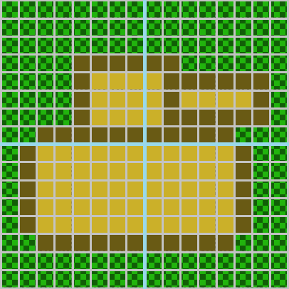

[OpenGL 3D 2021後期 第02回]

# ImGUI

## 習得目標

* 
* 
* 

## 1. 

### 1.1 デフォルトのフォントを変更する

ImGuiのデフォルトフォントは`ProggyClean.ttf`というフォントで、大きさは13ピクセルとなっています。

このフォントには日本語が含まれていないため、そのままでは日本語を表示できません。そこで、デフォルトフォントを日本語フォントに差し替えましょう。

まずいい感じの日本語フォントを探します。ブラウザで「日本語フォント フリー」と入力して、良さそうなフォントを見つけてください。フォントが見つかったらダウンロードして、プロジェクトの`Res`フォルダにコピーしてください。

>**【Dear ImGuiで使えるフォント形式】**<br>
>Dear ImGuiが対応しているのは.TTFと.OTFの2種類です。それ以外の形式は対応していないので使えません。ZIP形式の場合は展開する必要があります。

なお、テキストでは`Makinas-4-Flat.otf`というフォントをダウンロードしたと仮定して進めていきます。

ImGuiでフォントを読み込むには`ImFontAtlas`(イム・フォント・アトラス)クラスの`AddFontFromFileTTF`(アド・フォント・フロム・ファイル・ティーティーエフ)メンバ関数と`Build`(ビルド)メンバ関数を使います。

* `AddFontFromFileTTF`: フォントデータを読み込む。
* `Build`: フォントデータからフォントテクスチャを作成する。

`GameEngine.cpp`を開き、イニシャライズ関数に次のプログラムを追加してください。

```diff
     ImGui_ImplGlfw_InitForOpenGL(window, true);
     const char glsl_version[] = "#version 450";
     ImGui_ImplOpenGL3_Init(glsl_version);
+
+    // ImGuiの入出力を管理するオブジェクトを取得
+    ImGuiIO& io = ImGui::GetIO();
+
+    // デフォルトフォントを指定
+    const float defaultFontPixels = 13.0f; // ImGui標準のフォントサイズ(ピクセル)
+    const float fontPixels = 32.0f; // 作成するフォントのサイズ(ピクセル)
+    ImFont* font = io.Fonts->AddFontFromFileTTF(
+      "Res/Makinas-4-Flat.otf", // 重要: この行を自分のフォントファイル名に変えること
+      fontPixels, nullptr, io.Fonts->GetGlyphRangesJapanese());
+    if (font) {
+      io.FontDefault = font;
+      io.FontGlobalScale = defaultFontPixels / fontPixels;
+    }
+    io.Fonts->Build(); // フォント画像を作成
   }
   return true;
 }
```

ImFontAtlasオブジェクトは、ImGuiの入出力を管理する`IO`(アイ・オー)オブジェクトのメンバです。そのため、まず`GetIO`(ゲット・アイ・オー)関数を使ってIOオブジェクトを取得します。

次にメンバ変数`Fonts`(フォンツ)に対して`AddFontFromFileTTF`関数を呼び出します。第1引数にダウンロードしたファイル名を指定してください。また、日本語を使えるようにするには、第4引数に「有効な文字の範囲」を指定する必要があります。

「有効な文字の範囲」は`GetGlyphRangesJapanese`(ゲット・グリフ・レンジズ・ジャパニーズ)関数で取得できます。

フォントの読み込みに成功したかどうかは戻り値によってわかります。戻り値が`nullptr`以外の場合は成功しているので、デフォルトのフォントを置き換えます。

デフォルトのフォントを置き換えるには、`IO`オブジェクトの`FontDefault`メンバ変数を上書きします。また、フォントはフォントサイズで指定した大きさで表示されます。デフォルトフォントと同じサイズで表示したい場合は、`FontGlobalScale`(フォント・グローバル・スケール)メンバ変数を調整する必要があります。

フォントを置き換えたら、`Build`メンバ関数を使ってフォントテクスチャを作成します。`Build`メンバ関数はデフォルトフォントの作成も担当しているので、フォントの読み込みに失敗した場合でも呼び出しておく意味はあります(ここで実行しない場合は`NewFrame`関数内で呼び出される)。

プログラムが書けたらビルドして実行してください。フォントが変更されていたら成功です。

>**【Dear ImGuiの使い方を調べるには】**<br>
>Dear ImGuiの使い方については、公式GitHubのDocフォルダにある文書がある程度参考になるでしょう。<br>
>ただ、Dear ImGuiはあまり文書化されておらず、詳しい動作を知るためにはソースコードを読むしかない場合も多いです。Google検索してもやり方が分からないときは、あきらめてソースコード読んでください。

### 1.2 スコアを表示する

最初のGUIとして、敵を倒したらスコアが増えるようにして、そのスコアを表示してみます。まずゲームマネージャクラスにスコアを記録する変数を作ります。`GameManager.h`を開き、次のプログラムを追加してください。

```diff
   State state = State::initializeLevel;
   std::shared_ptr<Actor> playerTank;
   std::vector<std::shared_ptr<Actor>> enemies;
+  int score = 0;
 };

 #endif // GAMEMANAGER_H_INCLUDED
```

それから、スコアを加算するメンバ関数を定義します。ゲームマネージャクラスの定義に次のプログラムを追加してください。

```diff
   void Update(float deltaTime);
   void UpdateCamera();
   void UpdateUI();
+
+  void AddScore(int n) { score += n; }

 private:
   GameManager() = default;
```

次に`GameManager.cpp`を開き、アップデート関数に次のプログラムを追加してください。

```diff
     SetState(State::start);
     break;

   case State::start:
+    score = 0;
     SpawnPlayer();
     SpawnEnemies();
```

<pre class="tnmai_assignment">
<strong>【課題01】</strong>
<code>T34TankActor::OnCollision</code>関数に、T34戦車が破壊されたら(<code>isDead</code>が<code>true</code>になったら)、ゲームマネージャのスコアを200点増やすプログラムを追加しなさい。
</pre>

それではスコアを表示してみましょう。`GameManager.cpp`を開き、アップデートユーアイ関数に次のプログラムを追加してください。

```diff
 void GameManager::UpdateUI()
 {
+  // スコア(得点)表示
+  {
+    ImGui::Begin("SCORE");
+    ImGui::Text("%d", score);
+    ImGui::End();
+  }
+
   static bool show_demo_window = true;
   static bool show_another_window = false;
   static ImVec4 clear_color = ImVec4(0.45f, 0.55f, 0.60f, 1.00f);
```

ImGuiでウィンドウを作成するには`Begin`(ビギン)関数と`End`関数をペアで使います。そして、`Begin`と`End`の間にGUIの部品を設定する関数を書くと、その部品がウィンドウに表示される、という仕組みになっています。

<pre class="tnmai_code"><strong>【書式】</strong><code>
void Begin(ウィンドウのタイトル, 閉じるボタンの結果を入れる変数アドレス, 表示方法を制御するフラグ);
</code></pre>

<pre class="tnmai_code"><strong>【書式】</strong><code>
void End();
</code></pre>

ウィンドウに文字列を表示するには`Text`(テキスト)関数を使います。テキスト関数の引数は`printf`と同じです。`%d`のような書式指定文字も使えます。

<pre class="tnmai_code"><strong>【書式】</strong><code>
void Text(書式を指定する文字列, ...);
</code></pre>

プログラムが書けたらビルドして実行してください。画面のどこかにスコアが表示されていたら成功です。それから、敵戦車を倒してスコアが増えることも確認してください。

<pre class="tnmai_assignment">
<strong>【課題02】</strong>
スコアが見やすくなるように、後期第01回で作成したImGuiの動作確認用プログラムを削除しなさい。
</pre>

<p align="center">
<br>
</p>

### 1.3 ウィンドウのサイズを指定する

ウィンドウのサイズは配置する部品に応じて自動的に設定されます。デザインの観点などから、大きさを指定したい場合、`Begin`より前に`SetNextWindowSize`(セット・ネクスト・ウィンドウ・サイズ)関数を呼び出すことで、サイズを指定できます。

スコア表示プログラムに次のプログラムを追加してください。

```diff
   // スコア(得点)表示
   {
+    ImGui::SetNextWindowSize(ImVec2(200, 64));
     ImGui::Begin("SCORE");
     ImGui::Text("%d", score);
     ImGui::End();
```

<pre class="tnmai_code"><strong>【書式】</strong><code>
void SetNextWindowSize(次に表示するウィンドウの座標);
</code></pre>

ImGuiではX方向とY方向の両方を指定する場合、`ImVec2`(イム・ベク・ツー)という2次元ベクトルの構造体を使用します。用途としては`glm::vec2`と同じですが、計算関係の機能がまったく定義されていないので使い勝手は悪いです。

プログラムが書けたらビルドして実行してください。スコアウィンドウが大きく表示されていたら成功です。

また、`SetNextWindowSize`関数のサイズに`0`を指定すると、その方向の大きさは部品のサイズから自動的に計算してくれます。ウィンドウサイズを指定するプログラムを次のように変更してください。

```diff
   // スコア(得点)表示
   {
-    ImGui::SetNextWindowSize(ImVec2(200, 64));
+    ImGui::SetNextWindowSize(ImVec2(200, 0));
     ImGui::Begin("SCORE");
     ImGui::Text("%d", score);
     ImGui::End();
```

プログラムが書けたらビルドして実行してください。Y方向のサイズがテキストに丁度いい大きさになっていると思います。

なお、セットネクストウィンドウサイズ関数には「ウィンドウの大きさを変更できなくする」という効果があります。大きさを変更可能にするには、第2引数に`ImGuiCond`(イムグイ・コンド)列挙型の値を指定します。

<p align="center">
<br>
</p>

### 1.4 ウィンドウの位置を指定する

`SetNextWindowPos`(セット・ネクスト・ウィンドウ・ポス)関数を使うと、ウィンドウの表示位置を指定できます。スコア表示プログラムに次のプログラムを追加してください。

```diff
   // スコア(得点)表示
   {
     ImGui::SetNextWindowSize(ImVec2(200, 0));
+    ImGui::SetNextWindowPos(ImVec2(540, 16));
     ImGui::Begin("SCORE");
     ImGui::Text("%d", score);
```

<pre class="tnmai_code"><strong>【書式】</strong><code>
void SetNextWindowPos(次に表示するウィンドウの大きさ);
</code></pre>

プログラムが書けたらビルドして実行してください。スコアウィンドウが画面中央上部に表示されていたら成功です。

セットネクストウィンドウサイズ関数と同様に、セットネクストウィンドウポス関数には「ウィンドウを移動できなくする」という効果があります。移動可能にするには、第2引数に`ImGuiCond`(イムグイ・コンド)列挙型の値を指定します。

>**【ImGuiの座標系】**<br>
>ImGuiの座標系は、左上を原点とするスクリーン座標系です。アプリケーションのウィンドウサイズが1280x720の場合、左上が(0, 0)、右下が(1280, 720)、中央が(640, 360)となります。<br>
>なお、アプリケーションのウィンドウサイズが変化しても、GUIが同じ位置に表示されるようにする簡単な方法はありません。アプリケーション側で工夫する必要があります。

### 1.5 文字サイズを指定する

スコアの文字が小さくて見づらいので、フォントサイズを大きくしましょう。文字の表示サイズを変更するには`SetWindowFontScale`(セット・ウィンドウ・フォント・スケール)関数を使います。

スコア表示プログラムに次のプログラムを追加してください。

```diff
     ImGui::SetNextWindowSize(ImVec2(200, 0));
     ImGui::SetNextWindowPos(ImVec2(540, 16));
     ImGui::Begin("SCORE");
+    ImGui::SetWindowFontScale(3.0f);
     ImGui::Text("%d", score);
     ImGui::End();
```

<pre class="tnmai_code"><strong>【書式】</strong><code>
void SetWindowFontScale(文字の拡大縮小率);
</code></pre>

拡大縮小率に`1.0`を指定すると等倍、`0.5`なら1/2倍、`2.0`なら2倍の大きさで表示されます。

セットウィンドウフォントスケール関数は、`Begin`と`End`の間で使用しなくてはなりません。また、この関数によってあるウィンドウの文字表示サイズを変更しても、他のウィンドウの文字サイズには影響しません。

### 1.6 文字に色を付ける

文字に色を付けるにはテキスト関数の代わりに`TextColored`(テキスト・カラード)関数を使います。スコア表示プログラムを次のように変更してください。

```diff
     ImGui::SetNextWindowPos(ImVec2(540, 16));
     ImGui::Begin("SCORE");
     ImGui::SetWindowFontScale(3.0f);
-    ImGui::Text("%d", score);
+    ImGui::TextColored(ImVec4(0.1f, 0.1f, 1.0f, 1.0f), "%d", score);
     ImGui::End();
   }
```

<pre class="tnmai_code"><strong>【書式】</strong><code>
void TextColored(文字色, 書式を指定する文字列, ...);
</code></pre>

文字の色はテキストカラード関数の第1引数で指定します。第2引数以降はテキスト関数と同じです。

プログラムが書けたらビルドして実行してください。文字が青色になっていたら成功です。

### 1.7 タイトルバーを消す

タイトルバーが邪魔な場合は消すことができます。タイトルバーを消すにはビギン関数の第3引数に`ImGuiWindowFlags_NoTitleBar`(イムグイ・ウィンドウ・フラッグズ・ノー・タイトルバー)という値を指定します。

スコア表示プログラムを次のように変更してください。

```diff
     ImGui::SetNextWindowSize(ImVec2(200, 0));
     ImGui::SetNextWindowPos(ImVec2(540, 16));
-    ImGui::Begin("SCORE");
+    ImGui::Begin("SCORE", nullptr, ImGuiWindowFlags_NoTitleBar);
     ImGui::SetWindowFontScale(3.0f);
     ImGui::TextColored(ImVec4(0.1f, 0.1f, 1.0f, 1.0f), "%d", score);
```

プログラムが書けたらビルドして実行してください。タイトルバーが消えていたら成功です。

### 1.8 背景を消す

タイトルバーだけでなく、ウィンドウの背景も消すことができます。背景を消すにはビギン関数の第3引数に`ImGuiWindowFlags_NoBackground`(イムグイ・ウィンドウ・フラッグズ・ノー・バックグラウンド)という値を指定します。

スコア表示プログラムを次のように変更してください。

```diff
     ImGui::SetNextWindowSize(ImVec2(200, 0));
     ImGui::SetNextWindowPos(ImVec2(540, 16));
-    ImGui::Begin("SCORE", nullptr, ImGuiWindowFlags_NoTitleBar);
+    ImGui::Begin("SCORE", nullptr, ImGuiWindowFlags_NoBackground);
     ImGui::SetWindowFontScale(3.0f);
     ImGui::TextColored(ImVec4(0.1f, 0.1f, 1.0f, 1.0f), "%d", score);
```

プログラムが書けたらビルドして実行してください。ウィンドウの背景が消えていたら成功です。

### 1.9 タイトルバーと背景の療法を消す

タイトルバーと背景を両方とも消すには、ビギン関数の第3引数に両方の値を指定します。スコア表示プログラムを次のように変更してください。

```diff
     ImGui::SetNextWindowSize(ImVec2(200, 0));
     ImGui::SetNextWindowPos(ImVec2(540, 16));
-    ImGui::Begin("SCORE", nullptr, ImGuiWindowFlags_NoBackground);
+    ImGui::Begin("SCORE", nullptr, ImGuiWindowFlags_NoBackground | ImGuiWindowFlags_NoTitleBar);
     ImGui::SetWindowFontScale(3.0f);
     ImGui::TextColored(ImVec4(0.3f, 0.9f, 1.0f, 1.0f), "%d", score);
```

プログラムが書けたらビルドして実行してください。タイトルバーと背景の両方が消えて、スコアだけが表示されていたら成功です。

### 1.10 文字に影をつける

スコアのようなGUIは、ゲームを邪魔しないようにあまり飾りがないほうがよいでしょう。しかし、単色の文字だけだとゲームの背景に埋もれてしまい、見づらい場面が出てきます。

そこで、文字に影をつけてゲーム背景から浮いて見えるようにしてみます。影をつける簡単な方法は、影方向にずらした文字と、本来の文字の2回描画することです。

ただし、ImGuiでは、GUI部品を配置するたびに自動的に表示位置が変化してしまいます。そこで、文字を表示する前に表示座標を取得しておき、2回目の文字は取得した座標に対して表示するようにします。

スコア表示プログラムに次のプログラムを追加してください。

```diff
     ImGui::SetNextWindowPos(ImVec2(540, 16));
     ImGui::Begin("SCORE", nullptr, ImGuiWindowFlags_NoBackground | ImGuiWindowFlags_NoTitleBar);
     ImGui::SetWindowFontScale(3.0f);
+    const ImVec2 pos = ImGui::GetCursorPos();
+    ImGui::SetCursorPos(ImVec2(pos.x + 3, pos.y + 3));
     ImGui::TextColored(ImVec4(0.3f, 0.9f, 1.0f, 1.0f), "%d", score);
+    ImGui::SetCursorPos(pos);
+    ImGui::TextColored(ImVec4(1.0f, 1.0f, 1.0f, 1.0f), "%d", score);
     ImGui::End();
   }
```

次に描画するGUI部品の位置を取得するには`GetCusorPos`(ゲット・カーソル・ポス)関数を使います。GUI部品の位置を設定するには`SetCursorPos`(セット・カーソル・ポス)関数を使います。

<pre class="tnmai_code"><strong>【書式】</strong><code>
次にGUI部品を表示する座標 GetCursorPos();
</code></pre>

<pre class="tnmai_code"><strong>【書式】</strong><code>
void SetCursorPos(次にGUI部品を表示する座標);
</code></pre>

プログラムが書けたらビルドして実行してください。青い影の付いた白い文字が表示されていたら成功です。

>**【影付き文字の表示について】**<br>
>ImGui自体には文字に影をつける機能がありません。そのため、上記のように文字を2回描画する方法をとらざるを得ません。影付き文字を何度も表示する場合、上記の処理を関数にしておくとよいでしょう。

### 1.11 プレイヤーのHPを表示する

次に、プレイヤーの耐久力を表示します。多くのゲームでは、体力、耐久力と行ったパラメータを「棒グラフ」で表現しています。

ImGuiには「プログレス・バー」という、横棒グラフを表示する機能があります。「プログレス(progress)」は「進捗(しんちょく)、経過(けいか)」という意味です。名前のとおり、本来はデータのロードや変換、インストールの進行率を表示するための機能ですが、HPバーなどの表示に使うこともできます。

プログレスバーを表示するには`ProgressBar`(プログレス・バー)関数を使います。スコアを表示するプログラムの下に、次のプログラムを追加してください。

```diff
     ImGui::TextColored(ImVec4(1.0f, 1.0f, 1.0f, 1.0f), "%d", score);
     ImGui::End();
   }
+
+  // プレイヤーのHP表示
+  if (playerTank) {
+    ImGui::Begin("HP");
+    const float maxPlayerHealth = 10;
+    const float f = playerTank->health / maxPlayerHealth;
+    ImGui::ProgressBar(f);
+    ImGui::End();
+  }
 }

 /**
 * プレイヤーの戦車を生成する
```

<pre class="tnmai_code"><strong>【書式】</strong><code>
void ProgressBar(進捗率, バーの最大サイズ, バーの右に表示する文字列);
</code></pre>

プログラムが書けたらビルドして実行してください。画面のどこかにHPバーが表示されていたら成功です。

<p align="center">
<br>
</p>

<pre class="tnmai_assignment">
<strong>【課題03】</strong>
HPバーを表示するウィンドウのタイトルバーと背景を消しなさい。
</pre>

<pre class="tnmai_assignment">
<strong>【課題04】</strong>
HPバーを表示するウィンドウの位置とサイズを設定しなさい。位置とサイズは自由に決めて構いません。
</pre>

### 1.12 プッシュ、ポップによる色の指定

ImGuiにおいて、GUI部品の色を指定する方法は2つあります。

* `PushStyleColor`(プッシュ・スタイル・カラー)関数と`PopStyleColor`(ポップ・スタイル・カラー)関数のペアを使う。1～2種類の色を変更する場合は使いやすいが、それ以上はペアの管理が面倒。
* `GetStyle`(ゲット・スタイル)関数で取得したスタイル構造体に直接色を設定する。3種類以上の色を変更する場合、または色以外のスタイルも変更したい場合は、こちらのほうが使いやすい。

まずはプッシュとポップを使う方法を試してみましょう。HPバーを表示するプログラムに次のプログラムを追加してください。

```diff
     ImGui::SetNextWindowSize(ImVec2(300, 40));
     ImGui::SetNextWindowPos(ImVec2(490, 340));
     ImGui::Begin("HP", nullptr, ImGuiWindowFlags_NoBackground | ImGuiWindowFlags_NoTitleBar);
+    ImGui::PushStyleColor(ImGuiCol_PlotHistogram, ImVec4(1, 0, 0, 1));
+    ImGui::PushStyleColor(ImGuiCol_FrameBg, ImVec4(1.0f, 0, 0, 0.5f));
     const float maxPlayerHealth = 10;
     const float f = playerTank->health / maxPlayerHealth;
     ImGui::ProgressBar(f);
+    ImGui::PopStyleColor();
+    ImGui::PopStyleColor();
     ImGui::End();
   }
 }
```

<pre class="tnmai_code"><strong>【書式】</strong><code>
void PushStyleColor(カラー列挙値, 指定する色);
</code></pre>

<pre class="tnmai_code"><strong>【書式】</strong><code>
void PopStyleColor();
</code></pre>

プログレスバーは「バー本体の色」と「背景食」の2つを別々に指定できます。

| 場所 | 列挙値 |
|:----:|:------|
| バー本体 | <ruby>ImGuiCol_PlotHistogram<rt>イムグイ・コル・プロット・ヒストグラム</rt></ruby> |
| 背景     | <ruby>ImGuiCol_FrameBg<rt>イムグイ・コル・フレーム・ビージー</rt></ruby> |

上記のプログラムではどちらにも赤色を指定しています。ただし、背景の不透明度を`0.5`に設定して、バー本体と見分けられるようにしています。

プログラムが書けたらビルドして実行してください。HPバーが赤色になっていたら成功です。

### 1.13 スタイル構造体による色の指定

プッシュとポップの組み合わせでは、プッシュしたのと同じ回数だけポップを実行しなくてはなりません。もしポップが多すぎたり少なすぎたりすると実行時エラーになります。

しかし、デザインを調整するときなどは頻繁にプッシュする項目数が変化するでしょう。そのような場合、スタイル構造体を直接編集するほうが管理しやすくなります。

プッシュ及びポップと同じことを、スタイル構造体を編集する方法を使ってやってみます。まず、スタイル構造体の参照を取得し、元の状態に戻すためのバックアップを作ります。アップデートユーアイ関数の先頭に次のプログラムを追加してください。

```diff
 void GameManager::UpdateUI()
 {
+  ImGuiStyle& style = ImGui::GetStyle(); // スタイル構造体を取得
+  const ImGuiStyle styleBackup = style;    // 元に戻すためのバックアップ
+
   // スコア(得点)表示
   {
```

<pre class="tnmai_code"><strong>【書式】</strong><code>
スタイル構造体への参照 GetStyle();
</code></pre>

次に、HPバーを表示するプログラムを、次のように変更してください。

```diff
     ImGui::SetNextWindowSize(ImVec2(300, 40));
     ImGui::SetNextWindowPos(ImVec2(490, 340));
     ImGui::Begin("HP", nullptr, ImGuiWindowFlags_NoBackground | ImGuiWindowFlags_NoTitleBar);
-    ImGui::PushStyleColor(ImGuiCol_PlotHistogram, ImVec4(1, 0, 0, 1));
-    ImGui::PushStyleColor(ImGuiCol_FrameBg, ImVec4(1.0f, 0, 0, 0.5f));
+    style.Colors[ImGuiCol_PlotHistogram] = ImVec4(1, 0, 0, 1);
+    style.Colors[ImGuiCol_FrameBg] = ImVec4(1.0f, 0, 0, 0.5f);
     const float maxPlayerHealth = 10;
     const float f = playerTank->health / maxPlayerHealth;
     ImGui::ProgressBar(f);
-    ImGui::PopStyleColor();
-    ImGui::PopStyleColor();
+    style = styleBackup; // スタイルを元に戻す
     ImGui::End();
   }
 }
```

スタイル構造体を直接編集するほうが、スタイルを元に戻す部分が簡単になっていることが分かると思います。

直接編集する方法では「スタイル構造体全体をバックアップして元に戻す」という操作を行うため、元に戻すために多少時間がかかります。変更する要素が少ない場合はプッシュ及びポップを使うほうが効率的です。

プログラムが書けたらビルドして実行してください。プッシュ及びポップを使った場合と全く同じ表示なっているはずです。

### 1.14 プログレスバーのデザインを調整する

スタイル構造体には色以外にも様々なパラメータを設定できます。HPバーを表示するプログラムに次のプログラムを追加してください。

```diff
     style.Colors[ImGuiCol_PlotHistogram] = ImVec4(1, 0, 0, 1);
     style.Colors[ImGuiCol_FrameBg] = ImVec4(1.0f, 0, 0, 0.5f);
+    style.FrameRounding = 8.0f; // ふちの丸さ
     const float maxPlayerHealth = 10;
     const float f = playerTank->health / maxPlayerHealth;
     ImGui::ProgressBar(f);
```

プログラムが書けたらビルドして実行してください。プログレスバーのふちが丸くなっていたら成功です。

このように、`FrameRounding`(フレーム・ラウンディング)変数に`0`より大きい値を指定すると、ウィンドウのふちを丸くすることができます。数値は円の半径(ピクセル単位)です。

さらに次のプログラムを追加してください。

```diff
     style.Colors[ImGuiCol_PlotHistogram] = ImVec4(1, 0, 0, 1);
     style.Colors[ImGuiCol_FrameBg] = ImVec4(1.0f, 1, 1, 1.0f);
+    style.FrameBorderSize = 3.0f; // 枠の太さ
+    style.Colors[ImGuiCol_Border] = ImVec4(1, 1, 1, 1); // 枠の色
     style.FrameRounding = 8.0f; // ふちの丸さ
     const float maxPlayerHealth = 10;
     const float f = playerTank->health / maxPlayerHealth;
```

プログラムが書けたらビルドして実行してください。プログレスバーに白い縁取りが付いていたら成功です。

`FrameBorderSize`(フレーム・ボーダー・サイズ)変数に`0`より大きい値を指定すると、ウィンドウが縁取りされるようになります。縁取りの色は`ImGuiCol_Border`(イムグイ・コル・ボーダー)列挙値によって指定します。

### 1.15 プログレスバーに表示される文字を消す

プログレスバーには自動的にパーセントが表示されます。これを消したり、別の文字を表示するにはプログレスバー関数の第3引数に表示したい文字列を指定します。

例えば、パーセント表示を消すには次のように空文字列を指定します。

```diff
     const float maxPlayerHealth = 10;
     const float f = playerTank->health / maxPlayerHealth;
-    ImGui::ProgressBar(f);
+    ImGui::ProgressBar(f, ImVec2(0, 0), "");
     style = styleBackup; // スタイルを元に戻す
     ImGui::End();
   }
 }
```

パーセントではない独自の表示を行う場合は`sprintf`関数などを使って文字列を作成する必要があります。また、左寄せや右寄せ、センタリングを行いたい場合、セットカーソルポス関数で位置を指定してテキスト関数で表示するとよいでしょう。

<pre class="tnmai_assignment">
<strong>【課題05】</strong>
スタイルのパラメータを調整して、自分の好みのスタイルでHPバーが表示されるようにしなさい。
</pre>

### 1.16 画像を表示する

ImGuiには、読み込んだテクスチャを表示する機能もあります。ImGuiテクスチャを表示するには`Image`(イメージ)関数を使います。

<pre class="tnmai_code"><strong>【書式】</strong><code>
void Image(テクスチャID, 表示サイズ, 表示範囲の左下, 表示範囲の右上, 表示色, 枠線の色);
</code></pre>

書式にあるように、イメージ関数でテクスチャを表示するには「テクスチャID」が必要です。ただ、本テキストで作ってもらった`Texture`クラスは、テクスチャIDをプライベートにしているので取得できません。そこで、IDを取得する機能を追加します。

`Texture.h`を開き、テクスチャクラスの定義に次のプログラムを追加してください。

```diff
   // バインド管理
   void Bind(GLuint unit) const;
   void Unbind(GLuint unit) const;
+
+  // テクスチャIDを取得
+  GLuint GetId() const { return id; }

 private:
   std::string name; // 画像ファイル名.
```

これでテクスチャIDを取得できるようになりました。

さて、何の画像を表示するかですが…とりあえず敵アイコンを作成して、残っている敵の数だけアイコンを並べて表示してみましょう。

<pre class="tnmai_assignment">
<strong>【課題06】</strong>
<code>Res</code>フォルダに<code>IconEnemy.tga</code>というTGAファイルを追加してください。
Visual Studioで画像サイズを「幅:16、高さ:16」に変更し、次のような画像を作成してください。
<div style="text-align:center;"></div></pre>

まずは敵アイコンを表示するためのウィンドウを作成します。HPバーを表示するプログラムの下に、次のプログラムを追加してください。

```diff
     style = styleBackup; // スタイルを元に戻す
     ImGui::End();
   }
+
+  // 敵の数を表示
+  {
+    ImGui::Begin("EnemyCount", nullptr, ImGuiWindowFlags_NoTitleBar);
+    ImGui::End();
+  }
 }

 /**
 * プレイヤーの戦車を生成する
```

<pre class="tnmai_assignment">
<strong>【課題07】</strong>
敵の数を表示するウィンドウの位置とサイズを設定するプログラムを追加しなさい。
</pre>

作成したテクスチャを読み込むために、ゲームエンジンの参照を取得します。アップデートユーアイ関数の先頭に次のプログラムを追加してください。

```diff
 void GameManager::UpdateUI()
 {
+  GameEngine& engine = GameEngine::Get(); // ゲームエンジンを取得
   ImGuiStyle& style = ImGui::GetStyle(); // スタイル構造体を取得
   const ImGuiStyle styleBackup = style;    // 元に戻すためのバックアップ
```

それではテクスチャを読み込み、ちょっと前に追加した`GetId`メンバ関数を使ってテクスチャIDを取得します。敵の数を表示するプログラムに次のプログラムを追加してください。

```diff
   // 敵の数を表示
   {
     ImGui::Begin("EnemyCount", nullptr, ImGuiWindowFlags_NoTitleBar);
+    std::shared_ptr<Texture> tex = engine.LoadTexture("Res/IconEnemy.tga");
+    const ImTextureID texId = reinterpret_cast<ImTextureID>(tex->GetId());
     ImGui::End();
   }
 }
```

ImGuiのルールとして、テクスチャIDは`ImTextureId`(イム・テクスチャ・アイディー)型に変換しなくてはなりません。また、`ImTextureId`は`void*`の別名(typedef)なので、C++でキャストを行う場合は`reinterpret_cast`(リインタープリト・キャスト)を使う必要があります。

これでImGuiで使えるテクスチャIDが手に入りました。`for`を使って敵の数だけこのテクスチャを表示します。敵の数を表示するプログラムに、次のプログラムを追加してください。

```diff
     ImGui::Begin("EnemyCount", nullptr, ImGuiWindowFlags_NoTitleBar);
     std::shared_ptr<Texture> tex = engine.LoadTexture("Res/IconEnemy.tga");
     const ImTextureID texId = reinterpret_cast<ImTextureID>(tex->GetId());
+    for (const std::shared_ptr<Actor>& e : enemies) {
+      if (!e->isDead) {
+        ImGui::SameLine();
+        ImGui::Image(0, ImVec2(40, 40));
+      }
+    }
     ImGui::End();
   }
 }
```

<pre class="tnmai_code"><strong>【書式】</strong><code>
void SameLine();
</code></pre>

`SameLine`(セイム・ライン)関数は、次に配置するGUI部品を位置が、直前の部品と同じ行になるように設定します。

プログラムが書けたらビルドして実行してください。ウィンドウ内に敵アイコンが表示されていたら成功です。

<pre class="tnmai_assignment">
<strong>【課題08】</strong>
敵アイコンが適切に表示されるように、敵の数を表示するウィンドウの位置と大きさを調整しなさい。
</pre>

### 1.17 レーダーを表示する

敵の位置が分かるとゲームが遊びやすくなります。そこで、プレイヤーと敵戦車の位置関係が分かるレーダーを表示しましょう。作成するレーダーの仕様を次に示します。

* レーダーの形状: 円形
* 中心にプレイヤーを示す黄色い三角形を表示。
* プレイヤーから見た敵の位置に、敵を示す赤点を表示。

レーダーやミニマップのように、表示する部品の位置が毎回違ったり、GUI部品というよりアイコンや図形を表示したいだけの場合、GUI部品のかわりに「ドローリスト」という機能を使うほうが簡単なことが多いです。

そこで、今回はドローリストを使ってレーダーを表示します。とりあえずレーダー用のウィンドウを作成しましょう。敵アイコンを表示するプログラムの下に、次のプログラムを追加してください。

```diff
     }
     ImGui::End();
   }
+
+  // レーダーを表示
+  {
+    const float radius = 100; // レーダーの半径
+    const ImVec2 windowSize(
+      radius * 2 + std::max(style.WindowBorderSize, style.WindowPadding.x) * 2,
+      radius * 2 + std::max(style.WindowBorderSize, style.WindowPadding.y) * 2);
+    const ImVec2 windowPos(1280 - 16 - windowSize.x, 720 - 16 - windowSize.y);
+    ImGui::SetNextWindowSize(windowSize);
+    ImGui::SetNextWindowPos(windowPos);
+    ImGui::Begin("Lader", nullptr, ImGuiWindowFlags_NoDecoration);
+    ImGui::End();
+  }
 }

 /**
 * プレイヤーの戦車を生成する
```

セットネクストウィンドウサイズ関数では、枠線や余白、タイトルバーを含めたサイズを指定します。そのため、表示したい部品のサイズ(今回の場合は半径×2)を指定すると、部品の表示範囲が不足する場合があります。

上記の`windowSize`変数は、枠線と余白を考慮してウィンドウの大きさを計算する方法を示しています。タイトルバーを表示する場合は高さに`GetFontSize().y + style.FramePadding.y * 2`を加算してください。

また、`windowPos`(ウィンドウ・ポス)変数の計算で`16`を引いているのは、レーダーウィンドウを「画面右下から16ピクセル開けて表示するため」です。

プログラムが書けたらビルドして実行してください。右下に四角いウィンドウが追加されていたら成功です。

<p align="center">
<br>
</p>

それではドローリストを使ってレーダーを表示しましょう。レーダーを表示するプログラムに次のプログラムを追加してください。

```diff
     ImGui::SetNextWindowSize(windowSize);
     ImGui::SetNextWindowPos(windowPos);
     ImGui::Begin("Lader", nullptr, ImGuiWindowFlags_NoDecoration);
+
+    // レーダーの円を表示
+    ImDrawList* drawlist = ImGui::GetWindowDrawList();
+    ImVec2 center = ImGui::GetCursorScreenPos();
+    center.x += radius;
+    center.y += radius;
+    drawlist->AddCircleFilled(center, radius, ImColor(1.0f, 1.0f, 1.0f, 0.5f));
+
     ImGui::End();
   }
```

ImGuiのドローリストは`ImDrawList`(イム・ドロー・リスト)型のオブジェクトになっています。ドローリストとは、簡単に言うとOpenGLにおける「プリミティブ」の配列です。ドローリストを取得するには`GetWindowDrawList`関数を使います。

<pre class="tnmai_code"><strong>【書式】</strong><code>
ImDrawList* GetWindowDrawList();
</code></pre>

`AddCircleFilled`(アド・サークル・フィルド)メンバ関数は、塗りつぶしありの円プリミティブを追加する関数です。

<pre class="tnmai_code"><strong>【書式】</strong><code>
void ImDrawList::AddCircleFilled(中心座標, 半径, 円の色);
</code></pre>

なお、ドローリストに追加するプリミティブの座標は、全てスクリーン座標で指定します。ウィンドウ座標からの相対座標ではありませんので注意してください。そのため、相対座標を返すゲットカーソルポス関数は使えません。

かわりに`GetCursorScreenPos`(ゲット・カーソル・スクリーン・ポス)関数を使わなくてはなりません。

<pre class="tnmai_code"><strong>【書式】</strong><code>
ImVec2 GetCursorScreenPos();
</code></pre>

プログラムが書けたらビルドして実行してください。右下のウィンドウに白い円が表示されていたら成功です。

<p align="center">
<br>
</p>

### 1.18 レーダーにプレイヤーと敵を表示する

レーダー上に、プレイヤーを表す三角形を表示します。レーダーの円を表示するプログラムの下に、次のプログラムを追加してください。

```diff
     center.x += radius;
     center.y += radius;
     drawlist->AddCircleFilled(center, radius, ImColor(1.0f, 1.0f, 1.0f, 0.5f));
+
+    // プレイヤーを表示
+    ImVec2 p1(center.x, center.y - 6);
+    ImVec2 p2(center.x - 4, center.y + 4);
+    ImVec2 p3(center.x + 4, center.y + 4);
+    drawlist->AddTriangle(p1, p2, p3, ImColor(1.0f, 1.0f, 0.1f), 2.0f);

     ImGui::End();
   }
```

ドローリストを使って三角形を表示するには`AddTriangle`(アド・トライアングル)メンバ関数を使います。

<pre class="tnmai_code"><strong>【書式】</strong><code>
void AddTriangle(頂点1の座標, 頂点2の座標, 頂点3の座標, 三角形の色);
</code></pre>

プログラムが書けたらビルドして実行してください。レーダーの中心に黄色い三角形が表示されていたら成功です。

<pre class="tnmai_assignment">
<strong>【課題09】</strong>
プレイヤーを示す三角形の内側を塗りつぶしなさい。
</pre>

次に敵を表示します。1.17に書かれた仕様によると、敵は赤点で表示するのでした。黄色い三角形を表示するプログラムの下に、次のプログラムを追加してください。

```diff
     ImVec2 p3(center.x + 4, center.y + 4);
     drawlist->AddTriangle(p1, p2, p3, ImColor(1.0f, 1.0f, 0.1f), 2.0f);
+
+    // 敵を表示
+    if (playerTank) {
+      for (const std::shared_ptr<Actor>& e : enemies) {
+        if (!e->isDead) {
+          const glm::vec3 v = e->position - playerTank->position;
+          const ImVec2 p(center.x + v.x, center.y - v.z);
+          drawlist->AddCircleFilled(p, 2.0f, ImColor(1.0f, 0.1f, 0.1f));
+        }
+      }
+    }

     ImGui::End();
   }
```

プログラムが書けたらビルドして実行してください。レーダーに敵を示す赤い点が表示されていたら成功です。

<p align="center">
<br>
</p>

<pre class="tnmai_assignment">
<strong>【課題10】</strong>
赤い点までの距離がレーダー半径より短い場合だけ、赤い点を表示するようにしなさい。
</pre>

<pre class="tnmai_assignment">
<strong>【課題11】</strong>
レーダーに枠を付けなさい。<code>imgui.h</code>からドローリストに円を追加する関数を探して使うとよいでしょう。
</pre>

<pre class="tnmai_assignment">
<strong>【課題11】</strong>
レーダーウィンドウの背景を非表示にしなさい。
</pre>

<pre class="tnmai_assignment">
<strong>【課題12】</strong>
レーダーの中心を通る垂直線と水平線を表示しなさい。
</pre>

<pre class="tnmai_assignment">
<strong>【課題13】</strong>
プレイヤーを示す三角形の先端が、プレイヤーの向いている方向を指すように三角形を回転させなさい。
<code>sin</code>, <code>cos</code>を使う、またはGLMライブラリの関数を使うとよいでしょう。
</pre>

>**【1章のまとめ】**<br>
>
>* 
>* 

<div style="page-break-after: always"></div>

## 2. 

### 2.1 


>**【2章のまとめ】**<br>
>
>* 
>* 
