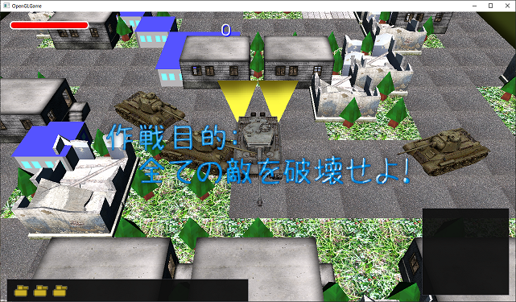
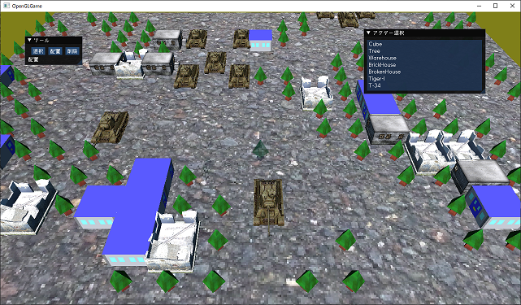
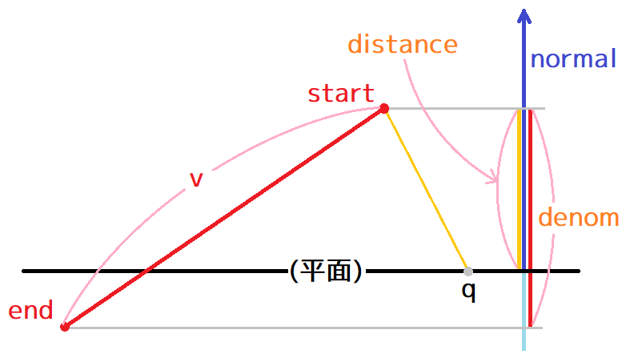

[OpenGL 3D 2021後期 第02回]

# ImGUIの使い方

## 習得目標

* ImGuiのフォントを変更できる。
* ImGuiを使って体力バーや独自形式のUIを表示できる。
* マウスカーソル位置を3D空間の座標に変換する方法を理解する。

## 1. ゲームUIの作成

### 1.1 デフォルトのフォントを変更する

ImGuiのデフォルトフォントは`ProggyClean.ttf`というフォントで、大きさは13ピクセルとなっています。

このフォントには日本語が含まれていないため、そのままでは日本語を表示できません。そこで、デフォルトフォントを日本語フォントに差し替えましょう。そのために、まずはいい感じの日本語フォントを探します。

>**【Dear ImGuiで使えるフォント形式】**<br>
>Dear ImGuiが対応しているのは.TTFと.OTFの2種類です。それ以外の形式は対応していないので使えません。ZIP形式の場合は展開する必要があります。

<pre class="tnmai_assignment">
<strong>【課題01】</strong>
ブラウザで「日本語フォント フリー」と入力して、良さそうなフォントを見つけなさい。フォントが見つかったらダウンロードして、プロジェクトの<code>Res</code>フォルダにコピーしておくこと。
</pre>

なお、テキストでは`Makinas-4-Flat.otf`というフォントをダウンロードしたと仮定して進めていきます。

ImGuiでフォントを読み込むには`ImFontAtlas`(イム・フォント・アトラス)クラスの
`AddFontFromFileTTF`(アド・フォント・フロム・ファイル・ティーティーエフ)メンバ関数と`Build`(ビルド)メンバ関数を使います。

* `AddFontFromFileTTF`: フォントデータを読み込む。
* `Build`: フォントデータからフォントテクスチャを作成する。

`GameEngine.cpp`を開き、イニシャライズ関数に次のプログラムを追加してください。

```diff
     ImGui_ImplGlfw_InitForOpenGL(window, true);
     const char glsl_version[] = "#version 450";
     ImGui_ImplOpenGL3_Init(glsl_version);
+
+    // ImGuiの入出力を管理するオブジェクトを取得
+    ImGuiIO& io = ImGui::GetIO();
+
+    // デフォルトフォントを指定
+    const float defaultFontPixels = 13.0f; // ImGui標準のフォントサイズ(ピクセル)
+    const float fontPixels = 32.0f; // 作成するフォントのサイズ(ピクセル)
+    ImFont* font = io.Fonts->AddFontFromFileTTF(
+      "Res/Makinas-4-Flat.otf", // 重要: この行を自分のフォントファイル名に変えること
+      fontPixels, nullptr, io.Fonts->GetGlyphRangesJapanese());
+    if (font) {
+      io.FontDefault = font;
+      io.FontGlobalScale = defaultFontPixels / fontPixels;
+    }
+    io.Fonts->Build(); // フォント画像を作成
   }
   return true;
 }
```

ImFontAtlasオブジェクトは、ImGuiの入出力を管理する`IO`(アイ・オー)オブジェクトのメンバです。そのため、まず`GetIO`(ゲット・アイ・オー)関数を使ってIOオブジェクトを取得します。

次にメンバ変数`Fonts`(フォンツ)に対して`AddFontFromFileTTF`関数を呼び出します。第1引数にダウンロードしたファイル名を指定してください。また、日本語を使えるようにするには、第4引数に「有効な文字の範囲」を指定する必要があります。

「有効な文字の範囲」は`GetGlyphRangesJapanese`(ゲット・グリフ・レンジズ・ジャパニーズ)関数で取得できます。

フォントの読み込みに成功したかどうかは戻り値によってわかります。戻り値が`nullptr`以外の場合は成功しているので、デフォルトのフォントを置き換えます。

デフォルトのフォントを置き換えるには、`IO`オブジェクトの`FontDefault`メンバ変数を上書きします。また、フォントはフォントサイズで指定した大きさで表示されます。デフォルトフォントと同じサイズで表示したい場合は、`FontGlobalScale`(フォント・グローバル・スケール)メンバ変数を調整する必要があります。

フォントを置き換えたら、`Build`メンバ関数を使ってフォントテクスチャを作成します。
`Build`メンバ関数はデフォルトフォントの作成も担当しているので、フォントの読み込みに失敗した場合でも呼び出しておく意味はあります(ここで実行しない場合は`NewFrame`関数内で呼び出される)。

プログラムが書けたらビルドして実行してください。フォントが変更されていたら成功です。

>**【Dear ImGuiの使い方を調べるには】**<br>
>Dear ImGuiの使い方については、公式GitHubのDocフォルダにある文書がある程度参考になるでしょう。<br>
>ただ、Dear ImGuiはあまり文書化されておらず、詳しい動作を知るためにはソースコードを読むしかない場合も多いです。Google検索してもやり方が分からないときは、あきらめてソースコード読んでください。

### 1.2 スコアを表示する

最初のGUIとして、敵を倒したらスコアが増えるようにして、そのスコアを表示してみます。まずゲームマネージャクラスにスコアを記録する変数を作ります。`GameManager.h`を開き、次のプログラムを追加してください。

```diff
   State state = State::initializeLevel;
   std::shared_ptr<Actor> playerTank;
   std::vector<std::shared_ptr<Actor>> enemies;
+  int score = 0;
 };

 #endif // GAMEMANAGER_H_INCLUDED
```

それから、スコアを加算するメンバ関数を定義します。ゲームマネージャクラスの定義に次のプログラムを追加してください。

```diff
   void Update(float deltaTime);
   void UpdateCamera();
   void UpdateUI();
+
+  void AddScore(int n) { score += n; }

 private:
   GameManager() = default;
```

次に`GameManager.cpp`を開き、アップデート関数に次のプログラムを追加してください。

```diff
   switch (state) {
   case State::start:
+    score = 0;
     SpawnPlayer();
     SpawnEnemies();
```

<pre class="tnmai_assignment">
<strong>【課題02】</strong>
<code>T34TankActor::OnCollision</code>関数に、T34戦車が破壊されたら(<code>isDead</code>が<code>true</code>になったら)、ゲームマネージャのスコアを200点増やすプログラムを追加しなさい。
</pre>

それではスコアを表示してみましょう。`GameManager.cpp`を開き、アップデートユーアイ関数に次のプログラムを追加してください。

```diff
 void GameManager::UpdateUI()
 {
+  // スコア(得点)表示
+  {
+    ImGui::Begin("SCORE");
+    ImGui::Text("%d", score);
+    ImGui::End();
+  }
+
   static bool show_demo_window = true;
   static bool show_another_window = false;
```

ImGuiでウィンドウを作成するには`Begin`(ビギン)関数と`End`関数をペアで使います。そして、`Begin`と`End`の間にGUIの部品を設定する関数を書くと、その部品がウィンドウに表示される、という仕組みになっています。

<pre class="tnmai_code"><strong>【書式】</strong><code>
void Begin(ウィンドウのタイトル, 閉じるボタンの結果を入れる変数アドレス, 表示方法を制御するフラグ);
</code></pre>

<pre class="tnmai_code"><strong>【書式】</strong><code>
void End();
</code></pre>

ウィンドウに文字列を表示するには`Text`(テキスト)関数を使います。テキスト関数の引数は`printf`と同じです。`%d`のような書式指定文字も使えます。

<pre class="tnmai_code"><strong>【書式】</strong><code>
void Text(書式を指定する文字列, ...);
</code></pre>

プログラムが書けたらビルドして実行してください。画面のどこかにスコアが表示されていたら成功です。それから、敵戦車を倒してスコアが増えることも確認してください。

<pre class="tnmai_assignment">
<strong>【課題03】</strong>
スコアが見やすくなるように、後期第01回で作成したImGuiの動作確認用プログラムを削除しなさい。
</pre>

<p align="center">
<br>
</p>

### 1.3 ウィンドウのサイズを指定する

ウィンドウのサイズは配置する部品に応じて自動的に設定されます。デザインの観点などから、大きさを指定したい場合、`Begin`より前に`SetNextWindowSize`(セット・ネクスト・ウィンドウ・サイズ)関数を呼び出すことで、サイズを指定できます。

スコア表示プログラムに次のプログラムを追加してください。

```diff
   // スコア(得点)表示
   {
+    ImGui::SetNextWindowSize(ImVec2(200, 64));
     ImGui::Begin("SCORE");
     ImGui::Text("%d", score);
```

<pre class="tnmai_code"><strong>【書式】</strong><code>
void SetNextWindowSize(次に表示するウィンドウの座標);
</code></pre>

ImGuiではX方向とY方向の両方を指定する場合、`ImVec2`(イム・ベク・ツー)という2次元ベクトルの構造体を使用します。用途としては`glm::vec2`と同じですが、計算関係の機能がまったく定義されていないので使い勝手は悪いです。

プログラムが書けたらビルドして実行してください。スコアウィンドウが大きく表示されていたら成功です。

また、`SetNextWindowSize`関数のサイズに`0`を指定すると、その方向の大きさは部品のサイズから自動的に計算してくれます。ウィンドウサイズを指定するプログラムを次のように変更してください。

```diff
   // スコア(得点)表示
   {
-    ImGui::SetNextWindowSize(ImVec2(200, 64));
+    ImGui::SetNextWindowSize(ImVec2(200, 0));
     ImGui::Begin("SCORE");
     ImGui::Text("%d", score);
```

プログラムが書けたらビルドして実行してください。Y方向のサイズがテキストに丁度いい大きさになっていると思います。

なお、セットネクストウィンドウサイズ関数には「ウィンドウの大きさを変更できなくする」という効果があります。大きさを変更可能にするには、第2引数に`ImGuiCond_`(イムグイ・コンド)列挙型の値を指定します。

<p align="center">
<br>
</p>

### 1.4 ウィンドウの位置を指定する

`SetNextWindowPos`(セット・ネクスト・ウィンドウ・ポス)関数を使うと、ウィンドウの表示位置を指定できます。スコア表示プログラムに次のプログラムを追加してください。

```diff
   // スコア(得点)表示
   {
     ImGui::SetNextWindowSize(ImVec2(200, 0));
+    ImGui::SetNextWindowPos(ImVec2(540, 16));
     ImGui::Begin("SCORE");
     ImGui::Text("%d", score);
```

<pre class="tnmai_code"><strong>【書式】</strong><code>
void SetNextWindowPos(次に表示するウィンドウの大きさ);
</code></pre>

プログラムが書けたらビルドして実行してください。スコアウィンドウが画面中央上部に表示されていたら成功です。

セットネクストウィンドウサイズ関数と同様に、セットネクストウィンドウポス関数には「ウィンドウを移動できなくする」という効果があります。移動可能にするには、第2引数に
`ImGuiCond`(イムグイ・コンド)列挙型の値を指定します。

>**【ImGuiの座標系】**<br>
>ImGuiの座標系は、左上を原点とするスクリーン座標系です。アプリケーションのウィンドウサイズが1280x720の場合、左上が(0, 0)、右下が(1280, 720)、中央が(640, 360)となります。
>なお、アプリケーションのウィンドウサイズが変化しても、GUIが同じ位置に表示されるようにする簡単な方法はありません。アプリケーション側で工夫する必要があります。

### 1.5 文字サイズを指定する

スコアの文字が小さくて見づらいので、フォントサイズを大きくしましょう。文字の表示サイズを変更するには`SetWindowFontScale`(セット・ウィンドウ・フォント・スケール)関数を使います。

スコア表示プログラムに次のプログラムを追加してください。

```diff
     ImGui::SetNextWindowSize(ImVec2(200, 0));
     ImGui::SetNextWindowPos(ImVec2(540, 16));
     ImGui::Begin("SCORE");
+    ImGui::SetWindowFontScale(3.0f);
     ImGui::Text("%d", score);
     ImGui::End();
```

<pre class="tnmai_code"><strong>【書式】</strong><code>
void SetWindowFontScale(文字の拡大縮小率);
</code></pre>

拡大縮小率に`1`を指定すると等倍、`0.5`なら1/2倍、`2`なら2倍の大きさで表示されます。

セットウィンドウフォントスケール関数は、`Begin`と`End`の間で実行します。また、この関数によってあるウィンドウの文字表示サイズを変更しても、他のウィンドウの文字サイズには影響しません。

### 1.6 文字に色を付ける

文字に色を付けるにはテキスト関数の代わりに`TextColored`(テキスト・カラード)関数を使います。スコア表示プログラムを次のように変更してください。

```diff
     ImGui::SetNextWindowPos(ImVec2(540, 16));
     ImGui::Begin("SCORE");
     ImGui::SetWindowFontScale(3.0f);
-    ImGui::Text("%d", score);
+    ImGui::TextColored(ImVec4(0.1f, 0.1f, 1.0f, 1.0f), "%d", score);
     ImGui::End();
   }
```

<pre class="tnmai_code"><strong>【書式】</strong><code>
void TextColored(文字色, 書式を指定する文字列, ...);
</code></pre>

文字の色はテキストカラード関数の第1引数で指定します。第2引数以降はテキスト関数と同じです。プログラムが書けたらビルドして実行してください。文字が青色になっていたら成功です。

### 1.7 タイトルバーを消す

タイトルバーが邪魔な場合は消すことができます。タイトルバーを消すにはビギン関数の第3引数に`ImGuiWindowFlags_NoTitleBar`(イムグイ・ウィンドウ・フラッグズ・ノー・タイトルバー)という値を指定します。スコア表示プログラムを次のように変更してください。

```diff
     ImGui::SetNextWindowSize(ImVec2(200, 0));
     ImGui::SetNextWindowPos(ImVec2(540, 16));
-    ImGui::Begin("SCORE");
+    ImGui::Begin("SCORE", nullptr, ImGuiWindowFlags_NoTitleBar);
     ImGui::SetWindowFontScale(3.0f);
     ImGui::TextColored(ImVec4(0.1f, 0.1f, 1.0f, 1.0f), "%d", score);
```

プログラムが書けたらビルドして実行してください。タイトルバーが消えていたら成功です。

### 1.8 背景を消す

タイトルバーだけでなく、ウィンドウの背景も消すことができます。背景を消すには、ビギン関数の第3引数に`ImGuiWindowFlags_NoBackground`(イムグイ・ウィンドウ・フラッグズ・ノー・バックグラウンド)という値を指定します。

スコア表示プログラムを次のように変更してください。

```diff
     ImGui::SetNextWindowSize(ImVec2(200, 0));
     ImGui::SetNextWindowPos(ImVec2(540, 16));
-    ImGui::Begin("SCORE", nullptr, ImGuiWindowFlags_NoTitleBar);
+    ImGui::Begin("SCORE", nullptr, ImGuiWindowFlags_NoBackground);
     ImGui::SetWindowFontScale(3.0f);
     ImGui::TextColored(ImVec4(0.1f, 0.1f, 1.0f, 1.0f), "%d", score);
```

プログラムが書けたらビルドして実行してください。ウィンドウの背景が消えていたら成功です。

### 1.9 タイトルバーと背景の療法を消す

タイトルバーと背景を両方とも消すには、ビギン関数の第3引数に両方の値を指定します。スコア表示プログラムを次のように変更してください。

```diff
     ImGui::SetNextWindowSize(ImVec2(200, 0));
     ImGui::SetNextWindowPos(ImVec2(540, 16));
-    ImGui::Begin("SCORE", nullptr, ImGuiWindowFlags_NoBackground);
+    ImGui::Begin("SCORE", nullptr,
+      ImGuiWindowFlags_NoBackground | ImGuiWindowFlags_NoTitleBar);
     ImGui::SetWindowFontScale(3.0f);
     ImGui::TextColored(ImVec4(0.3f, 0.9f, 1.0f, 1.0f), "%d", score);
```

プログラムが書けたらビルドして実行してください。タイトルバーと背景の両方が消えて、スコアだけが表示されていたら成功です。

### 1.10 文字に影をつける

スコアのようなGUIは、ゲームを邪魔しないようにあまり飾りがないほうがよいでしょう。しかし、単色の文字だけだとゲームの背景に埋もれてしまい、見づらい場面が出てきます。

そこで、文字に影をつけてゲーム背景から浮いて見えるようにしてみます。影をつける簡単な方法は、影方向にずらした文字と、本来の文字の2回描画することです。

ただし、ImGuiでは、GUI部品を配置するたびに自動的に表示位置が変化してしまいます。そこで、文字を表示する前に表示座標を取得しておき、2回目の文字は取得した座標に対して表示するようにします。

スコア表示プログラムに次のプログラムを追加してください。

```diff
     ImGui::Begin("SCORE", nullptr,
       ImGuiWindowFlags_NoBackground | ImGuiWindowFlags_NoTitleBar);
     ImGui::SetWindowFontScale(3.0f);
+    const ImVec2 pos = ImGui::GetCursorPos();
+    ImGui::SetCursorPos(ImVec2(pos.x + 3, pos.y + 3));
     ImGui::TextColored(ImVec4(0.3f, 0.9f, 1.0f, 1.0f), "%d", score);
+    ImGui::SetCursorPos(pos);
+    ImGui::TextColored(ImVec4(1.0f, 1.0f, 1.0f, 1.0f), "%d", score);
     ImGui::End();
   }
```

次に描画するGUI部品の位置を取得するには`GetCusorPos`(ゲット・カーソル・ポス)関数を使います。GUI部品の位置を設定するには`SetCursorPos`(セット・カーソル・ポス)関数を使います。

<pre class="tnmai_code"><strong>【書式】</strong><code>
次にGUI部品を表示する座標 GetCursorPos();
</code></pre>

<pre class="tnmai_code"><strong>【書式】</strong><code>
void SetCursorPos(次にGUI部品を表示する座標);
</code></pre>

プログラムが書けたらビルドして実行してください。青い影の付いた白い文字が表示されていたら成功です。

>**【影付き文字の表示について】**<br>
>ImGui自体には文字に影をつける機能がありません。そのため、上記のように文字を2回描画する方法をとらざるを得ません。影付き文字を何度も表示する場合、上記の処理を関数にしておくとよいでしょう。

### 1.11 プレイヤーのHPを表示する

次に、プレイヤーの耐久力を表示します。多くのゲームでは、体力、耐久力と行ったパラメータを「棒グラフ」で表現しています。

ImGuiには「プログレス・バー」という、横棒グラフを表示する機能があります。「プログレス(progress)」は「進捗(しんちょく)、経過(けいか)」という意味です。名前のとおり、本来はデータのロードや変換、インストールの進行率を表示するための機能ですが、HPバーなどの表示に使うこともできます。

プログレスバーを表示するには`ProgressBar`(プログレス・バー)関数を使います。スコアを表示するプログラムの下に、次のプログラムを追加してください。

```diff
     ImGui::TextColored(ImVec4(1.0f, 1.0f, 1.0f, 1.0f), "%d", score);
     ImGui::End();
   }
+
+  // プレイヤーのHP表示
+  if (playerTank) {
+    ImGui::Begin("HP");
+    const float maxPlayerHealth = 10;
+    const float f = playerTank->health / maxPlayerHealth;
+    ImGui::ProgressBar(f);
+    ImGui::End();
+  }
 }

 /**
 * プレイヤーの戦車を生成する
```

<pre class="tnmai_code"><strong>【書式】</strong><code>
void ProgressBar(進捗率, バーの最大サイズ, バーの右に表示する文字列);
</code></pre>

プログラムが書けたらビルドして実行してください。画面のどこかにHPバーが表示されていたら成功です。

<p align="center">
<br>
</p>

<pre class="tnmai_assignment">
<strong>【課題04】</strong>
HPバーを表示するウィンドウのタイトルバーと背景を消しなさい。
</pre>

<pre class="tnmai_assignment">
<strong>【課題05】</strong>
HPバーを表示するウィンドウの位置とサイズを設定しなさい。位置とサイズは自由に決めて構いません。
</pre>

### 1.12 プッシュ、ポップによる色の指定

ImGuiにおいて、GUI部品の色を指定する方法は2つあります。

* `PushStyleColor`(プッシュ・スタイル・カラー)関数と`PopStyleColor`(ポップ・スタイル・カラー)関数のペアを使う。1～2種類の色を変更する場合は使いやすいが、それ以上はペアの管理が面倒。
* `GetStyle`(ゲット・スタイル)関数で取得したスタイル構造体に直接色を設定する。3種類以上の色を変更する場合、または色以外のスタイルも変更したい場合は、こちらのほうが使いやすい。

まずはプッシュとポップを使う方法を試してみましょう。HPバーを表示するプログラムに次のプログラムを追加してください。

```diff
     ImGui::SetNextWindowPos(ImVec2(490, 340));
     ImGui::Begin("HP", nullptr,
       ImGuiWindowFlags_NoBackground | ImGuiWindowFlags_NoTitleBar);
+    ImGui::PushStyleColor(ImGuiCol_PlotHistogram, ImVec4(1, 0, 0, 1));
+    ImGui::PushStyleColor(ImGuiCol_FrameBg, ImVec4(1.0f, 0, 0, 0.5f));
     const float maxPlayerHealth = 10;
     const float f = playerTank->health / maxPlayerHealth;
     ImGui::ProgressBar(f);
+    ImGui::PopStyleColor();
+    ImGui::PopStyleColor();
     ImGui::End();
   }
 }
```

<pre class="tnmai_code"><strong>【書式】</strong><code>
void PushStyleColor(カラー列挙値, 指定する色);
</code></pre>

<pre class="tnmai_code"><strong>【書式】</strong><code>
void PopStyleColor();
</code></pre>

プログレスバーは「バー本体の色」と「背景食」の2つを別々に指定できます。

| 場所 | 列挙値 |
|:----:|:------|
| バー本体 | <ruby>ImGuiCol_PlotHistogram<rt>イムグイ・コル・プロット・ヒストグラム</rt></ruby> |
| 背景     | <ruby>ImGuiCol_FrameBg<rt>イムグイ・コル・フレーム・ビージー</rt></ruby> |

上記のプログラムではどちらにも赤色を指定しています。ただし、背景の不透明度を`0.5`に設定して、バー本体と見分けられるようにしています。

プログラムが書けたらビルドして実行してください。HPバーが赤色になっていたら成功です。

### 1.13 スタイル構造体による色の指定

プッシュとポップの組み合わせでは、プッシュしたのと同じ回数だけポップを実行しなくてはなりません。もしポップが多すぎたり少なすぎたりすると実行時エラーになります。

しかし、デザインを調整するときなどは頻繁にプッシュする項目数が変化するでしょう。そのような場合、スタイル構造体を直接編集するほうが管理しやすくなります。

プッシュ及びポップと同じことを、スタイル構造体を編集する方法を使ってやってみます。まず、スタイル構造体の参照を取得し、元の状態に戻すためのバックアップを作ります。アップデートユーアイ関数の先頭に次のプログラムを追加してください。

```diff
 void GameManager::UpdateUI()
 {
+  ImGuiStyle& style = ImGui::GetStyle(); // スタイル構造体を取得
+  const ImGuiStyle styleBackup = style;    // 元に戻すためのバックアップ
+
   // スコア(得点)表示
   {
```

<pre class="tnmai_code"><strong>【書式】</strong><code>
スタイル構造体への参照 GetStyle();
</code></pre>

次に、HPバーを表示するプログラムを、次のように変更してください。

```diff
     ImGui::SetNextWindowPos(ImVec2(490, 340));
     ImGui::Begin("HP", nullptr,
       ImGuiWindowFlags_NoBackground | ImGuiWindowFlags_NoTitleBar);
-    ImGui::PushStyleColor(ImGuiCol_PlotHistogram, ImVec4(1, 0, 0, 1));
-    ImGui::PushStyleColor(ImGuiCol_FrameBg, ImVec4(1.0f, 0, 0, 0.5f));
+    style.Colors[ImGuiCol_PlotHistogram] = ImVec4(1, 0, 0, 1);
+    style.Colors[ImGuiCol_FrameBg] = ImVec4(1.0f, 0, 0, 0.5f);
     const float maxPlayerHealth = 10;
     const float f = playerTank->health / maxPlayerHealth;
     ImGui::ProgressBar(f);
-    ImGui::PopStyleColor();
-    ImGui::PopStyleColor();
+    style = styleBackup; // スタイルを元に戻す
     ImGui::End();
   }
 }
```

スタイル構造体を直接編集するほうが、スタイルを元に戻す部分が簡単になっていることが分かると思います。

直接編集する方法では「スタイル構造体全体をバックアップして元に戻す」という操作を行うため、元に戻すために多少時間がかかります。変更する要素が少ない場合は、プッシュ及びポップを使うほうが効率的です。

プログラムが書けたらビルドして実行してください。プッシュ及びポップを使った場合と全く同じ表示なっているはずです。

### 1.14 プログレスバーのデザインを調整する

スタイル構造体には色以外にも様々なパラメータを設定できます。HPバーを表示するプログラムに次のプログラムを追加してください。

```diff
     style.Colors[ImGuiCol_PlotHistogram] = ImVec4(1, 0, 0, 1);
     style.Colors[ImGuiCol_FrameBg] = ImVec4(1.0f, 0, 0, 0.5f);
+    style.FrameRounding = 8.0f; // ふちの丸さ
     const float maxPlayerHealth = 10;
     const float f = playerTank->health / maxPlayerHealth;
     ImGui::ProgressBar(f);
```

プログラムが書けたらビルドして実行してください。プログレスバーのふちが丸くなっていたら成功です。

このように、`FrameRounding`(フレーム・ラウンディング)変数に`0`より大きい値を指定すると、ウィンドウのふちを丸くすることができます。数値は円の半径(ピクセル単位)です。

さらに次のプログラムを追加してください。

```diff
     style.Colors[ImGuiCol_PlotHistogram] = ImVec4(1, 0, 0, 1);
     style.Colors[ImGuiCol_FrameBg] = ImVec4(1.0f, 1, 1, 1.0f);
+    style.FrameBorderSize = 3.0f; // 枠の太さ
+    style.Colors[ImGuiCol_Border] = ImVec4(1, 1, 1, 1); // 枠の色
     style.FrameRounding = 8.0f; // ふちの丸さ
     const float maxPlayerHealth = 10;
     const float f = playerTank->health / maxPlayerHealth;
```

プログラムが書けたらビルドして実行してください。プログレスバーに白い縁取りが付いていたら成功です。

`FrameBorderSize`(フレーム・ボーダー・サイズ)変数に`0`より大きい値を指定すると、ウィンドウが縁取りされるようになります。縁取りの色は`ImGuiCol_Border`(イムグイ・コル・ボーダー)列挙値によって指定します。

### 1.15 プログレスバーに表示される文字を消す

プログレスバーには自動的にパーセントが表示されます。これを消したり、別の文字を表示するにはプログレスバー関数の第3引数に表示したい文字列を指定します。

例えば、パーセント表示を消すには次のように空文字列を指定します。

```diff
     const float maxPlayerHealth = 10;
     const float f = playerTank->health / maxPlayerHealth;
-    ImGui::ProgressBar(f);
+    ImGui::ProgressBar(f, ImVec2(0, 0), "");
     style = styleBackup; // スタイルを元に戻す
     ImGui::End();
   }
 }
```

パーセントではない独自の表示を行う場合は`sprintf`関数などを使って文字列を作成する必要があります。また、左寄せや右寄せ、センタリングを行いたい場合、セットカーソルポス関数で位置を指定してテキスト関数で表示するとよいでしょう。

<pre class="tnmai_assignment">
<strong>【課題06】</strong>
スタイルのパラメータを調整して、自分の好みのスタイルでHPバーが表示されるようにしなさい。
</pre>

### 1.16 画像を表示する

ImGuiには、読み込んだテクスチャを表示する機能もあります。ImGuiテクスチャを表示するには`Image`(イメージ)関数を使います。

<pre class="tnmai_code"><strong>【書式】</strong><code>
void Image(テクスチャID, 表示サイズ, 表示範囲の左下, 表示範囲の右上, 表示色, 枠線の色);
</code></pre>

書式にあるように、イメージ関数でテクスチャを表示するには「テクスチャID」が必要です。ただ、本テキストで作ってもらった`Texture`クラスは、テクスチャIDをプライベートにしているので取得できません。そこで、IDを取得する機能を追加します。

`Texture.h`を開き、テクスチャクラスの定義に次のプログラムを追加してください。

```diff
   // バインド管理
   void Bind(GLuint unit) const;
   void Unbind(GLuint unit) const;
+
+  // テクスチャIDを取得
+  GLuint GetId() const { return id; }

 private:
   std::string name; // 画像ファイル名.
```

これでテクスチャIDを取得できるようになりました。

さて、何の画像を表示するかですが…とりあえず敵アイコンを作成して、残っている敵の数だけアイコンを並べて表示してみましょう。

<pre class="tnmai_assignment">
<strong>【課題07】</strong>
<code>Res</code>フォルダに<code>IconEnemy.tga</code>というTGAファイルを追加してください。
Visual Studioで画像サイズを「幅:16、高さ:16」に変更し、次のような画像を作成してください。
<div style="text-align:center;"></div></pre>

まずは敵アイコンを表示するためのウィンドウを作成します。HPバーを表示するプログラムの下に、次のプログラムを追加してください。

```diff
     style = styleBackup; // スタイルを元に戻す
     ImGui::End();
   }
+
+  // 敵の数を表示
+  {
+    ImGui::Begin("EnemyCount", nullptr, ImGuiWindowFlags_NoTitleBar);
+    ImGui::End();
+  }
 }

 /**
 * プレイヤーの戦車を生成する
```

<pre class="tnmai_assignment">
<strong>【課題08】</strong>
敵の数を表示するウィンドウの位置とサイズを設定するプログラムを追加しなさい。
</pre>

作成したテクスチャを読み込むために、ゲームエンジンの参照を取得します。アップデートユーアイ関数の先頭に次のプログラムを追加してください。

```diff
 void GameManager::UpdateUI()
 {
+  GameEngine& engine = GameEngine::Get(); // ゲームエンジンを取得
   ImGuiStyle& style = ImGui::GetStyle(); // スタイル構造体を取得
   const ImGuiStyle styleBackup = style;    // 元に戻すためのバックアップ
```

それではテクスチャを読み込み、ちょっと前に追加した`GetId`メンバ関数を使ってテクスチャIDを取得します。敵の数を表示するプログラムに次のプログラムを追加してください。

```diff
   // 敵の数を表示
   {
     ImGui::Begin("EnemyCount", nullptr, ImGuiWindowFlags_NoTitleBar);
+    std::shared_ptr<Texture> tex = engine.LoadTexture("Res/IconEnemy.tga");
+    const ImTextureID texId = reinterpret_cast<ImTextureID>(tex->GetId());
     ImGui::End();
   }
 }
```

ImGuiのルールとして、テクスチャIDは`ImTextureId`(イム・テクスチャ・アイディー)型に変換しなくてはなりません。また、`ImTextureId`は`void*`の別名(typedef)なので、C++でキャストを行う場合は`reinterpret_cast`(リインタープリト・キャスト)を使う必要があります。

これでImGuiで使えるテクスチャIDが手に入りました。`for`を使って敵の数だけこのテクスチャを表示します。敵の数を表示するプログラムに、次のプログラムを追加してください。

```diff
     ImGui::Begin("EnemyCount", nullptr, ImGuiWindowFlags_NoTitleBar);
     std::shared_ptr<Texture> tex = engine.LoadTexture("Res/IconEnemy.tga");
     const ImTextureID texId = reinterpret_cast<ImTextureID>(tex->GetId());
+    for (const std::shared_ptr<Actor>& e : enemies) {
+      if (!e->isDead) {
+        ImGui::SameLine();
+        ImGui::Image(texId, ImVec2(40, 40));
+      }
+    }
     ImGui::End();
   }
 }
```

<pre class="tnmai_code"><strong>【書式】</strong><code>
void SameLine();
</code></pre>

`SameLine`(セイム・ライン)関数は、次に配置するGUI部品を位置が、直前の部品と同じ行になるように設定します。

プログラムが書けたらビルドして実行してください。ウィンドウ内に敵アイコンが表示されていたら成功です。

<pre class="tnmai_assignment">
<strong>【課題09】</strong>
敵アイコンが適切に表示されるように、敵の数を表示するウィンドウの位置と大きさを調整しなさい。
</pre>

### 1.17 レーダーを表示する

敵の位置が分かるとゲームが遊びやすくなります。そこで、プレイヤーと敵戦車の位置関係が分かるレーダーを表示しましょう。作成するレーダーの仕様を次に示します。

* レーダーの形状: 円形
* 中心にプレイヤーを示す黄色い三角形を表示。
* プレイヤーから見た敵の位置に、敵を示す赤点を表示。

レーダーやミニマップのように、表示する部品の位置が毎回違ったり、GUI部品というよりアイコンや図形を表示したいだけの場合、GUI部品のかわりに「ドローリスト」という機能を使うほうが簡単なことが多いです。

そこで、今回はドローリストを使ってレーダーを表示します。とりあえずレーダー用のウィンドウを作成しましょう。敵アイコンを表示するプログラムの下に、次のプログラムを追加してください。

```diff
     }
     ImGui::End();
   }
+
+  // レーダーを表示
+  {
+    const float radius = 100; // レーダーの半径
+    const ImVec2 windowSize(
+      radius * 2 + std::max(style.WindowBorderSize, style.WindowPadding.x) * 2,
+      radius * 2 + std::max(style.WindowBorderSize, style.WindowPadding.y) * 2);
+    const ImVec2 windowPos(1280 - 16 - windowSize.x, 720 - 16 - windowSize.y);
+    ImGui::SetNextWindowSize(windowSize);
+    ImGui::SetNextWindowPos(windowPos);
+    ImGui::Begin("Lader", nullptr, ImGuiWindowFlags_NoDecoration);
+    ImGui::End();
+  }
 }

 /**
 * プレイヤーの戦車を生成する
```

セットネクストウィンドウサイズ関数では、枠線や余白、タイトルバーを含めたサイズを指定します。そのため、表示したい部品のサイズ(今回の場合は半径×2)を指定すると、部品の表示範囲が不足する場合があります。

上記の`windowSize`変数は、枠線と余白を考慮してウィンドウの大きさを計算する方法を示しています。タイトルバーを表示する場合は高さに`GetFontSize().y + style.FramePadding.y * 2`を加算してください。

また、`windowPos`(ウィンドウ・ポス)変数の計算で`16`を引いているのは、レーダーウィンドウを「画面右下から16ピクセル開けて表示するため」です。

プログラムが書けたらビルドして実行してください。右下に四角いウィンドウが追加されていたら成功です。

<p align="center">
<br>
</p>

それではドローリストを使ってレーダーを表示しましょう。レーダーを表示するプログラムに次のプログラムを追加してください。

```diff
     ImGui::SetNextWindowSize(windowSize);
     ImGui::SetNextWindowPos(windowPos);
     ImGui::Begin("Lader", nullptr, ImGuiWindowFlags_NoDecoration);
+
+    // レーダーの円を表示
+    ImDrawList* drawlist = ImGui::GetWindowDrawList();
+    ImVec2 center = ImGui::GetCursorScreenPos();
+    center.x += radius;
+    center.y += radius;
+    drawlist->AddCircleFilled(center, radius, ImColor(1.0f, 1.0f, 1.0f, 0.5f));
+
     ImGui::End();
   }
```

ImGuiのドローリストは`ImDrawList`(イム・ドロー・リスト)型のオブジェクトになっています。ドローリストとは、簡単に言うとOpenGLにおける「プリミティブ」の配列です。ドローリストを取得するには`GetWindowDrawList`関数を使います。

<pre class="tnmai_code"><strong>【書式】</strong><code>
ImDrawList* GetWindowDrawList();
</code></pre>

`AddCircleFilled`(アド・サークル・フィルド)メンバ関数は、塗りつぶしありの円プリミティブを追加する関数です。

<pre class="tnmai_code"><strong>【書式】</strong><code>
void ImDrawList::AddCircleFilled(中心座標, 半径, 円の色);
</code></pre>

なお、ドローリストに追加するプリミティブの座標は、全てスクリーン座標で指定します。ウィンドウ座標からの相対座標ではありませんので注意してください。そのため、相対座標を返すゲットカーソルポス関数は使えません。

かわりに`GetCursorScreenPos`(ゲット・カーソル・スクリーン・ポス)関数を使わなくてはなりません。

<pre class="tnmai_code"><strong>【書式】</strong><code>
ImVec2 GetCursorScreenPos();
</code></pre>

プログラムが書けたらビルドして実行してください。右下のウィンドウに白い円が表示されていたら成功です。

<p align="center">
<br>
</p>

### 1.18 レーダーにプレイヤーと敵を表示する

レーダー上に、プレイヤーを表す三角形を表示します。レーダーの円を表示するプログラムの下に、次のプログラムを追加してください。

```diff
     center.x += radius;
     center.y += radius;
     drawlist->AddCircleFilled(center, radius, ImColor(1.0f, 1.0f, 1.0f, 0.5f));
+
+    // プレイヤーを表示
+    ImVec2 p1(center.x, center.y - 6);
+    ImVec2 p2(center.x - 4, center.y + 4);
+    ImVec2 p3(center.x + 4, center.y + 4);
+    drawlist->AddTriangle(p1, p2, p3, ImColor(1.0f, 1.0f, 0.1f), 2.0f);

     ImGui::End();
   }
```

ドローリストを使って三角形を表示するには`AddTriangle`(アド・トライアングル)メンバ関数を使います。

<pre class="tnmai_code"><strong>【書式】</strong><code>
void AddTriangle(頂点1の座標, 頂点2の座標, 頂点3の座標, 三角形の色, 線の太さ);
</code></pre>

プログラムが書けたらビルドして実行してください。レーダーの中心に黄色い三角形が表示されていたら成功です。

<pre class="tnmai_assignment">
<strong>【課題10】</strong>
プレイヤーを示す三角形の内側を塗りつぶしなさい。
</pre>

次に敵を表示します。1.17に書かれた仕様によると、敵は赤点で表示するのでした。黄色い三角形を表示するプログラムの下に、次のプログラムを追加してください。

```diff
     ImVec2 p3(center.x + 4, center.y + 4);
     drawlist->AddTriangle(p1, p2, p3, ImColor(1.0f, 1.0f, 0.1f), 2.0f);
+
+    // 敵を表示
+    if (playerTank) {
+      for (const std::shared_ptr<Actor>& e : enemies) {
+        if (!e->isDead) {
+          const glm::vec3 v = e->position - playerTank->position;
+          const ImVec2 p(center.x + v.x, center.y - v.z);
+          drawlist->AddCircleFilled(p, 2.0f, ImColor(1.0f, 0.1f, 0.1f));
+        }
+      }
+    }

     ImGui::End();
   }
```

プログラムが書けたらビルドして実行してください。レーダーに敵を示す赤い点が表示されていたら成功です。

<p align="center">
<br>
</p>

<pre class="tnmai_assignment">
<strong>【課題11】</strong>
赤い点までの距離がレーダー半径より短い場合だけ、赤い点を表示するようにしなさい。
</pre>

<pre class="tnmai_assignment">
<strong>【課題12】</strong>
レーダーに枠を付けなさい。<code>imgui.h</code>からドローリストに円を追加する関数を探して使うとよいでしょう。
</pre>

<pre class="tnmai_assignment">
<strong>【課題13】</strong>
レーダーウィンドウの背景を非表示にしなさい。背景を消すとレーダーが見づらくなる場合はレーダーの色と不透明度を調整しなさい。
</pre>

<pre class="tnmai_assignment">
<strong>【課題14】</strong>
レーダーの中心を通る垂直線と水平線を表示しなさい。
</pre>

<pre class="tnmai_assignment">
<strong>【課題15】</strong>
プレイヤーを示す三角形の先端が、プレイヤーの向いている方向を指すように三角形を回転させなさい。
<code>sin</code>, <code>cos</code>を使う、またはGLMライブラリの関数を使うとよいでしょう。
</pre>

>**【1章のまとめ】**<br>
>
>* タイトルバーや背景を非表示にすることで、ImGuiで簡単なゲームUIを作ることができる。
>* ImGuiで文字に影や枠を付けるには工夫が必要。
>* ImGuiのスタイルを指定することでデザインを調整できる。

<div style="page-break-after: always"></div>

## 2. マップエディタ

### 2.1 マップエディタクラスを定義する

<p align="center">
<br>
</p>

ImGuiを使う別の例として、簡単なマップ作成ツール(マップエディタ)を作ります。作成するマップエディタには以下の機能を持たせます。

* 一覧から選んだアクターをマウスカーソルの位置に配置する。
* カーソル位置のアクターを削除する。
* アクター配置情報のセーブとロード。

まずマップエディタクラスを定義します。プロジェクトの`Src`フォルダに`MapEditor.h`という名前のヘッダファイルを追加してください。追加したヘッダファイルを開き、次のプログラムを追加してください。

```diff
+/**
+* @file MapEditor.h
+*/
+#ifndef MAPEDITOR_H_INCLUDED
+#define MAPEDITOR_H_INCLUDED
+#include "Actor.h"
+#include <vector>
+
+/**
+* マップエディタ
+*/
+class MapEditor
+{
+public:
+  MapEditor();
+  ~MapEditor() = default;
+
+  void Update(float deltaTime);
+  void UpdateCamera(float deltaTime);
+  void UpdateUI();
+
+private:
+  glm::ivec2 mapSize = glm::ivec2(21, 21); // マップの広さ
+  std::vector<std::shared_ptr<Actor>> map; // アクター配置マップ
+  std::vector<std::shared_ptr<Actor>> actors; // 配置可能なアクター
+  std::shared_ptr<Actor> cursor; // マップ操作カーソル
+  glm::vec3 cameraOffset = glm::vec3(0, 30, 30); // カメラの位置
+
+  // マップ操作モード
+  enum class Mode {
+    select, // 選択モード
+    set,    // 配置モード
+    remove, // 削除モード
+  };
+  Mode mode = Mode::select;
+};
+
+#endif // MAPEDITOR_H_INCLUDED
```

マップエディタクラスは、ゲームマネージャクラスと置き換えて使うことを想定しています。

### 2.2 コンストラクタを定義する

次にメンバ関数を定義していきます。プロジェクトの`Res`フォルダに`MapEditor.cpp`という名前のCPPファイルを追加してください。追加したファイルを開き、次のプログラムを追加してください。

```diff
+/**
+* @file MapEditor.cpp
+*/
+#include "MapEditor.h"
+#include "Actor.h"
+#include "GameEngine.h"
+#include <imgui.h>
+#include <glm/glm.hpp>
+#include <math.h>
+#include <fstream>
+#include <iostream>
+
+/**
+* コンストラクタ
+*/
+MapEditor::MapEditor()
+{
+  GameEngine& engine = GameEngine::Get();
+}
```

まずアクター配置マップのサイズを変更し、さらにマップサイズに拡大した地面用アクターを追加します。コンストラクタに次のプログラムを追加してください。

```diff
 MapEditor::MapEditor()
 {
   GameEngine& engine = GameEngine::Get();
+
+  // アクター配置マップのサイズをマップサイズに合わせる
+  map.resize(mapSize.x * mapSize.y);
+
+  // 地面用アクターを作成
+  engine.GetPrimitiveBuffer().AddFromObjFile("Res/Ground.obj");
+  std::shared_ptr<Actor> groundActor(new Actor("Ground",
+    engine.GetPrimitive("Res/Ground.obj"),
+    engine.LoadTexture("Res/Green.tga"),
+    glm::vec3(0), glm::vec3(mapSize.x, 1, mapSize.y), 0, glm::vec3(0)));
+  engine.AddActor(groundActor);
 }
```

次に、マップエディタで使えるアクターの一覧を作ります。地面用アクターを作成するプログラムの下に、次のプログラムを追加してください。

```diff
     glm::vec3(0), glm::vec3(mapSize.x, 1, mapSize.y), 0, glm::vec3(0)));
   engine.AddActor(groundActor);
+
+  // 配置用アクターを作成
+  struct ObjectData {
+    const char* name;
+    const char* primitiveFilename;
+    const char* textureFilename;
+    Box collider;
+    glm::vec3 scale = glm::vec3(1);
+    float rotation = 0;
+    glm::vec3 adjustment = glm::vec3(0);
+  };
+  const ObjectData objectList[] = {
+    { "Tree", "Res/Tree.obj", "Res/Tree.tga",
+      Box{glm::vec3(-1, 0, -1), glm::vec3(1, 3, 1)} },
+    { "Warehouse", "Res/Warehouse.obj", "Res/Warehouse.tga",
+      Box{glm::vec3(-2, 0, -2), glm::vec3(2, 2, 2)} },
+    { "BrickHouse", "Res/HouseRender.obj", "Res/House38UVTexture.tga",
+      Box{glm::vec3(-2, 0, -2), glm::vec3(2, 2, 2)},
+      glm::vec3(2.0f), 0, glm::vec3(-2.6f, 2.0f, 0.8f) },
+    { "T-34", "Res/T34.obj", "Res/T-34.tga",
+      Box{glm::vec3(-1.5f, 0, -1.5f), glm::vec3(1.5f, 2, 1.5f)} },
+  };
+  for (const auto& e : objectList) {
+    engine.GetPrimitiveBuffer().AddFromObjFile(e.primitiveFilename);
+    std::shared_ptr<Actor> actor(new Actor(e.name,
+      engine.GetPrimitive(e.primitiveFilename),
+      engine.LoadTexture(e.textureFilename),
+      glm::vec3(0), e.scale, e.rotation, e.adjustment));
+    actor->collider = e.collider;
+    actors.push_back(actor);
+  }
 }
```

最後にマウスカーソルと連動するアクターを作成と、カメラの設定を行い、既存のアクターを削除します。配置用アクターを作成するプログラムの下に、次のプログラムを追加してください。

```diff
     actor->collider = e.collider;
     actors.push_back(actor);
   }
+
+  // 位置表示アクターを作成
+  cursor.reset(new Actor(*actors[0]));
+  engine.AddActor(cursor);
+
+  // カメラを設定
+  Camera& camera = engine.GetCamera();
+  camera.target = glm::vec3(0, 0, 0);
+  camera.position = camera.target + cameraOffset;
+
+  // 既存のアクターをすべて削除
+  engine.GetActors().clear();
 }
```

### 2.3 アップデート関数を定義する

次にアップデート関数を定義します。コンストラクタの定義の下に、次のプログラムを追加してください。

```diff
   camera.target = glm::vec3(0, 0, 0);
   camera.position = camera.target + cameraOffset;
 }
+
+/**
+* マップエディタの状態を更新する
+*/
+void MapEditor::Update(float deltaTime)
+{
+  // ImGuiがマウス操作を処理している場合、マップエディタ側ではマウス操作を行わない
+  if (ImGui::GetIO().WantCaptureMouse) {
+    return;
+  }
+
+  // 右クリック
+  GameEngine& engine = GameEngine::Get();
+  if (engine.GetMouseButton(GLFW_MOUSE_BUTTON_LEFT)) {
+    // マップ範囲外の場合は何もしない
+    const int x = static_cast<int>(std::round(cursor->position.x / 4)) + mapSize.x / 2;
+    const int y = static_cast<int>(std::round(cursor->position.z / 4)) + mapSize.y / 2;
+    if (x < 0 || x >= mapSize.x || y < 0 || y >= mapSize.y) {
+      return;
+    }
+
+    // マップからカーソル位置に対応するアクターを取得
+    std::shared_ptr<Actor>& target = map[x + y * mapSize.x];
+
+    switch (mode) {
+    case Mode::set:
+      // 選択アクターと種類が同じ場合は配置しない
+      if (target && target->name == cursor->name) {
+        break;
+      }
+      // 既存のアクターがあれば削除する
+      if (target) {
+        target->isDead = true;
+      }
+      // 選択中のアクターを配置する
+      target.reset(new Actor(*cursor));
+      engine.AddActor(target);
+      break;
+    case Mode::remove:
+      // カーソル位置のアクターを削除する
+      if (target) {
+        target->isDead = true;
+        target.reset();
+      }
+      break;
+    default: break;
+    }
+  }
+}
```

ImGui側でマウスのクリックを処理した場合、アプリ側はそのクリックを無視する必要があります。ImGuiがクリックを処理したかどうかは、ImGuiIO(イムグイ・アイ・オー)クラスの`WantCaptureMouse`(ウォント・キャプチャ・マウス)メンバ変数で調べることができます。

ウォントキャプチャマウス変数が`true`の場合、ImGui側でクリックを処理していますので、アプリ側はクリックを無視するべきです。`false`の場合はアプリ側でクリックを処理します。

座標`x`, `y`を求める式で使用している`round`(ラウンド)関数は、「四捨五入」を行う関数です。カーソル位置をマップの<ruby>枠<rt>わく</rt></ruby>に合わせるために使用しています。

>ラウンド関数は比較的最近になってライブラリに追加されました。そのため、C++11より前のバージョンでは使えないことがあります。

### 2.4 アップデートカメラ関数を定義する

続いて、カメラの状態を更新するメンバ関数を定義します。アップデート関数の定義の下に、次のプログラムを追加してください。

```diff
     }
   }
 }
+
+/**
+* カメラ状態を更新する
+*/
+void MapEditor::UpdateCamera(float deltaTime)
+{
+  GameEngine& engine = GameEngine::Get();
+  Camera& camera = engine.GetCamera();
+  float cursorSpeed = 20.0f;
+
+  if (engine.GetKey(GLFW_KEY_W)) {
+    camera.target.z -= cursorSpeed * deltaTime;
+  } else if (engine.GetKey(GLFW_KEY_S)) {
+    camera.target.z += cursorSpeed * deltaTime;
+  }
+  if (engine.GetKey(GLFW_KEY_A)) {
+    camera.target.x -= cursorSpeed * deltaTime;
+  } else if (engine.GetKey(GLFW_KEY_D)) {
+    camera.target.x += cursorSpeed * deltaTime;
+  }
+  camera.position = camera.target + cameraOffset;
+
+  // カーソル位置を設定
+  const glm::mat4 matVP = camera.GetProjectionMatrix() * camera.GetViewMatrix();
+  glm::vec3 start, end, p;
+  ScreenPosToLine(ImGui::GetMousePos(), matVP, start, end);
+  if (Intersect(start, end, glm::vec3(0), glm::vec3(0, 1, 0), p)) {
+    cursor->position = glm::round(p / 4.0f) * 4.0f;
+  }
+}
```

カーソル位置を設定するとき、まだ定義していない2つの関数を使っています。これらを定義してエラーを解決しましょう。`ScreenPosToLine`(スクリーン・ポス・トゥ・ライン)関数から定義していきます。

スクリーンポストぅライン関数は、マウスのスクリーン座標とビュープロジェクション行列を受け取り、スクリーン座標から奥へ向かう線分の始点と終点を返します。インクルード文の下に次のプログラムを追加してください。

```diff
 #include <glm/glm.hpp>
 #include <math.h>
+
+/**
+* スクリーン座標を始点とし、画面の奥へ向かう線分を計算する
+*
+* @param screenPos スクリーン座標(左上原点)
+* @param matVP     ビュープロジェクション行列
+* @param start     視線の始点が代入される
+* @param end       視線の終点が代入される
+*/
+void ScreenPosToLine(const ImVec2& screenPos, const glm::mat4& matVP,
+  glm::vec3& start, glm::vec3& end)
+{
+  // スクリーン座標をNDC座標に変換
+  const glm::vec2 windowSize = GameEngine::Get().GetWindowSize();
+  glm::vec4 ndcPos(screenPos.x / windowSize.x * 2.0f - 1.0f,
+    1.0f - screenPos.y / windowSize.y * 2.0f, -1, 1);
+
+  // 視線の始点座標を計算
+  const glm::mat4 matInvVP = glm::inverse(matVP);
+  glm::vec4 worldPos0 = matInvVP * ndcPos;
+  start = worldPos0 / worldPos0.w;
+
+  // 視線の終点座標を計算
+  ndcPos.z = 1;
+  glm::vec4 worldPos1 = matInvVP * ndcPos;
+  end = worldPos1 / worldPos1.w;
+}

 /**
 * コンストラクタ
```

3D空間の座標(ワールド座標)にビュープロジェクション行列をかけた結果はNDC空間の座標(NDC座標)になります。逆に、NDC座標にビュープロジェクション行列の逆行列を掛けるとワールド座標に戻ります。

>**【NDCってなんだっけ？】**<br>
>NDCは「正規化デバイス座標系(ノーマライズド・デバイス・コーディネーツ)」の短縮形です。座標系については前期第03回を参照してください。

上記のプログラムではスクリーン座標をNDC座標に変換し、NDC座標にビュープロジェクション行列の逆行列を掛けてワールド座標を求めています。このとき、Z座標を`-1`と`+1`に設定することで、画面手前と画面奥の座標を作り出すことができます。

続いて`Intersect`(インターセクト)関数を定義します。これは線分と平面の交点を求める関数です。スクリーンポストゥライン関数の定義の下に、次のプログラムを追加してください。

```diff
   glm::vec4 worldPos1 = matInvVP * ndcPos;
   end = worldPos1 / worldPos1.w;
 }
+
+/**
+* 線分と平面が交差する座標を求める
+*
+* @param start  線分の始点
+* @param end    線分の終点
+* @param q      平面上の任意の点
+* @param normal 平面の法線
+* @param p      交点の座標が代入される
+*
+* @retval true  交差している
+* @retval false 交差していない
+*/
+bool Intersect(const glm::vec3& start, const glm::vec3& end,
+  const glm::vec3& q, const glm::vec3& normal, glm::vec3& p)
+{
+  const float distance = glm::dot(normal, q - start);
+  const glm::vec3 v = end - start;
+
+  // 分母がほぼ0の場合、線分は平面と平行なので交差しない
+  const float denom = glm::dot(normal, v);
+  if (std::abs(denom) < 0.0001f) {
+    return false;
+  }
+
+  // 交点までの距離tが0未満または1より大きい場合、交点は線分の外側にあるので実際には交差しない
+  const float t = distance / denom;
+  if (t < 0 || t > 1) {
+    return false;
+  }
+
+  // 交点は線分上にある
+  p = start + v * t;
+  return true;
+}

 /**
 * コンストラクタ
```

以下の図は、インターセクト関数の引数、変数を図に表したものです。

<p align="center">

</p>

ポイントは内積を使って`distance`(ディスタンス)と`denom`(デノム)を求めている部分です。ここではベクトルを法線方向に射影することで、同じものさしで長さを比較できるようにしています。

### 2.5 アップデートユーアイ関数を定義する

最後にUIを更新する関数を定義します。アップデートカメラ関数の定義の下に、次のプログラムを追加してください。

```diff
+
+/**
+* UIを更新する
+*/
+void MapEditor::UpdateUI()
+{
+  using namespace ImGui;
+  GameEngine& engine = GameEngine::Get();
+
+  Begin(u8"ツール");
+  const char* toolName[] = { u8"選択", u8"配置", u8"削除" };
+  const Mode modeList[] = { Mode::select, Mode::set, Mode::remove };
+  for (int i = 0; i < std::size(toolName); ++i) {
+    SameLine();
+    if (Button(toolName[i])) {
+      mode = modeList[i];
+    }
+  }
+  Text(toolName[static_cast<int>(mode)]);
+  End();
+
+  SetNextWindowSize(ImVec2(300, 0), ImGuiCond_Once);
+  Begin(u8"アクター選択");
+  const ImVec2 actorListBoxSize(-1,
+    GetTextLineHeightWithSpacing() * actors.size() + GetStyle().FramePadding.y * 2);
+  if (BeginListBox("ActorList", actorListBoxSize)) {
+    for (int i = 0; i < actors.size(); ++i) {
+      const bool isSelected = cursor->name == actors[i]->name;
+      if (Selectable(actors[i]->name.c_str(), isSelected)) {
+        *cursor = *actors[i];
+      }
+      if (isSelected) {
+        SetItemDefaultFocus();
+      }
+    }
+    EndListBox();
+  }
+  End();
+}
```

リストボックスを作成するには`BeginListBox`(ビギン・リストボックス)と`EndListBox`(エンド・リストボックス)関数を使います。このペアの間で`Selectable`(セレクタブル)関数を使ってリスト要素を設定します。

<pre class="tnmai_code"><strong>【書式】</strong><code>
bool BeginListBox(ラベル名, リストボックスの大きさ);
</code></pre>

<pre class="tnmai_code"><strong>【書式】</strong><code>
void EndListBox();
</code></pre>

また、`SetItemDefaultFocus`(セット・アイテム・デフォルト・フォーカス)関数を実行すると、直前に追加した要素が明るく表示されます。

<pre class="tnmai_code"><strong>【書式】</strong><code>
void SetItemDefaultFocus();
</code></pre>

### 2.6 マップエディタをメイン関数に組み込む

作成したマップエディタを組み込みます。まず`Main.cpp`を開き`MapEditor.h`をインクルードします。

<pre class="tnmai_assignment">
<strong>【課題16】</strong>
<code>Main.cpp</code>に<code>MapEditor.h</code>をインクルードしなさい。
</pre>

次に、ゲームマネージャを作成するプログラムの下に、次のプログラムを追加してください。

```diff
   // ゲームマネージャを作成
   GameManager::Initialize();
   GameManager& manager = GameManager::Get();
+
+  // マップエディタを作成
+  const bool isEditMode = true; // エディタを起動しない場合はfalseにする
+  std::shared_ptr<MapEditor> mapEditor(new MapEditor);

   // メインループ.
   double loopTime = engine.GetTime();     // 1/60秒間隔でループ処理するための時刻
```

続いて、ゲーム状態を更新するプログラムに、次のプログラムを追加してください。

```diff
     engine.NewFrame();
     for (; diffLoopTime >= deltaTime; diffLoopTime -= deltaTime) {
+      if (isEditMode) {
+        mapEditor->Update(deltaTime);
+        engine.PostUpdateActors();
+        mapEditor->UpdateCamera(deltaTime);
+      } else {
         engine.UpdateActors(deltaTime);
         manager.Update(deltaTime);
         engine.PostUpdateActors();
         engine.UpdatePhysics(deltaTime);
         manager.UpdateCamera();
+      }
       engine.UpdateCamera();
       engine.RemoveDeadActors();
     }
+
+    if (isEditMode) {
+      mapEditor->UpdateUI();
+    } else {
       manager.UpdateUI();
+    }

     //
     // ゲーム状態を描画する
```

最後にマップエディタを削除します。メインループの下に、次のプログラムを追加してください。

```diff
     engine.SwapBuffers();
   }

+  mapEditor.reset();
   GameManager::Finalize();
   GameEngine::Finalize();
```

プログラムが書けたらビルドして実行してください。マップエディタが起動し、マップにアクターを配置したり削除できたら成功です。

### 2.7 セーブ関数を定義する

作成したマップデータをセーブする関数を定義します。`MapEditor.h`を開き、次のプログラムを追加してください。

```diff
   void Update(float deltaTime);
   void UpdateCamera(float deltaTime);
   void UpdateUI();
+  void Save(const char* filename);

 private:
   glm::ivec2 mapSize = glm::ivec2(21, 21); // マップの広さ
```

次に`MapEditor.cpp`を開き、アップデートユーアイ関数の定義の下に、次のプログラムを追加してください。

```diff
   End();
 }
+
+/**
+* マップデータをファイルに保存する
+*/
+void MapEditor::Save(const char* filename)
+{
+  std::ofstream ofs(filename);
+  if (!ofs) {
+    std::cerr << "[エラー]" << __func__ << filename << "を開けません\n";
+    return;
+  }
+
+  ofs << "mapSize: [" << mapSize.x << ", " << mapSize.y << "],\n";
+  ofs << "map: [\n";
+  for (std::shared_ptr<Actor>& e : map) {
+    if (!e) {
+      continue;
+    }
+    char tmp[1024];
+    snprintf(tmp, std::size(tmp), "  [ %s, %.03f, %.03f, %.03f ],\n",
+      e->name.c_str(), e->position.x, e->position.y, e->position.z);
+    ofs << tmp;
+  }
+  ofs << "]\n";
+}
```

<pre class="tnmai_assignment">
<strong>【課題17】</strong>
アップデートユーアイ関数に「セーブボタン」を追加し、ボタンが押されたときに<code>Save</code>メンバ関数が実行されるようにしなさい。ファイル名は<code>mapdata.txt</code>としなさい。
</pre>

<pre class="tnmai_assignment">
<strong>【課題18】</strong>
<code>MapEditor</code>クラスに<code>Load</code>関数を追加し、マップデータファイルを読み込む機能を実装しなさい。
</pre>

<pre class="tnmai_assignment">
<strong>【課題19】</strong>
アップデートユーアイ関数に「ロードボタン」を追加し、ボタンが押されたときに<code>Load</code>メンバ関数が実行されるようにしなさい。ファイル名は<code>mapdata.txt</code>としなさい。
</pre>

>**【2章のまとめ】**<br>
>
>* アクターの管理がゲームエンジンにまとめられていることで、比較的簡単にエディット機能を追加できる。
>* スクリーン座標をワールド座標に変換するには「スクリーン座標→NDC座標→ワールド座標」の順に変換する。
>* スクリーン座標とNDC座標ではY方向が異なる
>* ビュープロジェクション行列の逆行列を使うと、NDC座標系からワールド座標系に変換することができる。
