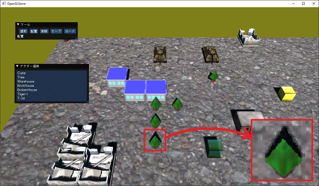

[OpenGL 3D 2021後期 第03回]

# フレームバッファオブジェクトと影

## 習得目標

* フレームバッファオブジェクトを作成できる。
* テクスチャに画像を描画することができる。
* デプスシャドウ技法の仕組みを理解する。

## 1. フレームバッファオブジェクト(FBO)

### 1.1 フレームバッファについて

OpenGLで`glDrawElements`などの描画関数を実行すると、グラフィックスパイプラインに割り当てられている「フレームバッファ」に対して描画が行われます。

フレームバッファには描画が終わった画像が存在します。シェーダを使ってこの画像を編集することで、さまざまな効果を表現することができます。これを「ポスト・プロセス(後処理)」といいます。

また、異なる視点から見た画像を描画し、その画像を通常視点からの描画で利用する、ということもできます。これを「プリ・プロセス(前処理)」といいます。

プリプロセスでは、通常視点からの描画で使う補助的な画像を作成するために使われます。プリプロセスには次のような表現があります。

>* バックミラー
>* 物体の影
>* ディファード・レンダリング

ポストプロセスでは、フォトショップの画像フィルタのような「画面全体に影響する処理」を行います。よく使われるポストプロセスには次のようなものがあります。

>* グレースケール(白黒画像に変換)
>* セピア(セピア色に変換)
>* ぼかし
>* ポスタリゼーション(イラスト風に変換)
>* アウトライン(輪郭線を描く)
>* ヴィネット(画面端を暗くする)
>* ブルーム(光のあふれ出しを表現)
>* アンチエイリアス(ギザギザな部分をなめらかにする)
>* アンビエントオクルージョン(へこんだ部分を暗くする)

### 1.2 フレームバッファオブジェクトのクラスを定義する

ポストプロセスを行うには、フレームバッファの画像をテクスチャとして読み出せるようにする必要があります。しかし、GLFWによって自動的に作成されるフレームバッファには、画像をテクスチャとして読み出す機能がありません。

理由は「モニターに直接出力されるフレームバッファは、モニターに出力可能なデータ形式で作る必要があるから」です。そこで、「描画先にテクスチャを指定できるフレームバッファ」を作成してグラフィックスパイプラインに割り当てます。

この「描画先にテクスチャを指定できるフレームバッファ」を「フレームバッファ・オブジェクト」といいます。フレームバッファオブジェクトをグラフィックスパイプラインに割り当てることで、描画された画像をテクスチャとして読み出せるようになります。

プログラムでフレームバッファオブジェクトを使う場合、関連する機能をクラスとしてまとめておくと扱いやすくなります。そこで、まずはフレームバッファオブジェクトを管理するクラスを作りましょう。

クラス名は`FramebufferObject`(フレームバッファ・オブジェクト)とします。プロジェクトの`Src`フォルダに`FramebufferObject.h`というヘッダファイルを追加してください。そして追加したファイルを開き、次のプログラムを追加してください。

```diff
+/**
+* @file FramebufferObject.h
+*/
+#ifndef FRAMEBUFFEROBJECT_H_INCLUDED
+#define FRAMEBUFFEROBJECT_H_INCLUDED
+#include "glad/glad.h"
+#include "Texture.h"
+#include <memory>
+
+// FBOの種類
+enum class FboType {
+  color = 1, // カラーテクスチャだけ
+  depth = 2, // 深度テクスチャだけ
+  colorDepth = color | depth, // カラーテクスチャと深度テクスチャ
+};
+
+/**
+* フレームバッファオブジェクト
+*/
+class FramebufferObject
+{
+public:
+  FramebufferObject(int w, int h, FboType type = FboType::colorDepth);
+  ~FramebufferObject();
+  FramebufferObject(const FramebufferObject&) = delete;
+  FramebufferObject& operator=(const FramebufferObject&) = delete;
+
+  void Bind() const;
+  void Unbind() const;
+  void BindColorTexture(GLuint) const;
+  void UnbindColorTexture(GLuint) const;
+  void BindDepthTexture(GLuint) const;
+  void UnbindDepthTexture(GLuint) const;
+
+  // フレームバッファオブジェクトIDを取得する
+  GLuint GetId() const { return fbo; }
+
+private:
+  GLuint fbo = 0; // フレームバッファオブジェクトのID
+  std::shared_ptr<Texture> texColor; // カラーテクスチャ
+  std::shared_ptr<Texture> texDepth; // 深度テクスチャ
+  int width = 0; // フレームバッファの幅(ピクセル)
+  int height = 0; // フレームバッファの高さ(ピクセル)
+};
+
+#endif // FRAMEBUFFEROBJECT_H_INCLUDED
```

ところで、いちいち「フレームバッファオブジェクト」と書くと読みにくいですよね。そこで、以後は`FBO`(エフビーオー)と表記することにします。

### 1.3 画像データなしでテクスチャを作れるようにする

FBOの作成を進めるには、ちょっとした問題を解決しなくてはなりません。それは「フレームバッファ用のテクスチャには元になる画像データが存在しない」という問題です。

既存のテクスチャ作成関数は、画像データがあることを前提としているため、そのままではフレームバッファ用のテクスチャを作ることができません。

そこで、画像データがなくてもテクスチャを作れるようにしていきます。`Texture.h`を開き、次のプログラムを追加してください。

```diff
 public:
   Texture(const char* filename);
+  Texture(const char* name, GLsizei width, GLsizei height,
+    const void* data, GLenum pixelFormat, GLenum type);
   ~Texture();

   // オブジェクトの有効性を判定する
   bool IsValid() const;
```

続いて`Texture.cpp`を開き、コンストラクタの定義の下に、次のプログラムを追加してください。

```diff
     std::cout << "[情報]" << __func__ << "テクスチャ" << name << "を作成.\n";
   }
 }
+
+/**
+* コンストラクタ.
+*/
+Texture::Texture(const char* name, GLsizei width, GLsizei height,
+  const void* data, GLenum pixelFormat, GLenum type)
+{
+  id = GLContext::CreateImage2D(width, height, data, pixelFormat, type);
+  if (id) {
+    this->name = name;
+    std::cout << "[情報]" << __func__ << "テクスチャ" << name << "を作成.\n";
+  }
+}

 /**
 * デストラクタ.
```

これでテクスチャクラスの作業は完了です。あと，クリエイトイメージ2D関数にも修正が必要です。`GLContext.cpp`を開き、クリエイトイメージ2D関数を次のように変更してください。

```diff
   GLenum pixelFormat, GLenum type)
 {
   GLuint id;
+
+  // 画像データ形式に対応する内部データ形式を選択する
+  // ※ここに書いてない形式を使うには対応するcase文を追加する
+  GLenum internalFormat = GL_RGBA8;
+  switch (pixelFormat) {
+  case GL_RED: internalFormat = GL_R8; break;
+  case GL_RGB: internalFormat = GL_RGB8; break;
+  case GL_BGR: internalFormat = GL_RGB8; break;
+  case GL_DEPTH_COMPONENT16:
+  case GL_DEPTH_COMPONENT24:
+  case GL_DEPTH_COMPONENT32F:
+    internalFormat = pixelFormat;
+    break;
+  }

   // テクスチャ・オブジェクトを作成し、GPUメモリを確保する
   glCreateTextures(GL_TEXTURE_2D, 1, &id);
-  glTextureStorage2D(id, 1, GL_RGBA8, width, height);
+  glTextureStorage2D(id, 1, internalFormat, width, height);

-  // GPUメモリにデータを転送する
+  // 画像データがある場合、GPUメモリにデータを転送する
+  if (data) {
     GLint alignment;
     glGetIntegerv(GL_UNPACK_ALIGNMENT, &alignment);
     glPixelStorei(GL_UNPACK_ALIGNMENT, 1);
     glTextureSubImage2D(id, 0, 0, 0, width, height, pixelFormat, type, data);
     glPixelStorei(GL_UNPACK_ALIGNMENT, alignment);
+  }

   const GLenum result = glGetError();
   if (result != GL_NO_ERROR) {
```

これで画像データがなくてもテクスチャを作れるようになりました。<br>
それから、`internalFormat`(インターナル・フォーマット)変数を設定するプログラムを追加していますが、これはこのあとで作成する深度バッファ用テクスチャのために追加しています。

### 1.4 コンストラクタを定義する

それでは`FramebufferObject`クラスのメンバ関数を定義していきます。プロジェクトの<br>
`Src`フォルダに FramebufferObject.cpp というCPPファイルを追加してください。追加したCPPファイルを開き、次のプログラムを追加してください。

```diff
+/**
+* @file FramebufferObject.cpp
+*/
+#include "FramebufferObject.h"
+#include <iostream>
+
+/**
+* コンストラクタ
+*
+* @param w    フレームバッファの幅(ピクセル数)
+* @param h    フレームバッファの高さ(ピクセル数)
+* @param type FBOの種類
+*/
+FramebufferObject::FramebufferObject(int w, int h, FboType type)
+{
+  // カラーテクスチャを作成
+
+  // 深度テクスチャを作成
+
+  // フレームバッファオブジェクトを作成
+
+  // フレームバッファオブジェクトが作成できたかチェック
+}
```

`FBO`を作成するには、プログラム中のコメントにあるように4つの作業が必要となります。まずは「カラーテクスチャ」を作成します。コンストラクタに次のプログラムを追加してください。

```diff
 FramebufferObject::FramebufferObject(int w, int h, FboType type)
 {
   // カラーテクスチャを作成
+  if (static_cast<int>(type) & 1) {
+    texColor.reset(new Texture("FBO(Color)", w, h, nullptr, GL_RGBA, GL_UNSIGNED_BYTE);
+    if (!texColor || !texColor->GetId()) {
+      std::cerr << "[エラー]" << __func__ << ": カラーテクスチャの作成に失敗\n";
+      texColor.reset(); // カラーテクスチャを破棄
+      return;
+    }
+  }

   // 深度テクスチャを作成
```

次に「<ruby>深度<rt>しんど</rt></ruby>テクスチャ」を作成します。深度テクスチャは「奥行き情報を保存する」テクスチャです。コンストラクタに次のプログラムを追加してください。

```diff
     }
   }

   // 深度テクスチャを作成
+  if (static_cast<int>(type) & 2) {
+    texDepth.reset(new Texture("FBO(Depth)", w, h, nullptr, GL_DEPTH_COMPONENT32F,
+      GL_FLOAT));
+    if (!texDepth || !texDepth->GetId()) {
+      std::cerr << "[エラー]" << __func__ << ": 深度テクスチャの作成に失敗\n";
+      texColor.reset(); // カラーテクスチャを破棄
+      texDepth.reset(); // 深度テクスチャを破棄
+      return;
+    }
+  }

  // フレームバッファオブジェクトを作成
```

深度バッファを作成するには以下のいずれかのフォーマットを指定します。

>* GL_DEPTH_COMPONENT16
>* GL_DEPTH_COMPONENT24
>* GL_DEPTH_COMPONENT32
>* GL_DEPTH_COMPONENT32F

数字が大きいほど精度が高くなりますが、そのぶん必要なメモリが増え、処理に時間がかるようになります。また、末尾に`F`の付いていないバッファは整数型の深度バッファで、`F`が付いているのは浮動小数点数型の深度バッファです。

数字が大きいほど精度が高く、さらに整数バッファより浮動小数点数バッファのほうが精度が高いです。通常は`32F`を選べばよいですが、古いGPUやモバイル環境では`24`や`16`しか使えなかったり、性能が不足することがあります。

続いて「フレームバッファオブジェクト」を作成します。<br>
`FBO`の作成には`glCreateFramebuffers`(ジーエル・クリエイト・フレームバッファーズ)関数を使います。コンストラクタに次のプログラムを追加してください。

```diff
     }
   }

   // フレームバッファオブジェクトを作成
+  glCreateFramebuffers(1, &fbo);
+  if (static_cast<int>(type) & 1) {
+    glNamedFramebufferTexture(fbo, GL_COLOR_ATTACHMENT0, texColor->GetId(), 0);
+  } else {
+    glNamedFramebufferDrawBuffer(fbo, GL_NONE);
+  }
+  if (static_cast<int>(type) & 2) {
+    glNamedFramebufferTexture(fbo, GL_DEPTH_ATTACHMENT, texDepth->GetId(), 0);
+  }

   // フレームバッファオブジェクトが作成できたかチェック
```

<pre class="tnmai_code"><strong>【書式】</strong><code>
void glCreateFramebuffers(作成するFBOの数, 作成したFBOのIDを格納する変数アドレス);
</code></pre>

作成した`FBO`には、必要に応じてカラーテクスチャや深度テクスチャを割り当ることができます。`FBO`にテクスチャを割り当てるには`glNamedFramebufferTexture`(ジーエル・ネームド・フレームバッファ・テクスチャ)関数を使います。

<pre class="tnmai_code"><strong>【書式】</strong><code>
void glNamedFramebufferTexture(割り当て先FBO, 用途, テクスチャID, ミップマップレベル);
</code></pre>

「用途」は以下の4種類から指定します。

>* GL_COLOR_ATTACHIMENT0～GL_COLOR_ATTACHIMENT31: カラーバッファ
>* GL_DEPTH_ATTACHIMENT: 深度バッファ
>* GL_STENCIL_ATTACIMENT: ステンシルバッファ
>* GL_DEPTH_STENCIL_ATTACIMENT: 深度バッファとステンシルバッファの両方

深度バッファだけが必要な場合、`glNamedFramebufferDrawBuffer`(ジーエル・ネームド・フレームバッファ・ドロー・バッファ)関数の引数に`GL_NONE`(ジーエル・ノン)を指定します。これによって「カラーバッファを使わない」ことを示します。

ミップマップを持つテクスチャの場合、「ミップマップレベル」を設定することで割り当てるミップマップを指定できます。ミップマップがないテクスチャの場合は`0`を指定します。

最後に`FBO`が正しく作成されたことを確認します。<br>
これには`glCheckNamedFramebufferStatus`(ジーエル・チェック・ネームド・フレームバッファ・ステータス)関数を使います。コンストラクタに次のプログラムを追加してください。

```diff
     glNamedFramebufferTexture(fbo, GL_DEPTH_ATTACHMENT, texDepth->GetId(), 0);
   }

   // フレームバッファオブジェクトが作成できたかチェック
+  if (glCheckNamedFramebufferStatus(fbo, GL_FRAMEBUFFER) != GL_FRAMEBUFFER_COMPLETE) {
+    std::cerr << "[エラー]" << __func__ << ": FBOの作成に失敗\n";
+    glDeleteFramebuffers(1, &fbo);
+    fbo = 0;
+    texColor.reset();
+    texDepth.reset();
+    return;
+  }
+
+  // フレームバッファの幅と高さを保存
+  width = w;
+  height = h;
}
```

<p><code class="tnmai_code"><strong>【書式】</strong><br>
検査結果 glCheckNamedFramebufferStatus(チェックするFBOのID, IDが0だったとき代わりにチェックするバインディングポイント);
</code></p>

`glCheckNamedFramebufferStatus`関数の第1引数に`0`を指定すると、第2引数で指定したバインディングポイントに割り当てられている`FBO`がチェックされます。

今回、第1引数にはゼロ以外の値を指定するので、第2引数には(指定可能な値なら)どれを指定しても構いません。とりあえず`GL_FRAMEBUFFER`を指定しておきます。その他の指定可能な値については関数名でWeb検索して調べてください。

検査の結果、`FBO`が正しく構築されていたら`GL_FRAMEBUFFER_COMPLETE`(ジーエル・フレームバッファ・コンプリート)が返されます。`FBO`に不良がある場合はそれ以外の値が返されます。

`FBO`が適切に構築されていたら、最後にフレームバッファの幅と高さをメンバ変数に代入します。この幅と高さは「バインド関数」で必要になります。

### 1.5 デストラクタを定義する

続いてデストラクタを定義します。デストラクタでは`FBO`を破棄するだけです。テクスチャには`std::shared_ptr`を使っているため、自動的に破棄されます。

`FBO`を破棄するには`glDeleteFramebuffers`(ジーエル・デリート・フレームバッファーズ)関数を使います。

<p><code class="tnmai_code"><strong>【書式】</strong><br>
void glDeleteFramebuffers(削除するFBOの数, 削除するFBOのIDの配列);
</code></p>

コンストラクタの定義の下に、次のプログラムを追加してください。

```diff
   width = w;
   height = h;
 }
+
+/**
+* デストラクタ
+*/
+FramebufferObject::~FramebufferObject()
+{
+  glDeleteFramebuffers(1, &fbo);
+}
```

### 1.6 FBOをグラフィックスパイプラインにバインドする

次に、`FBO`をグラフィックスパイプラインに割り当てる(バインドする)メンバ関数を定義しましょう。割り当てには`glBindFramebuffer`(ジーエル・バインド・フレームバッファ)関数を使います。

<p><code class="tnmai_code"><strong>【書式】</strong><br>
void glBindFramebuffer(バインディングポイント, バインディングポイントに割り当てるFBOのID);
</code></p>

バインディングポイントは以下の3つから選択します。

| バインディングポイント名 | 説明 |
|:-------------------------|:-----|
| GL_DRAW_FRAMEBUFFER      | ここに割り当てられたフレームバッファに描画される |
| GL_READ_FRAMEBUFFER      | ここに割り当てられたフレームバッファから読み出しが行われる |
| GL_FRAMEBUFFER           | GL_DRAW_FRAMEBUFFERとGL_READ_FRAMEBUFFERの両方に割り当てる |

`GL_READ_FRAMEBUFFER`は`glReadPixels`(ジーエル・リード・ピクセルズ)関数や<br>
`glCopyTexSubImage2D`(ジーエル・コピー・テックス・サブ・イメージ・ツーディ)関数の読み出し元になります。

しかし、これらはOpenGLに`FBO`が追加される以前の古い機能なので、現在ではデバッグ目的以外で使われることはありません。

あとは`GL_DRAW_FRAMEBUFFER`と`GL_FRAMEBUFFER`の2つですが、読み書きで異なるフレームバッファを割り当てると管理が面倒になるため、`GL_FRAMEBUFFER`を指定することが一般的です。

それから、描画範囲を指定する`glViewport`(ジーエル・ビューポート)関数も呼び出しておきます。この関数は画像の描画範囲を指定します。

<p><code class="tnmai_code"><strong>【書式】</strong><br>
void glViewport(描画範囲左下のX座標, 描画範囲左下のY座標, 描画範囲の幅, 描画範囲の高さ);
</code></p>

OpenGLにはフレームバッファの大きさとは別に、「フレームバッファのどの範囲に描画するか」を示す「ビューポート」というパラメータがあります。ビューポートはフレームバッファとは別に管理されているため、フレームバッファを切り替えてもビューポートは変わりません。

何らかの目的で、デフォルトのフレームバッファとは大きさが異なる`FBO`を作成し、グラフィックスパイプラインにバインドしたとします。しかし、ビューポートはデフォルトのフレームバッファの大きさのままです。

そのため、カメラの一部だけが描画されたり、逆にフレームバッファの一部に画面が縮小表示されたりしてしまいます。この問題を回避するには、フレームバッファをバインドするたびにビューポートも再設定します。

なんとなく理屈がわかったところでプログラムを書きましょう。デストラクタの定義の下に、次のプログラムを追加してください。

```diff
   glDeleteRenderbuffers(1, &depthStencil);
   glDeleteFramebuffers(1, &fbo);
 }
+
+/**
+* グラフィックスパイプラインの描画先にFBOを割り当てる
+*/
+void FramebufferObject::Bind() const
+{
+  glBindFramebuffer(GL_FRAMEBUFFER, fbo);
+  glViewport(0, 0, width, height);
+}
```

### 1.7 バインドを解除するメンバ関数を定義する

割り当てたオブジェクトが不要になったら、割り当てを解除しなくてはなりません。そのために、割り当てを解除するメンバ関数を定義しましょう。

`FBO`の割り当てを開場するには`glBindFramebuffer`関数の第2引数に`0`を指定します。<br>
`0`を指定することでデフォルトのフレームバッファが割り当てられます。

ただ、困ったことにOpenGLではデフォルトフレームバッファの大きさを取得できません。これは「デフォルトフレームバッファは実行環境が管理するものなので、環境ごとにサイズを取得できる機能があるはず」という理由によります。

OpenGLの方針に従い、アンバインド関数ではビューポートの再設定は行わないこととします。それでは`Bind`メンバ関数の定義の下に、次のプログラムを追加してください。

```diff
   glBindFramebuffer(GL_FRAMEBUFFER, fbo);
   glViewport(0, 0, width, height);
 }
+
+/**
+* グラフィックスパイプラインの描画先をデフォルトのフレームバッファに戻す
+*/
+void FramebufferObject::Unbind() const
+{
+  glBindFramebuffer(GL_FRAMEBUFFER, 0);
+}
```

### 1.8 カラーテクスチャをグラフィックスパイプラインに割り当てる

フレームバッファオブジェクトの目的は、描画された画像をテクスチャとして扱うためでした。そのためには、テクスチャを「テクスチャイメージユニット」に割り当てる機能が必要となります。そしてもちろん、割り当てを解除する関数も必要です。

アンバインド関数の下に、次のプログラムを追加してください。

```diff
   glBindFramebuffer(GL_FRAMEBUFFER, 0);
 }
+
+/**
+* カラーテクスチャをグラフィックスパイプラインに割り当てる
+*
+* @param unit 割り当て先のテクスチャユニット番号
+*/
+void FramebufferObject::BindColorTexture(GLuint unit) const
+{
+  texColor->Bind(unit);
+}
+
+/**
+* カラーテクスチャをグラフィックスパイプラインから取り外す
+*
+* @param unit 割り当て先のテクスチャユニット番号
+*/
+void FramebufferObject::UnbindColorTexture(GLuint unit) const
+{
+  texColor->Unbind(unit);
+}
```

### 1.9 深度テクスチャをグラフィックスパイプラインに割り当てる

カラーテクスチャと同様に、深度テクスチャにも割り当て関数と割り当て解除関数を定義しましょう。アンバインドカラーテクスチャ関数の定義の下に、次のプログラムを追加してください。

```diff
   texColor->Unbind(unit);
 }
+
+/**
+* 深度テクスチャをグラフィックスパイプラインに割り当てる
+*
+* @param unit 割り当て先のテクスチャユニット番号
+*/
+void FramebufferObject::BindDepthTexture(GLuint unit) const
+{
+  texDepth->Bind(unit);
+}
+
+/**
+* 深度テクスチャをグラフィックスパイプラインから取り外す
+*
+* @param unit 割り当て先のテクスチャユニット番号
+*/
+void FramebufferObject::UnbindDepthTexture(GLuint unit) const
+{
+  texDepth->Unbind(unit);
+}
```

これでFBOを管理するクラスは完成です。

>**【まとめ】**<br>
>
>* テクスチャに描画するにはフレームバッファオブジェクト(FBO)を使う。
>* 深度バッファを作成するには、画像形式に`GL_DEPTH_COMPONENT32F`を指定する。
>* フレームバッファをバインドするときは、同時に`glViewport`で描画範囲を指定する必要がある。

<div style="page-break-after: always"></div>

## 2. デプスシャドウマッピング

### 2.1 より現実的な影を求めて

コンピューター・グラフィックス、特にゲームにおいて、適切な影を描画することは、長らく困難な問題でした。

ゲームに使われるコンピューターは価格による性能限界があること、また、1/60～1/20秒という短い時間で描画を完了しなくてはならないことがその理由です。現在に至っても、真に適切な影を描画することは、非常に難易度の高い作業です。

それでも、現代では「デプスシャドウマッピング」という方法によって、比較的リアルな影を表現できるようになっています。「デプスシャドウマッピング」は以下の手順で影を描画します。

>1. 影描画用に深度バッファのみのFBOを作成する。
>2. ライトの位置にカメラを置いてビュープロジェクション行列(シャドウ行列)を作成し、「影描画用のFBO」に描画する。
>3. 本来の視点の位置にカメラを置いて通常の描画を行う。
>4. このとき、2で作成したシャドウ行列を使ってライト空間の座標を計算する。
>5. フラグメントシェーダで、4で計算したライト空間の座標と「影用のFBO」に書き込まれたZ値を比較する。
>6. 座標がZ値より奥にある場合、描画するピクセルとライトとの間に「物体」があることを意味する。 つまり、ピクセルは影の中にいるのでライトの明るさを無視する。
>7. 座標がZ値と同じ場合、描画するピクセルとライトとの間にはなにもない。つまり、直接ライトの光が届いているので、ライトの明るさをピクセルに反映する。

<p align="center">
<br>
</p>

### 2.2 影を描画するためのFBOを追加する

それでは影描画用の`FBO`を追加しましょう。<br>
`GameEngine.h`を開き、`FramebufferObject.h`をインクルードしてください。

```diff
 #include "Sampler.h"
 #include "Actor.h"
 #include "Camera.h"
+#include "FramebufferObject.h"
 #include <GLFW/glfw3.h>
 #include <unordered_map>
```

次に`FBO`変数を追加します。影描画用なので、名前は`fboShadow`(エフビーオー・シャドウ)とします。ゲームエンジンクラスの定義に、次のプログラムを追加してください。

```diff
   std::shared_ptr<ProgramPipeline> pipelineUI;
   std::shared_ptr<Sampler> sampler;
   std::shared_ptr<Sampler> samplerUI;
+
+  std::shared_ptr<FramebufferObject> fboShadow; // 影描画用FBO
+
   ActorList actors;
   ActorList newActors;
```

続いて`GameEngine.cpp`を開き、イニシャライズ関数に次のプログラムを追加してください。

```diff
     // カメラのアスペクト比を設定
     Camera& camera = engine->GetCamera();
     camera.aspectRatio = engine->windowSize.x / engine->windowSize.y;
+
+    // FBOを初期化する
+    engine->fboShadow.reset(new FramebufferObject(1024, 1024, FboType::depth));
+    if (!engine->fboShadow || !engine->fboShadow->GetId()) {
+      return false;
+    }

     // ImGuiの初期化
     ImGui::CreateContext();
```

これで影描画用のFBOを追加することができました。

<br>

### 2.3 平行光源を定義する

ところで、デプスシャドウマッピングといえども、あらゆる影を描画できるというわけではありません。一般的には平行光源、またはシーンの代表的なポイントライトやスポットライトが作り出す影だけを扱います。

今回は平行光源の影を描画することにします。さて、影の向きを知るためには事前に平行光源の方向が分かっていなくてはなりません。そこで、影描画の手前に並行光源のデータを定義します。

それでは`fboShadow`に描画する準備をしていきます。レンダーデフォルト関数に次のプログラムを追加してください。

```diff
 void GameEngine::RenderDefault
 {
+  // 平行光源の向き
+  const glm::vec3 lightDirection = glm::normalize(glm::vec4(3,-2,-2, 0));
+
   glEnable(GL_DEPTH_TEST); // 深度バッファを有効にする.
   //glEnable(GL_CULL_FACE);
   glClearColor(0.5f, 0.5f, 0.1f, 1.0f);
```

### 2.4 影用ビュープロジェクション行列を作成する

次に、ビュー行列とプロジェクション行列を作成します。平行光源の影を描画するためのビュー行列を作成するには、`glm::ortho`(ジーエルエム・オルソ)関数を使います。

オルソ関数に設定するパラメータは、通常の描画でつかうカメラがどの程度の範囲を映し出すかによって変わります。厳密な計算は面倒なので、とりあえず、`±50m`の範囲を描画することにしましょう。

平行光源の向きの定義の下に、次のプログラムを追加してください。

```diff
   // 平行光源の向き
   const glm::vec3 lightDirection = glm::normalize(glm::vec4(3,-2,-2, 0));
+
+  // 影用プロジェクション行列を作成
+  const glm::mat4 matShadowProj =
+    glm::ortho(-50.0f, 50.0f, -50.0f, 50.0f, 10.0f, 300.0f);

   glEnable(GL_DEPTH_TEST); // 深度バッファを有効にする.
   //glEnable(GL_CULL_FACE);
```

次にビュー行列を作成します。平行光源はシーンのどの物体より手前にあるはずなので、影描画用カメラは、通常カメラの注視点から100m手前に配置します。影用プロジェクション行列を作成するプログラムの下に、次のプログラムを追加してください。

```diff
   const glm::mat4 matShadowProj =
     glm::ortho(-50.0f, 50.0f, -50.0f, 50.0f, 10.0f, 300.0f);
+
+  // 影用ビュー行列を作成
+  const glm::vec3 shadowCameraTarget = mainCamera.target;
+  const glm::vec3 shadowCameraPos =
+    shadowCameraTarget - glm::vec3(lightDirection) * 100.0f;
+  const glm::mat4 matShadowView =
+    glm::lookAt(shadowCameraPos, shadowCameraTarget, glm::vec3(0, 1, 0));

   glEnable(GL_DEPTH_TEST); // 深度バッファを有効にする.
   //glEnable(GL_CULL_FACE);
```

### 2.5 影用FBOにアクターを描画する

次に、影用のFBOへの描画を効率的に行うために、グラフィックスパイプラインの機能を有効化、または無効化します。

たとえば`fboShadow`には深度バッファしかないので、カラーバッファのアルファブレンドは無効化します。そして、深度テストと裏面カリングを有効にします。それでは、平行光源の向きの定義の下に、次のプログラムを追加してください。

```diff
   // 平行光源の向き
   const glm::vec3 lightDirection = glm::normalize(glm::vec4(3,-2,-2, 0));
+
+  // 影の描画
+  {
+    // 描画先を影描画用FBOに変更
+    fboShadow->Bind();
+
+    glEnable(GL_DEPTH_TEST); // 深度テストを有効にする
+    glEnable(GL_CULL_FACE);  // 裏面カリングを有効にする
+    glDisable(GL_BLEND);     // アルファブレンドを無効にする
+
+    glClear(GL_DEPTH_BUFFER_BIT);
+
+    // デフォルトのフレームバッファに戻す
+    fboShadow->Unbind();
+  }

   glEnable(GL_DEPTH_TEST); // 深度バッファを有効にする.
   //glEnable(GL_CULL_FACE);
```

次にVAO、プログラムパイプライン、サンプラをバインドし、アクターを描画します。深度バッファをクリアするプログラムの下に、次のプログラムを追加してください。

```diff
     glEnable(GL_CULL_FACE);  // 裏面カリングを有効にする

     glClear(GL_DEPTH_BUFFER_BIT);
+
+    primitiveBuffer->BindVertexArray();
+    pipeline->Bind();
+    sampler->Bind(0);
+
+    // アクターを描画
+    const int layer = static_cast<int>(Layer::Default);
+    for (auto& e : actors[layer]) {
+      Draw(*e, *pipeline, matShadowProj, matShadowView);
+    }

     // デフォルトのフレームバッファに戻す
     fboShadow->Unbind();
   }
```

それから、通常描画に戻るときにビューポートを再設定しておきます。影を描画するプログラムの下に、次のプログラムを追加してください。

```diff
     // デフォルトのフレームバッファに戻す
     fboShadow->Unbind();
   }
+
+  //
+  // 通常の描画
+  //
+
+  // デフォルトフレームバッファのビューポートを設定
+  glViewport(0, 0,
+    static_cast<GLsizei>(windowSize.x),
+    static_cast<GLsizei>(windowSize.y));

   glEnable(GL_DEPTH_TEST); // 深度バッファを有効にする.
   //glEnable(GL_CULL_FACE);
```

これで影描画用FBOへの描画は完成です。

### 2.6 頂点シェーダーに影描画機能を追加する

ここからは、シェーダーに影の判定を行う機能を追加していきます。頂点シェーダーから始めましょう。頂点シェーダーでは以下の作業を行います。

>1. ワールド座標系の頂点座標を計算。
>2. 計算した頂点座標をフラグメントシェーダーに送る。

それでは、計算結果をフラグメントシェーダーに送るためのアウト変数を追加しましょう。<br>
`FragmentLighting.vert`を開き、次のプログラムを追加してください。

```diff
 layout(location=0) out vec4 outColor;
 layout(location=1) out vec2 outTexcoord;
 layout(location=2) out vec3 outNormal;
+layout(location=3) out vec4 outPosition;
 out gl_PerVertex {
   vec4 gl_Position;
 };
```

次に`main`関数に次のプログラムを追加してください。

```diff
   outColor = vColor;
   outTexcoord = vTexcoord;
   outNormal = worldNormal;
+  outPosition = matModel * vec4(vPosition, 1.0);
   gl_Position = matTRS * vec4(vPosition, 1.0);
 }
```

### 2.7 フラグメントシェーダーに影描画機能を追加する

続いて、フラグメントシェーダーに影の判定を行う機能を追加します。これは次の手順で判定します。

>1. シャドウ行列を使ってライトから見た頂点座標を計算。
>2. ライトから見た頂点座標を使って、影描画用FBOの値を読み取る。
>3. ライトから見た頂点座標のZ値と影描画用FBOの値を比較。
>4. Z値のほうが大きければ影の中にいる。小さければ影の外にいる。

まずは「ワールド座標系の頂点座標」を受け取るイン変数と、影描画用FBOをバインドするサンプラ、そしてシャドウ行列を受け取るユニフォーム変数を追加します。<br>
`FragmentLighting.frag`を開き、次のプログラムを追加してください。

```diff
 layout(location=0) in vec4 inColor;
 layout(location=1) in vec2 inTexcoord;
 layout(location=2) in vec3 inNormal;
+layout(location=3) in vec3 inPosition;

 // 出力変数
 out vec4 fragColor;

 // ユニフォーム変数
 layout(binding=0) uniform sampler2D texColor;
+layout(binding=1) uniform sampler2D texShadow;
+
+layout(location=100) uniform mat4 matShadow; // シャドウ行列

 // 平行光源
 struct DirectionalLight {
```

>`matShadow`のロケーション番号を`100`にしている理由は、頂点シェーダのユニフォーム変数とロケーションが重複しないようにするためです。`0`～`99`を頂点シェーダ、`100`以降をフラグメントシェーダで使うようにすれば、ロケーション番号が重複することを防げます。

追加した変数を使って、フラグメントが影の中にいるかどうかを調べましょう。法線の向きを反転するプログラムの下に、次のプログラムを追加してください。

```diff
     worldNormal *= -1;
   }
+
+  // 影
+  vec4 shadowPos = matShadow * vec4(inPosition, 1.0);
+  shadowPos.xyz *= 1.0 / shadowPos.w; // パースを解除
+  float shadow = float(texture(texShadow, shadowPos.xy).r < shadowPos.z);

   // 環境光を設定.
   vec3 lightColor = ambientLight;

   // Blinn-Phong反射モデルの正規化係数を計算.
   float normalizationFactor = (shininess + 8) / (8.0 * PI);
```

ライトから見た頂点座標はパースがかかっている可能性があります。正しいテクスチャ座標に変換するにはシャドウ行列を掛けたあとの結果を、自分自身の`w`要素で除算する必要があります。

とはいえ、平行光源に限れば`w`は常に`1`になるので、除算をなくすことができます。上記のプログラムでは、今後点光源に変更する可能性を考慮して除算を行っています。

比較結果は`shadow`(シャドウ)変数に代入されます。シャドウ変数が`0`なら「影の中」、<br>
`1`なら「影の外」です。

>**【GLSLで型を変換するにはコンストラクタを使う】**<br>
>GLSLには`(int)3.14`や`static_cast<float>(10)`のようなキャスト構文がありません。また、基本的には暗黙の型変換も行われません(リテラル定数(`10`や`3.14`のように数字を直接書いたもの)をのぞく)。
>そのため、型を変換するにはコンストラクタを利用します。つまり`int(3.14)`や`float(10)`のように書きます。

あとは`shadow`変数を使って明るさを修正します。平行光源を計算するプログラムを、次のように変更してください。

```diff
   // 環境光を設定.
   vec3 lightColor = ambientLight;

   // ランバート反射による明るさを計算.
   float cosTheta = max(dot(worldNormal, -light.direction), 0);
-  lightColor += light.color * cosTheta;
+  lightColor += light.color * cosTheta * (1.0 - shadow);

   fragColor.rgb *= lightColor;
 }
```

これでフラグメントシェーダーの変更は完了です。

### 2.8 シャドウ行列を設定する

続いて、通常の描画にシャドウ行列を設定するプログラムを追加します。`GameEngine.cpp`を開き、レンダーデフォルト関数に次のプログラムを追加してください。

```diff
   const glm::mat4& matProj = mainCamera.GetProjectionMatrix();
   const glm::mat4 matView = mainCamera.GetViewMatrix();
+
+  // NDC座標系からテクスチャ座標系への座標変換行列
+  const glm::mat4 matShadowTex = glm::mat4(
+    0.5f, 0.0f, 0.0f, 0.0f,
+    0.0f, 0.5f, 0.0f, 0.0f,
+    0.0f, 0.0f, 0.5f, 0.0f,
+    0.5f, 0.5f, 0.5f, 1.0f
+  );
+
+  // シャドウ行列をGPUメモリにコピーする
+  const glm::mat4 matShadow = matShadowTex * matShadowProj * matShadowView;
+  const GLint locMatShadow = 100;
+  pipeline->SetUniform(locMatShadow, matShadow);

   // アクターを描画する
   const int layer = static_cast<int>(Layer::Default);
   ActorList& defaultActors = actors[layer];
```

このプログラムの中で、シャドウ行列を作る際に奇妙な行列を掛けています。これは「NDC座標系からテクスチャ座標系へ変換する」行列です。

シャドウ行列は「ワールド座標系からNDC座標系へ変換」する行列ですが、テクスチャを読む時に必要なのはテクスチャ座標系の座標です。そのため、NDC座標系からテクスチャ座標系へ変換する行列を追加する必要があるのです。

NDC座標系の範囲は`-1`～`+1`です。そして、テクスチャ座標系の範囲は`0`～`1`です。この事実から、クリップ座標系からテクスチャ座標系の変換は「座標を`0.5`倍して`0.5`を足す」ことで実現できることがわかります。

これが、「`0.5`倍して`0.5`を足す」行列を掛けている理由です。

それから、セットユニフォーム関数がフラグメントシェーダーにもデータをコピーできるようにする必要があります。`ProgramPipeline.cpp`を開き、セットユニフォーム関数を次のように変更してください。

```diff
 bool ProgramPipeline::SetUniform(GLint location, const glm::mat4& data) const
 {
   glGetError(); // エラー状態をリセット.
+
+  // ロケーション番号によってコピー先を変更する
+  // - 0～99: 頂点シェーダ
+  // - 100～: フラグメントシェーダ
+  GLuint program = vp;
+  if (location >= 100) {
+    program = fp;
+  }

-  glProgramUniformMatrix4fv(vp, location, 1, GL_FALSE, &data[0][0]);
+  glProgramUniformMatrix4fv(program, location, 1, GL_FALSE, &data[0][0]);
   if (glGetError() != GL_NO_ERROR) {
     std::cerr << "[エラー]" << __func__ << ":ユニフォーム変数の設定に失敗.\n";
```

### 2.9 シャドウテクスチャを設定する

最後に、影描画用FBOの深度バッファ(その用途から「シャドウテクスチャ」と呼ばれます)をシェーダーにバインドします。通常描画を行うプログラムに、次のプログラムを追加してください。

```diff
   const glm::mat4 matShadow = matShadowTex * matShadowProj * matShadowView;
   const GLint locMatShadow = 100;
   pipeline->SetUniform(locMatShadow, matShadow);
+
+  // 影描画用の深度テクスチャを割り当てる
+  fboShadow->BindDepthTexture(1);

   // アクターを描画する
   const int layer = static_cast<int>(Layer::Default);
   ActorList& defaultActors = actors[layer];
```

プログラムが書けたらビルドして実行してください。地面にアクターの影が落ちていたら成功です。黒い横線やぶつぶつとした黒い模様は3章で改善しますので、今は気にしないでください。

<p align="center">

</p>

>**【2章のまとめ】**<br>
>
>* デプスシャドウマッピングを使うと、ひとつの光源によって作られる影を表現することができる。
>* デプスシャドウマッピングでは、光源にカメラを配置して描画を行い、深度情報をFBOに記録する。
>* 通常カメラで描画を行うとき、FBOに記録した深度情報を利用して、描画するピクセルに光が当たっているかどうかを調査する。

<div style="page-break-after: always"></div>

## 3. 影の品質を上げる

### 3.1 シャドウアクネ

キャラクターや建物の表面がやたらと汚れているのは、シャドウテクスチャと通常描画の角度が違うからです。次の図が示すように、シャドウ行列と画面を表示するときのビュープロジェクション行列は、違う角度から描画を行います。

<p align="center">

</p>

一般的に、シャドウテクスチャは画面に映る範囲より広い空間を処理する必要があるため、通常の画面描画より解像度が低くなります。すると、シャドウテクスチャから読み取ったZ値と表示するフラグメントのZ値が一致しないケースが出てきます。

このような、精度の問題によって発生する物体表面の汚れは「シャドウアクネ(影のにきび)」と呼ばれています。

簡単な解決方法は、画面に描画するときの座標を外側に少しずらすことです。ずらすことで実際の位置より手前で影の判定を行うことになります。結果として下図のようにシャドウアクネがなくなります。

<p align="center">

</p>

これは、頂点座標を法線方向に少しだけ移動させることで実現できます。<br>
`FragmentLighting.frag`を開き、影を計算するプログラムを次のように変更してください。

```diff
   // 影
+  float normalBias = 1.0; // 法線方向に移動させるピクセル数
+  const vec2 shadowAreaSize = vec2(100.0, 100.0); // ワールド座標系の影テクスチャの大きさ
+  vec2 shadowPixelSize =
+    shadowAreaSize / textureSize(texShadow, 0); // 1ピクセルの大きさ(ワールド座標)
+  normalBias *= max(shadowPixelSize.x, shadowPixelSize.y);
-  vec4 shadowPos = matShadow * vec4(inPosition, 1.0);
+  vec4 shadowPos = matShadow * vec4(inPosition + worldNormal * normalBias, 1.0);
   shadowPos.xyz *= 1.0 / shadowPos.w; // パースを解除
   float shadow = float(texture(texShadow, shadowPos.xy).r < shadowPos.z);
```

ずらす距離には「シャドウマップの1ピクセルのを大きさ」を使いました。シャドウアクネの発生原因から、アクネが最大になるのはシャドウテクスチャとポリゴンがほぼ直角になる場合なので、アクネを消すには1ピクセルずらせば十分です。

>ただし、他の補正を追加することによって1ピクセルでは足りなくなることはありえます。

ワールド空間において、テクスチャの1ピクセルがどれくらいの大きさになるかは、以下の式で求められます。

`1ピクセルの大きさ＝平行投影行列の描画範囲(100m)÷テクスチャのピクセル数(1024)`

プログラムが書けたらビルドして実行してください。シャドウアクネが消えていたら成功です。

>**【ノーマルバイアス(normalBias)の目的】**<br>
>シャドウアクネは「影になるピクセルと影にならないピクセルの境界に、ポリゴンが交差している」部分に発生します。ということは、境界とポリゴンが交差しなけらばシャドウアクへは発生しないわけです。
>そこで、ノーマルバイアスによって、影にならないピクセル側に、ポリゴンの座標をずらします。このとき、ずらす距離が大きすぎると「影になるべき部分が影にならない」という現象が起きるので注意が必要です。かといって、小さすぎるとシャドウアクネが残ってしまいます。

<p align="center">

</p>

### 3.2 影をぼかす

シャドウアクネは消えました。今度は影の輪郭がギザギザしているのを緩和します。ギザギザを消すには以下の方法を使います。

>1. 周囲のいくつかのピクセルが影になっているかどうかを調べる。
>2. 影になっているピクセルの数によって、影の濃さを変える。影になっているピクセルが多いほど濃く、少ないほど薄くする。

上記の手順を行うと、影の輪郭がボケてギザギザが目立たなくなります。

さて、手順1では何らかの方法で調べるピクセルの座標を決める必要があります。たくさんのピクセルを調べるほどキレイにボケますが、そのぶん処理時間が増えてしまいます。

そのため、できるだけ少ないピクセル数でキレイにボケるような座標を選ぶことが重要となります。こうした目的には「ポアソン・ディスク・サンプリング」という技法が使われます。

>**【ポアソンディスクサンプリング(Poisson Disk Sampling)】**
>ポアソンディスクサンプリングは、ピクセルを読み取る座標として「ポアソンディスク分布」と呼ばれるランダムな点の分布を利用する技法です。
>「規則的な分布」や「完全にランダムな分布」と比較して「座標数が少なくても自然な見た目が得られる」分布だと言われています。

`FragmentLighting.frag`を開き、次のプログラムを追加してください。

```diff
 vec3 ambientLight = { 0.25, 0.20, 0.30 };
+
+// 影をぼかすためのサンプリング座標.
+const int sampleCount = 4;
+const vec2 poissonDisk[sampleCount] = {
+  { -0.942, -0.399 },
+  {  0.946, -0.769 },
+  { -0.094, -0.929 },
+  {  0.345,  0.294 },
+};

 // フラグメントシェーダプログラム
 void main()
```

続いて影を計算するプログラムに、次のプログラムを追加してください。

```diff
   normalBias *= max(shadowPixelSize.x, shadowPixelSize.y);
   vec4 shadowPos = matShadow * vec4(inPosition + worldNormal * normalBias, 1.0);
   shadowPos.xyz *= (1.0 / shadowPos.w); // パースを解除
+
+  // 影をぼかす
-  float shadow = float(texture(texShadow, shadowPos.xy).r < shadowPos.z);
+  float shadow = 0.0;
+  vec2 shadowRadius = vec2(0.1); // ぼかし半径(ワールド座標)
+  shadowRadius /= shadowAreaSize; // ぼかし半径をテクスチャ座標系に変換
+  for (int i = 0; i < sampleCount; ++i) {
+    vec2 texcoord = shadowPos.xy + poissonDisk[i] * shadowRadius;
+    shadow += float(texture(texShadow, texcoord).r < shadowPos.z);
+  }
+  shadow *= 1.0 / float(sampleCount);

   // 環境光を設定.
   vec3 lightColor = ambientLight;
```

プログラムが書けたらビルドして実行してください。影の輪郭が多少ぼんやりとしていたら成功です。

>**【shadowRadius(シャドウ・レイディアス)変数について】**<br>
>この変数は「影がボケる半径」を表します。影をクッキリさせたい場合はこの数値を小さくします。もっと強くぼかしたい場合は大きくします。
>ただし、あまり大きくすると今度はノーマルバイアスが不足します。その場合、ノーマルバイアスを大きくすることで解消できます(ただし、「ピーターパン現象」が起きる可能性があります)。

<p align="center">

</p>

<pre class="tnmai_assignment">
<strong>【課題01】</strong>
ポアソンディスク配列を、以下のURLのシェーダーに書かれている配列で置き換えて、影をボカすために調べるピクセル数を増やしなさい。
<code>https://github.com/opengl-tutorials/ogl/blob/master/
tutorial16_shadowmaps/ShadowMapping.fragmentshader</code>
</pre>

>**【2章のまとめ】**<br>
>
>* シャドウテクスチャと通常画面のカメラの向きの違いにより、「シャドウアクネ」と呼ばれる影判定のミスが発生する。
>* 影判定用の座標を法線方向に少しだけずらすことで、シャドウアクネを防ぐことができる。
>* 影の輪郭をぼかしてなめらかにするには、周囲の座標がどの体で影に含まれるかによって影の濃さを変えるとよい。
