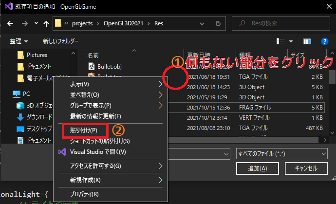

[OpenGL 3D 2021後期 第03回(マップエディタ編)]

# 地面を描く

## 習得目標

* `scanf`関数の書式について理解する。
* テクスチャを画像以外の目的で使えることを理解する。
* 配列テクスチャの作りかたと使いかたを理解する。

## 1. マップデータを読み込めるようにする

### 1.1 セーブ関数の修正

後期第02回のセーブ関数について、正しいセーブデータにならない問題がありましたので修正します。`MapEditor.cpp`を開き、セーブ関数を次のように変更してください。

```diff
     char tmp[1024];
-    snprintf(tmp, std::size(tmp), "  [ %s, %.03f, %.03f, %.03f ],",
+    snprintf(tmp, std::size(tmp), "  [ %s, %.03f, %.03f, %.03f ],\n",
       e->name.c_str(), e->position.x, e->position.y, e->position.z);
     ofs << tmp;
   }
-  ofs << "\n]\n";
+  ofs << "]\n";
 }
```

### 1.2 マップデータを読み込む

セーブ関数が作成するマップデータは、以下の形式になっています。

>```txt
>mapSize: [ マップの幅, マップの奥行き ],
>map: [
>  [ アクター名, アクターのX座標, アクターのY座標, アクターのZ座標 ],
>          ・
>          ・
>          ・
>  [ アクター名, アクターのX座標, アクターのY座標, アクターのZ座標 ]
>]
>```

1行目にマップサイズがあり、3行目からはマップに配置するアクターの情報が続きます。ロード関数は、上記のマップデータを読み込むことが目的となります。

それではロード関数を作成しましょう。`MapEditor.h`を開き、次のプログラムを追加してください。

```diff
   void UpdateCamera(float deltaTime);
   void UpdateUI();
   void Save(const char* filename);
+  std::shared_ptr<Actor> GetActor(const char* name) const;
+  void Load(const char* filename);

 private:
   glm::ivec2 mapSize = glm::ivec2(21, 21); // マップの広さ
```

`GetActor`(ゲット・アクター)関数は、`actors`配列の中から名前の一致するアクターのポインタを返します。この関数はロード関数で使います。

まずゲットアクター関数から定義していきましょう。`MapEditor.cpp`を開き、セーブ関数の定義の下に、次のプログラムを追加してください。

```diff
   ofs << "]\n";
 }
+
+/**
+* アクターリストからアクターを取得する
+*/
+std::shared_ptr<Actor> MapEditor::GetActor(const char* name) const
+{
+  for (auto& e : actors) {
+    if (e->name == name) {
+      return e;
+    }
+  }
+  return nullptr;
+}
```

次にロード関数を実装します。ゲットアクター関数の定義の下に、次のプログラムを追加してください。

```diff
   }
   return nullptr;
 }
+
+/**
+* マップデータをファイルから読み込む
+*/
+void MapEditor::Load(const char* filename)
+{
+  std::ifstream ifs(filename);
+  if (!ifs) {
+    std::cerr << "[エラー]" << __func__ << ":" << filename << "を開けません\n";
+    return;
+  }
+
+  // マップデータ読み込み用変数
+  glm::ivec2 tmpMapSize;
+  std::vector<std::shared_ptr<Actor>> tmpMap;
+}
```

まずマップデータファイルを読み込みます。ファイルの読み込みには`std::ifstream`(エスティーディ・アイ・エフ・ストリーム)クラスを使います(テクスチャやシェーダの読み込みに使ったやつです)。

`tmpMapSize`(テンプ・マップ・サイズ)と`tmpMap`(テンプ・マップ)変数は、読み込んだデータを一時的に保存する変数です。

すべてのデータが正常に読み込めた場合、これらのデータを実際のデータに反映します。これは、読み込みに失敗した場合に既存のデータが壊れることを防ぐための工夫です。

### 1.3 マイクロソフトの罠に対処する

ところで、行の<ruby>解析<rt>かいせき</rt></ruby>には`sscanf`関数を使おうと思います。しかし、Visual Studioでは普通に`sscanf`を使おうとすると「我々が考えたもっと安全な関数を使え」と言われてビルドに失敗します。

このエラーを回避するには、CPPファイルのすべてのインクルード文より前に`_CRT_SECURE_NO_WARNINGS`(シーアルティ・セキュア・ノー・ワーニングス)というマクロを定義します。`MapEditor.cpp`の先頭に次のプログラムを追加してください。

```diff
 * @file MapEditor.cpp
 */
+#define _CRT_SECURE_NO_WARNINGS
 #include "MapEditor.h"
 #include "Actor.h"
```

これで`sscanf`を使っても文句を言われなくなりました。

### 1.4 マップサイズを読み込む

それでは、ファイルの先頭にあるマップサイズから読み込んでいきましょう。マップデータ読み込み用変数の定義の下に、次のプログラムを追加してください。

```diff
   // マップデータ読み込み用変数
   glm::ivec2 tmpMapSize;
   std::vector<std::shared_ptr<Actor>> tmpMap;
+
+  // マップサイズを読み込む
+  std::string line;
+  std::getline(ifs, line);
+  if (sscanf(line.data(), "mapSize: [ %d, %d ],",
+    &tmpMapSize.x, &tmpMapSize.y) != 2) {
+    std::cerr << "[エラー]" << __func__ << ": マップサイズの読み込みに失敗\n";
+    return;
+  }
+  tmpMap.resize(tmpMapSize.x * tmpMapSize.y);
 }
```

次に2行目を読み飛ばします。マップサイズを読み込むプログラムの下に、次のプログラムを追加してください。

```diff
     std::cerr << "[エラー]" << __func__ << ": マップサイズの読み込みに失敗\n";
     return;
   }
+
+  // map行を読み飛ばす
+  std::getline(ifs, line);
+  if (line != "map: [") {
+    std::cerr << "[エラー]" << __func__ << ": マップデータの読み込みに失敗\n";
+    return;
+  }
 }
```

### 1.5 書式指定を<ruby>駆使<rt>くし</rt></ruby>して配置データを読み込む

続いてアクターの配置データを読み込みます。map行を読み飛ばすプログラムの下に、次のプログラムを追加してください。

```diff
     std::cerr << "[エラー]" << __func__ << ": マップデータの読み込みに失敗\n";
     return;
   }
+
+  // アクターの配置データを読み込む
+  while (!ifs.eof()) {
+    std::getline(ifs, line);
+
+    // データの終了チェック
+    if (line[0] == ']') {
+      break;
+    }
+
+    // 行を解析
+    char name[256];
+    glm::vec3 position(0);
+    if (sscanf(line.data(), " [ %255[^,], %f, %f, %f ],",
+      name, &position.x, &position.y, &position.z) != 4) {
+      std::cerr << "[警告]" << __func__ << ": 配置データの読み込みに失敗\n" <<
+        "  " << line << "\n";
+      continue;
+    }
+    name[255] = '\0';
+  }
 }
```

このプログラムでは配置データを読み込んで解析します。ここでは、`sscanf`の書式文字列に少し高度な構文を使っています。

通常、`scanf`や`printf`系の関数でで文字列を扱うときは`%s`を使うと思います。しかし、`%s`は空白を除くあらゆる文字を読み取ります。そのため、今回のマップデータのようなカンマ区切りのデータでは、カンマも文字列として読み込まれてしまいます。

>**【scanf, printfの書式指定について】**<br>
>特定の文字だけ読み込みたい場合は「角括弧(かくかっこ)」構文を使います。例えば`abc`の3種類の文字だけを読み取りたい場合は次のように書きます。
>
>`%[abc]`
>
>読み取りたい文字がアルファベット順で並んでいる場合は`-`(ハイフン)で表すことができます。例えば`a`から`f`だけを読み取りたい場合は次のように書きます。
>
>`%[a-f]`
>
>ある文字を除きたい場合は、文字集合の手前に`^`(サーカムフレックス)を付けます。例えば`abc`を除外したい場合は次のように書きます。
>
>`%[^abc]` または `%[^a-c]`
>
>また、`%`の直後に数字を書くことで、読み込める文字数を制限できます。例えば最大255文字まで読み込めるようにする場合は次のように書きます。
>
>`%255s`
>
>主な使いみちは、配列のサイズを超えて読み込んでしまうという危険を回避することです。この文字数制限は、次のように角括弧と組み合わせることもできます。
>
>`%10[^abc]`

上記の解説を踏まえると、先のプログラムで出てきた`%255[^,]`という書式は「カンマ以外の文字を最大255文字読み込む」という指示になっていることが分かります。

そしてなぜ最大255文字なのかというと、読み込み先となる`name`配列の長さが256だからです。文字列の最後には`\0`が必要なので、配列の長さから`\0`用の1を引いた255が読み込み可能な文字数になるわけです。

### 1.6 アクターをマップに配置する

行の解析に成功したら、次はアクターリストから名前の一致するアクターを取得します。行を解析するプログラムの下に、次のプログラムを追加してください。

```diff
       continue;
     }
     name[255] = '\0';
+
+    // アクターを取得
+    std::shared_ptr<Actor> actor = GetActor(name);
+    if (!actor) {
+      std::cerr << "[警告]" << __func__ << ": " <<
+        name << "はアクターリストに存在しません\n";
+      continue;
+    }
+
+    // ワールド座標をマップ座標に変換
+    const int x = static_cast<int>(glm::round(position.x / 4)) + tmpMapSize.x / 2;
+    const int y = static_cast<int>(glm::round(position.z / 4)) + tmpMapSize.y / 2;
+    if (x < 0 || x >= tmpMapSize.x || y < 0 || y >= tmpMapSize.y) {
+      std::cerr << "[警告]" << __func__ << ": " << name <<
+        "の座標(" << position.x << ", " << position.z << ")はマップ範囲外です\n";
+      continue;
+    }
+
+    // アクターをマップに配置
+    std::shared_ptr<Actor> newActor(new Actor(*actor));
+    newActor->position = position;
+    tmpMap[x + y * mapSize.x] = newActor;
   }
 }
```

マップはワールド座標の`(0, 0, 0)`を中心に作られます。また、マップの1マスは4x4mの大きさです。そのため、マップ座標`(0, 0)`に対応するワールド座標は

`(-mapSize.x / 2 * 4, -mapSize.y / 2 * 4)`

になります。ワールド座標からマップ座標に変換するにはこの式の逆を行います。つまり`ワールド座標 / 4 + mapSize / 2`とします。

### 1.7 ゲームエンジンのアクターを更新する

マップの読み込みが完了したら、データをメンバ変数とゲームエンジンに反映します。配置データを読み込むプログラムの下に、次のプログラムを追加してください。

```diff
     newActor->position = position;
     tmpMap[x + y * mapSize.x] = newActor;
   }
+
+  // 読み込んだデータをメンバ変数に反映する
+  mapSize = tmpMapSize;
+  map.swap(tmpMap);
+
+  // ゲームエンジンのアクターを更新
+  GameEngine& engine = GameEngine::Get();
+  engine.GetActors().resize(2); // 地面とカーソルだけ残す
+  for (std::shared_ptr<Actor>& e : map) {
+    if (e) {
+      engine.AddActor(e);
+    }
+  }
+  std::cerr << "[情報]" << __func__ << ": " << filename << "をロード\n";
 }
```

`GetActors`関数で取得したアクター配列の長さを2にリサイズしているのは、最初の2つは地面アクターとカーソルアクターなので、削除しては行けないからです。

### 1.8 ロードボタンを追加する

ロード関数が完成したので、ロードボタンが押されたらロード関数を実行するようにしましょう。アップデートユーアイ関数に次のプログラムを追加してください。

```diff
   if (Button(u8"セーブ")) {
     Save(u8"mapdata.txt");
   }
+  SameLine();
+  if (Button(u8"ロード")) {
+    Load("mapdata.txt");
+  }
   Text(toolName[static_cast<int>(mode)]);
   End();
```

プログラムが書けたらビルドして実行してください。適当にアクターを配置してセーブしたあと、いくつかのアクターを削除してからロードします。そして、セーブしたときの配置が復元されていたら成功です。

それと、念の為にコンソールウィンドウに「エラー」や「警告」が出ていないか確認してください。もしエラーや警告が表示されていたら、メッセージを表示しているプログラムの前後に間違いがないかチェックしてください。

>**【1章のまとめ】**<br>
>
>* `scanf`関数の書式指定を工夫することで、データを安全に読み取ることができる。
>* セーブよりロードのほうがプログラムが複雑になりやすい。
>* データのロードに失敗したとき、既存のデータを壊さないようにするべき。

<div style="page-break-after: always"></div>

## 2. 地面を一つのモデルで表示する

### 2.1 配列テクスチャ

これまで作成した地面は、複数のモデルを配置して作っていました。その結果、衝突判定が不自然になることがありました。また、大量の地面アクターとの衝突判定を行うことは、ゲームの動作速度にも影響していました。

これらの問題を解決するために、地面の描き方を変更することにします。新しい書き方では「マップデータテクスチャ」と「画像テクスチャ配列」の2つを使います。

マップデータテクスチャには、色ではなく「マップのマス目に割り当てるテクスチャ番号」を格納します。テクスチャ番号は、画像テクスチャ配列の添え字になります。

フラグメントシェーダーでは、フラグメントの座標から自身が含まれるマス目を計算し、マップデータテクスチャに書かれた番号を取得します。そして、その番号の画像テクスチャを使って描画を行います。この手順をまとめると次のようになります。

>1. フラグメントのワールド座標からマス目の座標を計算する。<br>(マス目が4x4mの場合、`ワールド座標 / 4 + mapSize / 2`の整数部分がマス目の位置)
>2. 1で計算したマス目の座標を使い、マップデータテクスチャからテクスチャ番号を取得する。
>3. 2で取得したテクスチャ番号を添え字として、画像テクスチャ配列から描画に使う画像テクスチャを取得する。
>4. 3で取得した画像テクスチャを使って色を計算する。

のちほど、上記の処理を行う地面描画専用のシェーダーを追加します。

また、上記の手順2では画像テクスチャの配列が必要となります。幸いOpenGLには「配列テクスチャ」という「複数のテクスチャを一つのテクスチャとして管理する」機能があります。まずはこの機能を実装しましょう。

`Texture.h`を開き、テクスチャクラスの定義に次のプログラムを追加してください。

```diff
public:
  Texture(const char* filename);
+ Texture(const char* name, const char** fileList, size_t count);
  ~Texture();

  // オブジェクトの有効性を判定する
```

それから、この機会にテクスチャ名を取得できるようにします。テクスチャクラスの定義に次のプログラムを追加してください。

```diff
   // テクスチャIDを取得
   GLuint GetId() const { return id; }
+
+  // テクスチャ名を取得
+  const std::string& GetName() const { return name; }

 private:
   std::string name; // 画像ファイル名.
```

次に`Texture.cpp`を開き、`vector`ヘッダをインクルードしてください。ベクタークラスは配列テクスチャを読み込むときに使用します。

```diff
 * @file Texture.cpp
 */
 #include "Texture.h"
+#include <vector>
 #include <iostream>
```

それでは配列テクスチャ用のコンストラクタを定義しましょう。既存のコンストラクタの定義の下に、次のプログラムを追加してください。

```diff
     std::cout << "[情報]" << __func__ << "テクスチャ" << name << "を作成.\n";
   }
 }
+
+/**
+* 配列テクスチャを作成するコンストラクタ
+*/
+Texture::Texture(const char* name, const char** fileList, size_t count)
+{
+}

 /**
 * デストラクタ.
```

まず、すべてのテクスチャを読み込みます。これにはクリエイトイメージ2D関数を使います。配列テクスチャを作成するコンストラクタに次のプログラムを追加してください。

```diff
 Texture::Texture(const char* name, const char** fileList, size_t count)
 {
+  // 画像ファイルを仮テクスチャとして読み込む
+  std::vector<GLuint> texList(count, 0);
+  for (int i = 0; i < count; ++i) {
+    texList[i] = GLContext::CreateImage2D(fileList[i]);
+  }
 }
```

次に、読み込んだテクスチャから、ピクセル形式、幅、高さの3つのパラメータを取得します。これらは配列テクスチャを作成するために必要となります。

テクスチャのパラメータを取得するには`glGetTextureLevelParameteriv`(ジーエル・ゲット・テクスチャ・レベル・パラメータ・アイ・ブイ)関数を使います。画像ファイルを読み込むプログラムの下に、次のプログラムを追加してください。

```diff
   for (int i = 0; i < count; ++i) {
     texList[i] = GLContext::CreateImage2D(fileList[i]);
   }
+
+  // テクスチャのピクセル形式、幅、高さを取得
+  GLint internalFormat, width, height;
+  glGetTextureLevelParameteriv(texList[0], 0, GL_TEXTURE_INTERNAL_FORMAT,
+    &internalFormat);
+  glGetTextureLevelParameteriv(texList[0], 0, GL_TEXTURE_WIDTH, &width);
+  glGetTextureLevelParameteriv(texList[0], 0, GL_TEXTURE_HEIGHT, &height);
 }
```

第3引数に指定した定数の意味は次のとおりです。これら以外にも指定可能な定数がいくつか存在します。

| 定数名 | 意味 |
|:-------|:-----|
| <ruby>GL_TEXTURE_INTERNAL_FORMAT<rt>ジーエル・テクスチャ・インターナル・フォーマット</rt></ruby> | ピクセル形式 |
| <ruby>GL_TEXTURE_WIDTH<rt>ジーエル・テクスチャ・ウィス</rt></ruby> | テクスチャの幅 |
| <ruby>GL_TEXTURE_HEIGHT<rt>ジーエル・テクスチャ・ハイト</rt></ruby> | テクスチャの高さ |

取得したパラメータを使って配列テクスチャを作成しましょう。テクスチャのパラメータを取得するプログラムの下に、次のプログラムを追加してください。

```diff
   glGetTextureLevelParameteriv(texList[0], 0, GL_TEXTURE_WIDTH, &width);
   glGetTextureLevelParameteriv(texList[0], 0, GL_TEXTURE_HEIGHT, &height);
+
+  // 配列テクスチャを作成
+  glCreateTextures(GL_TEXTURE_2D_ARRAY, 1, &id);
+  glTextureStorage3D(id, 1, internalFormat, width, height,
+    static_cast<GLsizei>(count));
 }
```

配列テクスチャを作成するには、`glCreateTextures`関数の第1引数に`GL_TEXTURE_2D_ARRAY`(ジーエル・テクスチャ・ツーディ・アレイ)を指定します。

また、配列テクスチャようのGPUメモリを確保するには、`glTextureStorage3D`(ジーエル・テクスチャ・ストレージ・スリーディ)関数を使います。2D関数ではないことに注意してください。

配列テクスチャを作成しGPUメモリを確保したので、仮テクスチャのデータを配列テクスチャにコピーしていきます。配列テクスチャを作成するプログラムの下に、次のプログラムを追加してください。

```diff
   glCreateTextures(GL_TEXTURE_2D_ARRAY, 1, &id);
   glTextureStorage3D(id, 1, internalFormat, width, height,
     static_cast<GLsizei>(count));
+
+  // 配列テクスチャに画像データを設定
+  for (int i = 0; i < count; ++i) {
+    glCopyImageSubData(
+      texList[i], GL_TEXTURE_2D, 0, 0, 0, 0,
+      id, GL_TEXTURE_2D_ARRAY, 0, 0, 0, i,
+      width, height, 1);
+  }
+
+  // 画像読み込みに使った仮テクスチャを削除
+  glDeleteTextures(static_cast<GLsizei>(count), texList.data());
 }
```

テクスチャからテクスチャへデータをコピーするには`glCopyImageSubData`(ジーエル・コピー・イメージ・サブ・データ)関数を使います。この関数は引数の数が非常に多いので、注意して書き写してください。

その後、コピーが完了したら仮テクスチャは不要なので削除します。

最後にテクスチャ名を設定し、エラーチェックを行います。仮テクスチャを削除するプログラムの下に、次のプログラムを追加してください。

```diff
   // 画像読み込みに使った仮テクスチャを削除
   glDeleteTextures(static_cast<GLsizei>(count), texList.data());
+
+  // テクスチャ名を設定
+  this->name = name;

+  const GLenum result = glGetError();
+  if (result != GL_NO_ERROR) {
+    std::cerr << "[エラー]" << __func__ << "配列テクスチャ" << name << "の作成に失敗\n";
+  } else {
+    std::cout << "[情報]" << __func__ << "配列テクスチャ" << name << "を作成\n";
+  }
 }
```

これで配列テクスチャを作成できるようになりました。

### 2.2 空のテクスチャを作成できるようにする

マップデータテクスチャは画像ではないので、「画像ファイルからテクスチャを作成する」という手順が使えません。そこで、テクスチャクラスに空のテクスチャを作成する機能を追加します。`Texture.h`を開き、テクスチャクラスに次のプログラムを追加してください。

```diff
   Texture(const char* filename);
   Texture(const char* name, const char** fileList, size_t count);
+  Texture(const char* name, GLsizei width, GLsizei height,
+    const void* data, GLenum pixelFormat, GLenum type);
   ~Texture();
```

次に`Texture.cpp`を開き、配列テクスチャ用のコンストラクタの定義の下に、次のプログラムを追加してください。

```diff
     std::cout << "[情報]" << __func__ << "配列テクスチャ" << name << "を作成\n";
   }
 }
+
+/**
+* コンストラクタ.
+*/
+Texture::Texture(const char* name, GLsizei width, GLsizei height,
+  const void* data, GLenum pixelFormat, GLenum type)
+{
+  id = GLContext::CreateImage2D(width, height, data, pixelFormat, type);
+  if (id) {
+    this->name = name;
+    std::cout << "[情報]" << __func__ << "テクスチャ" << name << "を作成.\n";
+  }
+}

 /**
 * デストラクタ.
```

### 2.3 テクスチャに書き込む機能を追加する

マップエディタでマップデータを変更するためには、テクスチャに書き込む機能が必要です。`Texture.h`を開き、テクスチャクラスの定義に次のプログラムを追加してください。

```diff
   // テクスチャ名を取得
   const std::string& GetName() const { return name; }

+  void Write(GLint x, GLint y, GLsizei width, GLsizei height,
+    const void* data, GLenum pixelFormat, GLenum type);

 private:
   std::string name; // 画像ファイル名.
   GLuint id = 0;    // オブジェクトID.
```

書き込み関数の名前は`Write`(ライト)にしました。`Texture.cpp`を開き、アンバインド関数の定義の下に、次のプログラムを追加してください。

```diff
    glBindTextureUnit(unit, 0);
 }
+
+/**
+* テクスチャにデータを書き込む
+*/
+void Texture::Write(GLint x, GLint y, GLsizei width, GLsizei height,
+  const void* data, GLenum pixelFormat, GLenum type)
+{
+  if (id && data) {
+    GLint alignment;
+    glGetIntegerv(GL_UNPACK_ALIGNMENT, &alignment);
+    glPixelStorei(GL_UNPACK_ALIGNMENT, 1);
+    glTextureSubImage2D(id, 0, 0, 0, width, height, pixelFormat, type, data);
+    glPixelStorei(GL_UNPACK_ALIGNMENT, alignment);
+  }
+}
```

テクスチャにデータを書き込むには`glTextureSubImage2D`(ジーエル・テクスチャ・サブ・イメージ・ツーディ)関数を使います。

>**【このプログラム、どこかで見たような…？】**<br>
>上記のデータを書き込むプログラムは、`GLContext.cpp`にあるクリエイトイメージ2D関数のデータ転送プログラムと全く同じものです。

### 2.4 ゲームエンジンに配列テクスチャ作成関数を追加する

今度は、ゲームエンジンに配列テクスチャの作成機能を追加します。`GameEngine.h`を開き、ゲームエンジンクラスの定義に次のプログラムを追加してください。

```diff
   const Primitive& GetPrimitive(const char* name) const;

   std::shared_ptr<Texture> LoadTexture(const char* filename);
+  std::shared_ptr<Texture> LoadTexture(
+    const char* name, const char** fileList, size_t count);

   /**
   * この関数がtrueを返したらウィンドウを閉じる(=アプリを終了させる)
```

次に`GameEngine.cpp`を開き、ロードテクスチャ関数の定義の下に、次のプログラムを追加してください。普通のロードテクスチャ関数とほとんど同じなので、コピー&ペーストで作成すると簡単でしょう。

```diff
   }
   return itr->second;
 }
+
+/**
+* 配列テクスチャを読み込む
+*/
+std::shared_ptr<Texture> GameEngine::LoadTexture(
+  const char* name, const char** fileList, size_t count)
+{
+  TextureBuffer::iterator itr = textureBuffer.find(name);
+  if (itr == textureBuffer.end()) {
+    std::shared_ptr<Texture> tex(new Texture(name, fileList, count));
+    textureBuffer.insert(std::make_pair(std::string(name), tex));
+    return tex;
+  }
+  return itr->second;
+}
```

これでゲームエンジンに配列テクスチャ作成機能を追加することができました。

### 2.5 ゲームエンジンにマップデータテクスチャを追加する

ここからは、手順2で使うマップデータテクスチャを実装します。プログラムを簡単にするため、マップデータはゲームエンジンが直接管理することにします。

ゲームマネージャに管理させたとしても、ゲームエンジン側にマップデータテクスチャと専用シェーダを扱う機能が必要なことには違いないからです。それでは`GameEngine.h`を開き、ゲームエンジンクラスに次のプログラムを追加してください。

```diff
   std::shared_ptr<Sampler> sampler;
   std::shared_ptr<Sampler> samplerUI;
+
+  // 地面描画用
+  glm::ivec2 mapSize = glm::ivec2(21, 21);
+  std::shared_ptr<ProgramPipeline> pipelineGround;
+  std::shared_ptr<Texture> texMap;

   ActorList actors[layerCount]; // アクター配列
   ActorList newActors; // 追加するアクターの配列
```

次に`GameEngine.cpp`を開き、イニシャライズ関数に次のプログラムを追加してください。

```diff
     engine->pipelineUI.reset(new ProgramPipeline("Res/Simple.vert", "Res/Simple.frag"));
     engine->sampler = std::shared_ptr<Sampler>(new Sampler(GL_REPEAT));
     engine->samplerUI.reset(new Sampler(GL_CLAMP_TO_EDGE));
+
+    // 地面マップ用データを作成
+    engine->pipelineGround.reset(new ProgramPipeline(
+      "Res/FragmentLighting.vert", "Res/GroundMap.frag"));
+    std::vector<uint32_t> mapData(mapSize.x * mapSize.y, 0);
+    engine->texMap.reset(new Texture("GroundMap",
+      engine->mapSize.x, engine->mapSize.y,
+      mapData.data(), GL_RGBA, GL_UNSIGNED_BYTE));

     for (int layer = 0; layer < layerCount; ++layer) {
       engine->actors[layer].reserve(1000);
```

`Ground.frag`は地面用のフラグメントシェーダーの名前です。このシェーダーはもう少しあとで作成します。

### 2.6 ゲームエンジンにマップデータ更新機能を追加する

次にマップデータを更新する機能を作成します。`GameEngine.h`に次のプログラムを追加してください。

```diff
   std::shared_ptr<Texture> LoadTexture(const char* filename);
   std::shared_ptr<Texture> LoadTexture(
     const char* name, const char** fileList, size_t count);
+
+  void UpdateGroundMap(int x, int y, int width, int height, const void* data);

   /**
   * この関数がtrueを返したらウィンドウを閉じる(=アプリを終了させる)
```

続いて`GameEngine.cpp`を開き、配列テクスチャ用のロードテクスチャ関数の定義の下に、次のプログラムを追加してください。

```diff
   }
   return itr->second;
 }
+
+/**
+* 地面のマップデータを更新する
+*/
+void GameEngine::UpdateGroundMap(int x, int y, int width, int height, const void* data)
+{
+  if (texMap) {
+    texMap->Write(x, y, width, height, data, GL_RGBA, GL_UNSIGNED_BYTE);
+  }
+}
```

テクスチャへの書き込み関数は作成済みなので、ここではライト関数を呼び出すだけです。

### 2.7 地面描画用のシェーダーを作成する

次に、手順1～4を実行する地面描画用シェーダーを作成します。地面描画用シェーダーは<br>
`FragmentLighting.frag`に手順1～4を追加して作成します。

Visual Studioのソリューションエクスプローラー上ではファイルのコピーを作ることができません。そこで、ファイル選択ウィンドウを利用します。

ソリューションエクスプローラーに表示されている「リソースファイル」フィルタを右クリックし、「追加→既存の項目」を選択してください。すると、「既存項目の追加」というウィンドウが開きます。

最初はプロジェクトフォルダが表示されますので、`Res`フォルダをダブルクリックして`Res`フォルダに移動します。

<p align="center">

</p>

`Res`フォルダが表示されたら、`FragmentLighting.frag`というファイル名を右クリックしてメニューウィンドウを表示します(①)。次に、その中にある「コピー」をクリックしてください(②)。これでファイルがOSの「クリップボード」にコピーされます。

<p align="center">

</p>

次に、ウィンドウ内の何もない部分を右クリックしてもう一度メニューウィンドウを表示します(①)。次に「貼り付け」をクリックすると、先ほどコピーしたファイルが貼り付けられます(②)。

その次は、貼り付けられたファイルを右クリックし、「名前の変更」をクリックしてファイル名を`GroundMap.frag`に変更してください。

<p align="center">

</p>

ファイル名を変更したら、`GroundMap.frag`をクリックして選択状態にします(①)。そして、「追加」ボタンを押してファイルをプロジェクトに追加してください(②)。これで、<br>
`FragmentLighting.frag`と全く同じ内容の`GroundMap.frag`が追加されました。

### 2.8 マップデータを使うように変更する

それではシェーダーに地面描画用の機能を追加しましょう。配列テクスチャを使うには、`sampler2DArray`(サンプラ・ツーディ・アレイ)というサンプラを使います。`GroundMap.frag`を開き、サンプラの定義を次のように変更してください。

```diff
 // 出力変数
 out vec4 fragColor;
 
 // ユニフォーム変数
-layout(binding=0) uniform sampler2D texColor;
+layout(binding=0) uniform sampler2DArray texColor;
+layout(binding=1) uniform sampler2D texMap;
 
 // 平行光源
 struct DirectionalLight {
```

次にマップデータテクスチャからテクスチャ番号を取得します。テクスチャを2次元配列として扱うには`texelFetch`(テクセル・フェッチ)関数を使います。`GroundMap.frag`に次のプログラムを追加してください。

```diff
 // フラグメントシェーダプログラム
 void main()
 {
+  const float tileSize = 4.0; // マス目の大きさ
+  const vec2 mapSize = vec2(21.0, 21.0); // マップの広さ
+
+  // テクスチャ番号を取得
+  vec2 texcoord = inPosition.xz / tileSize + mapSize * 0.5;
+  float tileNo = texelFetch(texMap, ivec2(texcoord), 0).r * 255.0;
+
   vec4 tc = texture(texColor, inTexcoord);
   fragColor = inColor * tc * actorColor;
```

<pre class="tnmai_code"><strong>【書式】</strong><code>
vec4 texelFetch(サンプラ, 読み取り位置, 読み取るミップマップレベル);
</code></pre>

テクスチャ関数では`0.0`～`1.0`の範囲の浮動小数点数でテクスチャ座標を指定しますが、テクセルフェッチ関数の場合は`0`～`テクスチャの幅(または高さ) - 1`の範囲の整数で指定します。

例えば、現在のマップデータテクスチャの幅と高さは`21`なので、テクセルフェッチ関数には`0`～`20`の範囲を指定することができます。

テクセルフェッチ関数から返される値はテクスチャ関数と同様に色データとみなされます。つまり範囲は`0.0`～`1.0`ですが、この範囲のままでは添え字には使えません。

そこで、何らかの方法で元の値に戻さなくてはなりません。テクスチャを`GL_RGBA8`で作成している場合、`255`を掛けることで元の値に戻すことができます。

さて、ピクセルの描画に使うテクスチャ番号が分かったので、この番号を使って配列テクスチャから色データを取得しましょう。画像テクスチャを読み取るプログラムを、次のように変更してください。

```diff
   vec2 texcoord = inPosition.xz / tileSize + mapSize * 0.5;
   float tileNo = texelFetch(texMap, ivec2(texcoord), 0).r * 255.0;

-  vec4 tc = texture(texColor, inTexcoord);
+  vec4 tc = texture(texColor, vec3(fract(texcoord), tileNo));
   fragColor = inColor * tc * actorColor;

   // ワールド座標系の法線を正規化.
   vec3 worldNormal = normalize(inNormal);
```

`sampler2DArray`サンプラから色データを読み取るには、Z要素に配列の添字を追加します。また、X, Y座標は`fract`(フラクト)関数で求めています。フラクト関数は引数で指定された値の小数部分だけを取り出す関数です。

これで地面描画用の変更は完了です。

>**【間接参照(かんせつさんしょう)】**<br>
>このシェーダーのように、「あるテクスチャから読み取ったデータを、他のテクスチャを読み取るために利用する」といった技法は、「間接参照(かんせつさんしょう)」と呼ばれます。<br>
>間接参照という用語は「このシェーダーでは`texMap`を使って`texColor`を間接参照している」のように使われます。<br>
>もっと短く言うと「このシェーダーではテクスチャを間接参照している」とか「このシェーダーでは間接参照テクスチャを使っている」となります。<br>
>なお「間接参照」を使わないで言うと「このシェーダーでは`texMap`から読み取った値をテクスチャ座標にして`texColor`から値を読み取っている」となります。

### 2.9 アクタークラスにシェーダー選択機能を追加する

地面描画用シェーダは地面専用なので、すべてのアクターに使うわけには行きません。そこで、アクターにシェーダーを選択する機能を追加して、地面アクターだけが地面描画用シェーダーを使うように設定します。

`Actor.h`を開き、レイヤー列挙型の定義の下に、次のプログラムを追加してください。

```diff
   UI,
 };
 static const size_t layerCount = 2; // レイヤー数
+
+/**
+* シェーダの種類
+*/
+enum class Shader
+{
+  FragmentLighting,
+  GroundMap,
+};

 /**
 * 物体を制御するパラメータ.
```

次にアクタークラスの定義に次のプログラムを追加してください。

```diff
   bool isStatic = false;           // false=動かせる物体 true=動かせない物体 
 
   Layer layer = Layer::Default;    // 表示レイヤー
+  Shader shader = Shader::FragmentLighting; // 描画に使うシェーダー
 };

 void Draw(
```

続いて`GameEngine.cpp`を開き、レンダーデフォルト関数を次のように変更してください。

```diff
   const int layer = static_cast<int>(Layer::Default);
   ActorList& defaultActors = actors[layer];
   for (int i = 0; i < defaultActors.size(); ++i) {
+    switch (defaultActors[i]->shader) {
+    default:
+    case Shader::FragmentLighting:
       Draw(*defaultActors[i], *pipeline, matProj, matView);
+      break;
+
+    case Shader::GroundMap:
+      pipelineGround->Bind();
+      texMap->Bind(1);
+      Draw(*defaultActors[i], *pipelineGround, matProj, matView);
+      texMap->Unbind(1);
+      pipeline->Bind();
+      break;
+    }
   }
 }
```

これで`shader`メンバ変数に`Shader::GroundMap`を指定したアクターだけが、地面描画用シェーダーを使って描画されるようになります。

### 2.9 地面アクターに配列テクスチャを設定する

最後に、配列テクスチャを作成して地面アクターに設定します。`MapEditor.cpp`を開き、コンストラクタに次のプログラムを追加してください。

```diff
   // アクター配置マップのサイズをマップサイズに合わせる
   map.resize(mapSize.x * mapSize.y);
+
+  const char* texList[] = {
+    "Res/Green.tga",
+    "Res/Road.tga",
+    "Res/RoadTiles.tga",
+  };

   // 地面用アクターを作成
   engine.GetPrimitiveBuffer().AddFromObjFile("Res/Ground.obj");
   std::shared_ptr<Actor> groundActor(new Actor("Ground",
     engine.GetPrimitive("Res/Ground.obj"),
-    engine.LoadTexture("Res/Road.tga"),
+    engine.LoadTexture("GroundTiles", texList, std::size(texList)),
     glm::vec3(0), glm::vec3(mapSize.x, 1, mapSize.y), 0, glm::vec3(0)));
+  groundActor->shader = Shader::GroundMap;
   engine.AddActor(groundActor);

   // 配置用アクターを作成
```

>**【配列テクスチャに指定する画像はサイズとピクセル形式を揃えること】**<br>
>配列テクスチャには「配列に含まれるすべての画像の幅、高さ、ピクセル形式が同じでなければならない」という制限があります。そのため、`texList`配列に設定するテクスチャは、すべての同じ幅と高さ、ピクセル形式になっている必要があります。サイズの異なるテクスチャが混じっていると、正しく表示されなかったり、エラーで停止したりします。Visual Studio等で画像のサイズとピクセル形式を確認し、もしいずれかが異なる画像がある場合は同じになるように修正してください。

プログラムが書けたらビルドして実行してください。地面が草テクスチャで<ruby>覆<rt>おお</rt></ruby>われていたら成功です。

<p align="center">

</p>

### 2.10 マップエディタに地面編集機能を追加する

マップデータテクスチャを変更することで、草以外のテクスチャも表示できます。せっかくなのでマップエディタで地面のテクスチャを変更できるようにしましょう。

まず作業用のメンバ変数を追加します。`MapEditor.h`を開き、マップエディタクラスの定義に次のプログラムを追加してください。

```diff
   std::shared_ptr<Actor> cursor; // マップ操作カーソル
   glm::vec3 cameraOffset = glm::vec3(0, 30, 30); // カメラの位置
+
+  // マップデータテクスチャ操作用
+  std::vector<std::shared_ptr<Texture>> groundTiles;
+  std::vector<uint32_t> groundMap;
+  uint8_t currentTileNo = 0;

   // マップ操作モード
   enum class Mode {
     select, // 選択モード
     set,    // 配置モード
     remove, // 削除モード
+    groundPaint, // 地面ペイントモード
   };
   Mode mode = Mode::select;
```

次にメンバ変数を初期化します。`MapEditor.cpp`を開き、コンストラクタに次のプログラムを追加してください。

```diff
   groundActor->shader = Shader::Ground;
   engine.AddActor(groundActor);
+
+  // マップデータテクスチャ操作用の変数を初期化
+  groundMap.resize(mapSize.x * mapSize.y, 0);
+  groundTiles.reserve(std::size(texList));
+  for (const char* filename : texList) {
+    groundTiles.push_back(engine.LoadTexture(filename));
+  }

   // 配置用アクターを作成
   struct ObjectData {
```

次にマップデータを書き換える処理を追加します。アップデート関数に次のプログラムを追加してください。

```diff
         target.reset();
       }
       break;
+
+    case Mode::mapPaint:
+      groundMap[x + y * mapSize.x] = currentTileNo;
+      engine.UpdateGroundMap(0, 0, mapSize.x, mapSize.y, groundMap.data());
+      break;

     default: break;
     }
```

続いてGUIにマップデータ書き換え機能を追加します。アップデートユーアイ関数に次のプログラムを追加してください。

```diff
   GameEngine& engine = GameEngine::Get();

   Begin(u8"ツール");
-  const char* toolName[] = { u8"選択", u8"配置", u8"削除" };
-  const Mode modeList[] = { Mode::select, Mode::set, Mode::remove };
+  const char* toolName[] = { u8"選択", u8"配置", u8"削除", u8"地面ペイント" };
+  const Mode modeList[] = { Mode::select, Mode::set, Mode::remove, Mode::mapPaint };
   for (int i = 0; i < std::size(toolName); ++i) {
     SameLine();
```

最後に配置するテクスチャを選択するためのGUIを追加します。アクター選択ウィンドウを作成するプログラムの下に、次のプログラムを追加してください。

```diff
     EndListBox();
   }
   End();
+
+  if (mode == Mode::groundPaint) {
+    SetNextWindowSize(ImVec2(300, 0), ImGuiCond_Once);
+    Begin(u8"地面テクスチャ選択");
+    const ImVec2 tileListBoxSize(-1,
+      (64.0f + GetStyle().FramePadding.y * 2) * groundTiles.size());
+
+    // リストボックスを作成
+    if (BeginListBox("GroundTileList", tileListBoxSize)) {
+      const ImVec2 itemSize(
+        64.0f + GetFontSize() * 32.0f + GetStyle().FramePadding.x * 2.0f,
+        64.0f + GetStyle().FramePadding.y * 2.0f);
+      for (int i = 0; i < groundTiles.size(); ++i) {
+        // ラベル名の先頭に##を付けるとテキストが表示されなくなる
+        std::string label = std::string("##") + groundTiles[i]->GetName();
+        const bool isSelected = currentTileNo == i;
+        const ImVec2 cursorPos = GetCursorPos();
+        if (Selectable(label.c_str(), isSelected, 0, itemSize)) {
+          currentTileNo = i;
+        }
+        if (isSelected) {
+          SetItemDefaultFocus();
+        }
+
+        // リストボックスの要素としてテクスチャとファイル名を表示
+        SetCursorPos(cursorPos);
+        const ImTextureID texId =
+          reinterpret_cast<ImTextureID>(groundTiles[i]->GetId());
+        Image(texId, ImVec2(64, 64));
+        SameLine();
+        Text(groundTiles[i]->GetName().c_str());
+      }
+      EndListBox();
+    }
+    End();
+  }
 }
```

ImGuiではGUIをラベル名で区別します。そのため、すべてのGUI要素にラベル名を指定しなくてはなりません。

いくつかのGUI部品では、ラベル名は実際に表示されるテキストとしても使われます。ラベル名を表示したくない場合、ラベル名の先頭2文字を`#`(シャープ)記号すると、テキストを非表示にできます。

`Selectable`(セレクタブル)関数は、リストボックスなどの中に表示される選択可能なGUI部品を作成する関数です。ただ、この関数が作成するGUI部品は、単にラベル名を表示するだけの単純なものです。

選択可能なGUI部品の中に画像を含めたり、テキストの表示位置を調整したりするには次の手順で行います。

>1. ラベル名の先頭に`##`を付けてテキストを非表示にする。
>2. セレクタブル関数の第4引数にGUI部品の大きさを指定する。
>3. イメージ関数やテキスト関数を使って手動で画像や文字列を表示する。表示位置はセットカーソルポス関数などで調整する。

プログラムが書けたらビルドして実行してください。地面ペイントツールを選択すると、テクスチャ選択ウィンドウが表示されます。草以外のテクスチャを選んで地面をクリックしてください。選んだテクスチャが表示されたら成功です。

<p align="center">

</p>

<pre class="tnmai_assignment">
<strong>【課題01】</strong>
土や岩などの画像を作成し<code>texList</code>配列に追加しなさい。既存の2つのテクスチャを合成して、斜めの道路などが作れるようにするというアイデアも考えられます。画像の幅と高さは既存の画像と一致させること。
</pre>

### 2.11 地面マップデータをセーブする

エディットできる以上、地面のマップデータもセーブしたりロードしたりできるべきです。まずセーブ機能を追加します。`MapEditor.cpp`を開き、セーブ関数に次のプログラムを追加してください。

```diff
     ofs << tmp;
   }
+  ofs << "],\n";
+
+  ofs << "groundMap: [\n";
+  for (int y = 0; y < mapSize.y; ++y) {
+    ofs << "  ";
+    for (int x = 0; x < mapSize.x; ++x) {
+      ofs << groundMap[x + y * mapSize.y] << ", ";
+    }
+    ofs << '\n';
+  }
   ofs << "]\n";
 }
```

プログラムが書けたらビルドして実行してください。適当に地面マップを書き換えてからセーブを行い、`mapdata.txt`を開いて地面マップのデータが保存されていることを確認してください。

### 2.12 地面マップデータをロードする

次はロード機能を追加します。ロード関数に次のプログラムを追加してください。

```diff
     newActor->position = position;
     tmpMap[x + y * mapSize.x] = newActor;
   }
+
+  // 地面マップを読み込む
+  std::vector<uint32_t> tmpGroundMap;
+  tmpGroundMap.reserve(tmpMapSize.x * tmpMapSize.y);
+  std::getline(ifs, line);
+  if (line == "groundMap: [") {
+    while (!ifs.eof()) {
+      std::getline(ifs, line);
+
+      // データの終了チェック
+      if (line[0] == ']') {
+        break;
+      }
+      // 行を解析
+      char* p = line.data();
+      for (;;) {
+        int tileNo = 0;
+        int n = 0;
+        if (sscanf(p, " %d,%n", &tileNo, &n) == 1) {
+          tmpGroundMap.push_back(tileNo);
+          p += n;
+        } else {
+          break;
+        }
+      }
+    }
+  }
+  tmpGroundMap.resize(tmpMapSize.x * tmpMapSize.y, 0);
+
+  // 読み込んだデータをメンバ変数に反映する
+  mapSize = tmpMapSize;
+  map.swap(tmpMap);
+  groundMap.swap(tmpGroundMap);
+
+  GameEngine& engine = GameEngine::Get();
+  engine.UpdateGroundMap(0, 0, mapSize.x, mapSize.y, groundMap.data());

   // ゲームエンジンのアクターを更新
-  GameEngine& engine = GameEngine::Get();
   engine.GetActors().resize(2);
   for (std::shared_ptr<Actor>& e : map) {
```

プログラムが書けたらビルドして実行してください。2.11節で作成したセーブデータを読み込んで、セーブした地面マップが復元されたら成功です。

>**【2章のまとめ】**<br>
>
>* 同じ大きさのテクスチャがたくさんある場合、それらを配列テクスチャとしてまとめることができる。
>* テクスチャには画像だけでなく数値データを格納することができる。
>* 「あるテクスチャから読み取った値を使って別のテクスチャから値を読み取る」といったことができる。このような処理を「間接参照」という。
