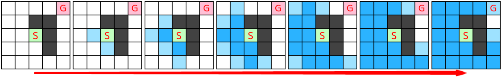
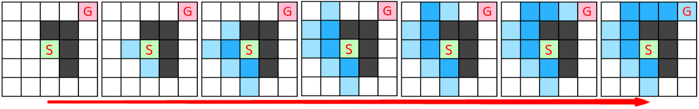
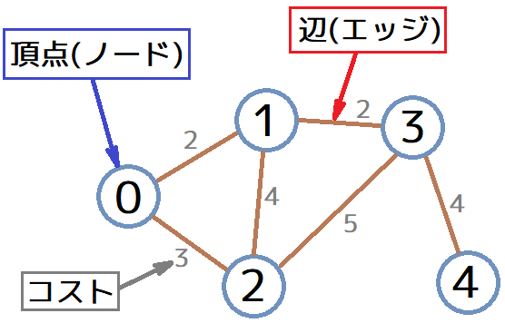
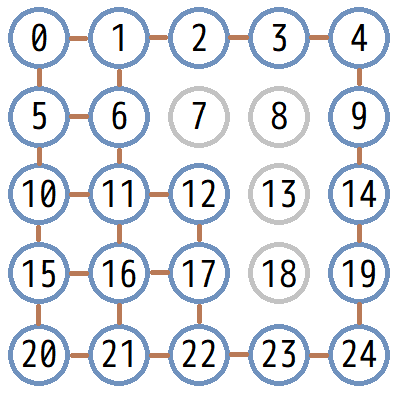

[OpenGL 3D 2021後期 第04回]

# 最短経路探索(A*アルゴリズム)

## 習得目標

* 頂点と辺から構成されるグラフ構造について理解する。
* ヒューリスティック関数、マンハッタン距離について理解する。
* A*アルゴリズムによる最短経路の探索ができる。

## 1. A*アルゴリズム

### 1.1 最短経路探索のアルゴリズム

プレイヤーを追いかける敵のAIを実装するとします。このとき、敵はプレイヤーに到達できる経路を移動しなくてはなりません。また、プレイヤーに到達できる経路であっても、遠回りで時間がかかる経路を選んでしまうと緊張感に欠けます。

このようなときは「最短経路を探索するアルゴリズム」の出番です。

最短経路を求める簡単な方法は、スタートから始めて、すべての移動可能な方向に一歩ずつ探索範囲を広げていく方法です。そして、探索範囲がゴールに到達したら、ゴールから逆順に経路をたどります。

この方法では、スタート地点から波紋が広がるように探索範囲が広がってゆきます。そして、波紋がゴールに到達した時点で探索が完了します。そのため、ゴールとは無関係な方向も探索が行われます。

このような探索方法は、発案者の名前から「ダイクストラ法」と呼ばれています。以下の図はダイクストラ法の動作を表したものです。`S`がスタート、`G`がゴールで、濃い灰色は通過不能なマスです。

<p align="center">

</p>

この図において、薄い水色は探索候補となるマス、青色は探索済みのマスです。スタートからすべての方向に探索が進んでいくことが分かるでしょう。

しかし、人間が経路をさがすときはゴールにたどり着きそうな方向から優先的に探索を行うはずです。例えば自分の右方向にゴールがあるとき、最初は右方向を調べようとするでしょう。左を調べるのは、右側が行き止まりだと分かったあとのはずです。

そこで、考案されたのが「A*(エー・スター)」というアルゴリズムです。

A*アルゴリズムでは、各地点を経由してゴールへ向かった場合の「<ruby>推定距離<rt>すいていきょり</rt></ruby>」を利用して探索方向を選択します。ゴールから遠いと思われる方向の探索は後回しにされるので、効率的に経路を見つけられる可能性が高まります。

<p align="center">

</p>

ダイクストラ法と比べて、探索済みを示す青色のマスが非常に少ないことが分かると思います。それだけ効率的な探索ができているということです。

もちろん、ゴールまでの距離が本当に判明しているなら、最短経路は最初から分かっていることになります。当然、そういうことはありえないので、「推定距離」を利用して優先的に探索する方向を決めることになります。

推定距離を求める関数のことを「ヒューリスティック関数」と呼びます。A*アルゴリズムでは、より正しい推定を行うヒューリスティック関数を選ぶことが重要です。

これらの探索アルゴリズムは「グラフ」と呼ばれるデータ構造を使って行われます。

### 1.2 グラフとノードとエッジ

「グラフ」は、「ノード」と呼ばれる頂点と、「エッジ」と呼ばれるノード同士を接続する<ruby>辺<rt>へん</rt></ruby>の集合によって表されるデータです。

頂点の集合`V`と辺の集合`E`があるとすると、グラフ`G`は

`G = { V, E }`

と表すことができます。

例えば、次のグラフは、

<p align="left">

</p>

以下のように、頂点および辺の集合として表すことができます。

```txt
V = { 0, 1, 2, 3, 4 }
E = { (0,1), (0,2), (1,2), (1,3), (3,4) }
```

また、1.1節で見たマス目のマップをグラフで表すと、次のようになります。

<p align="left">

</p>

なお、この図のすべての辺のコストは`1`です。シミュレーションゲームのようにノードによってコストが異なる場合は、エッジごとに適切なコストを設定する必要があります。

プログラムで頂点、辺、グラフを表現する方法は何種類も存在し、それぞれに必要なメモリ量や得意な処理が異なります。一般的なグラフはノードとエッジを別々の型として扱います。鉄道や道路をグラフ問題として扱う場合、大抵はエッジによって移動コストが異なるからです。

よく使われるのは「<ruby>隣接<rt>りんせつ</rt></ruby>リスト」を使ったデータ構造です。以下に隣接リストを使った例を示します。

>```c++
>// 辺(エッジ)
>struct Edge {
>  int nodeId; // 隣接ノードID
>  float cost; // 移動コスト
>  Edge* next; // 隣接リスト(次のエッジ)
>};
>
>// 頂点(ノード)
>struct Node {
>  int id;
>  Edge* adjacencyList; // 隣接リスト(最初のエッジ)
>};
>
>// グラフ
>struct Graph {
>  std::vector<Node> nodes; // ノード配列
>};
>```

`adjacency`(アジェイセンシー)は「隣接、隣接地」という意味の名詞です。

このプログラムでは、隣接リストはポインタによる連結リスト構造として定義されています。連結リストは汎用性に優れており、かわりに処理速度が遅いという特徴を持っています。ゲームのように処理速度を求める分野では、構造を単純化したり、連結リストのかわりに配列を使うといった工夫が必要です。

### 1.3 ノードとグラフを実装する

さて、A*アルゴリズムを実装するためには、グラフ、ノード、エッジを表す「型」を定義する必要があります。プロジェクトの`Src`フォルダに`AStar.h`というヘッダファイルを追加してください。追加したファイルを開き、次のプログラムを追加してください。

```diff
+/**
+* @file AStar.h
+*/
+#ifndef ASTAR_H_INCLUDED
+#define ASTAR_H_INCLUDED
+#include <glm/vec3.hpp>
+#include <vector>
+
+/**
+* A*経路探索
+*/
+namespace AStar {
+
+struct Node;
+
+/**
+* グラフのエッジ(辺)を表す型
+*/
+struct Edge
+{
+  Node* node = nullptr; // 隣接先ノード
+  float cost = 1.0f; // エッジ通過に必要なコスト
+};
+
+/**
+* グラフのノード(頂点)を表す型
+*/
+struct Node
+{
+  std::vector<Edge> neighbors; // 隣接しているノードの配列
+};
+
+/**
+* グラフを表す型
+*/
+struct Graph
+{
+  std::vector<Node> nodes; // ノード配列
+};
+
+} // namespace AStar
+
+#endif // ASTAR_H_INCLUDED
```

辺は`Edge`(エッジ)型、頂点は`Node`(ノード)型、グラフは`Graph`(グラフ)型として定義しました。また、隣接ノード配列は`neighbors`(ネイバーズ)という名前にしました。

>**【ネイバー？　アジェイセンシー？】**<br>
>ネイバーとアジェイセンシーはどちらも「隣接、隣人」という意味の単語です。ネイバーは日常でも使われる一般的な用語なのに対し、アジェイセンシーは数学や工学などの堅苦しく正確性を重んじる分野で使われます。なのでどちらを使っても構いません。上のプログラムでアジェイセンシーではなくネイバーを使った理由は、ネイバーのほうが短くて呼びやすいと思ったからです。

>**【ベクター以外の型でノードを管理できる？】**<br>
>グラフの定義は「ノードとエッジの集合」なので、ベクター以外の型でも実装することができます。ただし、現在のコンピュータでは、多くの場合でベクター型が最も効率のよいデータ構造になります。そのため、基本的にはベクター型を使います。

上記のデータ構造を使って、1.2節にある5ノードのグラフを表現する方法を次に示します。

>```c++
>Graph graph;
>graph.nodes.resize(5);
>// ノード0を作成
>graph.nodes[0].neighbors.push_back(Edge{&graph.nodes[1], 2)});
>graph.nodes[0].neighbors.push_back(Edge{&graph.nodes[2], 3)});
>// ノード1を作成
>graph.nodes[1].neighbors.push_back(Edge{&graph.nodes[0], 2)});
>graph.nodes[1].neighbors.push_back(Edge{&graph.nodes[2], 4)});
>graph.nodes[1].neighbors.push_back(Edge{&graph.nodes[3], 2)});
>// ノード2を作成
>graph.nodes[2].neighbors.push_back(Edge{&graph.nodes[0], 3)});
>graph.nodes[2].neighbors.push_back(Edge{&graph.nodes[1], 4)});
>graph.nodes[2].neighbors.push_back(Edge{&graph.nodes[3], 5)});
>// ノード3を作成
>graph.nodes[3].neighbors.push_back(Edge{&graph.nodes[1], 2)});
>graph.nodes[3].neighbors.push_back(Edge{&graph.nodes[2], 5)});
>graph.nodes[3].neighbors.push_back(Edge{&graph.nodes[4], 4)});
>// ノード4を作成
>graph.nodes[4].neighbors.push_back(Edge{&graph.nodes[3], 4)});
>```

このデータ構造のようにノードをポインタで管理する場合、ベクター型へのプッシュバックによってメモリ上の位置が移動しないように注意しなくてはなりません。上記のプログラムでは、最初にリサイズ関数を実行することでメモリの移動を防いでいます。

>**【ノードの識別にIDを使う場合】**<br>
>ノードの識別にポインタでなくIDを使えば、メモリ移動の問題は起きません。そのかわり、隣接ノードを参照するときにポインタより時間がかかります。

### 1.3 A*の考え方

>本テキストのプログラムは、WikipediaにあるA*の日本語及び英語の記事に書かれているアルゴリズムを参考に作成しました。
>そこで、以下のURLの記事にある「A*の考え方」、「アルゴリズムの流れ」、「実際に使われているOPEN/CLOSEリストの実装」の3つを読んでおいてください。
>なお、「実際に使われている～」に書かれているのは「アルゴリズムの流れ」を改良する方法です。
>
>`https://ja.wikipedia.org/wiki/A*`
>

1.2節の5ノードのグラフについて、ノード0からノード4へ移動する経路を考えます。同じ地点を通らないような経路は、以下の4つになります。

1. `0→1→3→4(コスト=6)`
2. `0→1→2→3→4(コスト=15)`
3. `0→2→3→4(コスト=12)`
4. `0→2→1→3→4(コスト=13)`

最短経路はコストが最も少ない経路1であることが分かります。

このように、すべての経路を<ruby>列挙<rt>れっきょ</rt></ruby>できれば、コストの最も少ない経路が最短経路として確定します。しかし、25ノードの図でこれを行うのはあまり効率的とは言えません。もっと大きなグラフになると、現実的な時間では、すべての経路を列挙することができない可能性があります。

例えば、自動車のカーナビは現実の道路網という非常に巨大なグラフを処理しなくてはなりません。だからといって、もしカーナビが経路を決めるまで30分待つ必要があるとしたら、とても製品として売り出すことはできないでしょう。

そのためカーナビは、A*をはじめとしたさまざまなアルゴリズムを利用して、ごく短い時間で最短経路を見つけ出せるように工夫されています。

それでは、A*の考え方を説明しましょう。スタートノードから、あるノード`n`を経由して、ゴールノードにたどり着くときの最短経路を考えます。このとき、最短経路のコスト(必要な時間やエネルギーのこと)を`f*(n)`(エフ・スター・かっこ・エヌ)という関数で表すとします。

同様に、スタートノードから`n`までの最短経路のコストを`g*(n)`(ジー・スター・かっこ・エヌ)、`n`からゴールノードまでの最短経路のコストを`h*(n)`(エイチ・スター・かっこ・エヌ)で表すとします。

すると`f*(n)`は、

`f*(n) = g*(n) + h*(n)`

のように表すことができます。このとき、もし`g*(n)`と`h*(n)`の値が分かっていれば、当然、最短経路のコスト`f*(n)`はすぐに求められます。

コストが分かるということは最短経路も分かっているということになりますが、現実には探索を行わずに`g*(n)`と`h*(n)`を求めることはできません。そこで、上記の3つの関数を「推定値を求める関数」で置き換えます。

`g*(n)`の推定値を`g(n)`、`h*(n)`の推定値を`h(n)`とすると、`f*(n)`の推定値`f(n)`は、

`f(n) = g(n) + h(n)`

のように表すことができます。このうち、`g(n)`(スタートノードから`n`までの推定コスト)は経路探索の過程で更新することで、徐々に`g*(n)`に近づけることができます。探索が完了した時点で`g(n) = g*(n)`になります。

これに対して、`h*(n)`は探索中に更新することができず、実際にゴールノードにたどり着くまで正しい値は分かりません。そこで、推定値`h(n)`については「ある程度妥当性をを持つように設計した関数」で代用します。

この「ある程度妥当性を持つように設計した関数」のことを「ヒューリスティック関数」と呼びます。この関数は`g*(n)`の初期値を与えるために使うことができます。

そして、「ヒューリスティック関数を用いて経路探索を行うアルゴリズム」をA*アルゴリズムといいます。

### 1.4 ノードのメンバについて

A*を実装するにはノードごとに`f(n)`、`g(n)`、`h(n)`を求めて保持する必要があります。`h(n)`にはヒューリスティック関数を使うので、ノードが管理しなければならない変数は`f(n)`と`g(n)`の2つです。

それから、ゴールからスタートへとノードをたどる仕組みが必要です。これは、`n`の探索元ノード(<ruby>親<rt>おや</rt></ruby>ノード)へのポインタとして実装することができます。

さらに、ノードが既に調査済みの場合は探索をスキップする必要があります。そのために、探索状態を示すメンバが必要です。

それでは、これらをノードクラスに追加しましょう。`AStar.h`を開き、ノードクラスに次のプログラムを追加してください。

```diff
 * グラフのノードを表すクラス
 */
 struct Node
 {
   std::vector<Edge> neighbors; // 隣接しているノードの配列
+
+  float f;      // このノードを通ってスタートとゴールを結ぶ最短経路の予想距離
+  float g;      // スタートノードからこのノードまでの予想距離
+  Node* parent; // 親ノード
+
+  // ノードの状態
+  enum class Status {
+    open,  // 探索候補
+    close, // 探索済み
+  };
+  Status status = Status::open;
 };
 
 /**
 * グラフを表す型
```

### 1.5 マンハッタン距離

空間がマス目状に分割されており、マス目の移動は上下左右にしか行えないとします。こうした条件で利用されるヒューリスティック関数に「マンハッタン距離」があります。

マンハッタン距離は「各軸の座標の差の絶対値の総和」として表されます。例えば座標Aが(2,8)、座標Bが(5, 1)にあるとすると、AB間のマンハッタン距離は、

`|2 - 5| + |8 - 1| = 3 + 7 = 10`

となります。

マンハッタン距離を計算するには、ノードの座標が分かっていなくてはなりません。そこで、ノードクラスに座標を表すメンバ変数を追加します。`AStar.h`を開き、ノードクラスに次のプログラムを追加してください。

```diff
 * グラフのノードを表すクラス
 */
 struct Node
 {
+  glm::vec3 position; // ノードの座標
   std::vector<Edge> neighbors; // 隣接しているノードの配列

   float f = 0; // このノードを通る場合のスタートからゴールまでの予想距離
```

それでは、マンハッタン距離を計算する関数を作成しましょう。プロジェクトの`Src`フォルダに`AStart.cpp`という名前のCPPファイルを追加してください。追加したファイルを開き、次のプログラムを追加してください。

```diff
+/**
+* @file AStar.cpp
+*/
+#include "AStar.h"
+#include <glm/glm.hpp>
+
+namespace AStar {
+
+/**
+* 2点間のマンハッタン距離を計算する
+*/
+float ManhattanDistance(const Node& a, const Node& b)
+{
+  const glm::vec3 v = glm::abs(b.position - a.position);
+  return v.x + v.y + v.z;
+}
+
+} // namespace AStar
```

`glm::abs`(ジーエルエム・エービーエス)関数は、ベクトル型のすべての要素を絶対値に変換した結果を返します。上記のプログラムと以下のプログラムは同じ結果になります。

>```c++
>glm::vec3 v;
>v.x = std::abs(b.position.x - a.position.x);
>v.y = std::abs(b.position.y - a.position.y);
>v.z = std::abs(b.position.z - a.position.z);
>return v.x + v.y + v.z;
>```

### 1.6 A*アルゴリズムを実装する

A*アルゴリズムのプログラムを書いていきましょう。経路を表す`Route`(ルート)型を定義し、最短経路を計算する`SearchRoute`(サーチ・ルート)関数を宣言します。`AStar.h`を開き、次のプログラムを追加してください。

```diff
   Status status = Status::open;
 };
+
+// 経路を表す型
+using Route = std::vector<const Node*>;

 /**
 * グラフを表す型
 */
 struct Graph
 {
+  Route SearchRoute(Node* startNode, Node* goalNode);
+
   std::vector<Node> nodes; // ノード配列
 };
```

`AStar.cpp`を開き、マンハッタン距離を計算する関数の定義の下に、次のプログラムを追加してください。

```diff
   const glm::vec3 v = glm::abs(b.position - a.position);
   return v.x + v.y + v.z;
 }
+
+/**
+* 最短経路を探索する
+*
+* @param graph     探索対象のノードグラフ
+* @param startNode 探索開始ノード
+* @param goalNode  探索目標ノード
+*
+* @return startNodeからgoalNodeへの最短経路を返す
+*/
+Route Graph::SearchRoute(Node* startNode, Node* goalNode)
+{
+  // 1. ノードの状態を初期化
+
+  // 2. オープンリストを初期化
+
+  // 3. オープンリストに含まれるノードを、fが小さい順にチェックする
+
+  // 4. オープンリストが空の場合は到達可能な経路が存在しない
+
+  // 5. 親ノードをたどってゴールからスタートへの最短経路を作成
+}

 } // namespace AStar
```

### 1.7 ノードの状態を初期化する

ここからは、サーチルート関数のコメントに書かれた処理を実装していきます。まず「1. ノードの状態を初期化」から始めましょう。初期化ではすべてのノードを「調査候補」に設定します。サーチルート関数に次のプログラムを追加してください。

```diff
 Route Graph::SearchRoute(Node* startNode, Node* goalNode)
 {
   // 1. ノードの状態を初期化
+  for (auto& e : nodes) {
+    e.f = FLT_MAX;
+    e.g = FLT_MAX;
+    e.parent = nullptr;
+    e.status = Node::Status::open;
+  }
+  startNode->f = 0;
+  startNode->g = 0;
 
   // 2. オープンリストを初期化

   // 3. オープンリストに含まれるノードを、fが小さい順にチェックする
```

ノードを「調査候補」にするには、`status`メンバ変数を「オープン」に設定し、`g`メンバ変数に「経路探索では発生し得ない大きな数値」を設定します。

A*アルゴリズムでは、`f`と`g`を徐々に正確な値へと小さくしていくことで探索を行います。そのため、最初から小さな値が設定されていると、最短経路の探索に失敗してしまいます。

そこで、`g`には`FLT_MAX`(フロート・マックス)という、「float型で表現可能な最大値」をあらわす定数を設定しています。

次に、スタートノードの`g`メンバ変数を`0`に設定します。`g`は「スタートノードからノードnまでの最短距離」なので、`n = スタートノード`の場合は`0`になるからです。

なお、プログラムが正しく動作するのであれば`f`と`parent`を初期化する必要はありません。しかし、変な数値が入っていると動作確認が難しくなるので、デバッグの邪魔にならなさそうな初期値を設定しています。

動作確認が完了したら、`f`と`parent`の初期化を削除するとよいでしょう。これでノードの初期化は完了です。

### 1.8 オープンリストを初期化する

次は「2. オープンリストを初期化」を実装します。オープンリストは「探索候補をゴールまでの距離が短い順番に並べたもの」です。

このような「ある順序に従って要素を並べた配列」のことを「優先順位付きキュー」といいます。優先順位付きキューは、C++では`priority_queue`(プライオリティ・キュー)クラスとして実装されています。

プライオリティキューには、要素を追加する`push`(プッシュ)メンバ関数、要素を参照する`top`(トップ)関数、要素を削除する`pop`(ポップ)関数などが定義されています。

さて、プライオリティキューは`queue`(キュー)ヘッダに定義されています。`AStart.cpp`を開き、次のように`queue`ヘッダをインクルードしてください。

```diff
 * @file AStar.cpp
 */
 #include "AStar.h"
 #include <glm/glm.hpp>
+#include <queue>

 namespace AStar {

 /**
```

続いて、サーチルート関数に次のプログラムを追加してください。

```diff
   startNode->g = 0;

   // 2. オープンリストを初期化
+  std::priority_queue<Node*> openList;
+  openList.push(startNode);

  // オープンリストに含まれるノードを、fが小さい順にチェックする
```

これでプライオリティキューを使うことはできます。ただし、テンプレート引数にポインタ型をしてした場合、デフォルトの動作は「ポインタのアドレスが大きい順に並べる」となっています。

しかし、今回やりたいのは「ゴールまでの距離が短い順に並べる」ことなので、このままでは目的を果たせません。そこで、プライオリティキューの比較クラスを変更します。

まず比較を行うクラスを定義します。クラス名は`CompareNodePointer`(コンペア・ノード・ポインタ)とします。マンハッタン距離を計算するプログラムの下に、次のプログラムを追加してください。

```diff
   const glm::vec3 v = glm::abs(b->position - a->position);
   return v.x + v.y + v.z;
 }
+
+/**
+* Nodeポインタの優先順判定を行うクラス
+*/
+struct CompareNodePointer
+{
+  bool operator()(const Node* lhs, const Node* rhs) const
+  {
+    if (lhs->f == rhs->f) {
+      return lhs->g > rhs->g;
+    }
+    return lhs->f > rhs->f;
+  }
+};

 /**
 * 最短経路を探索する
```

このコンペアノードポインタ型は、レス型を置き換えることができなくてはなりません。レス型は「関数呼び出し演算子`operator()`」を定義したクラスなので、コンペアノードポインタ型にも`operator()`を定義しています。

このメンバ関数については、ちょっと見慣れない書きかただと思います。しかし、実のところは

`bool func(const Node*, const Node*) const;`

というメンバ関数とまったく同じで、関数名の部分が`func`から`operator()`に置き換わっただけです。この関数呼び出し演算子を実行するには次のように書きます。

>```c++
>Node* a;
>Node* b;
>Compare cmp;
>cmp(a, b); // operator()が実行される
>```

コンペア型のオブジェクト`cmp`を、まるで関数のように使っていますね。このように、関数呼び出し演算子は「関数と同じように使える型」を定義するときに使います。

こうした「関数と同じように使える型」のことを「関数オブジェクト」や「ファンクタ」といいます。

それでは、コンペアノードポインタ型を使って、プライオリティキューを書き換えましょう。まずプライオリティキュークラスの定義を次に示します。

>```c++
>namespace std {
>  template<class T,
>   class Container = std::vector<T>, class Compare = less<typename Container::value_type>>
>  class priority_queue;
>}
>```

テンプレート引数の意味は次のとおりです。

* `T`(ティー): 管理する要素の型
* `Container`(コンテナ): 要素の管理に使用するクラス
* `Compare`(コンペア): 要素の比較に使用するクラス

コンテナ引数のデフォルトは`std::vector<T>`、コンペア引数のデフォルトは`less`(レス)型になっています。レス型は`<`(小なり)演算子で比較を行う型で、`int`などの基本型の場合は追加で定義する必要はありません。

`T`には`Node*`、`Container`には`std::vector<Node*>`を指定し、`Compare`には先ほど作成した`CompareNodePointer`を指定します。オープンリストを初期化するプログラムを次のように変更してください。

```diff
   startNode->g = 0;

   // 2. オープンリストを初期化
-  std::priority_queue<Node*> openList;
+  std::priority_queue<Node*, std::vector<Node*>, CompareNodePointer> openList;
   openList.push(startNode);

  // オープンリストに含まれるノードを、fが小さい順にチェックする
```

これで「探索候補をゴールまでの距離が短い順番に並べたプライオリティキュー」、つまりオープンリストを作ることができました。

### 1.9 オープンリストに含まれるノードをチェックする

次はいよいよ経路探索の本体、「3. オープンリストに含まれるノードを、fが小さい順にチェックする」です。

まずオープンリストのすべての要素をチェックするループを作成します。オープンリストを初期化するプログラムの下に、次のプログラムを追加してください。

```diff
   openList.push(startNode);

   // 3. オープンリストに含まれるノードを、fが小さい順にチェックする
+  while (!openList.empty()) {
+    Node* n = openList.top();
+    openList.pop();
+  }

   // 4. オープンリストが空の場合は到達可能な経路が存在しない
```

`empty`(エンプティ)メンバ関数は、プライオリティキューに要素が入っているかどうかを返します。ひとつでも要素があれば`false`、ひとつもなければ`true`が返されます。

プライオリティキューから先頭の要素を取り出すには`top`(トップ)関数を使います。要素を削除するには`pop`(ポップ)関数を使います。

トップとポップは名前がとても似ていますたが、次のように全く動作が異なります。間違えないように注意してください。

* `top`(トップ)関数: 要素を取得する。
* `pop`(ポップ)関数: 要素を取り除く。

A*のキモは「ゴールまでの推定距離が短いノードを優先的に探索する」ことですが、このようにプライオリティキューを使うことで簡単に実現できます。

次にゴールに到達したかの判定を追加します。これには変数`n`がゴールノードと等しいかどうかを調べます。ホワイルループに次のプログラムを追加してください。

```diff
   while (!openList.empty()) {
     Node* n = openList.top();
+
+    // ゴールに到達したら探索終了
+    if (n == goalNode) {
+      break;
+    }
     openList.pop();
   }

   // 4. オープンリストが空の場合は到達可能な経路が存在しない
```

`pop`(ポップ)関数を実行するタイミングが、まだゴールに到達していない場合だけなことに注意してください。これは<ruby>後述<rt>こうじゅつ</rt></ruby>する経路の発見判定で重要になります。

その次は、探索済みノードの判定を行います。

さて、あるノードに到達する複数の経路がある場合、オープンリストには複数の経路から到達した同一ノードが含まれる可能性があります。つまり、オープンリストには「既に探索済みのノードへのポインタ」が残ることになります。

そこで、ノードが「探索済み」だった場合は探索をスキップします。ゴール到達を判定するプログラムの下に、次のプログラムを追加してください。

```diff
       break;
     }
     openList.pop();
+
+    // 「探索済み」ノードなら何もしない
+    if (n->status == Node::Status::close) {
+      continue;
+    }
   }

   // 4. オープンリストが空の場合は到達可能な経路が存在しない
```

次に、ノードの状態を「探索済み」に変更します。探索済みノードをスキップするプログラムの下に、次のプログラムを追加してください。

```diff
     if (n->status == Node::Status::close) {
       continue;
     }
+
+    // ノードを「探索済み」にする
+    n->status = Node::Status::close;
   }

   // 4. オープンリストが空の場合は到達可能な経路が存在しない
```

ここで「探索済み」に変更するのは、次に行う「隣接ノードの処理」において、自分自身へ戻るようなエッジがあったとしても問題なく動作するようにするためです。

ノードチェックの最後の処理は、隣接ノードをオープンリストに追加することです。隣接ノードの`g`(スタートから対象ノードまでの距離)を計算しなおし、新しい計算結果のほうが現在の`g`の値より小さければ探索候補とします。

ノードを探索済みにするプログラムの下に、次のプログラムを追加してください。

```diff
     // ノードを「探索済み」にする
     n->status = Node::Status::close;
+
+    // 隣接ノードをオープンリストに追加
+    for (const Edge& e : n->adjacency) {
+      Node* m = e.node;
+      const float g = n->g + e.cost;
+      // 現在の経路のほうが早く隣接ノードmに着く場合、mの情報を更新してオープンリストに追加
+      if (g < m->g) {
+        m->g = g;
+        m->f = g + ManhattanDistance(m, goalNode);
+        m->parent = n;
+        m->status = Node::Status::open;
+        openList.push(m);
+      }
+    }
   }

   // 4. オープンリストが空の場合は到達可能な経路が存在しない
```

オープンリストに追加するのは、経路更新の可能性がある隣接ノードだけです。更新の可能性のないノードを再び探索候補にしても意味がないからです。

また、ここでは`g(n)`の値によって経路更新の可能性を判定しています。`h(n)`を計算しないのは、ノードからゴールまでのマンハッタン距離は何度計算しても変わらないため、判定に使えないからです。

隣接ノードに経路更新の可能性がある場合、新しい計算結果で`g`と`f`を更新し、親ノードを現在探索中のノードで上書きします。

そして、ノードの状態`status`をオープンに戻します。他の経路からの探索で一旦は「探索済み」になったとしても、より短い経路が見つかった以上はもういちど探索を行う必要があるからです。

これでA*アルゴリズムのもっとも重要な部分は完成です。

### 1.10 経路が見つかったかどうかを判定する

ホワイルループを抜けたら経路探索は完了しています。しかし、経路が見つかったとは限りません。探索の途中で探索候補が見つからなくなった場合、エンプティ関数が`true`を返すことでループが終了します。

つまり、オープンリストが空かどうかを調べれば、経路が見つかったかどうかが分かるわけです。ホワイルループの下に、次のプログラムを追加してください。

```diff
   }

   // 4. オープンリストが空の場合は到達可能な経路が存在しない
+  if (openList.empty()) {
+    return Route(); // 空の経路を返す
+  }

   // 5. 親ノードをたどってゴールからスタートへの最短経路を作成
  }
```

### 1.11 最短経路を作成する

オープンリストが空ではない場合は経路が見つかったということですから、最短経路を作成して呼び出し元に返します。空の経路を返すプログラムの下に、次のプログラムを追加してください。

```diff
     return Route(); // 空の経路を返す
   }

   // 5. 親ノードをたどってゴールからスタートへの最短経路を作成
+  Route route;
+  do {
+    route.push_back(p);
+    p = p->parent;
+  } while (p && p != startNode);
+  route.push_back(startNode);
+
+  return route;
 }

 } // namespace AStar
```

ここでは`do～while`文を使って最短経路を作成しています。`for`と`while`では最初にループ条件の判定を行いますが、`do～while`ではループ条件の判定が最後に行われます。

そのため、`do～while`ではループ内の処理が少なくとも1回は実行されます。これは`for`、`while`と大きく異なる点で、`do～while`の特徴となっています。

例えば上記のプログラムでは、もし`startNode`と`goalNode`が等しい場合でも、少なくともひとつの要素がルートとして追加されるべきです。

この場合、`for`のように最初にループ条件を判定すると、`p`と`startNode`が等しいことで即座にループが終了してしまいます。

そうなることを避けるには、`for`の前にノードのプッシュバックと`p`の更新を行うコードを追加しなくてはなりません(実際に書きかえてみると分かります)。こうした状況では、`do～while`を使うことでコードが簡潔なります。

まあ、それはともかく、これでA*アルゴリズムによる最短経路の探索は完成です。

>**【for, while, do～whileの使い分けかた】**<br>
>3つのループ文を使い分けるには経験が必要です。とりあえず`for`で作ってみて、ループ条件の判定を最後に持ってくる必要があると分かった時点で`do～while`を試す、という手順がよいでしょう。
>なお、`while`は`for`で代用できますが、ループ変数の初期化と更新が不要なループでは`for`よりシンプルに書けるという利点があります。

### 1.12 グラフを作成する

A*アルゴリズムを使うには「グラフ」を作成しなくてはなりません。ゲームでよくある格子状のマップデータからグラフを作成し、最短経路を検索するプログラム例を以下に示します。

>```c++
>// マップデータ
>const int mapSizeX = 5;
>const int mapSizeY = 5;
>const float mapScale = 4.0f;
>const int objectMapData[mapSizeY][mapSizeX] = {
>  { 0, 0, 0, 0, 0 },
>  { 0, 0, 1, 1, 0 },
>  { 0, 0, 0, 1, 0 },
>  { 0, 0, 0, 1, 0 },
>  { 0, 0, 0, 0, 0 },
>};
>
>// マップデータからグラフを作成
>AStar::Graph graph;
>graph.nodes.resize(mapSizeX * mapSizeY);
>for (int y = 0; y < mapSizeY; ++y) {
>  for (int x = 0; x < mapSizeX; ++x) {
>    AStar::Node& node = graph.nodes[x + y * mapSizeX];
>    node.position = glm::vec3(x, 0, y) * mapScale;
>    const glm::ivec2 offset[] = { {1, 0}, {0,-1},{-1, 0}, {0, 1} };
>    for (auto& e : offset) {
>      const glm::ivec2 pos(x + e.x, y + e.y);
>      if (pos.x >= 0 && pos.x < mapSizeX && pos.y >= 0 && pos.y < mapSizeY) {
>        if (objectMapData[pos.y][pos.x] == 0) {
>          AStar::Node* n = &graph.nodes[pos.x + pos.y * mapSizeX];
>          float cost = mapScale;
>          node.adjacency.push_back(AStar::Edge{ n, cost });
>        }
>      }
>    }
>  }
>}
>
>// startからgoalまでの最短経路を探索
>glm::ivec2 start(2, 2);
>glm::ivec2 goal(4, 0);
>AStar::Node* startNode = &graph.nodes[start.x + start.y * mapSizeX];
>AStar::Node* goalNode = &graph.nodes[goal.x + goal.y * mapSizeX];
>AStar::Route route = graph.SearchRoute(startNode, goalNode);
>
>// 最短経路を出力
>std::cout << "A*: ";
>for (AStar::Route::reverse_iterator i = route.rbegin(); i != route.rend(); ++i) {
>  const AStar::Node* n = *i;
>  std::cout << "(" << n->position.x << ", " << n->position.z << ") "; 
>}    
>std::cout << "\n";
>```

<pre class="tnmai_assignment">
<strong>【課題01】</strong>
作成した<code>AStar::Graph</code>クラスを使って、敵戦車がプレイヤーの戦車を追跡するプログラムを実装しなさい。
</pre>

<pre class="tnmai_assignment">
<strong>【課題02】</strong>
本テキストで作成した<code>AStar::Graph</code>クラスは、一般的なA*を実装することを目的としています。そのため、格子状マップのようにグラフ構造を限定できる場合は、より効率的なコードに改良する余地があります。
可能であれば、格子状マップ専用の<code>AStar::GridGraph</code>クラスを作成し、敵戦車の追跡機能を<code>AStar::GridGraph</code>クラスを使うように変更しなさい。
例えば、ノードを2次元配列として管理することで、<code>position</code>メンバ変数と<code>neighbors</code>メンバ変数を削除することができるでしょう。
</pre>

>**【1章のまとめ】**<br>
>
>* 頂点(ノード)と辺(エッジ)によって構成されるデータ構造を「グラフ」という。
>* A*(エー・スター)は、グラフ構造の2地点を結ぶ最短経路を、ヒューリスティック関数を使って効率的に求めるアルゴリズム。
>* 格子状のグラフでは、ヒューリスティック関数としてマンハッタン距離を使う。

<div style="page-break-after: always"></div>

## 2. 

### 2.1 


>**【2章のまとめ】**<br>
>
>* 
>* 
>* 

<div style="page-break-after: always"></div>
