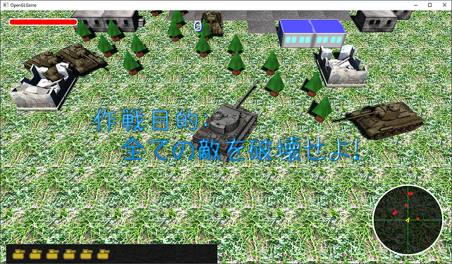

[OpenGL 3D 2021後期 第04回(マップエディタ編)]

# マップデータを使用する

## 習得目標

* マップエディタで作成したマップデータをゲームで使えるようにする。
* 大きな関数を小さな関数に分解すると、プログラムを管理しやすくなることを理解する。
* プロトタイプ・パターンを使ってオブジェクトのコピーを作ることができる。

## 1. ゲーム中にマップデータをロードする

### 1.1 マップエディタに動作タイプを追加する

マップが作成できたとしても、実際のゲームで使えなければあまり意味がありません。そこで、ゲームマネージャでもマップをロードできるようにしましょう。

マップエディタで作成したマップをロードするには、マップエディタと同じプリミティブ、同じアクター配列、同じ地面を作成できなくてはなりません。そこで、マップエディタクラスを作成するときに「動作タイプ」を指定する機能を追加しましょう。

>**【理想と現実】**<br>
>理想的には「マップデータを管理するクラス」を作成して、マップエディタとゲームマネージャはその管理クラスを使う、という形が考えられます。
>しかし、データや機能をクラスに分離するのは手間がかかりますので、今回は「既存のプログラムを改造する」という現実路線を選びました。
>余裕のある方は、マップデータ管理クラスを作ってみてもよいでしょう。

動作タイプは「エディタ」と「ゲーム」の2つを用意すればよいでしょう。それぞれの機能の違いは以下のとおりです。

| 動作タイプ | 機能 |
|:----------:|:-----|
| エディタ   | マップエディタの全機能が使える。 |
| ゲーム     | ロード機能だけが使える。ゲームで使わないデータは作成しない。 |

とりあえず動作タイプを定義して、コンストラクタの引数でタイプを指定できるようにします。`MapEditor.h`を開き、マップエディタクラスの定義に次のプログラムを追加してください。

```diff
 class MapEditor
 {
 public:
+  // 動作の種類
+  enum class SystemType {
+    editor, // マップエディタの全機能が使える。
+    game,   // ロード機能だけが使える。
+  };
+
- MapEditor();
+ MapEditor(SystemType type);
  ~MapEditor() = default;

  void Update(float deltaTime);
```

それから、動作タイプを記録するメンバ変数を追加します。マップエディタクラスの定義に次のプログラムを追加してください。

```diff
   std::shared_ptr<Actor> GetActor(const char* name) const;

 private:
+  const SystemType systemType;             // 動作タイプ
+  glm::vec2 gridSize = glm::vec2(4.0f);    // マス目の大きさ(m)
   glm::ivec2 mapSize = glm::ivec2(21, 21); // マップの広さ
   std::vector<std::shared_ptr<Actor>> map; // アクター配置マップ(エディタ用)
```

`gridSize`(グリッド・サイズ)変数は、マス目の大きさを表します。手抜きでこれまで定義していなかったので、この機会に定義することにしました。

次に`MapEditor.cpp`を開き、コンストラクタの定義を次のように変更してください。

```diff
 * コンストラクタ
 */
-MapEditor::MapEditor()
+MapEditor::MapEditor(SystemType type) : systemType(type)
 {
   GameEngine& engine = GameEngine::Get();
```

この修正にともない、マップエディタクラスを使っている`Main.cpp`にも修正が必要となります。`Main.cpp`を開き、マップエディタを作成するプログラムを次のように変更してください。

```diff
   // マップエディタを作成
   const bool isEditMode = true; // エディタを起動しない場合はfalseにする
-  std::shared_ptr<MapEditor> mapEditor(new MapEditor);
+  std::shared_ptr<MapEditor> mapEditor;
+  if (isEditMode) {
+    mapEditor.reset(new MapEditor(MapEditor::SystemType::editor));
+  }

   // メインループ.
   double loopTime = engine.GetTime();     // 1/60秒間隔でループ処理するための時刻
```

引数を追加する修正に加えて、「マップエディタを使わない場合はマップエディタを作成しない」という修正も行っています。ゲームを普通に起動するときは、ここでマップエディタを作成する必要がないからです。

### 1.2 ゲームエンジンに便利なメンバ関数を追加する

マップエディタの改造を続ける前に、ゲームエンジンにマップエディタの改造で使う機能を追加します。`GameEngine.h`を開き、ゲームエンジンクラスの定義に次のプログラムを追加してください。

```diff
   ActorList& GetActors(Layer layer = Layer::Default)
   {
     return actors[static_cast<int>(layer)];
   }
+  ActorList& GetNewActors() { return newActors; }
   void AddActor(std::shared_ptr<Actor> actor) { newActors.push_back(actor); }
+  std::shared_ptr<Actor> FindActor(const char* name);
+  void ClearAllActors();
   void UpdateActors(float deltaTime);
   void PostUpdateActors();
   void UpdatePhysics(float deltaTime);
   void UpdateCamera();
   void NewFrame();
   void RemoveDeadActors();
   void RenderDefault();
   void RenderUI();
   void PostRender();

   PrimitiveBuffer& GetPrimitiveBuffer() { return *primitiveBuffer; }
+  bool LoadPrimitive(const char* filename);
   const Primitive& GetPrimitive(const char* filename) const;
   const Primitive& GetPrimitive(int n) const { return primitiveBuffer->Get(n); }
```

追加した関数宣言の概要を以下に示します。

>* `GetNewActors`(ゲット・ニュー・アクターズ):<br>
>`newActors`メンバ変数の参照を返します。追加したばかりのアクターは通常のアクターズ配列ではなく、一旦ニューアクターズ配列に入れられます。
>そのため、既存のゲットアクターズ関数ではアクターを取得できません。ゲットニューアクターズ関数によって、追加したばかりのアクターを取得できるようになります。
>* `FindActor`(ファインド・アクター):<br>
>アクター名によってアクターを検索する関数です。アクターを検索するとき、いちいち<br>`Find(GetActors(), アクター名)`<br>のように書くのは面倒です。
>また、すべてのレイヤーを横断して検索するには`for`を併用する必要があります。そうした面倒をはぶくために、直接ゲームエンジンから検索できるようにします。
>* `ClearAllActors`(クリア・オール・アクターズ):<br>
>ゲームエンジンに登録されているすべてのアクターを削除します。ゲームの状態を初期化するときに使います。
>* `LoadPrimitive`(ロード・プリミティブ):<br>
>プリミティブを読み込む関数です。いちいち<br>`GetPrimitiveBuffer().AddFromOBJFile()`<br>のように書くのは面倒なので、直接ゲームエンジンから追加できるようにして手間を減らします。

それではメンバ関数を定義していきましょう。`GameEngine.cppを開き、ゲット関数の定義の下に、次のプログラムを追加してください。

```diff
 GameEngine& GameEngine::Get()
 {
   return *engine;
 }
+
+/**
+* 名前が一致するアクターを検索する
+*/
+std::shared_ptr<Actor> GameEngine::FindActor(const char* name)
+{
+  for (int layer = 0; layer < layerCount; ++layer) {
+    for (std::shared_ptr<Actor>& e : actors[layer]) {
+      if (e->name == name) {
+        return e;
+      }
+    }
+  }
+
+  for (std::shared_ptr<Actor>& e : newActors) {
+    if (e->name == name) {
+      return e;
+    }
+  }
+
+  return nullptr;
+}

 /**
 * ゲームエンジンを更新する
```

次に、クリアオールアクターズ関数を定義します。ファインドアクター関数の定義の下に、次のプログラムを追加してください。

```diff
   }
   return nullptr;
 }
+
+/**
+* すべてのアクターを削除する
+*/
+void GameEngine::ClearAllActors()
+{
+  for (int layer = 0; layer < layerCount; ++layer) {
+    actors[layer].clear();
+  }
+  newActors.clear();
+}

 /**
 * ゲームエンジンを更新する
```

続いて`LoadPrimitive`(ロード・プリミティブ)関数を定義します。クリアオールアクターズ関数の定義の下に、次のプログラムを追加してください。

```diff
   }
   newActors.clear();
 }
+
+/**
+* OBJファイルからプリミティブを追加する
+*/
+bool GameEngine::LoadPrimitive(const char* filename)
+{
+  // 既に同名のプリミティブが追加されていたら何もしない
+  if (primitiveBuffer->Find(filename).GetName() == filename) {
+    return true; // 追加済み
+  }
+  // まだ追加されていないのでOBJファイルを読み込む
+  return primitiveBuffer->AddFromObjFile(filename);
+}

 /**
 * ゲームエンジンを更新する
```

ロードプリミティブ関数には、同じプリミティブが何度も読み込まれることを防ぐ機能を入れています。この機能により、「間違えて何度も同じOBjファイルを読み込むプログラムになっていた」ということがなくなります。

これでゲームエンジンへの機能追加は完了です。

### 1.3 マップエディタのコンストラクタを分割する

現在のマップエディタクラスのコンストラクタには、さまざまな初期化プログラムが組み込まれています。そのため、エディタのときだけ必要なプログラムと、エディタでもゲームでも必要なプログラムが分かりづらくなっています。

必要な処理を分かりやすくするために、コンストラクタをいくつかの関数に分割しましょう。まず分割先となるメンバ関数を宣言します。`MapEditor.h`を開き、マップエディタクラスの定義に次のプログラムを追加してください。

```diff
   std::shared_ptr<Actor> GetActor(const char* name) const;

 private:
+  void LoadCommonPrimitives();
+  void InitGroundActor();
+  void InitActorList();
+  void InitEditor();
+
   const SystemType systemType;             // 動作タイプ
   glm::ivec2 mapSize = glm::ivec2(21, 21); // マップの広さ
```

追加した関数の目的は次のとおりです。

| メンバ関数名 | 目的 |
|:------------:|:----:|
| LoadCommonPrimitives | 動作タイプに関わらず必要なプリミティブを読み込む。 |
| InitGroundActor      | 地面アクターを作成する。 |
| InitActorList        | マップの読み込みに使用するアクター配列を作成する。 |
| InitEditor           | エディタを動かすために必要なデータを初期化する。 |

それでは、コンストラクタを分割しましょう。なお、分割が完了するまでの間は大量のエラーが報告されます。分割が完了するまではそれらのエラーを無視してください。

`MapEditor.cpp`を開き、コンストラクタを次のように変更してください。

```diff
 MapEditor::MapEditor(SystemType type) : systemType(type)
 {
   GameEngine& engine = GameEngine::Get();
+ 
+  // 既存のアクターをすべて削除
+  engine.ClearAllActors();
+
+  LoadCommonPrimitive();
+  InitActorList();
+  if (systemType == SystemType::editor) {
+    InitGroundActor();
+    InitEditor();
+  }
+}
 
   // アクター配置マップのサイズをマップサイズに合わせる
   map.resize(mapSize.x * mapSize.y);
```

この変更によって、「地面アクターの作成」と「エディタに必要なデータの初期化」は、動作タイプがエディタの場合だけ実行されるようになります。

次に`LoadCommonPrimitives`(ロード・コモン・プリミティブズ)関数を定義します。コンストラクタの定義の下に、次のプログラムを追加してください。

```diff
     InitEditor();
   }
 }
+ 
+/**
+* 動作タイプに関わらず必要なプリミティブを読み込む
+*/
+void MapEditor::LoadCommonPrimitive()
+{
+  GameEngine& engine = GameEngine::Get();
+
+  engine.LoadPrimitive("Res/Plane.obj");
+  engine.LoadPrimitive("Res/Bullet.obj");
+}

   // アクター配置マップのサイズをマップサイズに合わせる
   map.resize(mapSize.x * mapSize.y);
```

次に`InitGroundActor`(イニット・グラウンド・アクター)関数を定義します。ロードコモンプリミティブズ関数の定義の下に、次のプログラムを追加してください。

```diff
   engine.LoadPrimitive("Res/Plane.obj");
   engine.LoadPrimitive("Res/Bullet.obj");
 }
+
+/**
+* 地面用アクターを作成
+*/
+void MapEditor::InitGroundActor()
+{
+  GameEngine& engine = GameEngine::Get();

   // アクター配置マップのサイズをマップサイズに合わせる
   map.resize(mapSize.x * mapSize.y);
```

地面用アクターに関連するのは、マップ変数のりサイズからマップデータテクスチャ操作用変数を初期化するところまでです。マップデータテクスチャ操作用変数を初期化するプログラムの下に、次のプログラムを追加してください。

```diff
   for (const char* filename : texList) {
     groundTiles.push_back(engine.LoadTexture(filename));
   }
+}

   // 配置用アクターを作成
   struct ObjectData {
     const char* name;
```

地面用アクターの作成については、プログラムの追加が必要です。というのは、これまではエディタのことしか考えていなかったので、地面に衝突判定がなかったりするからです。

そこで、地面アクターに衝突判定を設定します。地面アクターを作成するプログラムに次のプログラムを追加してください。

```diff
   map.resize(mapSize.x * mapSize.y);

   // 地面用アクターを作成
-  engine.GetPrimitiveBuffer().AddFromObjFile("Res/Ground.obj");
+  engine.LoadPrimitive("Res/Ground.obj");
   std::shared_ptr<Actor> groundActor(new Actor("Ground",
     engine.GetPrimitive("Res/Ground.obj"),
     engine.LoadTexture("GroundTiles", texList, std::size(texList)),
     glm::vec3(0), glm::vec3(mapSize.x, 1, mapSize.y), 0, glm::vec3(0)));
   groundActor->shader = Shader::Ground;
+  groundActor->isStatic = true;
+  const glm::vec2 colliderSize = glm::vec2(mapSize) * gridSize * 0.5f;
+  groundActor->collider.min = glm::vec3(-colliderSize.x, -10.0f, -colliderSize.y);
+  groundActor->collider.max = glm::vec3(colliderSize.x, 0.0f, colliderSize.y);
   engine.AddActor(groundActor);

   // マップデータテクスチャ操作用の変数を初期化
```

それから、マップデータテクスチャ操作用の変数はエディタ用なので、動作タイプが「エディタ」の場合しか初期化する必要はありません。地面アクターを作成するプログラムを次のように変更してください。

```diff
   groundActor->collider.max = glm::vec3(colliderSize.x, 0.0f, colliderSize.y);
   engine.AddActor(groundActor);

   // マップデータテクスチャ操作用の変数を初期化
+  if (systemType == SystemType::editor) {
     groundMap.resize(mapSize.x * mapSize.y, 0);
+    groundTiles.clear();
     groundTiles.reserve(std::size(texList));
     for (const char* filename : texList) {
       groundTiles.push_back(engine.LoadTexture(filename));
     }
+  } // if systemType
 }

   // 配置用アクターを作成
   struct ObjectData {
```

>**【機能の切れ目を意識する】**<br>
>本節では、複数の機能が詰め込まれたコンストラクタを、機能単位で関数へと分割しています。分割する位置が正しければ、分割後の関数には互いに関係のあるプログラムだけが含まれるはずです。
>どこで関数を分けているかに注意して、分割後の関数には、本当に関係のあるプログラムだけが含まれているのかどうかを確認してください。

続いて`InitActorList`(イニット・アクター・リスト)関数を定義します。マップデータテクスチャ操作用変数を初期化するプログラムと、配置用アクターを作成するプログラムの間に、次のプログラムを追加してください。

```diff
     }
   } // if systemType
 }
+
+/**
+* 配置用アクターを作成
+*/
+void MapEditor::InitActorList()
+{
+  GameEngine& engine = GameEngine::Get();
+
+  actors.clear();

   // 配置用アクターを作成
   struct ObjectData {
     const char* name;
```

イニットアクターリスト関数の目的は、配置用アクターを作成することだけです。よって、「位置表示アクターを作成」するプログラムの手前に閉じカッコが必要です。位置表示アクターを作成するプログラムの直前に、次のプログラムを追加してください。

```diff
     actor->collider = e.collider;
     actors.push_back(actor);
   }
+}

   // 位置表示アクターを作成
   cursor.reset(new Actor(*actors[0]));
   engine.AddActor(cursor);
```

それから、配置用アクターを作成するプログラムを少し修正します。配置用アクターを作成するプログラムを次のように変更してください。

```diff
       Box{glm::vec3(-1.5f, 0, -1.5f), glm::vec3(1.5f, 2, 1.5f)} },
   };
   for (const auto& e : objectList) {
-    engine.GetPrimitiveBuffer().AddFromObjFile(e.primitiveFilename);
+    engine.LoadPrimitive(e.primitiveFilename);
     std::shared_ptr<Actor> actor(new Actor(e.name,
       engine.GetPrimitive(e.primitiveFilename),
```

最後に`InitEditor`(イニット・エディタ)関数を定義します。位置表示アクターを作成するプログラムの直前に、次のプログラムを追加してください。

```diff
     actors.push_back(actor);
   }
 }
+
+/**
+* エディタを動かすために必要な変数を初期化する
+*/
+void MapEditor::InitEditor()
+{
+  GameEngine& engine = GameEngine::Get();
+
   // 位置表示アクターを作成
   cursor.reset(new Actor(*actors[0]));
   cursor->color = glm::vec4(0.2f, 0.5f, 1.0f, 0.5f);
```

それから、既存のアクターを削除する処理はクリアオールアクターズ関数で行うので、イニットエディタ関数からは削除します。イニットエディタ関数を次のように変更してください。

```diff
   // カメラを設定
   Camera& camera = engine.GetCamera();
   camera.target = glm::vec3(0, 0, 0);
   camera.position = camera.target + cameraOffset;
-
-  // 既存のアクターをすべて削除
-  engine.GetActors().clear();
 }

 /**
 * マップエディタの状態を更新する
```

これでコンストラクタの分割は完了です。

### 1.4 動作タイプによってロード関数の処理を切り替える

次は、ロード関数に動作タイプ別のプログラムを作成しましょう。このプログラムによって、動作タイプがゲームの場合でもマップデータをロードできるようになります。

ロード関数の末尾にある「ゲームエンジンのアクターを更新」するプログラムを、次のように変更してください。

```diff
   engine.UpdateGroundMap(0, 0, mapSize.x, mapSize.y, groundMap.data());

   // ゲームエンジンのアクターを更新
-  engine.GetActors().resize(2);
+  engine.ClearAllActors();
+  InitGroundActor();
   for (std::shared_ptr<Actor>& e : map) {
     if (e) {
       engine.AddActor(e);
     }
   }
+
+  if (systemType == SystemType::editor) {
+    InitEditor();
+  }

   std::cerr << "[情報]" << __func__ << ": " << filename << "をロード\n";
 }
```

変更点は以下の3つです。

>1. 地面とカーソルのアクター以外を削除していたのを、すべてのアクターを削除するように変更。
>ロードによってマップサイズが変化しうるため、地面アクターを作りなおす必要があるのと、動作タイプが「ゲーム」の場合はカーソルアクターが不要なため。
>2. 地面アクターを作成するプログラムを追加。1の理由から、地面アクターを作り直す必要があるため。
>3. 動作タイプが「エディタ」の場合だけエディタ用変数を初期化する。これも1の理由から、エディタの場合はカーソルを作り直す必要があるため。

これで、動作タイプを「ゲーム」にすればマップデータがロードされるはずです。

<pre class="tnmai_assignment">
<strong>【課題01】</strong>
イニットアクターリスト関数について、<code>objectList</code>配列に「タイガーI戦車」を追加しなさい。
</pre>

<pre class="tnmai_assignment">
<strong>【課題02】</strong>
タイガーI戦車をマップに配置してセーブしなさい。
</pre>

### 1.5 ゲームマネージャでマップデータをロードする

それでは実際にマップデータをロードしてみましょう。まずマップエディタを使わない設定にします。`Main.cpp`を開き、マップエディタフラグを`false`にしてください。

```diff
   // マップエディタを作成
-  const bool isEditMode = true; // エディタを起動しない場合はfalseにする
+  const bool isEditMode = false; // エディタを起動しない場合はfalseにする
   std::shared_ptr<MapEditor> mapEditor;
   if (isEditMode) {
     mapEditor.reset(new MapEditor(MapEditor::SystemType::editor));
```

次に`GameManager.cpp`を開き、次のように`MapEditor.h`をインクルードしてください。

```diff
 #include "GameManager.h"
 #include "GameEngine.h"
+#include "MapEditor.h"
 #include "Actor/PlayerActor.h"
 #include "Actor/T34TankActor.h"
```

続いて、アップデート関数を次のように変更してください。

```diff
   switch (state) {
   case State::start:
     score = 0;
-    SpawnPlayer();
-    SpawnEnemies();
+
+    // マップデータをロードする
+    MapEditor(MapEditor::SystemType::game).Load("mapdata.txt");
+
+    // プレイヤーが操作するアクターを取得する
+    playerTank = engine.FindActor("Tiger-I");
+
+    // 敵アクターのポインタを配列にコピーする
+    enemies.clear();
+    for (auto& e : engine.GetNewActors()) {
+      if (e->name == "T-34") {
+        enemies.push_back(e);
+      }
+    }

     { // ゲーム開始メッセージを表示する
       std::shared_ptr<Actor> gamestart(new Actor{"GameStart",
```

プログラムが書けたらビルドして実行してください。マップが表示されていたら成功です。…ですが、プレイヤーが操作できないようですね。敵が動く気配もありません。どうなっているんでしょう？

### 1.6 アクターの派生クラスを作成できるようにする

プレイヤーも敵も動かないのは、彼らが「アクタークラス」としてロードされたからです。というのも、現在のマップエディタクラスは、すべてのアクターをアクタークラスとして作成しているからです。

しかし、アクターを意図したように動かすには、`Tiger-I`は`PlayerActor`として、`T-34`は`T34TankActor`として作成しなくてはなりません。

そこで、配置用アクターを作成するときに「それぞれのアクターが適切なコンストラクタによって作成される」ように変更します。そのためのアイデアを以下に示しします。

>1. 配置用アクターの作成に使う元データ(`objectList`配列)に、「アクターの型」を示すメンバを追加する。
>2. 配置用アクターを作成するとき、「アクターの型」メンバの値によって作成方法を切り替える。

「アクターの型」のように何かの「種類」を表すには列挙型を使います。「作成方法の切り替え」のように、特定の値にもとづいて処理を切り替えるには`switch`を使います。

とりあえずヘッダファイルをインクルードします。`MapEditor.cpp`を開き、次のヘッダファイルをインクルードしてください。

```diff
 #define _CRT_SECURE_NO_WARNINGS
 #include "MapEditor.h"
 #include "Actor.h"
+#include "Actor/PlayerActor.h"
+#include "Actor/T34TankActor.h"
 #include "GameEngine.h"
 #include <imgui.h>
```

次は「アクターの型」を表す列挙型を定義しましょう。型名は`ActorType`(アクター・タイプ)とします。`MapEditor.cpp`を開き、イニットアクターリスト関数を次のように変更してください。

```diff
 void MapEditor::InitActorList()
 {
   GameEngine& engine = GameEngine::Get();

   actors.clear();
+
+  // アクターの型
+  enum class ActorType {
+    actor,
+    player,
+    t34tank,
+  };

   // 配置用アクターを作成
   struct ObjectData {
```

そして、オブジェクトデータ型に「アクターの型」メンバを追加します。オブジェクトデータ型の定義に次のプログラムを追加してください。

```diff
   // 配置用アクターを作成
   struct ObjectData {
+    ActorType type;
     const char* name;
     const char* primitiveFilename;
```

次に、オブジェクトリスト配列に「アクターの型」を追加します。オブジェクトリスト配列を次のように変更してください。

```diff
     glm::vec3 adjustment = glm::vec3(0);
   };
   const ObjectData objectList[] = {
-    { "Tree", "Res/Tree.obj", "Res/Tree.tga",
+    {
+      ActorType::actor, "Tree",
+      "Res/Tree.obj", "Res/Tree.tga",
       Box{glm::vec3(-1, 0, -1), glm::vec3(1, 3, 1)} },
-    { "Warehouse", "Res/Warehouse.obj", "Res/Warehouse.tga",
+    {
+      ActorType::actor, "Warehouse",
+      "Res/Warehouse.obj", "Res/Warehouse.tga",
       Box{glm::vec3(-2, 0, -2), glm::vec3(2, 2, 2)} },
-    { "BrickHouse", "Res/HouseRender.obj", "Res/House38UVTexture.tga",
+    {
+      ActorType::actor, "BrickHouse",
+      "Res/HouseRender.obj", "Res/House38UVTexture.tga",
       Box{glm::vec3(-2, 0, -2), glm::vec3(2, 2, 2)},
       glm::vec3(2.0f), 0, glm::vec3(-2.6f, 2.0f, 0.8f) },
-    { "T-34", "Res/T34.obj", "Res/T-34.tga",
+    {
+      ActorType::t34tank, "T-34",
+      "Res/T34.obj", "Res/T-34.tga",
       Box{glm::vec3(-1.5f, 0, -1.5f), glm::vec3(1.5f, 2, 1.5f)} },
-    { "Tiger-I", "Res/Tiger_I.obj", "Res/PzVl_Tiger_I.tga",
+    {
+      ActorType::player, "Tiger-I",
+      "Res/Tiger_I.obj", "Res/PzVl_Tiger_I.tga",
       Box{glm::vec3(-1.5f, 0, -1.5f), glm::vec3(1.5f, 2, 1.5f)} },
   };
```

その次は、配置用アクターを作成するプログラムに、「アクターの型によって作成方法を切り替える」機能を追加します。オブジェクトリスト配列からアクターズ配列を作成するプログラムを、次のように変更してください。

```diff
       Box{glm::vec3(-1.5f, 0, -1.5f), glm::vec3(1.5f, 2, 1.5f)} },
   };
   for (const auto& e : objectList) {
     engine.LoadPrimitive(e.primitiveFilename);
+    std::shared_ptr<Actor> actor;
+    switch (e.type) {
+
+    // 障害物(建物や木など)アクターの場合
+    case ActorType::actor:
-    std::shared_ptr<Actor> actor(new Actor(e.name,
+      actor.reset(new Actor(e.name,
         engine.GetPrimitive(e.primitiveFilename),
         engine.LoadTexture(e.textureFilename),
         glm::vec3(0), e.scale, e.rotation, e.adjustment));
       actor->collider = e.collider;
+      actor->isStatic = true;
+      break;
+
+    // プレイヤーが操作するアクターの場合
+    case ActorType::player:
+      actor.reset(new PlayerActor(glm::vec3(0), e.scale, e.rotation));
+      break;
+
+    // 敵アクターの場合
+    case ActorType::t34tank:
+      actor.reset(new T34TankActor(e.name,
+        engine.GetPrimitive(e.primitiveFilename),
+        engine.LoadTexture(e.textureFilename),
+        glm::vec3(0), e.scale, e.rotation, e.adjustment, nullptr));
+      actor->collider = e.collider;
+      break;
+    }
     actors.push_back(actor);
   }
 }
```

これで「アクターの型」メンバで指定した値に応じて、適切なコンストラクタが実行されるようになりました。

プログラムが書けたらビルドして実行してください。プレイヤーが操作できるように…なってないですね。敵も動いていないようです。どうしてでしょう？

### 1.7 プロトタイプ・パターンとクローン関数

実は、適切なコンストラクタでアクターズ配列を作るだけでは、マップに配置されるアクターは`Actor`クラスのままなのです。

その原因は、ロード関数の中に書かれた次のプログラムにあります。

>```c++
>   // アクターをマップに配置
>   std::shared_ptr<Actor> newActor(new Actor(*actor));
>```

ここで、`actor`変数は、アクターズ配列作成時に、適切なコンストラクタから作られたアクターを指しています。

そして、`Actor`型のコピーコンストラクタを実行することで、`actor`変数が指しているアクターの「コピー」を作成します。実は、この部分が問題なのです。

`Actor`クラスのコピーコンストラクタは、派生クラスのことを知ることができません。そのため、コピーできるのは「アクタークラスが必要とする最低限のデータ」に限られます。

ですから、コピー元が派生クラスとして適切に作成されていたとしても、`Actor`クラスのコピーコンストラクタを使う限り、コピー先には派生クラスだけが持つデータを引き継ぐことができないのです。

この問題を解決するには、「基底クラスのポインタが実際に指しているクラスのコピーを作る」方法を作らなくてはなりません。

幸いなことに、これはオブジェクト指向言語ではよくある問題なので、「プロトタイプ・パターン」と呼ばれる解決方法が知られています。

プロトタイプ・パターンは、「さまざまな派生クラスのオブジェクトが基底クラスのポインタで管理されている状況において、基底クラスのポインタから派生クラスのオブジェクトをコピーできるようにする」ものです。

プロトタイプ・パターンでは、次の手順で派生クラスのコピーを可能にします。

>1. 基底クラスに`Clone`(クローン)仮想関数を定義する。
>2. 派生クラスでは、自分自身のコピーを作るようにクローン仮想関数を上書き(オーバーライド)する。

それから、プロトタイプ・パターンを使うときには重要な注意点があります。それは、

>派生クラスを作ったら、必ずクローン仮想関数を上書き(オーバーライド)すること。

です。これが重要なのは、オーバーライドを忘れてしまうと、その派生クラスのコピーを作ることができないからです。

>**【コピー関数の名前はCloneじゃないといけないの？】**<br>
>`Clone`以外の名前を付けても問題はありません。ただ、`Clone`は「最も一般的に使われている名前」です。そのため、慣れている人であれば、名前を見ただけで「プロトタイプ・パターンを使っているな」と分かります。
>特に理由がなければ`Clone`または`Clons`を含む名前を付けるべきです。

<div style="page-break-after: always"></div>

### 1.8 クローン関数を実装する

それではアクタークラスにクローン関数を追加しましょう。`Actor.h`を開き、アクタークラスの定義に次のプログラムを追加してください。

```diff
     const glm::vec3& adjustment);

   virtual ~Actor() = default;
+  virtual std::shared_ptr<Actor> Clone() const {
+    return std::shared_ptr<Actor>(new Actor(*this));
+  }
   virtual void OnUpdate(float deltaTime);
   virtual void OnCollision(const struct Contact& contact);
```

続いて、派生クラスでクローン関数を上書き(オーバーライド)します。1.7節で説明したように、アクタークラスのすべての派生クラスでクローン関数を上書き(オーバーライド)しなくてはなりません。

`PlayerActor.h`を開き、プレイヤーアクタークラスの定義に次のプログラムを追加してください。

```diff
     float rotation);

   virtual ~PlayerActor() = default;
+  virtual std::shared_ptr<Actor> Clone() const override {
+    return std::shared_ptr<Actor>(new PlayerActor(*this));
+  }
   virtual void OnUpdate(float deltaTime);
   virtual void OnCollision(const struct Contact& contact);
```

次に`T34TankActor.h`を開き、T34戦車アクタークラスの定義に、次のプログラムを追加してください。

```diff
     const std::shared_ptr<Actor>& target);

   virtual ~T34TankActor() = default;
+  virtual std::shared_ptr<Actor> Clone() const override {
+    return std::shared_ptr<Actor>(new T34TankActor(*this));
+  }
   virtual void OnUpdate(float deltaTime) override;
   virtual void OnCollision(const struct Contact& contact) override;
```

さて、これで2つの派生クラスでクローン仮想関数を上書き(オーバーライド)しました。この2つの関数の違いは`new`に指定する型だけですが、実は全く同じことをやっているのです。

それは「自分自身の型を`new`に指定している」ということです。`PlayerActor`は`new PlayerActor`になっていますし、`T34TankActor`は`new T34TankActor`になっています。

実は`Actor`クラスも同じで、`new Actor`となっています。このように、クローン仮想関数を上書き(オーバーライド)するときは、

>「`new`に自分自身の型を指定する」

ようにしてください。

<pre class="tnmai_assignment">
<strong>【課題03】</strong>
バレットアクター、エレベーターアクターについて、クローン仮想関数をオーバーライドするプログラムを追加しなさい。
この2つ以外にもアクターの派生クラスを作成している場合は、それらのクラスでもクローン仮想関数をオーバーライドしなさい。
</pre>

### 1.9 クローン仮想関数を使ってアクターをコピーする

アクターのコピー方法を、クローン関数を使うように変更します。`MapEditor.cpp`を開き、ロード関数を次のように変更してください

```diff
       continue;
     }

     // アクターをマップに配置
-    std::shared_ptr<Actor> newActor(new Actor(*actor));
+    std::shared_ptr<Actor> newActor(actor->Clone());
     newActor->position = position;
     tmpMap[x + y * tmpMapSize.x] = newActor;
   }
```

これで、本来の型のコピー(クローン)が作られるようになりました。

### 1.10 攻撃対象を指定する

現在のT-34には攻撃対象が設定されていませんので、プレイヤーを追いかけたり弾を撃ったりすることができません。そこで、攻撃対象を設定しましょう。`T34TankActor.h`を開き、次のプログラムを追加してください。

```diff
   virtual ~T34TankActor() = default;
   virtual std::shared_ptr<Actor> Clone() const override {
     return std::shared_ptr<Actor>(new T34TankActor(*this));
   }
+
+  // 攻撃対象を設定
+  void SetTarget(std::shared_ptr<Actor> target) { this->target = target; }
+
   virtual void OnUpdate(float deltaTime) override;
   virtual void OnCollision(const struct Contact& contact) override;
```

次に、`GameManager.cpp`を開き、次のプログラムを追加してください。

```diff
 for (auto& e : engine.GetNewActors()) {
   if (e->name == "T-34") {
     T34TankActor& enemy = static_cast<T34TankActor&>(*e);
+    enemy.SetTarget(palyerTank); // 攻撃対象を設定
     enemies.push_back(e);
   }
 }
```

プログラムが書けたらビルドして実行してください。敵がプレイヤーを追いかけてきたら成功です。このとき、弾が正しく表示されないかもしれませんが、それは次の節で修正します。

### 1.11 敵が意図した弾を撃つようにする

弾を発射するときの挙動がおかしいのは、弾のプリミティブを番号で取得しているからです。

マップエディタを使う場合、プリミティブが読み込まれる順番はマップエディタの都合で決まります。そのため、目的のプリミティブが特定の番号で取得できるとは限りません。

そこで、番号ではなくファイル名でプリミティブを取得するように変更します。`T34TankActor.cpp`を開き、弾を発射するプログラムを次のように変更してください。

```diff
       // 弾アクターを作成
-      // ※GetPrimitiveにはAddFromObjFileで弾モデルを追加した順番を指定すること
       GameEngine& engine = GameEngine::Get();
       std::shared_ptr<Actor> bullet(new BulletActor{ "EnemyBullet",
-        engine.GetPrimitive(9),
+        engine.GetPrimitive("Res/Bullet.obj"),
         engine.LoadTexture("Res/Bullet.tga"),
         position, glm::vec3(0.25f), rotation, glm::vec3(0) });
```

プログラムが書けたらビルドして実行してください。敵の弾が、意図したとおりのプリミティブとして表示されていたら成功です。

<p align="center">

</p>

>**【1章のまとめ】**<br>
>
>* 大きな(行数の多い)関数を読みやすくするには、機能ごとに小さな関数に分割し、元の関数からは分割した関数を呼び出すようにする。
>* 基底クラスのポインタから、派生クラスのコピーを作れるようにするには、プロトタイプ・パターンを使う。
