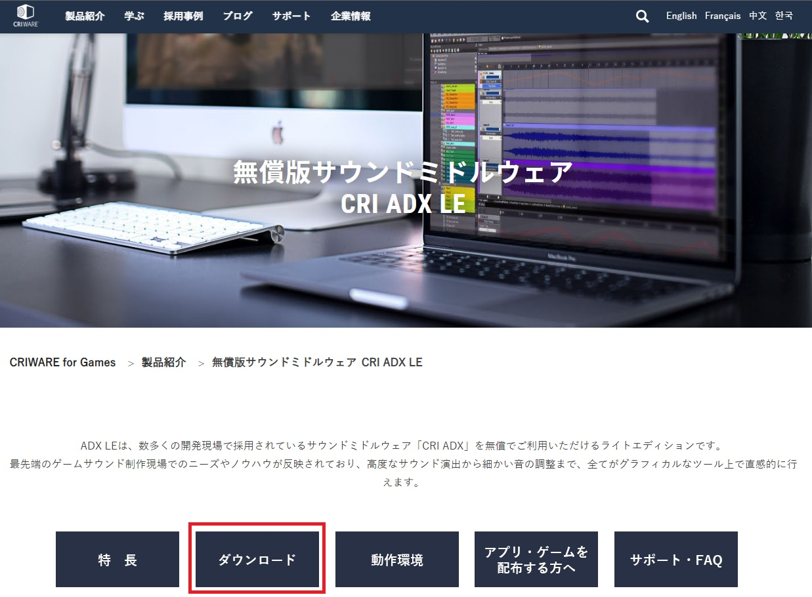
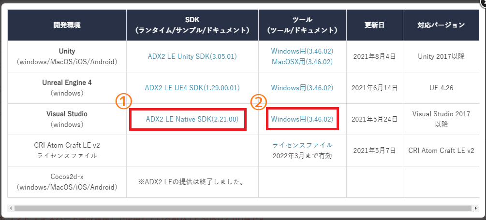

[OpenGL 3D 2021後期 第05回]

# ゲームと音声

* ライブラリを手動でアプリケーションに組み込む方法。
* CRI Atomランタイムライブラリの基本的な使い方。
* CRI Atom Craftツールで音声ファイルを作成する方法。

## 1. 音を奏でる

### 1.1 ADX LEのインストール

ゲームは、プレイヤーへのフィードバックの多くの部分を音声に頼っています。まるで本物のような映像を作り出せたとしても、それだけではプレイヤーを没入させるのは難しいものです。

例としてテレビ番組を考えてみましょう。みなさんが番組を見る時、音声はスピーカーからではなく、画面の中の人物が発声しているかのように感じていると思います。これは、人間にとって視覚が支配的な情報源であるからこそ起こる現象です。

しかし一方で、音声を切ってしまうと、番組の内容がほとんど分からなくなってしまいます(環境映像のようなものは除いて)。このことは、聴覚が人間の情報伝達において、いかに重要であるかを示しています。

簡単な効果音の再生はさまざまなライブラリで実装可能です。しかしBGM、特にMP3やOGGなどは、いくつかのライブラリを組み合わせて実装しなければなりません。

また、ゲームで求められる低遅延な音の再生になると、ライブラリではなく環境固有のAPIを使う必要が出てきます。

これらをひとつひとつ解決していくこともできますが、時間がかかるわりに得られるものは多くありません(音声ミドルウェアの開発者を目指すのでなければ、の話ですが)。

そこで、今回はミドルウェアを使って楽をすることにします。 今回は日本語での情報が多く、初期導入にあたってアカウント登録などの手間がかからないという点から「ADX LE」(エーディーエックス・エルイー)を使うことにしました。

ウェブブラウザで

`https://game.criware.jp/products/adx-le/`

を開いてください。すると以下のようなページが表示されます。

<p align="center">

</p>

並んでいるボタンのうち「ダウンロード」をクリックすると、ダウンロード方法が書かれた位置に移動します。

<p align="center">

</p>

まずは①の「CRI ADX LEに関するユーザー使用許諾書」のリンクをクリックし、ライセンスについてざっと目を通しておいてください。目を通したら、ダウンロードページに戻ってください。

ダウンロードページには、ADX LEを使うにあたっての注意事項が書かれています。②の時刻についての注意を読みPCの時刻設定を確認してください。それと、GitHubを利用している人は、③のGitHubに関する注意も読んでおいてください。

使用許諾書に目を通し、注意事項の確認も済んだら、④の「契約内容に同意してダウンロード」ボタンを押してください。すると、次のようなファイル選択ウィンドウが開きます。

<p align="center">

</p>

ここではVisual Studioの列にある`ADX LE Native SDK`と`Windows用`の2つのリンクをクリックし、それぞれZIPファイルをダウンロードしてください。

なお、ページの下部にはサポート・FAQへのリンクがあります。このページをブックマークしておくとよいでしょう。

>**【ADX LEの制限】**<br>
>ADX LEは、商業用であるADXにいくつかの制限を付けることで、インディーズ向けに無償で提供しているライブラリです。そのため、ADXでは可能でもADX LEにはできないことがいくつか存在します。特に重要な点は「最新のSDKには64bit版しか存在しない」ことです。このため、Visual Studioの「プラットフォーム」タブが`x86`になっていると、ビルドに失敗します。ADX LEを使う場合はこの点に注意してください。

### 1.2 環境変数を追加する

ADX LEでは以下の2つのツールを使用します。

>* CRI Atom(シーアールアイ・アトム)ツール
>* CRI Atom(シーアールアイ・アトム)ランタイムライブラリ

「CRI Atomツール」(以降は「Atom(アトム)ツール」と呼びます)は、Atomライブラリで再生するための音声ファイルを作成するツールです。

「CRI Atomランタイムライブラリ(以降は「Atom(アトム)ライブラリ」と呼びます)」は、アプリケーションに組み込んで音声を再生するためのプログラムです。

Atomライブラリには`mp3`や`wav`を直接再生する機能がないので、すべての音声はAtomツールによってAtomライブラリ用に変換しておく必要があります。

ADX LEのように、プロジェクトとは別にインストールするライブラリをプロジェクトで利用するには、プロジェクトのプロパティに「インクルードディレクトリ」と「ライブラリディレクトリ」を設定する必要があります。

これらは、プロジェクトの場所が移動してもいいように、ドライブレター(`C:`や`F:`など)から始まる「絶対パス」で指定します。さらに、複数のPCで開発を行う場合はOSの「環境変数」という機能を利用します。

環境変数はPCにインストールされたすべてのアプリケーションから利用可能な変数で、OSが管理しています。環境変数は、プロジェクトのパス指定に使用したり、C/C++プログラムから取得することができます。

今回は、ADX LEをインストールしたフォルダ名を環境変数に設定し、プロジェクトではその環境変数を使ってADX LEのインクルードディレクトリとライブラリの設定を行います。これによって、PCごとに固有の環境変数を設定しておけば、プロジェクトの設定を変更することなくビルドが可能になります。

環境変数は「システムのプロパティ」ウィンドウから設定します。`Win+R`キーを押して「ファイル名を指定して実行」ウィンドウを開いてください。そして、ウィンドウ内のテキストボックスに次のファイル名を入力し、`Enter`キーを押してください。

>`sysdm.cpl`

すると「システムのプロパティ」ウィンドウが開きます。環境変数の設定は「詳細設定」タブの中にあります。詳細設定タブをクリックしてください。

<p align="center">

</p>

詳細設定タブが表示されたら、ウィンドウの下部にある「環境変数」ボタンをクリックします。

<p align="center">

</p>

すると「環境変数」ウィンドウが開きます。このウィンドウでは、環境変数の追加・変更・削除が行えます。環境変数には、ユーザーごとに設定する「ユーザー環境変数」と、PC全体で使用できる「システム環境変数」があります。

ユーザーを切り替えても使えるように、ADX LEのフォルダ名はシステム環境変数として作成します。システム環境変数の下にある「新規」ボタンをクリックしてください。

<p align="center">

</p>

「新しいシステム変数」ウィンドウが表示されますので、「変数名」欄に以下の名前を入力してください(①)。

>`ADX_LE_PATH`

次に「ディレクトリの参照」ボタンをクリックして、ADX LEのZIPファイルを展開したときに作られた`cri`フォルダを選択してください(②)。

<p align="center">

</p>

これで新しい環境変数が追加されました。「環境変数ウィンドウ」に、追加した環境変数の名前を値が意図した名前とフォルダ名で設定されていることを確認してください。

<p align="center">

</p>

意図したとおりに追加されていることを確認したら、環境変数ウィンドウの「OK」ボタンを押して、システムのプロパティに戻り、ここでも「OK」ボタンを押してウィンドウを閉じます。これで環境変数の設定は完了です。

<pre class="tnmai_assignment">
<strong>【課題01】</strong>
Windowsの場合、新しい環境変数を有効化するにはOSの再起動が必要です。PCを再起動してください。
</pre>

### 1.3 インクルードディレクトリを設定する

環境変数を使ってインクルードディレクトリを設定しましょう。ソリューションエクスプローラーからプロジェクトのプロパティを開いてください。

<p align="center">

</p>

そして、環境を「すべての構成」(①)に、プラットフォームを「x64」に設定します(②)。次に、「C/C++→全般→追加のインクルードディレクトリ」(③、④、⑤)を選択します。

右端の下向き矢印をクリックして(⑥)、プルダウンメニューから「編集」を選択します(⑦)。すると「追加のインクルードディレクトリ」ウィンドウが開きます。

<p align="center">

</p>

すでに`GLAD`と`imgui`が設定されていると思います。`imgui`のインクルードディレクトリの下の空欄をクリックし、以下のパスを入力してください(①)。

`$(ADX_LE_PATH)\pc\include`

追加したらOKボタンを押してダイアログボックスを閉じ、プロパティウィンドウの「適用」ボタンを押して変更を有効にします(②)。このように、Visual Studioのプロパティで環境変数を使うには、環境変数を`$(`と`)`で囲います。

これでAtomライブラリのインクルードディレクトリが設定できました。

### 1.4 ライブラリディレクトリを設定する

次にライブラリディレクトリを設定します。「リンカー→全般→追加のライブラリディレクトリ」(①、②、③)を選択してください。インクルードパスと同様に、右端の下向き矢印をクリックして(④)、プルダウンメニューから「編集」を選択します(⑤)。

<p align="center">

</p>

すると「追加のライブラリディレクトリ」というウィンドウが開きます。

<p align="center">

</p>

空欄をクリックして以下のパスを入力してください(①)。

`$(ADX_LE_PATH)\libs\x64`

追加したらOKボタンを押してダイアログボックスを閉じます(②)。そして、プロパティウィンドウの「適用」ボタンを押して変更を確定してください。

### 1.5 依存ファイルを追加する

次は「依存ファイル」を設定します。「リンカー→入力→追加の依存ファイル」を選択してください(①、②)。次に右端の下向き矢印をクリックして(③)、プルダウンメニューから「編集」を選択します(④)。

<p align="center">

</p>

すると「追加の依存ファイル」というウィンドウが開きます。

<p align="center">

</p>

空欄をクリックして、以下のファイル名を入力してください(①)。

`cri_ware_pcx64_le_import.lib`

このファイルには、次の節で説明する「DLLファイル」を使うための関数や設定が含まれます。

入力したらOKボタンを押してダイアログボックスを閉じ(②)、プロパティウィンドウのOKボタンを押してウィンドウを閉じてください(OKを押すと変更が自動的に適用されます)。

### 1.6 DLLファイルのコピー

あと一息です。ADX LEでは「DLL(ダイナミック・リンク・ライブラリ)」という形式のファイルを、実行ファイルから見えるところに置いておく必要があります。最も簡単なのは、実行ファイルと同じフォルダにコピーすることです。

目的のDLLファイルは以下のフォルダに存在します。エクスプローラーで以下のフォルダを開いてください。

`ADX LEのインストール先フォルダ/cri/pc/libs/x64/`

x64フォルダには以下のファイルがあると思います。

`cri_ware_pcx64_le.dll` - - - - - - - - 実行ファイルと同じフォルダにコピー。<br>
`cri_ware_pcx64_le_import.lib` - - - 依存ファイルとして追加。

名前の短いほうががDLLファイルです。このDLLファイルを、プロジェクトの`x64\Debug`フォルダと`x64\Release`フォルダにコピーしてください。これでADX LEを使用する準備が整いました。

>DLLファイルのコピーを忘れると実行時エラーになります。

<pre class="tnmai_assignment">
<strong>【課題02】</strong>
Atomライブラリのマニュアルは
<code>https://game.criware.jp/manual/native/adx2/latest/index.html</code>
このURLを開き、以下の2つの項目にひととおり目を通しなさい。2章からは、これらをある程度読んでいることを前提として解説していきます。
- ADX2の紹介
- 導入の手引き→基本事項
- モジュールの詳細

CRI Atomツールのマニュアルは
<code>https://game.criware.jp/manual/adx2_tool/latest/index.html</code>
です。こちらの「CRI ADX Toolsを初めて使う方へ」も読んでおいてください。
</pre>

>**【まとめ】**<br>
>
>* 音声の再生には専用のライブラリを使うと簡単。
>* ADX LEは無料で使えて、日本製なので日本語情報が豊富。
>* Visual Studioでライブラリを使用可能にするには「インクルードディレクトリ」、「ライブラリディレクトリ」、「依存ファイル」を設定する必要がある。

<div style="page-break-after: always"></div>

## 2. Audioクラス

### 2.1 Audioクラスを定義する

オーディオに関する機能は全てAtomライブラリが定義してくれているので、わたしたちはそれを使うだけで音がなります。といっても、直接使うには手続きが面倒な部分もありますから、必要な機能をクラスとしてまとめておくと便利です。

オーディオクラスはプログラム全体でひとつだけあれば十分ですから、「シングルトン」として作成することにします。クラス名は`Audio`(オーディオ)としましょう。

プロジェクトの`Src`フォルダに`Audio.h`を追加してください。そして追加した`Audio.h`を開き、次のプログラムを追加してください。

```diff
+/**
+* @file Audio.h
+*/
+#ifndef AUDIO_H_INCLUDED
+#define AUDIO_H_INCLUDED
+#define NOMINMAX
+#undef APIENTRY
+#include <cri_adx2le.h>
+#include <vector>
+
+/**
+* 音声制御クラス
+*/
+class Audio
+{
+public:
+  static Audio& Get();
+
+private:
+  Audio() = default;
+  ~Audio() = default;
+  Audio(const Audio&) = delete;
+  Audio& operator=(const Audio&) = delete;
+};
+
+#endif // AUDIO_H_INCLUDED
```

Atomライブラリを使うには`cri_adx2le.h`というヘッダファイルをインクルードします。

`NOMINMAX`(ノー・ミン・マックス)マクロを定義しておくと、Windows用のヘッダをインクルードしたときに発生する`std::min`、`std::max`に関する不可解なエラーを消すことができます。

`#undef`(シャープ・アンデフ)は、引数で指定したマクロを未定義にします。`APIENTRY`マクロはWindows用ヘッダと`GLAD`のヘッダの両方で定義されているのですが、Windows用ヘッダの定義が若干不適切なため、インクルード前に`APIENTRY`が定義されているとエラーが発生します。

そこで、Windows用ヘッダをインクルードする前に`APIENTRY`マクロを未定義に戻すことで、このエラーを回避しています。

### 2.2 Atomライブラリを制御するメンバ関数を宣言する

通常のクラスでは、コンストラクタで初期化を行い、デストラクタで破棄します。シングルトンパターンでは、コンストラクタやデストラクタが`private`になっているため呼び出せません。

そこで、かわりに初期化用と破棄用のメンバ関数を用意する必要があるのでした。これらをスタティックメンバ関数とすることで、クラスの変数を作成しなくても呼び出すことができます。初期化は`Initialize`(イニシャライズ)、破棄は`Finalize`(ファイナライズ)という名前にしましょう。

Atomライブラリを初期化して音声を再生可能な状態にするには、音声の基本設定が書き込まれたACFファイルのパスと、DSPバス設定の名前が最低限必要となります。破棄については特にパラメータは不要です。これらを踏まえて、`Audio`クラスの定義に次のプログラムを追加してください。

```diff
 class Audio
 {
 public:
+  static bool Initialize(const char* acfPath, const char* dspBusName);
+  static void Finalize();
   static Audio& Get();

 private:
```

Atomライブラリで音声を再生するには、音声を含むACBファイルとAWBファイルが必要です。これらは再生前に Atomライブラリに読み込んでおかなくてはなりません。これを行うメンバ関数名を`Load`(ロード)とします。

音声ファイルは複数作ることができ、シーンの変更などによって切り替えることが可能です。これを実現するためには、不要になった音声ファイルを破棄するメンバ関数が必要でしょう。このメンバ関数名は`Unload`(アンロード)とします。

また、複数の音声ファイルを読み込めるように、音声データをインデックスで管理することにします。例えば効果音は0番に読み込み、BGMは1番に読み込むといった使い方を想定しています。

そのために`Load`と`Unload`には、対象となるインデックスを引数で渡す必要があるでしょう。ということで、`Audio`クラスの定義に次のプログラムを追加してください。

```diff
   static void Finalize();
   static Audio& Get();
+
+  // ACB, AWBファイル管理
+  bool Load(size_t index, const char* acbPath, const char* acwPath);
+  void Unload(size_t index);

 private:
   Audio() = default;
   ~Audio() = default;
```

Atomライブラリでは`criAtomEx_ExecuteMain`関数を定期的に呼び出す必要があります。これを行うためのメンバ関数も必要です。名前は`Update`(アップデート)とします。Atomライブラリは自前で経過時間を管理しているため、引数で経過時間を渡す必要はありません。

それでは、`Audio`クラスの定義に次のプログラムを追加してください。

```diff
   bool Load(size_t index, const char* acbPath, const char* acwPath);
   void Unload(size_t index);
+
+  // オーディオ状態の更新
+  void Update();

 private:
   Audio() = default;
   ~Audio() = default;
```

### 2.3 音声を制御するメンバ関数を宣言する

システム管理以外に、音声の再生や停止を行うメンバ関数も必要です。再生は`Play`(プレイ)、停止は`Stop`(ストップ)という名前にします。

Atomライブラリには、再生する音声を指定する方法がいくつか用意されています。しかし、キューIDを使うのが基本となりますので、`Play`メンバ関数もキューIDだけ対応すれば当面は十分です。

`Audio`クラスの定義に次のプログラムを追加してください。

```diff
   // オーディオ状態の更新
   void Update();
+
+  // 再生制御
+  void Play(size_t playerId, int cueId);
+  void Stop(size_t playerId);

 private:
   Audio() = default;
   ~Audio() = default;
```

これで、最低限必要そうなメンバ関数は宣言できたと思います。

### 2.4 Atomライブラリ及び音声を制御するメンバ変数を定義する

次にメンバ変数を定義します。Atomライブラリのマニュアルにある「ADX クイックスタート」を読むと、記録しておく必要があるのは以下の3つです。

| 必要なメンバ変数の型 | 必要な個数 |
|:---------------------|:----------:|
| ボイスプールハンドル | 1          |
| ACBハンドル          | 1以上      |
| プレイヤーハンドル   | 1以上      |

「ボイスプールハンドル」はひとつ作れば十分ですが、「ACBハンドル」と「プレイヤーハンドル」は複数作成します。特にプレイヤーは、発音後も制御が必要なBGMとそれ以外の2つを作成しておくことで、音声の制御がやりやすくなります。

複数作成するハンドルについては`std::vector`を使って定義することにします。

さらに「ADX クイックスタート」では説明されていませんが、`D-BAS`(ディーバス)のIDも記録しておく必要があります。`D-BAS`(Dynamic Buffer Allocation System)はストリーミング再生用のメモリ管理を行うオブジェクトです。

それでは、`Audio`クラスの定義に次のプログラムを追加してください。

```diff
   Audio(const Audio&) = delete;
   Audio& operator=(const Audio&) = delete;
+
+  CriAtomExVoicePoolHn voicePool = nullptr;
+  CriAtomDbasId dbasId = CRIATOMDBAS_ILLEGAL_ID;
+  std::vector<CriAtomExAcbHn> acbList;
+  std::vector<CriAtomExPlayerHn> players;
 };

 #endif // AUDIO_H_INCLUDED
```

>`CRIATOMDBAS_ILLEGAL_ID`(シーアールアイ・アトム・ディーバス・イリーガル・アイディ)は、無効なDバスIDを表すマクロ定数です。

ところで、Atomライブラリで音声の再生を行う関数は以下の書式になっています。

<pre class="tnmai_code"><strong>【書式】</strong>
void criAtomExPlayer_SetCueId(プレイヤーハンドル, ACBハンドル, キューID);
</pre>

プレイヤーハンドルとキューIDが必要なのは当然ですが、それだけでなくキューを含む「ACBのハンドル」も必要となっています。しかし、音声を再生するときにいちいちACBまで指定するのは面倒ですし、キューを別のACBに移動させるたびにプログラムを修正しなくてはなりません。

そこで、`Audio`クラスの`Play`メンバ関数にはACBハンドルを指定するための引数を入れていません。`Play`メンバ関数はキューIDから自動的にACBハンドルを選択するようにする予定だからです。幸いAtomライブラリには、キューIDがACBに含まれているかどうかを調べる`criAtomExAcb_ExistsId`関数があります。

キューIDが重複していない限り、この関数をすべてのACBに対して使用すれば、必要なACBハンドルが分かります。ただ、この方法では検索時間が必要になるという問題があります。

そこで、キューIDとACBハンドルの対応表を作ることにします。この対応表はACBハンドルの配列になっていて、キューIDを添え字にすると対応するACBハンドルが得られるという仕組みです。

「キューIDからACBハンドルを取得する」データなので、名前は`cueIdToAcbMap`(キューアイディー・トゥ・エーシービー・マップ)とします。それでは、`Audio`クラスの定義に次のプログラムを追加してください。

```diff
   CriAtomDbasId dbasId = CRIATOMDBAS_ILLEGAL_ID;
   std::vector<CriAtomExAcbHn> acbList;
   std::vector<CriAtomExPlayerHn> players;
+  std::vector<CriAtomExAcbHn> cueIdToAcbMap;
 };

 #endif // AUDIO_H_INCLUDED
```

<pre class="tnmai_assignment">
<strong>【課題03】</strong>
CRI LEマニュアルサイト(<code>https://game.criware.jp/manual/native/adx2/latest/index.html</code>)
を開き、左側のツリーから「API Reference→モジュール」を選択してモジュール一覧を表示しなさい。
そして、上記のプログラムで使用している4つのAtomライブラリの型について、それらを説明しているページを探して説明を読みなさい。<code>Ctrl+F</code>キーによる検索機能を使うと見つけやすいでしょう。
</pre>

>**【Atomライブラリの型の読み方】**<br>
>筆者は次のように読んでいます。正確なところは不明なので、適当な読み方で構いません。
>| 型名 | 読み方 |
>|:-----|:-------|
>| CriAtomExVolicePoolHn | シーアールアイ・アトム・エクス・ボイス・プール・ハンドル |
>| CriAtomDbasId | シーアールアイ・アトム・ディーバス・アイディー |
>| CriAtomExAcbHn | シーアールアイ・アトム・エクス・エーシービー・ハンドル |
>| CriAtomExPlayerHn | シーアールアイ・アトム・エクス・プレイヤー・ハンドル |
>
>なお、この例で分かるように`Hn`は(おそらく)`handle`(ハンドル)の短縮形です。`Ex`は`extended`(エクステンデッド)か`extension`(エクステンション)の短縮形だと思うのですが、正解は不明です。

### 2.5 ライブラリが要求する補助関数を定義する

`Audio`クラスの定義が完了したので、クラスのメンバ関数を定義していきましょう。

プロジェクトの`Src`フォルダに`Audio.cpp`というCPPファイルを追加してください。まずは必要なヘッダファイルをインクルードします。追加した`Audio.cpp`を開き、次のプログラムを追加してください。

```diff
+/**
+* @file Audio.cpp
+*/
+#include "Audio.h"
+#include <algorithm>
+#include <iostream>
+
+namespace {
+
+Audio* audio = nullptr;
+
+} // namespace
```

`Audio.h`の他に、C++標準ライブラリの関数を使うために`algorithm`(アルゴリズム)をインクルードし、エラー出力用に`iostream`をインクルードしています。

次に、関数を実装する前にADX LEを使うために必要な関数を定義します。作成するのは以下の3つです。

>* エラーコールバック関数
>* メモリ確保関数(アロケータ)
>* メモリ破棄関数(デアロケータ)

これらはADX LEマニュアルサイトの「CRI Atomライブラリについて→基本事項」にサンプルプログラムが掲載されていますので、本テキストだけでなくマニュアルサイトも参考にしてください。

基本的にはサイトの内容にしたがって作っていきますが、`C++`ということで、エラーメッセージの出力先は`std::cerr`に変更し、メモリの確保と開放には`malloc`、`free`ではなく`operator new`と`operator delete`を使うことにします。

それでは、`audio`グローバル変数の定義の下に、次のプログラムを追加してください。

```diff
 namespace {

 Audio* audio = nullptr;
+
+/**
+* オーディオ用エラーコールバック
+*
+* @param errid  エラーの種類を示すID
+* @param p1     erridの補足情報その1
+* @param p2     erridの補足情報その2
+* @param parray (未使用)
+*/
+void AudioErrorCallback(const CriChar8* errid, CriUint32 p1, CriUint32 p2,
+  CriUint32* parray)
+{
+  const CriChar8* err = criErr_ConvertIdToMessage(errid, p1, p2);
+  std::cerr << err << std::endl;
+}
+
+/**
+* オーディオ用のメモリ確保関数
+*
+* @param obj  登録時に指定したユーザー引数
+* @param size 確保するバイト数
+*
+* @return 確保したメモリのアドレス
+*/
+void* AudioAllocate(void* obj, CriUint32 size)
+{
+  return operator new(size);
+}
+
+/**
+* オーディオ用のメモリ解放関数
+*
+* @param obj 登録時に指定したユーザー引数
+* @param ptr 開放するメモリのアドレス
+*/
+void AudioDeallocate(void* obj, void* ptr)
+{
+  operator delete(obj);
+}

 } // namespace
```

`AudioErrorCallback`(オーディオ・エラー・コールバック)関数は、Atomライブラリからのエラー情報を受け取るためのコールバック関数です。

Atomライブラリにはエラー情報を文字列に変換してくれる`criErr_ConverteIdToMessage`関数が備わっているので、これを使ってエラー文字列を取得して標準エラー出力に出力しています。

`AudioAllocate`(オーディオ・アロケート)と`AudioDeallocate`(オーディオ・デアロケート)はメモリの確保と解放を行うための関数です。Atomライブラリはユーザーが直接メモリを管理できるように確保関数と解放関数を指定する仕組みになっています。

関数名にある`Allocate`(アロケート)は「割り当てる」という意味で、`Deallocate`(デアロケート)は「割り当て解除、取り除く」という意味です。これらの名前はメモリ管理関数などでよく使われます。

メモリ管理関数では`operator new`(オペレータ・ニュー)関数と`operator delete`(オペレータ・デリート)関数を使ってメモリを確保・解放しています。

これらは`new`演算子や`delete`演算子が内部で呼び出す関数で、`malloc`、`free`と同様にメモリの割り当てと解放だけを行います。コンストラクタやデストラクタは呼び出されません。

ADX LEのようにメモリ管理関数を要求するライブラリは少なくないので、`operator new`関数や`operator delete`関数を使うと処理をC++言語に丸投げできる、ということを覚えておくと役に立つかもしれません。

### 2.6 Atomライブラリを初期化する

次に`Initialize`(イニシャライズ)メンバ関数を定義します。`Initialize`関数ではAtomライブラリを初期化し、音声を再生する準備をします。「ADXクイックスタート \[ゲームへの組み込み\]編」に書かれているとおり以下の順番で処理していきます。

>1. エラーコールバック関数の登録
>2. メモリアロケータの登録
>3. ライブラリの初期化
>4. ストリーミング用バッファの作成
>5. 全体設定ファイル(ACF)の登録
>6. DSPバス設定の登録
>7. ボイスプールの作成

ご覧のとおり、Atomライブラリの初期化では、やることがたくさんあります。そこで、雛形から徐々に作っていくことにしましょう。無名名前空間の終了を示す閉じ波括弧の下に、次のプログラムを追加してください。

```diff
   operator delete(obj);
 }

 } // namespace
+
+/**
+* 音声制御システムを初期化する
+*
+* @param acfPaht    全体設定を保持するACFファイルのパス
+* @param dspBusName 音声システムで使用するDSPバス名
+*
+* @retval true  初期化成功
+* @retval false 初期化失敗
+*/
+bool Audio::Initialize(const char* acfPath, const char* dspBusName)
+{
+  if (!audio) {
+    audio = new Audio;
+  }
+  return true;
+}
```

#### 1. エラーコールバック関数の登録

それでは「エラーコールバック関数の登録」から作成していきましょう。エラーコールバック関数を登録するには`criErr_SetCallback`(シーアールアイ・エラー・セット・コールバック)関数を使います。<br>
`Initialize`メンバ関数に次のプログラムを追加してください。

```diff
   if (!audio) {
     audio = new Audio;
+
+    // エラーコールバック関数を登録する
+    criErr_SetCallback(AudioErrorCallback);
   }
   return true;
 }
```

#### 2. メモリアロケータの登録

メモリアロケータを登録するには`criAtomEx_SetUserAllocator`(シーアールアイ・アトム・エクス・セット・ユーザー・アロケータ)関数を使います。エラーコールバック関数を登録するプログラムの下に、次のプログラムを追加してください。

```diff
     // エラーコールバック関数を登録する
     criErr_SetCallback(AudioErrorCallback);
+
+    // メモリ管理関数を登録する
+    criAtomEx_SetUserAllocator(AudioAllocate, AudioDeallocate, nullptr);
   }
   return true;
 }
```

#### 3. ライブラリの初期化

ライブラリの初期化には`criAtomEx_Initialize_WASAPI`(シーアールアイ・アトム・エクス・イニシャライズ・ワサピ)関数を使います。

`WASAPI`は`Windows Audio Session API`(ウィンドウズ・オーディオ・セッション・エーピーアイ)の略称で、Windows Vista以降に搭載されている音声制御用のインターフェイスです。

`WASAPI`はPC版のAtomライブラリが内部で使用していますが、Atomライブラリを使ううえで`WASAPI`の知識はほとんど必要ありません。そのため`WASAPI`について詳しい説明はしませんが、興味があればインターネット検索で調べてみるとよいでしょう。

さて、`criAtomEx_Initialize_WASAPI`関数は3つの引数を受け取ります。最初の引数にはAtomライブラリの設定を行う初期化用構造体を指定できます。残りの2個は手動メモリ管理用で、メモリアロケータを登録している場合は使用しません。

「ADXクイックスタート」では初期化用構造体を使っていませんが、実際のアプリケーションで使う場合はいくつか設定をしておくべき項目があります。そこで、まずは初期化用構造体を作成しましょう。

しかしその前に、ADXマニュアルの「CRI Atomライブラリについて ライブラリの初期化パラメータ解説」を再度確認してください。そこには初期化用構造体を指定しなかった場合のライブラリの初期設定が書かれています。

>* フレームワークをマルチスレッドモデルに設定
>* サーバ処理の実行頻度を60Hzに設定
>* 最大バーチャルボイス数を16に設定
>* CRI File Systemライブラリをデフォルト設定で初期化

このうち、「最大バーチャルボイス数」と「CRI File Systemライブラリ」の設定を変更します。

「最大バーチャルボイス数」は、Atomライブラリが同時に再生管理できる音声の数です。すでにこの数の音声が再生されている状態で、さらに音声を再生しようとすると再生に失敗します。

例えば手榴弾の爆風が10体のゾンビに命中し、すべて死亡したとします。それぞれのゾンビがダメージ音と死亡音声の2つを鳴らすとすると、それだけで20個になってデフォルトの16個では足りません。このような場合に備えて最大数を増やしておきます。

「CRI File Systemライブラリ」は音声ファイルの読み込みを制御するために、Atomライブラリが内部で使用しています。これも様々な設定項目がありますが、そのうち「ローダー数」を変更しておきます。

「ローダー」はファイルを読み込むためのオブジェクトで、再生する音声ごとにひとつ必要です。さらにAtomライブラリが内部で使用するぶんもありますので、同時発音数より大きな値を設定しなくてはなりません。

ローダー数が足りないと、後で説明する「ボイスプール」の作成に失敗してしまいます。

さらに、初期化パラメータ解説には書かれていませんが、3D音源を使う場合に備えてAtomライブラリの座標系も指定しておきます。Atomライブラリの初期値は左手座標系なので、OpenGLに合わせて右手座標系にします。

初期化用構造体は`CriAtomExConfig_WASAPI`(シーアールアイ・アトム・エクス・コンフィグ・ワサピ)とです。メモリアロケータを登録するプログラムの下に、次のプログラムを追加してください。

```diff
     // メモリ管理関数を登録する
     criAtomEx_SetUserAllocator(AudioAllocate, AudioDeallocate, nullptr);

+    // 初期化パラメータを設定する
+    CriAtomExConfig_WASAPI libConfig;
+    criAtomEx_SetDefaultConfig_WASAPI(&libConfig);
+
+    // ローダー数を設定する
+    CriFsConfig fsConfig;
+    criFs_SetDefaultConfig(&fsConfig);
+    fsConfig.num_loaders = 40; // num_voicesより大きい値を設定すること
+    libConfig.atom_ex.fs_config = &fsConfig;
+
+    // 再生制御可能な音声の最大数. 実際の発音数はボイスプールのnum_voicesで指定する
+    libConfig.atom_ex.max_virtual_voices = 64;
+
+    // OpenGL用に右手座標系を指定
+    libConfig.atom_ex.coordinate_system = CRIATOMEX_COORDINATE_SYSTEM_RIGHT_HANDED;
   } 
   return true;
 }
```

ボイス数は32個にする予定なので、ローダー数はそれより多い40個にしました。なぜ8個増やしたのかというと、ボイス数とローダー数の初期値が8と16だからです(この数値からは2倍にすることも考えられますが、それはさすがに多すぎます)。

バーチャルボイス数の初期値は16個ですが、先に説明したようにこれでは少なすぎます。2倍の32個もあれば大抵の場合は問題なさそうですが、アクションゲームということでさらに余裕を見て4倍の64個としました。

バーチャルボイス数はメモリとCPU時間の必要量に影響します。ロールプレイングゲームやアドベンチャーゲームのように、音の発生源となるキャラクターが大量に表示されることがないゲームでは初期値のままのほうがよいでしょう。

それでは作成した初期化用構造体を使ってAtomライブラリを初期化しましょう。初期化用構造体を作成するプログラムの下に、次のプログラムを追加してください。

```diff
     // OpenGL用に右手座標系を指定
     libConfig.atom_ex.coordinate_system = CRIATOMEX_COORDINATE_SYSTEM_RIGHT_HANDED;
+
+    // Atomライブラリを初期化
+    criAtomEx_Initialize_WASAPI(&libConfig, nullptr, 0);
   }
   return true;
 }
```

>**【バーチャルボイス数≠実際の発音数】**<br>
>バーチャルボイス数は再生管理可能な音声の数であって、実際に発音できる音声の数ではないことに注意してください。実際の発音数はボイスプールで指定します。

#### 4. ストリーミング用バッファの作成

ストリーミング用バッファの作成には`criAtomDbus_Create`(シーアールアイ・アトム・ディーバス・クリエイト)関数を使います。

Atomライブラリのストリーミング用バッファは、`D-BAS`(ディーバス)というCRIが開発したプログラムを使っています。そのため、ストリーミング用バッファを制御する関数には`Dbas`という文字が付きます。

また、`D-BAS`にも専用の初期化用構造体があって、さまざまな設定を調整することができるようになっています。しかし、通常はデフォルト設定のままで問題はないでしょう。

それでは、Atomライブラリを初期化するプログラムの下に、次のプログラムを追加してください。

```diff
     // Atomライブラリを初期化
     criAtomEx_Initialize_WASAPI(&libConfig, nullptr, 0);
+
+    // ストリーミング用バッファを作成
+    audio->dbasId = criAtomDbas_Create(nullptr, nullptr, 0);
   }
   return true;
 }
```

#### 5. 全体設定ファイル(ACF)の登録

次に、音声の全体的な設定を記録したACF(エーシーエフ)ファイルを、Atomライブラリに登録します。ACFファイルの登録には`criAtomEx_RegisterAcfFile`(シーアールアイ・アトム・エクス・レジスター・エーシーエフ・ファイル)関数を使います。

<pre class="tnmai_code"><strong>【書式】</strong>
CriBool criAtomEx_RegisterAcfFile(バインダハンドル, ACFファイルのパス, 作業用メモリのアドレス, 作業用メモリのサイズ);
</pre>

この関数には4つの引数がありますが、指定する必要があるのは「ACFファイルのパス」だけです。バインダハンドルは`ADX`専用で、`ADX LE`では使えないので`nullptr`を指定します。

そして、メモリ管理関数を登録している場合は作業用メモリを指定する必要はありませんから、作業用メモリのアドレスには`nullptr`、作業用メモリのサイズには`0`そ指定します。

ストリーミング用バッファを作成するプログラムの下に、次のプログラムを追加してください。

```diff
     // ストリーミング用バッファを作成
     audio->dbasId = criAtomDbas_Create(nullptr, nullptr, 0);
+
+    // ACFファイルを読み込む
+    if (criAtomEx_RegisterAcfFile(nullptr, acfPath, nullptr, 0) == CRI_FALSE) {
+      std::cerr << "[エラー]" << __func__ << ":" << acfPath << "の読み込みに失敗\n";
+      Finalize();
+      return false;
+    }
   }
   return true;
 }
```

#### 6. DSPバス設定の登録

「DSP(ディーエスピー)バス」は再生中の複数の音声を合成(ミックス)して、実際に出力される音を作り上げるオブジェクトです。また、音声にエコーやリバーブといったエフェクトをかけるのもこのDSPバスで行います。

Atomライブラリでは最低1つのDSPバスが必要です。エフェクトをかけたり外したりする場合はエフェクト用のDSPバスを追加します。

```diff
       std::cerr << "[エラー]" << __func__ << ":ACFファイルの読み込みに失敗\n";
       return false;
     }
+
+    // DSPバスを割り当てる
+    criAtomEx_AttachDspBusSetting(dspBusName, nullptr, 0);
   }
   return true;
 }
```

>**【D-BASとDSPバスは無関係】**<br>
>D-BASとDSPバスはたまたま名前が似ているだけで、両者にはなんの関係もありません。

#### 7. ボイスプールの作成

Atomライブラリの初期化の最後は「ボイスプールの作成」です、ADXマニュアルの「ADXのキーアイテム ボイス ボイスについて」では、次のようにボイスを説明しています。

>ボイスはサウンド再生を行う最も基本的なオブジェクトです。

そして、「ボイスプール」は複数のボイスを管理するオブジェクトです。最大同時発音数はボイスプールの設定によって決まります。また、ボイスプールには「ストリーミング音声の有効・無効」と「最大サンプリングレート」も設定します。

DSPバスを割り当てるプログラムの下に、次のプログラムを追加してください。

```diff
     // DSPバスを割り当てる
     criAtomEx_AttachDspBusSetting(dspBusName, nullptr, 0);
+
+    // ボイスプールを設定する
+    CriAtomExStandardVoicePoolConfig svpConfig;
+    criAtomExVoicePool_SetDefaultConfigForStandardVoicePool(&svpConfig);
+    svpConfig.num_voices = libConfig.atom_ex.max_virtual_voices / 2; // 同時発音数
+    svpConfig.player_config.streaming_flag = CRI_TRUE; // ストリーミング再生を有効化
+    svpConfig.player_config.max_sampling_rate =
+      48000 * 2; // 最大サンプリングレート、ピッチ変更を考慮してCD音質の2倍を設定
+    audio->voicePool = criAtomExVoicePool_AllocateStandardVoicePool(&svpConfig, nullptr, 0);
   }
   return true;
 }
```

`num_voices`(ナム・ボイシズ)には同時に発音できる音声の最大数を指定します。上記のプログラムでは「最大バーチャルボイス数の半分」にしています。

ボイスはバーチャルボイスのうち優先度が高い順に割り当てられ、優先度が高いバーチャルボイスの再生が終わるとボイスが開放されます。このとき、優先度が低いバーチャルボイスがまだ再生していたら、空いたボイスが割り当てられて途中から再生が行われます。

ボイスは実際の発音を伴うため、バーチャルボイス数よりもメモリとCPU時間に与える影響が大きくなります。そのため、ボイス数をバーチャルボイス数より少なくしておくと音声処理の効率を上げやすいです。

もちろん、バーチャルボイス数が十分に少ない場合は、バーチャルボイス数とボイス数を合わせておくとよいでしょう。なお、同時発音数はバーチャルボイス数以上にはならないため、バーチャルボイス数を超えるボイス数を指定する意味はありません。

`streaming_flag`(ストリーミング・フラグ)を`CRI_TRUE`(シーアールアイ・トゥルー)にすると、ストリーミング再生が有効になります。大抵のBGMはストリーミング再生されるので、この設定は重要です。

`max_sampling_rate`(マックス・サンプリング・レート)は再生可能な音声の精度を指定します。通常はCD音質である`48000`を指定しますが、ピッチ(=音の高さ)を上げたい場合は、上げたい倍率に合わせてより高い値を設定します。

すべての設定が完了したら、`criAtomExVoicePool_AllocateStandardVoicePool`(シーアールアイ・アトム・エクス・ボイス・プール・アロケート・スタンダード・ボイス・プール)関数でボイスプールを作成します。

これでAtomライブラリの初期化は完了です。

### 2.7 Audio::Initializeメンバ関数を完成させる

`Initialize`メンバ関数の目的には、Atomライブラリの初期化だけでなく`Audio`クラスの初期化も含まれます。ここからは`Audio`クラスの初期化をしていきます。

まず、音声再生用のプレイヤーオブジェクトを作成します。プレイヤーオブジェクトを作成するには`criAtomExPlayer_Create`(シーアールアイ・アトム・エクス・プレイヤー・クリエイト)関数を使います。

Atomライブラリでは再生、停止、音量の設定などを、プレイヤーオブジェクト単位で行う仕組みになっています。例えば効果音とBGMを別々のプレイヤーで再生すれば、個別に音量の設定や停止を行うことができます。

それでは、ボイスプールを作成するプログラムの下に、次のプログラムを追加してください。

```diff
     svpConfig.player_config.max_sampling_rate =
       48000 * 2; // 最大サンプリングレート、ピッチ変更を考慮してCD音質の2倍を設定
     audio->voicePool = criAtomExVoicePool_AllocateStandardVoicePool(&svpConfig, nullptr, 0);
+
+    // 再生制御用プレイヤーを作成する
+    audio->players.resize(8);
+    for (auto& e : audio->players) {
+      e = criAtomExPlayer_Create(nullptr, nullptr, 0);
+    }
   }
   return true;
 }
```

本テキストでは一般的な音声再生を目標にしているので、プレイヤー数は8としています。もし3Dサウンドを使いたい場合は、音源の位置ごとにプレイヤーを割り当てる必要があるため、プレイヤー数を増やしてください。

続いてACB読み込み配列を作成します。配列を用意するだけなので、`resize`メンバ関数を使って大きさを指定したら終わりです。プレイヤーを作成するプログラムの下に、次のプログラムを追加してください。

```diff
     for (auto& e : audio->players) {
       e = criAtomExPlayer_Create(nullptr, nullptr, 0);
     }
+
+    // acb読み込み配列を確保
+    // ここで指定した数は、同時に読み込み可能なACBファイルの最大数になる
+    // Loadで配列に読み込み、Unloadで破棄する
+    audio->acbList.resize(16);
   }
   return true;
 }
```

次にキューIDとACBファイルの対応表を用意します。これも配列を作るだけなので`resize`メンバ関数を呼べば終わりです。ACB読み込み配列を作成するプログラムの下に、次のプログラムを追加してください。

```diff
     // ここで指定した数は、同時に読み込み可能なACBファイルの最大数になる
     // Loadで配列に読み込み、Unloadで破棄する
     audio->acbList.resize(16);
+
+    // キューIDとacbファイルの対応表を確保
+    // キューIDを添え字に使うことで対応するacbファイルを取得できる
+    // サウンド再生にははキューIDとacbファイルのペアが必要なため
+    // Loadで対応表に追加され、Unloadで削除される
+    audio->cueIdToAcbMap.resize(4096);
+
+    std::cerr << "[情報]" << __func__ << ": オーディオ機能を初期化\n";
   }
   return true;
 }
```

### 2.8 Audio::Finalize関数を定義する

次は、Atomライブラリの終了処理を行う関数を定義します。終了処理は、各オブジェクトを破棄する関数を呼び出すだけです。

>Atomライブラリの破棄を行う関数の名前は統一されておらず、「デストロイ」、「リリース」、「フリー」と様々です。作成関数の名前と合わせるためにこうなっているようです。

`Initialize`メンバ関数の定義の下に、次のプログラムを追加してください。

```diff
     audio->cueIdToAcbMap.resize(4096);
   }
   return true;
 }
+
+/**
+* 音声制御システムを破棄する
+*/
+void Audio::Finalize()
+{
+  // 既に破棄されていたら何もしない
+  if (!audio) {
+    return;
+  }
+
+  // すべてのプレイヤーを破棄
+  for (auto& e : audio->players) {
+    if (e) {
+      criAtomExPlayer_Destroy(e);
+      e = nullptr;
+    }
+  }
+
+  // すべてのACBファイルを破棄
+  for (auto& e : audio->acbList) {
+    if (e) {
+      criAtomExAcb_Release(e);
+      e = nullptr;
+    }
+  }
+
+  // キューIDとACBの対応表を初期化
+  std::fill(audio->cueIdToAcbMap.begin(), audio->cueIdToAcbMap.end(), nullptr);
+
+  // ボイスプールを破棄
+  if (audio->voicePool) {
+    criAtomExVoicePool_Free(audio->voicePool);
+    audio->voicePool = nullptr;
+  }
+
+  // ACFファイルの登録を解除
+  criAtomEx_UnregisterAcf();
+
+  // DBASを破棄
+  if (audio->dbasId != CRIATOMDBAS_ILLEGAL_ID) {
+    criAtomDbas_Destroy(audio->dbasId);
+    audio->dbasId = CRIATOMDBAS_ILLEGAL_ID;
+  }
+
+  // ADXLEを終了
+  criAtomEx_Finalize_WASAPI();
+
+  delete audio;
+  audio = nullptr;
+
+  std::cerr << "[情報]" << __func__ << ": オーディオ機能を破棄\n";
+}
```

### 2.9 Audio::Get関数を定義する

続いて`Get`(ゲット)メンバ関数を定義します。`Finalize`関数の定義の下に、次のプログラムを追加してください。

```diff
   std::cerr << "[情報]" << __func__ << ": オーディオ機能を破棄\n";
 }
+
+/**
+* 音声制御クラスを取得する
+*
+* @return 音声制御クラスのインスタンスの参照
+*/
+Audio& Audio::Get()
+{
+  return *audio;
+}
```

### 2.10 Audio::Load関数を定義する

次に音声ファイルを読み込むメンバ関数を定義します。音声ファイルの読み込みには`criAtomExAcb_LoadAcbFile`(シーアールアイ・アトム・エクス・ロード・エーシービー・ファイル)関数を使います。

Atomツールで作成できる音声ファイルには以下の2種類があります。

>* ACB(エーシービー)ファイル: オンメモリ再生用の波形データが格納されています。
>* AWB(エーダブリュービー)ファイル: ストリーミング再生用の波形データが格納されています。

`criAtomExAcb_LoadAcbFile`関数は、ACBファイルとAWBファイルの両方を読み込むことができます。 `Get`メンバ関数の定義の下に、次のプログラムを追加してください。

```diff
 {
   return *audio;
 }
+
+/**
+* 音声ファイルを読み込む
+*
+* @param index   読み込み先のACB配列の番号
+* @param acbPath ACBファイルのパス名
+* @param awbPath AWBファイルのパス名.
+*
+* @retval true  読み込み成功
+* @retval false 読み込み失敗
+*/
+bool Audio::Load(size_t index, const char* acbPath, const char* awbPath)
+{
+  if (index >= acbList.size()) {
+    std::cerr << "[エラー]" << __func__ << ":" <<
+      acbPath << "のインデックスが大きすぎます\n";
+    return false;
+  }
+
+  // 念のため読み込み先の要素を解放
+  Unload(index);
+
+  // 音声ファイルを読み込む
+  acbList[index] = criAtomExAcb_LoadAcbFile(
+    nullptr, acbPath, nullptr, awbPath, nullptr, 0);
+  if (!acbList[index]) {
+    std::cerr << "[エラー]" << __func__ << ":" << acbPath << "の読み込みに失敗\n";
+    return false;
+  }
+
+  return true;
+}
```

音声ファイルの読み込みに成功したら、キューIDとACBの対応表を作ります。`criAtomExAcb_GetNumCues`(シーアールアイ・アトム・エクス・エーシービー・ゲット・ナム・キューズ)関数で取得したキューの数だけループして対応表に追加していきます。

キュー情報を取得するには`criAtomExAcb_GetCueInfoByInex`(シーアールアイ・アトム・エクス・エーシービー・ゲット・キュー・インフォ・バイ・インデックス)関数を使います。キュー情報に記録されているキューIDを添え字にして対応付けを行います。

音声ファイルを読み込むプログラムの下に、次のプログラムを追加してください。

```diff
     std::cerr << "[エラー]" << __func__ << ":" << acbPath << "の読み込みに失敗\n";
     return false;
   }
+
+  // キューIDとACBの対応表を更新
+  const CriSint32 numCues = criAtomExAcb_GetNumCues(acbList[index]);
+  for (int i = 0; i < numCues; ++i) {
+    // キュー情報を取得
+    CriAtomExCueInfo cueInfo;
+    if (!criAtomExAcb_GetCueInfoByIndex(acbList[index], i, &cueInfo)) {
+      std::cerr << "[警告]" << __func__ << ":" << acbPath << "の" <<
+        i << "番目のキュー情報を取得できません\n";
+      continue;
+    }
+    // 対応表よりキューIDが大きい場合は対応表のサイズを拡張
+    if (cueIdToAcbMap.size() <= static_cast<size_t>(cueInfo.id)) {
+      cueIdToAcbMap.resize(cueInfo.id + 1);
+    }
+    // キューIDとACBを対応付ける
+    cueIdToAcbMap[cueInfo.id] = acbList[index];
+  }

   return true;
 }
```

これでロード関数は完成です。

### 2.11 Audio::Unloadメンバ関数を定義する

`Unload`メンバ関数は、シーンの切り替えなどで不要になった音声ファイルを破棄し、別の音声ファイルを読み込めるようにする関数です。

音声ファイルを破棄するには`criAtomExAcb_Release`(シーアールアイ・アトム・エクス・エーシービー・リリース)関数を使います。

また、破棄されたACBファイルを使って再生が行われてしまうことを防ぐために、 音声ファイルを破棄する前に、キューIDとACBの対応表から、音声ファイルに対応するデータを削除しておく必要があります。

対応表からデータを削除するには、ACBハンドルを`nullptr`にします。これにはC++標準ライブラリの`replace`(リプレイス)関数を使うのが簡単です。

<pre class="tnmai_code"><strong>【書式】</strong>
void replace(置き換える範囲の先頭, 置き換える範囲の終端, 置き換え対象の値, 置き換える値);
</pre>

`replace`関数は、「置き換え範囲」にあるすべての「置き換え対象の値」を「置き換える値」で置き換えます。

それでは、`Load`メンバ関数の定義の下に、、次のプログラムを追加してください。

```diff
     cueIdToAcbMap[cueInfo.id] = acbList[index];
   }

   return true;
 }
+
+/**
+* オーディオファイルを破棄する
+*
+* @param index 破棄するACB配列の番号
+*/
+void Audio::Unload(size_t index)
+{
+  if (index >= acbList.size()) {
+    std::cerr << "[エラー]" << __func__ << ":" <<
+      "インデックスが大きすぎます\n";
+    return;
+  }
+
+  if (acbList[index]) {
+    // 対応表から破棄予定のACBハンドルを削除
+    std::replace(cueIdToAcbMap.begin(), cueIdToAcbMap.end(),
+      acbList[index], static_cast<CriAtomExAcbHn>(nullptr));
+
+    // ACBハンドルを破棄
+    criAtomExAcb_Release(acbList[index]);
+    acbList[index] = nullptr;
+  }
+}
```

### 2.12 Audio::Updateメンバ関数を定義する

Atomライブラリの状態を更新するには`criAtomEx_ExecuteMain`(シーアールアイ・アトム・エクス・エグゼキュート・メイン)関数を呼び出します。`Finalize`メンバ関数の定義の下に、次のコードを追加してください。

```diff
     acbList[index] = nullptr;
   }
 }
+
+/**
+* 音声システムの状態を更新する
+*/
+void Audio::Update()
+{
+  // Atomライブラリの状態を更新
+  criAtomEx_ExecuteMain();
+}
```

### 2.13 Audio::Playメンバ関数を定義する

次に音声を再生する関数を実装します。

Atomライブラリで音声を再生するには`criAtomExPlayer_SetCueId`(シーアールアイ・アトム・エクス・プレイヤー・セット・キュー・アイディ)と`criAtomExPlayer_Start`(シーアールアイ・アトム・エクス・プレイヤー・スタート)の2つの関数を使います。

まず`criAtomExPlayer_SetCue`関数でプレイヤーにキューを割り当てます。キューを割り当てたあとで`criAtomExPlayer_Start`関数を呼ぶと再生が開始されます。

それでは、`Update`関数定義の下に、次のプログラムを追加してください。

```diff
   // Atomライブラリの状態を更新
   criAtomEx_ExecuteMain();
 }
+
+/**
+* 音声を再生する
+*
+* @param playerId 再生に使用するプレイヤー番号
+* @param cueId    再生するキューID
+*/
+void Audio::Play(size_t playerId, int cueId)
+{
+  // プレイヤー番号がプレイヤー数以上の場合は何もしない
+  if (playerId >= players.size()) {
+    return;
+  }
+  // 対応表がnullptrの場合は何もしない
+  if (!cueIdToAcbMap[cueId]) {
+    return;
+  }
+
+  // プレイヤーにキューをセット
+  criAtomExPlayer_SetCueId(players[playerId], cueIdToAcbMap[cueId], cueId);
+
+  // セットしたキューを再生
+  criAtomExPlayer_Start(players[playerId]);
+}
```

本テキストでは扱いませんが、音声の音量やピッチを変更して再生したい場合は`SetCueId`と`Start`の間で変更したいパラメータを設定します。

### 2.14 Audio::Stopメンバ関数を定義する

最後は再生停止関数です。音声を停止するには`criAtomExPlayer_Stop`(シーアールアイ・アトム・エクス・プレイヤー・ストップ)関数を使います。`Play`関数定義の下に、次のコードを追加してください。

```diff
   // セットしたキューを再生
   criAtomExPlayer_Start(players[playerId]);
 }
+
+/**
+* 音声を停止する
+*
+* @param playerId 再生を停止するプレイヤー番号
+*/
+void Audio::Stop(size_t playerId)
+{
+  // プレイヤー番号がプレイヤー数以上の場合は何もしない
+  if (playerId >= players.size()) {
+    return;
+  }
+
+  // 再生を停止する
+  criAtomExPlayer_Stop(players[playerId]);
+}
```

これで`Audio`クラスのすべてのメンバ関数を定義することができました。

>**【まとめ】**<br>
>
>* ADX LEのプログラムに組み込むライブラリは「Atomライブラリ」という名前。
>* Atomライブラリはアプリケーションの目的に合わせてさまざまな設定をすることができる。
>* ACFファイルには全体設定が格納されている。ACBファイルとAWBファイルには音声データが格納されている。
>* Atomライブラリでは、音声は「キュー」というデータ単位で再生する。キューは「プレイヤー」によって再生される。

<div style="page-break-after: always"></div>

## 3. 音声ファイルを用意する

### 3.1 音声素材を手に入れる

ADX LE用の音声ファイルを作成するために音声素材を集めます。必要な素材のリストは以下のとおりです。

| 種別 | 用途 | 検索単語の例 |
|:----:|:-----|:--|
| BGM  | ゲームのBGM                  | |
| BGM  | ゲームクリア時のBGM          | |
| BGM  | ゲームオーバー時のBGM        | |
| SE   | キーが押されたときに鳴らす音 | menu, GUI, button |
| SE   | プレイヤーの戦車の移動音     | tank, engine |
| SE   | 戦車が破壊されたときの爆発音 | explosion |
| SE   | 弾の発射音                   | cannon, shot, fire |
| SE   | 弾が命中したときの音         | hit |

とりあえず、上記の用途に合う音声ファイルを準備しなくてはなりません(BGM:3曲、SE:5音)。音声を公開しているサイトからダウンロードする、自分で録音するなど、方法は問いません。

>**【フリーのサウンドデータを公開しているサイトについて】**<br>
>以下に高品質なフリーのサウンドデータを公開しているサイトをいくつか挙げておきます。これらのサイトからダウンロードしたファイルは、音声作業用フォルダを作り、さらにサイト名をつけたサブフォルダを作って、そのなかにまとめておくとよいでしょう。
>
>良質なBGMをフリーで公開しているサイトの例:
>
>* `soundimage.org`: Eric Matyas(エリック・マティアス)氏のサイト。ゲーム開発者向けの無料の音楽や効果音、テクスチャなどが公開されています。右のリストから好きなジャンルを選んで音楽を探してください。プレイヤーの下に表示される曲名を右クリックしてダウンロードします。
>* `incompetech.filmmusic.io`: Kevin MacLeod(ケビン・マクロード)氏のサイト。映画やゲーム向けの無料の音楽が公開されています。左の`Search`(サーチ)または`Genres`(ジャンル)を選んで音楽を探してください。
>* `bensound.com`: Benjamin Tissot(ベンジャミン・ティソ)氏のサイト。映画やゲーム向けの無料の音楽が公開されています。`DOWNLOAD`(ダウンロード)と表示されているのが無料の音楽です。
>
>良質な効果音をフリーで公開しているサイトの例:
>
>* `www.fesliyanstudios.com`: David Fesliyan(デイビッド・フェスリアン)氏の個人サイトで、映画やゲーム向けの音楽と効果音が公開されています。
>* `freesound.org`: スペインのポンペウ・ファブラ大学の音楽技術グループが管理運営している音声投稿サイトです。23万を超える大量の音声が投稿されています。品質にバラつきはありますが、大抵の効果音が見つかります。
>
>オンラインで効果音を作成できるサイト:
>
>* `https://sfxr.me/`: レトロゲーム風の効果音を生成できるサイトです。左のプリセットボタンをクリックするとランダムな効果音が作成されます。右側の青字で書かれたWAVファイルを右クリックしてダウンロードします。
>* `https://www.leshylabs.com/apps/sfMaker/`: こちらもレトロゲーム風の効果音を生成してくれるサイトです。左のプリセットボタンをクリックするとランダムな効果音が作れます。右側の`Save Wave`ボタンからダウンロードします。
>
>他にも、`opengameart.org`、`dova-s.jp`、`soundcloud.com`のような投稿型サイトや、これまで利用したことのあるサイトなども活用してください。

<pre class="tnmai_assignment">
<strong>【課題04】</strong>
お好みのサイトから、BGMと効果音を検索して、ゲームに必要な音声ファイルを用意しなさい。ただし、ADX LEが扱える音声ファイルは<code>WAV</code>(ウェーブ)形式のものだけです。
<code>MP3</code>(エムピー・スリー)のようにWAV以外の形式のファイルは、<code>Audacity</code>(オーダシティ)などのファイル変換ツールを使って<code>WAV</code>形式に変換しておくこと。
</pre>

### 3.2 Atomツールをライセンス認証する

集めた音声素材をAtomライブラリで使える音声ファイルにするには、CRI Atom Craft(シーアールアイ・アトム・クラフト)ツールを使います。このツールは以下のパスにインストールされています。

`ADXLEのインストール先フォルダ/cri/tools/ADX2LE/ver.3/`

上記フォルダ内の`CriAtomCraft.exe`をダブルクリックするとCRI Atom Craftツールが起動します。初回起動時はすぐに下のようなウィンドウが表示され、ライセンス認証を求められます。

<p align="center">

</p>

ライセンス認証はインターネット経由で行います。インターネットに接続していることを確認したら「オーサライゼションツール起動」ボタンをクリックして、ライセンス認証を開始してください。

<p align="center">

</p>

オーサライゼションツールが起動したら、「ツールユーザーライセンス発行」ボタンをクリックします。

>**【CRIWAREライセンスをお持ちの場合】**<br>
>もし既にCRIWARE(シーアールアイ・ウェア)のライセンスをお持ちの場合、「サインイン」を行って、以降のライセンス認証の説明はすべて無視してください。

すると、ツールユーザーライセンス発行画面が表示されます。ライセンスはメールアドレスに対して発行されますので、「メールアドレス」欄にPCで使用可能なEメールアドレス(g-mailなど)を入力してください(①)。

メールアドレスを入力したら、画面を下にスクロールしてください(②)。一番下までスクロールすると、次のように「登録」ボタンが現れます。

<p align="center">

</p>

利用規約をざっと確認したら、「利用規約に同意します。」という文章をクリックしてチェックマークを付けてください(①)。チェックを入れると「登録」ボタンの色が変わって押せるようになります。そうしたら、「登録」ボタンを押してください。

<p align="center">

</p>

すると、入力したEメールアドレスに、以下のような確認コードが記載されたメールが送られます。

<p align="center">

</p>

また、オーサライゼションツールは自動的にメールアドレス確認画面に移動しているはずです。「確認コード」欄にメールに記載されている確認コードを入力し(①)、「次へ」ボタンを押してください(②)。

<p align="center">

</p>

次の画面が表示されたら「CRIWAREのユーザーライセンス」が発行されています。

最後にライセンスを有効にするPCを登録します。「PC登録」ボタンをクリックしてください。

<p align="center">

</p>

次のような「マイページ」が表示され、「ライセンス適用済みPC台数」が`1`になっていたらOKです。

<p align="center">

</p>

これでライセンス認証は完了です。オーサライゼションツールを閉じてください。

>**【自宅のPCなどでもAtomツールを使いたい場合】**<br>
>PCの登録作業はツールを利用するPCごとに行う必要があります。現在使用しているノートPC以外にPCを持っていて(自宅のデスクトップPCなど)、そちらでもAtomツールを使いたい場合、そのPCでサインインしてPC登録を行ってください。

### 3.3 CRI Atom Craftプロジェクトを作成する

ライセンス認証が完了したら、改めてCRI Atom Craftツールを起動してください。最初は「スタートページ」が表示されます。スタートページからは、新規にプロジェクトを作成したり、作成済みのプロジェクトを開くことができます。

また、「チュートリアル」ページにある「CRI ADXサウンドオーサリングツール AtomCraft」をクリックすると、Atomツールの操作を文章とアニメーションで確認できる、さまざまなチュートリアルが公開されています。

文章だけでは操作方法がよく分からないときは、このチュートリアルが参考になると思います。

なお、毎回スタートページが表示されるのがうっとうしい場合は、右上にある「起動時にスタートページを表示する」のチェックを外すと、次からは表示されなくなります。

とりあえず、スタートページは閉じてください(右上の☓ボタンをクリック)。

上部メニューの「ヘルプ→CriAtomCraft LEヘルプ」を選択するとマニュアルページが開きます。以降の説明では、マニュアルの「CRI Atom Craft→チュートリアル」をベースに作業を行いますので、マニュアルは開いたままにしてください。

>**【スタートページの「マニュアル」ボタンについて】**<br>
>これはローカルPC上のマニュアルを開くボタンなのですが、Ver.3.46.02ではZIPファイル内にマニュアルが存在しないため使えません。

それではサウンドプロジェクトを作成しましょう。メニューから「ファイル→プロジェクトの新規作成」をクリックすると「プロジェクトの新規作成」ウィンドウが開きます。

<p align="center">

</p>

チュートリアルのプロジェクト名は`TutorialProject`となっていますが、本テキストではVisual Studioのプロジェクト名と同じ`OpenGLGame`にしてください(①)。

「プロジェクトルートパス」はプロジェクトの保存先のフォルダです。適当なフォルダを選択してください(②)。

>**【プロジェクトルートパスの注意点】**<br>
>プロジェクトルートパスは、Visual Studioプロジェクトとは別のフォルダに設定してください。
>Atomツールのプロジェクトでは無圧縮の音声ファイルを扱うため、フォルダの容量が大きくなりがちです。
>そのようなフォルダを就職作品に含めてしまうと、ZIPファイルのサイズが無駄に大きくなってしまいます。

プロジェクト名とフォルダ名を確認したら「プロジェクトの新規作成」ボタンを押してプロジェクトを作成してください(③)。

プロジェクトを作成すると、次に「ワークユニットの追加」ウィンドウが表示されます。「ワークユニット」は作業内容を分割して管理するための仕組みです。一人で作業する場合はひとつのワークユニットだけで十分です。

<p align="center">

</p>

ただ、デフォルトの名前は`WorkUnit_0`と味気ないので、`MainWorkUnit`という名前に変更してください(①)。ワークユニット名を変更したら「追加」ボタンをクリックしてください(デフォルトバスマップは変更しません)。するとプロジェクトが作成されます(②)。

### 3.3 プロジェクトに音声素材を追加する

>チュートリアルの「キューシートの作成」では、最初からあるキューシートを削除して新しく作り直すように指示されますが、これは削除と追加の練習をさせたいだけなのでやらなくていいです。

ADXは「キュー」という単位で発音を制御します。「キューシート」はキューをグループとしてまとめる仕組みです。音声ファイルはキューシートごとに作られるので、例えば以下のような使い方ができます。

>* データ管理をやりやすくするため、BGM、効果音、ボイスなどの種類で分ける。
>* 必要なメモリを減らすため、シーンごとにキューシートを分けてシーンが切り替わるときに音声ファイルを切り替える。
>* 必要なメモリを減らすため、キャラクターや武器ごとに分けて、シーンに登場するデータだけを読み込む。

基本的には作業効率を考えて、データ管理のやりやすさで分けることになります。そのうえで、必要に応じてシーンやキャラクターなどでさらに分割管理することを考えます。

また、キューシート名は音声ファイルの名前にも使われます。そのため、キューシート名を変更するとアプリケーションで音声ファイルを読み込んでいるプログラムも変更しなくてはなりません。

今回はBGMとSEで分けることにします。ということで、まず既存のキューシートの名前を`BGM`に変更してください。それから、新しいキューシートを作成し、名前を`SE`に変更してください。

キューシートを作成したら音声素材を追加しましょう。エクスプローラを起動して音声素材のあるフォルダを開いてください。そして、BGM素材を`BGM`キューシートにドラッグ&ドロップしてください。同様にSE素材を`SE`キューシートにドラッグ&ドロップしてください。これで音声素材が追加されるはずです。

>音声素材の追加方法については、チュートリアルの「キューの作成」も参考にしてください。<br>
>もしうまく追加できない場合は、音声素材が`WAV`形式であることを確認してください。`WAV`以外の形式(`MP3`, `ogg`, `flac`など)は追加できませんので、ツールか変換サイト(「mp3 wav 変換」で検索)を使って`WAV`形式に変換してからもう一度追加してください。

### 3.4 キューの名前を変更する

音声素材からキューを作成すると、キュー名には音声素材の名前がそのまま使われます。大抵の音声素材は作成者が適当につけた名前になっているため、名前付けのルールはバラバラです。そのため、どれが何の音なのかが分かりにくくなっています。

さらに、キュー名は、C++プログラムで再生するキューを指定するためにも使われます。そして、C++プログラムで使えるのは「英数字とアンダーバー」で作られたキュー名だけです。そのため、日本語や記号が混じっている名前は使えません。

そこで、キュー名を変更して分かりやすくしましょう。キュー名を変更するにはキューを右クリックして「名前の変更」を選択します(または`F2`キーを押します)。それでは、すべてのキューの名前を、以下の表に書かれているキュー名に変更してください。

| 種別 | 用途                         | キュー名  |
|:----:|:-----------------------------|:----------|
| BGM  | ゲームのBGM                  | MAINGAME  |
| BGM  | ゲームクリア時のBGM          | GAMECLEAR |
| BGM  | ゲームオーバー時のBGM        | GAMEOVER  |
| SE   | キーが押されたときに鳴らす音 | UI_OK     |
| SE   | プレイヤーの戦車の移動音     | TANK_MOVE |
| SE   | 戦車が破壊されたときの爆発音 | EXPLOSION |
| SE   | 弾の発射音                   | SHOT      |
| SE   | 弾が命中したときの音         | HIT       |

ここで付けたキュー名は、C++プログラムで音声を再生するときに使う「キューID」になります。キューIDは次に示すようにマクロ定数として定義され、キュー名に含まれるアルファベットをすべて大文字に変換した名前が使われます。

```c++
#define CRI_BGM_GAMEOVER   (2)
#define CRI_SE_EXPLOSION   (1002)
```

、キューIDはキュー名を以下のルールで変換した名前が付けられます。

>* 小文字を全て大文字に変換。
>* `-`(マイナス)を`_`(アンダーバー)に置換。

キュー名に記号や日本語などの全角文字を付けることはできますが、それらは変換されることなくマクロ定数に入れられます。そのため、それらの文字を使ったヘッダファイルをインクルードすると、ビルドエラーになります。ですから、キュー名は英数字とアンダーバーだけで付けるのが安全です。

また、大文字小文字だけが違うキュー名を付けてしまうと、定義が重複してビルドに失敗します。これを防ぐため、最初から大文字の半角英数だけで名付けるようにしています。

>**【音声にコメントを付ける】**<br>
>インスペクターウィンドウを使うと、音声にコメントを設定することができます。コメントはヘッダファイルにも出力されるので、適切なコメントを設定しておくと、どのキューIDにどの音声が割り当てられているかが分かりやすくなります。

繰り返しになりますが、キュー名はそのままC++プログラムで使われるキューIDになります。ですから、プログラムで使うときに、音声の種類や用途が分かるような名前を付けるようにしてください。

### 3.5 キューIDが重複しないようにする

キューIDはキューシートが異なると重複することがあります。しかし、キューIDが重複すると、今回のプログラムで作成する予定の「キューIDからACBを見つける」機能が正しく動きません。

そこで、重複しないようにSEのキューIDを変更しておきます。BGMを1000曲も入れることはほぼありえないでしょうから、BGMには`0`から`999`、SEには`1000`以上のキューIDを割り当てることにします。

「キューID」を編集するために、`Ctrl+4`キーを押してレイアウトを「リスト編集」に切り替えてください。すると右側に「リストエディター」ウィンドウが表示されます。

次に、中央の「ワークユニットツリー」にある`SE`キューシートをクリックすると、リストエディターに選択したキューシートに含まれるキューの一覧が表示されます。続いて、リストエディター上部にある「ID」と書かれたアイコンをクリックします。すると、各キューに設定されているキューIDが表示されます。

リストエディターに表示されている`EXPLOSION`の「キューID」の値を`1000`に変更してください。

<pre class="tnmai_assignment">
<strong>【課題05】</strong>
残りのすべてのSEについて、キューIDが重複しないように注意して<code>1001</code>からの連番に変更しなさい。リストエディターが表示されていない場合は、下部の「リストエディター」ボタンをクリックしてください。
</pre>

### 3.6 BGMをストリーミング再生に設定する

効果音と比較するとBGMは容量が大きいため、より多くのメモリを必要とします。使用するBGMが増えるとそれだけメモリが必要となり、ファイルをメモリに読み込むためのロード時間も長くなってしまいます。

この問題を解決するために「ストリーミング再生」という方法が使われます。ストリーミング再生は以下のような仕組みになっています。

>1. 音声データの先頭部分だけをメモリに読み込んで再生を開始.
>2. 再生が終わった部分のメモリを解放する.
>3. 2で空いたメモリに、音声データの続きを読み込む.
>4. まだ読み込んでいない音声データがあるなら2に戻る.
>5. 全ての音声データを再生したら再生終了.

このように、ストリーミング再生では読み込みと再生を同時に行うことで、見かけのロード時間を短縮しています。さらに、再生が終わった部分のメモリを再利用することで、必要なメモリを削減しています。

ストリーミング再生の設定方法については、マニュアルの「音声素材の登録 マテリアル(エンコード)パラメーターの設定 ストリーミングタイプ」を参照してください。

ストリーミング再生設定は「マテリアル」、「マテリアルフォルダー」、「ターゲットコンフィグ」の3箇所で設定できます。

| 設定箇所             | どんなときに設定する？                                 |
|:--------------------:|:-------------------------------------------------------|
| ターゲットコンフィグ | 実行環境によってストリーミングタイプを変更したい場合   |
| マテリアルフォルダー | 音声素材にまとめてストリーミングタイプを設定したい場合 |
| マテリアル           | 音声素材ごとにストリーミングタイプを設定したい場合     |

音声素材ごとにストリーミングを設定するのは面倒なので、まとめて設定できる「マテリアルフォルダー」を使います。ターゲットコンフィグはPC版とスマホ版で処理を変えたい場合などに使いますが、今回はPC版だけなので使いません。

まずはマテリアルフォルダーを追加しましょう。画面に「マテリアルツリー」ウィンドウが表示されていない場合、下部の「マテリアルツリー」ボタンをクリックしてください。

<p align="center">

</p>

「マテリアルツリー」ウィンドウに表示されている「マテリアルルートフォルダー」の上で右クリックして(①)、「新規オブジェクト(②)→マテリアルフォルダーの作成(③)」をクリックしてください。するとマテリアルフォルダが作成されます。

<p align="center">

</p>

今度は作成したマテリアルフォルダの上で右クリックして(①)、「名前の変更」を選んでください(②)。そしてマテリアルフォルダの名前を「ストリーミング」に変更してください。

<p align="center">

</p>

次に、マテリアルツリーに表示されているBGM用の音声素材を「ストリーミング」フォルダにドラッグ&ドロップしてください。

<p align="center">

</p>

最後に「ストリーミング」フォルダの設定を変更します。「ストリーミング」フォルダをクリックして選択状態にしたあと、下部のウィンドウ選択ボタンにある「インスペクター」をクリックしてください。

<p align="center">

</p>

すると「インスペクターウィンドウ」が開きます。インスペクターウィンドウの「ストリーミングタイプ」という項目が目的のものです。

ストリーミングタイプの値は「デフォルト(メモリ)」となっています。この値をダブルクリックすると選択リストが表示されるので、「ストリーミング」をクリックしてください。

<p align="center">

</p>

これで「ストリーミング」マテリアルフォルダにある音声素材は、すべてストリーミング再生されるようになります。

### 3.7 BGMにループ再生を設定する

一般的にゲームのBGMは無限に繰り返し再生されます。CRI Atom Craftツールに音声素材を追加した段階では繰り返し再生が無効になっていますので、ループ情報を変更して繰り返し再生されるようにしましょう。

ループの設定方法についてはマニュアルの以下の2つを参照してください。

* 音声素材の登録→マテリアル(エンコード)パラメーターの設定 ストリーミングタイプ
* 目的別Tips→設計にかかわること→作業開始前に決めておくこと→ループ方法を決める

上のマニュアルにも書いてあるとおり、Atomツールでは様々なループ設定ができますが、特に理由がなければマテリアルのループ設定を使うとよいでしょう。

マテリアルツリーに表示されている音声素材のうち、「ゲームのBGM」に割り当てた音声素材をクリックして選択状態にしてください。すると、インスペクターウィンドウに音声素材の設定が表示されます。インスペクターウィンドウをスクロールして「ループ情報の上書き」という項目を探してください。

「ループ情報の上書き」項目が見つかったら、値の「False」をダブルクリックして値リストを表示し、「True」を選択してください。

<p align="center">

</p>

これでBGMがループ再生されるようになります。

### 3.8 BGMの優先度を上げる

ADX LEには「優先度」という概念があります。同時発音数を超えて音声を鳴らそうとしたとき、鳴らそうとした音声より優先度の低い音声を停止することで、優先度の高い音声が常に再生されることを保証します。

優先度は`0`から`255`まで指定することができ、数字が大きいほど優先度が高くなります。初期状態ではすべてのキューの優先度は`0`なので、同時に大量のSEが再生されると、先に再生されたBGMが停止してしまう可能性があります。

そこで、BGMの優先度を上げることにします。一般にBGMはSEより優先順位が高いので、SEの優先度を`0`～`127`、BGMの優先度を`128～255`とします。

優先度は「ウェーブフォームリージョン」に対して指定します。`Ctrl+4`キーを押して、リストエディターを表示してください。そして、ワークユニットツリーの`BGM`をクリックします。すると、選択したキューシートに含まれるキューが、リストエディターに表示されます(①)。

<p align="center">

</p>

次に、リストエディター上部の音符アイコンをクリックします(②)。すると、リストに「ウェーブフォームリージョン」が表示されます。続いて、三角形ぽいアイコンをクリックしてください(③)。すると、優先度(プライオリティ)を含む様々なパラメータが表示されます。

ゲームのBGMに対応するウェーブフォームリージョンの「ボイスプライオリティ」の値`0`をクリックし、`128`と入力して`Enter`を押してください。これでゲームのBGMが、SEより優先的に再生されるようになります。

<pre class="tnmai_assignment">
<strong>【課題06】</strong>
ゲームクリア、ゲームオーバーのBGMのボイスプライオリティレベルを<code>128</code>に設定しなさい。
</pre>

### 3.9 同時再生数を制限する

BGMを再生するとき、以前鳴っていたBGMを自動的に停止させられると便利です。これには「カテゴリ」と「キューリミット」を設定します。

「カテゴリ」は音声をグループ分けするための機能です。キューをカテゴリに登録することで、「キューリミット」というパラメータが意味を持つようになります(キューリミットはキューをカテゴリに登録しないと働きません)。

リストエディターのIDアイコンの右側にある「丸い何かのアイコン」をクリックしてください。

<p align="center">

</p>

すると、「カテゴリ」を始めとして、いくつかの情報が表示されます。そうしたら、`Shift`キーを押しながらリストの一番上のキューと一番下のキューをクリックして、すべてのキューを選択してください。

すべてのキューを選択状態にしたら、「カテゴリ」項目の空欄をダブルクリックしてください。すると「カテゴリの編集」というウィンドウが開きます。

<p align="center">

</p>

`Category_0`をクリックしてチェックを入れてください(①)。「OK」ボタンをクリックすると、選択したキューが`Category_0`に分類されます(②)。すべてのキューにカテゴリが設定されていることを確認したら、`Ctrl`キーを押しながら適当なキューをクリックして、選択状態を解除してください。

次に、下部の「プロジェクトツリー」ボタンを押してプロジェクトツリーを表示してください。

<p align="center">

</p>

`Category_0`カテゴリを選択し(①)、「カテゴリキューリミットフラグ」にチェックを入れてください(②)。キューリミットフラグにチェックを入れると、「カテゴリキューリミット数」以上の音声を再生しようとしたとき、前に鳴っていた同じカテゴリのキューを自動的に停止してくれます。

### 3.10 音声ファイルを作成する

それでは音声ファイルを作成しましょう。ウィンドウ上部のメニューバーの「ビルド」をクリックし、次に「Atomキューシートバイナリのビルド」をクリックしてください。すると「Atomキューシートバイナリのビルド」ウィンドウが開きます。

<p align="center">

</p>

まず右側のキューシートリストの下部にある「全て」ボタンをクリックして、すべてのキューシートにチェックを付けてください(①)。

チェックを付けたら、右下にある「ビルド」ボタンをクリックします(②)。するとビルド処理が始まります。ビルド処理が完了したら「ビルドログ」が表示されます。

<p align="center">

</p>

「出力パスを開く」ボタンをクリックすると、音声ファイルのあるフォルダが開きます。出力先はプロジェクトのあるフォルダになっていると思います。

プロジェクトフォルダをダブルクリックして開くと、`Public`(パブリック)というフォルダがあるはずです。これはデフォルトの「ターゲットコンフィグ」の名前です。

`Public`をダブルクリックすると、その中に以下の音声ファイルが作成されていると思います。

* OpenGLGame.acf
* OpenGLGame_acf.h
* MainWorkUnit/BGM.acb
* MainWorkUnit/BGM.awb
* MainWorkUnit/BGM.h
* MainWorkUnit/SE.acb
* MainWorkUnit/SE.h

これで音声ファイルを作ることができました。

>**【まとめ】**<br>
>
>* 音声ファイルの作成にはCRI Atom Craftツールを使う。
>* CRI Atom Craftツールに登録できるのは`WAV`形式のみ。
>* 音声をストリーミング再生するには、「ストリーミングタイプ」を「ストリーム」に設定したマテリアルフォルダに入れる。
>* 音声を無限ループするには、マテリアルの「ループ情報の上書き」を`True`にする。

<div style="page-break-after: always"></div>

## 4. 音声の再生

### 4.1 音声ファイルの移動

作成した音声ファイルを`Visual Studio`のプロジェクトフォルダに移動しましょう。`Res`フォルダに`Audio`というフォルダを追加してください。そして、音声ファイルが出力されたフォルダから、以下の音声ファイルを切り取って貼り付けてください。

* OpenGLGame.acf
* MainWorkUnit/BGM.acb
* MainWorkUnit/BGM.awb
* MainWorkUnit/SE.acb

音声を再生するにはヘッダファイルも必要です。`Src`フォルダに`Audio`というサブフォルダを作成してください。そして、音声ファイルが出力されたフォルダから、以下のヘッダファイルを切り取って貼り付けてください。

* OpenGLGame_acf.h
* MainWorkUnit/BGM.h
* MainWorkUnit/SE.h

これらのヘッダファイルには、初期化に必要な`D-BAS`名や音声に対応するキューIDが保存されていて、インクルードすればその定義を初期化や再生に利用できるようになっています。

### 4.2 ヘッダファイルのインクルード

まずは音声ファイルを読みこんで再生できるようにします。`GameEngine.cpp`を開き、次のインクルード文を追加してください。

```diff
 * @file GameEngine.cpp
 */
 #include "GameEngine.h"
+#include "Audio.h"
+#include "Audio/OpenGLGame_acf.h"
 #include <imgui.h>
 #include <imgui_impl_glfw.h>
```

### 4.3 音声ファイルを読み込む

それでは音声ファイルを読み込みましょう。まず`Audio`クラスのインスタンスを取得し、`Audio::Initialzie`メンバ関数で初期設定を行います。次に`Audio::Load`メンバ関数でACB及びAWBファイルを読み込みます。

`GameEngine.cpp`を開き、ImGuiのデフォルトフォントを設定するプログラムの下に、次のプログラムを追加してください。

```diff
       io.FontGlobalScale = defaultFontPixels / fontPixels;
       io.Fonts->Build();
     }
+
+    // 音声を初期化する.
+    Audio::Initialize("Res/Audio/OpenGLGame.acf",
+      CRI_OPENGLGAME_ACF_DSPSETTING_DSPBUSSETTING_0);
+    Audio& audio = Audio::Get();
+    audio.Load(0, "Res/Audio/MainWorkUnit/SE.acb", nullptr);
+    audio.Load(1, "Res/Audio/MainWorkUnit/BGM.acb", "Res/Audio/MainWorkUnit/BGM.awb");
   }
   return true;
 }
```

`CRI_OPENGLGAME_ACF_DSPSETTING_DSPBUSSETTING_0`は「DSP設定」の名前を表すマクロ定数です。これは`OpenGLGame_acf.h`に定義されています。

### 4.4 音声の更新を呼び出す

音声処理は定期的に`Audio::Update`メンバ関数を呼び出す必要があります。`NewFrame`メンバ関数に次のプログラムを追加してください。

```diff
   ImGui_ImplGlfw_NewFrame();
   ImGui::NewFrame();
+
+  // 音声の更新
+  Audio::Get().Update();
 }
 
 /**
 * 削除待ちのアクターを削除する
```

### 4.5 音声処理を終了する

最後に、ゲームが終了するタイミングでAtomライブラリを終了させます。`Finalize`メンバ関数に次のプログラムを追加してください。

```diff
 void GameEngine::Finalize()
 {
   if (engine) {
+    // 音声の終了.
+    Audio::Finalize();
+
     // GUIの終了
     ImGui_ImplOpenGL3_Shutdown();
```

これで音声を再生する準備が整いました。

### 4.6 BGMを再生する

それでは音声を再生するプログラムを追加しましょう。音声を再生するにはキューIDが分かっていなくてはなりません。キューIDはAtomツールが出力したヘッダファイルにかかれていますので、ヘッダファイルをインクルードします。

`GameManager.cpp`を開き、次のプログラムを追加してください。

```diff
 #include "Actor/T34TankActor.h"
 #include "Actor/ElevatorActor.h"
+#include "Audio.h"
+#include "Audio/MainWorkUnit/BGM.h"
+#include "Audio/MainWorkUnit/SE.h"
 #include <imgui.h>
 #include <glm/gtc/matrix_transform.hpp>
 #include <iostream>
```

次に`Audio::Play`メンバ関数を使ってBGMを再生します。BGMの再生には「プレイヤー0番」を使うことにします。キューIDは`BGM.h`と`SE.h`を確認してください。それでは、`Update`メンバ関数の「ゲーム開始メッセージを表示する」プログラムの下に、次のプログラムを追加してください。

```diff
       gamestart->layer = Layer::UI;
       engine.AddActor(gamestart);
     }
+
+    // BGMを再生
+    Audio::Get().Play(0, CRI_BGM_MAINGAME);

    state = State::playing;
    break;
```

プログラムが書けたらビルドして実行してください。BGMが再生されていたら成功です。

<pre class="tnmai_assignment">
<strong>【課題07】</strong>
ゲームクリアのメッセージを表示するときに、ゲームクリア用のBGMを再生しなさい。
ゲームオーバーメッセージを表示するときに、ゲームオーバー用のBGMを再生しなさい。
</pre>

### 4.7 SEを再生する

続いて爆発音を再生しましょう。効果音は「プレイヤー1番」を使うことにします。`T34TankActor.cpp`を開き、次のプログラムを追加してください。

```diff
 #include "../GameEngine.h"
 #include "../GameManager.h"
+#include "../Audio.h"
+#include "../Audio/MainWorkUnit/SE.h"
 #include "glm/gtc/matrix_transform.hpp"
 #include <iostream>
```

次に、`OnCollision`メンバ関数に次のプログラムを追加してください。

```diff
     if (health <= 0) {
       isDead = true; // T-34戦車を消去する
       GameManager::Get().AddScore(200);
+
+      // 爆発音を再生
+      Audio::Get().Play(1, CRI_SE_EXPLOSION);
    }
    contact.b->isDead = true; // 弾を消去する
  }
```

プログラムが書けたらビルドして実行してください。T34戦車を倒したとき、爆発音が再生されたら成功です。

<pre class="tnmai_assignment">
<strong>【課題08】</strong>
タイガーI戦車の体力が0になったときに、爆発音を再生しなさい。
</pre>

<pre class="tnmai_assignment">
<strong>【課題09】</strong>
タイガーI戦車が弾を発射するときに、弾の発射音を再生しなさい。
</pre>

<pre class="tnmai_assignment">
<strong>【課題10】</strong>
ゲームクリア、ゲームオーバーの状態で、ゲームを再開するためにボタンが押されたとき、`UI_OK`の効果音を再生しなさい。
</pre>

>**【まとめ】**<br>
>
>* 作成した音声ファイルをアプリケーションで使うには、ACF、ACB、AWBファイルをアプリケーションが参照可能なフォルダにコピーする。
>* 初期化に必要な`D-BAS`名や再生に必要なキューIDは、音声ファイルと同時に出力されるヘッダファイルに書かれている。
>* キューIDに影響するので、キュー名は英数字とアンダーバーだけで定義するべき。
>* 音声の再生には「プレイヤー番号」と「キューID」が必要。
