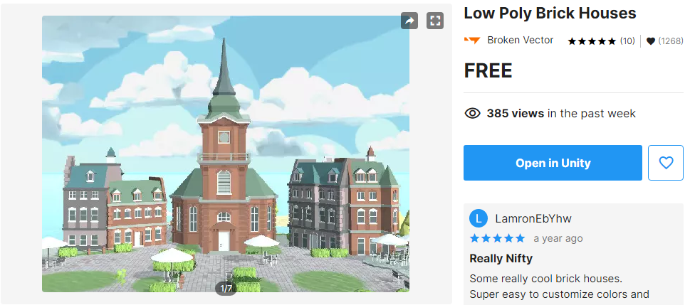
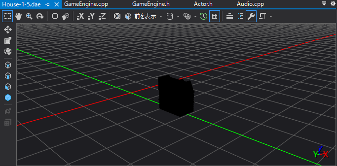
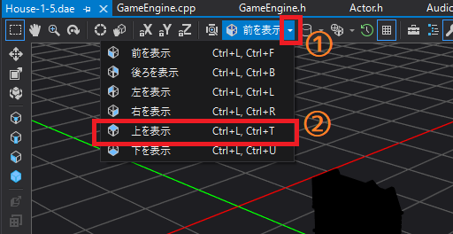
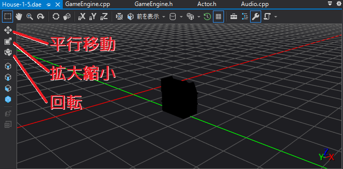
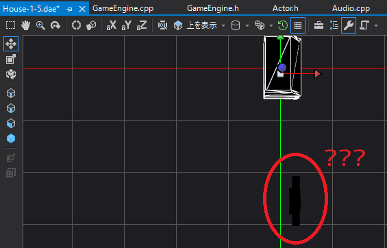
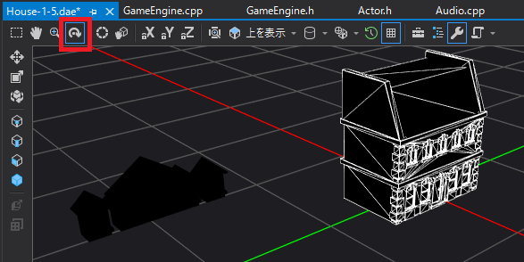
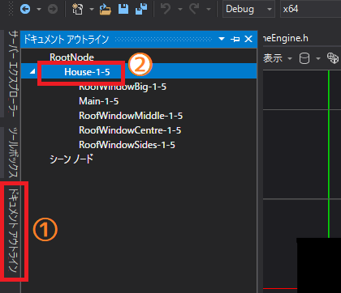
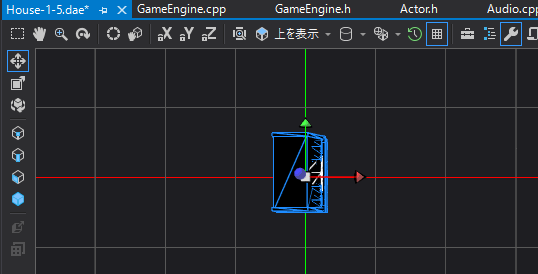
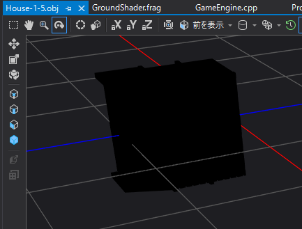
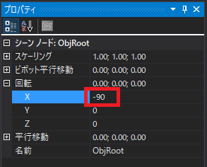

[OpenGL 3D 2021後期 第05回(マップエディタ編)]

# 広いマップを作る

## 習得目標

* ユニティアセットからOBJファイルとテクスチャを作成できる。
* ゲームの問題をプログラムで解決する方法を理解する。
* セーブデータにパラメータを追加することができる。

## 1. 多彩なマップを作れるようにする

### 1.1 マップサイズを変更できるようにする

現在、マップエディタで作成できるマップの広さは、21x21マスです。1マスが4x4mなので、メートル換算だと84x84mとなります。これは、ちょっとした実験には十分な広さです。

これは、実際のゲームマップとして使うにはちょっと狭すぎます。そこで、マップサイズを変更できるようにしましょう。

>1. 新規マップを作成するボタンを追加する。
>2. ボタンが押されたら、マップサイズを設定するウィンドウを表示。このウィンドウには`OK`ボタンと`キャンセル`ボタンを配置する。
>3. `OK`ボタンが押されたら、マップサイズを変更して配置したアクター等を初期化する。

また、マップサイズを設定するウィンドウを開いている間、他の編集作業ができないようにしたいです。ImGuiでは「モーダル」ウィンドウを作成することで、モーダルウィンドウが表示されている間は他のGUIを無効化できます。

>**【モーダル？】**<br>
>GUIとしての「モーダル(`Modal`)」は、「優先的に処理するモード」のような意味です。モーダルウィンドウが開いているあいだは、他のウィンドウの処理は行われません。
>モーダルの反対は「モードレス(`Modeless`)」と言います。

それから、マップサイズは0以下にできるとまずいです。かといって、100万マスのように大きすぎるとゲームの速度が遅くなってしまいます。そこで、上限と下限を指定できる「スライダー」を使うことにします。

とりあえず、マップエディタが起動する状態にします。`Main.cpp`を開き、イズエディットモード変数の値を`true`に変更してください。

```diff
   GameManager& manager = GameManager::Get();

   // マップエディタを作成
-  const bool isEditMode = false; // エディタを起動しない場合はfalseにする
+  const bool isEditMode = true; // エディタを起動しない場合はfalseにする
   std::shared_ptr<MapEditor> mapEditor;
   if (isEditMode) {
```

それでは「新規マップを作成するボタン」を追加しましょう。`MapEditor.cpp`を開き、アップデートユーアイ関数に次のプログラムを追加してください。

```diff
   if (Button(u8"ロード")) {
     Load("mapdata.txt");
   }
+  SameLine();
+  static glm::ivec2 newMapSize;
+  if (Button(u8"新規作成")) {
+    OpenPopup(u8"新しいマップの広さ");
+    newMapSize = glm::ivec2(21, 21);
+  }
   Text(toolName[static_cast<int>(mode)]);
   End();
```

`newMapSize`変数は、新しく作成するマップの広さを格納する変数です。これはスライダーで使います。

`OpenPopup`(オープン・ポップアップ)は、「ポップアップウィンドウ」を開く指示を出す関数です。この関数自体はウィンドウを作成せず、後述するポップアップウィンドウの状態を指示するだけです。

引数には、開きたいポップアップウィンドウのラベル名を指定します。

次に、マップサイズを指定する「モーダル」ウィンドウを開きます。モーダルウィンドウを開くには`BeginPopupModal`(ビギン・ポップアップ・モーダル)関数を使います。

「新規作成」ボタンを表示するプログラムの下に、次のプログラムを追加してください。

```diff
     OpenPopup(u8"新しいマップの広さ");
     newMapSize = glm::ivec2(21, 21);
   }
+
+  // マップサイズを指定するモーダルウィンドウを開く
+  // 注: マップサイズは奇数にしないとアクターの配置がずれる
+  if (BeginPopupModal(u8"新しいマップの広さ")) {
+    Text(u8"横");
+    SameLine();
+    SetNextItemWidth(-1); // 次に表示する部品の横幅をウィンドウに合わせる
+    SliderInt("##mapSizeX", &newMapSize.x, 9, 101, "%d", ImGuiSliderFlags_AlwaysClamp);
+    newMapSize.x = newMapSize.x | 1; // マップサイズを奇数にする
+    Text(u8"縦");
+    SameLine();
+    SetNextItemWidth(-1); // 次に表示する部品の横幅をウィンドウに合わせる
+    SliderInt("##mapSizeY", &newMapSize.y, 9, 101, "%d", ImGuiSliderFlags_AlwaysClamp);
+    newMapSize.y = newMapSize.y | 1; // マップサイズを奇数にする
+    if (Button(u8"このサイズで作成")) {
+      // マップデータを作りなおす
+      mapSize = newMapSize;
+      map = std::vector<std::shared_ptr<Actor>>(mapSize.x * mapSize.y);
+      groundMap = std::vector<uint32_t>(mapSize.x * mapSize.y, 0);
+      engine.ClearAllActors();
+      InitGroundActor();
+      InitEditor();
+      CloseCurrentPopup();
+    }
+    SameLine();
+    if (Button(u8"キャンセル")) {
+      CloseCurrentPopup();
+    }
+    EndPopup();
+  }

   Text(toolName[static_cast<int>(mode)]);
   End();
```

ポップアップウィンドウを閉じるには`CloseCurrentPopup`(クローズ・カレント・ポップアップ)関数を使います。

### 1.2 マップデータテクスチャを作り直す

1.1節で作成した「新規作成」機能では、マップデータテクスチャの作りなおしができていません。というのも、マップデータテクスチャのサイズを変更する機能がないからです。

そこで、マップデータテクスチャを作りなおす機能を追加しましょう。関数名は`ResizeGroundMap`(リサイズ・グラウンド・マップ)とします。`GameEngine.h`を開き、アップデートグラウンドマップ関数宣言の下に次のプログラムを追加してください。

```diff
   std::shared_ptr<Texture> LoadTexture(
     const char* name, const char** fileList, size_t count);

   void UpdateGroundMap(int x, int y, int width, int height, const void* data);
+  void ResizeGroundMap(int width, int height, const void* data);

   /**
   * この関数がtrueを返したらウィンドウを閉じる(=アプリを終了させる)
```

次に`GameEngine.cpp`を開き、アップデートグラウンドマップ関数の定義の下に、次のプログラムを追加してください。

```diff
     texMap->Write(x, y, width, height, data, GL_RGBA, GL_UNSIGNED_BYTE);
   }
 }
+
+/**
+* 地面のマップデータの大きさを変更する
+*/
+void GameEngine::ResizeGroundMap(int width, int height, const void* data)
+{
+  mapSize = glm::ivec2(width, height);
+  texMap.reset(new Texture("GroundMap",
+    mapSize.x, mapSize.y, data, GL_RGBA, GL_UNSIGNED_BYTE));
+}
```

それでは「新規作成」機能からリサイズグラウンドマップ関数を呼び出しましょう。
`MapEditor.cpp`を開き、アップデートユーアイ関数に次のプログラムを追加してください。

```diff
       // マップデータを作りなおす
       mapSize = newMapSize;
       map = std::vector<std::shared_ptr<Actor>>(mapSize.x * mapSize.y);
       groundMap = std::vector<uint32_t>(mapSize.x * mapSize.y, 0);
+      engine.ResizeGroundMap(mapSize.x, mapSize.y, groundMap.data());
       engine.ClearAllActors();
       InitGroundActor();
```

これで、好きなサイズのマップを作成できるようになりました。プログラムが書けたらビルドして実行してください。

「新規作成」ボタンを押してマップのサイズを適当に変更し、`このサイズで作成`ボタンを押してください。指定したサイズのマップが作れていたら成功です。

### 1.3 セーブ・ロード関数を修正する

大変申し訳ないのですが、後期第03回で作成したセーブ・ロード関数に間違いがありました。この間違いを修正します。

まずセーブ関数です。セーブ関数の最後のグラウンドマップを出力するプログラムを、次のように変更してください。

```diff
   ofs << "groundMap: [\n";
   for (int y = 0; y < mapSize.y; ++y) {
     ofs << "  ";
     for (int x = 0; x < mapSize.x; ++x) {
-      ofs << groundMap[x + y * mapSize.y] << ", ";
+      ofs << groundMap[x + y * mapSize.x] << ", ";
     }
     ofs << '\n';
   }
   ofs << "]\n";
 }
```

次にロード関数です。ロード関数の「アクターをマップに配置」するプログラムを、次のように変更してください。

```diff
     // アクターをマップに配置
     std::shared_ptr<Actor> newActor(actor->Clone());
     newActor->position = position;
-    tmpMap[x + y * mapSize.x] = newActor;
+    tmpMap[x + y * tmpMapSize.x] = newActor;
   }
```

それから、マップデータテクスチャを作成する処理も修正します。これは、マップサイズを変更できるようにしたことによる変更です。ロード関数の「読み込んだデータをメンバ関数に反映する」プログラムを、次のように変更してください。

```diff
   map.swap(tmpMap);
   groundMap.swap(tmpGroundMap);

   GameEngine& engine = GameEngine::Get();
-  engine.UpdateGroundMap(0, 0, mapSize.x, mapSize.y, groundMap.data());
+  engine.ResizeGroundMap(mapSize.x, mapSize.y, groundMap.data());

   // ゲームエンジンのアクターを更新
   engine.ClearAllActors();
```

これでロード関数の修正は完了です。

### 1.4 マップサイズを地面シェーダに送る

次に、地面シェーダにマップサイズを知らせる機能を追加します。`ProgramPipeline.h`を開き、プログラムパイプラインクラスの定義に次のプログラムを追加してください。

```diff
   // ユニフォーム変数の設定
   bool SetUniform(GLint, const glm::mat4&) const;
+  bool SetUniform(GLint, const glm::vec4&) const;

   // バインド管理
   void Bind() const;
```

既存のセットユニフォーム関数との違いは、引数の型が`glm::vec4`になっていることです。次に`ProgramPipeline.cpp`を開き、セットユニフォーム関数の定義の下に、次のプログラムを追加してください。

```diff
   }
   return true;
 }
+
+/**
+* ユニフォーム変数にデータをコピーする
+*/
+bool ProgramPipeline::SetUniform(GLint location, const glm::vec4& data) const
+{
+  glGetError(); // エラー状態をリセット
+
+  // ロケーション番号によってコピー先を変更する
+  // - 0～99: 頂点シェーダ
+  // - 100～: フラグメントシェーダ
+  GLuint program = vp;
+  if (location >= 100) {
+    program = fp;
+  }
+
+  glProgramUniform4fv(program, location, 1, &data.x);
+  if (glGetError() != GL_NO_ERROR) {
+    std::cerr << "[エラー]" << __func__ << ":ユニフォーム変数の設定に失敗\n";
+    return false;
+  }
+  return true;
+}

 /**
 * プログラムパイプラインをバインドする.
```

`mat4`型では`glProgramUniformMatrix4fv`関数を使いましたが、`vec4`型では
`glProgramUniform4fv`(ジーエル・プログラム・ユニフォーム・フォー・エフ・ブイ)関数を使います。

<pre class="tnmai_code"><strong>【書式】</strong>
void glProgramUniform4fv(プログラムID, ロケーション番号, 転送するvec4の数, 転送データのアドレス);
</pre>

続いて`GroundMap.frag`を開き、次のユニフォーム変数を追加してください。

```diff
 // ユニフォーム変数
 layout(binding=0) uniform sampler2DArray texColor;
 layout(binding=1) uniform sampler2D texMap;

+layout(location=100) uniform vec4 mapSize; // マップの広さ

 // 平行光源
 struct DirectionalLight {
```

>**【mapSize変数のロケーション番号について】**<br>
>もし既に他のユニフォーム変数に`100`番を割り当てている場合は、他の番号(`101`, `102`など)を割り当ててください。

さらに、メイン関数を次のように変更してください。

```diff
 void main()
 {
   const float tileSize = 4.0; // マス目の大きさ
-  const vec2 mapSize = vec2(21.0, 21.0); // マップの広さ

   // テクスチャ番号を取得
-  vec2 texcoord = inPosition.xz / tileSize + mapSize * 0.5;
+  vec2 texcoord = inPosition.xz / tileSize + mapSize.xy * 0.5;
   float tileNo = texelFetch(texMap, ivec2(texcoord), 0).r * 255.0;

   vec4 tc = texture(texColor, vec3(fract(texcoord), tileNo));
```

それではマップサイズをシェーダに設定しましょう。`GameEngine.cpp`を開き、リサイズグラウンドマップ関数に次のプログラムを追加してください。

```diff
   mapSize = glm::ivec2(width, height);
   texMap.reset(new Texture("GroundMap",
     mapSize.x, mapSize.y, data, GL_RGBA, GL_UNSIGNED_BYTE));
+
+  const GLint locMapSize = 100;
+  pipelineGround->SetUniform(locMapSize, glm::vec4(mapSize, 0, 0));
}
```

それから、ゲームエンジンを作成するときに、最初のマップサイズ設定を行う必要があります。イニシャライズ関数の地面マップ用データを作成するプログラムを、次のように変更してください。

```diff
     // 地面マップ用データを作成
     engine->pipelineGround.reset(new ProgramPipeline(
       "Res/FragmentLighting.vert", "Res/GroundMap.frag"));
     std::vector<uint32_t> mapData(mapSize.x * mapSize.y, 0);
-    engine->texMap.reset(new Texture("GroundMap",
+    engine->ResizeGroundMap(
       engine->mapSize.x, engine->mapSize.y,
-      mapData.data(), GL_RGBA, GL_UNSIGNED_BYTE));
+      mapData.data());

     for (int layer = 0; layer < layerCount; ++layer) {
       engine->actors[layer].reserve(1000);
```

これでマップサイズがシェーダに送られるようになりました。

プログラムが書けたらビルドして実行してください。「新規作成」ボタンを押してマップサイズを変更し、カーソル位置にアクターを配置できること、地面のテクスチャを書き換えられることを確認してください。

アクターの配置と地面テクスチャの書き換えが正常動作していたら成功です。

### 1.5 ユニティアセットのモデルを変換する

現在のマップエディタでは、マップに配置できるアクターの種類が少ないため、あまり個性的なマップを作ることができません。個性的なマップを作るには、アクターの種類を増やす必要があります。

しかし、`Free3D`や`TurboSquido`にあるモデルはゲーム向きでないものも多く、ちょっと使いにくく感じることがあったと思います。

そこで、ユニティアセットストアにあるアセットからモデルを取り込むことにします。アセットに含まれるモデルがOBJ, FBX, DAEというファイルになっていれば、Visual StudioでOBJファイルに変換できます。

アセットストアで`Package Content`タブを開くと、アセットに含まれるファイルを調べることができますので、インポートする前に上記のファイルの有無を調べてください。

ファイルがない場合はインポートできないので、他のアセットを探してください。

>1. 空のプロジェクトでユニティを起動する。
>2. アセットストアから使いたいアセットを入手し、プロジェクトにインポートする。使いたいアセットが複数ある場合はすべてインポートすること。インポートが完了したらユニティを閉じてよい。
>3. エクスプローラーでユニティプロジェクトのフォルダを開く。
>4. `Assets`フォルダにあるインポートしたアセットのフォルダを開く。
>5. `Models`や`Meshes`といった名前のフォルダを開き、使いたいモデルのFBXまたはDAEファイルを見つける。
>どのファイルがどのモデルかは、アセットストアの`Package Content`タブや、ユニティ上で調べることができる。
>6. 見つけたモデルファイルをVisual Studioにドラッグ&ドロップする。
>7. 必要に応じてモデルの「平行移動」、「回転」、「拡大縮小」を行う。
>8. 「ファイル→名前を付けて～を保存」を選択し、ファイルの種類を`OBJ`にして保存。
>9. 作成したOBJファイルをVisual Studioプロジェクトの`Res`フォルダに移動する。

それから、モデルに貼り付けるテクスチャも必要です。Visual Studioは大抵の画像ファイルを扱えますが、PSD(フォトショップ形式)だけは開けませんので、PhotoShopやGIMPなどを使ってください。

>1. `Textures`といった名前のフォルダを開き、使いたいモデル用のテクスチャファイルを見つける。
>2. 見つけたテクスチャファイルをVisual Studioにドラッグ&ドロップする。
>3. 「ファイル→名前を付けて～を保存」を選択し、ファイルの種類を`TGA`にして保存。
>4. 必要に応じて「画像サイズ」や「形式」を変更し、保存しなおす。
>5. 作成したTGAファイルをVisual Studioプロジェクトの`Res`フォルダに移動する。

それでは、実際にアセットを表示してみましょう。例として「Low Poly Brick House」を使いますので、インポートしておいてください。

<p align="center">

</p>

この「ローポリ・ブリック・ハウス」というアセットの場合、作者名`BrokenVector`(ブロークン・ベクター)のフォルダにインポートされます。モデルは`Models`(モデルズ)フォルダにあります。

`BrokenVector\Models`フォルダを開き、`House-1-5.dae`という名前のモデルファイルをVisual Studioにドラッグ&ドロップしてください。すると次のように真っ黒なモデルが表示されます。

<p align="center">

</p>

真っ黒なのは同じフォルダにテクスチャがないからなので、気にしなくて大丈夫です。

>**【カメラの操作方法】**<br>
>上下移動: ホイール<br>
>左右移動: Shift+ホイール<br>
>拡大縮小: Ctrl+ホイール<br>

読み込んだモデルが原点(赤と緑が交差する点)以外の場所にある場合、モデルを原点に移動させておきます。モデルを原点に移動させるには、まず前後左右の位置を合わせ、次に上下の位置を合わせます。

ウィンドウ上部の「前を表示」という文字の右側にある、小さな「▽」アイコンをクリックしてください。すると、以下のように表示方向のリストが表示されます(①)。次にリストから「上を表示」をクリックします(②)。

<p align="center">

</p>

これで、モデルを真上から見下ろす視点になりました。

次にモデルを移動させます。これにはウィンドウ左側の操作アイコンを使います。操作アイコンの意味は次のとおりです。

<p align="center">

</p>

動かしたいモデルをクリックし、次に平行移動アイコンをクリックします(逆でも可)。すると平行移動ハンドルが表示されます。緑のハンドルをドラッグして、モデルを赤と緑が交差する地点に移動させてください(だいたいでいいです)。

<p align="center">

</p>

モデルを移動させると、元の場所に黒いものが残ってしまっています。<br>実は`House-1-5.dae`は複数のパーツで構成されていて、元の場所にあるのは選択されなかったパーツなのです。

<p align="center">

</p>

ウィンドウ上部の「矢印が回転しているようなアイコン」をクリックしてください。すると、ドラッグ操作でカメラを回転させることができますので、実際に家のパーツであることを確認してください。

さて、一つ一つパーツを選択して動かすこともできますが、それだとパーツの配置が微妙にずれてしまいます。そこで複数のパーツを一括選択しましょう。

まず、`Ctrl+Z`キーを何回か押して、モデルを移動させていない状態に戻してください。

次にウィンドウ左にある「ドキュメントアウトライン」というタブをクリックします(①)。するとモデルのパーツがツリー表示されます。

<p align="center">

</p>

ツリーにある`House-1-5`をクリックしてください(②)。これで配下のパーツすべてを動かせるようになります。

それではもう一度モデルを移動させましょう。「上を表示」を押して上からの視点に切り替え、モデルが原点に来るように平行移動してください。

<p align="center">

</p>

次に上下方向を確認します。「前を表示」を選択して、前からの視点に切り替えてください。このとき視点が近すぎる場合は、`Ctrl+ホイール`で表示を縮小してください。

<p align="center">

</p>

モデルが地面を表すグリッドから離れている場合は、地面に接地するように平行移動します。しかし、このモデルの上下方向は最初から原点にあるようなので、移動の必要はなさそうです。

>このとき、モデルがグリッドを大きくはみ出るように表示されている場合は、モデルが大きすぎます。拡大縮小アイコンを押して、モデルを小さくしてください。

それではOBJファイルに変換しましょう。メニューから「ファイル→名前を付けて～を保存」を選択し、プロジェクトの`Res`フォルダに保存してください。これでモデルの変換は完了です。

<pre class="tnmai_assignment">
<strong>【課題01】</strong>
<code>House-2-1.dae</code>と<code>Lamppost.dae</code>をOBJファイルに変換して、プロジェクトの<code>Res</code>フォルダに保存しなさい。
</pre>

### 1.6 角度を修正する

作成した`House-1-5.obj`ファイルをVisual Studioで開いてください。このとき、「ファイルを開くアプリケーションの選択」から「グラフィックスデザイナー」を選んでください。

すると、家が横倒しになっていることが分かります。

<p align="center">

</p>

FBXやDAEファイルには、XYZの軸の方向をファイルごとに変えられる機能があります。しかし、OBJファイルにしたときにその情報が消えてしまうため、角度が90度回転してしまうことがあるのです。

これを解決するには、単純にモデルを90度回転させます。ウィンドウ右側の回転アイコンを選択し、次に「ドキュメントウィンドウ」から`ObjRoot`をクリックしてください。これで全てのパーツをまとめて回転させることができます。

さて、GUIで90度回転させでもいいのですが、ぴったり90度回転させるのはちょっと大変です。こういう場合は「プロパティ」ウィンドウを使います。

ウィンドウ上部の「スパナ」アイコンをクリックして、プロパティウィンドウを開いてください。

<p align="center">

</p>

回転の項目を展開し、`X`の値に`-90`と入力して`Enter`キーを押してください。これでX軸でぴったり-90度回転します。回転させたら`House-1-5.obj`タブをクリックして選択状態にして、`Ctrl+S`キーを押して変更を保存してください。

<pre class="tnmai_assignment">
<strong>【課題02】</strong>
<code>House-2-1.obj</code>と<code>Lamppost.obj</code>の向きを修正しなさい。
</pre>

### 1.7 ユニティアセットのテクスチャを変換する

ローポリ・ブリック・ハウスのテクスチャは`Pallets`(パレッツ)フォルダに入っています。エクスプローラーでパレッツフォルダを開いてください。

パレッツフォルダ内の`Houses Colorscheme.png`(ハウスィズ・カラースキーム)から
`Houses Colorscheme 6.png`までの7枚が家のテクスチャです。

このアセットの場合、同じモデルに異なるテクスチャを割り当てることで、家の色合いを変えられるようになっています。なので全部変換しておくとよいのですが、とりあえず`Houses Colorscheme.png`をVisual Studioにドラッグ&ドロップしてください。

`Houses Colorscheme.png`タブをクリックして選択状態にします。そして、メニューから「ファイル→名前を付けて～を保存」を選択し、プロジェクトの`Res`フォルダに保存してください。これでテクスチャの変換は完了です。

<pre class="tnmai_assignment">
<strong>【課題03】</strong>
<code>Houses Colorscheme 2.png</code>から<code>Houses Colorscheme 6.png</code>のうち、好きな2枚を選んでTGAに変換し、プロジェクトの<code>Res</code>フォルダに保存しなさい。
</pre>

### 1.8 アクターの種類を増やす

変換したモデルを表示しましょう。`MapEditor.cpp`を開き、イニットアクターリスト関数にある`objectList`配列に次のプログラムを追加してください。

```diff
       "Res/HouseRender.obj", "Res/House38UVTexture.tga",
       Box{glm::vec3(-2, 0, -2), glm::vec3(2, 2, 2)},
       glm::vec3(2.0f), 0, glm::vec3(-2.6f, 2.0f, 0.8f) },
+    {
+      ActorType::actor, "House-1-5(1)",
+      "Res/House-1-5.obj", "Res/Houses Colorschemetga",
+      Box(glm::vec3(-2, 0, -4), glm::vec3(2, 8, 4)) },
     {
       ActorType::t34tank, "T-34",
       "Res/T34.obj", "Res/T-34.tga",
       Box{glm::vec3(-1.5f, 0, -1.5f), glm::vec3(1.5f, 2, 1.5f)} },
```

プログラムが書けたらビルドして実行してください。アクターの一覧から`House-1-5(1)`を選択し、マップに配置することができたら成功です。

<pre class="tnmai_assignment">
<strong>【課題04】</strong>
<code>objectList</code>配列に<code>House-2-1.obj</code>と<code>Lamppost.obj</code>を追加しなさい。
マップエディタを起動し、追加したモデルが配置できることを確認すること。
</pre>

<pre class="tnmai_assignment">
<strong>【課題05】</strong>
<code>Houses-1-5.obj</code>と<code>Houses-2-1.obj</code>について、課題02で追加したテクスチャを使うバージョンを<code>objectList</code>配列に追加しなさい。
マップエディタを起動し、色違いのモデルが配置できることを確認すること。
</pre>

<pre class="tnmai_assignment">
<strong>【課題06】</strong>
ユニティアセットストア、Free3d.com、TurboSquid.comなどを利用して、<code>objectList</code>に建物のモデルを2種類以上追加しなさい。
</pre>

<pre class="tnmai_assignment">
<strong>【課題07】</strong>
ユニティアセットストア、Free3d.com、TurboSquid.comなどを利用して、<code>objectList</code>に針葉樹のモデルを1つ以上、広葉樹のモデルを1つ以上、それぞれ追加しなさい。
</pre>

>**【1章のまとめ】**<br>
>
>* ユニティアセットストアのアセットは、ゲームに使いやすいファイルが多い。
>* OBJ, FBX, DAEファイルからOBJファイルを作ることができる。
>* Visual Studioのグラフィックスデザイナーを使うと、モデルの位置、大きさ、角度を変えることができる。

<div style="page-break-after: always"></div>

## 2. マップを作成する

### 2.1 マップを作る

第2章では、実際のゲームマップを作成していきます。基本的な仕様は次のとおりです。

>* マップサイズ: 21x41マス
>* マップの外周: すべて木で囲んで出られなくする。
>* 地面の特徴: マップ中央を、縦に幅5マスの道路が通る。道路脇左右1マスは歩道。
>* 障害物: マップ下半分の道路の左右にいくつかの建物。
>* プレイヤーの位置: マップ中央下部
>* 敵の位置: マップ下半分の建物の外側にバラバラに4両、マップの中央、上から3/4くらいの位置にまとまって4両(合計8両)

<pre class="tnmai_assignment">
<strong>【課題08】</strong>
上記の仕様に従ってマップを作成してセーブしなさい。
</pre>

### 2.2 敵がプレイヤーを追いかけるようにする

`Main.cpp`の`isEditMode`変数の値を`false`にして、作成したマップをプレイしてください。すると、敵がまったく動かないことに気がつくと思います。

これは、マップエディタで作成したアクターなので、追いかけるプレイヤーのポインタを指定していないからです。そこで、追いかける対象を設定する機能を追加します。

`T34TankActor.h`を開き、次のプログラムを追加してください。

```diff
   virtual void OnUpdate(float deltaTime) override;
   virtual void OnCollision(const struct Contact& contact) override;
+  void SetTarget(std::shared_ptr<Actor> t) { target = t; }

 private:
   std::shared_ptr<Actor> target; // 追いかける対象のアクター
```

作成した`SetTarget`(セット・ターゲット)関数を使って、プレイヤーをターゲットに指定しましょう。`MapEditor.cpp`を開き、アップデート関数に次のプログラムを追加してください。

```diff
     // 敵アクターのポインタを配列にコピーする
     enemies.clear();
     for (auto& e : engine.GetNewActors()) {
       if (e->name == "T-34") {
+        T34TankActor& enemy = static_cast<T34TankActor&>(*e);
+        enemy.SetTarget(playerTank);
         enemies.push_back(e);
       }
     }
```

プログラムが書けたらビルドして実行してください。敵戦車がプレイヤーを追いかけてきたら成功です。

### 2.3 最高速度を制限する

プレイヤーを敵のターゲットに指定した結果、今度は、遠くに配置したはずの敵があっという間に近づいてきて囲まれてしまい、タコ殴りにあったと思います。ここには、2つの問題が<ruby>潜<rt>ひそ</rt></ruby>んでいます。

>1. 加速に限界がないため、直線だとすごい速度が出せてしまう。
>2. プレイヤーがどんなに遠くにいても追いかけてくる。

まず1の問題に対処しましょう。実際の車両の最高速度にはエンジンのトルクやら変速機の性能やらが関わってくるのですが、そんな面倒なことはシミュレーターにまかせることにして、ごく単純に最高速度で制限することにします。

`T34TnakActor.cpp`を開き、オンアップデート関数に次のプログラムを追加してください。

```diff
     // タイガーI戦車までの距離が10mより遠い場合は前に加速
     if (length > 10.0f) {
+      const float maxSpeedKmh = 40.0f; // 最高速度(km/h)
+      const float maxSpeedMs = maxSpeedKmh * 1000.0f / 3600.0f; // 最高速度(m/s)
+      // 進行方向へ向かう速度が最高速度以下なら加速
+      if (glm::dot(velocity, t34Front) < maxSpeedMs) {
          velocity += t34Front * 0.3f;
+      }
     } else {
       // ベロシティのt34Front方向の長さを計算
```

プログラムが書けたらビルドして実行してください。T-34の速度が、最初に実行したときより遅くなっていたら成功です。

### 2.4 追跡モードに入る距離を設定する

次に「プレイヤーがどんなに遠くにいても追いかけてくる」問題に対処します。これも簡単に、プレイヤーまでの距離が遠い場合は移動しない、というようにします。オンアップデート関数に次のプログラムを追加してください。

```diff
     // T-34戦車からタイガーI戦車への距離を計算
     float length = glm::length(d);
+
+    // プレイヤーが視認範囲外にいるときは何もしない
+    const float maxViewLength = 40.0f; // プレイヤーを発見できる距離(m)
+    if (length > maxViewLength) {
+      return;
+    }

     // ベクトルdを正規化
     d = glm::normalize(d);
```

プログラムが書けたらビルドして実行してください。タイガーI戦車が近づくまで、T-34戦車が動かなければ成功です。

この2つの変更によって、いくぶん遊びやすくなったと思います。

### 2.5 アクターを配置する角度を指定する

プレイヤーがゲームを開始するとき、タイガーI戦車は下を向いています。しかし、大抵のプレイヤーは、ゲーム開始時にキャラクターが向いている方向に進むものだと考えます。

マップの仕様では上に向かって進んでもらいたいのに、操作するキャラクターが別を方向を向いていると、プレイヤーは進む方向を見失いがちです。

別の問題として、建物の向きが固定されているとマップを作りにくい点があげられます。現在の建物は決まった方向にしか向いていないため、例えば道路の左側では道路を向いて建てられても、右側では裏を向けて配置するしかありません。

そこで、マップにアクターを配置するとき、向きを指定できるようにしましょう。

`MapEditor.cpp`を開き、アップデートユーアイ関数のアクター選択ウィンドウを表示するプログラムの下に、次のプログラムを追加してください。

```diff
     EndListBox();
   }
   End();
+
+  Begin(u8"アクター情報");
+  Text(u8"名前: %s", cursor->name.c_str());
+  Text(u8"回転:");
+  SameLine();
+  static int rotation = 0;
+  static const char* strRotation[] = { "0", "90", "180", "270" };
+  SliderInt("rotation", &rotation,
+    0, static_cast<int>(std::size(strRotation)) - 1,
+    strRotation[rotation], ImGuiSliderFlags_NoInput);
+  cursor->rotation = static_cast<float>(rotation) * glm::radians(90.0f);
+  End();

   if (mode == Mode::groundPaint) {
     SetNextWindowSize(ImVec2(300, 0), ImGuiCond_Once);
```

それから、現在のマップエディタでは、配置されているのと同じ名前のアクターを配置し直すことができなくなっています。角度だけ変えたい場合に不便なので、配置プログラムを修正しましょう。

アップデート関数に次のプログラムを追加してください。

```diff
       // 選択アクターと種類が同じ場合は配置しない
       if (target && target->name == cursor->name) {
+        target->rotation = cursor->rotation;
         break;
       }
```

プログラムが書けたらビルドして実行してください。アクター情報ウィンドウを見つけて、スライダーを動かしてアクターの向きを変更できたら成功です。

### 2.6 アクターの角度をセーブ・ロードする

設定した角度をセーブしましょう。ついでなので拡大率も保存することにします。セーブ関数を次のように変更してください。

```diff
     if (!e) {
       continue;
     }
     char tmp[256];
-    snprintf(tmp, std::size(tmp), "  [ %s, %.03f, %.03f, %.03f ],\n",
-      e->name.c_str(), e->position.x, e->position.y, e->position.z);
+    snprintf(tmp, std::size(tmp),
+      "  [ %s, %.03f, %.03f, %.03f, %.03f, %.03f, %.03f, %.03f ],\n",
+      e->name.c_str(), e->position.x, e->position.y, e->position.z,
+      e->scale.x, e->scale.y, e->scale.z, glm::degrees(e->rotation));
     ofs << tmp;
   }
   ofs << "],\n";
```

ここで工夫した点は、角度をファイルに出力するとき、ラジアン(0～2π)から度数法(0～360)に変換していることです。

ラジアンは90度や180度といった人間にとってキリのいい角度を表現することが苦手です。また、人間がセーブファイルを見たとき、ラジアンより度数法のほうが分かりやすいです。

そこで、度数法に変換してファイルに出力するようにしてみました。ラジアンを度数法に変換するには`glm::degrees`(ジーエルエム・デグリーズ)関数を使います。

次に、ロード関数を次のように変更してください。

```diff
     // 行を解析
     char name[256];
     glm::vec3 position(0);
+    glm::vec3 scale(1);
+    float rotation = 0;
-    if (sscanf(line.data(), " [ %255[^,], %f, %f, %f ], ",
-      name, &position.x, &position.y, &position.z) != 4) {
+    if (sscanf(line.data(), " [ %255[^,], %f, %f, %f, %f, %f, %f, %f ], ",
+      name, &position.x, &position.y, &position.z,
+      &scale.x, &scale.y, &scale.z, &rotation) < 4) {
       std::cerr << "[警告]" << __func__ << ": 配置データの読み込みに失敗\n" <<
         "  " << line << "\n";
     }
+    rotation = glm::radians(rotation);
     name[255] = '\0';

     // アクターを取得
```

セーブのときに度数法に変換したので、ロードしたらラジアンに戻さなくてはなりません。そこで、`glm::radians`関数を使ってラジアンに戻しています。

最後に、読み込んだデータをアクターに反映します。ここでは衝突判定も回転に対応させようと思います。まず回転行列を作成するために、次のヘッダファイルをインクルードします。

```diff
 #include "GameEngine.h"
 #include <imgui.h>
 #include <glm/glm.hpp>
+#include <glm/gtc/matrix_transform.hpp>
 #include <math.h>
 #include <fstream>
```

そして、アクターをマップに配置するプログラムに、次のプログラムを追加してください。

```diff
     // アクターをマップに配置
     std::shared_ptr<Actor> newActor = actor->Clone();
     newActor->position = position;
+    newActor->scale = scale;
+    newActor->rotation = rotation;
+    // コライダーを回転
+    if (rotation) {
+      const glm::mat3 matR = glm::rotate(glm::mat4(1), rotation, glm::vec3(0, 1, 0));
+      const glm::vec3 a = matR * newActor->collider.min;
+      const glm::vec3 b = matR * newActor->collider.max;
+      newActor->collider.min = glm::min(a, b);
+      newActor->collider.max = glm::max(a, b);
+    }
     tmpMap[x + y * tmpMapSize.x] = newActor;
   }
```

プログラムが書けたらビルドして実行してください。そして、以下の手順でアクターの向きを変更してください。

>1. マップをロードする。
>2. タイガーI戦車の向きを上向きに変更する。
>3. 道路の右側の建物の向きを、道路に面するように変更する。
>4. マップをセーブする。
>5. 新規作成してマップデータを消去する。
>6. マップをロードして、3で変更した向きが反映されていたら成功です。

<pre class="tnmai_assignment">
<strong>【課題09】</strong>
マップに植物、街灯、その他のアクターを自由に配置して、街らしい見た目にしなさい。マップの上側1/4はボス戦用の広場としなさい。
</pre>

<pre class="tnmai_assignment">
<strong>【課題10】</strong>
アクターの拡大率を変更するGUIを追加しなさい。
</pre>

>**【2章のまとめ】**<br>
>
>* 敵の動作の気になる点を見つけたら、できるだけ単純な方法で改善すること。
>* マップエディタに欲しい機能があるときは、とりあえずGUIでなんとかできないか試してみる。
