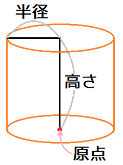
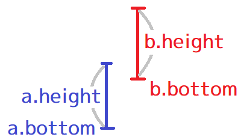
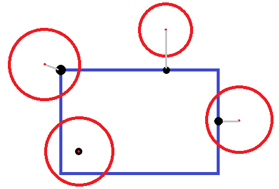
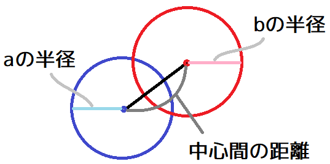
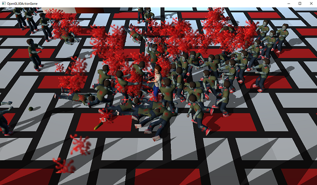

[OpenGL 3D 2021後期 第06回]

# 円柱の衝突判定

## 習得目標

* クラスの継承によって新しいコライダーを作成できる。
* 円柱の衝突判定について理解する。
* デバッグ用に内部データを表示する利点を理解する。

## 1. 円柱の衝突判定

### 1.1 同じ組み合わせの衝突判定が2回行われる問題を修正する

円柱の交差判定を実装する前に、コード作成中に見つかったバグを修正させてください。テキスト後期第01回1.11節において、衝突判定の回数を減らしましたが、そのときの修正内容にバグがありました。

このバグは「非スタティックアクター同士の衝突判定が2回行われる」というもので、アクターAとアクターBがあるとき、A, Bという組み合わせと、B, Aという組み合わせで衝突判定が実行されるために発生します。

本節では、`std::partition`(エスティーディ・パーティション)関数を使ってこのバグを修正します。`GameEngine.cpp`を開き、アップデートフィジックス関数を次のように変更してください。

```diff
 void GameEngine::UpdatePhysics(float deltaTime)
 {
   ActorList& actors = GetActors(Layer::Default);

-  // 非スタティックなアクターをリストアップ
-  ActorList nonStaticActors;
-  nonStaticActors.reserve(actors.size());
-  for (const std::shared_ptr<Actor>& e : actors) {
-    if (!e->isStatic) {
-      nonStaticActors.push_back(e);
-    }
-  }
+  // アクターを非スタティックとスタティックに分ける
+  ActorList partitionedActors = actors;
+  const auto itrEndA = std::partition(
+    partitionedActors.begin(), partitionedActors.end(),
+    [](const ActorList::value_type& e) { return !e->isStatic; });
+  const auto itrEndB = partitionedActors.end();

   std::vector<Contact> contacts;
   contacts.reserve(actors.size());
-  for (std::shared_ptr<Actor>& a : nonStaticActors) {
+  for (auto itrA = partitionedActors.begin(); itrA != itrEndA; ++itrA) {
+    std::shared_ptr<Actor>& a = *itrA;
-    for (std::shared_ptr<Actor>& b : actors) {
+    for (auto itrB = itrA + 1; itrB != itrEndB; ++itrB) {
+      std::shared_ptr<Actor>& b = *itrB;
-      // 同じアクターは衝突しない
-      if (a == b) {
-        continue;
-      }

       // 削除待ちアクターは衝突しない
       if (a->isDead) {
```

`std::partition`は「与えられた範囲を、条件によって区分化する」関数で、以下の書式を持ちます。

<pre class="tnmai_code"><strong>【書式】</strong><code>
区分する位置 std::partition(区分化する範囲の先頭, 区分化する範囲の終端, 区分する条件);
</code></pre>

区分化とは、

>範囲の前方に「条件を満たす要素」を集め、その後ろに「条件を満たさない要素」を集める

という操作です。パーティション関数の戻り値は「条件を満たさない最初の要素の位置」です。

上記のプログラムでは、パーティション関数によって、非スタティックなアクターを前方に集めています。

その上で、内側のループの最初の要素を「外側のループが参照している要素の次の要素」とすることで、同じ組み合わせが発生しないようにしています。

プログラムが書けたらビルドして実行してください。見た目の違いは何もないので、これまで通りにゲームが動作していたら成功です。

### 1.2 コライダーの基底クラスを定義する

それでは、改めて垂直円柱の衝突判定の話を進めさせてください。

さまざまな物体を表現するとき、衝突判定に使える図形が直方体だけでは不足することがあります。現実によく見かけるのは、垂直な円柱状の物体です。

<p align="center">
<br>
[垂直円柱]
</p>

垂直円柱は向いている方向を変更できる物体にも有用です。例えば物体が斜めを向いたとき、本来であれば斜め方法の衝突判定は小さくなるはずです。しかし、コライダーは回転しないため、衝突判定が見た目と一致しません。

このような場合、コライダーに垂直円柱を使います。垂直円柱はどの方向からでも同じように見えるため、、物体の向きと衝突判定が一致しない、という問題は起きません。

>もちろん、回転させたコライダーで衝突判定ができるなら、それに越したことはありません。

というわけで、この章では垂直円柱コライダーを追加していきます。そのためにはいくつかの問題を解決しなくてはなりません。

最初の問題は、現在のアクタークラスに設定できるコライダーが`Box`型だけなことです。まずは、種類の異なるコライダーを扱えるようにする必要があります。

解決方法として、すべてのコライダーの基底クラスを定義し、基底クラスへのポインタでコライダーを管理することにします。継承とポインタを使うことで、あらゆる派生クラスをアクターに割り当てられるようになります。

それでは基底クラスを作成しましょう。プロジェクトの`Src`フォルダに`Collision.h`というファイルを追加してください。追加したファイルを開き、次のプログラムを追加してください。

```diff
+/**
+* @file Collision.h
+*/
+#ifndef COLLISION_H_INCLUDED
+#define COLLISION_H_INCLUDED
+#include <glm/glm.hpp>
+#include <memory>
+
+// 先行宣言
+class Actor;
+struct Contact;
+
+/*+
+* 図形の種類
+*/
+enum class ShapeType
+{
+  box,      // 直方体
+  cylinder, // 円柱
+};
+
+/**
+* コライダーの基底クラス
+*/
+class Collider
+{
+public:
+  Collider(ShapeType type) : shapeType(type) {}
+  virtual ~Collider() = default;
+
+  virtual std::shared_ptr<Collider> Clone() const = 0;
+  ShapeType GetShapeType() const { return shapeType; }
+
+private:
+  ShapeType shapeType;
+};
+
+bool CollisionBoxBox(Actor& a, Actor& b, Contact& contact);
+bool CollisionBoxCylinder(Actor& a, Actor& b, Contact& contact);
+bool CollisionCylinderCylinder(Actor& a, Actor& b, Contact& contact);
+bool CollisionCylinderBox(Actor& a, Actor& b, Contact& contact);
+
+#endif // COLLISION_H_INCLUDED
```

次にプロジェクトの`Src`フォルダに`Collision.cpp`というファイルを追加してください。<br>
追加したファイルを開き、次のプログラムを追加してください。

```diff
+/**
+* @file Collision.cpp
+*/
+#include "Collision.h"
+#include "Actor.h"
+
+// 浮動小数点数の0とみなす値
+static const float epsilon = FLT_EPSILON * 8;
+
+/**
+* 直方体と直方体の衝突
+*/
+bool CollisionBoxBox(Actor& actorA, Actor& actorB, Contact& contact)
+{
+}
+
+/**
+* 直方体と円柱の衝突
+*/
+bool CollisionBoxCylinder(Actor& actorA, Actor& actorB, Contact& contact)
+{
+}
+
+/**
+* 円柱と円柱の衝突
+*/
+bool CollisionCylinderCylinder(Actor& actorA, Actor& actorB, Contact& contact)
+{
+}
+
+/**
+* 円柱と直方体の衝突
+*/
+bool CollisionCylinderBox(Actor& actorA, Actor& actorB, Contact& contact)
+{
+  return CollisionBoxCylinder(actorB, actorA, contact);
+}
```

これで基底クラスの作成と、衝突判定用のファイルの追加は完了です。あとは、ここに必要なプログラムを移動したり、追加したりしていきます。

### 1.3 colliderメンバ変数にBox以外のコライダーを指定できるようにする

アクタークラスに多様なコライダーを設定できるようにするには、コライダーをポインタで保持するのが簡単です。

とりあえず、`Collider`クラスをアクタークラスで使えるように、ヘッダファイルをインクルードしましょう。`Actor.h`を開き、次のプログラムを追加してください。

```diff
 #include "Primitive.h"
 #include "Texture.h"
 #include "ProgramPipeline.h"
+#include "Collision.h"
 #include <string>
 #include <vector>
 #include <glm/glm.hpp>
```

それから、`Box`型を`Collider.h`に移動させます。

<pre class="tnmai_assignment">
<strong>【課題01】</strong>
<code>Actor.h</code>から<code>Box</code>型の定義を切り取って、<code>Collision.h</code>の<code>Collider</code>クラス定義の下に貼り付けなさい。
</pre>

次に`Box`型を`Collider`の派生クラスにします。`Box`型の定義を次のように変更してください。

```diff
 /**
 * 直方体
 */
-struct Box
+class Box : public Collider
 {
+public:
+  // 直方体コライダーを作成する
+  static std::shared_ptr<Box> Create(
+    const glm::vec3& min, const glm::vec3& max)
+  {
+    return std::make_shared<Box>(min, max);
+  }
+
+  // コンストラクタ・デストラクタ
+  Box() : Collider(ShapeType::box) {};
+  Box(const glm::vec3& min, const glm::vec3& max) :
+    Collider(ShapeType::box), min(min), max(max) {}
+  virtual ~Box() = default;
+
+  // クローンを作成する
+  virtual std::shared_ptr<Collider> Clone() const override
+  {
+    return std::make_shared<Box>(*this);
+  }

   glm::vec3 min = glm::vec3(0);
   glm::vec3 max = glm::vec3(0);
 };
```

`std::make_shared`(エスティーディ・メイク・シェアード)関数テンプレートは、シェアードポインタを作成する関数です。通常、シェアードポインタのオブジェクトを作成するときは次のように書きます。

```c++
std::shared_ptr<Actor>(new Actor("SuperStrongBossTank", glm::vec3(0), ...));
```

この書き方では、`Actor`という<ruby>型名<rt>かためい</rt></ruby>を2回書かなければなりません(シェアードポインタの型を指定するときと、`new`の型を指定するとき)。

これに対して、メイクシェアードを使うと次のように書くことができます。

```c++
std::make_shared<Actor>("SuperStrongBossTank", glm::vec3(0), ...);
```

このように、メイクシェアードを使うと型の指定は1回で済みます。さらに、メイクシェアード関数を使うと、シェアードポインタの管理データを、通常の書き方より効率的に作成してくれます。

>**【メイクシェアードの残念なところ】**<br>
>テンプレート機能を使った部分でエラーが起きると、大抵は分かりにくい大量のエラーメッセージが表示されるものです。これはメイクシェアードも例外ではありません。

続いて、アクタークラスのコライダーメンバ変数をポインタ型に変更します。`Actor.h`を開き、アクタークラスの定義を次のように変更してください。

```diff
   float health = 10;               // 耐久値
   bool isDead = false;             // false=死亡(削除待ち) true=生存中

-  Box collider; // 衝突判定
+  std::shared_ptr<Collider> collider; // 衝突判定
   float mass = 1;                  // 質量(kg)
   float cor = 0.4f;                // 反発係数
```

型を変更したので、`collider`メンバ変数を使っているすべての箇所でエラーが起きるはずです。まずそれらに対処していきます。

`Actor.cpp`を開き、`DetectCollision`関数の「ワールド座標系の衝突図形を計算する」プログラムを、次のように変更してください。

```diff
   if (actorA.isStatic && actorB.isStatic) {
     return false;
   }
+
+  // コライダーが設定されていない物体は衝突しない
+  if (!actorA.collider || !actorB.collider) {
+    return false;
+  }

   // ワールド座標系の衝突図形を計算する
-  Box a = actorA.collider;
+  Box a = static_cast<Box&>(*actorA.collider);
   a.min += actorA.position;
   a.max += actorA.position;

-  Box b = actorB.collider;
+  Box b = static_cast<Box&>(*actorB.collider);
   b.min += actorB.position;
   b.max += actorB.position;
```

次に、「衝突面の座標を計算する」プログラムを次のように変更してください。

```diff
       targetNormal *= -1; // 法線の向きを反転する
     }
     // コライダーの半径を計算する
-    glm::vec3 halfSize = (target->collider.max - target->collider.min) * 0.5f;
+    const Box& targetBox = static_cast<Box&>(*target->collider);
+    glm::vec3 halfSize = (targetBox.max - targetBox.min) * 0.5f;
     // コライダーの中心座標を計算する
-    glm::vec3 center = (target->collider.max + target->collider.min) * 0.5f;
+    glm::vec3 center = (targetBox.max + targetBox.min) * 0.5f;
     // 衝突面の座標を計算する
     contact.position = target->position + center - halfSize * targetNormal;
   }
```

続いて`PlayerActor.cpp`を開き、コンストラクタを次のように変更してください。

```diff
     position, scale, rotation, glm::vec3(0))
 {
   health = 10;
-  collider = Box{ glm::vec3(-1.8f, 0, -1.8f), glm::vec3(1.8f, 2.8f, 1.8f) };
+  collider = Box::Create(glm::vec3(-1.8f, 0, -1.8f), glm::vec3(1.8f, 2.8f, 1.8f));
 }

 /**
 * アクターの状態を更新する
```

<pre class="tnmai_assignment">
<strong>【課題02】</strong>
プレイヤーアクタークラスの弾を発射するプログラムについて、<code>collider</code>メンバ変数に<code>Box</code>型の値を代入するプログラムを、<code>Box::Create</code>関数を使うように変更しなさい。
</pre>

<pre class="tnmai_assignment">
<strong>【課題03】</strong>
プレイヤーアクタークラスの変更を参考にして、他のすべての<code>collider</code>メンバ変数に<code>Box</code>型の値を代入するプログラムを、<code>Box::Create</code>関数を使うように変更しなさい。
</pre>

<pre class="tnmai_assignment">
<strong>【課題04】</strong>
もし、マップエディタに「アクターの角度をセーブ・ロードする」機能を組み込んでいる場合、アクタークラスの<code>Clone</code>メンバ関数を、次のように変更してください。
機能を組み込んでいない場合は、この課題を無視してください。
<code><div>
   virtual std::shared_ptr&lt;Actor&gt; Clone() const {
<span class="hljs-deletion">-    return std::shared_ptr&lt;Actor&gt;(new Actor(*this));</span>
<span class="hljs-addition">+    std::shared_ptr&lt;Actor&gt; clone(new Actor(*this));</span>
<span class="hljs-addition">+    if (collider) {</span>
<span class="hljs-addition">+      clone->collider = collider->Clone();</span>
<span class="hljs-addition">+    }</span>
<span class="hljs-addition">+    return clone;</span>
   }
</div></code>
上記の変更を行ったうえで、さらに<code>MapEditor.cpp</code>のロード関数を次のように変更してください。
<code><div>
     // コライダーを回転
<span class="hljs-deletion">-   if (rotation) {</span>
<span class="hljs-addition">+   if (rotation &&</span>
<span class="hljs-addition">+     newActor->collider->GetShapeType() == ShapeType::box) {</span>
       const glm::mat3 matR =
         glm::rotate(glm::mat4(1), rotation, glm::vec3(0, 1, 0));
<span class="hljs-addition">+      Box& box = static_cast&lt;Box&&gt;(*newActor->collider);</span>
<span class="hljs-deletion">-      const glm::vec3 a = matR * newActor->collider.min;</span>
<span class="hljs-deletion">-      const glm::vec3 b = matR * newActor->collider.max;</span>
<span class="hljs-deletion">-      newActor->collider.min = glm::min(a, b);</span>
<span class="hljs-deletion">-      newActor->collider.max = glm::max(a, b);</span>
<span class="hljs-addition">+      const glm::vec3 a = matR * box.min;</span>
<span class="hljs-addition">+      const glm::vec3 b = matR * box.max;</span>
<span class="hljs-addition">+      box.min = glm::min(a, b);</span>
<span class="hljs-addition">+      box.max = glm::max(a, b);</span>
     }
</div></code></pre>

課題04まで完了したら、ビルドして実行してください。特に問題なくゲームが動作していたら成功です。

### 1.4 直方体の衝突判定を関数にする

垂直円柱の衝突判定を追加するためには、`DetectCollision`関数が複数の図形を扱えるように改造しなくてはなりません。

そのために、直方体の衝突判定を関数にします。`Actor.cpp`を開き、`DetectCollision`関数から、次のように直方体の衝突判定プログラムを切り取ってください。

```diff
   if (!actorA.collider || !actorB.collider) {
     return false;
   }

-  // ワールド座標系の衝突図形を計算する
-  Box a = static_cast<Box&>(*actorA.collider);
-  a.min += actorA.position;
-  a.max += actorA.position;
-      ・
-      ・
-      ・
-  // 浸透距離の長さを計算する
-  contact.penLength = glm::length(penetration);
-
-  // 衝突している
-  return true;
 }

 /**
 * 重なりを解決する
```

次に、`Collision.cpp`を開き、`CollisionBoxBox`関数に切り取ったプログラムを貼り付けてください。

```diff
 bool CollisionBoxBox(Actor& actorA, Actor& actorB, Contact& contact)
 {
+  // ワールド座標系の衝突図形を計算する
+  Box a = static_cast<Box&>(*actorA.collider);
+  a.min += actorA.position;
+  a.max += actorA.position;
+      ・
+      ・
+      ・
+  // 浸透距離の長さを計算する
+  contact.penLength = glm::length(penetration);
+
+  // 衝突している
+  return true;
 }

 /**
 * 直方体と円柱の衝突
```

最後に、元の`DetectCollision`関数から、移動先である`CollisionBoxBox`関数を呼び出します。`Actor.cpp`を開き、`DetectCollision`関数に次のプログラムを追加してください。

```diff
   if (!actorA.collider || !actorB.collider) {
     return false;
   }

+  // 関数テーブル
+  using CollisionFunc = bool(*)(Actor&, Actor&, Contact&);
+  static const CollisionFunc funcTable[2][2] = {
+    { CollisionBoxBox, CollisionBoxCylinder },
+    { CollisionCylinderBox, CollisionCylinderCylinder },
+  };
+
+  // 図形の組み合わせに対応する関数を実行する
+  const int y = static_cast<int>(actorA.collider->GetShapeType());
+  const int x = static_cast<int>(actorB.collider->GetShapeType());
+  return funcTable[y][x](actorA, actorB, contact);
 }

 /**
 * 重なりを解決する
```

このプログラムでは、「関数テーブル」と呼ばれる手法を使って、2つの図形の組み合わせに対応した関数を呼び出しています。

プログラムが書けたらビルドして実行してください。特に問題なくゲームが動作していたら成功です。

<pre class="tnmai_assignment">
<strong>【課題05】</strong>
<code>Actor.h</code>にある<code>Box</code>クラスの定義を、<code>Collision.h</code>にある<code>Collider</code>クラスの定義の下に移動しなさい。
</pre>

### 1.5 Cylinder(シリンダー)型を定義する

ここまでで、垂直円柱を追加する下準備が完了しました。それでは、垂直円柱型を追加しましょう。`Collider.h`を開き、`Box`クラスの定義の下に、次のプログラムを追加してください。

```diff
   glm::vec3 min = glm::vec3(0);
   glm::vec3 max = glm::vec3(0);
 };
+
+/**
+* 垂直円柱
+*/
+class Cylinder : public Collider
+{
+public:
+  // 垂直円柱コライダーを作成する
+  static std::shared_ptr<Cylinder> Create(
+    const glm::vec3& bottom, float radius, float height)
+  {
+    return std::make_shared<Cylinder>(bottom, radius, height);
+  }
+
+  // コンストラクタ・デストラクタ
+  Cylinder() : Collider(ShapeType::cylinder) {}
+  Cylinder(const glm::vec3& bottom, float radius, float height) :
+    Collider(ShapeType::cylinder), bottom(bottom), radius(radius), height(height) {}
+  virtual ~Cylinder() = default;
+
+  // クローンを作成する
+  virtual std::shared_ptr<Collider> Clone() const override
+  {
+    return std::make_shared<Cylinder>(*this);
+  }
+
+  glm::vec3 bottom = glm::vec3(0); // 下端の座標
+  float radius = 1.0f; // 半径
+  float height = 1.0f; // 高さ
+};

 bool CollisionBoxBox(Actor& a, Actor& b, Contact& contact);
 bool CollisionBoxCylinder(Actor& a, Actor& b, Contact& contact);
```

これで垂直円柱コライダークラスを定義することができました。

### 1.6 CollisionBoxCylinder関数を作成する

続いて、直方体と垂直円柱の衝突判定を作成します。`Collision.cpp`を開き、`CollisionBoxCylinder`関数に次のプログラムを追加してください。

```diff
 bool CollisionBoxCylinder(Actor& actorA, Actor& actorB, Contact& contact)
 {
+  // ワールド座標系の衝突図形を計算する
+  Box a = static_cast<Box&>(*actorA.collider);
+  a.min += actorA.position;
+  a.max += actorA.position;
+
+  Cylinder b = static_cast<Cylinder&>(*actorB.collider);
+  b.bottom += actorB.position;
 }

 /**
 * 円柱と直方体の衝突
```

まず、Y軸方向の交差判定を行います。Y軸の交差判定は、直方体同士の交差判定と同じです。

<p align="center">

</p>

```diff
   Cylinder b = static_cast<Cylinder&>(*actorB.collider);
   b.bottom += actorB.position;
+
+  // aの下面がbの上面より上にあるなら、衝突していない
+  const float dy0 = (b.bottom.y + b.height) - a.min.y;
+  if (dy0 <= 0) {
+    return false;
+  }
+  // aの上面がbの下面より下にあるなら、衝突していない
+  const float dy1 = a.max.y - b.bottom.y;
+  if (dy1 <= 0) {
+    return false;
+  }
 }

 /**
 * 円柱と直方体の衝突
```

次に、XおよびZ軸の交差判定を行います。これは、直方体の中で円の中心に最も近い点、つまり「最近接点(さいきんせつてん)」を求めることで判定できます。Y軸方向の交差判定の下に、次のプログラムを追加してください。

<p align="center">
<br>
[交差状態による最近接点(黒点)の違い]
</p>

```diff
   if (dy1 <= 0) {
     return false;
   }
+
+  // 円柱の中心に最も近い直方体内の座標(最近接点)を求める
+  const float cx = glm::clamp(b.bottom.x, a.min.x, a.max.x);
+  const float cz = glm::clamp(b.bottom.z, a.min.z, a.max.z);
+  const glm::vec3 closestPointXZ(cx, 0, cz);
+
+  // 円柱の中心から最近接点までの距離を計算する
+  const float dx = closestPointXZ.x - b.bottom.x;
+  const float dz = closestPointXZ.z - b.bottom.z;
+  const float d2 = dx * dx + dz * dz;
+
+  // 最近接点までの距離が円柱の半径より長ければ、衝突していない
+  if (d2 > b.radius * b.radius) {
+    return false;
+  }
 }

 /**
 * 円柱と直方体の衝突
```

ここまでで、交差しているかどうかの判定は完了です。ここからは、浸透距離(ペネトレーション)と、方向(ノーマル)を計算します。まずY方向の浸透距離と方向を計算します。XZ方向の交差判定の下に、次のプログラムを追加してください。

```diff
   if (d2 > b.radius * b.radius) {
     return false;
   }
+
+  // Y方向の浸透距離と方向を計算する
+  glm::vec3 penetration(0);
+  glm::vec3 normal(0);
+  if (dy0 < dy1) {
+    penetration.y = -dy0;
+    normal.y = 1;
+  } else {
+    penetration.y = dy1;
+    normal.y = -1;
+  }
 }

 /**
 * 円柱と直方体の衝突
```

Y軸方向の浸透距離と方向の計算は、直方体の計算と同じです。

続いて、XZ方向の浸透距離と方向を計算します。最初に、どの方向から交差したのかを調べます。Y方向の浸透距離と方向を計算するプログラムの下に、次のプログラムを追加してください。

```diff
     penetration.y = dy1;
     normal.y = -1;
   }
+
+  // XZ方向の交差した方向を調べる(最近接点が含まれる面に対応するビットを立てる)
+  int flagMin = 0; // min方向のビットフラグ
+  int flagMax = 0; // max方向のビットフラグ
+  for (int i = 0; i < 3; i += 2) {
+    if (closestPointXZ[i] <= a.min[i]) {
+      flagMin |= (1 << i);
+    }
+    if (closestPointXZ[i] >= a.max[i]) {
+      flagMax |= (1 << i);
+    }
+  }
+  const int flag = flagMin | flagMax;
 }

 /**
 * 円柱と直方体の衝突
```

`flagMin`、`flagMax`、`flag`の0ビット目がX軸、1ビット目がY軸、2ビット目がZ軸のフラグになっていて、ビットが`1`の方向から交差したと仮定します。

| ビット | 交差方向 |
|:------:|:--------:|
| 0b001  |   X軸    |
| 0b010  |   Y軸    |
| 0b100  |   Z軸    |

また、`flagMin`と`flagMax`の同じ軸のビットは、どちらも`0`か片方だけが`1`のいずれかになります。どちらも`1`になることはありません。例えば`flagMin`の0ビット目が`1`のとき、`flagMax`の0ビット目は必ず`0`になります。

フラグに1つ以上の`1`のビットが含まれる場合、最近接点が直方体の表面にあることを意味します。この場合、円柱は最近接点のある面から衝突したと考えられます。

まずこの場合のプログラムを書きましょう。交差した方向を調べるプログラムの下に、次のプログラムを追加してください。

```diff
     }
   }
   const int flag = flagMin | flagMax;
+
+  if (flag) {
+    // XZ最近接点が直方体の表面にある場合、XZ最近接点と円を結ぶ直線を法線とする
+    if (d2 >= epsilon) {
+      normal.x = dx;
+      normal.z = dz;
+    } else {
+      // 最近接点と円柱の中心が近すぎると法線を計算できない
+      // かわりに最近接点が含まれる面から求める
+      for (int i = 0; i < 3; i += 2) {
+        if (flagMin & (1 << i)) {
+          normal[i] = 1;
+        } else if (flagMax & (1 << i)) {
+          normal[i] = -1;
+        }
+      }
+    }
+    // XZ方向の法線を正規化
+    const float invD =
+      1.0f / std::sqrt(normal.x * normal.x + normal.z * normal.z);
+    normal.x *= invD;
+    normal.z *= invD;
+  } else {
+  }
 }

 /**
 * 円柱と直方体の衝突
```

フラグがすべて`0`の場合、円柱の中心が直方体の内側に入り込んでいることを意味します。この場合、最近接点は円柱の中心になるため、円柱の中心と最近接点から方向を求める方法が使えません。

そこで、ベロシティから衝突した方向を計算します。しかし、ベロシティが`0`の場合はベロシティも使えません。この場合は、すべての方向のうち最も浸透距離が短い面から衝突したことにします。

`flag`が`0`だった場合に実行される`else`に、次のプログラムを追加してください。

```diff
     normal.x *= invXZ;
     normal.z *= invXZ;
   } else {
+    // XZ最近接点が直方体の内側にある場合、
+    // ベロシティから衝突の可能性があると判断される面のうち、最も近い面で衝突したとみなす
+    // ベロシティが0の場合、すべての面に衝突の可能性があると判断する
+    const glm::vec3 rv = actorA.velocity - actorB.velocity; // 相対ベロシティを計算
+    const bool noVelocity = glm::dot(rv, rv) < epsilon;
+    float dmin = FLT_MAX;
+    int nearestFace = 0; // 最も近い面
+    for (int i = 0; i < 3; i += 2) {
+      if (rv[i] < 0 || noVelocity) {
+        float d = closestPointXZ[i] - a.min[i];
+        if (d < dmin) {
+          dmin = d;
+          nearestFace = i;
+        }
+      }
+      if (rv[i] > 0 || noVelocity) {
+        float d = a.max[i] - closestPointXZ[i];
+        if (d < dmin) {
+          dmin = d;
+          nearestFace = i + 3;
+        }
+      }
+    }
+    // 最も近い面の法線を設定する
+    if (nearestFace < 3) {
+      normal[nearestFace] = 1;
+    } else {
+      normal[nearestFace - 3] = -1;
+    }
   }
 }

 /**
 * 円柱と直方体の衝突
```

ここで`nearestFace`(ニアレスト・フェイス)はXZ軸のうち「最も近い面」を表します。
`0`が-X方向、`1`が-Y方向、`2`が-Z方向、`3`が+X方向、`4`が+Y方向、`5`が+Z方向です。

ただし、計算するのはXZ軸だけなので、`nearestFace`が-Y方向と+Y方向になることはありません。

これで「方向」を求めることができたので、方向から「浸透距離」を計算します。方向を計算するプログラムの下に、次のプログラムを追加してください。

```diff
       normal[nearestFace - 3] = -1;
     }
   }
+
+  // XZ方向の浸透距離を計算
+  float distance = b.radius;
+  if (d2 >= epsilon) {
+    distance -= std::sqrt(d2);
+  }
+  penetration.x = -normal.x * distance;
+  penetration.z = -normal.z * distance;
 }

 /**
 * 円柱と直方体の衝突
```

ようやくXYZ軸のすべての浸透距離と方向が求まりました。直方体と垂直円柱の衝突の場合、衝突はXZ軸方向かY軸方向のいずれかでしか発生しません。そこで、浸透距離が短い方向を採用します。

XZ方向の浸透距離を計算するプログラムの下に、次のプログラムを追加してください。

```diff
   }
   penetration.x = -normal.x * distance;
   penetration.z = -normal.z * distance;
+
+  // 浸透距離が長い方向を除外する
+  // 側面の衝突がある場合、XZベクトルの長さとYを比較する
+  const glm::vec3 absPenetration = glm::abs(penetration);
+  if (flag && absPenetration.y > distance) {
+    penetration.y = 0;
+    normal.y = 0;
+  } else {
+    // 側面衝突以外の場合、最も浸透距離が短い軸だけを残し、他は除外する
+    float pmin = FLT_MAX;
+    int axisMin = 0;
+    for (int i = 0; i < 3; ++i) {
+      if (absPenetration[i] < pmin) {
+        pmin = absPenetration[i];
+        axisMin = i;
+      }
+    }
+    for (int i = 0; i < 3; ++i) {
+      if (i != axisMin) {
+        penetration[i] = 0;
+        normal[i] = 0;
+      }
+    }
+  }
 }

 /**
 * 円柱と直方体の衝突
```

これで、必要な計算は完了しました。あとは衝突情報を設定するだけです。浸透距離が長い方向を除外するプログラムの下に、次のプログラムを追加してください。

```diff
         normal[i] = 0;
       }
     }
   }
+
+  // 衝突情報を設定
+  contact.a = &actorA;
+  contact.b = &actorB;
+  contact.velocityA = actorA.velocity;
+  contact.velocityB = actorB.velocity;
+  contact.penetration = penetration;
+  contact.normal = normal;
+  contact.penLength = glm::length(penetration);
 }

 /**
 * 円柱と直方体の衝突
```

最後に、衝突面の座標を計算します。衝突情報を設定するプログラムの下に、次のプログラムを追加してください。

```diff
   contact.penetration = penetration;
   contact.normal = normal;
   contact.penLength = glm::length(penetration);
+
+  // 衝突面の座標を計算する
+  {
+    // 基本的にアクターBの座標を使うが、アクターBが静物の場合はアクターAの座標を使う
+    const glm::vec3 center = (a.min + a.max) * 0.5f;
+    const glm::vec3 size = (a.max - a.min) * 0.5f;
+    if (actorB.isStatic) {
+      contact.position = center;
+      if (normal.y) {
+        // Y方向の衝突の場合・・・
+        contact.position.y -= size.y * normal.y;
+      } else {
+        // XZ方向の衝突の場合・・・
+        contact.position.x -= size.x * normal.x;
+        contact.position.z -= size.z * normal.z;
+      }
+    } else {
+      contact.position = b.bottom;
+      if (normal.y) {
+        // Y方向の衝突の場合・・・
+        contact.position.y += b.height * (0.5f + 0.5f * normal.y);
+      } else {
+        // XZ方向の衝突の場合・・・
+        contact.position.x -= normal.x * b.radius;
+        contact.position.z -= normal.z * b.radius;
+      }
+    }
+  }
+
+  // 衝突している
+  return true;
 }

 /**
 * 円柱と直方体の衝突
```

これで直方体と垂直円柱の衝突判定は完成です。

### 1.7 ColliderCylinderCylinder関数を作成する

次に、垂直円柱同士の衝突判定を作成します。`CollisionCylinderCylinder`(コリジョン・シリンダー・シリンダー)関数の定義に次のプログラムを追加してください。

```diff
 bool CollisionCylinderCylinder(Actor& actorA, Actor& actorB, Contact& contact)
 {
+  // ワールド座標系の衝突図形を計算する
+  Cylinder a = static_cast<Cylinder&>(*actorA.collider);
+  a.bottom += actorA.position;
+
+  Cylinder b = static_cast<Cylinder&>(*actorB.collider);
+  b.bottom += actorB.position;
+
+  // aの下面がbの上面より上にあるなら、衝突していない
+  const float dy0 = (b.bottom.y + b.height) - a.bottom.y;
+  if (dy0 <= 0) {
+    return false;
+  }
+  // aの上面がbの下面より下にあるなら、衝突していない
+  const float dy1 = (a.bottom.y + a.height) - b.bottom.y;
+  if (dy1 <= 0) {
+    return false;
+  }
+
+  // XZ平面上の距離が半径の合計より遠ければ、衝突していない
+  const float dx = b.bottom.x - a.bottom.x;
+  const float dz = b.bottom.z - a.bottom.z;
+  const float d2 = dx * dx + dz * dz;
+  const float r = a.radius + b.radius;
+  if (d2 > r * r) {
+    return false;
+  }
 }

 /**
 * 円柱と直方体の衝突
```

Y軸方向の交差判定は直方体同士、直方体と垂直円柱の場合と同じです。また、XZ軸方向についてはは「2つの円の交差判定」として処理することができます。

<p align="center">

</p>

次にY軸方向の浸透距離と方向を計算します。XZ軸方向の交差判定の下に、次のプログラムを追加してください。

```diff
   if (d2 > r * r) {
     return false;
   }
+
+  // Y方向の浸透距離と方向を計算する
+  glm::vec3 normal(0);
+  glm::vec3 penetration(0);
+  if (dy0 < dy1) {
+    penetration.y = -dy0;
+    normal.y = 1;
+  } else {
+    penetration.y = dy1;
+    normal.y = -1;
+  }
 }

 /**
 * 円柱と直方体の衝突
```

この部分のプログラムも、直方体と垂直円柱の場合と全く同じです。

続いて、XZ軸方向の浸透距離と方向を計算します。Y方向の浸透距離と方向を計算するプログラムの下に、次のプログラムを追加してください。

```diff
     penetration.y = dy1;
     normal.y = -1;
   }
+
+  // XZ方向の浸透距離と方向を計算する
+  float lengthXZ;
+  if (d2 >= epsilon) {
+    const float d = std::sqrt(d2);
+    const float invD = 1.0f / d;
+    normal.x = -dx * invD;
+    normal.z = -dz * invD;
+    lengthXZ = r - d;
+  } else {
+    // XZ座標が重なっている場合、法線を計算できないのでベロシティで代用する
+    lengthXZ = r;
+    normal.x = actorA.velocity.x - actorB.velocity.x;
+    normal.z = actorA.velocity.z - actorB.velocity.z;
+    if (normal.x || normal.z) {
+      const float invD =
+        1.0f / std::sqrt(normal.x * normal.x + normal.z * normal.z);
+      normal.x *= invD;
+      normal.z *= invD;
+    } else {
+      // ベロシティが0の場合は方向を確定できない。とりあえず+X方向にしておく
+      normal.x = 1;
+    }
+  }
+  penetration.x = -lengthXZ * normal.x;
+  penetration.z = -lengthXZ * normal.z;
 }

 /**
 * 円柱と直方体の衝突
```

通常は2つの円柱のXZ座標が完全に重なることはないため、`if (d2 >= epsilon)`のほうが使われます。しかし、重なることがないとはいえないので、対策を立てておく必要があります。

`else`以下がその対策にあたります。適当に済ませるなら`normal.x = 1`とするだけでも十分です。しかし、ここではベロシティを使うことで、ある程度正しい衝突方向を予想するようにしています。

直方体と垂直円柱の場合と同じく、垂直円柱同士の場合もXZ軸とY軸は排他的な関係にあります。そこで、浸透距離の長い方向を除外します。XZ軸の浸透距離と方向を計算するプログラムの下に、次のプログラムを追加してください。

```diff
   }
   penetration.x = -lengthXZ * normal.x;
   penetration.z = -lengthXZ * normal.z;
+
+  // 浸透距離の長い方向を除外する
+  if (std::abs(penetration.y) <= lengthXZ) {
+    penetration.x = penetration.z = 0;
+    normal.x = normal.z = 0;
+  } else {
+    penetration.y = 0;
+    normal.y = 0;
+  }
 }

 /**
 * 円柱と直方体の衝突
```

これで浸透距離と方向の計算は完了しました。これらの値を`contact`変数に設定しましょう。浸透距離の長い方向を除外するプログラムの下に、次のプログラムを追加してください。

```diff
     penetration.y = 0;
     normal.y = 0;
   }
+
+  // 衝突情報を設定
+  contact.a = &actorA;
+  contact.b = &actorB;
+  contact.velocityA = actorA.velocity;
+  contact.velocityB = actorB.velocity;
+  contact.penetration = penetration;
+  contact.normal = normal;
+  contact.penLength = glm::length(penetration);
 }

 /**
 * 円柱と直方体の衝突
```

最後に、衝突面の座標を計算します。衝突情報を設定するプログラムの下に、次のプログラムを追加してください。

```diff
   contact.penetration = penetration;
   contact.normal = normal;
   contact.penLength = glm::length(penetration);
+
+  // 衝突面の座標を計算する
+  {
+    // 基本的にアクターBの座標を使うが、アクターBが静物の場合はアクターAの座標を使う
+    const glm::vec3 center = (a.min + a.max) * 0.5f;
+    const glm::vec3 size = (a.max - a.min) * 0.5f;
+    if (actorB.isStatic) {
+      contact.position = center;
+      if (normal.y) {
+        // Y方向の衝突の場合・・・
+        contact.position.y -= size.y * normal.y;
+      } else {
+        // XZ方向の衝突の場合・・・
+        contact.position.x -= size.x * normal.x;
+        contact.position.z -= size.z * normal.z;
+      }
+    } else {
+      contact.position = b.bottom;
+      if (normal.y) {
+        // Y方向の衝突の場合・・・
+        contact.position.y += b.height * (0.5f + 0.5f * normal.y);
+      } else {
+        // XZ方向の衝突の場合・・・
+        contact.position.x -= normal.x * b.radius;
+        contact.position.z -= normal.z * b.radius;
+      }
+    }
+  }
+
+  // 衝突している
+  return true;
 }

 /**
 * 円柱と直方体の衝突
```

これで垂直円柱同士の衝突判定は完成です。

### 1.8 垂直円柱コライダーを使う

さっそく、垂直円柱をコライダーに設定してみましょう。`PlayerActor.cpp`を開き、コンストラクタを次のように変更してください。

```diff
     position, scale, rotation, glm::vec3(0))
 {
   health = 10;
-  collider = Box::Create(glm::vec3(-1.8f, 0, -1.8f), glm::vec3(1.8f, 2.8f, 1.8f));
+  collider = Cylinder::Create(glm::vec3(0), 1.8f, 2.8f);
 }

 /**
 * アクターの状態を更新する
```

プログラムが書けたらビルドして実行してください。物体の角に衝突したとき、斜めに押し返されるようになっていたら成功です。

>**【1章のまとめ】**<br>
>
>* コライダーの種類を増やすために、コライダー基底クラスを作成し、それぞれの図形はコライダーの派生クラスとして定義した。
>* 関数ポインタを配列に格納したものを「関数テーブル」という。関数テーブルは、番号などの組み合わせによって、実行する関数を切り替えたい場合に使われる。
>* 垂直円柱の衝突判定は、XZ方向は円、Y方向は直線のように、方向ごとに分けて判定することができる。この性質のため、比較的簡単に判定することができる。

<div style="page-break-after: always"></div>

## 2. コライダーを表示する

### 2.1 直方体プリミティブを追加する

2種類の図形で衝突判定を行えるようになったことで、衝突判定のデバッグがより難しくなりました。衝突判定を画面に表示できれば、デバッグがやりやすくなるでしょう。

そこで、衝突図形を表すラインプリミティブを作成し、それを使って衝突判定を表示するようにしてみましょう。

まず、`PrimitiveBuffer::Add`関数でプリミティブを追加するとき、プリミティブの種類を指定できるようにします。`Primitive.h`を開き、アド関数の宣言を次のように変更してください。

```diff
   // プリミティブの追加.
   bool Add(size_t vertexCount, const glm::vec3* pPosition, const glm::vec4* pColor,
     const glm::vec2* pTexcoord, const glm::vec3* pNormal,
-    size_t indexCount, const GLushort* pIndex, const char* name = nullptr);
+    size_t indexCount, const GLushort* pIndex, const char* name = nullptr, GLenum type = GL_TRIANGLES);
   bool AddFromObjFile(const char* filename);

   // プリミティブの取得.
```

次に、`PrimitiveBuffer.cpp`を開き、アド関数の定義を次のように2箇所変更してください。最初は引数の追加です。

```diff
 * @retval false 追加に失敗.
 */
 bool PrimitiveBuffer::Add(size_t vertexCount, const glm::vec3* pPosition,
   const glm::vec4* pColor, const glm::vec2* pTexcoord, const glm::vec3* pNormal,
-  size_t indexCount, const GLushort* pIndex, const char* name)
+  size_t indexCount, const GLushort* pIndex, const char* name, GLenum type)
 {
   // エラーチェック.
```

次は、描画データを作成するプログラムを次のように変更してください。

```diff
     return false;
   }

   // 描画データを作成.
-  const Primitive prim(name, GL_TRIANGLES, static_cast<GLsizei>(indexCount),
+  const Primitive prim(name, type, static_cast<GLsizei>(indexCount),
     sizeof(GLushort) * curIndexCount, curVertexCount);

   // 描画データを配列に追加.
   primitives.push_back(prim);
```

それでは、直方体プリミティブを作成する関数を定義します。`GameEngine.cpp`を開き、
`DebugCallback`関数の定義の下に、次のプログラムを追加してください。

```diff
     std::cerr << s << "\n";
   }
 }
+
+/**
+* 直方体(ライン)を作成(デバッグ用)
+*/
+void CreateBoxPrimitive(
+  PrimitiveBuffer& buffer, const glm::vec3& min, const glm::vec3& max)
+{
+  const int count = 4;
+  std::vector<glm::vec3> positions(count * 2);
+  std::vector<glm::vec3> normals(count * 2);
+  std::vector<glm::vec2> texcoords(count * 2, glm::vec2(0));
+  std::vector<glm::vec4> colors(count * 2, glm::vec4(0.8f, 0.4f, 0.1f, 1.0f));
+
+  positions[0] = glm::vec3(min.x, min.y, min.z);
+  positions[1] = glm::vec3(max.x, min.y, min.z);
+  positions[2] = glm::vec3(max.x, min.y, max.z);
+  positions[3] = glm::vec3(min.x, min.y, max.z);
+
+  for (int i = 0; i < count; ++i) {
+    positions[i + 4] = glm::vec3(positions[i].x, max.y, positions[i].z);
+  }
+  for (int i = 0; i < count * 2; ++i) {
+    normals[i] = glm::normalize(positions[i]);
+  }
+
+  std::vector<GLushort> indices(count * 6);
+  for (int i = 0; i < count; ++i) {
+    indices[(i + count * 0) * 2] = i;
+    indices[(i + count * 0) * 2 + 1] = (i + 1) % count;
+
+    indices[(i + count * 1) * 2] = i + count;
+    indices[(i + count * 1) * 2 + 1] = (i + 1) % count + count;
+
+    indices[(i + count * 2) * 2] = i;
+    indices[(i + count * 2) * 2 + 1] = i + count;
+  }
+
+  buffer.Add(positions.size(),
+    positions.data(), colors.data(), texcoords.data(), normals.data(),
+    indices.size(), indices.data(), "Collider(Box)", GL_LINES);
+}

 }

 /**
 * ゲームエンジンの初期化
```

### 2.2 垂直円柱プリミティブを追加する

次に、垂直円柱プリミティブを作成する関数を定義します。直方体プリミティブを作成する関数の下に、次のプログラムを追加してください。

```diff
     positions.data(), colors.data(), texcoords.data(), normals.data(),
     indices.size(), indices.data(), "Collider(Box)", GL_LINES);
 }
+
+/**
+* 円柱(ライン)を作成(デバッグ用)
+*/
+void CreateCylinderPrimitive(
+  PrimitiveBuffer& buffer, float top, float bottom, float radius, int count)
+{
+  count = std::max(3, count);
+  std::vector<glm::vec3> positions(count * 2);
+  std::vector<glm::vec3> normals(count * 2);
+  std::vector<glm::vec2> texcoords(count * 2, glm::vec2(0));
+  std::vector<glm::vec4> colors(count * 2, glm::vec4(0.8f, 0.4f, 0.1f, 1.0f));
+
+  for (int i = 0; i < count; ++i) {
+    const float r = glm::radians(360.0f / static_cast<float>(count) * i);
+    float x = std::cos(r);
+    float z = -std::sin(r);
+    normals[i] = glm::vec3(x, 0, z);
+    normals[i + count] = glm::vec3(x, 0, z);
+
+    x *= radius;
+    z *= radius;
+    positions[i] = glm::vec3(x, top, z);
+    positions[i + count] = glm::vec3(x, bottom, z);
+  }
+
+  std::vector<GLushort> indices(count * 2 * 3);
+  for (int i = 0; i < count; ++i) {
+    indices[(i + count * 0) * 2] = i;
+    indices[(i + count * 0) * 2 + 1] = (i + 1) % count;
+
+    indices[(i + count * 1) * 2] = i + count;
+    indices[(i + count * 1) * 2 + 1] = (i + 1) % count + count;
+
+    indices[(i + count * 2) * 2] = i;
+    indices[(i + count * 2) * 2 + 1] = i + count;
+  }
+
+  buffer.Add(positions.size(),
+    positions.data(), colors.data(), texcoords.data(), normals.data(),
+    indices.size(), indices.data(), "Collider(Cylinder)", GL_LINES);
+}

 }

 /**
 * ゲームエンジンの初期化
```

### 2.3 テクスチャとコライダーを作成する

それから、これらのコライダー用プリミティブを表示するときに使うテクスチャを用意します。
`GameEngine.h`を開き、ゲームエンジンクラスの定義に次のプログラムを追加してください。

```diff
   std::shared_ptr<PrimitiveBuffer> primitiveBuffer; // プリミティブ配列
   TextureBuffer textureBuffer;                      // テクスチャ配列
   Camera mainCamera;
+
+  // コライダー表示用変数(デバッグ用)
+  bool showCollider = true; // コライダー表示フラグ
+  std::shared_ptr<ProgramPipeline> pipelineCollider;
+  std::shared_ptr<Texture> texCollider;
 };

 #endif // GAMEENGINE_H_INCLUDED
```

`GameEngine.cpp`を開き、イニシャライズ関数に次のプログラムを追加してください。

```diff
     engine->newActors.reserve(1000);
     engine->primitiveBuffer.reset(new PrimitiveBuffer(1'000'000, 4'000'000));
     engine->textureBuffer.reserve(1000);
+
+    // コライダー表示用データを作成(デバッグ用)
+    engine->pipelineCollider = engine->pipelineUI; // UIシェーダを流用
+    const std::vector<uint32_t> imageCollider(4 * 4, 0xff'10'80'f0);
+    engine->texCollider = std::make_shared<Texture>(
+      "Debug(Collider)", 4, 4, imageCollider.data(), GL_RGBA, GL_UNSIGNED_BYTE);
+    CreateBoxPrimitive(*engine->primitiveBuffer, glm::vec3(-1.0f), glm::vec3(1.0f));
+    CreateCylinderPrimitive(*engine->primitiveBuffer, 1, 0, 1, 8);

     // カメラのアスペクト比を設定
     Camera& camera = engine->GetCamera();
     camera.aspectRatio = engine->windowSize.x / engine->windowSize.y;
```

### 2.4 コライダーを表示する

続いて、レンダーデフォルト関数の「アクターを表示する」プログラムの下に、次のプログラムを追加してください。

```diff
     }
   }
   fboShadow->UnbindDepthTexture(1);
+
+  // コライダーを表示する(デバッグ用)
+  if (showCollider) {
+    const Primitive& primBox = GetPrimitive("Collider(Box)");
+    const Primitive& primCylinder = GetPrimitive("Collider(Cylinder)");
+    pipelineCollider->Bind();
+    texCollider->Bind(0);
+
+    for (auto& e : defaultActors) {
+      switch (e->collider->GetShapeType()) {
+      case ShapeType::box: {
+        const Box& box = static_cast<Box&>(*e->collider);
+        const glm::vec3 offset = (box.min + box.max) * 0.5f;
+        const glm::vec3 scale = (box.max - box.min) * 0.5f;
+        const glm::mat4 matTRS =
+          glm::translate(glm::mat4(1), e->position + offset) *
+          glm::scale(glm::mat4(1), scale);
+        pipelineCollider->SetUniform(0, matProj * matView * matTRS);
+        primBox.Draw();
+        break;
+      }
+
+      case ShapeType::cylinder: {
+        const Cylinder& cylinder = static_cast<Cylinder&>(*e->collider);
+        const glm::vec3 offset = cylinder.bottom;
+        const glm::vec3 scale =
+          glm::vec3(cylinder.radius, cylinder.height, cylinder.radius);
+        const glm::mat4 matTRS =
+          glm::translate(glm::mat4(1), e->position + offset) *
+          glm::scale(glm::mat4(1), scale);
+        pipelineCollider->SetUniform(0, matProj * matView * matTRS);
+        primCylinder.Draw();
+        break;
+      }
+      }
+    }
+    texCollider->Unbind(0);
+    pipelineCollider->Unbind();
+  }

   // 描画先をデフォルトのフレームバッファに戻す.
   fbo->Unbind();
```

プログラムが書けたらビルドして実行してください。細いオレンジ色の線で、コライダーの形状が表示されていたら成功です。

<p align="center">

</p>

<pre class="tnmai_assignment">
<strong>【課題06】</strong>
ゲームエンジンクラスに<code>showCollider</code>(ショウ・コライダー)フラグを操作するメンバ関数を追加しなさい。
</pre>

<pre class="tnmai_assignment">
<strong>【課題07】</strong>
ゲームマネージャクラスに、適当なキーを押したときにコライダーの表示/非表示を切り替える機能を追加しなさい。
フラグの初期値は<code>false</code>に変更しておくこと。
</pre>

<div style="page-break-after: always"></div>

>**【2章のまとめ】**<br>
>
>* ゲームには、通常のプレイでは表示されない多くの内部データがある。それらを表示する機能があるとデバッグがはかどる。
>* ラインプリミティブはあまり使う機会はないが、デバッグ用にデータを表示するときにちょっと便利。
