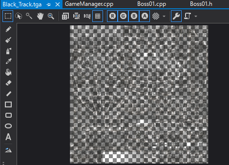

[OpenGL 3D 2021後期 第06回(マップエディタ編)]

# ボスを作る

## 習得目標

* ボス敵を登場させる。
* 強力な攻撃を作成できるようになる。
* ポインタには「メンバ関数ポインタ」という種類があることを覚える。

## 1. ボス敵を作る

### 1.1 強そうな戦車モデルを追加する

現在、敵としてT-34戦車を登場させています。T-34戦車は、ザコ敵としては十分役に立つとしても、ボス敵にするにはインパクトに欠けます。

そこで、T-34よりずっと強そうなモデルを追加し、さらに、強力な撃手段を作成することで、倒しがいのあるボス敵に仕上げようと思います。

ブラウザでユニティアセットストアを開き、`Sci-fi Military Pack Pro - RTS Games - Demo`というアセットをマイアセットに追加してください。

<p align="center">

</p>

ユニティで適当なプロジェクトを開き、追加したアセットをインポートしてください。次にエクスプローラーで、アセットをインポートしたユニティプロジェクトのフォルダを開いてください。

目的のFBXファイルは

`ユニティプロジェクトのフォルダ\Assets\IndieGameModels\Black Track`

というフォルダにあります。テクスチャはこのフォルダの中の`Materials`というフォルダにあります。

Visual Studioを開き、`Black Track.FBX`という名前のファイルをVisual Studioにドラッグ&ドロップしてください。

これまで使ってきたタイガーIやT=34のモデルは下向きで作られていましたが、このSF戦車モデルは右向きで作られています。モデルの向きが揃っていないとプログラムが面倒になるので、向きを揃えましょう。

ウィンドウ左側にある「ドキュメントアウトライン」を選択すると、モデルのパーツがツリー表示されます(①)。ツリーにある`RootNode`を選択してください(②)。

<p align="center">

</p>

次に右下にある「プロパティ」ウィンドウを見てください(表示されていない場合は「スパナアイコン」をクリック)。

<p align="center">

</p>

プロパティウィンドウ内の「回転」項目にある「＋」アイコンをクリックすると、軸ごとの回転が表示されます(①)。Y軸に`90`を入力して`Enter`を押してください(②)。これでモデルが下を向いたと思います。

`Black Track.FBX`タブをクリックしてアクティブ化したら、メニューから「ファイル→名前を付けて～を保存」をクリックし、Visual Studioプロジェクトの`Res`フォルダに`OBJ`ファイルとして保存してください。

### 1.2 テクスチャを修正する

続いてテクスチャを変換します。アセットの`Materials`フォルダを開き、`Black_Track.tga`というファイルをVisual Studioにドラッグ&ドロップしてください。

この画像を開くと、次のように半透明になっていることが分かります。これは、アルファ値を透明度以外の用途で使っているためです。

<p align="center">

</p>

このアルファ値を使うには専用のシェーダを書く必要がありますが、このモデルのためだけに書くのは面倒です。そこで、今回は単にアルファ値を消すことにします。

また、このファイルのサイズは16MBもあります。ちょっと大きすぎるので、まず画像サイズを小さくしましょう。右側のプロパティウィンドウの「幅」の欄に`512`と入力して`Enter`を押してください。

<p align="center">

</p>

これで画像サイズが`512x512`になります。元のサイズが`2048x2048`なので、16分の1にすることができました。

次にウィンドウの左側にある「鉛筆」アイコンをクリックしてください。すると、プロパティウィンドウの表示が変化します。

<p align="center">

</p>

プロパティウィンドウを下にスクロールすると、「幅」と「チャネル」という項目が表示されます。

<p align="center">

</p>

「幅」はペンの太さです。今回は全体を塗りつぶすので、最大値の`100`を入力してください(①)。次に「チャネル」という文字列をクリックします。するとチャネル設定が展開されます。

チャネル設定の「表示」列は、その色要素を表示するかどうか、「描画」列は、その色要素に書き込むかどうか、を示します。

今回はアルファ値だけを操作したいので、「描画」列の赤、緑、青のチェックを外し、アルファだけチェックを入れた状態にしてください(③)。

チャネルの設定をしたら、画像の上でペンをドラッグしてアルファに色を塗ってください。すると、塗った部分が不透明になります。透明な部分がなくなるように、画像全体を塗りつぶしてください。

<p align="center">
<br>
[全体を塗りつぶしたところ]
</p>

全体を塗りつぶしたら、メニューから「ファイル→名前を付けて～を保存」を選択してください。そして、Visual Studioの`Res`フォルダにファイルを保存してください。

これでテクスチャの変換は完了です。

### 1.3 マップエディタにボスを追加する

変換したボス用モデルをマップエディタに組み込みましょう。`MapEditor.cpp`を開き、イニットアクターリスト関数にある`objectList`配列に次のプログラムを追加してください。

```diff
       ActorType::t34tank, "T-34",
       "Res/T34.obj", "Res/T-34.tga",
       Box{glm::vec3(-1.5f, 0, -1.5f), glm::vec3(1.5f, 2, 1.5f)} },
+    {
+      ActorType::t34tank, "Boss01",
+      "Res/Black Track.obj", "Res/Black_Track.tga",
+      Box{glm::vec3(-3.0f, 0, -3.0f), glm::vec3(3.0f, 2.5f, 3.0f)} },
     {
       ActorType::player, "Tiger-I",
       "Res/Tiger_I.obj", "Res/PzVl_Tiger_I.tga",
```

まだボス用のクラスを定義していないので、とりあえずT-34と同じタイプとして作成しておきます。

プログラムが書けたら、`Main.cpp`をマップエディタモードに書き換えてから、ビルドして実行してください。作成したボス用モデルが使えるようになっていたら成功です。

<pre class="tnmai_assignment">
<strong>【課題01】</strong>
マップをロードし、ボス用モデルを1両、マップの一番上(奥)のあたりに配置し、セーブしなさい。
</pre>

### 1.4 ボスクラスを作成する

ボスの動作を作成しましょう。ボスはあまり動かず、そのかわりに強力な攻撃をしてくるようにします。

プロジェクトの`Src`フォルダに`Boss01.h`というファイルを追加してください。追加したファイルを開き、次のプログラムを追加してください。

```diff
+/**
+* @file Boss01.h
+*/
+#ifndef BOSS01_H_INCLUDED
+#define BOSS01_H_INCLUDED
+#include "../Actor.h"
+#include <functional>
+
+/**
+* ステージ1のボス敵
+*/
+class Boss01 : public Actor
+{
+public:
+  Boss01(const glm::vec3& position, const glm::vec3& scale,
+    float rotation, const std::shared_ptr<Actor>& target);
+  virtual ~Boss01() = default;
+  virtual std::shared_ptr<Actor> Clone() const override {
+    return std::shared_ptr<Actor>(new Boss01(*this));
+  }
+
+  virtual void OnUpdate(float deltaTime) override;
+  virtual void OnCollision(const struct Contact& contact) override;
+  void SetTarget(std::shared_ptr<Actor> t) { target = t; }
+
+private:
+  // 動作モード
+  void Idle(float deltaTime);
+  void Dannmaku(float deltaTime);
+  void Machinegun(float deltaTime);
+  void Missle(float deltaTime);
+
+  using ModeFunc = void(Boss01::*)(float); // メンバ関数ポインタ型
+  ModeFunc mode &Boss01::Idle; // 現在の動作モード
+
+  std::shared_ptr<Actor> target;   // 攻撃対象
+  float modeTimer = 0;   // 現在の動作モードが終了するまでの秒数
+  float shotTimer = 0;   // 次の弾を発射するまでの秒数
+  int shotDirection = 0; // 弾幕の発射方向(度)
+  int ammo = 0;          // マシンガンの連続発射数
+};
+
+#endif // BOSS01_H_INCLUDED
```

`ModeFunc`(モードファンク)は「メンバ関数へのポインタ」型です。C++が作られたとき、関数ポインタ型を無理やり拡張したため、メンバ関数へのポインタはちょっと不思議な構文になっています。

### 1.5 コンストラクタを定義する

続いて、プロジェクトの`Res`フォルダに`Boss01.cpp`というファイルを追加してください。追加したファイルを開き、次のプログラムを追加してください。

```diff
+/**
+* @file Boss01.cpp
+*/
+#include "Boss01.h"
+#include "BulletActor.h"
+#include "../GameEngine.h"
+#include "../GameManager.h"
+#include <glm/gtc/matrix_transform.hpp>
+#include <math.h>
```

最初にコンストラクタを定義します。`math.h`のインクルード文の下に、次のプログラムを追加してください。

```diff
 #include "../GameManager.h"
 #include <glm/gtc/matrix_transform.hpp>
 #include <math.h>
+
+/**
+* コンストラクタ
+*/
+Boss01::Boss01(const glm::vec3& position, const glm::vec3& scale,
+  float rotation, const std::shared_ptr<Actor>& target) :
+  Actor("Boss01",
+    GameEngine::Get().GetPrimitive("Res/Black_Track.obj"),
+    GameEngine::Get().LoadTexture("Res/Black_Track.tga"),
+    position, scale, rotation, glm::vec3(0)),
+  target(target)
+{
+  health = 50;
+  mass = 200'000;
+  collider = Box::Create(glm::vec3(-3, 0, -3), glm::vec3(3, 2.5f, 3));
+}
```

プレイヤーアクターと同様に、プリミティブとテクスチャはここで指定しています。体力はちょっと多めに`50`としました。また、この戦車はかなり大きいので、重量は`200t`にしてみました。まあ、ボスですからね。

### 1.6 OnUpdate関数を定義する

次に、オンアップデート関数を定義します。コンストラクタの定義の下に、次のプログラムを追加してください。

```diff
   // 最初は待機モード
   mode = [this](float dt) { Idle(dt); };
 }
+
+/**
+* アクターの状態を更新する
+*
+* @param deltaTime 前回の更新からの経過時間(秒)
+*/
+void Boss01::OnUpdate(float deltaTime)
+{
+  // 現在の動作モードを実行
+  (this->*mode)(deltaTime);
+}
```

オンアップデート関数では現在の動作モードとして設定されている関数を呼び出すだけです。動作モードごとの更新処理は、動作モードに対応するメンバ関数が行います。

メンバ関数ポインタを関数として実行するには、ポインタ変数の前に`this->*`を付けます。
`->*`の部分は「メンバーへのポインタ」演算子と呼ばれます。

また、「メンバーへのポインタ」演算子より、「関数呼び出し演算子」(`()`のこと)のほうが優先順位が高いため、`->*`を優先させるにはカッコで囲う必要があります。

そのため、メンバ関数ポインタの呼び出しは常に上記のように書くことになります。

>メンバ関数ポインタを使う機会はそれほどないので、「そういうこともできる」程度の理解で十分です。もしまた必要になったときは「メンバ関数ポインタ」で検索してください。

### 1.7 OnCollision関数を定義する

続いて、オンコリジョン関数を定義します。オンアップデート関数の定義の下に、次のプログラムを追加してください。

```diff
   // 現在の動作モードを実行
   mode(deltaTime);
 }
+
+/**
+* 衝突を処理する
+*
+* @param contact 衝突情報
+*/
+void Boss01::OnCollision(const struct Contact& contact)
+{
+  if (contact.b->name == "Bullet") {
+    health -= 1;
+    if (health <= 0) {
+      isDead = true; // ボス戦車を消去する
+      GameManager::Get().AddScore(2000);
+    }
+    contact.b->isDead = true; // 弾を消去する
+  }
+}
```

オンコリジョン関数の内容は、T-34戦車とほとんど同じです。ただし、点数は`2000`点と少し高くしました。ボスですからね。

パブリックメンバ関数のて意義はこれで完了です。

### 1.8 Idle関数を定義する

それではプライベートメンバ関数を定義しましょう。オンコリジョン関数の定義の下に、次のプログラムを追加してください。

```diff
     contact.b->isDead = true; // 弾を消去する
   }
 }
+
+/**
+* 待機モードの更新
+*/
+void Boss01::Idle(float deltaTime)
+{
+  // 攻撃対象がいなければ待機モードを継続
+  if (!target) {
+    return;
+  }
+
+  // 攻撃対象が一定距離に近づいたら弾幕モードに切り替える
+  const float maxViewLength = 40.0f; // 攻撃対象を発見できる距離(m)
+  const glm::vec3 d = target->position - position;
+  if (glm::dot(d, d) < maxViewLength * maxViewLength) {
+    // 弾幕モードの準備
+    modeTimer = 10.0f;
+    shotTimer = 0.2f;
+    shotDirection = 0;
+    mode = &Boss01::Danmaku;
+  }
+}
```

### 1.9 弾を発射する関数を定義する

プライベートメンバ関数の定義を続ける前に、弾を発射する関数を定義しておきます。このボスはさまざまな攻撃方法を持っているので、弾を発射するたびにアクターを作成する処理を書いているとキリがありません。

アイドル関数の定義の下に、次のプログラムを追加してください。

```diff
     mode = [this](float dt) { Danmaku(dt); };
   }
 }
+
+/**
+* 通常弾を発射する
+*
+* @param engine ゲームエンジン
+* @param position 弾の発射位置
+* @param velocity 弾の速度
+* @param lifespan 弾の寿命(秒)
+*/
+static void NormalShot(GameEngine& engine,
+  const glm::vec3& position,
+  const glm::vec3& velocity,
+  float lifespan = 1.5f)
+{
+  std::shared_ptr<Actor> bullet(new BulletActor{ "EnemyBullet",
+    engine.GetPrimitive("Res/Bullet.obj"),
+    engine.LoadTexture("Res/Bullet.tga"),
+    position, glm::vec3(0.25f), 0, glm::vec3(0) });
+  bullet->lifespan = lifespan;
+  bullet->velocity = velocity;
+  bullet->mass = 6;
+  bullet->friction = 0.0f;
+  bullet->collider = Box{ glm::vec3(-0.1f), glm::vec3(0.1f) };
+  engine.AddActor(bullet);
+}
```

それから、もうひとつ弾の発射関数を作成します。ノーマルショット関数の定義の下に、次のプログラムを追加してください。

```diff
   bullet->collider = Box{ glm::vec3(-0.1f), glm::vec3(0.1f) };
   engine.AddActor(bullet);
 }
+
+/**
+* 通常弾を発射する
+*
+* @param engine ゲームエンジン
+* @param position 弾の発射位置
+* @param direction 弾の発射方向(度)
+*/
+static void NormalShot(GameEngine& engine,
+  const glm::vec3& position,
+  float direction)
+{
+  // 発射方向のベクトルを計算
+  const float radians = glm::radians(direction);
+  const glm::mat4 matR = glm::rotate(glm::mat4(1), radians, glm::vec3(0, 1, 0));
+  const glm::vec3 v = matR * glm::vec4(0, 0, 1, 1);
+
+  const float speed = 20.0f;
+  NormalShot(engine, position + v, v * speed);
+}
```

こちらは最初の関数の簡易バージョンで、弾を発射する方向を指定するだけになっています。

### 1.10 Danmaku関数を定義する

ここからは、ノーマルショット関数を使って、動作モードごとに弾の発射パターンを作っていきます。まず弾幕を発射する関数を定義します。

この「弾幕モード」には、0.2秒ごとに6方向へ弾を発射するシステムが2つあります。6発発射するごとに発射方向が5度変化しますが、システムの片方は右回り、他方は左回りになっています。

2番目のノーマルショット関数の定義の下に、次のプログラムを追加してください。

```diff
   const float speed = 20.0f;
   NormalShot(engine, position + v, v * speed);
 }
+
+/**
+* 弾幕モードの更新
+*/
+void Boss01::Dannmaku(float deltaTime)
+{
+  GameEngine& engine = GameEngine::Get();
+
+  // 一定時間ごとに弾を発射
+  shotTimer -= deltaTime;
+  if (shotTimer <= 0) {
+    for (float i = 0; i < 360; i += 60) {
+      NormalShot(engine, position + glm::vec3(0, 2.8f, 0), shotDirection + i - 15);
+      NormalShot(engine, position + glm::vec3(0, 3, 0), 360 - shotDirection + i + 15);
+    }
+    shotTimer = 0.2f;
+    shotDirection = std::fmod(shotDirection + 5.0f, 360.0f);
+  }
+
+  // 一定時間が経過したらマシンガンモードに切り替える
+  modeTimer -= deltaTime;
+  if (modeTimer <= 0) {
+    // マシンガンモードの準備
+    // いきなり切り替わらないように、最初の発射タイマーは少し間隔を開ける
+    shotTimer = 3.0f;
+    ammo = 25; // マシンガンモードで発射する弾の総数
+    mode = &Boss01::Machinegun;
+  }
+}
```

弾幕モードは一定時間で次のモードに切り替わります。

### 1.11 Machinegun関数を定義する

2つめの弾の発射モードは「マシンガンモード」です。マシンガンモードでは、攻撃対象の位置に連続して5発の弾を発射しては数秒間停止する、という動作を繰り返します。

```diff
     mode = [this](float dt) { Machinegun(dt); };
   }
 }
+
+/**
+* マシンガンモードの更新
+*/
+void Boss01::Machinegun(float deltaTime)
+{
+  // 弾が残っているなら、一定時間ごとに弾を発射
+  if (target && ammo > 0) {
+    shotTimer -= deltaTime;
+    if (shotTimer <= 0) {
+      const glm::vec3 v = glm::normalize(target->position - position);
+      const float speed = 20.0f;
+      NormalShot(GameEngine::Get(), position + glm::vec3(0, 3, 0), v * speed);
+
+      --ammo;
+
+      // 残弾が5で割り切れるときは3秒待機、それ以外は0.1秒待機
+      if (ammo % 5) {
+        shotTimer += 0.1f;
+      } else {
+        shotTimer += 3.0f;
+      }
+    }
+  }
+
+  // 弾がなくなったらミサイルモードに切り替える
+  if (ammo <= 0) {
+    // ミサイルモードの準備
+    ammo = 4; // ミサイルの弾数
+    shotTimer = 3.0f;
+    mode = &Boss01::Missile;
+  }
+}
```

マシンガンモードは、指定された弾数を発射し終えたら次のモードに切り替わります。

### 1.12 Missile関数を定義する

最後は「ミサイルモード」です。このモードは一定間隔で弾を山なりに発射します。マシンガンモードの定義の下に、次のプログラムを追加してください。

```diff
     mode = [this](float dt) { Missile(dt); };
   }
 }
+
+/**
+* ミサイルモードの更新
+*/
+void Boss01::Missile(float deltaTime)
+{
+  // ミサイルが残っているなら、一定時間ごとにミサイルを発射
+  if (target && ammo > 0) {
+    shotTimer -= deltaTime;
+    if (shotTimer <= 0) {
+      const float flightTime = 3.0f; // ミサイルが飛翔する秒数
+      const float gravity = 9.8f;    // 重力
+      glm::vec3 v = target->position - position;
+      v *= 1.0f / flightTime;
+      // 鉛直投げ上げの公式からY方向の速度を計算
+      v.y = 0.5f * gravity * flightTime;
+      NormalShot(GameEngine::Get(), position + glm::vec3(0, 3, 0), v, flightTime);
+      --ammo;
+      shotTimer = 4.0f;
+    }
+  }
+
+  // ミサイルの残り弾数が0になったら弾幕モードに切り替える
+  if (ammo <= 0) {
+    // 弾幕モードの準備
+    modeTimer = 10.0f;
+    shotTimer = 0.2f;
+    shotDirection = 0;
+    mode = &Boss01::Danmaku;
+  }
+}
```

これでボスアクタークラスは完成です。

### 1.13 マップエディタにボス作成機能を追加する

作成したボスアクタークラスを、マップエディタで作成できるようにします。
`MapEditor.cpp`を開き、`Boss01.h`をインクルードしてください。

```diff
 #include "MapEditor.h"
 #include "Actor/PlayerActor.h"
 #include "Actor/T34TankActor.h"
+#include "Actor/Boss01.h"
 #include "GameEngine.h"
 #include <imgui.h>
```

次に、イニットアクターリスト関数の中の`ActorTyep`列挙型に、次のプログラムを追加してください。

```diff
   // アクターの型
   enum class ActorType {
     player,
     t34tank,
+    boss01,
     other,
   };
```

そして、ボスアクターの種類を`boss01`に変更します。`objectList`配列のボスアクターのデータを次のように変更してください。

```diff
       "Res/T34.obj", "Res/T-34.tga",
       Box{glm::vec3(-1.5f, 0, -1.5f), glm::vec3(1.5f, 2, 1.5f)} },
     {
-      ActorType::t34tank, "Boss01",
+      ActorType::boss01, "Boss01",
       "Res/Black Track.obj", "Res/Black_Track.tga",
       Box{glm::vec3(-3.0f, 0, -3.0f), glm::vec3(3.0f, 2.5f, 3.0f)} },
```

最後に、アクタータイプが`boss01`の場合のアクター作成処理を追加します。アクタータイプによって作成方法を切り替える`switch`文に、次のプログラムを追加してください。

```diff
       actor->collider = e.collider;
       actor->mass = 36'000;
       break;
+
+    case ActorType::boss01:
+      actor.reset(new Boss01(
+        glm::vec3(0), e.scale, e.rotation, nullptr));
+      actor->collider = e.collider;
+      break;

     case ActorType::other:
       actor.reset(new Actor(
```

これでマップファイルをロードしたときに、ボスアクターが作成されるようになりました。

### 1.14 ボスの攻撃対象を設定する

そうそう、ボスの攻撃対象の設定をわすれていました。<br>
`GameManager.cpp`を開き、`Boss01.h`をインクルードしてください。

```diff
 #include "Actor/PlayerActor.h"
 #include "Actor/T34TankActor.h"
 #include "Actor/ElevatorActor.h"
+#include "Actor/Boss01.h"
 #include <imgui.h>
 #include <glm/gtc/matrix_transform.hpp>
```

次に、アップデート関数の中の「敵アクターのポインタを配列にコピーする」プログラムを、次のように変更してください。

```diff
       if (e->name == "T-34") {
         T34TankActor& enemy = static_cast<T34TankActor&>(*e);
         enemy.SetTarget(playerTank);
         enemies.push_back(e);
+      } else if (e->name == "Boss01") {
+        Boss01& enemy = static_cast<Boss01&>(*e);
+        enemy.SetTarget(playerTank);
+        enemies.push_back(e);
       }
     }
```

これでボスに攻撃対象を設定することができました。

プログラムが書けたら、マップエディタモードを`false`にして、ビルドして実行してください。ボスが登場し、強力な攻撃を仕掛けてきたら成功です。

<p align="center">

</p>

<pre class="tnmai_assignment">
<strong>【課題02】</strong>
<code>Boss01</code>クラスのオンアップデート関数に、ボスを移動させるプログラムを追加しなさい。仕様は次のとおりとします。
1. プレイヤーの方向に旋回(2秒程度)
2. 向いている方向に10m移動(所要時間5秒程度)
3. 2秒待機
4. マップに配置されたときの位置にバックで戻る(所要時間5秒程度)
5. 1に戻る
</pre>

>**【1章のまとめ】**<br>
>
>* ボスは強そうな見た目のほうがそれっぽい。
>* モデルの向きを他のモデルと統一しておくと、プログラムを書くときに方向を気にしなくて済むので便利。
>* 「弾を発射する」のようによく使う処理は、関数にしておくと便利。
>* メンバ関数ポインタを使うことで、アクターの動作状態を簡単に切り替えることができる。
