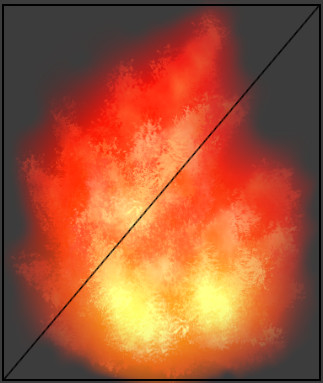
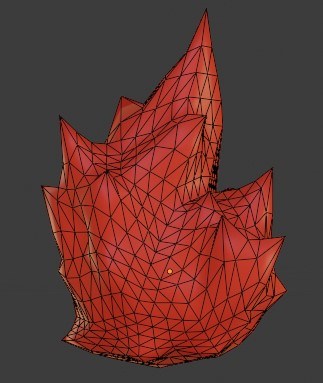
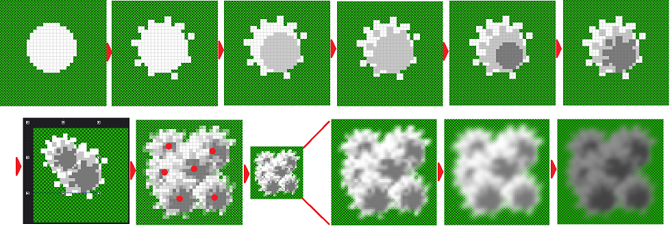
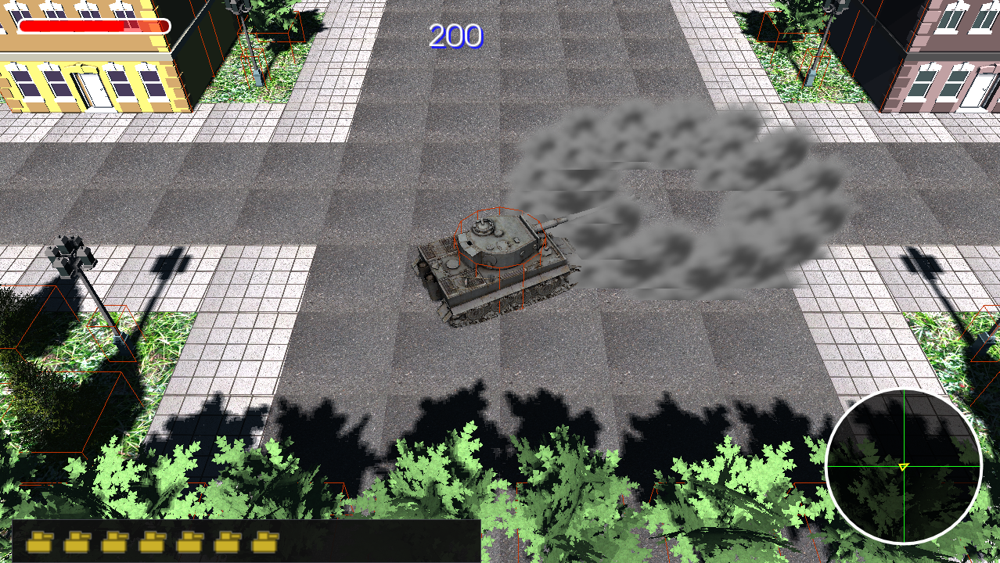
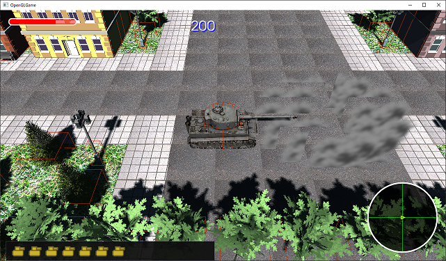
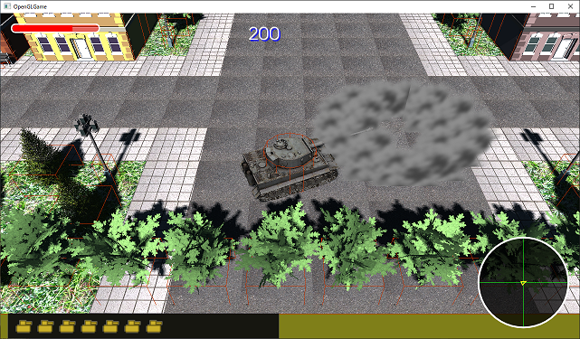
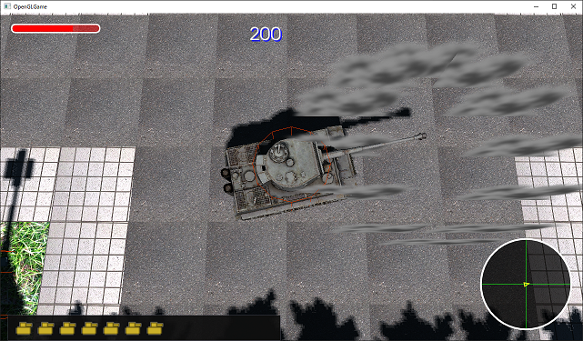
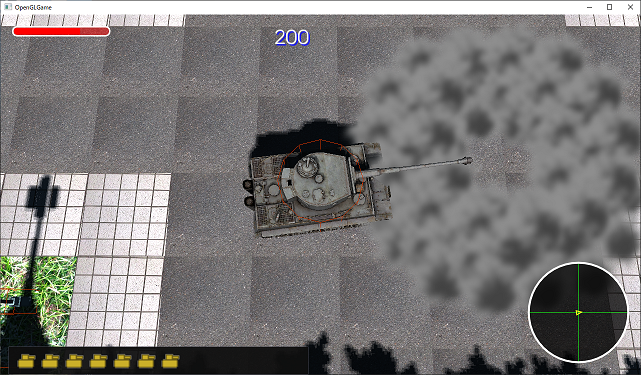

[OpenGL 3D 2021後期 第07回]

# 爆発とスプライト

## 習得目標

* バッファオブジェクトの内容を書き換えられる。
* スプライトを頂点データに変換できる。
* 逆行列を使って回転を打ち消す方法が分かる。

## 1. スプライト

### 1.1 画像による不定形の物体の表現

ゲームでは炎や煙、血しぶきといった演出効果がよく使われます。しかし、これらは決まった形を持たないために3Dモデルを作れなかったり、大量に表示する必要があるために本来の複雑な形状を3Dモデル化しにくかったりします。

そこで昔の人は考えました。

>「3Dモデルにできないのなら、2D画像で表示すればいいじゃない。」

こうして、決まった形を持たない物体は「ビルボード」または「スプライト」という技術で表示されるようになったのです。

<p align="center">
&emsp;&emsp;&emsp;&emsp;&emsp;&emsp;<br>
[2D画像の炎]&emsp;&emsp;&emsp;&emsp;&emsp;&emsp;&emsp;&emsp;[3Dモデルの炎]
</p>

>**【スプライトの過去・現在・未来】**<br>
>スプライト機能は、1970年代にアーケードゲーム用のハードウェアとして開発されました。その後、プレイステーションやセガサターンなど初期の3Dグラフィックスハードウェアが登場しましたが、限られた3D性能で少しでも見た目を良くするためにはスプライト機能は不可欠でした。<br>
>ハードウェアの性能が格段に進歩した2020年代に入っても、いまだに炎や煙といった物体にはスプライトが使用されています。しかし、計算によってリアルタイムに3Dの雲や炎を描画するアプリケーションも増えています。とはいえ、スプライトにはアーティストが扱いやすいなどの利点もあるため、当分のあいだは使われ続けると考えられます。

### 1.2 VBOを更新する方法について

3Dグラフィックスハードウェアには、2Dグラフィックスハードウェアのようなスプライト機能は搭載されていません。四角いプリミティブにテクスチャを貼り付けて表示すればスプライトと同じ表現ができるからです。

問題は「同じ表現ができるけれども、3Dと同じ描画方法では効率が悪い」ということです。GPUにとって `glDrawArrays`や`glDrawElements`といった描画関数の呼び出しは時間がかかる処理です。そのため、多数のスプライトを1枚ずつ描画するのはあまり得意ではありません。

そこで、多数のスプライトをひとつのプリミティブにまとめて、一度の描画関数呼び出しで描画するようにします。しかし、スプライトは自由に移動できるべきですし、新しく作られたり削除されれたりして数が変わることもあるでしょう。

このため、初期化時点でプリミティブを作っておくことはできず、スプライトの状態が変化するたびに作り直さなくてはなりません。つまり`VBO`を更新するか、または作り直す必要があるわけです。

OpenGLにおいて、`VBO`を更新する方法は複数存在します。

1. 古い`VBO`を破棄し、新しい`VBO`を作成して置き換える(オルファン(孤児)化)。
2. `glBufferSubData`、`glCopyBufferSubData`によって`VBO`を上書きする。
3. `glMapBuffer`によって`VBO`への書き込みポインタを取得し、`VBO`を上書きする。

これらのうち、どの方法が最善かはGPU、ドライバ、実際にやりたいこと、によって異なります。一時期NVidia社は4の`glMapBuffer`を推奨していましたが、以下のサイトによると2015年の時点では2のほうが高速なようです。

>「glMapBuffer No Longer Cool(もはやglMapBufferは良い選択ではない)」<br>
>`http://hacksoflife.blogspot.com/2015/06/glmapbuffer-no-longer-cool.html`

また、上記サイトに2017年に書き込まれたコメントによると、1の方法が優れているという調査結果が出ています。

>Daniel3/22/2017 3:28 PM<br>
>「単純な用途、少なくとも定期的に更新される小さなUBOの場合は、glBufferData()が最適のようです。」<br>
>`So for a simple solution it seems like glBufferData() is best, at least for frequently updated small UBOs.`

以下のサイトでは、2015年当時のいくつかのGPUにおける更新処理の性能を比較しています。

`https://www.cppstories.com/2015/01/persistent-mapped-buffers-benchmark/`

GPUによって最適な手法が異なっているのが分かるでしょう。とはいえ、いくつかの例外はあるものの、三角形2000個を表示するテストでは手法による差はそれほど大きくありません。

この「ある程度の負荷がかかる状況では、どの手法でも大差ない」という傾向は、2021年現在においてもあまり変わっていないと予想されます。

長い前置きでしたが、これらのことを踏まえて今回は2の方法を選ぶことにしました。理由は、既に`Primitive.cpp`に実装済みの`CopyData`関数を流用できるからです。

>もちろん、理想的な実装では「効率的な2～3種類の手法を実装し、GPU、ドライバによって切り替える」ことになるでしょう。

### 1.3 スプライトクラスを作成する

スプライトの表示は以下の手順で作成します。

>1. スプライトを表すクラスを作成する。
>2. スプライトを描画するクラスを作成する。
>3. ゲームエンジンにスプライトを描画する機能を実装する。

スプライトには専用のレイヤーを割り当てることにします。`Actor.h`を開き、レイヤー列挙型を次のように変更してください。

```diff
 enum class Layer
 {
   Default,
+  Sprite,
   UI,
 };
-static const size_t layerCount = 2; // レイヤー数
+static const size_t layerCount = 3; // レイヤー数

 /**
 * シェーダの種類
```

それでは、スプライトを表すクラスを作成しましょう。プロジェクトの`Src`フォルダに`Sprite.h`という名前のファイルを追加してください。追加したファイルを開き、次のプログラムを追加してください。

```diff
+/**
+* @file Sprite.h
+*/
+#ifndef SPRITE_H_INCLUDED
+#define SPRITE_H_INCLUDED
+#include "Actor.h"
+
+/**
+* スプライト
+*/
+class Sprite : public Actor
+{
+public:
+  Sprite(const glm::vec3& position, std::shared_ptr<Texture> tex,
+    const glm::vec2& uv0 = glm::vec2(0), const glm::vec2& uv1 = glm::vec2(1),
+    float pixelsPerMeter = 100.0f);
+  virtual ~Sprite() = default;
+  Sprite(const Sprite&) = default;
+  Sprite& operator=(const Sprite&) = default;
+
+  virtual std::shared_ptr<Actor> Clone() const {
+    return std::make_shared<Sprite>(*this);
+  }
+
+  glm::vec2 uv0 = glm::vec2(0); // 画像の左下テクスチャ座標
+  glm::vec2 uv1 = glm::vec2(1); // 画像の右上テクスチャ座標
+  float pixelsPerMeter = 100.0f;
+};
+
+#endif // SPRITE_H_INCLUDED
```

スプライトに必要とされる基本的な機能は、アクタークラスとあまり変わりません。そこで、アクターの派生クラスとして作成することにしました。

スプライトは固有のプリミティブを持たないため、アクタークラスのプリミティブ関連のメンバは無駄になってしまいますが、それほど大きな問題にはならないでしょう。

>これが気になる場合は、アクタークラスにはプリミティブとスプライトの両方に必要なメンバだけを残し、プリミティブに関するメンバは「メッシュアクター」など派生クラスに実装するとよいでしょう。

次に、プロジェクトの`Src`フォルダに`Sprite.cpp`という名前のファイルを作成してください。作成したファイルを開き、次のプログラムを追加してください。

```diff
+/**
+* @file Sprite.cpp
+*/
+#include "Sprite.h"
+#include <glm/gtc/matrix_transform.hpp>
+#include <algorithm>
+#include <iostream>
+
+/**
+* コンストラクタ
+*
+* @param position       スプライトの座標
+* @param tex            スプライトとして表示する画像
+* @param uv0            画像として表示する範囲の左下座標
+* @param uv1            画像として表示する範囲の右上座標
+* @param pixelsPerMeter 1mごとのピクセル数
+*                       例えばこの値が50の場合、300x200ピクセルの画像は
+*                       6x4mの大きさで表示される
+*/
+Sprite::Sprite(const glm::vec3& position, std::shared_ptr<Texture> tex,
+  const glm::vec2& uv0, const glm::vec2& uv1, float pixelsPerMeter) :
+  Actor("Sprite", Primitive(), tex, position, glm::vec3(1), 0, glm::vec3(0)),
+  uv0(uv0), uv1(uv1), pixelsPerMeter(pixelsPerMeter)
+{
+  layer = Layer::Sprite;
+}
```

### 1.4 スプライトを描画するクラスを定義する

続いて、スプライトを描画するクラスを作成します。クラス名は`SpriteRenderer`(スプライト・レンダラー)とします。`Sprite.h`を開き、スプライトクラスの定義の下に、次のプログラムを追加してください。

```diff
   glm::vec2 uv1 = glm::vec2(1); // 画像の右上テクスチャ座標
   float pixelsPerMeter = 100.0f;
 };
+
+/**
+* スプライトを描画するクラス
+*/
+class SpriteRenderer
+{
+public:
+  SpriteRenderer() = default;
+  ~SpriteRenderer() { Deallocate(); }
+  SpriteRenderer(const SpriteRenderer&) = delete;
+  SpriteRenderer& operator=(const SpriteRenderer&) = delete;
+
+  // バッファの管理
+  bool Allocate(size_t maxSpriteCount);
+  void Deallocate();
+
+  // プリミティブの更新
+  void Update(const std::vector<std::shared_ptr<Actor>>& sprites,
+    const glm::mat4& matView);
+
+  // プリミティブの描画
+  void Draw(std::shared_ptr<ProgramPipeline> pipeline,
+    const glm::mat4& matVP) const;
+
+private:
+  // バッファ
+  GLuint ibo = 0;
+  struct Buffer {
+    GLuint vbo = 0;
+    GLuint vao = 0;
+    GLsync sync = 0;
+  } buffer[3];
+  size_t maxSpriteCount = 0; // 描画できる最大スプライト数
+  size_t updatingBufferIndex = 0; // 更新するバッファの番号
+
+  // プリミティブの描画情報
+  struct Primitive {
+    GLsizei count;    // インデックス数
+    GLint baseVertex; // インデックス0に対応する頂点データの位置
+    std::shared_ptr<Texture> texture; // 描画に使うテクスチャ
+  };
+  std::vector<Primitive> primitives; // プリミティブ配列
+};

 #endif // SPRITE_H_INCLUDED
```

`GLsync`(ジーエル・シンク)は「<ruby>同期<rt>どうき</rt></ruby>オブジェクト」を管理するための型です。同期オブジェクトは、GPUの処理の進行状況をCPU側で検出するための機能です。

### 1.5 Allocate(アロケート)メンバ関数を定義する

ここからはメンバ関数を定義していきますが、その前に、アロケート関数で使ういくつかの関数と変数、そして構造体を定義します。`Sprite.cpp`を開き、スプライトクラスのコンストラクタ定義の下に、次のプログラムを追加してください。

```diff
   uv0(uv0), uv1(uv1), pixelsPerMeter(pixelsPerMeter)
 {
 }
+
+/**
+* VAOに頂点アトリビュートを設定する
+*/
+void SetVertexAttribute(GLuint vao, GLuint index, 
+  GLint size, GLenum type, GLboolean normalized,
+  GLuint relativeOffset, GLuint bindingPoint)
+{
+  glEnableVertexArrayAttrib(vao, index);
+  glVertexArrayAttribFormat(vao, index, size, type, normalized, relativeOffset);
+  glVertexArrayAttribBinding(vao, index, bindingPoint);
+}
+
+/**
+* スプライト用の頂点データ
+*/
+struct SpriteVertex
+{
+  glm::vec3   position;
+  glm::u8vec4 color;
+  glm::vec2   texcoord;
+};
```

`SetVertexAttribute`(セット・バーテックス・アトリビュート)は、頂点アトリビュートを設定する関数です。`Primitive.cpp`の`CreateVertexArray`関数では、同じコードを何度も書いてもらいましたが、今回は最初から関数を定義します。

>`CreateVertexArray`関数の頂点アトリビュートの設定も、同様に関数化するとプログラムが読みやすくなるでしょう。

`SpriteVertex`(スプライト・バーテックス)構造体は、スプライト用の頂点データを表します。今回作成するスプライトでは法線を設定しません。

スプライトの色データには`glm::u8vec4`(ジーエルエム・ユー・エイト・ベク・フォー)型を使うことにしました。`u8`は「8ビットの符号なし整数」を表します。`glm::vec4`に使われる`float`型は32ビットなので、必要なメモリが1/4で済みます。

これによって、描画処理が高速化されます。その代わり、表現できる範囲が`0.0～1.0`に制限されます。しかし、マイナスの色や`1.0`より大きい色を指定することはまれなため、これが問題になることはほぼないはずです。

それでは、`Allocate`(アロケート)メンバ関数を定義しましょう。アロケート関数は、スプライトの描画で使用するOpenGLのオブジェクト(`VBO`, `IBO`, `VAO`)を作成する関数です。

この関数は長めなので、少しずつ書いていきます。スプライトバーテックス構造体の定義の下に、次のプログラムを追加してください。

```diff
   glm::u8vec4 color;
   glm::vec2   texcoord;
 };
+
+/**
+* スプライト用のバッファオブジェクトを作成する
+*
+* @param maxSpriteCount 格納可能な最大スプライト数
+*
+* @retval true  確保成功
+* @retval false 確保失敗、または既に確保済み
+*/
+bool SpriteRenderer::Allocate(size_t maxSpriteCount)
+{
+  // 最後のvaoが存在する場合は作成済み
+  if (buffer[std::size(buffer) - 1].vao) {
+    std::cerr << "[警告]" << __func__ << ": バッファは作成済みです\n";
+    return false;
+  }
+
+  return true;
+}
```

関数の最初で、バッファが作成済みかどうかを調べます。初期化済みの状態でアロケート関数が呼ばれるのはバグの可能性があることと、既に初期化されている状態でもう一度初期化を行うと、正しく動作しない可能性があるためです。

ここでは、`std::size`関数で配列の要素数を取得し、「要素数-1」を添え字とすることで、配列の最後の要素を参照しています。`std::size`を使うことで、もし配列の要素数が変更されても最後の要素を参照することを保証できます。

次に`IBO`を作成します。IBOのデータはこの時点で作成します。スプライトはすべて同じ四角形の集合なので、インデックスの順序は変化しないからです。バッファの作成済み判定の下に、次のプログラムを追加してください。

```diff
     std::cerr << "[警告]" << __func__ << ": バッファは作成済みです\n";
     return false;
   }
+
+  // IBOを作成
+  const size_t maxVertexNo = std::min<size_t>(maxSpriteCount * 4, 65536);
+  std::vector<GLushort> indices(maxVertexNo / 4 * 6);
+  GLushort vertexNo = 0;
+  for (size_t indexNo = 0; indexNo < indices.size(); indexNo += 6) {
+    // 三角形1個目
+    indices[indexNo + 0] = vertexNo + 0;
+    indices[indexNo + 1] = vertexNo + 1;
+    indices[indexNo + 2] = vertexNo + 2;
+
+    // 三角形2個目
+    indices[indexNo + 3] = vertexNo + 2;
+    indices[indexNo + 4] = vertexNo + 3;
+    indices[indexNo + 5] = vertexNo + 0;
+
+    vertexNo += 4;
+  }
+  ibo = GLContext::CreateBuffer(
+    indices.size() * sizeof(GLushort), indices.data());

   return true;
 }
```

`maxVertexNo`(マックス・バーテックス・ナンバー)変数は、一つのプリミティブに指定できる頂点データの最大値を表します。スプライト1個につき頂点4個が必要なので、これは`maxSpriteCount * 4`となります。

ただし、インデックスデータの型が`GLushort`の場合、インデックスに指定できる値は`0～65535`の範囲、つまり`65536`個に制限されます。そこで、`std::min`によって最大値を`65536`個に制限しています。

また、スプライト1個は三角形2個で構成されるので、必要なインデックスデータ数は`3 * 2 = 6`個です。そのため、作成するインデックスデータの数は`maxVertexNo / 4 * 6`となります。

作成するデータ数が決まったら、`for`ループによって必要なデータを作成します。スプライト1個につき頂点は4個あるので、`i`番目のスプライトの頂点データは`i * 4`番目から`i * 4 + 3`番目の範囲となります。

スプライト1個につきインデックスデータは6個あるので、`i`番目のスプライトのインデックスデータは`i * 6`番目から`i * 6 + 5`番目の範囲となります。

インデックスデータが完成したら、クリエイトバッファ関数で`IBO`を作成します。

次に`VBO`を作成します。`IBO`を作成するプログラムの下に、次のプログラムを追加してください。

```diff
   ibo = GLContext::CreateBuffer(
     indices.size() * sizeof(GLushort), indices.data());
+
+  // VBOを作成
+  const GLsizei vboSize = sizeof(SpriteVertex) * maxSpriteCount * 4;
+  for (Buffer& e : buffer) {
+    e.vbo = GLContext::CreateBuffer(vboSize, nullptr);
+  }

   return true;
 }
```

頂点データはスプライトを描画するときにはじめて作成するので、ここでは`nullptr`を指定しています。

ここで重要なことは、`VBO`と`VAO`が2つずつ作成される点です。これは「ダブル・バッファリング」という技法を使うためです。

>**【ダブル・バッファリングが必要な理由】**<br>
>`glDrawElements`などの描画関数を実行したとき、指定したプリミティブが即座に描画されるわけではありません。通常は描画命令だけがGPUに送られ、GPUは送られてきた命令を順番に実行します。
>これは、CPUとGPUを同時に動かすための工夫です。しかし、この工夫の結果、GPUによる描画命令の実行が完了する前にバインドしている`VBO`を上書きしてしまうと、正しい描画結果が得られません。
>そのため、`VBO`の更新は、GPUが描画命令を完了するまで待つ必要があります。描画が完了するまで、CPUはじっと待っていなくてはなりません。これでは効率が悪すぎます。
>そこで、2つの`VBO`を用意して、一方の`VBO`を描画中に、他方の`VBO`を更新します。これによって、CPUはGPUの命令実行完了を待つことなく、すぐに`VBO`を更新できます。

続いて`VAO`を作成します。`VBO`を作成するプログラムの下に、次のプログラムを追加してください。

```diff
   for (Buffer& e : buffer) {
     e.vbo = GLContext::CreateBuffer(vboSize, nullptr);
   }
+
+  // VAOを作成
+  const GLuint bindingPoint = 0;
+  for (Buffer& e : buffer) {
+    glCreateVertexArrays(1, &e.vao);
+    glVertexArrayElementBuffer(e.vao, ibo);
+    glVertexArrayVertexBuffer(
+      e.vao, bindingPoint, e.vbo, 0, sizeof(SpriteVertex));
+
+    // 座標の頂点アトリビュートを設定
+    SetVertexAttribute(e.vao, 0, 3, GL_FLOAT, GL_FALSE,
+      offsetof(SpriteVertex, position), bindingPoint);
+
+    // 色の頂点アトリビュートを設定
+    SetVertexAttribute(e.vao, 1, 4, GL_UNSIGNED_BYTE, GL_TRUE,
+      offsetof(SpriteVertex, color), bindingPoint);
+
+    // テクスチャ座標の頂点アトリビュートを設定
+    SetVertexAttribute(e.vao, 2, GL_FLOAT, GL_FALSE,
+      offsetof(SpriteVertex, texcoord), bindingPoint);
+  }

   return true;
 }
```

頂点アトリビュートの設定では`offsetof`(オフセット・オブ)というマクロを使っています。

<pre class="tnmai_code"><strong>【書式】</strong>
メンバのオフセット offsetof(構造体の名前, メンバ変数の名前)
</pre>

オフセットオブマクロは、第2引数で指定したメンバ変数が、構造体の先頭から何バイト目にあるか(オフセット)を返します。オフセットオブマクロを使うことで、データの正確な位置をGPUに伝えることができます。

それから、色の頂点アトリビュートの設定について、値を正規化するためにノーマリゼーションを`GL_TRUE`にしている点に注意してください。

`u8`の値は`0～255`なので、そのままでは`float`型の値と範囲が一致しません。これはシェーダーを共通化するときに問題となります。そこで、正規化を有効にします。

正規化を有効にすると、`0～255`の範囲を`0.0～1.0`の範囲の浮動小数点数に変換してからシェーダーに送られます(計算は`255`で割るだけ)。これによって、常に`float`型を想定してシェーダーを書くことができます。

最後にプリミティブ配列のサイズを予約し、最大スプライト数を記録します。`VAO`を作成するプログラムの下に、次のプログラムを追加してください。

```diff
     SetVertexAttribute(e.vao, 2, GL_FLOAT, GL_FALSE,
       offsetof(SpriteVertex, texcoord), bindingPoint);
   }
+
+  primitives.reserve(1000);
+  this->maxSpriteCount = maxSpriteCount;

   return true;
 }
```

これでアロケート関数は完成です。

### 1.6 Deallocate(デアロケート)メンバ関数を定義する

次はデアロケート関数を定義します。アロケート関数の定義の下に、次のプログラムを追加してください。

```diff
   return true;
 }
+
+/**
+* 描画データを破棄しGPUメモリを解放する
+*/
+void SpriteRenderer::Deallocate()
+{
+  primitives.clear();
+  maxSpriteCount = 0;
+  updatingBufferIndex = 0;
+
+  for (Buffer& e : buffer) {
+    glDeleteVertexArrays(1, &e.vao);
+    glDeleteBuffers(1, &e.vbo);
+    e = Buffer();
+  }
+  glDeleteBuffers(1, &ibo);
+  ibo = 0;
+}
```

デアロケート関数では、アロケートで確保したバッファオブジェクトを削除します。

### 1.7 テクスチャの幅と高さを取得できるようにする

ここでちょっと、テクスチャクラスに幅と高さを取得する機能を追加します。この機能は、このあと作成するアップデート関数で必要になります。

`Texture.h`を開き、テクスチャクラスの定義に次のプログラムを追加してください。

```diff
   // テクスチャIDを取得
   GLuint GetId() const { return id; }
+
+  // テクスチャの幅、高さを取得
+  GLint GetWidth() const { return width; }
+  GLint GetHeight() const { return height; }

 private:
   std::string name; // 画像ファイル名
   GLuint id = 0;    // オブジェクトID
+  GLsizei width = 0;  // 幅
+  GLsizei height = 0; // 高さ
 };

 #endif // TEXTURE_H_INCLUDED
 ```

次に`Texture.cpp`を開き、コンストラクタの定義に次のプログラムを追加してください。

```diff
 Texture::Texture(const char* filename)
 {
   id = GLContext::CreateImage2D(filename);
   if (id) {
     name = filename;
+    glGetTextureLevelParameteriv(id, 0, GL_TEXTURE_WIDTH, &width);
+    glGetTextureLevelParameteriv(id, 0, GL_TEXTURE_HEIGHT, &height);
     std::cout << "[情報]" << __func__ << "テクスチャ" << name << "を作成.\n";
   }
 }
```

テクスチャクラスは複数のコンストラクタを持っています。もうひとつのコンストラクタの定義に、次のプログラムを追加してください。

```diff
 Texture::Texture(const char* name, GLsizei width, GLsizei height,
   const void* data, GLenum pixelFormat, GLenum type)
 {
   id = GLContext::CreateImage2D(width, height, data, pixelFormat, type);
   if (id) {
     this->name = name;
+    this->width = width;
+    this->height = height;
     std::cout << "[情報]" << __func__ << "テクスチャ" << name << "を作成.\n";
   }
 }
```

これでテクスチャのサイズを取得できるようになりました。

>**【配列テクスチャ用コンストラクタについて】**<br>
>配列テクスチャ用のコンストラクタを定義している場合は、コンストラクタを以下のように変更してください。
>
>```diff
>   // テクスチャのピクセル形式、幅、高さを取得
>-  GLint internalFormat, width, height;
>+  GLint internalFormat;
>   glGetTextureLevelParameteriv(texList[0], 0, GL_TEXTURE_INTERNAL_FORMAT,
>     &internalFormat);
>```

### 1.8 アクターの色を表すメンバ変数を追加する

スプライトのような画像は、色を変化させることで見た目を変更できると便利です。さらに、重力の影響を制御できるとエフェクトの表現の幅が広がります。そこで、アクターの色と重力の影響度を指定する機能を追加します。

`Actor.h`を開き、アクタークラスの定義に次のプログラムを追加してください。

```diff
   glm::vec3 scale;                 // 物体の拡大縮小率
   float rotation;                  // 物体の回転角度
   glm::vec3 adjustment;            // 物体を原点に移動するための距離
+  glm::vec4 color = glm::vec4(1);  // テクスチャに合成する色
+  float gravityScale = 1;          // 重力の影響度

   glm::vec3 velocity = glm::vec3(0);// 速度(メートル毎秒)
   float lifespan = 0;              // 寿命(秒、0以下なら寿命なし)
```

`gravityScale`(グラビティ・スケール)を重力の計算に追加します。`GameEngine.cpp`を開き、アップデートアクター関数の重力計算式を次のように変更してください。

```diff
         // 速度に重力加速度を加える
         if (!actors[i].isStatic) {
-          actors[i].velocity.y += -9.8f * deltaTime;
+          actors[i].velocity.y += -9.8f * actors[i].gravityScale * deltaTime;
         }

         // アクターの位置を更新する
         actors[i].position += actors[i].velocity * deltaTime;
```

### 1.9 CopyData関数の宣言を追加する

アップデート関数では`VBO`へのコピーを行います。これには`Primitive.cpp`にあるCopyData`(コピー・データ)関数を使うのですが、当初は他のファイルから使うことを考えていませんでした。

そのため、ヘッダファイルにコピーデータ関数が宣言されておらず、他のファイルから参照できなくなっています。そこで、宣言を追加して他のファイルからも使えるようにします。`Primitive.h`を開き、次のプログラムを追加してください。

```diff
   GLsizei maxIndexCount = 0; // 格納できる最大インデックス数
   GLsizei curIndexCount = 0; // 格納済みインデックス数
 };
+
+bool CopyData(GLuint writeBuffer, GLsizei unitSize,
+  GLsizei offsetCount, size_t count, const void* data);

 #endif // PRIMITIVE_H_INCLUDED
```

これで`Primitive.h`をインクルードすれば、コピーデータ関数が使えるようになりました。

### 1.10 Update(アップデート)メンバ関数を定義する

それではアップデート関数を定義しましょう。これはスプライト・レンダラーの最も重要な関数で、スプライトデータから頂点データを作成します。`Sprite.cpp`を開き、デアロケート関数の定義の下に、次のプログラムを追加してください。

```diff
   glDeleteBuffers(1, &ibo);
   ibo = 0;
 }
+
+/**
+* 描画データを更新する
+*
+* @param sprites  更新するスプライトの配列
+* @param matView  更新に使用するビュー行列
+*/
+void SpriteRenderer::Update(
+  const std::vector<std::shared_ptr<Actor>>& sprites, const glm::mat4& matView)
+{
+  // プリミティブ配列を空にする
+  primitives.clear();
+
+  // スプライトがひとつもなければ何もしない
+  if (sprites.empty()) {
+    return;
+  }
+
+  // スプライトの数が多すぎる場合、描画するスプライト数を制限する
+  size_t spriteCount = sprites.size();
+  if (sprites.size() > maxSpriteCount) {
+    std::cerr << "[警告]" << __func__ <<
+      ": スプライト数が多すぎます(要求=" << sprites.size() <<
+      "/最大=" << maxSpriteCount << ")\n";
+    spriteCount = maxSpriteCount;
+  }
+}
```

最初にプリミティブ配列を空にします。プリミティブ配列はこのアップデート関数内で作成され、ドロー関数で使われます。スプライトがひとつもない場合はこれで関数を終了します。

スプライトがひとつ以上ある場合、さらに最大スプライト数を超えていないかをチェックします。最大スプライト数を超えたぶんは`VBO`に入り切らないためです。

次に、スプライトデータから頂点データを作成します。スプライト数を判定するプログラムの下に、次のプログラムを追加してください。

```diff
       "/最大=" << maxSpriteCount << ")\n";
     spriteCount = maxSpriteCount;
   }
+
+  // 最初のプリミティブを作成
+  primitives.push_back(Primitive{ 0, 0, sprites[0]->tex });
+
+  // スプライトデータを頂点データに変換
+  std::vector<SpriteVertex> vertices(spriteCount * 4);
+  for (int i = 0; i < spriteCount; ++i) {
+    const Sprite& sprite = static_cast<Sprite&>(*sprites[i]);
+
+    // 表示サイズを計算
+    const float sx =
+      sprite.tex->GetWidth() / sprite.pixelsPerMeter * sprite.scale.x;
+    const float sy =
+      sprite.tex->GetHeight() / sprite.pixelsPerMeter * sprite.scale.y;
+
+    // 座標変換行列を作成
+    const glm::mat4 matT = glm::translate(glm::mat4(1), sprite.position);
+    const glm::mat4 matR =
+      glm::rotate(glm::mat4(1), sprite.rotation, glm::vec3(0, 0, 1));
+    const glm::mat4 matS = glm::scale(glm::mat4(1), glm::vec3(sx, sy, 1));
+    const glm::mat4 matA = glm::translate(glm::mat4(1), sprite.adjustment);
+    const glm::mat4 matModel = matT * matR * matS * matA;
+
+    // 色をvec4からu8vec4に変換
+    const glm::u8vec4 color = glm::clamp(sprite.color, 0.0f, 1.0f) * 255.0f;
+
+    // 頂点データの格納開始位置vを計算
+    int v = i * 4;
+  } // spriteCount
 }
```

`sx`, `sy`変数は、ワールド座標系におけるスプライトの大きさです。これは、以下の式で求められます。

>テクスチャの幅・高さ ÷ ピクセル/m × アクターのスケール

回転行列を作成するとき、Z軸で回転させている点に注意してください。スプライトはXY軸平面に作られるので、Y軸ではなくZ軸で回転させる必要があります。

次に頂点データを作成します。頂点データの格納位置を計算するプログラムの下に、次のプログラムを追加してください。

```diff
     // 頂点データの格納開始位置vを計算
     int v = i * 4;
+
+    // 左下の頂点データを作成
+    vertices[v].position = matModel * glm::vec4(-0.5f, -0.5f, 0, 1);
+    vertices[v].color = color;
+    vertices[v].texcoord = sprite.uv0;
+    ++v; // 次の格納位置へ
+
+    // 右下の頂点データを作成
+    vertices[v].position = matModel * glm::vec4(0.5f, -0.5f, 0, 1);
+    vertices[v].color = color;
+    vertices[v].texcoord = glm::vec2(sprite.uv1.x, sprite.uv0.y);
+    ++v; // 次の格納位置へ
+
+    // 右上の頂点データを作成
+    vertices[v].position = matModel * glm::vec4(0.5f, 0.5f, 0, 1);
+    vertices[v].color = color;
+    vertices[v].texcoord = sprite.uv1;
+    ++v; // 次の格納位置へ
+
+    // 左上の頂点データを作成
+    vertices[v].position = matModel * glm::vec4(-0.5f, 0.5f, 0, 1);
+    vertices[v].color = color;
+    vertices[v].texcoord = glm::vec2(sprite.uv0.x, sprite.uv1.y);
   } // spriteCount
 }
```

次に、プリミティブのインデックス数を増やします。ただし、テクスチャが異なる場合は新しいプリミティブを作成します。頂点データを作成するプログラムの下に、次のプログラムを追加してください。

```diff
     vertices[v].position = matModel * glm::vec4(-0.5f, 0.5f, 0, 1);
     vertices[v].color = color;
     vertices[v].texcoord = glm::vec2(sprite.uv0.x, sprite.uv1.y);
+
+    // インデックス数を更新
+    // テクスチャが等しく、更新後のインデックス数がIBOの許容値以下なら、
+    // インデックス数を更新する。そうでなければ新しいプリミティブを追加する。
+    const int maxCountPerPrimitive = 65536 / 4 * 6;
+    Primitive& e = primitives.back();
+    if ((prim.texture == sprite.tex) &&
+      (prim.count + 6 < maxCountPerPrimitive)) {
+      prim.count += 6;
+    } else {
+      primitives.push_back(Primitive{ 6, i * 4, sprite.tex });
+    }
   } // spriteCount
 }
```

プリミティブ型の`baseVertex`(ベースバーテックス)変数は「インデックス0番とみなす頂点番号」を表します。

新規に作成したスプライトの番号は変数`i`で表され、スプライトごとに4頂点必要なので、ベースバーテックスは`i * 4`となります。

これで頂点データは作成できたので、次は頂点データを`VBO`にコピーします。ただし、描画するデータが大量にある場合、ダブルバッファリングを行っていても、まだ`VBO`が使用中になることがあります。

そこで、同期オブジェクトを使って、これから書き込む`VBO`の描画が終わっていることを確認します。これには`glClientWaitSync`(ジーエル・クライアント・ウェイト・シンク)関数を使います。

頂点データを作成するループの下に、次のプログラムを追加してください。

```diff
       primitives.push_back(Primitive{ 6, i * 4, sprite.tex });
     }
   } // spriteCount
+
+  // 書き込み先のVBOが描画に使われている場合、描画の完了を待つ
+  Buffer& buf = buffer[updatingBufferIndex];
+  if (buf.sync) {
+    const GLenum result = glClientWaitSync(buf.sync, 0, 0);
+    switch (result) {
+    case GL_ALREADY_SIGNALED:
+      // 既に完了している(正常)
+      break;
+    case GL_TIMEOUT_EXPIRED:
+      std::cerr << "[警告]" << __func__ << ":描画に時間がかかっています\n";
+      glClientWaitSync(buf.sync, 0, 1'000'000); // 最大1秒間待つ
+      break;
+    default:
+      std::cerr << "[エラー]" << __func__ << ":同期に失敗(" << result << ")\n";
+      break;
+    }
+    glDeleteSync(buf.sync);
+    buf.sync = 0;
+  }
 }
```

OpenGLの同期オブジェクトは、GPUの描画命令リストの中に追加されます。このとき、同期オブジェクトは「同期待ち」状態になります。

描画命令の実行が進み、同期オブジェクトの番が来ると、GPUは同期オブジェクトの状態を「同期済み」変更します。

CPU側では`glClientWaitSync`関数を使って同期オブジェクトの状態を確認することができます。

<pre class="tnmai_code"><strong>【書式】</strong><code>
同期オブジェクトの状態 glClientWaitSync(同期オブジェクト, フラグ, 待機時間);
</code></pre>

CPU側では、`glClientWaitSync`の戻り値によって「同期済み」かどうかを判定します。待機時間に`0`を指定した場合、戻り値は次のいずれかです。

* 同期済み: `GL_ALREADY_SIGNALED`(ジーエル・オールレディ・シグナルド)
* 同期待ち: `GL_TIMEOUT_EXPIRED`(ジーエル・タイムアウト・エクスパイアド)
* 状態チェックに失敗: `GL_WAIT_FAILED`(ジーエル・ウェイト・フェイルド)
* その他のエラー: `GL_INVALID_VALUE`(ジーエル・インバリッド・バリュー)

ダブルバッファリングを使っている場合、よほど大量のピクセルを描画しない限りは`GL_ALREADY_SIGNALED`が返ってきます。ただ、PCやOSの状態によるため、常にそうなるという保証はありません。そのため、戻り値のチェックは必要です。

また、`GL_TIMEOUT_EXPIRED`が返された場合、描画するデータが多すぎるなどの理由で描画が完了していないことを示しています。この場合は描画完了を最大1秒間待ちます。

1秒待っても描画が完了しない場合は正しい表示にならない可能性があります。しかし、そもそも1秒待っても完了しないのは、別のどこかに不具合があると予想されます。

同期待ちが完了したら、`glDeleteSync`(ジーエル・デリート・シンク)関数で使い終わった同期オブジェクトを削除します。

>同期オブジェクトは「使い捨て」なのです。

最後に、頂点データをコピーし、更新対象のバッファを切り替えます。描画完了待ちプログラムの下に、次のプログラムを追加してください。

```diff
     glDeleteSync(buf.sync);
     buf.sync = 0;
   }
+
+  // 頂点データをGPUメモリにコピー
+  CopyData(buf.vbo,
+    sizeof(SpriteVertex), 0, vertices.size(), vertices.data());
+
+  // 更新対象を切り替える
+  updatingBufferIndex = (updatingBufferIndex + 1) % std::size(buffer);
+}
```

これでアップデート関数は完成です。

### 1.11 Draw(ドロー)メンバ関数を定義する

最後にドロー関数を定義します。アップデート関数の定義の下に、次のプログラムを追加してください。

```diff
   // 更新対象を切り替える
   updatingBufferIndex = (updatingBufferIndex + 1) % std::size(buffer);
 }
+
+/**
+* スプライトを描画する
+*
+* @param pipeline 描画に使用するグラフィックスパイプライン
+* @param matVP    描画に使用するビュープロジェクション行列
+*/
+void SpriteRenderer::Draw(
+  std::shared_ptr<ProgramPipeline> pipeline,
+  const glm::mat4& matVP)
+{
+  // プリミティブがひとつもなければ何もしない
+  if (primitives.empty()) {
+    return;
+  }
+
+  // パイプラインをバインド
+  const GLint locMatTRS = 0;
+  pipeline->Bind();
+  pipeline->SetUniform(locMatTRS, matVP);
+
+  // アルファブレンディングを有効化
+  glEnable(GL_BLEND);
+  glBlendFunc(GL_SRC_ALPHA, GL_ONE_MINUS_SRC_ALPHA);
+
+  // 裏面も描画するように設定
+  glDisable(GL_CULL_FACE);
+
+  // 深度テストは行うが、書き込みはしないように設定
+  glEnable(GL_DEPTH_TEST);
+  glDepthMask(GL_FALSE);
+
+  // VAOをバインド
+  const size_t index =
+    (updatingBufferIndex + std::size(buffer) - 1) % std::size(buffer);
+  glBindVertexArray(buffer[index].vao);
+
+  // 描画データを順番に描画する
+  for (const Primitive& e : primitives) {
+    e.texture->Bind(0);
+    glDrawElementsBaseVertex(
+      GL_TRIANGLES, e.count, GL_UNSIGNED_SHORT, nullptr, e.baseVertex);
+  }
+
+  // 描画の完了を監視する「同期オブジェクト」を作成
+  buffer[index].sync = glFenceSync(GL_SYNC_GPU_COMMANDS_COMPLETE, 0);
+
+  primitives.back().texture->Unbind(0);
+  glBindVertexArray(0);
+
+  // 描画設定をデフォルトに戻す
+  glDepthMask(GL_TRUE);
+  glEnable(GL_CULL_FACE);
+  glDisable(GL_BLEND);
+}
```

スプライトの描画設定では、以下の点に注意します。

* アルファブレンディングを有効にする: 最重要。スプライトはエフェクトなどで使われるため透明・半透明部分が多く、アルファブレンディングを有効にしておかないと思ったような画像にならない。
* 裏面も描画する: この設定をしておくと、スケールによって上下左右を反転することができる。
* 深度バッファに書き込まないようにする: スプライトは半透明な部分が多く、深度バッファへの書き込むと見た目がおかしくなることがある。

それから、描画ループの直後に「同期オブジェクト」を作成しています。これによって、すべてのスプライト用プリミティブの描画が完了した直後に、同期オブジェクトが「同期済み」に変化します。

これによって、描画が完了したことを検出することができます。

### 1.12 ゲームエンジンにスプライト描画機能を追加する

作成したスプライトレンダラーをゲームエンジンに組み込みます。`GameEngine.h`を開き、`Sprite.h`をインクルードしてください。

```diff
 #include "Actor.h"
 #include "Camera.h"
 #include "FramebufferObject.h"
+#include "Sprite.h"
 #include <GLFW/glfw3.h>
 #include <unordered_map>
```

まず、スプライトを描画するメンバ関数を追加します。ゲームエンジンクラスの定義に次のプログラムを追加してください。

```diff
   void NewFrame();
   void RemoveDeadActors();
   void RenderDefault();
+  void RenderSprite();
   void RenderUI();
   void PostRender();
```

次に、スプライトレンダラー変数を追加します。ゲームエンジンクラスの定義に次のプログラムを追加してください。

```diff
   bool showCollider = true; // コライダー表示フラグ
   std::shared_ptr<ProgramPipeline> pipelineCollider;
   std::shared_ptr<Texture> texCollider;
+
+  // スプライト描画用
+  SpriteRenderer spriteRenderer;
 };

 #endif // GAMEENGINE_H_INCLUDED
```

そして、追加したスプライトレンダラー変数を初期化します。`GameEngine.cpp`を開き、イニシャライズ関数のデバッグ用コライダープリミティブを作成するプログラムの下に、次のプログラムを追加してください。

```diff
     CreateBoxPrimitive(*engine->primitiveBuffer, glm::vec3(-1.0f), glm::vec3(1.0f));
     CreateCylinderPrimitive(*engine->primitiveBuffer, 1, 0, 1, 12);
+
+    // スプライト描画オブジェクトを初期化
+    engine->spriteRenderer.Allocate(1000);

     // カメラのアスペクト比を設定
     Camera& camera = engine->GetCamera();
     camera.aspectRatio = engine->windowSize.x / engine->windowSize.y;
```

それから、スプライトを描画するメンバ関数を定義します。ついでに、`FBO`のバインドとアンバインドのルールを、これまでの「描画関数終了時に適切に設定する」というものから「描画関数の先頭で適切に設定する」に変更します。

変更する理由は、次に実行する関数が分からないのに`FBO`を適切に設定することは、本来不可能だからです。そして、描画関数は自分が必要とする適切な設定が分かるはずだからです。

レンダーデフォルト関数の末尾のプログラムを、レンダーUI関数の先頭に移動してください。

```diff
     texCollider->Unbind(0);
     pipelineCollider->Unbind();
   }
-
-  // 描画先をデフォルトのフレームバッファに戻す
-  fbo->Unbind();
-
-  // デフォルトフレームバッファのビューポートを設定
-  glViewport(0, 0,
-    static_cast<GLsizei>(windowSize.x), static_cast<GLsizei>(windowSize.y));
-  glClear(GL_COLOR_BUFFER_BIT | GL_DEPTH_BUFFER_BIT);
 }

 /**
 * UIアクターを描画する
 */
 void GameEngine::RenderUI()
 {
+  // 描画先をデフォルトのフレームバッファに戻す
+  fbo->Unbind();
+
+  // デフォルトフレームバッファのビューポートを設定
+  glViewport(0, 0,
+    static_cast<GLsizei>(windowSize.x), static_cast<GLsizei>(windowSize.y));
+  glClear(GL_COLOR_BUFFER_BIT | GL_DEPTH_BUFFER_BIT);
+
   glDisable(GL_DEPTH_TEST);
   glDisable(GL_CULL_FACE);
```

次に、レンダーデフォルト関数の定義の下に、レンダースプライト関数を追加してください。

```diff
     pipelineCollider->Unbind();
   }
 }
+
+/**
+* スプライトを描画する
+*/
+void GameEngine::RenderSprite()
+{
+  fbo->Bind();
+  const glm::mat4& matProj = mainCamera.GetProjectionMatrix();
+  const glm::mat4 matView = mainCamera.GetViewMatrix();
+  spriteRenderer.Update(GetActors(Layer::Sprite), matView);
+  spriteRenderer.Draw(pipelineUI, matProj * matView);
+}

 /**
 * UIアクターを描画する
```

レンダースプライト関数は、スプライトレイヤーのすべてのアクターを描画します。

最後に、レンダースプライト関数をメイン関数から呼び出します。`Main.cpp`を開き、次のプログラムを追加してください。

```diff
     // ゲーム状態を描画する
     //
     engine.RenderDefault();
+    engine.RenderSprite();
     engine.RenderUI();
     engine.PostRender();
```

これでゲームエンジンにスプライトを追加し、描画できるようになりました。

### 1.13 スプライトを表示する

敵戦車を破壊したとき、スプライトで煙を表示してみましょう。まず煙の画像を用意して、`Res`フォルダに保存してください。思うような画像が見つからない場合は、以下の手順を参考に自分で作成してもよいでしょう。

<p align="center">
<br>
</p>

>1. Visual StudioでTGA画像ファイルを新規作成。
>2. 画像サイズを32x32に変更。
>3. Ctrl+Aで全選択して、Delで削除。
>4. 鉛筆ツールを選択して、色を`白(255,255,255,255)`、幅を`15`にする。
>5. 画像中央をクリックして円を描く。
>6. 鉛筆ツールの幅を`2`にして、円の周囲9箇所に出っ張りを追加。
>7. 色を大体`(200,200,200,255)`、幅を`12`にして、中央より少し右下をクリック。
>8. 鉛筆ツールの幅を`2`にして、円の周囲7箇所に出っ張りを追加。
>9. 色を大体`(200,200,200,255)`、幅を`12`にして、中央より少し右下をクリック。
>10. 鉛筆ツールの幅を`2`にして、円の周囲7箇所に出っ張りを追加。
>11. Ctrl+Aで全選択し、Ctrl+Cでコピー。
>12. Ctrl+Vで貼り付けて、四隅のアンカーをドラッグして適当に縮小し、中央より少し左上に配置。
>13. 同様に、右上、左、右、左下、右下の4箇所にコピーを配置。
>14. 画像サイズを64x64に変更。
>15. 「フィルター→ぼかし」を実行。
>16. 「フィルター→暗くする」を1～2回実行。
>17. 完成。プロジェクトの`Res`フォルダに`smoke.tga`という名前で保存。

`T34TankActor.cpp`を開き、オンコリジョン関数の定義に次のプログラムを追加してください。

```diff
     if (health <= 0) {
       isDead = true; // T-34戦車を消去する
       GameManager::Get().AddScore(200);
+
+      // 煙エフェクトを発生
+      const std::shared_ptr<Texture> texSmoke =
+        engine.LoadTexture("Res/Sprite/smoke.tga");
+      const float smokeCount = 12;
+      for (float i = 0; i < smokeCount; ++i) {
+        const float r = glm::radians(360.0f / smokeCount * i);
+        const glm::vec3 v(std::cos(r), 0, std::sin(r));
+        const glm::vec3 pos = position + glm::vec3(0, 1, 0) + v;
+        std::shared_ptr<Sprite> sprite = std::make_shared<Sprite>(pos, texSmoke);
+        sprite->velocity = v * 6.0f;
+        sprite->lifespan = 1.5f;
+        sprite->gravityScale = 0;
+        sprite->pixelsPerMeter = 10;
+        engine.AddActor(sprite);
+      }

       // 爆発音を再生
       Audio::Get().Play(1, CRI_SE_EXPLOSION);
```

このプログラムでは、T-34の周囲30°ごとに煙スプライトを作り(合計12個)、それを6m/sの速度で外側に飛ばしています。また、グラビティスケールを`0`にすることで、地面を這うように移動させています。

プログラムが書けたらビルドして実行してください。T-34戦車を破壊したとき、円状に煙が発生していたら成功です。

<p align="center">
<br>
</p>

>**【1章のまとめ】**<br>
>
>* 頂点属性ごとに`VBO`を作成する方法と、すべての頂点属性をひとつの`VBO`に入れる方法がある。
>* GPUが`VBO`を使用しているときに`VBO`を更新すると、画面が点滅するなどのおかしな表示になることがある。
>* 描画用と更新用の2つの`VBO`を用意することで、描画中に更新していしまうことを防げる。この仕組を「ダブルバッファリング」(または「ダブルバッファ」)という。
>* 描画関数呼び出しは時間がかかるため、できる限り回数を減らさなくてはならない。

<div style="page-break-after: always"></div>

## 2. 表示品質の改善

### 2.1 深度バッファへの書き込みを有効にするとどうなる？

表示したスプライトをよく見ると、なんだか前後関係が不自然な気がしませんか？　目の錯覚でしょうか？

実はこれ、目の錯覚ではなくて、本当に不自然な見た目になっています。スプライトは深度バッファへ書き込まないので、あとから描画したスプライトのほうが手前に表示されます。

このため、単純に登録された順で表示をしてしまうと、前後関係がおかしくなることがあります。

では、深度バッファへの書き込みを許可したらどうでしょう。`Sprite.cpp`を開き、ドロー関数を次のように変更してください。

```diff
   // 深度テストは行うが、書き込みはしないように設定
   glEnable(GL_DEPTH_TEST);
-  glDepthMask(GL_FALSE);
+  //glDepthMask(GL_FALSE);

   // VAOをバインド
   const size_t index =
     (updatingBufferIndex + std::size(buffer) - 1) % std::size(buffer);
```

プログラムが書けたらビルドして実行してください。すると、次のように画像の一部が欠けたような表示になると思います。

<p align="center">
<br>
</p>

深度バッファへの書き込みは、色が透明であっても行われます。そのため、透明な画像を描いた後で、その奥に別の画像を描こうとしても、深度バッファに邪魔されて描画されません。

単純に深度バッファへの書き込みを有効にすると、見た目の不自然さが増すだけということです。

<pre class="tnmai_assignment">
<strong>【課題01】</strong>
ドロー関数の深度バッファへの書き込みを無効にしなさい。
</pre>

### 2.2 カメラに近い順に描画する

見た目の不自然さをなくすにはどうしたらよいかというと、力技ですが、スプライトをカメラからの距離順に並べ替えて描画します。アップデート関数の引数にビュー行列があるのはこのためです。

やることは次のとおりです。

>1. スプライトのワールド座標をビュー座標系に変換。
>2. ビュー座標系のZ軸の値で並べ替える。
>3. 並べ替えた順で描画。

1と2の部分で、引数で受け取ったスプライト配列を直接いじるのは危険です。特に座標を書き換えてしまうと、アクターの動作がおかしくなってしまいます。

そこで、新しい配列を作成し、ビュー座標とスプライトのポインタをペアにして格納します。そして、この配列を並べ替えることにします。アップデート関数を次のように変更してください。

```diff
       "/最大=" << maxSpriteCount << ")\n";
     spriteCount = maxSpriteCount;
   }
+
+  // カメラからの距離とスプライトのアドレスをペアにして配列に代入
+  struct SortingData {
+    float z;
+    const Sprite* sprite;
+  };
+  std::vector<SortingData> sortedSprites(sprites.size());
+  for (size_t i = 0; i < sprites.size(); ++i) {
+    const glm::vec3 p = matView * glm::vec4(sprites[i]->position, 1);
+    sortedSprites[i].z = p.z;
+    sortedSprites[i].sprite = static_cast<const Sprite*>(sprites[i].get());
+  }
+
+  // 配列をカメラからの距離(Z軸)順で並べ替える
+  std::sort(sortedSprites.begin(), sortedSprites.end(),
+    [](const SortingData& a, const SortingData& b) { return a.z < b.z; });
+  sortedSprites.resize(spriteCount);

   // 最初のプリミティブを作成
-  primitives.push_back(Primitive{ 0, 0, sprites[0]->tex });
+  primitives.push_back(Primitive{ 0, 0, sortedSprites[0].sprite->tex });

   // すべてのスプライトを頂点データに変換
   std::vector<SpriteVertex> vertices(spriteCount * 4);
   for (int i = 0; i < spriteCount; ++i) {
-    const Sprite& sprite = static_cast<Sprite&>(*sprites[i]);
+    const Sprite& sprite = *sortedSprites[i].second;

     // 表示サイズを計算
     const float sx =
```

プログラムが書けたらビルドして実行してください。見た目の不自然さが消えていたら成功です。

<p align="center">
<br>
</p>

### 2.3 ビルボード

スプライトはしょせん平らな板に過ぎません。そのため、上や横からスプライトを見ると、ただの板切れだとバレてしまいます。ためしに`GameManager.cpp`を開き、アップデートカメラ関数を次のように変更してください。

```diff
       glm::rotate(glm::mat4(1), target->rotation, glm::vec3(0, 1, 0));
     const glm::vec3 tankFront = matRot * glm::vec4(0, 0, 1, 1);
     Camera& camera = engine.GetCamera();
-    camera.position = target->position + glm::vec3(0, 20, 20);
+    camera.position = target->position + glm::vec3(0, 20, 5);
     camera.target = target->position;
   }
```

プログラムが書けたらビルドして実行してください。敵を倒したとき、煙が次のようにペラペラに表示されると思います。

<p align="center">
<br>
</p>

この問題を解決する方法として、

>スプライトを常にカメラの方に向ける

という手法が使われます。この手法は「ビルボード」と呼ばれています。

スプライトをカメラの方法に向けるには、カメラの回転とは逆方向に回転させます。例えばカメラが右に30°回転したなら、スプライトは左に30°回転させます。

実際のプログラムでは、カメラの回転行列の逆行列を使います。逆行列は「元の行列と逆のことをする行列」だからです。それでは、アップデート関数に次のプログラムを追加してください。

```diff
   // 最初のプリミティブを作成
   primitives.push_back(Primitive{ 0, 0, sortedSprites[0].sprite->tex });
+
+  // スプライトをカメラに向ける「逆ビュー回転行列」を作成する.
+  // 1. 平行移動成分を除去するためglm::mat3コンストラクタで左上3x3を取得.
+  // 2. 拡大縮小成分を除去するためinverse-transpose変換を行う.
+  // 3. カメラの回転を打ち消すため、回転成分の逆行列を作成.
+  const glm::mat3 matViewR = glm::transpose(glm::inverse(glm::mat3(matView)));
+  const glm::mat4 matInvViewR = glm::inverse(matViewR);

   // すべてのスプライトを頂点データに変換
   std::vector<SpriteVertex> vertices(spriteCount * 4);
```

`matInvViewR`(マット・インヴ・ビュー・アール)変数が「逆ビュー回転行列」です。次に、求めた逆ビュー回転行列をスプライトの座標計算に組み込みます。座標変換行列を作成するプログラムを、次のように変更してください。

```diff
     const glm::mat4 matR =
       glm::rotate(glm::mat4(1), sprite.rotation, glm::vec3(0, 0, 1));
     const glm::mat4 matS = glm::scale(glm::mat4(1), glm::vec3(sx, sy, 1));
     const glm::mat4 matA = glm::translate(glm::mat4(1), sprite.adjustment);
-    const glm::mat4 matModel = matT * matR * matS * matA;
+    const glm::mat4 matModel = matT * matInvViewR * matR * matS * matA;

     // 色をvec4からu8vec4に変換
     const glm::u8vec4 color = glm::clamp(sprite.color, 0.0f, 1.0f) * 255.0f;
```

プログラムが書けたらビルドして実行してください。スプライトがカメラの方を向いて表示されていたら成功です。

<p align="center">
<br>
</p>

<pre class="tnmai_assignment">
<strong>【課題02】</strong>
カメラの視点座標を元に戻しなさい。
</pre>

>**【2章のまとめ】**<br>
>
>* 半透明の描画では深度バッファはあまり役に立たない。
>* 半透明を適切に描画するには、物体をカメラから遠い順番に描画する。
>* 「ビルボード」は「スプライトが常にカメラの方向を向くようにする」こと。
