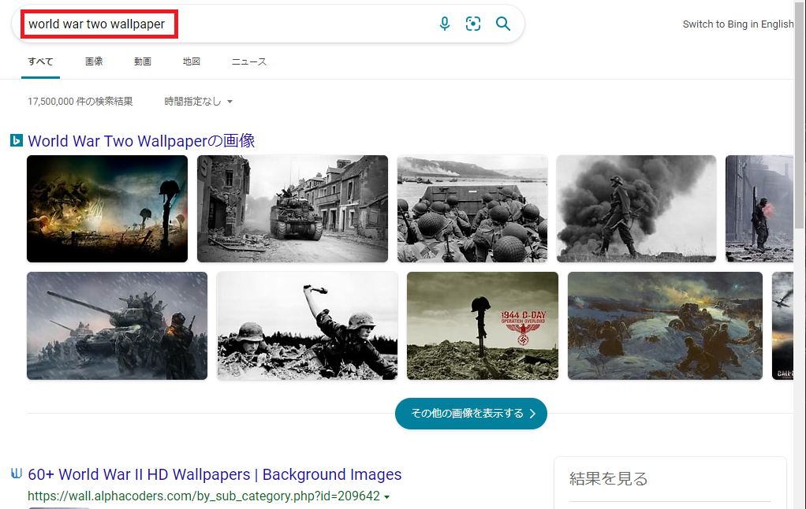
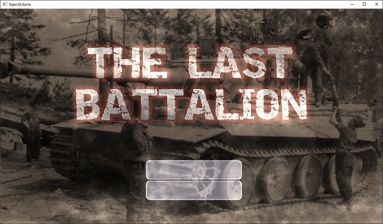

[OpenGL 3D 2021後期 第07回(マップエディタ編)]

# タイトル画面と音声再生

## 習得目標

* ImGuiの背景と前景に画像を描画できる。
* ゲームに合った音声を追加して再生できる。

## 1. クールでオーサムなタイトル画面

### 1.1 タイトルロゴ画像を用意する

本テキストでは、ゲームのタイトル画面を作成します。タイトル画面には以下の要素が必要です。

>1. タイトルロゴ画像
>2. 背景画像
>3. ゲーム開始ボタン
>4. ゲーム終了ボタン
>5. エフェクト画像

とりあえずタイトルロゴを決めましょう。何の手がかりもないと難しいので、適当に思いつく単語を以下に並べてみました。単語1と単語2を組み合わせて、なんとなくそれっぽいタイトルを作ってください。なお、最初の3行の空白は、みなさんが思いついた文章や単語を入れるためのスペースです。

| 単語1 | 単語2 |
|:-----:|:-----:|
| ________ | ________ |
| ________ | ________ |
| ________ | ________ |
| タンク(TANK) | バタリオン(BATTALION) |
| アルティメット(ULTIMATE) | バトルフィールド(BATTLEFIELD) |
| バトル(BATTLE) | シティ(CITY) |
| ラスト(LAST) | フロントライン(FRONTLINE) |
| ファイナル(FINAL) | ウォー(WAR) |
| ブレイブ(BRAVE) | アーミー(ARMY) |
| ハッピー(HAPPY) | タイガー(TIGER) |
| 鋼(はがね)の | 騎士  |
| 戦場の | 虎 |
| 鋼鉄の | 咆哮 |
| 最後の | 戦士 |
| 血と硝煙の | 戦場 |

<pre class="tnmai_assignment">
<strong>【課題01】</strong>
ブラウザで<code>ja.cooltext.com</code>を開き、タイトルロゴ画像を作成しなさい。プロジェクトの<code>Res</code>フォルダの中に<code>title</code>というフォルダを追加し、その中にタイトルロゴ画像を保存しなさい。
</pre>

<pre class="tnmai_assignment">
<strong>【課題02】</strong>
タイトルロゴ画像をTGAに変換し、<code>title_logo.tga</code>という名前を付けて、プロジェクトの<coce>Res/title</code>フォルダに保存しなさい。
</pre>

### 1.2 背景画像を用意する

ロゴが表示されるだけでは殺風景です。何か背景画像を用意しましょう。ブラウザで以下の文字列を検索してください。

`world war two wallpaper`

すると、以下のような検索結果が表示されるでしょう。

<p align="center">

</p>

「その他の画像を表示する」ボタンや、「画像」タブをクリックして、タイトルロゴの背景に良さそうな画像を探してください。

<pre class="tnmai_assignment">
<strong>【課題03】</strong>
背景画像をTGAに変換し、<code>title_bg.tga</code>という名前を付けて、プロジェクトの<code>Res/title</code>フォルダに保存しなさい。
</pre>

壁紙用の画像はかなり大きいことがあります。ゲームではあまり大きくても意味がないため、使いやすいように画像サイズを小さくしておきましょう。

<pre class="tnmai_assignment">
<strong>【課題04】</strong>
<code>title_bg.tga</code>の画像の縦のサイズが720より大きい場合、720に変更しなさい。横サイズは自動的に変わるはずですが、もし変わらなかったら、<code>Ctrl+Z</code>などでサイズの変更をもとに戻してください。次に、縦と横の数値の間にあるアイコンをクリックして鎖がつながった状態にします。そして、サイズの変更をやり直してください。
</pre>

### 1.3 ゲームマネージャにタイトル状態を追加する

それでは、タイトル画面を作成していきましょう。まずゲームマネージャに「タイトル画面を表す状態」を追加します。`GameManager.h`を開き、ステート列挙型の定義に次のプログラムを追加してください。

```diff
   // ゲームの動作状態
   enum class State {
+    title,     // タイトル画面
     start,     // ゲーム開始
     playing,   // ゲームプレイ中
     gameclear, // ゲームクリア

```

次に、プライベートメンバを次のように変更してください。

```diff
   void SpawnPlayer();
   void SpawnEnemies();
+
+  void UpdateGameUI();
+  void UpdateTitle(float deltaTime);
+  void UpdateTitleUI();

-  State state = State::start; // 現在の動作状態
+  State state = State::title; // 現在の動作状態
   std::shared_ptr<Actor> playerTank;
   std::vector<std::shared_ptr<Actor>> enemies;
   int score = 0;
+
+  // タイトル画面の動作状態
+  enum class TitleState {
+    init,       // タイトル画面の初期化
+    logoFadein, // ロゴフェードイン
+    bgFadein,   // 背景フェードイン
+    idle,       // ユーザーの入力待ち
+    fadeout,    // タイトル画面フェードアウト
+  };
+  TitleState titleState = TitleState::init;
+  float titleLogoAlpha = 0; // タイトルロゴの不透明度
+  float titleBgAlpha = 0;   // タイトル背景の不透明度
+  float fadeAlpha = 0;      // フェードイン・アウトの不透明度
 }

 #endif // GAMEMANAGER_H_INCLUDED
```

`UpdateTitleUI`(アップデート・タイトル・ユーアイ)メンバ関数は、タイトル画面のUI全般を管理します。

次に`GameManager.cpp`を開き、アップデート関数に次のプログラムを追加してください。

```diff
 void GameManager::Update(float deltaTime)
 {
   GameEngine& engine = GameEngine::Get();
 
   switch (state) {
+    UpdateTitle(deltaTime);
+    break;
+
   case State::start:
     state = State::playing;
```

続いて、アップデートユーアイ関数に次のプログラムを追加してください。

```diff
 void GameManager::UpdateUI()
 {
+  switch (state) {
+  case State::title: UpdateTitleUI(); break;
+  default:           UpdataGameUI(); break;
+  }
+}
+
+/**
+* ゲーム画面のUIを更新する
+*/
+void GameManager::UpdateGameUI()
+{
   GameEngine& engine = GameEngine::Get(); // ゲームエンジンを取得
   ImGuiStyle& style = ImGui::GetStyle(); // スタイル構造体を取得
   const ImGuiStyle styleBackup = style;  // 元に戻すためのバックアップ
```

既存オンアップデートユーアイ関数の内容は`UpdateGameUI`(アップデート・ゲーム・ユーアイ)関数となり、アップデートユーアイ関数は、状態によって2つの更新関数を呼び分けるだけになりました。

実際にUIを更新するプログラムと、更新処理を呼び分けるプログラムを分けることで、プログラムが読みやすくなります。加えて、状態ごとに異なる更新処理を追加することも簡単になります。

>このプログラムのように、処理の分岐だけを目的とする`switch`文では、ほぼすべての
>`case`が単に関数を呼び出すだけになることがあります。このような場合、`break`までを1行にまとめると、表(ひょう)のようになって見やすくなります。

### 1.4 テクスチャクラスにImGui用のID取得関数を追加する

ImGuiでは、テクスチャIDを`ImTextureID`型に変換する必要があります。これには最低限
`reinterpret_cast`(リインタープリト・キャスト)が必要で、コンパイラの警告まで消すには`static_cast`も追加しなくてはなりません。

毎回キャストを書くのは面倒なので、テクスチャクラスのメンバ関数として組み込むことにします。`Texture.h`を開き、テクスチャクラスの定義に次のプログラムを追加してください。

```diff
   // テクスチャIDを取得
   GLuint GetId() const { return id; }
+  void* GetIdByPtr() const
+  {
+    return reinterpret_cast<void*>(static_cast<uintptr_t>(id));
+  }

   void Write(GLint x, GLint y, GLsizei width, GLsizei height,
     const void* data, GLenum pixelFormat, GLenum type);
```

これで、`ImTextureID`が必要なときは`GetIdByPtr`(ゲット・アイディ・バイ・ポインタ)関数を使うことができます。

### 1.5 テクスチャの幅と高さを取得できるようにする

それから、テクスチャクラスに幅と高さを取得する機能を追加します。これは、タイトルロゴの中心座標を調べるときに使います。`Texture.h`を開き、テクスチャクラスの定義に次のプログラムを追加してください。

```diff
   void Write(GLint x, GLint y, GLsizei width, GLsizei height,
     const void* data, GLenum pixelFormat, GLenum type);
+
+  // テクスチャの幅、高さを取得
+  GLint GetWidth() const { return width; }
+  GLint GetHeight() const { return height; }

 private:
   std::string name; // 画像ファイル名
   GLuint id = 0;    // オブジェクトID
+  GLsizei width = 0;  // 幅
+  GLsizei height = 0; // 高さ
 };

 #endif // TEXTURE_H_INCLUDED
 ```

次に`Texture.cpp`を開き、コンストラクタの定義に次のプログラムを追加してください。

```diff
   id = GLContext::CreateImage2D(filename);
   if (id) {
     name = filename;
+    glGetTextureLevelParameteriv(id, 0, GL_TEXTURE_WIDTH, &width);
+    glGetTextureLevelParameteriv(id, 0, GL_TEXTURE_HEIGHT, &height);
     std::cout << "[情報]" << __func__ << "テクスチャ" << name << "を作成.\n";
   }
```

テクスチャクラスは複数のコンストラクタを持っています。もうひとつのコンストラクタの定義に、次のプログラムを追加してください。

```diff
   id = GLContext::CreateImage2D(width, height, data, pixelFormat, type);
   if (id) {
     this->name = name;
+    this->width = width;
+    this->height = height;
     std::cout << "[情報]" << __func__ << "テクスチャ" << name << "を作成.\n";
   }
```

続いて、配列テクスチャ用のコンストラクタ定義を次のように変更してください。

```diff
   // テクスチャのピクセル形式、幅、高さを取得
-  GLint internalFormat, width, height;
+  GLint internalFormat;
   glGetTextureLevelParameteriv(texList[0], 0, GL_TEXTURE_INTERNAL_FORMAT,
     &internalFormat);
```

これでテクスチャのサイズを取得できるようになりました。

### 1.6 UpdateTitle関数を定義する

`UpdateTitle`(アップデート・タイトル)は、タイトル画面の更新を行うメンバ関数です。
`GameManager.cpp`を開き、アップデートゲームユーアイ関数の定義の下に、次のプログラムを追加してください。

```diff
     ImGui::End();
   }
 }
+
+/**
+* タイトル画面の更新
+*/
+void GameManager::UpdateTitle(float deltaTime)
+{
+  switch (titleState) {
+  case TitleState::init:
+    GameEngine::Get().ClearAllActors();
+    titleLogoAlpha = 0;
+    titleBgAlpha = 0;
+    fadeAlpha = 0;
+    titleState = TitleState::logoFadein;
+    break;
+
+  case TitleState::logoFadein:
+    titleLogoAlpha += deltaTime;
+    if (titleLogoAlpha >= 1.0f) {
+      titleState = TitleState::bgFadein;
+    }
+    break;
+
+  case TitleState::bgFadein:
+    titleBgAlpha += deltaTime;
+    if (titleBgAlpha >= 1.0f) {
+      titleState = TitleState::idle;
+    }
+    break;
+
+  case TitleState::idle:
+    // 何もしない(UI操作待ち)
+    break;
+
+  case TitleState::fadeout:
+    fadeAlpha += deltaTime;
+    if (fadeAlpha > 1) {
+      titleState = TitleState::init;
+      state = State::start;
+    }
+    break;
+  } // switch (titleState)
+}

 /**
 * プレイヤーの戦車を生成する
```

### 1.7 UpdateTitleUI関数を定義する

`UpdateTitleUI`(アップデート・タイトル・ユーアイ)は、タイトル画面のUIを更新するメンバ関数です。アップデートタイトル関数の定義の下に、次のプログラムを追加してください。

```diff
     break;
   } // switch (titleState)
 }
+
+/**
+* タイトル画面UIの更新
+*/
+void GameManager::UpdateTitleUI()
+{
+  using namespace ImGui;
+
+  GameEngine& engine = GameEngine::Get();
+  ImGuiStyle& style = GetStyle();
+  const ImGuiStyle styleBackup = style;
+  ImDrawList* drawList = GetBackgroundDrawList();
+
+  // 何度も使う値を定数として定義しておく
+  const ImVec2 screenMin(0, 0);
+  const ImVec2 screenMax(engine.GetWindowSize().x, engine.GetWindowSize().y);
+  const ImVec2 uv0(0, 1);
+  const ImVec2 uv1(1, 0);
+}

 /**
 * プレイヤーの戦車を生成する
```

それではタイトル画面に表示するパーツを配置していきましょう。長方形を単色で塗りつぶすには`AddRectFilled`(アド・レクト・フィルド)関数を、画像を表示するには`AddImage`(アド・イメージ)関数を使います。

定数を定義するプログラムの下に、次のプログラムを追加してください。

```diff
   const ImVec2 uv0(0, 1);
   const ImVec2 uv1(1, 0);
+
+  // 黒背景
+  drawList->AddRectFilled(screenMin, screenMax, ImColor(0.0f, 0.0f, 0.0f));
+
+  // 背景
+  std::shared_ptr<Texture> texBg = engine.LoadTexture("Res/title/title_bg.tga");
+  drawList->AddImage(texBg->GetIdByPtr(), screenMin, screenMax, uv0, uv1,
+    ImColor(1.0f, 1.0f, 1.0f, tigleBgAlpha));
+
+  // ロゴ
+  std::shared_ptr<Texture> texLogo = engine.LoadTexture("Res/title/title_logo.tga");
+  const glm::vec2 logoSize(texLogo->GetWidth(), texLogo->GetHeight());
+  const float cx = (screenMin.x + screenMax.x) * 0.5f;
+  drawList->AddImage(texLogo->GetIdByPtr(),
+    ImVec2(cx - logoSize.x * 0.5f, 100),
+    ImVec2(cx + logoSize.x * 0.5f, 100 + logoSize.y),
+    uv0, uv1, ImColor(1.0f, 1.0f, 1.0f, titleLogoAlpha));
+
+  // フェードアウト用の前景
+  GetForegroundDrawList()->AddRectFilled(screenMin, screenMax,
+    ImColor(0.0f, 0.0f, 0.0f, fadeAlpha));
 }

 /**
 * プレイヤーの戦車を生成する
```

これで、タイトル画面の画像の表示は完成です。次にボタンUIを表示します。ボタンは「ゲーム開始」と「終了」の2つを表示します。ロゴを表示するプログラムの下に、次のプログラムを追加してください。

```diff
     ImVec2(cx - logoSize.x * 0.5f, 100),
     ImVec2(cx + logoSize.x * 0.5f, 100 + logoSize.y),
     uv0, uv1, ImColor(1.0f, 1.0f, 1.0f, titleLogoAlpha));
+
+  if (titleState == TitleState::idle) {
+    const ImVec2 buttonSize(320, 64);
+    SetNextWindowPos(ImVec2(cx - buttonSize.x * 0.5f, 500));
+    Begin("start", nullptr,
+      ImGuiWindowFlags_NoBackground | ImGuiWindowFlags_NoDecoration);
+    SetWindowFontScale(4.0f);
+    if (Button(u8"ゲーム開始", buttonSize)) {
+      titleState = TitleState::fadeout;
+    }
+    if (Button(u8"終了", buttonSize)) {
+    }
+    End();
+  }

   // フェードアウト用の前景
   GetForegroundDrawList()->AddRectFilled(screenMin, screenMax,
```

プログラムが書けたらビルドして実行してください。タイトル画面が表示され、「ゲーム開始」ボタンを押すとゲームが開始されたら成功です。

<p align="center">

</p>

### 1.8 ゲーム終了機能を追加する

次は、「終了」ボタンが機能するようにします。GLFWライブラリを使っている場合、アプリを終了させるには`glfwSetWindowShouldClose`(ジーエルエフダブリュー・セット・ウィンドウ・シュッド・クローズ)関数を使います。

<pre class="tnmai_code"><strong>【書式】</strong><code>
void glfwSetWindowShouldClose(GLFWウィンドウのアドレス, 設定する値);
</code></pre>

この関数で設定した値は、`glfwWindowShouldClose`関数の戻り値になります。そのため、
`0`以外の値を設定するとアプリを終了させることができます。

多くのGLFWライブラリ関数と同様うに、この関数も「GLFWウィンドウのアドレス」が必要です。本テキストで作成しているゲームの場合、GLFWウィンドウを管理しているのはゲームエンジンクラスです。

当然、ゲームエンジンクラスに機能追加することになります。`GameEngine.h`を開き、ウィンドウシュッドクローズ関数の定義の下に、次のプログラムを追加してください。

```diff
   bool WindowShouldClose() const
   {
     return glfwWindowShouldClose(window);
   }
+
+  /**
+  * アプリ終了フラグをセットする
+  */
+  void SetWindowShouldClose(bool isClose)
+  {
+    glfwSetWindowShouldClose(window, isClose);
+  }

   /**
   * キーが押されていたらtrue、押されていなかったらfalse
```

`GameManager.cpp`を開き、終了ボタンが押されたときの処理に次のプログラムを追加してください。

```diff
       titleState = TitleState::fadeout;
     }
     if (Button(u8"終了", buttonSize)) {
+      engine.SetWindowShouldClose(true);  
     }
     End();
   }
```

プログラムが書けたらビルドして実行してください。「終了」ボタンを押して、ゲームが終了したら成功です。

### 1.9 エフェクト画像を用意する

タイトルロゴと背景だけだと、マウスカーソル以外には画面に動きがありません。そのため、ゲームが動いているのかハングアップしているのかを見分けられません。そこで、簡単なエフェクトを追加します。

ブラウザで以下のURLのサイトにアクセスしてください。

`https://pixelbuddha.net/freebie/20-mysterious-fog-overlays`

すると、以下のようなページが表示されます。画面をスクロールさせて、「ダウンロード」ボタンを押してZIPファイルをダウンロードしてください。

<p align="center">

</p>

<pre class="tnmai_assignment">
<strong>【課題05】</strong>
ダウンロードしたZIPファイルには複数の<ruby>煙<rt>けむり</rt></ruby>テクスチャが入っています。好きなテクスチャをひとつ選んでTGAに変換し、<code>title_effect.tga</code>という名前を付けて、プロジェクトの<code>Res/title</code>フォルダに保存しなさい。
</pre>

次に、エフェクト用の変数を追加します。`GameManager.h`を開き、ゲームマネージャクラスに次のプライベートメンバを追加してください。

```diff
   TitleState titleState = TitleState::init;
   float titleLogoAlpha = 0; // タイトルロゴの不透明度
   float titleBgAlpha = 0;   // タイトル背景の不透明度
+  float titleEffectPosX = 0;
   float fadeAlpha = 0;      // フェードイン・アウトの不透明度
 }

 #endif // GAMEMANAGER_H_INCLUDED
```

続いて`GameManager.cpp`を開き、アップデートタイトルユーアイ関数の定義に次のプログラムを追加してください。

```diff
   std::shared_ptr<Texture> texBg = engine.LoadTexture("Res/title/title_bg.tga");
   drawList->AddImage(texBg->GetIdByPtr(), screenMin, screenMax, uv0, uv1,
     ImColor(1.0f, 1.0f, 1.0f, tigleBgAlpha));
+
+  // 煙エフェクト
+  std::shared_ptr<Texture> texEffect =
+    engine.LoadTexture("Res/title/title_effect.tga");
+  titleEffectPosX = fmod(titleEffectPosX + 1.0f, screenMax.x * 2);
+  drawList->AddImage(texEffect->GetIdByPtr(),
+    ImVec2(screenMin.x - titleEffectPosX, screenMin.y),
+    ImVec2(screenMax.x * 3 - titleEffectPosX, screenMax.y),
+    uv0, ImVec2(3, 0), ImColor(1.0f, 1.0f, 1.0f, 0.5f * titleBgAlpha));
+  }

   // ロゴ
   std::shared_ptr<Texture> texLogo = engine.LoadTexture("Res/title/title_logo.tga");
```

煙エフェクトは無限に横スクロールさせます。スクロールさせるには横の長さが2画面以上必要です。そこで、画像の横幅を3倍にしています。さらに、横に拡大するだけだと画像が伸びて表示されてしまうため、UV座標も3倍にしています。

また、無限にスクロールしていると見せかけるには「右端までスクロールしたら最初の位置に戻る」という処理をしなくてはなりません。

このために`fmod`(エフ・モッド)関数(第1引数を第2引数で割った余りを返す関数)を使っています。`fmod`を使うことで「スクロール距離`titleEffectPosX`が2画面を超えると0に戻る」ように制御しています。

プログラムが書けたらビルドして実行してください。煙がゆっくり横スクロールしていたら成功です。

### 1.10 エフェクトの不自然さをなくす

煙エフェクトのつなぎ目が目立つので、目立たないようにしましょう。フォトショップやGIMPを使えばつなぎ目が目立たないように画像を修正できますが、今回はOpenGLの機能を使ってなんとかしていきます。

つなぎ目が目立つのは、色が突然変化するからです。そこで、テクスチャのラップモードを変更してつなぎ目を目立たなくします。ラップモードには以下の5種類があります。

<p align="center">
<br>
</p>

ちょっと見たところでは、`GL_REPEAT`(ジーエル・リピート)または`GL_MIRRORED_REPEAT`
(ジーエル・ミラード・リピート)を使えば、つなぎ目を消すことができそうです。

しかし、そもそもImGuiが画像を描画するとき、どのラップモードが使われるのでしょう？<br>
実は、ImGuiは画像テクスチャに設定されているラップモードを使っています。そして、テクスチャのラップモードのデフォルトは、`GL_REPEAT`です。

>デフォルトの設定については以下のAPIドキュメントを参照:<br>
>`https://www.khronos.org/registry/OpenGL-Refpages/gl4/html/glTexParameter.xhtml`

つまり、「`GL_REPEAT`ではつなぎ目が目立つ」ということです。そうなると、あとは残った`GL_MIRRORED_REPEAT`を使うしか手がなさそうです。

実際にやってみましょう。ラップモードを指定するには`glTextureParameteri`(ジーエル・テクスチャ・パラメータ・アイ)関数を使います。煙エフェクトを表示するプログラムに、次のプログラムを追加してください。

```diff
   // 煙エフェクト
   std::shared_ptr<Texture> texEffect =
     engine.LoadTexture("Res/title/title_effect.tga");
+  glTextureParameteri(texEffect->GetId(), GL_TEXTURE_WRAP_S, GL_MIRRORED_REPEAT);
+  glTextureParameteri(texEffect->GetId(), GL_TEXTURE_WRAP_T, GL_MIRRORED_REPEAT);
   titleEffectPosX = fmod(titleEffectPosX + 1.0f, screenMax.x * 2);
   drawList->AddImage(texEffect->GetIdByPtr(),
```

プログラムが書けたらビルドして実行してください。つなぎ目が目立たなくなっていたら成功です。

>**【スクロールに必要な画面数について】**<br>
>`GL_REPEAT`の場合、長さが2画面以上であれば、「右端までスクロールしたら0に戻す」という方法で無限にスクロールさせることができます。<br>
>しかし`GL_MIRRORED_REPEAT`の場合、長さを「3以上の奇数倍画面(3, 5, 7など)」にしなくてはなりません。スクロールには2画面以上の長さが必要ですが、ミラードリピートでは偶数番目の画面は反転表示になるからです。<br>
>偶数画面の長さで「右端までスクロールしたら0に戻す」を行うと、反転表示からスいきなり通常表示に切り替わることになり、画像の連続性が失われてしまいます。

### 1.11 エフェクトを多重化する

煙画像が1枚だけだとあまり自然には見えません。それらしく見せる簡単な方法は、画像を数枚重ねて、それぞれを違う速度でスクロールさせることです。

`GameManager.h`を開き、プライベートメンバ変数を次のように変更してください。

```diff
   TitleState titleState = TitleState::int;
   float titleLogoAlpha = 0; // タイトルロゴの不透明度
   float titleBgAlpha = 0;   // タイトル背景の不透明度
-  float titleEffectPosX = 0;
+  float titleEffectPosX[2] = { 0, 0 };
   float fadeAlpha = 0;      // フェードイン・アウトの不透明度
 }

 #endif // GAMEMANAGER_H_INCLUDED
```

次に`GameManager.cpp`を開き、アップデート関数に次のプログラムを追加してください。

```diff
   std::shared_ptr<Texture> texEffect =
     engine.LoadTexture("Res/title/title_effect.tga");
   glTextureParameteri(texEffect->GetId(), GL_TEXTURE_WRAP_S, GL_MIRRORED_REPEAT);
   glTextureParameteri(texEffect->GetId(), GL_TEXTURE_WRAP_T, GL_MIRRORED_REPEAT);
+  const float effectSpeed[2] = { 1.0f, 0.3f }; // スクロール速度
+  for (int i = 0; i < std::size(titleEffectPosX); ++i) {
-    titleEffectPosX = fmod(titleEffectPosX + 1.0f, screenMax.x * 2);
+    titleEffectPosX[i] = fmod(titleEffectPosX[i] + effectSpeed[i], screenMax.x * 2);
     drawList->AddImage(texEffect->GetIdByPtr(),
-      ImVec2(screenMin.x - titleEffectPosX, screenMin.y),
-      ImVec2(screenMax.x * 3 - titleEffectPosX, screenMax.y),
+      ImVec2(screenMin.x - titleEffectPosX[i], screenMin.y),
+      ImVec2(screenMax.x * 3 - titleEffectPosX[i], screenMax.y),
-      uv0, ImVec2(3, 0), ImColor(1.0f, 1.0f, 1.0f, 0.5f * titleBgAlpha));
+      ImVec2(0, 1 + static_cast<float>(i)), ImVec2(3 + 3 * static_cast<float>(i), 0),
+      ImColor(1.0f, 1.0f, 1.0f, 0.5f * titleBgAlpha));
   }

   // ロゴ
   std::shared_ptr<Texture> texLogo = engine.LoadTexture("Res/title/title_logo.tga");
```

プログラムが書けたらビルドして実行してください。ゆっくりと流れる煙が追加され、エフェクトが少し複雑に見えていたら成功です。ただ、画像がちょっと暗くなったような…。

<p align="center">

</p>

### 1.12 背景の明るさが変わらないようにする

エフェクトを何枚も重ねていくと、背景がどんどん暗くなっていきます。これはアルファブレンディング方法が「アルファ値の比率で合成」になっているためです。

エフェクトのアルファ値は`0.5`に設定しているので、エフェクトを重ねるたびに、背景の明るさが半分になっていってしまいます。これでは困るので、背景の明るさが変わらないように修正しましょう。

| 背景の明るさ | エフェクト1枚目 | エフェクト2枚目 |
|:-:|:-:|:-:|
| 1.0 | なし | なし |
| 0.5 | 0.5  | なし |
| 0.25 | 0.25 | 0.5 |

背景の明るさを維持するには、アルファブレンディング方法を「加算合成」に変更します。合成方法の指定には`glBlendFunc`(ジーエル・ブレンド・ファンク)関数を使います。

ImGuiの描画処理中にOpenGLの関数を実行させるには、`ImDrawList`クラスの`AddCallback`(アド・コールバック)メンバ関数を使います。

```diff
   glTextureParameteri(texEffect->GetId(), GL_TEXTURE_WRAP_S, GL_MIRRORED_REPEAT);
   glTextureParameteri(texEffect->GetId(), GL_TEXTURE_WRAP_T, GL_MIRRORED_REPEAT);
+  drawList->AddCallback(
+    [](const ImDrawList*, const ImDrawCmd*) { glBlendFunc(GL_SRC_ALPHA, GL_ONE); },
+    nullptr);
   const float effectSpeed[2] = { 1.0f, 0.3f };
   for (int i = 0; i < std::size(titleEffectPosX); ++i) {
     titleEffectPosX[i] = fmod(titleEffectPosX[i] + effectSpeed[i], screenMax.x * 2);
```

プログラムが書けたらビルドして実行してください。背景の明るさがもとに戻っていたら成功です。しかし、今度はロゴとボタンの表示が妙なことになっています。

<p align="center">

</p>

### 1.13 合成方法を元に戻す

合成方法の変更は、以降のImGuiの描画の全てに影響します。そのため、タイトルロゴやボタンも加算合成されてしまいます。エフェクトだけを「加算合成」するには、エフェクト描画後に描画設定をデフォルトに戻す必要があります。

ImGuiの描画設定をデフォルトに戻すには、`AddCallback`関数の引数に
`ImDrawCallback_ResetRenderState`(イム・ドロー・コールバック・リセット・レンダー・ステート)という定数を指定します。

エフェクトを描画するプログラムの末尾に、次のプログラムを追加してください。

```diff
       ImVec2(0, 1 + static_cast<float>(i)), ImVec2(3 + 3 * static_cast<float>(i), 0),
       ImColor(1.0f, 1.0f, 1.0f, 0.5f * titleBgAlpha));
   }
+  drawList->AddCallback(ImDrawCallback_ResetRenderState, nullptr);

   // ロゴ
   std::shared_ptr<Texture> texLogo = engine.LoadTexture("Res/title/title_logo.tga");
```

プログラムが書けたらビルドして実行してください。タイトルロゴとボタンが意図した色で表示されていたら成功です。

<p align="center">

</p>

>**【1章のまとめ】**<br>
>
>* ImGuiの背景に画像を描画するには`GetBackgroundDrawList`関数を使う。
>* GLFWでアプリを終了させるには`glfwSetWindowShouldClose`関数に`0`以外の引数を指定する。
>* ImGuiの描画設定を部分的に変更するには、`AddCallback`関数にOpenGLの関数を実行するラムダ式を指定する。
>* ImGuiの描画設定をデフォルトに戻すには、`AddCallback`関数の引数に`ImDrawCallback_ResetRenderState`マクロ定数を指定する。

<div style="page-break-after: always"></div>

## 2. 音声を再生する

>【注意】ADX LEによる音声再生を実装している場合、この章は飛ばしてください。

### 2.1 音声ライブラリを追加する

ゲームは、プレイヤーへのフィードバックの多くの部分を音声に頼っています。まるで本物のような映像を作り出せたとしても、それだけではプレイヤーを没入させるのは難しいものです。

例としてテレビ番組を考えてみましょう。みなさんがテレビ番組を見る時、音声は当然スピーカーから再生されています。しかし、みなさんの感覚では、画面の中の人物の口元から発声されているかのように感じていると思います。

これは、人間にとって聴覚よりも視覚が優先的な情報源であるからこそ起こる現象です。一方で、音量を0にして番組を視聴すると、番組の内容がほとんど分からなくなってしまいます(環境映像のようなものは除いて)。

このことは、人間の情報伝達において、聴覚がいかに重要であるかを示しています。そして、音声の重要性は、ゲームにおいても変わりません。そこで、プロジェクトに音声ライブラリを追加して、音声を再生できるようにしましょう。

まず音声ライブラリをダウンロードします。ブラウザで以下のURLを開き、ZIPファイルをダウンロードしてください。

`https://github.com/tn-mai/OpenGL3D2021/raw/master/Doc/EasyAudio.zip`

`EasyAudio.zip`ファイルには、以下の2つのファイルが格納されています。

* EasyAudio.cpp
* EasyAudio.h

上記の2つのファイルをプロジェクトの`Src`フォルダにコピーしてください。

次に、Visual Studioのソリューションエクスプローラーにある「ソースファイル」フィルタを右クリックして「追加→既存の項目」を選択します。そして、先程コピーした2つのファイルをプロジェクトに追加してください。

これで音声ライブラリが追加されました。

### 2.2 音声ライブラリの処理を追加する

音声ライブラリを使うためのプログラムを追加します。`GameEngine.cpp`を開き、次のプログラムを追加してください。

```diff
 * @file GameEngine.cpp
 */
 #include "GameEngine.h"
+#include "EasyAudio.h"
 #include <imgui.h>
 #include <imgui_impl_glfw.h>
 #include <imgui_impl_opengl3.h>
```

次に音声ライブラリの初期化を追加します。イニシャライズ関数の末尾に、次のプログラムを追加してください。

```diff
      io.FontGlobalScale = defaultFontPixels / fontPixels;
      io.Fonts->Build();
    }
+
+    // 音声を初期化する
+    Audio::Initialize();
  }
  return true;
}
```

続いて、音声ライブラリの終了処理を追加します。ファイナライズ関数に次のプログラムを追加してください。

```diff
 void GameEngine::Finalize()
 {
   if (engine) {
+    // 音声の終了
+    Audio::Finalize();
+
     // GUIの終了
     ImGui_ImplOpenGL3_Shutdown();
```

最後に、音声ライブラリの更新処理を追加します。ニューフレーム関数に、次のプログラムを追加してください。

```diff
   ImGui_ImplOpenGL3_NewFrame();
   ImGui_ImplGlfw_NewFrame();
   ImGui::NewFrame();
+
+  // 音声の更新
+  Audio::Update();
 }

 /**
 * 削除待ちのアクターを削除する
```

これで音声ライブラリを使う準備ができました。

### 2.3 音声を用意する

タイトル画面で使う音声を用意しましょう。とりあえず以下の3つの音声が必要です。

| 分類   | 音声の用途 |
|:------:|:-----|
| BGM    | タイトル画面のBGM |
| 効果音 | マウスカーソルがボタンの上に来たときに再生する音 |
| 効果音 | ゲーム開始ボタンがクリックされたときの音 |

>**【音声ライブラリで再生可能な形式】**<br>
>`WAV`, `MP3`, `AAC`, `WMA`に対応しています。`OGG`などには対応していません。

<pre class="tnmai_assignment">
<strong>【課題06】</strong>
プロジェクトの<code>Res</code>フォルダに<code>Audio</code>というフォルダを作成しなさい。
次に、上の表にある用途に適した音声ファイルを、適当なサイトからダウンロードしなさい(自分で作成してもよいでしょう)。
そして、作成した<code>Audio</code>フォルダに、ダウンロードした音声ファイルをコピー(または移動)しなさい。
</pre>

なお、効果音については「CHIPTONE」(チップトーン)という、オンラインで効果音を作成できるサイトを使うと簡単です。チップトーンは以下のURLからアクセスできます。

`https://sfbgames.itch.io/chiptone`

オフラインで効果音を作成したい場合は、ダウンロード版を利用すると良いでしょう。

### 2.4 音声定義ファイルを追加する

音声を再生するには、`Res/Audio`フォルダの音声ファイル名を指定します。しかし、プログラムに直接ファイル名を書くと、音声ファイルを変更したくなったときに不便です。

例えば「爆発」用の音声ファイルを複数の場所で使っていたとします。しばらくして、もっと気持ちのいい爆発音を見つけたため、音声ファイルを切り替えることにしました。

このとき、プログラムに直接音声ファイル名を書いていると、それらをすべて書き換えなくてはなりません。そこで、音声ファイルをプリプロセッサマクロとして定義します。

プロジェクトの`Src`フォルダに`EasyAudioSettings.h`(イージー・オーディオ・セッティングス)という名前のヘッダファイルを追加してください。追加した`EasyAudioSettings.h`を開き、次のプログラムを追加してください。

```diff
+/**
+* @file EasyAudioSettings.h
+*/
+#ifndef EASY_AUDIO_SETTINGS_H_INCLUDED
+#define EASY_AUDIO_SETTINGS_H_INCLUDED
+
+// プレイヤー番号
+#define AUDIO_PLAYER_ID_BGM (0) // BGMの再生に使うプレイヤー番号
+
+// BGM設定
+#define BGM_TITLE     "Res/Audio/????" // タイトル画面のBGM
+
+// 効果音設定
+#define SE_SELECT     "Res/Audio/????" // ボタンの上にカーソルが乗った
+#define SE_GAMESTARR  "Res/Audio/????" // ゲーム開始ボタンが押された
+
+#endif // EASY_AUDIO_SETTINGS_H_INCLUDED
```

<pre class="tnmai_assignment">
<strong>【課題07】</strong>
<code>EasyAudioSettings.h</code>の中の<code>????</code>となっている部分を、ダウンロードした音声ファイル名で置き換えなさい。
</pre>

### 2.5 BGMを再生する

それでは音声を再生しましょう。`GameManger.h`を開き、次のように音声用ヘッダファイルをインクルードしてください。

```diff
 #include "Actor/PlayerActor.h"
 #include "Actor/T34TankActor.h"
 #include "Actor/Boss01.h"
+#include "EasyAudio.h"
+#include "EasyAudioSettings.h"
 #include <imgui.h>
 #include <glm/gtc/matrix_transform.hpp>
```

BGMのようにループ再生をしたり、途中で停止させる必要のある音声の場合、`Play`(プレイ)関数を使います。

<pre class="tnmai_code"><strong>【書式】</strong>
void Play(再生に使うプレイヤー番号, 音声ファイル名, 音量, ループフラグ);
</pre>

それでは、アップデートタイトル関数に次のプログラムを追加してください。

```diff
   switch (titleState) {
   case TitleState::init:
     GameEngine::Get().ClearAllActors();
+    Audio::Play(AUDIO_PLAYER_ID_BGM, BGM_TITLE, 1.0f, true);
     titleLogoAlpha = 0;
     titleBgAlpha = 0;
```

フェードアウトが完了したらBGMを止めます。アップデートタイトル関数に次のプログラムを追加してください。

```diff
   case TitleState::fadeout:
     fadeAlpha += deltaTime;
     if (fadeAlpha > 1) {
+      Audio::Stop(AUDIO_PLAYER_ID_BGM);
       titleState = TitleState::init;
       state = State::start;
     }
```

プログラムが書けたらビルドして実行してください。タイトル画面でBGMが再生され、ゲームを開始するとBGMが停止したら成功です。

### 2.6 効果音を再生する

次に効果音を再生しましょう。効果音のように、再生するのは一度だけで、特に制御の必要のない音声の場合、`PlayOneShot`(プレイ・ワン・ショット)関数を使います。

<pre class="tnmai_code"><strong>【書式】</strong>
void PlayOneShot(音声ファイル名, 音量);
</pre>

それでは、アップデートタイトルユーアイ関数に次のプログラムを追加してください。

```diff
     SetWindowFontScale(4.0f);
     if (Button(u8"ゲーム開始", buttonSize)) {
+      Audio::PlayOneShot(SE_GAMESTART);
       titleState = TitleState::fadeout;
     }
     if (Button(u8"終了", buttonSize)) {
```

マウスカーソルがボタンの上に来たときにも音声を再生しましょう。ImGuiで「マウスカーソルがUIの上に来たとき」を判定するには`IsItemHovered`(イズ・アイテム・ホバード)関数を使います。

<pre class="tnmai_code"><strong>【書式】</strong>
bool IsItemHovered();
</pre>

イズアイテムホバード関数は、マウスカーソルが「直前に設定したUI項目」の上にあるかどうかを返します。

アップデートタイトルユーアイ関数に次のプログラムを追加してください。

```diff
     if (Button(u8"ゲーム開始", buttonSize)) {
       Audio::PlayOneShot(SE_GAMESTART);
       titleState = TitleState::fadeout;
     }
+    static bool startHovered = false;
+    if (IsItemHovered()) {
+      Audio::PlayOneShot(SE_SELECT);
+    }
     if (Button(u8"終了", buttonSize)) {
       engine.SetWindowShouldClose(true);
```

ただし、これだとマウスカーソルが乗っているあいだは何度も音声が再生されてしまいます。マウスカーソルが乗った瞬間だけ音声を再生するにはフラグ変数を追加します。

`GameManager.h`を開き、ゲームマネージャクラスの定義に次のプログラムを追加してください。

```diff
   float titleBgAlpha = 0;   // タイトル背景の不透明度
   float titleEffectPosX[2] = { 0, 0 };
   float fadeAlpha = 0;      // フェードイン・アウトの不透明度
+  bool startHovered = false;
+  bool exitHovered = false;
 }

 #endif // GAMEMANAGER_H_INCLUDED
```

次に、`GameManager.cpp`を開き、マウスカーソルが乗ったときに音声を再生するプログラムを、次のように変更してください。

```diff
       titleState = TitleState::fadeout;
     }
     if (IsItemHovered()) {
+      if (!startHovered) {
         Audio::PlayOneShot(SE_SELECT);
+        startHovered = true;
+      }
+    } else {
+      startHovered = false;
     }
     if (Button(u8"終了", buttonSize)) {
```

これで、マウスカーソルが乗った瞬間にだけ音声が再生されるようになりました。

同様にして、「終了ボタン」にも音声再生プログラムを追加します。

```diff
     if (Button(u8"終了", buttonSize)) {
       engine.SetWindowShouldClose(true);
     }
+    if (IsItemHovered()) {
+      if (!exitHovered) {
+        Audio::PlayOneShot(SE_SELECT);
+        exitHovered = true;
+      }
+    } else {
+      exitHovered = false;
+    }
     End();
   }
```

プログラムが書けたらビルドして実行してください。ボタン操作をしたときに効果音が再生されていたら成功です。

### 2.7 ゲームのBGMと効果音を追加する

タイトル画面にしか音声がないのはさみしいので、ゲームにも音声を追加しましょう。

| 分類   | 音声の用途 | マクロ名 |
|:------:|:-----|:----|
| BGM    | ゲーム中のBGM | BGM_NORMAL_BATTLE |
| BGM    | ボス戦のBGM | BGM_BOSS_BATTLE |
| BGM    | ゲームクリアのBGM | BGM_GAME_CLEAR |
| BGM    | ゲームオーバーのBGM | BGM_GAME_OVER |
| 効果音 | プレイヤーの弾の発射音 | SE_PLAYER_SHOT |
| 効果音 | 敵の弾の発射音 | SE_ENEMY_SHOT |
| 効果音 | 弾が命中したときの音 | SE_HIT |
| 効果音 | 戦車の爆発音 | SE_EXPLOSION |
| 効果音 | ボス戦車の爆発音 | SE_BOSS_EXPLOSION |

<pre class="tnmai_assignment">
<strong>【課題08】</strong>
上の表にある用途に適した音声ファイルを、適当なサイトからダウンロードして<code>Res/Audio</code>フォルダにコピーしなさい(自分で作成してもよいでしょう)。
</pre>

<pre class="tnmai_assignment">
<strong>【課題09】</strong>
<code>EasyAudioSettings.h</code>にダウンロードした音声ファイル名をあらわすマクロを追加しなさい。マクロの名前は表の右端の欄を使ってください。
</pre>

音声ファイルと`EasyAudioSettings.h`の準備ができたら、音声再生プログラムを追加していきましょう。`GameManager.cpp`を開き、アップデート関数の`State::start`ケース文に次のプログラムを追加してください。

```diff
       gamestart->layer = Layer::UI;
       engine.AddActor(gamestart);
     }
+
+    // BGMを再生
+    Audio::Play(AUDIO_PLAYER_ID_BGM, BGM_MAINGAME, 1.0f, true);

     state = State::playing;
     std::cout << __func__ << ": start -> playing\n";
     break;
```

次に`State::playing`ケース文に、次のプログラムを追加してください。

```diff
       gameover->isStatic = true;
       gameover->layer = Layer::UI;
       engine.AddActor(gameover);
+
+      Audio::Play(AUDIO_PLAYER_ID_BGM, BGM_GAMEOVER);

       state = State::gameover;
       std::cout << __func__ << ": playing -> gameover\n";
     }
```

<pre class="tnmai_assignment">
<strong>【課題10】</strong>
<code>GameManager::Update</code>関数に、ゲームクリア時の音声を再生するプログラムを追加しなさい。
</pre>

プログラムが書けたらビルドして実行してください。ゲーム開始したときにBGMが再生されていたら成功です。

### 2.8 戦車に効果音をつける

続いて、戦車に効果音をつけましょう。`T34TankActor.cpp`を開き、音声再生用のヘッダファイルをインクルードしてください。

```diff
 #include "BulletActor.h"
 #include "../GameEngine.h"
 #include "../GameManager.h"
+#include "../EasyAudio.h"
+#include "../EasyAudioSettings.h"
 #include <glm/gtc/matrix_transform.hpp>
 #include <iostream>
```

まず、弾の発射音を鳴らします。オンアップデート関数に次のプログラムを追加してください。

```diff
     shotTimer -= deltaTime;
     if (shotTimer <= 0) {
       shotTimer = 5;
+
+      Audio::PlayOneShot(SE_ENEMY_SHOT);

       // 発射位置を砲の先端に設定
       glm::vec3 position = this->position + t34Front * 3.0f;
```

それから、弾に当たったときと破壊されたときにも音を鳴らします。オンコリジョン関数に次のプログラムを追加してください。

```diff
 void T34TankActor::OnCollision(const struct Contact& contact)
 {
   if (contact.b->name == "Bullet") {
+    Audio::PlayOneShot(SE_HIT);
 
     // T-34戦車の耐久値を減らす
     health -= 1;
     if (health <= 0) {
+      Audio::PlayOneShot(SE_EXPLOSION);

       isDead = true; // T-34戦車を消去する
       GameManager::Get().AddScore(200);
```

プログラムが書けたらビルドして実行してください。敵戦車が効果音を再生していたら成功です。

同じようにして、ボス戦車にも効果音を付けます。`Boss01.cpp`を開き、音声再生用のヘッダファイルをインクルードしてください。

```diff
 #include "BulletActor.h"
 #include "../GameEngine.h"
 #include "../GameManager.h"
+#include "../EasyAudio.h"
+#include "../EasyAudioSettings.h"
 #include <glm/gtc/matrix_transform.hpp>
 #include <math.h>
```

まず、オンコリジョン関数に、次のプログラムを追加してください。

```diff
 void Boss01::OnCollision(const struct Contact& contact)
 {
   if (contact.b->name == "Bullet") {
     health -= 1;
+    Audio::PlayOneShot(SE_HIT);
     if (health <= 0) {
+      Audio::PlayOneShot(SE_BOSS_EXPLOSION);
       isDead = true;
       GameManager::Get().AddScore(2000);
     }
```

次に、`Danmaku`(ダンマク)関数に次のプログラムを追加してください。

```diff
       NormalShot(engine, position + glm::vec3(0, 2.8f, 0), shotDirection + i - 15);
       NormalShot(engine, position + glm::vec3(0, 3.0f, 0), 360 - shotDirection + i + 15);
     }
+    Audio::PlayOneShot(SE_ENEMY_SHOT);
     shotTimer = 0.2f;
     shotDirection = std::fmod(shotDirection + 5.0f, 360.0f);
```

続いて、`Machinegun`(マシンガン)関数に次のプログラムを追加してください。

```diff
       const glm::vec3 v = glm::normalize(target->position - position);
       const float speed = 20.0f;
       NormalShot(GameEngine::Get(), position + glm::vec3(0, 3, 0), v * speed);
+      Audio::PlayOneShot(SE_ENEMY_SHOT);

       --ammo;

       // 残弾が5で割り切れるときは3秒待機、それ以外は0.1秒待機
```

最後に、`Missile`(ミサイル)関数に次のプログラムを追加してください。

```diff
       // 鉛直投げ上げの公式からY方向の速度を計算
       v.y = 0.5f * gravity * flightTime;
       NormalShot(GameEngine::Get(), position + glm::vec3(0, 3, 0), v, flightTime);
+      Audio::PlayOneShot(SE_ENEMY_SHOT);
       --ammo;
       shotTimer = 4.0f;
```

プログラムが書けたらビルドして実行してください。ボス戦車が効果音を再生していたら成功です。

<pre class="tnmai_assignment">
<strong>【課題11】</strong>
プレイヤーの戦車が弾を発射するときと、破壊されたときに、効果音を再生するプログラムを追加しなさい。
</pre>

>**【2章のまとめ】**<br>
>
>* 音声があるとゲームの楽しさが向上する。
>* 効果音ジェネレーターを使うと、簡単な効果音なら自分で作ることができる。
