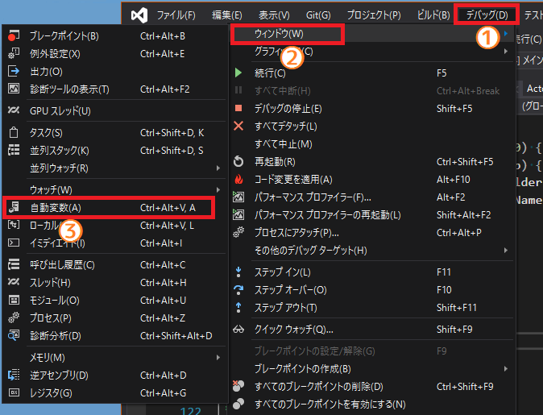
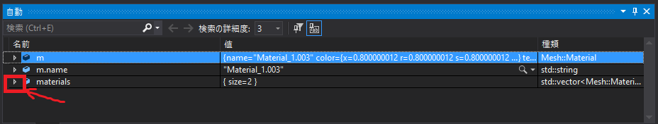
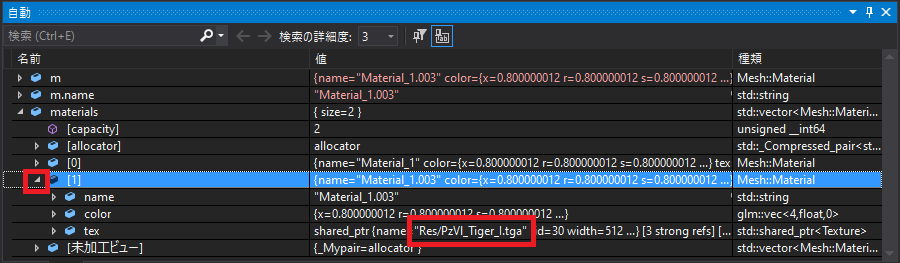
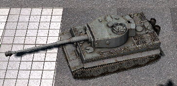

[OpenGL 3D 2021後期 第08回]

# MTLファイルの扱いかた

## 習得目標

* MTLファイルの構造を理解する。
* OBJファイルの`mtllib`, `usemtl`の意味と、それらをデータに落とし込む方法を理解する。
* ユニフォーム変数の配列を使うことができる。
* サンプラーの配列は、添え字を使えない場合があることを理解する。

## 1. MTLファイルを読み込む

### 1.1 MTLファイルとは

`MTL`(エムティーエル、マテリアル・テンプレート・ライブラリ)ファイルは、OBJファイルに含まれる図形の「材質(マテリアル)」を定義するファイルです。

OBJファイルは`mtllib`(エムティーエル・リブ)構文によって使用するMTLファイルを読み込みます。そして、`usemtl`(ユーズ・エムティーエル)構文によってポリゴンの材質を選択します。

材質には「アンビエント」「ディフューズ」「スペキュラ」の3種類があり、それぞれに基本色とテクスチャを指定できます。また、不透明度も材質情報のひとつです。

MTLファイルの構文を以下に示します。

| 構文 | 用途 |
|:-----|:-----|
| Ka 1.000 1.000 1.000 | アンビエント色 |
| Kd 1.000 1.000 1.000 | ディフューズ色 |
| Ks 1.000 1.000 1.000 | スペキュラ色 |
| Ns 10.000 | スペキュラ色の指数 |
| d 0.9 | 不透明度(=`1.0 - Tr`) |
| Tr 0.1 | 透明度(=`1.0 - d`) |
| Ni 1.45 | 光学密度(屈折率) |
| illum 2 | 使用する照明モデル |
| map_Ka \[オプション\] ambient.tga | アンビエントテクスチャ |
| map_Kd \[オプション\] diffuse.tga | ディフューズテクスチャ |
| map_Ks \[オプション\] specular.tga | スペキュラテクスチャ |
| map_Ns \[オプション\] exponent.tga | スペキュラ指数テクスチャ |
| map_d \[オプション\] dissolve.tga | 不透明度テクスチャ |

\[オプション\]の部分には、テクスチャの座標や値を補正する数値などを指定します。

このように、MTLファイルにはさまざまな情報を格納することができます。しかし、現在のところ、本テキストで必要となるのは「ディフューズ色」と「不透明度」、それから「ディフューズテクスチャ」の3つだけです。

>**【補足】**<br>
>OBJファイル、MTLファイルの詳細についてはWikipediaなどを参照してください。<br>
>`https://ja.wikipedia.org/wiki/Wavefront_.objファイル`

### 1.2 マテリアルを扱うクラスを追加する

MTLファイルには複数のマテリアルを定義することができます。それぞれのマテリアルの定義は
`newmtl`(ニュー・エムティーエル)構文で始まり、次の`newmtl`またはファイルの終端に到達すると終わります。

例えば、`Material0`という名前のマテリアル定義は次のようになります。

>```txt
>newmtl Material0
>illum 2
>Ka 0.500 0.500 0.500
>Kd 0.800 0.800 0.800
>Ks 0.200 0.200 0.200
>Ns 2.000
>d 1.000
>map_Kd texture/objectA/material0_diffuse.tga
>```

今回はこれらのパラメータのうち、`Kd`、`d`、`map_Kd`を読み込みます。まずプリミティブとマテリアルを管理するクラスを作成します。クラス名は`Mesh`(メッシュ)とします。

`Primitive.h`を開き、プリミティブクラスの定義の下に、次のプログラムを追加してください。

```diff
   const GLvoid* indices = 0; ///< 描画開始インデックスのバイトオフセット
   GLint baseVertex = 0; ///< インデックス0番とみなされる頂点配列内の位置
 };
+
+/**
+* プリミティブとマテリアルをまとめて管理するクラス
+*/
+class Mesh
+{
+public:
+  /**
+  * マテリアル(材質)データ
+  */
+  struct Material
+  {
+    std::string name;               // マテリアル名
+    glm::vec4 color = glm::vec4(1); // ディフューズ色
+    std::shared_ptr<Texture> tex;   // ディフューズテクスチャ
+  };
+
+  Mesh() = default;
+  ~Mesh() = default;
+  Mesh(const Mesh&) = default;
+  Mesh& operator=(const Mesh&) = default;
+
+  Primitive primitive;
+  std::vector<Material> materials;
+};
+using MeshPtr = std::shared_ptr<Mesh>; // メッシュクラスのポインタ型

 /**
 * 複数のプリミティブを管理するクラス
```

メッシュの管理はプリミティブバッファクラスで行います。プリミティブバッファクラスの定義に、次のプログラムを追加してください。

```diff
   // プリミティブの取得.
   const Primitive& Get(size_t n) const;
   const Primitive& Find(const char* name) const;
+  const MeshPtr& GetMesh(const char* name) const;
 
   // VAOバインド管理.
   void BindVertexArray() const;
   void UnbindVertexArray() const;

 private:
   std::vector<Primitive> primitives;
+  std::vector<MeshPtr> meshes;

   // バッファID.
   GLuint vboPosition = 0;
```

メッシュは`vector`クラスを使って管理することにしました。

次に`meshes`(メッシュズ)を初期化します。`Primitive.cpp`を開き、プリミティブバッファクラスのコンストラクタに次のプログラムを追加してください。

```diff
     std::cerr << "[エラー]" << __func__ << ": VAOの作成に失敗.\n";
   }

   primitives.reserve(1000);
+  meshes.reserve(1000);

   this->maxVertexCount = maxVertexCount;
   this->maxIndexCount = maxIndexCount;
```

続いて、メッシュを取得する`GetMesh`(ゲット・メッシュ)関数を定義します。ファインド関数の定義の下に、次のプログラムを追加してください。

```diff
   static const Primitive dummy;
   return dummy;
 }
+
+/**
+* メッシュを取得する
+*/
+const MeshPtr& PrimitiveBuffer::GetMesh(const char* name) const
+{
+  // 名前の一致するメッシュがあれば、そのメッシュを返す
+  for (size_t i = 0; i < meshes.size(); ++i) {
+    if (meshes[i]->primitive.GetName() == name) {
+      return meshes[i];
+    }
+  }
+  // 一致するメッシュがなければダミーデータを返す
+  static const MeshPtr dummy;
+  return dummy;
+}

 /**
 * VAOをグラフィックスパイプラインにバインドする.
```

最後に、メッシュを作成するプログラムを追加します。まずメッシュ変数を用意します。アドフロムオブジェファイル関数に次のプログラムを追加してください。

```diff
   std::vector<glm::vec2> objTexcoords; // OBJファイルのテクスチャ座標用
   std::vector<glm::vec3> objNormals;   // OBJファイルの法線
   std::vector<Index> objIndices; // OBJファイルのインデックス
+  Mesh mesh;

   // 容量を予約
   objPositions.reserve(10'000);
```

それから、作成したメッシュ変数にプリミティブを設定して、メッシュ配列に追加します。アドフロムオブジェファイル関数の末尾に、次のプログラムを追加してください。

```diff
   } else {
     std::cerr << "[エラー]" << __func__ << ":" << filename << "の読み込みに失敗.\n";
   }
+
+  // メッシュを追加する
+  mesh.primitive = primitives.back();
+  meshes.push_back(std::make_shared<Mesh>(mesh));

   return result;
 }
```

### 1.3 <ruby>LoadMaterial<rt>ロード・マテリアル</rt></ruby>関数を作成する

それではMTLファイルを読み込む関数を作成しましょう。関数名は`LoadMaterial`(ロード・マテリアル)とします。

ところで、MTLファイルは、それを使うOBJファイルがなければ読み込んでも使いみちがありません。つまり、ロードマテリアル関数を単独で使うことはまずありえません。

そこで、プロトタイプ宣言は省略して、定義だけを`Primitive.cpp`に書くことにします。
`Primitive.cpp`を開き、コピーデータ関数の定義の下に次のプログラムを追加してください。

```diff
   }
   return true;
 }
+
+/**
+* MTLファイルからマテリアルを読み込む
+*
+* @param  foldername ファイルのあるフォルダ名
+* @return filename   MTLファイル名
+*/
+std::vector<Mesh::Material> LoadMaterial(
+  const std::string& foldername, const std::string& filename)
+{
+  std::vector<Mesh::Material> materials;
+  const std::string mtlname = foldername + filename;
+  std::ifstream ifs(mtlname);
+  if (!ifs) {
+    return materials;
+  }
+
+  GameEngine& engine = GameEngine::Get();
+  Mesh::Material m;  // データ読み取り用変数
+  size_t lineNo = 0; // 読み込んだ行数
+  while (!ifs.eof()) {
+    std::string line;
+    std::getline(ifs, line); // ファイルから1行読み込む
+    ++lineNo;
+  }
+
+  return materials;
+}

 /**
 * プリミティブを描画する.
```

もちろん、これで完成ではありません。ここにそれぞれの構文を読み込む処理を追加していきます。

まず構文の種類を読み込みます。ロードマテリアル関数に、次のプログラムを追加してください。

```diff
     std::string line;
     std::getline(ifs, line); // ファイルから1行読み込む
     ++lineNo;
+
+    // 行の先頭にある空白を読み飛ばす
+    int n;
+    char type[16];
+    if (sscanf(line.c_str(), " %15s%n", type, &n) < 1) {
+      continue;
+    }
+    // コメント行なら無視して次の行へ進む
+    if (type[0] == '#') {
+      continue;
+    }
   }

   return materials;
 }
```

このプログラムは、`sscanf`関数を使って`type`変数に構文の種類を読み込みます。ここでは以下の3つのテクニックを使っています。

>1. 書式指定文字列の先頭に空白を置くことで、先頭の空白とタブを無視する。
>2. `%`の直後に読み込む文字数を指定することで、`type`配列のサイズを超えないようにする。
>3. `%n`書式を使って、読み込まれたバイト数を調べる。

なお、`type`配列のサイズが`16`なのは、現在のところMTLファイルの構文には、16文字を超えるものがないためです。最長は`map_bump`の8文字なので、サイズは`9`で足りるはずですが、ツール独自の構文がありうるため、少し余裕を見ています。

これで構文の種類(を示す文字列)が得られるので、`strcmp`関数を使って一致する構文を探します。コメント行を無視するプログラムの下に、次のプログラムを追加してください。

```diff
     if (type[0] == '#') {
       continue;
     }
+
+    const char* p = line.c_str() + n; // パラメータ部分を指すポインタ
+
+    // タイプ別のデータ読み込み処理
+    if (strcmp(type, "newmtl") == 0) { // マテリアル名
+      // 「処理中のマテリアル」を処理済みとみなして配列に追加する。
+      // nameが空なのは最初のnewmtlのとき。
+      // その場合「処理中のマテリアル」はまだ存在しないため追加できない。
+      if (!m.name.empty()) {
+        materials.push_back(m);
+        m = Mesh::Material(); // マテリアルデータを初期化
+      }
+      for (; *p == ' ' || *p == '\t'; ++p) {} // 先頭の空白を除去
+      m.name = std::string(p);
+    }
   }

   return materials;
 }
```

`newmtl`と一致した場合、処理中のマテリアルデータがあるなら、それをマテリアル配列に追加します。「処理中のマテリアルデータがある」という判定は、`name`変数が<ruby>空<rt>から</rt></ruby>かどうかで判定します。

プログラムが`newmtl`を読み取ると、マテリアル作成の最初の処理としてマテリアル名を設定します。そのため、`name`変数が空なのは最初だけのはず、というのが理由です。

次に、ディフューズカラー、不透明度、ディフューズテクスチャ名を読み取ります。
`newmtl`を読み取るプログラムの下に、次のプログラムを追加してください。

```diff
       for (; *p == ' ' || *p == '\t'; ++p) {} // 先頭の空白を除去
       m.name = std::string(p);
     }
+    else if (strcmp(type, "Kd") == 0) { // ディフューズカラー
+      if (sscanf(p, " %f %f %f", &m.color.x, &m.color.y, &m.color.z) != 3) {
+        std::cerr << "[警告]" << __func__ << ":ディフューズカラーの読み取りに失敗.\n" <<
+          "  " << mtlname << "(" << lineNo << "行目): " << line << "\n";
+      }
+    }
+    else if (strcmp(type, "d") == 0) { // ディゾルブ(不透明度)
+      if (sscanf(p, " %f", &m.color.w) != 1) {
+        std::cerr << "[警告]" << __func__ << ":アルファ値の読み取りに失敗.\n" <<
+          "  " << mtlname << "(" << lineNo << "行目): " << line << "\n";
+      }
+    }
+    else if (strcmp(type, "map_Kd") == 0) { // ディフューズテクスチャ
+      for (; *p == ' ' || *p == '\t'; ++p) {} // 先頭の空白を除去
+      const std::string textureName = foldername + p;
+      m.tex = engine.LoadTexture(textureName.c_str());
+    }
  }

   return materials;
 }
```

続いて、最後に処理したマテリアルデータを配列に追加します。ディフューズテクスチャを読み取るプログラムの下に、次のプログラムを追加してください。

```diff
       m.tex = engine.LoadTexture(textureName.c_str());
     }
  }
+
+  // 最後に処理したマテリアルを配列に追加
+  if (!m.name.empty()) {
+    materials.push_back(m);
+  }
+
   return materials;
 }
```

これでマテリアルを読み込む関数は完成です。

### 1.4 フォルダ名を取り出す

作成したロードマテリアル関数を、アドフロムオブジェファイル関数に組み込みましょう。<br>これは以下の手順で行います。

>1. OBJファイル名からフォルダ部分を取り出す。
>2. `mtllib`構文を扱うプログラムを作成。
>3. ロードマテリアル関数でMTLファイルを読み込む。
>4. 読み込んだマテリアルデータを配列変数に追加。
>
>実際にプログラムを追加する前に、アドフロムオブジェファイル関数にざっと目を通してください。そのとき、上に挙げた手順をどこに追加するべきかを考えながら見てください。

それでは、2のOBJファイル名からフォルダ名を取り出す処理からやっていきましょう。
`mtllib`構文で指定されるMTLファイル名は、OBJファイルのあるフォルダからの相対パスになっています。

これは、正確なMTLファイル名は「OBJファイルのあるフォルダ名+`mtllib`で指定されたMTLファイル名」になるということです。この「正確なMTLファイル名」を作るためには、OBJファイル名からフォルダ名部分だけを取り出しておく必要があります。

OBJファイルを開くプログラムの下に、次のプログラムを追加してください。

```diff
     std::cerr << "[エラー]" << __func__ << ":`" << filename << "`を開けません.\n";
     return false;
   }
+
+  // フォルダ名を取り出す
+  std::string foldername(filename);
+  const size_t lastSlashPos = foldername.find_last_of("/\\");
+  if (lastSlashPos == std::string::npos) {
+    foldername.clear();
+  } else {
+    foldername.resize(lastSlashPos + 1); // 区切り文字を含めるために+1
+  }

   // データ読み取り用の変数を準備
   std::vector<glm::vec3> objPositions; // OBJファイルの頂点座標用
   std::vector<glm::vec2> objTexcoords; // OBJファイルのテクスチャ座標用
```

`find_last_of`(ファインド・ラスト・オブ)は`std::string`クラスのメンバ関数です。

<pre class="tnmai_code"><strong>【書式】</strong><code>
文字が見つかった位置 find_last_of(検索する文字の集合);
</code></pre>

ファインドラストオブ関数は、引数で指定した文字列に含まれる**いずれかの**文字が見つかった位置を返します。見つからなかった場合は`npos`(エヌ・ポス、「ノー・ポジション」を短縮した名前)という定数を返します。

日本語環境では、フォルダ名を区切る文字は`/`か`\`なので、この2つを引数に指定しています。戻り値がエヌポスの場合、OBJファイル名にはフォルダ名が含まれていません。この場合、フォルダ名を<ruby>空<rt>から</rt></ruby>にします。

エヌポス以外の場合はフォルダ名が含まれています。戻り値は「最後の区切り記号の位置」を示すので、「戻り値 + 1」が純粋なファイル名を除いたフォルダ名の長さになります。

| OBJファイル名 | `find_last_of`の戻り値 | フォルダ名の長さ |
|:--|:-:|:-:|
| `Res/test0.obj` | 3 | 4 |
| `Res/city/building0.obj` | 8 | 9 |
| `/test1.obj` | 0 | 1 |

### 1.5 `mtllib`構文を扱えるようにする

OBJファイルが使うMTLファイルは、`mtllib`(エムティーエル・リブ)構文によって指定します。構文タイプが`mtllib`と一致したら、ロードマテリアル関数を実行するプログラムを追加しましょう。

面データを読み取るプログラムの下に次のプログラムを追加してください。

```diff
         std::cerr << "[警告]" << __func__ << ":面データの読み取りに失敗.\n"
           "  " << filename << "(" << lineNo << "行目): " << line << "\n";
       }
+    }
+    else if (type == "mtllib") {
+      for (; *p == ' '; ++p) {} // 先頭の空白を除去
+      const std::vector<Mesh::Material> m = LoadMaterial(foldername, p);
+      mesh.materials.insert(mesh.materials.end(), m.begin(), m.end());
     } else { // 未対応の書式
       std::cerr << "[警告]" << __func__ << ":未対応の形式です.\n" <<
```

このプログラムは1.3節の手順3, 4, 5を行います。

ロードマテリアル関数の戻り値は「マテリアル配列」です。OBJファイルには複数の`mtllib`が含まれる可能性があるため、代入ではなく追加する必要があります。

ある`vector`クラスの変数に、別の`vector`クラスや配列の値を追加するには`insert`(インサート)メンバ関数を使います。

<pre class="tnmai_code"><strong>【書式】</strong><code>
追加したデータの位置 insert(追加する位置, 追加するデータの先頭, 追加するデータの終端);
</code></pre>

インサート関数は、配列の「追加する位置」に「追加するデータの先頭」から「追加するデータの終端」の範囲全体を<ruby>挿入<rt>そうにゅう</rt></ruby>します。戻り値は「追加したデータの位置」です。

>**【例】**<br>
>２つの`vector`クラスの変数`a`と`b`を定義し、`a`に`b`をインサートするプログラムを以下に示します。
>
>```c++
>std::vector<std::string> a = {"aaa", "bbb", "ccc"};
>std::vector<std::string> b = {"fff", "ggg"};
>auto result = a.insert(a.begin() + 1, b.begin(), b.end());
>for (const auto& e : a) {
>  std::cout << e << ' ';
>}
>std::cout << '\n' << *result;
>```
>
>このプログラムの出力は次のようになります。
>
>```txt
>aaa fff ggg bbb ccc 
>fff
>```

### 1.6 MTLファイルを用意する

ロードマテリアル関数をテストするために、MTLファイルを用意しましょう。大抵のMTLファイルはOBJファイルと一緒に配布されています。

タイガーI戦車の圧縮ファイルから`Tiger_I.mtl`というファイルを取り出して、プロジェクトの`Res`フォルダにコピーしてください。

MTLファイルは単なるテキストファイルなので、メモ帳やVisual Studioで簡単に中を見ることができます。`Tiger_I.mtl`の内容は、次のようになっています(実際にファイルを開いて確認すること)。

```txt
# Blender MTL File: 'Tiger_I.blend'
# Material Count: 2

newmtl Material_1
Ns 96.078431
Ka 0.000000 0.000000 0.000000
Kd 0.800000 0.800000 0.800000
Ks 0.000000 0.000000 0.000000
Ni 1.000000
d 1.000000
illum 2
map_Kd E:\\Tanks\\GER\\tracks\\PzVI_Tiger_I_track.dds

newmtl Material_1.003
Ns 96.078431
Ka 0.000000 0.000000 0.000000
Kd 0.800000 0.800000 0.800000
Ks 0.000000 0.000000 0.000000
Ni 1.000000
d 1.000000
illum 2
map_Kd E:\\Tanks\\G04_PzVI_Tiger_I\\PzVl_Tiger_I.dds
```

これを見ると、ディフューズカラーは`0.8`、不透明度は`1.0`だということが分かります。どうやら色については特に問題はなさそうです。

問題はディフューズテクスチャの名前です。このファイルに書かれているテクスチャ名には以下の2つの問題があります。

>1. ドライブ`E:`から始まる絶対パスで書かれている。ドライブ`E:`が存在しないPCでは、ファイルを配置することができない。また、ドライブ`E:`が存在するPCであっても、ゲームプログラムから離れたフォルダにゲーム用のファイルを配置すると、ファイルの管理が面倒になるため、避けたほうがよい。
>2. 拡張子が`dds`になっている。本テキストのプログラムは`TGA`しか読み込めない。

1については、絶対パスを相対パスに変更することで対処します。2については、拡張子を
`tga`に変更します。`Tiger_I.mtl`のテクスチャ名を次のように変更してください。

```diff
 Ni 1.000000
 d 1.000000
 illum 2
-map_Kd E:\\Tanks\\GER\\tracks\\PzVI_Tiger_I_track.dds
+map_Kd PzVI_Tiger_I_track.tga

 newmtl Material_1.003
 Ns 96.078431
```

<pre class="tnmai_assignment">
<strong>【課題01】</strong>
もうひとつのテクスチャ名からフォルダ名を削除し、拡張子を<code>tga</code>に変更しなさい。変更後、ファイルを上書き保存するのを忘れないこと。
</pre>

MTLファイルの変更が終わったら、ロードマテリアル関数の最後の行(`retrun materials;`の行)にブレークポイントを設置して、プログラムを実行してください。ゲームを開始すると、設置したブレークポイントでプログラムの実行が一時停止します。

>**【一時停止しなかった場合】**<br>
>停止しなかった場合は、`mtllib`を読み込むプログラムを確認してください。<br>
>それから、`Tiger_I.obj`ファイルをメモ帳などのテキストエディタで開き、`mtllib`構文があるかどうかを確認してください。なければ圧縮ファイルからコピーし直してください。

一時停止させたら、`materials`にデータが読み込まれているかを確認しましょう。メニューから「デバッグ→ウィンドウ→自動変数」を選択してください(①, ②, ③)。

<p align="center">

</p>

すると「オート」というウィンドウが開き、一時停止した行に関連する変数の一覧が表示されます。

<p align="center">

</p>

「名前」列は変数名、「値」列は変数の内容の要約、「種類」列には変数の型が表示されます。
`materials`変数の値は`{ size=2 }`となっています。前後の波括弧は、この変数が配列またはメンバ変数を持つことを意味します。

波括弧の内側には変数の要約が表示されます。これは型によって異なり、`vector`型の場合は格納している要素数が表示されます。

また、変数が配列、クラス、構造体の場合、変数名の左側に、小さな三角アイコンが表示されます。このアイコンをクリックすると、変数の詳細な内容が表示されます。

サイズが2なのは、読み込んだ`Tiger_I.mtl`ファイルには2つの`newmtl`定義が書かれているからです。もしサイズが2ではない場合、ロードマテリアル関数とMTLファイルを見直してください。

`materials`の左側の三角アイコンをクリックして内容を表示してください。表示されたデータのうち、`[1]`の三角アイコンをクリックして、さらに詳しい内容を表示します。

<p align="center">

</p>

`tex`メンバ変数の名前が`"Res/PzVI_Tiger_I.tga"`となっていたら、テクスチャの読み込みに成功しています。`""`のように空の場合は読み込み失敗です(コンソールウィンドウにエラーが表示されているはずです)。

実際、`[0]`の`tex`メンバ変数は`""`になっているはずです。`PzVI_Tiger_I_track.tga`
などというファイルを作成した覚えはありませんから、これは当然です。

実は、このテクスチャはタイガーI戦車モデルに入っていません。<br>
しかし、同梱されている`Additional.txt`を開くと以下の文章が書いてあります。

>`All the tracks from the game (some tanks use common textures)`

そして文章の下にURLが記載されています。これは MediaFire(メディア・ファイア)というファイル共有サイトのURLです。このURLをコピーしてブラウザで開くと、以下のようなページが表示されます。

<p align="center">

</p>

右側にある DOWNLOAD ボタンをクリックすると、必要なテクスチャを含む圧縮ファイルをダウンロードすることができます。

<pre class="tnmai_assignment">
<strong>【課題02】</strong>
ダウンロードした<code>GER_Tracks.rar</code>の中から、<code>PzVI_Tiger_I_track.dds</code>というファイルを探し出しなさい。
見つかったファイルをTGAに変換して、プロジェクトの<code>PzVI_Tiger_I.tga</code>と同じフォルダに保存しなさい。
</pre>

テクスチャを追加したらプログラムを実行してください。`[0]`の`tex`メンバ変数にテクスチャが読み込まれていたら成功です。成功したら、ロードマテリアル関数のブレークポイントを削除してください。

>**【1章のまとめ】**<br>
>
>* MTL(マテリアル・テンプレート・ライブラリ)ファイルは、面の材質情報を記録するファイル。
>* MTLファイルはOBJファイルとペアで作られる。
>* カラーテクスチャは`map_Kd`構文で指定する。

<div style="page-break-after: always"></div>

## 2. マテリアルをシェーダに送る

### 2.1 グループ構造体を追加する

読み込んだマテリアルをプリミティブに反映させるには、マテリアルをポリゴンに割り当てなくてはなりません。OBJファイルにおいて、ポリゴンに割り当てられるマテリアルは、直前の
`usemtl`で指定されたものになります。

そこで、`usemtl`を適用する範囲を示す構造体を追加します。名前は`UseMaterial`(ユーズ・マテリアル)とします。`Primitive.h`を開き、マテリアル構造体の定義の下に、次のプログラムを追加してください。

```diff
     glm::vec4 color = glm::vec4(1); // ディフューズ色
     std::shared_ptr<Texture> tex;   // テクスチャ
   };
+
+  /**
+  * マテリアルの割り当て範囲
+  */
+  struct UseMaterial
+  {
+    int materialNo = -1; // 割り当てるマテリアルの番号
+    GLsizei indexCount = 0; // 割り当て先のインデックスデータの数
+  };

   Mesh() = default;
   ~Mesh() = default;
```

>**【動詞で始まる名前】**<br>
>動詞で始まる名前は、一般的には関数名として使われます。そのため、クラスや構造体に付けるのはあまり良くありません。しかし、今回はOBJファイル構文の`usemtl`と対応させることを優先して、あえて構造体に動詞で始まる名前を付けることにしました。

また、OBJファイルには、データをグループ化する仕組みとして`g`(グループ)と`o`(オブジェクト)が存在します。このグループを表す構造体も追加します。構造体名は`Group`(グループ)とします。

>* マテリアルグループ: 同じマテリアルを使うポリゴンの集合を表す。
>* グループ: ポリゴンの集合(まとまり)を表す。

マテリアルグループ構造体の定義の下に、次のプログラムを追加してください。

```diff
     int materialNo = -1; // 割り当てるマテリアルの番号
     GLsizei indexCount = 0; // 割り当て先のインデックスデータの数
   };
+
+  /**
+  * ポリゴンをグループ化するデータ
+  */
+  struct Group
+  {
+    std::string name; // グループ名
+    GLsizei indexCount = 0; // グループに含まれるインデックスデータの数
+  };

   Mesh() = default;
   ~Mesh() = default;
```

最後に、メッシュクラスのメンバ変数としてグループ構造体の配列を追加します。メッシュクラスの定義に次のプログラムを追加してください。

```diff
   Mesh(const Mesh&) = default;
   Mesh& operator=(const Mesh&) = default;

   Primitive primitive;
   std::vector<Material> materials;
+  std::vector<UseMaterial> useMaterials;
+  std::vector<Group> groups;
 };
```

これで、メッシュクラスでグループを管理できるようになりました。

### 2.2 グループを作成する

アドフロムオブジェファイル関数に、グループを作成する機能を追加します。まず、`g`と
`o`を処理するif文を追加します。`mtllib`構文を処理するプログラムの下に、次のプログラムを追加してください。

```diff
       const std::vector<Mesh::Material> m = LoadMaterial(foldername, p);
       mesh.materials.insert(mesh.materials.end(), m.begin(), m.end());
+    }
+    else if (type == "g" || type == "o") {
+      for (; *p == ' '; ++p) {} // 先頭の空白を除去
+      // 新しいグループを作成
+      mesh.groups.push_back(Mesh::Group());
+      mesh.groups.back().name = p;
     } else { // 未対応の書式
       std::cerr << "[警告]" << __func__ << ":未対応の形式です.\n" <<
```

次に、ユーズマテリアルを作成する機能を追加します。グループを作成するプログラムの下に、次のプログラムを追加してください。

```diff
       for (; *p == ' '; ++p) {} // 先頭の空白を除去
       mesh.groups.push_back(Mesh::Group());
       mesh.groups.back().name = p;
+    }
+    else if (type == "usemtl") {
+      // 新しいユーズマテリアルを作成
+      for (; *p == ' '; ++p) {} // 先頭の空白を除去
+      mesh.useMaterials.push_back(Mesh::UseMaterial{});
+
+      // 名前が一致するマテリアルの番号を設定
+      for (int i = 0; i < mesh.materials.size(); ++i) {
+        if (mesh.materials[i].name == p) {
+          mesh.useMaterials.back().materialNo = i;
+          break;
+        }
+      }
     } else { // 未対応の書式
       std::cerr << "[警告]" << __func__ << ":未対応の形式です.\n" <<
```

プログラムから分かるように、ユーズマテリアル構造体のマテリアル番号は「マテリアル配列の添え字」です。

### 2.3 インデックス数を更新する

ユーズマテリアルを活用するには、影響する面データを設定する必要があります。マテリアルがどの面データに影響するかが分からなければ、データとして意味をなしません。

ユーズマテリアルの影響範囲は次のユーズマテリアルまでです。そのため、範囲の先頭は、自分より前のインデックス数を合計することで計算できます。

このことから、ユーズマテリアル構造体には自身が影響を与える頂点インデックス数だけを保持します。

`f`構文が現れたとき、最後に作成されたユーズマテリアルのインデックス数を更新することで、影響を与えるインデックス数を計算することができます。`f`構文を処理するプログラムに、次のプログラムを追加してください。

```diff
           objIndices.push_back(f[i - 1]);
           objIndices.push_back(f[i]);
         }
+
+        // インデックス数を更新する
+        const GLsizei triangleCount = static_cast<GLsizei>(f.size() - 2);
+        if (!mesh.useMaterials.empty()) {
+          mesh.useMaterials.back().indexCount += triangleCount * 3;
+        }
+        if (!mesh.groups.empty()) {
+          mesh.groups.back().indexCount += triangleCount * 3;
+        }
       } else {
         std::cerr << "[警告]" << __func__ << ":面データの読み取りに失敗.\n"
           "  " << filename << "(" << lineNo << "行目): " << line << "\n";
```

これで影響するインデックス数が更新されるようになりました。

### 2.4 頂点アトリビュートにマテリアル番号を追加する

マテリアル番号を実際の描画で使うには、何らかの方法でシェーダにマテリアル番号を送らなくてはなりません。マテリアル番号は面データ単位で設定するので、頂点シェーダの入力変数に追加することにしましょう。

それと、せっかくグループ分けができるようになったのですから、グループを指定するデータも追加しましょう。それでは、以下の手順で、頂点データにマテリアル番号とグループ番号を追加しましょう。

>1. `VAO`に、マテリアル番号とグループ番号を扱う頂点アトリビュートを追加する。
>2. マテリアル番号とグループ番号を格納する`VBO`を追加する。
>3. 追加した`VBO`にデータを設定する。

マテリアル番号を使ったシェーダプログラムを追加するのは、これらのプログラムが完成して、マテリアル番号をシェーダに送れるようになってからです。

まず`VAO`に新しい頂点アトリビュートを追加します。`GLContext.h`を開き、クリエイトバーテックスアレイ関数の宣言を次のように変更してください。

```diff
 GLuint CreateBuffer(GLsizeiptr size, const GLvoid* data);
 GLuint CreateVertexArray(GLuint vboPosition, GLuint vboColor,
-  GLuint vboTexcoord, GLuint vboNormal,  GLuint ibo);
+  GLuint vboTexcoord, GLuint vboNormal, GLuint vboMaterialGroup, GLuint ibo);
 GLuint CreateProgram(GLenum type, const GLchar* code);
 GLuint CreateProgramFromFile(GLenum type, const char* filename);
```

次に`GLContext.cpp`を開き、クリエイトバーテックスアレイ関数の定義を次のように変更してください。

```diff
 * @return 作成したVAO.
 */
 GLuint CreateVertexArray(GLuint vboPosition, GLuint vboColor,
-  GLuint vboTexcoord, GLuint vboNormal, GLuint ibo)
+  GLuint vboTexcoord, GLuint vboNormal, GLuint vboMaterialGroup,
+  GLuint ibo)
 {
-  if (!vboPosition || !vboColor || !vboTexcoord || !vboNormal || !ibo) {
+  if (!vboPosition || !vboColor || !vboTexcoord || !vboNormal ||
+    !vboMaterialGroup || !ibo) {
     std::cerr << "[エラー]" << __func__ << ":バッファオブジェクトが0です。\n";
     return 0;
```

それでは、マテリアルとグループのための頂点アトリビュートを追加しましょう。法線の頂点アトリビュートを設定するプログラムの下に、次のプログラムを追加してください。

```diff
   glVertexArrayVertexBuffer(
     id, normalBindingIndex, vboNormal, 0, sizeof(glm::vec3));
+
+  const GLuint materialIndex = 4; // 頂点アトリビュート番号(=ロケーション番号)
+  const GLuint materialBindingIndex = 4; // バインディングポイント番号
+  glEnableVertexArrayAttrib(id, materialIndex);
+  glVertexArrayAttribIFormat(id, materialIndex, 2, GL_UNSIGNED_BYTE, 0);
+  glVertexArrayAttribBinding(id, materialIndex, materialBindingIndex);
+  glVertexArrayVertexBuffer(
+    id, materialBindingIndex, vboMaterialGroup, 0, sizeof(glm::u8vec2));

   glVertexArrayElementBuffer(id, ibo);

   return id;
```

マテリアル番号とグループ番号は、「符号なし8ビット整数」で表現することにしました。マテリアル数が多すぎると描画性能に影響するため、ひとつのOBJファイルで256を超える数のマテリアルを使うことは考えにくいです。

GLMライブラリで対応する型は`u8vec2`(ユー・はち・ベク・ツー)になります。`u8vec2`は符号なし8ビット整数による2次元ベクトルです。`vec2`や`uvec2`は8バイト、`u8vec2`は2バイトなので、データ量を1/4に減らすことができます。

### 2.5 VBOを追加する

次に`VBO`を追加します。`Primitive.h`を開き、プリミティブバッファクラスの定義に次のプログラムを追加してください。

```diff
   GLuint vboColor = 0;
   GLuint vboTexcoord = 0;
   GLuint vboNormal = 0;
+  GLuint vboMaterialGroup = 0;
   GLuint ibo = 0;
   GLuint vao = 0;
```

続いて`Primitive.cpp`を開き、プリミティブバッファクラスのコンストラクタの定義に、次のプログラムを追加してください。

```diff
   vboColor = GLContext::CreateBuffer(sizeof(glm::vec4) * maxVertexCount, nullptr);
   vboTexcoord = GLContext::CreateBuffer(sizeof(glm::vec2) * maxVertexCount, nullptr);
   vboNormal = GLContext::CreateBuffer(sizeof(glm::vec3) * maxVertexCount, nullptr);
+  vboMaterialGroup =
+    GLContext::CreateBuffer(sizeof(glm::u8vec2) * maxVertexCount, nullptr);
   ibo = GLContext::CreateBuffer(sizeof(GLushort) * maxIndexCount, nullptr);
   vao = GLContext::CreateVertexArray(
   vao = GLContext::CreateVertexArray(
-    vboPosition, vboColor, vboTexcoord, vboNormal, ibo);
+    vboPosition, vboColor, vboTexcoord, vboNormal, vboMaterialGroup, ibo);
   if (!vboPosition || !vboColor || !vboTexcoord || !vboNormal || !ibo || !vao) {
     std::cerr << "[エラー]" << __func__ << ": VAOの作成に失敗.\n";
   }

```

`vboMaterialGroup`(ブイビーオー・マテリアル・グループ)は`u8vec2`(ユー・はち・ベク・ツー)型で作成します。この部分は、クリエイトバーテックスアレイ関数に追加した、頂点アトリビュートの設定と一致していなくてはなりません。

頂点アトリビュートと`VBO`の型が合っていない場合、シェーダがデータを読み取るときに、間違ったデータを読み込んでしまいます。

最後に、デストラクタで`vboMaterialGroup`を<ruby>破棄<rt>はき</rt></ruby>します。デストラクタの定義に次のプログラムを追加してください。

```diff
 PrimitiveBuffer::~PrimitiveBuffer()
 {
   glDeleteVertexArrays(1, &vao);
   glDeleteBuffers(1, &ibo);
+  glDeleteBuffers(1, &vboMaterialGroup);
   glDeleteBuffers(1, &vboNormal);
   glDeleteBuffers(1, &vboTexcoord);
```

これで、マテリアルとグループのための`VBO`を追加することができました。

### 2.6 VBOにデータをコピーする

あとやることは、マテリアルとグループ用の`VBO`にデータをコピーできるようにすることです。データを`VBO`にコピーする機能は、プリミティブバッファクラスのアド関数に実装されています。

そこで、マテリアルとグループのデータも、アド関数でコピーするようにしましょう。
`Primitive.h`を開き、アド関数の宣言を次のように変更してください。

```diff
  // プリミティブの追加.
  bool Add(size_t vertexCount, const glm::vec3* pPosition, const glm::vec4* pColor,
    const glm::vec2* pTexcoord, const glm::vec3* pNormal,
+   const glm::u8vec2* pMaterialGroup,
    size_t indexCount, const GLushort* pIndex, const char* name = nullptr,
    GLenum type = GL_TRIANGLES);
  bool AddFromObjFile(const char* filename);
```

次に`Primitive.cpp`を開き、アド関数の定義を次のように変更してください。

```diff
 bool PrimitiveBuffer::Add(size_t vertexCount, const glm::vec3* pPosition,
   const glm::vec4* pColor, const glm::vec2* pTexcoord, const glm::vec3* pNormal,
+  const glm::u8vec2* pMaterialGroup,
   size_t indexCount, const GLushort* pIndex, const char* name, GLenum type)
 {
   // エラーチェック.
```

引数で受け取ったデータをコピーするプログラムを追加します。法線データをコピーするプログラムの下に、次のプログラムを追加してください。

```diff
   if (!CopyData(vboNormal, sizeof(glm::vec3), curVertexCount, vertexCount, pNormal)) {
     return false;
   }
+
+  // GPUメモリにマテリアル番号・グループ番号をコピー
+  // データがない場合はダミーデータをコピーする
+  std::vector<glm::u8vec2> dummy;
+  if (!pMaterialGroup) {
+    dummy.resize(vertexCount, glm::u8vec2(0));
+    pMaterialGroup = dummy.data();
+  }
+  if (!CopyData(vboMaterialGroup, sizeof(glm::u8vec2), curVertexCount,
+    vertexCount, pMaterialGroup)) {
+    return false;
+  }

  // GPUメモリにインデックスデータをコピー.
  if (!CopyData(ibo, sizeof(GLushort), curIndexCount, indexCount, pIndex)) {
```

データが`nullptr`の場合にダミーデータをコピーするのは、マテリアルやグループがあるのはOBJファイルからメッシュを作成する場合に限られるからです。

ダミーを使うすることで、プログラムで作成したデータを追加するとき、マテリアルとグループを用意する必要がなくなります。なお、ここでもデータの型が`u8vec2`を使っています。ここも`VBO`, `VAO`の設定と一致している必要があります。

>**【ダミー】**<br>
>ここでは「代用品」といった意味になります。

続いて、アド関数に渡すデータを作成します。アドフロムオブジェファイル関数の、色データを作成するプログラムの下に、次のプログラムを追加してください。

```diff
   // 色データを設定.
   colors.resize(positions.size(), glm::vec4(1));
+
+  // マテリアル番号とグループ番号を格納する配列
+  std::vector<glm::u8vec2> materialGroups(positions.size(), glm::u8vec2(0));
+
   // 頂点データとインデックスデータをGPUメモリにコピーする.
   const bool result = Add(positions.size(), positions.data(), colors.data(),
```

`u8vec2`は2要素のベクトル型です。本テキストでは`x`要素にマテリアル番号、`y`要素にグループ番号を設定します。なお、この順序に特に意味はありません。プログラム中で順序の一貫性が保たれていれば問題ありません。

マテリアルとグループの番号は頂点の数だけ設定します。そのため、色データと同様に、総数は座標配列(`positions`)と等しくなります。

次にマテリアル番号を設定します。`materialGroups`(マテリアル・グループス)配列の定義の下に、次のプログラムを追加してください。

```diff
   // マテリアル番号とグループ番号を格納する配列
   std::vector<glm::u8vec2> materialGroups(positions.size(), glm::u8vec2(0));
+
+  // マテリアル番号を設定
+  GLsizei rangeFirst = 0; // 設定範囲の先頭
+  for (int useNo = 0; useNo < mesh.useMaterials.size(); ++useNo) {
+    const Mesh::UseMaterial& m = mesh.useMaterials[useNo];
+    const int maxMaterialNo = 9; // シェーダで使えるマテリアルは最大10個
+    const int materialNo = glm::clamp(m.materialNo, 0, maxMaterialNo);
+    for (int i = 0; i < m.indexCount; ++i) {
+      const int vertexNo = indices[rangeFirst + i];
+      materialGroups[vertexNo].x = materialNo;
+    }
+    rangeFirst += m.indexCount;
+  }

   // 頂点データとインデックスデータをGPUメモリにコピーする.
   const bool result = Add(positions.size(), positions.data(), colors.data(),
```

すべてのユーズマテリアルについて、影響する頂点にマテリアル番号を設定しています。後述しますが、実際に使えるマテリアル数はシェーダによって制限されます。今回は最大10個(0～9)まで使える予定です。

さて、あるユーズマテリアルの影響範囲は次のとおりです。

>* 始点: それ以前のすべてのユーズマテリアルのインデックス数を合計した値
>* 終点: 始点 + インデックス数

`rangeFirst`(レンジ・ファースト)変数は、始点を表す変数です。処理が終わったユーズマテリアルのインデックス数を加算していくことで、ユーズマテリアルの始点位置を更新します。

影響範囲はインデックス配列`indices`の添え字で、「頂点インデックス」ではないことに注意してください。

続いてグループ番号を設定します。マテリアル番号を設定するプログラムの下に、次のプログラムを追加してください。

```diff
     }
     rangeFirst += m.indexCount;
   }
+
+  // グループ番号を設定
+  rangeFirst = 0;
+  for (int groupNo = 0; groupNo < mesh.groups.size(); ++groupNo) {
+    const Mesh::Group& g = mesh.groups[groupNo];
+    for (int i = 0; i < g.indexCount; ++i) {
+      const int vertexNo = indices[rangeFirst + i];
+      materialGroups[vertexNo].y = groupNo;
+    }
+    rangeFirst += g.indexCount;
+  }

   // 頂点データとインデックスデータをGPUメモリにコピーする.
   const bool result = Add(positions.size(), positions.data(), colors.data(),
```

マテリアル番号と異なり、グループ番号は自身のインデックスをそのまま使います。ユーズマテリアルは「割り当てるマテリアルを間接的に指定するデータ」ですが、グループはそうではないからです。

最後に、作成したマテリアルグループ配列をアド関数の引数に追加します。グループ番号を設定するプログラムの下を、次のように変更してください。

```diff
   // 頂点データとインデックスデータをGPUメモリにコピーする.
   const bool result = Add(positions.size(), positions.data(), colors.data(),
-   texcoords.data(), normals.data(), indices.size(), indices.data(),
-   filename);
+   texcoords.data(), normals.data(), materialGroups.data(),
+   indices.size(), indices.data(), filename);
  if (result) {
    std::cout << "[情報]" << __func__ << ":" << filename << "(頂点数=" <<
```

これでマテリアルとグループの番号を頂点シェーダに送る準備ができました。

<pre class="tnmai_assignment">
<strong>【課題06】</strong>
アドフロムオブジェファイル関数以外でアド関数を使っているプログラムについて、引数に<code>nullptr</code>を追加して、エラーを解消しなさい。
</pre>

### 2.7 メッシュが使うテクスチャ一覧を取得する

メッシュは多くのマテリアルを使っていることがありますが、テクスチャはある程度共通していることがほとんどです。テクスチャの数は、シェーダの描画性能に大きく影響するからです。

シェーダに最小限のテクスチャを設定するには、マテリアルが使っているテクスチャの一覧を調べなくてはなりません。そこで、一覧を作成する関数を追加します。

`Primitive.h`に次のプログラムを追加してください。

```diff
 bool CopyData(GLuint writeBuffer, GLsizei unitSize,
   GLsizei offsetCount, size_t count, const void* data);
+
+using TextureList = std::vector<std::shared_ptr<Texture>>;
+TextureList GetTextureList(const std::vector<Mesh::Material>& materials);
+
+using TextureIndexList = std::vector<glm::uint>;
+TextureIndexList GetTextureIndexList(const std::vector<Mesh::Material>& materials,
+  const TextureList& textures);

 #endif // PRIMITIVE_H_INCLUDED
```

テクスチャの一覧を調べる関数は`GetTextureList`(ゲット・テクスチャ・リスト)という名前にしました。`TextureList`(テクスチャ・リスト)はテクスチャの一覧を表す型で、実体は
`std::vector`です。

また、マテリアルが一覧の何番目のテクスチャを使っているかも分かっている必要があります。使用するテクスチャ番号を調べる関数は`GetTextureIndexList`(ゲット・テクスチャ・インデックス・リスト)としました。

それではゲットテクスチャリスト関数から作っていきます。`Primitive.cpp`を開き、コピーデータ関数の定義の下に、次のプログラムを追加してください。

```diff
   }
   return true;
 }
+
+/**
+* マテリアルで使われているテクスチャの一覧を取得する
+*/
+TextureList GetTextureList(
+  const std::vector<Mesh::Material>& materials)
+{
+  TextureList textures;
+  for (const auto& e : materials) {
+    if (!e.tex) {
+      continue;
+    }
+    const auto itr = std::find(textures.begin(), textures.end(), e.tex);
+    if (itr == textures.end()) {
+      textures.push_back(e.tex);
+    }
+  }
+  return textures;
+}

 /**
 * MTLファイルからマテリアルを読み込む
```

`find`(ファインド)は範囲内にある値の一致するデータの位置を調べる関数です。

<pre class="tnmai_code"><strong>【書式】</strong><code>
見つかった位置 find(範囲の先頭, 範囲の終端, 見つけたい値);
</code></pre>

値が見つからなかった場合は「範囲の終端」を返します。これによって「範囲の終端が返されたら(同じテクスチャは追加されていないので)、テクスチャを追加する」というプログラムにしています。

次に、テクスチャ番号を取得する関数を定義します。ゲットテクスチャリスト関数の定義の下に、次のプログラムを追加してください。

```diff
     textures.push_back(e);
   }
   return textures;
 }
+
+/**
+* マテリアルが使うテクスチャの番号一覧を取得する
+*/
+TextureIndexList GetTextureIndexList(
+  const std::vector<Mesh::Material>& materials, const TextureList& textures)
+{
+  TextureIndexList indices(materials.size(), 0);
+  for (int m = 0; m < materials.size(); ++m) {
+    for (int i = 0; i < textures.size(); ++i) {
+      if (textures[i] == materials[m].tex) {
+        indices[m] = i;
+        break;
+      }
+    }
+  }
+  return indices;
+}

 /**
 * MTLファイルからマテリアルを読み込む
```

このプログラムは総当たりでテクスチャ番号を取得するだけのものです。`find`を使っても良かったのですが、あまりプログラムを短くできなかったので、単純な`for`文で済ませました。興味のある方は、`find`を使って書き直してもよいでしょう。

### 2.8 頂点シェーダをマテリアルに対応させる

頂点シェーダにマテリアルを扱う機能を追加します。`FragmentLighting.vert`を開き、次のプログラムを追加してください。

```diff
 layout(location=2) in vec2 vTexcoord;
 layout(location=3) in vec3 vNormal;
+layout(location=4) in uvec2 vMaterialGroup;

 // 出力変数
 layout(location=0) out vec4 outColor;
 layout(location=1) out vec2 outTexcoord;
 layout(location=2) out vec3 outNormal;
 layout(location=3) out vec3 outPosition;
+layout(location=4) out uint outTextureNo;

 out gl_PerVertex {
   vec4 gl_Position;
 };

 // ユニフォーム変数
 layout(location=0) uniform mat4 matTRS;
 layout(location=1) uniform mat4 matModel;
+layout(location=10) uniform vec4 materialColor[10];
+layout(location=20) uniform uint materialTextureNo[10];

 // 頂点シェーダプログラム
 void main()
```

このように、ユニフォーム変数は配列にすることができます。配列の要素ひとつひとつに連続したロケーション番号が割り当てられます。

`materialColor`(マテリアル・カラー)は10要素の配列なので、ロケーション番号10から19までが割り当てられます。これが、`materialTextureNo`(マテリアル・テクスチャ・ナンバー)のロケーション番号を20にしている理由です。

同様に、`materialTextureNo`にはロケーション番号20～29が割り当てられます。

マテリアルの色とテクスチャ番号は最大10個まで指定できるようにしました。256個にしないのは、同時に使えるユニフォーム変数の数には制限があるためです(`float`換算で1024個まで)。

次に、メイン関数を次のように変更してください。

```diff
   // ワールド座標系の法線を計算.
   vec3 worldNormal = normalize(matNormal * vNormal);

+  uint materialNo = vMaterialGroup.x;
-  outColor = vColor;
+  outColor = vColor * materialColor[materialNo];
   outTexcoord = vTexcoord;
   outNormal = worldNormal;
   outPosition = vec3(m0 * vec4(vPosition, 1.0));
+  outTextureNo = materialTextureNo[materialNo];
   gl_Position = matTRS * vec4(vPosition, 1.0);
 }
```

ユニフォーム変数の配列は、C++のように添え字でアクセスすることができます。

<div style="page-break-after: always"></div>

### 2.9 フラグメントシェーダをマテリアルに対応させる

続いてフラグメントシェーダを修正します。

```diff
 layout(location=2) in vec3 inNormal;
 layout(location=3) in vec3 inPosition;
+layout(location=4) in flat uint inTextureNo;

 // 出力変数
 out vec4 fragColor;

 // ユニフォーム変数
-layout(binding=0) uniform sampler2D texColor;
+layout(binding=0) uniform sampler2D texColor0;
 layout(binding=1) uniform sampler2D texShadow;
+layout(binding=2) uniform sampler2D texColor123[3];

 layout(location=100) uniform mat4 matShadow;
```

`inTextureNo`(イン・テクスチャ・ナンバー)には頂点シェーダからテクスチャ番号が引き渡されます。整数型の入力変数の場合、`flat`(フラット)という<ruby>型修飾子<rt>かたしゅうしょくし</rt></ruby>を付ける必要があります。

`flat`は入力変数の補間を行わないように指示します。一般的にフラグメントシェーダへの入力は、複数の頂点シェーダの結果を補間したものになります。しかし整数型は補間が行われません。

整数型を使う場合、シェーダは入力変数を補間しないことを明示しなくてはなりません。これは、シェーダプログラマが誤った認識のままコードを書くことを防ぎます。

>あまり使われませんが、浮動小数点型に`flat`を指定することも可能です。

サンプラは全部で4つ定義しました。これによって最大4枚のテクスチャを扱うことができます。ゲーム用のモデルでは、同時に使うカラーテクスチャの枚数は4枚程度なので、十分に足りるはずです。

しかし、アセットストアに公開されているモデルなどは全く最適化されていないことがあります。もし足りない場合はサンプラを追加してください。

次にメイン関数を次のように変更してください。

```diff
 // フラグメントシェーダプログラム
 void main()
 {
-  vec4 tc = texture(texColor, inTexcoord);
+  vec4 tc = vec4(1.0, 1.0, 1.0, 1.0);
+  switch (inTextureNo) {
+  case 0:  tc = texture(texColor0, inTexcoord); break;
+  case 1:  tc = texture(texColor123[0], inTexcoord); break;
+  case 2:  tc = texture(texColor123[1], inTexcoord); break;
+  case 3:  tc = texture(texColor123[2], inTexcoord); break;
+  }
   fragColor = inColor * tc * actorColor;

   // ワールド座標系の法線を正規化.
```

このプログラムでは`switch`文を使って使用するテクスチャを切り替えています。ここで
`inTextureNo`を直接添え字に使わず、`switch`で選択しているのには理由があります。

GLSLでは、サンプラのように「実際に参照するまで値が決まらない」型のことを「オペーク(不透明)型」と呼んでいます。

そして、オペーク型の配列は、添え字に変数を使うことができません。そのため`if`や
`switch`を使うなどの工夫が必要になります。

>正確には「定数、または定数とみなされる値以外は添え字に使えない」という制限です。<br>
>`0`や`3+10`のようなコンパイル時に決定する値であれば使えます。条件次第では`for`のループ変数も使えますが、基本的には変数を添え字に使うことはできません。

これでシェーダの修正は完了です。

### 2.10 ユニフォーム変数にデータをコピーする

追加したユニフォーム変数にデータをコピーするプログラムを追加します。`vec4`や`uint`の配列をコピーする関数はまだ作っていないので、新しく追加しましょう。

`ProgramPipeline.h`を開き、プログラムパイプラインクラスの定義に次のプログラムを追加してください。

```diff
   // ユニフォーム変数の設定
   bool SetUniform(GLint, const glm::mat4&) const;
+  bool SetUniform(GLint, const glm::vec4&) const;
+  bool SetUniform(GLint, const glm::vec4*, size_t) const;
+  bool SetUniform(GLint, const glm::uint*, size_t) const;

   // バインド管理
   void Bind() const;
   void Unbind() const;

 private:
+  GLuint GetProgram(GLint location) const;
+
   GLuint vp = 0;       // プログラム・オブジェクト(頂点シェーダ)
   GLuint fp = 0;       // プログラム・オブジェクト(フラグメントシェーダ)
```

次に`ProgramPipeline.cpp`を開き、アンバインド関数の定義の下に、次のプログラムを追加してください。

```diff
 void ProgramPipeline::Unbind() const
 {
   glBindProgramPipeline(0);
 }
+
+/**
+* ロケーション番号に対応するプログラムIDを取得する
+*/
+GLuint ProgramPipeline::GetProgram(GLint location) const
+{
+  // ロケーション番号によってコピー先を変更する
+  // 0～99: 頂点シェーダ
+  // 100～: フラグメントシェーダ
+  if (location >= 100) {
+    return fp;
+  }
+  return vp;
+}
```

`GetProgram`(ゲット・プログラム)メンバ関数は、ロケーション番号に対応するプログラムIDを返します。これは、どのセットユニフォーム関数でも必要となる処理なので、関数として定義することにしました。

それではセットユニフォーム関数を定義しましょう。行列をコピーするセットユニフォーム関数の定義の下に、新しいセットユニフォーム関数を追加してください。

```diff
   }
   return true;
 }
+
+/**
+* ユニフォーム変数にデータをコピーする
+*/
+bool ProgramPipeline::SetUniform(GLint location, const glm::vec4& data) const
+{
+  glGetError(); // エラー状態をリセット
+
+  const GLuint program = GetProgram(location);
+  glProgramUniform4fv(program, location, 1, &data.x);
+  if (glGetError() != GL_NO_ERROR) {
+    std::cerr << "[エラー]" << __func__ << ":ユニフォーム変数の設定に失敗.\n";
+    return false;
+  }
+  return true;
+}

 /**
 * プログラムパイプラインをバインドする.
```

`vec4`型のユニフォームにデータをコピーするには`glProgramUniform4fv`(ジーエル・プログラム・ユニフォーム・フォー・エフ・ブイ)関数を使います。

<pre class="tnmai_code"><strong>【書式】</strong>
void glProgramUniform4fv(プログラムID, ロケーション番号, コピーするvec4の数, データのアドレス);
</pre>

次に`uint`配列をコピーするセットユニフォーム関数を追加します。`vec4`をコピーするセットユニフォーム関数の定義の下に、次のプログラムを追加してください。

```diff
   }
   return true;
 }
+
+/**
+* ユニフォーム変数にデータをコピーする
+*/
+bool ProgramPipeline::SetUniform(
+  GLint location, const glm::uint* data, size_t size) const
+{
+  glGetError(); // エラー状態をリセット.
+
+  const GLuint program = GetProgram(location);
+  glProgramUniform1uiv(program, location, static_cast<GLsizei>(size), data);
+  if (glGetError() != GL_NO_ERROR) {
+    std::cerr << "[エラー]" << __func__ << ":ユニフォーム変数の設定に失敗.\n";
+    return false;
+  }
+  return true;
+}

 /**
 * プログラムパイプラインをバインドする.
```

`unit`型のユニフォーム変数にデータをコピーするには`glProgramUniform1uiv`(ジーエル・プログラム・ユニフォーム・ワン・ユー・アイ・ブイ)関数を使います。

<pre class="tnmai_code"><strong>【書式】</strong>
void glProgramUniform1uiv(プログラムID, ロケーション番号, コピーするuintの数, データのアドレス);
</pre>

最後に`vec4`の配列をコピーするセットユニフォーム関数を追加します。`uint`配列をコピーするセットユニフォーム関数の定義の下に、次のプログラムを追加してください。

```diff
   }
   return true;
 }
+
+/**
+* ユニフォーム変数にデータをコピーする
+*/
+bool ProgramPipeline::SetUniform(
+  GLint location, const glm::vec4* data, size_t size) const
+{
+  glGetError(); // エラー状態をリセット.
+
+  const GLuint program = GetProgram(location);
+  glProgramUniform4fv(program, location, static_cast<GLsizei>(size), &data->x);
+  if (glGetError() != GL_NO_ERROR) {
+    std::cerr << "[エラー]" << __func__ << ":ユニフォーム変数の設定に失敗.\n";
+    return false;
+  }
+  return true;
+}

 /**
 * プログラムパイプラインをバインドする.
```

`vec4`配列をコピーするには、ひとつの`vec4`をコピーするときに使った
`glProgramUniform4fv`関数を使います。違いはコピーする`vec4`の数を指定している点です。

これで、`vec4`や`uint`の配列をユニフォーム変数にコピーできるようになりました。

>**【2章のまとめ】**<br>
>
>* `usemtl`, `g`, `o`は、以降の`f`構文に対して影響を与える。影響範囲は次に同じ構文が出現するまで。
>* ユニフォーム変数は配列にすることができる。配列サイズと同数の、連続したロケーション番号を専有する。
>* フラグメントシェーダの入力変数に整数型を使う場合、`flat`修飾子を付けなくてはならない。
>* オペーク型の配列の添え字には変数を使えない。

<div style="page-break-after: always"></div>

## 3. レンダラークラス

### 3.1 レンダラークラスを定義する

残る問題は、「誰が(どの関数、クラスが)メッシュを管理・描画するのか」ということです。

現在プリミティブの描画はドロー関数で行っています。アクターにメッシュ変数を追加して、メッシュがあればメッシュを描画、それ以外はプリミティブを描画、とすることは可能でしょう。

しかし、それではメッシュを使わない物体もメッシュ管理データを持つことになります。使わないデータを持たせるとメモリの無駄になります。そこで、新しく描画専用のクラスを作成し、プリミティブとメッシュの描画は派生クラスとして分離します。

プロジェクトの`Src`フォルダに`Renderer.h`というファイルを追加してください。追加したファイルを開き、次のプログラムを追加してください。

```diff
+/**
+* @file Renderer.h
+*/
+#ifndef RENDERER_H_INCLUDED
+#define RENDERER_H_INCLUDED
+#include "glad/glad.h"
+#include "Primitive.h"
+#include <glm/glm.hpp>
+#include <vector>
+#include <memory>
+
+// 先行宣言
+class ProgramPipeline;
+class Actor;
+class Texture;
+class Renderer;
+class PrimitiveRenderer;
+class MeshRenderer;
+using RendererPtr = std::shared_ptr<Renderer>;
+using PrimitiveRendererPtr = std::shared_ptr<PrimitiveRenderer>;
+using MeshRendererPtr = std::shared_ptr<MeshRenderer>;
+
+/**
+* 描画機能の基本クラス
+*/
+class Renderer
+{
+public:
+  static const GLint locMatTRS = 0;
+  static const GLint locMatModel = 1;
+  static const GLint locMaterialColor = 10;
+  static const GLint locMaterialTexture = 20;
+
+  Renderer() = default;
+  virtual ~Renderer() = default;
+  virtual RendererPtr Clone() const = 0;
+  virtual void Draw(const Actor& actor,
+    const ProgramPipeline& pipeline, const glm::mat4& matVP) = 0;
+};
+
+#endif // RENDERER_H_INCLUDED
```

大量の先行宣言をしているのは、ヘッダファイルのインクルードを避けるためです。うまく先行宣言を使うことで、ビルド時間を減らすことができます。

ヘッダファイルをインクルードすると、そのヘッダファイルが変更されるたびに、インクルードしているファイルもビルド対象になります。その結果、ビルド時間が増えてしまいます。

次にプリミティブを描画するクラスを定義します。`Renderer`(レンダラー)クラスの定義の下に、次のプログラムを追加してください。

```diff
   virtual void Draw(const Actor& actor,
     const ProgramPipeline& pipeline, const glm::mat4& matVP) = 0;
 };
+
+/**
+* プリミティブ描画クラス
+*/
+class PrimitiveRenderer : public Renderer
+{
+public:
+  PrimitiveRenderer() = default;
+  virtual ~PrimitiveRenderer() = default;
+  virtual RendererPtr Clone() const override;
+  virtual void Draw(const Actor& actor,
+    const ProgramPipeline& pipeline,
+    const glm::mat4& matVP) override;
+
+  void SetPrimitive(const Primitive& p) { prim = p; }
+  const Primitive& GetPrimitive() const { return prim; }
+
+  void SetTexture(const std::shared_ptr<Texture>& t) { tex = t; }
+  std::shared_ptr<Texture> GetTexture() const { return tex; }
+
+private:
+  Primitive prim;
+  std::shared_ptr<Texture> tex;
+};

 #endif // RENDERER_H_INCLUDED
```

続いてメッシュを描画するクラスを定義します。`PrimitiveRenderer`(プリミティブ・レンダラー)クラスの定義の下に、次のプログラムを追加してください。

```diff
   Primitive prim;
   std::shared_ptr<Texture> tex;
 };
+
+/**
+* メッシュ描画クラス
+*/
+class MeshRenderer : public Renderer
+{
+public:
+  MeshRenderer() = default;
+  virtual ~MeshRenderer() = default;
+  virtual RendererPtr Clone() const override;
+  virtual void Draw(const Actor& actor,
+    const ProgramPipeline& pipeline,
+    const glm::mat4& matVP) override;
+
+  void SetMesh(const MeshPtr& p);
+  const MeshPtr& GetMesh() const { return mesh; }
+
+  void SetMaterial(size_t i, const Mesh::Material& m) {
+    materials[i] = m;
+    materialChanged = true;
+  }
+  const Mesh::Material& GetMaterial(size_t i) const { return materials[i]; }
+  size_t GetMaterialCount() const { return materials.size(); }
+
+private:
+  MeshPtr mesh;
+  std::vector<Mesh::Material> materials;
+
+  bool materialChanged = true;
+  TextureList textures;
+  TextureIndexList textureIndices;
+  std::vector<glm::vec4> colors;
+};

 #endif // RENDERER_H_INCLUDED
```

メッシュレンダラーのマテリアル配列メンバ変数には、メッシュのマテリアル配列のコピーを設定します。メッシュクラスのマテリアル配列を直接変更すると、メッシュを参照しているすべてのアクターに影響してしまいます。

コピーを作ることで、同じメッシュを使っている他のアクターに影響を及ぼさずに、マテリアルを変更することができます。

### 3.2 プリミティブレンダラーのメンバ関数を定義する

続いてプロジェクトの`Src`フォルダに`Renderer.cpp`というファイルを追加してください。追加したファイルを開き、次のプログラムを追加してください。

```diff
+/**
+* @file Renderer.cpp
+*/
+#include "Renderer.h"
+#include "ProgramPipeline.h"
+#include "Texture.h"
+#include "Actor.h"
+#include <glm/gtc/matrix_transform.hpp>
+
+/**
+* クローンを作成する
+*/
+RendererPtr PrimitiveRenderer::Clone() const
+{
+  return std::make_shared<PrimitiveRenderer>(*this);
+}
+
+/**
+* プリミティブを描画する
+*/
+void PrimitiveRenderer::Draw(const Actor& actor,
+  const ProgramPipeline& pipeline, const glm::mat4& matVP)
+{
+}
```

それではプリミティブレンダラーのドロー関数を作成します。ここでやることは`Actor.cpp`のドロー関数と全く同じなので、ドロー関数の中身をそのまま使うことにします。

<pre class="tnmai_assignment">
<strong>【課題06】</strong>
<code>Actor.cpp</code>のドロー関数の中にあるプログラムをすべて切り取って、プリミティブレンダラーのドロー関数に貼り付けなさい。
</pre>

プログラムを貼り付けたら、エラーを修正します。ドロー関数を次のように変更してください。

```diff
   glm::mat4 matModel = matT * matR * matS * matA;

   // MVP行列を計算する
-  glm::mat4 matMVP = matProj * matView * matModel;
+  glm::mat4 matMVP = matVP * matModel;

   pipeline.SetUniform(locMatTRS, matMVP);
   if (actor.layer == Layer::Default) {
     pipeline.SetUniform(locMatModel, matModel);
+
+    // マテリアルデータを設定
+    const glm::uint texture = 0;
+    pipeline.SetUniform(locMaterialColor, glm::vec4(1));
+    pipeline.SetUniform(locMaterialTexture, &texture, 1);
   }

-  actor.tex->Bind(0); // テクスチャを割り当てる
-  actor.prim.Draw();  // プリミティブを描画する
+  if (tex) {
+    tex->Bind(0); // テクスチャを割り当てる
+  }
+  prim.Draw();  // プリミティブを描画する
 }
```

ここでようやく、マテリアルデータをGPUメモリにコピーしています。プリミティブレンダラーの場合、ダミーデータを転送するだけです。これでドロー関数は完成です。

### 3.3 メッシュレンダラーのメンバ関数を定義する

続いてメッシュレンダラーのメンバ関数を定義します。プリミティブレンダラーのドロー関数の定義の下に、次のプログラムを追加してください。

```diff
   }
   prim.Draw();  // プリミティブを描画する
 } 
+
+/**
+* クローンを作成する
+*/
+RendererPtr MeshRenderer::Clone() const
+{
+  return std::make_shared<MeshRenderer>(*this);
+}
+
+/**
+* メッシュを描画する
+*/
+void MeshRenderer::Draw(const Actor& actor,
+  const ProgramPipeline& pipeline, const glm::mat4& matVP)
+{
+  if (!mesh) {
+    return;
+  }
+
+  // ※ここにプリミティブレンダラーのドロー関数の内容をコピーする
+
+}
+
+/**
+* メッシュを設定する
+*/
+void MeshRenderer::SetMesh(const MeshPtr& p)
+{
+  mesh = p;
+  if (mesh) {
+    materials = mesh->materials;
+    materialChanged = true;
+  }
+}
```

<pre class="tnmai_assignment">
<strong>【課題06】</strong>
プリミティブレンダラーのドロー関数の中にあるプログラムをコピーし、メッシュレンダラーのドロー関数に貼り付けなさい。
</pre>

それでは、プリミティブの描画をメッシュの描画に変更していきましょう。メッシュレンダラーのドロー関数を次のように変更してください。

```diff
   // MVP行列を計算する
   glm::mat4 matMVP = matVP * matModel;
+
+  // GPUメモリに送るためのマテリアルデータを更新
+  if (materialChanged) {
+    materialChanged = false;
+    colors.resize(materials.size());
+    for (int i = 0; i < materials.size(); ++i) {
+      colors[i] = materials[i].color;
+    }
+    textures = GetTextureList(materials);
+    textureIndices = GetTextureIndexList(materials, textures);
+  }

   if (actor.layer == Layer::Default) {
     pipeline.SetUniform(locMatModel, matModel);

     // マテリアルデータを設定
-    const glm::uint texture = 0;
-    pipeline.SetUniform(locMaterialColor, glm::vec4(1));
-    pipeline.SetUniform(locMaterialTexture, &texture, 1);
+    pipeline.SetUniform(locMaterialColor, colors.data(), colors.size());
+    pipeline.SetUniform(locMaterialTexture,
+      textureIndices.data(), textureIndices.size());
   }

-  if (tex) {
-    tex->Bind(0); // テクスチャを割り当てる
-  }
+  // テクスチャを割り当てる
+  static const GLuint bindingPoints[] = { 0, 2, 3, 4 };
+  const size_t size = std::min(textures.size(), std::size(bindingPoints));
+  for (int i = 0; i < size; ++i) {
+    textures[i]->Bind(bindingPoints[i]);
+  }
-  prim.Draw();  // プリミティブを描画する
+  mesh->prim.Draw();  // プリミティブを描画する
 }
```

これでメッシュレンダラーのドロー関数は完成です。

### 3.4 アクタークラスにレンダラーメンバを追加する

作成したレンダラークラスをアクタークラスに組み込みます。`Actor.h`を開き、次のヘッダファイルをインクルードしてください。

```diff
 #include "Texture.h"
 #include "ProgramPipeline.h"
 #include "Collision.h"
+#include "Renderer.h"
 #include <string>
 #include <vector>
```

次にアクタークラスの定義を、次のプログラムを追加してください(アクターのクローン関数を実装していない場合、クローン関数の変更は無視してください)。

```diff
     const glm::vec3& scale,
     float rotation,
     const glm::vec3& adjustment);
+
+  Actor(
+    const std::string& name,
+    const MeshPtr& mesh,
+    const glm::vec3& position,
+    const glm::vec3& scale,
+    float rotation,
+    const glm::vec3& adjustment);
+
   virtual ~Actor() = default;
   virtual std::shared_ptr<Actor> Clone() const {
     std::shared_ptr<Actor> clone(new Actor(*this));
     if (collider) {
       clone->collider = collider->Clone();
     }
+    if (renderer) {
+      clone->renderer = renderer->Clone();
+    }
      return clone;
   }
   virtual void OnUpdate(float deltaTime);
   virtual void OnCollision(const struct Contact& contact);

   std::string name;                // アクターの名前
-  Primitive prim;                  // 描画するプリミティブ
-  std::shared_ptr<Texture> tex;    // 描画に使うテクスチャ
+  RendererPtr renderer;            // 描画オブジェクト
   glm::vec3 position;              // 物体の位置
   glm::vec3 scale;
```

次に`Actor.cpp`を開き、コンストラクタの定義を次のように変更してください。

```diff
   const glm::vec3& adjustment) :
   name(name),
-  prim(prim),
-  tex(tex),
   position(position),
   scale(scale),
   rotation(rotation),
   adjustment(adjustment)
 {
+  PrimitiveRendererPtr p = std::make_shared<PrimitiveRenderer>();
+  p->SetPrimitive(prim);
+  p->SetTexture(tex);
+  renderer = p;
 }

 /**
 * アクターの状態を更新する
```

続いて、メッシュを受け付けるコンストラクタを定義します。プリミティブ用コンストラクタの定義の下に、次のプログラムを追加してください。

```diff
   p->SetTexture(tex);
   renderer = p;
 }
+
+/**
+* メッシュ用コンストラクタ
+*/
+Actor::Actor(
+  const std::string& name,
+  const MeshPtr& mesh,
+  const glm::vec3& position,
+  const glm::vec3& scale,
+  float rotation,
+  const glm::vec3& adjustment) :
+  name(name),
+  position(position),
+  scale(scale),
+  rotation(rotation),
+  adjustment(adjustment)
+{
+  MeshRendererPtr p = std::make_shared<MeshRenderer>();
+  p->SetMesh(mesh);
+  renderer = p;
+}

 /**
 * アクターの状態を更新する
```

### 3.5 スプライトクラスを修正する

描画方法を変更したために、スプライトクラスでエラーが起きています。原因は`tex`変数を削除したことなので、レンダラーから`tex`を取得することで対処可能です。

`Sprite.cpp`を開き、スプライトレンダラーのアップデート関数について、最初のプリミティブを作成するプログラムを次のように変更してください。

```diff
   sortedSprites.resize(spriteCount);

   // 最初のプリミティブを作成
-  primitives.push_back(Primitive{ 0, 0, sortedSprites[0].sprite->tex });
+  const PrimitiveRenderer* renderer = static_cast<PrimitiveRenderer*>(
+    sortedSprites[0].sprite->renderer.get());
+  primitives.push_back(Primitive{ 0, 0, renderer->GetTexture() });

   // スプライトをカメラに向ける「逆ビュー回転行列」を作成する.
   // 1. 平行移動成分を除去するためglm::mat3コンストラクタで左上3x3を取得.
```

それから、スプライトの頂点データを作成するプログラムを、次のように変更してください。

```diff
   std::vector<SpriteVertex> vertices(spriteCount * 4);
   for (int i = 0; i < spriteCount; ++i) {
     const Sprite& sprite = *sortedSprites[i].sprite;
+
+    // レンダラーからテクスチャを取得
+    const PrimitiveRenderer* renderer = 
+      static_cast<PrimitiveRenderer*>(sprite.renderer.get());
+    std::shared_ptr<Texture> tex = renderer->GetTexture();

     // 表示サイズを計算
     const float sx =
-     sprite.scale.x * sprite.tex->GetWidth() / sprite.pixelsPerMeter;
+     sprite.scale.x * tex->GetWidth() / sprite.pixelsPerMeter;
     const float sy =
-     sprite.scale.y * sprite.tex->GetHeight() / sprite.pixelsPerMeter;
+     sprite.scale.y * tex->GetHeight() / sprite.pixelsPerMeter;

     // 座標変換行列を作成
     const glm::mat4 matT = glm::translate(glm::mat4(1), sprite.position);
```

<pre class="tnmai_assignment">
<strong>【課題06】</strong>
他に<code>sprte.tex</code>でエラーが出ている部分があれば、<code>tex</code>で置き換えてエラーを解消しなさい。
</pre>

これでスプライトクラスの修正は完了です。

### 3.6 ゲームエンジンの描画プログラムを修正する

アクターの描画を行っているのはゲームエンジンです。ゲームエンジンを、レンダラークラスを使うように修正しましょう。

まず影の描画を修正します。`GameEngine.cpp`を開き、レンダーデフォルト関数を次のように変更してください。

```diff
     // アクターを描画
     const int layer = static_cast<int>(Layer::Default);
+    const glm::mat4 matVP = matShadowProj * matShadowView;
     for (auto& e : actors[layer]) {
-      Draw(*e, *pipeline, matShadowProj, matShadowView);
+      if (e->renderer) {
+        e->renderer->Draw(*e, *pipeline, matVP);
+      }
     }

     // デフォルトのフレームバッファに戻す
     fboShadow->Unbind();
```

次に通常の描画を修正します。レンダーデフォルト関数を次のように変更してください。

```diff
   // アクターを描画する
   const int layer = static_cast<int>(Layer::Default);
   ActorList& defaultActors = actors[layer];
+  const glm::mat4 matVP = matProj * matView;
-  for (int i = 0; i < defaultActors.size(); ++i) {
+  for (auto& actor : defaultActors) {
+    if (!actor->renderer) {
+      continue;
+    }
-    switch (defaultActors[i]->shader) {
+    switch (actor->shader) {
     default:
     case Shader::FragmentLighting:
-      Draw(*defaultActors[i], *pipeline, matProj, matView);
+      actor->renderer->Draw(*actor, *pipeline, matVP);
       break;

     case Shader::Ground:
       pipelineGround->Bind();
       texMap->Bind(2);
-      Draw(*defaultActors[i], *pipelineGround, matProj, matView);
+      actor->renderer->Draw(*actor, *pipelineGround, matVP);
       texMap->Unbind(2);
       pipeline->Bind();
```

最後にUIアクターの描画を修正します。レンダーユーアイ関数を次のように変更してください。

```diff
     [](std::shared_ptr<Actor>& a, std::shared_ptr<Actor>& b) {
       return a->position.z < b->position.z; });
+  const glm::mat4 matVP = matProj * matView;
-  for (int i = 0; i < a.size(); ++i) {
-    Draw(*a[i], *pipelineUI, matProj, matView);
+  for (auto& actor : a) {
+    if (actor->renderer) {
+      actor->renderer->Draw(*actor, *pipelineUI, matVP);
+    }
   }

   pipelineUI->Unbind();
   samplerUI->Unbind(0);
```

### 3.7 メッシュを取得するメンバ関数を追加する

ゲームエンジンから直接メッシュを取得できると便利です。`GameEngine.h`に次のプログラムを追加してください。

```diff
   const Primitive& GetPrimitive(const char* filename) const;
   const Primitive& GetPrimitive(int n) const { return primitiveBuffer->Get(n); }
+  const MeshPtr& LoadMesh(const char* name);

   std::shared_ptr<Texture> LoadTexture(const char* filename);

   /**
   * この関数がtrueを返したらウィンドウを閉じる(=アプリを終了させる)
```

次に`GameEngine.cpp`を開き、ゲットプリミティブ関数の定義の下に、次のプログラムを追加してください。

```diff
   return primitiveBuffer->Find(filename);
 }
+
+/**
+* OBJファイルからメッシュとプリミティブを追加する
+*/
+const MeshPtr& GameEngine::LoadMesh(const char* filename)
+{
+  if (primitiveBuffer->Find(filename).GetName() != filename) {
+    primitiveBuffer->AddFromObjFile(filename);
+  }
+  return primitiveBuffer->GetMesh(filename);
+}

 /**
 * テクスチャを読み込む
```

これで、ファイル名を指定するだけでメッシュが取得できるようになりました。

### 3.8 メッシュを表示する

ようやくメッシュを表示することができます。`PlayerActor.cpp`を開き、コンストラクタの定義を次のように変更してください。

```diff
   Actor(
     "Tiger-I",
-    GameEngine::Get().GetPrimitive("Res/tank/Tiger_I.obj"),
-    GameEngine::Get().LoadTexture("Res/tank/PzVl_Tiger_I.tga"),
+    GameEngine::Get().LoadMesh("Res/tank/Tiger_I.obj"),
     position, scale, rotation, glm::vec3(0))
 {
   health = 10;
```

様々な修正を行ったおかげで、アクターコンストラクタの引数にメッシュポインタを渡すだけでメッシュを表示できます。

プログラムが書けたらビルドして実行してください。戦車の履帯(キャタピラ)にそれらしいテクスチャが貼られていたら成功です。

<p align="center">
<br>
[履帯(キャタピラ)が正しく表示されている]
</p>

<pre class="tnmai_assignment">
<strong>【課題06】</strong>
MTLファイルを持つ適当なモデルデータを読み込み、メッシュとして表示しなさい。
テクスチャがあっても、MTLファイルに<code>map_Kd</code>が書かれていないことがあります。
OBJファイルに<code>mtllib</code>が書いてあるのに、MTLファイルが存在しないこともあります。
そのような場合、手動でMTLファイルや構文を追加して対処すること。
</pre>

>**【3章のまとめ】**<br>
>
>* 特定の処理を担当するクラスを作ることで、オブジェクトから処理を分離することができる。
>* 先行宣言をうまく使うとビルド時間を短縮できる。
