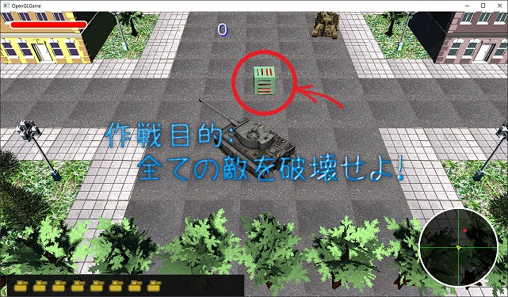
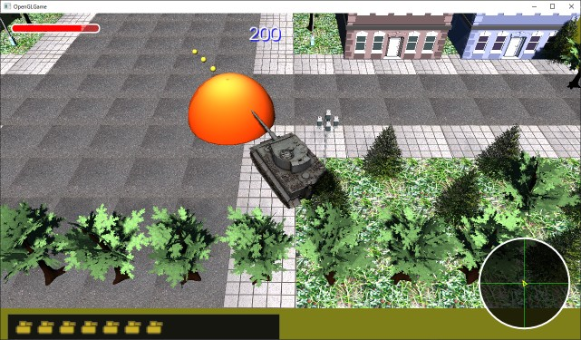

[OpenGL 3D 2021後期 第08回(マップエディタ編)]

# 当たったけど当たっていない

## 習得目標

* 衝突判定の有無を制御できるようになる。
* アイテムを配置できるようになる。

## 1. コリジョンの種類

### 1.1 同じ組み合わせの衝突判定が2回行われる問題を修正する

最初に、コード作成中に見つかったバグを修正させてください。テキスト後期第01回1.11節において、衝突判定の回数を減らしましたが、そのときの修正内容にバグがありました。

このバグは「非スタティックアクター同士の衝突判定が2回行われる」というもので、アクターAとアクターBがあるとき、A, Bという組み合わせと、B, Aという組み合わせで衝突判定が実行されるために発生します。

本節では、`std::partition`(エスティーディ・パーティション)関数を使ってこのバグを修正します。`GameEngine.cpp`を開き、アップデートフィジックス関数を次のように変更してください。

```diff
 void GameEngine::UpdatePhysics(float deltaTime)
 {
   ActorList& actors = GetActors(Layer::Default);

-  // 非スタティックなアクターをリストアップ
-  ActorList nonStaticActors;
-  nonStaticActors.reserve(actors.size());
-  for (const std::shared_ptr<Actor>& e : actors) {
-    if (!e->isStatic) {
-      nonStaticActors.push_back(e);
-    }
-  }
+  // アクターを非スタティックとスタティックに分ける
+  ActorList partitionedActors = actors;
+  const auto itrEndA = std::partition(
+    partitionedActors.begin(), partitionedActors.end(),
+    [](const ActorList::value_type& e) { return !e->isStatic; });
+  const auto itrEndB = partitionedActors.end();

   std::vector<Contact> contacts;
   contacts.reserve(actors.size());
-  for (std::shared_ptr<Actor>& a : nonStaticActors) {
+  for (auto itrA = partitionedActors.begin(); itrA != itrEndA; ++itrA) {
+    std::shared_ptr<Actor>& a = *itrA;
-    for (std::shared_ptr<Actor>& b : actors) {
+    for (auto itrB = itrA + 1; itrB != itrEndB; ++itrB) {
+      std::shared_ptr<Actor>& b = *itrB;
-      // 同じアクターは衝突しない
-      if (a == b) {
-        continue;
-      }

       // 削除待ちアクターは衝突しない
       if (a->isDead) {
```

`std::partition`は「与えられた範囲を、条件によって区分化する」関数で、以下の書式を持ちます。

<pre class="tnmai_code"><strong>【書式】</strong><code>
区分する位置 std::partition(区分化する範囲の先頭, 区分化する範囲の終端, 区分する条件);
</code></pre>

区分化とは、

>範囲の前方に「条件を満たす要素」を集め、その後ろに「条件を満たさない要素」を集める

という操作です。パーティション関数の戻り値は「条件を満たさない最初の要素の位置」です。

上記のプログラムでは、パーティション関数によって、非スタティックなアクターを前方に集めています。

その上で、内側のループの最初の要素を「外側のループが参照している要素の次の要素」とすることで、同じ組み合わせが発生しないようにしています。

プログラムが書けたらビルドして実行してください。見た目の違いは何もないので、これまで通りにゲームが動作していたら成功です。

<div style="page-break-after: always"></div>

### 1.2 コリジョンの種類を設定する

ゲームでは常に衝突判定が必要とは限りません。例えば体力が回復するフィールドなど、進入できなければ意味のないコリジョンも存在するからです。

そこで、コリジョンの種類を選択できるようにします。`Actor.h`を開き、次のプログラムを追加してください。

```diff
   FragmentLighting,
   Ground,
 };
+
+/**
+* 衝突判定の種類
+*/
+enum class CollisionType
+{
+  block,       // 衝突判定を行う(通過させない)
+  trigger,     // 交差していることを通知するだけ
+  noCollision, // 衝突判定を行わない
+};

 /**
 * 物体を制御するパラメータ.
```

次に、アクタークラスの定義に次のプログラムを追加してください。

```diff
   virtual void OnUpdate(float deltaTime);
   virtual void OnCollision(const struct Contact& contact);
+  virtual void OnTrigger(std::shared_ptr<Actor> other) {}

   std::string name;                // アクターの名前
   RendererPtr renderer;            // 描画オブジェクト
```

`OnTrigger`(オン・トリガー)仮想関数は、衝突判定の種類が「トリガー」の場合に実行されます。

続いて、アクタークラスに衝突判定の種類を追加します。アクタークラスの定義に次のプログラムを追加してください。

```diff
   float health = 10;               // 耐久値
   bool isDead = false;             // false=死亡(削除待ち) true=生存中

+  CollisionType collisionType = CollisionType::block;
   Box collider; // 衝突判定
   float mass = 1;                  // 質量(kg)
   float cor = 0.4f;                // 反発係数
```

最後に`Actor.cpp`を開き、ディテクトコリジョン関数の定義に次のプログラムを追加してください。

```diff
   if (dz1 <= 0) {
     return false;
   }
+
+  // ブロックしないアクターが含まれる場合、接触処理を行わない
+  if (actorA.collisionType != CollisionType::block ||
+    actorB.collisionType != CollisionType::block) {
+    return true;
+  }

  // XYZの各軸について重なっている距離が短い方向を選択する
  glm::vec3 normal;  // 衝突面(アクターBのいずれかの面)の法線
```

これで、両方のアクターがブロックする設定になっているときだけ、衝突判定が実行されるようになります。

### 1.3 ゲームエンジンを修正する

次にゲームエンジンを修正します。まず、衝突判定を行わないアクターを衝突判定ループから除外します。`GameEngine.cpp`を開き、アップデートフィジックス関数の定義に次のプログラムを追加してください。

```diff
   std::vector<Contact> contacts;
   contacts.reserve(actors.size());
   for (auto itrA = partitionedActors.begin(); itrA != itrEndA; ++itrA) {
     std::shared_ptr<Actor>& a = *itrA;
+    if (a->collisionType == CollisionType::noCollision) {
+      continue;
+    }
+
     for (auto itrB = itrA + 1; itrB != itrEndB; ++itrB) {
       std::shared_ptr<Actor>& b = *itrB;
+      if (b->collisionType == CollisionType::noCollision) {
+        continue;
+      }
 
       // 削除待ちアクターは衝突しない
       if (a->isDead) {
```

それから、トリガーが指定されたアクターについて、オントリガー仮想関数を呼び出します。アップデートフィジックス関数の定義に次のプログラムを追加してください。

```diff
     Contact contact;
     if (DetectCollision(*a, *b, contact)) {
+      // ブロックしないアクターが含まれる場合、接触処理を行わない
+      if (a->collisionType != CollisionType::block ||
+        b->collisionType != CollisionType::block) {
+        a->OnTrigger(b);
+        b->OnTrigger(a);
+        continue; // 以降の処理をスキップ
+      }
+
       // 配列の中に、作成したコンタクト構造体と似ているものがあるか調べる
       auto itr = std::find_if(contacts.begin(), contacts.end(),
```

これで、交差判定は行うけれど衝突判定は行わないアクターを作れるようになりました。

### 1.4 修理アイテムを作成する

トリガーを使って、修理アイテムを作ります。プロジェクトの`Src\Actor`フォルダに`RepairItem.h`というヘッダファイルを追加してください。追加したファイルを開き、次のプログラムを追加してください。

```diff
+/**
+* @file RepairItem.h
+*/
+#ifndef REPAIRITEM_H_INCLUDED
+#define REPAIRITEM_H_INCLUDED
+#include "../Actor.h"
+
+/**
+* HP修理アイテム
+*/
+class RepairItem : public Actor
+{
+public:
+  explicit RepairItem(const glm::vec3& position);
+  virtual ~RepairItem() = default;
+  virtual std::shared_ptr<Actor> Clone() const {
+    return std::make_shared<RepairItem>(*this));
+  }
+
+  virtual void OnUpdate(float) override;
+  virtual void OnTrigger(std::shared_ptr<Actor> other) override;
+};
+
+#endif // REPAIRITEM_H_INCLUDED
```

次に、プロジェクトの`Src\Actor`フォルダに`RepairItem.cpp`というCPPファイルを追加してください。追加したファイルを開き、次のプログラムを追加してください。

```diff
+/**
+* @file RepairItem.cpp
+*/
+#include "RepairItem.h"
+#include "../GameEngine.h"
+
+/**
+* コンストラクタ
+*/
+RepairItem::RepairItem(const glm::vec3& position) :
+  Actor("Repair",
+    GameEngine::Get().GetPrimitive("Res/Cube.obj"),
+    GameEngine::Get().LoadTexture("Res/Bullet.tga"),
+    position, glm::vec3(1), 0, glm::vec3(0, 0, 0))
+{
+  isStatic = true;
+  collisionType = CollisionType::trigger;
+  collider = Box{ glm::vec3(-1, 0, -1), glm::vec3(1, 2, 1) };
+}
```

プリミティブとテクスチャは仮データです。次の課題を行って、回復アイテムらしい見た目になるようにしてください。

<pre class="tnmai_assignment">
<strong>【課題01】</strong>
アセットストアから、修理アイテムに使えそうなOBJファイルとテクスチャをダウンロードし、修理アイテムのコンストラクタにファイル名を設定しなさい。
</pre>

続いてオンアップデート関数を定義します。コンストラクタの定義の下に、次のプログラムを追加してください。

```diff
   collisionType = CollisionType::trigger;
   collider = Box{ glm::vec3(-1, 0, -1), glm::vec3(1, 2, 1) };
 }
+
+/**
+* アクターの状態を更新
+*/
+void RepairItem::OnUpdate(float deltaTime)
+{
+  rotation += deltaTime;
+  if (rotation >= glm::radians(360.0f)) {
+    rotation -= glm::radians(360.0f);
+  }
+}
```

更新処理では`rotation`変数を操作して、アイテムを回転させています。何の動きもないとアイテムだと分かりにくいからです。

最後にオントリガー関数を定義します。オンアップデート関数の定義の下に、次のプログラムを追加してください。

```diff
     rotation -= glm::radians(360.0f);
   }
 }
+
+/**
+* 他のアクターと交差したときの処理
+*/
+void RepairItem::OnTrigger(std::shared_ptr<Actor> other)
+{
+  if (other->name == "Tiger-I") {
+    // プレイヤーの体力を回復
+    other->health += 5;
+    // 最大値を超えないようにする
+    if (other->health >= 10) {
+      other->health = 10;
+    }
+    isDead = true; // アイテムを消す
+  }
+}
```

交差した相手が`Tiger-I`、つまりプレイヤーだった場合、プレイヤーの体力を`5`回復させます。その後、`isDead`を`true`にして、アイテム自身を消します。

### 1.5 マップエディタに回復アイテムを追加する

アイテムをマップに配置できるようにします。まずマップエディタモードに切り替えます。`Main.cpp`を開き、エディットモードフラグを`true`にしてください。

```diff
   // マップエディタを作成
-  const bool isEditMode = false; // エディタを起動しない場合はfalseにする
+  const bool isEditMode = true; // エディタを起動しない場合はfalseにする
   std::shared_ptr<MapEditor> mapEditor;
   if (isEditMode) {
```

それではマップエディタを修正しましょう。`MapEditor.cpp`を開き、回復アイテムのヘッダファイルをインクルードしてください。

```diff
 #include "MapEditor.h"
 #include "Actor/PlayerActor.h"
 #include "Actor/T34TankActor.h"
+#include "Actor/RepairItem.h"
 #include "Actor/Boss01.h"
 #include "GameEngine.h"
```

次にアクター配列に回復アイテムを追加します。イニットアクターリスト関数の最後に、次のプログラムを追加してください。

```diff
     actors.push_back(actor);
   }
+
+  // リストに回復アイテムを追加
+  actors.push_back(std::make_shared<RepairItem>(glm::vec3(0)));
 }

 /**
 * エディタを動かすために必要な変数を初期化する
```

プログラムが書けたらビルドして実行してください。

<pre class="tnmai_assignment">
<strong>【課題02】</strong>
マップをロードし、適当な位置に2～3個の回復アイテムを追加してからセーブしなさい。
</pre>

回復アイテムを配置したら、ゲームモードに戻って動作を確認しましょう。`Main.cpp`を開き、エディットモードフラグを`false`に戻します。

```diff
   // マップエディタを作成
-  const bool isEditMode = true; // エディタを起動しない場合はfalseにする
+  const bool isEditMode = false; // エディタを起動しない場合はfalseにする
   std::shared_ptr<MapEditor> mapEditor;
   if (isEditMode) {
```

プログラムが書けたらビルドして実行してください。マップに回復アイテムが表示され、ダメージを受けたあとでアイテムに接触すると、体力が回復することを確認してください。

<p align="center">

</p>

<pre class="tnmai_assignment">
<strong>【課題03】</strong>
回復アイテムを取得したときに効果音を再生しなさい。
</pre>

>**【1章のまとめ】**<br>
>
>* アイテムのように、接触を判定できれば十分な場合、コリジョンの種類をトリガーに指定する。
>* トリガーにすると衝突判定が行われないので、`isStatic`メンバを`true`にする必要がある。

<div style="page-break-after: always"></div>

## 2. 爆発を表示する

### 2.1 爆発モデルを追加する

敵戦車を倒したときに何も表示されないのは不自然です。そこで球形モデルを爆発に見立てて表示します。

<pre class="tnmai_assignment">
<strong>【課題04】</strong>
以下の手順で爆発モデルを作成しなさい。
モデルの作成手順は以前作成した「弾モデル」と同じなので、前のテキストを参考にすると良いでしょう。

1. Visual Studioで「ファイル→新規作成→ファイル」を選択する。
2. 「グラフィックス→3Dシーン」を選択して「開く」ボタンを押す。すると3Dシーンが表示される。
3. 3Dシーン上部にあるブリーフケース型のアイコンをクリックして「ツールボックス」を表示する。
4. 「球体」をダブルクリックしてシーンに追加する。
5. 「ファイル→名前を付けて～を保存」を選択する。
6. ファイル名を`Explosion.obj`に変更する。
7. ファイルの種類を「Wavefront OBJファイル」に変更する。
8. 保存先をプロジェクトの`Res`フォルダに変更する。
9. 「保存」をクリックする。
</pre>

<pre class="tnmai_assignment">
<strong>【課題05】</strong>
以下の手順で爆発モデルのテクスチャを作成しなさい。

1. Visual Studioで「ファイル→新規作成→ファイル」を選択する。
2. 「グラフィックス→TGAイメージ」を選択して「開く」ボタンを押す。すると画像エディタが表示される。
3. プロパティウィンドウの幅を32, 高さを32にする。
4. 画像の上半分を黄色、下半分を暗い赤色で塗る(適当でよい)。
5. ウィンドウ上部のアイコン列の右端の小さな三角アイコンをクリックして「詳細メニュー」を表示する。
6. 「フィルター→ぼかし」を選択する。
7. ぼかしをあと3回(合計4回)行う。
8. 「ファイル→名前を付けて～を保存」を選択する。
9. ファイル名を`Explosion.tga`に変更する。
10. 保存先をプロジェクトの`Res`フォルダに変更する。
11. 「保存」をクリックする。
</pre>

作成したOBJファイルを読み込みます。`MapEditor.cpp`を開き、ロードコモンプリミティブ関数に次のプログラムを追加してください。

```diff
   engine.LoadPrimitive("Res/Plane.obj");
   engine.LoadPrimitive("Res/Bullet.obj");
+  engine.LoadPrimitive("Res/Explosion.obj");
 }

 /**
 * 地面用アクターを作成
```

### 2.2 爆発アクターを追加する

それではアクター派生クラスを追加しましょう。クラス名は`ExplosionActor`(エクスプロージョン・アクター)とします。

プロジェクトの`Src\Actor`フォルダに`ExplosionActor.h`というファイルを追加してください。追加したファイルを開き、次のプログラムを追加してください。

```diff
+/**
+* @file ExplosionActor.h
+*/
+#ifndef EXPLOSIONACTOR_H_INCLUDED
+#define EXPLOSIONACTOR_H_INCLUDED
+#include "../Actor.h"
+
+/**
+* 爆発
+*/
+class ExplosionActor : public Actor
+{
+public:
+  ExplosionActor(const glm::vec3& position, float scale);
+  virtual ~ExplosionActor() = default;
+  virtual std::shared_ptr<Actor> Clone() const {
+    return std::make_shared<ExplosionActor>(*this);
+  }
+
+  virtual void OnUpdate(float) override;
+
+private:
+  float scale = 1;
+  float timer = 0;
+};
+
+#endif // EXPLOSIONACTOR_H_INCLUDED
```

次にプロジェクトの`Src\Actor`フォルダに`ExplosionActor.cpp`というファイルを追加してください。追加したファイルを開き、次のプログラムを追加してください。

```diff
+/**
+* @file ExplosionActor.cpp
+*/
+#include "ExplosionActor.h"
+#include "../GameEngine.h"
+
+/**
+* コンストラクタ
+*
+* @param position 表示位置
+* @param scale    爆発の半径(m)
+*/
+ExplosionActor::ExplosionActor(const glm::vec3& position, float scale) :
+  Actor("Explosion",
+    GameEngine::Get().GetPrimitive("Res/Explosion.obj"),
+    GameEngine::Get().LoadTexture("Res/Explosion.tga"),
+    position, glm::vec3(0.1f), 0, glm::vec3(0)),
+  scale(scale)
+{
+  // 重力の影響をなくす
+  isStatic = true;
+
+  // 衝突判定をなくす
+  collisionType = CollisionType::noCollision;
+}
```

次にオンアップデート関数を定義します。コンストラクタの定義の下に、次のプログラムを追加してください。

```diff
   // 衝突判定をなくす
   collisionType = CollisionType::noCollision;
 }
+
+/**
+* アクターの状態を更新する
+*/
+void ExplosionActor::OnUpdate(float deltaTime)
+{
+  rotation += glm::radians(180.0f) * deltaTime;
+
+  timer += deltaTime;
+
+  const float totalTime = 0.5f; // 爆発表示時間(秒)
+  const float t = timer / totalTime; // 0-1に変換
+
+  // 0.1倍で始まり、徐々に1.0倍へと爆発を大きくする
+  const float baseScale = scale * 0.1f;
+  Actor::scale = glm::vec3(baseScale + scale * 0.9f * t);
+
+  // 爆発表示時間を過ぎたら自分自身を削除
+  if (timer >= totalTime) {
+    isDead = true;
+  }
+}
```

爆発を拡大するプログラムで`Actor::scale`という書き方をしている理由は、アクタークラスとエクスプロージョンアクタークラスの両方が、`scale`というメンバ変数を持っているからです。

名前が重複する場合、基本的には派生クラスのメンバが優先されます。基底クラスのメンバを使いたいときは、上記のプログラムのように「クラス名::メンバ変数名」と書きます。

これで爆発アクターは完成です。

### 2.3 爆発アクターを表示する

それでは爆発アクターを表示しましょう。`T34TankActor.cpp`を開き、次のヘッダファイルをインクルードしてください。

```diff
 * @file T34TankActor.cpp
 */
 #include "T34TankActor.h"
 #include "BulletActor.h"
+#include "ExplosionActor.h"
 #include "../GameEngine.h"
 #include "../GameManager.h"
```

次に、オンコリジョン関数に次のプログラムを追加してください。

```diff
     if (health <= 0) {
       isDead = true; // T-34戦車を消去する
       GameManager::Get().AddScore(200);
+
+      GameEngine& engine = GameEngine::Get();
+      engine.AddActor(std::make_shared<ExplosionActor>(position, 4.0f));

       // 爆発音を再生
       Audio::PlayOneShot(SE_EXPLOSION);
```

プログラムが書けたらビルドして実行してください。T34戦車を破壊したとき、球形の爆発が表示されていたら成功です。

<p align="center">

</p>

<pre class="tnmai_assignment">
<strong>【課題06】</strong>
ボスが死ぬときに大きな爆発を表示しなさい。
</pre>

>**【2章のまとめ】**<br>
>
>* 爆発のような単なるエフェクトは、衝突判定をなくすとよい。
>* 衝突判定をなくすと、当然ながら衝突判定は行われないので、`isStatic`を`true`にする必要がある。
