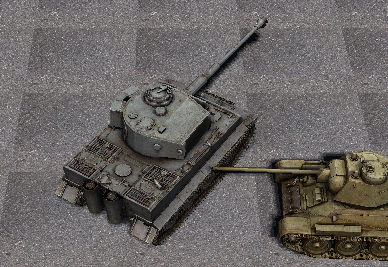
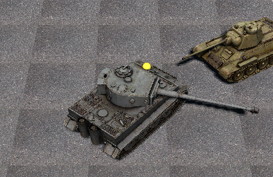
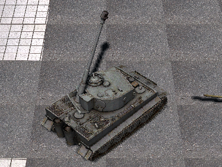
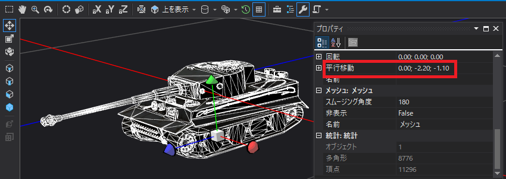
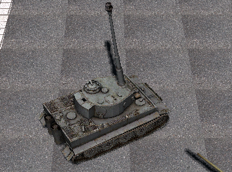
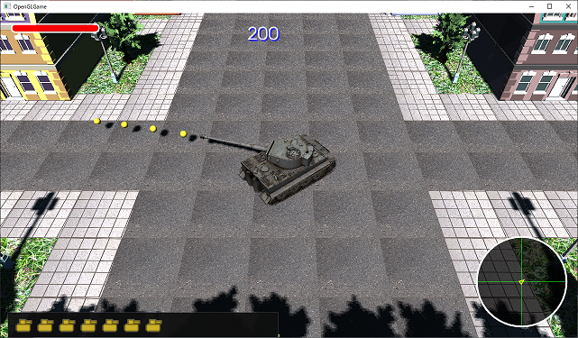

[OpenGL 3D 2021後期 第09回]

# グループと関節

## 習得目標

* シェーダで行列の配列を扱うことができる。
* グループに親子関係を設定する方法と、親子関係の使いかたを理解する。
* バインドポーズ行列、逆バインドポーズ行列のしくみを理解する。

## 1. グループ番号の使いみち

### 1.1 グループごとに座標変換行列を割り当てる

前回のテキストでは、OBJファイルからマテリアル番号とグループ番号を取得し、頂点データに割り当てました。そして、マテリアル番号を活用して、プリミティブに複数のテクスチャを割り当てられるようにしました。

一方、グループ番号は特に使いませんでした。そこで、今回はグループ番号を使って「グループ単位で座標変換ができる」ようにします。

OBJファイルのドキュメントによると、「グループ」の用途は、

>要素の集合を組織化し、モデル編集のためのデータ操作を簡素化する

となっています(ここでいう「要素」とは、`f`構文で示される面データのことです)。

「組織化」が実際に何を表すのかは、モデル作成者の自由です。しかし、大抵はモデルのパーツ分けを表すために使われます。実際に、タイガーI戦車の場合は、`o`を使って以下のようにパーツ分けされています。

| グループ名 | 部位 |
|:--|:-:|
| Gun_Object_1.003      | <ruby>砲身<rt>ほうしん</rt></ruby> |
| Turret_Object_1.002   | <ruby>砲塔<rt>ほうとう</rt></ruby> |
| Hull_Object_1.001     | 車体 |
| Wheels_Right_Object_4 | 右の車輪 |
| Wheels_Left_Object_3  | 左の車輪 |
| Track_Right_Object_2  | 右の<ruby>履帯<rt>りたい</rt></ruby> |
| Track_Left_Object_1   | 左の履帯 |

ここで、例えば「砲塔」グループに含まれる頂点にだけ回転行列を追加できたなら、砲塔を好きな方向に向けることができるはずです。

これは比較的簡単に実現できます。シェーダにグループ用の座標変換行列の配列を追加し、セットユニフォーム関数でデータをコピーするだけです。`FragmentLighting.vert`を開き、次のプログラムを追加してください。

```diff
 layout(location=1) uniform mat4 matModel;
 layout(location=10) uniform vec4 materialColor[10];
 layout(location=20) uniform uint materialTextureNo[10];
+layout(location=30) uniform mat4 matGroupModels[32];

 // 頂点シェーダプログラム
 void main()
```

ユニフォーム変数名は「グループ単位のモデル行列」という意味を込めて、`matGroupModels`
(マット・グループ・モデルズ)としました。マットグループモデルズ配列には、グループ番号に対応する座標変換行列がコピーされます。

グループの最大数は`32`としました。理由は、以前にも説明したように、ユニフォーム変数の最大数は`float`型換算で1024個までだからです。

4x4行列は、ひとつで`float`16個分に相当するため、あまりたくさん作ることはできません。かといって、あまり少ないとグループの多いOBJファイルに対応できません。そういうわけで、最大数の半分に当たる`32`個に設定しています(`16 * 32 = 512`)。

グループ行列に加えて、`matTRS`等の既存のユニフォーム変数でさらに`82`個は使用済みです。それでもまだ`400`個ほどは自由に使えますから、すぐ足りなくなることはないでしょう。

次に、グループ行列とモデル行列を合成します。そして、これまでモデル行列を使っていた計算を、「グループ行列合成済みのモデル行列」を使うように置き換えます。メイン関数を次のように変更してください。

```diff
 // 頂点シェーダプログラム
 void main()
 {
+  // グループ行列とモデル行列を合成
+  mat4 matGroup = matGroupModels[uint(vMaterialGroup.y)];
+  mat4 matGM = matModel * matGroup;
+
   // 回転行列を取り出す
-  mat3 matNormal = transpose(inverse(mat3(matModel)));
+  mat3 matNormal = transpose(inverse(mat3(matGM)));

   // ワールド座標系の法線を計算
   vec3 worldNormal = normalize(matNormal * vNormal);

   uint materialNo = uint(vMaterialGroup.x);
   outColor = vColor * materialColor[materialNo];
   outTexcoord = vTexcoord;
   outNormal = worldNormal;
-  outPosition = vec3(matModel * vec4(vPosition, 1.0));
+  outPosition = vec3(matGM * vec4(vPosition, 1.0));
   outTextureNo = materialTextureNo[materialNo];
-  gl_Position = matTRS * vec4(vPosition, 1.0);
+  gl_Position = matTRS * (matGroup * vec4(vPosition, 1.0));
 }
```

これで、グループ行列を座標計算に組み込むことができました。

### 1.2 メッシュレンダラーにグループ行列を追加する

次に、頂点シェーダに追加したグループ行列のユニフォーム変数に、グループの座標変換行列をコピーするプログラムを作成します。ユニフォーム変数へのコピーは、プログラムパイプラインクラスで行っています。

しかし、4x4行列をコピーするメンバ関数はないので、まず4x4行列をコピーする関数を追加しましょう。`ProgramPipeline.h`を開き、次のプログラムを追加してください。

```diff
   bool SetUniform(GLint, const glm::vec4&) const;
   bool SetUniform(GLint, const glm::vec4*, size_t) const;
   bool SetUniform(GLint, const glm::uint*, size_t) const;
+  bool SetUniform(GLint, const glm::mat4*, size_t) const;

   // バインド管理
   void Bind() const;
```

<pre class="tnmai_assignment">
<strong>【課題01】</strong>
<code>glm::mat4</code>の配列をコピーする<code>SetUniform</code>メンバ関数について、関数定義を作成しなさい。
</pre>

### 1.3 メッシュレンダラーにグループ行列を追加する

コピー先となるユニフォーム変数のロケーション番号を定義します。<br>
定数名は`locMatGroupModels`(ロク・マット・グループ・モデルズ)とします。
`Renderer.h`を開き、レンダラークラスの定義に次のプログラムを追加してください。

```diff
   static const GLint locMaterialColor = 10;
   static const GLint locMaterialTexture = 20;
+  static const GLint locMatGroupModels = 30;

   Renderer() = default;
   virtual ~Renderer() = default;
```

次に、コピー元となる配列変数を追加します。変数名は`matGroupModels`(マット・グループ・モデルズ)とします。メッシュレンダラークラスの定義に次のプログラムを追加してください。

```diff
   TextureList textures;
   TextureIndexList textureIndices;
   std::vector<glm::vec4> colors;
+  std::vector<glm::mat4> matGroupModels; // グループ用の座標変換行列
 };

 #endif // RENDERER_H_INCLUDED
```

続いて、このメンバ変数を操作するメンバ関数を追加します。メッシュレンダラークラスの定義に次のプログラムを追加してください。

```diff
   const Mesh::Material& GetMaterial(size_t i) const { return materials[i]; }
   size_t GetMaterialCount() const { return materials.size(); }

+  // グループ行列を設定する
+  void SetGroupMatrix(size_t i, const glm::mat4& m) { matGroupModels[i] = m; }
+
+  // グループ行列を取得する
+  const glm::mat4& GetGroupMatrix(size_t i) const { return matGroupModels[i]; }
+
+  // グループ数を取得する
+  size_t GetGroupCount() const { return matGroupModels.size(); }

 private:
   MeshPtr mesh;
   std::vector<Mesh::Material> materials;
```

最後に、グループ行列をGPUメモリにコピーするプログラムを追加します。グループ行列が必要なのは、デフォルトレイヤーの場合だけです。

`Renderer.cpp`を開き、メッシュレンダラーのドロー関数の、マテリアルデータを設定するプログラムの下に、次のプログラムを追加してください。

```diff
     pipeline.SetUniform(locMaterialColor, colors.data(), colors.size());
     pipeline.SetUniform(locMaterialTexture,
       textureIndices.data(), textureIndices.size());
+
+    // グループ行列を設定
+    pipeline.SetUniform(
+      locMatGroupModels, matGroupModels.data(), matGroupModels.size());
   }

   const GLuint bindingPoints[] = { 0, 2, 3, 4 };
   const size_t size = std::min(textures.size(), std::size(bindingPoints));
```

これでグループ行列を設定すれば、それがGPUメモリにコピーされ、シェーダで使えるようになるはずです。

### 1.4 グループ行列を初期化する

グループ行列を使うには、どこかのタイミングで初期化しなくてはなりません。また、グループ行列の総数はメッシュによって異なります。ということは、メッシュが変更されたらグループ行列の総数も更新しなくてはなりません。

そこで、セットメッシュ関数でメッシュを設定するときに、グループ行列の初期化も行うようにします。セットメッシュ関数に次のプログラムを追加してください。

```diff
   mesh = p;
   if (mesh) {
     materials = mesh->materials;
+    matGroupModels.resize(mesh->groups.size(), glm::mat4(1));
     materialChanged = true;
   }
 }
```

これで、グループ行列の配列サイズが初期化(および更新)されるようになりました。

### 1.5 プリミティブレンダラーをグループ行列に対応させる

プリミティブレンダラー自身はグループ行列を持ちません(グループがないので)。しかし、シェーダはメッシュレンダラーと共通です。実際、グループが定義されていないOBJファイルの場合、すべての頂点のグループ番号は0になります。

つまり、プリミティブレンダラーであっても、最低ひとつのグループ行列を設定する必要があるのです。プリミティブレンダラーのドロー関数に、次のプログラムを追加してください。

```diff
     const glm::uint texture = 0;
     pipeline.SetUniform(locMaterialColor, glm::vec4(1));
     pipeline.SetUniform(locMaterialTexture, &texture, 1);
+
+    // グループ行列を設定
+    pipeline.SetUniform(locMatGroupModels, glm::mat4(1));
   }

   if (tex) {
     tex->Bind(0); // テクスチャを割り当てる
```

これで、プリミティブレンダラーもグループ行列を処理できるようになりました。

プログラムが書けたらビルドして実行してください。描画に影響が出ていなければ(おそらく)成功です。

### 1.6 グループ行列を使う

ここまでで問題がなければ、グループ行列に値を設定して、どうなるか実験してみましょう。
`PlayerActor.h`を開き、プレイヤーアクタークラスの定義に次のプログラムを追加してください。

```diff
 private:
   int oldShotButton = 0;            // 前回のショットボタンの状態
+  float rotTurret = 0;              // 砲塔の回転角度
+  static const int turretGroup = 1; // 砲塔のグループ番号
 };

 #endif // PLAYERACTOR_H_INCLUDED
```

砲塔のグループ番号は`1`です。これは、1番目のOBJファイルのグループ名が
`Turret_Object_1.002`(タレット・オブジェクト)となっていることから予想できます(タレットは「砲塔」という意味)。

>**【グループ名の正当性】**<br>
>グループ名が正しく名付けられているという保証はありません。間違っている可能性もあります。正しいグループ番号は、実際にグループ行列に値を設定して動かしてみれば、すぐに分かるでしょう。

続いて`PlayerActor.cpp`を開き、オンアップデート関数に次のプログラムを追加してください。

```diff
void PlayerActor::OnUpdate(float deltaTime)
{
  GameEngine& engine = GameEngine::Get();
+
+  // 砲塔を回転させる実験
+  MeshRenderer& meshRenderer = static_cast<MeshRenderer&>(*renderer);
+  MeshPtr mesh = meshRenderer.GetMesh();
+  if (mesh) {
+    // 砲塔をY軸回転させる行列を作成
+    const glm::mat4 matRot =
+      glm::rotate(glm::mat4(1), rotTurret, glm::vec3(0, 1, 0));
+
+    // 回転行列を砲塔のグループ行列に設定
+    meshRenderer.SetGroupMatrix(turretGroup, matRot);
+
+    // 砲塔を30°毎秒の速度で回転
+    rotTurret += glm::radians(30.0f) * deltaTime;
+  }

   if (engine.GetKey(GLFW_KEY_A)) {
     rotation += glm::radians(90.0f) * deltaTime;
```

プログラムが書けたらビルドして実行してください。タイガーI戦車の砲塔が回転していたら成功です。このように、グループ番号を使うと、パーツごとに異なる座標変換を実行することができます。

<p align="center">

</p>

### 1.7 グループに親子関係を追加する

砲塔を回転させたとき、現実の戦車であれば砲身も一緒に回転するはずです。しかし、ゲーム内の戦車では、砲身はぴくりとも動きません。これは、グループの関係性を定義していないからです。

そこで、グループ間に親子関係を設定することにします。なお、ここでいう「親子関係」とは、

>子のグループ行列は、親のグループ行列の影響を受ける(行列を乗算する)

という意味です。

まずは親のグループ番号を指定できるようにします。`Primitive.h`を開き、グループ構造体の定義に「親グループ番号」を表すメンバ変数を追加してください。

```diff
   struct Group
   {
     std::string name; // グループ名
     GLsizei indexCount = 0; // グループに含まれるインデックスデータの数

+    static const int noParent = -1; // 親がいないことを示す定数
+    int parent = noParent; // 親グループ番号
   };

   Mesh() = default;
   ~Mesh() = default;
```

次に、親子関係を考慮したグループ行列を計算するメンバ関数を宣言します。メッシュレンダラークラスの定義に、次のプログラムを追加してください。

```diff
   // グループ数を取得する
   size_t GetGroupCount() const { return matGroupModels.size(); }

 private:
+  void CalcNthGroupMatrix(int n,
+    std::vector<glm::mat4>& m, std::vector<bool>& calculated) const;
+  std::vector<glm::mat4> CalcGroupMatirices() const;
+
   MeshPtr mesh;
   std::vector<Mesh::Material> materials;
```

`CalcNthGroupMatrix`(カルク・エヌス・グループ・マトリクス)は、「`n`番目のグループ行列を計算する」関数です(`Nth`は任意の数字を表す`N`に「～番目、～回目」を意味する接尾辞`th`を付けた英単語です)。

`CalcGroupMatrices`(カルク・グループ・マトリシーズ)は、「グループ行列を計算する」関数です。すべてのグループに対してカルクエヌスグループマトリクス関数を呼び出すことで、グループ行列を計算します。

まず、カルク・エヌス・グループ・マトリクス関数を定義します。`Renderer.cpp`を開き、セットメッシュ関数の定義の下に、次のプログラムを追加してください。

```diff
     materialChanged = true;
   }
 }
+
+/**
+* 親子関係を考慮してN番目のグループ行列を計算する
+*/
+void MeshRenderer::CalcNthGroupMatrix(int n,
+  std::vector<glm::mat4>& m, std::vector<bool>& calculated) const
+{
+  // 計算済みなら何もしない
+  if (calculated[n]) {
+    return;
+  }
+
+  // N番目の行列を設定
+  m[n] = matGroupModels[n];
+
+  // 親がいる場合、親のグループ行列を乗算
+  const int parent = mesh->groups[n].parent;
+  if (parent != Mesh::Group::noParent) {
+    CalcNthGroupMatrix(parent, m, calculated);
+    m[n] = m[parent] * m[n];
+  }
+
+  // 計算が完了したので計算済みフラグを立てる
+  calculated[n] = true;
+}
```

引数`m`は計算結果のグループ行列を格納する配列、`calculated`(カルキュレーテッド)は、行列が計算済みであることを表すフラグ配列です。

親がいる場合、まず親のグループ行列を計算してから自分のグループ行列に乗算します。ここでは<ruby>再帰<rt>さいき</rt></ruby>を使うことで、親の親の親の…というように、最初の親までさかのぼってグループ行列を計算しています。

次に、カルク・グループ・マトリシーズ関数を定義します。カルクエヌスグループマトリクス関数の定義の下に、次のプログラムを追加してください。

```diff
   // 計算が完了したので計算済みフラグを立てる
   calculated[n] = true;
 }
+
+/**
+* 親子関係を考慮してすべてのグループ行列を計算する
+*/
+std::vector<glm::mat4> MeshRenderer::CalcGroupMatirices() const 
+{
+  // メッシュが設定されていなければ空の配列を返す
+  if (!mesh) {
+    return std::vector<glm::mat4>();
+  }
+
+  // グループ行列を計算する
+  std::vector<glm::mat4> m(mesh->groups.size());
+  std::vector<bool> calculated(m.size(), false);
+  for (int n = 0; n < m.size(); ++n) {
+    CalcNthGroupMatrix(n, m, calculated);
+  }
+  return m;
+}
```

これで、親子関係を考慮したグループ行列を計算できるようになりました。

最後に、親子関係を考慮したグループ行列をGPUメモリにコピーします。メッシュレンダラーのドロー関数を次のように変更してください。

```diff
     pipeline.SetUniform(locMaterialTexture,
       textureIndices.data(), textureIndices.size());

     // グループ行列を設定
+    const std::vector<glm::mat4> m = CalcGroupMatrices();
-    pipeline.SetUniform(
-      locMatGroupModels, matGroupModels.data(), matGroupModels.size());
+    pipeline.SetUniform(locMatGroupModels, m.data(), m.size());
   }

   const GLuint bindingPoints[] = { 0, 2, 3, 4 };
   const size_t size = std::min(textures.size(), std::size(bindingPoints));
```

### 1.8 親子関係を設定する

親子関係を設定できるようになったので、砲塔を砲身の親に設定します。まず砲身のグループ番号を定義します。`PlayerActor.h`を開き、プレイヤーアクタークラスの定義に次のプログラムを追加してください。

```diff
 private:
   int oldShotButton = 0;            // 前回のショットボタンの状態
   float rotTurret = 0;              // 砲塔の回転角度
+  static const int gunGroup    = 0; // 砲身のグループ番号
   static const int turretGroup = 1; // 砲塔のグループ番号
 };
```

続いて`PlayerActor.cpp`を開き、コンストラクタに次のプログラムを追加してください。

```diff
 {
   health = 10;
   collider = Cylinder::Create(glm::vec3(0), 1.8f, 2.5f);
+
+  MeshRenderer& meshRenderer = static_cast<MeshRenderer&>(*renderer);
+  MeshPtr mesh = meshRenderer.GetMesh();
+  if (mesh) {
+    // 親子関係を設定
+    Mesh::Group& gun = mesh->groups[gunGroup];
+    gun.parent = turretGroup;
+  }
 }

 /**
 * アクターの状態を更新する
```

プログラムが書けたらビルドして実行してください。砲身が砲塔と一緒に回転していたら成功です。

<p align="center">

</p>

>**【親子関係の設定データについて】**<br>
>FBXやglTFのようなモデルファイルでは、親子関係もデータとして記録しています。残念ながら、OBJファイルには親子関係を定義する構文はありません。

### 1.9 砲身をX軸回転させる

大抵の戦車の砲身は、上げたり下げたりすることができます。これは、X軸回転(またはZ軸回転)で再現することができます。

```diff
     // 砲塔を30°毎秒の速度で回転
     rotTurret += glm::radians(30.0f) * deltaTime;
+
+    // 砲身をX軸回転させる行列を設定
+    static float rotGun = 0; // 実験なのでスタティックで済ませる
+    const glm::mat4 matRotGun =
+      glm::rotate(glm::mat4(1), rotGun, glm::vec3(-1, 0, 0));
+    rotGun += glm::radians(15.0f) * deltaTime;
+    meshRenderer.SetGroupMatrix(gunGroup, matRotGun);
   }

   if (engine.GetKey(GLFW_KEY_A)) {
     rotation += glm::radians(90.0f) * deltaTime;
```

プログラムが書けたらビルドして実行してください。砲身が縦に回転していたら成功です。なんだか思ったのと違う回転をすると思いますが、それで正常です。

<p align="center">

</p>

### 1.10 バインドポーズ行列と逆バインドポーズ行列

砲身がおかしな回転をするのは、回転の原点が砲身の根本ではなく、プリミティブの原点になっているからです。これは、3Dの座標変換が常に原点を基準に行われるためです。

砲身を、砲身の根本を基準に回転させるには、次の手順を踏む必要があります。

>1. 砲身の根本を原点に移動させる。
>2. 座標変換を実行。
>3. 砲身を元の位置に戻す。

3の「原点から本来の位置に移動させる行列」のことを「バインドポーズ行列」といいます。そして1の「本来の位置から原点に移動させる行列」のことを「逆バインドポーズ行列」または「インバースバインドポーズ行列」といいます。

バインドポーズ行列と逆バインドポーズ行列はメッシュクラスに追加します。
`Primitive.h`を開き、メッシュクラスの定義に次のプログラムを追加してください。

```diff
     GLsizei indexCount = 0; // グループに含まれるインデックスデータの数
     static const int noParent = -1; // 親がいないことを示す定数
     int parent = noParent; // 親グループ番号
+    glm::mat4 matBindPose = glm::mat4(1);
+    glm::mat4 matInverseBindPose = glm::mat4(1);
   };

   Mesh() = default;
   ~Mesh() = default;
```

先に挙げた3つの操作は、すべて行列によって表現することができます。行列は乗算することができるので、上記の1～3は次の式にまとめることができます。

>バインドポーズ行列 \* グループ行列 \* 逆バインドポーズ行列

この計算をカルクエヌスグループマトリクス関数に追加します。`Renderer.cpp`を開き、カルクエヌスグループマトリクス関数に次にプログラムを追加してください。

```diff
     return;
   }

   // N番目の行列を設定
-  m[n] = matGroupModels[n];
+  m[n] = mesh->groups[n].matBindPose *  // 3. 本来の位置に戻す
+    matGroupModels[n] *                 // 2. 座標変換を行う
+    mesh->groups[n].matInverseBindPose; // 1. 原点に移動させる

   // 親がいる場合、親のグループ行列を乗算
   const int parent = mesh->groups[n].parent;
```

これでバインドポーズ行列を設定する準備ができました。

次に、バインドポーズ行列を設定します。タイガーI戦車のOBJファイルを開き、砲身の根本が原点に来るように平行移動します(移動させた状態で保存しないように注意！)。

<p align="center">

</p>

プロパティの平行移動情報を見ると、移動させた距離が分かります。それによると、砲身を原点に来させるには、Y軸方向に約-2.2m、Z軸方向に約-1.1m移動させればよさそうです。

この情報は「本来の位置から原点に移動させる数値」、つまり「逆バインドポーズ行列」の値であることに注意してください。

発見した移動量を、砲身の逆バインドポーズ行列に設定しましょう。`PlayerActor.cpp`を開き、コンストラクタに次のプログラムを追加してください。

```diff
     // 親子関係を設定
     Mesh::Group& gun = mesh->groups[gunGroup];
     gun.parent = turretGroup;
+
+    // 逆バインドポーズ行列を設定
+    gun.matInverseBindPose[3][1] = -2.2f; // Y軸平行移動
+    gun.matInverseBindPose[3][2] = -1.1f; // Z軸平行移動
+
+    // 逆バインドポーズ行列からバインドポーズ行列を計算
+    gun.matBindPose = glm::inverse(gun.matInverseBindPose);
   }
 }

 /**
 * アクターの状態を更新する
```

プログラムが書けたらビルドして実行してください。砲身が砲身の根本を中心に回転していたら成功です。

>バインドポーズ行列と逆バインドポーズ行列による座標変換のしくみは、スケルタルアニメーションでも使用されます。

<p align="center">

</p>

>**【1章のまとめ】**<br>
>
>* グループ番号を使うと、グループごとに異なる座標変換行列を設定することができる。
>* グループ間に親子関係を設定するには、親を指定するだけでなく、親の影響を適切に計算する必要がある。
>* 座標変換は原点基準で行われるため、原点にないグループは「バインドポーズ行列」と「逆バインドポーズ行列」を定義することで、原点で座標変換を行うことができる。

<div style="page-break-after: always"></div>

## 2. マウスカーソルを狙う

### 2.1 地面との交差判定関数を移動させる

戦車砲をマウスカーソルのある方向へ向けるには、マウスカーソルが指している3D空間上の座標を知る必要があります。これを行うプログラムは後期第02回のテキストで作成済みです(`ScreenPosToLine`関数と`Intersect`関数)。

しかし、後期第02回ではマップエディタで使うことだけを想定していて、他のプログラムから使うことは考えていませんでした。そこで、まず地面との交差判定を行う関数を、他のプログラムから使えるようにしていきます。

交差判定ということで、`Collision.h`、`Collision.cpp`に移動させるのが適切でしょう。
`Collision.h`を開き、次のプログラムを追加してください。

```diff
 bool CollisionCylinderBox(Actor& a, Actor& b, Contact& contact);
 bool CollisionCylinderSphere(Actor& a, Actor& b, Contact& contact);
+
+void ScreenPosToLine(const glm::vec2& screenPos, const glm::mat4& matVP,
+  glm::vec3& start, glm::vec3& end);
+
+bool Intersect(const glm::vec3& start, const glm::vec3& end,
+  const glm::vec3& q, const glm::vec3& normal, glm::vec3& p);

 #endif // COLLISION_H_INCLUDED
```

続いて、以下の課題を行って関数の定義を移動してください。

<pre class="tnmai_assignment">
<strong>【課題02】</strong>
<code>MapEditor.cpp</code>から<code>ScreenPosToLine</code>と<code>Intersect</code>関数の定義を切り取り、<code>Collision.cpp</code>の末尾に貼り付けなさい。
</pre>

### 2.2 エラーに対処する

関数を貼り付けるといくつかエラーが報告されます。これらのエラーをなくしましょう。
`Collision.cpp`を開き、次のヘッダファイルをインクルードしてください。

```diff
 * @file Collision.cpp
 */
 #include "Collision.h"
 #include "Actor.h"
+#include "GameEngine.h"
 #include <iostream>
 #include <glm/gtc/matrix_transform.hpp>
```

次に、スクリーントゥライン関数の定義を次のように変更してください。

```diff
 * @param start     視線の始点が代入される
 * @param end       視線の終点が代入される
 */
-void ScreenPosToLine(const ImVec2& screenPos, const glm::mat4& matVP,
+void ScreenPosToLine(const glm::vec2& screenPos, const glm::mat4& matVP,
   glm::vec3& start, glm::vec3& end)
 {
   // スクリーン座標をNDC座標に変換
```

これで`Collision.cpp`のエラーはなくなります。しかし、スクリーントゥライン関数の引数を変更したことにより、今度は`MapEditor.cpp`でエラーが報告されます。

`MapEditor.cpp`を開き、 アップデートカメラ関数の定義を次のように変更してください。

```diff
   // カーソル位置を設定
   const glm::mat4 matVP = camera.GetProjectionMatrix() * camera.GetViewMatrix();
   glm::vec3 start, end, p;
+  const ImVec2 mousePos = ImGui::GetMousePos();
-  ScreenPosToLine(ImGui::GetMousePos(), matVP, start, end);
+  ScreenPosToLine(glm::vec2(mousePos.x, mousePos.y), matVP, start, end);
   if (Intersect(start, end, glm::vec3(0), glm::vec3(0, 1, 0), p)) {
     cursor->position = glm::round(p / 4.0f) * 4.0f;
   }
```

これでエラーはなくなるはずです。

### 2.3 ゲームエンジンにマウスカーソル座標を取得する関数を追加する

マップエディタでは`ImGui`からマウスカーソル座標を取得していました。しかし、ゲームエンジンからも取得できたほうが便利でしょう。そこで、ゲームエンジンにマウスカーソルの座標を取得する機能を追加します。

`GameEngine.h`を開き、ゲームエンジンクラスの定義に次のプログラムを追加してください。

```diff
     return glfwGetMouseButton(window, button);
   }
+
+  /**
+  * マウス座標を取得
+  */
+  glm::vec2 GetMousePosition() const;

   /**
   * ウィンドウサイズを返す
```

マウスカーソル座標は`GLFW`ライブラリの`glfwGetCursorPos`(ジーエルエフダブリュー・ゲット・カーソル・ポス)関数で取得します。`GameEngine.cpp`を開き、リサイズグラウンドマップ関数の定義の下に、次のプログラムを追加してください。

```diff
   const GLint locMapSize = 101;
   pipelineGround->SetUniform(locMapSize, glm::vec4(mapSize, 0, 0));
 }
+
+/**
+* マウス座標を取得
+*/
+glm::vec2 GameEngine::GetMousePosition() const
+{
+  double x, y;
+  glfwGetCursorPos(window, &x, &y);
+  return glm::vec2(x, y);
+}
```

これで、ゲームエンジンからマウスカーソルの座標を取得できるようになりました。

>実は`ImGui`の`GetMousePos`関数が返す座標も、内部的には`glfwGetCursorPos`関数で取得した値になっています。

### 2.3 砲塔をマウスカーソルの方向に向ける

移動した関数を使って、砲塔をマウスカーソルの方向に向けましょう。`PlayerActor.cpp`を開き、オンアップデート関数に次のプログラムを追加してください。

```diff
   MeshRenderer& meshRenderer = static_cast<MeshRenderer&>(*renderer);
   MeshPtr mesh = meshRenderer.GetMesh();
   if (mesh) {
+    // マウスカーソル座標と交差する平面の座標と法線
+    const float gunY = mesh->groups[gunGroup].matBindPose[3][1]; // 砲身のY座標
+    const glm::vec3 gunPlanePos = position + glm::vec3(0, gunY, 0); // 平面の座標
+    const glm::vec3 gunPlaneNormal = glm::vec3(0, 1, 0); // 平面の法線
+
+    // 砲塔をマウスカーソルの方向に向ける
+    Camera& camera = engine.GetCamera();
+    const glm::mat4 matVP = camera.GetProjectionMatrix() * camera.GetViewMatrix();
+    glm::vec3 start, end, p;
+    ScreenPosToLine(engine.GetMousePosition(), matVP, start, end);
+    if (Intersect(start, end, gunPlanePos, gunPlaneNormal, p)) {
+      // アクターからマウスカーソルへ向かう方向ベクトルを計算
+      const glm::vec3 d = p - position;
+
+      // アークタンジェント関数で向きベクトルを角度に変換
+      // 0度のときの砲塔の向きは下向きで、数学的な0度(右向き)から-90度の位置にある
+      // 計算で得られた角度に90度を足せば、回転角度とモデルの向きが一致するはず
+      rotTurret = std::atan2(-d.z, d.x) + glm::radians(90.0f);
+
+      // アクターの回転を打ち消す
+      rotTurret -= rotation;
+    }
+
     // 砲塔をY軸回転させる行列を作成
     const glm::mat4 matRot =
       glm::rotate(glm::mat4(1), rotTurret, glm::vec3(0, 1, 0));
```

今回は、砲塔(および砲身)の向きを決めるのが目的なので、交差判定に使う平面は、地面ではなく砲身の高さに設定します。砲身の高さはバインドポーズ行列の4行目2列目に格納されているので、添え字`[3][1]`で取り出すことができます。

タイガーI戦車からマウスカーソルへ向かう方向ベクトルは、マウスカーソルの3D座標から戦車の座標を引くことで求められます。

方向ベクトルを角度に変換するには`atan2`(エー・タン・ツー)関数を使います。戦車の砲塔は下向きに作られているため、計算結果に90度を足すことで、砲塔をマウスカーソルの方向に向けることができます。

さらに、グループ行列は頂点シェーダにおいてアクターのモデル行列と合成されます。そのため、アクターの回転を差し引いておく必要があります。

次に、砲塔および砲身の回転実験プログラムを削除します。オンアップデート関数を次のように変更してください。

```diff
     // 回転行列を砲塔のグループ行列に設定
     meshRenderer.SetGroupMatrix(turretGroup, matRot);
-
-    // 砲塔を30°毎秒の速度で回転
-    rotTurret += glm::radians(30.0f) * deltaTime;
-
-    // 砲身をX軸回転させる行列を設定
-    static float rotGun = 0;
-    const glm::mat4 matRotGun =
-      glm::rotate(glm::mat4(1), rotGun, glm::vec3(-1, 0, 0));
-    rotGun += glm::radians(30.0f) * deltaTime;
-    meshRenderer.SetGroupMatrix(gunGroup, matRotGun);
   }

   if (engine.GetKey(GLFW_KEY_A)) {
     rotation += glm::radians(90.0f) * deltaTime;
```

プログラムが書けたらビルドして実行してください。砲塔がマウスカーソルのある方向を向くようになっていれば成功です。

<pre class="tnmai_assignment">
<strong>【課題03】</strong>
T34戦車の砲塔が、常にプレイヤーの方向を向くようにしなさい。
</pre>

### 2.4 砲身の向きに弾を発射する

次は、弾を発射する方向を砲身の向きに合わせます。現在、弾の発射方向は`tankFront`になっているので、これを「砲塔の向き」で置き換えます。オンアップデート関数を次のように変更してください。

```diff
       shotInterval = 5;
     }
   }
   if (isShot) {
+    // 砲塔の向きから発射方向を計算
+    const float rot = rotTurret - glm::radians(90.0f) + rotation;
+    const glm::vec3 direction(std::cos(rot), 0, -std::sin(rot));
+
     // 発射位置を砲の先端に設定
-    glm::vec3 position = this->position + tankFront * 6.0f;
+    glm::vec3 position = this->position + direction * 6.0f;
     position.y += 2.0f;

     std::shared_ptr<Actor> bullet(new Actor{
       "Bullet",
       engine.GetPrimitive("Res/Bullet.obj"),
       engine.LoadTexture("Res/Bullet.tga"),
       position, glm::vec3(0.25f), rotation, glm::vec3(0) });

     // 1.5秒後に弾を消す
     bullet->lifespan = 1.5f;

-    // 戦車の向いている方向に、30m/sの速度で移動させる
-    bullet->velocity = tankFront * 30.0f;
+    // 砲塔の向いている方向に、30m/sの速度で移動させる
+    bullet->velocity = direction * 30.0f;

     // 弾に衝突判定を付ける
     bullet->collider = Box::Create(glm::vec3(-0.25f), glm::vec3(0.25f));
```

`rotTurret`変数の値には、モデルの向きと合わせるための90度の補正値の加算と、アクターの回転の影響をなくすための`rotation`の減算が含まれます。`rotTurret`から元の方向を取得するには、これら2つの補正値を除去する必要があります。

次に、`cos`と`sin`を使って、角度を方向ベクトルに変換します。OpenGLと数学関数の座標系の違いにより、Z軸の符号が逆転することに注意してください。

角度を方向ベクトルに変換する部分を正確に書くと、次のようになります。

>```c++
>glm::vec3 v(1, 0, 0);
>direction.x = v.x * std::cos(rot) + v.z * std::sin(rot);
>direction.y = v.y;
>direction.z = -(v.x * std::sin(rot) - v.z * std::cos(rot));
>```

この計算は、`direction`変数に「方向ベクトル(1, 0, 0)を`rot`度回転させたベクトル」を設定します。すぐに分かるように、`v.x`は`1`なので、`v.x * std::cos(rot)`は`std::cos(rot)`と書くことができます。

さらに`v.z`は`0`なので、後半の計算は削除できます。先のプログラムは、これらの冗長性を取り除いたものになっています。

プログラムが書けたらビルドして実行してください。砲塔をどの方向に向けても、砲身の先端から弾が発射されていたら成功です。

<p align="center">

</p>

<pre class="tnmai_assignment">
<strong>【課題04】</strong>
T34戦車の弾が、砲塔の向いている方向に発射されるようにしなさい。
</pre>

>**【スケルタルアニメーションへの拡張】**<br>
>親子関係、バインドポーズ行列および逆バインドポーズ行列を適切に設定すると、人間のようなモデルの関節の動きを表現できます。<br>
>そして、時間経過で座標変換行列を切り替える(または補間する)と、スケルタルアニメーションを行うことができます。
>実際のモデルの場合、頂点は複数のグループを設定することができます。さらに、各グループから受ける影響度(ウェイトと呼ばれます)というパラメータが追加されます。<br>
>これらの追加情報があると、関節の接続部分をなめらかに変形させることができるようになります。

&nbsp;

>**【2章のまとめ】**<br>
>
>* `ImGui::GetMousePos`と`glfwGetCursorPos`は実質的に同じことを行う。
>* モデルの向きが数学的な向きと異なる場合、回転角度を補正する必要がある。多くのゲームではモデルの向きは統一されているため、これが問題になることはない。しかし、アセットを使う場合はバラバラになりがちなので注意すること。
>* OpenGLと数学の座標系の違いには常に注意すること。悩んだときは、まずできるだけ正確な計算式を立てて、計算が正しいことを確認するとよい。正しいことが確認できたら、必要に応じてより単純な式へと書き直すことができる(書き間違えないように注意すること)。
