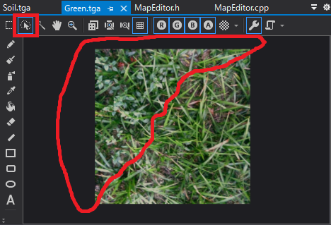
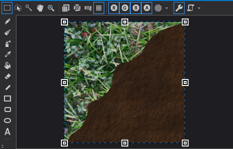
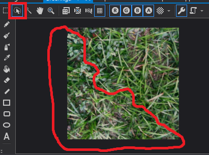
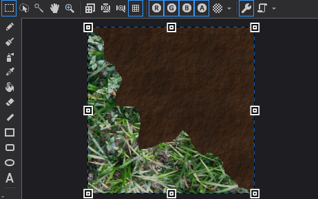
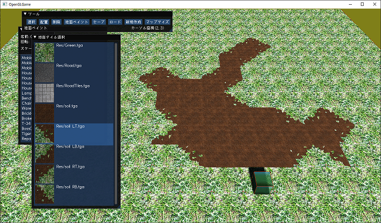
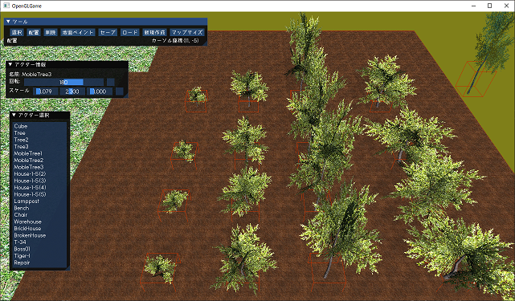
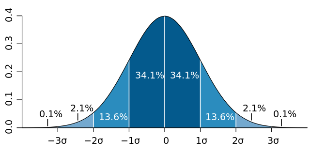
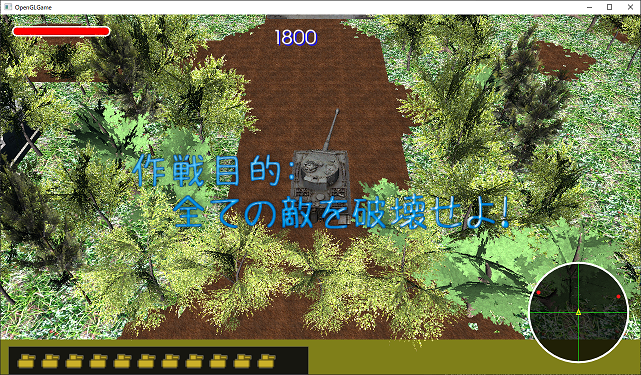

[OpenGL 3D 2021後期 第09回(マップエディタ編)]

# 森マップとランダム

## 習得目標

* ImGuiのマウスホイール入力を扱うことができる。
* ImGuiのリストボックを作成できる。
* C++のファイルシステムライブラリの使いかたを理解する。
* C++の乱数ライブラリの使いかたを理解する。

## 1. マップエディタを使いやすくする

### 1.1 マウスホイールで拡大縮小する

広いマップを作成する場合、現在のマップエディタではマップ全体を見渡せないことが問題となります。そこで、マウスホイールによってカメラの遠近を操作する機能を追加しましょう。

マウスホイールの状態を調べるには、`ImGuiIO`クラスの`MouseWheel`(マウスホイール)メンバ変数を使います。この変数は普段は`0`ですが、マウスホイールを奥に回すと`1`、手前に回すと`-1`になります。

`MapEditor.cpp`を開き、アップデートカメラ関数に次のプログラムを追加してください。

```diff
   } else if (engine.GetKey(GLFW_KEY_D)) {
     camera.target.x += cursorSpeed * deltaTime;
   }
+
+  // カメラの遠近を操作する
+  ImGuiIO& io = ImGui::GetIO();
+  if (!io.WantCaptureMouse) {
+    // マウスホイールが奥に回された場合
+    if (io.MouseWheel >= 1) {
+      static const float cameraOffsetMin = 10;
+      if (cameraOffset.y >= cameraOffsetMin) {
+        // カメラをマップに近づける
+        cameraOffset -= glm::vec3(0, 3, 3);
+      }
+    }
+    // マウスホイールが手前に回された場合
+    else if (io.MouseWheel <= -1) {
+      // カメラをマップから遠ざける
+      cameraOffset += glm::vec3(0, 3, 3);
+    }
+  }
   camera.position = camera.target + cameraOffset;

   // カーソル位置を設定
   const glm::mat4 matVP = camera.GetProjectionMatrix() * camera.GetViewMatrix();
```

`Main.cpp`のエディタモードフラグを`true`にして、プログラムを実行してください。マウスホイールを回すと、カメラがマップに近づいたり遠ざかったりしたら成功です。

### 1.2 カメラの表示範囲を拡大する

カメラをある程度以上に遠ざけると、マップが奥の方から消えていってしまいます。これはカメラの表示範囲が0.1mから200mになっているからです。

表示範囲が近くに寄りすぎているので奥側にずらしましょう。`Camera.h`を開き、カメラクラスの定義を次のように変更してください。

```diff
   glm::vec3 target = glm::vec3(0, 0, -1);
   float aspectRatio = 1.0f;
   float fovy = glm::radians(45.0f);
-  float zNear = 0.1f;
-  float zFar = 200.0f;
+  float zNear = 1.0f;
+  float zFar = 400.0f;

 private:
   glm::mat4 matView = glm::mat4(1);
   glm::mat4 matProj = glm::mat4(1);
```

プログラムが書けたらビルドして実行してください。カメラをかなり引いても、マップが画面に表示されていたら成功です。

>**【シャドウマップを実装している場合】**<br>
>シャドウマップのサイズと表示範囲を修正してください。シャドウマップのサイズはシェーダー側にも定義があるため、それらも修正する必要があります。

### 1.3 カーソルの座標を表示する

マップの中心にアクターを配置したい場合、現在は目で見て「なんとなくここが中心」とするか、マップの角からマス目を数えるしかありません。これは不便なので、カーソルの座標を表示しましょう。

アップデートユーアイ関数の中にある、マップサイズを変更するUIプログラムの下に、次のプログラムを追加してください。

```diff
     }
     EndPopup();
   }
+
+  // カーソル座標を表示
+  Text(toolName[static_cast<int>(mode)]);
+  SameLine(GetWindowWidth() - 140);
+  Text(u8"カーソル座標(%d, %d)",
+    static_cast<int>(cursor->position.x / 4),
+    static_cast<int>(cursor->position.z / 4));
   End();

   SetNextWindowSize(ImVec2(300, 0), ImGuiCond_Once);
   Begin(u8"アクター選択");
```

プログラムが書けたらビルドして実行してください。ツールウィンドウにカーソル座標が表示されていたら成功です。

### 1.4 セーブ・ロードするファイル名を選択する

セーブ・ロードするファイル名が`mapdata.txt`だけでは、複数のマップを作るときにいちいち名前を変えなくてはならず面倒です。そこで、マップファイルに好きな名前をつけられるようにします。

最初にファイルをリストアップする関数を作成します。関数名は`ShowFileListBox`(ショウ・ファイル・リストボックス)とします。`MapEditor.h`を開き、次のプログラムを追加してください。

```diff
   void InitActorList();
   void InitEditor();
+  bool ShowFileListBox(std::string& filename);

   const SystemType systemType;             // 動作タイプ
   glm::vec2 gridSize = glm::vec2(4.0f);    // マス目のサイズ(m)
```

次に`MapEditor.cpp`を開き、`filesystem`(ファイルシステム)というヘッダファイルをインクルードしてください。

```diff
 #include <fstream>
 #include <iostream>
+#include <filesystem>

 /**
 * コンストラクタ
```

ファイルシステムヘッダは、C++17から追加されたライブラリで、ファイルやフォルダの情報を扱うことができます。

続いて、イニットエディタ関数の定義の下に、次のプログラムを追加してください。

```diff
   camera.target = glm::vec3(0, 0, 0);
   camera.position = camera.target + cameraOffset;
 }
+
+/**
+* ファイル選択リストボックスを表示
+*/
+bool MapEditor::ShowFileListBox(std::string& filename)
+{
+  using namespace ImGui;
+
+  // 拡張子が".txt"のファイルをリストアップ
+  std::vector<std::string> files;
+  files.reserve(100);
+  for (const std::filesystem::directory_entry& e :
+    std::filesystem::directory_iterator(".")) {
+    if (e.path().extension() == ".txt" && e.is_regular_file()) {
+      files.push_back(e.path().filename().string());
+    }
+  }
+}

 /**
 * マップエディタの状態を更新する
```

フォルダの中にあるファイルの一覧を取得するには、`directory_iterator`(ディレクトリ・イテレータ)クラスの変数を作成します。コンストラクタの引数には取得したいフォルダ名を指定します。

ディレクトリイテレータを範囲`for`に指定すると、ファイルごとに`directory_entry`(ディレクトリ・エントリ)クラスを取得することができます。

ディレクトリエントリクラスを使うと、ファイル(またはフォルダ)の名前や属性を取得することができます。例えば、拡張子を取得するには`path`(パス)関数で絶対パスを取得してから、
`extension`(エクステンション)関数を使います。

また、フォルダを除外してファイルだけを取得するには`is_regular_file`(イズ・レギュラー・ファイル)関数を使います。この関数が`true`を返せばファイル、`false`を返せばフォルダ(か、ファイル以外のなにか)だと分かります。

これでファイルの一覧が`files`(ファイルズ)配列に格納されますので、このファイル配列をリストボックスに表示します。ファイルをリストアップするプログラムの下に、次のプログラムを追加してください。

```diff
       files.push_back(e.path().filename().string());
     }
   }
+
+  bool selected = false; // ファイルが選択されたかどうか
+
+  // テキストファイルをリスト表示
+  const ImVec2 listBoxSize(GetWindowContentRegionWidth(),
+    GetTextLineHeightWithSpacing() * files.size() + GetStyle().FramePadding.y * 2);
+  if (BeginListBox("##FileListBox", listBoxSize)) {
+    for (const std::string& e : files) {
+      const bool isSelected = e == filename;
+      if (Selectable(e.c_str(), isSelected)) {
+        selected = true;
+        filename = e;
+      }
+    }
+    EndListBox();
+  }
+
+  return selected;
 }

 /**
 * マップエディタの状態を更新する
```

リストボックスについては「アクター一覧」を表示したときとほぼ同じです。

### 1.5 セーブ機能にリストボックスを追加する

作成したファイルリストボックスを、セーブするときに表示しましょう。アップデートユーアイ関数の中の、セーブボタンを表示するプログラムを、次のように変更してください。

```diff
   SameLine();
   if (Button(u8"セーブ")) {
-    Save("mapdata.txt");
+    OpenPopup(u8"セーブファイル選択");
   }
+  SetNextWindowSize(ImVec2(400, -1), ImGuiCond_Once);
+  if (BeginPopupModal(u8"セーブファイル選択")) {
+    static std::string buf(256, '\0');
+    static std::string filename;
+    if (ShowFileListBox(filename)) {
+      // テキストボックスの内容を選択されたファイル名で置き換える
+      buf = filename;
+      buf.resize(256);
+    }
+    Text(u8"ファイル名");
+    SameLine();
+    InputText("##Filename", buf.data(), buf.size());
+    if (Button(u8"セーブ")) {
+      Save(buf.c_str());
+      CloseCurrentPopup();
+    }
+    SameLine();
+    if (Button(u8"キャンセル")) {
+      CloseCurrentPopup();
+    }
+    EndPopup();
+  }

  SameLine();
  if (Button(u8"ロード")) {
```

セーブファイルを選択するときは、マップの新規作成でも使用した「ポップアップウィンドウ」を使います。ポップアップウィンドウを使うことで、ファイル選択中は他の操作を受け付けなくなります。

プログラムが書けたらビルドして実行してください。セーブボタンを押したとき、ファイル選択用のリストボックスが表示されていたら成功です。

### 1.6 ロード機能にリストボックスを追加する

続いて、ロードするときにもファイルリストボックスを表示しましょう。アップデートユーアイ関数の中の、ロードボタンを表示するプログラムを、次のように変更してください。

```diff
   SameLine();
   if (Button(u8"ロード")) {
-    Load("mapdata.txt");
+    OpenPopup(u8"ロードファイル選択");
   }
+  SetNextWindowSize(ImVec2(400, -1), ImGuiCond_Once);
+  if (BeginPopupModal(u8"ロードファイル選択")) {
+    static std::string filename;
+    ShowFileListBox(filename);
+    if (Button(u8"ロード") && !filename.empty()) {
+      Load(filename.c_str());
+      CloseCurrentPopup();
+    }
+    SameLine();
+    if (Button(u8"キャンセル")) {
+      CloseCurrentPopup();
+    }
+    EndPopup();
+  }

   SameLine();
   static glm::ivec2 newMapSize;
   if (Button(u8"新規作成")) {
```

ロード用のポップアップウィンドウは、ファイル名を直接指定するテキストボックスがないぶん、少しだけ簡単になっています。

プログラムが書けたらビルドして実行してください。ロードボタンを押したとき、ファイル選択用のリストボックスが表示されていたら成功です。

<pre class="tnmai_assignment">
<strong>【課題01】</strong>
サイズが41x41のマップを新規作成し、適当な名前を付けてセーブしなさい。
</pre>

<pre class="tnmai_assignment">
<strong>【課題02】</strong>
課題01で作成したマップファイルをロードし、正常に読み込めることを確認しなさい。
</pre>

>**【1章のまとめ】**<br>
>
>* ImGuiのマウスホイール変数を参照することで、マウスホイールを使った操作を作ることができる。
>* ファイルシステムライブラリを使うと、フォルダ内にあるファイルを取得することができる。

<div style="page-break-after: always"></div>

## 2. 森の奥の敵要塞を作る

### 2.1 新しいマップの概要

ここからは、２個目のマップを作成します。マップのテーマは「森の奥の要塞」で、おおよそ次のようなマップデザインを想定しています。

<p align="center">
<br>
[２個目のマップの概要]
</p>

マップの色の意味は次のとおりです。

>* 茶: 土の道。
>* 緑: 森。木々が生い茂っている。
>* 赤: 破壊目標となる敵の要塞。すべて破壊するとマップクリア。
>* 白: ゲート。破壊不能。近くの要塞を破壊すると開く。
>* 黄: プレイヤーのスタート位置。

上図はマップのおおよそのイメージです。実際にマップを作るときは、森の中らしく道をくねらせたり、要塞のある広場も単なる長方形でなく、縁がゆがんでいると雰囲気が出るでしょう。

また、概要には示していませんが、もちろん敵戦車も配置する必要があります。

### 2.2 土のテクスチャを用意する

森の中の通行可能な部分には、土のテクスチャを使おうと思います。まず土のテクスチャを用意してください。

<pre class="tnmai_assignment">
<strong>【課題03】</strong>
土のテクスチャをプロジェクトの<code>Res</code>フォルダに追加しなさい。ファイル名は<code>soil.tga</code>(ソイル・ティージーエー)としなさい。
既に土のテクスチャを作成済みの場合、この課題は飛ばしてください。
</pre>

普通にテクスチャを配置するだけだと、ブロック状になってしまってあまり見栄えがよく有りません。そこで、草と土のつなぎ目となるテクスチャを作成します。まず土のテクスチャを4枚コピーします。

<pre class="tnmai_assignment">
<strong>【課題04】</strong>
<code>soil.tga</code>の複製を以下の名前で4つ作成しなさい。
  <code>soil_LT.tga</code>
  <code>soil_LB.tga</code>
  <code>soil_RT.tga</code>
  <code>soil_RB.tga</code>
名前に追加した文字<code>L</code>はLeft(左)、<code>R</code>はRight(右)、<code>T</code>はTop(上)、<code>B</code>はBottom(下)を意味しています。例えば<code>LT</code>はLeft+Topで「左上」という意味になります。
</pre>

複製した4枚の土テクスチャをVisual Studioで開いてください。次に、草テクスチャもVisual Studioで開いてください。

左上の「任意の形の領域を～」アイコンをクリックすると、マウスドラッグで自由に範囲を選択できます。マウスをドラッグして、以下の図の赤線のように、草テクスチャの左上の範囲を選択してください。

<p align="center">
<br>
</p>

範囲は適当で構いません。むしろ少し歪んでいるくらいが自然に見えます。範囲を選択したら、`Ctrl+C`で画像をコピーしてください。

次に`soil_LT.tga`のタブをクリックして土テクスチャを表示します。そして、`Ctrl+V`で画像を貼り付けてください。すると次のように土と草が半分ずつの画像になると思います。

<p align="center">
<br>
</p>

この状態にできたら、`soil_LT.tga`を保存してください。保存したら`soil_LT.tga`のタブを閉じてください。

続いて左下の土テクスチャを作成します。草テクスチャのタブを開き、任意選択で左下の範囲を囲んでください。

<p align="center">
<br>
</p>

左下を囲んだら、`Ctrl+C`で範囲をコピーしてください。そして、`soil_LB.tga`のタブを開き、`Ctrl+V`で画像を貼り付けてください。

<p align="center">
<br>
</p>

草を貼り付けたら、`soil_LB.tga`を保存し、タブを閉じてください。

<pre class="tnmai_assignment">
<strong>【課題05】</strong>
左上、左下の土テクスチャの作り方を参考に、<code>soil_RT.tga</code>, <code>soil_RB.tga</code>の2枚に草テクスチャを貼り付けて保存しなさい。
</pre>

これで土と草の境界にバリエーションを付けられるようになりました。

### 2.3 土テクスチャをマップエディタに追加する

作成した5枚の土テクスチャを、マップエディタで使えるようにしましょう。`MapEditor.cpp`を開き、イニットグラウンドアクター関数に次のプログラムを追加してください。

```diff
   const char* texList[] = {
     "Res/Green.tga",
     "Res/Road.tga",
     "Res/RoadTiles.tga",
+    "Res/soil.tga",
+    "Res/soil_LT.tga",
+    "Res/soil_LB.tga",
+    "Res/soil_RT.tga",
+    "Res/soil_RB.tga",
   };

   // 地面用アクターを作成
   engine.LoadPrimitive("Res/Ground.obj");
```

プログラムが書けたらビルドして実行してください。「地面ペイント」を選択して、追加した土テクスチャを地面にペイントできれば成功です。

<p align="center">
<br>
</p>

<pre class="tnmai_assignment">
<strong>【課題06】</strong>
課題01で作成したマップファイルをロードし、2.1節にあるマップの概要の図を参考にして、地面に土の道をペイントしなさい。追加した土テクスチャを利用して、自然に見えるように作ること。
ペイントが終わったらセーブするのを忘れないように。
</pre>

### 2.4 アクターを拡大縮小できるようにする

作成するマップは森の中のイメージです。森というからには、木を植える必要があります。現実の森にはさまざな形状の木々が生えていますが、ゲームではそんなにたくさんの形状を用意することはほとんどありません。

代わりに、同じ木のモデルを回転させたり、大きさを変更することで、見た目のバリエーションを作り出しています。マップエディタには既に回転機能が備わっていますから、さらに大きさを変更する機能を追加しましょう。

<p align="center">
<br>
[この木は全て同じモデルです]
</p>

注意する点として、配置するアクターには最初にのスケールが設定されているので、単に上書きすることはできません。そこで、選択しているアクターのオリジナルを指す変数を追加します。

`MapEditor.h`を開き、マップエディタクラスの定義に次のプログラムを追加してください。

```diff
   std::vector<std::shared_ptr<Actor>> map; // アクター配置マップ(エディタ用)
   std::vector<std::shared_ptr<Actor>> actors; // 配置可能なアクター
   std::shared_ptr<Actor> cursor; // マップ操作カーソル
+  std::shared_ptr<Actor> cursorOriginal; // マップ操作カーソルのオリジナル
   glm::vec3 cameraOffset = glm::vec3(0, 30, 30); // カメラの位置

   std::vector<std::shared_ptr<Texture>> groundTiles; // 地面用テクスチャ
```

次に`MapEditor.cpp`を開き、アップデートユーアイ関数のアクター選択プログラムに、次のプログラムを追加してください。

```diff
     for (int i = 0; i < actors.size(); ++i) {
       const bool isSelected = cursor->name == actors[i]->name;
       if (Selectable(actors[i]->name.c_str(), isSelected)) {
+        cursorOriginal = actors[i]; // 元になったアクターを記録しておく
         *cursor = *actors[i];
       }
```

それでは、大きさを変更するUIを追加しましょう。アップデートユーアイ関数のアクター情報を表示するプログラムに、次のプログラムを追加してください。

```diff
     strRotation[rotation], ImGuiSliderFlags_NoInput);
   cursor->rotation = static_cast<float>(rotation) * glm::radians(90.0f);
+
+  static glm::vec3 scale(1);
+  Text(u8"スケール:");
+  SameLine();
+  SliderFloat3("##scale", &scale.x, 0.5f, 5.0f);
+  cursor->scale = cursorOriginal->scale * scale;
   End();

   if (mode == Mode::groundPaint) {
     SetNextWindowSize(ImVec2(300, 0), ImGuiCond_Once);
```

縮小は0.5倍まで、拡大は5倍までできるようにしました。もっと小さくしたい、または大きくしたい場合はこの数値を変更してください。

アクターを配置するとき、既に同じアクターが配置されている場合は配置を行わないようになっていますが、その場合でも大きさは反映する必要があります。アップデート関数に次のプログラムを追加してください。

```diff
      // 選択アクターと種類が同じ場合は配置しない
      if (target && target->name == cursor->name) {
        target->rotation = cursor->rotation;
+       target->scale = cursor->scale;
        break;
      }
```

それから、見かけの大きさが変化したのなら、コライダーの大きさも変化するべきでしょう。ロード関数のアクターを配置するプログラムに、次のプログラムを追加してください。

```diff
     newActor->position = position;
     newActor->scale = scale;
     newActor->rotation = rotation;
+    // コライダーを拡大縮小
+    newActor->collider.min *= newActor->scale / actor->scale;
+    newActor->collider.max *= newActor->scale / actor->scale;
     // コライダーを回転
     if (rotation) {
       const glm::mat3 matR = glm::rotate(glm::mat4(1), rotation, glm::vec3(0, 1, 0));
```

プログラムが書けたらビルドして実行してください。スケールのスライダーを動かして、アクターの大きさが変化したら成功です。

### 2.5 ゲームエンジンに乱数を追加する

角度と大きさを変更できるようになったことで、より自然な森を作れるようになりました。しかし、配置するたびに大きさや角度を変更するのは面倒極まりないことです。

そこで、角度と大きさをランダムに決定する機能を追加します。ランダムに関する機能は`random`(ランダム)ヘッダで定義されています。`GameEngine.h`を開き、次のヘッダファイルをインクルードしてください。

```diff
 #include "Sprite.h"
 #include <GLFW/glfw3.h>
 #include <unordered_map>
+#include <random>

 using ActorList = std::vector<std::shared_ptr<Actor>>;
 using TextureBuffer = std::unordered_map<std::string, std::shared_ptr<Texture>>;
```

現在、C++で一般的に使われるのは`mt19937`(エムティー・いちきゅうきゅうさんなな)という乱数生成器です。これは「メルセンヌ・ツイスター」という技法で高品質な乱数を生成します。

この乱数生成器を、ゲームエンジンに追加します。ゲームエンジンクラスの定義に次のプログラムを追加してください。

```diff
   std::shared_ptr<PrimitiveBuffer> primitiveBuffer; // プリミティブ配列
   TextureBuffer textureBuffer;                      // テクスチャ配列
   Camera mainCamera;
+
+  std::mt19937 random; // 乱数生成器
 };

 #endif // GAMEENGINE_H_INCLUDED
```

次に、乱数を取得するメンバ関数を追加します。ゲームエンジンクラスの定義に次のプログラムを追加してください。

```diff
   double GetTime() const
   {
     return glfwGetTime();
   }
+
+  /**
+  * 乱数を取得する
+  */
+  int GetRandomInt(int min, int max)
+  {
+    return std::uniform_int_distribution<int>(min, max)(random);
+  }
+
+  float GetRandomFloat(float min, float max)
+  {
+    return std::uniform_real_distribution<float>(min, max)(random);
+  }
+
+  float GetRandomNormal(float a, float b = 1.0f)
+  {
+    return std::normal_distribution<float>(a, b)(random);
+  }

   /**
   * メインカメラを取得する
```

`mt19937`は、単独で使うと32bit符号なし整数の範囲の値を返してくれます。しかし、値が大きすぎるため単独では使いにくいです。そこで`distribution`(ディストリビューション)というクラスを使います。

ディストリビューションは、乱数の範囲や値の出現率を調整するクラスです。今回は以下の3種類のディストリビューションを使っています。

<pre class="tnmai_code"><strong>【書式】</strong><code>
int uniform_int_distribution<int>(最小値, 最大値)(乱数生成器);
</code></pre>

ユニフォーム・イント・ディストリビューションは、指定した範囲の<ruby>一様乱数<rt>いちようらんすう</rt></ruby>(どの数値も同じ確率で出現する乱数)を生成します。サイコロを振るときなどはこのディストリビューションを使います。

<pre class="tnmai_code"><strong>【書式】</strong><code>
float uniform_real_distribution<float>(最小値, 最大値)(乱数生成器);
</code></pre>

ユニフォーム・リアル・ディストリビューションも、指定した範囲の一様乱数を生成しますが、結果が浮動小数点数になります。`float`型の乱数がほしいときはこのディストリビューションを使うとよいでしょう。

<pre class="tnmai_code"><strong>【書式】</strong><code>
float normal_distribution<float>(中央値, 分散)(乱数生成器);
</code></pre>

ノーマル・ディストリビューションは、<ruby>正規分布<rt>せいきぶんぷ</rt></ruby>(中央値が最も出やすく、離れた数値ほど出にくい乱数)を生成します。

弾の集弾率や身長の分布など、現実世界の多くの分布を再現することができます。以下の図は、正規分布における値の出現確率を表しています。

<p align="center">
<br>
[正規分布のグラフ(`ja.wikipedia.org/wiki/正規分布`より引用)]
</p>

この図において`0`が中央値、`σ`(シグマ)が分散です。例えば中央値が`1`、シグマが`0.1`の場合、0.9～1.1の出現確率は68.27%、0.8～0.9および1.1～1.2の出現確率は27.18%、0.7～0.8および1.2～1.3出現確率は4.28%になります。

>**【3σより外側の値の出現確率】**<br>
>正規分布は現実の近似でしかないことに注意してください。正規分布では、3σより外側の値であっても、それどころか100σ以上の値であっても、出現確率は決して`0`にはなりません(非常に小さくはなります)。

続いて、乱数生成器を初期化します。`GameEngine.cpp`を開き、イニシャライズ関数に次のプログラムを追加してください。

```diff
     int w, h;
     glfwGetWindowSize(window, &w, &h);
     engine->windowSize = glm::vec2(w, h);
+
+    // 乱数を初期化する
+    std::random_device rd;
+    engine->random.seed(rd());

     engine->pipeline.reset(new ProgramPipeline(
       "Res/FragmentLighting.vert", "Res/FragmentLighting.frag"));
```

`random_device`(ランダム・デバイス)も乱数生成器のひとつです。ほとんどの乱数生成器は「擬似乱数」といって「乱数っぽい数列」を出力するまがいものですが、ランダムデバイスはハードウェアを利用して「真の乱数」を生成します。

そのかわり処理が遅いので、擬似乱数の初期値に使われることが多いです。上記のプログラムでも`mt19937`の初期値(シード)を設定するために使っています。

このように、ランダムデバイスを使うことで、起動するたびに異なる乱数を作り出すことができます。

これで乱数が使えるようになりました。

### 2.6 乱数を使うチェックボックスを追加する

それでは、アクターの角度と大きさをランダムに決める機能を作成しましょう。しかし、いつもランダムだと意図した値を設定したいときに困ります。そこで、ランダムにするかどうかのフラグを用意することにします。

`MapEditor.h`を開き、マップエディタクラスの定義に次のプログラムを追加してください。

```diff
   std::vector<std::shared_ptr<Texture>> groundTiles; // 地面用テクスチャ
   std::vector<uint32_t> groundMap;
   uint8_t currentTileNo = 0;
+
+  bool randomRotationFlag = false;
+  bool randomScaleFlag = false;

   // マップ操作モード
   enum class Mode {
```

次に、フラグを操作するチェックボックスを追加します。`MapEditor.cpp`を開き、アップデートユーアイ関数に次のプログラムを追加してください。

```diff
   static glm::vec3 scale(1);
   static const char* strRotation[] = { "0", "90", "180", "270" };
+
+  // チェックボックスが常にウィンドウに表示されるように右側をあける
+  SetNextItemWidth(GetWindowContentRegionWidth() - 150);
+
   SliderInt("##rotation", &rotation,
     0, static_cast<int>(std::size(strRotation)) - 1,
     strRotation[rotation], ImGuiSliderFlags_NoInput);
   cursor->rotation = static_cast<float>(rotation) * glm::radians(90.0f);
+  SameLine();
+  Text(u8"ランダム:");
+  SameLine();
+  Checkbox("##randomRotation", &randomRotationFlag);

   static glm::vec3 scale(1);
   Text(u8"スケール:");
   SameLine();
+
+  // チェックボックスが常にウィンドウに表示されるように右側をあける
+  SetNextItemWidth(GetWindowContentRegionWidth() - 150);
+
   SliderFloat3("##scale", &scale.x, 0.5f, 5.0f);
   cursor->scale = cursorOriginal->scale * scale;
+  SameLine();
+  Text(u8"ランダム:");
+  SameLine();
+  Checkbox("##randomScale", &randomScaleFlag);
   End();

   if (mode == Mode::groundPaint) {
     SetNextWindowSize(ImVec2(300, 0), ImGuiCond_Once);
```

これでチェックボックスにチェックを入れるとランダムフラグが`true`に設定されます。

### 2.7 角度と大きさをランダムにする

いよいよ角度と大きさをランダムにしていきます。まず大きさからやっていきましょう。アップデート関数に次のプログラムを追加してください。

```diff
     switch (mode) {
     case Mode::set:
+      // ランダムスケールありの場合、ランダムなスケールを設定する
+      if (randomScaleFlag) {
+        glm::vec3 scale;
+        scale.x = glm::clamp(engine.GetRandomNormal(1.0f, 0.2f), 0.5f, 2.0f);
+        scale.y = glm::clamp(engine.GetRandomNormal(1.0f, 0.2f), 0.5f, 2.0f);
+        scale.z = glm::clamp(engine.GetRandomNormal(1.0f, 0.2f), 0.5f, 2.0f);
+        cursor->scale = cursorBase->scale * scale;
+      }
+
+      // ランダム回転ありの場合、ランダムな方向に回転させる
+      if (randomRotationFlag) {
+        const int rotation = engine.GetRandomInt(0, 3);
+        cursor->rotation = glm::radians(static_cast<float>(rotation) * 90.0f);
+      }
+
       // 選択アクターと種類が同じ場合は配置しない
       if (target && target->name == cursor->name) {
         target->rotation = cursor->rotation;
```

ここではゲットランダムノーマル関数を使って「正規分布」の乱数を作成しています。正規分布では中央値から離れるほど出現率が下がります。

そのため、森の木のように

>ほとんどの木は大きさが似通っているが、まれに極端に大きさの違う木がある。

という状況を、うまく再現することができます。

それから、ゲットランダムノーマル関数で正規分布乱数を取得したあと、クランプ関数で範囲を制限している点に注意してください。

正規分布は計算の都合でごくまれに非常に大きい、または非常に小さい値になることがあるため、必ずクランプ関数などで範囲を制限しなくてはなりません。

プログラムが書けたらビルドして実行してください。ランダムチェックボックスにチェックを入れて、配置モードで木を配置してみてください。角度や大きさがランダムに変化したら成功です。

<pre class="tnmai_assignment">
<strong>【課題07】</strong>
課題01で作成したマップに木や建物を配置して、マップを完成させなさい。ゲートは追加しなくて構いません。
</pre>

### 2.8 ゲームマネージャに次のステージへ進む処理を追加する

作成したマップをゲームマネージャでロードしましょう。`GameManger.h`を開き、ゲームマネージャクラスの定義に次のプログラムを追加してください。

```diff
   std::shared_ptr<Actor> playerTank;
   std::vector<std::shared_ptr<Actor>> enemies;
   int score = 0;
+  size_t stageNo = 1; // ステージ番号

   // タイトル画面の動作状態
   enum class TitleState {
```

次に、ステージ番号に対応したマップファイルの配列を用意します。`GameManger.cpp`を開き、`manager`変数の定義の下に、次のプログラムを追加してください。

```diff
 namespace {

 GameManager* manager = nullptr;
+
+// ステージごとのマップファイル
+const char* const mapFiles[] = {
+  "mapdata.txt",
+  "mapdata01.txt", // この行には課題01で作成したファイル名を指定すること
+};

 }

 /**
 * ゲームマネージャの初期化
```

続いて、アップデート関数のマップをロードするプログラムを、次のように変更してください。

```diff
     score = 0;

     // マップデータをロードする
+    stageNo = std::min(stageNo, std::size(mapFiles) - 1);
-    MapEditor(MapEditor::SystemType::game).Load("mapdata.txt");
+    MapEditor(MapEditor::SystemType::game).Load(mapFiles[stageNo]);

     // プレイヤーが操作するアクターを取得する
     playerTank = engine.FindActor("Tiger-I");
```

そして、ゲームクリア処理に、次のプログラムを追加してください。

```diff
       if (gameclear) {
         gameclear->isDead = true;
       }
+
+     // 次のステージに進む
+     stageNo = std::min(stageNo + 1, std::size(mapFiles) - 1);
+
      state = State::start;
      std::cout << __func__ << ": gameclear -> start\n";
    }
```

プログラムが書けたらビルドして実行してください。最初のマップをクリアして`Enter`を押すと、新しいマップでゲームが再開されたら成功です。

### 2.9 スコアの初期化位置を修正する

現在のプログラムでは、ステージを進めるとスコアが`0`に戻ってしまいます。そのため、より高いスコアを目指す遊び方ができません。そこで、スコアを初期化する場所を変更します。

まず既存の初期化を削除します。`MapEditor.cpp`を開き、アップデート関数を次のように変更してください。

```diff
     UpdateTitle(deltaTime);
     break;

   case State::start:
-    score = 0;

     // マップデータをロードする
     stageNo = std::min(stageNo, std::size(mapFiles) - 1);
```

次に、タイトル画面でゲームを開始する瞬間にスコアを初期化します。アップデートタイトル関数に次のプログラムを追加してください。

```diff
     fadeAlpha += deltaTime;
     if (fadeAlpha > 1) {
+      // スコアを初期化
+      score = 0;
+
       titleState = TitleState::init;
```

プログラムが書けたらビルドして実行してください。ステージが進んだとき、スコアが`0`に戻っていなければ成功です。

<p align="center">
<br>
</p>

<pre class="tnmai_assignment">
<strong>【課題08】</strong>
ステージ3のマップを作成しなさい。テーマは「敵の要塞の内部」とします。壁モデルを追加して、広大な迷路のようなマップを作成してください。
要塞の床らしい地面テクスチャを追加することも効果的でしょう。
</pre>

<pre class="tnmai_assignment">
<strong>【課題09】</strong>
課題08で作成したマップファイルを`mapFiles`配列に追加しなさい。そして、ゲームをプレイしてステージを進めたとき、追加したマップが表示されることを確認しなさい。
</pre>

>**【2章のまとめ】**<br>
>
>* 2つのテクスチャをななめに合成すると、より自然なマップを作ることができる。
>* C++で乱数を作成するには`mt19937`という乱数生成器を使う。
>* 乱数の分布を制御する「ディストリビューション」というクラスがある。
>* ノーマルディストリビューションは「正規分布」を生成する。正規分布はさまざまな事象の発生率として使うことができる。
