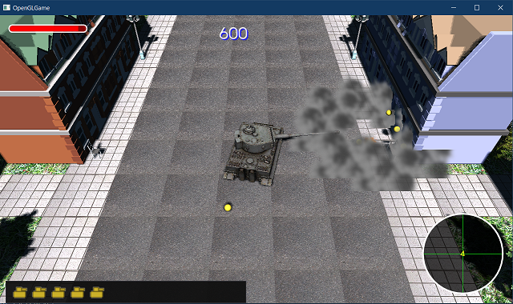
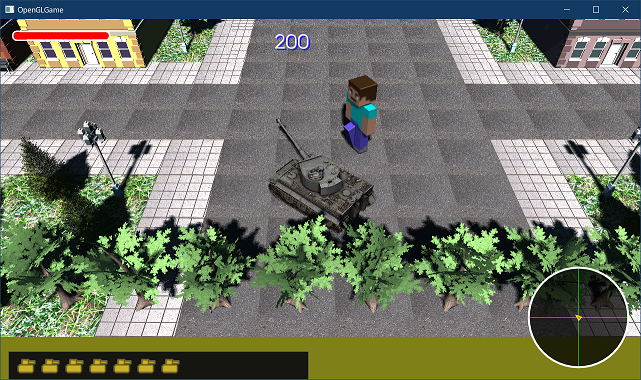
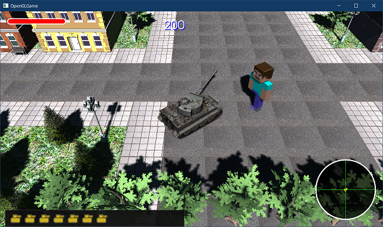
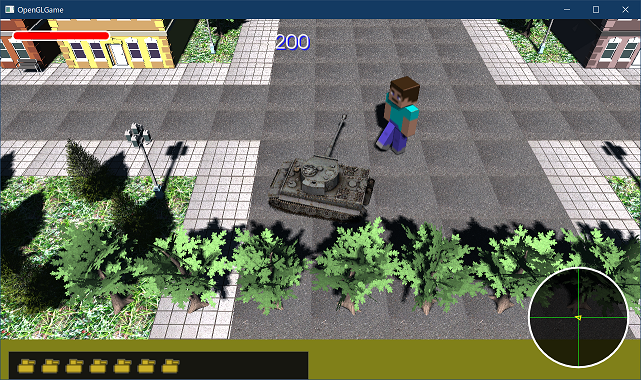
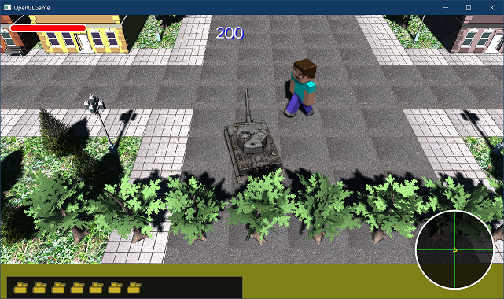

[OpenGL 3D 2021後期 第10回]

# アニメーション

## 習得目標

* 数値アニメーションに必要なクラスとアニメーションの基本設計を理解する。
* アニメーションをループ再生するプログラムを書くことができる。
* アクターにアニメーションを適用することができる。

## 1. スプライトをアニメーションさせる

### 1.1 アニメーション用のクラスについて

位置や角度の数値を別の数値へとなめらかに変化させると、物体をアニメーションすることができます。

簡単な方法は、オンアップデート関数をオーバーライドして数値アニメーションを作ることです。前回、タイガーI戦車の砲塔や砲身を回転させましたが、あれも数値アニメーションの一例です。

しかし、アニメーションが必要になるたびに、いちからアニメーション用のプログラムを書くのは無駄が多すぎます。そこで、数値アニメーション用のクラスを作成しましょう。

本テキストでは以下の4つの型を作成します。

* `KeyFrame`(キーフレーム)構造体: ある時点での値を表す。
* `AnimationCurve`(アニメーションカーブ)クラス: キーフレーム配列によって、値の連続的な変化を表現する。
* `AnimationClip`(アニメーションクリップ)クラス: アニメーションカーブ配列によって、複数の値の連続的な変化を表現する。
* `Animation`(アニメーション)クラス: 時間経過を管理し、ある時点でのアニメーションクリックの値をアクターに反映する。

まずはアニメーション用のファイルを追加して、必要なヘッダファイルをインクルードしたりしましょう。プロジェクトの`Src`フォルダに`Animation.h`というファイルを追加してください。追加したファイルを開き、次のプログラムを追加してください。

```diff
+/**
+* @file Animation.h
+*/
+#ifndef ANIMATION_H_INCLUDED
+#define ANIMATION_H_INCLUDED
+#include <vector>
+#include <memory>
+#include <functional>
+
+// 先行宣言
+class Actor;
+class AnimationCurve;
+class AnimationClip;
+class Animation;
+using AnimationCurvePtr = std::shared_ptr<AnimationCurve>;
+using AnimationClipPtr = std::shared_ptr<AnimationClip>;
+using AnimationPtr = std::shared_ptr<Animation>;
+
+#endif // ANIMATION_H_INCLUDED
```

今回は4つのクラスを作成する必要があるため、プログラムが動作するようになるまではしばらく時間がかかると思います。ときどき息抜きをしながら、気長にやってください。

### 1.2 KeyFrame構造体を定義する

それでは「キーフレーム」から定義していきましょう。キーフレームは次に2つのパラメータをペアにしたものです。

>* 時刻
>* 「時刻」の時点の数値

`AnimationPtr`の先行宣言の下に、次のプログラムを追加してください。

```diff
 using AnimationClipPtr = std::shared_ptr<AnimationClip>;
 using AnimationPtr = std::shared_ptr<Animation>;
+
+/**
+* 時刻と値を関連付ける構造体
+*
+* キーフレームアニメーションにおいて、ある時刻における値を表す
+*/
+struct KeyFrame
+{
+  float time;  // 時刻(秒)
+  float value; // timeの時点の値
+};

 #endif // ANIMATION_H_INCLUDED
```

### 1.3 AnimationCurveクラスを定義する

「アニメーションカーブ」はキーフレームの配列を管理するクラスです。キーフレームは「時刻の昇順」で並べられます。`KeyFrame`構造体の定義の下に、次のプログラムを追加してください。

```diff
   float time;
   float value;
 };
+
+/**
+* キーフレームの配列を管理するクラス
+*
+* 時間経過による値の連続的な変化を表す
+*/
+class AnimationCurve
+{
+public:
+  // アニメーションカーブの作成
+  static AnimationCurvePtr Create();
+
+  // コンストラクタ・デストラクタ
+  AnimationCurve() = default;
+  ~AnimationCurve() = default;
+
+  // メンバ関数
+  void SetKey(const KeyFrame& newKey);
+  float Eval(float t) const;
+  float GetStartTime() const;
+  float GetEndTime() const;
+
+private:
+  std::vector<KeyFrame> keys; // 時刻ソート済みキーフレーム配列
+};

 #endif // ANIMATION_H_INCLUDED
```

`AnimationCurve`クラスはシェアードポイントで管理します。
ただ、毎回`std::make_shared<AnimationCurve>()`などと書くのは面倒です。そこで、作成用に`Create`(クリエイト)というスタティックメンバ関数を用意することにしました。

### 1.4 Createスタティックメンバ関数を定義する

それでは、`Create`(クリエイト)メンバ関数から定義していきましょう。プロジェクトの
`Src`フォルダに`Animation.cpp`というファイルを追加してください。追加したファイルを開き、次のプログラムを追加してください。

```diff
+/**
+* @file Animation.cpp
+*/
+#include "Animation.h"
+#include <algorithm>
+
+/**
+* アニメーションカーブを作成する
+*/
+AnimationCurvePtr AnimationCurve::Create()
+{
+  return std::make_shared<AnimationCurve>();
+}
```

### 1.5 SetKeyメンバ関数を定義する

次に`SetKey`(セット・キー)メンバ関数を定義します。これはキーフレームを追加・設定する関数です。`Create`関数の定義の下に、次のプログラムを追加してください。

```diff
 {
   return std::make_shared<AnimationCurve>();
 }
+
+/**
+* キーフレームを設定する
+*/
+void AnimationCurve::SetKey(const KeyFrame& newKey)
+{
+  // 配列が「時刻の昇順にソートされた状態」を維持できるような挿入位置を二分探索
+  auto pos = keys.begin(); // 探索範囲の先頭位置
+  auto last = keys.end();  // 探索範囲の終端位置
+  while (pos != last) {
+    const auto mid = pos + (last - pos) / 2; // 探索範囲の真ん中の位置
+    // 次の条件式を「満たさない」最初の要素を検索する
+    // ※ここの条件式はとても重要。条件を変えると目的とする挿入位置を得られない。
+    if (mid->time < newKey.time) {
+      pos = mid + 1;
+    } else {
+      last = mid;
+    }
+  }
+}
```

変数`pos`(ポス)と`last`(ラスト)の型は`std::vector<KeyFrame>::iterator`になります。型名の代わりに`auto`(オート)と書くことで、このようなテンプレートを含む長い型名を、コンパイラに決めさせることができます。

処理を高速化するため、アニメーションカーブに含まれるキーフレームは、時刻の昇順に並べます。これは、新しいキーフレームを追加するときに、並び順が維持されるような位置に追加することで実現します。

追加する位置を決めるために「二分探索(にぶんたんさく)」というアルゴリズムを使っています。二分探索はソート済みの配列から目的の値を見つける技法で、以下の手順で探索を行います。

>1. 探索範囲の中央の値と見つけたい値を比較。
>2. 中央の値のほうが小さければ前半分を探索範囲に設定、そうでなければ後半分を探索範囲に設定。
>3. 探索範囲に2つ以上の要素があれば1に戻る。そうでなければ探索終了。

探索範囲を二分割して探索を進めることで、ひとつひとつ比較する場合と比べて、圧倒的に少ない比較回数で目的の値を見つけ出すことができます。

続いて、新しいキーフレームを追加するプログラムを追加します。二分探索を行うプログラムの下に、次のプログラムを追加してください。

```diff
       last = mid;
     }
   }
+
+  // 追加する位置が・・・
+  // 「終端」の場合: 配列の末尾に新しいキーを追加する。
+  // 「時刻の異なるキー」の場合: 「追加する位置」に新しいキーを追加する。
+  // 「時刻の等しいキー」の場合: 値を上書きするだけで追加はしない。
+  if (pos == keys.end()) {
+    keys.push_back(newKey);
+  } else if(pos->time != newKey.time) {
+    keys.insert(pos, newKey);
+  } else {
+    pos->value = newKey.value;
+  }
 }
```

`pos`が指すキーフレームの内容によって「末尾に追加」、「中間に追加」、「値を上書き」の3パターンに分けています。最初の2つはまとめても良かったのですが、`insert`より
`push_back`のほうが処理が速いので分けました。

### 1.6 Evalメンバ関数を定義する

次は`Eval`(イーバル)メンバ関数を定義します。`SetKey`メンバ関数の定義の下に、次のプログラムを追加してください。

```diff
     pos->value = newKey.value;
   }
 }
+
+/**
+* 指定されたアドレスにアニメーションを反映する
+*/
+float AnimationCurve::Eval(float t) const
+{
+  // キーがひとつもなければ0を返す
+  if (keys.empty()) {
+    return 0.0f;
+  }
+}
```

`Eval`メンバ関数は、引数`t`に対応する値を返します。`t`を連続的に変化させるとアニメーションになります。

次にキーフレームが設定されている場合の処理を追加します。まず、`t`がキーフレーム配列の先頭要素より前の時刻、または終端要素より後の時刻を指している場合を書きましょう。`Eval`メンバ関数に次のプログラムを追加してください。

```diff
   if (keys.empty()) {
     return;
   }
+
+  // tが最初のキーの時刻以下なら、最初のキーの値を返す
+  if (t <= keys.front().time) {
+    return keys.front().value;
+  }
+
+  // tが最後のキーの時刻以上なら、最後のキーの値を返す
+  if (t >= keys.back().time) {
+    return keys.back().value;
+  }
 }
```

コメントで示したように、`t`が最初のキーの時刻以下の場合は最初のキーの値を、最後のキーの時刻以上の場合は最後のキーの値を返します。これは「データがない区間は最も近いデータの値を使う」という仕様になります。

>**【仕様は<ruby>明示<rt>めいじ</rt></ruby>すること】**<br>
>本テキストでは紙面の都合で省略していますが、仕様はできるだけ明示するべきです。例えば、関数のコメントとして書いておきます。
>仕様を明確にしていない場合、関数やクラスを他人に使ってもらうとき、毎回あなたが使いかたを教えなくてはなりません。
>なお「他人」には「次の日の自分」や「一ヶ月後の自分」も含まれます。この場合「教える人」がいないので、コードをもう一度理解するところから始めなくてはならないでしょう。

次に、`t`以上の時刻を持つキーを検索します。これには二分探索を使います。最後のキーと比較するプログラムの下に、次のプログラムを追加してください。

>記号`※`(米印、こめじるし)は、`*`(アスタリスク)から変換できます。また「こめ」「こめじるし」「きごう」からも変換できます。

```diff
     *target = keys.back().value;
     return;
   }
+
+  // ここまで来たなら、keysには少なくとも次の2つのキーフレームが存在するはず
+  //   1. 'key.time < t'を満たすキーA
+  //   2. 't < key.time'を満たすキーB
+  // ※上記の仮定は、以降のプログラムにおける前提条件となります。
+  //   しかし、この仮定は本当に正しいでしょうか？
+  //   正しいと判断したら、この注釈コメントを削除してください。
+  //   誤りと判断したら、正しくなるようにプログラムを修正し、この注釈コメントを削除してください。
+
+  // t以上の時刻を持つキーフレームを探索する
+  auto pos = keys.begin();
+  auto last = keys.end();
+  while (pos != last) {
+    const auto mid = pos + (last - pos) / 2;
+    // 次の条件式を「満たさない」最初の要素を検索する
+    if (mid->time < t) {
+      pos = mid + 1;
+    } else {
+      last = mid;
+    }
+  }
 }
```

上記のプログラムでは`SetKey`メンバ関数と同様に「`t`以上の時刻を持つキー」を探しています。

続いて、見つかったキーフレームのひとつ前にあるキーフレームを取得します。二分探索を行うプログラムの下に、次のプログラムを追加してください。

```diff
       last = mid;
     }
   }
+
+  // ※以下の式が実行時エラーを起こさないことを保証するには、
+  //   posの手前に1つ以上の要素が存在することが条件です。
+  //   この条件が保証されていると判断したら、この注釈コメントを削除してください。
+  //   保証されていないと判断したら、保証されるようにプログラムを修正し、この注釈コメントを
+  //   削除してください。
+  const auto prev = pos - 1; // 時刻がt未満のキー
 }
```

ひとつ前のキーフレームの位置を取得するには`pos`から1を引きます。ただし、`pos`の手前にキーフレームが存在しないと実行時エラーが発生します。

そのため、本来であれば`pos`が配列の先頭を指していないことをチェックする必要があります。しかし、ここに至るまでのプログラムによって「少なくとも2つのキーがある」、「キーAの時刻は`t`未満である」が保証されています。

この2つの保証と「`pos`が指すキーの時刻は`t`以上である」という保証により、`pos`が配列の先頭を指していないことが保証されます。

>**【assert(アサート)を使って保証を明示する】**<br>
>プログラムに機能を追加したり削除したとき、これまで守られていた保証が失われることがあります。そのような場合に備えるには、`assert`によるエラーチェックを追加するとよいでしょう。
>`assert`は、「こういう挙動になっていてほしい」という意図を明示的に示せるので、あとから見たときにプログラムの動作を理解しやすい、という利点もあります。

最後に2つのキーフレームの間で線形補間(せんけいほかん)を行います。ひとつ前のキーフレームを取得するプログラムの下に、次のプログラムを追加してください。

```diff
       last = mid;
     }
   }

   const auto prev = pos - 1; // 時刻がt未満のキー
+
+  // prevとposの間を線形補間するための補間係数を計算する
+  // ※変数ratioの値は0.0～1.0の範囲になっていなくてはなりません。
+  //   この条件は満たされるでしょうか？
+  const float length = pos->time - prev->time;
+  const float ratio = (t - prev->time) / length;
+
+  // 線形補間の結果を返す
+  return prev->value * (1.0f - ratio) + pos->value * ratio;
 }
```

線形補間は値A, Bおよび補間係数Cを用いて、

`A × (1 - C) + B × C`

とすることで計算できます。GLMライブラリの`mix`(ミックス)関数は、この式と同じことを行います。

>イージングを実装するには、上の式の`C`の値を変更します。例えばイーズイン(最初はゆっくりで、最後は速く変化するアニメーション)ならば`C = C * C`(Cを2乗する)を追加します。

### 1.7 GetStartTimeメンバ関数を定義する

続いて、カーブの開始時刻を取得する`GetStartTime`(ゲット・スタート・タイム)メンバ関数を定義します。`Eval`メンバ関数の定義の下に、次のプログラムを追加してください。

```diff
   // 線形補間を行い、結果をtargetが指すアドレスに代入する
   *target = prev->value * (1.0f - ratio) + pos->value * ratio;
 }
+
+/**
+* アニメーションカーブの開始時刻を取得する
+*/
+float AnimationCurve::GetStartTime() const
+{
+  return keys.empty() ? 0.0f : keys.front().time;
+}
```

### 1.8 GetEndTimeメンバ関数を定義する

最後に、カーブの終了時刻を取得する`GetEndTime`(ゲット・エンド・タイム)メンバ関数を定義します。`GetStartTime`メンバ関数の定義の下に、次のプログラムを追加してください。

```diff
   return keys.empty() ? 0.0f : keys.front().time;
 }
+
+/**
+* アニメーションカーブの終了時刻を取得する
+*/
+float AnimationCurve::GetEndTime() const
+{
+  return keys.empty() ? 0.0f : keys.back().time;
+}
```

これで`AnimationCurve`クラスの全てのメンバ関数を定義することができました。

### 1.9 AnimationClipクラスを定義する

アニメーションカーブはひとつの`float`型をアニメーションさせることしかできません。そのため、例えば座標X, Y, Zを同時にアニメーションさせるには、3つのアニメーションカーブが必要となります。

`AnimationClip`(アニメーション・クリップ)クラスは、このような複数のアニメーションカーブをまとめて管理するためのクラスです。

それでは`AnimationClip`クラスを定義しましょう。`Animation.h`を開き、
`AnimationCurve`クラスの定義の下に、次のプログラムを追加してください。

```diff
 private:
   std::vector<KeyFrame> keys; // 時刻ソート済みキーフレーム配列
 };
+
+/**
+* 複数のアニメーションカーブを管理するクラス
+*
+* アクターのアニメーションに使用する
+*/
+class AnimationClip
+{
+public:
+  // 値を反映するための関数型
+  using FuncType = std::function<void(Actor&, float)>;
+
+  // アニメーションクリップの作成
+  static AnimationClipPtr Create();
+
+  // コンストラクタ・デストラクタ
+  AnimationClip() = default;
+  ~AnimationClip() = default;
+
+  // メンバ関数
+  void SetCurve(FuncType func, const AnimationCurvePtr& curve);
+  void ClearCurves();
+  void Eval(Actor& actor, float t) const;
+  float GetStartTime() const;
+  float GetEndTime() const;
+
+private:
+  struct Data
+  {
+    FuncType func; // 値を反映するための関数
+    AnimationCurvePtr curve; // カーブへのポインタ
+  };
+  std::vector<Data> curves;
+};

 #endif // ANIMATION_H_INCLUDED
```

### 1.10 Createメンバ関数を定義する

それでは`Create`メンバ関数から定義をしていきましょう。`Animation.cpp`を開き、
`AnimationCurve::GetEndTime`関数の定義の下に、次のプログラムを追加してください。

```diff
 float AnimationCurve::GetEndTime() const
 {
   return keys.empty() ? 0.0f : keys.back().time;
 }
+
+/**
+* アニメーションクリップオブジェクトを作成する
+*/
+AnimationClipPtr AnimationClip::Create()
+{
+  return std::make_shared<AnimationClip>();
+}
```

`Create`のような関数を作る動機は「`std::make_shared`を何度も書きたくない」という一点だけです。そのため、どのクラス用の関数も基本的には`std::make_shared`関数を実行するだけになります。

>初期化時に行いたい処理がある場合、この関数ではなくコンストラクタに追加すること。

### 1.11 SetCurveメンバ関数を定義する

次に`SetCurve`(セット・カーブ)メンバ関数を定義します。`AnimationClip::Create`関数の定義の下に、次のプログラムを追加してください。

```diff
   return std::make_shared<AnimationClip>();
 }
+
+/**
+* アニメーションカーブを追加する
+*/
+void AnimationClip::SetCurve(FuncType func, const AnimationCurvePtr& curve)
+{
+  curves.push_back(Data{ func, curve });
+}
```

この関数は、引数を`Data`構造体にまとめてから`curves`(カーブス)配列に追加します。

`func`(ファンク)には「アニメーションカーブの値を目的の変数に代入する関数」を指定します。これは、実際にこのクラスを使うときに詳しく説明します。

### 1.12 ClearCurvesメンバ関数を定義する

次に`CrearCurves`(クリア・カーブス)メンバ関数を定義します。`SetCurve`メンバ関数の定義の下に、次のプログラムを追加してください。

```diff
   curves.push_back(Data{ func, curve });
 }
+
+/**
+* すべてのアニメーションカーブを削除する 
+*/
+void AnimationClip::ClearCurves()
+{
+  curves.clear();
+}
```

`std::vector::clear`関数を使って全ての`Data`構造体を削除しています。

### 1.13 Evalメンバ関数を定義する

次に`Eval`(イーバル)メンバ関数を定義します。`ClearCurves`メンバ関数の定義の下に、次のプログラムを追加してください。

```diff
   curves.clear();
 }
+
+/**
+* アニメーションをアクターに反映する
+*/
+void AnimationClip::Eval(Actor& actor, float t) const
+{
+  for (auto& e : curves) {
+    const float value = e.curve->Eval(t);
+    e.func(actor, value);
+  }
+}
```

アニメーションクリップの`Eval`関数は、設定されている全てのアニメーションカーブに対して`Eval`を呼び出します。そして、その戻り値を`func`を通じてアクターに反映します。実際に値を反映するかどうかは`func`の実装次第です。

### 1.14 GetStartTimeメンバ関数を定義する

続いて`GetStartTime`(ゲット・スタート・タイム)関数を定義します。`Eval`メンバ関数の定義の下に、次のプログラムを追加してください。

```diff
     e.func(actor, value);
   }
 }
+
+/**
+* アニメーションクリップの開始時間を取得する
+*/
+float AnimationClip::GetStartTime() const
+{
+  float time = 0;
+  for (auto& e : curves) {
+    time = std::min(time, e.curve->GetStartTime());
+  }
+  return time;
+}
```

この関数は、全てのカーブに対して`GetStartTime`を呼び出し、そのうち最も小さい値を返します。

### 1.15 GetEndTimeメンバ関数を定義する

最後に`GetEndTime`(ゲット・エンド・タイム)メンバ関数を定義します。`GetStartTime`メンバ関数の定義の下に、次のプログラムを追加してください。

```diff
+
+/**
+* アニメーションクリップの終了時間を取得する
+*/
+float AnimationClip::GetEndTime() const
+{
+  float time = 0;
+  for (auto& e : curves) {
+    time = std::max(time, e.curve->GetEndTime());
+  }
+  return time;
+}
```

`GetStartTime`メンバ関数と同様に、全てのカーブに対して`GetEndTime`関数を呼び出し、そのうち最も大きい値を返します。

### 1.16 Animationクラスを定義する

最後に作成するクラスは`Animation`(アニメーション)クラスです。このクラスはアニメーションの制御を行います。

`Animation.h`を開き、`AnimationClip`クラスの定義の下に、次のプログラムを追加してください。

```diff
   std::vector<Data> curves;
 };
+
+/**
+* アニメーションを制御するクラス
+*/
+class Animation
+{
+public:
+  // アニメーションの作成
+  static AnimationPtr Create();
+
+  // コンストラクタ・デストラクタ
+  Animation() = default;
+  ~Animation() = default;
+
+  // メンバ関数
+  void SetActor(Actor* actor);
+  void SetClip(const AnimationClipPtr& p);
+  void Update(float deltaTime);
+  void Play();
+  void Pause();
+  void Stop();
+  float GetTime() const;
+  void SetTime(float time);
+  float GetLength() const;
+  bool IsEnd() const;
+
+  enum class WrapMode {
+    once, // アニメーションの最後に達すると再生を停止する
+    loop, // アニメーションの最後に達すると先頭に戻り再生を続ける
+  };
+  WrapMode GetWrapMode() const { return wrapMode; }
+  void SetWrapMode(WrapMode mode) { wrapMode = mode; }
+
+private:
+  Actor* actor = nullptr; // アニメーション対象アクター
+  AnimationClipPtr clip;  // アクターに反映するアニメーション
+  float length = 0;       // アニメーションの長さ(秒)
+  float time = 0;         // 再生時刻(秒)
+  bool isPlaying = false; // 再生中ならtrue
+  bool isPause = false;   // 一時停止中ならtrue
+  WrapMode wrapMode = WrapMode::once; // ループ再生の種類
+};

 #endif // ANIMATION_H_INCLUDED
```

アニメーションクラスは、ここまでに作成した3つのクラスと比べて多彩なメンバを持っています。これらはアニメーションを制御するためのものです。

`SetActor`関数でアニメーションを反映するアクターを指定し、`SetClip`関数でアニメーションを指定します。その後、`Play`関数を実行することでアニメーションが再生される、というしくみになっています。

>UE4やUnityなどに組み込まれているアニメーション制御クラスは、より多彩な機能を持っています。本テキストでは最低限の機能しか作りませんので、必要に応じて機能を拡張するとよいでしょう。

### 1.17 Craeteメンバ関数を定義する

それでは`Create`メンバ関数から定義していきましょう。`Animation.cpp`を開き、
`AnimationClip::GetEndTime`関数の定義の下に、次のプログラムを追加してください。

```diff
     time = std::max(time, e.curve->GetEndTime());
   }
   return time;
 }
+
+/**
+* アニメーションを作成する
+*/
+AnimationPtr Animation::Create()
+{
+  return std::make_shared<Animation>();
+}
```

### 1.18 SetActorメンバ関数を定義する

次に`SetActor`(セット・アクター)メンバ関数を定義します。`Create`メンバ関数の定義の下に、次のプログラムを追加してください。

```diff
   return std::make_shared<Animation>();
 }
+
+/**
+* アニメーションを適用するアクターを設定する
+*/
+void Animation::SetActor(Actor* actor)
+{
+  this->actor = actor;
+}
```

### 1.19 SetClipメンバ関数を定義する

次に、`SetClip`(セット・クリップ)メンバ関数を定義します。`SetActor`メンバ関数の定義の下に、次のプログラムを追加してください。

```diff
   this->actor = actor;
 }
+
+/**
+* 再生するアニメーションクリップを設定する
+*/
+void Animation::SetClip(const AnimationClipPtr& p)
+{
+  clip = p;
+
+  // クリップの終了時刻をアニメーションの長さとする
+  length = p->GetEndTime();
+}
```

### 1.20 Updateメンバ関数を定義する

続いて、`Update`(アップデート)メンバ関数を定義します。`SetClip`メンバ関数の定義の下に、次のプログラムを追加してください。

```diff
+
+/**
+* アニメーションを更新する
+*/
+void Animation::Update(float deltaTime)
+{
+  if (!clip || !actor) {
+    return;
+  }
+
+  // 再生中かつポーズしていないなら時間を進める
+  if (isPlaying && !isPause) {
+    time += deltaTime;
+  }
+
+  switch (wrapMode) {
+  case WrapMode::once:
+    clip->Eval(*actor, time);
+    break;
+
+  case WrapMode::loop: {
+    float t = std::fmod(time, length);
+    // tが負数の場合、fmodはlength未満の負数を「余り」として返す
+    // しかし、ループ処理ではtは正数になっていてほしい
+    // そこで、lengthを加算して正の数に変換する
+    if (t < 0) {
+      t += length;
+    }
+    clip->Eval(*actor, t);
+    break;
+  }
+  }
+}
```

この関数は、`isPlaying == true`かつ`isPause != true`のときのみ時間を進めていることに注意してください。これにより、「再生中であり、ポーズしていない」場合のみ時間が進むことを保証しています。

この仕組みにより、この2つのフラグと`time`変数の値を操作することで、アニメーションを制御できます。

アニメーションのループ処理は「余り」を求めることで実装しています。「余りを求めることで値の範囲を限定する」という技法は、アニメーションだけでなくシェーダープログラムなどでもよく使われます。

### 1.21 Playメンバ関数を定義する

ここからは、アニメーションの再生を制御するメンバ関数を定義していきます。

`Play`(プレイ)メンバ関数はアニメーションの再生を開始します。また、ポーズ状態の解除にも使います。`Update`メンバ関数の定義の下に、次のプログラムを追加してください。

```diff
     break;
   }
   }
 }
+
+/**
+* 再生開始
+*/
+void Animation::Play()
+{
+  isPlaying = true;
+  isPause = false;
+}
```

### 1.22 Pauseメンバ関数を定義する

次に`Pause`(ポーズ)メンバ関数を定義します。`Play`メンバ関数の定義の下に、次のプログラムを追加してください。

```diff
   isPlaying = true;
   isPause = false;
 }
+
+/**
+* 一時停止
+*/
+void Animation::Pause()
+{
+  isPause = true;
+}
```

実際の処理は`Update`関数で行うので、この関数がやることは一時停止フラグを`true`にするだけです。

### 1.23 Stopメンバ関数を定義する

同様に`Stop`(ストップ)メンバ関数を定義します。`Pause`メンバ関数の定義の下に、次のプログラムを追加してください。

```diff
   isPause = true;
 }
+
+/**
+* 停止
+*/
+void Animation::Stop()
+{
+  isPlaying = false;
+  isPause = false;
+  time = 0;
+}
```

`time`をゼロにしているのは、再生位置を先頭に戻すためです。

### 1.24 GetTimeメンバ関数を定義する

続いて、再生時刻を取得する`GetTime`(ゲット・タイム)メンバ関数を定義します。`Stop`メンバ関数の定義の下に、次のプログラムを追加してください。

```diff
   isPause = false;
   time = 0;
 }
+
+/**
+* 再生時刻を取得する
+*/
+float Animation::GetTime() const
+{
+  return time;
+}
```

### 1.25 SetTimeメンバ関数を定義する

再生時刻を設定する`SetTime`(セット・タイム)メンバ関数を定義します。`GetTime`メンバ関数の定義の下に、次のプログラムを追加してください。

```diff
   return time;
 }
+
+/**
+* 再生時刻を設定する
+*/
+void Animation::SetTime(float time)
+{
+  this->time = time;
+}
```

この関数は、アニメーションを好きな位置から再生するために使うことができます。

### 1.26 GetLengthメンバ関数を定義する

続いて`GetLength`(ゲット・レングス)メンバ関数を定義します。`SetTime`メンバ関数の定義の下に、次のプログラムを追加してください。

```diff
   this->time = time;
 }
+
+/**
+* 総再生時間を取得する
+*/
+float Animation::GetLength() const
+{
+  return length;
+}
```

### 1.27 IsEndメンバ関数を定義する

最後に、再生終了を判定する`IsEnd`(イズ・エンド)メンバ関数を定義します。`GetLength`メンバ関数の定義の下に、次のプログラムを追加してください。

```diff
   return length;
 }
+
+/**
+* 再生が完了したか調べる
+*
+* @retval true  再生完了
+* @retval false 再生中、もしくはまだ再生していない
+*/
+bool Animation::IsEnd() const
+{
+  return wrapMode == WrapMode::once && time >= length;
+}
```

この関数の使いみちは、例えば、アニメーションの再生完了の瞬間になにかのプログラムを実行したい場合です。これは、毎フレーム`IsEnd`の戻り値をチェックすることで実現できます。

これで、アニメーションのための全てのクラスを作成することができました。

<div style="page-break-after: always"></div>

### 1.28 アクターにアニメーションを追加する

作成したアニメーションクラスを使って、アクターがアニメーションを管理できるようにします。`Actor.h`を開き、次のヘッダファイルをインクルードしてください。

```diff
 #include "ProgramPipeline.h"
 #include "Collision.h"
 #include "Renderer.h"
+#include "Animation.h"
 #include <string>
 #include <vector>
```

次に、`Actor`クラスの定義に次のプログラムを追加してください。`SetAnimation`(セット・アニメーション)メンバ関数は、名前が示すとおりアニメーションを設定する関数です。

```diff
   virtual void OnUpdate(float deltaTime);
   virtual void OnCollision(const struct Contact& contact);
   virtual void OnTrigger(std::shared_ptr<Actor> other) {}
+  void SetAnimation(AnimationPtr a);

   std::string name;                // アクターの名前
   RendererPtr renderer;            // 描画オブジェクト
```

それから、アニメーションを保持するメンバ変数を追加します。`Actor`クラスの定義に次のプログラムを追加してください。

```diff
   bool isStatic = false;           // false=動かせる物体 true=動かせない物体 

   Layer layer = Layer::Default;    // 表示レイヤー
   Shader shader = Shader::FragmentLighting;
+
+  // アニメーションを設定するときはSetAnimationを使うこと
+  AnimationPtr animation;          // アニメーション
 };

 std::shared_ptr<Actor> Find(
   std::vector<std::shared_ptr<Actor>>& actors, const char* name);
```

<div style="page-break-after: always"></div>

### 1.29 SetAnimationメンバ関数を定義する

`Actor.cpp`を開き、`OnCollision`メンバ関数の定義の下に、次のプログラムを追加してください。

```diff
 void Actor::OnCollision(const struct Contact& contact)
 {
   // 何もしない
 }
+
+/**
+* アニメーションを設定する
+*/
+void Actor::SetAnimation(AnimationPtr a)
+{ 
+  animation = a;
+  a->SetActor(this);
+}

 /**
 * 名前の一致するアクターを検索する.
```

設定用の関数を定義した理由は、アニメーションを設定するときは、常に`SetActor`を呼び出してアクターを設定したいからです。

### 1.30 アニメーションを更新する

ゲームエンジンに、アニメーションを更新するプログラムを追加します。`GameEngine.cpp`を開き、`UpdateActors`メンバ関数の定義に次のプログラムを追加してください。

```diff
           continue; // 削除待ちアクターは更新をスキップ
         }
       }
+
+      // アニメーションを実行
+      if (actors[i]->animation) {
+        actors[i]->animation->Update(deltaTime);
+      }

       actors[i]->OnUpdate(deltaTime);

       // 速度に重力加速度を加える
       if (!actors[i]->isStatic) {
```

これで、アニメーションが自動的に更新されるようになります。

### 1.31 アニメーションを設定する

それでは、実際に何かをアニメーションさせてみましょう。最初はアニメーションの効果が分かりやすいものが良いので、煙スプライトにアニメーションを付けることにします。

手始めに煙を回転させてみます。これは、煙アクターの`rotation`変数をアニメーションさせることで実現できます。

最初に、1.5秒かけて、0度から90度まで値を変化させるアニメーションカーブを作成します。
`T34TankActor.cpp`を開き、`OnCollision`メンバ関数の定義に次のプログラムを追加してください。

```diff
       isDead = true; // T-34戦車を消去する
       GameManager::Get().AddScore(200);
+
+      // アニメーションカーブを作成
+      AnimationCurvePtr curveRotation = AnimationCurve::Create();
+      curveRotation->SetKey({ 0.0f, glm::radians(0.0f) });  // 0秒->0度
+      curveRotation->SetKey({ 1.5f, glm::radians(90.0f) }); // 1.5秒->90度

       // 煙エフェクトを発生
       const std::shared_ptr<Texture> texSmoke =
```

カーブの名前は`curveRotation`(カーブ・ローテーション)としました。

次にアニメーションクリップを作成します。アニメーションカーブを作成するプログラムの下に、次のプログラムを追加してください。

```diff
       curveRotation->SetKey({ 0.0f, glm::radians(0.0f) });  // 0秒->0度
       curveRotation->SetKey({ 1.5f, glm::radians(90.0f) }); // 1.5秒->90度
+
+      // アニメーションクリップを作成
+      AnimationClipPtr clipSmoke = AnimationClip::Create();
+      clipSmoke->SetCurve(
+        [](Actor& a, float v){ a.rotation = v; },
+        curveRotation);

       // 煙エフェクトを発生
       const std::shared_ptr<Texture> texSmoke =
```

`SetCurve`関数に指定したラムダ式に注目してください。このラムダ式は、

>指定されたアクターの`rotation`メンバ変数に、アニメーションの値を設定する。

という関数になっています。このラムダ式は`Animation`クラスによって実行され、その結果、
`curveRotation`に設定したアニメーションカーブがアクターに反映されます。

続いてアニメーションを作成します。煙スプライトのパラメータを設定するプログラムの下に、次のプログラムを追加してください。

```diff
         sprite->lifespan = 1.5f;
         sprite->gravityScale = 0;
         sprite->pixelsPerMeter = 10;
+
+        // アニメーションを作成し、再生を開始する
+        AnimationPtr animation = Animation::Create();
+        animation->SetClip(clipSmoke);
+        animation->Play();
         engine.AddActor(sprite);
       }
```

最後にアニメーションをアクターに設定します。アニメーションの再生を開始するプログラムの下に、次のプログラムを追加してください。

```diff
         animation->SetClip(clipSmoke);
         animation->Play();
+
+        // アクターにアニメーションを設定
+        sprite->SetAnimation(animation);
+
+        // ゲームエンジンにアクターを登録
         engine.AddActor(sprite);
       }
```

プログラムが書けたらビルドして実行してください。敵を破壊したときに出る煙スプライトが、ゆっくりと回転していたら成功です。

### 1.32 煙を徐々に薄くする

次は、煙が徐々に透明になっていくアニメーションを追加します。回転用のアニメーションカーブを作成するプログラムの下に、次のプログラムを追加してください。

```diff
       curveRotation->SetKey({ 0.0f, glm::radians(0.0f) });  // 0秒->0度
       curveRotation->SetKey({ 1.5f, glm::radians(90.0f) }); // 1.5秒->90度
+      AnimationCurvePtr curveAlpha = AnimationCurve::Create();
+      curveAlpha->SetKey({ 0.0f, 1.0f }); // 0秒->アルファ1.0
+      curveAlpha->SetKey({ 1.0f, 0.8f }); // 1秒->アルファ0.8
+      curveAlpha->SetKey({ 1.5f, 0.0f }); // 1.5秒->アルファ0.0

       // アニメーションクリップを作成
       AnimationClipPtr clip = AnimationClip::Create();
```

アルファ値のアニメーションは、1秒後まではほんの少しずつ薄くなり、それ以降は急速に薄れて消えていくようにしてみました。

次に、作成したカーブをクリップに設定します。アニメーションっクリップに回転のカーブを設定するプログラムの下に、次のプログラムを追加してください。

```diff
       clipSmoke->SetCurve(
         [](Actor& a, float v){ a.rotation = v; },
         curveRotation);
+      clipSmoke->SetCurve(
+        [](Actor& a, float v){ a.color.a = v; },
+        curveAlpha);

       // 煙エフェクトを発生
       const std::shared_ptr<Texture> texSmoke =
```

プログラムが書けたらビルドして実行してください。煙が徐々に透明になっていったら成功です。

<p align="center">
<br>
</p>

>**【1章のまとめ】**<br>
>
>* ある時刻における数値の状態を表したものを「キーフレーム」という。
>* 数値アニメーションは、複数のキーフレームの間を補間することで実現できる。
>* アニメーションをループ再生するには`fmod`のような「あまり」を求める関数を使う。

<div style="page-break-after: always"></div>

## 2. マインクラフト風の人間モデルを表示する

### 2.1 人間モデルを追加する

アニメーションは3Dモデルに設定することもできます。アニメーションに適した3Dモデルを見つけるのは手間がかかるので、こちらで簡単な人型モデルを用意しました。

まず、ブラウザで次のURLにアクセスしてください。

`https://github.com/tn-mai/OpenGL3D2021/tree/master/Res`

そして、以下の3つのファイルをダウンロードし、プロジェクトの`Res`フォルダにコピーしてください。

* human.mtl
* human.obj
* human.tga

このモデルはマインクラフトの人間型モデルを参考に作りました。今回の目標は、このモデルの手足をアニメーションさせることです。

>**【テクスチャの差し替えについて】**<br>
>`human.obj`のテクスチャ座標はマインクラフトのモデルに準拠しています。サイズが64x64のテクスチャなら差し替えることができます。

### 2.2 人間アクタークラスを定義する

アニメーションを設定するために、人間モデル用のアクター派生クラスを追加します。

プロジェクトの`Src/Actor`フォルダに`HumanActor.h`というファイルを追懐してください。追加したファイルを開き、次のプログラムを追加してください。

```diff
+/**
+* @file HumanActor.h
+*/
+#ifndef HUMANACTOR_H_INCLUDED
+#define HUMANACTOR_H_INCLUDED
+#include "../Actor.h"
+
+/**
+* 人間アクター
+*/
+class HumanActor : public Actor
+{
+public:
+  HumanActor(const glm::vec3& position,
+    const glm::vec3& scale, float rotation);
+
+  virtual ~HumanActor() = default;
+  virtual std::shared_ptr<Actor> Clone() const override {
+    return std::make_shared<HumanActor>(*this);
+  }
+
+private:
+  // グループ番号
+  static const int groupBody = 0;
+  static const int groupHead = 1;
+  static const int groupArmR = 2;
+  static const int groupArmL = 3;
+  static const int groupLegR = 4;
+  static const int groupLegL = 5;
+};
+
+#endif // HUMANACTOR_H_INCLUDED
```

グループ番号は、OBJファイルに定義されているグループ(`g`構文)について、最初の`g`が`0`、次に出てきた`g`が`1`というように、順番に番号が振られます。

`FBX`や`glTF`のようなアニメーションデータを定義できるファイル形式では、アニメーションとグループの対応データもファイルに含まれていて、それを読みだすだけで済みます。

しかしOBJファイルはアニメーションを考慮していないので、手作業で管理しなくてはなりません。

>**【その他のメンバ関数について】**<br>
>今回はアニメーションさせることだけが目的なので、`OnUpdate`や`OnCollision`メンバ関数は定義しませんが、必要なら追加してください。

### 2.3 コンストラクタを定義する

次にプロジェクトの`Src/Actor`フォルダに`HumanActor.cpp`というファイルを追加してください。追加したファイルを開き、次のプログラムを追加してください。

```diff
+/**
+* @file HumanActor.cpp
+*/
+#include "HumanActor.h"
+#include "../GameEngine.h"
+#include <glm/gtc/matrix_transform.hpp>
+
+/**
+* コンストラクタ
+*/
+HumanActor::HumanActor(const glm::vec3& position,
+  const glm::vec3& scale, float rotation)
+  : Actor("Human",
+    GameEngine::Get().LoadMesh("Res/human.obj"),
+    position, scale, rotation, glm::vec3(0))
+{
+  collider = Box::Create(
+    glm::vec3(-0.4f, 0, -0.4f), glm::vec3(0.4f, 1.8f, 0.4f));
+  mass = 80;
+}
```

### 2.4 右足のアニメーションを設定する

まず右足のアニメーションを設定しましょう。右足には「足を前に振り上げ、後ろに蹴りだし、直立に戻る」という動作を設定します。

質量`mass`を設定するプログラムの下に、次のプログラムを追加してください。

```diff
   collider = Box::Create(
     glm::vec3(-0.4f, 0, -0.4f), glm::vec3(0.4f, 1.8f, 0.4f));
   mass = 80;
+
+  // メッシュを取得
+  MeshRenderer& meshRenderer = static_cast<MeshRenderer&>(*renderer);
+  MeshPtr mesh = meshRenderer.GetMesh();
+  if (mesh) {
+    // 右足のアニメーションを設定
+    AnimationCurvePtr curveLegR = AnimationCurve::Create();
+    curveLegR->SetKey(KeyFrame{ 0.00f, glm::radians(0.0f) });
+    curveLegR->SetKey(KeyFrame{ 0.25f, glm::radians(45.0f) });
+    curveLegR->SetKey(KeyFrame{ 0.75f, glm::radians(-45.0f) });
+    curveLegR->SetKey(KeyFrame{ 1.00f, glm::radians(0.0f) });
+    AnimationClipPtr clip = AnimationClip::Create();
+    clip->SetCurve(
+      [](Actor& a, float v) {
+        // アニメーションの値vをX軸回転角度とみなして回転行列を作成
+        const glm::mat4 matRot =
+          glm::rotate(glm::mat4(1), v, glm::vec3(1, 0, 0));
+        // 回転行列を右足のグループ行列に設定
+        MeshRenderer& meshRenderer = static_cast<MeshRenderer&>(*a.renderer);
+        meshRenderer.SetGroupMatrix(groupLegR, matRot);
+      },
+      curveLegR);
+
+    // アニメーションをループ再生
+    AnimationPtr animation = Animation::Create();
+    animation->SetClip(clip);
+    animation->SetWrapMode(Animation::WrapMode::loop);
+    animation->Play();
+    SetAnimation(animation);
+  }
 }
```

<pre class="tnmai_assignment">
<strong>【課題01】</strong>
<code>HumanActor</code>をマップに配置して、アニメーションしていることを確認しなさい。
</pre>

<p align="center">
<br>
[右足がアニメーションしているけれど…？]
</p>

### 2.5 逆バインドポーズ行列を設定する

人間アクターを表示するとアニメーションを確認できます。しかし、アニメーションが思っていたのとは違っていたのではないでしょうか。

こうなってしまう理由は、足の付け根を中心に回転させるつもりだったのに、実際には原点を中心に回転しているからです。

足の付け根を中心に回転させるには、逆バインドポーズ行列とバインドポーズ行列を設定します。

>* 逆バインドポーズ行列: 座標変換の中心を原点に移動する。
>* バインドポーズ行列: 逆バインドポーズ行列によって移動した座標を元の位置に戻す。

まず「逆バインドポーズ行列」を設定しましょう。右足の付け根を原点に移動させるには、右足の付け根の座標を知る必要があります。

3Dモデルを確認したところ、この座標は`(-0.125, 0.675, 0.0)`です。原点に移動させるので、数値の符号を逆にして行列を作成します。メッシュを取得するプログラムの下に、次のプログラムを追加してください。

```diff
   MeshRenderer& meshRenderer = static_cast<MeshRenderer&>(*renderer);
   MeshPtr mesh = meshRenderer.GetMesh();
   if (mesh) {
+    Mesh::Group& legR = mesh->groups[groupLegR];
+
+    // 逆バインドポーズ行列を設定
+    legR.matInverseBindPose =
+      glm::translate(glm::mat4(1), glm::vec3(0.125f, -0.675f, 0.0f));
+
     // 右足のアニメーションを設定
     AnimationCurvePtr curveLegR = AnimationCurve::Create();
     curveLegR->SetKey(KeyFrame{ 0.00f, glm::radians(0.0f) });
```

プログラムが書けたらビルドして実行してください。右足が地面に埋まっていたら成功です。

<p align="center">
<br>
[右足の付け根がモデルの原点に移動している]
</p>

### 2.6 バインドポーズ行列を設定する

アクターのY座標をずらして足が見えるようにすると分かりますが。右足の付け根が原点に移動し、しっかり足を振っています。

ただ、このままだと足が切り離された状態になってしまいます。そこで、「バインドポーズ行列」を設定して足の付け根を元の位置に戻します。

逆バインドポーズ行列を設定するプログラムの下に、次のプログラムを追加してください。

```diff
     // 逆バインドポーズ行列を設定
     legR.matInverseBindPose =
       glm::translate(glm::mat4(1), glm::vec3(0.125f, -0.675f, 0.0f));
+
+    // バインドポーズ行列を設定
+    legR.matBindPose = glm::inverse(legR.matInverseBindPose);

     // 右足のアニメーションを設定
     AnimationCurvePtr curveLegR = AnimationCurve::Create();
     curveLegR->SetKey(KeyFrame{ 0.00f, glm::radians(0.0f) });
```

バインドポーズ行列は、逆バインドポーズ行列と反対のことを行う行列(=逆行列)です。逆行列は`glm::inverse`関数によって作成することができます。

>**【行列の作り方はひとつじゃない】**<br>
>バインドポーズ行列は、`glm::translate`関数を使って作ることもできます。また、`inverse`の意味を考慮して、「バインドポーズ行列→逆バインドポーズ行列」の順で設定するのも悪くない考えです。

プログラムが書けたらビルドして実行してください。右足が足の付け根を中心にして前後に振られていたら成功です。

<p align="center">
<br>
[右足が足の付け根から振られている]
</p>

### 2.7 左足をアニメーションさせる

同様に左足にもアニメーションを設定しましょう。まずバインドポーズ行列と逆バインドポーズ行列を設定します。コンストラクタに次のプログラムを追加してください。

```diff
   MeshRenderer& meshRenderer = static_cast<MeshRenderer&>(*renderer);
   MeshPtr mesh = meshRenderer.GetMesh();
   if (mesh) {
     Mesh::Group& legR = mesh->groups[groupLegR];
+    Mesh::Group& legL = mesh->groups[groupLegL];
 
     // 逆バインドポーズ行列を設定
     legR.matInverseBindPose =
       glm::translate(glm::mat4(1), glm::vec3(0.125f, -0.675f, 0.0f));
+    legL.matInverseBindPose =
+      glm::translate(glm::mat4(1), glm::vec3(-0.125f, -0.675f, 0.0f));

     // バインドポーズ行列を設定
     legR.matBindPose = glm::inverse(legR.matInverseBindPose);
+    legL.matBindPose = glm::inverse(legL.matInverseBindPose);

     // 右足のアニメーションを設定
     AnimationCurvePtr curveLegR = AnimationCurve::Create();
     curveLegR->SetKey(KeyFrame{ 0.00f, glm::radians(0.0f) });
```

次に左足のアニメーションカーブを作成し、アニメーションクリップに設定します。右足のアニメーションを設定するプログラムの下に、次のプログラムを追加してください。

```diff
         meshRenderer.SetGroupMatrix(groupLegR, matRot);
       },
       curveLegR);
+
+    // 左足のアニメーションを設定
+    AnimationCurvePtr curveLegL = AnimationCurve::Create();
+    curveLegL->SetKey(KeyFrame{ 0.00f, glm::radians(0.0f) });
+    curveLegL->SetKey(KeyFrame{ 0.25f, glm::radians(-45.0f) });
+    curveLegL->SetKey(KeyFrame{ 0.75f, glm::radians(45.0f) });
+    curveLegL->SetKey(KeyFrame{ 1.00f, glm::radians(0.0f) });
+    clip->SetCurve(
+      [](Actor& a, float v) {
+        const glm::mat4 matRot = glm::rotate(glm::mat4(1), v, glm::vec3(1, 0, 0));
+        MeshRenderer& meshRenderer = static_cast<MeshRenderer&>(*a.renderer);
+        meshRenderer.SetGroupMatrix(groupLegL, matRot);
+      },
+      curveLegL);

     // アニメーションをループ再生
     AnimationPtr animation = Animation::Create();
```

プログラムが書けたらビルドして実行してください。右足と左足の両方がアニメーションしていたら成功です。

<p align="center">
<br>
[両足がアニメーションしている]
</p>

<pre class="tnmai_assignment">
<strong>【課題02】</strong>
右腕と左腕にアニメーションを設定しなさい。
</pre>

<div style="page-break-after: always"></div>

>**【2章のまとめ】**<br>
>
>* 逆バインドポーズ行列は、「座標変換の原点」を「モデルの原点」の位置に移動する。
>* バインドポーズ行列は、「モデルの原点」にある「座標変換の原点」を、本来の位置に移動する。
>* グループ行列をアニメーションさせることで、人間のようなモデルをアニメーションさせることができる。
